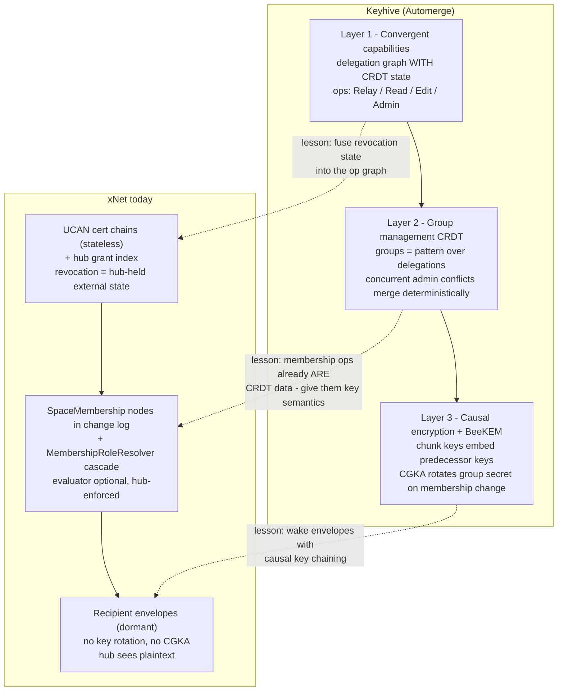
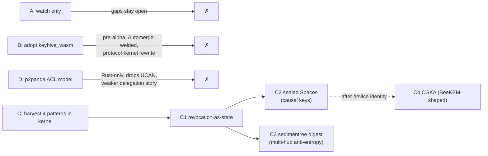

# Keyhive: Local-First Access Control — What xNet Can Learn

> Exploration 0325 · 2026-07-14 · status: unimplemented
>
> Prompt: "explore keyhive and see how it's related to xnet. what can we learn
> from it — https://github.com/inkandswitch/keyhive"

## Problem Statement

xNet's data plane is cryptographically strong at the *change* level — every
change is Ed25519-signed, content-addressed, hash-chained, and LWW-merged with
a grinding-resistant tiebreak — but access control sits almost entirely in the
**honest-hub layer above it**:

- The hub sees **plaintext** for the mainline node/change flow; the
  recipient-envelope E2EE substrate exists but is dormant.
- Member removal is an **ACL decision an honest hub enforces**, not a
  cryptographic fact. A removed member is stopped only by
  `ShareAccessService`, and only when hub auth is actually on.
- UCAN delegation is stateless certificate chains, so **revocation requires
  external state** — and today the external state is "the hub's grant index,"
  which the wildcard-anonymous default neutralizes (0307).
- Multi-hub / zero-knowledge replication (0258) is blocked on **cross-scope
  set reconciliation** the repo doesn't have.

[Keyhive](https://github.com/inkandswitch/keyhive) is Ink & Switch's research
project ("Signal for documents") that attacks exactly these four gaps for
Automerge. Five prior xNet explorations (0081, 0085, 0192, 0258, 0301) already
name Keyhive as prior art or as "the intended path to real E2EE." This
exploration reads Keyhive properly — repo, design specs, dev notebooks,
third-party analysis — and answers: what is actually there, how does it map
onto xNet's architecture, and what should we adopt, harvest, or ignore?

## Executive Summary

**Verdict: do not adopt the crates; harvest four design patterns.** Keyhive is
an actively developed (last push 2026-07-09) but explicitly **pre-alpha** Rust
workspace: "DO NOT use this release in production," no security audit, and its
`design/threat_model.md` is an empty stub. Its sync layer (Beelay) moved to a
separate WIP repo under the Automerge org. Nothing here is a dependency we can
take today — and xNet's kernel is a signed LWW log, not Automerge, so the
integration surface would be a rewrite anyway.

What transfers is the *thinking*. Keyhive's four load-bearing ideas map 1:1
onto xNet's four named gaps:

| Keyhive idea | xNet gap it addresses | Harvest |
|---|---|---|
| **Convergent capabilities** — delegation graph *with CRDT state*, so revocation is native, not external | 0307: wildcard UCAN + revocation needs hub-held state | Model grants/revocations as signed nodes in our own change log (we already half-do this with `SpaceMembership`); make the client-side `PolicyEvaluator` consume them so authz converges without an honest hub |
| **Causal encryption** — chunk keys embed predecessor keys; removal = drop key from *future* derivation; forward secrecy deliberately sacrificed | Dormant `createEncryptedEnvelope`; hub sees plaintext | Wake the envelope substrate for a per-Space "sealed" mode using the same key-chaining trick; accept the same FS tradeoff for the same reason (LWW materialization needs full history) |
| **BeeKEM (CGKA)** — TreeKEM without a central sequencer; concurrent membership ops merge causally | No key rotation, no post-compromise security, removal is ACL-only | Long-term. **Blocked on device identity** (0258 finding): xNet has one Ed25519 key per DID and no rotation. Don't build a CGKA before there are device keys to agree between |
| **Sedimentree + RIBLT** — deterministic DAG chunking + rateless set reconciliation so *blind* servers can sync ciphertext they can't read | 0258: cross-scope set reconciliation missing; zero-knowledge hub designed but not built | Nearest-term concrete win: a sedimentree-style per-Space digest over change hashes gives multi-hub anti-entropy whether or not E2EE ever ships |

The single most transferable sentence in the whole project (also quoted in our
0192): **"the access-control state and the encryption keys must be
co-managed."** xNet currently manages access-control state (membership nodes,
grants) and keys (envelopes, key bundles) in two systems that never touch —
which is why the envelope substrate went dormant and why removal can't be
cryptographic. Every recommendation below is a step toward closing that split.

## Current State In The Repository

Everything below was verified against the working tree (see 0307 for the full
security audit; this section extracts only what the Keyhive comparison needs).

### The strong part: the signed change kernel

- `packages/sync/src/change.ts:44-104` — `Change<T>` v4: content-addressed
  `hash`, `parentHash` chain, `authorDID`, Ed25519 signature over the hash
  (`change.ts:333`), `wallTime` + `lamport`.
- `packages/core/src/lww.ts:91-104` — LWW ordering `lamport → wallTime →
  blake3(author ‖ property ‖ value)` (v4 grinding-resistant tiebreak, 0305).
- Chain/fork/integrity validation in `packages/sync/src/chain.ts` and
  `packages/sync/src/integrity.ts`.

This is structurally the same shape as Keyhive's substrate — a hash-linked DAG
of signed operations — which is precisely why its patterns transfer.

### Identity: one key, no devices, no rotation

- `packages/identity/src/did.ts:8-34` — `did:key`, Ed25519 only; **the DID is
  the public key**. No DID document, no rotation indirection.
- `packages/identity/src/keys.ts:19-44` — key bundle = Ed25519 signing +
  X25519 encryption key, both HKDF-derived from one master seed; the X25519
  key is birationally derived from the Ed25519 key
  (`packages/crypto/src/key-resolution.ts`). One compromise = both planes.
- No device keys, no epochs, no rotation anywhere in
  `packages/identity/src/key-bundle.ts` — 0258 explicitly flags "device
  identity is missing" as a finding.
- Post-quantum hybrid machinery exists (`packages/crypto/src/hybrid-signing.ts`
  et al.) but is not wired into `Change<T>` (0307 open item).

### Authorization: two systems, loosely coupled, hub-enforced

- **UCAN transport authz** — `packages/identity/src/ucan.ts` (full proof-chain
  attenuation, `validateProofChain` at `ucan.ts:104-131`) and
  `packages/hub/src/auth/*`. Known weakness (0307): when `config.auth` is
  falsy the hub mints an anonymous session with `{ with: '*', can: '*' }`
  (`packages/hub/src/auth/ucan.ts:24-28`), and wildcard matching short-circuits
  every capability check (`packages/hub/src/auth/capabilities.ts:94-98`).
  There is **no UCAN revocation list** — revocation is exactly the "external
  state" problem Keyhive names as the structural flaw of certificate
  capabilities.
- **Schema policy engine** — `packages/core/src/auth-types.ts` (roles,
  create/update rungs from 0304, `MembershipRoleResolver` ancestor walk at
  `auth-types.ts:393-409` for the 0181 Space cascade). But the evaluator is
  optional and **defaults to undefined** on the client
  (`packages/data/src/store/store.ts:143,174`,
  `packages/runtime/src/client.ts:115`), so schema authz is a no-op unless
  wired (0307/0304 open item).
- **Hub enforcement** — `packages/hub/src/services/node-relay.ts:152-272`
  verifies hash + signature + wallTime skew, but authorization is only the
  wildcard-satisfiable `hub/relay` capability plus room-level checks in
  `packages/hub/src/ws/authorize.ts:81-220`. The hub verifies *who wrote* a
  change, not *whether they may write it there* at schema level.

### Membership: data, not keys

- Space is the security boundary
  (`packages/data/src/schema/schemas/space.ts:1-17`); membership is
  `SpaceMembership` edge nodes — **ordinary signed changes in the log**. This
  is already "membership ops as a hash-linked op graph," i.e. half of
  Keyhive's convergent-capability design, just without the capability
  semantics or key consequences.
- Removal: `ShareAccessService.isDenied`
  (`packages/hub/src/services/share-access.ts:143`) — deny wins over
  membership, revoked DIDs are refused at
  `packages/hub/src/ws/authorize.ts:107-128`. **Backward-looking, hub-enforced
  ACL**: no key rotation, removed members keep everything already synced, and
  a dishonest/bypassed hub enforces nothing.

### Encryption: real primitives, dormant in the mainline flow

- `packages/crypto/src/envelope.ts` — recipient-scoped encrypted envelopes:
  random content key, XChaCha20-Poly1305
  (`packages/crypto/src/symmetric.ts:29-47`), per-recipient X25519 wrapping,
  `PUBLIC_RECIPIENT` sentinel (`envelope.ts:93-99`). The stated model is
  Keyhive-adjacent already: *"the ability to decrypt IS access control"*
  (`packages/core/src/auth-types.ts:1-6`).
- **No production callers** of `createEncryptedEnvelope`/
  `decryptEnvelopeContent`; only `wrapKeyForRecipient` is used, for Yjs doc
  keys (`packages/sync/src/yjs-authorized-sync.ts:220`). `Change<T>.payload`
  travels and rests in plaintext — the hub even reads
  `change.payload.properties.mentions` server-side
  (`node-relay.ts:218`).
- 0307 open: the envelope signature covers metadata only, **not
  ciphertext/nonce/wrapped keys** (`envelope.ts:167-183`).

### Replication: Space is the unit, reconciliation is missing

- 0258's verdict: Space = replication unit, signed `ReplicationPolicy` node as
  manifest, trusted vs zero-knowledge hub split — with the finding that the
  zero-knowledge substrate "already exists" (envelopes) but collides with
  server-side search, and that **cross-scope set reconciliation** is missing
  (0258 cites Beelay's RIBLT directly).
- Today sync is per-room since-lamport cursors
  (`node-relay.ts:336`, `handleSyncRequest`) — fine for one hub, no
  anti-entropy story for many.

### Prior mentions of Keyhive in this repo

All docs, zero code: 0081/0082/0085 (UCAN evaluation — Keyhive as "convergent
capabilities" prior art), 0192:302-309 (the co-management quote), 0258:265-272
(Beelay/RIBLT for zero-knowledge hubs), 0301:280 (Roomy eyeing Keyhive for
E2EE), `docs/plans/plan03_9_7Authorization/README.md:160`. MLS was evaluated
and rejected/deferred in 0167 and 0313 (via p2panda's DCGKA analysis).

## External Research

### What Keyhive actually is

Repo: `inkandswitch/keyhive` (Apache-2.0, Rust 96%, created 2024-08, last push
2026-07-09 — **active**). Crates: `keyhive_core` (capabilities/delegation),
`beekem` (CGKA), `keyhive_crypto`, `keyhive_wasm` (TS bindings),
plus a `design/` directory of real specs (`causal_encryption.md`,
`convergent_capabilities.md`, `sedimentree.md`, `group_membership.md`, …).
Status per the README, verbatim: "⚠️ DO NOT use this release in production
applications ⚠️ … This code has also not been through a security audit."
Notably, `design/threat_model.md` is an **empty stub**.

The sync server ("Beelay") has moved out to `automerge/beelay` — itself
"very much a work in progress … expect things to be very broken." The
Keyhive README's pointer to an in-repo `beelay-core` is stale. A FOSDEM 2026
talk ("Automerge + Keyhive Design Overview", Brooklyn Zelenka — also a UCAN
spec co-author) frames it as a design overview, not a ship announcement. As of
2026-07 there is **no GA Automerge release with Keyhive integrated**.

### The three-layer architecture (notebook 01)



**Layer 1 — convergent capabilities ("concap").** Positioned explicitly
between object capabilities and certificate capabilities (UCAN/SPKI). The
diagnosis: cert chains are stateless and partition-tolerant, but **revocation
requires external state** — so Keyhive fuses CRDT state into the delegation
graph itself. Every document is a public key; delegations (Relay < Read <
Edit < Admin) and revocations are signed operations in a hash-linked graph
that merges like any CRDT. Revocation becomes native and offline-capable
rather than a bolt-on list some server must hold.

**Layer 2 — groups as a pattern, not a primitive.** A "group" is just a
public key that delegates to member keys. Walking the delegation graph tells a
writer who currently has read access (that's the key-distribution input to
layer 3). Concurrent conflicting ops — two admins revoking each other — are
resolved by deterministic CRDT merge semantics, "the same consistency level as
Automerge," no consensus round, no sequencer. (The team acknowledges the nasty
edge cases — mutual concurrent admin revocation, ops depending on revoked ops,
back-dated ops — still need dedicated write-ups. Not fully solved.)

**Layer 3 — causal encryption.** One key per change is too many keys; one key
per document defeats revocation. Keyhive compresses ranges of changes into
chunks and encrypts each chunk with a key that **embeds the keys of its causal
predecessors**. Holding any `⟨pointer, key⟩` "decryption head" lets you walk
backward and materialize all history from that point. Two deliberate
consequences, stated in `design/causal_encryption.md`:

- **Forward secrecy: no** ("but maybe we could change that?"). Justification:
  a CRDT needs its full causal history to materialize a view, so a legitimate
  member must be able to fetch old chunks anyway; per-op FS key sprawl buys
  nothing. Backward secrecy / post-compromise security: yes (via rotation).
- **New members see all history, by design**: "any agent that has access now
  should automatically have access to all prior history." There is no partial
  or from-now-on grant in the current model.
- **Revocation is future-only**: removal drops the member's key from future
  derivations; it cannot un-reveal what they already decrypted.

### BeeKEM (notebook 02)

A CGKA — continuous group key agreement — derived from MLS's TreeKEM but with
the central Delivery Service removed. TreeKEM requires totally-ordered
membership ops (a sequencer); BeeKEM needs only **causal order**. The
mechanism: a binary tree with member DH keys at leaves and derived secrets at
inner nodes; the root is the group secret. Concurrent updates to the same node
don't pick a winner — the node keeps **conflict keys** (all competing values),
and later ops resolve deterministically via "highest non-blank descendants,"
which specifically prevents an adversary from riding a stale key through a
merge. Removal blanks the leaf *and its whole path to root*, forcing a re-key.
Typical cost O(log n); worst case O(n) under adversarial concurrency/blanking.
Avoids the exotic crypto (BLS) that the prior academic "Causal TreeKEM"
needed — plain DH + BLAKE3.

### Sedimentree + RIBLT: sync a server can't read (notebook 05)

The problem statement is one xNet will hit verbatim: once content is E2EE, a
sync server can no longer compress plaintext for cheap initial sync — it only
ever sees graph shape and ciphertext, so naive designs force it to hold the
entire commit DAG in memory to answer "what am I missing?"

- **Sedimentree**: recursively compress ranges of the hash-DAG into "strata"
  (older history → deeper, larger strata; recent ops stay "loose commits").
  Chunk boundaries are chosen by counting trailing zeros in each commit hash
  (geometric levels, à la Merkle search trees), and the traversal runs
  **heads→root along parent pointers** — parent links never change under
  concurrent appends, so divergent peers compute identical chunk boundaries
  with zero coordination. Sync = exchange a small strata summary, diff,
  fetch only missing content-addressed blobs. Stateless RPC, progress bars,
  pause/resume.
- **RIBLT** (rateless invertible Bloom lookup tables): set reconciliation for
  the membership-op graph where cost is proportional to the *difference*, not
  the set (~7.5 symbols ≈ 240 bytes to reconcile a 5-element diff between
  billion-item sets).
- Composition (Beelay): membership ops sync via RIBLT; doc content syncs as
  sedimentree-chunked ciphertext; common case is two round trips. **Metadata
  leakage is bounded, not eliminated** — the blind server still sees doc IDs,
  DAG shape, chunk boundaries, timing. The spec is honest that this is an
  inherent tension.

### Third-party signal

- **KIT formal-verification paper** (Jacob, Stuber, Hartenstein,
  arXiv:2604.23560): builds capability semantics "inspired by Keyhive,"
  verifies three invariants (authorization/query/revocation safety) in
  Rust+Verus — but for a *simplified* model, and it classifies Keyhive and
  p2panda as research-phase. Its cautionary tale: Matrix, widely deployed,
  shipped a spec update violating its own security invariants — capability
  CRDTs are exactly the kind of code that needs verification before trust.
- **p2panda** (which we compared in 0313) is building the *other* shape of the
  same idea: an ACL/guest-list CRDT plus group encryption
  (`p2panda-auth`/`p2panda-encryption`/`p2panda-spaces`), NLnet-funded. Their
  own words: "different from building a convergent capability-based CRDT,
  like in Keyhive … [but] the CRDT parts are fairly similar." Two independent
  teams converging on "membership ops as a CRDT + group keys" is meaningful
  validation of the direction.
- Landscape rhyme: Jazz (CoJSON groups/roles) and DXOS HALO sit closer to the
  ACL end; Keyhive is the delegation-graph end; xNet's `SpaceMembership` +
  role resolvers are structurally an ACL CRDT *without key consequences*.

## Key Findings

1. **xNet already has Keyhive's substrate.** A signed, hash-linked op DAG with
   deterministic merge (LWW v4) is exactly what Keyhive builds on. Membership
   is *already* expressed as signed ops in that log (`SpaceMembership`). The
   delta is semantics, not plumbing: xNet's membership ops move ACL data;
   Keyhive's move capability + key state.

2. **Keyhive's core diagnosis applies to xNet verbatim.** "Certificate
   capabilities can't revoke without external state" is precisely 0307's
   wildcard-UCAN finding: xNet's revocation state lives in the hub's grant
   index, so authz only exists where the hub is honest and configured. The
   fix direction — move grant/revocation state into the replicated op graph
   and evaluate it client-side — is Keyhive's layer 1, and xNet's
   `PolicyEvaluator` + membership nodes are 70% of it already built (just
   unwired: `authEvaluator` defaults to undefined).

3. **Causal encryption's tradeoffs are the right ones for xNet too.** Both
   systems must materialize full history (LWW log ≙ Automerge history), so
   forward secrecy buys nothing while costing key sprawl — Keyhive's explicit
   FS sacrifice + full-history-for-new-members stance is the honest version
   of what any xNet sealed mode would end up doing. We should adopt the
   *stance* (document it) along with the mechanism (chunk keys embedding
   predecessor keys — which also fixes "one key per node forever," the
   current envelope design's weakness).

4. **BeeKEM is the right long-term shape but xNet lacks its prerequisites.**
   A CGKA agrees keys **between devices**; xNet has no device identity, no
   key rotation, and derives its X25519 key from the same seed as its signing
   key. Building a CGKA before device DIDs exist would be scaffolding on
   sand. 0258 already lists device identity as the missing primitive —
   BeeKEM strengthens the case but doesn't change the ordering.

5. **Sedimentree is valuable to xNet even without E2EE.** Cross-scope set
   reconciliation is 0258's named blocker for multi-home sync, plaintext or
   not. The two design tricks — reverse (heads→root) traversal for stable
   chunk boundaries, and trailing-zero hash levels for coordination-free
   boundary choice — port directly to xNet's per-Space change sets. This is
   the nearest-term, lowest-risk harvest.

6. **Keyhive is not adoptable as a dependency, and won't be soon.** Pre-alpha,
   no audit, empty threat model, WIP sync repo, unresolved concurrency edge
   cases (mutual admin revocation etc.), and it's welded to Automerge's
   binary format at the chunk-compression layer. Also: xNet deliberately
   isn't Automerge (0200 — the kernel is a signed LWW log with golden
   vectors). Rust/WASM bindings exist (`keyhive_wasm`) but wrapping a
   pre-audit capability system would import risk, not remove it.

7. **The co-management principle is the unifying lesson.** xNet's
   access-control state (membership/grants) and its encryption keys
   (envelopes/bundles) are two systems that never touch — which is why
   envelopes went dormant and removal can't have key consequences. Keyhive's
   layers exist precisely to couple them: the delegation graph *is* the key
   distribution input. Every step below increases that coupling.

## Options And Tradeoffs

### Option A — Do nothing (keep watching)

Keyhive stays a reference in docs; we revisit yearly.

- **Pros**: zero cost; the project is pre-alpha, so waiting is defensible.
- **Cons**: the wildcard-UCAN hole and plaintext hub remain; 0258 multi-home
  stays blocked on reconciliation; we learn nothing operationally. The gaps
  are *ours*, independent of Keyhive's maturity.

### Option B — Adopt `keyhive_wasm` as the auth/encryption layer

Bind the Rust crates via WASM; map Spaces to Keyhive groups, changes to chunks.

- **Pros**: whole coherent design (concap + CGKA + causal encryption) at once;
  free ongoing research from Ink & Switch.
- **Cons**: pre-alpha, unaudited, empty threat model, unstable APIs;
  chunk-compression is Automerge-format-specific; xNet's protocol kernel is
  hash-frozen with golden vectors (0305 taught us protocol bumps ripple 4
  conformance kernels) — grafting a foreign capability system onto it is a
  major-version event for every fixed-core package; WASM in the worker path
  complicates the OPFS/SQLite story (0262). **Rejected for now.**

### Option C — Harvest patterns, build in-kernel (recommended)

Implement the four lessons natively over xNet's existing change log and
envelope substrate, in dependency order: revocation-as-state → sealed Spaces
(causal keys) → sedimentree digests → (later, post-device-identity) CGKA.

- **Pros**: each phase is independently shippable and valuable; stays inside
  the audited-by-us TS kernel; closes 0307/0304/0258 open items on the way;
  no bet on a pre-alpha dependency; keeps the trusted-hub mode (search,
  indexes) as a first-class sibling of sealed mode, which Keyhive can't offer.
- **Cons**: we re-derive designs a research lab is still debugging — the KIT
  paper is a warning that capability CRDTs hide invariant-violating edge
  cases; we own the threat model (though Keyhive's is literally empty, so we
  own it either way); more total engineering than B *if* B ever stabilizes.

### Option D — p2panda-style ACL CRDT instead of delegation graphs

0313's comparison partner is building the guest-list variant of the same idea.

- **Pros**: conceptually closer to xNet's existing `SpaceMembership` + role
  model than delegation chains; simpler to reason about; their encryption
  work (DCGKA, 2SM) is further along conceptually for messaging-shaped data.
- **Cons**: Rust-only (0313 verdict: no code integration); loses UCAN
  compatibility, which xNet already has working proof-chain attenuation for;
  delegation ("share this subtree with attenuated rights, offline") is a
  product requirement Spaces sharing already implies. **Take their published
  edge-case analyses, not their architecture.**



## Recommendation

**Option C: watch the project, harvest the patterns, in this order.**

**C0 — Close the perimeter first (prerequisite, already tracked in 0307).**
None of the crypto below matters while an anonymous wildcard session satisfies
every hub check and `authEvaluator` is unwired. The 0307 open items —
least-privilege per-room UCANs, `aud === hubDid` enforcement, envelope
signature covering ciphertext, wiring `authEvaluator` by default — are the
entry fee. This exploration adds urgency, not new work items, there.

**C1 — Revocation as replicated state (the concap lesson).** Introduce a
signed `CapabilityGrant` / `CapabilityRevocation` node pair (TaggedError-era
conventions, ordinary changes in the Space's log) that the client-side
`PolicyEvaluator` and the hub's grant index *both* derive from, instead of the
hub being sole owner of grant state. Result: two offline peers who sync
directly still converge on "Alice was revoked," UCAN chains get a native
revocation check (`isRevoked(delegationHash)` against replicated state,
closing 0307's "UCAN revocation list" item), and the hub becomes an enforcer
of state it replicates rather than the source of truth. Design the merge
semantics deterministically (our LWW + explicit deny-wins, mirroring
`ShareAccessService`'s deny-wins rule) and steal the KIT paper's three
invariants — authorization safety, query safety, revocation safety — as the
property-test suite.

**C2 — Sealed Spaces via causal key chaining (the causal-encryption lesson).**
Wake `createEncryptedEnvelope` for an opt-in per-Space `sealed: true` mode:
changes are batched into chunks (we already batch: `change.ts` batch fields),
each chunk gets a fresh content key, and each chunk's plaintext header embeds
its causal-predecessor chunk keys. Keys are wrapped to current members' X25519
keys per the existing envelope code; membership change ⇒ next chunk derives
without the removed member. Document the Keyhive stance verbatim in the spec:
no forward secrecy (full-history materialization makes it pointless), new
members read all history, revocation is future-only. The hub relays and
stores ciphertext blobs it cannot read — 0258's zero-knowledge hub, with
search/index explicitly unavailable for sealed Spaces (trusted-hub Spaces
remain the default).

**C3 — Sedimentree-style Space digests (the sync lesson, independent of
E2EE).** Add a
per-Space reconciliation digest over change hashes: level = trailing zeros of
the change hash, chunk boundaries computed heads→root along `parentHash` (the
pointer that never changes), summaries exchanged before since-lamport catch-up.
This unblocks 0258 multi-home anti-entropy for plaintext hubs immediately and
is the transport sealed Spaces will need anyway. Skip RIBLT initially — xNet
set differences are per-Space and modest; add it only if digest diffs measure
too chatty.

**C4 — CGKA, deferred behind device identity.** File as future work gated on:
stable device DIDs, separation of signing and encryption key lineages (stop
deriving X25519 from the Ed25519 seed), and rotation plumbing in the key
bundle. When those exist, a BeeKEM-shaped CGKA (causal-order-only, conflict
keys, plain DH + BLAKE3) upgrades C2 from "removal = future chunks" to real
post-compromise security. Do not start this first.

```mermaid
sequenceDiagram
    participant O as Owner (admin)
    participant H as Hub (blind for sealed Space)
    participant M as Member Bob (later removed)
    Note over O,M: C2 sealed Space — causal key chaining
    O->>O: chunk k1 = enc(changes 1..n, key K1)
    O->>H: ciphertext(k1) + K1 wrapped to {O, Bob}
    H->>M: relay (hub cannot read)
    M->>M: unwrap K1, materialize history
    Note over O,M: Bob removed — membership revocation node syncs (C1)
    O->>O: chunk k2 header embeds K1; fresh K2
    O->>H: ciphertext(k2) + K2 wrapped to {O} only
    H->>M: relay k2 (hub still enforces ACL too)
    M--xM: cannot unwrap K2 — future-only revocation
    Note over M: Bob keeps k1 plaintext he already had (accepted, documented)
```

## Example Code

Sketch of the C2 chunk-key chaining over the existing envelope substrate (not
final API; shows the co-management coupling):

```ts
import { createEncryptedEnvelope, wrapKeyForRecipient } from '@xnetjs/crypto';
import { blake3 } from '@noble/hashes/blake3';

interface SealedChunk {
  spaceId: string;
  /** hashes of causal-predecessor chunks (heads at seal time) */
  parents: string[];
  /** predecessor content keys, encrypted under THIS chunk's key —
   *  holding a decryption head lets you walk backward (Keyhive
   *  causal_encryption.md pattern) */
  ancestorKeys: Uint8Array; // enc(K_parents[], key = K_this)
  ciphertext: Uint8Array;   // enc(changes[], key = K_this)
  /** K_this wrapped per current member — derived from the SAME
   *  membership state the PolicyEvaluator reads (C1), never a
   *  separate recipient list: this is the co-management rule */
  wrappedKeys: Record<string /* memberDid */, Uint8Array>;
}

async function sealChunk(
  changes: Change<unknown>[],
  parents: SealedChunk[],
  members: ReadonlyArray<{ did: string; x25519Pub: Uint8Array }>, // ← from replicated grant state, post-revocation
): Promise<SealedChunk> {
  const contentKey = crypto.getRandomValues(new Uint8Array(32));
  // … encrypt changes + parent keys with contentKey (XChaCha20-Poly1305),
  // wrap contentKey for each CURRENT member; sign the WHOLE structure
  // including ciphertext + nonce (fixes the 0307 envelope-signature gap).
}
```

And the C3 boundary rule (coordination-free, straight from sedimentree):

```ts
/** stratum level of a change = trailing zero bits of its hash */
function chunkLevel(changeHash: Uint8Array, base = 2): number {
  let zeros = 0;
  for (const byte of changeHash) {
    if (byte === 0) { zeros += 8; continue; }
    zeros += Math.clz32(byte) - 24; break; // leading zeros of the byte
  }
  return Math.floor(zeros / Math.log2(base));
}
// Traverse heads→root along parentHash (stable under concurrent appends);
// close a chunk whenever level(change) >= currentStratumLevel.
```

## Risks And Open Questions

- **Capability-CRDT edge cases are genuinely unsolved.** Mutual concurrent
  admin revocation, ops depending on revoked ops, back-dated ops — Keyhive's
  own team defers these to future write-ups. C1 must pick deterministic
  answers (deny-wins + LWW is our default posture) and property-test them
  against the KIT invariants; expect to find bugs the way Matrix did.
- **Sealed mode kills hub search/index for those Spaces** (0258 named this
  collision). Product must present sealed as a deliberate tradeoff toggle,
  not a default. Open: can per-Space client-side indexes (we already have
  wa-sqlite locally) make this a non-issue for realistic Space sizes?
- **Metadata still leaks in sealed mode**: Space IDs, DAG shape, chunk sizes,
  member counts (wrapped-key counts!), timing. Keyhive accepts the same;
  we should write the (non-empty) threat model they didn't.
- **One-key identity is a standing hazard for C2.** Wrapping content keys to
  an X25519 key derived from the signing seed means one leaked seed = both
  read *and* write compromise, with no rotation path. C2 without C4 is
  meaningfully weaker than Keyhive's full stack — ship it labelled as such.
- **Chunking vs LWW granularity.** Keyhive chunks compressed Automerge runs;
  our unit is per-property LWW changes. Chunk boundaries that split an LWW
  causal neighbourhood could force wide fetches to materialize one node.
  Needs measurement against 0318's scale data (10M-row behaviour).
- **Numbering/monitoring**: Keyhive is moving (weekly commits); revisit the
  `automerge/beelay` repo and notebook 06+ in ~2 quarters — especially if the
  threat model gets written or an audit lands, which would reopen Option B
  for the CGKA crate (`beekem` is cleanly factored).

## Implementation Checklist

- [ ] **C0** Finish 0307 perimeter items (wildcard UCAN → least-privilege,
      `aud === hubDid`, envelope signature over ciphertext, wire
      `authEvaluator` by default) — tracked there, prerequisite here.
- [ ] **C1** Design doc: `CapabilityGrant`/`CapabilityRevocation` node schemas
      + deterministic merge semantics (deny-wins, LWW v4 ordering) in
      `packages/data/src/schema/schemas/`.
- [ ] **C1** Derive `ShareAccessService` grant index and client
      `PolicyEvaluator` from the same replicated grant/revocation nodes;
      remove hub-only grant state.
- [ ] **C1** UCAN revocation check against replicated revocation nodes
      (`isRevoked(delegationHash)`) in `validateProofChain` and hub
      `authenticateConnection`.
- [ ] **C1** Property-test suite encoding the KIT invariants (authorization /
      query / revocation safety) incl. mutual-admin-revocation and
      revoked-dependency cases.
- [ ] **C2** Spec: sealed-Space chunk format (parents, ancestorKeys,
      wrappedKeys), signature over full structure, FS/full-history stance
      documented; wire into `packages/crypto/src/envelope.ts` lineage.
- [ ] **C2** `sealed: true` Space option; membership-change ⇒ key-set change
      driven by C1 state; hub stores/relays ciphertext blobs for sealed rooms
      without payload inspection (skip `mentions` parse at
      `node-relay.ts:218` for sealed).
- [ ] **C2** Adversarial tests: removed member cannot read post-removal
      chunks; hub cannot read sealed payloads; ciphertext-swap rejected
      (signature covers ciphertext).
- [ ] **C3** Per-Space sedimentree digest (trailing-zero levels, heads→root
      chunking) + summary exchange in `handleSyncRequest`
      (`packages/hub/src/services/node-relay.ts`).
- [ ] **C3** Multi-hub anti-entropy test: two hubs with divergent per-Space
      sets converge via digest diff, byte cost ∝ difference.
- [ ] **C4** File follow-up exploration: device DIDs + key rotation + split
      signing/encryption lineages, then BeeKEM-shaped CGKA (gated, do last).
- [ ] Set a reminder to re-review `inkandswitch/keyhive` + `automerge/beelay`
      + notebook 06+ (~2026-Q4): audit? threat model written? Beelay stable?

## Validation Checklist

- [ ] Two clients that sync only peer-to-peer (hub offline) converge on a
      revocation and both deny the revoked DID (C1 — authz without an honest
      hub).
- [ ] Wildcard-anonymous hub session can no longer read or write a sealed
      Space (C2 defeats the 0307 neutralization for sealed content).
- [ ] Hub disk inspection of a sealed Space shows ciphertext only; no
      plaintext properties, no parsed mentions.
- [ ] Removed member's client, replaying all traffic post-removal, cannot
      materialize any post-removal change; CAN still read pre-removal history
      it already held (documented behaviour, asserted in test).
- [ ] New member added to a sealed Space materializes full history from a
      single decryption head (causal walk works).
- [ ] Digest-based sync between two hubs transfers bytes proportional to the
      set difference (measured), and produces identical per-Space change sets
      (hash-set equality).
- [ ] KIT-invariant property tests green under randomized concurrent
      membership op interleavings (fast-check or equivalent).
- [ ] Golden vectors for the change kernel unchanged — none of C1–C3 bumps
      `CURRENT_PROTOCOL_VERSION` without the 0305-documented 4-kernel ripple
      being budgeted.

## References

- Keyhive repo: <https://github.com/inkandswitch/keyhive> (crates:
  `keyhive_core`, `beekem`, `keyhive_crypto`, `keyhive_wasm`; `design/` specs)
- Design specs: `design/causal_encryption.md`,
  `design/convergent_capabilities.md`, `design/sedimentree.md`,
  `design/threat_model.md` (empty stub — noted above)
- Dev notebooks: <https://www.inkandswitch.com/keyhive/notebook/> — 00
  Background, 01 Welcome (three layers), 02 BeeKEM, 04 Pre-Alpha, 05 Syncing
  Keyhive
- Beelay (sync, moved out): <https://github.com/automerge/beelay>
- FOSDEM 2026 — "Automerge + Keyhive Design Overview" (B. Zelenka):
  <https://fosdem.org/2026/schedule/event/BZ9CAE-automerge/>
- Jacob, Stuber, Hartenstein — "Towards System-Oriented Formal Verification
  of Local-First Access Control": <https://arxiv.org/html/2604.23560>
- RECAP 2025 talk: <https://recapworkshop.online/recap25/contributions/8-keyhive.html>
- p2panda group encryption + access-control CRDT:
  <https://p2panda.org/2025/02/24/group-encryption.html>,
  <https://p2panda.org/2025/08/27/notes-convergent-access-control-crdt.html>
- UCAN spec: <https://github.com/ucan-wg/spec>
- Related xNet explorations: 0081/0085 (UCAN evaluation), 0192 (schema authz —
  co-management quote), 0258 (multi-home sync, zero-knowledge hubs, RIBLT),
  0301 (ATProto — Keyhive as the E2EE path), 0304 (CRUD authz split), 0305
  (LWW v4 tiebreak), 0307 (node/change flow security audit), 0313 (p2panda)
