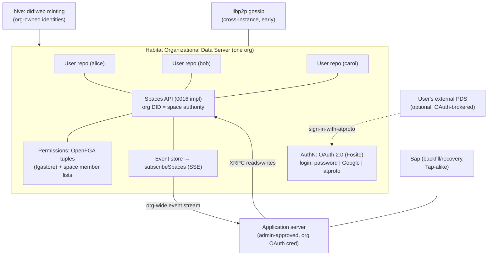
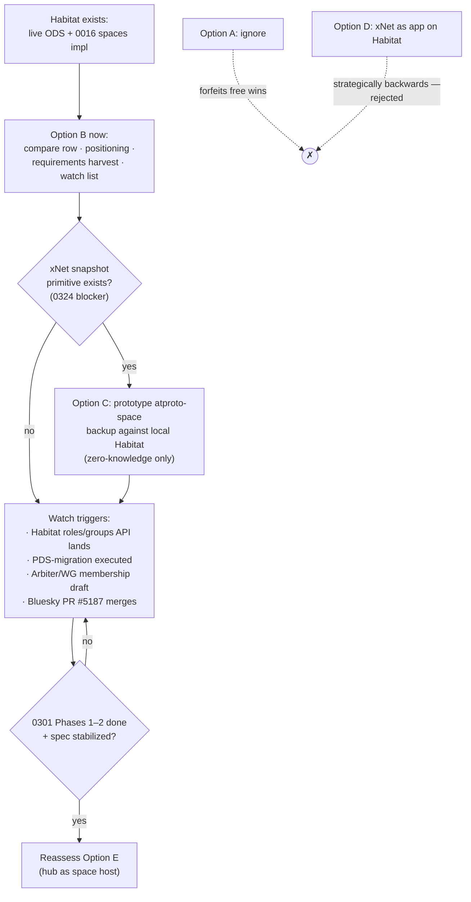
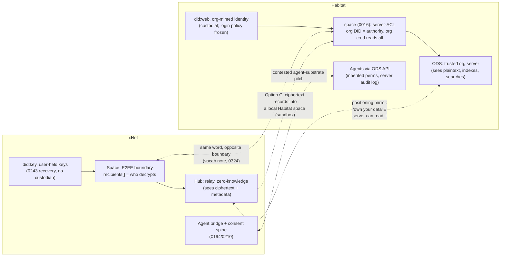

# Habitat (habitat.network): The Organizational Data Server, And How It Relates To xNet

## Problem Statement

[habitat.network](https://habitat.network/) pitches itself as "an open-source
**data ownership layer for organizations**, so your data works better for
you" — vendor lock-in, clunky cross-app workflows, and incompatible
permissions "a thing of the past," with **self-describing, LLM-friendly
data** and "a governed substrate" for **agents** to read from and write to.

That is, almost word for word, xNet's own pitch. Two projects claiming the
same territory ("the org's data layer under the apps") with radically
different architectures is worth understanding precisely:

1. What is Habitat actually — architecture, primitives, maturity, team?
2. Where does it overlap, complement, or compete with xNet?
3. Habitat was already named in
   [0324](0324_%5B_%5D_ATPROTO_PERMISSIONED_PRIVATE_DATA_AND_XNET.md) as one
   of three parallel implementations of atproto's `0016-permissioned-data`
   proposal — does its existence change any of 0324's conclusions or
   triggers?
4. What should xNet harvest, watch, integrate with, or position against?

## Executive Summary

**Habitat is AT Protocol re-plumbed for organizations.** Its core artifact
is the **Organizational Data Server (ODS)** — a PDS-analog where *the
organization*, not the individual, is the hosting entity: all member
repositories live (conceptually) on one org-owned server, member identities
are `did:web` DIDs **minted by the org**, permissions are Zanzibar-style
relationship tuples backed by an **embedded OpenFGA** store, apps consume a
single org-wide SSE event stream instead of crawling per-user repos, and an
**org-level OAuth credential can read every space on the server**. It is
Apache-2.0, Go + TypeScript, founded ~Nov 2025 by Arushi Bandi (ex-Figma
infra), ~25 GitHub stars, pushed the day of writing — early but very much
alive, and named on the official atproto Spring 2026 roadmap as a parallel
implementer of permissioned data.

**The relationship to xNet is the 0324 pattern repeated one level up:
convergent pitch, inverted trust.** Habitat and xNet agree on the diagnosis
(orgs need data, identity, and permissions that outlive any single app and
any single member; agents need a governed substrate) and disagree on the
axiom. Habitat's answer is a **trusted org server**: plaintext at the host,
enforcement at the API, org admin as root authority — authorization-rich,
confidentiality-zero (from the server's perspective). xNet's answer is
**E2EE envelopes** ([`packages/crypto/src/envelope.ts`](../../packages/crypto/src/envelope.ts)):
the hub never sees plaintext, membership drives who can *decrypt* —
confidentiality-rich, authorization currently weak (the wildcard-UCAN hole,
[0307](0307_%5B_%5D_SECURITY_OF_NODE_AND_CHANGE_FLOW.md)). Habitat
concentrates trust in exactly the place xNet's design refuses to put it.
That makes Habitat xNet's cleanest *positioning foil*: same category, same
buyer, opposite trust posture.

**The one materially new fact vs 0324: a live `0016` spaces implementation
now exists.** 0324's Option B (encrypted Space backup into an atproto
permissioned space) was trigger-gated on "PR #5187 merges + a sandbox
exists." Habitat has already shipped the proposal's API surface —
`getSpaceCredential`, `putRecord`, `listRepoOps`, `registerNotify`,
`notifyWrite` — as working endpoints on a self-hostable Apache-2.0 server
([`api/habitat/space_*.go`](https://github.com/habitat-network/habitat/tree/master/api/habitat)).
The sandbox half of the trigger is effectively satisfiable today by running
Habitat in Docker, *before* Bluesky's reference implementation merges. The
snapshot-primitive prerequisite on xNet's side remains the actual blocker.

**Recommendation: watch + harvest + one cheap seam; no integration, no
panic.** Habitat is pre-1.0 with explicit breaking-change warnings, has
already deprecated its own first protocol (cliques/pear) once, and plans
another migration (org-hosted spaces → user PDSes) when upstream stabilizes
— building on it now would repeat the mistake 0301 warned about. Concretely:
(a) add Habitat to the compare page's Protocols layer
([`site/src/data/compare.ts`](../../site/src/data/compare.ts)) — it is the
most on-pitch adjacent project not yet listed; (b) record the positioning
line: *Habitat is the trusted-server data layer for orgs; xNet is the E2EE
one — "private even from the server"*; (c) note Habitat's
**relationship-tuples-as-records** (OpenFGA model, org-owned, synced like
data) as a second production datapoint — alongside Arbiter — for how xNet's
Space roles could interoperate; (d) when 0324's snapshot primitive exists,
use a local Habitat instance as the `atproto-space` prototype sandbox rather
than waiting for Bluesky.

## Current State In The Repository

### The xNet counterparts to each Habitat layer

| Habitat primitive | xNet counterpart | Where |
|---|---|---|
| ODS (org-owned data server) | Hub (relay + storage, zero-knowledge posture) | [`packages/hub/src/server.ts`](../../packages/hub/src/server.ts), `ws/`, `services/` |
| Org-minted `did:web` member identity | Self-sovereign `did:key` (Ed25519), account devices | [`packages/crypto/src/key-resolution.ts`](../../packages/crypto/src/key-resolution.ts), 0243 |
| Permissioned space (0016 impl, org DID as authority) | Space = security + replication boundary, E2EE | [`packages/data/src/schema/schemas/space.ts`](../../packages/data/src/schema/schemas/space.ts), [`packages/runtime/src/sync/replication-scope.ts`](../../packages/runtime/src/sync/replication-scope.ts) |
| OpenFGA relationship tuples (`fgastore`) | Membership edges → roles → `computeRecipients` + schema `authEvaluator` | [`packages/data/src/auth/recipients.ts`](../../packages/data/src/auth/recipients.ts), [`packages/data/src/schema/schemas/space-authorization.ts`](../../packages/data/src/schema/schemas/space-authorization.ts), 0304/0192 |
| Org-wide SSE event stream (`subscribeSpaces`) | Hub WS rooms + per-space change relay | [`packages/hub/src/ws/`](../../packages/hub/src/ws), 0276 kernel |
| Sap (backfill/recovery crawler, Tap-alike) | Sync manager cursor replay + (future) LtHash note from 0324 | [`packages/runtime/src/sync/MultiHubSyncManager.ts`](../../packages/runtime/src/sync/MultiHubSyncManager.ts), 0272 |
| Lexicons (`network.habitat.*`) | Schema registry (self-describing, extensible) | [`packages/data/src/schema/`](../../packages/data/src/schema), 0188 |
| CRDT docs lexicon + docs demo app | BlockNote editor on `content-v4` + change log | 0312, [`packages/data`](../../packages/data) |
| Agent pitch: "governed substrate, inherited permissions, auditability" | Agent bridge `:31416` + `@xnetjs/devkit`, `defineConnector`, consent spine | 0194, 0196, 0210 |
| Admin-approved apps (org OAuth consent) | Plugin trust + marketplace guardrails (`@xnetjs/trust`, `guardStore`) | 0194, 0192 |

Two structural absences worth naming:

- **xNet has no "organization" primitive.** The Space is the top of the
  authorization hierarchy
  ([`space.ts:4-15`](../../packages/data/src/schema/schemas/space.ts) —
  "a Space is a SECURITY BOUNDARY", nesting inherit-down). There is no
  entity that (a) mints/outlives member identities, (b) fixes a login
  policy, (c) owns all spaces beneath it. Habitat's whole thesis is that
  orgs need exactly that entity. xNet's implicit answer is "the hub operator
  + the owner role," which is thinner — deliberately (identity is
  user-held), but the gap in *offboarding/continuity semantics* is real:
  when a member leaves an org in Habitat, their repo and its data stay with
  the org; in xNet, re-wrapping envelopes on revoke
  ([`envelope.ts:303-327`](../../packages/crypto/src/envelope.ts)) removes
  future access but authored content's key material history is the user's.
- **xNet's authz enforcement is still the 0307 hole.** Habitat runs a real
  OAuth 2.0 server (Fosite) with scoped credentials and admin-approved
  apps; xNet's standard client still self-issues a wildcard UCAN
  ([`use-hub-auth-token.ts:10-16`](../../packages/react/src/provider/use-hub-auth-token.ts))
  that short-circuits
  [`authorize.ts:146-158`](../../packages/hub/src/ws/authorize.ts). Every
  comparison in this doc that says "Habitat has authorization" lands on
  that open item.

### Prior explorations this builds on

- [0301](0301_%5B_%5D_ATPROTO_INTEGRATION_IDENTITY_SYNC_AND_HUB_AS_PDS.md) —
  atproto integration phasing (identity → publish → hub-as-PDS).
- [0322](0322_%5B_%5D_SIGN_IN_WITH_ATPROTO_BLUESKY_AND_ANY_PDS_AS_AUTH.md)
  (branch `claude/atprotocol-bluesky-auth-02ff5d`) — sign-in-with-atproto;
  Habitat ships this exact door (login provider `pds`) in production shape.
- [0324](0324_%5B_%5D_ATPROTO_PERMISSIONED_PRIVATE_DATA_AND_XNET.md)
  (branch `claude/atprotocol-private-data-xnet-c4ba63`) — the 0016 proposal
  deep-dive; Habitat is one of its three named parallel implementations.
- [0313](0313_%5B_%5D_P2PANDA_COMPARE_PAGE_AND_INTEGRATION.md) — precedent for
  "adjacent-protocol exploration → compare.ts row, no code integration."

## External Research

Status legend: **[SHIPPED]** live in Habitat's repo/hosted instance ·
**[WIP]** documented as in-progress · **[PLANNED]** stated intent ·
**[DEPRECATED]** shipped then retired.

### The project

- **Org & team.** Founded by **Arushi Bandi** (CEO/co-founder, previously
  infrastructure engineering at Figma). Public presence at DWeb Camp,
  Local-First Conf, and the Community Privacy Residency; reachable at
  `@habitat.network` on Bluesky. Repo `habitat-network/habitat` created
  2025-11-17, **Apache-2.0**, ~636 commits, 25 stars, pushed 2026-07-14
  (the day of this exploration) — small but genuinely active.
- **Stack.** Go (54%) + TypeScript (40%) monorepo managed by moonrepo;
  React 19 / TanStack / Tailwind 4 frontend; Docusaurus API docs generated
  from lexicons; Astro marketing site; Docker-based self-hosting
  **[SHIPPED]** plus managed hosting at `<org>.id.habitat.network`.

### The Organizational Data Server (ODS)

The [architecture docs](https://github.com/habitat-network/habitat/tree/master/api-docs/docs)
define the ODS as "much like a Personal Data Server in AT Protocol, but with
the 'organization' distinction":

- **All member repositories hosted (conceptually) on one org server** so
  "member data and identities persist beyond the lifetime that a member may
  be in the organization." The org is "an entity separate and larger than
  any particular member," and **all data ties to the org entity, not to
  users**. **[SHIPPED]**
- **Repositories are private-only.** They use atproto's repo/data model
  (records = Lexicon JSON, blobs content-addressed) but "do not support
  public data at this time and hence do not implement `#atproto_PDS`."
  Habitat inverted atproto's ordering: private-first, public later.
  **[SHIPPED]**
- **Identity: `did:web`, org-minted.** Org DID =
  `did:web:<org>.id.habitat.network`; member DIDs and handles
  (`alice.acmecorp.id.habitat.network`) are created *by the org* at join
  time (`org_mintMemberIdentity`). DID docs carry a single `#habitat`
  service. Login method (password / Google / **sign-in-with-atproto**) is
  chosen once per org and is **final**. **[SHIPPED]**
- **Permissions: embedded OpenFGA.** `internal/fgastore` wraps a
  Zanzibar-style relationship store; `relationship_*` XRPC endpoints
  (writeTuple, check, listObjects/Subjects) expose user–relation–object
  tuples; the roadmap is to encode roles/groups/inheritance **as org-owned
  records**, "consistent across applications, rather than redefined by each
  application" — developed "in conversation with other teams in AT Protocol
  building community and group infrastructure" (i.e. the same
  Arbiter/Private-Data-WG orbit 0324 tracks). **[SHIPPED store / WIP roles API]**
- **Spaces: a live implementation of `0016-permissioned-data`.** All user
  data writes go through `network.habitat.space.putRecord`; spaces carry
  member lists (`addMember`/`removeMember`); the endpoint set mirrors the
  proposal exactly (`getSpaceCredential`, `listRepoOps`, `listRepos`,
  `registerNotify`, `notifyWrite`, deniable-commit machinery per the
  diaries). Habitat states it implemented against the proposal PR "close
  enough to what will become the finalized one," planning forward-compatible
  migration. **Key departure: every space's owner/authority is the org's
  DID** (the creating user becomes a space admin), and therefore **"an
  OAuth credential for the org's DID is valid for applications to read
  permissioned data"** across the whole org. **[SHIPPED]**
- **Sync: org-wide stream + Sap.** Instead of apps crawling per-user repos,
  the ODS provides `subscribeSpaces` — one SSE event stream for the entire
  org (`internal/events` append-only store + `internal/sync` SSE endpoint).
  **Sap** is their Tap-analog: a standalone Go binary/library embedded in
  application servers, handling backfill and desync recovery by crawling
  member repos and following the event stream. `internal/p2p` adds a
  libp2p-based peer registry/gossip for **cross-instance data requests**
  — the seed of ODS↔ODS federation. **[SHIPPED stream / WIP Sap / early p2p]**
- **OAuth everywhere.** The ODS runs a Fosite-based OAuth 2.0 server that
  also *brokers* to a user's external PDS OAuth (`pdsclient` with DPoP,
  encrypted PDS credential storage). Apps must be **admin-approved** to get
  an org-identity credential. **[SHIPPED / consent-flow WIP]**
- **History: cliques → pear → spaces.** Habitat first designed its own
  permissioned-data protocol ("cliques," served by **pear** — the
  *permission-enforcing AT Protocol repository*, their main app server).
  With the ecosystem converging on 0016, cliques are **[DEPRECATED]**, data
  is migrating to the spaces API, and the docs state the plan to migrate
  space data "to users' PDS'es once spaces is merged and widely supported,"
  after which "Habitat will only support Organizational Data Servers."
  One pivot already executed, another pre-announced — the spec ground is
  still moving under them, by their own admission.
- **Apps so far.** The frontend is the org/instance management plane
  (create/join org, permissions by collection and by person, spaces, data
  browser); `typescript/apps/docs` is a collaborative document-editing demo
  with CRDT + markdown doc lexicons (`network.habitat.docs.*`). Community
  lexicons for calendar events/RSVPs and locations are vendored. No
  published npm packages or protocol spec document yet.

### Positioning language (their landing page)

Three pillars, each with an xNet echo: **data integration** (any data type
from any application, no silos), **permissions & identity** ("lifetime
identity management and unified permissions" across app boundaries),
**agent-ready** ("a governed substrate to read from and write to," agents
inherit user/org permissions, built-in auditability). Data is
"self-describing … easily parse-able by humans and agents alike,"
"LLM-friendly."

## Key Findings

1. **Same pitch, same buyer, inverted trust — Habitat is xNet's positioning
   mirror.** Habitat: plaintext at the org server, enforcement at the API,
   **org OAuth credential reads every space**, admin as root. xNet:
   ciphertext at the hub, enforcement by encryption, recipients-list as the
   boundary, no root reader. 0324 called atproto "authorization without
   confidentiality" vs xNet's "confidentiality without (effective)
   authorization"; Habitat is that sentence productized for orgs. The
   marketing consequence is direct: both claim "own your data," but under
   Habitat the org owns member data *including the ability to read all of
   it*; under xNet even the infrastructure operator cannot. That is the one
   sentence of differentiation to put on the compare page.
2. **Habitat validates the organizational gap — and closes it with the
   entity xNet chose not to have.** Persistent org identity, member
   offboarding-with-data-retention, org-wide login policy, admin-approved
   apps: these are real enterprise requirements xNet currently addresses
   only implicitly (hub operator + Space owner + 0243 recovery). Habitat's
   existence is evidence that "orgs, not individuals" is a viable wedge into
   the atproto world — and its custodial answer (org mints and controls
   `did:web` identities; login method frozen at org creation) shows the
   cost of that wedge. xNet can copy the *requirements list* without
   copying the custody.
3. **A live 0016 sandbox now exists — half of 0324's trigger is satisfiable
   locally.** Habitat ships the proposal's exact endpoint surface on a
   self-hostable Apache-2.0 server today, ahead of Bluesky's unmerged
   PR #5187. When xNet's snapshot primitive lands (still the true blocker,
   per 0324), the `atproto-space` zero-knowledge backup prototype can be
   validated against `docker compose up` Habitat instead of waiting for a
   Bluesky sandbox. Caveat: Habitat spaces are **org-authority** (not
   user-authority), so the prototype models the "workspace backs up into
   the org's ODS" shape, not "user backs up into their own PDS" — fine for
   protocol validation, different in trust terms.
4. **Relationship-tuples-as-records is a second datapoint for membership
   interop.** 0324 flagged Arbiter as the group-membership-interop effort
   to watch. Habitat is independently converging on the same shape from the
   OpenFGA side: roles/groups/inheritance encoded as org-owned records so
   "teams … are consistent across applications." xNet's equivalents —
   membership edges feeding `computeRecipients`
   ([`recipients.ts:56-114`](../../packages/data/src/auth/recipients.ts))
   and schema-level authorization (0304) — are already "authz as synced
   data," so xNet is structurally compatible with this pattern. When the
   WG/Arbiter/Habitat triangle produces a draft, xNet's graded roles need a
   declared mapping; being early to that table remains the 0324
   recommendation, now with a second implementer to talk to.
5. **The agent story is now contested ground.** "Governed substrate for
   agents with inherited permissions and auditability" is Habitat's third
   pillar and xNet's 0194/0196/0210 stack. Habitat's enforcement point (all
   agent I/O passes the ODS API, which sees plaintext and logs) is easier
   to build and audit; xNet's (agent bridge + consent spine + capability
   scoping, over data the substrate itself can't read) is strictly harder
   and strictly stronger. Same inversion, third arena.
6. **Maturity gap is large; direction-of-travel overlap is not.** No
   protocol spec, no published packages, one demo app, pre-announced
   migrations, 25 stars — Habitat today is not a competitive threat. But it
   has a funded team shipping fast in the ecosystem xNet's 0301/0324 work
   is edging toward, it is named on the official atproto roadmap, and its
   docs are already better positioned for "AT Protocol builders serving
   organizations" than anything xNet publishes. The compare page and blog
   are the cheap, immediate counters.
7. **Vocabulary collisions multiply.** 0324 flagged "space" (atproto) vs
   "Space" (xNet); Habitat adds a third user of the same word plus its own
   zoo (cliques, hive, pear, sap). The 0324 decision — render foreign
   spaces as "atmosphere spaces," keep xNet's "Space" unqualified — covers
   Habitat too; no new decision needed, but the docs note should mention
   Habitat by name.

## Options And Tradeoffs

### Option A — Ignore

| For | Against |
|---|---|
| Zero cost; Habitat is tiny (25 stars) and pre-1.0 | Forfeits free positioning (they occupy xNet's exact pitch for the org buyer); loses the live-sandbox shortcut for 0324-B; xNet stays absent from the membership-interop conversation it will eventually need |

### Option B — Watch + harvest + positioning (no code dependency)

Compare-page row, positioning sentence, requirements harvest (org
continuity semantics), membership-interop tracking with Habitat added to
the 0324 watch list.

| For | Against |
|---|---|
| Hours of work; pays off regardless of Habitat's fate; compare.ts is single-source ([0313 precedent](0313_%5B_%5D_P2PANDA_COMPARE_PAGE_AND_INTEGRATION.md)); sharpens xNet's org story by contrast | Purely reactive; none of it advances xNet's own atproto phases |

### Option C — Use Habitat as the local 0016 sandbox for 0324's Option B prototype

When (and only when) xNet grows the snapshot/compaction primitive: run
Habitat via Docker, create a `net.x.backup`-style space, write
`EncryptedEnvelope` ciphertext records through `space.putRecord`, verify
restore + `listRepoOps` behavior — validating the `atproto-space`
destination kind against a real implementation before Bluesky ships.

| For | Against |
|---|---|
| Converts 0324's "wait for a sandbox" into "docker compose up"; tests forwards-compatibility assumptions early; zero-knowledge posture preserved (ciphertext only) | Blocked on the same snapshot primitive as before; Habitat's org-authority spaces differ from the personal-PDS target shape; Habitat itself plans to migrate its spaces backend — prototype findings may need re-validation |

### Option D — xNet as an application on Habitat (interop lane)

xNet app servers consume `subscribeSpaces`/Sap and read/write org data via
the ODS — xNet as one of the "applications built on Habitat."

| For | Against |
|---|---|
| Access to whatever orgs adopt Habitat; exercises xNet's protocol-agnostic runtime story (0185) | Strategically backwards: xNet *is* a data layer, not an app on someone else's; requires org OAuth credential (the ODS reads everything — incompatible with xNet's E2EE promise unless everything stays ciphertext, at which point Habitat adds little); deepest dependency on the least-stable project |

### Option E — Hub-as-ODS convergence

Extend 0301 Option D / 0324 Option E: when the hub embeds a PDS, also speak
the spaces surface so an xNet hub can serve org-shaped atproto clients.

| For | Against |
|---|---|
| "Your hub is your org's data server, minus the plaintext" — maximal story | Everything that deferred 0301 Phase 3 and 0324 Option E, plus Habitat-specific surface (`network.habitat.*`) that is explicitly pre-stabilization; zero point before 0301 Phases 1–2 |

## Recommendation

**Adopt Option B now; earmark Option C as the execution path for 0324's
prototype; reject D; keep E deferred behind 0301's phasing.**

1. **Compare page.** Add a Habitat row to Layer 5 (Protocols & P2P
   primitives) in [`site/src/data/compare.ts`](../../site/src/data/compare.ts)
   — scope "Org data server (atproto adaptation)"; data model "atproto
   records/Lexicons, private-only repos"; sync "org-wide SSE stream + Sap
   backfill"; identity "did:web, org-minted"; best-for "Orgs wanting one
   trusted server for all app data." Maturity `pre-release`, license
   Apache-2.0. Site-only change → `skip-changelog`.
2. **Positioning sentence** (for compare `xnetNote`, and the eventual 0316
   marketing pass): *"Habitat and xNet both put a data layer under the
   org's apps. Habitat's server can read everything so it can enforce and
   index everything; xNet's hub can read nothing and membership itself
   decides who decrypts. Pick your axiom."* This is the Germ-slot argument
   from 0324 extended to organizations.
3. **Cross-links.** Add a Habitat pointer to 0324 (parallel-implementation
   note → "now shipped, see 0326") and to 0322 (Habitat ships
   sign-in-with-atproto as a login provider — production-shaped prior art
   for the `pds` door). Extend 0324's vocabulary note to name Habitat.
4. **Requirements harvest (design note, no code).** Write the org
   continuity requirements Habitat surfaces — member offboarding with org
   data retention, org-level login/app policy, admin-approved apps — as
   explicit non-goals *or* roadmap items against xNet's Space/account
   model, so the answer is chosen rather than accidental. Candidate home:
   a short section in the next Spaces/authz exploration rather than a new
   package.
5. **Watch triggers (append to 0324's list):** Habitat's roles/groups
   (OpenFGA-tuples-as-records) API landing → read it alongside Arbiter
   before taking the membership-interop position; Habitat executing its
   announced spaces→PDS migration → re-read Option C findings; Habitat
   publishing a protocol spec or npm packages → refresh the compare row.
6. **Do not** build on `network.habitat.*` surfaces, adopt the ODS as a
   destination, or treat Habitat as a threat requiring roadmap changes.
   The overlap is in the pitch, not (yet) in the deployed capability.

## Risks And Open Questions

- **Habitat is a moving target by design.** One protocol already deprecated
  (cliques/pear), a second migration pre-announced (org spaces → user
  PDSes), explicit breaking-change banner. Mitigation: nothing here
  depends on their surfaces; Option C is trigger-gated and disposable.
- **Underestimating the org wedge.** If enterprise/community buyers value
  server-side search, indexing, and admin oversight more than E2EE (they
  often do — 0324's Northsky finding), Habitat's posture is a *feature* for
  that segment and xNet's positioning sentence cuts both ways. The honest
  version acknowledges the tradeoff instead of pretending E2EE is free.
- **Is "no org primitive" a gap or a principle for xNet?** Offboarding
  semantics, org-level policy, and identity continuity will be asked for by
  exactly the buyers the 0187–0190 domain UIs target. Open question routed
  to recommendation #4; the wrong outcome is answering it by accident in a
  sales conversation.
- **Compare-page fairness.** Habitat is four months old; a compare row must
  carry `lastVerified` and honest maturity tags or it reads as punching
  down. Follow the p2panda row's tone (0313).
- **Open question:** when Habitat's roles/groups API lands, does xNet map
  its graded roles (`viewer→…→owner`) onto OpenFGA-style tuples (relations
  compose, xNet-friendly) more naturally than onto 0016's flat member lists?
  Early read: yes — tuples subsume graded roles; flat lists don't. That
  would make Habitat's WIP, not simplespace, the interop shape to prefer.
- **Open question:** does Habitat's `subscribeSpaces` (org-wide SSE + Sap
  backfill) offer any design detail worth harvesting for xNet's multi-hub
  sync (0258), or is it strictly a centralization convenience xNet already
  has via hub rooms? Defer until Sap's protocol is documented.

## Implementation Checklist

Now (Option B — no dependency on Habitat):

- [ ] Add Habitat row to Layer 5 `protocols` in
      [`site/src/data/compare.ts`](../../site/src/data/compare.ts) with
      `lastVerified: 'July 2026'`, maturity `pre-release`, license
      Apache-2.0, and a footnote on the trust posture (org credential reads
      all spaces); site-only PR → `skip-changelog`
- [ ] Record the positioning sentence in the compare layer's `xnetNote`
      (or a footnote) — trusted-server vs E2EE axiom, stated as a tradeoff
- [ ] Cross-link: 0324 parallel-implementations paragraph → "Habitat has
      shipped its implementation, see 0326"; 0322 → Habitat's `pds` login
      provider as prior art; extend 0324's vocabulary note to name Habitat
- [ ] Add Habitat items to the 0324 watch-trigger list (roles/groups API ·
      spaces→PDS migration · protocol spec/npm publication)
- [ ] Write the org-continuity requirements note (offboarding with
      retention, org login/app policy, admin-approved apps) as explicit
      xNet positions — non-goal or roadmap — in the next Spaces/authz
      exploration

Trigger-gated (Option C — when the 0324 snapshot primitive exists):

- [ ] Stand up Habitat locally (Docker, per their self-hosting docs);
      create an org + space; confirm the 0016 endpoint surface matches the
      0324 sequence diagram
- [ ] Prototype the `atproto-space` zero-knowledge backup flow against it:
      `EncryptedEnvelope` ciphertext via `space.putRecord`, restore via
      `listRecords`/`listRepoOps`; record deltas between Habitat behavior
      and the proposal text
- [ ] Feed findings back into 0324's Option B checklist (which remains the
      canonical home for that work)

## Validation Checklist

- [ ] Compare page renders the Habitat row with accurate, dated claims; a
      reader can state the xNet/Habitat trust difference in one sentence
- [ ] 0324 and 0322 cross-links resolve both ways (this doc ↔ theirs)
- [ ] The org-continuity note exists and each requirement is marked
      non-goal or roadmap — none left unaddressed
- [ ] (Post-trigger) The Habitat-sandbox prototype demonstrates ciphertext
      round-trip with no plaintext or non-empty `publicProps` visible in
      the ODS database, and the result is recorded in 0324
- [ ] Watch triggers live in the same place as 0324's (checked when that
      doc's triggers are checked), not solely in this file

## References

- Habitat: [habitat.network](https://habitat.network/) ·
  [GitHub habitat-network/habitat](https://github.com/habitat-network/habitat)
  (Apache-2.0; `api/habitat/space_*.go`, `internal/fgastore`,
  `internal/hive`, `cmd/home`, `api-docs/docs/`) ·
  [What is Habitat? / Architecture docs](https://github.com/habitat-network/habitat/tree/master/api-docs/docs)
- Habitat blog (leaflet): ["but should apps see our data?"](https://habitat.leaflet.pub/3mfck6sky7k2u) ·
  ["Why an Organizational Data Server"](https://habitat.leaflet.pub/3mo3v5xzvtc2y)
- Upstream: [0016-permissioned-data proposal](https://github.com/bluesky-social/proposals/tree/main/0016-permissioned-data) ·
  [Permissioned Data Diaries (dholms)](https://dholms.leaflet.pub) ·
  [atproto Spring 2026 roadmap](https://atproto.com/blog/2026-spring-roadmap) ·
  [Tap](https://atproto.com/blog/introducing-tap) ·
  [OpenFGA](https://openfga.dev) (Zanzibar-style ReBAC)
- Community: [DWeb Camp people](https://dwebcamp.org/people/) ·
  [rhizome / joinreboot on data interoperability](https://joinreboot.org/p/rhizome)
- Prior explorations:
  [0301](0301_%5B_%5D_ATPROTO_INTEGRATION_IDENTITY_SYNC_AND_HUB_AS_PDS.md) ·
  [0322](0322_%5B_%5D_SIGN_IN_WITH_ATPROTO_BLUESKY_AND_ANY_PDS_AS_AUTH.md) ·
  [0324](0324_%5B_%5D_ATPROTO_PERMISSIONED_PRIVATE_DATA_AND_XNET.md) ·
  [0307](0307_%5B_%5D_SECURITY_OF_NODE_AND_CHANGE_FLOW.md) ·
  [0258](0258_%5B_%5D_MULTI_HOME_SYNC_FEDERATED_HUBS_PEERS_AND_THE_REPLICATION_MANIFEST.md) ·
  [0313](0313_%5B_%5D_P2PANDA_COMPARE_PAGE_AND_INTEGRATION.md) ·
  [0304](0304_%5Bx%5D_SPLITTING_WRITE_INTO_CREATE_AND_UPDATE_SCHEMA_AUTHORIZATION_CRUD.md)
