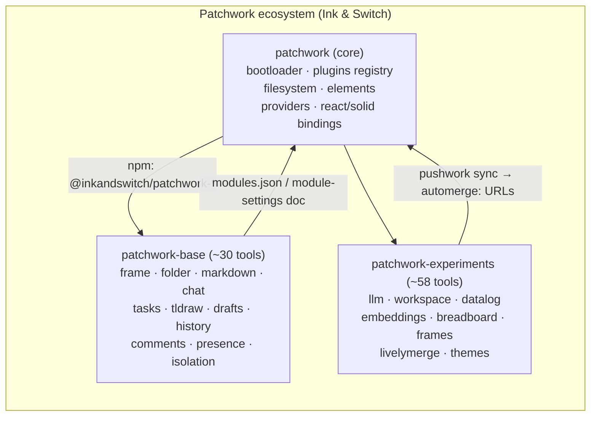
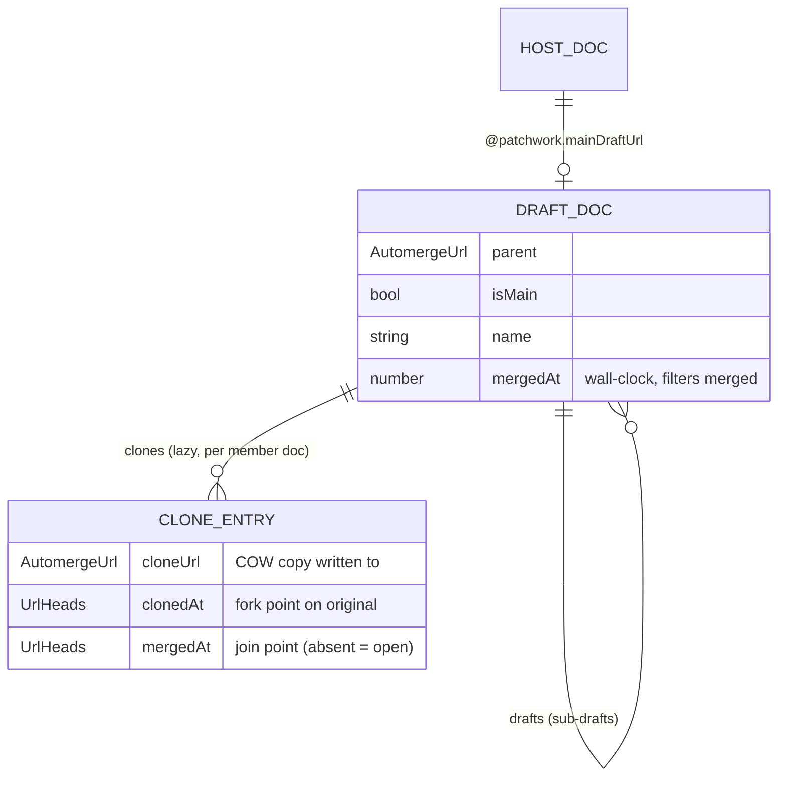
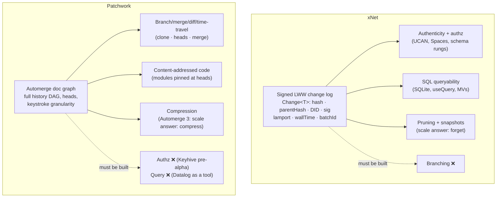
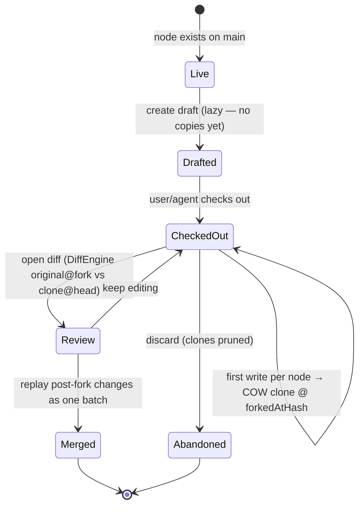

# Patchwork vs xNet: Learning From Ink & Switch's Closest Parallel

> Exploration 0327 · 2026-07-14
>
> Subject repos: [inkandswitch/patchwork](https://github.com/inkandswitch/patchwork) ·
> [inkandswitch/patchwork-base](https://github.com/inkandswitch/patchwork-base) ·
> [inkandswitch/patchwork-experiments](https://github.com/inkandswitch/patchwork-experiments)
> (all three read at their 2026-07-14 heads), plus the Patchwork lab notebook and
> the Malleable Software essay.
>
> Companion to `0267_[x]_MODDABLE_SOFTWARE_AND_THE_APPLICATION_AS_A_VIEW_OVER_YOUR_DATA.md`,
> which engaged the *essay*; this exploration engages the *system* — all three
> repos' actual code, against ours.

## Problem Statement

Ink & Switch's Patchwork is the closest living parallel to what xNet is trying
to be: a local-first, collaborative, malleable workspace where heterogeneous
content lives in one substrate and independently-authored tools render it. It
began (January 2024) as "universal version control" research and has since
become the lab's daily working environment, the foundation of GAIOS (the ARIA
Safeguarded AI platform), and a public three-repo ecosystem that ships tools as
CRDT documents.

Two systems, one thesis, built by different hands over the same two and a half
years. What
did they solve that we haven't? What did we solve that they haven't? What is
genuinely worth harvesting — and what is a deliberate non-goal for us?

## Executive Summary

**The verdict: Patchwork and xNet are complementary mirrors.** Each system has
*shipped* what the other's authors list as an open problem:

| Ink & Switch names as unsolved (their words) | xNet's shipped answer |
| --- | --- |
| Permissions / access control (Keyhive is pre-alpha; base auth is "paste an account URL") | DID:key identity, Ed25519-signed changes, UCAN, Spaces, per-schema authz ladder (`packages/identity`, `packages/core/src/auth-types.ts`) |
| Cross-tool schema compatibility / evolution | Schema IRIs, versioned schemas, bidirectional lenses (`packages/data/src/schema/lens.ts`) — Cambria's idea, productionized |
| Queryability (they build Datalog engines *as tools*) | SQLite substrate, `useQuery`, materialized views, measured to 10M rows (0318) |
| Business model for malleable tools | Cloud, entitlements, billing, marketplace (`packages/entitlements`, `packages/cloud`) |
| Security of user-modifiable code ("technical capabilities can't be a full solution") | Provenance→trust-tier→sandbox ladder (`packages/trust`), capability guards, SES/iframe sandboxes |

| xNet's open gaps | Patchwork's shipped answer |
| --- | --- |
| **No branching/drafts/merge-review for content** — our flagship gap | Lazy copy-on-write multi-doc drafts with fork points, checkpoints, history-pinned forks, `merge()` (patchwork-base `drafts/`) |
| Node→view mapping is a hardcoded switch (`navigateToNode`) | Registry-driven "Open with…" — any tool declaring `supportedDatatypes` can render a doc, with graceful fallback |
| Foreign nodes arriving by sync render only if our app already knows the schema | Self-describing documents: `@patchwork.suggestedImportUrl` — the doc carries a pointer to software that opens it |
| Plugin versions are npm semver | Content-addressed code: modules pinned "at heads" (`automerge:<id>#<heads>`), tools distributed *as documents* |
| Shell affordances (comments/history/presence panels) wired per-surface | Generic `context-tool` contract — one tag attaches a tool to *any* document |
| Assistant tools are compiled-in contributions | `patchwork:skill` registry — agents discover runtime-loadable skills; the LLM writes scripts against the workspace |

The deepest difference is a philosophical dial, not a feature list. Patchwork
sets **malleability to maximum and governance to nearly zero** — isolation and
Keyhive exist but are optional, off-by-default, and policy-level rather than
cryptographic: any tool can replace the whole frame, reach the whole DOM and
registry, and be hot-loaded from a synced document with no review. xNet sets
the dial the other way: everything is signed, tiered, sandboxed, and queryable,
but the shell is compiled and content has no branches. Their bet is Automerge
(byte-level CRDT, full history DAG, keystroke granularity); ours is a signed
LWW change log over schema-typed nodes (0200 chose this deliberately —
authenticity and queryability over merge richness). Patchwork gets the
branching *primitives* (clone, heads, merge, diff, time-travel) from its
substrate — drafts are still ~1,000 lines of branching machinery on top; we get
authenticity/authz/SQL from ours, and must build both the primitives and the
feature.

**Recommended harvest, in priority order:** (1) drafts/branches as a
`@xnetjs/drafts` design over our event-sourced log — two and a half years of
daily lab use and published design research back I&S's claim that branching is
"a powerful general primitive for all kinds of creative work," and we have
nearly every raw material (the missing pieces: a store-level id overlay, a
lazy-COW write intercept, and a rebase-stamping decision) plus the feature
itself;
(2) registry-driven "Open with…" replacing the `navigateToNode` switch;
(3) a generic context-tool contract for the islands; (4) skills-as-nodes for
the assistant; (5) content-hash pinning for marketplace plugins. Explicit
non-goals: frame-replacement-by-plugin, bearer-URL auth, unsandboxed hot code.

## Current State In The Repository

The axes below are the comparison skeleton; each cites where xNet stands today.

- **Substrate.** The universal container is a Node
  (`packages/data/src/schema/node.ts`) typed by a schema IRI
  (`xnet://<authority>/<Name>@<version>`). The sync unit is `Change<T>`
  (`packages/sync/src/change.ts`): content-addressed `hash`, `parentHash`
  chain link, `authorDID`, Ed25519 signature, `lamport` + `wallTime`, optional
  `batchId` for atomic multi-node transactions; protocol v4. Conflicts resolve
  by LWW in one module (`packages/core/src/lww.ts`) with the grinding-resistant
  blake3 tiebreak (0305). Yjs is confined to the per-node `document: 'yjs'`
  facet — rich text (`content-v4` fragment, `packages/editor`) is the main use,
  but the canvas scene (objects/edges maps, `packages/canvas/src/store.ts`) and
  database rich-text cells ride the same facet; node properties themselves stay
  LWW. Chain utilities already detect forks
  (`getForks`, `packages/sync/src/chain.ts`; `Fork`/`commonAncestor` in
  `packages/core/src/updates.ts`) — but "fork" means *accidental divergence*,
  never an intentional branch.
- **History without branches.** `packages/history` is rich: `HistoryEngine`
  (log replay), `DiffEngine`, `BlameEngine`, `PlaybackEngine` (time scrubber),
  `SchemaTimeline`, `DocumentHistoryEngine` (Yjs snapshots), cryptographic
  `VerificationEngine`, `PruningEngine`, and P2P-safe undo via compensating
  changes (`undo-manager.ts`). Devtools render it (`packages/devtools/src/panels/`
  `HistoryPanel`, `ChangeTimeline`). Nothing anywhere creates a *draft*: no
  copy-on-write, no checkout, no merge-review surface.
- **Views/surfaces.** The workbench (`apps/web/src/workbench/`) maps node type
  → route via a hardcoded switch in `navigateToNode`
  (`apps/web/src/workbench/navigation.ts`). `SurfaceDef`
  (`apps/web/src/workbench/surfaces.ts`) declares panels vs routes (0288
  preview tabs). Layout is malleable via `LayoutTree` presets
  (`packages/plugins/src/workspace/layout-tree.ts`, 0280), but the region
  skeleton (rail/status/four docks around one `surface` center) is fixed.
  Database views have their own plugin-extensible `ViewRegistry`
  (`packages/views/src/registry.ts`) — table/board/gallery/timeline/calendar/
  list/form — which is exactly the "many tools per datatype" shape, but only
  *inside* the Database surface.
- **Plugins.** `packages/plugins` contributions cover schemas, views, blocks,
  slots, commands, canvas families, importers, `agentTools`
  (`packages/plugins/src/contributions.ts`). Trust is provenance-derived
  (`packages/trust/src/index.ts`): builtin/authored/marketplace/synced →
  first-party/user/marketplace tier → host/ses-worker/iframe sandbox; synced
  extensions never inherit a carried tier. Plugins are `PluginSchema` nodes and
  P2P-sync — we already distribute *plugin manifests* in-band, just not
  hot-loaded code.
- **Comments/presence/identity.** Inline comments anchor as marks in
  `content-v4` with thread content as LWW nodes
  (`packages/editor/src/blocknote/comments/xnet-thread-store.ts`, 0321);
  universal `Comment` schema targets any node. Presence is ephemeral Yjs
  Awareness, never persisted (`packages/react/src/hooks/usePresence.ts`, 0314).
  Identity is DID:key + UCAN + recovery ceremonies (`packages/identity`, 0243).
- **AI.** Managed OpenRouter gateway with budget windows
  (`packages/plugins/src/ai/providers.ts`), the agent bridge daemon
  (`packages/devkit/src/bridge-server.ts`, `127.0.0.1:31416`), and plugin
  `agentTools`.

## External Research

### The three repos, at a glance



**`patchwork` (core)** is the runtime: a bootloader, a plugin registry, a
CRDT-backed filesystem, and two custom elements. `bootPatchworkSite()`
(`core/bootloader/src/site.ts`) initializes Automerge + Subduction WASM, then a
striking **three-worker split**:

- a **SharedWorker** owns the single Automerge `Repo` and the WebSocket to the
  sync server (`core/bootloader/src/automerge-worker.ts`) — sync lifetime is
  decoupled from tab lifetime;
- a **service worker** holds *no* CRDT state — it is a cache that, on a miss
  for an `automerge:`-encoded URL, broadcasts a handoff request the
  SharedWorker fulfills by materializing files out of CRDT folder docs
  (`core/bootloader/src/service-worker.ts`, `types.ts` `@patchwork/handoff`);
- a **module-loader worker** imports tool packages off-thread purely to
  enumerate their exported plugin descriptors
  (`core/bootloader/src/module-loader.ts`).

The consequence is the repo's signature move: **the system imports its UI from
CRDTs.** A tool bundle is an Automerge folder/directory doc; the service worker
serves `https://origin/<encoded-automerge-url>/dist/index.js` straight out of
the CRDT, cached. Module URLs are pinned "at heads"
(`automerge:<id>#<heads>` — `core/filesystem/src/urls.ts`), giving
content-addressed, immutable code versions. The tool set itself is a syncable
`module-settings` document; editing it (even from another device via the
`pw-modules` CLI, `scripts/module-settings/`) hot-reloads the running app. The
`sites/gaios` shell ships with essentially no hardcoded tools — its entire
tool list is one `automerge:` URL (`sites/gaios/src/main.ts`).

The plugin model is minimal and framework-free (verified firsthand):

```ts
// core/plugins/src/tools.ts — a tool is a render function on a DOM element
export type ToolRender<T> = (handle: DocHandle<T>, element: ToolElement) => () => void;
export type ToolDescription = {
  type: "patchwork:tool"; id: string; name: string;
  supportedDatatypes: "*" | string[];   // ← the tool↔datatype contract
  tags?: string[]; icon?: string; unlisted?: boolean;
};
// core/plugins/src/datatypes.ts — a datatype is init + title
export type DatatypeImplementation<D> = {
  init(doc: D, repo: Repo): void;
  getTitle(doc: D): string;
  setTitle?(doc: D, title: string): void;
};
```

`createDocOfDatatype2` stamps every new doc with
`doc["@patchwork"] = { type, suggestedImportUrl }` — **documents carry a
pointer to the software that opens them**. If a viewer encounters a doc with no
registered tool, `<patchwork-view>` imports the doc's own
`suggestedImportUrl` (HTTP or `automerge:`) and re-renders
(`core/elements/src/legacy-impl.ts`). Tool selection falls back gracefully:
chosen tool → datatype-specific → wildcard `"*"` (`getFallbackTool`,
`core/plugins/src/tools.ts`).

Auth is **Keyhive** (`@automerge/automerge-repo-keyhive@0.3.0-alpha.sub.8b`),
integrated but optional behind a `KEYHIVE=true` build flag; rendering gates on
`hive.bestAccessForDoc(...)`. Sync is **Subduction** (I&S's sedimentree
protocol, default `wss://subduction.sync.inkandswitch.com`); storage is
IndexedDB. Everything tracks unreleased pins (`automerge@3.3.0-fragments.2`,
`automerge-repo@2.6.0-subduction.44`).

**`patchwork-base` (~30 tools)** is the standard library, governed by a hard
**isolation principle** (its README): tools never depend on each other's
implementations, share no lockfile, and don't even share a build system —
esbuild, vite, and bundleless plain JS coexist; house style is "vanilla JS,
Solid if you need reactivity, never React." Cross-tool coupling happens almost
exclusively through registry id strings — the README's own caveat lists the
three exceptions (codemirror-markdown → codemirror-base, tenfold → both
codemirror packages, account-picker → contact), wired as `link:../` sibling
deps. The shared surface is a tiny npm cluster
(`@inkandswitch/patchwork-plugins`, `-filesystem`, `-elements`, `-providers`)
that every build marks *external* and resolves to host singletons at runtime —
declared semver is effectively type-only. Two notable extremes: npm
dependencies can literally be Automerge URLs
(`chat/package.json`: `"@chee/patchwork-llm": "automerge:HaCF…"`), and even the
frame — sidebar, doc list, tool switcher — is a swappable tool (`threepane/`,
tagged `frame-tool`, keyed off the account doc's `frameToolId`). Untrusted
tools can run in an opaque-origin sandboxed iframe with an RPC bridge and an
allowlist-enforcing intermediary repo (`isolation/ISOLATION.md`) — but the doc
is frank that today this is policy enforcement, not cryptography.

**Drafts** — the signature feature, and the one we lack — is ~2,700 lines of
tool code over stock Automerge, no custom CRDT — and the branching machinery
itself (overlay/list providers, types, clone policy) is only ~1,000 of those;
the rest is the sidebar UI:



Forking is **lazy and per-document**: a `DraftOverlayProvider` intercepts
handle resolution, and the first time any member doc is touched under a
checked-out draft it clones it, recording `clonedAt = originalHandle.heads()`
(`drafts/src/providers/DraftOverlayProvider.ts`). The editor keeps seeing the
*original* URL but reads and writes the clone — tools are completely unaware
drafts exist. Merge is one line of substrate: `original.merge(clone)`
(`drafts/src/DraftsSidebar.tsx`). Checkpoints (`DraftCheckpoint`,
`drafts/src/draft-types.ts`) pin every member doc to per-doc heads for frozen
time-travel views with diff baselines; drafts can even be forked *from a
historical version*. A `clone-policy.ts` skips account/contact/draft docs so
global state never forks into a branch. Comment anchors, meanwhile, are
Automerge stable cursors packed into subdocument URLs
(`codemirror-base/src/lib/extensions/comments.ts`:
`handle.sub(...path, cursor(from, to)).url`) — anchoring, addressing, and
edit-survival all fall out of the URL scheme, and every thread is itself an
addressable doc that can open in its own pane.

Identity, by contrast, is the weak flank: a `ContactDoc` profile plus
account-URL-as-bearer-token pasted into `account-picker` — the Keyhive
cryptographic layer is designed but not implemented in base.

**`patchwork-experiments` (~58 tools)** stress-tests the API: heavy WASM
(ffmpeg, OpenSCAD, pandoc), an in-browser ML pipeline (nomic-embed on WebGPU →
UMAP → DBSCAN, cached in IndexedDB), merge-native programming languages
(livelymerge stores prototypes/functions/refs as Automerge object tables), a
Dafny-verified todo list, two-way "bireactive" optics binding a tldraw doc to
an editable list, and **meta-tools** (inspector, breadboard, universal-dnd)
that X-ray the running studio via unrestricted DOM + registry access — frame
replacement is just `supportedDatatypes: ["account"]` + a `frame-tool` tag.
The crown jewel is the **llm/workspace pattern**: the model doesn't
function-call — it *writes JavaScript in `<script>` blocks executed against a
live workspace API* (`llm/src/llm-process/run.ts`), looping on its own output
up to 20 iterations, and discovers runtime-loadable capabilities through a
`patchwork:skill` registry (`getRegistry("patchwork:skill")`), with agent
configs and SKILL.md files stored as documents. A `.claude/skills/`
authoring skill in the repo confirms they use Claude to write tools —
"vibecoded" is their own word for one of them. Registered plugin types across
the repo tell the composition story: 119 `patchwork:tool`, 80
`patchwork:datatype`, plus userland types like `chat:slash`, `chat:feature`,
`patchwork:action`, `patchwork:skill`, `patchwork:theme` — tools extending
*other tools* through the same registry, no forking.

### The research lineage (web)

Patchwork is I&S project #030, lead Geoffrey Litt, ~10 collaborators. The 2024
"Version Control" notebook (entries 01–10) built the case: universal version
control primitives (branches/merges/history/diffs) for all creative work;
keystroke-granular "dynamic history" you *query* rather than commit; edit
groups; AI bots that propose **branches** as collaborators (entry 07); history
as chat (09); and the conclusion that branching generalizes beyond prose to
canvases, spreadsheets, kanban (10). 2026 notes cover account history,
Breadboard, a local-first task framework, and "chitter chatter" (video calls
that turn spoken ideas into Patchwork tools). Dispatch #017 (May 2026) says
Patchwork now hosts most of the lab's daily work; Dispatch #014 (Nov 2025)
introduced GAIOS, its productization for ARIA's Safeguarded AI programme.
Enabling tech: Automerge 3 (columnar in-memory format, 10–100× memory
reduction — addressing a history-bloat problem analogous to the change-log
cliff we hit in 0249),
Subduction/sedimentree sync, Keyhive/BeeKEM/Beelay (pre-alpha E2EE +
capabilities), and pushwork (Git-like CLI for Automerge folders). Prior art it
inherits: Upwelling (drafts with "creative privacy"), Peritext (rich-text
CRDT), **Cambria (schema lenses — the idea our `schema/lens.ts` ships)**,
Pushpin, Embark, Potluck. Their own list of unsolved problems: UI composition
across tools, schema evolution, permissions at scale, privacy/security of
malleable code, business models.

## Key Findings

### 1. Same thesis, inverted priorities

Both systems believe: local-first substrate; heterogeneous content in one
graph; views/tools decoupled from data; extensibility as a first-class right;
AI as a collaborator. The divergence is what each was *unwilling to postpone*.
Patchwork refused to postpone malleability and versioning; xNet refused to
postpone authenticity, authorization, and queryability. Neither refusal was
wrong — and the two lists barely overlap, which is exactly why this is the
most instructive codebase we've compared against (0313 p2panda, 0301 ATProto,
0310 iroh were all substrate-level comparisons; this is the first *whole-app*
parallel).

### 2. The substrate bet explains almost everything downstream



Automerge documents have heads, clones, and `merge()` — so drafts cost I&S
~1,000 lines of branching machinery (plus a sidebar UI). Our log has
signatures, DIDs, and per-property LWW
— so authz cost us a schema-level expression language and branching costs us a
feature design. Note the two scale answers: they *compress* history (Automerge
3's columnar memory format); we *prune* it behind verified snapshots
(`PruningEngine`, 0254 still open). Their keystroke-granular "dynamic history"
is the thing our 1000ms granularity floor (`packages/unreal/src/granularity.ts`)
deliberately refuses — we should not chase it, but we should notice they get
*diff-at-any-two-points* for free and we only get *replay-from-log*.

### 3. Drafts are the proven, missing primitive — and our log can support them

Two and a half years of I&S design research and dogfooding (Upwelling →
notebook 06/07/10 → daily lab use) suggest that lightweight branches with
"creative privacy" appeal to non-programmers, generalize across content types,
and are the natural shape for **AI-proposed changes a human reviews before
merge** (notebook 07 — an AI style bot proposing a *branch*, not an edit). That last point matters most for
us: we are wiring agents into the workbench (`agentTools`, the bridge, managed
AI), and today an agent's writes land directly on live nodes. A draft
container is the difference between "the agent edited your workspace" and "the
agent opened a PR."

Feasibility on our substrate is real but has sharp edges (see Options): we
have event-sourced per-node logs, atomic `batchId` transactions, deterministic
ids, `HistoryEngine` replay, and compensating-change machinery. What we lack
is Patchwork's one-line `merge()` — replaying a clone's changes onto the
original works naturally for LWW record ops, but Yjs `content-v4` fragments
merge at the update level (fine — Yjs updates commute) and *relations from
cloned nodes to un-cloned neighbors* need an id-mapping layer, which is
exactly the role of Patchwork's `OverlayRepo` (their overlay "lies to the
editor about the URL"; ours would lie to `useNode` about the id).

### 4. "Open with" is registry-driven there, a switch statement here

Patchwork: `supportedDatatypes` on every tool + `getSupportedToolsForType()` +
a `doc-openwith` picker + wildcard fallback (`raw` renders anything) + the
doc's own `suggestedImportUrl` as last resort. xNet: `navigateToNode`'s
hardcoded `switch` (`apps/web/src/workbench/navigation.ts`), one route per
type, no user-facing choice, devtools `DataExplorer` as an unofficial raw
fallback. We already have all the registry pieces (schema registry, ViewRegistry
inside Database, `SlotContribution`) — we've just never unified them into
"which surfaces can open this node?" This is the cheapest big win in the list.

### 5. Their extensibility ceiling is our floor, and vice versa

A Patchwork tool can replace the entire shell, introspect every other tool,
and hot-load from a synced doc — but base identity is a bearer URL and the
isolation iframe is optional policy. An xNet marketplace plugin is
provenance-tiered, sandboxed, capability-guarded — but cannot target the
`surface` center, and synced plugin *code* never hot-loads (by design; only 4
of 19 registry entries even auto-install, per the marketplace install audit in
PR #443). The mature
position is not either extreme: it's Patchwork's *contracts* (context-tool
tag, open-with, self-describing docs, userland plugin types like `chat:slash`)
under xNet's *governance* (tiers, sandboxes, consent). Notably, their
`ISOLATION.md` reinvents — as aspiration — roughly the sandbox ladder we
shipped in `packages/trust`.

### 6. Convergent evolution validates several of our bets

Independent teams landed on: comments anchored by stable positions with
thread-content living outside the hot document (their cursors-in-URLs ↔ our
marks + LWW nodes, 0321); presence as ephemeral broadcast never touching the
log (their `handle.broadcast()` ↔ our Awareness lane rule, 0314); plugin
registries keyed by type strings with lazy `load()` (their `getRegistry(type)`
↔ our contribution points); sync ownership in a worker that outlives tabs
(their SharedWorker ↔ our Web-Locks leadership, 0263); and tools/plugins
distributed as synced documents (their folder docs ↔ our `PluginSchema` nodes
— theirs carry code, ours carry manifests). Where both systems agree, the
design is probably right. Schema lenses are the near-miss case — shared
lineage rather than convergence: Cambria is their acknowledged prior art, we
shipped its idea in `lens.ts`, and they haven't shipped it yet.

## Options And Tradeoffs

### Option A — Harvest drafts: design `@xnetjs/drafts` (branching over the LWW log)

The centerpiece. Three sub-approaches considered:

| Approach | Mechanism | Pros | Cons |
| --- | --- | --- | --- |
| **A1. Clone-and-replay (recommended)** | Draft = node set cloned to new ids inside a `Draft` container node; fork point = per-node `forkedAtHash` (chain position); edits accumulate on clones; merge = replay clone's post-fork changes onto originals as a `batchId` transaction (LWW handles overlaps; Yjs updates merge natively); an id-overlay in the store layer makes `useNode(originalId)` resolve to the clone while checked out | Pure application-level — zero protocol change; merge-review UI = existing `DiffEngine` on clone vs original; agent-PR workflow falls out; per-draft authz = container authz (creative privacy!) | Id-overlay touches the store read path (like their `OverlayRepo`, so precedented); relations from clones to non-members need mapping on merge; lazy cloning needs a write-intercept |
| A2. Log-level branches | Add a `branchId` to `Change<T>`; store materializes per-branch states | Closest to git; no id remapping | **Protocol major**: ripples 4 conformance kernels + Python/Swift references (0305 lesson); every store/query/hub path becomes branch-aware; enormous blast radius |
| A3. Space-fork | Fork an entire Space; merge = cross-space change replay | Reuses replication-unit machinery (0258) | Far too coarse for "draft this page"; membership/grant duplication; merge across spaces is unexplored |

A1 mirrors Patchwork's actual architecture (drafts there are *also* pure
app-level COW over an unmodified substrate — that's the lesson, not a
compromise) and keeps the protocol frozen.

### Option B — "Open with": registry-driven node→surface mapping

Give `SurfaceDef` (and route-surfaces) a `supportedSchemas: "*" | SchemaIRI[]`
field; derive `navigateToNode` from the registry; add an "Open with…" node
context-menu (we have the context-menu system, 0285) listing all matching
surfaces; promote a read-only raw-node view (grid row / JSON) as the `"*"`
fallback so *no node is ever unopenable*. Tradeoff: near-none — it's a
refactor of an existing switch plus one menu; riskiest part is route-param
plumbing for plugin-contributed views. This also fixes the known
`navigateToNode` gaps (finance/CRM missing, 0288). Note this covers the
*rendering* half of Patchwork's self-describing-documents idea only: their
`suggestedImportUrl` goes further and fetches the doc's own renderer, which
for us is the hot-loading non-goal in another guise — our answer is the `"*"`
raw fallback plus, at most, a non-executing "suggested plugin" hint on foreign
schemas routed through the marketplace consent flow.

### Option C — Context-tool contract for islands

One interface — `{ supportedSchemas, render(nodeId, host) }` — for
comments/history/presence/backlinks panels, registered like Patchwork's
`context-tool` tag, so any surface showing a node gets the full accessory set
for free (today each surface hand-wires its islands). Plugin-visible via the
existing `SlotContribution` path with tier rules unchanged. Tradeoff: an
abstraction tax over islands that already work; worth it the moment the third
surface duplicates comment-panel wiring.

### Option D — Skills-as-nodes for the assistant

A `Skill` schema (name, description, instructions, optional sandboxed handler
ref) + assistant-side discovery, mirroring `patchwork:skill` +
`workspace.loadSkill(id)`. Their sharpest pattern — LLM *writes code* against
a workspace API — maps onto our stricter frame as: the model emits calls into
the existing sandboxed action/`agentTools` layer, never raw `eval` in the host
(their own `libraries/llm` had to bolt on a worker sandbox after the fact,
`runHandlerSandboxed` — evidence for our posture). Tradeoff: prompt-injection
surface expands with runtime-loaded instructions; mitigate with provenance
tiers on Skill nodes (synced skills = untrusted until consented, same rule as
plugins).

### Option E — Content-hash pinning for plugins

Record the change-hash of the `PluginSchema` node (and bundle digest) at
install; render an update as an explicit diff-and-consent, like their
at-heads module pinning. Small, composable with the existing trust flow.

### Deliberate non-goals (rejected)

- **Frame replacement by plugins** — their `frame-tool` is philosophically
  coherent for a research lab and indefensible for our threat model (a synced
  tool that replaces the shell is a phishing kit). Our malleability budget
  stays: LayoutTree presets + slots.
- **Bearer-URL identity** — nothing to learn; they're crossing toward
  Keyhive, i.e., toward where we already are.
- **Keystroke-granular history** — conflicts with the 1000ms durability floor
  and the pruning story; our granularity is a scale feature, not a deficit.
- **Runtime hot-loading of synced code into the host realm** — their
  isolation doc itself concedes this is unsolved; anything here goes through
  the existing sandbox ladder or not at all.

## Recommendation

Treat Patchwork as the **versioning-and-malleability reference implementation**
the way 0200 treated Automerge as the merge-semantics reference: study it,
harvest contracts, keep our substrate. In leverage order (highest first) —
though B ships first, being a one-day refactor whose registry A1's review
surface will reuse:

1. **Write the drafts design exploration** (A1: clone-and-replay with a
   store-level id overlay), scoped to Pages + Tasks first, with the **agent-PR
   workflow as the headline use case** — an agent's `agentTools` writes land in
   a draft, the human reviews a `DiffEngine`-rendered comparison, merge is a
   `batchId` transaction. This is the single highest-leverage idea in all
   three repos, and it is UX validated by two and a half years of lab
   dogfooding, not pure speculation.
2. **Ship "Open with" (B) first** — it's small, it erases a known gap-list
   (`navigateToNode` misses), and it moves the architecture from
   switch-statement to registry, which A1's review surface will also need.
3. **Adopt the context-tool contract (C)** when the drafts review panel is
   built — build it *as* the first context tool rather than as one more
   hand-wired island.
4. **Prototype skills-as-nodes (D) behind the trust ladder**; revisit E
   opportunistically inside the next marketplace touch.

## Example Code

Sketch of A1's shape (application-level, no protocol change):

```ts
// packages/data/src/schema/schemas/draft.ts (sketch)
export const DraftSchema = defineSchema({
  name: "Draft",
  namespace: "xnet.fyi",
  properties: {
    name: text(),
    status: select(["open", "merged", "abandoned"]),
    // member map: original node id -> clone bookkeeping
    // (json until a relation-map property lands)
    clones: json<Record<NodeId, {
      cloneId: NodeId;
      forkedAtHash: string;      // original's chain head at fork (cf. clonedAt heads)
      mergedAtHash?: string;     // original's head after merge (cf. mergedAt)
    }>>(),
    target: relation({ to: "*" }),      // host node (page, board, …)
    parent: relation({ to: "Draft" }),  // sub-drafts, like DraftDoc.drafts
  },
  authorization: privateToCreator(),    // creative privacy by construction
});

// Store-level overlay — the xNet analogue of Patchwork's DraftOverlayProvider:
// while a draft is checked out, reads of an original id resolve to its clone,
// and the first *write* through the overlay performs the lazy copy-on-write
// (clone node, stamp forkedAtHash = original chain head) — never fork
// Space/Profile/membership nodes (their clone-policy.ts lesson).
export function resolveThroughDraft(id: NodeId, draft: DraftState): NodeId {
  return draft.clones[id]?.cloneId ?? id;
}

// Merge = replay the clone's post-fork changes onto the original in one batch.
// LWW resolves property overlaps; Yjs fragments merge as updates; the review
// UI is DiffEngine(original@forkedAtHash, clone@head) — machinery we have.
async function mergeDraft(draft: DraftHandle, store: NodeStore) {
  const batchId = createBatchId();
  for (const [originalId, entry] of Object.entries(draft.clones)) {
    const post = await store.changesSince(entry.cloneId, entry.forkedAtHash);
    await store.applyRebased(post, { onto: originalId, batchId });
    draft.recordMerge(originalId, await store.headHash(originalId));
  }
}
```

And B, the one-day version:

```ts
// workbench/surfaces.ts — SurfaceDef gains the Patchwork contract
export type SurfaceDef = {
  id: string;
  kind: "panel" | "route";
  supportedSchemas?: "*" | SchemaIRI[];   // ← replaces navigateToNode's switch
  /* … */
};

export function surfacesForNode(type: SchemaIRI): SurfaceDef[] {
  return SURFACES
    .filter(s => s.supportedSchemas === "*" || s.supportedSchemas?.includes(type))
    .sort(specificBeforeWildcard);         // their getFallbackTool ordering
}
```



## Risks And Open Questions

- **Id-overlay blast radius.** `resolveThroughDraft` must sit under
  `useNode`/`useQuery` without slowing the non-draft hot path (0266 stopping
  rule: cold first-rows <100ms p95). Patchwork confined theirs to a provider
  layer; our equivalent seam is the store read path — needs a perf spike
  before commitment.
- **Relation integrity on merge.** A clone's relations may point at other
  clones (map them) or at live nodes (keep them); dangling cases need the same
  orphan handling philosophy as `commentOrphans.ts`.
- **Rebase semantics vs. replay.** `applyRebased` must decide whether replayed
  changes keep original `lamport`/`wallTime` (honest history, but merges can
  "lose" to interim main edits) or are re-stamped at merge time (edits win, but
  provenance blurs). Patchwork inherits Automerge's answer; we must choose ours
  explicitly and pin it with conformance vectors.
- **Yjs fragment cloning.** Duplicating a `content-v4` fragment into a clone
  node and merging updates back needs a golden test around
  `DocumentHistoryEngine` (`gc:false` interactions, 0312 identity-stability
  gotchas) — and the same treatment for the *other* Yjs facets: canvas scene
  Y.Docs (`packages/canvas/src/store.ts`) and database rich-text cells.
- **Drafted-state sync cost.** Every checked-out draft doubles its members'
  change traffic; pruning (0254, open) becomes more urgent, not less.
- **Skills injection surface.** Runtime-loaded Skill instructions are a
  prompt-injection channel; the trust-tier gate is necessary but its consent UX
  is undesigned.
- **Their trajectory.** Keyhive/Beelay will eventually give Patchwork real
  authz + E2EE sync; when it ships, their "weak flank" closes and the
  remaining differentiation is ours to keep earning (queryability, scale,
  governance). Watch: keyhive repo, Subduction, GAIOS.
- **Numbering.** 0322–0326 are claimed in sibling worktrees (0325 went to the
  Keyhive exploration, earlier commit; 0326 to Habitat); this doc takes 0327
  (collision rule: scan all branches + worktrees, earliest commit wins).

## Implementation Checklist

- [ ] **B — "Open with" (first, small):** add `supportedSchemas` to
      `SurfaceDef` (`apps/web/src/workbench/surfaces.ts`); derive
      `navigateToNode` from the registry; add "Open with…" to the node context
      menu; add a `"*"` raw-node fallback view; cover the known finance/CRM
      gaps with a test that every registered schema resolves to ≥1 surface.
- [ ] **A — drafts design exploration:** write `NNNN_[_]_DRAFTS_…` specifying
      the `Draft` schema, store-level id overlay, lazy-COW write intercept,
      clone-exclusion policy (Space/Profile/membership), merge-replay + rebase
      stamping decision, and the agent-PR flow; include the perf spike plan for
      the overlay on the store read path.
- [ ] **A (spike):** prototype clone-and-replay for a single Page node behind
      a dev flag — fork, edit clone, `DiffEngine` review, batch merge —
      measuring overlay overhead on non-draft reads.
- [ ] **C — context-tool contract:** define `{ supportedSchemas, render }`
      registration for island accessories; port the comments island to it;
      build the drafts review panel as the second consumer.
- [ ] **D — skills-as-nodes:** `Skill` schema + assistant discovery behind
      provenance tiers (synced ⇒ consent before load), reusing the plugin
      consent flow.
- [ ] **E — plugin content pinning:** record install-time change-hash/digest
      for `PluginSchema` installs; surface update-diff consent in the
      marketplace details view.
- [ ] Cross-link this exploration from 0267 (moddable software) and cite it in
      the drafts design doc.

## Validation Checklist

- [ ] "Open with": every schema in the registry opens *somewhere* (automated
      test over `surfacesForNode`); a node of an unknown/foreign schema renders
      in the raw fallback instead of dead-ending.
- [ ] Drafts spike: fork→edit→merge on a Page preserves LWW convergence
      (conformance vectors for rebase stamping), inline-comment anchors survive
      the round trip, and non-draft read paths show no measurable regression
      (0266 budget).
- [ ] Agent-PR flow: an assistant edit lands in a draft, is reviewable as a
      diff, and merges atomically (single `batchId`) — demonstrated end-to-end
      in the seeded demo workspace.
- [ ] Context tools: comments/history/presence attach to at least three
      surface types through the one contract, with zero per-surface wiring
      added.
- [ ] Skills: a synced Skill node is inert until consented; consent surfaces
      provenance; loaded skills execute only through sandboxed `agentTools`.
- [ ] No protocol version bump anywhere in the above (A1 constraint holds).

## References

- Repos (read at 2026-07-14 heads):
  [patchwork](https://github.com/inkandswitch/patchwork) ·
  [patchwork-base](https://github.com/inkandswitch/patchwork-base) ·
  [patchwork-experiments](https://github.com/inkandswitch/patchwork-experiments) ·
  [pushwork](https://github.com/inkandswitch/pushwork) ·
  [keyhive](https://github.com/inkandswitch/keyhive)
- Ink & Switch: [Patchwork project page](https://www.inkandswitch.com/project/patchwork/) ·
  [Patchwork notebook](https://www.inkandswitch.com/patchwork/notebook/) ·
  [Malleable Software](https://www.inkandswitch.com/essay/malleable-software/) ·
  [Dispatch #014 — GAIOS](https://www.inkandswitch.com/newsletter/dispatch-014/) ·
  [Dispatch #017 — Patchwork progress](https://www.inkandswitch.com/newsletter/dispatch-017/) ·
  [Keyhive notebook](https://www.inkandswitch.com/keyhive/notebook/) ·
  [Upwelling](https://www.inkandswitch.com/upwelling/) ·
  [Cambria](https://www.inkandswitch.com/cambria/)
- Geoffrey Litt, [Towards universal version control with Patchwork](https://buttondown.com/geoffreylitt/archive/towards-universal-version-control-with-patchwork/)
- [Automerge 3 announcement](https://automerge.org/blog/automerge-3/)
- Prior xNet explorations: 0200 (protocol boundaries — the not-Automerge
  decision), 0254 (log compaction, open), 0267 (moddable software), 0276
  (comment nodes; barrel isolation lesson), 0280 (malleable workbench), 0288
  (preview tabs; `navigateToNode` gaps), 0296 (conflict semantics), 0304
  (authz CRUD split), 0305 (LWW tiebreak), 0312 (BlockNote), 0314 (presence
  lane rule), 0318 (scale measurements), 0321 (inline comments), 0243
  (recovery), 0307 (authz gaps — wildcard UCAN)
