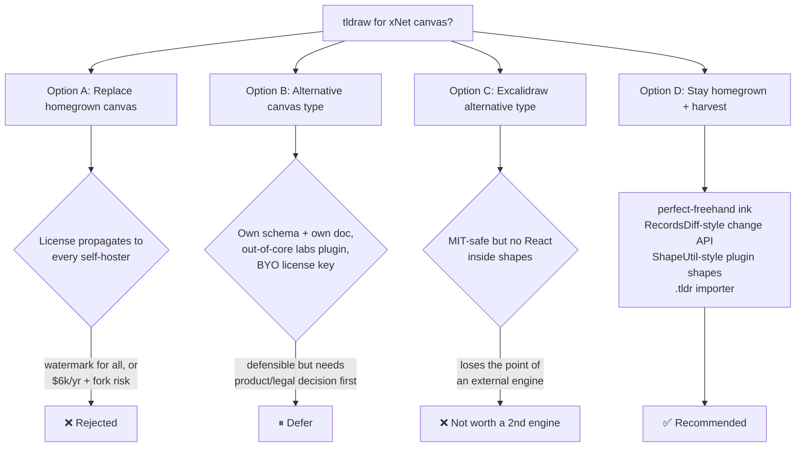
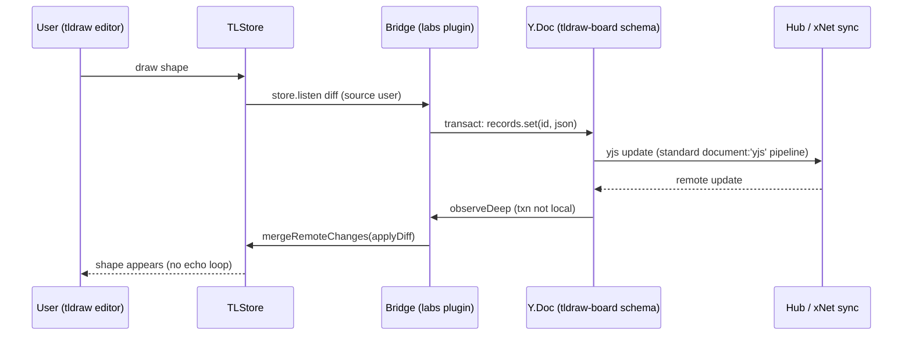

# tldraw: Canvas Replacement Or Alternative Canvas Type

## Problem Statement

xNet ships a large, homegrown infinite-canvas engine (`@xnetjs/canvas`,
~62,600 LOC). tldraw is the best-known canvas SDK, with a polished editing
feel, first-class custom React shapes, and a well-designed store API. Should
xNet (a) replace the homegrown canvas with tldraw, or (b) add tldraw as an
*alternative* canvas type alongside the existing one — and if neither, what
should we harvest from it?

## Executive Summary

- **Do not replace the homegrown canvas with tldraw.** The blocker is
  licensing, not engineering. tldraw has not been MIT since v1: production
  use requires either the free hobby tier (mandatory, non-removable
  "made with tldraw" watermark) or a commercial license (~$6,000 USD/yr per
  team as of the v4.0 licensing change, Sept 2025). Critically, tldraw's own
  docs state the license obligation **propagates to every downstream user of
  an open-source project** — every self-hoster of MIT-licensed xNet would
  independently need their own tldraw key. That is fundamentally incompatible
  with xNet's clone-and-self-host model. BigBlueButton hit exactly this and
  ended up frozen on a stale pre-license-change fork — the cautionary
  precedent.
- **Replacement would also be a feature regression.** The homegrown canvas is
  not a toy: chunked/tiled Y.Doc storage for very large scenes, WebGL LOD tile
  layers, DOM-island virtualization, source-backed node embedding (pages,
  databases, tasks, media, widgets) with inline BlockNote editing, semantic
  edges, comments, Yjs presence + selection locks, mind-map/swimlane/frames,
  PDF annotation, ELK auto-layout, JSON Canvas interop. tldraw covers none of
  the xNet-specific parts and has a community-reported perf ceiling around
  ~1,000 shapes per page (DOM-per-shape, viewport culling only) versus our
  chunk/LOD architecture built for much larger scenes.
- **"Alternative canvas type" is technically easy but legally awkward.** The
  view registry (`packages/views/src/registry.ts`) is a purpose-built seam:
  register a `tldraw-board` view for a new schema and it appears next to the
  native canvas. tldraw's `store.listen` / `mergeRemoteChanges` / `applyDiff`
  API is genuinely well-suited to bridging into a Y.Doc. But the license
  question doesn't go away by making it optional — it just shrinks the blast
  radius. If pursued at all, it must be an **out-of-core, opt-in labs plugin**
  where the deployer brings their own tldraw license key, and it must never
  become the default canvas.
- **Recommended path:** keep the homegrown canvas as the one true canvas
  (option D), harvest specific ideas from tldraw (freehand ink quality via
  MIT-licensed `perfect-freehand`, `RecordsDiff`-style change surface,
  `ShapeUtil`-style contribution API for plugin shapes), and treat a
  bring-your-own-license tldraw labs plugin as a deliberately deferred
  follow-up that needs a product/legal decision before any code. If we ever
  want a *second* canvas engine for interop reasons, **Excalidraw (MIT)** is
  the licence-safe candidate — but it cannot render React components inside
  shapes, which removes most of the appeal.

## Current State In The Repository

### The engine: `@xnetjs/canvas` (~62.6k LOC, private)

- `packages/canvas/package.json` — `@xnetjs/canvas`, **`private: true`**, and
  listed in `.changeset/config.json` `ignore`. Deps: `elkjs ^0.9.3` (layout),
  `rbush ^4.0.1` (spatial index), `yjs ^13.6.24`, workspace packages. No
  tldraw/excalidraw/perfect-freehand anywhere in the dependency graph today.
- Active renderer: `packages/canvas/src/renderer/CanvasV3.tsx` (**7,570 LOC**;
  exported as `Canvas`). Rendering is a hybrid of DOM islands with a
  pool/budget system (`renderer/dom-island-pool.ts`), inline SVG overlays,
  and WebGL tile layers (`layers/webgl-grid.ts`, `webgl-raster-tiles.ts`,
  `webgl-vector-tiles.ts`, `webgl-thumbnail-sprites.ts`) driven by a
  zoom-level LOD ladder (`placeholder|minimal|compact|full`).
- Data model (`packages/canvas/src/types.ts`): scene node kinds
  `'page' | 'database' | 'external-reference' | 'media' | 'shape' | 'note' |
  'task' | 'group' | 'widget'`; `ShapeType` union of 10 geometric shapes
  extensible via `nodes/shape-registry.ts`; edges with durable endpoint
  bindings (`CanvasEdgeEndpoint`), semantic relationship kinds, and styled
  markers.
- Storage: a per-canvas **Y.Doc** — `CanvasSchema` declares `document: 'yjs'`
  (`packages/data/src/schema/schemas/canvas.ts:48`). Flat layout is four
  top-level `Y.Map`s (`objects`/`connectors`/`groups`/`metadata`,
  `scene/doc-layout.ts`) holding plain-JSON records; large scenes use the
  chunked store (`chunks/chunked-canvas-store.ts`, `chunks/chunk-manager.ts`)
  and the tile-doc schema (`scene/tile-doc-schema.ts`) with a
  flat→tiled migration (`scene/flat-doc-v3-migration.ts`).
- Presence: `presence/canvas-presence.ts` over Yjs Awareness (cursor,
  selection, viewport, activity, edit locks via `SelectionLockManager`).
  Undo: `Y.UndoManager` (`createCanvasUndoManager`) plus the multi-domain
  undo ladder in `packages/views/src/canvas-view/useCanvasUndoLadder.ts`
  (scene / source-node / source-document domains).
- xNet-specific features tldraw does not have: source-backed cards
  (`sourceNodeId` + `sourceSchemaId`, see
  `docs/specs/PAGE_TASK_RECONCILIATION.md`) with inline BlockNote editing
  (`packages/editor/src/components/CanvasInlinePageSurface.tsx`), database
  previews (`CanvasDatabasePreviewSurface.tsx`), peek overlays, comments
  anchored to objects (`comments/CommentOverlay.tsx`,
  `hooks/useCanvasComments.ts`), mind-map/swimlane/frames modes, PDF page
  annotation (`pdf/`), ELK auto-layout in a worker (`workers/`), Obsidian
  JSON Canvas import/export (`interop/json-canvas.ts`).

### Shells and the extension seam

- Shared controller: `packages/views/src/canvas-view/` (~3,800 LOC,
  `useCanvasViewController.tsx`); deliberate thin forks
  `apps/web/src/components/CanvasView.tsx` (1,066 LOC) and
  `apps/electron/src/renderer/components/CanvasView.tsx` (exploration 0277).
- **View registry** — the natural insertion point for an alternative canvas
  surface: `packages/views/src/registry.ts` defines
  `ViewRegistration { type, name, icon, component, supportedSchemas?, platforms? }`
  with `register()` / `getForSchema()`. A `tldraw-board` view could be
  registered for `CanvasSchema` (same data, different renderer — hard, see
  Options) or for a new schema (own data, easy).
- Content-type registration is separate: a new schema is a
  `defineSchema({ document: 'yjs', ... })` in
  `packages/data/src/schema/schemas/` + registration in `schemas/index.ts`.
  New schemas get Tier-2 seed coverage automatically
  (`packages/devtools/src/seed/`); the canvas has a Tier-1 seeder
  (`seed/builders/canvas-builder.ts` → `seed/seeders/viz.ts`).

### Guardrails already in place

- Release gate: `validate:canvas-v2`
  (`scripts/validate-canvas-v2-release-gate.sh`) — focused vitest, stories,
  Electron + web production builds, Playwright `electron-canvas.spec.ts` and
  web e2e. Documented in `docs/reference/canvas-v2-release-gates.md` and
  required by `CLAUDE.md`.
- Renderer unit test: `packages/canvas/src/__tests__/canvas-v3.test.tsx`
  (3,767 LOC). E2E: `tests/e2e/src/web-canvas-ingestion.spec.ts`.
- Packaging blast radius: the canvas renderer and all its shells are private
  and changeset-ignored; only `@xnetjs/data` (which owns `CanvasSchema`) is
  publishable. Swapping renderers has no npm-release impact unless the schema
  changes.

### Prior art in-repo

- `docs/explorations/0125_[_]_AFFINE_AS_XNET_UI_LAYER.md` (lines 627–663)
  already compared tldraw ("production licensing" flagged) vs Excalidraw
  (MIT).
- `docs/plans/plan03_9_83CanvasV2/README.md` cites tldraw's external-content
  and bindings docs as design references; `plan03_9_4CanvasOptimizations`
  lists `perfect-freehand` as a candidate for ink.
- `docs/explorations/0323_..._ENTITY_COMPONENT_SYSTEM...md` cites tldraw sync
  (one Durable Object per room) as high-frequency-state prior art.

## External Research

### Licensing (the load-bearing finding)

- tldraw was MIT only through v1. From v2.0.0 (2024-02-29) it uses a
  proprietary source-available "tldraw license"; **v4.0.0 (2025-09-18)**
  introduced the current commercial-enforcement regime (license keys,
  environment detection, watermark enforcement, usage telemetry for
  compliance). Current version as of July 2026: **tldraw 5.2.4**
  (`license: "SEE LICENSE IN LICENSE.md"` on npm).
- Tiers: free **hobby** (non-commercial, mandatory non-removable
  "made with tldraw" watermark), 100-day **trial**, **commercial** at
  **~$6,000 USD/yr per team** (sales-negotiated, no self-serve checkout;
  startup discounts by application), **enterprise** custom. Sources:
  tldraw.dev/community/license, tldraw.dev/pricing, HN #45294916/#45303553,
  BigGo coverage of the 4.0 backlash.
- **Propagation to self-hosters** — tldraw.dev/community/license states that
  when the SDK is incorporated into open-source projects, "you and your
  downstream users will require their own trial, commercial, or hobby
  license … in production." An xNet-held license does **not** cover people
  who clone and self-host the MIT repo. Hiding the watermark via CSS is a
  license violation (maps to the "do not disable License Key enforcement"
  clause; see tldraw PR #4023).
- **Precedent: BigBlueButton** (AGPL) built its whiteboard on tldraw, then
  responded to the license change by pinning a fork of the last MIT-era tag —
  now frozen on stale, unpatched code. This is the realistic end-state to
  plan around, not a hypothetical.
- The license permits bundling inside your own application (not standalone
  redistribution) and requires shipping the license text verbatim — so an
  optional plugin that downloads/bundles tldraw is *permitted*, but every
  production deployment still needs its own key or watermark.

### Architecture (why tldraw is tempting)

- **Custom shapes are real React.** `ShapeUtil.component()` returns JSX
  rendered in an absolutely-positioned `HTMLContainer` per shape — arbitrary
  interactive React components genuinely live inside shapes (confirmed, not
  marketing). Custom tools are `StateNode` state machines.
- **Store bridging surface is excellent**: `TLStore` (on `@tldraw/state`
  signals + `@tldraw/store` records) exposes
  `store.listen(fn, { source: 'user'|'remote', scope: 'document'|'session'|'presence' })`,
  `store.mergeRemoteChanges(fn)`, `store.applyDiff(diff)`,
  `getSnapshot`/`loadSnapshot` with a clean document/session split, and a
  first-class two-level migration system (record + store). Purpose-built for
  wiring an external sync engine.
- **tldraw sync is not a CRDT** — it is a per-record last-writer-wins engine
  (`@tldraw/sync-core`: `TLSocketRoom`, in-memory/SQLite storage; reference
  deployment is Cloudflare Durable Objects, but any WebSocket server works).
  Architecturally close in spirit to xNet's own LWW model.
- **No maintained Yjs binding.** First-party Yjs support does not exist; the
  community bridges (BrianHung/tldraw-yjs — 4 commits, dormant; secsync
  example) are proofs of concept. Any TLStore↔Y.Doc bridge would be a
  from-scratch adapter we maintain alone.
- **Bundle**: ~1.76 MB minified / **~520 KB gzipped** (packagephobia,
  tldraw@5.2.4), dragging in a full ProseMirror/Tiptap stack and ~30 Radix
  primitives — parallel to xNet's existing BlockNote(+ProseMirror) and
  Mantine stacks. `pnpm why prosemirror-transform` dedupe check mandatory
  (xNet pins `prosemirror-transform ^1.12` per exploration 0312; tldraw's
  `@tiptap/pm` wants `^1.7.0` — ranges overlap today, but two ProseMirror
  copies is a classic source of subtle editor bugs). Note also the >6 MB
  chunk PWA precache limit hit in exploration 0297 — 1.76 MB min of tldraw
  needs its own lazy-loaded chunk.
- **React peer**: `^18.2.0 || ^19.2.1` — compatible with our uniform 18.3.1.
- **Performance ceiling**: community-reported lag from roughly ~1,000 shapes
  per page (tldraw/tldraw#5156); mitigation is viewport culling only. xNet's
  chunked-store + WebGL LOD architecture targets scenes well beyond that.
- **A11y**: v4.0 claims WCAG 2.2 AA work; no independent audit found.

### Alternatives

| | tldraw | Excalidraw | xyflow (React Flow) | Konva | Homegrown |
|---|---|---|---|---|---|
| License | Proprietary; $6k/yr or watermark; **obligation propagates to self-hosters** | **MIT** | MIT (core) | MIT | Ours |
| Rendering | DOM node per shape, React inside | Single `<canvas>` raster scene | DOM node per shape | Canvas scene graph | DOM islands + SVG + WebGL LOD |
| React inside shapes | **Yes** | **No** (open request excalidraw#8424; iframe-style embeds only) | Yes | No (overlay hacks) | Yes (it *is* our node system) |
| Collab | Own LWW sync; Yjs = unmaintained community PoCs | Own reconciliation + `excalidraw-room` (MIT); community Yjs bridges | BYO sync | BYO sync | Native: Y.Doc + Awareness + xNet LWW protocol |
| Scale | ~1k shapes pain point | Good (raster) | Diagram-scale | Excellent | Chunked/tiled, built for large scenes |

Excalidraw is the only license-safe external option, but "no React inside
shapes" removes the main reason to want an external engine: xNet's canvas is
fundamentally about *embedding live xNet nodes*, which Excalidraw cannot host
natively. xyflow solves a different problem (node-graph diagrams) and is
already conceptually covered by our mind-map/edge system.

## Key Findings

1. **Licensing disqualifies replacement.** The tldraw license obligation
   attaches to every production deployment, including every self-hoster of
   MIT-licensed xNet. There is no way to satisfy it once, centrally. The only
   escape hatches — force the watermark on everyone, or fork-and-freeze like
   BigBlueButton — are both worse than the status quo.
2. **Replacement is also a multi-quarter rewrite for negative feature delta.**
   ~62.6k LOC would be replaced by an engine that lacks source-backed node
   embedding, inline BlockNote editing, database previews, comments,
   mind-map/swimlane/frames, PDF annotation, ELK layout, chunked large-scene
   storage, and xNet-native presence/undo — all of which would have to be
   rebuilt as tldraw custom shapes/plugins *on top of* paying for the engine.
3. **The alternative-canvas-type seam exists and is cheap** — a
   `ViewRegistration` plus a new `defineSchema({ document: 'yjs' })` — but the
   hard part is the same either way: a from-scratch, solely-us-maintained
   TLStore↔Y.Doc bridge (no maintained prior art), plus presence, undo, and
   comments bridges if the surface should feel native.
4. **Two engines on one document is a trap.** Rendering the *same*
   `CanvasSchema` doc through both renderers means bidirectional lossy mapping
   between two shape vocabularies, two undo semantics, and two edge/binding
   models. Every prior-art integration (Liveblocks, BBB, community Yjs
   bridges) gives tldraw its own document instead. If we ever do this, the
   tldraw surface gets its **own schema** (`tldraw-board`), not a second view
   of `CanvasSchema`.
5. **tldraw's real value to xNet is as a reference implementation.** Its
   `RecordsDiff` change surface, document/session snapshot split, ShapeUtil
   contribution API, and StateNode tool state machines are excellent designs
   we can harvest without importing a single byte of licensed code. Ink feel
   specifically is available as MIT (`perfect-freehand` is Steve Ruiz's own
   MIT-licensed library, already flagged as a candidate in
   `plan03_9_4CanvasOptimizations`).
6. **Interop beats integration.** We already ship Obsidian JSON Canvas
   import/export (`interop/json-canvas.ts`). A `.tldr` file importer (the
   format is readable JSON) delivers "bring your tldraw boards into xNet"
   without any license entanglement — importing user files is not "using the
   SDK in production."

## Options And Tradeoffs



### Option A — Replace `@xnetjs/canvas` with tldraw

Rebuild every xNet-specific feature as tldraw custom shapes over a licensed
engine, migrate all existing canvas Y.Docs into TLStore snapshots, rewrite the
canvas-v2 gate and 3,767-LOC renderer test suite.

- **Pros:** polished editing feel for free; drop ~62k LOC of maintenance;
  WCAG 2.2 AA work inherited; large ecosystem of examples.
- **Cons:** license propagation to self-hosters is disqualifying on its own;
  $6k/yr+ for our own cloud; ~520 KB gzip added; ~1k-shape perf ceiling vs
  our chunked/LOD architecture; every differentiating feature (embedded live
  nodes, comments, undo ladder, PDF, mind-map) must be rebuilt; fork-and-freeze
  (BBB) is the realistic failure mode; migration of every existing canvas doc.
- **Verdict: rejected.**

### Option B — tldraw as an alternative canvas type (own schema, labs plugin)

New `tldraw-board` schema (`defineSchema({ document: 'yjs' })`), a
`ViewRegistration` for it, and a TLStore↔Y.Doc bridge: TLStore is the
in-memory working copy; `store.listen({ source: 'user', scope: 'document' })`
diffs write through to a `records` Y.Map; remote Yjs updates apply inside
`store.mergeRemoteChanges()`. Presence maps Awareness ↔ tldraw instance
records. Ship **outside the MIT core** as an opt-in labs plugin
(`@xnetjs/labs` ladder, exploration 0180) where the deployer supplies their
own tldraw license key (or accepts the watermark).

- **Pros:** real tldraw UX for those who want it; no contamination of the
  core; own-schema design avoids the two-engines-one-doc trap; the bridge
  pattern is well-supported by tldraw's store API; plugin marketplace is the
  right distribution channel (cf. paid-plugin infra, exploration 0196).
- **Cons:** we maintain a from-scratch sync adapter alone, forever, against a
  fast-moving proprietary SDK (v4→v5 in 8 months); watermark-by-default UX
  for most users is off-brand (xNet has no badges anywhere); per-deployment
  license keys contradict the humane/own-your-tools charter (0234) in
  spirit; comments/undo-ladder/embedded-node parity would be a long tail;
  ~520 KB gzip lazy chunk; and it still requires a product/legal decision
  that engineering cannot make.
- **Verdict: technically sound, strategically premature. Defer behind an
  explicit product/legal decision; do not start with code.**

### Option C — Excalidraw as the alternative canvas type

Same shape as B but MIT-licensed: `excalidraw-board` schema storing scene
JSON (elements array) in a Y.Doc, `@excalidraw/excalidraw` as the view.

- **Pros:** zero license risk; hand-drawn aesthetic many users like; simple
  scene model (flat element array) is trivial to LWW-map; huge user base and
  `.excalidraw` file interop.
- **Cons:** cannot embed React/xNet nodes inside the scene (open feature
  request excalidraw#8424) — so it can never converge with the native canvas,
  it would forever be a disjoint sketching silo; canvas-raster rendering
  means no live node cards, no inline editing, no peek; overlapping ~80% with
  what `note` + `shape` + freehand ink already do natively.
- **Verdict: only worth it as a cheap "sketch board" content type if user
  demand shows up; not a strategic direction.**

### Option D — Stay homegrown, harvest tldraw's best ideas (recommended)

- **Ink feel:** replace/augment the bespoke Catmull-Rom smoothing in
  `drawing/drawing-tool.ts` with **`perfect-freehand`** (MIT) — the single
  most visible "tldraw feel" delta, already a named candidate in
  `plan03_9_4CanvasOptimizations`.
- **Change surface:** expose a `RecordsDiff`-style
  `{ added, updated: [prev, next], removed }` subscription on the canvas
  store (flat + chunked), replacing ad-hoc Y.Map observers — this is also the
  seam any future external engine bridge would need, so it de-risks Option B
  without committing to it.
- **Plugin shapes:** extend `nodes/shape-registry.ts` toward a
  `ShapeUtil`-like contribution contract (geometry + component + toSvg +
  migrations) so marketplace plugins can add shapes without touching
  `CanvasV3.tsx` (cf. `packages/plugins/src/contributions.ts`).
- **Interop:** add a `.tldr` importer next to `interop/json-canvas.ts`
  (map tldraw geo/draw/arrow/note/text records → our shape/note/edge model);
  export is optional and lossy-documented.
- **Pros:** zero license exposure; each harvest is independently shippable
  and small; strengthens exactly the seams (change diff, shape contribution)
  that keep the "alternative engine" door open.
- **Cons:** no silver bullet for editor-feel polish; we keep paying the
  homegrown maintenance cost (which is real: 7.5k-LOC renderer file).

## Recommendation

**Option D now; Option B only after an explicit product/legal decision, as an
out-of-core labs plugin with bring-your-own-license.** Concretely:

1. Land the harvest items (perfect-freehand ink, RecordsDiff-style change
   subscription, shape contribution contract, `.tldr` import) as independent
   small PRs — each is valuable standalone.
2. Record the licensing position in `docs/` (this exploration is the record):
   tldraw cannot enter the MIT core in any form; any tldraw surface is
   plugin-tier, opt-in, deployer-licensed.
3. Revisit Option B only if there is demonstrated user pull for tldraw
   specifically (not just "nicer canvas"), and only after pricing/watermark
   terms are re-checked — tldraw's license has changed three times in four
   years and may change again.

## Example Code

The bridge seam Option B would need — and the part of it (a diff-shaped
change surface) worth building for the native canvas regardless:

```ts
// packages/canvas/src/store-diff.ts (harvest item, tldraw-inspired)
export interface CanvasRecordsDiff {
  added: Record<string, CanvasNode | CanvasEdge>
  updated: Record<string, [prev: CanvasNode | CanvasEdge, next: CanvasNode | CanvasEdge]>
  removed: Record<string, CanvasNode | CanvasEdge>
}

export function listenCanvasDiff(
  doc: Y.Doc,
  onDiff: (diff: CanvasRecordsDiff, origin: 'local' | 'remote') => void,
): () => void {
  // one deep observer over the objects/connectors maps, batched per transaction,
  // replacing today's scattered Y.Map observers in CanvasV3.
}
```

```ts
// Hypothetical labs plugin (Option B, NOT for the MIT core):
// TLStore <-> Y.Doc bridge sketch, per tldraw's documented pattern.
const unlisten = store.listen(
  ({ changes }) => writeDiffToYDoc(yRecords, changes), // local edits -> Y.Map
  { source: 'user', scope: 'document' },
)
yRecords.observeDeep((events, txn) => {
  if (txn.local) return
  store.mergeRemoteChanges(() => {
    store.applyDiff(yEventsToRecordsDiff(events)) // remote -> TLStore, no echo
  })
})
```



## Risks And Open Questions

- **License drift risk (Option B):** three license regimes in four years
  (MIT → v2 source-available → v4 enforcement). A labs plugin could be
  invalidated by the next change. Mitigation: pin, isolate, and treat the
  plugin as disposable.
- **Watermark-in-product:** even opt-in, a third-party badge inside xNet
  surfaces conflicts with the no-badges/humane-design stance (0234). Needs an
  explicit product call, not a default.
- **Bridge fidelity:** tldraw arrows use *binding records* (arrow↔shape),
  not embedded endpoints; mapping those to `CanvasEdgeEndpoint` for `.tldr`
  import is lossy for elbow/label cases — document what drops.
- **ProseMirror duplication:** tldraw ships its own Tiptap/ProseMirror for
  rich text in shapes alongside BlockNote's. Run `pnpm why
  prosemirror-transform` before any spike; two copies = subtle editor bugs.
- **Perf claims unverified in our context:** the ~1k-shape ceiling is
  community-reported (tldraw#5156); if Option B is ever spiked, benchmark
  against our chunked-store scenes before promising parity.
- **Does anyone actually want tldraw?** The pull may really be "smoother
  ink + nicer defaults," which Option D delivers. Validate demand before
  revisiting B.
- Open question: should the `.tldr` importer also emit an export path? Export
  invites round-tripping expectations we can't fully honor (source-backed
  cards have no tldraw equivalent).

## Implementation Checklist

Phase 1 — decision record (this doc):

- [ ] Circulate the licensing finding; record the position: **no tldraw in
      the MIT core**, plugin-tier only, deployer-licensed.

Phase 2 — harvest (independently shippable, no tldraw dependency):

- [ ] Ink: integrate `perfect-freehand` (MIT) into
      `packages/canvas/src/drawing/drawing-tool.ts` behind the existing
      DrawingToolbar options; keep the bespoke smoother as fallback.
- [ ] Change surface: add `listenCanvasDiff` (RecordsDiff-shaped, batched per
      Y.js transaction, local/remote origin) in `packages/canvas/src/`;
      migrate at least one internal consumer (minimap or preview queue) onto
      it.
- [ ] Shape contribution contract: extend
      `packages/canvas/src/nodes/shape-registry.ts` with
      geometry/component/toSvg/migrate fields and wire a plugin-contributed
      demo shape through `packages/plugins/src/contributions.ts`.
- [ ] Interop: `.tldr` importer in `packages/canvas/src/interop/`
      (geo/draw/arrow/note/text → shape/ink/edge/note), with a
      documented-lossy table; unit tests with real `.tldr` fixtures.
- [ ] Seed: no new schema in Phase 2, so no seeder work; if a demo shape
      plugin lands, confirm `seed-coverage.test.ts` stays green.

Phase 3 — deferred, gated on product/legal decision (do not start without it):

- [ ] Product/legal sign-off on watermark vs BYO-license UX for a labs
      plugin.
- [ ] `tldraw-board` schema (`defineSchema({ document: 'yjs' })`) + Tier-2
      seed coverage (or `SEED_EXCLUDED_SCHEMA_IDS` if plugin-only).
- [ ] Labs plugin: TLStore↔Y.Doc bridge, presence mapping, lazy-loaded
      chunk (<6 MB PWA precache limit), license-key setting surfaced in
      plugin config.
- [ ] `ViewRegistration` for the new schema; never registered for
      `CanvasSchema`.

## Validation Checklist

- [ ] `pnpm why prosemirror-transform` shows a single deduped copy after any
      tldraw spike (Phase 3 only).
- [ ] perfect-freehand ink: side-by-side capture (old smoother vs new) at
      60 Hz and 240 Hz pointer rates; no regression in
      `drawing/persistence.ts` stored-stroke format (or a documented
      migration).
- [ ] `listenCanvasDiff`: unit tests prove one callback per transaction,
      correct local/remote origin, and no echo when a remote update is
      re-applied; `validate:canvas-v2` gate stays green.
- [ ] `.tldr` import: golden-file tests (simple board, arrows-with-bindings,
      freehand, sticky notes) render without errors and the lossy table
      matches reality.
- [ ] Plugin demo shape renders, exports to SVG, and survives a
      schema-version bump via its `migrate` hook.
- [ ] No `tldraw`/`@tldraw/*` entry appears in any publishable package's
      dependency tree (`node scripts/changeset/publishable-pathspec.mjs` set)
      at any phase.

## References

- In-repo: `packages/canvas/src/renderer/CanvasV3.tsx`,
  `packages/canvas/src/types.ts`, `packages/canvas/src/scene/doc-layout.ts`,
  `packages/data/src/schema/schemas/canvas.ts`,
  `packages/views/src/registry.ts`,
  `packages/views/src/canvas-view/useCanvasViewController.tsx`,
  `apps/web/src/components/CanvasView.tsx`,
  `packages/canvas/src/interop/json-canvas.ts`,
  `scripts/validate-canvas-v2-release-gate.sh`,
  `docs/explorations/0125_[_]_AFFINE_AS_XNET_UI_LAYER.md`,
  `docs/plans/plan03_9_83CanvasV2/README.md`,
  `docs/plans/plan03_9_4CanvasOptimizations/README.md`.
- tldraw license & pricing: https://github.com/tldraw/tldraw/blob/main/LICENSE.md ·
  https://tldraw.dev/community/license · https://tldraw.dev/pricing ·
  https://tldraw.dev/sdk-features/license-key ·
  https://tldraw.substack.com/p/license-updates-for-the-tldraw-sdk
- tldraw SDK: https://tldraw.dev/docs/sync · https://tldraw.dev/docs/persistence ·
  https://tldraw.dev/docs/collaboration · https://tldraw.dev/sdk-features/shapes ·
  https://tldraw.dev/reference/store/Store ·
  https://github.com/tldraw/tldraw-sync-cloudflare ·
  https://tldraw.dev/blog/tldraw-sdk-4-0 · https://tldraw.dev/blog/tldraw-sdk-5-0
- Community/prior art: https://news.ycombinator.com/item?id=45294916 ·
  https://news.ycombinator.com/item?id=45303553 ·
  https://world.bigbluebutton.org/node/16 (BBB tldraw fork) ·
  https://github.com/BrianHung/tldraw-yjs ·
  https://www.secsync.com/docs/integration-examples/yjs-tldraw ·
  https://github.com/tldraw/tldraw/issues/5156 (perf) ·
  https://github.com/tldraw/tldraw/issues/2359 (migrations RFC) ·
  https://github.com/excalidraw/excalidraw/issues/8424 (no custom elements)
- MIT harvest targets: https://github.com/steveruizok/perfect-freehand ·
  https://jsoncanvas.org
