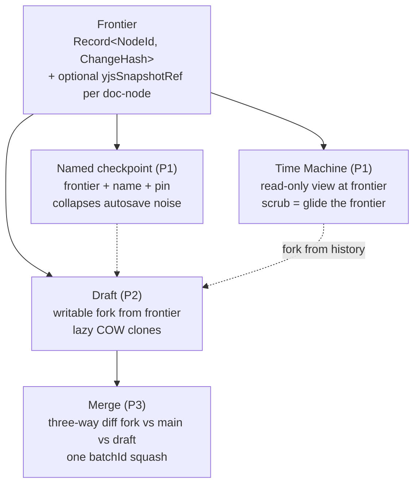
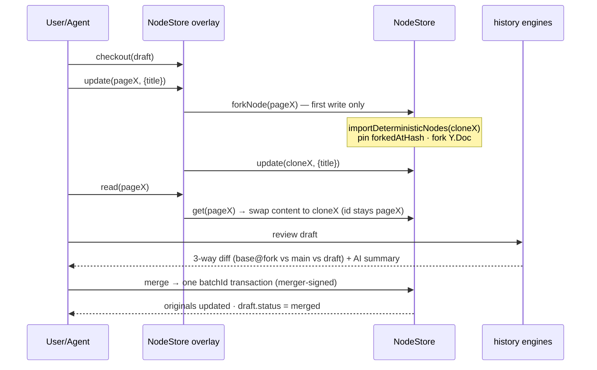
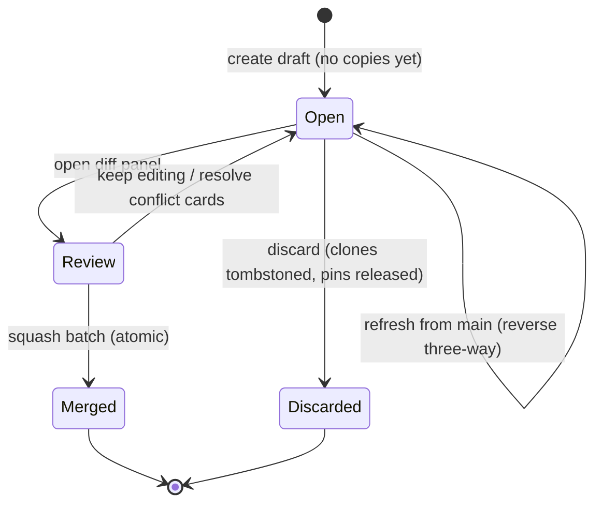

# Patchwork-Style Drafts and Timeline Scrubbing: Branching the Change Log

> Exploration 0329 · 2026-07-14
>
> Direct sequel to `0327_[_]_PATCHWORK_VS_XNET_LEARNING_FROM_INK_AND_SWITCHS_CLOSEST_PARALLEL.md`,
> which named drafts as xNet's flagship gap and sketched "A1 clone-and-replay".
> This document is the design: what drafts and high-quality timeline scrubbing
> actually look like on our substrate, for **all** data types — record
> properties, rich text, canvases, databases, and the edge families
> (comments, chat, files) mapped in the F7 coverage matrix.

## Problem Statement

Two user-facing capabilities, one substrate question:

1. **Timeline scrubbing** — grab a scrubber and glide any page, task, canvas,
   database, or a whole workspace backward and forward through time, with
   named versions, per-author attribution, readable diffs, and one-click
   restore. Quality bar: Google Docs version history × Figma history ×
   Patchwork's dynamic-history findings — not a devtools debug panel.
2. **Drafts (branching)** — fork any node (or set of nodes) into a private
   working copy, edit freely (human or agent), review a diff against a moving
   main, and merge back in one reviewed operation. Patchwork demonstrated the
   UX shape; 0327 chose clone-and-replay; this doc fills in the mechanics.

The substrate question: our log is signed, hash-chained, per-property LWW —
not a CRDT with native heads/`merge()`. What do fork, frontier, diff, and
merge *mean* here, and how much machinery already exists?

## Executive Summary

**The unifying insight: drafts and scrubbing are the same feature at two
trust levels, joined by one new primitive — the *frontier*.** A frontier is a
per-node map of positions in the change log (`Record<NodeId, ChangeHash>`),
the LWW-log analogue of Automerge heads:

- **Scrub** = a read-only view of a node set materialized *at* a frontier.
- **Named checkpoint** = a frontier with a name, pinned against pruning.
- **Draft** = a *writable continuation* forked from a frontier (copy-on-write
  clones), reviewed as frontier-vs-frontier diff, merged as one batch.

Research verdicts that shape everything (1–5 verified in code; 6 follows
from room-based sync scoping and carries the caveat noted):

1. **The scrubbing engines already exist and nobody uses them.**
   `PlaybackEngine`, `ScrubCache`, `SchemaTimeline`, `SchemaScrubCache`,
   `materializeMultipleAt` are implemented and tested in `packages/history`
   but have **zero UI consumers** — no devtools panel, no app surface. For
   record properties, "high-quality scrubbing" is mostly a product/UI project
   plus a frontier abstraction, not an engine project.
2. **Yjs content has no history in production at all.** Doc bytes live as one
   merged blob in the `yjs_state` table (not in the change log); snapshot
   capture (`DocumentHistoryEngine`) is wired only in devtools/seed. A latent,
   fully-built `YjsChange` tier (`yjs-change.ts`, `YjsBatcher`) could put Yjs
   updates in the signed log but is deliberately unwired. Scrubbing rich
   text/canvas requires new capture wiring — the largest single work item.
3. **Pruning is the enemy of history, and there is no pin mechanism.**
   `PruningEngine` deletes changes below snapshots; hash targets then throw
   and index/wall targets **silently remap to different changes** — a
   correctness hazard today, fatal for drafts (a fork point could be pruned
   out from under a draft). Frontiers, checkpoints, and fork points must pin
   changes; pruning must learn to respect pins.
4. **Merge must be a squash, authored by the merger.** `payload.nodeId` is
   inside the hashed, Ed25519-signed body of every change — replaying a
   clone's changes verbatim onto the original is cryptographically impossible
   without the author's key. Instead: three-way property-level diff (fork
   vs original-now vs clone-now), applied as one `batchId` transaction that
   the merging user signs. This is the **fourth consumer** of a pattern the
   codebase already proves three times (`UndoManager` compensating changes,
   `createRevertPayload`, `restoreSchemaAt`) — and property-granular three-way
   merge structurally avoids Figma's #1 branching complaint (whole-object A/B
   conflict resolution).
5. **The overlay's home is `NodeStore`, as content-swap-at-hydrate.** There
   is no single React choke point (`useNode` reads the store directly;
   `useQuery` goes through the bridge) — both converge only at
   `NodeStore.get/list/query` (plus the private `getNodesById` batch path).
   Swapping hydrated content (keeping
   original ids in MV lists and grid ordering) is MV-safe; only
   filtered/sorted-property edits need deeper query participation (deferred).
6. **Clones are ordinary nodes in a private container → creative privacy
   comes cheap, with one caveat.** Clones never enter a *share* room, but the
   personal node-sync room publishes every local change unfiltered today —
   device-local drafts need a small outbound exclusion filter in
   `NodeStoreSyncProvider` (cross-user privacy meanwhile rests on hub room
   access control, rated weak in 0307). Modest machinery, not zero.

**Recommended path — five phases:** P1 the **Time Machine** (read-only scrub
+ named checkpoints + restore + pinning, records first, Yjs snapshot capture
wired in); P2 **drafts core** (fork/checkout/edit/discard behind the
NodeStore overlay); P3 **merge review** (three-way diff panel, AI change
summaries, auto-refresh-from-main); P4 **agent-PR** (assistant writes land in a
draft by default); P5 **query-grade drafts** (clone scalars participate in
filtered grids, shared multi-author drafts). Upwelling's hard-won lessons are
adopted as constraints: **no draft-on-draft nesting**, multi-author drafts
with attribution, drafts auto-refresh against main.

## Current State In The Repository

### Lane 1 — record-property history: rich, per-node, unconsumed

- `Change<T>` (`packages/sync/src/change.ts`): `hash`, single `parentHash`,
  `authorDID`, Ed25519 `signature` over the blake3 hash of the
  canonical-JSON body (which **includes `payload.nodeId`**), `lamport`,
  `wallTime`, `batchId/batchIndex/batchSize`. DAG helpers exist in
  `packages/sync/src/chain.ts` (`getChainHeads`, `getForks`,
  `findCommonAncestor`, `getAncestry`) but `topologicalSort` linearizes before
  replay — forks are flattened, never kept as branches.
- `HistoryEngine.materializeAt(nodeId, target)`
  (`packages/history/src/engine.ts`): replays one node's linearized chain to a
  `HistoryTarget` (`{lamport}|{wall}|{hash}|{index}|{relative}|{latest}`),
  seeded from the nearest `SnapshotCache` entry (interval 100, per-node LRU
  50, 50 MB global cap). `materializeMultipleAt` applies **one shared target**
  per node — coherent for `lamport`/`wall`, per-node for `hash`/`index`.
  Notably, `applyChangeToState` ignores `payload.nodeId` — the reducer can
  replay foreign changes in memory; only the store routes by id.
- `DiffEngine.diffNode(nodeId, from, to)` — property-level diffs
  (`added|modified|removed` + `changedAt/changedBy`) between **any two**
  targets. `BlameEngine` gives per-property attribution with full value
  history. `AuditIndex` filters by author/schema/time/batch.
  `HistoryEngine.createRevertPayload` and `restoreSchemaAt`
  (`schema-timeline.ts`) generate compensating patches — restore is
  effectively already implemented.
- `SchemaTimeline.getMergedTimeline(schemaIRI)` +
  `materializeSchemaAt(timeline, index)` — a genuine multi-node "table as of
  position" over a **single Lamport-merged line**, with `SchemaScrubCache`
  seek acceleration (resolution 20). The closest thing to a workspace
  frontier, scoped to one schema.
- `PlaybackEngine` (`playback.ts`) — a play/pause/seek/step transport over a
  linear index. **Grep-verified: no consumer anywhere** (nor for `ScrubCache`,
  `SchemaTimeline`, `materializeMultipleAt`). The devtools `HistoryPanel`
  (`packages/devtools/src/panels/HistoryPanel/`) is single-node only — a
  basic index slider plus a snapshot-based Document tab — and never touches
  `PlaybackEngine`/`ScrubCache`; no app surface exposes history at all
  (`grep @xnetjs/history apps/` → nothing).
- `UndoManager` (`undo-manager.ts`) — per-node compensating-change undo,
  P2P-safe, consumed by `packages/runtime/src/client.ts` and React hooks.
  Captures `previousValues` from emitted prior state, applies
  `store.update(nodeId, {properties: previousValues})`.
- `PruningEngine` (`pruning.ts`): `DEFAULT_POLICY` keep-200/30-day/threshold-
  500, `MOBILE_POLICY` 50/7-day/100. Deletes changes below the snapshot;
  `protectedSchemas` is the **only** protection — no per-change pins, no
  ref-counting. After pruning, `{hash}` targets throw; `{index}`/`{wall}`
  targets silently resolve against the shortened array. `VerificationEngine`
  gates pruning — but its signature branch is stubbed (flagged as a separate
  fix task).

### Lane 2 — Yjs facet history: absent in production

- The `document: 'yjs'` facet is declared by twelve schemas (page, canvas,
  database, database-row, task, project, milestone, meeting, experiment, and
  CRM's Organization, Contact, and Deal —
  `packages/data/src/schema/schemas/`). A node's Y.Doc GUID
  **is the node id** at every construction site (`packages/runtime/src/sync/
  node-pool.ts`, `packages/canvas/src/store.ts`, `packages/react/src/hooks/
  useNode.ts`, …), and `yjs_state.node_id` is a PK/FK to `nodes(id)`.
- Persistence is a **single merged blob**: NodePool debounces
  `Y.encodeStateAsUpdate(doc)` into `yjs_state` (`packages/data/src/store/
  sqlite-adapter.ts`, `packages/sqlite/src/schema.ts`). Sync wraps raw
  updates in signed envelopes — production signs the **V1** format
  (`signYjsUpdate` → `signYjsUpdateV1`, Ed25519 over BLAKE3 of the update
  bytes only, `packages/sync/src/yjs-envelope.ts` — **no document binding**);
  the docId-bound V2 format (`signYjsUpdateV2` + `AuthorizedYjsSyncProvider`'s
  `meta.docId === nodeId` check + the hub's optional `verifyV2Envelope` hook)
  exists but is as unwired as the `YjsChange` tier. Either way, **Yjs bytes
  never enter the change log** in production.
- A complete alternative tier exists, unwired: `YjsChange =
  Change<YjsUpdatePayload>` with `type: 'yjs-update'`
  (`packages/sync/src/yjs-change.ts`) plus `YjsBatcher` (2 s signing
  amortization) — referenced only by feature negotiation and security policy.
- `DocumentHistoryEngine` (`packages/history/src/document-history.ts`) stores
  `Y.snapshot` + **full doc state** per capture into `yjs_snapshots`
  (min-interval 5 s, max 100/node, oldest-evicted) and reconstructs via
  `Y.createDocFromSnapshot` / fresh `Y.Doc({gc:false})`. **Capture is wired
  only in devtools/seed** (`DevToolsContext.ts`, `seed-runner.ts`).
- `gc: false` is set at every *persisting* Y.Doc construction site
  (snapshot-compatible tombstones retained) — the one exception is a
  transient read-only reader (`useReverseRelations.ts`) that never writes
  back; NodePool warns about unbounded `yjs_state` growth.
- Databases are **trees of Y.Docs**: one doc per database (`data` map of
  columns/views) plus one per row that has rich-text columns
  (`richtext_<columnId>` fragments — `packages/data/src/database/
  rich-text-cell.ts`). Scalar cells are ordinary LWW properties.
- Canvas undo is a separate `Y.UndoManager` (`packages/canvas/src/undo.ts`);
  record undo never touches Yjs.

### Lane 3 — branching: nothing, but every ingredient is stocked

- No clone/fork/draft mechanism exists (grep-verified; `database/clone.ts` is
  a structural id-remapped schema copy, not a node fork; `duplicateField/
  Column/View` copy into new ids with no link back).
- **Lazy COW has a store-level shape**: `store.get(X)` →
  `importDeterministicNodes([{id: Y, schemaId, properties}])`
  (`store.ts`) — one signed change carrying the full property snapshot. A raw
  SQL row-copy would be cheaper but unsigned and un-synced; rejected.
- **Atomic merge has a store-level shape**: `transaction(operations)` mints
  one `batchId`, one lamport tick, all-or-nothing via `withTransaction`.
- **Relation remapping has prior art**: temp-id resolution
  (`store/tempids.ts`) rewrites `~`-prefixed ids inside relation-typed
  properties during a transaction — exactly the mechanism merge needs for
  clone→original id rewriting.
- **The read choke point is `NodeStore`**: `useNode` calls `store.get`/
  `subscribeToNode` directly (`packages/react/src/hooks/useNode.ts`), while
  `useQuery` goes through `MainThreadBridge.query` → `store.query`
  (`packages/react/src/hooks/useQuery.ts`,
  `packages/data-bridge/src/main-thread-bridge.ts`). Only the store sees 100%
  of reads. `XNetContext` (`packages/react/src/context.ts`) is where
  checked-out-draft state belongs.
- **MV/grid machinery keys on node ids**: MV tables cache ordered id lists
  per descriptor hash; the bridge's delta invalidation (0317) and
  `reuseEquivalentNodeReferences` rely on `NodeState` reference stability —
  an overlay must respect both.
- **Sync scoping is room-based** (`packages/runtime/src/sync/
  node-store-sync-provider.ts`): nodes in an unshared private container never
  publish. Draft privacy needs zero new machinery.
- **Perf harnesses exist** for the overlay spike:
  `packages/data/benchmarks/sqlite-node-store.bench.ts` (to 1 M+ nodes),
  `hydration-benchmark.test.ts`, bridge benches, plus the 0318 10 M-row
  envelope and the 0266 stopping rule (cold first-rows < 100 ms p95).

## External Research

Condensed to what changes our design (full comparison in 0327):

- **Patchwork drafts** (patchwork-base `drafts/`): lazy per-doc COW behind a
  provider that remaps handle resolution; fork point = heads at first touch;
  merge = substrate `merge()`; checkpoints pin per-doc from/to heads for
  frozen time-travel diffs; a clone-policy excludes account/contact/draft
  docs from forking. We adopt the *shape* (lazy COW, overlay transparency,
  member exclusion policy, frontier checkpoints) and replace the substrate
  moves (their `merge()` → our squash transaction).
- **Upwelling** (Ink & Switch, 2023): drafts-as-layers with three findings we
  adopt as constraints — (1) **draft-on-draft dependencies made the model
  incomprehensible and were removed entirely**; (2) single-author drafts
  frustrated collaborators → multi-author drafts with attribution; (3) drafts
  should **float**: auto-rebase over main as others merge, so "what a
  reviewer read is what merges."
- **Patchwork notebook 03/04/05/09**: offer a **small fixed set of history
  groupings** (author/time/zoom), not infinite query flexibility; best diff
  visualizations were hover-to-reveal-deleted and a **minibar/heatmap of
  change density**; count words/sentences, not characters; let users edit
  first and **retroactively group + name** ("formality on demand");
  **AI-generated per-change summaries beat every hand-built diff view** —
  their strongest history finding.
- **Figma branching backlash**: conflicts force whole-frame A/B choices with
  poor localization — the #1 complaint. Per-property three-way merge is our
  structural answer; lead with it.
- **Dolt / lakeFS**: cell-wise three-way merge (column-disjoint edits on one
  row auto-merge — our per-property LWW is already finer); branches as
  pointer sets over shared immutable storage (zero-copy). Diffs as
  *queryable relations* (`dolt_diff_*`) — our AuditIndex could grow the same.
- **Datomic/XTDB**: time-travel stays cheap when time is a **trailing
  coordinate in the same index** (as-of = scan + filter) plus periodic
  memoized folds — which is exactly `SnapshotCache` + linear replay; a
  common event-sourcing rule of thumb is to snapshot once replay exceeds
  interactive latency (~100 ms).
- **Automerge/Yjs**: `view(doc, heads)` is O(1) and reference-sharing — store
  heads, never full copies (our frontier analogue); Yjs snapshots are
  DeleteSet+StateVector (need `gc:false`, which we already run);
  **relative positions** are the anchor primitive that survives time travel;
  `Y.encodeStateAsUpdate(doc, stateVector)` yields exactly the post-fork
  delta needed for merge-back.
- **Scrub UX bar**: Google Docs' **named versions collapsing autosave noise**
  (the single most copyable pattern); video-editor scrubbers (thumbnails at
  stops, keyboard nav); Notion's paywalled history as the anti-pattern —
  never gate history depth in a local-first product.

## Key Findings

### F1. The frontier is the one missing primitive

Everything else exists in parts. Define it once, use it three ways:



`chain.ts` already ships `getAncestry`/`findCommonAncestor`; the frontier
type, its persistence (a `Checkpoint` node schema), and "latest change ≤ t
per node" construction (Patchwork's checkpoint approximation) are new but
small. The scrub axis for a *set* of nodes generalizes `SchemaTimeline`'s
merged-Lamport-line from "all nodes of a schema" to "arbitrary membership"
(a workspace, a database, a page + its comment threads).

### F2. Scrubbing records is a wiring project; scrubbing Yjs is a capture project

For record properties, P1 is: frontier + generalized merged timeline +
`ScrubCache` seek + the unconsumed `PlaybackEngine` transport + a real UI.
For Yjs facets, nothing is captured in production — the choice (Options O3)
is between wiring `DocumentHistoryEngine` auto-capture (coarse,
storage-bounded, zero protocol impact) and enabling the latent `YjsChange`
log tier (keystroke-fine, but log growth is exactly the 0249 cliff and
pruning could corrupt CRDT replay). P1 wires capture; the log tier stays
deferred. Scrub granularity for rich text is therefore snapshot cadence
(session boundaries + min-interval + forced capture on named checkpoints) —
consistent with the 1000 ms durability floor philosophy (0323): we scrub
*meaningful* states, not keystrokes.

### F3. Pruning and history are currently enemies; pins make peace

Three concrete defects to fix in P1, before any feature depends on deep
history: (a) add a **pin registry** (`pinned_changes(hash, reason,
owner_id)`) that `PruningEngine.pruneNode` must exclude below-snapshot;
checkpoints pin their frontier hashes, drafts pin their fork points; (b)
make scrub/diff targets **hash-anchored** (never index/wall internally) so a
prune degrades to an explicit "history horizon" instead of silently remapping
to the wrong change; (c) surface the horizon in the Time Machine UI ("older
history was compacted on this device") — honesty beats Notion-style hidden
depth. `yjs_snapshots` gets the same treatment: checkpoint-referenced
snapshots are never evicted by the 100-per-node cap.

### F4. Merge is a squash the merger signs — and that is a feature

Signatures force it (code-verified in Lane 1: `payload.nodeId` is hashed and
signed; retargeting requires the original author's key), but the shape is
independently right:

- Three-way, per property: `base = state@forkedAtHash`, `ours =
  original@now`, `theirs = clone@now`. Only *both-sides-changed-differently*
  properties conflict — everything else auto-merges. For property-level
  edits, Figma's failure mode is structurally avoided; Yjs-facet overlap
  remains a review-UX concern (below).
- The merge transaction is the **fourth consumer** of the proven
  "diff two NodeStates → sparse property patch → transaction" pattern
  (undo, revert, schema-restore). Provenance is recorded on the Draft node
  (source clone ids, fork/merge hashes, contributing authors), not forged
  into signatures — attribution without key sharing, mirroring how a git
  squash-merge credits authors in the message.
- Yjs facets merge on the other lane: apply the clone doc's post-fork delta
  (`Y.encodeStateAsUpdate(cloneDoc, forkStateVector)`) to the original doc,
  re-wrapped in an envelope for the original node id (raw updates carry no
  GUID; today's production V1 envelopes carry no doc binding at all — the
  `meta.docId` re-wrap only matters once the V2/authorized path is wired).
  Replica convergence follows from CRDT semantics given the full-state fork
  (the clone shares the original's struct history) — but convergence is not
  semantic correctness: concurrent same-region rich-text or canvas edits
  merge silently with no conflict card, so the review diff must make Yjs
  overlap visible.

### F5. The overlay lives in `NodeStore`, swaps content at hydrate, and keeps original ids everywhere else

MV id lists, grid ordering, delta invalidation, and reference-reuse all key
on node ids. Content-swap-at-hydrate (`get`/`list`/`query` results, plus the
private `getNodesById` batch path) gives draft transparency to every
consumer — `useNode` and `useQuery` alike — without perturbing any of them. Boundary cases, accepted
for P2 and fixed in P5: edits to a **filtered or sorted** property show the
original's membership/order in grids until clone scalars participate in
query evaluation; reference-stability caches must treat "checked-out draft
changed" as an invalidation epoch.

### F6. Draft privacy and lifecycle come cheap — with one sync caveat

Clones are ordinary nodes inside a `Draft` container with creator-private
authorization. They never enter a *share* room (share rooms carry specific
shared containers) — but the personal node-sync room publishes **every**
local change unfiltered (`node-store-sync-provider.ts` subscribes to the
whole store; the room defaults to the author's DID via
`packages/react/src/context.ts`). Cross-user privacy therefore rests on hub
room access control (rated weak in 0307) until P2 adds a small outbound
exclusion filter for device-local drafts — modest machinery, not zero.
Patchwork's clone-policy lesson maps to a **never-fork list**: Space,
SpaceMembership, Profile, Draft itself, Comment (comments stay live and
anchored via relative positions — review threads should not fork with
content). Upwelling's lessons become invariants: `Draft` has **no
parent-draft relation** (no nesting); any member of the draft's space may
write to it (multi-author — attribution *inside* the draft is free via
`authorDID`, though after a squash-merge main-side blame shows the merger,
and draft authorship survives only in provenance metadata the history UI
must overlay); and "refresh from main" is the same three-way squash applied
in the opposite direction (main → clone), automated in P3.

### F7. Coverage matrix — what "all data types" means

| Type | Scrub | Checkpoint | Fork | Merge |
| --- | --- | --- | --- | --- |
| Record properties (tasks, CRM fields, …) | P1, change-level | ✓ | ✓ | three-way property squash |
| Rich text (`content-v4`) | P1, snapshot cadence | ✓ (forced capture) | Yjs state-vector fork | delta apply; overlap surfaced in review (F4) |
| Canvas scene Y.Docs | as rich text | ✓ | as rich text | as rich text |
| Database + rows | records + per-row doc recursion | ✓ | recurse the doc tree | per-cell three-way + rich-cell deltas |
| Comments | record lane | ✓ | **never-fork** — stay live, anchored | n/a |
| Chat messages / channels | record lane (append-only) | ✓ | **never-fork** — conversational record; DMs are space-less (0304) so draft membership is undefined there | n/a |
| Files / blobs | reference-level (property history) | pins retain referenced blob hashes, or declare an explicit blob horizon (P1) | fork copies the *reference* — blobs are immutable content-addressed | reference three-way |

## Options And Tradeoffs

### O1 — Draft representation

| Option | Mechanism | Verdict |
| --- | --- | --- |
| **Clone-and-squash (chosen)** | Real clone nodes via one signed snapshot-create; overlay for transparency; three-way squash merge | No protocol change; sync/authz/undo free; review = existing DiffEngine; 0327's A1 with merge semantics corrected for signatures |
| Log-level `branchId` lane | Branch column on `Change<T>`; store materializes per-branch | Protocol **major** (4 conformance kernels + Python/Swift refs, 0305 lesson); every store/query/hub path branch-aware; rejected |
| Sparse sidecar overlay | Draft node stores only changed properties (like `ext:` overlay); compose at read | No protocol change, tiny writes — but Yjs facets need full doc forks anyway, composition hits every read, queries see phantom states, merge loses three-way base; rejected |

### O2 — Overlay placement

| Option | Coverage | Verdict |
| --- | --- | --- |
| **`NodeStore` hydrate (chosen)** | 100% of reads (both hook paths converge there) | One implementation; MV-safe content swap; ~one `Map.get` per hydrated row — benchmark against 0266 budget |
| React hooks / `XNetContext` only | Misses direct store consumers; `useNode` and bridge diverge | Two implementations, drift risk; rejected (context still *scopes* the checked-out state) |
| Bridge only | Misses `useNode` entirely | Rejected outright |

### O3 — Yjs history capture

| Option | Granularity | Cost | Verdict |
| --- | --- | --- | --- |
| **Auto Y.snapshots in production (chosen for P1)** | Session/interval + forced at checkpoints | Full doc state per capture (bounded: cap + eviction, pinned checkpoints exempt) | Zero protocol impact; matches "meaningful states" philosophy; ships scrubbing now |
| Enable latent `YjsChange` log tier | Every batched update (2 s) | Log growth = the 0249 cliff class; pruning a Yjs delta corrupts replay; needs pin-aware pruning first | Deferred — revisit after P1 pins + 0254 compaction land |
| Do nothing | — | — | Fails the brief: no rich-text/canvas scrub |

### O4 — Merge stamping

| Option | Verdict |
| --- | --- |
| **Fresh changes authored by merger + provenance on Draft node (chosen)** | Signature-clean, P2P-honest, matches undo/revert precedent; attribution via recorded metadata |
| "Graft" API bypassing hash/signature verification for local branch replay | Poisons the authenticity story (0307 — authenticity is the strong half); any peer re-verifying the chain rejects grafted changes; rejected |
| Re-sign clone changes as original authors | Requires other users' private keys; impossible by design |

### O5 — The scrub axis

| Option | Verdict |
| --- | --- |
| **Merged Lamport line per scope (chosen)** | Generalize `SchemaTimeline` to arbitrary node sets; one integer axis drives `PlaybackEngine` unchanged; frontier derived per position; matches Patchwork's "approximate but good enough" per-doc pinning |
| Full per-node frontier algebra everywhere | Maximum generality, no linear axis for a scrubber UI to bind to; keep as internal representation only |

## Recommendation

Ship in five phases, each independently valuable:

- **P1 — Time Machine (scrub + checkpoints + restore).** Frontier type +
  `Checkpoint` schema; pin registry + hash-anchored targets + horizon UX in
  `PruningEngine`; generalize `SchemaTimeline` → `ScopeTimeline`; wire
  `DocumentHistoryEngine` auto-capture into NodePool's persist path; build
  the scrubber UI as a **context tool** (0327 C — first consumer) with
  density minibar, named-versions toggle, author colors, hover-reveal
  deletions, keyboard nav, and one-click restore (`createRevertPayload` /
  `restoreSchemaAt` already exist). Records scrub at change granularity;
  docs scrub at snapshot granularity.
- **P2 — Drafts core.** `Draft` schema + never-fork policy; lazy COW fork
  (`importDeterministicNodes` snapshot-create + Yjs state-vector fork);
  `NodeStore` hydrate overlay scoped by `XNetContext`; draft switcher UI;
  discard. Perf spike against `sqlite-node-store.bench.ts` first (0266
  budget), Pages + Tasks first.
- **P3 — Merge review.** Three-way property squash in one `batchId`
  transaction with temp-id-style relation remapping; Yjs delta merge;
  conflict cards for both-sides-changed properties (0296 machinery shape);
  AI change summaries as the default timeline/review row (managed-AI budget
  aware); auto-refresh-from-main.
- **P4 — Agent-PR.** Assistant/`agentTools` writes target a draft by default;
  review-then-merge becomes the human gate (0327's headline use case).
- **P5 — Query-grade drafts.** Clone scalar participation for filtered/sorted
  grids; shared multi-author drafts (draft container in a room; traffic cost
  accepted knowingly — raises 0254 compaction priority).

## Example Code

```ts
// packages/data/src/schema/schemas/draft.ts (sketch)
export const DraftSchema = defineSchema({
  name: 'Draft',
  namespace: 'xnet.fyi',
  properties: {
    name: text(),                       // Upwelling: titles that signal intent
    status: select({ options: [
      { id: 'open', name: 'Open' },
      { id: 'merged', name: 'Merged' },
      { id: 'discarded', name: 'Discarded' },
    ] as const }),
    target: relation({}),               // any-node relation: host being drafted
    // originalId -> fork bookkeeping (json until a relation-map lands)
    entries: json<Record<NodeId, DraftEntry>>(),
    mergeProvenance: json<MergeProvenance | undefined>(),
    // deliberately ABSENT: parent draft (no nesting — Upwelling)
  },
  authorization: privateToCreator(),    // NEW preset (P2 item); P5 relaxes to space-scoped
})

export type DraftEntry = {
  cloneId: NodeId
  forkedAtHash: string          // pinned in pinned_changes
  forkedAtYjsStateVector?: Uint8Array // for post-fork delta on merge
  forkYjsSnapshotRef?: string   // yjs_snapshots key, pinned; diff baseline
  mergedAtHash?: string
}

// Frontier — the shared primitive (packages/history/src/frontier.ts)
// hash-anchored (never index/wall); yjsSnapshotRef pins the doc lane per node
export type Frontier = Record<NodeId, { hash: ChangeHash; yjsSnapshotRef?: string }>

// Lazy COW on first write through the overlay
async function forkNode(store: NodeStore, draft: DraftHandle, id: NodeId) {
  const original = await store.get(id)
  const cloneId = createNodeId()
  await store.importDeterministicNodes([
    { id: cloneId, schemaId: original.schemaId, properties: original.properties },
  ]) // ONE signed change = the fork point
  const forkedAtHash = await headHash(store, id) // NEW accessor over adapter getChanges (P2 item)
  await pinChange(forkedAtHash, { reason: 'draft-fork', owner: draft.id })
  const yjs = await forkYjsIfPresent(id, cloneId) // encodeStateAsUpdate → setDocumentContent
  draft.recordEntry(id, { cloneId, forkedAtHash, ...yjs })
}

// NodeStore hydrate — the overlay seam (content swap, original ids preserved)
private overlay(states: NodeState[]): NodeState[] {
  const draft = this.checkedOutDraft
  if (!draft) return states                    // zero-cost when inactive
  return states.map(s => {
    const entry = draft.entries[s.id]
    return entry ? { ...this.mustGet(entry.cloneId), id: s.id } : s
  })
}

// Merge — three-way squash, one batch, merger-signed
async function mergeDraft(store: NodeStore, draft: DraftHandle) {
  const ops: TransactionOperation[] = []
  for (const [originalId, e] of Object.entries(draft.entries)) {
    const base = await history.materializeAt(originalId, { type: 'hash', hash: e.forkedAtHash })
    const ours = await store.get(originalId)
    const theirs = await store.get(e.cloneId)
    const { patch, conflicts } = threeWayPropertyMerge(base, ours, theirs,
      { remapRelations: cloneToOriginalIdMap(draft) }) // tempids.ts pattern
    if (conflicts.length) return { needsReview: conflicts }
    ops.push({ type: 'update', nodeId: originalId, options: { properties: patch } })
  }
  // Draft-born nodes → temp-id creates on main; draft deletions → tombstones
  ops.push(...promoteDraftCreations(draft), ...draftDeletionOps(draft))
  await store.transaction(ops)                 // one batchId — atomic for record ops
  await mergeYjsDeltas(draft)                  // Yjs lane follows; idempotent, re-run on crash
  draft.setStatus('merged')                    // only after BOTH lanes commit
  draft.recordProvenance(/* clone ids, hashes, authors */)
}
```





## Risks And Open Questions

- **Overlay hot-path cost.** One map lookup per hydrated row on
  `getNodesById`/query paths; must hold the 0266 budget (cold first-rows
  < 100 ms p95) with the overlay *inactive* (the common case — guard with a
  null check) and degrade gracefully when active. Spike against
  `sqlite-node-store.bench.ts` and `hydration-benchmark.test.ts` before P2
  commitment. Reference-reuse caches (`flattenNodeCached`,
  `reuseEquivalentNodeReferences`) need a draft-epoch invalidation key.
- **`yjs_snapshots` growth.** Full doc state per capture × capped 100/node is
  already the devtools cost model; production capture multiplies it across
  every doc-bearing node. Mitigations: session-boundary capture (not
  interval-only), delta-encoding later, pinned-only retention for old
  snapshots. Needs measurement in P1.
- **Scrub coherence is approximate across nodes.** "Latest change ≤ position
  per node" (Patchwork's own approximation) can pair states that never
  coexisted (cross-node causality isn't captured). Acceptable for a scrubber;
  checkpoints created *live* record exact frontiers and are exact forever.
- **Merge-time relation dangling.** A clone may reference nodes created
  inside the draft (remapped), deleted on main (dangle), or filtered by
  never-fork policy (kept live). Orphan handling shape exists
  (`commentOrphans.ts`) but the policy table needs writing in P3.
- **Merge spans two durability lanes.** The record squash commits in one
  transaction; Yjs deltas apply immediately after. A crash between them
  leaves originals half-merged — the Yjs application must be idempotent and
  re-runnable on recovery, and `draft.status` flips to merged only after
  both lanes land. (A true single durability boundary would require Yjs
  bytes in the record transaction — the deferred `YjsChange` tier.)
- **Post-merge blame quality.** Squash-merge makes the merger the signer of
  record on main; `BlameEngine` and per-author scrub colors lose draft-author
  granularity unless the history UI overlays Draft provenance (P3 item).
- **Undo × drafts.** Per-node undo stacks key on clone ids while checked out
  — undo inside a draft works untouched; undoing a *merge* means reverting a
  batch (UndoManager already supports batch undo). Verify in P3 tests.
- **AI summary cost and privacy.** Summaries hit the managed-AI budget
  (0244) and ship change content to the model — must respect the consent
  spine (0210) and be off by default for E2EE-sensitive spaces.
- **Conflict UX debt.** Both-sides-changed cards need design; 0296's
  cross-author divergence surfacing is the seed, but a review panel is a new
  surface (build as the second context tool, after the Time Machine).
- **Deferred: keystroke-grade text scrub.** If users demand finer rich-text
  history than snapshots give, the `YjsChange` tier is the path — but it is
  gated on pin-aware pruning plus 0254 compaction, and its log-growth math
  must be modeled against the 0249 cliff first.
- **Numbering.** 0328 is claimed by a sibling worktree (tldraw); this doc
  takes 0329 (collision rule: scan all branches + worktrees, earliest wins).

## Implementation Checklist

**P1 — Time Machine**
- [x] `Frontier` type + construction helpers (`latest ≤ position` per node)
      in `packages/history` (new `frontier.ts`), hash-anchored only.
- [x] `Checkpoint` node schema (name, frontier incl. per-node
      `yjsSnapshotRef`, creator, note) + create/list APIs; forced
      `DocumentHistoryEngine.forceCapture` on checkpoint.
- [x] Pin registry: `pinned_changes` table + `PruningEngine` exclusion +
      `yjs_snapshots` pinned-exempt eviction + referenced-blob retention (or
      an explicit blob horizon); migration.
- [x] Prune-horizon: internal targets become hash-anchored; pruned-below
      resolution returns an explicit `HistoryHorizon` result, surfaced in UI.
- [x] `ScopeTimeline` (generalized `SchemaTimeline`) over arbitrary node
      sets + `ScopeScrubCache`; bind to the existing `PlaybackEngine`.
- [x] Production Yjs capture: NodePool persist hook → throttled
      `captureSnapshot` (session-boundary + min-interval).
- [x] Time Machine UI as the first **context tool**: scrubber with change-
      density minibar, named-versions toggle, author colors, word/sentence
      deltas, hover-reveal deletions, keyboard nav, restore button
      (`createRevertPayload`/`restoreSchemaAt`).
- [x] Changesets for touched publishable packages (`history`, `data`,
      `sync`, `sqlite`, `react`) — pin-registry schema bump per policy.

**P2 — Drafts core**
- [x] Perf spike: hydrate-overlay cost at 1 M nodes, inactive and active,
      against the 0266 budget; go/no-go gate.
- [x] `Draft` schema + `DraftEntry` + never-fork policy list; no parent-draft
      relation (nesting forbidden).
- [x] `forkNode` (snapshot-create + pin + Yjs SV fork; recurse database row
      docs); lazy trigger on first overlay write.
- [x] `NodeStore` overlay: checked-out state, content-swap in
      `get`/`list`/`query` hydration (incl. the private `getNodesById` batch
      path); `XNetContext` scoping;
      draft-epoch cache invalidation.
- [ ] Draft switcher UI (create/checkout/main/discard) on Pages + Tasks.
- [x] Outbound sync exclusion: `NodeStoreSyncProvider` filter so
      draft-container members never publish to the personal node-sync room
      (device-local drafts).
- [x] New helpers: `privateToCreator()` authorization preset; `headHash`
      accessor over adapter `getChanges`.

**P3 — Merge review**
- [x] `threeWayPropertyMerge` + relation remap via temp-id machinery;
      create/delete op kinds (draft-born nodes promoted via temp-ids with
      provenance-recorded ids; draft deletions tombstone originals, conflict
      card if main also edited); one `batchId` squash; conformance-style
      tests pinning merge determinism.
- [x] Yjs post-fork delta merge (SV-based), idempotent + re-runnable on
      crash recovery; `draft.status` transitions only after both lanes
      commit; envelope re-wrap for original id (binding matters once the
      V2/authorized envelope path is wired).
- [x] Auto-refresh: reverse three-way applied on main-side change events
      while a draft is open; pauses on conflict cards (Upwelling's floating
      drafts).
- [ ] Review panel (second context tool): per-property cards, Yjs text diff
      via fork snapshot (making same-region overlap visible), conflict
      resolution, AI change summaries (budget/consent-gated);
      provenance-author overlay on merged batches (blame recovery).

**P4 — Agent-PR**
- [ ] `agentTools`/assistant writes default into a draft; merge request
      surfaced in Inbox/Requests; end-to-end demo in seeded workspace.

**P5 — Query-grade drafts**
- [x] Clone scalar participation in `queryNodes` under checkout (filtered/
      sorted grids correct); shared drafts (container in room) + traffic
      measurement; revisit `YjsChange` tier decision.

## Validation Checklist

- [x] Scrubbing a 5k-change page and a 100k-change workspace seeks at
      interactive latency (< 100 ms per seek after warm ScrubCache), with
      correct states verified against golden replays.
- [ ] A pruned node scrubs to its horizon and *says so*; no silent remap
      (test: prune, then resolve a pre-prune wall/index target → explicit
      horizon, not a wrong state).
- [ ] Checkpoints survive pruning (pinned hashes + pinned Yjs snapshots
      restorable after aggressive `MOBILE_POLICY` pruning).
- [ ] Restore round-trip: restore to checkpoint → new compensating batch →
      undo restores present (UndoManager batch undo).
- [ ] Fork → edit (records + rich text + canvas + database row) + create a
      node in-draft + delete a node in-draft → merge converges: originals
      reflect draft state, draft-born nodes are promoted with remapped ids,
      deletions tombstone originals; LWW conformance vectors pin merge
      determinism; Yjs originals re-merge cleanly on a second device; a crash
      injected between the record batch and the Yjs lane recovers to a fully
      merged state on retry.
- [ ] Draft privacy: an unshared draft's clones never appear in any
      share-room publish, are excluded from the personal node-sync room by
      the P2 outbound filter (hub-side assertion), and never render for
      another space member.
- [x] Overlay perf: 0266 budget holds with overlay inactive (Δ ≤ noise) and
      active (< 10% hydrate overhead at 10k-row page); grid reference
      stability preserved for untouched rows.
- [ ] Figma-test: concurrent main-edit to property A and draft-edit to
      property B on the same node merges with zero conflict cards; concurrent
      same-paragraph rich-text edits merge convergently and the review diff
      makes the overlap visible.
- [ ] Upwelling-test: reviewer reads draft diff, merges — post-merge main
      equals the reviewed state (auto-refresh keeps the draft current
      through review).
- [ ] Agent-PR: assistant edit lands in a draft, is reviewed as a diff,
      merges in one reviewed operation (single `batchId` for record ops, Yjs
      lane verified applied); nothing touches main before approval.

## References

- Prior exploration: 0327 (Patchwork vs xNet — the comparison this designs
  against), 0200 (protocol boundaries), 0254 (log compaction, open), 0266
  (query perf stopping rule), 0296 (conflict semantics), 0304/0307 (authz),
  0305 (LWW tiebreak + conformance ripple), 0312 (BlockNote/content-v4),
  0317 (useQuery reactivity), 0318 (scale envelope), 0321 (inline comments),
  0323 (granularity floor), 0249 (change-log cliff).
- Code anchors: `packages/history/src/{engine,snapshot-cache,playback,
  scrub-cache,schema-timeline,diff,blame,pruning,undo-manager,
  document-history}.ts`; `packages/sync/src/{change,chain,yjs-change,
  yjs-batcher,yjs-envelope,yjs-authorized-sync}.ts`;
  `packages/data/src/store/{store,types,sqlite-adapter,tempids}.ts`;
  `packages/sqlite/src/schema.ts`; `packages/runtime/src/sync/node-pool.ts`;
  `packages/data/src/database/{rich-text-cell,clone}.ts`;
  `packages/react/src/hooks/{useNode,useQuery}.ts`;
  `packages/data-bridge/src/main-thread-bridge.ts`;
  `packages/canvas/src/{store,undo}.ts`.
- Ink & Switch: [Patchwork notebook 03/04/05/09/10](https://www.inkandswitch.com/patchwork/notebook/) ·
  [Upwelling](https://www.inkandswitch.com/upwelling/) ·
  [patchwork-base drafts tool](https://github.com/inkandswitch/patchwork-base)
- Prior art: [Dolt three-way merge](https://www.dolthub.com/blog/2024-06-19-threeway-merge/) ·
  [lakeFS](https://github.com/treeverse/lakeFS) ·
  [Datomic filters](https://docs.datomic.com/reference/filters.html) ·
  [XTDB bitemporality](https://v1-docs.xtdb.com/concepts/bitemporality/) ·
  [Automerge history API](https://automerge.org/automerge/api-docs/js/) ·
  [Yjs snapshots / prosemirror-versions](https://github.com/yjs/yjs-demos/tree/main/prosemirror-versions) ·
  [prosemirror-changeset](https://github.com/ProseMirror/prosemirror-changeset) ·
  [Figma branching guide](https://help.figma.com/hc/en-us/articles/360063144053-Guide-to-branching) and
  [criticism](https://medium.com/devexperts/why-branching-in-figma-didnt-work-for-us-and-how-we-manage-design-versions-now-96c05a3d0590) ·
  [Event-sourcing snapshots](https://learn.microsoft.com/en-us/azure/architecture/patterns/event-sourcing) ·
  [LLM commit-message generation](https://arxiv.org/pdf/2404.14824)
