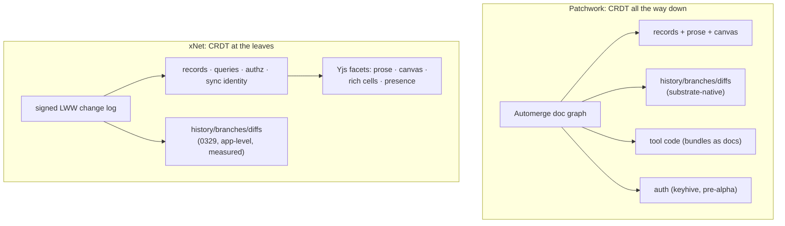
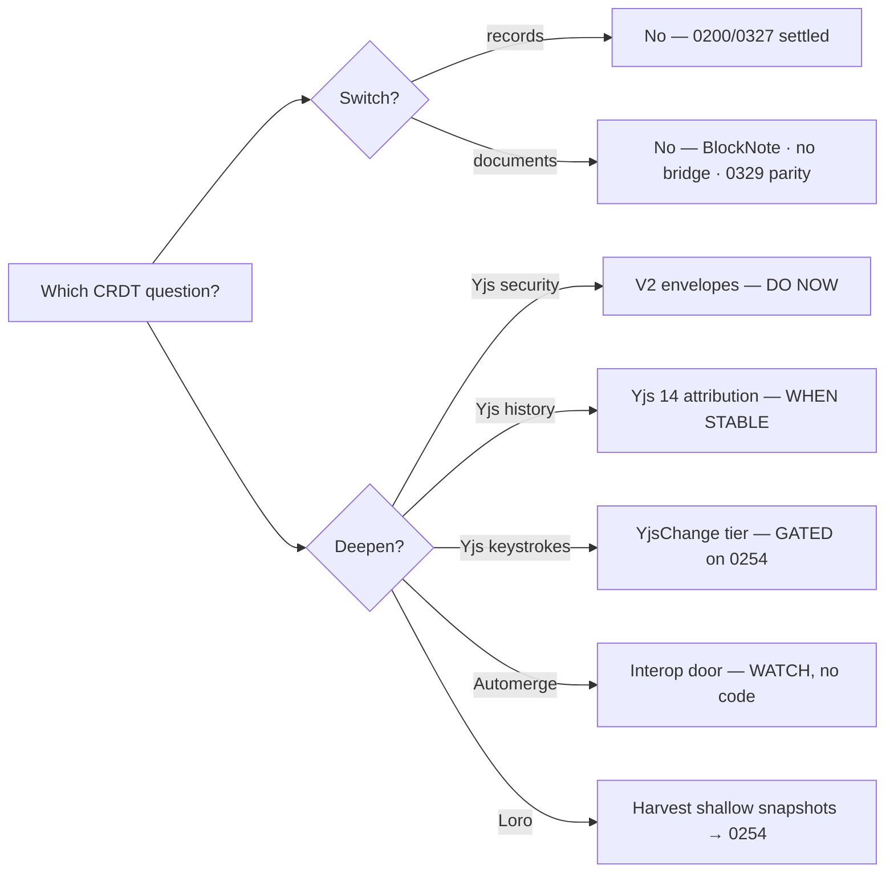

# CRDT Depth: Patchwork's Deep Automerge vs Our Shallow Yjs

> Exploration 0330 · 2026-07-15
>
> Third in the Patchwork sequence: 0327 compared the systems, 0329 built
> drafts + the Time Machine on our substrate. This doc answers the question
> those two kept circling: **should xNet switch to Automerge, or lean on
> either CRDT more heavily than we do today?**

## Problem Statement

Patchwork uses Automerge *all the way down*: every document, every tool
bundle, every version-control primitive, and (soon) every auth decision rides
the CRDT. Its history DAG **is** the product.

xNet uses Yjs *only at the leaves*: rich text (`content-v4`), the canvas
scene, database rich-text cells, and ephemeral presence — four facets hanging
off a custom signed, hash-chained LWW change log that owns everything else
(records, queries, authz, sync identity).

Is our shallowness a deficiency or a design? Three concrete questions:

1. **Switch**: should the Yjs facets (or the whole substrate) move to
   Automerge?
2. **Deepen Automerge**: should Automerge enter the codebase at all — the
   schema layer already declares `DocumentType = 'yjs' | 'automerge'`?
3. **Deepen Yjs**: should we rely on Yjs for more than we do — the designed-
   but-unwired security tier, keystroke history, Yjs 14's new powers?

## Executive Summary

**Verdict: don't switch — deepen Yjs on three specific rungs, and keep
Automerge as a documented interop door with no code behind it yet.**

The switch case dies three independent deaths, any one of which is
sufficient:

1. **BlockNote is structurally Yjs-only, and its team is co-building Yjs 14
   with Yjs's maintainer** (FOSDEM 2026). The 0312 migration bet −33k lines
   on BlockNote; switching CRDTs means forking its collaboration layer or
   regressing to raw ProseMirror on a 0.x Automerge binding with no known
   production users outside Ink & Switch.
2. **There is no migration bridge.** Yjs and Automerge documents are mutually
   unconvertible (RGA vs YATA position models); migration = flatten to plain
   content and lose every document's history — the very thing 0329 just
   started capturing in production.
3. **0329 already closed the capability gap from our side.** Frontiers ≈
   heads, checkpoints ≈ pinned heads, scrubbing ≈ `view(heads)`, drafts ≈
   `clone()`/`merge()`, squash-merge ≈ signature-honest merge — built
   app-level in ~7.2k lines including tests and UI, zero protocol change,
   overlay overhead measured at noise. The marginal value of Automerge's substrate primitives to us
   collapsed the day #523 landed.

What *does* deserve action is depth on the Yjs side, in this order:

- **D1 (now): wire the V2 signed envelopes.** Production Yjs sync still signs
  V1 envelopes with **no document binding** — an update signed for doc A can
  be replayed into doc B's room. The V2 format (docId-bound, hybrid-signature
  ready) plus the hub's `verifyV2Envelope` hook exist, tested, unconsumed.
- **D2 (when stable): ride Yjs 14.** Changesets, `AttributionManager`
  (who-wrote-what), attributed version history, and track-changes land
  natively — publicly funded (ZenDiS/DINUM), beta since Dec 2025, with
  BlockNote as a launch integrator. This upgrades 0329's document lane
  (review-panel text diffs, draft attribution) essentially for free. One
  audit first: **Yjs 14 drops the move feature** — confirm nothing depends
  on it (our ordering is fractional sortKeys, so expected-clean).
- **D3 (still gated): the `YjsChange` keystroke-history tier.** 0329 shipped
  half its gate (pin-aware pruning); the other half (0254 log compaction +
  growth modeling against the 0249 cliff) still stands. Keep deferred.

And two watches, no code: the **`'automerge'` enum arm** stays as the
documented interop door (implement only when a concrete target exists —
importing Patchwork/GAIOS documents, an `.automerge` file importer); **Loro**
is the architectural dark horse (native time travel, shallow snapshots,
MovableTree) whose shallow-snapshot design should inform 0254 — but a
single-founder project with no editor bindings is not a foundation.

## Current State In The Repository

### The depth inventory (what we actually use Yjs for)

| Lane | Surface | Key APIs | Files (exemplars) |
| --- | --- | --- | --- |
| Rich text | BlockNote `content-v4` fragment | `Y.XmlFragment/XmlText`, y-prosemirror (via BlockNote) | `packages/editor/src/blocknote/XNetEditor.tsx` (`getXmlFragment`, `useCreateBlockNote({ collaboration })`) |
| Canvas | scene objects/connectors/metadata | `Y.Map`, `Y.UndoManager` | `packages/canvas/src/store.ts`, `packages/canvas/src/undo.ts` |
| Database | `columns`/`views`/`meta` doc + per-row `richtext_<col>` cells | `Y.Array`, `Y.Map`, `Y.XmlFragment` | `packages/data/src/database/{database-doc,rich-text-cell}.ts` |
| Presence | workspace/canvas awareness | y-protocols `Awareness` | `packages/data/src/sync/awareness.ts`, `packages/hub/src/services/awareness.ts` |
| History (0329) | snapshots, fork state-vectors, delta merge | `Y.snapshot/encodeSnapshot/createDocFromSnapshot`, `encodeStateAsUpdate(doc, sv)`, `Y.mergeUpdates` | `packages/history/src/{document-history,draft,merge}.ts` |
| Anchors | comment text anchors | `RelativePosition` (base64-persisted) | `packages/data/src/schema/schemas/commentAnchors.ts`, `packages/history/src/relpos-debug.test.ts` |

Blast radius: **112 files import `yjs` directly (72 outside tests, ~35.5k
LOC) across 16 packages + 2 apps**; one deduped instance (`yjs@13.6.29`,
~2.5 MB on disk, ~65–80 KB min+gzip); `y-webrtc` is patched locally. Every
production `Y.Doc` is `{ guid: nodeId, gc: false }` — GUID-as-node-id and
GC-off are load-bearing (0329 snapshots require tombstones).

### The seams that are already CRDT-agnostic

- **Comment thread content** — `XNetThreadStore` extends BlockNote's
  abstract `ThreadStore` over LWW nodes; only the anchor *marks* are
  Yjs-shaped.
- **MetaBridge** — a deliberately one-way NodeStore→`doc.getMap('meta')`
  cache (`packages/runtime/src/sync/meta-bridge.ts`); property truth never
  lives in the doc.
- **Database grid data** — scalar cells are LWW properties
  (`cell_<columnId>`), not doc state.

### The dead `'automerge'` arm

`packages/data/src/schema/types.ts:81` declares
`DocumentType = 'yjs' | 'automerge'` ("future support"), but the only runtime
consumer is `useNode.ts`'s `schema.document === 'yjs'` check — the
`'automerge'` value behaves identically to *no document*. Zero Automerge
dependencies exist in any lockfile entry. It is pure vocabulary: deletable or
implementable, constraining nothing.

### The latent deeper-Yjs tier (designed, tested, unwired)

`packages/sync/src/` holds a complete security stack that production ignores
(plan `docs/plans/plan03_4_1YjsSecurity/`):

- `yjs-envelope.ts` — **V1 (what actually runs)**: Ed25519 over
  BLAKE3(update) only, *no docId* — vs **V2**: `meta.docId` binding,
  multi-level Ed25519/ML-DSA. Production signs V1 in
  `packages/runtime/src/sync/{sync-manager,WebSocketSyncProvider}.ts` and
  `packages/network/src/protocols/sync.ts`; the hub's `verifyV2Envelope`
  hook (`packages/hub/src/types.ts` → `services/relay.ts`) is supplied only
  by its own test.
- `yjs-change.ts` + `yjs-batcher.ts` — the `'yjs-update'` change type that
  would put (2s-batched) Yjs updates into the signed per-node hash chain:
  keystroke-grade history, at log-growth cost.
- `yjs-authorized-sync.ts` — `AuthorizedSyncManager` (encrypted state, auth
  gate, peer scoring); exported, zero consumers. Notably it already
  abstracts the CRDT behind a `YDocCodec` — the one codec seam in the repo.

### What 0329 changed about this question

The drafts + Time Machine implementation (PR #523) is the controlled
experiment this exploration would otherwise have to speculate about: it
delivered Automerge's flagship UX — time travel, named versions, branching,
merge review, agent-PR — **on the LWW log + shallow Yjs**, with measured
costs (overlay inactive Δ −2.7% = noise; first-rows p95 1.75 ms @ 10k; scrub
< 100 ms/seek at a 100k-change workspace) and no protocol bump. The Yjs lane
needed exactly three primitives (snapshot capture, state-vector deltas,
`mergeUpdates`) — all shallow, all shipped.

## External Research

- **Automerge 3.0** (July 2025) runs its columnar compressed format *in
  memory*: >10× memory reduction, Moby Dick 700 MB → 1.3 MB, a 17-hour
  pathological load → 9 s. **Benchmark trap**: the widely-cited
  crdt-benchmarks rows (parse 1,805 ms vs Yjs 39 ms, etc.) measured
  Automerge **2.1.10** and are stale — do not reuse them as current. What v3
  did not fix: ~320–600 KB gzipped WASM (vs Yjs ~20 KB) and the thin editor
  ecosystem. ([automerge.org/blog/automerge-3](https://automerge.org/blog/automerge-3/))
- **automerge-repo 2.x** ships first-class `view(heads)`, `history()`,
  `diff()` — the API shapes 0329 hand-built; a good *design reference* for
  our `HistoryEngine` ergonomics.
- **Automerge rich text** is Peritext-derived marks + a "fully supported"
  ProseMirror binding — but `@automerge/prosemirror` is 0.x with visible
  production use only inside Ink & Switch, and there is no
  TipTap/BlockNote-grade layer above it.
- **Keyhive/Beelay/Subduction** (auth + next-gen sync) remain explicitly
  pre-alpha/unaudited — consistent with 0325's harvest-not-adopt verdict.
  Our signed LWW log already occupies the position Keyhive is building
  toward; switching CRDTs would not buy working auth.
- **Yjs is newly re-funded and shipping its history story**: the
  y-collective (Ably $85k lead, public timesheets) plus ZenDiS/DINUM public
  money fund **Yjs 14** — changesets, `AttributionManager`, attributed
  version history, track-changes; beta `v14.0.0-16` since Dec 2025, stable
  expected mid-2026, **BlockNote is a launch integrator** (FOSDEM 2026 talk
  by Jahns + the BlockNote team). Caveat: **v14 drops the move feature**.
- **BlockNote has no non-Yjs backend** (issue #1720 confirms; its
  collaboration option *is* the y-prosemirror plugin stack) — and its
  ecosystem complaints target providers, not Yjs.
- **No production Automerge↔Yjs bridge exists**; position models differ
  (RGA vs YATA). Documented CRDT migrations are mostly *away* from CRDTs
  (Cinapse → server-authoritative sync), not between them.
- **Loro 1.13.6** (June 2026): the most history-first architecture — native
  `checkout(frontiers)` time travel, per-keystroke op DAG, **shallow
  snapshots** (70–90% history trim with cold-storage archival),
  MovableTree/MovableList, undo, fastest benchmarks — but single-founder,
  ~12k weekly downloads, no editor bindings, no disclosed funding.
- **Funding parity**: both incumbents are credibly maintained now; the
  discriminator is ecosystem gravity (Yjs: ProseMirror/TipTap/BlockNote/
  CodeMirror bindings, yrs/pycrdt ports, y-sweet/Liveblocks hosting).

## Key Findings

### F1. The depth difference is a deliberate inversion, and 0329 validated ours

Patchwork's depth is what makes its research agenda possible (code-as-docs,
universal version control *from* the substrate). Our shallowness is what
makes SQL queries at 10M rows, per-change Ed25519 signatures, and schema
authz possible. 0329 demonstrated the leaves model reaches the same
user-facing versioning UX; nothing in this comparison surfaced a capability
we *cannot* build app-level.

### F2. The switch case died three deaths (any one fatal)

BlockNote lock-in (rebuilding 0312 in reverse, against the ecosystem's
direction); no migration bridge (lossy flatten of every document's history);
0329 parity already shipped. The full switching-cost bill (from the
inventory): the editor binding, comment-anchor re-encoding, canvas scene +
`Y.UndoManager` rewrite, envelope wire format (protocol major → 4
conformance kernels), `yjs_*` persistence tables + blob migration for every
document row, awareness/presence replacement, and re-basing the entire 0329
history/draft lane — across 72 production files in 18 workspaces. The one
component switching would *simplify* (history/drafts — Automerge has these
natively) is precisely the one we just finished building and testing.

### F3. What deep Automerge would still buy — and its price

Remaining genuine attractions: exact keystroke-level text diffs (our
snapshot cadence is coarser by design — 0323's granularity philosophy);
sedimentree sync for large histories (our answer is pruning + pins);
future Keyhive interop; and *ecosystem* interop with Patchwork/GAIOS
documents. Price: a 320–600 KB WASM floor on every client, a 0.x editor
binding, abandoning a signed-envelope auth story that works today for one
that is pre-alpha, and a second CRDT's cognitive/maintenance surface.
Only the interop item survives cost-benefit — and it needs no commitment
today (F6).

### F4. Yjs 14 changes the deepening math in our favor

The two historical arguments *for* Automerge over Yjs — "Yjs has no
history/attribution" and "maintenance bus factor" — are both dissolving
upstream: v14's changesets/attribution/track-changes land the document-lane
features 0329's review panel currently approximates (byte-length
"document edited" indicators would become real attributed text diffs), with
BlockNote integrating them first-party. Adoption checklist before pinning
v14: audit the dropped move feature (expected-clean — our ordering is
fractional `sortKey`s per the collation invariant, and canvas layers are
map-keyed), re-run the 0329 snapshot/state-vector suite against the new
binary compat, and re-verify single-instance dedupe.

### F5. The real deepening opportunity is the tier we already designed

V1 envelopes' missing docId binding is a live (if authz-gated) cross-doc
replay surface that 0329's merge re-wrap discussion already flagged; V2 +
the hub hook exist with tests. Wiring touches a bounded, known set
(`sync-manager.ts` sign/verify sites, `WebSocketSyncProvider`, libp2p
`protocols/sync.ts`, hub verifier config, conformance kernel
`0007-yjs-envelope-sign`) — a protocol-*minor* with a feature-negotiated
rollout (the handshake already advertises envelope capabilities). The
keystroke tier (`YjsChange`) stays gated: pins shipped (0329), but 0254
compaction and growth modeling against the 0249 cliff (~15:1 envelope
overhead per 0323) have not.

### F6. The interop door costs nothing to keep and nothing to hold shut

The `'automerge'` enum arm is the correctly-sized commitment to the
Patchwork/GAIOS ecosystem: zero code, zero bundle, a documented seam
(`YDocCodec` in `yjs-authorized-sync.ts` is the other half of that seam).
The trigger to implement it is a concrete artifact someone needs to open —
a Patchwork doc URL, an `.automerge` file, a GAIOS export — at which point
an *import-only* path (Automerge → flatten → nodes + Yjs doc) is a weekend,
and a live bidirectional facet is a real project to scope then.

## Options And Tradeoffs

| Option | Verdict | Why |
| --- | --- | --- |
| **O1. Switch substrate to Automerge** (Patchwork-style, records included) | **Rejected** | Re-litigates 0200/0327: loses signed changes, SQL, schema authz; protocol total-rewrite; keyhive pre-alpha replaces working auth |
| **O2. Switch document facets to Automerge** (keep the log) | **Rejected** | All three deaths in F2 apply; the sole beneficiary (history lane) shipped last week on Yjs |
| **O3. Add Automerge as a second CRDT now** (implement the enum arm) | **Deferred — watch** | Interop is the only surviving benefit and has no concrete target yet; +320–600 KB WASM and a second CRDT surface for a speculative door |
| **O4. Deepen Yjs** (V2 envelopes now; v14 when stable; keystroke tier gated) | **Recommended** | Closes a real security gap with existing tested code; rides funded upstream momentum BlockNote integrates first-party; keeps the gated item honestly gated |
| **O5. Move record properties into a CRDT** (either) | **Rejected** | The 0200 decision, revalidated by 0318 scale + 0304/0307 authz work; CRDTs don't give us signatures or SQL |
| **O6. Adopt Loro** | **Rejected — harvest** | Best history-first architecture, worst risk profile (single-founder, no bindings); its shallow-snapshot design informs 0254 |

## Recommendation

Name the architecture and defend it: **"log for facts, CRDT for prose"** —
the LWW change log owns anything queryable, signable, and authorizable; Yjs
owns anything a human co-edits at typing speed. Patchwork is the proof the
other philosophy works *for a research lab*; 0329 is the proof ours delivers
the same UX under governance. Concretely:

1. **Do not switch CRDTs, at any layer.** Record it here so the question has
   a citable answer.
2. **Wire V2 envelopes (D1)** as the next security increment: sign V2 when
   the peer negotiates it, verify-and-prefer V2 at the hub via the existing
   hook, keep V1 fallback one release, bump the `0007` conformance kernel.
3. **Prepare for Yjs 14 (D2)**: hold `yjs@^13` until v14 stable; run the
   move-feature audit + snapshot-suite compat now (cheap); adopt
   `AttributionManager` in the draft review panel and Time Machine document
   lane as the first v14 consumer.
4. **Keep the `'automerge'` arm as the documented interop door (O3-watch)**:
   one comment on the enum pointing at this doc; trigger = a concrete
   artifact to import.
5. **Harvest Loro's shallow snapshots into 0254**'s compaction design
   (trim-history-behind-an-archived-baseline maps directly onto our
   pins + horizon machinery).

## Risks And Open Questions

- **V2 rollout skew**: mixed fleets (old clients V1, new V2) must not
  partition rooms; the feature-negotiation path exists but the
  fallback-window policy (how long V1 stays accepted) is a product/security
  call. The 0305 lesson applies: the conformance kernel bump ripples the
  Python/Swift references.
- **Yjs 14 binary compatibility** is claimed ("format stays parseable") but
  our gc:false snapshot suite, relpos anchors, and the fork/merge
  state-vector lane are exactly the deep-API surface where an upgrade could
  bite — hence the audit-before-adopt step.
- **The interop door could rot**: if Patchwork/GAIOS interop becomes real,
  import-only flattening loses their history; a faithful bridge is research
  (no prior art per the landscape scan). Scope that when a user actually
  asks.
- **Betting against Automerge's trajectory**: Automerge 3 + sedimentree +
  keyhive is a coherent, funded arc. If keyhive ships audited E2EE +
  capabilities *and* an editor ecosystem materializes above
  `@automerge/prosemirror`, the calculus in F3 shifts — revisit this doc
  then (the watch items in 0325/0327 already track keyhive).
- **Presence has no Automerge story at all** — any future partial adoption
  still needs y-protocols awareness or a custom channel; this asymmetry is
  under-documented upstream.

## Implementation Checklist

- [ ] Add the "log for facts, CRDT for prose" substrate rule + a pointer to
      this doc to `CLAUDE.md` (agent conventions) so future work cites it.
- [ ] Annotate the `'automerge'` arm in
      `packages/data/src/schema/types.ts` with the interop-door comment
      pointing at 0330 (no behavior change).
- [ ] **V2 envelopes**: sign V2 in `packages/runtime/src/sync/
      sync-manager.ts` + `WebSocketSyncProvider.ts` + `packages/network/src/
      protocols/sync.ts` behind the existing feature negotiation; supply a
      real `verifyV2Envelope` (key-registry lookup) to the hub relay; accept
      V1 fallback for one release; update conformance kernel
      `0007-yjs-envelope-sign` (+ Python/Swift references per 0305).
- [ ] **Yjs 14 readiness audit** (before any pin change): grep for move-API
      usage (expect none — sortKey ordering); run the
      `document-history`/`relpos-debug`/`draft`/`merge` suites against a v14
      beta in a spike branch; record results here.
- [ ] Adopt Yjs 14 `AttributionManager` in the DraftReviewPanel document
      lane + Time Machine once v14 is stable and the audit is green
      (replaces byte-length "document edited" indicators with attributed
      text diffs).
- [ ] Cross-link Loro's shallow-snapshot design into the 0254 compaction
      exploration as prior art for trim-behind-archived-baseline.
- [ ] Add a `compare.ts` note if the marketing comparison's CRDT rows
      predate Automerge 3 (avoid citing stale benchmark numbers publicly).

## Validation Checklist

- [ ] V2 envelopes: a tampered/`docId`-mismatched update is rejected at hub
      and client; a mixed V1/V2 fleet syncs without partition; conformance
      kernel green in all reference implementations.
- [ ] Yjs 14 spike: all four deep-API suites (snapshots, relpos, fork,
      merge) pass unmodified against the v14 beta; bundle remains a single
      instance; no move-API usage found.
- [ ] The substrate rule is discoverable: CLAUDE.md carries it, and the
      `DocumentType` enum comment points here.
- [ ] No Automerge dependency appears in any lockfile until an interop
      target is named in an exploration.

## References

- Prior explorations: 0327 (Patchwork vs xNet — the substrate bet), 0329
  (drafts + Time Machine — the parity build, PR #523), 0200 (protocol
  boundaries — the original not-Automerge decision), 0325 (Keyhive
  harvest-not-adopt), 0323 (granularity floor), 0312 (BlockNote migration),
  0254 (compaction, open), 0249 (change-log cliff).
- Code anchors: `packages/data/src/schema/types.ts` (`DocumentType`),
  `packages/editor/src/blocknote/XNetEditor.tsx`,
  `packages/sync/src/yjs-{envelope,change,batcher,authorized-sync}.ts`,
  `packages/runtime/src/sync/{sync-manager,WebSocketSyncProvider,
  meta-bridge,node-pool}.ts`, `packages/history/src/{document-history,
  draft,merge}.ts`, `packages/hub/src/services/relay.ts`,
  `packages/sqlite/src/schema.ts` (`yjs_*` tables),
  `docs/plans/plan03_4_1YjsSecurity/`.
- External: [Automerge 3.0](https://automerge.org/blog/automerge-3/) ·
  [automerge-repo 2.0](https://automerge.org/blog/2025/05/13/automerge-repo-2/) ·
  [Automerge rich text](https://automerge.org/blog/rich-text/) ·
  [automerge-prosemirror](https://github.com/automerge/automerge-prosemirror) ·
  [Keyhive](https://github.com/inkandswitch/keyhive) ·
  [Subduction](https://github.com/inkandswitch/subduction) ·
  [FOSDEM 2026: Yjs 14 + BlockNote](https://fosdem.org/2026/schedule/event/8VKQXR-blocknote-yjs-prosemirror/) ·
  [Yjs releases](https://github.com/yjs/yjs/releases) ·
  [y-collective](https://opencollective.com/y-collective) ·
  [BlockNote collaboration](https://www.blocknotejs.org/docs/features/collaboration) ·
  [BlockNote issue #1720](https://github.com/TypeCellOS/BlockNote/issues/1720) ·
  [crdt-benchmarks](https://github.com/dmonad/crdt-benchmarks) (Automerge
  rows predate v3 — stale) ·
  [Loro](https://loro.dev/) ·
  [Loro shallow snapshots](https://loro.dev/docs/concepts/shallow_snapshots) ·
  [Cinapse leaves CRDTs](https://powersync.com/blog/why-cinapse-moved-away-from-crdts-for-sync)
