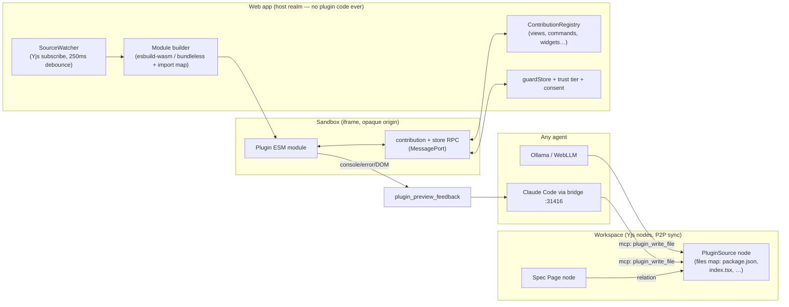
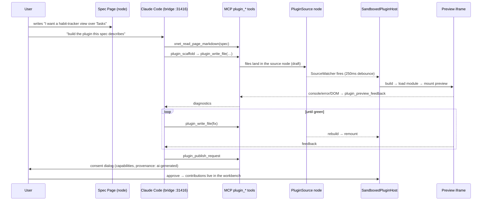
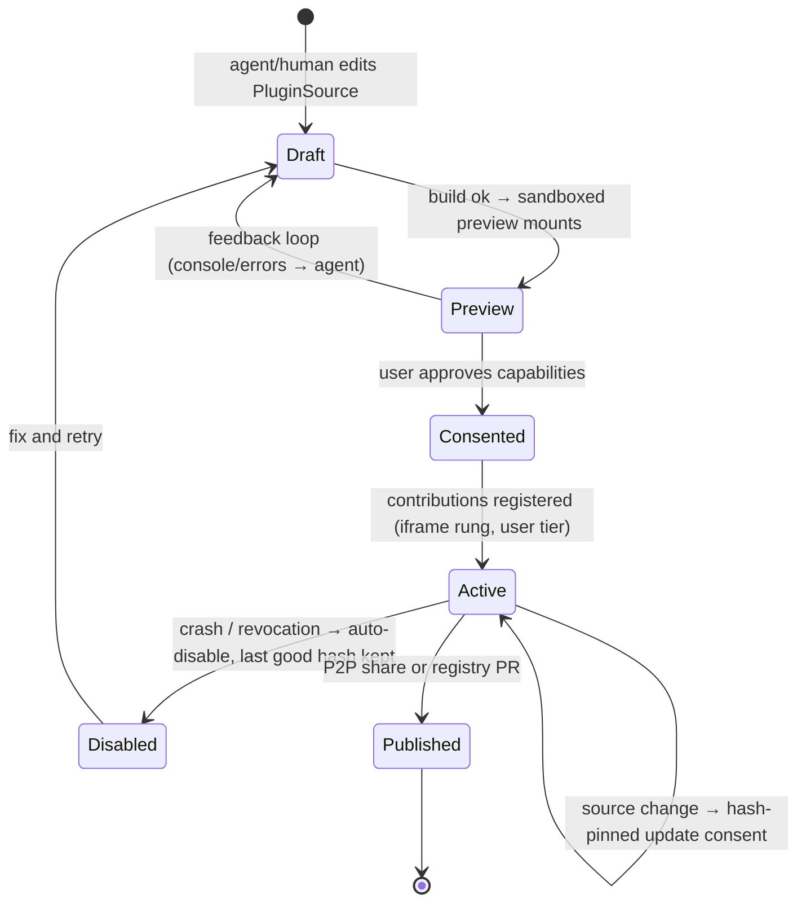

# Developing xNet From Inside xNet: The Spec→Plugin Loop At Patchwork Speed

> Exploration 0331 · 2026-07-15
>
> Companion to `0327_[_]_PATCHWORK_VS_XNET_LEARNING_FROM_INK_AND_SWITCHS_CLOSEST_PARALLEL.md`
> (the whole-system comparison), `0190_[_]_IN_APP_AGENTIC_VIBE_CODING_AND_SELF_MODIFICATION.md`
> (the dev-loop body), and `0194_[_]_AGENT_BRIDGE_CLAUDE_CODE_CODEX_AND_ANY_AGENT_IN_XNET.md`
> (the agent host). This exploration is narrower and sharper than all three: **what
> exactly is between us and using the xNet workspace to extend the xNet workspace —
> a local agent (Claude Code) turning spec documents into live, composing plugins —
> and how do we get Patchwork's iteration speed in xNet *web* without adopting
> Patchwork's trust model?**

## Problem Statement

The user's ask, distilled:

> "Like Patchwork, I'd like to develop xNet from inside xNet. In particular, use
> local agents like Claude Code to build and modify plugins that all compose
> inside the xNet workspace. I should be able to use the xNet workspace to
> extend the xNet workspace. What are we missing? Are we closer in the web or
> Electron app? What does Patchwork have that lets them define specs as text
> documents and use an LLM to convert them into working tools? How do we achieve
> similar iteration speed in xNet web without sacrificing security?"

Patchwork (Ink & Switch) demonstrably has this loop: a spec lives as a document
in the workspace, an LLM (Claude, via an in-chat `@computer` bot or a Claude
Code skill) writes a tool against a tiny host contract, the tool's source *is a
document*, and the running app hot-loads it ~250 ms after the source settles —
for every synced collaborator at once. The distinction between "what is written
and what runs" approaches zero.

xNet has spent two years building almost every ingredient — a plugin registry
with 24 contribution points, code-as-a-node (Labs), a sandbox runtime ladder,
trust tiers, a capability guard, an MCP surface with mutation plans, a
git-worktree dev loop, and a BYO-agent bridge daemon. Yet the loop does not
close: **plugins are compiled into the app bundle, plugin source does not live
in the workspace, nothing hot-loads module code at runtime, and no feedback
channel carries a running plugin's errors back to the agent that wrote it.**

## Executive Summary

1. **The gap is one missing spine, not many missing pieces.** xNet has the agent
   (bridge daemon + MCP tools + Lab agent tools), the safety layer (runtime
   ladder + trust tiers + capability guard + consent), and the composition layer
   (`ContributionRegistry`, 24 registration points). What it lacks is the
   **workspace-plugin runtime**: plugin source as workspace nodes → in-browser
   load → sandboxed execution → live contribution registration → hot reload on
   source change → console/error feedback to the author (human or LLM). Every
   segment of that spine exists in partial form; none of them connect.

2. **Patchwork's enabling trick is code-as-data plus a loader, not AI magic.**
   Their tools are npm-package-shaped Automerge folder docs; a service worker
   serves `automerge:<id>#<heads>` URLs so the browser natively `import()`s code
   out of CRDTs; an import map pins shared singletons (automerge, solid); a
   watcher hot-swaps a tool ~250 ms after its heads settle. The LLM workflow
   rides on top: a skill document (`patchwork-skill.md`) encodes the whole
   authoring contract, spec/prompt documents live beside the tools they
   produced, and the preview iframe **feeds console/error/DOM state back into
   the model's context** so it self-debugs. Because the host hands every tool a
   synced `DocHandle`, a generated tool is ~a render function — small enough for
   one-shot generation.

3. **Web and Electron are each "closer" for a different loop — and the user's
   target loop is web-first.** There are two loops, not one:
   - **Loop A — workspace plugins** (build/modify plugins from inside the app):
     **web is closer.** The Labs runtime ladder (SES/QuickJS/iframe/Pyodide) is
     wired only in the web app (`apps/web/src/lib/lab-runtime.ts`; the `lab`
     route is explicitly WAIVED on desktop in `scripts/check-electron-parity.mjs`),
     the in-app CodeMirror editor is web (`apps/web/src/components/LabView.tsx`),
     and everything Loop A needs runs in a browser.
   - **Loop B — core-repo development** (modify xNet itself): **Electron is
     closer and web can only borrow it.** The bridge daemon lives in Electron
     main (`apps/electron/src/main/agent-bridge-manager.ts`), spawning the
     user's own Claude Code/Codex CLI against a git worktree with the
     validation gate (`packages/devkit`). The web PWA reaches the same daemon
     over loopback `:31416`. A packaged binary can never hot-apply core edits
     (0190) — Loop B ends in a PR, by design.
   The strategic consequence: **build Loop A on web** (it is the Patchwork-shaped
   loop, fully sandboxable, works for every user) and keep Loop B as the
   power-user Electron tier it already mostly is.

4. **"Local LLMs like Claude Code" maps to three tiers that all exist.** Claude
   Code is a local *agent* (bridge tier — shipped: `xnet bridge serve`,
   `KNOWN_BRIDGE_AGENTS`); true local *models* are the Ollama provider and the
   WebLLM/Prompt-API connectors (`packages/plugins/src/ai/connectors/`). All
   three can drive Loop A through the same MCP tool surface; none of them can
   today, because the missing spine is on the runtime side, not the model side.

5. **Security: adopt Patchwork's loop, not Patchwork's trust dial.** Patchwork
   historically ran tools full-trust in the host realm and says so; their new
   isolation module (opaque-origin iframe + es-module-shims source hook + an
   intermediary repo enforcing doc allowlists) is exactly the architecture xNet
   should adopt — **except xNet already has the layers Patchwork's own doc
   admits are missing**: provenance-derived trust tiers (`packages/labs/src/trust.ts`),
   a capability guard at the store boundary
   (`packages/plugins/src/ecosystem/capability-guard.ts`), consent gates, and a
   revocation path. The plan is therefore: workspace-plugin code **never enters
   the host realm** — it loads only inside the existing iframe rung of the labs
   ladder (opaque origin, module source served over a vetted MessagePort), with
   contribution points proxied over RPC and store access wrapped by
   `guardStore`. The host CSP does not widen; `script-src 'self'` stays.

6. **The one-sentence answer to "what are we missing":** a `PluginSource`
   node kind (a folder-of-files document, like a multi-file Lab), an in-browser
   module host that builds and loads it into the iframe sandbox rung, a
   contribution-RPC bridge so sandboxed plugins can register views/commands/
   widgets, a watcher that hot-swaps on source-node change, a feedback channel
   (console/errors/DOM → agent context), and a `writing-xnet-plugins` skill +
   MCP tools so any agent can drive the whole loop. Roughly: **0180's Labs,
   grown from single-file scripts into multi-file, view-contributing, hot-loaded
   packages.**

## Current State In The Repository

### What exists and works (the ingredients)

- **Plugin model** — `packages/plugins/src/manifest.ts` (`XNetExtension`,
  `validateManifest`, `defineExtension`), `context.ts` (the full plugin API:
  `store`/`query`/`subscribe` + ~24 `registerX` contribution points),
  `contributions.ts` (`ContributionRegistry`), `types.ts` (`PluginPermissions`,
  `getPlatformCapabilities` — services/processes/filesystem are Electron-only).
- **Plugin lifecycle** — `packages/plugins/src/registry.ts`: `install` →
  platform/version/dependency/consent/license gates → persist manifest as a
  node → `activate`. `rehydrate()` swaps a deserialized manifest for a live one.
  Plugins persist as `PluginSchema` nodes and sync P2P — **manifests are
  in-band; code is not.**
- **How plugins actually load today** — a **static import array**.
  `apps/web/src/plugins/index.ts` (`BUNDLED_PLUGINS`) →
  `apps/web/src/components/BundledPluginInstaller.tsx` → `install()`/
  `rehydrate()`. Marketplace installs (`apps/web/src/components/MarketplaceView.tsx`
  + `registry/community.json`) deliver **pure-data manifests**; no downloaded
  code executes. The only dynamic `import()`s in the app are WASM toolchains
  (`apps/web/src/lib/lab-runtime.ts` loads `@swc/wasm-web`) and Electron native
  addons.
- **Code as a node (Labs, exploration 0180)** — `packages/labs/src/schema.ts`:
  the `Lab` schema (`xnet://xnet.fyi/Lab@1.0.0`) with `code: text(required)`,
  `language`, `runtime`, `lastOutput`; edited in `apps/web/src/components/LabView.tsx`
  (CodeMirror from `@xnetjs/ui`), executed on the **runtime ladder**
  (`packages/labs/src/runtime/{ladder,runtimes,ses,quickjs,app,python,server}.ts`
  — SES → QuickJS-WASM → sandboxed iframe → Pyodide → server), with store
  access only through the capability-gated `createLabHostBridge`
  (`packages/labs/src/runtime/host.ts`) and trust assigned by the host from
  provenance (`packages/labs/src/trust.ts`).
- **Lab → live plugin (the hot-publish seam)** — `packages/labs/src/extension.ts`:
  `buildLabExtensionManifest` + publish = a validated manifest whose command/
  slash-command handler runs the Lab, `install`+`activate`d into the running
  registry behind a capability prompt. **Hot-loading exists — but only for
  command handlers wrapping Lab scripts, not for view-contributing ESM plugins.**
- **The agent brain** — MCP server (`packages/plugins/src/services/mcp-server.ts`,
  23+ `xnet_*` tools behind `McpWriteGuardrail`), mutation plans with
  risk/scopes/validation/audit/rollback (`packages/plugins/src/ai-surface/`),
  **Lab agent tools** (`packages/labs/src/agent-tools.ts`: `lab_create`,
  `lab_run`, `lab_get`, `lab_list`, `lab_run_saved` — the write→run→read→fix
  loop already shaped as tools), the AI→Lab→plugin consent pipeline
  (`packages/plugins/src/ecosystem/ai-pipeline.ts::runAiPluginPipeline`,
  `ai-authoring.ts::scriptToPluginManifest`), and a data-ops skill
  (`packages/plugins/src/ai-surface/skill.ts::XNET_AGENT_SKILL_MD`).
- **The agent host** — bridge daemon shipped (0194): `packages/devkit/src/
  {bridge-server,agent-launch,chat-agent}.ts`, Electron manager
  `apps/electron/src/main/agent-bridge-manager.ts`, CLI `xnet bridge serve`,
  agent registry (`KNOWN_BRIDGE_AGENTS`: Claude Code/Codex/Gemini/OpenCode),
  MCP config injection (`--mcp-config` + `--allowedTools "mcp__xnet__*"`).
  Local models: Ollama provider + WebLLM/Prompt-API connectors
  (`packages/plugins/src/ai/{providers.ts,connectors/}`).
- **The dev loop for the repo itself (Loop B)** — `packages/devkit/src/dev-loop.ts`
  (`runAgentTask`: worktree → agent edits → `runValidationGate` → checkpoint or
  `resetHard` → `openPullRequest`), `xnet code "<intent>"`
  (`packages/cli/src/commands/code.ts`), `publishPluginRepo`.
- **Sandbox + trust + consent (the governance xNet has and Patchwork lacks)** —
  AST-validated in-realm `ScriptSandbox` for computed columns
  (`packages/plugins/src/sandbox/{ast-validator,sandbox}.ts`), the labs ladder
  above, `guardStore` capability enforcement wired into every
  `ExtensionContext` (`packages/plugins/src/ecosystem/capability-guard.ts`,
  `context.ts`), consent + provenance + license policy + install gate
  (`packages/plugins/src/ecosystem/`), marketplace revocation
  (`registry/blocked.json`).
- **Scaffolder + registry** — `npx xnet plugin scaffold <id>` →
  `examples/xnet-plugin-template/`; publish = GitHub Release + one-line PR to
  `registry/community.json` (`registry/README.md`,
  `scripts/build-plugin-index.mjs`).

### What is missing (the spine, segment by segment)

| # | Missing segment | Nearest existing seam |
| --- | --- | --- |
| 1 | **Plugin source as workspace data** — multi-file, package-shaped source nodes | `Lab` nodes hold one `code` string (`packages/labs/src/schema.ts`); spaces file documents exist for blobs |
| 2 | **Runtime module loading** — turning source nodes into an executable ESM module in the browser | Labs ladder executes *strings* in SES/QuickJS/iframe; no module graph, no imports (`ast-validator.ts` forbids `import`) |
| 3 | **Contribution RPC** — a sandboxed plugin registering views/widgets/commands across the iframe boundary | `registerX` assumes in-realm code (`packages/plugins/src/context.ts`); iframe rung (`labs/runtime/app.ts`) has postMessage but no contribution protocol |
| 4 | **Hot reload** — rebuild + remount on source-node change | `registry.rehydrate()` exists; nothing watches source nodes; Yjs subscriptions make the watcher trivial |
| 5 | **Feedback channel** — console/errors/DOM of a running plugin → the authoring agent | Labs capture `lastOutput` for scripts; nothing equivalent for plugin previews |
| 6 | **Authoring contract for agents** — a `writing-xnet-plugins` skill + plugin MCP tools | `XNET_AGENT_SKILL_MD` covers data ops only; `lab_*` tools cover single-file scripts; 738-line human guide at `site/src/content/docs/docs/guides/plugins.mdx` |
| 7 | **In-app publish** — one click from working preview → marketplace/P2P share | `publishPluginRepo` (devkit, gh CLI) + `registry/community.json` PR flow exist but have no in-app surface |
| 8 | **Electron parity for Loop A** — labs/preview surfaces on desktop | `lab` route WAIVED (`scripts/check-electron-parity.mjs`) |

### Web CSP: the accidental headroom

`apps/web/index.html` already ships
`script-src 'self' 'unsafe-inline' 'unsafe-eval'` and `worker-src 'self' blob:`.
Two implications: (a) the SES/QuickJS/eval paths the labs ladder needs already
work on web; (b) `script-src 'self'` (no `blob:`) means the *host* page cannot
dynamically `import()` generated module code — which is fine, because the design
below never loads plugin code into the host realm anyway. The host CSP should
eventually get *tighter* (drop `unsafe-eval` from the top frame once labs run
fully off-realm), not looser.

## External Research

### How Patchwork closes the loop (mechanics, verified from their repos)

- **Tools are npm-package-shaped Automerge folder docs.** `package.json` + files
  as a folder document; `pushwork` bidirectionally syncs a working directory
  into the doc — "publish" is CRDT sync, there is no deploy pipeline.
- **A service worker makes CRDTs importable.** The bootloader
  (`patchwork/core/bootloader`) registers a service worker intercepting
  same-origin GETs whose path encodes an `automerge:` URL; on miss it hands off
  to the SharedWorker that owns the repo, which materializes file bytes into
  the Cache API. Result: native `import("https://origin/automerge%3A<id>@<heads>/dist/index.js")`
  — code loaded straight out of the substrate, offline-cacheable.
- **Import maps pin shared singletons.** A Vite plugin injects an import map
  mapping `@automerge/*`, `@inkandswitch/patchwork-*`, `solid-js`,
  `@codemirror/*` to host-built bundles; tools mark them external. One copy of
  the substrate, version lockstep across every hot-loaded tool.
- **Versions are content-addressed; reload is a debounce.** Module URLs are
  pinned "at heads" (immutable snapshots); a `ModuleWatcher` re-imports a tool
  ~250 ms after its folder doc's heads stop moving and hot-swaps it via
  `onUnload`/`onLoad` — for every synced peer simultaneously. Per-user branch
  selection comes from a `module-settings` doc that can point at a branches doc.
- **The LLM loop ("chitter chatter" notebook entry).** In-chat `@computer`
  messages (or voice, transcribed locally) prompt an OpenRouter-routed model
  whose preprompt biases it toward *making and pinning a tool*. Generated JS is
  written into tool-source documents **on a draft branch**; a preview iframe
  boots a host runtime against the draft's heads; and — the critical piece —
  **the rendered DOM state plus `console.log`/`console.error`/`window.onerror`
  output feed back into the model's context**, so it self-debugs without a
  human in the copy-paste path. Their thesis: "the closer we can make the loop,
  the less the distinction between what is written and what runs, the better."
- **The developer-agent loop.** `patchwork-base/patchwork-skill.md` is a Claude
  Code skill encoding the entire authoring contract — plugin registration, the
  `(handle, element) => cleanup` render contract, Automerge gotchas, import-map
  externals, CSS rules, build flavors. Tools carry `prompts/<tool>.md` one-shot
  spec docs and per-tool `CLAUDE.md`s. Agent writes code → `pnpm build &&
  pushwork sync` → tool hot-loads everywhere.
- **Why generated tools are small enough to one-shot:** the platform absorbs
  persistence, sync, multiplayer, presence, theming, and version control; a
  tool is ~a render function over a `DocHandle`. Bundleless house style (single
  vanilla-JS file, import map supplies deps) means many tools need no compile
  step at all.
- **Security posture, in their own words.** Historically full-trust ("tools
  render into the host's light DOM with `window.repo` as a global");
  the new `isolation` module runs untrusted tools in an
  `<iframe sandbox="allow-scripts">` **without** `allow-same-origin` (opaque
  origin), with **es-module-shims (wasm) providing a source hook** so every
  import travels over a MessagePort to the host, which classifies requests
  against an allowlist; doc sync crosses a second MessagePort through an
  **ephemeral intermediary repo** enforcing a doc allowlist and a
  **denylist-wins** rule (account doc, module settings, tool source). Their doc
  is frank about the punts: exfiltration out of scope, no granular capability
  system, "no cryptographic backstop."

### Prior art on "LLM writes code, app runs it safely"

- **Figma**: started with Realms-shim (same-VM membrane), got escaped, moved to
  **QuickJS-in-WASM** — for adversarial code, membranes in the host VM lose;
  pay the separate-VM tax. (xNet's ladder already has the QuickJS rung.)
- **Observable**: user code executes on a **separate sandboxed origin** — the
  Same-Origin Policy, not review, is the boundary. Cheap and robust.
- **val.town**: LLM-generated vals run in Deno subprocesses under an OS
  permission sandbox; errors/logs are first-class values shown beside the code
  — the feedback-loop lesson.
- **Anthropic Artifacts**: sandboxed iframe + strict CSP + no ambient
  credentials — sufficient for one-shot UI, but forecloses composition with
  user data; exactly the gap a workspace plugin system fills.
- **Chrome MV3**: bans remotely hosted code entirely — the store-review model
  is structurally hostile to runtime LLM code, which is why malleable systems
  must be their own host.
- **SES/LavaMoat**: fine-grained in-VM confinement ships in production
  (MetaMask Snaps = SES in a worker), but demands frozen-realm discipline;
  ShadowRealm is still TC39 stage 2.7. Keep SES for scripts; don't bet views
  on it.
- **Import maps + es-module-shims**: dependency *identity* (one React, one
  `@xnetjs/data`) is the hidden hard problem of hot-loaded plugins — solve it
  in the platform via an import map, not per plugin.
- **esbuild-wasm / sucrase**: in-browser bundling is sub-second at tool scale —
  a client-side spec→running-code loop needs no server. (xNet already ships
  `@swc/wasm-web` for Labs TS transpilation.)

## Key Findings

### 1. xNet chose "code as a node" in 0180 and then stopped one storey short

`Lab` nodes prove the substrate can hold, sync, and version executable source,
and `publishLabAsExtension` proves hot-registering into the live registry
works. But a Lab is a single string executed as a *script* (the AST validator
forbids `import`), and its published form is only a command handler. Patchwork's
unit is a *package*: multi-file, dependency-bearing, exporting typed plugin
descriptors, rendering views. The distance from Lab to PluginSource is the
distance from "calculator in a sandbox" to "the workspace extends itself."

### 2. The registry API is the composition story, and it survives sandboxing

Patchwork tools compose through registry id strings; xNet's
`ContributionRegistry` is the same shape with 24 typed points. Nothing about
`registerView`/`registerCommand`/`registerWidget` *requires* the implementation
to live in the host realm — a manifest can declare contributions as data while
handlers proxy over postMessage to an iframe. The dashboard's
`IframeWidgetHost` already renders sandboxed widgets; the missing piece is
generalizing that host into a **contribution RPC protocol** so a sandboxed
plugin can fill registry slots. Composition-between-plugins then works exactly
as it does today (registry ids), regardless of which sandbox each plugin
occupies.

### 3. The feedback channel is the difference between "AI generates code" and "AI iterates"

xNet's `ScriptGenerator` already retries on validation errors, and `lab_run`
returns output — for scripts. Patchwork's chitter-chatter loop shows what the
plugin-scale equivalent needs: the preview surface pipes `console.*`,
`window.onerror`, and (optionally) serialized DOM state back to the agent's
context. Without it, an agent one-shots a plugin blind; with it, the
generate→run→observe→fix loop runs without a human ferrying stack traces. This
is cheap to build (the iframe rung already owns postMessage) and
disproportionately valuable.

### 4. Web vs Electron is a false rivalry — they own different loops

Everything Loop A needs is browser-native (Yjs subscriptions, esbuild-wasm/swc,
opaque-origin iframes, MessagePorts), and its sandbox ladder is *already
web-only in practice* (the desktop waiver). Loop B needs fs/shell/git and
already lives in Electron main + devkit, reachable from web over loopback.
The only real cross-dependency: an Electron user should eventually get Loop A
too (un-waive labs), and a web user with the desktop app running gets Loop B
via `:31416`. Ship Loop A web-first; backfill Electron parity.

### 5. Patchwork validates the *speed* target and xNet's own docs validate the *safety* floor

Patchwork's loop latency budget: edit → heads settle (250 ms) → re-import →
remount. No compile for bundleless tools; sub-second with one. That is the
number to match. Meanwhile Patchwork's isolation doc *aspires* to what xNet
shipped (tiers, capability gating, consent, revocation) — and 0327 already
concluded the same: their contracts under our governance. There is no
security-vs-speed tradeoff to make here; the slow parts of xNet's current
plugin path (paste JSON, rebuild app, PR to a GitHub registry) are
*distribution* choices, not security requirements.

### 6. The spec-document convention costs nothing and is already idiomatic

Patchwork specs are markdown docs beside the tool; prompts are versioned
documents. xNet's equivalent — a `Page` node tagged as the spec, linked from
the `PluginSource` node, projected to the agent via the existing
`ai-workspace-exporter` / MCP read tools — requires no new machinery at all,
just a convention the skill document teaches. This repo's own
`docs/explorations/` workflow (spec → agent → implementation → check-off) is
the same loop at monorepo scale; Loop A miniaturizes it into the workspace.

## Options And Tradeoffs

### Option A — The workspace-plugin runtime (Loop A, recommended)

Plugin source lives in the workspace; a module host builds and runs it in the
iframe rung; contributions proxy over RPC; source changes hot-swap; the preview
feeds the agent.



| Dimension | Assessment |
| --- | --- |
| Iteration speed | Patchwork-class: node edit → debounce → in-browser build (sub-second at plugin scale) → remount. No deploy, no app rebuild, no PR. |
| Security | Better than today's *proposed* marketplace path: code never in host realm; opaque-origin iframe; store access via `guardStore` grants; provenance `ai-generated` → `user` tier; deny-by-default on identity/plugin-source/space-membership schemas (Patchwork's denylist-wins lesson); content-hash pinning per 0327-E. Host CSP unchanged. |
| Composition | Full: contributions land in the same registries as bundled plugins; plugins extend plugins via registry ids. |
| Distribution | Free: source nodes sync P2P like any node; receiving peers re-derive trust (`packages/labs/src/trust.ts` already re-confirms synced provenance) and consent before activation. |
| Cost | The real build: contribution RPC protocol + module host + builder + watcher + feedback channel + skill/tools. Weeks, not days — but every piece lands on an existing seam. |
| Ceiling | Iframe-hosted views render in their own frame (like `IframeWidgetHost`); deep editor extensions (TipTap plugins) and shell slots stay first-party/compiled-in. That ceiling is correct — it is 0327's "no frame replacement" non-goal. |

### Option B — Devkit/bridge loop only (Loop B, exists)

Point Claude Code at the monorepo via the bridge; plugins are developed as
first-party code; ship via PR.

- Pros: exists today (`xnet code`, bridge daemon); full power; no new runtime.
- Cons: does not answer the ask. Iteration = typecheck+build+reload of the whole
  app; requires a checkout and Node toolchain; nothing composes *inside* the
  workspace; web users excluded (unless the desktop daemon runs); every change
  is repo-governance-shaped, not workspace-shaped.
- Verdict: keep as the core-modding tier and as the escape hatch for plugins
  that outgrow the sandbox. Not the loop.

### Option C — WebContainers plugin studio (0190 Phase 2)

Boot a Node micro-OS in the tab, scaffold `xnet-plugin-template`, run vite +
tests in-browser, hot-load the built artifact.

- Pros: full npm toolchain fidelity; genuinely sandboxed; matches the existing
  template/registry publish path.
- Cons: heavyweight (boot + `npm install` per session vs a 250 ms debounce);
  Safari/COI constraints; a *parallel* dev world rather than the workspace
  extending itself — source lives in a container FS, not in nodes, so no P2P
  sync, no drafts, no in-workspace review. Solves toolchain, not malleability.
- Verdict: defer. Adopt only if Option A's in-browser builder proves too weak
  for real plugins (e.g., npm dependency graphs beyond the import map).

### Option D — Remote sandbox (E2B/Daytona/Codespaces)

- Pros: full power for hosted-web/mobile users; hardware isolation.
- Cons: code leaves the device (local-first violation), costs money, adds an
  operator. Same "parallel world" problem as C.
- Verdict: the managed-cloud fallback, sequenced last (0190 Phase 3 stands).

### The decision in one table

| | A: workspace runtime | B: devkit/bridge | C: WebContainers | D: remote |
| --- | --- | --- | --- | --- |
| Answers "extend xNet from inside xNet" | **yes** | no | partially | partially |
| Patchwork-class loop latency | **yes** | no | no | no |
| Fully sandboxed on web | **yes** | n/a (local trust) | yes | yes (remote) |
| Source syncs/branches as workspace data | **yes** | no (git) | no | no |
| Exists today | no | **yes** | no | no |

A, with B kept for core mods. C/D deferred.

## Recommendation

**Build the workspace-plugin runtime (Option A) web-first, in five increments,
each shippable alone.** Sequenced so that the agent loop works end-to-end at
step 3, before the fancy parts.

1. **`PluginSource` nodes + the module host.** A new schema (multi-file `files`
   map + `entry` + `manifest` json + relation to a spec Page), a builder
   (bundleless ESM fast path via the existing `@swc/wasm-web` transpile; an
   import map exposing pinned singletons: `react`, `@xnetjs/plugins`-client-API),
   and a loader that instantiates the module **only** inside the labs iframe
   rung (opaque origin; source delivered over MessagePort à la es-module-shims
   source hooks — never a host-realm `import()`). Grow `LabView` into a
   multi-file editor or add a `PluginSourceView`.
2. **Contribution RPC.** Generalize `IframeWidgetHost` into a
   `SandboxedPluginHost`: manifest contributions register as data in
   `ContributionRegistry`; view contributions render as sandboxed frames;
   command/slash/agent-tool handlers proxy over MessagePort; all store access
   crosses `createLabHostBridge` + `guardStore` with the plugin's granted
   capabilities. Reuse the install gates from `registry.ts` unchanged.
3. **The agent loop.** MCP tools: `plugin_scaffold`, `plugin_read_file`,
   `plugin_write_file`, `plugin_build` (returns diagnostics), `plugin_preview`
   (mounts/refreshes a preview surface), `plugin_preview_feedback` (buffered
   console/errors/DOM snapshot), `plugin_publish_request` (consent-gated).
   A `writing-xnet-plugins` skill document (the `patchwork-skill.md` analog +
   `XNET_AGENT_SKILL_MD` sibling) teaching the contract, the spec-doc
   convention, and the loop. At this point: **spec Page → Claude Code (bridge)
   or Ollama → working, composing plugin — entirely inside xNet web.**
4. **Hot reload + versioning.** SourceWatcher (Yjs subscribe + 250 ms debounce)
   → rebuild → `registry.rehydrate()`-style swap; pin activated versions by
   content hash (0327-E) so "update" is an explicit diff-and-consent; crash →
   auto-disable + revert to last good hash (the 0190 remediation rule). When
   the drafts design (0327-A1 / 0329) lands, agent edits target a draft of the
   source node and merge is review — the agent-PR workflow, in-workspace.
5. **Publish + parity.** In-app "Publish": P2P share at `user` tier (trust
   re-derived on receipt, consent on activation) and one-click
   `publishPluginRepo` → `registry/community.json` PR for the public
   marketplace. Then un-waive labs/plugin surfaces on Electron
   (`scripts/check-electron-parity.mjs`) so desktop gets Loop A too.

**Explicit non-goals**, inherited from 0327 and reaffirmed: no plugin code in
the host realm, no shell/frame replacement by workspace plugins, no widening of
the host CSP, no unsandboxed hot code from sync — the loop's speed comes from
where code *lives* and *loads*, not from relaxing where it *runs*.





## Example Code

The shape of the three load-bearing seams (sketches, not final APIs):

```ts
// packages/plugins/src/schemas/plugin-source.ts (new)
export const PluginSourceSchema = defineSchema({
  name: 'PluginSource',
  namespace: 'xnet.fyi',
  properties: {
    name: text({ required: true }),
    files: json<Record<string, string>>(),   // path → contents (v1; blob refs later)
    entry: text(),                            // e.g. "index.tsx"
    manifest: json<XNetExtensionData>(),      // contributions as pure data
    spec: relation({ to: 'Page' }),           // the spec document that drove it
    publishedHash: text(),                    // content hash pinned at consent (0327-E)
  },
})

// packages/plugins/src/ecosystem/sandboxed-host.ts (new)
// Generalizes IframeWidgetHost: module loads ONLY in the opaque-origin iframe;
// imports resolve over the port (es-module-shims-style source hook); handlers
// proxy back. The host realm never sees plugin code.
export function activateWorkspacePlugin(src: PluginSourceNode, deps: HostDeps) {
  const tier = deriveTrustTier({ provenance: src.provenance })    // labs/trust.ts
  const frame = mountSandboxFrame({ sandbox: 'allow-scripts' })   // no allow-same-origin
  const port = frame.connect()
  port.serveModules(buildModuleGraph(src.files, IMPORT_MAP))      // swc transpile, pinned deps
  port.serveStore(guardStore(deps.store, src.manifest.permissions)) // capability-guard.ts
  registerDataContributions(src.manifest.contributes, {
    view: (id) => renderSandboxedView(frame, id),                 // views render in-frame
    command: (id) => port.invoke('command', id),                  // handlers proxy over RPC
  })
  port.onDiagnostics((d) => previewFeedback.push(src.id, d))      // console/error/DOM → agent
}

// packages/plugins/src/services/mcp-plugin-tools.ts (new) — the agent loop
export const pluginTools: AiToolDefinition[] = [
  tool('plugin_scaffold',        { risk: 'low',    scopes: ['plugins.write'] }),
  tool('plugin_write_file',      { risk: 'medium', scopes: ['plugins.write'] }),
  tool('plugin_build',           { risk: 'low' }),        // → diagnostics, no execution
  tool('plugin_preview',         { risk: 'medium' }),     // mounts sandboxed preview
  tool('plugin_preview_feedback',{ risk: 'low' }),        // buffered console/errors/DOM
  tool('plugin_publish_request', { risk: 'high', requiresConsent: true }),
]
```

## Risks And Open Questions

- **The contribution-RPC boundary is the hard engineering.** Views in a frame
  are easy (widgets prove it); commands/agent-tools over RPC are easy; but
  latency-sensitive or deeply integrated points (editor extensions, canvas
  tools with per-frame callbacks) will not survive postMessage. Draw the line
  explicitly in the skill doc: which of the 24 points are sandbox-eligible in
  v1 (views, widgets, commands, slash, agent tools, importers) and which stay
  compiled-in.
- **Dependency identity.** The import map must pin exactly one React and one
  client-API surface, and that surface becomes a compatibility contract with
  hot-loaded code — semver drift between host and long-lived plugin hashes
  needs the `xnetVersion` gate to actually gate. Patchwork's answer (declared
  semver is "effectively type-only"; the host singleton wins) is acceptable
  for v1 but should be stated.
- **Prompt-injection through the loop.** A synced spec doc or plugin source is
  attacker-supplied text that an agent will read and act on. Mitigations
  already in the frame: writes go through `McpWriteGuardrail`, publishes
  require human consent, synced sources re-derive trust and start inert
  (0327-D's rule for skills applies verbatim to plugin sources). Add: the
  feedback channel must sanitize/mark preview output as untrusted data, not
  instructions.
- **Exfiltration.** Patchwork punts it; xNet shouldn't fully. The iframe's own
  CSP (frame `srcdoc` can carry `connect-src 'none'` + the manifest's `network`
  allowlist via the existing `network-endowment.ts` pattern) bounds what a
  malicious generated plugin can phone home. Not cryptographic, but a real
  line Patchwork lacks.
- **Multi-file source in Yjs.** A `files` json map is LWW-coarse (per-save
  clobbering under concurrent edits). Fine for v1 (one author or one agent at
  a time, drafts arriving with 0329); the finer-grained answer is per-file
  `document` facets — decide when drafts land.
- **Does bundleless suffice?** v1 bets that swc-transpile + import map covers
  real plugins (Patchwork's house style says yes). If plugins need npm dep
  graphs, that is the trigger to revisit Option C, not to widen v1.
- **Numbering.** 0331 verified free across all local branches and worktrees at
  writing time (0328–0330 are the latest claimed).

## Implementation Checklist

- [x] **1a — `PluginSource` schema** (`packages/plugins/src/schemas/plugin-source.ts`):
      files map, entry, manifest-as-data, spec relation, publishedHash; CRUD
      through the normal store so it syncs/branches like any node.
- [x] **1b — module builder**: swc-transpile per file (`@swc/wasm-web` is
      already in `apps/web/src/lib/lab-runtime.ts`), module-graph resolution
      against a pinned import map (react + client plugin API); `plugin_build`
      returns structured diagnostics.
- [x] **1c — sandboxed module host**: opaque-origin iframe rung; source-hook
      module serving over MessagePort; no host-realm import of plugin code;
      frame CSP `connect-src` derived from the manifest `network` allowlist.
- [x] **2 — contribution RPC** (`SandboxedPluginHost`): data-declared
      contributions land in `ContributionRegistry`; sandboxed view rendering
      (generalize `packages/dashboard/src/sandbox/IframeWidgetHost.tsx`);
      command/slash/agent-tool handler proxying; store access =
      `createLabHostBridge` + `guardStore` grants; install/consent gates reused
      from `packages/plugins/src/registry.ts`.
- [ ] **3a — MCP plugin tools**: `plugin_scaffold` / `plugin_read_file` /
      `plugin_write_file` / `plugin_build` / `plugin_preview` /
      `plugin_preview_feedback` / `plugin_publish_request`, registered beside
      the `lab_*` tools and exposed through `mcp-server.ts` + the bridge's
      `--allowedTools`.
- [ ] **3b — `writing-xnet-plugins` skill** (sibling of `XNET_AGENT_SKILL_MD`):
      the authoring contract, sandbox-eligible contribution points, the
      spec-Page convention, the loop etiquette (build → preview → feedback →
      fix), publish rules. Export via `ai-workspace-exporter` so external
      agents (Claude Code) receive it.
- [ ] **3c — end-to-end demo**: a spec Page ("habit-tracker view over Tasks") →
      Claude Code via the bridge → working sandboxed view contribution, no
      human code edits; repeat with Ollama to prove the local-model path.
- [ ] **4a — SourceWatcher hot reload**: Yjs subscription + 250 ms debounce →
      rebuild → swap (the `rehydrate()` pattern); crash → auto-disable + pin
      last good hash.
- [ ] **4b — content-hash pinning + update consent** (0327-E): activation pins
      `publishedHash`; source drift renders as diff-and-consent, not silent
      update.
- [ ] **4c — drafts integration** (when 0329/0327-A1 lands): agent edits target
      a draft of the source node; merge = review surface.
- [ ] **5a — in-app publish**: P2P share at `user` tier (receiver re-derives
      trust, consents before activation); one-click `publishPluginRepo` +
      `registry/community.json` PR for the public path.
- [ ] **5b — Electron parity**: un-waive `lab`/plugin surfaces in
      `scripts/check-electron-parity.mjs`; verify the iframe rung inside the
      hardened renderer (`sandbox:true` webPreferences).
- [ ] Cross-link this exploration from 0190, 0192, and 0327; note in 0190 that
      the bridge daemon has shipped since its writing.

## Validation Checklist

- [ ] **Loop latency**: source-node edit → preview remount measured under 1 s
      for a bundleless plugin (Patchwork parity); under 3 s with transpile.
- [ ] **No host-realm execution**: a canary plugin attempting `window.top`,
      host-DOM access, or a non-allowlisted import fails in tests; host CSP
      unchanged (`script-src 'self' …` — no `blob:`/remote added).
- [ ] **Capability floor**: a plugin without a `schemaWrite` grant cannot
      mutate (guardStore throws); identity/plugin-source/membership schemas
      are unreachable regardless of grants (denylist wins).
- [ ] **Trust + provenance**: an AI-generated plugin activates at `user` tier
      after consent showing provenance; a synced copy on a second device is
      inert until re-consented; revocation (`registry/blocked.json` /
      auto-disable) kills a running plugin.
- [ ] **Agent loop closes**: `plugin_preview_feedback` returns the console
      error a deliberately broken build produces, and an agent demonstrably
      fixes it without human relay (the chitter-chatter test).
- [ ] **Composition**: a workspace plugin's command appears in the palette
      beside bundled ones; a second workspace plugin extends the first through
      a registry id; uninstall removes both cleanly.
- [ ] **Spec→plugin end-to-end**: the 3c demo recorded (spec Page → Claude
      Code → live view) on web; the same flow on Electron after 5b.
- [ ] `check:cloud-boundary`, `check:electron-parity`, fallow, typecheck, lint
      stay green.

## References

### Codebase

- Plugin system: `packages/plugins/src/{manifest,context,contributions,registry,types}.ts`;
  bundled loading `apps/web/src/plugins/index.ts` +
  `apps/web/src/components/BundledPluginInstaller.tsx`; marketplace
  `apps/web/src/components/MarketplaceView.tsx`, `registry/{community,first-party,blocked}.json`
- Labs (0180): `packages/labs/src/{schema,extension,trust,agent-tools}.ts`,
  `packages/labs/src/runtime/{ladder,runtimes,ses,quickjs,app,python,host}.ts`,
  `apps/web/src/components/LabView.tsx`, `apps/web/src/lib/lab-runtime.ts`
- Sandbox/governance: `packages/plugins/src/sandbox/{ast-validator,sandbox,agent-api}.ts`,
  `packages/plugins/src/ecosystem/{capability-guard,consent,provenance-trust,network-endowment,install-gate,ai-pipeline,ai-authoring,runtime}.ts`,
  `packages/dashboard/src/sandbox/` (`compartment.ts`, `IframeWidgetHost.tsx`)
- AI surface: `docs/AI_SURFACE_CONTRACT.md`,
  `packages/plugins/src/ai-surface/{service,types,skill}.ts`,
  `packages/plugins/src/services/{mcp-server,mcp-http,local-api,ai-workspace-exporter}.ts`,
  `packages/plugins/src/ai/{runtime,providers,generator,connectors/}`
- Agent host + dev loop: `packages/devkit/src/{bridge-server,agent-launch,chat-agent,dev-loop,validation-gate,git}.ts`,
  `apps/electron/src/main/agent-bridge-manager.ts`,
  `packages/cli/src/commands/{code,mcp}.ts`
- Guards: `scripts/{check-electron-parity.mjs,check-cloud-boundary.sh,check-plugin-licenses.mjs}`;
  web CSP `apps/web/index.html`; Electron hardening `apps/electron/src/main/index.ts`

### Prior explorations

- [0327 Patchwork vs xNet](./0327_[_]_PATCHWORK_VS_XNET_LEARNING_FROM_INK_AND_SWITCHS_CLOSEST_PARALLEL.md) —
  the system comparison; options B–E harvested here
- [0329 Patchwork-style drafts](./0329_[x]_PATCHWORK_STYLE_DRAFTS_AND_TIMELINE_SCRUBBING.md) —
  the branching substrate step 4c consumes
- [0190 In-app agentic vibe coding](./0190_[_]_IN_APP_AGENTIC_VIBE_CODING_AND_SELF_MODIFICATION.md) —
  the three host tiers; Loop B
- [0194 Agent bridge](./0194_[_]_AGENT_BRIDGE_CLAUDE_CODE_CODEX_AND_ANY_AGENT_IN_XNET.md) —
  the shipped BYO-agent daemon
- [0192 Plugin ecosystem DX & trust](./0192_[_]_PLUGIN_ECOSYSTEM_MARKETPLACE_DX_AND_TRUST.md) —
  the ecosystem gap audit
- 0180 (Labs / code as a first-class citizen), 0189 (feature modules), 0205
  (decomposing the app into plugins), 0206 (why so few first-party plugins),
  0161 (files-first agent projection), 0174 (connector ladder)

### External

- Patchwork: [patchwork](https://github.com/inkandswitch/patchwork)
  (core/bootloader service worker + import-map plugin; core/filesystem
  module-watcher) · [patchwork-base](https://github.com/inkandswitch/patchwork-base)
  (`patchwork-skill.md`, `isolation/ISOLATION.md`, chat toolmaking) ·
  [pushwork](https://github.com/inkandswitch/pushwork)
- Ink & Switch: [Malleable Software](https://www.inkandswitch.com/essay/malleable-software/) ·
  [Patchwork notebook](https://www.inkandswitch.com/patchwork/notebook/) — esp.
  [chitter chatter](https://www.inkandswitch.com/patchwork/notebook/chitter-chatter/),
  [AI bots in version control](https://www.inkandswitch.com/patchwork/notebook/2024-version-control/07/),
  [Progressions](https://www.inkandswitch.com/patchwork/notebook/progressions/)
- Geoffrey Litt, [Malleable software in the age of LLMs](https://www.geoffreylitt.com/2023/03/25/llm-end-user-programming.html)
- Figma: [plugin system](https://www.figma.com/blog/how-we-built-the-figma-plugin-system/) ·
  [move to QuickJS](https://www.figma.com/blog/an-update-on-plugin-security/)
- [val.town runtimes](https://blog.val.town/blog/first-four-val-town-runtimes/) ·
  [ShadowRealm status](https://github.com/tc39/proposal-shadowrealm) ·
  [Chrome MV3 remote-code ban](https://developer.chrome.com/docs/extensions/develop/migrate/improve-security) ·
  [es-module-shims](https://github.com/guybedford/es-module-shims) ·
  [esbuild-wasm](https://esbuild.github.io/api/#browser) ·
  [WebContainers](https://webcontainers.io/)
