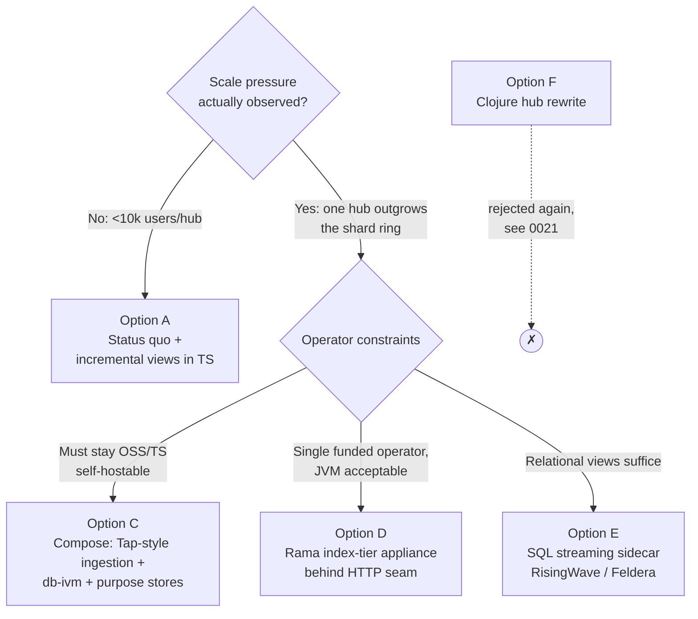
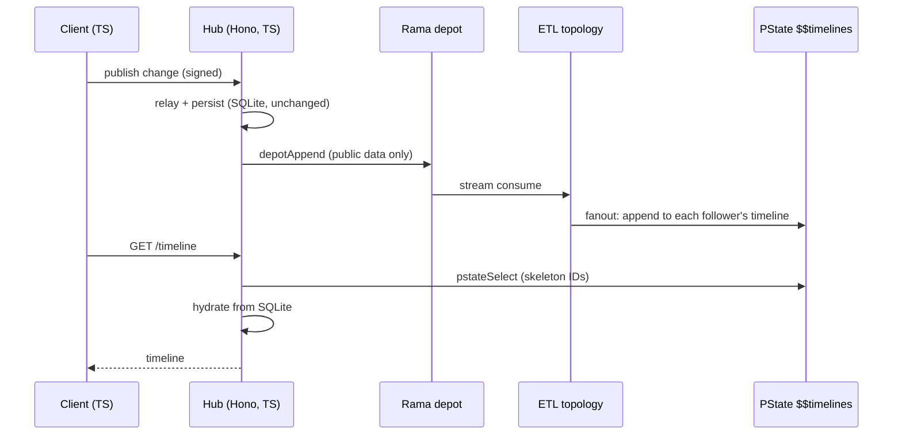

# Rama Revisited: A Clojure/Rama Index Tier for Larger Federated Hubs — and the Search for a TypeScript Equivalent

## Problem Statement

Does it make sense to integrate Clojure + Rama (Red Planet Labs' unified
dataflow/storage platform) to support **larger federated hubs** — hubs that
take on workloads like **web indexing** ([0023](./0023_[_]_DECENTRALIZED_SEARCH.md),
[0115](./0115_[_]_ARCHITECTING_FULLY_DECENTRALIZED_GLOBAL_WEB_SEARCH.md)) or
**atproto-scale social graph materialization** ([0301](./0301_[_]_ATPROTO_INTEGRATION_IDENTITY_SYNC_AND_HUB_AS_PDS.md))?
And if the JVM is the dealbreaker it was in
[0021](./0021_[_]_CLOJURE_PORT.md)/[0022](./0022_[_]_RAMA_HUB_AT_SCALE.md):
**is there a TypeScript equivalent to Rama in 2026?**

This is a deliberate re-open of **exploration 0022 (RAMA_HUB_AT_SCALE)**,
which concluded "almost perfect architectural fit, wrong dependency" and named
two explicit revisit triggers: *licensing becomes more permissive* or *a
TypeScript binding appears*. Three years of ecosystem movement warrant
checking both.

## Executive Summary

**Trigger 1 (licensing) partially fired.** On March 18, 2025 Rama 1.0 shipped
and became **free for production clusters up to 2 nodes**, with a $100/mo
"Bootstrap" tier to 3 nodes. It remains proprietary; scaling past 3 nodes
still costs $1,000/mo + $100/node. Rama is actively developed (v1.9.0, July
2026; steady release cadence; an LLM-codegen push) — but after three years it
still has **no named production adopters**, one public production account
(positive but sobering), and zero published Rama-for-atproto work.

**Trigger 2 (TS binding) never fired, and no TS equivalent exists.** A
five-way survey of the 2026 landscape (durable execution, streaming engines,
reactive/IVM databases, differential-dataflow lineage, atproto infra) finds
**no TypeScript platform that covers Rama's defining combination**: durable
partitioned event logs + programmable streaming topologies + arbitrarily
shaped distributed durable indexes + colocated distributed queries. Every
candidate covers at most two quadrants; the read path for derived state is
always "export to your own database."

**Recommendation (unchanged in direction, sharpened in shape):** do not put
Rama in xNet's dependency tree, and do not write hub code in Clojure. The
0022 objections that mattered — language bifurcation, no code sharing with
the 52 TS packages, self-hosting philosophy vs proprietary licensing — all
still hold. What *has* changed is the shape of the opportunity: Rama is now
viable as an **optional, self-contained "big index tier" appliance** behind a
narrow HTTP/gRPC seam, for a *single large hub operator* (not for the
federation at large) — and even that should wait until a real operator
outgrows the existing consistent-hash shard ring
(`packages/hub/src/services/index-shards.ts`). Meanwhile, the productive move
is to keep building the Rama-*inspired* TS architecture 0022 prescribed —
xNet has in fact already built most of it — and to close the one genuinely
missing piece: **incremental view maintenance**, where the TS ecosystem now
offers a real building block (the d2ts → TanStack `db-ivm` differential
dataflow lineage).

## Current State In The Repository

xNet already contains every seam a Rama integration would touch. The
architecture is, structurally, a hand-rolled single-node Rama:

| Rama concept | xNet equivalent today | Where |
| --- | --- | --- |
| Depot (durable event log) | `SignedChange` LWW log, Lamport clocks, hash chains | `packages/sync/src/change.ts`, `packages/data/src/store/` |
| ETL topology | Hub relay + indexer services (imperative, per-write) | `packages/hub/src/services/node-relay.ts`, `services/query.ts` |
| PState (materialized view) | Local derived caches, coarse invalidation, never synced | `packages/data/src/store/sqlite-adapter.ts` (`queryMaterializedView`, `node_query_materializations`), [0226](./0226_[_]_PERSISTENT_AND_SECURE_MATERIALIZED_VIEWS.md) |
| PState subindexing | SQLite FTS5, scalar/spatial indexes | `packages/hub/src/utils/fts.ts`, `packages/data/src/store/indexing/` |
| Partitioners | Consistent-hash global shard ring, replication factor | `packages/hub/src/services/index-shards.ts`, `shard-rebalancer.ts` |
| Query topology | Federated query router, BM25 scatter-gather | `packages/query/src/federation/router.ts`, `packages/hub/src/services/shard-router.ts` |
| Reactive proxy | WebSocket subscriptions via sync providers | `packages/runtime/src/sync/` (`MultiHubSyncManager.ts`) |

Scale posture: each hub is **one Node.js/Hono process on one better-sqlite3
file** (`packages/hub/src/server.ts`), durable via Litestream → S3/R2
([0288]); no Postgres, Redis, or queue anywhere. The distributed pieces that
do exist — the search-index shard ring, BM25 shard router, cross-hub
federation routes (`packages/hub/src/routes/federation.ts`), and the crawler
(`packages/hub/src/services/crawl.ts`, `crawl-robots.ts`) — are exactly the
web-indexing seams 0023/0115 sketched, built by hand.

Two structural gaps versus Rama stand out:

1. **Materialized views are not incremental.** Per 0226 and
   `sqlite-adapter.ts` (~line 1990): a view is a purely local ordered
   node-id list; any write to the schema or any grant change forces **full
   re-materialization**. Rama's whole point is incremental maintenance of
   many views from one log.
2. **The change log is not the computation substrate.** ETL-ish work
   (FTS indexing, shard ingest, notifications) happens imperatively inside
   request handlers, not as replayable consumers of the log — so backfill,
   reindex, and new-view-over-old-data are all bespoke code paths.

Prior art in-repo: [0021](./0021_[_]_CLOJURE_PORT.md) (Clojure port — rejected:
70% of code is JS interop, AI codegen quality, ecosystem size),
[0022](./0022_[_]_RAMA_HUB_AT_SCALE.md) (Rama — rejected with revisit
triggers), [0258](./0258_[_]_MULTI_HOME_SYNC_FEDERATED_HUBS_PEERS_AND_THE_REPLICATION_MANIFEST.md)
(federated/community hubs), [0287](./0287_[_]_FLEET_SCALABILITY_SHARP_EDGES_AND_HARD_CAPS.md)
(fleet scale limits), [0301](./0301_[_]_ATPROTO_INTEGRATION_IDENTITY_SYNC_AND_HUB_AS_PDS.md)/[0322]/[0324]
(atproto), [0306](./0306_[_]_EPOCH_RESOLVED_HUB_ARBITRATION.md) (hub
arbitration).

## External Research

### Rama, mid-2026

- **Licensing/status**: free for production ≤2 nodes since 2025-03-18
  (with 1.0.0); Bootstrap $100/mo ≤3 nodes (includes pair-programming
  consulting); Pro $1,000/mo + $100/node to 100 nodes; Enterprise above.
  Proprietary — never open-sourced; no acquisition or new funding found
  beyond the ~$5M seed. ([announcement](https://blog.redplanetlabs.com/2025/03/18/rama-the-100x-developer-platform-is-now-free-for-production-use/),
  [pricing](https://redplanetlabs.com/pricing))
- **Activity**: v1.9.0 (2026-07-06), ~quarterly releases
  ([release notes](https://github.com/redplanetlabs/rama-release-notes)):
  instant depot migrations (1.1), multi-source depots (1.2), Java 25 (1.5),
  lower microbatch latency (1.6), OpenAPI-conformant cluster API "for AI
  agent integration" (1.7). Active blog: a CockroachDB TPC-C comparison
  claiming parity at 40% less AWS cost (2026-03, RPL-authored), and a
  notable strategic bet on **LLM-generated Rama backends**
  ([report #1](https://blog.redplanetlabs.com/2026/05/28/teaching-llms-to-one-shot-complex-backends-at-scale-report-1/)) —
  directly aimed at the "AI agents write worse Clojure" objection from 0021.
- **Proof points**: the Twitter-scale Mastodon demo still stands — 100M bot
  users, 3,500 posts/sec at 403 avg fanout ≈ **1.4M timeline writes/sec**,
  87ms average timeline render, ~10k LOC, on 16 workers with 3× replication
  ([post](https://blog.redplanetlabs.com/2023/08/15/how-we-reduced-the-cost-of-building-twitter-at-twitter-scale-by-100x/)).
  Criticisms from the [HN thread](https://news.ycombinator.com/item?id=37137110)
  (LOC comparison vs decade-accreted Twitter; author-built demo circularity)
  remain fair.
- **Adoption**: the weak axis. One detailed public production account
  ([AJ LaMarc, 2024](https://www.ajlamarc.com/blog/2024-05-01-rama-storm/)):
  cluster "rock-solid," model excellent for timeline/chat workloads, but
  JVM-only API deters teams, docs immature, unattractive below funded-startup
  scale. **No named production customers anywhere**; no logo wall. The free
  tier + $100/mo tier + LLM push all read as responses to slow adoption.
- **Clojure DX**: deep, not a wrapper — `defmodule` is ordinary Clojure,
  PStates use Specter paths, REPL-driven in-process clusters. But the
  dataflow language is a paradigm break (call-and-emit, `*vars`, Rama
  variants of core forms) with cryptic macro errors
  ([Holy's hands-on series](https://blog.jakubholy.net/2023/hands-on-rama-day1/)).
- **Rama + atproto**: **no published work exists** — searched multiple ways.
  Any Rama-for-atproto design would be novel, not a documented pattern.

### How Bluesky actually materializes an atproto-scale graph (the existence proof)

Bluesky's production stack decomposes **exactly** into Rama's four concepts —
built by hand as a dozen bespoke services:

- **Depot**: the relay firehose (Go `indigo/cmd/relay`, rolling-window log;
  full history lives in per-account PDS repos), plus
  [Jetstream](https://jazco.dev/2024/09/24/jetstream/) (~850MB/day for all
  posts as JSON) and the new **Tap** service (2026, beta) — filtered,
  *verified*, auto-backfilled per-repo event streams at 35–45k events/sec
  with an official TS client `@atproto/tap`
  ([announcement](https://docs.bsky.app/blog/introducing-tap)).
- **ETL**: Go firehose consumers; "lossy timelines" fanout-on-write that
  deliberately drops deliveries for over-followed accounts
  ([jazco](https://jazco.dev/2025/02/19/imperfection/)).
- **PStates**: the AppView V2 dataplane — closed-source Go on **ScyllaDB +
  Redis** (<5% DB load at peak); and **GraphD**, the entire follow graph
  served from one in-memory Go service (~6.6GB RAM, p99 1.2ms reads,
  rebuilt from the firehose in ~5 min)
  ([jazco](https://jazco.dev/2024/04/15/in-memory-graphs/),
  [Pragmatic Engineer](https://newsletter.pragmaticengineer.com/p/bluesky)).
- **Query topologies**: XRPC + internal gRPC dataplane returning "skeletons"
  (ID lists/counts) that a TS hydration layer assembles into views. The
  *open-source* TS dataplane is reference-grade (Node + Postgres); community
  appviews (Blacksky's fork, Zeppelin, bitcrowd's Elixir PoC) exist because
  of that gap.

The TS atproto ecosystem (Slices/quickslice, Graze, SkyFeed, skyware,
atcute) confirms the pattern: **Jetstream/Tap → typed TS consumer →
SQLite/Postgres**, with all materialization logic hand-rolled per app.
Nothing Rama-shaped exists there either.

### Is there a TypeScript equivalent to Rama? (No — here's the map)

Rama = four quadrants: **depot** (durable partitioned log) → **ETL**
(programmable streaming topologies) → **PState** (arbitrarily shaped
distributed durable indexes) → **query** (colocated distributed queries).
The 2026 TS landscape, by closest approach:

| System | Depot | ETL | PState | Query | The gap |
| --- | :-: | :-: | :-: | :-: | --- |
| **Restate** (TS SDK, Rust core) | ~ | ~ | ~ | ✗ | Internally Rama-shaped (Bifrost replicated log → co-partitioned RocksDB state), but exposes only per-key K/V on Virtual Objects; SQL surface is debug-only; no cross-key queries |
| **Cloudflare** (Queues/Pipelines + Workflows + DO SQLite) | ~ | ~ | ~ | ✗ | All the organs, never composed: per-DO SQLite is a real index but **no cross-object query layer exists**; Pipelines (Arroyo) sinks to Iceberg, not to serving state |
| **Temporal / Inngest / Trigger.dev / DBOS / Vercel WDK** | ✗/~ | ✗ | ✗ | ✗ | Durable *execution*, explicitly not durable *state*; "use your own DB" |
| **Estuary Flow** | ✓ | ✓ (real TS derivations, typed, Deno) | ✗ | ✗ | Best TS authoring of streaming logic; derived state must land in an external DB |
| **RisingWave / Materialize / Feldera** | ✗ (Kafka/CDC) | SQL only | ✓ (queryable incremental MVs — relational) | ~ | The queryable-materialized-state half exists — but authoring is SQL, state is tables, and there's no TS surface (RisingWave: JS-in-SQL scalar UDFs only) |
| **d2ts → TanStack DB `db-ivm`** | ✗ | ✓ (true differential dataflow in TS) | ✗ | ✓ (client) | The only living TS-native DD engine — deliberately **client-side, single-node**; d2ts itself dormant since 2025-07, lineage continues in TanStack DB (0.6, active) |
| **Skip (skiplabs.io)** | ✗ | ✓ (real TS IVM runtime: collections/mappers/resources) | ~ | ~ | Best conceptual match on the compute quadrant; v0.0.19, no distribution story, company pivoted to an AI agent product (Skipper, 2026-06) |
| **Zero (Rocicorp) / Convex / LiveStore** | ✗/~ | ✗ | ~ | ✓ | Excellent app-scale reactivity; Convex OSS is single-node, Zero is a Postgres read path, LiveStore is per-client event sourcing (most Rama-shaped *conceptually*, zero server compute) |
| **MooseStack (514 Labs)** | ✓ (Redpanda) | ✓ (TS streaming fns) | ~ (ClickHouse MVs) | ✓ (typed APIs) | The closest *end-to-end* TS analog — but assembled from OLAP parts: no per-key serving semantics, no arbitrary index shapes; early-startup maturity |

**Bottom line**: nobody in TS offers programmable distributed durable
indexes maintained by streaming topologies and served by colocated queries.
The honest TS approximation is a composition — e.g. for atproto:
**Tap (verified depot + backfill) → TS consumers → purpose-built stores**,
which is precisely what Bluesky built in Go, service by service.

## Key Findings

1. **0022's architecture verdict has aged perfectly; its adoption verdict
   has aged even better.** Rama remains the best *model* for this workload
   class, and three more years produced zero named adopters — the
   bus-factor/lock-in risk is now measured, not hypothetical.
2. **The licensing trigger fired only at the bottom.** Free ≤2 nodes /
   $100/mo ≤3 nodes makes Rama *trialable* and viable for a single beefy
   index appliance — but a 2–3 node ceiling is not "web index" scale, and
   per-cluster licensing composes badly with a federation of independent
   hub operators (every operator >3 nodes needs their own $1,000+/mo
   license). The MIT/self-hosting conflict from 0022 stands.
3. **Federation is orthogonal to Rama.** Rama scales *one* cluster; xNet's
   growth model is *many* independent hubs with scoped replication
   (0258) and federated queries. A Rama tier could only ever live inside
   one large operator's hub — it does nothing for cross-hub federation,
   which stays in `packages/query/src/federation/router.ts` regardless.
4. **atproto-scale graph materialization is a proven depot/ETL/PState
   workload** — proven by Bluesky *without* Rama, in Go, with ~a dozen
   services. Rama's honest value proposition is unifying those services,
   at the price of the JVM, a proprietary runtime, and a paradigm-break
   dataflow language.
5. **There is no TS Rama, but the missing quadrant for xNet is narrower
   than "all of Rama."** xNet already has the depot (signed change log),
   partitioning (shard ring), and query routing (federation router). The
   genuinely missing piece is **incremental view maintenance over the
   change log** — and TS now has a real, living IVM engine in the
   d2ts → TanStack `db-ivm` lineage, plus SQL-engine sidecars
   (RisingWave/Feldera) if relational IVM ever suffices server-side.
6. **Full-text/web indexing is Rama's weakest fit anyway.** PStates give
   sorted-key range queries, not inverted-index primitives; RPL has
   published nothing on search. xNet's FTS5 + BM25 shard router is closer
   to the state of the art for its scale than a from-scratch Rama index
   would be.

## Options And Tradeoffs



### Option A — Status quo + close the IVM gap in TypeScript (evolve 0022's "mini-Rama")

Keep Node+SQLite hubs; make the change log the computation substrate:
formalize log consumers (replayable, resumable "topologies" for FTS/shard
ingest/notifications), and adopt `db-ivm`-style differential dataflow for
incremental materialized views, replacing 0226's full-rematerialization on
invalidation.

- **Pro**: same language, same packages, zero new infra; directly fixes the
  measured pain (coarse invalidation); benefits every hub, not just big ones.
- **Con**: `db-ivm` is client-oriented and pre-1.0; server-side use is
  pioneering. Doesn't address >1-node compute.

### Option C — The "Bluesky recipe" in TS: composed services per index

When one hub genuinely needs Twitter-shape state: dedicated consumer
processes off the hub's change log (and/or atproto Jetstream/Tap for
external data), each maintaining a purpose-built store — an in-memory
graph service à la GraphD, FTS shards as today, timelines as ring buffers.

- **Pro**: proven at 30M+ users (Bluesky); every piece OSS; TS end-to-end
  possible (`@atproto/tap`, skyware); incremental adoption per index.
- **Con**: this is the "distributed systems tax" Rama eliminates — each new
  view is a new service with its own backfill/recovery/consistency story.

### Option D — Rama as an optional index-tier appliance (the new viable shape)

One large hub operator runs a Rama cluster (free at 2 nodes, $100/mo at 3)
as a **sidecar appliance**: hub streams its change log (and/or atproto
firehose) into depots; Clojure module materializes graph/timeline/aggregate
PStates; hub queries via Rama's REST/query topologies through a thin TS
gateway. No Clojure anywhere else; the seam is one HTTP client in
`packages/hub`.

- **Pro**: the strongest engine for exactly the fanout/graph workload;
  2-node free tier makes a pilot ~zero-cost; LLM-codegen story improving
  (RPL's own 2026 push); a 105-line social-graph ETL is real leverage.
- **Con**: proprietary runtime with zero named adopters; JVM ops (ZooKeeper,
  Conductor, Supervisors) land on whoever runs it; PStates hold data that
  is E2E-signed/private in xNet's model — private-by-default data
  ([0324]) mostly *can't* be server-materialized at all, shrinking the
  addressable workload to public/shared-space data; growth past 3 nodes
  re-triggers the licensing conflict.

### Option E — SQL streaming sidecar (RisingWave / Feldera / Materialize)

If the needed views are relational (counts, joins, leaderboards, feed
skeletons), a Postgres-wire streaming DB consuming the change log gives
queryable incremental MVs without the JVM or a proprietary runtime
(RisingWave and Feldera are OSS).

- **Pro**: mature IVM, horizontal scale, standard wire protocol.
- **Con**: SQL-only authoring; relational-only state (no nested
  PState-shaped structures); another stateful service to operate; same
  private-data limitation as D.

### Option F — Clojure hub / full Rama adoption — rejected, again

Everything in 0021 still holds (interop share of the codebase, ecosystem
size, AI-codegen gap — though RPL is attacking that last one), plus 0022's
code-sharing argument: the hub reuses `@xnetjs/data`, `@xnetjs/sync`,
`@xnetjs/crypto` in-process; a Clojure hub forfeits all of it.

## Recommendation

Answering the prompt directly:

1. **"Does it make sense to integrate Clojure + Rama for larger federated
   hubs?"** — *As the hub's foundation: no, for the same reasons as 0022,
   now with three more years of non-adoption as evidence. As an optional
   single-operator index appliance: it's newly plausible (free tier, active
   development, perfect workload fit) but still premature* — no xNet hub has
   hit the scale where the shard ring fails, and xNet's private-by-default
   data model excludes much of what PStates would materialize. Rama also
   does nothing for *federation* itself; it scales one cluster.
2. **"Is there a TS equivalent to Rama?"** — **No.** Closest per quadrant:
   Restate (log+state internals, per-key surface), Cloudflare (all organs,
   no cross-object queries), Estuary (TS ETL authoring), TanStack
   `db-ivm`/d2ts (TS differential dataflow, client-side), Skip (TS IVM
   runtime, v0.0.x), MooseStack (all four pillars via OLAP composition).
   The pragmatic TS answer is composition — the Bluesky recipe.

Concrete path:

- **Now (do)**: Option A. Formalize replayable log-consumer "topologies" in
  the hub and prototype incremental view maintenance with the `db-ivm`
  lineage against `node_query_materializations`, killing the
  full-rematerialization cliff from 0226. This is the 20% of Rama that
  fixes a measured problem for every hub.
- **When an operator outgrows the shard ring**: Option C per index
  (in-memory graph service first — GraphD is ~6.6GB for a 30M-user
  network's *entire* follow graph; a TS/Rust port is a weekend-scale
  service, not a platform).
- **Revisit Rama (Option D pilot)** only on a concrete trigger, recorded
  here for the next re-open: (a) a named production adopter comparable to
  an xNet hub operator appears, or (b) an xNet operator has a funded,
  public-data workload >1M DAU-equivalent where composed services (Option
  C) are demonstrably the bottleneck, or (c) Rama's per-node licensing
  becomes compatible with redistribution/self-hosting.
- **If atproto ingestion lands** ([0322]/[0324]/[0301]): build on
  **Tap + `@atproto/tap`** for verified, backfilled ingestion regardless of
  which option wins — it solves the depot-with-replay problem the TS way.

## Example Code

What the Option D seam would look like — the *entire* Clojure surface area
(everything else stays TS). Follower-graph + timeline-fanout module,
condensed from the patterns in RPL's Mastodon implementation:

```clojure
(ns hub.social-index
  (:use [com.rpl.rama] [com.rpl.rama.path])
  (:require [com.rpl.rama.aggs :as aggs]))

(defmodule SocialIndexModule [setup topologies]
  ;; depot: hub streams SignedChange records (public spaces only), partitioned by author
  (declare-depot setup *changes (hash-by :author-did))

  (let [s (stream-topology topologies "graph")]
    ;; PState: follower sets, one partition per task (Bluesky's GraphD, declaratively)
    (declare-pstate s $$followers {String (set-schema String {:subindex? true})})
    (declare-pstate s $$timelines {String (vector-schema String {:subindex? true})})

    (<<sources s
      (source> *changes :> {:keys [*author-did *kind *subject]})
      (<<subsource *kind
        (case> :follow)
        (|hash *subject)                       ; move computation to the followee's partition
        (local-transform> [(keypath *subject) NONE-ELEM (termval *author-did)] $$followers)
        (case> :post)
        (|hash *author-did)
        (local-select> [(keypath *author-did) ALL] $$followers :> *follower)
        (|hash *follower)                      ; fanout: repartition per follower
        (local-transform> [(keypath *follower) AFTER-ELEM (termval *subject)] $$timelines)))))
```

And the full TS-side integration — a thin client in the hub, nothing more:

```typescript
// packages/hub/src/services/rama-index.ts (hypothetical seam)
const rama = createRamaRestClient(config.ramaClusterUrl)

export async function onPublicChange(change: SignedChange) {
  await rama.depotAppend('*changes', encodeChange(change)) // fire-and-forget into the depot
}

export async function getTimeline(did: string, limit: number) {
  return rama.pstateSelect('$$timelines', [did], { last: limit }) // skeleton IDs; hydrate from SQLite
}
```



## Risks And Open Questions

- **Private data boundary.** xNet is private-by-default with E2E signing
  ([0301], [0324]); a server-side index tier (Rama or SQL sidecar) can only
  materialize what the hub can read. What fraction of a large hub's query
  load is public/shared-space data? If small, Options D/E address a niche.
- **`db-ivm` on the server is pioneering.** The lineage is client-oriented
  and pre-1.0; d2ts proper is dormant. Budget for owning a fork, or treat
  Feldera/RisingWave as the fallback for relational views.
- **Rama bus factor.** Small team, one famous founder, proprietary, no
  named adopters. An appliance behind a seam limits blast radius (fall back
  to Option C), but backfill-from-depot history would be lost on exit
  unless the hub's own change log remains the source of truth (it must).
- **Licensing drift.** RPL has changed pricing once; a free-tier withdrawal
  would strand a pilot. Contractual comfort needed before any non-toy use.
- **Does the shard ring actually break?** 0287's caps are theoretical;
  nobody has load-tested `index-shards.ts` at web-index scale. Measuring
  that is cheaper than adopting anything.
- **Open question**: could RPL's LLM-codegen bet neutralize 0021's
  strongest argument (AI agents write worse Clojure/dataflow)? Their
  published harness (`rama-ai-learn`) is worth re-checking in 12 months.

## Implementation Checklist

- [ ] Write a load-test harness for the existing shard ring
      (`packages/hub/src/services/index-shards.ts`) at 10–100× current
      assumptions; record where it breaks (this gates everything else).
- [ ] Formalize replayable log-consumer topologies in the hub: extract FTS
      indexing (`services/query.ts`) and shard ingest (`shard-ingest.ts`)
      into resumable consumers of the change log with offset tracking.
- [ ] Prototype incremental view maintenance with `@tanstack/db-ivm` (or a
      d2mini fork) over `node_query_materializations`, replacing
      full-rematerialization on `invalidated_at`/`auth_fingerprint` change;
      benchmark vs 0226 baseline.
- [ ] If atproto ingestion proceeds: adopt `@atproto/tap` for verified
      backfilled ingestion; spike a follower-graph consumer into an
      in-memory TS graph service (GraphD pattern) fed by the log.
- [ ] Time-boxed spike (optional, 2 days): run Rama free-tier locally via
      `rama-clojure-starter`, port the example module above, measure
      fanout throughput vs the equivalent TS consumer on one node — data
      for the next revisit, not a commitment.
- [ ] Record the three Option-D revisit triggers in a follow-up check of
      this doc after the above land.

## Validation Checklist

- [ ] Shard-ring load test produces a written breaking-point number cited
      in a follow-up doc (replaces "theoretical caps" from 0287).
- [ ] A new materialized view over existing data can be built by replaying
      the change log through a consumer — no bespoke backfill code path.
- [ ] IVM prototype: view update cost after a single node write is O(delta),
      not O(view); measured ≥10× improvement over full re-materialization
      on the 0226 benchmark shapes.
- [ ] Timeline/graph spike (if run): TS single-node consumer vs Rama
      single-node throughput numbers recorded side by side.
- [ ] No Clojure or JVM dependency appears in any package's dependency
      tree; any Rama pilot remains behind a single HTTP client module.

## References

**Prior xNet explorations**: [0021 Clojure Port](./0021_[_]_CLOJURE_PORT.md) ·
[0022 Rama Hub At Scale](./0022_[_]_RAMA_HUB_AT_SCALE.md) ·
[0023 Decentralized Search](./0023_[_]_DECENTRALIZED_SEARCH.md) ·
[0115 Global Web Search](./0115_[_]_ARCHITECTING_FULLY_DECENTRALIZED_GLOBAL_WEB_SEARCH.md) ·
[0226 Materialized Views](./0226_[_]_PERSISTENT_AND_SECURE_MATERIALIZED_VIEWS.md) ·
[0258 Federated Hubs](./0258_[_]_MULTI_HOME_SYNC_FEDERATED_HUBS_PEERS_AND_THE_REPLICATION_MANIFEST.md) ·
[0287 Fleet Scalability](./0287_[_]_FLEET_SCALABILITY_SHARP_EDGES_AND_HARD_CAPS.md) ·
[0301 atproto Integration](./0301_[_]_ATPROTO_INTEGRATION_IDENTITY_SYNC_AND_HUB_AS_PDS.md) ·
[0306 Epoch-Resolved Hub Arbitration](./0306_[_]_EPOCH_RESOLVED_HUB_ARBITRATION.md)

**Rama**:
[Rama free for production (2025-03-18)](https://blog.redplanetlabs.com/2025/03/18/rama-the-100x-developer-platform-is-now-free-for-production-use/) ·
[Pricing](https://redplanetlabs.com/pricing) ·
[Release notes (v1.9.0)](https://github.com/redplanetlabs/rama-release-notes) ·
[Twitter-scale Mastodon](https://blog.redplanetlabs.com/2023/08/15/how-we-reduced-the-cost-of-building-twitter-at-twitter-scale-by-100x/) ·
[HN discussion](https://news.ycombinator.com/item?id=37137110) ·
[PStates docs](https://redplanetlabs.com/docs/~/pstates.html) ·
[Clojure API](https://blog.redplanetlabs.com/2023/10/11/introducing-ramas-clojure-api/) ·
[Rama in five minutes (Clojure)](https://blog.redplanetlabs.com/2025/12/02/rama-in-five-minutes-clojure-version/) ·
[LLM one-shot backends report #1](https://blog.redplanetlabs.com/2026/05/28/teaching-llms-to-one-shot-complex-backends-at-scale-report-1/) ·
[TPC-C vs CockroachDB](https://blog.redplanetlabs.com/2026/03/17/rama-matches-cockroachdbs-tpc-c-performance-at-40-less-aws-cost/) ·
[Production account: "A Storm is brewing"](https://www.ajlamarc.com/blog/2024-05-01-rama-storm/) ·
[Hands-on Rama (Holy)](https://blog.jakubholy.net/2023/hands-on-rama-day1/)

**Bluesky/atproto at scale**:
[Building Bluesky (Pragmatic Engineer)](https://newsletter.pragmaticengineer.com/p/bluesky) ·
[GraphD in-memory follow graph](https://jazco.dev/2024/04/15/in-memory-graphs/) ·
[Lossy timelines / AppView V2](https://jazco.dev/2025/02/19/imperfection/) ·
[Jetstream](https://jazco.dev/2024/09/24/jetstream/) ·
[Introducing Tap](https://docs.bsky.app/blog/introducing-tap) ·
[Sync v1.1 relay updates](https://atproto.com/blog/relay-updates-sync-v1-1) ·
[bitcrowd Elixir dataplane PoC](https://bitcrowd.dev/2026/03/30/building-a-performance-evaluation-toolkit-and-a-dataplane-poc-for-atproto/) ·
[quickslice/Slices](https://quickslice.slices.network/) ·
[Graze raises $1M (TechCrunch)](https://techcrunch.com/2025/04/16/bluesky-feed-builder-graze-raises-1m-rolls-out-ads/) ·
[skyware](https://github.com/skyware-js) · [atcute](https://github.com/mary-ext/atcute)

**TS landscape**:
[Restate durable-execution engine internals](https://www.restate.dev/blog/building-a-modern-durable-execution-engine-from-first-principles) ·
[Temporal $300M Series D](https://temporal.io/blog/temporal-raises-usd300m-series-d-at-a-usd5b-valuation) ·
[Cloudflare acquires Arroyo / Pipelines](https://blog.cloudflare.com/cloudflare-acquires-arroyo-pipelines-streaming-ingestion-beta/) ·
[SQLite in Durable Objects](https://blog.cloudflare.com/sqlite-in-durable-objects/) ·
[Estuary TypeScript derivations](https://docs.estuary.dev/guides/transform_data_using_typescript/) ·
[RisingWave JS UDFs](https://docs.risingwave.com/sql/udfs/user-defined-functions) ·
[Feldera](https://github.com/feldera/feldera) ·
[d2ts (ElectricSQL)](https://github.com/electric-sql/d2ts) ·
[TanStack DB live queries / db-ivm](https://tanstack.com/db/latest/docs/guides/live-queries) ·
[Zero 1.0](https://zero.rocicorp.dev/docs/release-notes/1.0) ·
[Convex $24M](https://news.convex.dev/convex-raises-24m/) ·
[Skip runtime](https://github.com/SkipLabs/skip) ·
[LiveStore](https://livestore.dev/) ·
[MooseStack](https://github.com/514-labs/moosestack) ·
[Tinybird TS SDK](https://www.tinybird.co/blog/clickhouse-typescript-sdk)
