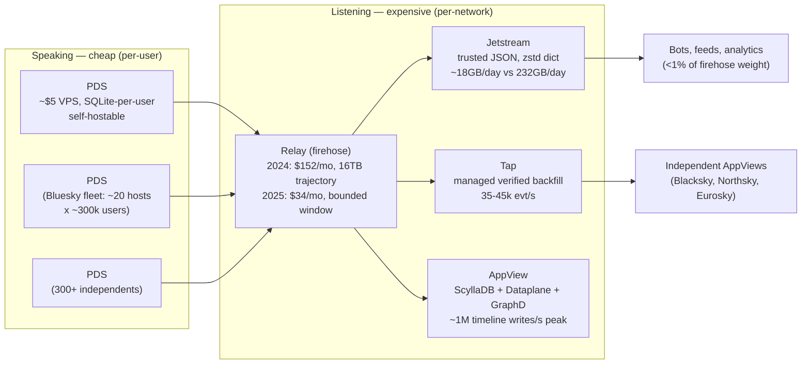
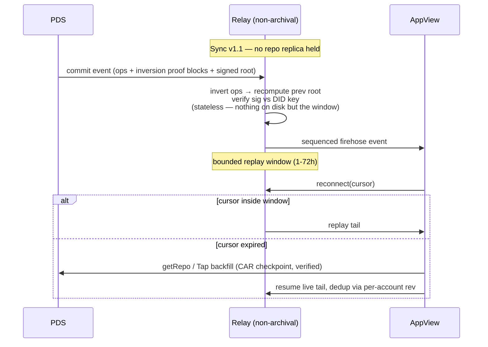

# How ATProto Manages Scale: Relay Economics, Stateless Verification, And Lessons For xNet

## Problem Statement

ATProto (the AT Protocol, underneath Bluesky) runs an open-source, federated
network at ~40M accounts with a protocol that promises anyone can self-host
any component. How does it actually manage scale — where do the costs pool,
what protocol moves made those costs shrink, and which of those moves should
xNet harvest for its own hub/federation stack?

This is the fifth ATProto exploration, and the first about *operations at
scale* rather than integration. The prior four covered what ATProto is and
whether to plug into it:

- [0301](0301_%5B_%5D_ATPROTO_INTEGRATION_IDENTITY_SYNC_AND_HUB_AS_PDS.md) —
  protocol comparison; identity yes, sync no, hub-as-PDS demand-gated.
- [0322](0322_%5B_%5D_SIGN_IN_WITH_ATPROTO_BLUESKY_AND_ANY_PDS_AS_AUTH.md) —
  ATProto OAuth as an auth door.
- [0324](0324_%5B_%5D_ATPROTO_PERMISSIONED_PRIVATE_DATA_AND_XNET.md) — the
  permissioned-spaces proposal; access control without confidentiality.
- [0326](0326_%5B_%5D_HABITAT_ORGANIZATIONAL_DATA_SERVER_AND_XNET.md) —
  Habitat's org-flavored ODS adaptation.

This one asks: what does ATProto know about scale that xNet's hub, sync
manager, and federation tier should learn?

## Executive Summary

**ATProto's entire shape falls out of one asymmetry, stated in Bluesky's
2023 federation post: "speaking is cheap, listening is expensive."** Hosting
and signing your own data costs almost nothing (a PDS runs on a $5 VPS; a
Raspberry Pi can serve tens of thousands of accounts). Consuming *everyone
else's* data — global indexes, timelines, search — is where O(network) cost
lives. ATProto's answer is to pool that cost in a small number of explicitly
named roles (Relay, AppView) and then wage a protocol-level campaign to make
each role as cheap and commodity as possible.

**The campaign worked on the relay and stalled on the AppView.** A
full-network relay cost ~$152/mo with unbounded disk in July 2024 and was
headed to 16 TB of NVMe by that November. Sync v1.1 (2025) made verification
*stateless* — each firehose commit now carries "MST inversion" proofs, so a
relay can validate commits without holding a replica of every repo. Result: a
full-network relay now runs on an 8 vCPU / 16 GB / 160 GB VPS for **$34/mo**,
with a bounded replay window instead of an archive. The AppView, by contrast,
remains the expensive tier *by design* — it absorbs the listening cost
everyone else avoids (≈1M timeline writes/sec at peak; one analysis attributes
half of Bluesky's production workload to the Following feed alone).

**Five transferable patterns, and one already-held advantage:**

1. **Stateless verification is the cost lever.** Moving proofs into messages
   converted the relay from a 16 TB replica into a bounded-buffer router.
   xNet is *already there* — every change is independently verifiable
   (BLAKE3 hash + Ed25519 signature, no replica needed) — but the hub still
   behaves archivally. The missing half is a **bounded replay window**.
2. **Tiered fidelity streams.** ATProto offers a verified firehose ($34/mo),
   a trusted-JSON firehose (Jetstream: >99% bandwidth reduction, zstd with a
   pre-trained dictionary, 482→211 bytes/event), and managed sync (Tap).
   xNet's ~500–600-byte WS frame around a ~40-byte payload
   ([0323](0323_%5B_%5D_ENTITY_COMPONENT_SYSTEM_AND_HIGH_FREQUENCY_STATE.md))
   is exactly the shape dictionary compression crushes.
3. **Lossless log, lossy views.** Bluesky probabilistically drops timeline
   writes for extreme-follow users while repos stay canonical — consistency
   budget spent where it matters. xNet's granularity floor and the
   materialized-view layer should adopt this as an explicit principle.
4. **Actor-sharded SQLite works when cross-actor indexes live elsewhere.**
   Bluesky runs its own ~6M-user majority on ~20 PDS instances of SQLite-per-
   user ("a dream to run… no Postgres service!"). This directly validates
   xNet's per-tenant SQLite hub — *provided* global queries stay in the
   crawl/shard tier, which they do.
5. **Backfill is a product, not a protocol afterthought.** Every AppView
   builder hand-rolled crawl+cutover until Bluesky shipped Tap (35–45k
   events/sec verified backfill as a sidecar binary). xNet's
   `InitialSyncManager` is the analog; the anti-entropy digest that 0258 and
   0325-C3 call for is the remaining gap.

**Recommendation: no architecture change — xNet deliberately made the
opposite macro-bet (small-world encrypted Spaces, no global public heap), and
that bet is reaffirmed, not challenged, by this study. Harvest the four
operational patterns** (bounded replay window, dictionary-compressed frames,
lossy-views principle, backfill/anti-entropy hardening) as small, sequenced
hub/sync improvements.

## Current State In The Repository

xNet already has structural analogs for each ATProto role. The mapping:

| ATProto role | xNet analog | Key files |
| --- | --- | --- |
| PDS (user's data server) | Client + personal hub | [`packages/hub/src/services/node-relay.ts`](../../packages/hub/src/services/node-relay.ts), [`packages/hub/src/storage/sqlite.ts`](../../packages/hub/src/storage/sqlite.ts) |
| Repo (signed MST log) | Signed hash-chained LWW change log ([0200](0200_%5Bx%5D_PORTABLE_XNET_PROTOCOL_BOUNDARIES_AND_STANDARD.md)) | [`packages/core/src/lww.ts`](../../packages/core/src/lww.ts), `node_changes` DDL at [`storage/sqlite.ts:336`](../../packages/hub/src/storage/sqlite.ts) |
| Relay firehose | `NodeRelayService` rooms + high-water-mark cursor sync | [`node-relay.ts`](../../packages/hub/src/services/node-relay.ts) (`node-sync-request { sinceLamport }` → `{ changes, highWaterMark }`) |
| Jetstream (cheap tail) | — none — | (candidate: zstd dictionary compression on WS frames) |
| AppView (global index) | Crawl + consistent-hash shard ring + federated search | [`services/crawl.ts`](../../packages/hub/src/services/crawl.ts), [`index-shards.ts`](../../packages/hub/src/services/index-shards.ts), [`federation.ts`](../../packages/hub/src/services/federation.ts) |
| Tap (backfill sidecar) | `InitialSyncManager` bulk catch-up | [`packages/runtime/src/sync/InitialSyncManager.ts`](../../packages/runtime/src/sync/InitialSyncManager.ts) |
| PDS→relay rate caps | 40 msg/s client throttle, 100 msg/s hub cap | [`node-store-sync-provider.ts:22`](../../packages/runtime/src/sync/node-store-sync-provider.ts) |
| Relay storage economics | Quota + eviction (post-0291) | [`node-relay.ts`](../../packages/hub/src/services/node-relay.ts) (`quotaBytes`, `QUOTA_EXCEEDED`/`STORAGE_FULL`), [`services/eviction.ts`](../../packages/hub/src/services/eviction.ts) |
| Multi-home replication | Space-scoped replication manifest (0258) | [`MultiHubSyncManager.ts`](../../packages/runtime/src/sync/MultiHubSyncManager.ts), `planReplicationDestinations` |

Details that matter for the comparison:

- **The change log is already proof-carrying.** Each change is
  content-addressed (BLAKE3), Ed25519-signed, and hash-chained; the hub
  verifies hash + signature + wall-time skew per message
  (`handleNodeChange`, [`node-relay.ts:152`](../../packages/hub/src/services/node-relay.ts))
  with **no repo replica required**. xNet never had ATProto's archival-relay
  problem — stateless verification was designed in via
  [0200](0200_%5Bx%5D_PORTABLE_XNET_PROTOCOL_BOUNDARIES_AND_STANDARD.md) and
  hardened by the v4 tiebreak in 0305.
- **But the hub is archival by default.** `node_changes` is append-only;
  `pruneSupersededChanges`
  ([`sqlite-adapter.ts:653`](../../packages/data/src/store/sqlite-adapter.ts))
  exists on the client per 0254, and quota shedding exists on the hub per
  0291, but there is no *bounded replay window* concept — no "this hub
  retains N days of tail; older state comes from a checkpoint."
- **The cold-open stall is xNet's own "listening is expensive" moment.** The
  318k-row change-log replay produced a 15s first query
  ([0249](0249_%5B_%5D_THE_COLD_OPEN_STALL_NAMING_THE_15S_QUERY_AND_THE_9S_IDENTITY_BUCKET.md));
  0323 showed a 240 Hz writer reproduces that cliff in ~22 minutes. Notably,
  0249 measured hub connect at 267 ms and sync drain at ~99 ms — **the
  network tier is not the bottleneck; unbounded log replay is** — the same
  lesson ATProto's relay learned at 16 TB. (A branch-in-flight exploration,
  0318, extends the measurements to 10M rows: indexed reads stay flat at
  ~0.8 ms while four O(N) cliffs — sort, cursor, count, offset — dominate.)
- **Federation is scatter-gather, not firehose.** Cross-hub search
  ([`federation.ts`](../../packages/hub/src/services/federation.ts)) signs
  UCAN-authenticated queries against trusted peers — xNet's "small world"
  choice, the deliberate inverse of ATProto's global heap. The compare page
  already encodes ATProto (`sync: 'Federated relays'`,
  [`site/src/data/compare.ts:1048`](../../site/src/data/compare.ts)).

## External Research

### The macro-architecture: pooling the listening cost



Bluesky's 2023 federation-architecture post names the asymmetry explicitly
and draws the consequence: PDSes broadcast to a few large aggregators that
rebroadcast network-wide ("big world with small world fallbacks"), instead of
ActivityPub's server-to-server mesh. Kleppmann et al. (CoNEXT '24) give the
correctness argument: ActivityPub reply threads diverge across servers
because notifications don't reach every server holding a copy; a relay
clearinghouse gives every consumer whole-network visibility. The "ATProto for
distributed systems engineers" article frames it as a familiar high-scale
backend turned inside out: repos are the write side, the firehose is the
Kafka-style shared log, AppViews are replayable stream-processing view
servers — and anyone can attach a new one.

### The relay cost collapse: 2024 → 2026

| Date | Event | Cost / footprint |
| --- | --- | --- |
| Jul 2024 | bnewbold runs full-network archival relay | $152/mo; 447 GB Postgres + 722 GB CAR store, "disk is the hard part" |
| Nov 2024 | Post-election surge; Lemmer-Webber critique | Relay ~16 TB NVMe trajectory; >2,000 evt/s sustained; ~$55k/yr storage estimates |
| Nov 2024 | Rainbow fan-out service; relay migration | Firehose rebroadcast decoupled from relay |
| Sep 2024 | Jetstream ships | Posts-only tail ~850 MB/day — <1% of full firehose |
| 2025 | **Sync v1.1: non-archival relays** | Proofs carried in commit messages ("MST inversion"); reference: 2 vCPU / 12 GB / ~30 Mbps; replay window 1–72h configurable |
| May 2025 | bnewbold reruns full network | **$34/mo** — 8 vCPU / 16 GB / 160 GB VPS; ~21 GB after 8 days |
| Jan 2026 | `bsky.network` production cutover to non-archival | Sequence jump ~17.5B → ~26.6B; consumers dedup via per-account `rev` |

The protocol change is the whole story. Before Sync v1.1, validating a commit
required the relay to hold the account's previous repo state — verification
was *stateful*, so the verifier's disk grew with the network. Sync v1.1 makes
each commit message carry the MST blocks needed to invert the operation and
check the previous root — verification became *stateless*, so relay disk is
now a bounded replay buffer, not an archive.



### Jetstream: the officially-blessed lossy tier

Jetstream converts the CBOR+CAR verified firehose into plain JSON over
WebSocket, with optional zstd using a **custom pre-trained dictionary**
(inspired by Discord's zstd-over-WebSocket work):

- Surge weekend (Sep 2024): full firehose 232 GB/day → Jetstream JSON
  ~41 GB/day → zstd ~18 GB/day; a posts-only consumer needs ~850 MB/day.
- Average event 482 → 211 bytes (~0.44 ratio); compress-once, serve-all.
- The whole service runs in <16 MB resident memory.
- Explicit trade: signatures and MST blocks are stripped — consumers trust
  the Jetstream operator. "Unsuitable for services maintaining fully
  verified, synced network copies."

The pattern: **let consumers choose fidelity**. Most listeners (bots, feed
generators, analytics) don't need cryptographic verification, and letting
them say so drained load off the expensive verified tier.

### The AppView: where cost is supposed to pool

- Data layer migrated Postgres → **ScyllaDB** + Redis behind a Go "Dataplane"
  service; off AWS to owned hardware (>10× price-performance claimed).
- **GraphD** (Apr 2024): the follow graph (160M edges at 5.5M users) as an
  in-memory Go service with uint64-interned DIDs — whole graph in ~3–6.6 GB
  RAM, 41.5k req/s at p99 ≈ 1.2 ms. "Your data fits in memory."
- **Lossy timelines** (Feb 2025, at ~32M users): >1M timeline writes/sec at
  peak; a 2M-follower celebrity post took ~5 min to fan out. Fix: drop
  timeline writes probabilistically for users following more than ~2,000
  accounts (loss factor `min(2000/follows, 1)`). Hot shards eliminated;
  fanout p99 down >90%. **Repos stay lossless; only the derived view is
  lossy.**
- Independent estimate (late 2025): the Following feed alone is ~half of
  Bluesky's production workload; a full-parity independent AppView is "the
  equivalent of a separate deployment of every Mastodon instance at once."
  Blacksky, Northsky, and Eurosky are attempting it anyway.

### PDS fleet: actor-sharded SQLite at millions of users

Bluesky did not build one giant PDS for its own users — it runs ~20 PDS
instances (~300k users each, Vultr bare metal) on the same primitive it
offers self-hosters, with **one SQLite database per user** (13M+ databases at
~25M users). Their operations verdict: "PDSs have been a dream to run since
this refactor… no Postgres service! …virtually no operational overhead."
This works *only because the PDS answers no cross-user queries* — every
global index lives in the AppView. Rate caps keep the write side bounded:
~5,000 points/hr per account (≈0.46 creates/s sustained), 50 evt/s per PDS
to the relay.

### Identity at scale

`did:plc` is the most centralized component: a self-certifying per-identity
operation log, but published through one global directory. Mitigations in
flight: the directory is mirrorable (~150 GB, 2025); read replicas
independently re-verify all operations; a second implementation (go-didplc)
enables cross-checking; governance is moving to an independent organization.
Handles are DNS/HTTPS-resolved with mandatory bidirectional verification, and
the spec explicitly tells indexers to cache beyond DNS TTLs.

### The criticism, and what survived it

Christine Lemmer-Webber's Nov 2024 critique ("How decentralized is Bluesky
really?") named the architecture a **"shared heap"** — everything is dumped
at the relay and everyone interested sorts through everything — and argued
meaningful full participation "must operate at the level of gods rather than
mortals." bnewbold's reply conceded the characterization and the 16 TB
figure, but argued global indexes emerge in every successful open network
anyway (Google Search over the web, Google Reader over RSS); ATProto's
contribution is making them *commodity, swappable services over signed data*
rather than proprietary moats. Since then the relay half of the cost
objection collapsed ($34/mo); the AppView half still stands.

## Key Findings

1. **Costs don't disappear; they pool where you point them.** ATProto chose
   to pool listening cost in named roles and then attacked each role's cost
   floor with protocol changes. The roles that got cheap (PDS, relay) are the
   ones whose work could be made *per-message and stateless*; the role that
   stayed expensive (AppView) is the one whose work is inherently
   *cross-actor and stateful*.
2. **Stateless verification was the single highest-leverage protocol change**
   ($152/mo-and-growing → $34/mo-bounded). xNet's change log already has this
   property — per-change hash + signature verification with no replica —
   which this study reads as strong validation of 0200's design.
3. **A bounded replay window is the other half of non-archival.** ATProto
   relays retain hours-to-days of tail; anything older is served as a
   verified checkpoint (CAR) from the source. xNet has the cursor
   (`sinceLamport` / high-water mark) but no window/checkpoint split — the
   hub's `node_changes` grows forever, and 0249/0323 show the same
   unbounded-log cliff on the client.
4. **Bandwidth follows envelope weight, not payload weight.** Jetstream's
   482→211-byte win came from compressing repetitive envelope structure with
   a shared dictionary. xNet's ~500–600-byte frames around ~40-byte payloads
   (0323) have *worse* envelope ratios than ATProto's.
5. **"Lossless log, lossy views" is a principle worth stating, not just a
   hack.** Bluesky spends its consistency budget on the source of truth and
   explicitly rations it in derived views. xNet's granularity floor
   ([`granularity.ts`](../../packages/unreal/src/granularity.ts), 1000 ms)
   rations at write time; the MV/index tier has no equivalent stated policy.
6. **Actor-sharded SQLite scales operationally.** 13M+ per-user SQLite
   databases run by a dozen engineers validates the hub's
   SQLite-per-tenant + Litestream shape — and warns that it holds only while
   cross-tenant queries stay out of the hot path (xNet: in the shard ring).
7. **Backfill UX is a real adoption gate.** ATProto needed Tap because every
   independent AppView re-derived the same crawl/buffer/cutover/resync dance.
   xNet's equivalent dance (initial sync + cursor replay + anti-entropy) is
   spread across `InitialSyncManager`, `node-store-sync-provider`, and the
   unwired 0258 manifest — the same consolidation pressure will arrive with
   the first independent hub operators.
8. **xNet's macro-bet is different on purpose and remains sound.** ATProto
   optimizes global public discoverability (big world, plaintext heap,
   verification without confidentiality). xNet optimizes private
   collaboration (small world, E2E envelopes, sub-100 ms rooms) —
   [0324](0324_%5B_%5D_ATPROTO_PERMISSIONED_PRIVATE_DATA_AND_XNET.md)'s
   "there is no private firehose" finding is the two-way door: xNet cannot
   have ATProto's global heap *and* its encryption stance, and it should not
   try.

## Options And Tradeoffs

### Option A — Adopt the big-world architecture (global relay + AppView tier for xNet)

Stand up a network-wide xNet relay that all hubs feed, plus a global index.

- **Pros:** whole-network discovery; consistent cross-hub views; the pattern
  is now proven cheap at the relay layer.
- **Cons:** structurally incompatible with E2E encryption — a global heap of
  ciphertext indexes nothing; requires plaintext or trusted-index tiers,
  reversing xNet's core stance (0324, 0326). Rebuilds the AppView cost
  problem with none of ATProto's public-data justification.
- **Verdict: no.** This is the same conclusion 0301 reached for
  relay-adoption ("cheap but serves no purpose") — now with better evidence.

### Option B — Harvest operational patterns into the existing hub (bounded window, compression, lossy views, backfill hardening)

Keep the small-world architecture; port the four cost-control patterns.

- **Pros:** each pattern attacks a measured xNet pain (0249 cold open, 0323
  frame weight, 0291 quota runaway); all are incremental and protocol-compatible
  (compression is transport-layer; the window needs only a checkpoint
  primitive); positions independent hub operators the way Sync v1.1
  positioned relay operators.
- **Cons:** the replay-window/checkpoint split is real design work — it
  interacts with 0258's anti-entropy gap and 0324's snapshot-primitive gap
  (three explorations now converge on "xNet needs a verified checkpoint").
- **Verdict: yes — this is the recommendation.**

### Option C — Watch only

Record the findings, change nothing.

- **Pros:** zero cost; xNet's scale today (single-operator hubs) doesn't
  force any of this.
- **Cons:** wastes the clearest lesson — ATProto paid the 16 TB bill *before*
  fixing retention; xNet already has its own 318k-row/15s version of that
  bill on the client and an unbounded `node_changes` on the hub. Waiting
  means re-learning at higher stakes.

## Recommendation

**Option B.** Keep the small-world, E2EE, hub-mediated architecture — this
study strengthens rather than weakens that bet — and harvest four patterns,
in this order:

1. **Bounded replay window + verified checkpoint (the big one).** Give the
   hub a retention policy for `node_changes`: keep a configurable live tail
   (default generous, e.g. 30–90 days), and serve anything older from a
   compacted, signed checkpoint. This is the shared missing primitive that
   0258 (anti-entropy), 0324 (encrypted-snapshot backup), and 0325-C3
   (sedimentree digest) all point at — ATProto's CAR-checkpoint + `rev`
   dedup is the proven reference shape. Client-side, the same primitive
   bounds cold-open replay (0249/0254).
2. **Dictionary-compressed change frames.** Train a zstd dictionary on real
   `node-change` frames and offer per-connection compression on hub
   WebSockets (compress-once, serve-all, as Jetstream does). Envelope-heavy
   40-byte-payload frames should see well over 2× — measure against the
   0323 frame profile before/after.
3. **State the "lossless log, lossy views" policy.** Adopt it explicitly for
   derived surfaces: the change log and Yjs docs are never lossy; MVs,
   presence, and activity feeds may shed under load (the granularity floor
   and the 0314 presence lane already comply — write the rule down where the
   MV layer lives so future surfaces inherit it).
4. **Consolidate backfill into one owned path.** Fold initial sync, cursor
   replay, resync-on-desync, and (future) checkpoint fetch behind one
   `InitialSyncManager`-owned interface with at-least-once semantics — the
   Tap lesson: make catching up a product, not a dance every operator
   re-choreographs. Sequence after (1), which supplies the checkpoint.

Not recommended: any global-relay/AppView tier (Option A), Jetstream-style
*signature stripping* (xNet frames must stay verifiable; compression gets the
bandwidth win without the trust downgrade), and any change to LWW/protocol
semantics (none is needed — this is all transport, retention, and policy).

## Example Code

Sketch of the retention seam on the hub storage interface (shape only):

```ts
// packages/hub/src/storage/interface.ts (sketch)
export interface RetentionPolicy {
  /** Live tail the hub replays from cursors; older changes are compacted. */
  replayWindowMs: number; // e.g. 90 * 24 * 3600 * 1000
  /** Floor: never compact changes newer than any member's last-seen cursor. */
  respectMemberCursors: boolean;
}

export interface CheckpointRef {
  room: string;
  /** High-water mark the checkpoint covers, exclusive. */
  upToLamport: number;
  /** BLAKE3 of the canonical compacted state (ciphertext for ZK hubs). */
  digest: string;
  /** Signature by the compacting hub's DID — verifiable like any change. */
  signature: string;
  sizeBytes: number;
}

// Sync response grows one optional field; old clients ignore it.
export interface NodeSyncResponse {
  changes: SignedChange[];
  highWaterMark: number;
  /** Present when sinceLamport predates the replay window. */
  checkpoint?: CheckpointRef;
}
```

The client path mirrors ATProto's cursor-expiry flow: if `sinceLamport` falls
outside the window, fetch and verify the checkpoint, apply, then live-tail
from `upToLamport` — deduping via change hashes exactly as ATProto dedups via
per-account `rev`.

## Risks And Open Questions

- **Checkpoints under zero-knowledge hubs.** A ZK hub (0258's `ReplicaTrust`)
  holds ciphertext; it can compact and digest opaque blobs but cannot merge
  LWW state. Checkpointing there is client-produced, hub-stored — closer to
  0324's encrypted-snapshot idea than to ATProto's relay-side CAR slices.
  Who signs, and how members verify a checkpoint they didn't produce, needs
  its own design pass (0325's "co-manage ACL state and keys" lesson applies).
- **Cursor-expiry UX.** ATProto's Jan 2026 relay cutover forced every
  consumer to handle a 9-billion sequence jump. Any xNet window must fail
  *loudly and recoverably* for long-offline devices — the 0224 hash-skew
  guard (`INVALID_HASH` flood detection) is the precedent for making protocol
  discontinuities self-diagnosing.
- **Dictionary drift.** A zstd dictionary trained on today's frame shapes
  degrades as schemas evolve; needs versioning (dictionary id in the
  handshake) and periodic retraining — Jetstream ships the dictionary as a
  versioned artifact for the same reason.
- **Numbers are dated.** PDS fleet (20 × 300k) is late-2024; relay costs are
  May-2025; the "half the workload is the Following feed" figure is a
  third-party estimate. Directionally solid, precisely stale.
- **Does xNet ever need a listening tier?** If cross-hub *public* content
  (0131-style feeds, the crawl tier) grows, the AppView cost curve becomes
  relevant after all — at that point revisit
  [0332](0332_%5B_%5D_RAMA_REVISITED_FEDERATED_INDEX_TIER_AND_TS_EQUIVALENTS.md)'s
  index-tier analysis alongside this doc rather than reaching for a global
  relay.

## Implementation Checklist

- [ ] Design the bounded replay window + signed checkpoint primitive
      (`RetentionPolicy`, `CheckpointRef`) as a spec addendum to 0200 —
      jointly satisfying 0258 anti-entropy, 0324 snapshot backup, and this
      doc; include the ZK-hub (client-produced checkpoint) variant.
- [ ] Implement hub-side retention: compaction job over `node_changes`
      honoring member cursors; `node-sync-response` gains optional
      `checkpoint`; loud `CURSOR_EXPIRED`-style signal for out-of-window
      clients.
- [ ] Implement client checkpoint apply + verify in
      `node-store-sync-provider.ts` / `InitialSyncManager.ts`, deduping by
      change hash across the checkpoint/tail boundary.
- [ ] Train and version a zstd dictionary from captured `node-change` frames;
      add per-connection dictionary compression to hub WebSockets; benchmark
      bytes/frame against the 0323 profile (~500–600 B → target <250 B).
- [ ] Write the "lossless log, lossy views" policy into the MV layer docs
      (alongside the granularity rule) and audit presence/activity surfaces
      against it.
- [ ] Consolidate backfill: one interface owning initial sync, cursor replay,
      resync-on-desync, checkpoint fetch, with at-least-once semantics.
- [ ] Cross-link this doc from 0258, 0301, and 0324 (each gains a "see 0333
      for the retention/checkpoint primitive" note).

## Validation Checklist

- [ ] A hub with a 30-day window serves a fresh device correctly: checkpoint
      + tail converges byte-for-byte with an archival hub's full replay
      (property test over the LWW kernel).
- [ ] A device offline longer than the window recovers automatically and
      loudly (telemetry event fired, no silent divergence), including the
      ZK-hub variant.
- [ ] Hub `node_changes` size plateaus under sustained write load with
      retention on (the 0291 demo-hub scenario re-run: no >1 GB runaway).
- [ ] Cold-open replay on a checkpointed client stays under the 0266 stopping
      rule (first rows <100 ms p95) at a log size that previously stalled
      (318k+ rows).
- [ ] Dictionary compression: ≥2× reduction in mean bytes/frame on real
      traffic; old clients without dictionary support still sync (graceful
      negotiation).
- [ ] Conformance kernels unchanged — retention and compression are
      transport/storage-layer; golden vectors from 0200 still pass untouched.

## References

**Primary (ATProto/Bluesky):**

- Federation Architecture Overview (May 2023) — https://bsky.social/about/blog/5-5-2023-federation-architecture
- ATProto for Distributed Systems Engineers — https://atproto.com/articles/atproto-for-distsys-engineers
- Repository / MST / CAR spec — https://atproto.com/specs/repository ; sync spec — https://atproto.com/specs/sync
- Relay Updates for Sync v1.1 — https://atproto.com/blog/relay-updates-sync-v1-1
- Upcoming Relay Transition (Jan 2026 cutover) — https://atproto.com/blog/relay-rollout
- Jaz — "Jetstream: Shrinking the AT Proto Firehose by >99%" (Sep 2024) — https://jazco.dev/2024/09/24/jetstream/
- Introducing Tap — https://docs.bsky.app/blog/introducing-tap
- Backfilling guide — https://atproto.com/guides/backfilling
- PLC Read Replicas — https://atproto.com/blog/plc-replicas ; handle spec — https://atproto.com/specs/handle
- Self-hosting guide — https://atproto.com/guides/self-hosting

**Operations and scale accounts:**

- bnewbold — "Notes on Running a Full-Network atproto Relay" (Jul 2024) — https://whtwnd.com/bnewbold.net/3kwzl7tye6u2y
- bnewbold — "A Full-Network Relay for $34 a Month" (May 2025) — https://whtwnd.com/bnewbold.net/3lo7a2a4qxg2l
- Relay Operational Updates (Nov 2024) — https://github.com/bluesky-social/atproto/discussions/3036
- The Pragmatic Engineer — "Building Bluesky: a Distributed Social Network" — https://newsletter.pragmaticengineer.com/p/bluesky
- Jaz — "Your Data Fits in Memory (GraphD)" (Apr 2024) — https://jazco.dev/2024/04/15/in-memory-graphs/
- Jaz — "Bluesky's Lossy Timelines" (Feb 2025) — https://jazco.dev/2025/02/19/imperfection/
- "How small can ATproto get, really?" (late 2025, independent) — https://unfoldingdiagrams.leaflet.pub/3mdf4b5dnms2p

**Debate:**

- Christine Lemmer-Webber — "How decentralized is Bluesky really?" (Nov 2024) — https://dustycloud.org/blog/how-decentralized-is-bluesky/
- bnewbold — "Reply on Bluesky and Decentralization" (Nov 2024) — https://whtwnd.com/bnewbold.net/3lbvbtqrg5t2t
- Kleppmann et al. — "Bluesky and the AT Protocol: Usable Decentralized Social Media" (CoNEXT '24) — https://arxiv.org/abs/2402.03239

**Repo cross-references:** 0200 (protocol kernel), 0249/0254/0323 (unbounded-log
cliffs), 0258 (multi-home replication + anti-entropy gap), 0291 (hub quota
economics), 0301/0322/0324/0326 (prior ATProto series), 0305 (LWW grinding),
0332 (index-tier question).
