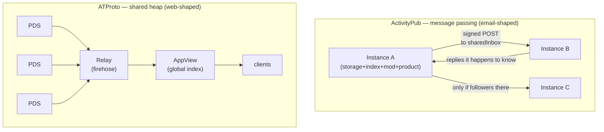

# Mastodon vs ATProto: Two Federation Models, Why You'd Pick Each, And How Mastodon Handles Scale

## Problem Statement

[0333](0333_%5B_%5D_HOW_ATPROTO_MANAGES_SCALE_RELAY_ECONOMICS_AND_LESSONS.md)
studied how ATProto manages scale. The natural follow-up: how does the
*other* major open social protocol — Mastodon on ActivityPub — compare?
Three questions, in the order asked:

1. How do Mastodon/ActivityPub and Bluesky/ATProto compare architecturally
   and philosophically?
2. Why would somebody — a user, an operator, an app developer — pick one
   over the other?
3. How does Mastodon handle scale, per-instance and network-wide?

And the standing xNet question underneath: xNet sits in the same design
space (self-sovereign identity, federated always-on servers, portable data)
— which of each protocol's structural bets does xNet share, and what should
it harvest from each side's scaling scars?

## Executive Summary

**One design choice explains nearly everything: ActivityPub decentralizes
communities; ATProto decentralizes individuals.** Mastodon's unit of
sovereignty is the *server* — a complete, self-governing community holding
its members' identity, data, index, and moderation. ATProto's unit is the
*account* — a signed, portable repository that survives any host. Migration,
moderation, search, cost curves, culture, and the entire 2024
decentralization debate all fall out of that one choice.

**Architecturally they are duals.** ActivityPub is **message passing**
(email-like: servers push activities to interested servers' inboxes; each
server holds only what it was sent). ATProto is a **shared heap** (web-like:
accounts publish signed repos; relays aggregate everything into one firehose;
AppViews index it). Message passing makes the *floor* cheap and the *global
view* impossible; the shared heap makes the global view native and pools its
cost in an expensive listening tier (0333's subject).

**Mastodon's scale story is the mirror image of ATProto's.** Its floor is
excellent — a $6/month instance is a complete network citizen, needing
nothing like a relay or AppView. Its ceiling is painful — the same Rails
monolith that runs on a VPS melts at flagship scale: fan-out-on-write home
feeds in Redis, one signed HTTP POST per remote server per post (a
20k-server celebrity account means ~20k POSTs *per post*), Sidekiq backlogs
of 200k–350k jobs during the 2022 migration waves, and media-cache bloat
taxing every small operator. mastodon.social's answers were operational, not
architectural: Fastly caching 60% of API reads, PgBouncer, read replicas,
per-queue Sidekiq fleets. Network-wide, the design *deliberately* has no
global index: search is per-instance and opt-in, reply threads render
inconsistently across servers, backfill is essentially impossible, and quote
posts took until late 2025.

**Why pick which (steelmanned):**

- **Mastodon** — to *own a community* (membership, norms, moderation with
  real teeth), for consent-forward culture, W3C-standard interop with a
  diverse ecosystem (PeerTube, Lemmy, Pixelfed, Threads), zero dependence on
  any company, and a genuinely cheap complete node.
- **ATProto** — to *own your identity and history* (credible exit: full-repo
  migration, posts included — Mastodon moves followers but **not posts**,
  an issue open since 2019), for global search/reach/algorithmic choice,
  one-click onboarding, and permissionless app-building on 40M+ shared
  identities.

**For xNet, the comparison is clarifying rather than redirecting.** xNet
already made both bets at once: sovereignty of the *individual* (per-DID
signed change log — the ATProto side) *and* small-world, membership-scoped
sync (Spaces and hubs — closer to Mastodon's community shape, minus the
identity capture). The harvest is Mastodon's operational scars: the
**ingress-deprioritization pattern** (protect local users when federation
traffic floods), the **remote-content cache tax** (0291's quota work,
extended to remote/share-room content), and the **Move-activity failure**
as the canonical cautionary tale that host-bound identity breaks exit —
xNet's `did:key` + multi-home replication (0258) is the right side of that
line. No new tier, no architecture change.

## Current State In The Repository

xNet has genes from both protocols; the mapping shows which side each organ
comes from:

| Design axis | Mastodon/AP | ATProto | xNet today |
| --- | --- | --- | --- |
| Unit of sovereignty | Server (community) | Account (signed repo) | **Both**: DID-signed per-author log ([`packages/core/src/lww.ts`](../../packages/core/src/lww.ts)) + Space as membership/replication unit (0258) |
| Identity | `@user@host` — host-bound | DID + domain handle | `did:key` — host-independent, key-bound ([0243](0243_%5Bx%5D_ACCOUNT_VALIDATION_AND_RECOVERY_BINDING_THE_PAYER_TO_THE_PASSKEY.md) recovery) |
| Server role | Authority (owns data + identity) | Commodity host (verifiable data) | Hub = replaceable mirror; zero-knowledge option ([`MultiHubSyncManager.ts`](../../packages/runtime/src/sync/MultiHubSyncManager.ts)) |
| Delivery | Push to interested inboxes | Firehose + index | Push to **rooms** (interest = membership): [`node-relay.ts`](../../packages/hub/src/services/node-relay.ts) share-room fan-out |
| Global view | None by design | Native (AppView) | None by design (scatter-gather search only: [`federation.ts`](../../packages/hub/src/services/federation.ts)) |
| Portability | Followers move, posts don't | Whole repo moves | Whole log replicates to N homes by policy (0258 manifest) |

Relevant prior work:

- **[0029](0029_%5B_%5D_MASTODON_SOCIAL_NETWORKING.md)** (early) designed
  Mastodon-*style* social features on xNet primitives and already chose the
  divergences this comparison validates: DID-native addressing over
  `@user@server`, hubs as non-authorities, optional AP bridging.
- **[0333](0333_%5B_%5D_HOW_ATPROTO_MANAGES_SCALE_RELAY_ECONOMICS_AND_LESSONS.md)**
  — the ATProto half of this comparison; its harvest list (bounded replay
  window + signed checkpoint, zstd dictionary frames, lossless-log/lossy-
  views, backfill consolidation) is complementary to, not superseded by,
  this doc's Mastodon-side harvest.
- **Queue shape**: the hub has no priority lanes — all node changes flow
  through one path in [`node-relay.ts`](../../packages/hub/src/services/node-relay.ts)
  with per-connection rate caps (100 msg/s) and quota shedding
  (`QUOTA_EXCEEDED`/`STORAGE_FULL`, post-0291). Mastodon's six-queue
  Sidekiq split (notably `ingress` deprioritized below `default`) is the
  pattern xNet lacks.
- **Remote-content caching**: hubs store share-room fan-out copies
  ([`fanOutToShareRoom`](../../packages/hub/src/services/node-relay.ts))
  and blob data; 0291's per-user quota covers owned data, but there is no
  separate accounting for *remote* content a hub merely relays — Mastodon's
  media-cache bloat (65 GB of cached remote attachments on a small
  instance) is the failure mode to pre-empt.
- **Compare page**: ActivityPub row at
  [`site/src/data/compare.ts:1088`](../../site/src/data/compare.ts)
  (`sync: 'Server-to-server federation'`, `identity: 'HTTPS actors'`),
  AT Protocol row at `:1048` — both cells this doc deepens.

## External Research

### The two topologies



Each server in the AP mesh holds only what it was sent — so no server can
answer a global question, by design. Every consumer of the AT firehose can
hold everything — so a global answer is native, and the cost pools in the
listening tier (0333).

### How Mastodon handles scale — per instance

Mastodon is a Ruby on Rails monolith with four runtime components:
Puma (web/API), **Sidekiq** (all async work, Redis-backed), a Node.js
streaming server (WebSocket timelines off Redis pub/sub, Postgres-free), and
PostgreSQL + Redis + S3-compatible media + optional Elasticsearch.

**The post-delivery path is fan-out on write:**

```mermaid
sequenceDiagram
    participant U as Author (local)
    participant P as Puma/Rails
    participant PG as Postgres
    participant RD as Redis
    participant SK as Sidekiq (push queue)
    participant RS as Remote server inboxes
    U->>P: POST /statuses
    P->>PG: insert status
    P->>RD: FanOutOnWrite — push id into EVERY local<br/>follower's home feed (sorted set)
    RD-->>U: streaming pub/sub (live timelines)
    P->>SK: enqueue delivery jobs
    SK->>RS: one signed POST per remote SERVER<br/>(sharedInbox; retries/backoff for dead hosts)
    Note over RD: feeds of >7-day-inactive users evicted,<br/>regenerated expensively from Postgres on return
```

So each post costs O(local followers) Redis writes plus O(distinct remote
servers) signed HTTP POSTs. Six Sidekiq queues order the pain, in priority:
`default` (anything affecting local users, including fan-out), `push`
(outbound federation), `ingress` (**inbound federation — deliberately
deprioritized since 4.0 so local users still see their own posts while the
server drowns in remote traffic**), `mailers`, `pull`, `scheduler`.
Postgres connections are the first wall (Puma threads + every Sidekiq pool +
streaming vs a default of 100) — official remedies are PgBouncer in
transaction mode and, since 4.2, built-in read replicas.

### How Mastodon handles scale — the war stories

The November 2022 Twitter-acquisition surge is the natural experiment; every
sizeable instance melted the same way:

| Instance | Surge | What broke | What fixed it |
| --- | --- | --- | --- |
| mastodon.social | ~5M wanted in vs 500k base; spam waves at ~900 registrations/min | origin overload "resembling DDoS" | Fastly CDN — 60% of API calls served from cache, origin egress −75%; PgBouncer; replicas; per-queue Sidekiq fleets |
| hachyderm.io | 720 → 30,000 users in ~30 days | two consumer SSDs holding **both** ZFS media pool and Postgres pinned at 100% IOPS; NFS coupling web workers to the DB box | emergency cutover of new media to object storage; livestreamed migration to Hetzner dedicated; "Don't use NFS for anything" |
| mastodon.world | 140 → 100k users in ~3 weeks (30k→62k in 12 h) | Sidekiq 5 → ~800 threads instantly hit Postgres connection limits; self-hosted mail died at 75k emails/day; media 200 GB → 2.2 TB in one month | PgBouncer; Mailgun; Wasabi |
| weirder.earth (small) | modest | 200k+ job backlog, multi-hour federation lag on 4-core/8 GB | pgTune, per-queue Sidekiq splits, right-sized DB pools |

Recurring numbers worth keeping: one PgBouncer ≈ 10k client connections
(~1k active); Postgres `max_connections` >1024 measured a ~46% QPS drop;
Sidekiq RSS fragments 256 MB → 1 GB in under 24 h; a 50k-account instance
sees ~800–1,200 concurrent streaming connections; media caches of *remote*
content routinely dominate small-instance disk (one single-user instance:
65 GB of cached remote attachments out of 92 GB total), mitigated only by
cron'd `tootctl media remove`.

**The structural read: Mastodon's floor is excellent and its ceiling is
operational.** A $6/month managed instance is a *complete* node — full
posting, federation, moderation, nothing like a relay/AppView tier required.
But scale-up is vertical and toil-heavy, and surges concentrate on big
instances because newcomers pick the biggest name — reproducing the
"flagship melts" pattern every wave. A celebrity with followers on ~20k
servers costs ~20k signed POSTs per post, forever; there is no Jetstream
equivalent, no lossy tier, no stateless-verification trick to commoditize
listening, because *nobody is listening to everything* — that's the design.

### Network-wide properties (the price of no heap)

- **No global index, by design and by values.** Full-text search covers
  only accounts that opt in (since 4.2, Sept 2023); discovery leans on
  hashtags and local/federated timelines.
- **Threads render inconsistently** — each server shows only replies it was
  sent; Mastodon "does not ensure it gets all replies to remote posts."
  Auto-fetching full threads-on-view only landed in 4.5 (Nov 2025).
- **Backfill is essentially impossible in-protocol** — a newly-followed
  account shows an empty profile until new activity arrives; community
  tools (FediFetcher) force-fetch via the search endpoint.
- **Quote posts arrived in 4.5 (Nov 2025)**, consent-based (author chooses
  nobody/followers/everyone, gets notified, can withdraw) — a case study in
  the two cultures converging on a feature with opposite defaults (Bluesky
  had quotes from the start, added detach controls later).
- **Scale**: FediDB counted ~26k servers and ~1.25M MAU (of ~11M registered)
  in Jan 2024; steady state through 2024–26 is ~750k–1M MAU. Bluesky:
  ~40M+ registered by 2026, MAU estimates diverging (low-to-mid tens of
  millions). Treat all such counts as ±20% — crawler methodologies differ.

### The 2024 decentralization debate, compressed

- **Lemmer-Webber** ("How decentralized is Bluesky really?"): message
  passing scales network traffic O(n); shared-heap *full participation*
  tends O(n²) — meaningful self-hosting "must operate at the level of gods
  rather than mortals." did:plc is a centralized ledger; Bluesky holds most
  users' rotation keys. The honest claim isn't decentralization but an open
  architecture with **credible exit**.
- **Newbold** (reply): concedes DM centralization, immature key management,
  the then-16 TB archival relay. Counters: decentralization ≠ every
  component individually self-hostable (RFC 9518); every component is
  substitutable; the design stake is "**the company is a future
  adversary**." (0333 postscript: the relay half of the cost objection
  collapsed to $34/month with Sync v1.1; the AppView half stands.)
- **Doctorow**: refused Bluesky for lack of a *load-bearing* fire exit;
  updated 2025–26 when Blacksky shipped independent PDS/relay/AppView —
  the existence proof matters more than the operator census.
- **The reverse critique** (AT side on Mastodon): instance-choice paralysis,
  broken threads, search hostility, no quotes for years, admins with
  god-power over your identity and DMs, defederation decisions severing
  relationships you never voted on — and exit that abandons your history.

Both critiques are correct about the other side. It's definitional: power
diffused *today* (Mastodon: thousands of servers, many implementations,
W3C standard, non-profit) versus capture-resistance *by construction*
(ATProto: signed portable repos, host-independent identity, substitutable
infrastructure — mostly still Bluesky-operated).

### Who picks which

| Chooser | Pick Mastodon/AP when… | Pick Bluesky/ATProto when… |
| --- | --- | --- |
| **User** | you want a community-scale space, consent-forward norms, no company roadmap over you, indifference to virality | you want reach, global search, one-click onboarding, algorithmic choice (custom feeds), and your whole history portable |
| **Operator** | you want to *own a community* — membership, norms, moderation with teeth — and accept sysadmin+moderator labor | you want data/identity sovereignty at $5–10/mo (PDS) without running the social experience; relay is $34/mo; a full AppView is the expensive frontier (Blacksky is the proof it's possible) |
| **Developer** | you want interop with a diverse existing ecosystem (Mastodon, Lemmy, PeerTube, Pixelfed, Threads) under a W3C spec nobody owns — accepting "Mastodon-flavored AP" archaeology (HTTP Signatures aren't even in the spec) | you want to build a *new app* permissionlessly on 40M+ shared identities with typed lexicons and a cheap firehose (Jetstream) — accepting a company-driven spec |

**Bridgy Fed** connects the two — and its 2024 opt-out-vs-opt-in firestorm
(resolved as "discoverable opt-in," with correspondingly modest adoption) is
the cleanest empirical demo that the protocols' *cultures* differ as much as
their architectures: public-means-public vs consent-is-the-core-value.

## Key Findings

1. **The unit of sovereignty is the whole comparison.** Server-as-sovereign
   (AP) yields real communities, cheap complete nodes, and host-captured
   identity; account-as-sovereign (AT) yields credible exit, global views,
   and an expensive pooled listening tier. Every other difference is
   downstream.
2. **Mastodon's scale profile is floor-optimized; ATProto's is
   ceiling-optimized.** Mastodon: complete node at $6/month, flagship melts
   operationally. ATProto: $5 PDS *plus* mandatory shared tiers, but the
   global tier got protocol-level cost engineering (0333). Neither got both.
3. **Fan-out on write is Mastodon's hot-key cliff** — O(local followers)
   Redis writes + O(remote servers) signed POSTs per post, with no lossy
   tier or shared-dictionary trick available because delivery is
   point-to-point and per-server. Bluesky hit the same cliff in its AppView
   and answered with lossy timelines; Mastodon's only answer is more
   Sidekiq.
4. **The `ingress` queue is Mastodon's best transferable idea**: when
   federation traffic floods, inbound remote work is explicitly
   deprioritized below anything affecting local users. That's a
   *priority-inversion-by-design* pattern any federated relay should have.
5. **Remote-content caching is the silent small-operator tax** — media
   caches of content the instance merely *saw* dominate disk on small
   instances. The lesson generalizes: accounting must distinguish owned
   data from relayed data, and relayed data needs its own TTL/quota.
6. **Migration is the starkest asymmetry**: Mastodon's `Move` transfers
   followers (only with the old server's cooperation and only on servers
   implementing Move) and **abandons all posts** — open issue since 2019.
   ATProto moves the entire signed repo, identity intact, followers
   unaware. xNet's `did:key` + multi-home replication (0258) is
   structurally on the ATProto side of this line, and 0243's recovery work
   covers the key-loss risk that host-bound identity never has.
7. **Standards maturity cuts the other way**: ActivityPub is a 2018 W3C
   Recommendation with unspecified auth (HTTP Signatures by convention),
   JSON-LD variance, and per-implementation quirks — "the spec" is really
   Mastodon's behavior. ATProto is tightly specified but company-driven,
   with an independent standards process still aspirational. Neither is a
   clean win for "just implement the standard."
8. **Both networks converged on consent-shaped features from opposite
   defaults** (quotes, search opt-in, bridging) — protocol architecture
   didn't determine these; community values did. Culture is a real,
   durable differentiator, not a soft one.

## Options And Tradeoffs

This is a comparative study; the "options" are what xNet should *do* with it.

### Option A — Pick a side (align xNet's federation story with one protocol)

Formally adopt one model — e.g. AP-style pure message passing (drop any
global ambitions) or AT-style global heap (add an index tier).

- **Pros:** a crisp story; potential interop investment focus.
- **Cons:** false choice. xNet's architecture already deliberately combines
  account-sovereignty (signed per-DID log) with community-scoped delivery
  (Spaces/rooms — "interest = membership," which is message passing with a
  cleaner interest signal than follows). 0324/0326/0333 each reaffirmed the
  small-world E2EE bet; 0301 already scoped ATProto interop to
  identity-at-the-edges; 0029 already scoped AP to an optional bridge.
- **Verdict: no.**

### Option B — Harvest the operational patterns; sharpen positioning (recommended)

Keep the hybrid; take Mastodon's scars as pre-emptive fixes and use the
"unit of sovereignty" frame in positioning material.

- **Pros:** the two concrete Mastodon lessons (ingress deprioritization,
  relayed-content accounting) map onto known xNet seams
  ([`node-relay.ts`](../../packages/hub/src/services/node-relay.ts) has no
  priority lanes; 0291 quotas don't cover relayed content). The framing
  ("AP decentralizes communities, AT decentralizes individuals, xNet
  decentralizes *data* — the Space travels, the individual signs") is
  compare-page-grade copy grounded in real architecture.
- **Cons:** queue prioritization adds complexity to a hub that hasn't yet
  *needed* it (no xNet hub has melted); do it as design-when-touched, not a
  campaign.
- **Verdict: yes.**

### Option C — Build an ActivityPub bridge now

0029 sketched an AP bridge service on the hub; this study fills in what
that costs (WebFinger, HTTP Signatures archaeology, per-implementation
quirks, the media-cache tax arrives with federation).

- **Pros:** reach into a real 1M-MAU network of exactly the
  community-sovereignty temperament xNet courts.
- **Cons:** heavy, ongoing-maintenance interop for a network an order of
  magnitude smaller than ATProto's; Bridgy Fed's consent firestorm shows
  the cultural risk of getting defaults wrong; xNet has no social surface
  shipped that would consume it. Same verdict shape as 0301's sync
  question: not until there's a product pull.
- **Verdict: defer** (keep 0029's bridge as the design if pull emerges).

## Recommendation

**Option B.** Three concrete moves, smallest first:

1. **Adopt the framing.** "ActivityPub decentralizes communities; ATProto
   decentralizes individuals; xNet decentralizes the data itself — every
   change is signed by a person (`did:key`), every Space chooses its homes
   (0258), and no host owns either." Use it when the compare page's
   protocol rows next get touched and in any protocol-positioning writing;
   it is accurate, discriminating, and grounded in this doc + 0333.
2. **Priority lanes on the hub relay (design-on-touch).** When
   [`node-relay.ts`](../../packages/hub/src/services/node-relay.ts) next
   grows scheduling behavior, adopt Mastodon's queue lesson: work serving
   *connected local members* (their own rooms' live tail) outranks inbound
   federation/share-room fan-out from elsewhere, so a federation flood
   degrades remote freshness, never local usability. This composes with —
   and is distinct from — 0333's lossless-log/lossy-views rule (that one
   rations derived views; this one orders who waits).
3. **Account for relayed content separately.** Extend 0291's quota model so
   hub storage distinguishes member-owned data from relayed/share-room/blob
   copies of remote content, and give the relayed class its own TTL +
   cap (the Mastodon media-cache lesson). This slots naturally into 0333's
   bounded-replay-window design — checkpoint/window for the log, TTL for
   relayed blobs — one retention story, two data classes.

Explicitly not recommended now: an AP bridge (Option C, defer), any global
index tier (re-affirmed dead by both 0333 and this study), and chasing
either network's user-facing feature set (quotes/labelers/custom feeds) —
xNet is not shipping a microblogging product; it's shipping the substrate.

## Risks And Open Questions

- **Is the hub's melt-point actually Mastodon-shaped?** Mastodon melts on
  fan-out and inbound federation floods; xNet's rooms bound fan-out by
  membership, so the first cliff may instead be the unbounded log (0249,
  0333's window fixes it) or blob storage. Don't build priority lanes until
  a load test shows which cliff is first — 0272's reliability-testing
  harness is the right vehicle.
- **The framing claims a third pole; does the architecture fully deliver
  it yet?** "Every Space chooses its homes" is the 0258 manifest — still
  partially wired (planner exists, anti-entropy missing). Positioning copy
  should stay a half-step behind shipped reality (0316's lesson: proof
  before claims).
- **Culture is load-bearing and xNet hasn't chosen one.** This study shows
  values (consent vs reach) shape protocol evolution as much as
  architecture. xNet's humane-charter work (0234) leans consent-forward;
  if xNet ever hosts public social surfaces, the Bridgy Fed episode is the
  case study to re-read *before* choosing defaults.
- **Numbers rot.** MAU figures (~1M fediverse, ~40M Bluesky registered),
  version-specific behavior (4.2 search, 4.5 quotes/thread-fetching), and
  cost points are 2024–2026 snapshots; re-verify before quoting outward.

## Implementation Checklist

- [ ] Add the "unit of sovereignty" framing to the compare page the next
      time [`site/src/data/compare.ts`](../../site/src/data/compare.ts)
      protocol rows are edited (ActivityPub `:1088`, AT Protocol `:1048` —
      sharpen `bestFor`/`sync` cells; no standalone PR needed).
- [ ] Cross-link this doc from
      [0333](0333_%5B_%5D_HOW_ATPROTO_MANAGES_SCALE_RELAY_ECONOMICS_AND_LESSONS.md)
      (sibling study) and
      [0029](0029_%5B_%5D_MASTODON_SOCIAL_NETWORKING.md) (bridge design
      deferred here).
- [ ] File the **priority-lanes** design note in
      [`node-relay.ts`](../../packages/hub/src/services/node-relay.ts)'s
      next scheduling change: local-member liveness outranks inbound
      fan-out (Mastodon `ingress` pattern), with a load test defining the
      actual melt-point first (0272 harness).
- [ ] Extend the 0291 quota model with an **owned vs relayed** data-class
      split and a TTL for relayed content, folded into 0333's retention
      design (one `RetentionPolicy`, two classes).
- [ ] Note in 0258's open items that Mastodon `Move`'s partial-failure modes
      (followers stranded on non-implementing servers; posts abandoned) are
      the anti-pattern xNet's anti-entropy + manifest must make impossible:
      a replica is either complete for its scopes or loudly incomplete.

## Validation Checklist

- [ ] Compare page cells updated and accurate against this doc's tables
      (spot-check claims against the References before publishing).
- [ ] A hub load test exists that identifies the first cliff under
      federation-flood conditions (many remote share-room writes vs local
      member reads) and its report states whether priority lanes are needed.
- [ ] Hub storage metrics ([`data-usage.ts`](../../packages/hub/src/data-usage.ts))
      report owned vs relayed bytes as separate series; the relayed class
      demonstrably respects its TTL in the 0291 re-run scenario.
- [ ] 0333's checkpoint design doc references the two-class retention
      requirement (log window + relayed TTL) so the primitives land
      together.
- [ ] Any outward-facing use of this doc's numbers (blog, compare page)
      carries a date and survives a re-verification pass.

## References

**Mastodon architecture & scaling (primary/operator):**

- Scaling up your server (official; queues, PgBouncer, replicas, streaming sizing) — https://docs.joinmastodon.org/admin/scaling/
- Mastodon ActivityPub notes (sharedInbox) — https://docs.joinmastodon.org/spec/activitypub/
- Hazel Weakly — "Scaling Mastodon: The Compendium" — https://hazelweakly.me/blog/scaling-mastodon/
- Hachyderm — "Leaving the Basement" — https://community.hachyderm.io/blog/2022/12/03/leaving-the-basement/
- Nora Codes — "Scaling Mastodon in the Face of an Exodus" — https://nora.codes/post/scaling-mastodon-in-the-face-of-an-exodus/
- mastodon.world — "..And then, November happened.." — https://blog.mastodon.world/and-then-november-happened
- Fastly × Mastodon case study (cache/egress numbers, Chaput) — https://www.fastly.com/customers/mastodon
- SoftwareMill — "The architecture of Mastodon" (FeedManager/fan-out) — https://softwaremill.com/the-architecture-of-mastodon/
- Media-cache bloat — https://github.com/mastodon/mastodon/discussions/22816, https://blog.mei-home.net/posts/mastodon-media-cache-cleanup-issue/
- Moving accounts (followers move, posts don't) — https://docs.joinmastodon.org/user/moving/ ; post migration open issue — https://github.com/mastodon/mastodon/issues/12423
- Quote posts (4.4/4.5) — https://blog.joinmastodon.org/2025/09/introducing-quote-posts/ ; 4.5 — https://blog.joinmastodon.org/2025/11/mastodon-4.5/
- Network counts — https://fedidb.org/, https://fediverse.observer/stats

**The comparison & debate:**

- Lemmer-Webber — "How decentralized is Bluesky really?" — https://dustycloud.org/blog/how-decentralized-is-bluesky/ ; follow-up — https://dustycloud.org/blog/re-re-bluesky-decentralization/
- bnewbold — "Reply on Bluesky and Decentralization" — https://whtwnd.com/bnewbold.net/3lbvbtqrg5t2t
- Doctorow — "Bluesky and enshittification" — https://pluralistic.net/2024/11/02/ulysses-pact/
- Fediverse Report — "A conceptual model of ATProto and ActivityPub" — https://fediversereport.com/a-conceptual-model-of-atproto-and-activitypub/
- Robin Berjon — "ActivityPub Over ATProto" — https://berjon.com/ap-at/
- EFF — "What's the Difference Between Mastodon, Bluesky, and Threads?" — https://www.eff.org/deeplinks/2024/06/whats-difference-between-mastodon-bluesky-and-threads
- Kleppmann et al. — "Bluesky and the AT Protocol" (CoNEXT '24) — https://arxiv.org/abs/2402.03239
- ATProto account migration — https://atproto.com/guides/account-migration ; adversarial migration — https://www.da.vidbuchanan.co.uk/blog/adversarial-pds-migration.html
- Stackable moderation / Ozone — https://bsky.social/about/blog/03-12-2024-stackable-moderation
- Fedify — "Why implementing ActivityPub is hard" — https://hackers.pub/@fedify/2026/why-activitypub-is-hard ; SWICG HTTP Signatures report — https://swicg.github.io/activitypub-http-signature/
- Bridgy Fed opt-out controversy — https://github.com/snarfed/bridgy-fed/issues/835 ; TechCrunch (Feb 2024) — https://techcrunch.com/2024/02/14/bluesky-and-mastodon-users-are-having-a-fight-that-could-shape-the-next-generation-of-social-media/
- Governance: Mastodon non-profit transition — https://blog.joinmastodon.org/2025/01/the-people-should-own-the-town-square/ ; Bluesky Series A — https://bsky.social/about/blog/10-24-2024-series-a

**Repo cross-references:** 0029 (Mastodon-style social on xNet), 0234
(humane charter), 0243 (key recovery), 0249 (cold-open cliff), 0258
(multi-home replication), 0272 (reliability testing), 0291 (hub quota
economics), 0301/0322/0324/0326 (ATProto series), 0316 (proof before
claims), 0333 (ATProto scale — sibling doc).
