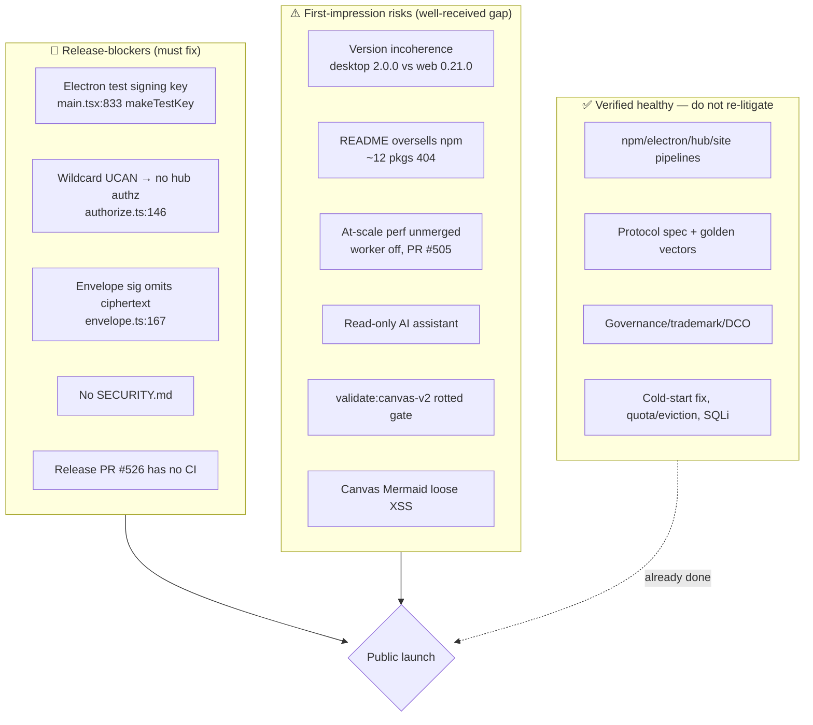

# Release Readiness Audit — What Stands Between xNet And A Well-Received Launch

> Status: `[_]` — exploration / audit. Date: 2026-07-17.
> Scope: a full-repo audit across six dimensions (release/packaging
> infrastructure, security & authz, CI & test health, docs/DX/legal,
> product completeness, and the external launch bar). Every finding below is
> grounded in a real file path; the four release-blockers were re-verified
> against live code before this document was written.

## Problem Statement

xNet is a local-first data-workspace platform — signed, hash-chained,
LWW change logs; self-hostable hubs as sync relays; a React SDK on npm
(`@xnetjs/*`); web + Electron apps; a plugin marketplace; and a published
protocol spec with golden vectors. The machinery of *shipping* (npm publish,
desktop builds, docker images, docs site) is already running. Real tagged
releases exist.

Two questions remain, and they are different questions:

1. **What is actually in the way of releasing?** — the hard blockers that would
   make a public launch unsafe, broken, or embarrassing on day one.
2. **What would ideally be in place for a _well-received_ release?** — the bar
   that comparable local-first / dev-tool launches (Zero, Automerge, Instant,
   Electric, Jazz, ATProto) have set, and where xNet sits against it.

This audit answers both. The headline: **xNet is far closer to release-ready
than a first glance suggests — the pipelines work and the docs are unusually
strong — but there are four true release-blockers, all fixable in days, plus a
cluster of first-impression risks that separate "shipped" from "well received."**

## Executive Summary

**The four release-blockers** (each verified against current code):

1. **Electron desktop boots on a deterministic, source-derivable signing key.**
   `apps/electron/src/renderer/main.tsx:833` calls `makeTestKey(profile)`
   unconditionally in `init()` — a fixed 32-byte seed `[1..32]` XOR the profile
   name, with the in-code comment *"DO NOT use in production!"* (line 166). Any
   desktop user's private key is reconstructable from public source; two users
   on the default profile name collide onto the same DID. The secure path
   already exists (`apps/electron/src/main/secure-seed.ts` via Electron
   `safeStorage`) but the renderer never calls it.
2. **Wildcard UCAN neutralizes all hub-side authorization.** The client mints
   `{ with: '*', can: 'hub/*' }` (`packages/react/src/provider/use-hub-auth-token.ts:10`);
   the hub treats `'*'` as universal (`packages/hub/src/auth/capabilities.ts`)
   and short-circuits `allowed: true` before the grant-index / Space-cascade /
   deny checks ever run (`packages/hub/src/ws/authorize.ts:146`). Any
   authenticated peer can subscribe/relay into any room it can name.
   Cross-user confidentiality currently rests entirely on E2E encryption, not
   access control. (This is exploration 0307's unfixed "Option B.")
3. **Envelope signature does not cover the ciphertext.**
   `packages/crypto/src/envelope.ts:167` signs metadata + the *set of recipient
   DIDs* but not `ciphertext`, `nonce`, or wrapped-key values. Any content-key
   holder (any recipient — or anyone, for a PUBLIC node) can substitute the
   encrypted body and the author's signature still verifies. (0307 "Option A,"
   unfixed.)
4. **No `SECURITY.md` / disclosure policy.** A public repo full of
   crypto/identity/P2P code with no private vulnerability-reporting path is the
   worst-look gap for this project category, and the cheapest to close.

**The live operational blocker:** the standing `chore(release): version
packages` PR (#526) has **zero CI checks** — the `changesets/action` release
branch is pushed with the fallback `GITHUB_TOKEN`, and GitHub does not trigger
workflows on `GITHUB_TOKEN` pushes, so required checks never run and the PR
can't self-merge. The pending `@xnetjs/plugins` release (0331) is parked.

**What is genuinely healthy** (and should not be re-litigated): every publish
pipeline works and real artifacts are live (npm at 2.0.0, desktop DMG/EXE/deb
for v1.0.0 and v2.0.0, multi-arch hub image on ghcr, site on Pages); the
Electron `audiotee` break from 0283 is fixed; demo-hub quota/eviction is now
enforced (0291 closed); the SQLi from 0307 is both hardened and unwired; the
docs site, protocol spec + golden vectors, governance, trademark, and DCO are
all in place and above the norm for a launch.

**The gap between "shippable" and "well received"** is a short list of
first-impression items: version incoherence (desktop "2.0.0" vs web 0.21.0 vs
hub 0.0.1, with no single "xNet version"), the README advertising ~12 packages
that 404 on `npm install`, the at-scale query cliffs (0318) sitting on an
unmerged branch with the worker runtime off by default, a read-only AI
assistant, and a rotted `validate:canvas-v2` "release gate" that points at a
deleted spec.

### Readiness scorecard

| Dimension | Grade | One-line |
|---|---|---|
| Publish/packaging infra | **A−** | All pipelines work; blocked only by the stuck release PR #526 + version incoherence. |
| Docs / DX / onboarding | **A−** | Strongest area; gaps are narrow (SECURITY.md, README npm overselling, no typedoc). |
| Governance / legal | **A** | LICENSE, FSL split, GOVERNANCE, TRADEMARK, CODE_OF_CONDUCT, DCO-in-CI all present. |
| Protocol credibility | **A** | Published spec + golden vectors + Python/Swift reference kernels — a real differentiator. |
| CI / test health | **B** | Good structure; but key checks are advisory-in-effect, one gate is rotted, no full-journey smoke. |
| Security / authz | **C** | Authenticity strong; authorization + content-binding have two blockers; hardening backlog. |
| Product completeness | **B−** | Web app polished; desktop identity blocker; at-scale perf unmerged; some read-only headline features. |

## Current State In The Repository

### 1. Publish & packaging — working, one stuck PR

The publish machinery is real and exercising all artifact types:

- **npm** (`.github/workflows/npm-release.yml`): changesets + OIDC trusted
  publishing + provenance, npm pinned `@11` deliberately. A **fixed group of 12
  packages** (`.changeset/config.json:5-20`: react, history, plugins,
  data-bridge, data, storage, sqlite, sync, abuse, identity, crypto, core)
  versions in lockstep at **2.0.0**; ~17 packages publish, ~30 are `private:true`
  and deliberately withheld. Live on npm today: `@xnetjs/core@2.0.0`,
  `@xnetjs/cli@0.1.7`, `@xnetjs/runtime@0.5.0`, `@xnetjs/devkit@1.0.0`.
- **Electron** (`.github/workflows/electron-release.yml`): full mac x64+arm64
  (signing/notarization), win x64 (pinned `windows-2022`), linux x64+arm64,
  gated on a per-platform packaged-smoke Playwright test. `v2.0.0` carries a
  complete asset set (DMG/AppImage/deb/EXE + `latest*.yml`). The 0283 `audiotee`
  break is fixed (`electron-release.yml:108-112` guards the copy step).
- **Web / demos / site** (`.github/workflows/deploy-site.yml` → GitHub Pages):
  one workflow ships the Astro marketing site (root), `xnet-web` 0.21.0
  (`/app`), and `xnet-demos` 0.1.2 (`/play`), on custom domain `xnet.fyi`.
- **Hub docker**: Railway builds `packages/hub/Dockerfile` for `hub.xnet.fyi`;
  `hub-image.yml` smoke-boots the same image on PRs; `hub-release.yml` publishes
  multi-arch `ghcr.io/crs48/xnet-hub` with SBOM (anchore) + Trivy scan. Self-host
  is real: `packages/hub/docker-compose.hub.yml` + `Caddyfile.example` + guide.
- **Cloud** (`apps/cloud`, `deploy-cloud.yml` → Cloud Run): wired but **inert**,
  gated on `vars.CLOUD_DEPLOY_ENABLED == 'true'` — scaffolding, not deployed.

**The stuck release PR (#526):** open + mergeable since 2026-07-15 but
`gh pr checks 526` → "no checks reported." Root cause: `changesets/action` is
configured `github-token: ${{ secrets.RELEASE_GITHUB_TOKEN || secrets.GITHUB_TOKEN }}`
(`npm-release.yml:46-47`); the fallback `GITHUB_TOKEN` is in use, and branches
pushed by `GITHUB_TOKEN` do not trigger workflow runs (GitHub loop-prevention),
so the required contexts never run and the PR can't satisfy branch protection.

**Version incoherence:** desktop **2.0.0**, web **0.21.0**, cli **0.1.7**,
runtime **0.5.0**, devkit **1.0.0**, hub image **0.0.1**, cloud **0.0.18**, root
`0.0.0`. Desktop jumped **0.12.0 → 1.0.0 → 2.0.0 in ~2 days** purely because the
core fixed group took two major bumps — the desktop "2.0.0" is not a product
milestone, yet `site/src/pages/download.astro:77` renders "Version 2.0.0,"
overstating maturity. **286 git tags** exist across two families (`v*` desktop,
`@xnetjs/<pkg>@x.y.z` per-package).

**Stale artifact:** `pnpm-publish-summary.json` at repo root lists 0.0.1
versions and includes now-private packages (canvas, hub, editor, devtools) as
"published" — it misrepresents the publish state and should not ship publicly.

### 2. Security & authz — authenticity strong, authorization weak

Exploration `docs/explorations/0307_[_]_SECURITY_OF_NODE_AND_CHANGE_FLOW.md`
diagnosed this precisely. Its **"Option A hygiene"** items largely shipped; its
**"Option B" (the authz fix)** did not.

**Landed since 0307:** SQLi allowlist (`packages/hub/src/storage/sqlite.ts:56-65`
`assertSafeColumnId`, commit `6bea3071f`); real Ed25519 in `verifyIntegrity`
(`packages/sync/src/integrity.ts:207-225`, `3bc1b5f12`); gated hash-recompute
repair; hub config footgun warnings (`packages/hub/src/config.ts:149-158`);
audience binding when configured; revocation checked even under wildcard.

**Still open** (the two security release-blockers above), plus a should-fix
backlog: canvas Mermaid renders user-authored diagram source with
`securityLevel: 'loose'` + `dangerouslySetInnerHTML`
(`packages/canvas/src/nodes/mermaid-node.tsx:73-75`) while the *editor* Mermaid
correctly uses `'strict'` — an XSS vector for shared canvases under the app's
`unsafe-inline`+`unsafe-eval` CSP (`apps/web/index.html:9`); key-registry HTTP
fetch is unverified for non-Ed25519 DIDs (`packages/crypto/src/key-resolution.ts:211`);
HTTP rate-limit keys on spoofable `x-forwarded-for`
(`packages/hub/src/middleware/http-rate-limit.ts:46`); `/metrics` and verbose
`/health` are unauthenticated (`packages/hub/src/server.ts:482,417`); dev-only
insecure key storage (`BrowserPasskeyStorage`, plaintext `serializeKeyBundle`)
is exported from the identity package where an integrator can import it.

**Genuinely resolved:** demo quota/eviction is now enforced
(`packages/hub/src/services/node-relay.ts:244-251` returns `QUOTA_EXCEEDED`;
daily `resetAllUserData`; `DiskWatchdog` sheds writes) — 0291 is closed, and the
old `EvictionService` is now dead code.

### 3. CI & test health — good structure, soft gates

26 workflows. Required merge gates: `lint`, `typecheck`, `test (1..3/3)`,
`editor-ux`, `changelog-section`. But several important checks are
**advisory-in-effect** — they run on PRs yet cannot be required, because the
docs-only no-op twin (`ci-docs-noop.yml`) does not reproduce their contexts, and
a required context with no docs-PR producer would permanently block docs PRs.
The advisory-in-effect set includes **`electron-e2e` (cross-client sync-matrix
parity, 0238), `conformance-rust` (Rust↔TS protocol parity), and `schema-check`
(wire-contract breaks)** — regressions in any of these can merge green.

**Rotted gate:** `scripts/validate-canvas-v2-release-gate.sh:56` runs
`playwright test src/electron-canvas.spec.ts`, but that spec **does not exist**
(the directory has 13 specs; this is not one), and the script is wired into no
workflow — a "release gate" that is both unrunnable and unreferenced. This
matters because CLAUDE.md cites `validate:canvas-v2` as *the* sanctioned
"documented gate script" that legitimizes an e2e spec's existence.

**Orphaned lane:** `tests/integration/` (incl. the flake-reservoir
`webrtc-signaling.test.ts`) is in neither `vitest.config.ts` projects nor any
workflow — it runs nowhere in CI. The seven-file on-touch flake-rewrite list
from CLAUDE.md is still fully present (chunked-storage, presence, sync-manager,
relay, crawl, webrtc-signaling, sqlite adapter — all real timers/servers/disk).

**Confidence gaps:** no single end-to-end smoke chains
**create → edit → sync → share** (fragments exist in `electron-smoke`,
`doc-sync`, `sync-matrix`, `authz-core`); desktop (`apps/electron`) still has
**no `typecheck` script** (0277 still true; also `apps/mobile`,
`packages/native-bridge-extension`). The devkit worktree-HEAD hazard is now
**closed** (sandboxed tmpdirs, PR #445). `pnpm test` compiles three native
modules first (`better-sqlite3`, `usearch`, `sharp`) — a toolchain gap blocks
the whole suite for a contributor.

### 4. Docs / DX / legal — the strongest dimension

First-contact files nearly all present and strong: `README.md` (18.8KB, clear
"what is xNet," badges, hosted-demo CTA, quickstart, mermaid architecture),
`CONTRIBUTING.md`, `CODE_OF_CONDUCT.md` (Covenant 2.1, `conduct@xnet.fyi`),
`GOVERNANCE.md`, `TRADEMARK.md`, `MAINTAINERS.md`, `LICENSE` (MIT) +
`packages/cloud/LICENSE` (FSL-1.1-Apache-2.0). **Missing: `SECURITY.md`**
(blocker) and `.github/ISSUE_TEMPLATE/`.

Docs site (Astro + Starlight, `site: 'https://xnet.fyi'`): ~66 `.mdx` covering
Start Here, React Hooks, SDKs (swift/rust), Schemas, **The Protocol**, The App,
14 Guides. The protocol spec (`docs/specs/protocol/00-overview.md` …
`90-conformance.md` + RFC template) with golden vectors in `conformance/vectors/**`
and **Python + Swift reference kernels** in `conformance/reference/` is
launch-ready and a genuine credibility asset. **Gap: no generated API reference**
(no typedoc/api-extractor anywhere) — hand-written tables will drift.

**The biggest DX risk is the npm expectation mismatch:** `README.md:85` claims
"21 core SDK packages" and links all of them, but ~12 (`@xnetjs/sdk`, `ui`,
`editor`, `views`, `canvas`, `query`, `network`, `devtools`, `telemetry`,
`vectors`, `hub`, `formula`) are `private:true` and in the changeset `ignore`
list — `npm install @xnetjs/sdk` returns **E404**. The canonical quickstart
itself imports an unpublished `@xnetjs/devtools`
(`site/src/content/docs/docs/quickstart.mdx`) without adding it to the install
line, and `packages/react/README.md:403` imports `@xnetjs/editor/react` — the
first tutorial breaks on copy-paste. Legal is clean: **DCO-only, no CLA**, wired
into CI (`.github/workflows/dco.yml`); every publishable package is `MIT`,
`@xnetjs/cloud` is FSL. (Note: the audit brief's "0243 Harmony CLA" does not
match the repo — 0243 is account recovery; the project deliberately chose DCO.)

### 5. Product completeness — polished web, blocked desktop

The web app is in good shape for a first impression: cold-start is durably
protected (`apps/web/src/lib/change-log-compaction.ts` + warm-start snapshots +
boot watchdog — the 318k-row `changes`-log stall of 0249 has a real fix); error
and empty states are thorough (`ErrorBoundary`, `OfflineIndicator`,
boot-timeout/storage-corrupt recovery in `apps/web/src/App.tsx`); data export /
"leave with everything" (Charter exit) and account recovery (0243) are real;
labs flags are honest and minimal (two flags). TODO/FIXME density is low (~22
meaningful markers).

The problems are concentrated:

- **Desktop identity blocker** (§Security #1).
- **At-scale query perf is unmitigated on `main`.** The worker data runtime is
  **off by default** (`apps/web/src/lib/data-runtime.ts:25`
  `DEFAULT_DATA_RUNTIME = 'main'`); `PredicateIndex` (0317 P1) is **not merged**
  (no such symbol in `packages/data`/`query`/web); the 0318 O(N) cliffs (in-memory
  sort+slice in `packages/query/src/local/engine.ts:32-56`, full-scan `count()`,
  deep OFFSET, MV-build OOM) live on **unmerged PR #505**. Acceptable at demo
  scale, embarrassing at real scale, and nothing currently caps it.
- **Read-only headline features:** the AI assistant can read but not act
  ("Making changes is coming soon," `apps/web/src/workbench/views/AiChatPanel.tsx:846`);
  Electron inline-comment *creation* is stubbed (0312 Phase 4); the onboarding
  `qr-scan` state is a literal "Coming soon" placeholder
  (`packages/react/src/onboarding/OnboardingFlow.tsx:50-57`).
- **Silent navigation dead-ends:** `apps/web/src/workbench/navigation.ts`
  `navigateToNode` has no cases for `crm`, `finance`, or `experiments` and **no
  `default`** — an unmatched node click is a silent no-op (0288, broader than
  first reported).
- **Mobile is a webview**, not native (`apps/mobile/` is config-only;
  `apps/expo/src/` is a minimal `WebViewEditor` shell) — fine if positioned that
  way, misleading if marketed as native.
- **Repo hygiene:** a 1.5 MB `changelog-full.jpeg` is committed at repo root.

## External Research — the launch bar comparable projects set

Distilled from the reception of Zero, Automerge 2, Instant, Electric, PowerSync,
Jazz, Evolu, Loro, and the ATProto SDKs (sources in References). Ranked by how
directly the evidence shows each item making or breaking a launch:

**Tier 1 — decisive:**
1. **A zero-signup live demo on real-ish data that survives load.** Zero's
   Gigabugs (1.2M rows, no signup) *was* the pitch; Jazz's homepage chat demo
   breaking on one large message *was* the headline criticism. A demo that fails
   live outweighs good ideas.
2. **A crisp, affirmative self-host / no-lock-in answer** ("fully open source,
   `npx … sync`"). Instant and PowerSync converted skeptics by answering this
   concretely; PowerSync shipped self-host *because* the thread demanded it.
3. **A stated monetization / sustainability story, day one.** The dominant
   unprompted worry in DB/sync threads is the future rug-pull; silence reads as
   one.
4. **Founder answers every comment fast and technically** in the first hour.
5. **Don't ship with the headline feature marked "Coming Soon."** (Jazz took
   this hit; so do Notion-clones.)

**Tier 2 — strongly expected:** link the repo (not just a landing page);
copy-paste-runnable quickstart; a **reproducible benchmark vs. the incumbent**
(Automerge vs Yjs, Loro on crdt-benchmarks, Electric's 1M-client test); lead
with a **structural differentiator** to preempt "another Notion clone."

**Local-first-specific credibility signals:** a **published protocol/format
spec** (ATProto's Lexicon spec *is* the product — it enabled 7+ third-party
SDKs); **CRDT/sync-correctness evidence** (property tests, model checking, named
algorithms with papers); **golden/conformance test vectors** a third party can
implement against; a demonstrable **offline + data-ownership** story.

**License framing (MIT-core + FSL-cloud):** a known, defensible pattern —
*framing decides reception*. Do **not** call the FSL part "open source" (the
Sentry-FSL lesson is about labeling); avoid virtue-labels like "fair" (drew
fire); state the mechanism plainly — "source-available, non-compete, converts to
Apache-2.0/MIT after 2 years" — and add an explicit "the permissive core is
never revocable" line to pre-empt the HashiCorp→OpenTofu rug-pull fear.

**Where xNet already meets the bar:** it *has* the published protocol spec +
golden vectors + two reference kernels (the single highest-leverage local-first
credibility move — most launches don't have this), a hosted `xnet.fyi/app` demo,
one-command hub self-host, and an honest DCO/MIT+FSL story. The gaps against the
bar are: (a) the demo must survive load and not surface read-only headline
features; (b) no published benchmark vs. Yjs/Automerge/Zero yet; (c) the license
map needs the explicit conversion + non-revocable framing; (d) a one-paragraph
monetization statement.

## Key Findings



**F1 — The blockers are few, specific, and cheap relative to the whole.** Four
true blockers (three security, one desktop identity) plus one operational
blocker (release PR CI). None require architectural change; all are days of work.

**F2 — Authenticity is strong; authorization and content-binding are the
soft spots.** Signatures, hash chains, DID binding, and grinding-resistant LWW
are solid. The two open security blockers are both about *what the signature
covers* (not the ciphertext) and *what the capability grants* (everything). Both
are exactly 0307's unfinished half.

**F3 — The docs and protocol work already clear the local-first credibility
bar** most launches miss — published spec, golden vectors, two reference
kernels. This is the project's biggest launch asset and is under-leveraged in
the README (which instead oversells npm availability).

**F4 — Several safety nets are softer than they look.** Cross-client sync
parity, Rust protocol conformance, and wire-schema breaks are all
advisory-in-effect, not required; the one canvas "release gate" is rotted; there
is no full-journey smoke. A regression in the sync protocol could merge green.

**F5 — "Release" is not one decision — it is a per-artifact decision.** The npm
SDK, the hosted web demo, the desktop app, and the self-hostable hub have very
different readiness. The desktop identity blocker gates *the desktop build only*;
the wildcard UCAN gates *any multi-user sync claim*; neither need block a
"library + hosted single-user demo" soft launch.

## Options And Tradeoffs — what to launch, and when

Because readiness differs per artifact, the real choice is **launch scope**, not
"ready / not ready."

### Option A — Fix-all, then a big-bang launch

Fix all four blockers + the first-impression cluster, cut one coherent
`xnet 1.0`, launch everything (npm + web + desktop + hub) at once with a Show HN.

- **Pro:** one strong story, no "why is the AI read-only" caveats, matches the
  Tier-1 bar cleanly.
- **Con:** longest time-to-launch; couples the desktop identity fix and the
  at-scale perf merge (PR #505) and the authz rework onto the critical path;
  highest risk that momentum rots (the repo already has staged-work-rots history
  — 0265).

### Option B — Soft launch the library + hosted demo now, desktop later

Ship the **npm SDK + hosted web playground + self-hostable hub** as the launch
surface; label the desktop app "beta, download here" without making it the
headline. Fix the two multi-user security blockers (wildcard UCAN + envelope
sig) and SECURITY.md and the release-PR CI *before* any sync claim; defer the
desktop identity fix and at-scale perf to a fast-follow.

- **Pro:** shortest path to the Tier-1 bar (demo + self-host + spec are already
  strong); the desktop identity blocker stops gating the launch; matches how
  Zero/Instant/Electric actually launched (SDK + demo first).
- **Con:** still needs the two security blockers done (they gate *any* multi-user
  story, including the hosted demo); "desktop is beta" must be stated honestly.

### Option C — Protocol/SDK-only "developer preview"

Launch only `@xnetjs/*` + the protocol spec + golden vectors as a developer
preview; no consumer app claims; explicitly pre-1.0.

- **Pro:** sidesteps the desktop and product-completeness items entirely; leans
  on the strongest assets; lowest risk.
- **Con:** undersells a genuinely working product; a local-first audience will
  still ask "where's the app / the sync demo," which re-introduces the security
  blockers anyway.

### Recommendation ranking

**Option B is the recommended path.** It reaches a well-received bar fastest by
launching on the surfaces that are already strongest (SDK, hosted demo, hub
self-host, protocol spec), while forcing the two security fixes that *any*
honest multi-user claim requires, and it removes the desktop identity blocker
from the critical path by positioning desktop as an explicit beta. Option A is
the right *second* milestone (an `xnet 1.0` once the desktop identity fix and
PR #505 land); Option C only if the security fixes slip and a dev-preview is
needed to hold momentum.

## Recommendation — a phased release plan

```mermaid
stateDiagram-v2
  [*] --> P0
  P0: Phase 0 — Unblock (days)
  P0: • Fix wildcard UCAN (least-privilege caps)
  P0: • Bind ciphertext into envelope sig (+version bump, dual-accept)
  P0: • Add SECURITY.md + security@ alias
  P0: • Provision RELEASE_GITHUB_TOKEN → PR #526 gets CI → merge
  P0 --> P1
  P1: Phase 1 — Well-received soft launch (Option B)
  P1: • Reconcile README/publish-summary with real npm set
  P1: • Fix quickstart imports; add hero screenshot
  P1: • Load-test the hosted demo; hide/relabel read-only AI
  P1: • License map + monetization paragraph
  P1: • Publish a benchmark vs Yjs/Automerge
  P1 --> P2
  P2: Phase 2 — xnet 1.0 (Option A)
  P2: • Wire Electron init() to secure-seed IPC
  P2: • Merge PR #505 (worker runtime on, PredicateIndex)
  P2: • navigateToNode default + crm/finance/experiments
  P2: • Fix validate:canvas-v2 gate; make parity checks required
  P2 --> [*]
```

**Phase 0 — Unblock (the four+one blockers, ~days).** These are non-negotiable
for *any* public multi-user claim and the release pipeline.

**Phase 1 — Well-received soft launch (Option B).** Everything that separates
"shipped" from "well received," on the SDK+demo+hub surfaces.

**Phase 2 — `xnet 1.0` (Option A).** Desktop identity fix, at-scale perf merge,
navigation dead-ends, and hardening the CI gates — then cut a single coherent
product version and re-launch the full stack.

**Cross-cutting: pick one product version.** Adopt a single `xnet` marketing
version decoupled from the core fixed-group semver (the download page should
show *that*, not the desktop "2.0.0"). This removes the most visible
maturity-overstatement.

## Example Code

**Blocker #1 — wire the Electron renderer to the existing secure seed** (replace
the unconditional test-key path at `apps/electron/src/renderer/main.tsx:833`):

```ts
// init(): load the real identity from the main process (Electron safeStorage),
// falling back to a freshly generated seed on first run — never a fixed seed.
const profile = await window.xnet.getProfile()
let seed = await window.xnet.loadSeedPhrase(profile)      // ipc → secure-seed.ts
if (!seed) {
  seed = generateSeedPhrase()                              // 24-word BIP39
  await window.xnet.storeSeedPhrase(profile, seed)         // safeStorage-encrypted
}
const identity = identityFromSeedPhrase(seed)
AUTHOR_DID = identity.did as `did:key:${string}`
SIGNING_KEY = identity.privateKey
// makeTestKey stays, but only reachable under import.meta.env.DEV + an explicit
// XNET_TEST_IDENTITY flag — never on a packaged build.
```

**Blocker #2 — scope hub capabilities to actual grants** (replace the wildcard
in `packages/react/src/provider/use-hub-auth-token.ts:10`):

```ts
// Mint per-room, per-action caps from the identity's real grants instead of '*'.
function hubCapabilities(grants: RoomGrant[]) {
  return grants.flatMap((g) => [
    { with: `hub/room/${g.roomId}`, can: g.canWrite ? 'hub/relay' : 'hub/subscribe' },
    ...(g.canQuery ? [{ with: `query/room/${g.roomId}`, can: 'query/read' }] : [])
  ])
}
// And in packages/hub/src/auth/capabilities.ts, stop treating '*' as universal
// for relay/signal — require an explicit room match (or refuse wildcard `with`
// on hub/relay), so authorize.ts's grant-index/Space-cascade path becomes live.
```

**Blocker #3 — bind the body into the envelope signature**
(`packages/crypto/src/envelope.ts:167`, with an envelope version bump +
dual-accept verify + golden-vector update):

```ts
const fields = [
  envelope.version.toString(), envelope.id, envelope.schema, envelope.createdBy,
  envelope.createdAt.toString(), envelope.updatedAt.toString(),
  envelope.lamport.toString(), envelope.recipients.join(','),
  JSON.stringify(envelope.publicProps ?? {}),
  JSON.stringify(Object.keys(envelope.encryptedKeys).sort()),
  // NEW — bind the actual encrypted payload so it cannot be swapped:
  bytesToHex(blake3(envelope.ciphertext)),
  bytesToHex(envelope.nonce),
  JSON.stringify(
    Object.entries(envelope.encryptedKeys).sort().map(([k, v]) => [k, bytesToHex(v)])
  )
]
```

**Blocker #4 — `SECURITY.md`** (root or `.github/`): private reporting channel
(`security@xnet.fyi` GitHub Security Advisories), supported-versions table, and a
disclosure timeline — mirroring the existing `conduct@`/`trademark@` pattern.

**Operational blocker — release PR CI:** provision a `RELEASE_GITHUB_TOKEN` PAT
(or GitHub App token) so `changesets/action`'s push to `changeset-release/main`
triggers the required checks and PR #526 can merge on its own.

## Risks And Open Questions

- **Envelope version bump ripples.** Binding ciphertext changes the signed bytes
  → new envelope version, dual-accept migration window, and a golden-vector
  update (`conformance/vectors/**`). Any third-party/reference kernel must move
  in lockstep — coordinate with the Python/Swift kernels.
- **Wildcard-UCAN fix may surface latent breakage.** Once `'*'` stops being
  universal, any client path that *relied* on over-broad access (e.g. the
  profile-room special-case, cross-space reads) will start being denied. Needs
  the `authz-core` e2e made *required*, not advisory, before shipping.
- **At-scale perf: fix or fence?** Merging PR #505 (worker runtime + PredicateIndex)
  is the real fix but is a large merge; the alternative is to *document* a
  supported-workspace-size cap for launch. Option B lets this be a fast-follow;
  Option A cannot.
- **Version scheme decision is a product call.** Decoupling a marketing `xnet`
  version from the core fixed-group semver needs an owner and a one-time
  down-label of the download page — otherwise "2.0.0" keeps overstating maturity.
- **Monetization framing is unwritten.** The launch bar wants it day one; the
  repo has the FSL/cloud split but no public "we make money from hosted X"
  sentence. This is a positioning decision, not a code change.
- **Is a benchmark worth blocking on?** Tier-2, not Tier-1. Recommend publishing
  a crdt-benchmarks-style number vs. Yjs/Automerge for credibility, but do not
  gate the launch on it.

## Implementation Checklist

Phase 0 — Unblock:
- [ ] Wire Electron `init()` to `secure-seed` IPC; gate `makeTestKey` behind
      `import.meta.env.DEV` + explicit flag (`apps/electron/src/renderer/main.tsx`).
- [ ] Replace wildcard hub caps with per-room/per-action grants
      (`use-hub-auth-token.ts`); stop treating `'*'` as universal for relay/signal
      (`capabilities.ts`); confirm `authorize.ts` grant path goes live.
- [ ] Bind `blake3(ciphertext)`, `nonce`, canonical wrapped-keys into the
      envelope signature; bump version; dual-accept verify; regenerate golden
      vectors + update Python/Swift kernels.
- [ ] Add `SECURITY.md` + `security@xnet.fyi`; link it from README and issue
      template routing.
- [ ] Provision `RELEASE_GITHUB_TOKEN`; confirm PR #526 gets checks; merge the
      staged `@xnetjs/plugins` (0331) release.

Phase 1 — Well-received soft launch:
- [ ] Reconcile `README.md` package tables + delete/regenerate
      `pnpm-publish-summary.json` to the real ~17-package published set; verify
      `@xnetjs/billing` + `@xnetjs/runtime` are live on npm.
- [ ] Fix quickstart + `packages/react/README.md` imports (drop or publish
      `@xnetjs/devtools`, `@xnetjs/editor/react`).
- [ ] Add a hero screenshot/GIF to `README.md` (reuse existing
      `site/public/images/workbench-*.png`).
- [ ] Load-test the hosted `xnet.fyi/app` demo (multi-user, larger dataset);
      hide or relabel the read-only AI assistant and the QR-scan placeholder.
- [ ] Add a one-paragraph license map (MIT core + FSL cloud, 2-year Apache
      conversion, "permissive core never revocable") + a monetization sentence.
- [ ] Add `.github/ISSUE_TEMPLATE/` (bug/feature/config routing security →
      SECURITY.md); finish `FUNDING.yml`; remove root `changelog-full.jpeg`.
- [ ] Change canvas Mermaid to `securityLevel: 'strict'`
      (`packages/canvas/src/nodes/mermaid-node.tsx`); drop `unsafe-eval` from CSP
      (or scope to plugin worker).
- [ ] Publish a benchmark vs. Yjs/Automerge (crdt-benchmarks harness).
- [ ] Adopt a single marketing `xnet` version; fix `download.astro` to show it.

Phase 2 — `xnet 1.0`:
- [ ] Merge PR #505 (worker runtime default-on + PredicateIndex) or document a
      supported-workspace-size cap.
- [ ] Add `default` case + `crm`/`finance`/`experiments` to `navigateToNode`.
- [ ] Fix `validate-canvas-v2-release-gate.sh` (create the spec or repoint) and
      wire it to a workflow; make `electron-e2e` / `conformance-rust` /
      `schema-check` *required* (extend `ci-docs-noop.yml` to reproduce them).
- [ ] Add a full-journey smoke: create workspace → edit → sync → share.
- [ ] Add a `typecheck` script to `apps/electron` (and `apps/mobile`,
      `native-bridge-extension`).
- [ ] Wire `tests/integration/` into a CI lane or delete it; begin the on-touch
      flake-rewrite of the seven-file reservoir.

## Validation Checklist

- [ ] Packaged desktop build: two fresh installs on the default profile produce
      **different** DIDs; the signing key is not derivable from source.
- [ ] Hub authz: an authenticated peer **cannot** subscribe/relay into a room it
      holds no grant for (add a red-team e2e in `authz-core`).
- [ ] Envelope: a recipient who swaps the ciphertext produces a signature that
      **fails** verification; golden vectors pass in TS + Python + Swift kernels.
- [ ] `SECURITY.md` resolves; `security@` receives a test report.
- [ ] PR #526 (or its successor) shows the full required-check set green and
      merges without admin override; `@xnetjs/plugins@2.1.0` publishes.
- [ ] `npm install` of every package linked in `README.md` succeeds (no E404);
      the quickstart runs end-to-end from a clean directory.
- [ ] Hosted demo sustains N concurrent users on a M-row workspace without the
      main thread jerking or the demo hub OOMing.
- [ ] Download page shows the single marketing version, not "2.0.0."
- [ ] `electron-e2e` / `conformance-rust` / `schema-check` are required checks;
      `validate:canvas-v2` runs green in a workflow.
- [ ] A create→edit→sync→share smoke passes on web and desktop.

## References

Internal (this repo):
- `docs/explorations/0307_[_]_SECURITY_OF_NODE_AND_CHANGE_FLOW.md` — the authz +
  envelope + SQLi findings this audit re-verifies.
- `docs/explorations/0283_*` (CI failure patterns / audiotee), `0294_*` (CI lane
  audit), `0291_*` (demo hub quota), `0317_*`/`0318_*` (query perf / PredicateIndex,
  the latter on unmerged PR #505), `0242_*` (governance + trademark), `0249_*`
  (cold-open stall), `0265_*` (npm release stall).
- Blocker citations: `apps/electron/src/renderer/main.tsx:166,833`;
  `apps/electron/src/main/secure-seed.ts`;
  `packages/react/src/provider/use-hub-auth-token.ts:10`;
  `packages/hub/src/ws/authorize.ts:146`; `packages/hub/src/auth/capabilities.ts`;
  `packages/crypto/src/envelope.ts:167`; `.github/workflows/npm-release.yml:46`;
  `packages/canvas/src/nodes/mermaid-node.tsx:75`; `apps/web/index.html:9`;
  `apps/web/src/lib/data-runtime.ts:25`; `packages/query/src/local/engine.ts:32`;
  `apps/web/src/workbench/navigation.ts`; `scripts/validate-canvas-v2-release-gate.sh:56`;
  `pnpm-publish-summary.json`; `site/src/pages/download.astro:77`.

External (launch bar — reception & prior art):
- Automerge 2 — https://automerge.org/blog/automerge-2/ ; Automerge Repo —
  https://automerge.org/blog/automerge-repo/
- Zero (Rocicorp) — https://zero.rocicorp.dev/ ; Gigabugs demo —
  https://gigabugs.rocicorp.dev/ ; 1.0 — https://www.infoq.com/news/2026/06/zero-version-1/
- InstantDB Show HN — https://news.ycombinator.com/item?id=41322281
- ElectricSQL beta — https://electric-sql.com/blog/2024/12/10/electric-beta-release ;
  HN — https://news.ycombinator.com/item?id=42383136
- PowerSync FSL self-host — https://news.ycombinator.com/item?id=40535295
- Jazz HN (broken demo lesson) — https://news.ycombinator.com/item?id=41748912
- Evolu — https://www.evolu.dev/ ; "roast my encryption" —
  https://news.ycombinator.com/item?id=40208800
- Loro performance / Fugue — https://loro.dev/docs/performance ;
  crdt-benchmarks — https://github.com/dmonad/crdt-benchmarks
- ATProto SDKs (spec-as-product) — https://atproto.com/sdks
- Local-first essay (Ink & Switch) — https://www.inkandswitch.com/essay/local-first/
- FSL / license framing — https://blog.sentry.io/introducing-the-functional-source-license-freedom-without-free-riding/ ;
  fair-source critique — https://news.ycombinator.com/item?id=41171665 ;
  OpenTofu fork — https://opentofu.org/blog/opentofu-announces-fork-of-terraform/
- Dev-tool HN launch guidance — https://www.markepear.dev/blog/dev-tool-hacker-news-launch ;
  https://business.daily.dev/resources/hacker-news-marketing-developer-tools-show-hn-launch-day-sustained-coverage/
