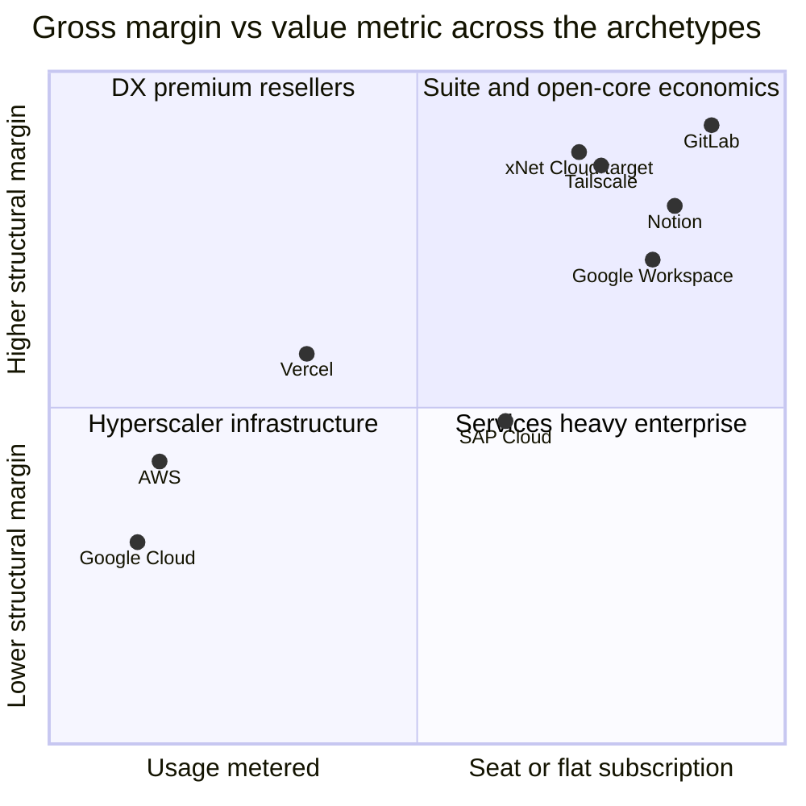
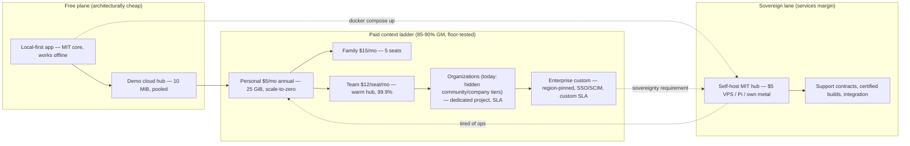
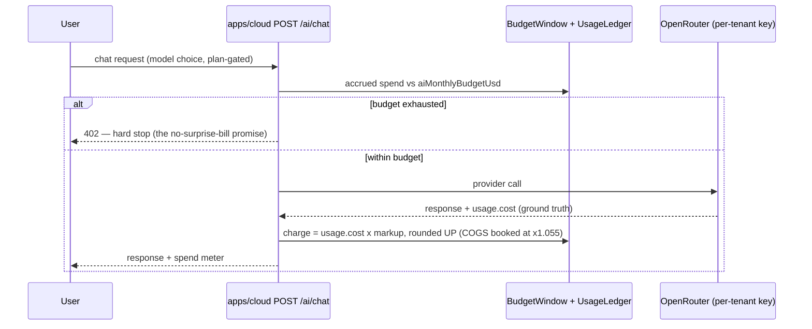
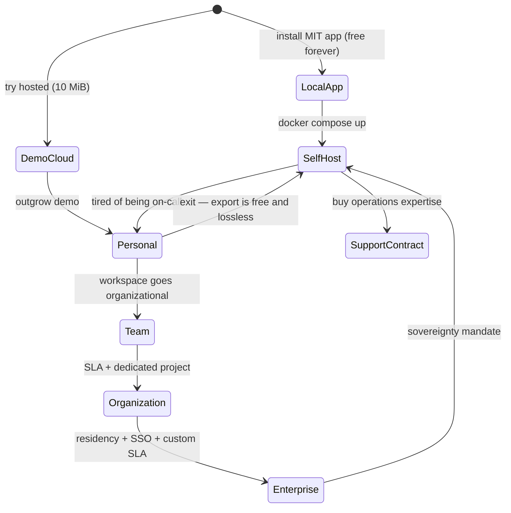

# Comparative Cloud Economics And xNet Cloud Positioning

> How do Google Workspace, Google Cloud, Vercel, Notion, and SAP actually make
> money — and where should xNet Cloud sit on that map to stay aligned with the
> Humane Internet Charter while keeping a healthy margin and a customer range
> that spans consumer, prosumer, team, enterprise, and government?

## Problem Statement

xNet Cloud already has a working economic skeleton: a seven-tier plan catalog
(`packages/entitlements/src/plans.ts`), an executable COGS/margin model
(`packages/cloud/src/cost/pricing.ts`) with a margin-floor test, a metered AI
lane with margin-safe markup (`packages/cloud/src/billing/pricing.ts`), and a
public pricing page (`site/src/data/pricing.ts`). What it does not have is a
deliberate **positioning decision**: which business-model archetype we are
running, why that archetype fits a local-first architecture, and how the same
offer stretches from a free consumer tier to a government procurement without
betraying the Charter (`docs/CHARTER.md`) — no lock-in, no exit tax, no
behavioral surplus.

This exploration benchmarks five incumbent archetypes (per-seat suite,
hyperscaler infra, PaaS reseller, PLG productivity, high-touch ERP) plus the
open-core and local-first comparables that look most like us, then derives a
positioning that is simultaneously values-aligned and margin-healthy.

## Executive Summary

- **Margin follows whether COGS scales with the billed unit — the value
  metric is the visible proxy.** Seat/flat-subscription software runs 70–90%
  gross margins (GitLab 89% at the top; industry benchmark 70–85%) because
  marginal COGS ≈ 0; usage-metered infrastructure runs 50–65% gross because
  hardware COGS scales with every billed unit, and only hyperscaler scale
  rescues *operating* margin (GCP lost money for ~15 years; first profitable
  quarter Q1 2023). xNet should never build a plan that requires infra-scale
  economics.
- **Local-first makes the free tier an architectural consequence, not a
  subsidy.** Our modeled COGS for the $5/mo Personal plan is ~$0.40–0.70/mo
  (85–90% gross margin, exploration 0178); ATProto's bounded-relay lesson
  (0333) prices an entire network relay at $34/mo. Tailscale and Obsidian
  prove this cost structure supports real businesses.
- **The monetization line is context, not capability** (Notion's line):
  individuals free and uncrippled; organizations pay for shared spaces,
  admin, SSO/SCIM, audit, SLA, residency. Our `PLAN_CATALOG` already encodes
  exactly this ladder — the gap is presentation and enforcement, not price
  levels.
- **Three known ways this dies**: visible markup on commodity units (Vercel's
  $0.15/GB bandwidth vs Cloudflare's $0), egress-style exit taxes (being
  outlawed in the EU anyway), and prosumer-only revenue (Muse: $120k ARR peak,
  wound down). The Charter's Exit clause is not just ethics — it is the
  commercially correct position.
- **AI is the one COGS line local-first does not collapse.** Keep it a
  separately metered, budget-capped lane (already built: charges are
  `usage.cost` × markup, rounded up and hard-stopped; COGS is booked at
  `usage.cost` × 1.055 so margin is never overstated) and
  hold Google's bundle-into-the-seat playbook in reserve.
- **Government enters through the self-host door, not the FedRAMP door.**
  FedRAMP is a $0.8M–$2M, 18–24-month gate; the EU sovereign-cloud market
  ($6.9B in 2025, forecast +83% in 2026) is buying exactly what our MIT hub
  already is: open, self-hostable, offline-capable. Sell support contracts to
  the agencies that `docker compose up`, and let hosted-gov wait.

**Recommendation in one line:** *Sell the operations, not the bytes; charge
for context, not capability* — Tailscale's cost structure + Notion's free/paid
line + GitLab's org-tier margins + Ghost's trust governance, with the EU
sovereignty wave as the government wedge.

## Current State In The Repository

### The plan catalog and the entitlements seam

- `packages/entitlements/src/plans.ts` — seven tiers (`demo, personal,
  family, team, community, company, enterprise`) over an isolation ladder
  `pooled → dedicated-sleep → dedicated-warm → dedicated-project →
  region-pinned`; crossing an isolation tier triggers data migration,
  everything else is an in-place entitlement flip (`withStorage`, `withSeats`,
  `withAiBudget`, `withConcurrency`). Gated per plan: `quotaBytes`,
  `maxBlobBytes`, `maxConnections`, `seats`, `includedAiUsd`,
  `aiMonthlyBudgetUsd`, `aiModels` (cheap/standard/all), `residency`, `sla`.
- The package is deliberately **MIT and dependency-free** so the self-hosted
  hub verifies signed entitlements without any FSL or vendor dependency —
  the anti-lock-in invariant from exploration 0174, enforced by the 0181
  consolidation (one FSL `@xnetjs/cloud` + one tiny MIT contract).

### The executable cost model

- `packages/cloud/src/cost/pricing.ts` — `UNIT_COSTS` (June 2026 basis): R2
  $0.015/GB-mo (zero egress), Fly volume $0.15, Hetzner $0.048, warm compute
  $6/mo/unit, active compute $0.00266/hr, WorkOS SSO+SCIM $250/mo, Stripe
  2.9% + $0.30. `EFFECTIVE_COGS_MULTIPLIER = 1.055` captures OpenRouter's
  5.5% credit-top-up fee so AI COGS is never understated (0244).
- `PLAN_PRICING` scenarios: Personal $50/yr, Family $15/mo, Team $96/mo
  (8 × $12), Enterprise $2,000/mo — and
  `packages/cloud/src/cost/floor-margin.test.ts` asserts every priced plan
  stays margin-positive even when the full included-AI allotment is consumed.
- `DEFAULT_BILLING_PERIOD` already recommends annual for Personal: Stripe's
  all-in take is ~9% of a $5 monthly charge (2.9% + $0.30), and the avoidable
  $0.30 fixed component (6% monthly) amortizes to $0.025/mo — 0.6% — on
  annual billing (the entry-tier margin lever from 0178).

### Two billing systems, on purpose

- `packages/billing/` (MIT, zero runtime deps) — provider-agnostic
  subscription billing for the **self-hosted** hub: Stripe *and* BTCPay
  (Bitcoin/Lightning) adapters, webhook verify→dedupe→normalize→apply,
  Stripe Connect. Money as integer minor units (0187).
- `packages/cloud/src/billing/` (FSL) — **usage metering** for xNet Cloud:
  idempotent `UsageLedger`, `BudgetWindow` (calendar-month default,
  calendar-week aligned to OpenRouter key resets, rolling-N), hard-stop
  budget enforcement, "always round UP" pricing (`computeChargeUsd`).
- The AI lane: `packages/cloud/src/ai/` (OpenRouter gateway, per-tenant
  provisioned keys, `meterUsage` → ledger + Stripe meter event
  `ai_usage_usd`), fronted by `apps/cloud/src/ai/route.ts` (`POST /ai/chat`,
  402 on budget exhaustion). Two-layer enforcement: our ledger window
  (instant) + OpenRouter per-key limit (coarse backstop).

### The public pricing surface

- `site/src/data/pricing.ts` mirrors the catalog: **Free** (10 MiB pooled
  demo), **Personal $5/mo billed annually ($50/yr)** — the featured tier,
  **Family $15/mo** (5 seats, 250 GiB), **Team $12/seat/mo from $36 (3
  seats)**, **Enterprise custom** (region-pinned, SSO/SCIM, custom SLA).
  `community` and `company` exist in the catalog but are deliberately hidden
  from the public grid — an unclaimed middle we can shape.
- `site/src/data/compare.ts` benchmarks only local-first/sync-engine peers
  (Notion appears as a product comparison, but there is no
  Workspace/GCP/Vercel/SAP economics row anywhere) — this exploration fills
  that whitespace.

### The self-host path (the BATNA we sell against)

- `packages/hub/` (MIT): single Node process over better-sqlite3,
  multi-arch images at ghcr.io (`.github/workflows/hub-release.yml`),
  `packages/hub/install-hub.sh`, `packages/hub/docker-compose.hub.yml`,
  `packages/hub/fly.toml` (512 MB reference VM), Litestream → R2 replication, runs on a Raspberry Pi (0300) or the
  "$5/month VPS" pitched on the landing page.
- The pricing FAQ already promises movement between self-hosted and managed
  without data loss; `docs/CHARTER.md` §2 "Exit — leaving is your right, and
  it loses nothing" makes it a charter commitment backed by CI
  (`scripts/check-humane-patterns.mjs`).

### Values infrastructure already in place

- `docs/CHARTER.md` (Own / Exit / Calm / Consent / Agency / Commons),
  `GOVERNANCE.md` (BDFL with stated growth triggers), `TRADEMARK.md` (mark
  moves to a future foundation, FRAND pre-commitment), DCO-only contribution
  (no CLA, `CONTRIBUTING.md`), LLC→PBC trajectory (0241).
- Licensing split: root `LICENSE` MIT; `packages/cloud` + `apps/cloud` are
  FSL-1.1-ALv2 (converts to Apache-2.0 after two years); paid-plugin
  marketplace takes a 10–15% `application_fee` via Stripe Connect — explicitly
  not Apple's 30% (0196).

### Prior economics explorations this builds on

0132 (federated-hub economic models), 0144 (open-federation monetization),
0147 (paid hub hosting 5-year model: $6/mo at 75% gross margin → illustrative
Y5 $54M revenue), 0174/0181 (open-core seam), 0177/0178 (storage tiering and
SQLite hosting COGS — the source of the 85–90% Personal margin), 0187
(billing), 0196 (marketplace take rate), 0200/0201/0208/0244 (AI metering and
margin safety), 0216 (upgrade/downgrade/over-quota guardrails), 0333 (ATProto
relay economics: $152/mo unbounded → $34/mo bounded).

### Known gaps that leak margin or credibility

- **0291: demo-hub quota and eviction are not actually enforced** — the free
  plane's COGS guard exists in code but not in effect.
- WorkOS SSO+SCIM is a **$250/mo fixed cost** per enterprise tenant — fine at
  $2,000/mo ACV, ruinous if ever attached to a cheap tier.
- Monthly billing on the $5 tier hands Stripe ~9% — annual-first needs to be
  the default posture everywhere, not just a code comment.

## External Research

### The five archetypes, quantified

| Archetype | Exemplar | Pricing shape | Gross margin | The lesson |
|---|---|---|---|---|
| Per-seat suite | Google Workspace | $7/$14/$22 per user/mo (annual); Gemini bundled Jan 2025 with ~17–22% price rise | 70–85% band (industry) | Bundling converts AI COGS into a 100%-attach ARPU raise; but ~50% of enterprise seats are shelfware and buyers know it |
| Usage-metered infra | Google Cloud | Pay-per-use + committed-use discounts (37–70% off) | ~50–65% gross; op margin −$1.9B (2022) → $1.7B/5.2% (2023) → ~14% (2024) → ~24% (2025) | COGS scales with revenue; profitability needs decade-plus scale; egress fees are a regulated-away dark pattern (EU Data Act bans switching egress from Jan 2027) |
| PaaS reseller | Vercel | Free Hobby; Pro $20/seat + usage; bandwidth $0.15/GB vs CloudFront $0.085 / Cloudflare $0 | Reseller margin on hyperscaler retail | Free tier as CAC works ($100M ARR 2024 → ~$200M 2025, $9.3B valuation); visible unit markup makes your community your critic (Cara's $96k week) |
| PLG productivity | Notion | Free personal (uncapped, 2020); Plus $10, Business $20 (AI folded in May 2025, +33% tier price) | High-80s (Figma anchor: AWS = 12% of revenue) | Free bounded by *context* (personal) not *capability*; price-discover AI as add-on, then bundle into a raised tier |
| High-touch ERP | SAP | RISE FUE-metered subscriptions; historic 22%/yr maintenance | Cloud GM 74–75% (2025); S&M ≈ 26% of revenue | Data-hostage switching costs + services armies; the anti-model for a local-first vendor — but FUE is a template for human+agent+device metering |

### Open-core and local-first comparables (the models that look like us)

- **GitLab**: FY2025 revenue $759M, **89% gross margin**, Premium $29 /
  Ultimate $99 per user/mo — proof open core does not depress software
  margins; paid tiers sell *organizational* features whose marginal COGS ≈ 0.
- **Tailscale**: free personal plan as "architectural consequence" (data
  plane is peer-to-peer, free users cost ~nothing); Starter $6 / Premium
  $18 per user/mo (2025 pricing); $160M Series C at ~$1.45B (2025), ~10k
  paying businesses.
  The closest cost-structure analogue to xNet.
- **Obsidian**: free local app; **Sync $4/user/mo** (annual), Publish $8–10;
  ~7 employees, no VC; third-party ARR estimates ~$25M (unverified). The
  existence proof for single-digit-dollar sync attach on a free local app.
- **Supabase**: free / Pro $25/mo / Team $599/mo; ARR est. $30M (2024) →
  ~$170M (May 2026); $10B valuation June 2026 — the venture-scale open-core
  trajectory, bought with $600M+ of capital.
- **Ghost**: nonprofit foundation, ~$8–9M ARR, ~34 staff, zero outside
  funding, live public revenue dashboard — governance transparency as a
  commercial feature ("paying us is how the software stays alive").
- **Proton**: 100M+ accounts, majority-owned by a nonprofit foundation since
  2024, subscription-only, no ads — privacy-premium at consumer scale.
- **Muse** (the cautionary tale): $2M raised, 7 people, $100/yr prosumer
  subscription, best year ~$120k ARR, wound down. Prosumer-only willingness
  to pay is thin and cyclical; you need Obsidian-scale user counts or a B2B
  tier with real ACVs.
- **Actual Budget**: paid local-first app that couldn't sustain one
  developer; open-sourced 2022, thrives as community software — great for
  users, fatal for the business. The floor to design against.

The attach-rate arithmetic worth internalizing: Obsidian's rumored ~$25M ARR
against ~1–1.5M active users implies double-digit attach — anywhere from the
mid-teens to ~50% of actives paying for something in the $4–10/mo band, a
range highly sensitive to the unverified ARR figure and to how much of it is
commercial licenses — still extraordinary vs typical PLG free→paid (2–5%),
while Muse's numbers imply low-single-digit attach at $100/yr. The
difference is the product being a daily home (Obsidian) vs a beautiful
accessory (Muse). xNet's workspace ambition puts it on the right side of that
line *if* the free tier is genuinely lovable.

### Government and public-sector economics

- **US federal (late game)**: FedRAMP Moderate realistically $0.8M–$2M over
  18–24 months plus $200–500k/yr continuous compliance — before the first
  dollar of revenue. FedRAMP 20x (2025) may compress this, but it remains a
  pay-to-play gate rational only after enterprise compliance machinery exists
  anyway.
- **EU sovereignty (early game)**: sovereign-cloud spend $6.9B in 2025,
  forecast +83% in 2026 (Gartner via The Register). Hard migrations are
  already happening: 600k+ French civil servants on Tchap (Matrix), Germany's
  openDesk (Nextcloud/Element/Collabora bundle) adopted by state
  chancelleries and the ICC after US sanctions disrupted its Microsoft
  access, Schleswig-Holstein moving 40k accounts off Exchange and 30k PCs to
  Linux. The US CLOUD Act is the unresolvable objection to *any* US-hosted
  SaaS — including ours.
- What governments buy in this wave: open source, self-hostable, federated,
  data on sovereign metal, **support contracts and certified operations**
  (the Nextcloud/Element commercial model). Every current sovereign suite is
  server-centric; a local-first entrant differentiates on offline resilience,
  not just licensing.

## Key Findings

1. **The archetypes sort onto one map: gross margin tracks whether COGS
   scales with the billed unit.** Seat/flat subscription → 70–90%;
   usage-metered units → 50–65% and scale-dependent. xNet's subscription lanes already model at 85–90%
   (Personal) and are floor-tested; the only usage-metered lane is AI, which
   is correctly priced as protected pass-through, not as a margin engine.

2. **xNet's free tier is Tailscale-shaped, not Vercel-shaped.** The client
   does the compute and holds the data; the demo hub costs us cents. Free is
   architecturally cheap CAC — *provided* the 0291 quota/eviction gap is
   closed so the demo plane can't be abused into real COGS.

3. **Our catalog already draws Notion's line** (personal context free/cheap,
   organizational context paid: seats, SSO, SLA, residency) — but the public
   grid hides the `community`/`company` tiers, leaving a pricing cliff
   between Team ($36+/mo) and Enterprise ($2,000/mo scenario). That hidden
   middle is exactly where EU associations, co-ops, schools, and small
   agencies — the sovereignty-wave buyers — would land.

4. **The Charter is commercially load-bearing.** "Exit loses nothing" (no
   egress fees, free export, self-host parity) is simultaneously: the EU
   Data Act's direction of travel, the anti-Vercel/anti-AWS positioning, and
   the reason a government can procure us. Ghost and Proton show trust
   governance converts to revenue; we already have the artifacts
   (CHARTER/GOVERNANCE/TRADEMARK/DCO/PBC-trajectory) — we under-market them.

5. **AI bundling has a known two-act script** (Notion 2023–25, Google Jan
   2025): price-discover as a metered add-on, then fold into a raised tier
   once attach proves value. We are correctly in act one — included
   allotments per tier + hard-capped metering. Do not bundle early: AI is
   our only COGS line that scales with usage, and the round-up markup on
   charges, the 1.055 COGS-side multiplier, and the floor-margin test are
   the discipline that keeps it from contaminating the 85%-margin sync
   business.

6. **Government sequencing is self-host-first.** An agency running the MIT
   hub on its own metal needs no FedRAMP from us. The sellable SKUs are
   support contracts, certified builds, and integration services on the open
   hub (services margin, sticky multi-year contracts) — with hosted
   region-pinned Enterprise for the private sector, and FedRAMP deferred
   until enterprise compliance machinery exists for other reasons.

7. **Per-seat purism is aging badly** (shelfware, agent-driven seat
   shrinkage). Our hybrid is already right: seats for humans in shared
   workspaces + capacity (storage/isolation/SLA) for durability value + a
   metered lane for AI. This is a lightweight FUE without SAP's complexity.

## Options And Tradeoffs



*(y is gross margin adjusted for structural drag, not raw GM: SAP's 74–75%
cloud gross margin is discounted for its services intensity and
26%-of-revenue S&M; GCP's 50–65% gross for hardware COGS and its 15-year
path to operating profit. Raw figures are in the archetype table above.)*

| Option | Shape | Margin profile | Charter fit | Demographic reach | Verdict |
|---|---|---|---|---|---|
| **A. Per-seat suite purism** | Everything per-seat, AI bundled now, one price ladder | High (75–85%) | OK, but seat-metering ignores that our value is durability + sync, not headcount | Weak at consumer (seat pricing alienates individuals) and gov (wants self-host) | Reject — right margin, wrong metric for local-first |
| **B. Usage-metered infra** | Meter storage/bandwidth/compute like a mini-GCP | Low (50–65%), scale-dependent | Poor — metering bytes recreates bill anxiety; egress-adjacent | Developers only | Reject — structurally wrong at our scale, values-hostile |
| **C. DX-premium reseller** | Markup on hosted units, convenience premium, free tier as CAC | Medium, visibly eroding | Poor — our own MIT hub is the customer's BATNA; visible markup turns community critical | Prosumer/dev | Reject as a *pricing* model; keep the free-tier-as-CAC mechanic |
| **D. PLG ladder: context line + capacity + org tiers** | Free personal context; $5 sync; seats for teams; capacity/SLA/residency for orgs; AI metered separately | High (85–90% modeled, floor-tested) | Strong — free exit, self-host parity, no unit markups, budget-capped AI | Consumer → prosumer → team → enterprise | **Adopt** — this is 90% of what the repo already encodes |
| **E. Enterprise/gov-first high-touch** | Sales-led, FedRAMP, services ecosystem | Services margins, S&M-heavy (SAP: 26% of revenue) | Mixed — compliance fine, but hostage-data economics are the anti-Charter | Enterprise/gov only, late | Reject as lead motion; adopt the **support-contract sub-lane** on the self-host wedge |

The real decision is not A–E; it is the three deliberate deviations from pure
Option D:

1. **Surface the hidden middle** (`community`/`company`) as a public
   "Organizations" lane so the Team→Enterprise cliff doesn't push the
   sovereignty-wave mid-market to self-host-with-no-support by default.
2. **Add the services sub-lane** (support contracts on the MIT hub) as the
   government/sovereign offer — services margin, but near-zero COGS and
   Charter-perfect.
3. **Keep AI in act one** (metered add-on) until attach data justifies
   Google's act-two bundle move.

## Recommendation

Position xNet Cloud as: **the operational-trust subscription on top of
software you could run yourself — priced on context and durability, never on
bytes, with leaving free and loud.**



The eight planks, each mapped to repo state:

1. **Free is the funnel, and it must stay cheap by construction.** Close
   0291 (enforce demo quota + inactivity eviction) so the free plane's COGS
   stays at cents. Never bound the free tier by crippling capability — bound
   it by context (10 MiB pooled demo is a *trial of the cloud*, while the
   local app is free forever).
2. **Annual-first everywhere sensible.** Stripe's all-in take is ~9% of a
   $5 monthly charge vs ~3.5% of a $50 annual one; the avoidable $0.30 fixed
   fee alone drops from 6% to 0.6%. Personal already defaults annual; add
   annual scenarios (with the conventional ~2-months-free discount) for
   Family and Team to `PLAN_PRICING` and the floor-margin test.
3. **Never meter the user's own data.** No bandwidth, egress,
   storage-request, or sync-op line items — ever. Codify "no exit tax, no
   metered bytes" as a pricing-page FAQ commitment tied to Charter §2, so the
   anti-Vercel/anti-egress stance is explicit marketing, not just absence.
   (The AI lane is the one deliberate exception — plank 7 explains why it
   escapes the Vercel critique.)
4. **Publish the cost transparency.** We have `UNIT_COSTS` and an executable
   margin model; Ghost publishes revenue live and converts trust into
   hosting customers. A "why the free plan is free / what your $5 pays for"
   section on `/cloud/pricing` (client compute ≈ yours, our COGS ≈ storage +
   relay + on-call) weaponizes our architecture honestly.
5. **Open the Organizations lane.** Make `community`/`company` public-facing
   (named e.g. "Organization" with a from-price), filling the $36 → $2,000
   cliff for co-ops, schools, associations, and small agencies — the exact
   demographic of the EU sovereignty wave that can't buy Enterprise and
   shouldn't be forced to unsupported self-host.
6. **Stand up the sovereign/services sub-lane.** A one-page offer: MIT hub +
   support contract + certified multi-arch builds + optional Litestream→R2
   (or customer-owned S3) backup. This is the Nextcloud/Element model; it
   monetizes the government demographic without FedRAMP, without hosting
   their data, and without touching the CLOUD Act problem.
7. **AI stays a hard-capped metered lane** (act one). Included allotments
   scale with tier (already: $2 → $25), model catalogs gate by tier
   (already: cheap/standard/all), budget hard-stops at 402 (already),
   charges of `usage.cost` × markup rounded up with COGS reconciled at
   ×1.055 (already). This metering escapes the Vercel critique because it is
   third-party pass-through COGS — not our own infrastructure resold — it is
   hard-capped so it can never produce a surprise bill, and the BYO-key path
   (0192) means the markup is never lock-in: anyone who resents it can route
   around it. Revisit bundling only with real attach data.
8. **Market the governance we already have.** Charter, DCO-no-CLA, trademark
   FRAND pre-commitment, FSL→Apache 2-year conversion, PBC trajectory
   (0241): these are procurement features for the trust-sensitive segments.
   Put them on the pricing page, not just in the repo.

### How the money flows (AI lane, already built)



### Customer lifecycle with the exit guarantee as a feature



## Example Code

Extending the executable cost model with annual scenarios and the sovereign
support lane, so the floor-margin test covers the new positioning:

```ts
// packages/cloud/src/cost/pricing.ts (sketch)

/** Annual scenarios: same COGS inputs, price × 10 (2 months free), period 'year'. */
export const PLAN_PRICING_ANNUAL: Partial<Record<PlanId, PricingScenario>> = {
  family: {
    priceUsd: 150, // $15 × 10 — two months free for commitment
    period: 'year',
    inputs: { storageGbTypical: 30, activeHoursPerMonth: 120, warm: false, hotDbGb: 1, volume: 'fly' }
  },
  team: {
    priceUsd: 960, // 8 seats × $12 × 10
    period: 'year',
    inputs: { storageGbTypical: 95, activeHoursPerMonth: 0, warm: true, hotDbGb: 5, volume: 'fly' }
  }
}

/**
 * Sovereign/support lane: customer runs the MIT hub on their own metal, so our
 * COGS is support labor, not infrastructure. Modeled here only to keep the lane
 * inside the same margin-floor discipline (labor as a monthly unit cost).
 */
export interface SupportScenario {
  priceUsd: number // e.g. 500/mo base support contract
  period: 'month' | 'year'
  /** Modeled support-hours/month × loaded hourly rate. */
  supportLaborUsd: number
}

export function estimateSupportMargin(s: SupportScenario): { grossMarginPct: number } {
  const monthlyRevenue = s.period === 'year' ? s.priceUsd / 12 : s.priceUsd
  const stripe =
    (s.priceUsd * UNIT_COSTS.stripePercent + UNIT_COSTS.stripeFixedPerCharge) *
    (s.period === 'year' ? 1 / 12 : 1)
  const margin = monthlyRevenue - s.supportLaborUsd - stripe
  return { grossMarginPct: monthlyRevenue > 0 ? margin / monthlyRevenue : 0 }
}
```

```ts
// packages/cloud/src/cost/floor-margin.test.ts (sketch of the new assertions)
it('annual scenarios keep the margin floor', () => {
  for (const [plan, scenario] of Object.entries(PLAN_PRICING_ANNUAL)) {
    const b = estimateCogs(scenario)
    expect(b.grossMarginPct, plan).toBeGreaterThan(0.75)
  }
})

it('support lane is margin-positive at modeled labor', () => {
  const { grossMarginPct } = estimateSupportMargin({
    priceUsd: 500,
    period: 'month',
    supportLaborUsd: 300 // 2 h/mo × $150 loaded
  })
  expect(grossMarginPct).toBeGreaterThan(0.3) // services margin, not SaaS margin
})
```

## Risks And Open Questions

- **FSL optics in sovereign procurement.** The control plane is
  FSL-1.1-ALv2 (not OSI-approved). Mitigation is real but must be said out
  loud: everything a government runs (hub, clients, entitlements) is MIT;
  FSL converts to Apache-2.0 after two years; the sovereign lane never
  requires the FSL code at all.
- **CLOUD Act.** A US-operated xNet Cloud can never be the EU-sovereign
  offer, regardless of region pinning. The sovereign lane must be self-host
  or (later) EU-operated partners. Region-pinned Enterprise remains a
  private-sector feature, not a sovereignty claim — don't market it as one.
- **Attach-rate uncertainty.** The whole consumer plane bets we're
  Obsidian-shaped (double-digit attach on single-digit-dollar add-ons) not
  Muse-shaped (low-single-digit attach at $100/yr). Leading indicator to
  instrument: share of active local-app users who connect any hub within
  30 days.
- **The hidden-middle pricing is unset.** `community`/`company` have
  entitlements but no public price; the 0147 research suggested $49–$299/mo.
  Naming and price points need a deliberate pass before the lane opens.
- **WorkOS $250/mo fixed** must stay strictly Enterprise-gated; an
  Organization tier that includes SSO would silently destroy its margin.
  (If Organizations demand SSO, price it as a +$X add-on covering the fixed
  cost.)
- **Services lane scope creep.** Support contracts are services margin
  (30–60%), not SaaS margin (85%+). Cap the lane's promises (response times,
  not outcomes) and keep it out of the fixed-core release train.
- **Open questions:** Do we publish a Ghost-style live revenue dashboard
  (maximal trust, competitive exposure)? When does the PBC conversion (0241)
  happen relative to the first government support contract? Does the
  marketplace 10–15% take rate need EU DMA review before the Organizations
  lane targets EU buyers? External figures cited here (Notion/Obsidian ARR,
  sovereign-cloud forecasts) are estimates from third-party trackers —
  refresh before quoting in marketing.

## Implementation Checklist

- [ ] Enforce demo quota + inactivity eviction (close exploration 0291) so
      the free plane's COGS is bounded in effect, not just in code
      (`packages/hub/src/services/eviction.ts`, demo entitlements).
- [ ] Add `PLAN_PRICING_ANNUAL` scenarios (Family $150/yr, Team seat×$120/yr)
      to `packages/cloud/src/cost/pricing.ts` and extend
      `floor-margin.test.ts` to assert ≥75% GM on every annual scenario.
- [ ] Default the pricing page's Family/Team toggles to annual with the
      "2 months free" framing (`site/src/data/pricing.ts`).
- [ ] Add the "no exit tax, no metered bytes" pledge to the pricing FAQ,
      cross-linking Charter §2 Exit; add a humane-patterns check that no
      pricing entry ever contains a per-GB bandwidth/egress line item.
- [ ] Add a "what your $5 pays for" cost-transparency section to
      `/cloud/pricing` derived from `UNIT_COSTS` (storage + relay + on-call,
      client does the compute).
- [ ] Name and price the public Organizations lane from the hidden
      `community`/`company` tiers (target $49–$299/mo band per 0147); decide
      SSO add-on pricing that covers the WorkOS fixed cost before exposing it.
- [ ] Write the sovereign/services one-pager under `docs/cloud/` (MIT hub +
      support contract + certified builds + customer-owned backup target);
      link it from the pricing page's self-host FAQ answer.
- [ ] Add `estimateSupportMargin` (or equivalent) so the services lane lives
      inside the same margin-floor test discipline.
- [ ] Surface the governance/trust artifacts (Charter, DCO, FSL→Apache
      timer, trademark FRAND, PBC trajectory) on the cloud pricing page.
- [ ] Add BYO-key AI documentation (0192) as the metered lane's escape
      valve; link from the AI budget FAQ.
- [ ] Refresh exploration 0147's five-year model with this doc's 2026
      comparables (Tailscale/Obsidian/GitLab bands) and the annual-first
      assumption.

## Validation Checklist

- [ ] `floor-margin.test.ts` green, including annual and support-lane
      scenarios; every priced plan margin-positive with full included-AI
      consumption.
- [ ] Modeled fixed-fee drag on annual Personal/Family/Team ≤ 1% of revenue
      and total Stripe drag ≤ 4% (vs ~9% all-in on $5 monthly).
- [ ] Demo tenants in staging show enforced quota + eviction (0291 checked
      off); demo-plane storage growth is bounded month-over-month.
- [ ] Pricing page still mirrors `PLAN_CATALOG` exactly (prices, quotas,
      seats) after the Organizations lane lands; site builds clean.
- [ ] A self-host → cloud → self-host round trip (export/import) completes
      losslessly — the Exit pledge is demonstrably true.
- [ ] AI lane reconciliation over a month: billed revenue ≥ 1.055 × summed
      `usage.cost` for every tenant (margin never negative on AI).
- [ ] First sovereign-lane conversation (or design-partner LOI) validates
      that support-contract terms fit inside the services-margin model.

## References

**Repository:**
`packages/entitlements/src/plans.ts` · `packages/entitlements/src/entitlements.ts` ·
`packages/cloud/src/cost/pricing.ts` · `packages/cloud/src/cost/floor-margin.test.ts` ·
`packages/cloud/src/billing/{pricing,ledger,window,budget}.ts` ·
`packages/cloud/src/ai/{openrouter-gateway,metering,openrouter-keys}.ts` ·
`apps/cloud/src/ai/route.ts` · `packages/billing/` · `packages/hub/` ·
`site/src/data/pricing.ts` · `site/src/data/compare.ts` · `docs/CHARTER.md` ·
`GOVERNANCE.md` · `TRADEMARK.md` · `CONTRIBUTING.md` · `railway.toml`

**Prior explorations:** 0132, 0144, 0147, 0174, 0175, 0177, 0178, 0181, 0187,
0192, 0196, 0200, 0201, 0208, 0216, 0241, 0242, 0244, 0291, 0300, 0333.

**Follow-up:**
[0351](./0351_[x]_FRONTIER_ECONOMICS_WITHOUT_ENCLOSURE_RAILROADS_AIRLINES_AND_THE_COMMONS.md)
generalises this positioning into the "Georgist operator" frame (margin on
improvements, never ground rent) and adds the No Ground Rent charter covenant
plus the three-test rubric for new revenue lanes.

**External (key figures; estimates flagged in text):**
- Google Workspace pricing — <https://workspace.google.com/pricing>
- Incentro — Workspace 2025 price increase (Gemini bundling) — <https://www.incentro.com/en-EAF/news/google-workspace-price-increase-2025>
- Zylo 2024 SaaS Management Index (shelfware) — <https://zylo.com/news/2024-saas-management-index/>
- Alphabet FY2023 10-K (first GCP operating profit) — <https://www.sec.gov/Archives/edgar/data/1652044/000165204424000022/goog-20231231.htm>
- Alphabet FY2024 10-K — <https://www.sec.gov/Archives/edgar/data/1652044/000165204425000014/goog-20241231.htm>
- Alphabet FY2025 10-K — <https://www.sec.gov/Archives/edgar/data/1652044/000165204426000018/goog-20251231.htm>
- CNBC — AWS 2024 operating margin — <https://www.cnbc.com/2024/10/31/amazons-cloud-unit-records-highest-profit-margin-in-at-least-a-decade.html>
- Cloudflare — "AWS's Egregious Egress" — <https://blog.cloudflare.com/aws-egregious-egress/>
- Google Cloud committed-use discounts — <https://docs.cloud.google.com/compute/docs/instances/committed-use-discounts-overview>
- Flexprice — Vercel pricing breakdown — <https://flexprice.io/blog/vercel-pricing-breakdown>
- Sacra — Vercel — <https://sacra.com/c/vercel/>
- SaaStr — Vercel $9.3B Series F — <https://www.saastr.com/how-vercel-hit-9-3b-and-replit-hit-3b-after-a-decade-the-long-paths-to-ai-overnight-success/>
- ServerlessHorrors — Cara.app $96k week — <https://serverlesshorrors.com/> (discussion: <https://news.ycombinator.com/item?id=40618220>)
- Notion pricing — <https://www.notion.com/pricing>; pricing history — <https://www.saaspricepulse.com/blog/notion-pricing-history>
- Notion 2.8 release notes (free personal, May 2020) — <https://www.notion.com/releases/2020-05-19>
- ARR Club — Notion ARR estimate — <https://www.arr.club/signal/notion-arr-hits-500m>
- InfoQ — Figma's $300k/day AWS bill (12% of revenue) — <https://www.infoq.com/news/2025/07/figma-aws-300k-daily-bill/>
- SAP Q4/FY2024 results — <https://news.sap.com/2025/01/sap-announces-q4-and-fy-2024-results/>
- SAP Q4 2025 quarterly statement (cloud GM 74–75%) — <https://www.prnewswire.com/news-releases/sap-quarterly-statement-q4-2025-302673209.html>
- SAP Integrated Report 2024 (S&M €8.86B) — <https://www.sap.com/integrated-reports/2024/en/datahub/financial-data.html>
- CIO — SAP raises maintenance to 22% (2008) — <https://www.cio.com/article/276860/enterprise-resource-planning-sap-raises-software-maintenance-fees-for-new-customers.html>
- GitLab FY2025 10-K (89% gross margin) — <https://www.sec.gov/Archives/edgar/data/1653482/000162828025014344/gtlb-20250131.htm>
- Tailscale pricing — <https://tailscale.com/pricing>; "Why our free plan stays free" — <https://tailscale.com/blog/free-plan>
- Obsidian pricing — <https://obsidian.md/pricing>
- TechCrunch — Supabase $10B valuation (June 2026) — <https://techcrunch.com/2026/06/05/supabase-doubles-valuation-to-10b-in-8-months/>
- Ghost — open finances — <https://ghost.org/about/>
- Proton Foundation announcement — <https://proton.me/blog/proton-non-profit-foundation>
- Adam Wiggins — Muse retrospective — <https://adamwiggins.com/muse-retrospective/>
- localfirst.fm — Actual Budget open-sourcing (James Long) — <https://www.localfirst.fm/7/transcript>
- Ink & Switch — Local-first software — <https://www.inkandswitch.com/essay/local-first/>
- tonsky — "Local, first, forever" — <https://tonsky.me/blog/crdt-filesync/>
- Vanta — FedRAMP cost — <https://www.vanta.com/collection/fedramp/fedramp-cost>; Paramify 2026 figures — <https://www.paramify.com/blog/fedramp-cost>
- The Register — Gartner EU sovereign-cloud forecast — <https://www.theregister.com/2025/12/22/europe_gets_serious_about_cutting/>
- Element — Tchap / digital sovereignty — <https://element.io/blog/digital-sovereignty-is-built-on-an-open-standard-that-enables-federation/>
- OpenProject — openDesk in German government — <https://www.openproject.org/blog/digital-sovereignty-government-germany-opendesk/>
- Digital Independence — Schleswig-Holstein migration — <https://www.digital-independence.org/posts/sovereign-workplace/>
