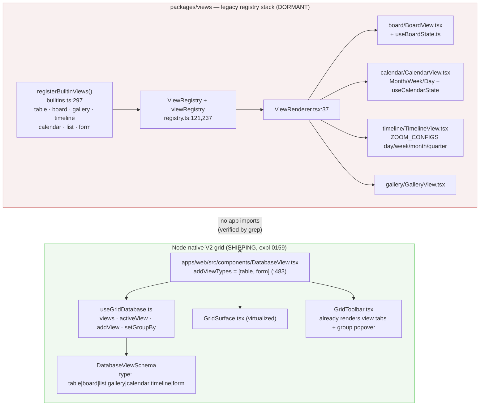
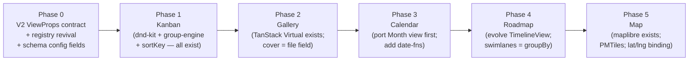
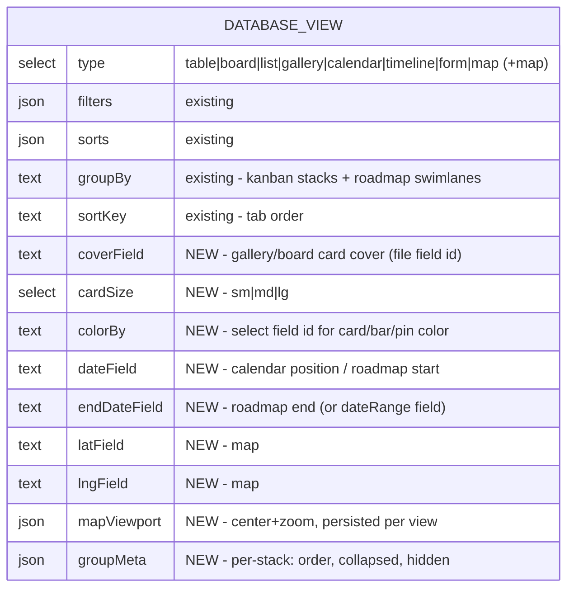
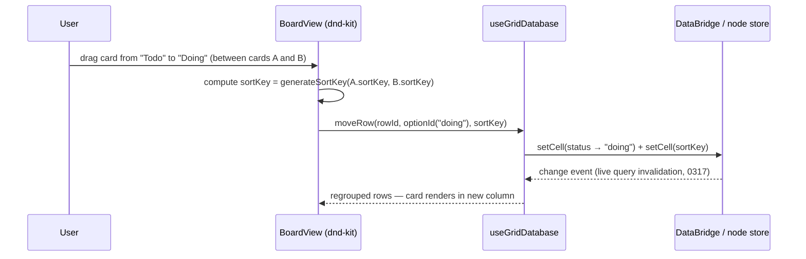

# Database Views: Kanban, Calendar, Roadmap, Gallery, Map

## Problem Statement

The xNet database surface ships exactly two layouts: the V2 grid (Table) and
Form. Every peer product — Notion, Airtable, NocoDB, Baserow, Teable, AFFiNE —
treats a database as *one dataset, many views*: Board/Kanban grouped by a
select field, Calendar positioned by a date field, Timeline/Roadmap bars over
a date range, Gallery cards with cover images, and (NocoDB) a Map of rows with
coordinates. Baserow literally paywalls Kanban/Calendar/Timeline as
"Premium" — these views are the monetizable table stakes of the category.

What would it take for xNet to ship Kanban, Calendar, Roadmap, Gallery, and
Map views on the existing database surface — and what already exists in the
repo that we should reuse rather than rebuild?

## Executive Summary

**This is a convergence project, not a greenfield build.** The repo already
contains built, tested Board, Calendar, Timeline, Gallery, and List view
components in `packages/views` — wired to a `ViewRegistry` + `ViewRenderer`
that **no app currently imports**. Meanwhile the shipping database surface
(`apps/web/src/components/DatabaseView.tsx`) runs on the newer node-native V2
grid stack (`GridSurface` + `useGridDatabase`, exploration 0159) and hardcodes
its view switcher to `[table, form]` — even though the persisted
`DatabaseViewSchema` already declares `board | list | gallery | calendar |
timeline` as legal view types and carries a `groupBy` field.

The recommended path:

1. **Port the dormant view components onto the V2 grid data shape** (fields /
   rows / cells from `useGridDatabase`), one view at a time, and dispatch on
   `activeView.type` in `DatabaseView.tsx` — reviving the view registry as the
   dispatch mechanism so plugins can add views later (the 0267 "apps are views
   over your data" thesis).
2. **Extend `DatabaseViewSchema` with the per-view config the industry has
   converged on**: `coverField`, `cardSize`, `dateField`/`endDateField`,
   `colorBy`, geo bindings, persisted map viewport.
3. **Order of delivery: Kanban → Gallery → Calendar → Roadmap → Map.** Kanban
   and Gallery need zero new dependencies (dnd-kit and TanStack Virtual are
   already in `packages/views`). Calendar wants `date-fns` (MIT). Roadmap
   should be a custom virtualized timeline (evolving the existing
   `TimelineView`), *not* a Gantt library. Map already has `maplibre-gl`,
   `QuerySpatialFilter`, and geohash plumbing in `packages/maps` — its gap is
   a first-class geo property type and an offline-friendly tile story
   (Protomaps PMTiles).
4. **Respect the scale cliffs**: grouping is client-side over a 500-row
   window (`useGridDatabase` `pageSize = 500`); there is no `GROUP BY` in the
   query layer. Phase 1 works inside the window honestly (show "N of M"
   badges); per-stack keyset queries are the later fix, gated on 0317/0318.

License audit (verified against npm): everything recommended is
MIT/Apache/BSD/ISC. Notable exclusions: `react-leaflet` (Hippocratic-2.1),
FullCalendar's Timeline/Resource plugins (commercial), SVAR/DHTMLX Gantt
(GPL/commercial), NocoDB code (fair-code license since Jan 2026 — study only).

## Current State In The Repository

### Two parallel view systems



Key facts, with paths:

- **The views already exist.** `packages/views/src/builtins.ts:146` registers
  `table, board, gallery, timeline, calendar, list, form`, each with
  `configFields` (board's `groupByProperty`, gallery's `coverProperty`,
  calendar/timeline's `dateProperty`/`endDateProperty`). Components and state
  hooks live in `packages/views/src/{board,calendar,timeline,gallery,list}/`
  with tests in `packages/views/src/__tests__/`. But `registerBuiltinViews`,
  `viewRegistry`, `ViewRenderer`, and the legacy `TableView` are not imported
  by any app or other package — the whole stack is dormant.
- **The shipping surface is the V2 grid.**
  `apps/web/src/components/DatabaseView.tsx` uses
  `useGridDatabase(docId, { viewId, search })` (`:135`), renders
  `GridToolbar` (`:478`) and branches only form-vs-grid (`:535`, `:590`).
  `addViewTypes` is hardcoded to `[{table}, {form}]` (`:483-486`). The
  toolbar itself already understands more — `GridToolbar.tsx:88` defines
  `GridViewTab`, and its test exercises `type: 'board'`.
- **View persistence is already node-native and nearly sufficient.**
  `packages/data/src/schema/schemas/database-view.ts:38-46` — `type` is a
  `select` over all seven view types; the schema carries `filters`
  (`FilterGroup` json), `sorts`, `groupBy: text`, `fieldOrder`,
  `fieldWidths`, `hiddenFields`, and a required `sortKey` for tab order
  (`:82`). Missing: cover/card config, date-field mapping, color-by, geo
  bindings, map viewport.
- **Grouping engine exists, client-side.**
  `packages/data/src/database/group-engine.ts:75` `groupRows()` groups by
  `select`/`checkbox` columns with option-order key sorting, plus
  `packages/views/src/tasks/grouping.ts` (`buildTaskGroups`, with a perf
  test). Board grouping in `useBoardState.ts:91` accepts
  `select`/`multiSelect` (`:106`). **The query layer has no `GROUP BY`** —
  `QueryFilter` (`packages/react/src/hooks/useQuery.ts:84`) and the bridge
  `QueryDescriptor` have no grouping concept.
- **Scale guardrails are real.** `useGridDatabase.ts:113,256` windows rows to
  `pageSize = 500`, then filters/sorts/groups in JS.
  `useQuery.ts:227-280` warns in dev on unbounded property-sorted queries
  (they full-scan and JS-sort). Exploration 0318 (unmerged branch) measured
  the O(N) cliffs: sort, cursor, count, OFFSET; reads stay flat at 10M rows.
- **DnD and ordering primitives are ready.** `@dnd-kit/core ^6.3.1`,
  `@dnd-kit/sortable ^10.0.0` are dependencies of `packages/views` and
  already power `board/BoardColumn.tsx` / `BoardCard.tsx`. Fractional
  ordering lives in `packages/data/src/database/fractional-index.ts`
  (`generateSortKey` `:57`, `rebalanceSortKeys` `:270`), and
  `compareSortKeys` (`:246`) uses raw code-unit comparison — the collation
  invariant (never `localeCompare`) is already enforced there.
- **Field types cover four of five views.**
  `packages/data/src/schema/types.ts:11` `PropertyType` includes `date`,
  `dateRange`, `select`, `multiSelect`, `person`, `file`, `relation`;
  grid `ColumnType` (`packages/data/src/database/column-types.ts:13`)
  matches, and `SelectColumnConfig` carries color-coded options (`:118`).
  Task `status`/`priority` are selects (`schemas/task.ts:39,53`). **There is
  no geo/point type** — `packages/maps/src/query-layer.ts:46-52` binds maps
  to two loose `number` properties defaulting to `lat`/`lon`.
- **Map infrastructure exists but as its own surface.** `maplibre-gl ^5.0.0`
  is a dependency; `packages/maps` has `MapView.tsx`, geohash spatial
  indexing, and `MapSchema` (`schemas/map.ts:107`) with query-driven layers
  (exploration 0187). `useQuery` even accepts `spatial: QuerySpatialFilter`
  (`useQuery.ts:99`). What's missing is a *database view* that renders the
  current table's rows as pins.
- **Data to feed the views is seeded.** Work (`Project→Milestone→Task`), CRM
  (`Deal`/`Stage`/`Pipeline` — a natural kanban-by-stage), and accounting
  seeders exist under `packages/devtools/src/seed/seeders/`, guarded by
  `seed-coverage.test.ts`.
- **No date library anywhere.** No `date-fns`/`dayjs`/`luxon` in any
  `package.json`; the dormant calendar/timeline hooks use native `Date`
  (`useCalendarState.ts:110`, `useTimelineState.ts:34`).

### Prior explorations this builds on

- **0088** competitive teardown of Notion/Airtable/Coda database UI.
- **0158** "more visual data workspace" — visual renderer layer on saved views.
- **0159** database V2 overhaul — the shipping grid stack.
- **0187 / 0230** mapping & geospatial workspace — `MapSchema`, maplibre.
- **0188** extensible schemas & universal database view.
- **0199** "data layer is Airtable-class; UI doesn't show it" — surface
  grouping/relations.
- **0267 / 0281** moddable software: application-as-a-view — motivates the
  registry as a plugin point.
- **0274** TablePlus-grade Data tab (quality bar), **0277** CanvasView
  convergence (precedent for porting a surface into shared `packages/views`).
- **0317** useQuery live reactivity (open) and **0318** scale limits
  (unmerged) — the perf substrate these views must respect.

## External Research

### How competitors model view config

Across Notion, Airtable, NocoDB, and Baserow, per-view persisted config has
converged on the same shape (beyond shared filter/sort/field-visibility):

| Concern | Notion | Airtable | NocoDB | Baserow |
|---|---|---|---|---|
| Kanban group-by | status/select/person/relation, + sub-group swimlanes | single select / collaborator / linked record only | `fk_grp_col_id` (SingleSelect) | "Stacked by" single-select |
| Card cover | page cover / property image / none, fit toggle, S/M/L | attachment field, crop vs fit, size slider | `fk_cover_image_col_id` | cover file field |
| Calendar | "Show calendar by" date property picker | date field mapping | date column | (premium) |
| Timeline | start + end properties or one range | start/end mapping + swimlane group-by | — | (premium) |
| Map | — | — | dedicated `GeoData` column, 1000-row cap, persisted viewport, right-click-to-create | — |
| Group keying | option **id**, not label; explicit "uncategorized" stack for nulls | same | `meta` JSON stack order/colors | `field_options` |

Two business signals: Baserow paywalls exactly these views (Kanban, Calendar,
Timeline are Premium), and NocoDB left open source entirely (fair-code
"Sustainable Use License" at v0.301.0, Jan 2026). Shipping these views MIT is
differentiating, and neither codebase can be copied from — AFFiNE CE (MIT) is
the one license-compatible local-first reference implementation.

### Library landscape (licenses verified on npm, 2026-07)

| Need | Recommended | License | Why / why not alternatives |
|---|---|---|---|
| Kanban DnD | keep `@dnd-kit/core` (already used); watch `pragmatic-drag-and-drop` | MIT / Apache-2.0 | dnd-kit classic is stale (last publish Dec 2024; author moved to pre-1.0 `@dnd-kit/react`). Atlassian's pragmatic-drag-and-drop (Apache-2.0, powers Trello/Jira) is the scale + virtualization winner — but swapping now would churn working code. Revisit if column virtualization fights dnd-kit's droppable registry. |
| Calendar | hand-rolled month grid (exists) + `date-fns` | MIT | FullCalendar standard plugins are MIT but its Timeline/Resource views are commercial — a trap. `react-big-calendar` (MIT) is the fallback if the week/time-slot view gets expensive to build. Schedule-X core MIT, premium plugins paid. toast-ui dead since 2022. |
| Roadmap/Timeline | custom virtualized timeline (evolve existing `TimelineView`) | — | Linear/GitHub-Projects roadmaps are *not* Gantts: bars + month/quarter/year zoom + swimlanes, no dependency arrows. `frappe-gantt` (MIT, active) is the fallback if dependencies are ever wanted. vis-timeline (Apache/MIT) struggles past a few thousand DOM items. SVAR (GPLv3), planby (custom license), DHTMLX — excluded. |
| Gallery | uniform card grid + `@tanstack/react-virtual` (already a dep) | MIT | Notion/Airtable both use uniform grids, not masonry; virtualize rows-of-N-cards. `masonic`/`react-virtuoso` only if masonry or grouped galleries demanded. |
| Map renderer | `maplibre-gl` (already a dep) | BSD-3 | **`react-leaflet` is Hippocratic-2.1 — not OSI, excluded from MIT core.** Plain Leaflet (BSD-2) would need a hand wrapper; we already ship maplibre. `supercluster` (ISC) or maplibre's built-in `cluster: true` for pin clustering. |
| Map tiles | Protomaps **PMTiles** (`pmtiles`, BSD-3) self-hosted; OpenFreeMap as zero-key hosted default | BSD-3 | OSM's public raster tiles prohibit heavy/bulk/offline use. PMTiles = whole basemap as one static file over HTTP range requests — servable from the hub origin (one CSP entry) or even cached locally; genuinely local-first. |
| Geocoding | none in-client; optional hub-side Photon (Apache-2.0) later | — | Public Nominatim forbids autocomplete outright (1 req/s policy). Store lat/lng; geocoding is a pluggable service, never a client dependency. |

### Performance patterns from the field

- NocoDB pushes grouping into SQL (per-stack paginated queries) and caps its
  map view at 1000 records with clustering. The analogue for wa-sqlite: one
  `GROUP BY` count query to enumerate stacks + per-stack keyset-paginated
  windows — matching 0318's finding that sort/count/OFFSET are the cliffs,
  not reads. For select fields the stack list comes free from the field's
  option list (no `SELECT DISTINCT` needed).
- Virtualized kanban: virtualize *within* each column; columns themselves
  only if >~20 stacks. Card render cost becomes the bottleneck before the
  virtualizer does — memoize cards, defer covers/chips.
- Calendars don't need virtualization (≤42 cells) — they need per-cell event
  capping ("+N more") and a date-window query re-run on navigation.

## Key Findings

1. **Five of the six requested views are already written** — as legacy
   property-based components in `packages/views`, tested but unreachable.
   The work is porting their data contract from legacy
   `ViewProps`/`ViewConfig` (`packages/views/src/types.ts:78`) to the V2
   grid's fields/rows/cells and mounting them from `DatabaseView.tsx`.
2. **The persistence layer is ~80% ready.** `DatabaseViewSchema` already
   enumerates all view types and has `groupBy`; it needs ~6 new optional
   fields for cover/date/geo/viewport config. Schema change ⇒ major-vs-minor
   review under the changeset policy (additive optional fields ⇒ minor).
3. **Grouping must stay honest about the 500-row window.** Client-side
   `groupRows` over the window is correct for v1 *if the UI says so*
   ("showing 500 of 12,400"); silently truncated stacks would repeat the
   "grid 500-cap lies" failure noted in 0318.
4. **Map is the only view needing new data-model work** (a geo/point property
   type, or a blessed lat/lng-pair binding convention) plus a CSP/tile
   decision. Everything else is UI + view-config plumbing.
5. **No new heavyweight dependencies are needed** for Kanban, Gallery, or
   Roadmap. Calendar wants `date-fns` (tree-shakeable, MIT) to avoid DST
   bugs in hand-rolled date math. Map adds only `pmtiles` (BSD-3) if we take
   the self-hosted tile route.
6. **The registry question is the architectural fork**: hardcode view
   branches in `DatabaseView.tsx`, or revive `ViewRegistry` as the dispatch
   so plugins can register views (0267). The toolbar and schema are already
   shaped for the latter.

## Options And Tradeoffs

### Option A — Revive the legacy registry stack wholesale

Mount `ViewRenderer` + `registerBuiltinViews()` in `DatabaseView.tsx` and
adapt the V2 grid data *into* the legacy `ViewProps<TRow>` shape.

- ✅ Fastest visible demo; components run as-is.
- ❌ Freezes the legacy `ViewConfig` (Y.Doc-era, `view-operations.ts`) as a
  second source of truth beside `DatabaseViewSchema` nodes — exactly the
  dual-stack debt 0277 spent a cycle unwinding for CanvasView.
- ❌ Legacy `TableView` would shadow the far better `GridSurface`.

### Option B — Hardcode view branches on the V2 stack

Extend `addViewTypes` and add `activeView.type` switch cases in
`DatabaseView.tsx`, porting each view component to V2 data directly. No
registry.

- ✅ Smallest diff per view; no abstraction risk.
- ❌ Re-creates the "hardcoded switch" that `ViewRenderer.tsx:37`'s own
  comment says the registry was built to replace; plugins can't add views;
  desktop/web convergence (0277 precedent) would duplicate the switch.

### Option C — Converge: port views to V2, dispatch via a revived registry (recommended)

Port each dormant view component to the V2 grid contract (props derived from
`useGridDatabase`: `fields`, `rows`, `activeView` config, mutators), register
them through `ViewRegistry`, render via `ViewRenderer` from
`DatabaseView.tsx`, and delete the legacy `ViewProps`/`ViewConfig` path +
legacy `TableView` as each view lands.

- ✅ One source of truth (`DatabaseViewSchema` nodes); registry becomes the
  plugin seam 0267 wants; toolbar/schema already fit.
- ✅ Incremental — each view is its own PR; legacy code deleted on-touch.
- ❌ Slightly more up-front design (the V2 `ViewProps` contract) before the
  first view ships.

### Map sub-decision — geo binding

| | A: convention (two number props `lat`/`lon`) | B: first-class `geo` PropertyType/ColumnType |
|---|---|---|
| Effort | zero data-model work (matches `query-layer.ts:46` defaults today) | new property builder, cell editor, grid column, seed coverage |
| UX | user must maintain paired columns; view config picks both | one field, one picker; enables right-click-to-create-at-location (NocoDB parity) |
| Sync/protocol | none | additive schema surface — minor bump, no wire change |

Recommend **A for the first Map view release, B as the fast follow** — the
view config should name `latField`/`lngField` explicitly either way, so B
slots in without view-config migration.

## Recommendation

Adopt **Option C**, delivered in five phases ordered by
(reuse ÷ new-surface-area):



### Phase 0 — contract, registry, schema (the enabler)

Define the V2 view contract once:

```ts
// packages/views/src/v2-contract.ts (new)
export interface DatabaseViewProps {
  fields: GridField[]          // from useGridDatabase
  rows: GridRow[]              // windowed; window metadata included
  window: { size: number; total: number | null } // honesty about the 500-cap
  view: GridViewModel          // filters/sorts/groupBy + new config below
  mutate: {
    setCell(rowId: string, fieldId: string, value: unknown): void
    setViewConfig(patch: Partial<DatabaseViewConfig>): void
    moveRow(rowId: string, groupValue: string | null, sortKey: string): void
    openRow(rowId: string): void  // GridPeek / route
    createRow(prefill?: Record<string, unknown>): void
  }
}
```

Extend `DatabaseViewSchema` (additive, optional — **minor** bump across the
fixed core):



Group stacks are keyed by select **option id**, never label (rename-safe),
with a null "No <field>" stack — the cross-industry invariant.

### Phase 1 — Kanban

Port `BoardView`/`useBoardState` to the contract. Drag mechanics:



- Columns from the group-by field's option list (order = option order,
  overridable via `groupMeta`); support `select` first, `person` later.
- Within-column order: per-row `sortKey` via
  `fractional-index.ts` (`generateSortKey`, rebalance when
  `needsRebalancing`).
- Cross-author conflict note: card moves are two LWW field writes
  (group value + sortKey) — same-record concurrent moves resolve by LWW,
  no conflict flood risk (cf. 0296's cross-author divergence rule).
- Window honesty: column footer "12 of 340" when the 500-row window
  truncates a stack; "load more" defers to the per-stack keyset work below.

### Phase 2 — Gallery

Uniform card grid, virtualized as rows-of-N with the already-present
`@tanstack/react-virtual`. Config: `coverField` (file property → blob store
thumbnail; no CSP concern since covers are local attachments), crop/fit,
`cardSize`, visible fields. Reuse GridPeek for open-on-click.

### Phase 3 — Calendar

Port `CalendarMonthView` first (week/day later). Add `date-fns` to
`packages/views`. Query only the visible month via an indexed range on
`dateField` (system-order fields are pushable; property date sorts are the
`warnIfUnboundedPropertySort` case — a bounded `where` range keeps it sane).
Per-cell cap with "+N more" popover. Drag-to-reschedule = one `setCell` on
the date field. `dateRange` fields render as spans.

### Phase 4 — Roadmap

Evolve the dormant `TimelineView` (its `ZOOM_CONFIGS` already model
day/week/month/quarter) into a GitHub-Projects-style roadmap: bars positioned
by `dateField`→`endDateField`, month/quarter/year zoom, swimlanes = `groupBy`
(reusing the kanban grouping path), drag bar edges to change dates,
virtualized rows via TanStack Virtual. No Gantt library, no dependency
arrows; `frappe-gantt` (MIT) is the recorded fallback if dependencies are
ever demanded — do not reach for GPL/commercial Gantts.

### Phase 5 — Map

- Render with the existing `maplibre-gl`; cluster via built-in
  `cluster: true`.
- Bind `latField`/`lngField` (defaulting to the `packages/maps`
  `lat`/`lon` convention); reuse `QuerySpatialFilter` +
  geohash indexing from `packages/maps` to fetch only the viewport, sidestepping
  the 500-row window by construction (NocoDB-style cap + clustering as the
  guard).
- Tiles: default to OpenFreeMap (zero-key, one CSP host) for hosted use;
  ship the PMTiles path (`pmtiles`, BSD-3) for self-hosted/offline — one
  static file served from the hub origin. **CSP must list the tile host** in
  `connect-src`/`img-src`/`worker-src` (the same trap as content-feed hub
  CSP). No geocoding in-client; lat/lng entry manual until a hub-side Photon
  service exists.
- Persist viewport per view (`mapViewport`); follow with the `geo` property
  type (Map sub-decision B) and right-click-to-create.

### Deferred (explicitly out of scope)

- **Query-layer GROUP BY / per-stack keyset pagination** — the real fix for
  grouped views beyond the 500-row window; sequence after 0317's
  invalidation precision work and 0318's merge, since per-stack live windows
  multiply subscription count.
- **Sub-group swimlanes on kanban** (Notion's second axis), timeline
  dependency arrows, calendar external-source overlay (0308 JMAP,
  device calendars), map heat/choropleth layers (0187's `MapSchema` remains
  the power-user surface; the database Map view stays a pin map).
- **Board/gallery on mobile** — reuse `useIsCompact()` to fall back to List
  view rather than shipping cramped columns.

## Risks And Open Questions

- **Two-stack drift during the port.** Until the legacy `ViewProps` path is
  deleted, `packages/views` carries both contracts. Mitigation: delete
  legacy per view as its V2 port lands (0277 precedent), never ship a
  release with a view reachable via both.
- **dnd-kit staleness.** Classic dnd-kit is unmaintained since Dec 2024
  (author moved to pre-1.0 `@dnd-kit/react`). It works today and is already
  integrated; the risk is future React-version friction. Decision point
  recorded: if column virtualization or React 20 breaks it, move to
  pragmatic-drag-and-drop (Apache-2.0), not `@hello-pangea/dnd`.
- **Window honesty vs UX.** "Showing 500 of N" on boards is honest but
  unsatisfying for big databases; the per-stack keyset follow-up carries
  real query-layer work and multiplies live subscriptions (0317 fan-out gap).
- **Person-field grouping** needs profile resolution (`useEnsureProfiles`)
  and has unbounded key cardinality — select-only grouping first.
- **Timezone semantics for date fields** (floating vs UTC) become
  user-visible the moment a calendar renders. Needs a decision before
  Phase 3; `date-fns` handles math but not policy.
- **Map tile default for the hosted product**: OpenFreeMap has no stated
  limits today but no SLA either; self-hosted PMTiles is the durable answer
  but adds a hub artifact (~tens of MB per region). Which default ships?
- **Does Form stay a special case?** Today form short-circuits before the
  grid (`DatabaseView.tsx:535`); folding it into the registry as just
  another view would complete the model but touches share-link plumbing
  (`FormShareBar`).

## Implementation Checklist

Phase 0 — contract & config
- [x] Define `DatabaseViewProps` V2 contract in `packages/views` (new
      `v2-contract.ts`), derived from `useGridDatabase` outputs.
- [x] Extend `DatabaseViewSchema` with `coverField`, `cardSize`, `colorBy`,
      `dateField`, `endDateField`, `latField`, `lngField`, `mapViewport`,
      `groupMeta` (all optional) + mutators on `useGridDatabase`; changeset
      (**minor**, fixed core).
- [x] Revive `ViewRegistry`/`ViewRenderer` against the V2 contract; register
      views from `DatabaseView.tsx`; extend `addViewTypes` per shipped view.
- [x] Sub-barrel policy: new exports via `packages/views/src/grid/index.ts` /
      feature-area barrels, one grouped block at the root (0276 rule).

Phase 1 — Kanban
- [x] Port `BoardView`/`useBoardState` to V2 contract; stacks keyed by option
      id + null stack; column order from option order + `groupMeta`.
- [x] Card move = `setCell(groupBy field)` + fractional `sortKey`
      (`generateSortKey`; rebalance on `needsRebalancing`).
- [x] Window-honesty footers ("12 of 340") when the 500-row window truncates.
- [x] Card cover/colorBy rendering; GridPeek on click; `createRow` per column
      (prefilled group value).
- [x] Tests: grouping (option rename safety), drag ordering, LWW double-move.

Phase 2 — Gallery
- [x] Port `GalleryView` to V2; rows-of-N virtualization with
      `@tanstack/react-virtual`; `coverField` thumbnails from blob store;
      crop/fit + `cardSize`.

Phase 3 — Calendar
- [x] Add `date-fns` to `packages/views` (changeset).
- [x] Port `CalendarMonthView`; visible-range query on `dateField`; "+N more"
      cell overflow; drag-to-reschedule; `dateRange` spans.
- [x] Decide + document date timezone semantics (floating vs UTC).

Phase 4 — Roadmap
- [x] Evolve `TimelineView`: bars from `dateField`/`endDateField`,
      month/quarter/year zoom, swimlanes via `groupBy`, drag-edge resize,
      TanStack Virtual rows.

Phase 5 — Map
- [x] Map view on `maplibre-gl` with `cluster: true`; `latField`/`lngField`
      binding; viewport-bounded fetch via `QuerySpatialFilter`; persisted
      `mapViewport`; record cap + clustering.
- [ ] Tile story: OpenFreeMap default + PMTiles self-host path; add tile host
      to web CSP (`connect-src`/`img-src`/`worker-src`).
- [ ] Follow-up: first-class `geo` property type + right-click-to-create.

Cross-cutting
- [ ] Delete legacy `ViewProps`/`ViewConfig` path + legacy `TableView` as
      each port lands (major-bump review if anything was root-barrel
      exported).
- [ ] Seed: extend `seed/seeders/work.ts`/`crm.ts` so demo workspace shows a
      board (tasks by status, deals by stage), calendar (due dates), roadmap
      (project date ranges), gallery (file covers), map (lat/lng rows).
- [x] Mobile: compact fallback to List view via `useIsCompact()`.

## Validation Checklist

- [ ] `DatabaseView` view switcher offers Board/Gallery/Calendar (then
      Roadmap/Map) and round-trips config through `DatabaseViewSchema` nodes
      (reload-safe, sync-safe across two clients).
- [ ] Kanban: dragging a card writes exactly two fields (group value,
      sortKey); concurrent moves on two clients converge (LWW) with no
      conflict-node flood; option rename does not orphan stacks.
- [ ] 500-row window truncation is visibly labeled in every grouped view —
      no silent lies (0318 lesson).
- [ ] Seeded demo workspace renders every new view non-empty
      (`seed-coverage.test.ts` still green).
- [ ] Calendar month navigation issues bounded range queries (no
      `warnIfUnboundedPropertySort` warnings in dev console).
- [ ] Map fetches only viewport data; app works offline with PMTiles; CSP
      passes with the chosen tile host; no `react-leaflet`/GPL deps in the
      lockfile (`pnpm licenses list` audit).
- [ ] Legacy view stack deleted; `grep -r "registerBuiltinViews"` finds only
      the V2 registration; bundle size delta per view recorded (>6MB chunk
      breaks PWA — 0297 gotcha).
- [ ] Changesets present for every `packages/*` touch; additive schema fields
      shipped as **minor**, any removed export as **major**.

## References

- Repo: `apps/web/src/components/DatabaseView.tsx`;
  `packages/views/src/{registry.ts,builtins.ts,ViewRenderer.tsx,board/,calendar/,timeline/,gallery/,grid/}`;
  `packages/react/src/hooks/{useGridDatabase.ts,useQuery.ts,useInfiniteQuery.ts}`;
  `packages/data/src/database/{group-engine.ts,fractional-index.ts,column-types.ts,view-types.ts,view-operations.ts}`;
  `packages/data/src/schema/schemas/{database-view.ts,task.ts,map.ts,saved-view.ts}`;
  `packages/maps/src/query-layer.ts`; `packages/devtools/src/seed/`.
- Explorations: 0088, 0158, 0159, 0187, 0188, 0199, 0217–0219, 0221, 0267,
  0274, 0276, 0277, 0296, 0297, 0317, 0318 (unmerged branch), 0329.
- Notion views: <https://www.notion.com/help/boards>,
  <https://www.notion.com/help/calendars>, <https://www.notion.com/help/galleries>
- Airtable kanban:
  <https://support.airtable.com/docs/getting-started-with-airtable-kanban-views>
- NocoDB: kanban/map docs
  (<https://nocodb.com/docs/product-docs/views/view-types/kanban>,
  <https://nocodb.com/docs/product-docs/views/view-types/map>), license change
  <https://github.com/nocodb/nocodb/discussions/12891>, map PR
  <https://github.com/nocodb/nocodb/pull/4749>
- Baserow premium views: <https://baserow.io/pricing>,
  <https://baserow.io/user-docs/guide-to-kanban-view>
- AFFiNE (MIT local-first reference): <https://github.com/toeverything/AFFiNE>
- DnD: dnd-kit maintenance
  <https://github.com/clauderic/dnd-kit/issues/1194>, pragmatic-drag-and-drop
  (Apache-2.0, Atlassian)
- Calendars: FullCalendar licensing <https://fullcalendar.io/license>,
  react-big-calendar <https://github.com/bigcalendar/react-big-calendar>
- Roadmaps: GitHub Projects roadmap layout
  <https://docs.github.com/en/issues/planning-and-tracking-with-projects/customizing-views-in-your-project/customizing-the-roadmap-layout>,
  Linear display options <https://linear.app/docs/display-options>,
  frappe-gantt <https://github.com/frappe/gantt>
- Maps: react-leaflet license issue
  <https://github.com/PaulLeCam/react-leaflet/issues/950>, OSM tile policy
  <https://operations.osmfoundation.org/policies/tiles/>, Nominatim policy
  <https://operations.osmfoundation.org/policies/nominatim/>, OpenFreeMap
  <https://openfreemap.org/>, Protomaps PMTiles
  <https://docs.protomaps.com/pmtiles/maplibre>, Photon
  <https://github.com/komoot/photon>
- Virtualization: TanStack Virtual <https://tanstack.com/virtual/latest>
