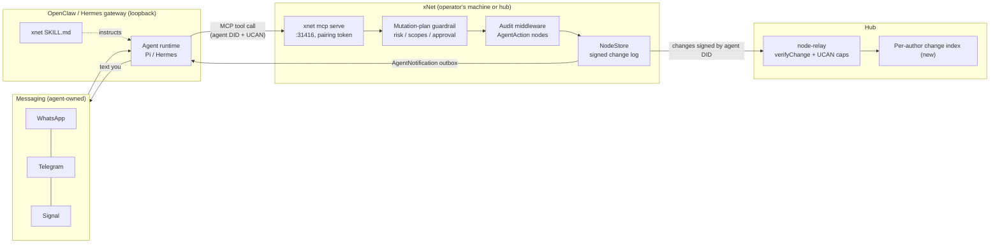
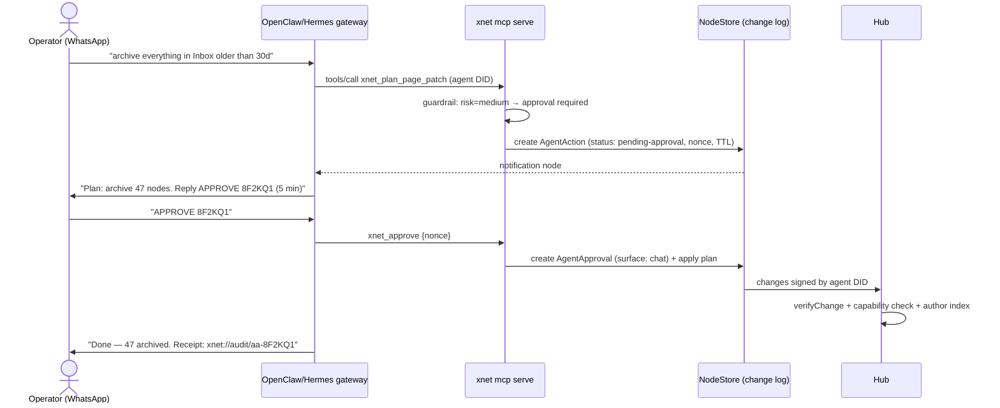
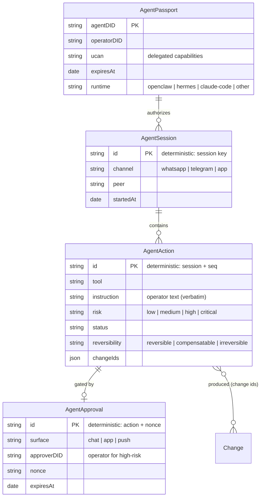
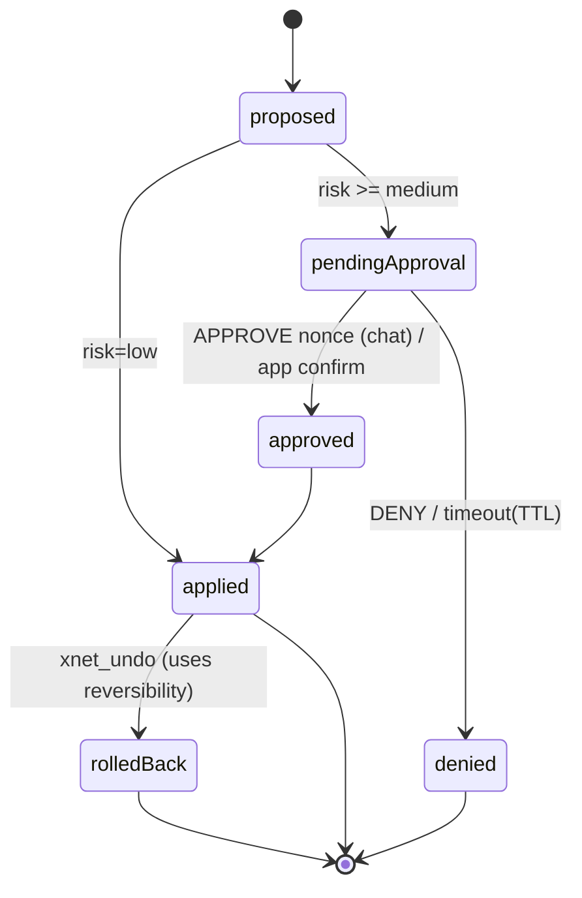

# OpenClaw / Hermes Integration: Signed Agent Audit Trails And A Text Control Plane

> You already text an agent — OpenClaw or Hermes — on WhatsApp, Telegram, or
> Signal. Can xNet's primitives (DIDs, UCANs, the signed hash-chained change
> log, schemas) turn that agent from an unauditable root shell into a scoped,
> attributable, tamper-evidently logged collaborator — and make "work on your
> hub remotely via text" safe enough to actually do?

## Problem Statement

Exploration [0175](0175_[_]_XNET_AS_A_SUBSTRATE_FOR_OPENCLAW.md) and
[`docs/guides/openclaw-integration.md`](../guides/openclaw-integration.md)
answered *how an agent drives xNet*: via the MCP server
(`xnet mcp serve`, stdio or hardened loopback HTTP on :31416), behind the
mutation-plan guardrail. That work treats the agent as a **client**. Two
questions remain open, and they are the ones that matter once the connection
exists:

1. **Track and audit.** When an always-on agent has standing write access to
   your workspace, *what did it actually do last Tuesday at 3am?* OpenClaw's
   native answer is per-session JSONL transcripts in
   `~/.openclaw/agents/<id>/sessions/` — plain files, mutable by any process
   with filesystem access, with documented blind spots (cron jobs, sub-agents,
   and heartbeats log to isolated contexts). Gateway-level audit logging is an
   open upstream feature request (openclaw#13131). xNet's kernel is a signed,
   hash-chained, per-author change log — structurally the thing OpenClaw is
   missing. The question is how to aim it: agent identity, action schemas, an
   author-scoped audit query, and an audit console.

2. **Work on your hub remotely via text.** The agent's superpower is *reach*:
   it already sits in WhatsApp/Telegram/Signal/iMessage. Routed through xNet's
   MCP surface, a text message becomes a hub operation ("archive last week's
   inbox items", "who changed the Q3 doc?", "how much disk is the hub
   using?"). But chat channels are weak authorization surfaces (no E2EE for
   Telegram bots, SIM-swap risk, platform-visible content), and the agent
   relaying your "yes" can also forge your "yes". The question is which
   ceremonies make text-triggered operations safe, and how approvals get
   recorded in the same tamper-evident log as the actions they authorize.

This exploration designs both halves and shows they are the same feature: the
**audit trail is a side effect of making the agent a first-class, scoped
identity in the data model**, and the **approval ceremony is just another
signed node** in that trail.

## Executive Summary

- **Give the agent its own DID; never lend it yours.** Every xNet change
  carries `authorDID`, a per-author `parentHash` chain, and an Ed25519
  signature (`packages/sync/src/change.ts`). If the agent signs with its own
  `did:key` — delegated a *scoped* UCAN from the operator via `createUCAN`
  (`packages/identity/src/ucan.ts`) — then attribution, tamper-evidence, and
  non-repudiation of agent actions fall out of the existing kernel for free.
  Today the integration path shares the operator's client identity, which
  makes agent and human writes indistinguishable. This is the single
  highest-leverage change in the whole design.
- **The audit trail lane is genuinely open.** Prior-art research: every
  mainstream agent-observability stack (OTel GenAI conventions, LangSmith,
  Langfuse, AgentOps) exports traces to a *mutable, operator-controlled*
  backend. The closest thing to signed agent actions is the early-stage
  "Agent Receipts" spec (Ed25519-signed, hash-chained action receipts with a
  **reversibility field**). Nobody ships a datastore where the audit trail
  *is* the data layer. xNet can — the change log already is one.
- **Three small additions close the audit gap**: an `AgentSession` /
  `AgentAction` schema pair (template: `DebugReport`'s deterministic-id +
  lane/status pattern, `packages/data/src/schema/schemas/debug-report.ts`); a
  **per-author index over the change log** (today "all changes by author X"
  is a scan — real gap, flagged in section D below); and an MCP middleware
  that writes one `AgentAction` node per guarded tool call.
- **Don't build messaging bridges; own the data plane.** OpenClaw (~383k
  stars) and Nous Research's Hermes Agent (~216k stars, Feb 2026) each
  maintain 10+ channel integrations (WhatsApp via Baileys, Telegram, Signal,
  iMessage, Discord…). Both consume MCP and both read the same
  AgentSkills-spec `SKILL.md` format xNet already emits
  (`packages/plugins/src/ai-surface/skill.ts`). Let them own channels; xNet
  owns identity, governance, and the audit log. One MCP server serves both.
- **Risk-tier the text control plane.** Reads and low-risk writes execute
  straight from chat. Medium-risk writes require an in-chat typed
  confirmation bound to an expiring nonce (Slack's timestamped-signature +
  typed-confirm pattern). High/critical-risk and outward-facing operations
  require approval in an xNet surface (app/push), *never* in-chat — because
  the agent that relays the request can forge the in-chat reply. Every
  approval or denial is itself a signed `AgentApproval` node, so the ceremony
  lands in the same hash-chained log as the action it gates. No surveyed
  product does this end-to-end.
- **The audit log is detective, not preventive.** The lethal trifecta
  (private data + untrusted content + exfiltration channel) is not solved by
  logging. Prevention stays where it already is: scoped UCANs (never the
  `{with:'*', can:'*'}` anonymous wildcard — 0307's known weakness),
  `toolFilter` least-privilege, the mutation-plan guardrail, and hub-side
  quotas. The trail makes compromise *visible and provable*, which is the
  part nothing else in the agent's stack provides.

**Recommendation in one line:** *ship an "Agent Passport" — a per-agent DID +
attenuated UCAN + `AgentSession`/`AgentAction`/`AgentApproval` schemas + a
per-author change-log index — and risk-tiered chat ceremonies on top of the
existing MCP surface; build zero messaging bridges.*

## Current State In The Repository

### What already works (from 0175 / 0194 / 0196)

- **MCP substrate**: `packages/plugins/src/services/mcp-server.ts`
  (`createMCPServer`, `startStdio()`) exposing `xnet_search`,
  `xnet_read_page_markdown`, `xnet_plan_page_patch`, `xnet_create/update/
  delete/query`, behind `AiSurfaceService` and the mutation-plan guardrail
  (`packages/plugins/src/ai-surface/types.ts` — `AiMutationPlan` with
  `risk`, `requiredScopes`, plan → validate → apply → audit → rollback).
  HTTP transport: `packages/plugins/src/services/mcp-http.ts` via
  `xnet mcp serve --http` (`packages/cli/src/commands/mcp.ts`).
- **Agent bridge daemon** (`packages/devkit/src/bridge-server.ts`,
  `DEFAULT_BRIDGE_PORT = 31416`): loopback-only, Host-header validated,
  Origin-allowlisted, pairing-token gated (`timingSafeEqual`). Endpoints:
  unauthenticated `GET /health`, OpenAI-compatible `POST /v1/chat/completions`
  backed by the user's own `claude`/`codex` CLI, opt-in `POST /run`
  (worktree → gate → checkpoint/rollback). CLI: `xnet bridge serve`
  (`packages/cli/src/commands/bridge.ts`).
- **Connector fabric** (`packages/plugins/src/connectors/define-connector.ts`,
  `.../actions/define-action.ts`): broker-held secrets (hub-side,
  `packages/hub/src/features/broker.ts`), `guardStore` capability proxy
  (`packages/plugins/src/ecosystem/capability-guard.ts:191`), SSRF guard
  `assertPublicUrl` (`packages/plugins/src/actions/ssrf.ts`) enforced in the
  action runner *even for allowlisted hosts*.
- **Inbound webhook seam**: `packages/hub/src/features/webhook-inbox.ts`
  mounts `POST /hooks/:token` — path token is the credential; deliveries
  materialize as nodes stamped with the route's `space` and `schema`
  (default `ExternalItem`). This is the shortest inbound "message → node"
  path for setups without a full MCP loop.
- **Chat as data**: `ChatMessage`/`Channel` schemas
  (`packages/data/src/schema/schemas/chat-message.ts`, `channel.ts`) and
  `sendMessage` in `packages/comms/src/chat/chat-service.ts` — "send" is
  just a node create, so **an agent posts into a channel by creating a
  `ChatMessage` node; no special API**. Deterministic DM ids
  (`packages/comms/src/chat/dm.ts`), structured mentions
  (`mentions.ts`, never parsed from text).
- **Telemetry-to-nodes template**: `DebugReportSchema`
  (`packages/data/src/schema/schemas/debug-report.ts`) — deterministic
  fingerprint ids (repeat events LWW-upsert one node and bump
  `occurrences`), `lane` and `status` lifecycle, `spaceCascadeAuthorization`.
  The cleanest existing pattern for "system events as queryable nodes".

### The kernel primitives the audit trail rides on

`packages/sync/src/change.ts` — every change record carries:

| Field | Audit meaning |
| --- | --- |
| `authorDID` | **who** — the signing identity (this must become the *agent's* DID) |
| `signature` | Ed25519 over the content hash — non-repudiation |
| `hash` / `parentHash` | content-addressed, per-author hash chain — tamper-evidence, gap detection |
| `lamport` + `wallTime` | **when**, in both causal and human time |
| `type` / `payload` | **what** — the mutation itself |

`verifyChange` / `verifyChangeHash` (`change.ts:321,379`) already run on the
hub before `storage.appendNodeChange`
(`packages/hub/src/services/node-relay.ts`), so a forged or resigned agent
history is rejected at ingest.

### The gaps (verified, not vibes)

1. **No per-author audit index.** `authorDID` is on every change and the
   store keys LWW by `{lamport, author}`
   (`packages/data/src/store/store.ts` ~1939, sqlite column
   `lamport_author`), but there is no index or query surface for "all
   changes by author X" — hub-side it's a scan over the append-only log
   (`packages/hub/src/storage/sqlite.ts`). An audit console needs this.
2. **Agent identity doesn't exist as a concept.** The MCP server executes
   with the operator's store identity. Agent writes are attributed to *you*.
3. **Wildcard UCAN weakness (0307).** `createAnonymousSession()` in
   `packages/hub/src/auth/ucan.ts` grants `{with:'*', can:'*'}`, and
   client-side self-issued tokens are effectively root. Delegating an
   *attenuated* UCAN to an agent is meaningless until scoped tokens are the
   norm — this exploration adds a consumer that forces the issue.
4. **`assertPublicUrl` blocks loopback dispatch.** A `defineAction` that
   notifies a *local* OpenClaw/Hermes gateway (`127.0.0.1:18789`) will be
   rejected by the SSRF guard — correctly for marketplace actions, but it
   means hub→agent notification needs the bridge/webhook lane, not the
   action runner (see Options).
5. **No approval primitive.** `AiAgentApproval`
   (`packages/plugins/src/ai/runtime.ts`) is an in-process gate; approvals
   are not recorded as durable, signed data.

## External Research

### OpenClaw (as of 2026-07)

- MIT, TypeScript; ~383k GitHub stars, 500+ contributors; community-run
  after Peter Steinberger joined OpenAI (Feb 2026). Single Node **gateway**
  daemon on loopback `127.0.0.1:18789` (typed WebSocket API + web UIs);
  channels: WhatsApp (Baileys), Telegram, Signal, iMessage, Discord, Slack,
  Matrix, more via plugins. Agent runtime is **Pi** (`createAgentSession()`
  in-process, ~4 tools), model-agnostic (Anthropic/OpenAI/OpenRouter/Ollama).
- **Extension points**: Markdown `SKILL.md` skills (AgentSkills spec — same
  family xNet emits), ClawHub registry (~1,700+ skills, with a documented
  malicious-skill problem), **native MCP client** (`openclaw mcp add`,
  stdio/SSE/streamable-http, per-server tool filters), cron/webhook
  automation, config at `~/.openclaw/openclaw.json`.
- **Security posture**: threat model is explicitly "one trusted operator,
  not a hostile multi-tenant boundary"; sandboxing opt-in; credentials
  plaintext on disk; prompt injection acknowledged unsolved. Jan–Feb 2026:
  tens of thousands of publicly exposed gateways (Censys tracked 21k+;
  independent counts up to ~42k), CVE-2026-25253 (CVSS 8.8 one-click token
  exfiltration → RCE, fixed v2026.1.29), an infostealer targeting
  `~/.openclaw`. **Audit gap**: session JSONL transcripts are mutable local
  files; cron/sub-agent/heartbeat sessions log to isolated contexts;
  gateway-wide audit logging is an open feature request (openclaw#13131).
- **Anthropic Agent SDK credits change (June 15, 2026)** closed the
  flat-rate-subscription arbitrage that fueled the viral wave; the sticky
  core (personal automation over messaging) remains.

### Hermes Agent (Nous Research, the "or Hermes" referent)

- Released Feb 25 2026, MIT; ~216k stars by July — structurally an OpenClaw
  peer: one self-hosted gateway, channels for Telegram/Discord/Slack/
  WhatsApp/Signal/Email/CLI, provider-agnostic models (Nous Portal,
  OpenRouter, OpenAI, custom — not locked to Hermes-4 weights), six exec
  backends (local, Docker, SSH, Modal, Daytona, Singularity).
- Differentiator: a **learning loop** — after solving hard tasks it
  *autonomously writes reusable skill documents* (agentskills.io-compatible),
  plus agent-curated persistent memory and Honcho-based user modeling.
  **Audit implication**: an agent that rewrites its own skills over time is
  *more* in need of a tamper-evident action history, not less — "why did it
  do that?" increasingly means "which self-written skill fired?".
- Because both agents consume MCP and the same skill format, **one xNet
  integration covers both** — "OpenClaw or Hermes" is a single engineering
  target with two logos.

### Agent audit prior art (the lane check)

- **Observability stacks** (OTel GenAI semantic conventions —
  `invoke_agent`/`chat`/`execute_tool` spans; LangSmith; Langfuse;
  AgentOps): all export to mutable operator-controlled backends; content
  capture is opt-in; no tamper-evidence, no user custody, no offline
  verification. Claude Code / Agent SDK ship OTel instrumentation with
  session/user attribution — same mutability caveat.
- **Signed action logs**: Certificate Transparency (RFC 9162) and
  Sigstore/Rekor prove the Merkle/hash-chain + inclusion-proof model at
  internet scale. Applied to agents: **Agent Receipts** spec (each action a
  W3C Verifiable Credential, Ed25519-signed, SHA-256 hash-chained, RFC 3161
  timestamps, and a **reversibility field** declaring undo-ability — the
  one idea worth harvesting directly); Microsoft Agent Governance Toolkit's
  "verifiable compliance receipts" proposal; a handful of early vendors.
  The AIP survey (arXiv 2603.24775) concludes **no implemented protocol yet
  combines offline attenuable delegation + provenance-aware completion
  records** — the field is unclaimed, and xNet's kernel is most of it.
- **Capability delegation**: IETF OAuth WG drafts for agent tokens
  (attenuating-agent-tokens, identity-assertion-authz-grant with RFC 8693
  `act` delegation chains); MCP authorization now mandates OAuth 2.1 + PKCE
  + resource indicators for remote servers; W3C DID v1.1 at Candidate
  Recommendation. xNet's UCAN + `did:key` stack is ahead of, and compatible
  with, where this is heading; blockchain-resolved DIDs are explicitly
  called out as too slow for agent delegation (xNet's `did:key` is not).
- **Chat-as-control-plane**: ChatOps' enduring lesson is that *chat history
  becomes the shared audit log* — and its enduring pitfall is that basic
  bots ship no ACLs and no durable audit. Home Assistant × Telegram uses
  chat-ID allowlists only, no replay protection, hand-rolled confirmations;
  Telegram bot traffic is **not E2EE** (platform sees your control plane).
  The robust pattern is Slack's: signed requests with timestamps (reject
  >5 min — replay defense) plus typed-confirmation ceremonies for
  destructive ops. xNet can go one better: make the approval itself a
  signed record in the same log the action commits to.
- **Lethal trifecta** (Willison): private data + untrusted content +
  external comms = exploitable, and guardrail classifiers don't hold
  (adaptive red-teaming bypassed 12/12 published defenses). Architecture
  answers: CaMeL-style capability-tracked data flow, taint-then-approve
  policies, and *removing a leg by design*. For this integration: the agent
  channel is untrusted content by definition, so the leg to cut is
  unattended authority — attenuated UCANs and risk-tiered ceremonies.

## Key Findings

1. **Attribution is the keystone.** Every downstream feature — audit query,
   console, revocation, "undo everything the agent did since 3am" — reduces
   to *the agent signs with its own DID*. The kernel already indexes,
   verifies, and chains by author; integration work is issuance (mint a
   `did:key` per agent), delegation (operator-signed UCAN naming spaces,
   schemas, actions, TTL), and enforcement (hub session capabilities derive
   from the delegation, not the anonymous wildcard).
2. **The change log *is* the audit trail, but it needs an action-level
   view.** Change records capture writes; they don't capture *reads*, tool
   calls that touched nothing, or the natural-language instruction that
   triggered a write. The `AgentAction` schema fills that gap at the
   semantic layer (one node per tool call, linking instruction → plan →
   resulting change ids), while the raw change log remains the
   tamper-evident substrate underneath. Two layers, one log.
3. **Approvals belong in the log, not in process memory.** Recording
   `AgentApproval` nodes (who approved, over which surface, binding nonce,
   expiry) makes the *authorization* as auditable as the action — and
   because approval nodes are signed by the **operator's** DID while action
   nodes are signed by the **agent's** DID, the log structurally proves the
   human was (or wasn't) in the loop.
4. **In-chat approval is forgeable by the agent that relays it; tier it.**
   The gateway sits between you and the hub, so a compromised agent can
   fabricate your "APPROVE". Acceptable for medium risk (defense in depth:
   nonce + TTL + notification fan-out to a second surface), unacceptable
   for high/critical — those confirm in an xNet surface where the operator's
   own key signs the approval node. This is the CaMeL/taint lesson applied
   with xNet's own signing machinery.
5. **Hub→you notification should ride the agent's channels, via the
   outbox.** Instead of teaching the hub to speak WhatsApp (or punching the
   SSRF guard), let the agent *poll/subscribe* to an `AgentNotification`
   lane it already has read capability for — the same "everything is a
   node" move as chat. The agent's heartbeat turns new notification nodes
   into texts. Zero new transport, works identically for OpenClaw and
   Hermes, and the notification history is itself durable and synced.
6. **This is a marketing-grade differentiator, not just plumbing.** "Your
   agent, on a leash you can prove" — signed action receipts, scoped
   capability, operator-signed approvals, offline-verifiable history — is
   exactly what the OpenClaw security discourse (exposed gateways, CVE,
   malicious skills) primed the market to want, and what no observability
   vendor structurally can offer on a mutable backend.

## Options And Tradeoffs

### Where does the integration live?

| Option | Shape | Pros | Cons | Verdict |
| --- | --- | --- | --- | --- |
| **A. Build native channel bridges** (xNet speaks WhatsApp/Telegram itself) | New `packages/comms` transports | No third-party agent needed | Enormous maintenance (Baileys churn, ToS risk), duplicates OpenClaw/Hermes's core competency, xNet becomes the thing running an unsandboxed messaging surface | **Reject** |
| **B. Agent owns channels, xNet owns data + governance + audit** | MCP substrate (exists) + Agent Passport + audit schemas + notification outbox | Rides two ~200k–400k-star ecosystems; one integration, every MCP agent; xNet's differentiators (signing, UCAN, guardrail) do the work | Depends on agent's gateway security for channel leg; in-chat approvals capped at medium risk | **Recommended** |
| **C. Hub-hosted agent** (run Pi/Hermes runtime inside the hub) | New hub feature | Single deployable; no local gateway | Violates both agents' "one trusted operator, not multi-tenant" threat model; hub inherits exec/sandboxing risk; heavy | Defer (labs, if ever) |

### Agent identity

| Option | Pros | Cons | Verdict |
| --- | --- | --- | --- |
| Share operator's DID (status quo) | Zero work | No attribution, no revocation, no audit — the agent *is* you | Reject |
| **Per-agent `did:key` + operator-delegated UCAN** | Attribution + attenuation + revocation by expiry/rotation; uses `createUCAN`/`verifyUCAN` as-is | Requires hub to honor scoped capabilities (forces the 0307 fix — a feature, not a bug) | **Recommended** |
| Hub-issued ephemeral session DIDs per conversation | Fine-grained forensics | Explodes author cardinality in the LWW tiebreak/index; harder UX | Overkill now; revisit for multi-agent fleets |

### Approval ceremony (risk-tiered, from the mutation-plan `risk` field)

| Risk | Ceremony | Where recorded |
| --- | --- | --- |
| `low` / reads | Execute immediately | `AgentAction` node (agent-signed) |
| `medium` | In-chat typed confirm: agent sends plan summary + 6-char nonce; operator replies `APPROVE <nonce>` within TTL (default 5 min, Slack-style staleness rejection) | `AgentAction` + `AgentApproval` (agent-signed, `surface: 'chat'` — marked lower-assurance) |
| `high` / `critical` / outward-facing / destructive | Push/app approval in an xNet surface; chat gets a "pending approval" link only | `AgentApproval` signed by the **operator's** DID (`surface: 'app'`) — structurally unforgeable by the agent |

### Hub → operator notification path

| Option | Pros | Cons | Verdict |
| --- | --- | --- | --- |
| `defineAction` dispatch to local gateway webhook | Reuses action runner | `assertPublicUrl` correctly blocks loopback; punching it is an SSRF regression | Reject |
| Hub pushes to agent's public webhook (VPS setups) | Works for cloud-hosted agents | Splits behavior by deployment; exposes agent endpoint | Optional later |
| **`AgentNotification` outbox nodes; agent polls/subscribes via MCP** | No new transport; durable, synced, auditable; identical for OpenClaw + Hermes + any future client | Latency = agent heartbeat interval (both agents heartbeat natively) | **Recommended** |

## Recommended Architecture



The remote-work loop, with the medium-risk ceremony:



Audit data model:



`AgentAction.status` lifecycle:



## Example Code

### 1. The `AgentAction` schema (template: `debug-report.ts`)

```ts
// packages/data/src/schema/schemas/agent-action.ts
import { defineSchema } from '../define'
import { text, select, json, date, createdBy } from '../properties'
import { spaceCascadeAuthorization } from './space-authorization'

export const AgentActionSchema = defineSchema({
  name: 'AgentAction',
  namespace: 'xnet://xnet.fyi/',
  properties: {
    session: text(),          // AgentSession id (deterministic)
    tool: text(),             // e.g. 'xnet_apply_page_markdown'
    instruction: text(),      // operator's message, verbatim
    risk: select(['low', 'medium', 'high', 'critical']),
    status: select([
      'proposed', 'pending-approval', 'approved',
      'denied', 'applied', 'rolled-back',
    ]),
    // harvested from the Agent Receipts spec — enables undo tooling
    reversibility: select(['reversible', 'compensatable', 'irreversible']),
    changeIds: json<string[]>(), // kernel change ids this action produced
    createdBy: createdBy(),      // = the agent's DID (attribution)
    at: date(),
  },
  authorization: spaceCascadeAuthorization(),
})
```

Deterministic ids (`agent-action:<sessionId>:<seq>`) follow the
`DebugReport` fingerprint pattern so retries LWW-upsert instead of
duplicating. Registration in `packages/data/src/schema/schemas/index.ts`;
the devtools Tier-2 auto-generator seeds it with no seeder edit
(`packages/devtools/src/seed/auto-generator.ts`).

### 2. Minting the Agent Passport

```ts
import { createUCAN } from '@xnetjs/identity'

// Operator delegates a *narrow* capability set to the agent's own did:key.
const passport = await createUCAN({
  issuer: operatorDID, issuerKey: operatorSigningKey,
  audience: agentDID, // generated once per agent, stored by the gateway
  capabilities: [
    { with: `xnet://space/${inboxSpaceId}`, can: 'node/create' },
    { with: `xnet://space/${inboxSpaceId}`, can: 'node/update' },
    { with: `xnet://schema/AgentAction`,    can: 'node/create' },
    // note: no delete, no share, no admin, no other spaces
  ],
  expiration: Date.now() + 7 * 24 * 3600 * 1000, // rotate weekly
})
```

The hub session (`packages/hub/src/auth/ucan.ts` → `AuthSession
.capabilities`) derives from this delegation instead of the anonymous
wildcard — which is precisely the 0307 remediation, given its first real
consumer.

### 3. Audit middleware around the MCP tool dispatch

```ts
// packages/plugins/src/services/mcp-audit.ts (sketch)
export function withAudit(callTool: CallTool, store: NodeStore,
                          session: AgentSessionRef): CallTool {
  return async (name, args) => {
    const action = await store.create(AgentActionSchema, {
      id: actionId(session, name),
      session: session.id, tool: name,
      instruction: session.lastOperatorMessage,
      risk: planRisk(name, args), status: 'proposed',
      reversibility: toolReversibility(name),
    })
    const result = await callTool(name, args) // guardrail runs inside
    await store.update(action.id, {
      status: result.applied ? 'applied' : result.status,
      changeIds: result.changeIds ?? [],
    })
    return result
  }
}
```

### 4. What texting your hub looks like

```
you  → "what changed in Q3 Planning this week?"
agent→ "12 changes: 9 by you, 3 by agent:openclaw-home.
        Latest: 'Budget v3' edited yesterday 21:04."

you  → "archive inbox items older than 30 days"
agent→ "Plan: archive 47 nodes in Inbox (risk: medium).
        Reply APPROVE 8F2KQ1 within 5 minutes."
you  → "APPROVE 8F2KQ1"
agent→ "Done. Receipt xnet://audit/aa-8F2KQ1 — 47 changes,
        signed by agent DID, reversible via undo."

you  → "delete the old Clients space"
agent→ "That's destructive (risk: critical). I can't take chat
        approval for this — confirm in the xNet app: [link].
        Nothing happens until you do."
```

## Risks And Open Questions

- **The gateway is still the weak link.** xNet cannot fix OpenClaw's
  plaintext credentials or exposed-gateway hygiene; it can only bound the
  blast radius (scoped UCAN, weekly expiry, tool filters) and make
  compromise evident (audit trail). The hardening guidance in
  `docs/guides/openclaw-integration.md` remains mandatory reading.
- **Instruction text is sensitive.** `AgentAction.instruction` stores your
  messages verbatim in the workspace. OTel GenAI's default is
  content-*off* for a reason. Mitigation: store instructions in a
  dedicated agent-audit Space with tight read authorization, and offer a
  redacted mode (hash of instruction only) — decide the default before
  shipping.
- **Author-index cost.** A per-author index over the hub change log adds a
  write-path index on a hot table (0318's cliffs apply). Scope it to an
  index on the existing author column + a paginated query route, not a
  materialized view.
- **Nonce approval is only as strong as session isolation.** If the
  operator's WhatsApp thread is bridged into a group, `dmScope` /
  binding config on the agent side determines who can type `APPROVE`.
  Document: approvals only honored from the paired peer id, and the
  `AgentApproval` node records the channel peer for forensics.
- **UCAN revocation.** Expiry + rotation is the near-term answer; true
  revocation lists are an open kernel question (ucan-wg revocation spec is
  young). A stolen passport is live until expiry — keep TTLs short.
- **Does `xnet_approve` belong in the MCP tool surface?** Exposing the
  approval tool to the agent means the agent *mechanically* can call it;
  the nonce (never included in the pending-approval payload the agent can
  read — delivered only via the operator-visible message) is the control.
  Verify the nonce never transits a context the model can read back.
  Alternative: approval endpoint on the local API (:31415) instead of MCP.
- **Two-agent households.** Multiple passports (OpenClaw + Hermes + Claude
  Code) are natively supported by per-agent DIDs — but the LWW tiebreak is
  `authorDID`-ordered, so agent DIDs participate in conflict resolution
  identically to humans. Expected, but worth a test.

## Implementation Checklist

Phase 1 — Agent Passport (identity + capability):

- [x] `xnet agent enroll <name> --runtime openclaw|hermes|other` CLI:
      generates agent `did:key`, mints operator-signed scoped UCAN,
      prints gateway config snippet (extends
      `packages/cli/src/commands/mcp.ts` pairing output)
- [x] Store passports as `AgentPassport` nodes (schema in
      `packages/data/src/schema/schemas/`, registered in `schemas/index.ts`)
- [x] MCP server accepts agent-scoped auth: tool calls execute against a
      store identity = agent DID (writes signed by agent key held locally
      by `xnet mcp serve`, never by the gateway)
- [x] Hub: derive `AuthSession.capabilities` from presented UCAN instead of
      anonymous wildcard when a passport token is presented
      (`packages/hub/src/auth/ucan.ts`) — 0307 remediation, first consumer

Phase 2 — Audit trail:

- [x] `AgentSession` / `AgentAction` / `AgentApproval` schemas
      (deterministic ids, `spaceCascadeAuthorization`, reversibility field)
- [x] Audit middleware wrapping `AiSurfaceService.callTool` (one
      `AgentAction` per call, linked `changeIds`)
- [x] Per-author index + query: hub storage index on change author,
      `GET /audit/authors/:did/changes?since=` (paginated), UCAN-gated
- [x] Workbench audit console: table view over `AgentAction` filtered by
      agent DID, with per-action change diffs (reuse DebugReport console
      patterns from 0315)
- [x] `xnet_undo <actionId>` honoring `reversibility` (compensating
      changes, not history rewrite)

Phase 3 — Text control plane:

- [x] Risk-tiered approval ceremony in the guardrail: low=auto,
      medium=chat nonce (TTL 5 min, staleness-rejected),
      high/critical=xNet-surface only; `AgentApproval` node written for
      every decision, operator-signed for high-risk
- [x] `AgentNotification` outbox schema + MCP subscription/poll tool; ship
      notification → text relay instructions in the skill
- [x] Update the ClawHub skill + publish a Hermes-compatible skill
      (`docs/integrations/openclaw/xnet-workspace-skill.md` — same
      AgentSkills spec covers both) with the ceremony script
- [x] Update `docs/guides/openclaw-integration.md`: enrollment flow,
      approval tiers, audit console pointer; add a Hermes section

Housekeeping:

- [ ] Changesets for touched publishable packages (`data`, `identity`,
      `plugins`, `hub` are in the fixed core — bump from the diff; new
      schemas + new exports = minor)
- [ ] New surface lands in scoped sub-barrels per the 0276 policy (e.g.
      `packages/data/src/schema/schemas/index.ts`, not root barrel churn)

## Validation Checklist

- [ ] Enroll a real OpenClaw gateway with a passport; verify a tool-call
      write lands with `authorDID = agent DID` and `verifyChange` passes
      hub-side
- [ ] Attempt a write outside the delegated capability set (other space,
      `delete`) → rejected at hub with capability error, `AgentAction`
      records the denial
- [ ] Tamper test: mutate an agent session transcript on disk *and* attempt
      to replay an altered change → hub rejects (hash/signature); audit
      console still shows the true history
- [ ] Medium-risk ceremony end-to-end over Telegram: nonce expires after
      TTL; stale/wrong nonce rejected; `AgentApproval` node present with
      `surface: 'chat'` and correct peer id
- [ ] High-risk op requested via chat → refused in-chat, approvable only in
      app; resulting `AgentApproval` is operator-signed
- [ ] Author-index query returns the agent's full change history in
      paginated order on a 100k-change log without a full scan (explain
      plan / timing)
- [ ] `xnet_undo` on a reversible action produces compensating changes and
      flips status to `rolled-back`
- [ ] Same skill + passport flow works against a Hermes Agent gateway
      (MCP streamable-http)
- [ ] Seed coverage test green (auto-generator covers the new schemas);
      full `vitest` from root

## References

- Repo: `docs/guides/openclaw-integration.md`;
  `docs/explorations/0175_[_]_XNET_AS_A_SUBSTRATE_FOR_OPENCLAW.md`;
  0194 (agent bridge), 0196 (agent-native connectors), 0252 (AI chat box),
  0304 (schema authz CRUD split), 0307 (node/change flow security),
  0315 (first-party telemetry), 0161 (token-efficient agent interfaces)
- Code: `packages/sync/src/change.ts`, `packages/identity/src/ucan.ts`,
  `packages/hub/src/auth/ucan.ts`, `packages/hub/src/features/
  webhook-inbox.ts`, `packages/plugins/src/services/mcp-server.ts`,
  `packages/plugins/src/ai-surface/types.ts`,
  `packages/data/src/schema/schemas/debug-report.ts`,
  `packages/devkit/src/bridge-server.ts`
- OpenClaw: https://docs.openclaw.ai/concepts/architecture ·
  https://docs.openclaw.ai/gateway/security ·
  https://docs.openclaw.ai/tools/skills ·
  https://github.com/openclaw/openclaw/issues/13131 (audit-log request) ·
  CVE-2026-25253 writeups (SOCRadar, runZero) ·
  https://www.microsoft.com/en-us/security/blog/2026/02/19/running-openclaw-safely-identity-isolation-runtime-risk/
- Hermes Agent: https://github.com/nousresearch/hermes-agent ·
  https://hermes-agent.nousresearch.com/docs/
- Audit prior art: https://agentreceipts.ai/specification/overview/ ·
  https://opentelemetry.io/blog/2026/genai-observability/ ·
  https://microsoft.github.io/agent-governance-toolkit/proposals/verifiable-compliance-receipts/ ·
  AIP survey https://arxiv.org/pdf/2603.24775 · RFC 9162 (CT v2) ·
  https://openssf.org/blog/2025/10/15/announcing-the-sigstore-transparency-log-research-dataset/
- Control-plane/security patterns:
  https://simonwillison.net/2025/Jun/16/the-lethal-trifecta/ ·
  https://simonwillison.net/2025/Apr/11/camel/ (CaMeL, arXiv 2503.18813) ·
  https://stackstorm.com/2015/12/10/chatops_pitfalls_and_tips/ ·
  https://www.home-assistant.io/integrations/telegram_bot/ ·
  IETF draft-ietf-oauth-identity-assertion-authz-grant ·
  https://modelcontextprotocol.io/specification/2025-11-25/basic/authorization
