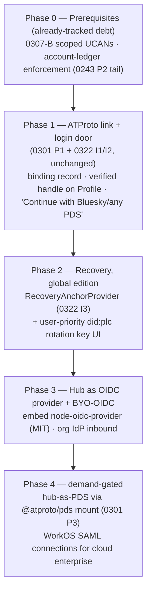
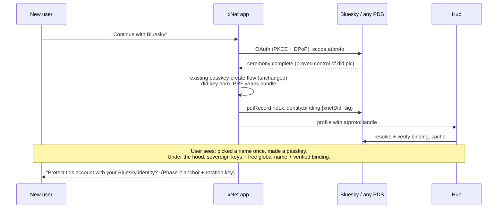
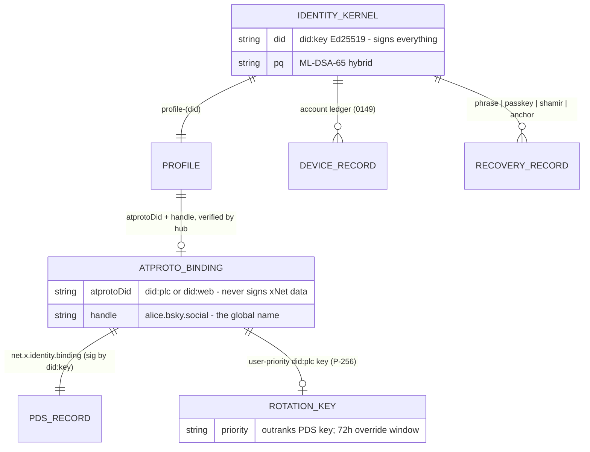

# OAuth And Shared Global Identity

## Problem Statement

xNet identity today is a client-owned `did:key` (Ed25519 + optional PQ hybrid)
unlocked by a passkey. It is sovereign, recoverable (0243), and completely
**local**: nothing binds `did:key:z6Mk…` to a human-recognizable name that works
across workspaces, hubs, and the wider internet. Meanwhile "sign in" in the
cloud offering means WorkOS AuthKit — a hosted, closed service that the MIT
core must never depend on.

The prompt asks: what should **shared global identity + OAuth** look like?
Specifically:

- Is this an ATProto PDS? Is it something signed and minted by a hub?
- What does recovery look like? Do we use a blockchain? 2FA? WorkOS?
- It must be MIT OSS and "just work" for most individuals and orgs; WorkOS is
  acceptable in the cloud offering early on, but identity is mission-critical
  and should eventually be fully integrated.
- It has to feel really good while being recoverable and super secure.
- Turning hubs into de facto PDSes might be the best route; a hub runs for
  ~$5/mo but global identity should ideally be free — maybe build on Bluesky's
  free PDS offering. Maybe Keybase-style directories are an option.

## Executive Summary

**Split the question into three layers and answer each differently.**

1. **Signing root (keep, unchanged):** the `did:key`/Ed25519 kernel in
   `packages/identity` stays the only thing that signs changes. No external
   system — not ATProto, not WorkOS, not a chain — ever holds or replaces it.
   Keyhive reached the same conclusion independently: identity binding is a
   layer *above* the capability system, not inside it.

2. **Global name + consumer login (adopt ATProto, don't run it):** the free,
   MIT-compatible, registration-free global identity layer the prompt is
   looking for **already exists**: ATProto handles + `did:plc` + the ATProto
   OAuth profile. Anyone can create a free account on Bluesky's hosted PDS (no
   paid tier), and any client can authenticate against **any** PDS with no
   pre-registration (client_id is a URL to a metadata document). Explorations
   0301/0322 already designed the integration; this exploration promotes it
   from "nice bridge" to **the** consumer global-identity answer. xNet does
   not need to mint identity, run PDSes, or run a directory — exactly the
   "build on Bluesky's free PDS offering" instinct in the prompt.
   **Hub-as-PDS stays demand-gated** (0301 Phase 3): mounting the official
   `@atproto/pds` next to a hub is a fine future upgrade (it fits the same
   $5/mo VPS: 1 GB RAM, 1 vCPU), but it is not required for global identity
   to work on day one, and the early-federation caps (10 accounts/PDS) make
   it a poor default today.

3. **Org login + hub as identity provider (the OAuth part, MIT):** two
   directions:
   - **Inbound** (xNet as relying party): "Continue with Bluesky (or any
     PDS)" for individuals; "bring your own OIDC" for orgs — an org points
     its hub at its existing IdP (Google Workspace, Entra, Keycloak, …), the
     Tailscale pattern. WorkOS stays exactly where it is: the **FSL cloud**
     billing/SSO door (`packages/cloud/src/identity/workos.ts`), free to 1M
     MAU via AuthKit, $125/connection for enterprise SAML — never imported by
     the hub.
   - **Outbound** (hub as IdP): embed **`node-oidc-provider`** (MIT, the only
     certified OP that mounts in-process into a Node server) into the hub as
     an optional feature. A family/team hub then *is* the OIDC provider for
     everything else that org runs (Grafana, Gitea, whatever) — the `tsidp`
     pattern, and the honest version of "hubs mint identity": hubs mint
     **sessions and attestations**, never root keys.

**Recovery:** already largely shipped (0243: recovery phrase, synced passkey,
Shamir guardians, PIN escrow engine, account/device ledger schemas). What this
exploration adds is (a) finishing ledger **enforcement** (0243 P2 follow-ups),
and (b) harvesting `did:plc`'s best idea — **priority-ordered rotation keys
with a 72-hour override window** — as the recovery model for the *global*
layer: the PDS holds a low-priority key for convenience, the user's xNet
identity can enroll a **higher-priority** rotation key so the PDS can never
permanently take the global name. That single move fixes the biggest ATProto
criticism ("your PDS operator owns your identity") for xNet users.

**Blockchain: no.** Microsoft deprecated ION (the flagship Sidetree DID
method) in Dec 2023 for "little uptake" and moved to `did:web`; Farcaster —
the best-designed chain-registry identity — was sold to a single company
(Neynar, Jan 2026) anyway. A signed hash-chained log plus a directory gives
the same auditability without wallets or gas; that is literally `did:plc`'s
design position and also what our own account ledger (0149/0243) already is.

**2FA:** the passkey (with user verification) *is* the primary factor; PRF now
works on 100% of synced-provider creates and can wrap the key bundle. 2FA in
the classic sense applies to the two custodial doors only: WorkOS sessions
(AuthKit MFA, already available) and the hub admin/dashboard (add TOTP/second
passkey). Never bolt SMS onto the sovereign path.

## Current State In The Repository

What **exists** (shipped code) vs what is **design-only** matters a lot here.

### Identity kernel — EXISTS, MIT

- `packages/identity/src/did.ts` — canonical `did:key` over Ed25519
  (multicodec `0xed01`, base58btc): `createDID`, `parseDID`,
  `generateIdentity`, `identityFromPrivateKey`.
- `packages/identity/src/types.ts` — `HybridKeyBundle` adds ML-DSA-65 +
  ML-KEM-768; new identities get PQ keys by default.
- `packages/identity/src/passkey/` — WebAuthn create/unlock, **PRF key
  derivation** (`derive.ts`), non-PRF fallback, IndexedDB storage
  (`storage.ts`), 7-day resumable sessions under a non-extractable AES-GCM
  key (`session.ts`).
- `packages/data/src/schema/schemas/profile.ts` — `Profile` node keyed
  `profile-<did>`; `handle` is a workspace-unique slug, DID remains source of
  truth. Profile rooms: world-readable, subject-only-writable
  (`packages/hub/src/ws/authorize.ts`).

### Recovery — EXISTS, MIT (0243, checked off)

- `packages/identity/src/recoverable.ts` — recovery-phrase-born identities
  (24-word default over a 64-word list; deterministic DID + X25519 from the
  mnemonic; PQ keys regenerate rather than recover).
- `packages/identity/src/seed-recovery.ts` — seed-derived bundles + **Shamir
  shares** (`createRecoveryShares`/`recoverFromShares`, threshold ≥ 2).
- `packages/identity/src/escrow.ts` — privacy-preserving PIN escrow envelope
  (cloud can't open alone); custodial escrow deliberately declined.
- `packages/data/src/schema/schemas/account-ledger.ts` — `AccountRecord` /
  `DeviceRecord` / `RecoveryRecord` / `RevocationRecord` (the 0149 ledger) +
  content-key re-wrap on device admit/revoke. **Gap:** the docstring flags
  signing/epoch *enforcement* and the cloud-binding migration as unshipped
  follow-ups — records exist, enforcement is not wired.

### Auth surfaces — EXISTS, with one known hole

- `packages/identity/src/ucan.ts` + `packages/hub/src/auth/ucan.ts` — UCAN
  bearer tokens over WS (`sec-websocket-protocol: xnet-auth.<token>`) and
  HTTP; capability model in `packages/hub/src/auth/capabilities.ts`.
- **The hole (0307 item B):** `packages/react/src/provider/use-hub-auth-token.ts`
  self-mints a wildcard-ish UCAN (`hub/*`, `backup/*`, `files/*`, `query/*`,
  24 h), and `auth: false` hubs create anonymous `{with:'*', can:'*'}`
  sessions. Any global-identity work that doesn't first make hub authz
  *mean something* is decorative. 0335 lists this as a release blocker.
- Share links (`packages/hub/src/routes/share-links.ts`) use fragment
  secrets; X25519 key registry at `packages/hub/src/routes/keys.ts`.

### Cloud identity — EXISTS, FSL (not MIT)

- `packages/cloud/src/identity/workos.ts` — `WorkOSAuthKitProvider
  implements BillingIdentityProvider`; raw fetch against WorkOS User
  Management (authorize / authenticate-with-code / getUser). SSO/SCIM
  anticipated in comments, not coded.
- `packages/cloud/src/identity/binding.ts` — the **two-identity model**
  already in production shape: custodial billing identity (WorkOS user) ⇄
  sovereign data identity (`did:key`), dual-proof `bindIdentities`
  (billing session + `DidChallenge`), `recoverPaidAccount` (restores account
  + hub, *not* encrypted data), `completeRebind`, `accountSubjectForDid`.
- `apps/cloud/src/verify-did.ts`, `nonce.ts` — real Ed25519 DID-challenge
  verifier over single-use server nonces (0243 P0).
- Boundary rule (`packages/cloud/README.md`): **never import
  `@xnetjs/cloud` from the hub**; control plane → hub only via the signed
  `HUB_PLAN` entitlements token (`packages/entitlements/`, MIT).

### ATProto — DESIGN-ONLY

No atproto/PKCE/DPoP/PLC code exists anywhere in `packages/` or `apps/`.
The designs are 0301 (bridge-don't-merge; hub-as-PDS demand-gated Phase 3),
0322 (login door, ceremony-not-session, `RecoveryAnchorProvider`
generalization), 0324 (type-level seams only; zero-knowledge trust
mandatory). This exploration builds on them rather than re-deriving.

## External Research

Highlights from the mid-2026 landscape scan (full citations in References).

### ATProto is quietly becoming the thing the prompt wishes existed

- **PLC directory is spinning out of Bluesky** into an independent Swiss
  association (announced Sept 2025) — the "is the directory just Bluesky?"
  objection is being retired, though board composition was still settling.
- **ATProto OAuth** (an OAuth 2.1 profile): `client_id` **is a URL** to a
  public client-metadata JSON — no registration anywhere; PKCE S256 and
  DPoP (with server nonces) mandatory; `atproto` scope; granular scopes
  live on bsky.social and rolling out to self-hosted PDS. The spec
  explicitly supports **auth-only, OIDC-like use without touching repo
  data**, and the OAuth flow can even *initiate account creation* on a
  chosen PDS. FedCM (browser-native "sign in with ATProto") is on the
  early-2026 roadmap.
- **Bluesky's hosted PDS is free with no paid tier** — the "global identity
  should be free" requirement is satisfied by pointing at it, not by xNet
  subsidizing anything.
- **Self-hosted PDS** fits the hub's VPS class (1 GB RAM, 1 vCPU, ~50 GB),
  but early-federation caps (10 accounts/PDS, 10k evts/day) make it a
  hobbyist tier today.

### did:plc recovery is the model to steal

1–5 **priority-ordered rotation keys** (secp256k1/P-256); a higher-priority
key can nullify a lower-priority key's operations **within 72 hours**
(forking the log at a CID); everything lands in a permanent public audit
log. In practice the PDS holds the rotation keys and nobody enrolls their
own (there's a CLI — `goat account plc add-rotation-key` — but no UI), which
produces the standing criticism: *"your PDS operator can post as you —
cryptographically indistinguishable."* An app that enrolls a
**user-controlled higher-priority key by default** would have the best
identity-recovery story in the ecosystem. xNet can be that app.

### Self-hostable IdPs: only two fit next to a $5 hub

Keycloak (JVM, heavy), Authentik (3 processes + Postgres), Zitadel (**went
AGPL in Mar 2025** — disqualifying for MIT bundling), Ory (microservice
sprawl), Hanko (AGPL core), SuperTokens (separate core service). The two
that fit:

- **`node-oidc-provider`** (panva) — MIT, certified OP, **mounts in-process
  into a Node server**. Zero extra footprint; you bring the authn (we have
  passkeys). The only credible "embed an AS in the hub" option.
- **rauthy** — Apache-2.0 Rust single binary, ~35–57 MB RAM, embedded DB,
  passkey-only accounts. The credible "sidecar" option if we ever want the
  AS out-of-process.

### WorkOS 2026

AuthKit free to **1,000,000 MAU**; enterprise SAML/directory sync
**$125/connection/mo** (tiering down at volume). Perfect for the FSL cloud
tier; categorically wrong as an identity root for MIT self-hosters.

### Keybase is dead; its good ideas already live here

Zombie since the 2020 Zoom acquihire (life-support commits only;
keybase.pub shut 2023). Its two durable ideas: per-device keys in a signed
append-only **sigchain** (→ our 0149 account ledger *is* one) and **social
proofs** binding keys to existing identities (→ the 0301
`net.x.identity.binding` record *is* one, with ATProto as the proof
surface). Successors (Keyoxide, keys.pub) are niche; nothing to build on.

### Passkeys/PRF matured

Synced providers (iCloud Keychain, Google Password Manager) hit **100%
PRF-on-create** in Q1 2026 tests; Windows Hello does PRF after the Feb 2026
update (Win10 never); Bitwarden/Dashlane ship PRF-decrypted vaults in
production. FIDO **CXF is a standard (Aug 2025)** and Apple shipped CXP in
iOS 26 — passkey portability is becoming real. Standing rule stays: PRF is
an enhancement; a non-passkey recovery path (we have three) is mandatory.

### Blockchain reality check

Microsoft **deprecated ION** (Dec 2023, "little uptake") → `did:web`. ENS
retreated from its L2 back to mainnet-only (Feb 2026) — fine as an optional
vanity handle, not an identity root (wallets + gas). Farcaster's onchain
IdRegistry has the space's best recovery design (separate custody +
recovery addresses) and *still* ended up owned by one company (Neynar
acquired the protocol Jan 2026). Every property we want — auditability,
rotation, recovery — is achievable with signed logs + a directory.

### Prior-art patterns that work

| Pattern | Source | xNet translation |
|---|---|---|
| Outsource the account, own the device keys | Tailscale (OIDC-only login, node keys native, `tsidp` to re-export identity) | Hub trusts external IdPs inbound; hub *is* an IdP outbound; `did:key` stays native |
| Priority rotation keys + time-boxed override | did:plc, Farcaster recovery address | User key outranks PDS key; hub key (if any) lowest priority |
| Identity binding above the crypto layer, pluggable | Ink & Switch Keyhive | Bindings are Profile-schema data + PDS records, not kernel changes |
| Raw key as the identity | Nostr — **the anti-pattern** ("no real recovery") | Never expose `did:key` as the user-facing name |

## Key Findings

1. **The three questions in the prompt are three different layers.** "Who
   signs changes" (kernel, solved), "what is your name everywhere" (global
   namespace, unsolved), and "how do sessions/orgs authenticate" (OAuth,
   partially solved in FSL cloud only). Every bad identity system in the
   prior art collapses at least two of these into one.

2. **ATProto is the only registration-free, free-of-charge, recoverable
   global identity with real adoption.** OIDC federation dies at consumer
   scale because big IdPs refuse anonymous dynamic client registration;
   IndieAuth solved it for people with domains; ATProto solved it for
   everyone (client_id-as-URL + handle discovery + recoverable DID). And we
   get it without operating anything.

3. **"Hub as PDS" is the wrong first move but the right option to keep.**
   Global identity must survive the hub dying (hubs are $5 commodity boxes;
   people's names should not be hostage to them). The de facto PDS framing
   is right *directionally* — hubs should participate in identity — but the
   right participation is: verifier of bindings, OIDC provider for the org,
   optional low-priority recovery participant, and (later, demand-gated)
   literal PDS host via `@atproto/pds`.

4. **Recovery is mostly done; what's missing is enforcement and the global
   layer.** 0243 shipped phrase/passkey/Shamir/escrow. The gaps: account
   ledger enforcement (signing/epoch), and rotation-key sovereignty for the
   ATProto name. Nothing new needs inventing — did:plc's window model and
   our ledger already rhyme.

5. **The wildcard UCAN (0307-B) gates everything.** Until hub capabilities
   are least-privilege and tied to verified DIDs, "identity" at the hub is
   cosmetic. This is also a 0335 release blocker, so it is a prerequisite,
   not part of this plan's scope.

6. **WorkOS's role is settled and correct**: custodial billing/SSO door in
   FSL cloud, free to 1M MAU, enterprise SAML at $125/connection. The
   existing `BillingIdentityProvider` abstraction is exactly the seam that
   lets ATProto and WorkOS be siblings behind one interface
   (`RecoveryAnchorProvider`, per 0322).

## Options And Tradeoffs

### The global-namespace question

| Option | Free? | MIT-clean? | Recovery | Verdict |
|---|---|---|---|---|
| **A. ATProto identity (handles + did:plc), no PDS ops** | Yes (Bluesky hosted PDS free) | Yes (`@atproto/oauth-client` deps, dual-licensed MIT/Apache) | did:plc rotation keys; add user-priority key | **Adopt** |
| B. Hub-minted identity (hub signs/mints DIDs) | Runs on user's $5 hub | Yes | Hub = SPOF for your *name*; re-invents PLC without the directory | Reject as root; keep hub as verifier/IdP |
| C. Hub as literal PDS (`@atproto/pds` mounted) | ~$5/mo | Yes (PDS is MIT/Apache) | Inherits did:plc | **Defer** (0301 P3): 10-account federation cap, ops burden; revisit when caps lift |
| D. xNet-operated central directory (Keybase model) | We pay forever | Yes | We become the custodian we refuse to be | Reject (and Keybase itself died) |
| E. Blockchain (ENS / ION-style / Farcaster-style) | Gas + wallets | Mixed | Onchain recovery addr is nice | Reject (ION dead; Neynar lesson; UX tax) — ENS at most a future vanity-handle import |
| F. Email/OIDC accounts as identity (classic SaaS) | Yes | Requires an IdP dependency | Password reset | Reject as root — this is the custodial model the kernel exists to avoid |

### The OAuth-surface question

| Option | Serves | Cost/footprint | Verdict |
|---|---|---|---|
| **Inbound: ATProto OAuth login door** (0322) | Individuals | Static client-metadata JSON + client lib | **Adopt** (Increment 1–2 of 0322) |
| **Inbound: BYO-OIDC for org hubs** | Self-hosted orgs | OIDC RP code in hub (openid-client, MIT) | **Adopt**, org-config-gated — the Tailscale pattern |
| Inbound: WorkOS AuthKit/SSO | Cloud tenants | Already shipped; $0 to 1M MAU; $125/conn SAML | **Keep**, FSL-only |
| **Outbound: hub embeds `node-oidc-provider`** | Org's *other* apps SSO against the hub | In-process, MIT, certified | **Adopt** as optional hub feature (the `tsidp` pattern) |
| Outbound: rauthy sidecar | Same | +35–57 MB RAM, separate container, Apache-2.0 | Fallback if embedding proves painful; don't start here |
| Outbound: hub as full ATProto AS/entryway | ATProto apps | Implements DPoP/PAR server-side | Only meaningful with Option C; defer with it |

### The recovery-anchor question

| Anchor | Custody | Who it's for | Status |
|---|---|---|---|
| Recovery phrase | User | Everyone (default) | Shipped (0243) |
| Synced passkey (+ PRF) | Platform vendor | Everyone (default) | Shipped (0243) |
| Shamir guardians | Friends/family | Sovereignty-minded | Shipped (0243) |
| **ATProto identity + PIN** | User's PDS + user PIN | Individuals with a Bluesky/PDS account | Design (0322 I3) — build |
| WorkOS billing session | WorkOS + xNet cloud | Paying tenants | Shipped (`recoverPaidAccount`) |
| Custodial KMS escrow | xNet | Nobody — declined in 0243 | Stays declined |

## Recommendation

Adopt the layered plan below. Phases are ordered by dependency, not
importance; each is independently shippable.



**Phase 0 — make identity mean something at the hub.** Land 0307 item B
(least-privilege UCANs, revocation, `aud` enforcement; kill the
`use-hub-auth-token.ts` wildcard self-grant) and finish account-ledger
enforcement (signing/epoch checks; migrate `TenantBinding` to the account
subject in practice, not just the forward-compat field). Both are already
independently mandated (0335 release blockers); this exploration just
declares them prerequisites.

**Phase 1 — ship 0301 Phase 1 + 0322 Increments 1–2 as designed.** OAuth
ceremony (PKCE + DPoP) from the browser client against any PDS; static
client-metadata JSON at `https://xnet.fyi/oauth/atproto-client.json`;
`net.x.identity.binding` record in the PDS signed by the xNet Ed25519 key;
`atprotoDid`/`atprotoHandle`/`atprotoBindingUri` on the Profile schema; hub
verification service (resolve DID doc → fetch record → check both
signatures → cache); verified-handle rendering. Then the login door:
"Continue with Bluesky (or any PDS)" on `needs-onboarding` → ceremony → the
**existing** passkey-create flow runs unchanged → binding written →
profile pre-filled. ATProto is ceremony, never session: hub sessions remain
UCANs signed by the xNet key. This is the moment xNet users get a **free
global name** (`@alice.bsky.social` or their own domain handle) with zero
xNet-operated infrastructure.

**Phase 2 — recovery for the global layer.** Two pieces:

1. Generalize `BillingIdentityProvider` → **`RecoveryAnchorProvider`** and
   implement `AtprotoIdentityProvider` (0322 I3): "Protect your account
   with your Bluesky identity + PIN" writes the same escrow envelope the
   WorkOS path writes; release requires full server-side verification
   (DID doc, AS issuer, binding record, freshness window). Now an
   individual with only a free Bluesky account has custodial-*feeling*
   recovery with no custodian.
2. **Rotation-key sovereignty:** during (or after) linking, offer "Make
   xNet your recovery key for this identity" — enroll a P-256 key derived
   from the xNet identity as a **higher-priority did:plc rotation key**
   (the `goat`-CLI flow, given a real UI). Result: the user's PDS can no
   longer permanently hijack or lose their global name; xNet users get the
   strongest identity-ownership story in the ATProto ecosystem. This is
   the correct form of "the hub signs something": nothing is minted, the
   *user's* key gains override power.

**Phase 3 — the OAuth provider story (MIT, self-host-first).**

- **Outbound:** embed `node-oidc-provider` in the hub behind a config flag
  (`identity.oidcProvider.enabled`). Login UI = the existing passkey
  unlock; subject = the xNet DID (pairwise-subject option for privacy);
  claims = Profile fields + verified ATProto handle. A team's hub becomes
  the SSO source for its other self-hosted tools — the `tsidp` pattern,
  and the durable answer to "eventually this should all be integrated."
- **Inbound:** BYO-OIDC for org hubs (hub config lists an issuer +
  client_id; standard `openid-client` RP flow; org members onboard by
  proving an IdP session *plus* creating their sovereign keys — IdP
  session admits the device into the org's ledger, it never holds keys).
- WorkOS remains the cloud door and gains nothing new here; when an
  enterprise tenant wants SAML, that's a WorkOS connection in FSL cloud
  (Phase 4), not hub code.

**Phase 4 — demand-gated endgame.** (a) Hub-as-PDS: mount the official
`@atproto/pds` next to the hub under one hostname (0301 P3) once
federation caps lift and Phase 1–2 usage proves demand — at that point an
org's hub really is its members' PDS and xNet is a full ATProto citizen.
(b) WorkOS enterprise SAML/directory-sync connections for cloud tenants.

### What "feels really good" means concretely



Onboarding is two gestures (OAuth tap + passkey create). No seed phrase up
front (phrase remains an *offered* upgrade in Settings, per 0243). Recovery
is a menu of independent anchors, any one of which suffices. And no step
depends on an xNet-operated service existing.

### Identity object model after Phase 2



## Example Code

**`RecoveryAnchorProvider`** (generalizing the existing
`BillingIdentityProvider` seam; MIT side gets the interface, FSL keeps the
WorkOS impl):

```ts
// packages/identity/src/recovery/anchor.ts (MIT)
export interface RecoveryAnchorProvider {
  readonly kind: 'atproto' | 'workos' | (string & {});
  /** Begin the external proof ceremony; returns a URL to send the user to. */
  beginCeremony(opts: { state: string; redirectUri: string }): Promise<{ url: string }>;
  /**
   * Server-side verification that the ceremony completed for the SAME
   * external identity the escrow envelope was enrolled under.
   * For atproto: resolve DID doc, verify AS issuer matches the doc's PDS,
   * fetch + verify net.x.identity.binding, enforce freshness window.
   */
  verifyCeremony(opts: {
    code: string;
    expectedSubject: string;      // atproto DID or WorkOS user id
    boundXnetDid: string;         // must match the binding record
  }): Promise<{ verified: boolean; subject: string }>;
}
// Both anchors write the SAME envelope shape from packages/identity/src/escrow.ts:
//   sealEscrow(recoverySeed, { anchor: { kind, subject }, pin })
```

**Hub-embedded OIDC provider** (Phase 3, config-gated):

```ts
// packages/hub/src/features/oidc-provider.ts (MIT)
import Provider from 'oidc-provider'; // panva/node-oidc-provider, MIT

export function mountOidcProvider(app: Hono, config: HubConfig) {
  if (!config.identity?.oidcProvider?.enabled) return;
  const oidc = new Provider(config.publicUrl, {
    clients: config.identity.oidcProvider.clients, // org-declared RPs
    // Subject is the xNet DID; pairwise keeps cross-app correlation opt-in.
    subjectTypes: ['pairwise'],
    features: { devInteractions: { enabled: false } },
    async findAccount(_ctx, sub) {
      const profile = await loadProfileByDid(sub); // profile-<did> node
      return {
        accountId: sub,
        claims: () => ({
          sub,
          name: profile?.displayName,
          preferred_username: profile?.atprotoHandle ?? profile?.handle,
        }),
      };
    },
  });
  // Login interaction = the existing passkey unlock flow, not a password UI.
  app.use('/oidc/*', honoAdapter(oidc));
}
```

**ATProto client metadata** (static file, one per deployment surface —
already drafted in 0322):

```json
{
  "client_id": "https://xnet.fyi/oauth/atproto-client.json",
  "application_type": "web",
  "grant_types": ["authorization_code", "refresh_token"],
  "scope": "atproto",
  "redirect_uris": ["https://app.xnet.fyi/oauth/atproto/callback"],
  "dpop_bound_access_tokens": true,
  "client_name": "xNet"
}
```

## Risks And Open Questions

- **ATProto scope churn.** Granular scopes/permission-sets were still
  stabilizing as of the Aug 2025 progress update; we ship with bare
  `atproto` scope (0322's position) and revisit. Low risk — auth-only use
  is the stable core of the spec.
- **PLC association governance.** The Swiss association was announced
  Sept 2025; whether it is fully operational in mid-2026 is unconfirmed.
  Mitigation: nothing in Phases 0–3 breaks if PLC governance stalls
  (did:web handles work too), and the rotation-key work makes users
  *harder* to strand, not easier.
- **Rotation-key custody UX.** A user-priority P-256 rotation key must
  itself be recoverable (derive it from the same seed the recovery phrase
  reconstructs — `seed-recovery.ts` already has the HKDF plumbing) or we
  recreate the Nostr problem one layer up. Needs a dedicated design pass in
  Phase 2.
- **`node-oidc-provider` bus factor.** Single maintainer (panva),
  sponsorware feedback model — but it is the certified, MIT, in-process
  option and Hono-adaptable. Fallback documented: rauthy sidecar.
- **Non-reference AS verification** (0322's open question): a hostile PDS
  can run a lying AS. The escrow-release endpoint must verify the AS
  issuer against the resolved DID doc server-side — never trust the
  client's claim of where the ceremony happened.
- **Handle squatting/misbinding**: the binding is bidirectional (PDS record
  signed by the xNet key + profile field), so neither side alone can claim
  the other. The hub verification cache needs TTL + revocation (piggyback
  on the Phase 0 revocation work).
- **Does BYO-OIDC leak org structure to the IdP?** Only device-admission
  events; content keys never touch the IdP. State this plainly in docs.
- **When do federation caps lift enough for hub-as-PDS?** Track
  bluesky-social/pds releases; Phase 4 trigger is caps ≥ typical team size
  (say 50) plus Phase 1 binding adoption signal.

## Implementation Checklist

Phase 0 — prerequisites (tracked elsewhere, listed for dependency truth):
- [x] 0307-B: scoped least-privilege UCANs + revocation + `aud` enforcement; remove wildcard self-grant from `packages/react/src/provider/use-hub-auth-token.ts`
- [x] Account-ledger enforcement: signing/epoch checks wired in hub + client (`packages/data/src/schema/schemas/account-ledger.ts` docstring follow-ups)

Phase 1 — ATProto link + login door (0301 P1 / 0322 I1–I2):
- [x] Add `@atproto/oauth-client-browser` to `apps/web` (and Electron variant); ceremony service with PKCE + DPoP
- [x] Serve static client metadata at `xnet.fyi/oauth/atproto-client.json`
- [x] `AnyDid = XNetDid | AtprotoDid` representation in `packages/identity` (represent-only; `parseDID` signing guarantees untouched)
- [x] `net.x.identity.binding` lexicon + write-on-link; `atprotoDid`/`atprotoHandle`/`atprotoBindingUri` fields on `ProfileSchema`
- [x] Hub binding-verification service (DID-doc resolve → record fetch → dual-signature check → cache with TTL/revocation)
- [x] `atproto-ceremony` boot state + "Continue with Bluesky (or any PDS)" on `needs-onboarding`; profile pre-fill; verified-handle rendering
- [x] Explicit copy: Bluesky account does not hold or recover xNet keys unless Phase 2 anchor enabled

Phase 2 — recovery, global edition:
- [ ] Extract `RecoveryAnchorProvider` (MIT, `packages/identity`); adapt `WorkOSAuthKitProvider` to implement it (FSL side unchanged behaviorally)
- [ ] `AtprotoIdentityProvider` + escrow enrollment UI ("Bluesky identity + PIN") writing the existing `sealEscrow` envelope
- [ ] Hub escrow-release endpoint with full server-side ceremony verification (DID doc, AS issuer, binding record, freshness window)
- [ ] Rotation-key UI: derive P-256 rotation key from recovery seed; enroll as higher-priority did:plc rotation key via PDS-gated PLC op; Settings surface showing key priority order
- [ ] Recovery-anchor menu in Settings → Security alongside phrase/passkey/Shamir

Phase 3 — OAuth provider (MIT):
- [ ] `packages/hub/src/features/oidc-provider.ts`: config-gated `node-oidc-provider` mount; passkey unlock as the interaction; pairwise subjects; Profile-derived claims
- [ ] BYO-OIDC inbound: hub config for issuer/client; `openid-client` RP flow; IdP-session-gated device admission into the org ledger (keys never touch IdP)
- [ ] Docs: "Your hub as your team's identity provider" + threat-model note on what the IdP sees
- [ ] Changesets: minor for `@xnetjs/hub` (new opt-in feature), minor for `@xnetjs/identity` (new exports via scoped sub-barrels per 0276 policy)

Phase 4 — demand-gated:
- [ ] Hub-as-PDS spike: mount official `@atproto/pds` behind one hostname next to a hub; document ops story (0301 P3)
- [ ] WorkOS SSO/SAML connection support in `packages/cloud` for enterprise tenants
- [ ] Decide trigger metrics (federation caps, binding adoption) and record the go/no-go

## Validation Checklist

- [ ] Fresh user completes "Continue with Bluesky" → passkey create in ≤2 interactive steps; resulting Profile shows a verified handle chip backed by a hub-verified binding
- [ ] Binding verification rejects: record signed by wrong xNet key; AS issuer not matching resolved DID doc; stale ceremony outside freshness window
- [ ] Escrow release via ATProto anchor succeeds only with (valid ceremony ∧ matching binding ∧ correct PIN); wrong-PDS/lying-AS attempt fails closed
- [ ] After enrolling the user-priority rotation key, a simulated hostile-PDS identity op is overridable within the 72 h window (testnet/PLC sandbox exercise)
- [ ] Rotation key reconstructs from the recovery phrase alone (device loss drill)
- [ ] A third-party app (e.g. Grafana) completes OIDC login against a hub with `oidcProvider.enabled`; disabled flag = no `/oidc/*` routes exposed
- [ ] BYO-OIDC org onboarding: IdP session admits device; revoking IdP user does not decrypt-lock existing data but blocks new device admission (documented semantics)
- [ ] Hub with `auth: false` prints the 0307 loud warning and OIDC provider refuses to start
- [ ] No `@xnetjs/cloud` import appears in `packages/hub` (existing boundary lint/check still green)
- [ ] MIT/FSL audit: every Phase 1–3 dependency is MIT/Apache/BSD (notably no Zitadel/Hanko/AGPL code)

## References

Repository:
- `packages/identity/src/{did,types,keys,ucan,recoverable,seed-recovery,escrow}.ts`, `packages/identity/src/passkey/`
- `packages/hub/src/auth/{ucan,capabilities,errors}.ts`, `packages/hub/src/ws/authorize.ts`, `packages/hub/src/routes/{share-links,keys,dids}.ts`
- `packages/cloud/src/identity/{workos,provider,binding}.ts`, `apps/cloud/src/{verify-did,nonce}.ts`
- `packages/data/src/schema/schemas/{profile,account-ledger}.ts`
- `packages/entitlements/src/{plans,entitlements}.ts`
- Explorations: 0149, 0174/0175, 0243 (`[x]`), 0301, 0304, 0307, 0310, 0322, 0324, 0333/0334, 0335

External:
- ATProto OAuth spec: https://atproto.com/specs/oauth · client guide: https://docs.bsky.app/docs/advanced-guides/oauth-client
- OAuth progress + granular scopes: https://github.com/bluesky-social/atproto/discussions/4118 · FedCM roadmap: https://github.com/bluesky-social/atproto/discussions/2796
- PLC directory independence: https://docs.bsky.app/blog/plc-directory-org · did:plc spec (rotation keys, 72 h window): https://web.plc.directory/spec/v0.1/did-plc
- Self-hosted PDS: https://github.com/bluesky-social/pds · federation caps: https://docs.bsky.app/blog/self-host-federation
- Rotation-key enrollment in practice: https://whtwnd.com/bnewbold.net/3lj7jmt2ct72r · critique: https://kevinak.se/blog/who-actually-owns-your-atproto-identity-hint-its-probably-not-you · adversarial migration: https://www.da.vidbuchanan.co.uk/blog/adversarial-pds-migration.html
- node-oidc-provider (MIT, certified, in-process): https://github.com/panva/node-oidc-provider · rauthy: https://github.com/sebadob/rauthy · Zitadel AGPL move: https://zitadel.com/blog/apache-to-agpl
- WorkOS pricing (1M MAU free; $125/connection SSO): https://workos.com/pricing
- Keybase post-mortem: https://schulz.dk/2026/04/06/the-cryptographic-zombie-how-keybase-went-from-privacy-darling-to-zooms-cleanup-crew/ · Keyoxide: https://keyoxide.org/guides/migrating-from-keybase
- Passkey PRF status: https://www.corbado.com/blog/passkeys-prf-webauthn · Bitwarden PRF: https://bitwarden.com/blog/prf-webauthn-and-its-role-in-passkeys/ · FIDO CXF/CXP: https://fidoalliance.org/specifications-credential-exchange-specifications/
- ION deprecation: https://learn.microsoft.com/en-us/entra/verified-id/whats-new · ENS L1 consolidation: https://ens.domains/blog/post/ens-staying-on-ethereum
- Tailscale identity stance: https://tailscale.com/docs/concepts/tailscale-identity · tsidp: https://tailscale.com/docs/features/tsidp
- Keyhive (identity as a pluggable layer): https://www.inkandswitch.com/keyhive/notebook/
- Nostr key-management pain: https://nostr.com/nevent1qqsds66c3g7dvqh29yjuv7s72wn0waa9lwcu9uc720npw6zleltlqcs · Farcaster accounts/recovery: https://docs.farcaster.xyz/learn/what-is-farcaster/accounts
- Matrix next-gen auth (MAS): https://areweoidcyet.com/ · IndieAuth: https://indieauth.spec.indieweb.org/
