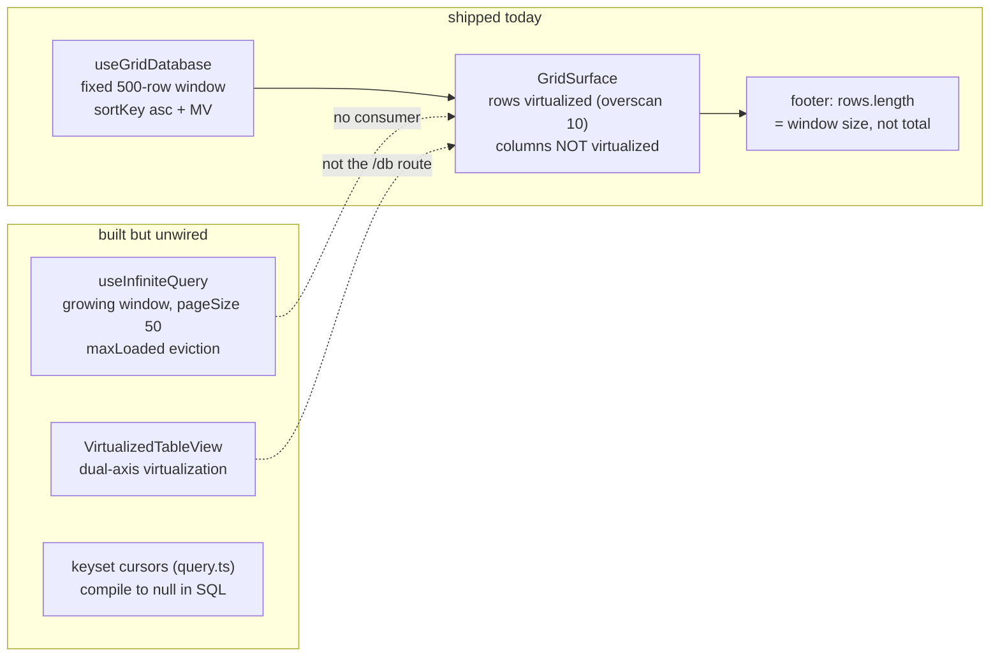
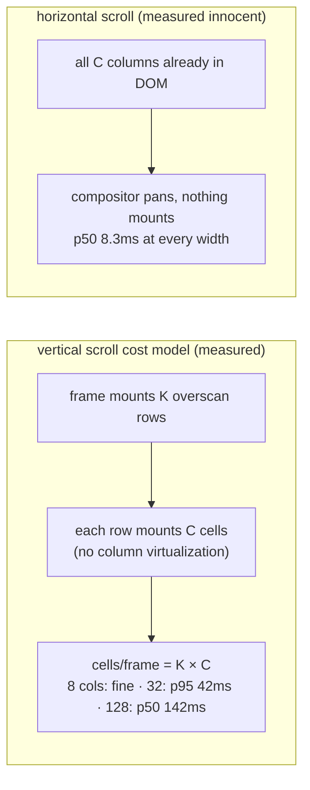

# Grid 60fps Frontier: Rows × Columns, Pagination, and Infinite Scroll — Measured

## Problem Statement

Exploration 0318 characterized the **query layer** at scale (reads flat to 10M
rows; four O(N) query-shape cliffs; the JS heap wall). It deliberately did not
answer the **render-side** question: how many rows and columns can the actual
Database grid sustain at 60fps, and do pagination and infinite scroll actually
work in the shipped UI? This exploration runs those tests: seed real
databases through the app's own store at a rows × columns matrix, drive real
wheel gestures in real Chromium, and measure frame production
(requestAnimationFrame deltas + `long-animation-frame` entries). It also
verifies the pagination primitives end-to-end.

All numbers are measured on this worktree (vite dev server, Playwright
Chromium 1440×900, M-series Mac, OPFS storage), 2026-07-17. Harness in the
appendix.

## Executive Summary

**Row count is irrelevant; column count is the frame-budget killer; and
neither pagination nor infinite scroll exists in the shipped grid.**

- **Rows: flat at any dataset size — because the grid never renders more
  than 500.** Scrolling a 10,000-row database is frame-for-frame identical
  to a 600-row one (p50 8.3ms, p95 16.7ms, zero frames >33ms, constant
  1,244 grid DOM nodes, constant 202MB heap). Row virtualization
  (`overscan: 10`) plus the fixed 500-row window make dataset size
  invisible to the renderer. The engine's ceiling for _rendered_ rows is
  untested beyond 500 — but 0318 already showed the query layer holds to
  10M, so rows are a solved axis end-to-end.
- **Columns: 60fps dies between 16 and 32 total columns.** Vertical-scroll
  frame production across the column sweep (600 rows, real wheel
  gestures): **8 cols → p95 16.7ms; 16 → p95 25ms; 32 → 48fps avg, p95
  42ms; 64 → 28fps, p95 92ms, 1.4s total main-thread blocking; 128 →
  8.6fps, p50 142ms** — unusable. Mechanism: `GridSurface` has no column
  virtualization, so every newly mounted row mounts _all_ C cells; at 128
  columns a fast scroll mounts thousands of cells per second — exactly
  Glide's "hundreds of DOM elements per frame" wall.
- **Horizontal scroll is innocent.** p50 stays 8.3ms at every width
  (compositor scrolls pre-rendered DOM; nothing mounts). The cost of wide
  schemas is paid on _vertical_ scroll and initial render, not on panning.
- **The 500-row window lies at every scale, live-verified**: 600, 2,000 and
  10,000-row databases all render exactly rows 1–500, footer reads
  "500 rows", and scrolling to the bottom loads nothing further
  (`scrollHeight` a constant 16,064px). Filters/sorts/formulas run over
  that window only.
- **Pagination primitives work; the product wiring is absent.**
  `useInfiniteQuery` verified end-to-end this session (grows 50→100,
  `maxLoaded` caps and flips `hasMore`, `reset` shrinks, short-page
  completion) — but it has zero production consumers. The gap between
  "infinite scroll works" and "infinite scroll exists" is one wiring change
  in `useGridDatabase`.
- **Verdict:** wire the grid onto the growing window (rows axis), add
  column virtualization or a Notion-style visible-property cap (columns
  axis). With both, the DOM grid comfortably covers Notion/Airtable's own
  500-field ceiling; canvas rendering remains unnecessary at any scale
  measured here.

## Current State In The Repository

The render path, verified against this worktree:

- **`GridSurface`** ([GridSurface.tsx](../../packages/views/src/grid/GridSurface.tsx))
  is the production grid (used by
  [DatabaseView.tsx](../../apps/web/src/components/DatabaseView.tsx) and the
  devtools Data tab). Rows are virtualized with `@tanstack/react-virtual`
  (`GridSurface.tsx:159-163`, `overscan: 10`, 36px rows). **Columns are not
  virtualized** — every field renders for every visible row
  (`GridRow` maps all fields, `GridSurface.tsx:854`), and each row mounts a
  dnd-kit `useSortable` for drag-reorder.
- **The 500-row window**: `useGridDatabase`
  ([useGridDatabase.ts:256](../../packages/react/src/hooks/useGridDatabase.ts))
  fetches a fixed `pageSize = 500` window (`orderBy sortKey asc`,
  `materializedView: 'db:<id>'`). There is no code path that fetches row 501.
  The footer renders `rows.length` (`GridSurface.tsx:700`) — for any database
  larger than the window, the row count shown is wrong (0318 found this; still
  true).
- **Filters/sorts/formulas/rollups run client-side over the 500-row window**
  (`useGridDatabase.ts:394-468`) — a filter on a 10k-row database silently
  filters only the first 500 by sortKey.
- **`VirtualizedTableView`**
  ([VirtualizedTableView.tsx](../../packages/views/src/table/VirtualizedTableView.tsx))
  is the only dual-axis component: row + column virtualizers
  (`overscan 10 rows / 3 columns`, lines 138-152), memoized cells. It is the
  older schema-table path, not what `/db/$dbId` renders.
- **`useInfiniteQuery`**
  ([useInfiniteQuery.ts](../../packages/react/src/hooks/useInfiniteQuery.ts))
  models infinite scroll as a single growing `limit` window
  (`DEFAULT_PAGE_SIZE = 50`, optional `maxLoaded` eviction ceiling) —
  deliberately not cursor-paged so the whole window stays on the bridge's
  bounded-delta live path (0182). **It has zero production consumers** — no
  component in `apps/` or `packages/` calls it, and it had no test coverage
  until this exploration's scratch verification.
- **Devtools Data tab**
  ([useDataExplorer.ts:37](../../packages/devtools/src/panels/DataExplorer/useDataExplorer.ts))
  uses the same fixed 500 window (`DEFAULT_LIMIT`), but is honest about it:
  `count: 'exact'` populates `totalCount` and a `capped`/truncation flag, so
  the UI can show "500 of 12,000". The grid footer should do the same.
- **Query layer** (from 0318, unchanged): `after` cursors compile to `null`
  ([query-compiler.ts:322](../../packages/data/src/store/query-compiler.ts)) —
  keyset pagination exists in `query.ts` but never pushes to SQL; LIMIT/OFFSET
  pushdown requires `after === undefined` (`query-compiler.ts:423`).

## Methodology

- Seed through the app's own `NodeStore.importDeterministicNodes` (250-node
  chunks, `indexMode: 'defer-schema'`, then `rebuildIndexesForSchemas` +
  `analyze`) — the same path the devtools seeder uses, in the app's own
  SQLite worker (OPFS SAH handles are exclusive; a second connection cannot
  open the DB).
- Column sweep: 600 rows at 8 / 16 / 32 / 64 / 128 columns (fields cycle
  text/number/text/checkbox; first field is the title). Row sweep: 2,000 and
  10,000 rows at 8 columns. 600 rows exceeds the 500-row window, so cap
  behavior is visible in every run.
- Drive: real `mouse.wheel` gestures (240px per tick, ~60 ticks/s, 4s per
  axis) — compositor-real scrolling, not synthetic `scrollTop` writes.
- Measure: rAF delta sampling (avg fps, p50/p95/max frame, frames >17ms and
  > 33ms) plus `PerformanceObserver({type:'long-animation-frame'})` (count and
  > total blocking ms). Playwright Chromium headless (new headless shares the
  > headed rendering path), backgrounding/timer-throttling disabled. The in-IDE
  > preview pane was **not** used for numbers (hidden `visibilityState` stops
  > rAF entirely — measured 0 frames; same trap 0318 documented).
- Caveat: rAF measures main-thread frame production. Compositor-thread
  scrolling can remain smooth while rAF stutters (and vice versa); LoAF
  blocking time is the tie-breaker signal.

## The Numbers

Headless Chromium runs without vsync, so avg fps can exceed 60 — treat
"avgFps" as a CPU-headroom signal and the **frame-time percentiles vs the
16.7ms budget** as the 60fps verdict. 28 rows rendered in all runs
(viewport + overscan 10); rendered cells ≈ 28 × columns.

### Column sweep — 600 rows, vertical wheel scroll (4s)

| Columns | Grid DOM nodes | avg fps | p50 frame   | p95 frame | frames >33ms | LoAF blocking | 60fps verdict  |
| ------- | -------------- | ------- | ----------- | --------- | ------------ | ------------- | -------------- |
| 8       | 1,244          | 102     | 8.3ms       | 16.7ms    | 2            | 3ms           | ✅ fluid       |
| 16      | 1,956          | 85      | 8.3ms       | 25.0ms    | 2            | 0ms           | ⚠️ budget-edge |
| 32      | 3,380          | 48      | 9.4ms       | 42.3ms    | 65           | 48ms          | ❌ sub-60      |
| 64      | 6,228          | 28      | 9.7ms       | 91.7ms    | 40           | 1,390ms       | ❌ janky       |
| 128     | 11,924         | 8.6     | **141.9ms** | 291.7ms   | 23           | 2,406ms       | ❌ unusable    |

fps roughly halves per column doubling past 16. The p50 staying ~9ms up to
64 columns while p95 explodes is the signature of **row-mount spikes**:
steady-state frames are cheap; the frame that mounts a new overscan row
pays C cell-mounts at once.

### Column sweep — horizontal wheel scroll (4s)

| Columns | avg fps | p50 frame | p95 frame | LoAF blocking |
| ------- | ------- | --------- | --------- | ------------- |
| 16      | 119     | 8.3ms     | 9.2ms     | 0ms           |
| 32      | 118     | 8.3ms     | 10.0ms    | 3ms           |
| 64      | 113     | 8.3ms     | 9.3ms     | 108ms         |
| 128     | 105     | 8.3ms     | 9.3ms     | 435ms         |

Horizontal panning never mounts anything (all columns are already in the
DOM), so it rides the compositor. The growing LoAF blocking at high widths
is periodic React work (effects/selection bookkeeping), not scroll cost.

### Row sweep — 8 columns, vertical wheel scroll

| Rows seeded | time-to-rows (dev-mode) | avg fps | p95 frame | frames >33ms | rendered window | footer says | heap  |
| ----------- | ----------------------- | ------- | --------- | ------------ | --------------- | ----------- | ----- |
| 600         | 6.8s                    | 102     | 16.7ms    | 2            | rows 1–500      | "500 rows"  | 202MB |
| 2,000       | 6.3s                    | 103     | 16.7ms    | 0            | rows 1–500      | "500 rows"  | 202MB |
| 10,000      | 8.4s                    | 103     | 16.7ms    | 0            | rows 1–500      | "500 rows"  | 202MB |

Dataset size does not touch a single render metric — the fixed window and
the row virtualizer fully decouple them. (time-to-rows is a dev-mode vite
number — unminified modules dominate it; the +2s at 10k rows is the
query/MV side, consistent with 0318's browser tier.)

### Seeding throughput (app path, dev mode, for future harness runs)

600×8 → 1.7s; 600×32 → 7.9s; 600×128 → 33.5s; 10,000×8 → 67s. Cost scales
with cells (≈0.4ms/cell), the price of per-property LWW + signing —
matching 0318's "app ingest ~12× raw SQL" finding.

## Pagination And Infinite Scroll: Verified

Three layers, three different answers:

1. **Hook layer — works.** `useInfiniteQuery` verified end-to-end with a
   scratch vitest (memory adapter, `XNetProvider`): initial window 50 rows,
   `fetchNextPage()` grows 50 → 100, `maxLoaded: 110` caps the third fetch at
   110 with `hasMore: false`, further fetches are no-ops, `reset()` shrinks
   back to 50; and when data runs out mid-page (30 rows, pageSize 25) the
   window completes with `hasMore: false`. Pagination as a primitive is
   sound.
2. **Query layer — works, with the 0318 caveats.** LIMIT/OFFSET push to SQL;
   `count: 'exact'` folds into the fused query (`COUNT(*) OVER ()`); keyset
   `after` cursors fall back to JS full-hydration (cliff #2 of 0318) so the
   growing-window model is the only shape that stays fast today.
3. **Product layer — does not exist.** Live-verified on 600 / 2,000 /
   10,000-row databases: scroll to the bottom, wait — the last row is
   always row 500, the scroll extent is a constant 16,064px, no further
   fetch fires, and the footer reports "500 rows" regardless of the true
   count. There is no pagination affordance, no load-more, no growing
   window. The Data tab shares the 500 window but at least reports
   `totalCount` and a capped flag; the grid doesn't even do that.

## External Research

Render-side and column-side prior art (0318 covered the row/query side):

- **Frame budget**: 60fps = 16.7ms/frame gross, ~10ms net after the
  browser's own style/layout/paint/composite share
  ([web.dev/rendering-performance](https://web.dev/articles/rendering-performance)).
  React mount cost is O(cells rendered) — the knob is cells in the DOM, not
  rows in the dataset.
- **Vendors cap the rendered window, not the schema width.** AG Grid
  virtualizes columns by default with **zero column buffer** ("horizontal
  scrolling is not as CPU intensive as vertical") and hard-caps rendered rows
  at 500 as a crash guard
  ([AG Grid DOM virtualisation](https://www.ag-grid.com/react-data-grid/dom-virtualisation/)).
  MUI X DataGrid uses a 150px pixel-based column buffer and warns that
  overscanning hurts
  ([MUI virtualization](https://mui.com/x/react-data-grid/virtualization/)).
  Handsontable exposes `viewportColumnRenderingOffset`
  ([docs](https://handsontable.com/docs/javascript-data-grid/column-virtualization/)).
  No DOM-grid vendor publishes a max-column figure — the industry answer is
  "virtualize the axis, then column count is irrelevant".
- **Canvas is the escape hatch, with a stated rationale**: Glide Data Grid —
  "once you need to load/unload hundreds of DOM elements per frame nothing
  can save you" ([README](https://github.com/glideapps/glide-data-grid)) —
  renders only visible cells to canvas, at the cost of reimplementing
  accessibility, selection, and text editing.
- **The 500-field coincidence**: Airtable caps at 500 fields/table
  ([plans](https://support.airtable.com/docs/airtable-plans)); Notion caps at
  500 properties/database and explicitly tells users that _visible_ property
  count drives load time — "hiding them may improve responsiveness"
  ([Notion performance](https://www.notion.com/help/optimize-database-load-times-and-performance)).
  Both DOM grids landed on 500; canvas/native spreadsheets sit at 16,384
  (Excel) / 18,278 (Sheets) columns. Visible column count is the render-cost
  driver, and vendors know it.
- **Measurement APIs**: `long-animation-frame` (LoAF, Chrome 123+) attributes
  jank to the script that caused it, works headless
  ([Chrome docs](https://developer.chrome.com/docs/web-platform/long-animation-frames));
  new headless shares the headed rendering path
  ([headless docs](https://developer.chrome.com/docs/chromium/headless)); CDP
  tracing `DrawFrame` counting is the DevTools-grade alternative.
- **Live data + deep scroll**: CSS scroll anchoring (`overflow-anchor`) does
  **not** fire in virtualized grids — absolutely-positioned rows inside a
  fixed-height spacer never shift layout, so the virtualizer must do its own
  index-based anchoring
  ([WICG explainer](https://github.com/WICG/ScrollAnchoring/blob/master/explainer.md)).
  Linear sidesteps the merge problem entirely: the list is a live query over
  a local replica, so arrivals are re-renders, not pagination merges
  ([Linear sync engine](https://linear.app/now/scaling-the-linear-sync-engine)).
  Feed UX consensus: never auto-insert into the viewport; show a "new rows"
  affordance.

## Options And Tradeoffs

| Option                                                                                      | Cost | What it buys                                                                                                                                                                                                         | Verdict                                                                                                     |
| ------------------------------------------------------------------------------------------- | ---- | -------------------------------------------------------------------------------------------------------------------------------------------------------------------------------------------------------------------- | ----------------------------------------------------------------------------------------------------------- |
| A. Wire `useInfiniteQuery` into `useGridDatabase` (growing window + `maxLoaded` eviction)   | M    | Real infinite scroll on the shipped grid; kills the 500-row lie; stays on the bounded-delta live path                                                                                                                | **Do this** — the primitive is verified working; only the wiring is missing                                 |
| B. Column virtualization in `GridSurface` (port the `VirtualizedTableView` horizontal axis) | M    | Caps vertical-scroll cell-mounts at ~10-12 visible columns regardless of schema width — the measured 8-col profile (p95 16.7ms) at any column count; lifts the ceiling from ~24 columns to the 500-field product cap | **Do this** for schemas >~20 fields; `VirtualizedTableView.tsx:146-152` is the in-repo donor implementation |
| C. Canvas grid (Glide-style)                                                                | XL   | Unbounded cells, flat memory                                                                                                                                                                                         | Not yet — DOM + dual virtualization holds at the scales measured; revisit only past the measured ceiling    |
| D. Fixed row heights + `content-visibility` on cells                                        | S    | Cheap paint skips without restructuring                                                                                                                                                                              | Marginal next to A+B; worth a flag experiment                                                               |
| E. Do nothing (500-window forever)                                                          | —    | —                                                                                                                                                                                                                    | No — the footer lies, filters silently miss rows, and 0318's keyset work makes the window growable for free |

## Recommendation

**A then B, in that order — both are M-sized wiring jobs, not new
infrastructure.**

1. **Rows (Option A): wire `useGridDatabase` onto `useInfiniteQuery`.** The
   hook is verified working; the grid's fixed `pageSize = 500` becomes the
   growing window's page size with `maxLoaded ≈ 2,000` and a
   virtualizer-end sentinel calling `fetchNextPage()`. This kills the
   footer lie and delivers real infinite scroll while staying on the
   bounded-delta live path. The row-sweep numbers guarantee the renderer
   won't notice: rendering cost is set by the _window_, not the dataset,
   and eviction keeps the window bounded.
2. **Columns (Option B): virtualize columns in `GridSurface`** (donor code
   in-repo: `VirtualizedTableView`'s horizontal virtualizer, overscan 3).
   Measured stakes: a 32-field database is _already_ sub-60fps today, and
   real CRM/tracker schemas hit 20+ fields quickly. Interim mitigation
   that ships in a day: Notion-style default-hidden properties past the
   first ~15 visible (Notion's own confession that visible-column count is
   the cost driver).
3. **Don't build**: canvas rendering, cursor-paged product UX, or any
   row-cap guardrail — rows are solved (fixed window today, growing window
   after A), and 0318's query-side checklist (keyset pushdown, estimate
   counts) remains the prerequisite track for deep windows, not this doc's
   scope.

Sequencing note: 0318 (query layer, unmerged branch
`claude/database-performance-testing-f395db`) and this doc are complements —
0318 makes deep windows _queryable_; this doc makes them _scrollable_.
Neither blocks the other; A+B here need no query-layer changes at the
500–2,000-row window sizes recommended.

## Risks And Open Questions

- **LWW edits under a growing window**: an edit that changes `sortKey` moves a
  row within the window — the growing-window model handles this (whole window
  is live), but eviction (`maxLoaded`) plus a moved row can pop rows out of
  view; needs UX decision (0318's "rows teleport on edit" question, same
  answer needed regardless).
- **dnd-kit per-row `useSortable`** is a fixed per-visible-row tax; row
  drag-reorder and column virtualization interact (a dragged row renders all
  its cells while floating).
- **Client-side filters over a grown window** get _more_ wrong before they
  get right: a 2k-row window filters 2k rows, still not the full table.
  Filter pushdown (0317's PredicateIndex direction) is the real fix; until
  then the UI should label filtered views on capped windows.
- rAF-based fps is main-thread-centric; a compositor-smooth scroll with a
  janky main thread reads worse than it feels. LoAF blocking ms is reported
  alongside for that reason.

## Implementation Checklist

- [x] Wire `useGridDatabase` onto `useInfiniteQuery`: replace fixed
      `pageSize = 500` with growing window (pageSize 500, `maxLoaded` ~2,000) + `fetchNextPage()` from a virtualizer end-sentinel
      (`useGridDatabase.ts:256`, `useGridDatabase.ts:279-285`)
- [x] Grid footer: show `count` totals ("500 of 12,000"), reusing the Data
      tab's `count: 'exact'`/capped pattern (`GridSurface.tsx:698-700`,
      `useDataExplorer.ts:185-210`); switch to `count:'estimate'` when 0318's
      estimate mode lands
- [x] Promote the `useInfiniteQuery` scratch test into a real committed test
      (`packages/react/src/hooks/useInfiniteQuery.test.tsx`) — the hook is
      about to gain its first production consumer
- [x] Column virtualization for `GridSurface` (horizontal `useVirtualizer`,
      overscan 3, per `VirtualizedTableView.tsx:146-152`) — required for >~20-field schemas (32 fields measured at 48fps, 64 at 28fps);
      interim: default-hide properties past ~15 visible
- [ ] Label client-side filter/sort results when the window is capped
      ("filtered within first N rows")
- [ ] Keep 0318's checklist as the query-side prerequisite track (keyset
      pushdown, index-servable property sorts, estimate counts) — this
      exploration's render work does not supersede it

## Validation Checklist

- [ ] Grid scrolls past row 500 on a 10k-row database (window grows;
      `maxRowNumber` > 500 in the harness bottom-check)
- [ ] Footer shows true total (or "N of ~M") on databases larger than the
      window
- [ ] Re-run this harness post-wiring: vertical-scroll avg fps and p95 frame
      time within 10% of the fixed-window baseline at 8 and 32 columns
- [ ] Post-column-virtualization: 128-column database vertical scroll p95
      ≤ 20ms (was 292ms) and p50 ≤ 10ms (was 142ms) in this harness
- [ ] Heap stays bounded over a full-depth scroll of a 10k-row database
      (eviction working; `performance.memory` flat within ~50MB)

## Appendix: Harness

Playwright script (session scratchpad, `grid-fps-harness.mjs`; results JSON
`grid-fps-results.json` preserved alongside): launches persistent-profile
Chromium against the worktree vite server (:5199), onboards via
`xnet:test:bypass`, seeds each matrix cell through
`window.__xnetNodeStore.importDeterministicNodes` (Database +
DatabaseField×C + table DatabaseView + DatabaseRow×R with `cell_<fieldId>`
values), then per database: `goto /db/<id>`, wait for `[role=grid] [role=row]`,
4s of `mouse.wheel` per axis with in-page rAF + LoAF sampling, then
scroll-to-bottom cap verification and `performance.memory` reading.
Hook-layer verification: `useInfiniteQuery.scratch.test.tsx` (run under the
root vitest `dom` project; not committed).

## References

- In-repo: explorations 0318 (query-layer scale limits — the companion doc),
  0317, 0182, 0159 (GridSurface design + perf budgets), 0264, 0266, 0274;
  `packages/views/src/grid/GridSurface.tsx`,
  `packages/views/src/table/VirtualizedTableView.tsx`,
  `packages/react/src/hooks/{useGridDatabase,useInfiniteQuery,useQuery}.ts`,
  `packages/devtools/src/panels/DataExplorer/useDataExplorer.ts`,
  `packages/data/src/store/query-compiler.ts`
- web.dev rendering performance: <https://web.dev/articles/rendering-performance>
- AG Grid DOM virtualisation (0-col buffer, 500-row cap):
  <https://www.ag-grid.com/react-data-grid/dom-virtualisation/>
- MUI X DataGrid virtualization: <https://mui.com/x/react-data-grid/virtualization/>
- Handsontable column virtualization:
  <https://handsontable.com/docs/javascript-data-grid/column-virtualization/>
- Glide Data Grid (canvas): <https://github.com/glideapps/glide-data-grid>
- Notion performance guidance (500 properties; visible-property cost):
  <https://www.notion.com/help/optimize-database-load-times-and-performance>
- Airtable plan limits (500 fields): <https://support.airtable.com/docs/airtable-plans>
- Long Animation Frames API:
  <https://developer.chrome.com/docs/web-platform/long-animation-frames>
- Chrome new headless rendering parity:
  <https://developer.chrome.com/docs/chromium/headless>
- Scroll anchoring explainer:
  <https://github.com/WICG/ScrollAnchoring/blob/master/explainer.md>
- Linear sync engine: <https://linear.app/now/scaling-the-linear-sync-engine>
- TanStack virtualized columns example:
  <https://tanstack.com/table/v8/docs/framework/react/examples/virtualized-columns>
