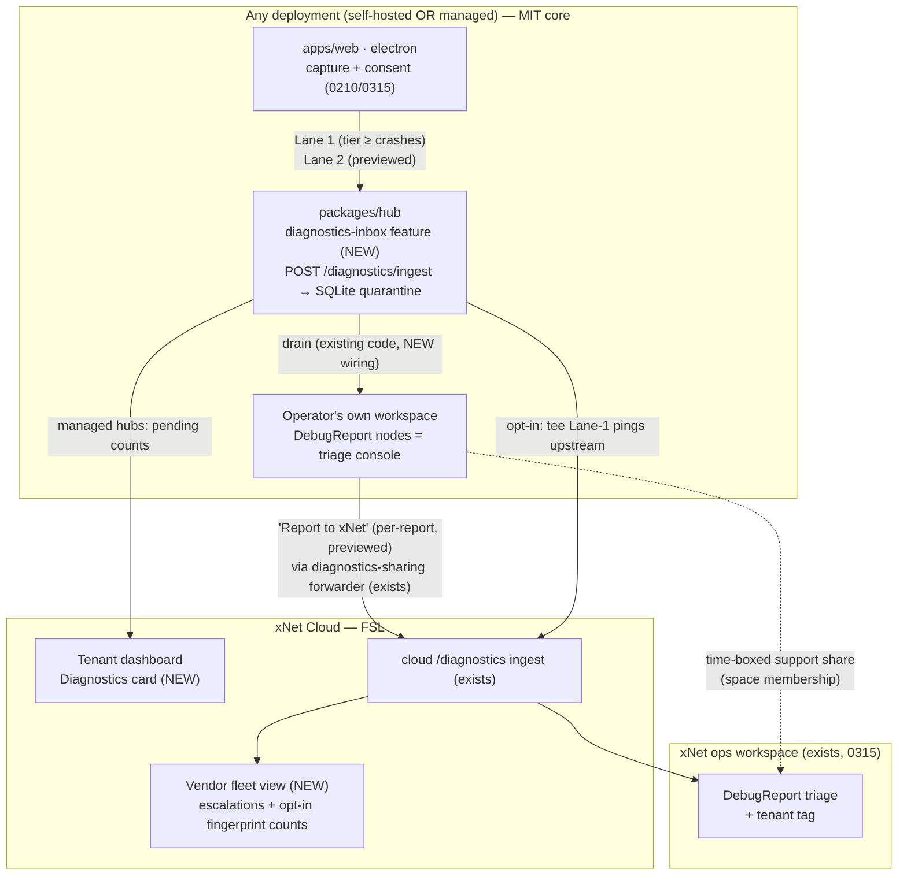
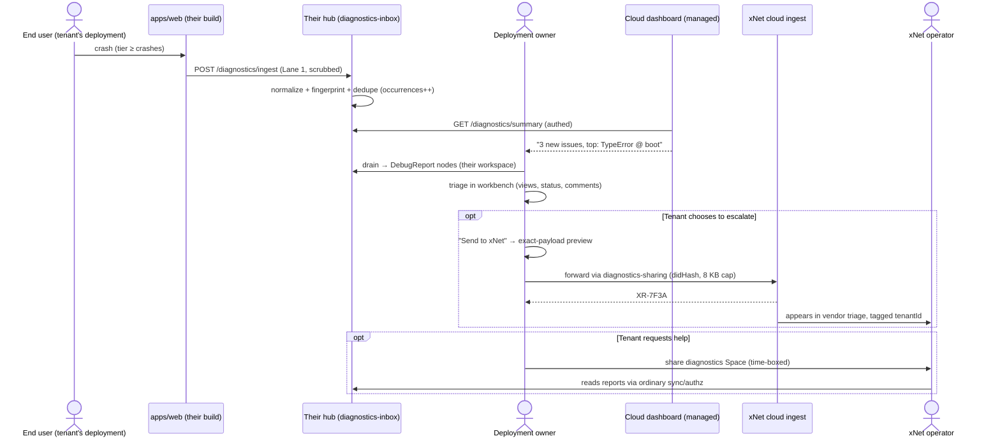
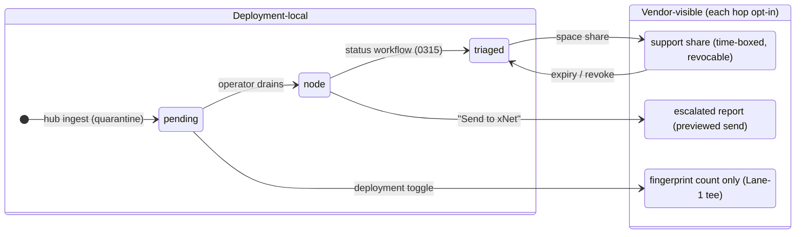
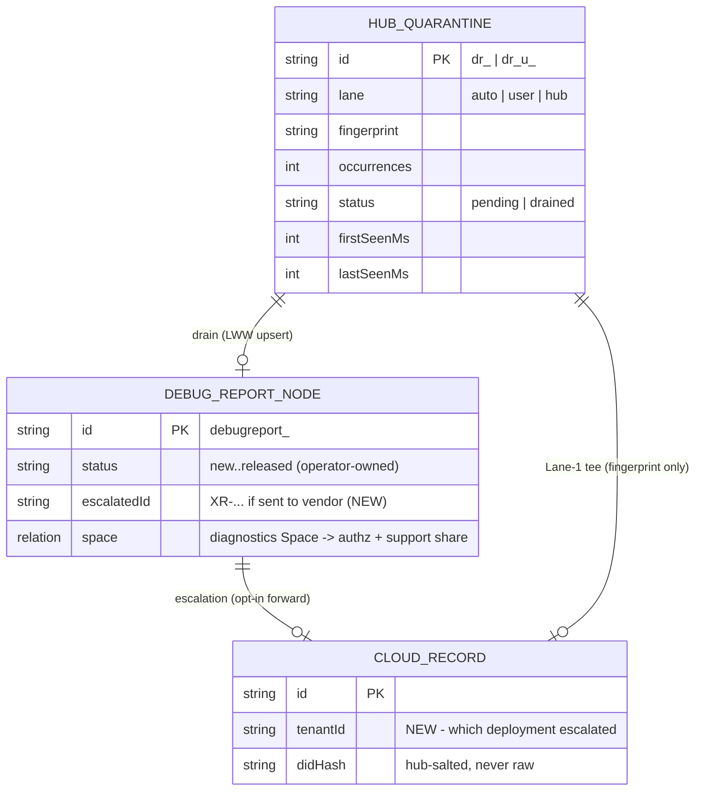

# Self-Hosted Crash Logging And Per-Deployment Error Consoles ("Every Hub Is Its Own Sentry")

> Status: EXPLORATION
> Date: 2026-07-17
> Related: [[0315_FIRST_PARTY_ERROR_TELEMETRY_AND_DEBUG_REPORT_CONSOLE]] (implemented
> — this doc is its multi-tenant sequel), [[0210_ERROR_MONITORING_PRIVACY_ANALYTICS_AND_CONSENT_ACROSS_SURFACES]]
> (the consent spine), [[0187_HUB_HOSTED_TELEMETRY_STORE_AND_ANALYTICS_DASHBOARD]]
> (hub telemetry store — the storage template), [[0207_FULL_CLOUD_DASHBOARD]]
> (the tenant dashboard this extends), [[0233_SELF_HOSTING_BUILD_CONSOLE]]
> (xNet-in-xNet precedent), [[0335_RELEASE_READINESS_AUDIT]] (FSL/MIT framing).

## Problem Statement

The prompt asks five things at once:

1. **Is there an open-source, self-hostable Sentry?** Something that logs
   crash reports, groups related crashes, shows first/last seen and
   frequency — the Sentry triage loop.
2. Can it be **baked into the open core** rather than bolted on?
3. Can **xNet Cloud use it to administrate different deployments** (our
   fleet-operator view)?
4. Can we **expose it to each end user/deployment owner** — automatic
   instrumentation, their own bug logs in their own cloud dashboard, so they
   can debug their own deployment?
5. Can users **opt in to reporting bugs back to us**, and optionally let us
   **help debug their issues**?

Question 1 was already answered — and question 2 partly built — by
exploration 0315 (implemented, PR #499): we decided **no Sentry SaaS, no
`@sentry/*` SDK ever**, and shipped a first-party pipeline (consent-gated
crash pings + previewed "Report a problem" → cloud ingest → `DebugReport`
nodes triaged in an xNet workspace). What 0315 did **not** do is questions
3–5: today the pipeline is **single-tenant**. Every crash from every copy of
the app flows to *our* cloud quarantine and drains into *our* operator
workspace. A self-hoster gets capture but no console; a managed-hub customer
gets neither a "your errors" view nor a way to escalate a report to us with
one click.

This exploration answers the literal question (with 2026 licensing facts —
they changed the calculus) and then designs the generalization: **crash
ingest as an open-core hub feature, so every deployment is its own Sentry;
the cloud dashboard as the tenant's window into it; and an explicitly
consent-shaped escalation lane back to the vendor.**

## Executive Summary

- **Yes, self-hostable Sentry alternatives exist — but only one is legally
  embeddable, and we already built the better answer.** Sentry itself is
  FSL-licensed: running it internally is fine, but *"users are prohibited to
  sell deployed self-hosted Sentry as any kind of offering"* — embedding it
  in xNet Cloud is a textbook Competing Use, and its self-host stack is
  4 cores / 16 GB / ~50 containers regardless. Bugsink (single container,
  SQLite) is PolyForm Shield — bundling it into a product that competes with
  Bugsink's hosted offering is exactly what Shield forbids. **GlitchTip is
  MIT** and Sentry-SDK compatible — the only clean embed — but it drags in
  Django + Postgres and duplicates a triage UI we already get from our own
  workbench. Verdict unchanged from 0315: **first-party, not vendored** —
  GlitchTip stays the documented escape hatch, and its MIT codebase is our
  reference implementation if we ever want Sentry-envelope compatibility.

- **The 0315 pipeline is complete but points at exactly one tenant: us.**
  Capture (web global handlers, Electron main-process crash log, hub
  `onError`), consent tiers, scrubbing, the two lanes (auto pings + previewed
  user reports), the cloud quarantine ingest, fingerprint dedupe with
  occurrence counting, the `DebugReport` schema, webhook alerts on first-seen
  fingerprints — all shipped. The gaps this doc closes: the ingest lives
  **only in FSL `apps/cloud`** (self-hosters have no socket of their own);
  `VITE_DIAGNOSTICS_URL` points at **our** cloud; the operator drain
  (`debug-report-drain.ts`) is **not wired into any UI**; and the cloud
  dashboard has **no diagnostics section** for tenants.

- **The move: relocate the ingest+quarantine into the hub as an open-core
  (MIT) feature.** The hub already has the storage pattern (0187
  `telemetry.db`, retention/pruning), the feature-mount pattern
  (`HubFeature` + scoped env), and even the outbound forwarder
  (`diagnostics-sharing`, built in 0210, waiting since then for a
  first-party socket it can point at). With ingest on every hub, **crash
  reports flow to the deployment's own hub by default — zero phoning home**,
  which converts crash telemetry from a liability into a headline privacy
  feature: *"your crashes are your data too."*

- **Three concentric consoles, one schema.** (1) *Deployment-local*: each
  operator drains their hub's quarantine into `DebugReport` nodes in their
  own workspace — the workbench is the Sentry UI, exactly as 0315 built for
  us. (2) *Cloud tenant view* (FSL): the managed-hub dashboard gains a
  Diagnostics card — pending count, top fingerprints, link into their
  workspace console. (3) *Vendor fleet view* (FSL): aggregates **only
  escalated reports and opt-in fingerprint counts** across deployments,
  keyed by tenant.

- **Escalation is a forward, not a fork.** "Report to xNet" per-report =
  Lane 2 semantics (preview-before-send, the click is the consent) POSTed
  from the tenant hub to our existing cloud ingest via the already-built
  `diagnostics-sharing` forwarder (hub lane, salted DID hash, 8 KB cap).
  "Share crash pings with xNet" per-deployment = a settings toggle that
  tees Lane 1 fingerprint-level pings upstream. "Let xNet help debug" =
  a time-boxed, revocable share of the tenant's diagnostics Space with a
  designated xNet support identity — `spaceCascadeAuthorization` already
  makes that a plain space-membership operation, no new access machinery.



## Current State In The Repository

Everything verified against the tree on 2026-07-17. The 0315 doc's "Current
State" section described the *pre*-implementation world; this is the *post*.

### What exists and works (0315, implemented)

- **Client transport** —
  [packages/telemetry/src/sync/crash-ingest.ts](../../packages/telemetry/src/sync/crash-ingest.ts):
  `createDiagnosticsClient({ ingestUrl, consent })` with the two lanes.
  `crash()` is consent-gated (`allowsTier('crashes')`), queued (max 5),
  fail-silent, `keepalive`; `submit()` is user-triggered, ungated ("the
  click is the consent"), returns `{ id, shortId }`. Both re-scrub via
  `scrubTelemetryData` before POSTing to `${base}/diagnostics/ingest`.
- **Capture** — web: [apps/web/src/lib/boot-diagnostics.ts](../../apps/web/src/lib/boot-diagnostics.ts)
  (global handlers + boot-stage stamping) fanned out by
  [error-reporter.ts](../../apps/web/src/lib/error-reporter.ts); the
  top-level `ErrorBoundary` now reports (`App.tsx:377`). Electron main:
  [apps/electron/src/main/crash-log.ts](../../apps/electron/src/main/crash-log.ts)
  (`uncaughtException`/`unhandledRejection` → bounded local
  `main-crash.log`, surfaced over IPC into the next user report — native
  minidumps deliberately excluded). Plugin sandbox frames report their own
  errors ([packages/plugins/src/workspace-plugins/frame.ts](../../packages/plugins/src/workspace-plugins/frame.ts)).
- **"Report a problem"** —
  [apps/web/src/components/ReportProblemDialog.tsx](../../apps/web/src/components/ReportProblemDialog.tsx)
  + [apps/web/src/lib/debug-report.ts](../../apps/web/src/lib/debug-report.ts):
  preview-before-send, per-section toggles, breadcrumbs from the 0275 log
  ring, compose-time re-scrub.
- **Cloud ingest + quarantine** —
  [apps/cloud/src/diagnostics.ts](../../apps/cloud/src/diagnostics.ts):
  `POST /diagnostics/ingest` (public lanes, 10/min/IP, 8 KB cap),
  `POST /diagnostics` (hub lane, `x-internal-secret`), drain surface
  (`GET /internal/diagnostics/reports` + `/ack`), allowlist normalizer,
  `fingerprintOf()` (sha256 of `errorName|normalizedTopFrame|release`),
  auto-lane dedupe (`dr_<fingerprint>`, `occurrences++`), 30-day drained
  retention, SSRF-guarded first-seen webhook alerter. Server never writes
  workspace nodes (the 0278 form-inbox invariant) — reports sit in a
  quarantine `DebugReportStore` until a signing client drains them.
- **The schema** —
  [packages/data/src/schema/schemas/debug-report.ts](../../packages/data/src/schema/schemas/debug-report.ts):
  registered (`xnet://xnet.fyi/DebugReport@1.0.0`), lanes `auto|user|hub`,
  `fingerprint`, `occurrences`, `status: new→acked→in-progress→fixed→released`,
  `spaceCascadeAuthorization('space')`, excluded from seeding
  ([seed-manifest.ts:80](../../packages/devtools/src/seed/seed-manifest.ts)).
- **The drain** —
  [apps/web/src/lib/debug-report-drain.ts](../../apps/web/src/lib/debug-report-drain.ts):
  `drainDebugReports(store, request, space)` — deterministic node ids
  (`debugreport_<reportId>`, LWW upsert), preserves operator-set `status`
  across re-drains, acks the quarantine.
- **The hub forwarder** —
  [packages/hub/src/features/diagnostics-sharing.ts](../../packages/hub/src/features/diagnostics-sharing.ts)
  (0210): off unless `XNET_DIAGNOSTICS_URL` + `XNET_DIAGNOSTICS_SECRET` are
  set; forwards `{ didHash, report }` upstream with an 8 KB cap. Since 0315
  its socket exists (the cloud hub-lane route).

### The gaps (what "single-tenant" means concretely)

1. **The ingest lives only in `apps/cloud` — the FSL zone.** A self-hoster
   running `packages/hub` (MIT) has **no `/diagnostics/ingest`**; their
   users' crash pings have nowhere first-party to go. The hub's only
   diagnostics surface is the *outbound* forwarder — pointed, if enabled, at
   *our* cloud.
2. **`VITE_DIAGNOSTICS_URL` is a build-time constant aimed at us.** The
   client transport has no notion of "the deployment's own hub" — official
   builds ship our ingest origin (also pinned in CSP `connect-src`, the 0300
   gotcha).
3. **The drain is headless.** `drainDebugReports` is pure, tested — and
   referenced only by its own tests. No UI invokes it; no operator has ever
   pressed a button that runs it. The "workbench is the triage console"
   story is true in schema and false in wiring.
4. **The cloud dashboard shows zero diagnostics.**
   [apps/cloud/src/dashboard.ts](../../apps/cloud/src/dashboard.ts) renders
   connections, docs, p95, uptime, memory, error-budget — operational
   health, not one word about the tenant's crash reports (grep for
   `diagnostic|debug` in it: no hits).
5. **No per-tenant keying.** `DebugReportRecord` has no `tenantId`; a
   managed-hub customer's escalated report and our own demo-app crash land
   in the same undifferentiated quarantine.
6. **No support-access story.** Nothing models "let xNet look at my
   diagnostics Space for a week."

### Adjacent machinery this design reuses

- **Hub storage/retention template** —
  [packages/hub/src/telemetry/store.ts](../../packages/hub/src/telemetry/store.ts)
  (0187): separate `telemetry.db`, `pruneRaw(olderThanMs)`, rollups;
  [tiering.ts](../../packages/hub/src/telemetry/tiering.ts) for retention +
  optional cold export. The diagnostics quarantine on the hub should be its
  sibling, not a new invention.
- **Hub feature mounting** —
  [packages/hub/src/features/registry.ts](../../packages/hub/src/features/registry.ts):
  `HubFeature` with scoped-env secrets allowlist; `diagnosticsSharingFeature`
  is already registered in [server.ts](../../packages/hub/src/server.ts)
  (~line 542) and shows exactly the shape the new inbox feature takes.
- **Fleet plumbing** — [apps/cloud/src/control-plane.ts](../../apps/cloud/src/control-plane.ts)
  (`TenantRecord`/`TenantStore`, provisioning), `hub-status.ts`
  (`composeDashboardLive`/`fetchHubHealth` — the pattern for polling a
  managed hub's diagnostics summary into the dashboard).
- **Access control** — `spaceCascadeAuthorization` on the schema means a
  diagnostics Space share *is* the support grant (0181 nested-space
  cascade); no new authz rungs needed.
- **TaggedError** ([packages/core/src/errors/tagged.ts](../../packages/core/src/errors/tagged.ts),
  0303): `_tag` + per-class `code` are ideal fingerprint inputs, but tagged
  errors still aren't routed to any central reporter — a cheap capture
  upgrade while we're in here.

## External Research

### The 2026 landscape: who you may legally embed

| Project | License (verified) | Stack / footprint | Sentry-SDK compat | Embed in MIT core? | Run inside our FSL cloud? |
|---|---|---|---|---|---|
| **Sentry self-hosted** | FSL-1.1-Apache-2.0 (per-version 2-yr convert) | Kafka+ClickHouse+Snuba+Relay+…; 4 cores/16 GB min, ~50 containers | native | ❌ (license + weight) | ❌ Competing Use — *"prohibited to sell deployed self-hosted Sentry as any kind of offering"*; internal-only use is fine |
| **GlitchTip** | **MIT** | Django+Postgres 14+ (Redis optional since 5.2); 512 MB RAM rec. | full (swap DSN) | ✅ legally; ⚠️ architecturally (Python sidecar) | ✅ |
| **Bugsink** | PolyForm Shield 1.0.0 (since 2025-01-15) | 1 container, SQLite default; 1.5 M events/day on 2 vCPU/4 GB | full | ❌ Shield noncompete ("even when provided free of charge") | ❌ without a commercial license |
| **Telebugs** | Source-available, $299 one-time; reuse in other products prohibited | 1 container, 1 GB RAM | full | ❌ | ❌ |
| **urgentry** | early-stage (license unconfirmed) | single Go binary, SQLite/Postgres; 400 ev/s @ ~53 MB | envelope-compatible | watch | watch |
| PostHog error tracking | MIT repo, but self-host is unsupported "hobby" tier (~100k ev/mo cap) | full PostHog stack | no (own SDK) | ❌ practically | ❌ practically |
| SigNoz / OpenObserve | Apache-2.0 / OSS | ClickHouse / Rust binary | OTel, not Sentry | log stores, not crash triage | — |
| Errbit | MIT | Ruby+MongoDB, Airbrake API | no | wrong protocol/stack | — |

Three consequences:

1. **The literal answer is "yes — GlitchTip"**: MIT, actively maintained
   (5.2 Nov 2025, 6.0 Feb 2026, Postgres-only mode), Sentry-SDK compatible,
   modest footprint. If we wanted a vendored console tomorrow, that's the
   one — and *only* that one.
2. **The 0315 decision ages well.** Both small-footprint darlings (Bugsink,
   Telebugs) are license-fenced against exactly our use case; Sentry's FSL
   fences the other flank. Building first-party wasn't just brand-consistent
   — it turns out to be the only unencumbered path to "crash console as a
   product feature."
3. **Protocols aren't copyrightable.** GlitchTip's MIT Django code is a
   readable reference implementation of the Sentry envelope protocol, should
   we ever add a compatibility endpoint (below).

### The Sentry wire protocol, if we ever want SDK compatibility

- DSN: `{PROTO}://{PUBLIC_KEY}@{HOST}/{PROJECT_ID}`; SDKs derive
  `POST /api/<project_id>/envelope/` from it.
- Envelope = one JSON header line + repeated (item-header line + payload),
  newline-delimited; item headers carry `type` and optional `length`
  (**must be honored** — attachments contain newlines); bodies commonly
  gzipped; auth via `X-Sentry-Auth` or a `dsn` envelope-header key (reject
  403 if both missing); rate limiting via 429 + `Retry-After` which SDKs
  respect.
- Error events: `event_id`, `timestamp`, `platform`, plus
  `exception.values[].{type, value, stacktrace.frames[].{filename, function,
  lineno, colno, in_app, …}}`, `tags`, `release`, `environment`,
  `breadcrumbs`.
- A minimal ingest accepting `@sentry/browser`/`@sentry/node` error events
  is genuinely a few hundred lines (gzip + envelope split + accept
  `type:"event"`, 200-ack unknown types so SDKs don't retry-storm).
  urgentry's guide flags the two silent-drop gotchas: trailing newlines and
  gzip handling. The SDK `tunnel` option (POST envelopes to a same-origin
  path) neatly sidesteps our CSP `connect-src` constraint.
- **This is not for our own apps** (0315's no-SDK decision stands — 27–45 KB
  and an opt-out posture) — it's an *ecosystem* option: plugin authors and
  users hosting their own projects could point stock Sentry SDKs at their
  hub. Deferred, but the door is cheap to keep open because our fingerprint
  and node model don't care what wire format delivered the exception.

### Grouping/fingerprinting (what "related crashes" takes)

Sentry's hierarchy: explicit fingerprint → stack-trace hash over **in-app
frames only** (module + normalized filename + normalized context line) →
exception `type`+`value` → parameterized message. Documented pitfalls, all
relevant to us:

- **Minified JS destroys grouping** — every release re-fingerprints
  everything unless you symbolicate or hash on stable inputs. Our
  `fingerprintOf()` already includes `release`, which makes per-release
  splits *deliberate* — good for "did 1.42 fix it", bad for long-lived issue
  identity. A two-level model (issue = name+frame; incident = issue×release)
  is the eventual answer; not needed for v1.
- Never hash line/column numbers or raw messages (embedded IDs → grouping
  instability). Our normalizer already strips to `errorName | top frame |
  release`.
- `TaggedError._tag` + `code` are better grouping inputs than message text —
  route tagged errors into the reporter and fingerprint on them when
  present.
- Symbolication remains deferred (0315 P4): we control the build, so
  ship-with-sourcemaps or `keep_names` builds keep frames legible, and
  view-time `.map` lookup is trivial when wanted.

### Prior art for the *tenant-facing* console

- **Sentry's own model** (org → project → DSN) maps to ours as
  deployment → hub → ingest token: the useful borrow is *issues list ≠
  events list* — group first, always.
- **GitLab's "advisory-then-instance" telemetry** and Home Assistant's
  separated toggles both support the shape we already have: deployment-local
  by default, each upstream share its own explicit switch.
- **Plausible/Aptabase self-host + cloud**: same code path for both, cloud
  is just the hosted instance — exactly the property we get by putting
  ingest in the MIT hub and letting cloud consume it, instead of building a
  cloud-only feature and back-porting it later.

## Key Findings

1. **The question decomposes into "generalize 0315," not "adopt something."**
   Licensing eliminated every embeddable backend except GlitchTip, and
   GlitchTip would replace the one part of the system we most want to keep
   first-party (the console = our own workbench).
2. **The single biggest unlock is moving ingest+quarantine from `apps/cloud`
   (FSL) into `packages/hub` (MIT).** One relocation makes crash logging a
   *product feature of every deployment* instead of an internal vendor tool:
   self-hosters get a full private Sentry-equivalent; managed tenants get
   the same thing with a dashboard on top; and our own cloud becomes just
   the biggest deployment of the same feature (the Plausible property).
3. **Every hard sub-problem is already solved in-tree** — normalization,
   fingerprinting, dedupe, quarantine/drain, retention pruning, schema,
   authz, consent, scrubbing, the outbound forwarder, webhook alerts. The
   remaining work is *placement and wiring*: a hub feature, a client URL
   resolution rule, a drain surface in the UI, a dashboard card, a
   `tenantId` column, and three consent toggles.
4. **The privacy story inverts the usual telemetry pitch.** Because reports
   default to the deployment's own hub, automatic instrumentation no longer
   conflicts with "we can't read your data" — we can turn crash capture on
   by default (tier-gated as today) without any data leaving the user's
   trust domain, and *every* cross-domain hop is a visible, previewed,
   per-action choice. No competitor with a hosted-ingest architecture can
   copy this sentence.
5. **Escalation and support access need no new security machinery.**
   "Report to xNet" is the existing hub-lane forward with Lane 2 semantics;
   "let xNet help" is space membership under `spaceCascadeAuthorization` —
   time-boxed by an expiring share, revocable like any other membership.
   The design work is ceremony (preview, duration, revoke UI), not
   infrastructure.
6. **The operator drain being headless is the sleeper bug of 0315.** Until a
   UI runs `drainDebugReports`, even *our* console only works for whoever
   runs it by hand. The tenant story forces us to fix the vendor story.

## Options And Tradeoffs

### Option A — Embed GlitchTip per deployment (the "real Sentry alternative")

Ship GlitchTip alongside the hub (compose profile / managed sidecar); point
the dormant DSN seams at it.

- **Pros:** mature grouping and issue UI on day one; stock Sentry SDKs work;
  MIT-clean both directions.
- **Cons:** a Django+Postgres sidecar beside a Node+SQLite hub doubles the
  ops surface of every deployment (self-hosters chose us partly for
  one-binary simplicity — 0300 Raspberry Pi audience); its UI is a separate
  world with separate auth, killing the workbench-native triage story we
  already built; per-tenant provisioning in cloud means running a GlitchTip
  fleet; and we'd still write all the consent/escalation UX ourselves.

### Option B — Hub-native diagnostics inbox: relocate 0315's ingest into the MIT hub (recommended core)

A `diagnostics-inbox` `HubFeature`: `POST /diagnostics/ingest` on every hub,
SQLite quarantine (sibling of 0187's `telemetry.db`), same normalizer/
fingerprint/dedupe/retention code extracted from `apps/cloud` into a shared
MIT package; clients target their own hub; the operator drain gets a UI;
cloud consumes rather than owns.

- **Pros:** every deployment self-contained by default (the privacy
  headline); one code path for self-host, managed, and our own ops
  (cloud keeps using the same store interface); smallest total system —
  ~90 % of the code exists and merely moves; the workbench remains the
  console; the escape hatches (GlitchTip, envelope compat) stay open behind
  the same client contract.
- **Cons:** an extraction refactor across the FSL/MIT boundary (must move
  cleanly — cloud keeps only tenant keying and fleet aggregation);
  quarantine adds a disk quota concern on managed hubs (0291: quota
  eviction still not enforced); publishable-package changeset obligations
  if the shared code lands in a public package.

### Option C — Cloud-only tenant view (no hub changes)

Keep ingest in `apps/cloud`; add `tenantId`, a dashboard card, and a scoped
drain so each managed tenant sees their own reports in our cloud.

- **Pros:** fastest path to the "see your bugs in the cloud dashboard" demo;
  zero hub/protocol changes.
- **Cons:** self-hosters get nothing (fails the "baked into open core"
  requirement outright); all tenants' crash data concentrates on our infra
  *by default* — the exact architecture our brand argues against; and the
  eventual migration to Option B rewrites this work.

### Option D — Sentry-envelope compatibility endpoint on the hub

Implement `POST /api/<project>/envelope/` (a few hundred lines, GlitchTip as
reference) so stock Sentry SDKs — from plugins, or users' own apps — ingest
into the same quarantine.

- **Pros:** every hub becomes a private error tracker for the user's *own
  projects*, not just for xNet itself — a genuine product expansion
  ("bring your side-project's crashes into your workspace"); zero client
  work for adopters; protocol is uncopyrightable.
- **Cons:** protocol surface to maintain (envelope parsing gotchas, SDK
  rate-limit semantics); invites payloads our allowlist must aggressively
  strip (Sentry events carry `user`, `request`, breadcrumbs with PII);
  scope creep risk vs. the core promise. **Defer** — but design the
  quarantine store so an envelope adapter is purely additive.

| | A: GlitchTip embed | B: hub-native inbox | C: cloud-only | D: envelope compat |
|---|---|---|---|---|
| Self-hosters get a console | ✅ (heavy) | ✅ | ❌ | ✅ (later) |
| Open-core requirement | ⚠️ sidecar | ✅ MIT feature | ❌ | ✅ |
| Reuses 0315 code | ❌ | ✅ ~90 % | ✅ partial | ✅ store |
| Ops burden per deployment | +Django+Postgres | ~0 (same process) | 0 | ~0 |
| Privacy default | local ✅ | **local ✅** | vendor ❌ | local ✅ |
| Triage UI | theirs | **workbench (ours)** | dashboard tables | workbench |
| Licensing exposure | none | none | none | none |

## Recommendation

**Option B as the spine, C's dashboard card built on top of it, D deferred
but provisioned for.** Concretely, five phases — each independently
shippable:

### Phase 1 — Extract and relocate: the `diagnostics-inbox` hub feature (MIT)

Extract the tenant-neutral core of
[apps/cloud/src/diagnostics.ts](../../apps/cloud/src/diagnostics.ts) —
`parseIncomingReport`, `fingerprintOf`, `shortId`, `DebugReportRecord`,
`DebugReportStore` — into the MIT zone (natural home:
`packages/telemetry/src/sync/` beside the client, or a new
`packages/telemetry/src/inbox/`; `@xnetjs/telemetry` is private today —
decide whether this makes it publishable, with changeset consequences).
Add a `SqliteDebugReportStore` following
[packages/hub/src/telemetry/store.ts](../../packages/hub/src/telemetry/store.ts)
(own `diagnostics.db`, `prune()` on the existing tiering cadence). Mount as
a default-on `HubFeature` (`fyi.xnet.diagnostics-inbox`): public
`POST /diagnostics/ingest` (same 8 KB cap + per-IP rate limit), authed drain
routes (`GET /diagnostics/pending`, `POST /diagnostics/ack` — operator-only,
reusing `requireAuth`). `apps/cloud` re-imports the shared core, keeping its
Firestore store, hub lane, and webhook alerter. **The cloud diff should be
near-zero behavior change.**

### Phase 2 — Point clients home + wire the drain UI

Client resolution rule: the diagnostics ingest URL becomes **the connected
hub** (`hubUrl + /diagnostics/ingest`) when one exists, falling back to
`VITE_DIAGNOSTICS_URL` (our cloud) only for the hosted demo with no hub —
and hub origins are already in `connect-src` for sync, dissolving the 0300
CSP pin. Then give the drain its missing surface: a "Diagnostics" section in
the operator settings (or devtools panel) that shows the pending count,
runs `drainDebugReports` into a designated diagnostics Space (creating it
first-run), and deep-links to a saved workbench view. Ship the saved views
0315 described but never seeded ("Inbox", "By release", "By fingerprint") as
part of the diagnostics-Space bootstrap — operator-facing, so still no
demo-seed obligation.

### Phase 3 — Tenant diagnostics in the cloud dashboard (FSL)

For managed hubs: `fetchHubDiagnosticsSummary` beside `fetchHubHealth` in
[apps/cloud/src/hub-status.ts](../../apps/cloud/src/hub-status.ts) (the hub
exposes a tiny authed `GET /diagnostics/summary` — counts by status/
fingerprint, last-seen); a Diagnostics card in
[dashboard.ts](../../apps/cloud/src/dashboard.ts) (pending count, top 5
fingerprints with occurrences and last-seen, link to their workspace
console). Add `tenantId` to the *cloud* `DebugReportRecord` (hub-lane
ingest resolves it from the forwarding hub's registration) so our fleet
view can group escalations by deployment. This is the "they see their own
bug logs in the cloud view" deliverable — and it reads from *their* hub,
not from a central pool.

### Phase 4 — The escalation lanes ("report back to us")

Three switches, strictly ordered by invasiveness, all off by default:

1. **Per-report escalation** — a "Send to xNet" action on a `DebugReport`
   node: opens the exact-payload preview (reusing the ReportProblemDialog
   pattern), POSTs through the hub's existing `diagnostics-sharing`
   forwarder (which managed hubs get pre-configured with our upstream +
   secret; self-hosters set two env vars). Marks the node `escalated` with
   the returned `XR-…` id.
2. **Deployment-level Lane-1 tee** — a settings toggle: the hub inbox
   forwards *fingerprint-level pings only* (name, top frame, release,
   surface, occurrences — no stacks, no breadcrumbs) upstream on ingest.
   This is what gives us fleet-wide "how many deployments hit this
   fingerprint" without ever holding their payloads.
3. **Support access** — "Let xNet debug this with me": share the
   diagnostics Space with a designated, published xNet support identity,
   with an explicit duration; expiry auto-revokes (or a visible standing
   membership the user removes). Because reports live under
   `spaceCascadeAuthorization`, this is ordinary space membership — the
   work is the ceremony: what's shared (that Space only), for how long, and
   a one-click revoke, surfaced in the same Privacy & Diagnostics panel
   0210 built.

### Phase 5 (deferred, provisioned) — Sentry-envelope compatibility

When plugin/ecosystem demand appears: an envelope adapter route on the hub
feature translating `type:"event"` items into `IncomingReport` (GlitchTip's
MIT parser as reference; honor `length`, gzip, 200-ack unknown types,
aggressive allowlisting of Sentry's PII-bearing fields). Nothing in Phases
1–4 needs to change shape for this — that's the test that the store
abstraction is right.







## Example Code

### Phase 1 — the hub feature (shape)

```ts
// packages/hub/src/features/diagnostics-inbox.ts (NEW)
import {
  parseIncomingReport, fingerprintOf, shortId,
  type DebugReportStore
} from '@xnetjs/telemetry/inbox' // extracted from apps/cloud/src/diagnostics.ts

export function diagnosticsInboxFeature(store: DebugReportStore): HubFeature {
  return {
    id: 'fyi.xnet.diagnostics-inbox',
    secrets: [], // public ingest; drain routes ride the hub's requireAuth
    mount({ app, requireAuth }) {
      const inbox = new Hono()
      inbox.post('/ingest', rateLimit({ perMin: 10 }), async (c) => {
        const raw = await c.req.text()
        if (raw.length > MAX_REPORT_BYTES) return c.json({ error: 'too_large' }, 413)
        const report = parseIncomingReport(raw)      // allowlist + re-scrub
        if (!report) return c.json({ error: 'invalid' }, 400)
        const record = await upsertByFingerprint(store, report) // occurrences++
        await maybeTeeUpstream(record)               // Phase 4.2, off by default
        return c.json({ id: record.id, shortId: shortId(record.id) })
      })
      inbox.get('/summary', requireAuth, async (c) =>
        c.json(await summarize(store)))              // Phase 3 dashboard feed
      inbox.get('/pending', requireAuth, async (c) =>
        c.json(await store.listPending(100)))
      inbox.post('/ack', requireAuth, async (c) =>
        c.json({ acked: await store.ack((await c.req.json()).ids) }))
      app.route('/diagnostics', inbox)
    }
  }
}
```

### Phase 2 — client resolution: reports go home

```ts
// apps/web/src/lib/error-reporter.ts (amended)
function diagnosticsBase(): string | null {
  const hub = getConnectedHubOrigin()          // already known to the sync layer
  if (hub) return hub                          // → the deployment's own inbox
  return import.meta.env.VITE_DIAGNOSTICS_URL ?? null // hosted demo fallback only
}
```

### Phase 4 — Lane-1 tee (fingerprint-only upstream, opt-in)

```ts
// inside diagnostics-inbox: the ONLY automatic cross-domain hop, off by default
async function maybeTeeUpstream(record: DebugReportRecord) {
  if (!env.XNET_DIAGNOSTICS_URL || env.XNET_SHARE_CRASH_COUNTS !== 'on') return
  await forwardViaDiagnosticsSharing({          // existing 0210 forwarder path
    fingerprint: record.fingerprint,
    errorName: record.errorName,               // no stack, no breadcrumbs,
    release: record.release,                   // no message, no didHash —
    surface: record.surface,                   // counts, not contents
    occurrences: record.occurrences
  })
}
```

## Risks And Open Questions

- **The FSL→MIT extraction must be clean-room-clean in direction.** Moving
  code *we wrote* out of the FSL app into MIT is our prerogative (we hold
  copyright), but once published under MIT it's irrevocable (0335's own
  framing point). Decide deliberately which pieces are the moat: recommended
  line — ingest/quarantine/drain/console are MIT (they sell trust); *fleet
  aggregation, tenant keying, and the managed dashboard* stay FSL (they sell
  operations — consistent with 0336's "sell operations, not bytes").
- **`@xnetjs/telemetry` is `private: true` today.** Housing the shared inbox
  there keeps the no-changeset convenience but blocks non-monorepo reuse; if
  it (or a new `@xnetjs/diagnostics`) goes publishable, the changeset +
  root-barrel (0276) obligations start. Default: keep private until an
  external consumer exists.
- **Quarantine disk on managed hubs.** 8 KB × dedupe × 30-day prune is small
  by construction, but 0291's lesson (quota/eviction not enforced on the
  demo hub) says add a hard row cap (e.g. 10 k pending) with
  oldest-drained-first eviction, not just time-based pruning.
- **Public ingest on every hub widens the abuse surface** from one endpoint
  (ours) to N. The per-IP limiter, 8 KB cap, and fingerprint dedupe carry
  over; hubs on public internet may want the route gated to authenticated
  origins (a feature flag: `open | authed | off`). CORS must allow the
  deployment's web-app origin — the share-dialog CORS incident is the
  cautionary tale.
- **Support-access ceremony is the trust-critical UX.** A standing share
  quietly forgotten is a liability; expiry must be enforced by the sharing
  machinery (does space membership support TTL today, or does revocation
  need a scheduled job / manual step? — open question for the sharing
  layer), and the panel must show "xNet can currently see your diagnostics
  Space" in red, with one-click revoke.
- **Fingerprint identity across releases.** Including `release` in the hash
  means every deploy resets counts. For the fleet view that's fine
  (per-release regression signal); for the tenant console consider a
  secondary `issueKey = hash(errorName + topFrame)` so the workbench can
  group across releases. Schema-additive, decide in Phase 2.
- **Multi-hub deployments** (0258: Space = replication unit, multi-home):
  a client connected to several hubs should report to the hub that serves
  the active workspace, not broadcast — resolution rule needs to pick one.
- **Does the dashboard card need live data or is poll-on-load enough?**
  `composeDashboardLive` polls; start there, no push machinery.
- **Envelope compatibility scope creep.** Phase 5 is deliberately gated on
  demonstrated demand; revisit only with a named consumer (0294's rule for
  lanes applies to features too).

## Implementation Checklist

- [ ] **P1:** Extract `parseIncomingReport` / `fingerprintOf` / `shortId` /
  `DebugReportRecord` / `DebugReportStore` from
  `apps/cloud/src/diagnostics.ts` into an MIT-zone module
  (`packages/telemetry/src/inbox/`); `apps/cloud` re-imports (behavior
  unchanged, tests still green).
- [ ] **P1:** `SqliteDebugReportStore` in `packages/hub` (own
  `diagnostics.db`, prune on tiering cadence, hard row cap + eviction).
- [ ] **P1:** `diagnosticsInboxFeature` (`fyi.xnet.diagnostics-inbox`):
  public `/diagnostics/ingest` (rate-limited, 8 KB, CORS for app origin,
  `open|authed|off` flag), authed `/summary` + `/pending` + `/ack`;
  register in `server.ts`; changeset for `@xnetjs/hub` (minor).
- [ ] **P2:** Client ingest resolution: connected hub first,
  `VITE_DIAGNOSTICS_URL` fallback; multi-hub pick-active-workspace rule;
  verify CSP `connect-src` covers hub origins in all builds.
- [ ] **P2:** Drain UI: Diagnostics section (pending count, "Import
  reports" running `drainDebugReports`, first-run diagnostics-Space
  bootstrap with Inbox / By release / By fingerprint saved views, deep-link
  to console).
- [ ] **P2:** Route `TaggedError` (`_tag`, `code`) into the reporter and
  prefer them as fingerprint inputs; consider `issueKey` cross-release
  grouping field (schema-additive).
- [ ] **P3:** Hub `GET /diagnostics/summary` → `fetchHubDiagnosticsSummary`
  in `apps/cloud/src/hub-status.ts` → Diagnostics card in `dashboard.ts`
  (pending, top fingerprints, last seen, console link).
- [ ] **P3:** `tenantId` on the cloud `DebugReportRecord` (hub lane resolves
  from hub registration); vendor fleet view grouping escalations + Lane-1
  counts by tenant.
- [ ] **P4:** "Send to xNet" per-report escalation: preview modal →
  `diagnostics-sharing` forwarder → store `escalatedId` (`XR-…`) on the
  node; managed hubs pre-configured with upstream + secret.
- [ ] **P4:** Lane-1 tee toggle (`XNET_SHARE_CRASH_COUNTS`):
  fingerprint-count-only upstream forwarding; settings UI copy makes the
  payload explicit.
- [ ] **P4:** Support access: share diagnostics Space with published xNet
  support identity, explicit duration, enforced expiry/revoke, red
  "currently shared" indicator in Privacy & Diagnostics.
- [ ] **P4:** Privacy-policy + docs updates: deployment-local default,
  the three escalation switches, retention numbers.
- [ ] **P5 (deferred):** Sentry-envelope adapter route (`length` handling,
  gzip, 200-ack unknown types, PII-field stripping) — only with a named
  consumer.
- [ ] Ops-guide page: "Your hub is your crash console" (self-host setup,
  two env vars for escalation, GlitchTip escape hatch restated).

## Validation Checklist

- [ ] A self-hosted hub with default config accepts a Lane-1 ping from its
  own web app, dedupes a repeat crash into one record with
  `occurrences: 2`, and **makes zero outbound network calls** (tcpdump/test
  assert — the deployment-local default is provable).
- [ ] The operator drain UI imports pending reports into `DebugReport`
  nodes; re-draining after a status change preserves the operator's status;
  the three saved views exist after first-run bootstrap.
- [ ] A managed tenant's dashboard shows their pending count and top
  fingerprints sourced from *their* hub; another tenant's dashboard shows
  none of it (tenant isolation asserted in a fleet test).
- [ ] "Send to xNet" shows the byte-for-byte forward payload; the vendor
  workspace receives it tagged with the right `tenantId`; the node carries
  the `XR-…` id; with the toggle never touched, the vendor store contains
  nothing from that deployment.
- [ ] Lane-1 tee forwards fingerprint/counts only — a captured upstream
  request contains no `stack`, `message`, `breadcrumbs`, or `didHash`.
- [ ] Support share: xNet support identity can read the diagnostics Space
  while the grant is live, loses access on expiry/revoke (sync-level test),
  and the settings panel reflects both states.
- [ ] Quarantine row cap: flooding past the cap evicts oldest drained
  records, never pending ones; hub disk stays bounded.
- [ ] Ingest abuse: >8 KB → 413, >10/min/IP → 429, junk fields stripped;
  `authed` mode rejects anonymous posts.
- [ ] Cloud behavior after the extraction refactor is unchanged
  (`diagnostics.test.ts` green without modification).
- [ ] 0210 invariant still holds: PR-preview/self-host builds emit no
  telemetry to *xNet* origins at all (their own hub is not "telemetry" —
  update the test's origin allowlist accordingly).

## References

### In-repo
- [0315_[x]_FIRST_PARTY_ERROR_TELEMETRY_AND_DEBUG_REPORT_CONSOLE.md](0315_%5Bx%5D_FIRST_PARTY_ERROR_TELEMETRY_AND_DEBUG_REPORT_CONSOLE.md) — the implemented single-tenant predecessor.
- [apps/cloud/src/diagnostics.ts](../../apps/cloud/src/diagnostics.ts) — ingest/quarantine/fingerprint/alerter to extract.
- [packages/hub/src/features/diagnostics-sharing.ts](../../packages/hub/src/features/diagnostics-sharing.ts) — the escalation forwarder (0210).
- [packages/hub/src/telemetry/store.ts](../../packages/hub/src/telemetry/store.ts) + [tiering.ts](../../packages/hub/src/telemetry/tiering.ts) — SQLite store + retention template (0187).
- [packages/telemetry/src/sync/crash-ingest.ts](../../packages/telemetry/src/sync/crash-ingest.ts) — the two-lane client.
- [packages/data/src/schema/schemas/debug-report.ts](../../packages/data/src/schema/schemas/debug-report.ts) — the console schema.
- [apps/web/src/lib/debug-report-drain.ts](../../apps/web/src/lib/debug-report-drain.ts) — the headless drain awaiting UI.
- [apps/cloud/src/dashboard.ts](../../apps/cloud/src/dashboard.ts), [hub-status.ts](../../apps/cloud/src/hub-status.ts), [control-plane.ts](../../apps/cloud/src/control-plane.ts) — the tenant/fleet surfaces to extend.

### Licenses (primary sources, verified 2026-07-17)
- Sentry FSL-1.1-Apache-2.0: <https://github.com/getsentry/sentry/blob/master/LICENSE.md>; self-host resale prohibition + 4-core/16 GB requirement: <https://develop.sentry.dev/self-hosted/>; FSL mechanics: <https://fsl.software/>.
- GlitchTip MIT: <https://gitlab.com/glitchtip/glitchtip-backend/-/blob/master/LICENSE>; install/footprint + Postgres-only mode: <https://glitchtip.com/documentation/install>, <https://glitchtip.com/blog/2025-11-13-glitchtip-5-2-released/>.
- Bugsink PolyForm Shield 1.0.0: <https://github.com/bugsink/bugsink/blob/main/LICENSE>, <https://www.bugsink.com/blog/new-license-new-pricing/>; Shield noncompete text: <https://polyformproject.org/licenses/shield/1.0.0>.
- Telebugs terms: <https://telebugs.com/>.

### Protocol & techniques
- Sentry envelopes: <https://develop.sentry.dev/sdk/foundations/envelopes/>; transport/rate limits: <https://develop.sentry.dev/sdk/foundations/transport/>; event payloads: <https://develop.sentry.dev/sdk/data-model/event-payloads/>.
- Grouping: <https://docs.sentry.io/concepts/data-management/event-grouping/>.
- Sourcemaps/debug IDs: <https://docs.sentry.io/platforms/javascript/sourcemaps/>; Symbolicator: <https://develop.sentry.dev/ingestion/symbolicator/>.
- Minimal-ingest prior art: urgentry <https://github.com/urgentry/urgentry> + envelope guide <https://urgentry.com/guides/fundamentals/what-is-a-sentry-envelope/>.
- Self-hosted Sentry operational reports: <https://news.ycombinator.com/item?id=43725815>, <https://github.com/getsentry/self-hosted/issues/3053>.
- Others: PostHog self-host status <https://posthog.com/docs/self-host>; Bugsnag→Insight Hub <https://smartbear.com/blog/introducing-insight-hub/>; Errbit <https://github.com/errbit/errbit>.
