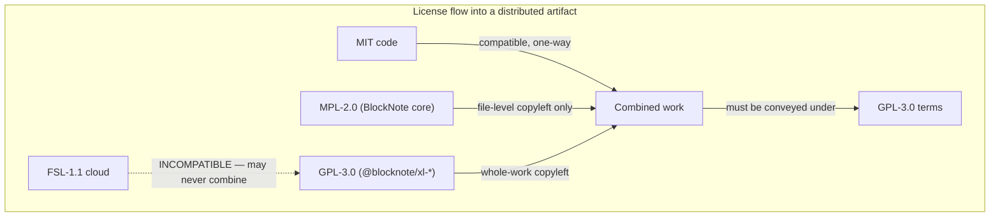
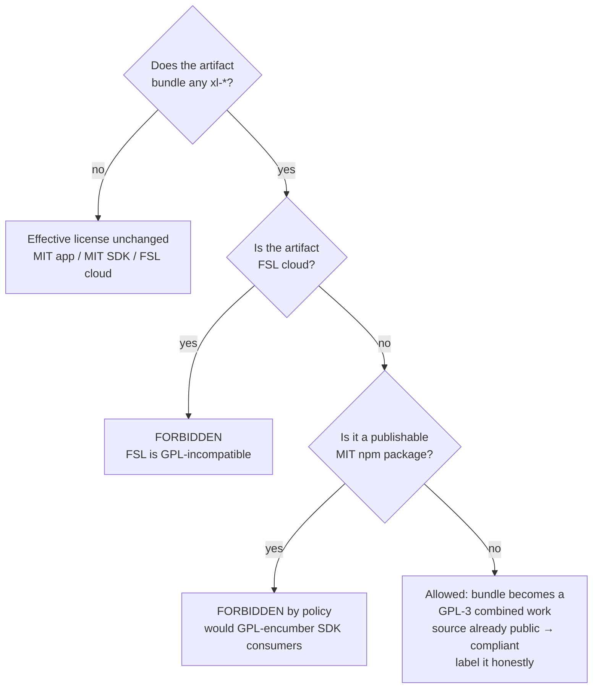
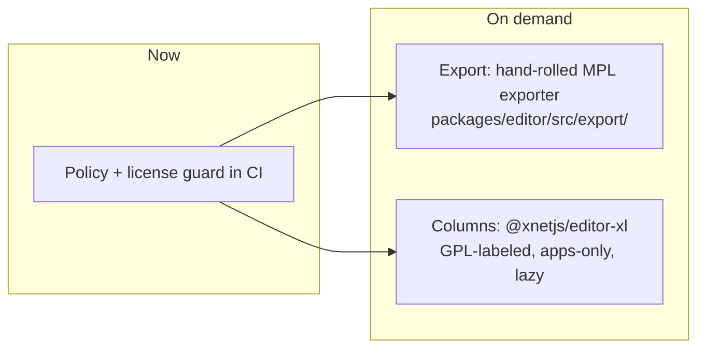

# BlockNote XL: Can An MIT Project Use It For Free, And What Would It Unlock?

## Problem Statement

xNet's editor (`@xnetjs/editor`, exploration 0312) is built on BlockNote's core
packages, which are MPL-2.0 and unproblematic. BlockNote's premium features —
multi-column layouts, PDF/DOCX/ODT/Email exporters, and in-editor AI — ship as
separate `@blocknote/xl-*` packages that are "free for open source projects"
under GPL-3.0, or $195/month commercially.

Two questions:

1. **Licensing.** The marketing says "free for GPL-3 projects." xNet's core is
   MIT, with two FSL-1.1 cloud packages. Can an MIT-licensed project use the XL
   packages for free, and what strings are attached?
2. **Capability.** If we did integrate XL (under whichever license), what
   concrete product gaps would it close, given what
   `packages/editor/src/blocknote/XNetEditor.tsx` already does?

## Executive Summary

**Yes, an MIT project can use BlockNote XL for free — the eligibility test is
GPL-3.0 *compliance*, not being GPL-licensed — but the copyleft attaches to
every artifact that bundles it, and that collides with two xNet promises.**

- All seven XL packages are dual-licensed **`GPL-3.0 OR PROPRIETARY`**
  (verified on npm at 0.51.4, the exact version we pin). It is plain GPL-3.0,
  **not AGPL** — there is no network-use clause.
- MIT is GPL-compatible in one direction: MIT code may be combined with GPL-3
  code, and the **combined work as distributed is governed by GPL-3**. Our own
  files stay MIT, but any bundle that includes XL (the web app's JS payload,
  the Electron installer, an npm package depending on it) must be conveyed
  under GPL-3 terms.
- Compliance is trivially satisfiable for us (full source is already public),
  **but**:
  - putting XL inside any **publishable MIT npm package** would silently impose
    GPL obligations on every SDK consumer — breaking the MIT promise;
  - **FSL-1.1 is not GPL-compatible**, so XL must never reach
    `packages/cloud` / `apps/cloud` bundles;
  - downstream forks of the app lose the option to go closed-source on any
    build that includes the XL path — an asterisk on the "MIT core" story.
- What XL would buy us, mapped against the repo: **PDF/DOCX/ODT export**
  (we currently have none), **multi-column layouts** (declined in 0312),
  **email rendering** of documents, and a polished **in-editor AI UX** (we
  deliberately built our own AI surface on markdown projection instead).

**Recommendation:** keep XL out of the MIT core and the default app bundle
(consistent with the 0328 tldraw precedent). If/when document export becomes a
real user demand, prefer (a) a hand-rolled exporter on the MPL-2.0 surface
(Block JSON → `docx`/`pdfmake`, both MIT), or (b) an **opt-in, GPL-3.0-labeled
lab package** loaded dynamically only in the open-source apps. Keep the $195/mo
commercial license in the back pocket for xNet Cloud only.

## Current State In The Repository

Mapped by a full-repo sweep:

- **Integration surface.** `packages/editor/src/blocknote/XNetEditor.tsx`
  (723 lines) wraps BlockNote 0.51.4, bound to the `content-v4`
  Y.XmlFragment. Deps are only the free tier: `@blocknote/core`,
  `@blocknote/react`, `@blocknote/mantine` (all pinned `0.51.4` in
  `packages/editor/package.json`; `packages/devtools/package.json` also pulls
  `@blocknote/core`). `apps/expo/src/components/WebViewEditor.tsx` loads core
  from a CDN inside a WebView.
- **Already built on the free tier:** custom schema
  (`packages/editor/src/blocknote/schema.ts`) with 7 block specs (callout,
  embed, pageEmbed, databaseEmbed, taskViewEmbed, mermaid, richLink), 4 inline
  specs (mention, hashtag, wikilink, inlineMath), the `aiGenerated`
  provenance style; custom slash/`@`/`#`/`[[` menus; threaded comments via
  `CommentsExtension` (free, non-XL) with the node-backed
  `xnet-thread-store.ts`; Yjs collaboration with awareness cursors; tables;
  custom paste-to-embed handling.
- **Export today:** none of PDF/DOCX/ODT/email. The only converters are
  hand-rolled markdown paths — `legacy-import.ts` (TipTap→markdown, one-time
  import) and the AI surface projection
  (`packages/plugins/src/ai-surface/page-markdown.ts`).
- **AI-in-editor today:** deliberately *not* `@blocknote/xl-ai`. 0312 says
  "PORT — reimplement against BlockNote block APIs (not XL-AI)"; the result is
  the markdown AI surface plus the `aiGenerated` mark (0234 humane-provenance).
- **License topology:** root `LICENSE` is MIT; the only non-MIT manifests are
  `packages/cloud/package.json` and `apps/cloud/package.json`
  (`FSL-1.1-Apache-2.0`). A plugin-license guard already exists:
  `scripts/check-plugin-licenses.mjs` (root `package.json` →
  `check:plugin-licenses`).
- **Prior decisions on record:**
  - 0297 (off-the-shelf editor): flagged XL as "GPL-3.0/commercial ($195/mo)".
  - 0312 (TipTap→BlockNote): "no GPL/paid XL packages (columns/PDF/AI-XL) — we
    don't need"; "No multi-column layout for us unless we pay or build it."
  - 0328 (tldraw): the standing precedent — **no non-MIT-compatible editor
    dependency in MIT core; gate behind an opt-in labs plugin pending legal
    comfort**.

## External Research

### The XL catalog and its exact license

Seven packages live under `packages/xl-*` in
[TypeCellOS/BlockNote](https://github.com/TypeCellOS/BlockNote):

| Package | Feature |
| --- | --- |
| `@blocknote/xl-multi-column` | Notion-style column layouts |
| `@blocknote/xl-pdf-exporter` | Block JSON → PDF (react-pdf based) |
| `@blocknote/xl-docx-exporter` | Block JSON → Word |
| `@blocknote/xl-odt-exporter` | Block JSON → OpenDocument |
| `@blocknote/xl-email-exporter` | Block JSON → HTML email |
| `@blocknote/xl-ai` | In-editor AI editing UI (streaming suggest/accept/reject) |
| `@blocknote/xl-ai-server` | Server proxy for the AI package |

npm registry metadata for every one of them at **0.51.4** (the version we pin):
`"license": "GPL-3.0 OR PROPRIETARY"`. The in-repo `LICENSE` file for the XL
packages is the verbatim GNU GPL v3 text — **not** AGPL, so §0's "conveying"
is the only trigger; running XL on a server without distributing it imposes
nothing.

### What "free for open source" actually means

BlockNote's own framing ([pricing](https://www.blocknotejs.org/pricing),
[commercial license](https://www.blocknotejs.org/legal/blocknote-xl-commercial-license))
is: use the GPL-3.0 option if you can comply with it; buy the commercial
license "if you cannot comply." The commercial agreement never enumerates
qualifying open-source licenses — **the test is GPL-3.0 compliance of your
combined work, not the identity of your project's license.**

That is where MIT projects land, via standard one-way compatibility:

- MIT code **may** be incorporated into a GPL-3 combined work (MIT is
  GPL-compatible; its terms are a subset).
- The reverse is false: the combined work cannot be conveyed under MIT. Any
  artifact that includes GPL-3 code must be conveyed under GPL-3, with
  corresponding source available.
- Your own files can keep their MIT headers. The *work as a whole* — the
  bundle, the installer, the published package with the dependency — carries
  GPL-3 obligations for whoever conveys it.

Two conveyance subtleties that matter for xNet specifically:

1. **Serving a web app's JS bundle to browsers is conveying.** The FSF's
   position (the "JavaScript trap") is that JS shipped to the client is
   distributed object code. So bundling `xl-*` into `apps/web` makes the
   served bundle a GPL-3 combined work — satisfiable for us (source is
   public), but real.
2. **GPL-3 ≠ AGPL: server-side use is unencumbered.** `xl-ai-server`, or an
   export endpoint that runs `xl-docx-exporter` in the hub and returns the
   file, involves no conveying of the XL code at all — only its *output*,
   which GPL does not restrict.

And one incompatibility that is absolute: **FSL-1.1-Apache-2.0 is a
source-available license, not GPL-compatible.** `packages/cloud` and
`apps/cloud` can never bundle XL under the free option, full stop.

### Commercial option

- Business tier: **$195/month** ($2,340/yr), covering **one Application** —
  defined as one production web domain (dev/staging excluded) or one
  executable. Web + Electron would likely be two licenses (or an Enterprise
  conversation). 30-day non-production trial. Startup (<5 employees)
  discounts exist.
- Crucially, a commercial license covers **the licensee's** application. It
  does nothing for downstream self-hosters of xNet: anyone forking xNet and
  deploying closed-source would need their own license. Commercial licensing
  therefore cannot "clean" the open-source distribution — it only makes sense
  for a specific deployment we ourselves operate (xNet Cloud).

### Prior art

Open-source Notion alternatives that use BlockNote (e.g. Docmost, AGPL-3.0)
sit naturally inside the copyleft option because their whole application is
already copyleft. Projects with permissive cores generally do what 0312/0328
did: stay on the MPL tier and rebuild or skip the XL features.

## Key Findings

1. **"Free for GPL-3 projects" is marketing shorthand.** The real rule:
   free iff the combined work you convey complies with GPL-3.0. MIT projects
   qualify — at the price of the combined artifact becoming GPL-governed.
2. **The direction of contamination is per-artifact, not per-repo.** Our MIT
   files stay MIT. Only bundles that *include* XL flip. This makes a clean
   architectural boundary possible.
3. **Three hard red lines** fall out of xNet's topology:
   - No XL dependency in any **publishable MIT npm package** (`@xnetjs/editor`
     is the danger zone — it is exactly where the integration would naturally
     go).
   - No XL in **FSL cloud** bundles (license-incompatible, not merely
     awkward).
   - No XL in the default story without labeling — the "MIT, weights you can
     hold" positioning (0292) is damaged by a silent GPL asterisk on the app.
4. **GPL-3 (not AGPL) opens a server-side loophole we can use cleanly:** an
   export service in the hub that runs XL exporters and returns files conveys
   nothing. Only client-bundled XL (columns, AI UI) triggers copyleft on the
   app.
5. **The capability gaps XL closes are real but unequal.** Document export
   (PDF/DOCX) is a genuine hole — we have literally no export today. Columns
   were consciously deferred. The AI UX was consciously rebuilt in-house.

## Options And Tradeoffs

### Option A — Status quo: stay on the MPL tier

What 0312 chose. No new capability, no new obligation, positioning stays
clean. The export hole remains open.

- - Zero legal surface, zero cost.
- - Consistent with 0328 (tldraw) precedent.
- − No PDF/DOCX export, no columns; users who need "give me this page as a
  document" are stuck with copy-paste.

### Option B — Hand-roll exporters on the MPL surface

BlockNote's document model is plain JSON (`editor.document`), and we already
project it to markdown for the AI surface. A DOCX/PDF exporter is a mapping
from Block JSON to the MIT-licensed [`docx`](https://www.npmjs.com/package/docx)
/ `pdfmake`/`react-pdf` libraries — exactly what the XL exporters are
internally, minus their polish (headers/footers, nested tables, image
resolution through our `xnet-blob://` CID scheme need doing by hand).

- - Fully MIT; shippable in `@xnetjs/editor` or a new
  `packages/editor/src/export/` area; benefits SDK consumers too.
- - Our custom blocks (callout, mermaid, databaseEmbed…) need bespoke
  rendering *in any exporter* — XL wouldn't know them either; we pay that cost
  regardless.
- − Real engineering (est. days-to-weeks for good DOCX+PDF), ongoing
  maintenance as blocks evolve.

### Option C — GPL-gated opt-in package (the tldraw-labs pattern)

A new workspace package, e.g. `@xnetjs/editor-xl`, with
`"license": "GPL-3.0-only"` in its manifest, **excluded from the publishable
set** (`.changeset/config.json` ignore + `check-plugin-licenses.mjs` guard),
depended on **only** by `apps/web`/`apps/electron`, and loaded via dynamic
`import()` so the main bundle stays XL-free until the user enables the
feature. It would register the multi-column specs into the schema and expose
export commands.

- - Free; gets the *actual* XL polish (columns especially — the hardest to
  hand-roll well, drop-cursor UX and all).
- - Boundary is explicit and machine-checkable; effective-license flip is
  labeled, not silent.
- − The apps' distributed bundles (web JS, Electron installers) become GPL-3
  combined works whenever the module is included; README/LICENSE must say so;
  downstream closed-source forks must strip it.
- − Chunk-size caution: 0297 found >6MB chunks break the PWA — exporters pull
  heavy deps (react-pdf), so the dynamic-import split is mandatory, not
  optional.

### Option D — Server-side XL exporters in the hub (GPL, no conveyance)

Run `xl-docx-exporter`/`xl-pdf-exporter` inside the hub (MIT, but it's *our
deployment's* runtime — self-hosters get the same hub source, which is fine:
the hub package would carry the GPL dep, so the **hub's published npm package**
would hit red line #1). To stay clean it would have to be an optional,
GPL-labeled hub plugin — same shape as Option C but server-side. GPL-3's lack
of a network clause means a hosted "export as DOCX" endpoint conveys nothing
to end users.

- - No client-bundle contamination at all for hosted use.
- − Export requires a hub round-trip (offline/local-first users lose it —
  against the grain of the product).
- − Distributing the hub with the plugin still conveys; the labeling burden
  returns.

### Option E — Commercial license ($195/mo) for xNet Cloud only

Covers exactly one production domain. Would let the cloud deployment ship XL
features in its bundle without copyleft. Does nothing for self-hosters or the
open-source apps.

- − Creates a cloud-only feature gap vs. the open-source app — inverted from
  the usual open-core model and confusing ("the free app has fewer editor
  features than cloud, but cloud is the same code…").
- − Recurring cost before any user demand is demonstrated.

## Recommendation

**Answer the licensing question with a yes-with-asterisk, and don't act on it
yet.**

1. **Now (docs-only):** record the boundary as policy — XL is usable for free
   by MIT xNet, but only in artifacts that (a) are not publishable MIT npm
   packages, (b) are not FSL cloud, and (c) label the resulting bundle as a
   GPL-3 combined work. Extend `scripts/check-plugin-licenses.mjs` to fail if
   any `@blocknote/xl-*` (or other GPL dep) appears in a publishable
   package's manifest — turning the policy into a machine check.
2. **When document export becomes a demanded feature:** prefer **Option B**
   (hand-rolled MPL-clean exporter) because our custom blocks need bespoke
   export rendering under any option, which erodes most of XL's head start —
   and an MIT exporter helps SDK consumers, not just our apps.
3. **If/when column layouts get prioritized:** that is where XL's value is
   hardest to replicate; do it as **Option C** (`@xnetjs/editor-xl`,
   GPL-labeled, dynamic-import, apps-only) — the same gate 0328 established
   for tldraw.
4. **Skip** the commercial license (E) unless xNet Cloud specifically needs
   XL UX that the open-source app has chosen not to bundle; skip in-editor
   `xl-ai` entirely — the markdown AI surface + `aiGenerated` provenance mark
   is a deliberate, humane-charter-aligned design, not a gap.

## Risks And Open Questions

- **Is serving web JS "conveying"?** We treat yes (FSF position) as the
  planning assumption. A contrary reading would relax web-app constraints but
  not Electron (installers are unambiguous distribution). Do not plan around
  the lenient reading.
- **`GPL-3.0` vs `GPL-3.0-only/or-later`:** the npm expression is bare
  `GPL-3.0`; the shipped text is GPLv3. Treat as v3-only for conservatism.
- **Schema coupling:** `xl-multi-column` registers block specs into
  `BlockNoteSchema.create` — meaning the *schema module* in `@xnetjs/editor`
  would need an injection seam (accept extra specs from the app) to keep the
  GPL dep out of the MIT package. That seam is cheap now, expensive later.
- **Marketplace interaction:** a GPL editor plugin cannot be sold closed
  through the paid marketplace (0196) — fine, but the marketplace's license
  metadata should be able to express "GPL-3.0, source-required".
- **Upstream relicensing risk:** BlockNote could tighten XL to AGPL (some of
  their own copy already says "AGPL" loosely) or raise prices; a pinned
  version keeps rights for that version, but security fixes would force a
  decision. Another argument for the hand-rolled exporter.
- **Expo WebView:** the CDN-loaded editor in `apps/expo` would need its own
  treatment if XL ever went in — loading GPL code from a CDN into the WebView
  is still conveying by the app.

## Implementation Checklist

- [ ] Add a "GPL boundary" section to `packages/editor/README` (or
      `docs/`): XL usable only per red lines (no publishable MIT pkg, no FSL
      cloud, label combined bundles).
- [ ] Extend `scripts/check-plugin-licenses.mjs` to fail CI if any
      publishable package (per `scripts/changeset/publishable-pathspec.mjs`)
      declares a `@blocknote/xl-*` or otherwise GPL/AGPL dependency.
- [ ] (Deferred, on demand) Exporter spike: Block JSON → `docx` (MIT lib) for
      the default blocks + callout/mermaid/table, images resolved via
      `xnet-blob://`; land under `packages/editor/src/export/`.
- [ ] (Deferred, on demand) Schema injection seam: let apps pass extra
      block/inline specs into `createXNetSchema(...)` so a future
      `@xnetjs/editor-xl` can register columns without touching the MIT
      package.
- [ ] (Deferred, if columns prioritized) Create `@xnetjs/editor-xl` with
      `"license": "GPL-3.0-only"`, `"private": true` or changeset-ignored;
      dynamic-import from `apps/web`/`apps/electron`; add the GPL notice to
      both apps' third-party-license output.

## Validation Checklist

- [ ] `check:plugin-licenses` (extended) passes on main and fails on a test
      branch that adds `@blocknote/xl-multi-column` to `packages/editor`.
- [ ] `node scripts/changeset/publishable-pathspec.mjs` confirms any future
      `editor-xl` package is outside the publishable set.
- [ ] If the exporter spike lands: exporting a seeded page (dev-tools Seed
      panel) containing every custom block produces a DOCX that opens in Word
      without repair warnings.
- [ ] If `editor-xl` lands: `apps/web` production build shows XL code only in
      a lazily-loaded chunk (<6MB, per the 0297 PWA constraint), absent from
      the entry bundle.

## References

- [BlockNote pricing](https://www.blocknotejs.org/pricing) — XL catalog, tiers,
  "free for open source" framing.
- [BlockNote XL Commercial License](https://www.blocknotejs.org/legal/blocknote-xl-commercial-license)
  — dual-license terms, per-application scope, 30-day trial.
- [TypeCellOS/BlockNote](https://github.com/TypeCellOS/BlockNote) — XL package
  sources; `packages/xl-*/LICENSE` is verbatim GPLv3.
- npm registry, `@blocknote/xl-*@0.51.4` — `"license": "GPL-3.0 OR PROPRIETARY"`
  (verified 2026-07-18 for all six published XL packages).
- [Release v0.19.0](https://github.com/TypeCellOS/BlockNote/releases/tag/v0.19.0)
  — introduction of columns + exporters as XL.
- In-repo: `docs/explorations/0297_[x]_OFF_THE_SHELF_NOTION_LIKE_EDITOR.md`
  (§licensing), `docs/explorations/0312_[x]_TIPTAP_TO_BLOCKNOTE_EDITOR_MIGRATION.md`
  (§203-208 license note, §105 XL-AI decision),
  `docs/explorations/0328_[_]_TLDRAW_CANVAS_ALTERNATIVE.md` (labs-gating
  precedent), `packages/editor/src/blocknote/XNetEditor.tsx`,
  `scripts/check-plugin-licenses.mjs`.
