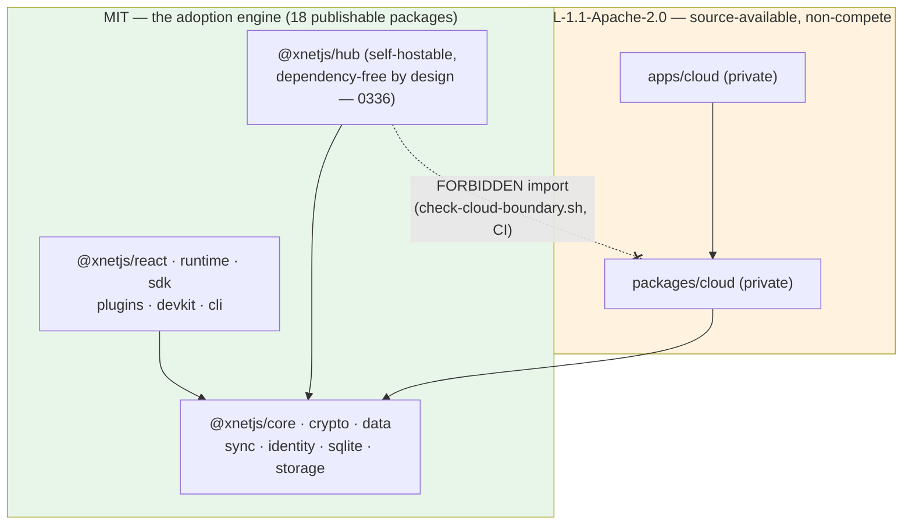
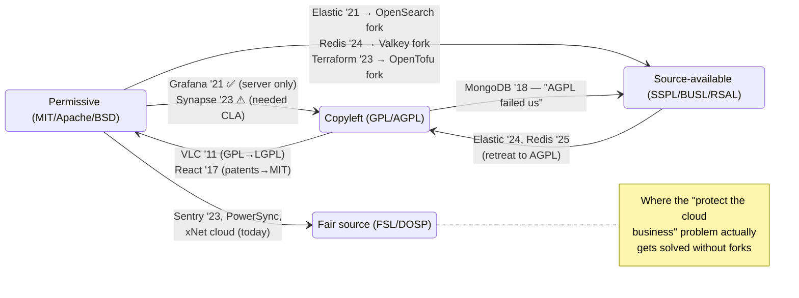
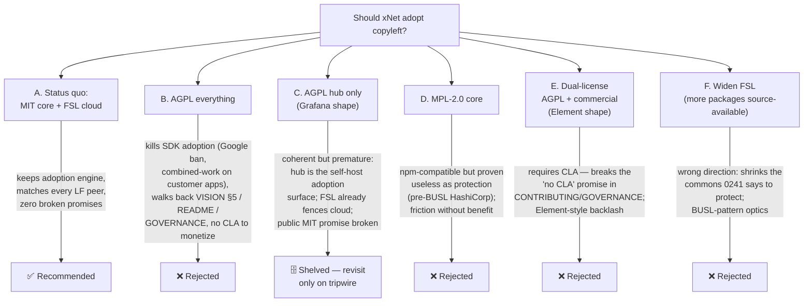

# Copyleft Licensing: Is There a Case to Move xNet to GPL or AGPL?

**Exploration 0343** · Status: `[_]` unimplemented · 2026-07-18

> Question: Is there a case to move xNet into a copyleft license like GPL or
> AGPL? Would it align with the vision of the project?

## Problem Statement

xNet's stated vision is anti-enclosure: user-owned data, no vendor lock-in,
"software that serves instead of extracts" ([`docs/VISION.md`](../VISION.md),
[`docs/CHARTER.md`](../CHARTER.md)). Copyleft licenses (GPL-3.0, AGPL-3.0) are
the classic legal instrument for exactly that politics — they use copyright to
guarantee that downstream users always receive source and freedoms. On its
face, copyleft looks like the natural license for a project whose charter
refuses "machinery hurtful to commonality."

Meanwhile xNet today ships **18 publishable npm packages under MIT** plus a
source-available **FSL-1.1-Apache-2.0 cloud layer**, with a CI-enforced
boundary between them. Would moving some or all of that to GPL/AGPL better
serve the vision — or quietly destroy the adoption engine the vision depends
on? This exploration answers that with the repo's actual license surface, the
2018–2025 relicensing prior art, and the mechanics of copyleft in the npm
ecosystem.

## Executive Summary

**Recommendation: No — do not move xNet to GPL or AGPL.** Keep the current
MIT-core + FSL-cloud open-core split, and write the rationale down so the
question has a durable answer.

Four load-bearing findings:

1. **Copyleft on an npm SDK is adoption-fatal, not protective.** A GPL/AGPL
   `@xnetjs/react` or `@xnetjs/data` makes every downstream app a combined
   work — each customer app must itself go (A)GPL or negotiate an exception.
   Corporate policy treats AGPL as radioactive (Google bans it outright).
   Every widely adopted local-first peer — Automerge, Yjs, Jazz, DXOS, Evolu,
   ElectricSQL, Zero, PowerSync's SDKs — is MIT/Apache. The single AGPL
   entrant (Triplit) built neither a moat nor an ecosystem.
2. **Copyleft doesn't deliver the protection it promises.** MongoDB was
   *already AGPL* and concluded it failed against cloud providers (hence
   SSPL); AWS answered SSPL with API-emulation (DocumentDB) and answered
   Elastic/Redis's license changes with forks (OpenSearch, Valkey) that won
   the distros. RedMonk found no revenue inflection from any restrictive
   relicensing. xNet's actual competition surface — managed cloud — is
   already fenced by FSL, the same conclusion Sentry and PowerSync reached.
3. **The vision's anti-enclosure guarantees are architectural, not
   license-borne.** The Charter's Exit and Commons commitments are enforced by
   the open protocol spec, portable DIDs, the export path, and BYO hubs — a
   fork or a proprietary consumer of the SDK cannot enclose *user data*,
   because the protocol keeps it portable. Copyleft would protect the *code*
   at the cost of the *reach* the Trojan-horse strategy
   (`docs/VISION.md` §"The Strategic Play") requires.
4. **The only coherent copyleft variant — AGPL on the hub binary only, the
   Grafana/Synapse shape — is possible but not currently worth it.** It would
   contradict the public MIT promise in `README.md`, `docs/VISION.md` §5, and
   `GOVERNANCE.md`; and monetizing it (selling AGPL exceptions) requires a
   CLA, which the project deliberately rejected (`CONTRIBUTING.md`: "There is
   no CLA"). Element's CLA-plus-AGPL move drew sustained community backlash.

The one genuine alignment between copyleft and the xNet vision — keeping
*improvements to the commons* in the commons — is better addressed by the
tripwire list in the Recommendation section than by relicensing today.

## Current State In The Repository

### License inventory

| Surface | License | Where |
| --- | --- | --- |
| Root repo | MIT, © 2026 Chris Smothers (single holder) | [`LICENSE`](../../LICENSE) |
| 18 publishable `@xnetjs/*` packages (core, data, react, sync, hub deps, …) | MIT (every one) | each `packages/*/package.json` |
| `packages/cloud` + `apps/cloud` | FSL-1.1-Apache-2.0 (source-available, non-compete; converts to Apache-2.0 after 2 years) | `packages/cloud/LICENSE`, `apps/cloud/LICENSE` |
| Six periphery packages with their own MIT LICENSE files | MIT | `packages/{runtime,abuse,billing,devkit,slack-compat,trust}/LICENSE` |

No publishable package is FSL — both FSL targets are `private: true`. The FSL
boundary is CI-enforced by `scripts/check-cloud-boundary.sh`
(`.github/workflows/ci.yml`): only `apps/cloud` may depend on
`@xnetjs/cloud`, and the self-hostable hub must never import it, "so the MIT
adoption engine never takes an FSL / stripe / @aws-sdk dependency."

### Public commitments a copyleft move would walk back

- [`docs/VISION.md`](../VISION.md) §"Guiding Principles" 5: **"Open source
  (MIT)"** — MIT is named in the vision itself, not just in metadata.
- [`README.md`](../../README.md): MIT badge; License section promising "MIT —
  see `LICENSE`" with the FSL carve-out for `@xnetjs/cloud` only.
- [`GOVERNANCE.md`](../../GOVERNANCE.md): "The code is MIT and the protocol is
  open"; inbound=outbound under DCO, "does **not** require a CLA."
- [`CONTRIBUTING.md`](../../CONTRIBUTING.md): DCO section — "There is **no
  CLA** and no copyright assignment"; enforced per-commit by
  `.github/workflows/dco.yml`.
- [`docs/CHARTER.md`](../CHARTER.md) §2 Exit / §6 Commons: "the code is free
  to fork and re-implement; the name only protects users from confusion."

### Decisions already on the record

- **Exploration 0174** made the open-core call: "Keep the client/SDK/hub
  **MIT** (unchanged — it's the adoption engine)" and fence managed hosting
  with FSL-1.1 (the Sentry model). 0180/0181 implemented and consolidated
  that seam; 0181's title is literally "…Get the License Boundary Right."
- **Exploration 0241** (legal structure) names the failure mode this
  exploration must answer to: the common late-stage pressure is
  "**relicensing the open core to block competitors** (HashiCorp→BSL)…" and
  recommends resisting it by keeping the commons legally distinct and leaning
  on FSL for the commercial layer.
- **Exploration 0335** (release readiness) graded governance/legal "A" on the
  strength of exactly this split.
- **Copyleft is not alien to the repo**: `AGPL-3.0-only` is already an
  *approved third-party plugin license* in
  `packages/plugins/src/ecosystem/license-policy.ts`
  (`ALLOWED_PLUGIN_LICENSES`), and the BlockNote dependency was chosen
  knowingly at the MPL-2.0/GPL seam — MPL core packages are used, the
  GPL-3.0 `@blocknote/xl-*` packages are deliberately avoided (0312, 0342).
  The project already practices exactly the discrimination this exploration
  is about: weak copyleft in, strong copyleft only where it can't infect the
  publishable surface.
- **No GPL/AGPL dependency exists anywhere in the first-party tree** — a
  relicense to GPL/AGPL would be legally *possible* from a dependency
  standpoint (MIT deps compose into GPL works), but nothing forces it.

### Relicensing mechanics for xNet specifically

- MIT → (A)GPL is one-way compatible: xNet can relicense future releases at
  will, and single-copyright-holder status (0242: "relicensing/transfer is
  trivial _now_") means no VLC-style contributor hunt — *today*. Every commit
  merged under DCO inbound=outbound narrows that freedom: contributors
  licensed their patches under MIT, which can be *included* in an AGPL work,
  but the project gains no exclusive dual-licensing rights over them. Selling
  AGPL exceptions (the Element/MongoDB-classic model) therefore requires a
  CLA — which `CONTRIBUTING.md` and `GOVERNANCE.md` explicitly promise not to
  impose.
- All existing MIT releases remain MIT forever. Anyone can fork the last MIT
  tag — exactly how OpenSearch, Valkey, and OpenTofu were born within days of
  their upstreams' relicenses.

## External Research

### Prior art: every major relicense 2018–2025 and what actually happened

| Project | Move | Outcome |
| --- | --- | --- |
| Grafana (2021) | Apache-2.0 → AGPL — **server only**; client libs/plugins stayed Apache | No fork; $270M ARR by 2024. The one clean success — and it's an *application users run*, not a library they embed |
| Element/Synapse (2023) | Apache-2.0 → AGPL + **new CLA** for dual licensing | Worked mechanically (Element held most copyright), but sustained community backlash ("endangers Matrix"); AGPL became the funnel to proprietary Synapse Pro |
| MongoDB (2018) | **AGPL → SSPL**, because MongoDB judged AGPL §13 too weak against cloud hosts | Debian/RHEL/Fedora dropped it; AWS shipped DocumentDB (API emulation, zero MongoDB code). Revenue grew — but RedMonk finds no license-attributable inflection |
| Elastic (2021→2024) | Apache-2.0 → SSPL/ELv2 → **added AGPL back** | AWS forked → OpenSearch; departed users largely didn't return; relicense was no revenue cure |
| Redis (2024→2025) | BSD → RSAL/SSPL → **added AGPL back** | Valkey fork won the distros and ElastiCache default within a year; Redis retreated to AGPL as "most restrictive license that still counts as open source" |
| HashiCorp/Terraform (2023) | MPL-2.0 → BUSL | OpenTofu fork under Linux Foundation; ~38% of users evaluating alternatives; $6.4B IBM acquisition read as the real motive |
| Sentry (2023) | BSL → **FSL** (created it), explicitly rejecting AGPL: "not permissive enough… FSL can be adopted where AGPL is outside of policy" | The license xNet's cloud layer already uses |
| React (2017) | BSD+Patents → **MIT** (reverse direction) | ASF ban + WordPress defection forced retreat — canonical proof that license friction on a JS library destroys ecosystem adoption |
| VLC/libVLC (2011) | GPL → **LGPL** (reverse direction) | Had to chase ~150 copyright holders, rewrite non-responders' code — why relicensing without a CLA is a one-shot door |

The pattern across all of it: **the direction of travel for libraries and
SDKs is toward permissive; copyleft survives only on self-contained server
applications; source-available triggers forks when hyperscalers care; and the
fork always starts from your last permissive tag.**

### Why AGPL is uniquely bad for an npm SDK

- **Combined-work mechanics.** Per the FSF's own FAQ, a GPL library makes
  "the entire combination" GPL, static or dynamic. A bundled SPA that
  includes an AGPL `@xnetjs/data` *conveys* that code to every browser —
  minified bundles are not "the preferred form for modification," so the
  downstream app owes its actual source to every visitor. For a local-first
  stack whose whole point is running in the client, AGPL §13 subtleties don't
  even matter: browser delivery is classic conveying, and the copyleft
  attaches to the customer's whole app.
- **Corporate blanket bans.** Google: AGPL code "cannot be used… under any
  circumstances." Open Core Ventures: "AGPL is a non-starter for most
  companies." Sentry built FSL specifically for orgs "where AGPL is outside
  of policy." An AGPL SDK is unreviewable by the median corporate legal team
  — the developer never even gets to argue the merits.
- **Ecosystem norms.** npm is ~53% MIT / ~15% Apache-2.0; copyleft is a
  rounding error, and the local-first niche is even more lopsided (§4 of the
  research: every significant client library is MIT/Apache; PowerSync runs
  the identical FSL-service + permissive-SDK split xNet has).
- **It doesn't even protect.** The feared exploiter of a local-first SDK is
  app builders — the exact people the Trojan-horse strategy exists to
  recruit. The cloud-competitor threat lands on the hub/cloud layer, where
  FSL already sits and where AGPL demonstrably failed MongoDB.

### Weak-copyleft middle grounds

- **MPL-2.0** (file-level copyleft — the BlockNote-core license): the only
  copyleft that is genuinely npm-compatible. But it buys ~nothing:
  pre-BUSL Terraform/Vault/Consul were all MPL-2.0, which neither protected
  HashiCorp's business nor prevented its panic. Cost: real friction (source
  availability duties for bundlers), benefit: modifications-to-our-files-only
  sharing that a motivated free-rider trivially avoids by wrapping.
- **LGPL-3.0**: designed for relinkable shared libraries; fits
  webpack/vite/Rollup bundles poorly (is a bundle a combined work? can the
  user "relink"?) — ambiguity that scares legal teams nearly as much as GPL.
- **EUPL-1.2**: network copyleft without viral linking, but its own
  compatibility matrix lets downstream re-license into MPL et al., so the
  protection launders away; essentially unknown in npm.

## Key Findings

1. xNet already made — and CI-enforces — the industry-consensus answer:
   permissive SDK + fair-source cloud (the PowerSync/Sentry shape), decided
   in 0174 and hardened in 0180/0181. A copyleft move would be a reversal of
   a working decision, not a fresh choice.
2. The strongest pro-copyleft argument available — the vision's
   anti-enclosure politics — is already served by stronger machinery than a
   license: the normative protocol spec (`docs/specs/protocol/`), portable
   `did:key` identity, the signed hash-chained change log, workspace export,
   and BYO hubs. Enclosure of *user data* is defeated architecturally;
   copyleft only governs *code*, and xNet's code being forked into a
   proprietary app doesn't strand any user, because their data stays
   portable. This is the Charter's own framing: Exit and Commons are
   receipts in code, not clauses in a license.
3. Copyleft would break the strategy the vision explicitly depends on. Phase
   2 of the Trojan horse is "Developer SDK → Third-party Apps → Enterprise
   Deployments" (`docs/VISION.md`). GPL/AGPL on `@xnetjs/*` forces every
   third-party app to be copyleft or negotiate — with no CLA in place, xNet
   couldn't even sell the exception. The license would tax exactly the
   builders the roadmap courts, while the hyperscaler threat it aims at is
   (a) not present at xNet's stage and (b) historically undeterred by AGPL.
4. Single-copyright-holder status makes relicensing *mechanically* easy today
   and progressively harder with every outside DCO contribution — but "easy"
   cuts both ways: the community knows a single-vendor MIT project can
   relicense at any time, which is precisely why 0241 recommends structural
   commitments (foundation/steward split, trademark policy) over license
   maximalism, and why doing the reverse now would read as a HashiCorp-shaped
   signal.
5. There *is* a bounded, defensible copyleft niche if circumstances change:
   AGPL on the **hub server binary only** (never any `@xnetjs/*` library),
   the Grafana/Synapse shape. It stays OSI-open-source, doesn't touch app
   builders, and targets exactly the "run our server as a service"
   free-rider. It is not warranted now — the hub is the adoption engine for
   self-hosters and its MIT promise is all over the public docs — but it is
   the *only* variant worth keeping on file.

## Options And Tradeoffs

### A. Status quo — MIT core + FSL cloud (recommended)

- **For**: adoption engine intact; matches Automerge/Yjs/Jazz/Electric/Zero
  norms and the PowerSync split exactly; the anti-strip-mining problem is
  solved where it actually lives (cloud, via FSL non-compete); no public
  promise broken; DCO stays; FSL's 2-year Apache-2.0 conversion is itself a
  commons-friendly commitment copyleft doesn't make.
- **Against**: a well-resourced actor may someday embed the MIT SDK in a
  proprietary product and contribute nothing. True — and priced in: that
  actor spreads the protocol, and the protocol is where user freedom lives.

### B. AGPL across all packages

- **For**: maximal ideological legibility; guaranteed source for all
  derivatives; matches the "commons" branding at the level of symbolism.
- **Against**: everything in §"Why AGPL is uniquely bad for an npm SDK";
  reverses 0174/0180/0181; breaks VISION §5, README, GOVERNANCE promises;
  without a CLA there is no commercial exception to sell, so it's cost with
  no revenue mechanism; the last MIT tag becomes the community's fork point
  (Valkey pattern) — worst case xNet AGPL-forks *itself* out of its own
  ecosystem.

### C. AGPL on the hub binary only (Grafana/Synapse shape)

- **For**: the one shape with a success precedent; OSI-approved; doesn't
  touch app builders; targets managed-hosting free-riders specifically;
  client SDKs stay MIT so the Trojan horse is unaffected.
- **Against**: xNet's hub is deliberately "MIT and dependency-free" as the
  *self-hosting adoption surface* (0336) — the audience most likely to
  self-host (homelab, gov, enterprise pilots per 0336's "gov =
  self-host+support") includes exactly the orgs with AGPL bans; the
  free-rider it deters is already deterred harder by FSL on the managed-cloud
  layer; and Element only monetized it via a CLA. Shelve, don't adopt.

### D. MPL-2.0 on core packages

- **Against (decisive)**: HashiCorp ran the whole company on MPL-2.0 and it
  provided so little protection they jumped to BUSL anyway. All friction, no
  fence.

### E. Dual-license AGPL + commercial exceptions

- **Against (decisive)**: requires a CLA (DCO grants no exclusive relicensing
  rights), and `CONTRIBUTING.md`/`GOVERNANCE.md` explicitly promise "no CLA."
  Breaking that promise is the Element backlash with none of Element's
  decade of accumulated copyright.

### F. Widen the FSL surface instead

- **Against**: 0241's warning is about exactly this creep ("relicensing the
  open core to block competitors"). The FSL fence is credible *because* it is
  small and CI-audited (`check-cloud-boundary.sh`); growing it erodes the "A"
  grade 0335 gave the governance story.

## Recommendation

**Stay MIT (core) + FSL-1.1-Apache-2.0 (cloud). Decline GPL/AGPL. Convert
this exploration's analysis into a short public licensing-rationale doc, and
codify tripwires that would legitimately reopen the question.**

Copyleft does not align with the vision — it aligns with a *reading* of the
vision that locates user freedom in code licensing. xNet's vision locates it
in data architecture: the Charter's receipts for Own/Exit/Commons are the
protocol spec, portable identity, export, and BYO hubs, and none of them get
stronger under AGPL. What AGPL would change is who can embed the SDK — and
the answer would exclude most of the developers Phase 2 of the vision needs.

Concrete next steps:

1. **Write `docs/LICENSING.md`** (or a README §expansion): why MIT core, why
   FSL cloud, why not GPL/AGPL/MPL — three paragraphs, linking here. This
   converts a recurring question into a settled reference, the same way
   GOVERNANCE.md settled the CLA question.
2. **Codify the reopen-tripwires** in that doc, so "never copyleft" is not
   dogma but a monitored position. Reopen Option C (AGPL hub only) only if
   **all** of: (a) a commercial operator is running *modified, unpublished*
   hubs as a competing managed service at material scale — the specific harm
   AGPL §13 addresses; (b) the FSL cloud layer demonstrably cannot fence it
   (the operator competes with self-hosted-hub support, not with xNet
   Cloud); and (c) the project is willing to also adopt the CLA that
   monetizing it requires, with the community cost that entails.
3. **Keep the existing guardrails honest**: `check-cloud-boundary.sh` stays
   in CI; `ALLOWED_PLUGIN_LICENSES` keeps admitting AGPL *plugins* (copyleft
   at the edge is fine — it's copyleft in the publishable core that's fatal);
   the BlockNote GPL `xl-*` red line from 0342 stands.
4. **Preserve relicensing optionality without exercising it**: single-holder
   copyright is an asset; 0241's structural work (LLC→PBC, trademark,
   eventual foundation custody of the MIT core) is the durable version of
   the anti-enclosure commitment — pursue that instead of a license change.

## Risks And Open Questions

- **Risk: the question recurs and gets re-litigated ad hoc.** Mitigated by
  step 1 (public rationale doc). This is the third licensing-adjacent
  exploration (0174, 0241/0242, 0342); the marginal value now is in writing
  the answer down where contributors see it.
- **Risk: DCO accretion forecloses Option C later.** Every outside
  contribution under DCO is MIT-licensed and *can* be carried into an AGPL
  hub (MIT is GPL-compatible), so Option C technically survives — but
  exclusive commercial-exception rights are lost the moment meaningful
  outside copyright exists. If the project ever seriously anticipates the
  Element model, the CLA decision has to come *before* the contributor base
  grows, which is a reason to decide the tripwires now.
- **Risk: "source-available" reputation contagion.** FSL is not OSI open
  source; critics occasionally lump FSL projects with BUSL/SSPL moves. The
  defense is the current shape: *nothing publishable* is FSL, and FSL
  converts to Apache-2.0 in 2 years. Keep it that way.
- **Open question: protocol-level protection.** The truly xNet-native answer
  to enclosure isn't code licensing at all — it's conformance. A
  "certified-interoperable" trademark program (0242) plus the conformance
  corpus (`conformance/`) polices the ecosystem behavior copyleft can't
  reach (a proprietary app that speaks the protocol but breaks Exit).
  Worth its own exploration if third-party implementations appear.
- **Open question: EUPL/network-copyleft for future federation
  infrastructure.** If the Phase 3/4 federation layer (global indexes,
  incentivized providers) ever ships as separate server components, the
  Grafana calculus may apply to *those* — they'd be new code with no MIT
  promise attached. Flag for whichever exploration designs them.

## Implementation Checklist

- [ ] Add `docs/LICENSING.md`: rationale for MIT core + FSL cloud, explicit
      "why not GPL/AGPL/MPL" section, link to this exploration.
- [ ] Add the three reopen-tripwires for AGPL-hub (Option C) to that doc.
- [ ] Link `docs/LICENSING.md` from `README.md` §License and from
      `GOVERNANCE.md`.
- [ ] Add one line to `docs/VISION.md` §"Open by Default" clarifying the
      split ("MIT SDK + fair-source cloud (FSL→Apache-2.0)") so the vision
      doc and README can't drift apart.
- [ ] Confirm `scripts/check-cloud-boundary.sh` also asserts that no
      *publishable* package ever carries a non-MIT license field (cheap
      ratchet: today that's true by inspection, not by CI).
- [ ] Cross-link this exploration from 0241 (legal structure) and 0342
      (BlockNote XL) so the licensing series is navigable.

## Validation Checklist

- [ ] `docs/LICENSING.md` exists, renders, and is linked from README and
      GOVERNANCE.
- [ ] CI passes with the extended `check-cloud-boundary.sh` assertion, and a
      deliberate test mutation (flip one publishable package to
      `"license": "AGPL-3.0-only"`) fails it.
- [ ] `grep -r "GPL" packages/*/package.json` returns nothing (no accidental
      copyleft in publishable metadata).
- [ ] The next time the copyleft question is asked (issue, discussion, or
      contributor), it can be answered with a link, not a thread.

## References

**Repository**: [`LICENSE`](../../LICENSE) · [`README.md`](../../README.md) ·
[`GOVERNANCE.md`](../../GOVERNANCE.md) · [`CONTRIBUTING.md`](../../CONTRIBUTING.md) ·
[`docs/VISION.md`](../VISION.md) · [`docs/CHARTER.md`](../CHARTER.md) ·
`scripts/check-cloud-boundary.sh` · `.github/workflows/dco.yml` ·
`packages/plugins/src/ecosystem/license-policy.ts` · explorations 0174, 0180,
0181, 0241, 0242, 0312, 0335, 0336, 0342.

**Relicensing announcements (primary sources)**:
Element→AGPL <https://element.io/blog/element-to-adopt-agplv3/> ·
Grafana→AGPL <https://grafana.com/blog/grafana-loki-tempo-relicensing-to-agplv3/> ·
MongoDB→SSPL FAQ <https://www.mongodb.com/legal/licensing/server-side-public-license/faq> ·
Elastic returns to AGPL <https://www.elastic.co/blog/elasticsearch-is-open-source-again> ·
Redis 8 AGPL <https://redis.io/blog/agplv3/> ·
Sentry FSL <https://fsl.software/> ·
AWS OpenSearch <https://aws.amazon.com/blogs/opensource/stepping-up-for-a-truly-open-source-elasticsearch/> ·
Valkey year one <https://www.linuxfoundation.org/blog/a-year-of-valkey> ·
OpenTofu <https://opentofu.org/> ·
React→MIT <https://engineering.fb.com/2017/08/18/open-source/explaining-react-s-license/> ·
libVLC→LGPL <https://www.videolan.org/press/lgpl-libvlc.html>

**Analysis**:
Google AGPL policy <https://opensource.google/documentation/reference/using/agpl-policy> ·
GNU GPL FAQ (library copyleft) <https://www.gnu.org/licenses/gpl-faq.html#IfLibraryIsGPL> ·
Kyle Mitchell, "Reading AGPL" <https://writing.kemitchell.com/2021/01/24/Reading-AGPL> ·
MPL-2.0 FAQ (minified JS) <https://www.mozilla.org/en-US/MPL/2.0/FAQ/> ·
RedMonk, licensing changes vs financial outcomes <https://redmonk.com/rstephens/2024/08/26/software-licensing-changes-and-their-impact-on-financial-outcomes/> ·
OCV, "AGPL is a non-starter" <https://www.opencoreventures.com/blog/agpl-license-is-a-non-starter-for-most-companies> ·
Ronacher, FSL vs AGPL <https://lucumr.pocoo.org/2024/9/23/fsl-agpl-open-source-businesses/> ·
DCO vs CLA <https://opensource.com/article/18/3/cla-vs-dco-whats-difference> ·
SFC, "you don't need a CLA" <https://sfconservancy.org/blog/2014/jun/09/do-not-need-cla/>

**Local-first ecosystem licenses**:
Automerge MIT <https://github.com/automerge/automerge> ·
Yjs MIT <https://github.com/yjs/yjs> ·
ElectricSQL Apache-2.0 <https://github.com/electric-sql/electric> ·
PowerSync FSL service + Apache/MIT SDKs <https://www.powersync.com/blog/new-open-era-for-powersync> ·
Jazz MIT <https://github.com/garden-co/jazz> ·
DXOS MIT <https://github.com/dxos/dxos> ·
Evolu MIT <https://github.com/evoluhq/evolu> ·
Zero Apache-2.0 <https://zero.rocicorp.dev/docs/open-source> ·
Triplit AGPL <https://github.com/aspen-cloud/triplit>
