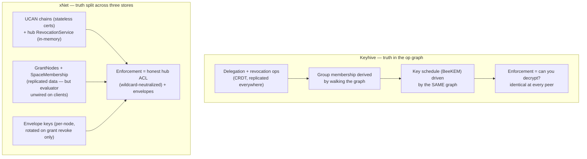
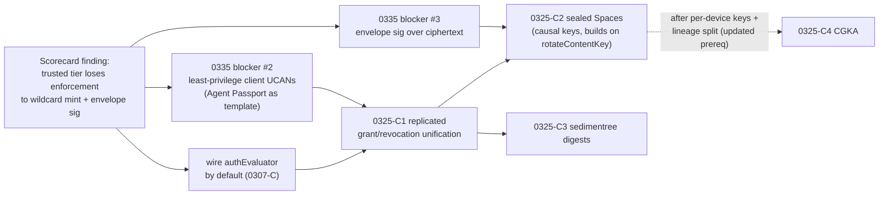

# xNet Auth vs Keyhive: A Dimension-by-Dimension Comparison

> Exploration 0343 · 2026-07-18 · status: unimplemented
>
> Prompt: "how does xnet auth compare to keyhive?
> https://www.inkandswitch.com/keyhive/notebook/"
>
> Companion to 0325 (`KEYHIVE_LOCAL_FIRST_ACCESS_CONTROL_LESSONS`), which
> answered "what can we harvest from Keyhive?" This document answers the
> different question "how do the two auth systems actually compare, today?" —
> and updates the picture with what has shipped since 0325 was written
> (2026-07-14 → now: 0337 Agent Passport, 0338 ATProto identity, several
> 0307-B hub mechanisms).

## Problem Statement

Keyhive (Ink & Switch, <https://www.inkandswitch.com/keyhive/notebook/>) and
xNet both answer the same question: **how do you do access control for
local-first data when you can't rely on an always-online, always-trusted
server?** They start from strikingly similar substrates — a signed,
hash-linked operation DAG with deterministic merge — and end up with very
different auth architectures:

- Keyhive is a **single-tier, crypto-enforced** design: the ability to
  decrypt *is* access control, enforced identically at every peer, with
  capability state and encryption keys co-managed in one CRDT.
- xNet is a **two-tier, hub-mediated** design: a trusted hub enforces ACLs
  (and provides search, indexes, mentions parsing in exchange for seeing
  plaintext), while an E2EE envelope substrate exists underneath — real but
  only partially load-bearing.

Five earlier explorations touch Keyhive (0081/0085, 0192, 0258, 0301) and
0325 read it in depth. What none of them provide is a **side-by-side
scorecard**: for each auth dimension — identity, capabilities, groups,
enforcement locus, encryption, revocation, sync, maturity — where does each
system sit, where is xNet ahead, where behind, and did anything change since
0325? That is this document.

## Executive Summary

**Same destination, opposite starting corners.** xNet's own aspiration is
written at the top of `packages/core/src/auth-types.ts:1`: *"the ability to
decrypt IS access control."* That sentence is a description of Keyhive's
*current* architecture and of xNet's *intended* one. Today:

| Dimension | Keyhive | xNet today | Who's ahead |
|---|---|---|---|
| Identity | Every principal/doc is a pubkey; device groups first-class | `did:key` Ed25519 root; ATProto global names + recovery anchors shipped (0338); account-ledger device records with epochs | **xNet** on real-world identity (names, recovery, OAuth); **Keyhive** on device/key hygiene |
| Capability model | Convergent capabilities: delegation graph *with* CRDT state; Pull < Read < Write < Admin | UCAN cert chains (attenuation, aud, nonce, trustedDids) + hub grant index + schema policy engine (roles, CRUD split, Space cascade) | **xNet** richer policy language; **Keyhive** cleaner revocation story |
| Enforcement locus | Every peer, cryptographically (decryptability) | Honest hub (neutralized by wildcard client mint) + optional client evaluator (unwired by default) + envelopes | **Keyhive** structurally |
| Groups/membership | Groups = pattern over delegations; membership ops are CRDT ops with key consequences | `SpaceMembership` nodes in the change log + nested cascade (0181) — CRDT ops **without** key consequences (except per-node rotation on grant revoke) | Tie on data model; **Keyhive** on key coupling |
| Encryption | Causal chunk keys + BeeKEM CGKA; PCS yes, FS deliberately no | Per-node XChaCha20 envelopes, X25519 wrap, per-node rotation; sig omits ciphertext (open blocker); X25519 derived from signing seed | **Keyhive** on design; **xNet** on actually shipping *something* |
| Revocation | Native in the op graph, offline-capable, future-only | Three list-based surfaces (hub token revocation, signed share revocations, grant cascade + key rotation) — deny-wins survives even the wildcard bug | **Keyhive** conceptually; xNet's is real and layered but hub-anchored |
| Blind-server sync | Beelay: RIBLT + sedimentree, server never reads content | Hub re-verifies every change (not a dumb pipe) but reads plaintext; no set reconciliation (0258 blocker) | **Keyhive** on blind sync; **xNet** on trusted-hub value (search/index) |
| Maturity | Pre-alpha research, unaudited, empty threat model, no product | Shipping product; authz graded C in 0335 with 2 of 4 release blockers in this area | **xNet** — by forfeit |

**Bottom line:** Keyhive is a better *theory* of local-first access control;
xNet is a better *system* that currently pays for its product features
(search, indexes, recovery, global names, agents) with a trusted-hub
assumption — and two known blockers (wildcard client UCAN, envelope
signature gap) that make even that tier weaker than designed. The comparison
does not change 0325's harvest-not-adopt verdict; it sharpens the gap list
and records that roughly half of the 0307-B perimeter has shipped since.

## Current State In The Repository

0325 §"Current State" mapped this in depth; here we record the deltas and
the comparison-relevant anchors, verified against the working tree.

### What shipped since 0325 (doc/code drift, in xNet's favor)

1. **0307-B hub mechanisms are real now.** `packages/hub/src/auth/ucan.ts`
   enforces audience (`audienceAccepted`, must match `hubDid`/`publicUrl`),
   checks a `RevocationService` (`packages/hub/src/auth/revocation.ts:17`)
   on every WS connect and HTTP request, honours per-token nonces, and
   applies a `trustedDids` root policy (`checkTrustedRoots`). 0325's line
   "revocation is exactly the external-state problem" is still structurally
   true, but the external state now *exists and is checked*.
2. **Agent Passport (0337, PR #533).**
   `packages/identity/src/agent-passport.ts:70` mints per-agent `did:key`s
   with operator-signed attenuated UCANs and **explicitly rejects wildcard
   capabilities** (`isWildcard`, `agent-passport.ts:47`). Agents are now the
   *least*-privileged principals in the system — ironically ahead of human
   users, whose client still self-mints `{with:'*', can:'hub/*'}`.
3. **ATProto identity (0338, PR #536).** Global handles, OAuth login,
   bidirectional signed binding (`packages/identity/src/atproto/binding.ts`),
   recovery-seed-derived PLC rotation key at higher priority than the PDS
   (`packages/identity/src/atproto/rotation-key.ts`). Keyhive has nothing in
   this dimension — no naming, no recovery, no external-identity story.
4. **Account-ledger device records.** 0325 said "no device identity"; that
   is now only half-true. The account ledger
   (`packages/data/src/schema/schemas/account-ledger-enforce.ts:91`) tracks
   devices and controllers with **monotonic epochs**, is enforced on both
   hub and client ingest (`packages/data/src/store/store.ts:1843`), and
   envelope recipients expand DID → active devices
   (`packages/data/src/auth/recipients.ts:35`). What's still missing for a
   CGKA is per-device *keypairs with independent lineage* — devices share
   the account key material, and X25519 still derives from the Ed25519 seed
   (`packages/crypto/src/key-resolution.ts`).
5. **Grant revocation has key consequences.** Also under-credited in 0325:
   `StoreAuthManager.revoke` (`packages/data/src/auth/store-auth.ts:253`)
   cascades to child grants **and rotates the per-node content key**,
   re-wrapping for remaining recipients. That is a coarse, per-node version
   of exactly the "membership change ⇒ key change" coupling Keyhive builds
   BeeKEM for.

### The comparison anchors (unchanged)

- **Signed op DAG:** `packages/sync/src/change.ts:44` (`Change<T>` v4 —
  blake3 content hash, per-author `parentHash` chain, Ed25519 sig),
  `packages/core/src/lww.ts:60` (grinding-resistant LWW tiebreak). Both
  ingest points re-verify hash + signature
  (`packages/data/src/store/store.ts:1886`,
  `packages/hub/src/services/node-relay.ts`). This is the same substrate
  shape Keyhive builds on.
- **Policy engine:** `packages/core/src/auth-types.ts` (7 actions incl. the
  0304 create/update refinements, expression AST, membership resolver with
  the 0181 ancestor cascade at `:393`),
  `packages/data/src/auth/evaluator.ts:416` (`DefaultPolicyEvaluator.can`).
  Far richer than Keyhive's four rungs — and **optional, unwired by default
  on clients** (0307 finding #1).
- **Hub enforcement order:** `packages/hub/src/ws/authorize.ts:81` — expiry
  → `shareAccess.isDenied` (hard deny, survives wildcard, `:109`) →
  public-profile rooms → `hasHubCapability` (**wildcard short-circuits
  here**, `:146`) → grant index → Space cascade → deny.
- **Envelopes:** `packages/crypto/src/envelope.ts:218` — per-node content
  key, XChaCha20-Poly1305, per-recipient X25519 wrap, `PUBLIC_RECIPIENT`
  sentinel. Open blocker: `createSignatureMessage` (`envelope.ts:167`)
  **omits ciphertext/nonce/wrapped-key values** (0335 blocker #3).
- **Standing blockers (0335):** wildcard client mint
  (`packages/react/src/provider/use-hub-auth-token.ts:10`), envelope
  signature gap, Electron deterministic dev key, no SECURITY.md.

## External Research

0325 §"External Research" covers the Keyhive notebook (entries 00–05),
repo, FOSDEM talk, KIT verification paper, and p2panda comparison in depth
— not repeated here. The notebook facts load-bearing for *this* comparison:

- **Three layers** (notebook 01): convergent capabilities (delegation graph
  with CRDT state; every document is a public key; Pull < Read < Write <
  Admin) → group-management CRDT (groups are a *pattern* over delegations;
  nested; documents are groups) → causal encryption + BeeKEM (chunk keys
  embed causal-predecessor keys; CGKA over causal order only, no
  sequencer).
- **Deliberate stances** (notebook 01/02): no forward secrecy (CRDTs need
  full history anyway); new members read all history; revocation is
  future-only; concurrent admin conflicts resolved by deterministic merge
  ("conflict keys", highest-non-blank-descendant rule); no back-dating ops
  into revocation windows.
- **Beelay** (notebook 05): authenticated RPC (sender key, audience hash,
  timestamp — note: Keyhive independently arrived at the same
  audience-binding fix xNet shipped for 0307-B), RIBLT set reconciliation
  (~240 bytes for a 5-item diff of billion-item sets), sedimentree chunking
  by hash trailing-zeros with heads→root traversal. Server stays blind;
  metadata leakage bounded, not eliminated.
- **Status** (notebook 04 + repo): pre-alpha since March 2025, "DO NOT use
  in production," unaudited, `design/threat_model.md` an empty stub, Beelay
  moved to `automerge/beelay` (WIP). Active (pushes through 2026-07) but
  still research.

## Key Findings

### 1. The two systems disagree on *where truth lives*, and that one choice explains every other difference



Keyhive has **one** authority — the replicated capability graph — and
derives membership, keys, and enforcement from it. xNet has **three**
partially-connected authorities: UCAN chains + hub revocation lists
(transport), GrantNodes/SpaceMembership (data-layer policy, replicated but
client-unwired), and envelope key state (crypto). 0325's "co-management"
lesson is precisely the observation that these three never fully touch.
Notably, xNet's *ingredients* are each fine — grants and memberships already
ARE signed ops in the replicated log, and grant revocation already rotates
keys. The gap is coupling, not machinery.

### 2. xNet's revocation is more *layered* than 0325 gave it credit for — but every layer anchors on the hub or on per-node coarseness

```mermaid
sequenceDiagram
    participant A as Admin
    participant H as Hub
    participant B as Bob (revoked)
    Note over A,B: xNet — three revocation surfaces
    A->>H: revoke UCAN token / DID (RevocationService, in-memory)
    H--xB: WS session killed; future connects denied
    A->>A: StoreAuthManager.revoke(grant) — cascades to child grants
    A->>A: rotateContentKey(node) — re-wrap for remaining recipients
    A->>H: sync grant-revocation node
    H--xB: shareAccess.isDenied — hard deny (survives wildcard)
    Note over B: Bob keeps old content keys + already-synced plaintext (future-only)
    Note over A,B: Keyhive — one surface
    A->>A: revocation op in capability CRDT
    A-->>B: op replicates peer-to-peer (no server needed)
    Note over B: BeeKEM blanks Bob's leaf + path → group rekeys;<br/>Bob cannot derive future keys. Also future-only.
```

Both systems are honest that revocation is **future-only** — neither can
un-reveal history. The difference: Keyhive's revocation converges between
two peers syncing directly with no server; xNet's strongest surface
(`isDenied`) requires the hub, its token surface evaporates on hub restart
(in-memory), and its key surface (rotation) is per-node re-wrap — O(nodes ×
recipients) where BeeKEM is O(log n). xNet's compensating advantage: the
deny check survives even the wildcard bug, and *issuer-signed* share
revocations (`packages/identity/src/sharing/revocation.ts:56`) are portable
signed facts — halfway to Keyhive's replicated revocation ops already.

### 3. xNet's policy language is much richer; Keyhive's is much more enforceable

Keyhive has four rungs (Pull/Read/Write/Admin). xNet has seven actions with
create/update refinement semantics (0304), an allow/deny expression AST,
four role-resolver kinds, field-level rules, and a nested-Space cascade
(0181). But Keyhive's four rungs are enforced by cryptography at every
peer, while xNet's rich engine `DefaultPolicyEvaluator` **defaults to
undefined on clients** and the hub checks only room-level capability — which
a self-minted wildcard satisfies. Rich-but-unwired vs poor-but-absolute.
The Pull rung is worth stealing conceptually: "may relay ciphertext but not
read it" is exactly the zero-knowledge-hub role 0258 designs toward, and
xNet has no name for it in `AUTH_ACTIONS`.

### 4. Identity: the systems are complementary, not competing

Keyhive's identity model is minimal by design — keys all the way down,
device groups solving multi-device, and *nothing* for naming, discovery,
account recovery, or login UX (out of scope for a research lab). xNet since
0338 has the whole human layer: ATProto handles as global names, OAuth
login, seed/Shamir/passkey recovery, recovery anchors, PLC rotation-key
sovereignty — while keeping the same `did:key`-as-root discipline Keyhive
uses (0338 finding #1 cites Keyhive reaching the same "identity binding
sits above the capability system" conclusion). Where Keyhive is strictly
ahead: per-device keypairs with independent lineage (xNet devices share
account key material) and signing/encryption key separation (xNet's X25519
derives from the Ed25519 seed — one leaked seed compromises both planes).

### 5. The trusted hub is a genuine feature Keyhive cannot express — and xNet's differentiator, if honestly labelled

Keyhive's server is blind by construction; it can never do server-side
search, indexes, mention parsing (`node-relay.ts` reads
`change.payload.properties.mentions` today), webhooks-on-content, or
retention policies. xNet's two-tier ambition — trusted-hub Spaces (default,
full server features) beside sealed Spaces (E2EE, 0325-C2) — is a superset
of Keyhive's model *if* the trusted tier's perimeter actually holds. Today
it doesn't fully: the wildcard client mint means room ACLs are advisory for
any authenticated peer, so the "trusted hub" tier currently provides
integrity (signatures re-verified) and revocation-denial, but not
confidentiality between users of the same hub. That is the single most
consequential difference between the systems as deployed.

### 6. Maturity inverts the comparison

Every architectural point above favours Keyhive; every operational point
favours xNet. Keyhive: pre-alpha, unaudited, empty threat model, unresolved
concurrency edge cases (mutual admin revocation etc. deferred to future
write-ups), welded to Automerge's binary format, sync layer mid-move to
another repo. xNet: in production, golden-vectored protocol kernel,
property-tested LWW, real users — with a C-graded authz layer and two open
release blockers. Keyhive cannot be adopted; it can only be learned from
(0325's verdict, unchanged).

## Options And Tradeoffs

This is a comparison document, so the "options" are stances toward the gap
the comparison reveals, not new engineering tracks — those live in 0325's
C0–C4 program and 0335's blocker list.

### Option A — Treat the comparison as informational only

File the scorecard; change nothing about priorities.

- **Pros:** zero cost; 0325 + 0335 already carry the work items.
- **Cons:** wastes the sharpest finding — that the *trusted tier's* two
  blockers (wildcard mint, envelope sig) are what make xNet lose the
  enforcement dimension even on its home turf. That urgency belongs in the
  release-blocker conversation, not a drawer.

### Option B — Reprioritize: close the trusted-tier perimeter before any Keyhive-shaped crypto work

Order: 0335 blockers #2/#3 (wildcard mint → least-privilege client UCANs;
envelope signature over ciphertext) and wiring `authEvaluator` by default,
*before* starting 0325-C1 (replicated grant/revocation unification) or C2
(sealed Spaces).

- **Pros:** the comparison shows xNet's differentiator is the two-tier
  model, and the trusted tier is the one users have today; these are also
  already-agreed release blockers (0335), so this is sequencing, not new
  scope. Every C1/C2 design decision gets easier once the perimeter is
  real (e.g. recipients computation is already keyed off the same grant
  state).
- **Cons:** defers the structurally-superior Keyhive-shaped work; the
  wildcard fix has UX cost (clients must obtain scoped tokens — the Agent
  Passport flow is the template, `mintAgentPassport` already rejects
  wildcards).

### Option C — Jump straight to the Keyhive-shaped end-state (C1/C2 first)

Build replicated capability state + sealed Spaces now; let the perimeter
blockers be subsumed by the crypto layer.

- **Pros:** goes directly at the architecture gap; sealed Spaces would make
  the wildcard bug moot *for sealed content*.
- **Cons:** 0325 already rejected this ordering (C0 "close the perimeter
  first" is the stated prerequisite); sealed mode is opt-in, so default
  Spaces would stay wildcard-exposed for the whole build; capability-CRDT
  edge cases are genuinely unsolved even by Keyhive's team.

### Option D — Re-evaluate adopting Keyhive code given a year of maturation

- **Pros:** due diligence; `beekem` is cleanly factored.
- **Cons:** checked in this research — still pre-alpha, still unaudited,
  threat model still empty, Beelay still "very much a work in progress."
  Nothing has changed the 0325 rejection. Keep the ~2026-Q4 re-review
  reminder from 0325 instead.

## Recommendation

**Option B: use this comparison to sharpen sequencing — perimeter first,
then the 0325 harvest program.** Concretely:

1. **This doc's contribution is the scorecard + updated gap list.** The
   canonical work items stay where they are: 0335 blockers #2/#3 for the
   perimeter, 0325 C1–C4 for the Keyhive-shaped end-state. Do not fork a
   third program.
2. **Elevate one sentence into the release conversation:** until the
   wildcard client mint is replaced, xNet's trusted tier provides integrity
   and revocation-denial but **not confidentiality between users of the
   same hub** — which means today's deployed xNet is *behind* Keyhive's
   design on the one dimension both systems treat as the point
   (enforcement), while being ahead on nearly everything else.
3. **Adopt two small Keyhive vocabulary items when C1 begins:** (a) a
   `pull`-style relay-only rung in `AUTH_ACTIONS` (names the
   zero-knowledge-hub role 0258 needs); (b) Keyhive's stance documentation
   style — write xNet's future-only-revocation / full-history-for-new-
   members / no-FS positions down in the sealed-Space spec verbatim, as
   they did.
4. **Correct 0325's record where the code moved:** account-ledger device
   records + epochs exist (C4's prerequisite is now "independent per-device
   keypairs + signing/encryption lineage split," not "no device identity"),
   and grant revocation already rotates per-node content keys (C2 can build
   on `rotateContentKey` rather than starting cold).



## Risks And Open Questions

- **Scoped client UCANs have a real UX/plumbing cost.** The wildcard mint
  exists because clients don't know their room set at connect time. The
  Agent Passport flow shows the shape, but human clients need incremental
  capability acquisition (request-on-first-access) — design work 0335
  gestures at but nobody has specced.
- **Does the rich policy engine survive crypto-enforcement?** Field-level
  rules and relation-resolver roles are easy for an evaluator, hard for an
  encryption boundary (you can't encrypt a node differently per field per
  role without key explosion). The two-tier answer — rich policy in trusted
  Spaces, coarse rungs in sealed Spaces — should be stated as a product
  position, not discovered later.
- **Keyhive may yet solve the edge cases first.** Mutual admin revocation,
  revoked-dependency ops, back-dating — if their future write-ups land
  before C1 starts, steal the analysis (the KIT invariants remain the
  property-test frame either way).
- **Per-node key rotation cost at scale.** `rotateContentKey` re-wraps per
  recipient per node; a large Space revocation touches every node. 0318's
  10M-row data suggests measuring before C2 commits to per-node (vs
  per-chunk) keying.
- **Is "Pull" worth a protocol-visible action?** Adding a rung to
  `AUTH_ACTIONS` touches `auth-types.ts` consumers and the 0304 fallback
  table; alternatively the relay-only role can stay a hub-internal concept
  until zero-knowledge hubs (0258) are actually built.

## Implementation Checklist

Deliberately thin — this exploration's output is analysis routed to existing
programs, not a new track:

- [x] Surface finding #5 (trusted-tier confidentiality gap) in the 0335
      release-blocker discussion; confirm blockers #2/#3 stay ahead of any
      0325-C1/C2 start.
- [x] Amend 0325: C4 prerequisite updated (device *keypairs* + lineage
      split, not device *identity* — ledger devices/epochs exist); C2 notes
      `rotateContentKey` (`packages/data/src/auth/store-auth.ts:283`) as
      the existing membership⇒key coupling to extend.
- [ ] When C1 begins: evaluate adding a relay-only (`pull`-style) rung to
      `AUTH_ACTIONS` in `packages/core/src/auth-types.ts` (decide
      protocol-visible vs hub-internal; see open question).
- [ ] When C2's sealed-Space spec is written: include the explicit stance
      section (future-only revocation, full history for new members, no
      forward secrecy) mirroring Keyhive's `causal_encryption.md` honesty.
- [ ] Keep 0325's ~2026-Q4 reminder to re-review `inkandswitch/keyhive` +
      `automerge/beelay` (audit? threat model? Beelay stable?) — no
      separate reminder needed.

## Validation Checklist

- [ ] The scorecard's "shipped since 0325" claims are code-verified (each
      cited file/line exists on main): audience enforcement + revocation +
      nonce + trustedDids in `packages/hub/src/auth/`, Agent Passport
      wildcard rejection, ATProto binding/rotation modules, ledger device
      epochs, `rotateContentKey` cascade.
- [ ] 0325's amendment lands (C4 prerequisite + C2 rotateContentKey note)
      and the two docs cross-reference each other.
- [ ] The 0335 conversation has an explicit decision recorded: perimeter
      blockers sequenced before (or consciously parallel to) 0325-C1/C2.
- [ ] If the `pull` rung is adopted: 0304's `grantActionSatisfies` fallback
      table extended + property tests updated; if rejected: the decision
      and reason recorded here or in C1's design doc.

## References

- Keyhive lab notebook: <https://www.inkandswitch.com/keyhive/notebook/>
  (entries 00 Background, 01 Welcome/three layers, 02 BeeKEM, 03 Naming,
  04 Pre-Alpha, 05 Syncing/Beelay)
- Keyhive repo: <https://github.com/inkandswitch/keyhive>; Beelay:
  <https://github.com/automerge/beelay>
- KIT formal verification of Keyhive-inspired capabilities:
  <https://arxiv.org/html/2604.23560>
- xNet explorations: 0325 (Keyhive lessons — companion doc), 0307 (security
  audit), 0335 (release readiness blockers), 0338 (ATProto identity), 0337
  (Agent Passport), 0304 (CRUD split), 0181 (Space cascade), 0258
  (multi-home sync), 0324 (ATProto permissioned data), 0313 (p2panda)
- Key code anchors: `packages/core/src/auth-types.ts`,
  `packages/data/src/auth/evaluator.ts`,
  `packages/data/src/auth/store-auth.ts`,
  `packages/hub/src/auth/ucan.ts`, `packages/hub/src/ws/authorize.ts`,
  `packages/crypto/src/envelope.ts`,
  `packages/identity/src/agent-passport.ts`,
  `packages/identity/src/atproto/binding.ts`,
  `packages/react/src/provider/use-hub-auth-token.ts` (wildcard mint)
