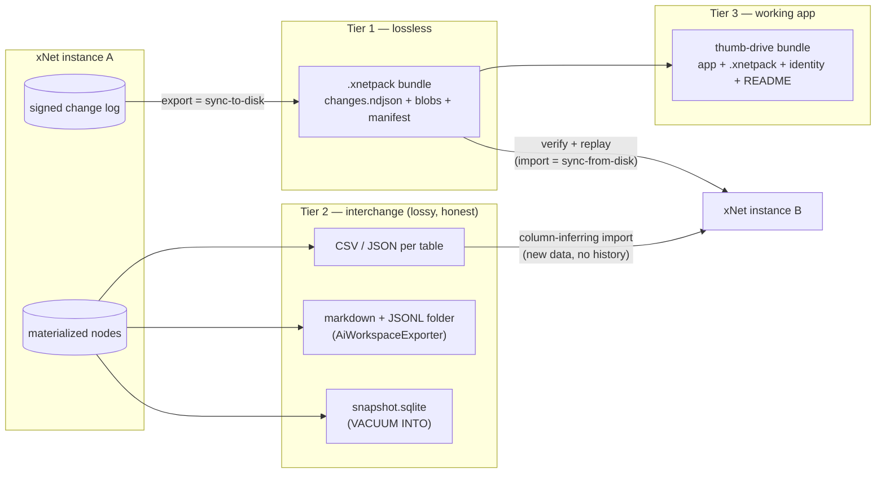
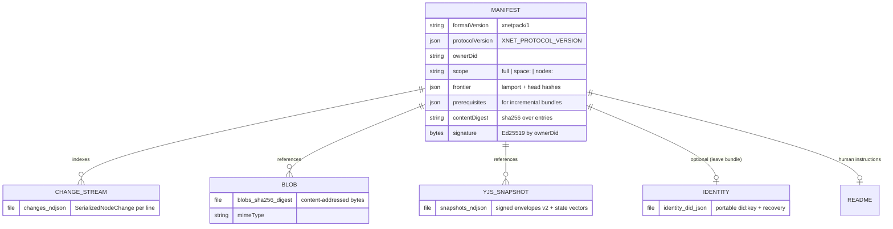
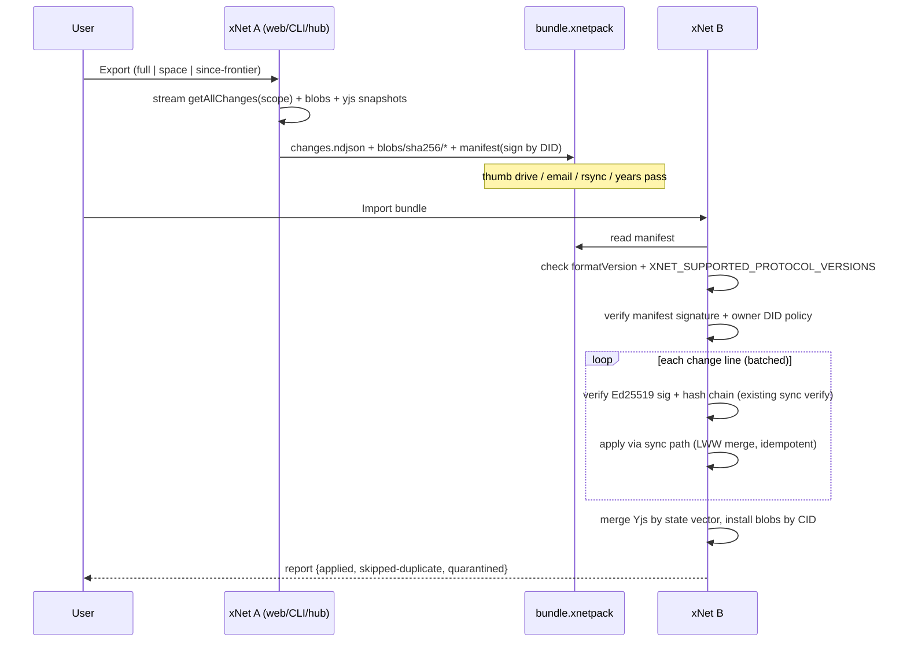
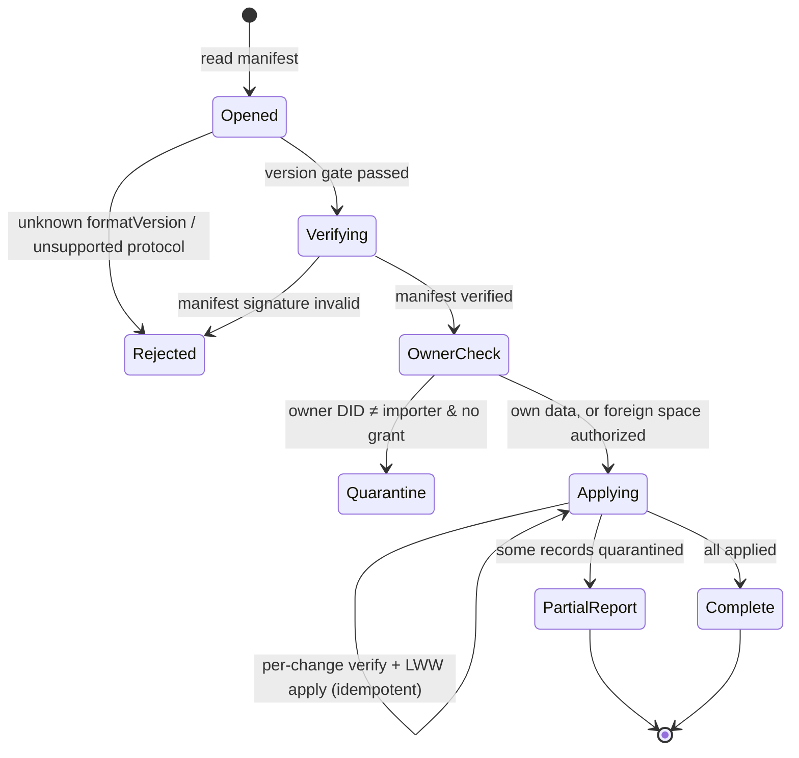

# First-Class Data Export/Import And Portable Bundles

## Problem Statement

Moving data in and out of xNet should be a first-class capability, not an
afterthought. The ambition, in the user's words: dump slices of — or the
entire — dataset onto a thumb drive, walk it to another machine, re-import
it into another xNet instance, and *it just works*. Beyond raw data, the
dump should be able to carry the useful bits of the application around it:
schemas, plugins, views, identity. And beyond xNet-to-xNet moves, data
should escape into common formats — JSON, CSV, SQL/SQLite, markdown — so it
remains legible without xNet at all.

The questions this exploration answers:

1. What export/import machinery already exists in the repo, and what is it
   missing?
2. What paradigms exist in the wild for this (ATProto CAR files, git
   bundles, Automerge documents, SQLite-as-file-format, Obsidian vaults),
   and which fit a signed hash-chained LWW change log?
3. What should the canonical portable artifact be, what interchange
   formats should surround it, and where in the product (settings,
   devtools, CLI, hub) should each surface live?

## Executive Summary

**The industry has converged on a two-tier pattern, and xNet should adopt
it explicitly — plus a third "working app" tier that xNet is unusually
well-positioned to offer:**

- **Tier 1 — the `.xnetpack` bundle (lossless, canonical).** Export is the
  sync protocol written to disk; import is the sync protocol replayed from
  disk. The bundle is an NDJSON stream of the already-signed, already
  content-addressed change log (`SerializedNodeChange` — the exact JSON
  shape the hub relay ships today), plus content-addressed blobs, Yjs
  snapshots, and a signed manifest. Because every record carries its own
  hash, parent hash, author DID, and Ed25519 signature, integrity and
  provenance survive the trip for free — the same property git bundles and
  ATProto CAR files exploit. Slices are natural: filter the log by Space
  (the replication unit per 0258), by schema, or since a frontier
  (incremental bundles with git-style prerequisites).
- **Tier 2 — interchange exports (honestly lossy).** CSV + JSON per
  database table (already built in `packages/data/src/database/export`),
  the markdown/JSONL folder projection (already built:
  `AiWorkspaceExporter`), and — new, nearly free — **the SQLite file
  itself** via `VACUUM INTO`, which the Library of Congress recommends as
  a preservation format. These are for spreadsheets, scripts, and
  "future me in 2060"; they do not round-trip history and we should say so
  in the UI rather than pretend (the Google Takeout failure mode).
- **Tier 3 — the working-app dump.** A `.xnetpack` plus the static PWA
  bundle plus a `README` and identity file: unzip onto a thumb drive, run
  `xnet-hub start` (or open the bundled app), and you have a working xNet.
  The Right-to-Leave bundle (`leaveWithEverything`, exploration 0234)
  already sketches exactly this UX — it is just fed by the wrong source
  today (an IndexedDB dump that misses the OPFS SQLite master copy).

The core recommendation is small because the repo is closer than it looks:
`store.getAllChanges()` → NDJSON is the export; verify + replay through
`importDeterministicNodes` / the existing sync-apply path is the import.
Everything else is packaging, scoping, and surfacing.



## Current State In The Repository

There are already **four distinct export/import systems**, plus the
primitives a canonical one needs. The gap is not machinery — it is that
none of them exports the actual source of truth (the signed change log),
and none of them is surfaced as a coherent product capability.

### What exists

1. **Table-level CSV/JSON round-trip** —
   `packages/data/src/database/export/` (`json-export.ts`: `exportToJson`,
   `exportToNdjson`, `downloadJson`; `csv-export.ts`: `exportToCsv` with
   type-aware `formatValue`, UTF-8 BOM for Excel) and
   `packages/data/src/database/import/` (`json-parser.ts` with
   `inferColumnsFromRows` / `inferTypeFromValues`, `csv-parser.ts`).
   Tested in `import/import-export.test.ts`; the JSON export is consumed
   byte-for-byte by `parseJSON`. This is a complete Tier-2 story at
   *database-table* granularity.
2. **AiWorkspaceExporter** —
   `packages/plugins/src/services/ai-workspace-exporter.ts` (~1,470
   lines, Node-only). Projects the workspace to a folder: `Pages/*.md`,
   `Databases/*.schema.json` + `*.rows.jsonl`, `Canvases/*.canvas`, and
   `.xnet/nodes/*.json`, with a `.xnet/manifest.jsonl` of
   `{path, kind, id, schemaId, revision, sha256}` entries. The companion
   `AiWorkspaceWatcher` diffs sha256s and re-imports edits as validated
   mutation plans with conflict quarantine. Scoping already exists
   (`AiWorkspaceExportScope { nodeIds?, schemaIds?, query?, kinds?,
   limit? }`). This is a working Tier-2 folder projection with a cautious
   round-trip — built for the AI-agent loop (0331), not yet a user-facing
   export.
3. **Right-to-Leave bundle** —
   `packages/plugins/src/services/right-to-leave.ts` +
   `apps/web/src/lib/leave.ts` (Charter §Exit, exploration 0234).
   `leaveWithEverything()` produces `LeaveBundle { files, exportedAt }`
   containing `workspace/`, `identity.did.json` (portable did:key +
   recovery), and a `README.md` telling the user how to `xnet-hub start`
   and re-import. The UX shell of the thumb-drive story already exists —
   including the honest counterpart, `deleteDay()`.
4. **Browser whole-origin dump** — `apps/web/src/lib/browser-export.ts`
   (`exportBrowserWorkspace` → every IndexedDB store as JSON), wired to
   the settings page "Export data" button
   (`apps/web/src/routes/settings.tsx`). **This is the trap:** the
   primary store is SQLite in **OPFS**, not IndexedDB, so today's export
   button dumps the sidecar stores and misses the master copy.

### The primitives a canonical path needs (all present)

- **The authoritative record**: the `changes` table
  (`packages/sqlite/src/schema.ts`, `SCHEMA_VERSION = 9`) — `(hash PK,
  node_id, payload, lamport_time, lamport_peer, wall_time, author,
  parent_hash, batch_id, signature)`. Signed, hash-chained, per-property
  LWW with grinding-resistant v4 tiebreaks (0305).
- **The wire shape**: `SerializedNodeChange`
  (`packages/hub/src/storage/interface.ts:257`) — the self-contained JSON
  form of a signed change that the hub relay already speaks. An export
  format does not need to be designed; it needs to be *written to a file*.
- **The read side**: `NodeStore.getAllChanges()`
  (`packages/data/src/store/store.ts`; adapters at
  `store/sqlite-adapter.ts:607`, `store/memory-adapter.ts:102`).
- **The write side**: `NodeStore.importDeterministicNodes(drafts, opts)` —
  one Lamport tick + batch ID, LWW merge by stable ID; the seed system
  (`packages/devtools/src/seed/seed-runner.ts`) is the reference consumer
  and proves idempotency ("same logical entity → same node ID → upsert,
  never duplicate"). For full-fidelity import, the sync apply path
  (`packages/runtime/src/sync/`) already verifies and applies foreign
  signed changes — import is that path pointed at a file.
- **Scoping**: Spaces are the replication unit
  (`packages/runtime/src/sync/replication-scope.ts`, 0258):
  `xnet://<did>/space/<id>/` content namespaces plus `xnet://<did>/sys/`
  for schemas/authz — exactly the partition a space-scoped export needs.
  `SHARE_DOC_TYPES` (`packages/hub/src/routes/share-links.ts`) already
  enumerates the shareable units: `page, database, canvas, dashboard,
  view, space, workspace, channel`.
- **Snapshot machinery**: `@xnetjs/history` (0329 — checkpoints, pins,
  playback, `forkNodeIntoDraft`) and `packages/core/src/snapshots.ts`
  (signed Yjs snapshots) give point-in-time export and the
  snapshot+tail shape that compaction (0254) also wants.
- **Blobs**: content-addressed `blobs` table `(cid PK, data, mime_type,
  …)` — maps directly onto an OCI-style `blobs/sha256/<digest>` layout.

### What is missing

- No exporter reads the `changes` log. Every existing path exports
  *materialized state*, losing history, signatures, and provenance.
- No CLI data in/out: `packages/cli/src/commands/data.ts` proves headless
  store access (`buildDataClient` over better-sqlite3) but has no
  `export`/`import` subcommand.
- No devtools download buttons: `DataExplorer` has a copy-JSON button
  only; `SQLitePanel` and `ChangeTimeline` are view-only.
- No hub bulk endpoint: you can sync a room live, but there is no
  `GET /spaces/:id/export` ("getRepo for Spaces").
- No import validation story for foreign bundles (signature verification,
  DID-ownership checks, hostile-file handling).
- The settings "Export data" button exports the wrong store (IndexedDB,
  not OPFS SQLite).

## External Research

Full notes summarized; the load-bearing precedents:

- **ATProto repo export (the closest overall blueprint).**
  `com.atproto.sync.getRepo` returns an account's entire repository as a
  single CAR file — length-prefixed content-addressed blocks with a
  signed commit as the root trust anchor. Import
  (`com.atproto.repo.importRepo`) parses, verifies, and **re-signs** under
  the new PDS's key; blobs and private preferences travel separately
  (three tiers: signed tree / opaque blobs / private state). Importers
  must tolerate arbitrary block order and duplicates. A security patch
  (bluesky-social/atproto PR #4067) added the check that an imported CAR's
  commit DID matches the authenticated identity — validate bundle
  ownership on import. Incremental export via `since=rev`.
- **git bundle (the best mental model for log replay).** A bundle is
  "a remote that happens to be a file": `git clone backup.bundle` just
  works. Full bundles vs incremental bundles with explicit
  *prerequisites* (`old..new` — recipient must already have `old`), and
  `git bundle verify` checks well-formedness and prerequisite presence
  *before* import. Hash-chained history makes integrity intrinsic:
  every object re-hashes on unpack. xNet's change log has the same
  property.
- **SQLite as application file format** (sqlite.org/appfileformat.html).
  Single-file document metaphor, readable by universal tooling, atomic,
  and recommended by the US Library of Congress for long-term
  preservation. `VACUUM INTO 'file.db'` (safe on a live DB) is a
  one-statement snapshot; `sqlite3_serialize` covers WASM/OPFS; the
  Session extension is prior art for changeset-file slices. Counterpart
  warning: a foreign `.sqlite` file is an attack surface — treat imported
  DBs as hostile (sqlite.org/security.html).
- **Automerge** — `save()` yields one compressed byte array containing the
  document *and its full history*; the document is the portable artifact,
  no separate export exists. Loud caveat in their docs: binary format may
  change across major versions → always stamp format/protocol versions in
  the artifact.
- **Files-over-app (Obsidian) and the quine extreme (TiddlyWiki).** An
  Obsidian vault needs no export feature because the vault *is* the
  export — the trust-generating property users cite when adopting it. But
  "plain markdown" is quietly dialectal (wikilinks, dataview) — bytes
  travel, meaning doesn't. TiddlyWiki ships the whole app + data as one
  self-saving HTML file that runs from a USB stick — the strongest
  precedent for Tier 3.
- **The anti-patterns.** Notion: CSV export destroys relations, rollups,
  views; **no round-trip exists even Notion→Notion**. Slack: egress-only,
  public channels only on most plans, files as links not bytes. Google
  Takeout: photo metadata in JSON sidecars that Google's own re-upload
  *ignores* — lossy *and* dishonest. Data Transfer Project: five years of
  big-tech collaboration shows N×N common-schema mapping doesn't ship;
  single-system lossless export is tractable. Solid: portability by
  standardized live protocol without an artifact — architecturally
  elegant, empirically unadopted. Artifact export (CAR) beat protocol
  export (Solid) at actually getting users their data.
- **Local-first canon.** Ink & Switch ideal #7 ("you own your data — you
  can export it, you can move") is the mandate; Tonsky's "Local, first,
  forever" lands on per-client append-only op-log files over commodity
  file sync — literally "export format = sync format"; Kleppmann's 2024
  keynote calls for portability via universal sync. Logseq/Roam users
  keep *both* the EDN/JSON dump and the markdown export — two tiers,
  empirically.

## Key Findings

1. **Export format design is already done — by the sync protocol.**
   `SerializedNodeChange` is signed, content-addressed, self-verifying
   JSON. Writing it to NDJSON *is* the Tier-1 format. Inventing anything
   else would create a second serialization to maintain and would lose
   the "import = replay through existing verified apply path" property.
2. **The current "Export data" button is a data-sovereignty bug.** It
   dumps IndexedDB while the master copy lives in OPFS SQLite. Shipping
   the Tier-1 bundle behind that button (and behind
   `leaveWithEverything`) is the single highest-leverage fix in this
   whole exploration.
3. **Slices fall out of the data model.** Space = replication unit
   (0258), `SHARE_DOC_TYPES` = the user-facing unit taxonomy, and
   `AiWorkspaceExportScope` = a working scope object. A slice export is
   the change log filtered to a namespace/node-set plus its transitive
   blob references — no new concepts.
4. **Incremental export is the same feature as sync catch-up.** A bundle
   with a `since` frontier (Lamport clock + change hashes) is git's
   prerequisite bundle; the importing side already knows how to apply a
   suffix of the log. This also serves backup rotation (nightly
   incrementals onto the same thumb drive).
5. **Yjs bodies are the one sharp edge.** The seed runner already
   documents it: re-applying a fresh Y.Doc to an existing node duplicates
   blocks. Tier-1 import must carry Yjs state as snapshots + updates
   (merge by state vector), not as regenerated documents; Tier-2 imports
   must treat doc bodies as create-once. Signed Yjs envelopes
   (`packages/sync/src/yjs-envelope.ts`, v2) and `yjs_snapshots` give the
   right carriers.
6. **Version stamping is table stakes.**
   `XNET_PROTOCOL_VERSION` (`packages/runtime/src/protocol.ts`: change v4,
   syncEnvelope v2, schema 1.0.0…) must be embedded in the manifest, and
   import must check `XNET_SUPPORTED_PROTOCOL_VERSIONS` before touching
   anything (Automerge's major-version lesson; 0305's protocol-bump
   ripple).
7. **Import must assume hostility.** Verify signatures and hash chains,
   check the bundle's claimed owner DID against the importing identity
   (ATProto PR #4067), never attach a foreign SQLite file directly, and
   quarantine rather than reject-all on partial failure (the
   AiWorkspaceWatcher conflict-quarantine pattern generalizes).
8. **Compaction and export are the same shape.** 0254's
   "snapshot-the-state, keep-the-tail" is exactly a full bundle with a
   materialized checkpoint plus recent changes — one design can serve
   both, and pins (0329, `pinned_changes`) mark what must survive either.

## Options And Tradeoffs

### A. Materialized-state export (nodes + properties as JSON)

Export `NodeState` per node; import via `importDeterministicNodes`.

- **Pros:** simplest; small output; imports converge idempotently (LWW,
  proven by the seed system); readable-ish.
- **Cons:** loses history, authorship, signatures — the receiving
  instance re-authors everything as the importer. Cannot verify
  integrity. Not a sync peer afterwards (no shared log). This is a
  Tier-2 format pretending to be Tier 1.

### B. Change-log export — "sync to disk" (recommended Tier 1)

NDJSON of `SerializedNodeChange` (+ Yjs envelopes/snapshots + blobs),
signed manifest; import verifies then replays through the sync apply
path.

- **Pros:** zero new serialization; full fidelity (history, provenance,
  signatures); integrity intrinsic (hash chain re-verifies on import,
  like git); incremental bundles for free; after import, instance B is a
  legitimate sync peer of A — "it just works" is literal. Streamable at
  constant memory (NDJSON).
- **Cons:** not human-readable (delegated to Tier 2); large logs make
  large bundles (0249/0318: 318k–424k-row logs) — mitigated by the 0254
  checkpoint+tail shape and zstd (columnar-ish redundancy compresses
  well); replay cost on import (bounded, batchable).

### C. The SQLite file itself (`VACUUM INTO` / `sqlite3_serialize`)

- **Pros:** one statement; the snapshot *is* an interchange format any
  tool opens; LoC-preservation-grade; on hub/electron it is nearly free.
- **Cons:** couples the artifact to `SCHEMA_VERSION` internals; includes
  everything (FTS indexes, sync-state, possibly other tenants' rooms on a
  hub) — needs a scrub pass; import-by-attach is unsafe (hostile-file
  surface) so import should still go through B's verify+replay reading
  *from* the snapshot's `changes` table. **Verdict:** offer as a Tier-2
  "your database, literally" download and as an internal fast-path, not
  as the canonical bundle.

### D. Folder-of-files projection (AiWorkspaceExporter as Tier 2)

- **Pros:** already built, human-readable, Obsidian-grade trust signal,
  cautious re-import with quarantine; great diff/PR ergonomics.
- **Cons:** Node-only today; a *projection* (rich structure flattens —
  the Obsidian dialect problem); revision tracking is `updatedAt`-based,
  not the signed log. **Verdict:** keep and surface as the
  human-readable Tier-2 export; do not stretch it into Tier 1.

### E. Portability by protocol only (no artifact)

"Just sync to the new instance / a personal hub."

- **Pros:** no format to maintain; already partially works (multi-hub,
  0258).
- **Cons:** requires both ends live and connected — fails the thumb
  drive, the estate, the 2035 archive, and the "vendor is gone" test
  (Tonsky's longevity hole; Solid's adoption lesson). **Verdict:**
  necessary, not sufficient. The bundle *is* the sync protocol, so this
  is not either/or: an `.xnetpack` should be importable exactly like a
  remote — "a bundle is a peer that happens to be a file."

### Format packaging choice for the bundle

Directory layout vs single file: use an **OCI-image-layout-style
directory** (`manifest.json` + `changes.ndjson` + `blobs/sha256/<digest>`)
zipped into one `.xnetpack` file for hand-off. Directory form streams and
rsyncs well; zip form is the thumb-drive/email artifact; they are the
same layout. Content-addressed blob filenames make dedup and resume
trivial; the manifest is signed by the exporting DID.



## Recommendation

Adopt the three-tier model with **Option B as the canonical Tier 1**,
packaged as `.xnetpack` (zipped OCI-style layout, signed manifest), and
surface it everywhere the product already gestures at export:

1. **Build the bundle codec once, in one place** — a new
   `packages/data/src/portability/` (sub-barrel per 0276) or a small
   `@xnetjs/portability` module used by web, electron, CLI, and hub:
   `writeBundle(store, scope, sink)` / `verifyBundle(source)` /
   `applyBundle(store, source, opts)`. Streaming interfaces (async
   iterators over lines/blobs), no whole-bundle buffering.
2. **Import = verify, then replay.** Pipeline: manifest signature +
   format/protocol version gate → per-change signature and hash-chain
   verification (existing sync verification code) → owner-DID policy
   check (own-data restore vs foreign-space import require different
   authz) → apply through the existing sync apply path in batches → Yjs
   via snapshot/state-vector merge → blob install by CID → quarantine
   report for anything rejected.
3. **Fix the settings surface first.** Replace the IndexedDB dump behind
   "Export data" and inside `leaveWithEverything` with the real bundle
   (keep the IndexedDB dump as a debug extra). This makes the existing
   Right-to-Leave UX true.
4. **CLI:** `xnet data export [--space id] [--since frontier] [--out
   x.xnetpack]`, `xnet data import x.xnetpack [--dry-run]` (prints the
   git-bundle-verify-style report), `xnet data snapshot --sqlite out.db`
   (VACUUM INTO). `buildDataClient` already provides the store.
5. **Hub:** `GET /spaces/:id/export?since=` streaming a bundle
   (authz-gated by existing grants) — "getRepo for Spaces" — and a
   matching import endpoint with the DID-ownership check. This is also
   the hub-migration story (personal hub ↔ managed cloud, 0258).
6. **Devtools:** download buttons where the data already renders —
   DataExplorer (CSV/JSON of current view, reusing
   `database/export`), ChangeTimeline (`.xnetpack` of visible range),
   SQLitePanel (snapshot download). A "Portability" panel is not needed;
   putting export where the data is beats a dedicated shrine.
7. **Tier-2 honesty labels.** Every lossy export path gets one line of UI
   copy stating what does not survive (relations in CSV, history in
   markdown) — the anti-Takeout stance, cheap and differentiating.
8. **Tier 3 later, but keep the slot.** `leaveWithEverything` already
   assembles files; adding the static app build + `xnet-hub` bootstrap
   README to the zip is packaging work once Tier 1 exists. TiddlyWiki
   proves the appetite; don't block Tiers 1–2 on it.





## Example Code

Sketch of the codec surface (streaming, adapter-agnostic):

```ts
// packages/data/src/portability/bundle.ts
export interface XnetpackManifest {
  formatVersion: 'xnetpack/1'
  protocolVersion: typeof XNET_PROTOCOL_VERSION
  ownerDid: string
  scope: BundleScope            // { kind: 'full' } | { kind: 'space', id } | …
  frontier: Frontier            // lamport + head hashes at export time
  prerequisites?: Frontier      // present on incremental bundles
  counts: { changes: number; blobs: number; yjsDocs: number }
  contentDigest: string         // sha256 over entry digests
  signatureB64: string          // by ownerDid over the unsigned manifest
}

export async function writeBundle(
  store: NodeStore,
  scope: BundleScope,
  sink: BundleSink,             // dir writer or zip stream
  opts?: { since?: Frontier },
): Promise<XnetpackManifest>

export async function verifyBundle(
  source: BundleSource,
): Promise<BundleVerifyReport>  // git-bundle-verify style, no writes

export async function applyBundle(
  store: NodeStore,
  source: BundleSource,
  opts: { importerDid: string; onQuarantine?: (q: QuarantinedRecord) => void },
): Promise<BundleApplyReport>   // { applied, duplicates, quarantined }
```

And the near-term settings fix:

```ts
// apps/web/src/lib/leave.ts — feed the leave bundle from the real store
const manifest = await writeBundle(store, { kind: 'full' }, zipSink)
files['workspace.xnetpack'] = zipSink.bytes()
files['identity.did.json'] = await exportIdentity()
files['README.md'] = LEAVE_README   // now truthful
```

## Risks And Open Questions

- **Zero-knowledge / encrypted spaces (0258's `ReplicaTrust`).** A bundle
  of recipient-scoped ciphertext is exportable but only useful to key
  holders. Fine for own-data backup; the manifest should record trust
  level per namespace so import can explain what it can't decrypt.
- **Log size and streaming in the browser.** 318k+-row logs (0249) must
  stream from OPFS through zip without buffering; needs the same care as
  the grid frontier work. Checkpoint+tail bundles (0254 alignment) cap
  worst-case size, but checkpoint-in-bundle means a materialized section
  whose integrity is attested by manifest signature rather than per-change
  chains — a deliberate, documented trust step.
- **Change-log pruning vs replay.** If A pruned history behind a
  checkpoint, a "full" bundle is really checkpoint+tail; import of such a
  bundle into an instance that already has divergent older history needs
  the LWW/tiebreak rules to hold across the seam. Pins (0329) mark what
  must never prune; verify against 0296's conflict-detection semantics.
- **DID/key rotation across the trip.** Old changes signed by rotated
  keys must verify against key state *at signing time* — does
  verification consult a key-history (0338's rotation work) or accept
  chain-anchored trust? Needs a decision before foreign-bundle import.
- **Foreign-space import authz.** Importing someone else's space bundle
  should behave like joining via share-grant, not like authoring — map to
  0304's create rungs; ATProto's re-sign-on-import is the *wrong* model
  for xNet Tier 1 (we preserve original signatures; re-authoring is what
  Option A does).
- **Yjs cross-version merges.** Envelope v2 + state vectors should
  handle it, but a bundle exported pre-envelope-v2 wouldn't; the
  formatVersion gate must cover envelope versions too (memory: Yjs 14
  drops `move` — pin library expectations in the manifest).
- **Hub multi-tenancy scrub.** `VACUUM INTO` on a hub DB contains all
  rooms; the SQLite snapshot path must filter to the requesting tenant's
  rooms (or run per-room `.dump`) — never ship the raw hub file.
- **Product scope creep.** Tier 3 (app-in-bundle) drags in PWA packaging
  and update semantics; explicitly deferred until Tier 1 ships.

## Implementation Checklist

Phase 1 — canonical bundle (Tier 1 core):

- [ ] Create `packages/data/src/portability/` sub-barrel: manifest types,
      `writeBundle` / `verifyBundle` / `applyBundle` streaming codec over
      `SerializedNodeChange` NDJSON + `blobs/sha256/*` + Yjs snapshot
      stream; zstd or deflate via zip.
- [ ] Frontier/prerequisite support (`since`) for incremental bundles;
      verify report lists missing prerequisites before any write.
- [ ] Import pipeline: format/protocol gate → manifest signature → owner
      DID policy → batched per-change verify + apply through the existing
      sync apply path → Yjs state-vector merge → blob install →
      quarantine report (reuse the AiWorkspaceWatcher quarantine shape).
- [ ] Unit + round-trip tests: export→wipe→import converges to identical
      node state and identical change heads; idempotent double-import;
      hostile-bundle fixtures (bad sig, broken chain, wrong DID, unknown
      version) all quarantine/reject cleanly.
- [ ] Changeset (minor, `@xnetjs/data` + any touched fixed-core packages).

Phase 2 — surfaces:

- [ ] Settings: point "Export data" and `leaveWithEverything` at
      `writeBundle` (full scope); keep IndexedDB dump as a
      devtools-only extra. Add import ("Restore from bundle") with
      dry-run verify report UI.
- [ ] CLI: `xnet data export` / `import --dry-run` / `snapshot --sqlite`
      on `buildDataClient`; document in CLI help.
- [ ] Hub: streaming `GET /spaces/:id/export?since=` + import endpoint
      with grant-based authz and DID-ownership check; wire the missing
      hub-purge port for `deleteDay` while in there.
- [ ] Devtools: DataExplorer download (reuse `database/export`),
      ChangeTimeline "export visible range as .xnetpack", SQLitePanel
      snapshot download.

Phase 3 — Tier-2 polish and honesty:

- [ ] `VACUUM INTO` snapshot export (electron/hub native; WASM
      `sqlite3_serialize` in browser) with tenant/room scrub on hub.
- [ ] Surface AiWorkspaceExporter as user-facing "Export as folder
      (markdown + JSONL)" on desktop; document its dialect.
- [ ] One-line loss labels on every Tier-2 export ("CSV does not include
      relations, history, or comments").
- [ ] Seed data round-trip demo: export demo workspace, import into fresh
      instance, seed-coverage still green.

Phase 4 — deferred (tracked, not started):

- [ ] Tier 3 working-app bundle: static app build + `.xnetpack` +
      identity + bootstrap README in one zip ("leave with a working
      copy").
- [ ] Scheduled/rotating export (nightly incremental to a chosen
      directory) — Tonsky's commodity-file-sync story.
- [ ] Foreign-space import UX (import-as-join with grants).

## Validation Checklist

- [ ] Round-trip: fresh instance imports a full bundle and
      `getAllChanges()` heads match the exporter's frontier; node states
      byte-identical after materialization.
- [ ] Idempotency: importing the same bundle twice yields zero new
      changes (LWW duplicate detection), matching seed-runner semantics.
- [ ] Incremental: full bundle + later incremental bundle ≡ later full
      bundle (state and heads).
- [ ] Hostile inputs: tampered payload line, forged signature, broken
      parent chain, mismatched owner DID, future protocolVersion — each
      rejected/quarantined with a clear report, no partial writes outside
      quarantine accounting.
- [ ] Yjs: exported doc re-imported into an instance that already has the
      node does not duplicate blocks (state-vector merge, not
      re-application).
- [ ] Scale: 300k-change workspace exports from browser OPFS without OOM
      (streamed), and imports on hub within an acceptable bound; record
      numbers.
- [ ] Settings "Export data" produces a bundle that restores on a clean
      profile — verified in an e2e spec wired to a workflow (0294: no
      orphan specs).
- [ ] Tier-2: CSV/JSON table export still round-trips via
      `import-export.test.ts`; SQLite snapshot opens in stock `sqlite3`
      and contains only the requesting tenant's rooms.

## References

- Repo: `packages/data/src/database/export/`,
  `packages/data/src/database/import/`,
  `packages/plugins/src/services/ai-workspace-exporter.ts`,
  `packages/plugins/src/services/right-to-leave.ts`,
  `apps/web/src/lib/leave.ts`, `apps/web/src/lib/browser-export.ts`,
  `apps/web/src/routes/settings.tsx`,
  `packages/data/src/store/store.ts` (`getAllChanges`,
  `importDeterministicNodes`), `packages/sqlite/src/schema.ts`,
  `packages/hub/src/storage/interface.ts` (`SerializedNodeChange`),
  `packages/sync/src/change.ts`, `packages/sync/src/yjs-envelope.ts`,
  `packages/runtime/src/protocol.ts`,
  `packages/runtime/src/sync/replication-scope.ts`,
  `packages/hub/src/routes/share-links.ts`,
  `packages/devtools/src/seed/`, `packages/cli/src/commands/data.ts`,
  `packages/history/src/`.
- Explorations: 0200 (portable protocol), 0234 (Right to Leave), 0249
  (cold-open stall), 0254 (compaction: snapshot + tail), 0258 (multi-home
  sync, Spaces as replication unit), 0272 (durability testing), 0296
  (conflict semantics), 0304 (authz rungs), 0305 (v4 tiebreak), 0318
  (scale limits), 0329 (drafts/checkpoints/pins), 0331 (AI workspace
  loop), 0338 (key rotation).
- ATProto: https://atproto.com/specs/repository ·
  https://atproto.com/guides/account-migration ·
  https://docs.bsky.app/docs/api/com-atproto-sync-get-repo ·
  https://github.com/bluesky-social/pds/blob/main/ACCOUNT_MIGRATION.md ·
  https://github.com/bluesky-social/atproto/pull/4067 ·
  https://dasl.ing/car.html
- git bundle: https://git-scm.com/docs/git-bundle
- SQLite: https://www.sqlite.org/appfileformat.html ·
  https://www.sqlite.org/lang_vacuum.html ·
  https://sqlite.org/sessionintro.html · https://www.sqlite.org/security.html
- Automerge: https://automerge.org/automerge-binary-format-spec/ ·
  https://automerge.org/docs/reference/under-the-hood/storage/
- Files over app: https://stephango.com/file-over-app ·
  https://en.wikipedia.org/wiki/TiddlyWiki
- Local-first: https://www.inkandswitch.com/essay/local-first/ ·
  https://tonsky.me/blog/crdt-filesync/ ·
  https://martin.kleppmann.com/2024/05/30/local-first-conference.html
- Anti-patterns: https://unmarkdown.com/blog/notion-export-broken ·
  https://slack.com/help/articles/201658943 ·
  https://metadatafixer.com/learn/google-takeout-json-files-explained ·
  https://dtinit.org/
- Manifest precedent:
  https://github.com/opencontainers/image-spec/blob/main/image-layout.md
- Datomic log restore: https://docs.datomic.com/operation/backup.html
