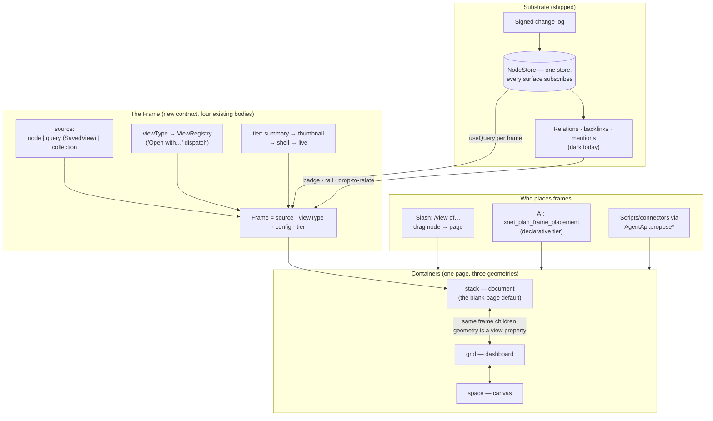
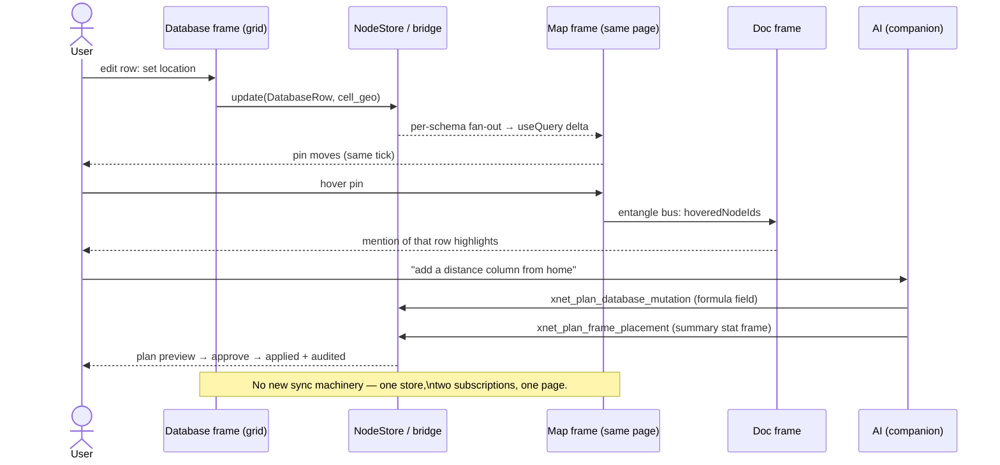

# Composable UI: Frames And The Universal Page Substrate

> Exploration 0346 · 2026-07-18
>
> Lineage: [[0280_MALLEABLE_WORKBENCH]] (shell-as-data, shipped),
> [[0286_WORKBENCH_FLOATING_ISLANDS_REDESIGN]] (calm canvas + islands, shipped),
> [[0327_PATCHWORK_VS_XNET]] (harvest list), [[0319_LEGO_FOR_ALL_DATA]]
> ("the coupling, not the brick"), [[0339_DATABASE_VIEWS]] (ViewRegistry
> revived), [[0317_USEQUERY_LIVE_REACTIVITY]] (the invalidation gap that
> gates everything here).

## Problem Statement

xNet's data layer is genuinely Lego: one kernel type (`Node`, four universal
fields), one write primitive (`Change<NodePayload>`), one store every surface
shares, and live queries that already carry an edit made in one surface into
any other surface subscribed to the same schema. Documents, database rows,
views, maps, channels, messages, dashboards — all nodes, all composable *in
principle*.

The UI does not show it. Concretely, from the brief:

1. **The bricks don't visibly snap.** A document, a map, and a database that
   describe the same trip never appear together, never highlight together,
   and their relations are invisible. "This document is related to this map
   is related to this database, and they all reactively update together" is
   physically supported by the store and expressed nowhere on screen.
2. **There is no compositional unit.** Patchwork has "everything is an
   Automerge doc + tools render datatypes." Notion has the block. xNet's UI
   unit is the *tab*: each content type is a bespoke, full-bleed route
   component that owns its own layout. You can open things side-by-side-ish
   (AI island + call island float over a document — the 0286 redesign's real
   achievement) but you cannot *place* a live database next to a live map
   inside anything and keep both.
3. **Integrations, scripts, and AI have no place to put their output.** The
   plan→validate→apply AI pipeline can already create and edit nodes; a
   custom script can propose writes; a connector can materialize external
   data. But the result always lands as *another tab somewhere else*, not as
   a new piece snapped into the view you're looking at.
4. **Each new page feels different from the last.** The islands drift in
   over a clean page — good — but the "clean page" itself has no consistent
   identity. Opening a doc, a database, a channel, and a map lands you in
   four differently-shaped worlds. What is the substrate? A list? A grid? A
   database? A canvas?

This exploration answers: **what is the UI's compositional unit, what is the
consistent blank-page substrate it lives on, and how do users (and agents)
compose, save, and return to assembled views?**

## Executive Summary

**The compositional unit should be the Frame: a live, placeable rendering of
a node or a query through a registered view.** `{ source, viewType, config,
tier }` — where `source` is a node reference, a saved query, or a curated
collection; `viewType` dispatches through the existing `ViewRegistry`;
`tier` bounds cost (`summary → thumbnail → shell → live`, the contract
canvas previews already define). The repo has *four* independent
half-implementations of this idea today — editor embed blocks, canvas cards,
dashboard widgets, and the workbench tab itself — each with its own contract.
The work is not inventing the frame; it is unifying it and making it
placeable everywhere.

**The substrate answer: every page is a document — a stack of frames — and
geometry is a view property, not a data difference.** The blank page is a
title and an empty block stack (the calmest possible default, consistent for
every node type). A "database page" is a page whose body is one full-bleed
database frame; a canvas is the *spatial arrangement* of the same frame set;
a dashboard is the *grid arrangement*. BlockSuite proved doc-mode and
canvas-mode can be true dual views of one block tree with zero conversion;
Muse's flex boards proved arrangement can toggle without transforming data.
Stack / grid / space become three geometries of one page, not three
products.

**The studs become visible through entanglement.** Frames on the same page
share a selection/hover bus (Embark's "Entangler"): hover a row in a
database frame and the corresponding pin in the map frame lights up — cheap
to build, because both frames already subscribe to the same store and
reactivity across surfaces works today. Every frame carries a relations
badge (backlinks via `useReverseRelations`) so the coupling is inspectable,
and dropping one frame onto another offers to create a relation — the snap.

**Agents compose with the same primitives.** The AI surface gains
frame-placing tools (declarative tier — the agent asks for registered
views over real nodes, never emits throwaway HTML), so "generate me a
trip page" produces a page of live frames: a doc frame, a database frame,
a map frame, already entangled. Litt's inner/outer loop demands this:
agent output must become reusable inner-loop material, not artifacts.

Staged in five phases, each independently landable; Phase 1 is nearly free
(the embed contract exists and is unwired) and the whole plan is gated at
scale by 0317's invalidation precision, which becomes a named dependency
rather than a nice-to-have.

## Current State In The Repository

### The kernel is already composable (receipts)

- **One node type.** `packages/data/src/schema/node.ts` — `Node` has exactly
  `id`, `schemaId`, `createdAt`, `createdBy`; everything else is
  schema-defined. ~120 built-in schemas (`packages/data/src/schema/schemas/index.ts`)
  make documents, folders, databases, rows, fields, *views*, saved views,
  canvases, maps, channels, messages, dashboards, widgets, contacts, ledger
  entries, spaces, grants, and agent passports all nodes.
- **One write primitive.** `Change<NodePayload>`
  (`packages/sync/src/change.ts`, `packages/data/src/store/types.ts`) —
  signed, hash-chained, LWW-resolved in one module
  (`packages/core/src/lww.ts`).
- **Cross-surface reactivity works today.** The path
  `store.emit → MainThreadBridge → per-schema fan-out → QueryCache →
  useSyncExternalStore` (`packages/data/src/store/store.ts`,
  `packages/react/src/hooks/useQuery.ts`,
  `packages/data-bridge/src/query-descriptor.ts`) means an edit in a grid
  reaches a `useQuery` in any other mounted surface on the same schema —
  including remote edits. The known gap is *precision*, not capability:
  fan-out is per-schema, not predicate-aware, with a bulk cliff at 250
  changes (0317, unimplemented).
- **Relations exist but are invisible.** Typed/untyped relation properties
  (`packages/data/src/schema/properties/relation.ts`), backlinks
  (`packages/react/src/hooks/useReverseRelations.ts`), mentions, and a
  per-hop graph expansion tool (`xnet_graph_expand` in
  `packages/plugins/src/ai-surface/tools/`). No UI surfaces them outside
  database relation cells.

### The UI's four half-frames

The frame concept exists four times, incompatibly:

| Half-frame | Contract | Where | Status |
| --- | --- | --- | --- |
| Editor embed blocks | `XNetEditorHost` (`renderDatabaseView`, `renderTaskView`, `onNavigate`) | `packages/editor/src/blocknote/host-context.tsx`, specs in `blocknote/schema.ts` (`pageEmbed`, `databaseEmbed`, `taskViewEmbed`, `richLink`, mentions, wikilinks) | **`databaseEmbed` renders a placeholder** — only `renderTaskView` is wired (`apps/web/src/components/Editor.tsx:132`). Page embeds are navigation cards, not live transclusion |
| Canvas cards | Canvas contributions: `CanvasIngestInputKind` (`'node'` included), `CanvasPreviewTier = 'summary'\|'thumbnail'\|'shell'\|'live'`, query frames (`CanvasQueryFrameExecutors`) | `packages/plugins/src/contributions.ts`, `apps/web/src/components/CanvasView.tsx`, `packages/views/src/canvas-view/` | The richest existing assembly surface — live database previews, inline pages, query frames as movable cards. But canvas-only |
| Dashboard widgets | `WidgetDefinition` + `WidgetRegistry`, per-breakpoint `DashboardLayoutItem {x,y,w,h}` | `packages/dashboard/src/registry.ts`, `resolveLayout` | Works, but widgets are dashboard-specific components, not "any node through any view" |
| The workbench tab | `WorkbenchTab { nodeType, nodeId }` + `navigateToNode` switch | `apps/web/src/workbench/state.ts` (`TAB_NODE_TYPES`), `workbench/navigation.ts` | The de-facto full-bleed frame — but the type set is a hardcoded closed enum, and one tab = one surface |

### The view machinery is ready and under-used

- **`ViewRegistry`** (`packages/views/src/registry.ts`, revived in 0339):
  `register/get/getForSchema/getForPlatform/onChange`; builtins board,
  gallery, calendar, timeline, list, map (`builtins.ts`);
  `ViewRenderer.tsx` dispatches by type and degrades gracefully ("a plugin
  may need to be enabled"). `DatabaseViewProps`
  (`packages/views/src/database-views/contract.ts`) is store-agnostic:
  models in, callbacks out.
- **But the picker is hardcoded**: `ADD_VIEW_TYPES` in
  `apps/web/src/components/DatabaseView.tsx` doesn't enumerate the registry
  — a plugin view renders but can't be *chosen*. Same shape as 0327's
  finding: `navigateToNode` is a switch, not a registry ("Open with…" is
  the named harvest).
- **View persistence is already data.** A database's views are
  `DatabaseView` nodes (`useGridDatabase` reads fields/views/rows as node
  collections). `SavedView` nodes carry a full `SavedViewDescriptor
  { query: QueryAST, scope, presentation }`
  (`packages/data/src/store/query-ast.ts`,
  `packages/react/src/components/SavedViewRunner.tsx`) — a *query as an
  openable node* already ships.

### The shell composes; the content doesn't

0280 shipped shell-as-data: `LayoutTree` presets
(`packages/plugins/src/workspace/layout-tree.ts`), slot contributions,
workspaces as `xnet:workspace` nodes, and an agent that rearranges the shell
(`apps/web/src/plugins/workspace-agent-module.ts`). 0286 shipped the calm
visual substrate: one warm canvas, chrome as islands, the editor as the
brightest plane, AI + call floating over content — today's only true
two-surfaces-at-once moment. What neither did: the center region is a
single-tab host (`EditorArea.tsx`); *content* surfaces never share it.

### Agents and scripts can write, but not place

- AI pipeline: `AiOperation → AiChangeSet → AiMutationPlan`
  (proposed/validated/applied), scoped by `AiScope`, audited, rollbackable
  (`packages/plugins/src/ai-surface/types.ts`, `host.ts`, `tools/`).
  `xnet_plan_database_mutation`, `xnet_plan_page_patch`,
  `xnet_plan_canvas_mutation` exist.
- User scripts: `ScriptSandbox` with AST validation; `AgentApi.proposeCreate
  / proposeUpdate` lift into the same plan pipeline
  (`packages/plugins/src/sandbox/`).
- Connectors/automations: `defineConnector` (guarded `ConnectorStore`,
  cadence), `defineAction` (SSRF-guarded), hub `webhook-inbox`
  (`packages/hub/src/features/webhook-inbox.ts`) — whose GitHub webhook still
  discards normalized actions for want of an `apply` callback (0213).
- Formulas: two engines — the standalone Notion-compatible
  `packages/formula` (flat props bag) and the wired
  `packages/data/src/database/formula-service.ts` (same-row scope, 3-layer
  parse→evaluate→coerce). Cross-node computation exists only as
  relation-based rollups (`rollup-engine.ts`). No general cross-database
  formula.

## External Research

Full agent survey distilled to what this design uses.

### The compositional unit, across eight systems

| System | Unit | View/data decoupling | Composition persisted as |
| --- | --- | --- | --- |
| Patchwork (I&S) | Automerge doc + datatype | N tools : 1 datatype; **view dispatch named as their unsolved problem** | Docs all the way down (tool code included) |
| Embark (I&S) | Outline node (id, text, children, properties) | Embedded live views (map/calendar) stay aware of surrounding structure — the **"Entangler"**: hover-sync is bidirectional | Outline |
| Notion | Block (two pointer sets: `content` order vs `parent` permissions) | **Linked database** = view config referencing source rows; **synced block** = same content, N places | Block properties |
| tldraw | Shape record + `ShapeUtil`; **bindings are separate records** | Schema'd store; third-party shapes persist/sync/undo generically | Store records |
| Anytype | Object (Types and Relations are objects too) | **Set** (query, no storage) vs **Collection** (storage, no query); layout orthogonal to type | Object properties |
| BlockSuite/AFFiNE | Block (`affine:paragraph`) | **Page mode and edgeless/canvas mode render the same block tree with zero conversion** — canvas position is just another flavour | One Yjs tree |
| Webstrates | The live DOM node | Transclusion = iframes; embed + restyle in context | The DOM is the persistence |
| Coda | Doc-scoped blocks | **One formula language reaches every surface** (cells, buttons, view choice) | Doc |

Two patterns recur in six-plus of the eight and are load-bearing here:

1. **Persist the view config as ordinary data of the same kind it
   describes.** xNet already does this for database views and saved views —
   the pattern just needs to reach the page.
2. **Set vs Collection duality**: a live-query membership primitive and a
   curated-membership primitive, kept distinct. xNet has the Set
   (`SavedView`); it lacks the curated Collection as a first-class frame
   source.

And one warning: **Obsidian Dataview's open failure** — transclusion inside
query results is architecturally unstable there — shows
querying-over-embedding is harder than either alone. Frame nesting depth
needs a rule, not vibes.

### Agent-generated UI: the three tiers

The 2026 landscape (AG-UI transport, Google's A2UI declarative spec, Claude
Artifacts full-codegen) sorts into **static** (agent picks from fixed
components), **declarative** (agent emits a UI spec the client renders from
its own catalog), and **full code-gen** (max freedom, min host control).
Litt's inner/outer loop argues the agent must target the same primitives a
human uses, or its output never becomes reusable. For xNet the declarative
tier is the natural fit: the "catalog" is the ViewRegistry + schema
registry, both already plugin-extensible and trust-tiered; full code-gen
already has its consent-gated path (agent-scaffolded FeatureModules, 0280
Phase 5).

## Key Findings

1. **The frame already exists four times.** Editor embeds, canvas cards,
   dashboard widgets, and tabs are the same idea with four contracts. The
   cheapest possible proof (`databaseEmbed`) is one unwired host hook away.
2. **Reactive composition needs zero new sync machinery.** Two frames over
   the same schema entangle for free via the existing store→bridge→cache
   path; what's missing is UI (co-presence on one page) and precision
   (0317). The demo the brief asks for — doc, map, database updating
   together — is blocked on layout, not on data.
3. **The substrate question dissolves once geometry is a view property.**
   "Is it a list, a grid, a database, a canvas?" assumes those are different
   substrates. BlockSuite and Muse show stack/space can be dual renderings
   of one children set. The honest default for xNet is the *document* —
   calmest, already the 0286 hero plane — with grid and space as
   arrangements of the same frames.
4. **View dispatch is the industry-wide unsolved problem xNet is best
   placed to solve.** Patchwork names it open; xNet has the registry, the
   schema IRIs, per-node auth, and trust tiers — it lacks only the picker
   ("Open with…" / "Add view of…") enumerating the registry instead of
   hardcoded arrays (`ADD_VIEW_TYPES`, `TAB_NODE_TYPES`, `SURFACES`).
5. **The relations layer is the studs, and it's dark.** Backlinks, typed
   relations, and mentions all exist in data; no surface shows "what this
   node is coupled to" outside grid cells. Making coupling visible (badge,
   rail, drop-to-relate) is what makes the UI *feel* like Lego — 0319's
   thesis applied to pixels.
6. **Agents are already safe composers; they're just mute.** The
   plan/validate/apply pipeline with scopes, audit, and rollback is
   exactly the governance the declarative tier needs. The missing verbs are
   placement: no tool says "put a map view of that database on this page."
7. **Two formula engines and no cross-node scope** is the automation gap.
   Coda's lesson (one language reaching every surface) says: extend the
   wired engine's scope (row → node → related nodes) rather than growing a
   third engine.

## Options And Tradeoffs

### Question 1 — the compositional unit

| Option | Shape | Pros | Cons |
| --- | --- | --- | --- |
| A. Tab-splitting | Split `EditorArea` into panes of existing routes | Cheap; VS Code-familiar | Composes *windows*, not content; nothing is saved as a thing; relations still invisible; each pane still bespoke |
| B. Canvas-as-assembler | Push everything through the Canvas surface (it already ingests nodes) | Richest existing machinery; spatial freedom | Canvas is one node type among many, not the default; freeform space is the *least* calm substrate; abandons the document as hero |
| C. Dashboard-as-assembler | Grow `WidgetRegistry` into "any node, any view" | Grid layout persistence exists | Widgets are bespoke components; dashboards feel like admin panels, not pages; third parallel contract deepens the fork |
| **D. The Frame (recommended)** | One contract `{source, viewType, config, tier}` realized *in* blocks, cards, widgets, and tabs | Unifies the four half-frames; every container inherits every view; plugin views appear everywhere at once | A real refactor across `editor`/`views`/`canvas`/`dashboard`; needs tier discipline to stay calm |

### Question 2 — the blank-page substrate

| Option | Substrate | Pros | Cons |
| --- | --- | --- | --- |
| A. The document (block stack) | Every node opens as a page: title + block stack; full-bleed types are a page with one full-bleed frame | Calmest default; matches 0286 (editor as hero plane); Notion-proven for consumers; blank = genuinely blank | Full-bleed surfaces need a "promoted frame" mode so a database doesn't feel wrapped in chrome |
| B. The canvas (space) | Everything is cards on infinite space | Maximal composition; Patchwork/Muse lineage | Cold start is *harder* on a blank canvas (where do I put things?); spatial mess accumulates; fights the calm thesis |
| C. The database (list/grid of nodes) | Every page is a query result | Anytype/Tana lineage; querying is xNet's strength | Everything-is-a-table feels like software for databases, not for people; documents demoted |
| D. Status quo (bespoke per type) | Keep four worlds | No work | The brief's exact complaint |
| **A + geometry axis (recommended)** | Document default; `geometry: stack \| grid \| space` as a page-level *view property* over the same frame children | One substrate, three arrangements; Muse flex-board toggle; canvas and dashboard converge instead of competing | Requires frames to carry both order (sortKey) and position (x,y,w,h) without forking the data |

### Question 3 — how agents compose

| Option | Tier | Pros | Cons |
| --- | --- | --- | --- |
| A. Artifacts-style codegen | Full code | Maximal wow | Output is a silo (Ink & Switch's own warning); no reuse; sandbox burden |
| **B. Declarative frames (recommended)** | Declarative | Agent output = pages of live frames over real nodes; persists, syncs, stays editable by humans; governance = existing plan pipeline | Bounded by the view catalog (mitigated: the catalog is plugin-extensible, and codegen remains the consent-gated top rung via FeatureModules) |
| C. Static suggestions | Static | Trivial | Can't fulfil "generate documents and spreadsheets and maps on your behalf" |

**Resolution: D + (A + geometry) + B.** One frame contract, document
substrate with a geometry axis, agents as declarative frame composers.

## Recommendation

Ship **Frames** in five phases. The organizing picture:



### Phase 1 — Light what's already wired dark (days, not weeks)

The cheapest honest win: make transclusion real.

- Wire `renderDatabaseView`, `onSelectDatabase`, `resolveDatabaseMeta` into
  the `XNetEditorHost` passed by `apps/web/src/components/Editor.tsx`
  (mirror the existing `renderTaskView` wiring), rendering through
  `ViewRenderer` so *any* registered view type works inside a document on
  day one.
- Upgrade `pageEmbed` from navigation card to a `summary`-tier live
  transclusion (title + first blocks, read-only), with an expand affordance.
- Slash command `/view of…` opens the node picker → inserts a
  `databaseEmbed`/`pageEmbed` with a view chooser that **enumerates
  `viewRegistry`** (killing the first hardcoded picker).
- Proof demo: a page containing a database frame (table) and a second frame
  (map view of the same database) — edit a row's geo field in the grid, the
  pin moves. Zero new sync code; this is the brief's ask, on screen.

### Phase 2 — The Frame contract (the unification)

Define once, adopt four times:

- `FrameDef` in `packages/views` (new `frames/` sub-barrel; root barrel
  gains one grouped line per 0276 policy): source union
  (`{ nodeId } | { query: SavedViewDescriptor } | { collection: nodeId[] }`
  — the Set/Collection duality), `viewType`, `config`
  (per-view, from `DatabaseViewConfig` etc.), `tier` (adopt
  `CanvasPreviewTier` verbatim as the cost ladder).
- A single `FrameRenderer` used by: editor embed specs, canvas node cards,
  dashboard widgets (a generic "frame widget" joins `WidgetRegistry`), and
  — importantly — `EditorArea` tabs (a tab becomes a full-bleed live-tier
  frame). The bespoke route components shrink toward chrome around a frame.
- **"Open with…"** (0327 harvest #2): the tab header and the frame context
  menu both offer every registry view matching the node's schema
  (`getForSchema`). `navigateToNode` keeps working but stops being the only
  door.
- Registry-driven pickers replace `ADD_VIEW_TYPES`; `TAB_NODE_TYPES` grows a
  registry-backed escape hatch (`frame:<viewType>` tabs) so plugins can add
  openable surfaces without app edits.

### Phase 3 — Visible studs (entanglement + relations)

- **Page-scoped entangle bus**: a lightweight context carrying
  `{ hoveredNodeIds, selectedNodeIds }`; every frame publishes on
  hover/select and highlights on match. Embark's Entangler, one afternoon of
  plumbing per view type (board cards, map pins, calendar chips, grid rows,
  doc blocks with mentions).
- **Relations badge + rail** on every frame: count from
  `useReverseRelations` + typed relations; clicking opens a relations rail
  (reuse the 0286 right island) listing linked nodes with "open as frame
  here" actions.
- **Drop-to-relate**: dragging a node (from Explorer, search, or another
  frame) onto a frame offers: *insert as frame* / *add relation* /
  *add row* (schema-permitting). This is the snap — and the release is
  equally reversible, which is the clutch-power half of 0319.
- Frames render strictly under the viewer's per-node auth (already enforced
  at the store); an embedded frame you can't read shows a sealed-brick
  placeholder, not an error.

### Phase 4 — One substrate, three geometries

- Every node's default surface becomes **title + frame stack** with shared
  page chrome (breadcrumb, properties, backlinks rail, comments — the same
  "node passport" everywhere). Full-bleed types are pages whose single frame
  is promoted (no visible wrapper; demote = "show as block").
- Page-level `geometry: 'stack' | 'grid' | 'space'`: the same frame children
  carry both `sortKey` (stack order — the fractional collation invariant
  applies) and optional `layout {x,y,w,h}` (grid/space). Toggling geometry
  never converts data (the BlockSuite proof). Dashboard and Canvas remain as
  schemas but their surfaces become the grid/space geometries of the shared
  page component — convergence, not deletion (the 0277 playbook).
- **Saving a composition is just… a page.** No new "saved layout" concept at
  the content layer: the assembled trip page *is* the durable, shareable,
  versioned artifact (shell arrangement stays with 0280's workspace nodes).
  "Save as template" = duplicate page with frames re-pointed.

### Phase 5 — Agents and formulas as composers

- New AI tools (same plan pipeline, new verbs):
  `xnet_plan_frame_placement` / `xnet_apply_frame_placement` (place/remove/
  configure frames on a page, `page.propose` scope) and
  `xnet_compose_page` (create node + seed frames). "Set up a trip planner"
  → the agent creates a database, a doc, and a page with three entangled
  frames — all live, all editable, all auditable, all undoable.
- Declarative tier only, by default: the agent chooses from the ViewRegistry
  catalog. The codegen rung (a custom view as an agent-scaffolded
  FeatureModule with a consent manifest) stays the 0280 Phase-5 path — the
  gentle slope's top, not its middle.
- **Cross-node formula scope**: extend `formula-service.ts` with
  `related("column")` (rollup-backed) and `node(id).prop(...)` accessors —
  one language (Coda's lesson), scope widened from row → relations → named
  nodes, dependency-tracked through the existing `extractDependencies`
  machinery. Gate live recompute on 0317 landing; until then, computed
  frames refresh on the reload path.
- Connectors/webhooks place frames too: the 0213 `apply` seam, once closed,
  can target "append row + ensure frame on the team page" — automations with
  visible output.

### The reactive loop this buys (the brief's demo, end-to-end)



### What this explicitly does not do

- **No new canvas/editor/grid engines** — frames wrap the existing views;
  the four bodies keep their strengths.
- **No everything-is-a-canvas pivot** — the blank page stays a calm document;
  space is a geometry you opt into.
- **No agent codegen by default** — declarative frames first; codegen stays
  consent-gated behind the FeatureModule ladder.
- **No third formula engine** — widen the wired one's scope.
- **No shell rework** — 0280/0286 stand; this is the layer beneath them.

## Example Code

The frame contract (sketch — `packages/views/src/frames/`):

```ts
// The Set/Collection duality as the source union.
export type FrameSource =
  | { kind: 'node'; nodeId: string }                      // one node
  | { kind: 'query'; descriptor: SavedViewDescriptor }    // live query (Set)
  | { kind: 'collection'; nodeIds: string[] }             // curated (Collection)

/** Cost ladder — adopted verbatim from CanvasPreviewTier. */
export type FrameTier = 'summary' | 'thumbnail' | 'shell' | 'live'

export interface FrameDef {
  id: string
  source: FrameSource
  /** ViewRegistry type ('table' | 'board' | 'map' | plugin types…). */
  viewType: string
  config?: Record<string, unknown>   // per-view (DatabaseViewConfig etc.)
  tier: FrameTier
  /** Stack order — fractional sortKey (code-unit collation invariant). */
  sortKey: string
  /** Present only when the page geometry is grid/space. */
  layout?: { x: number; y: number; w: number; h: number }
}
```

```tsx
// One renderer, four containers. Dispatch through the registry;
// degrade by tier; never exceed the page's live-frame budget.
export function FrameRenderer({ frame, pageId }: FrameRendererProps) {
  const entangle = useEntangleBus(pageId)          // hover/select co-presence
  const view = viewRegistry.get(frame.viewType)    // 'Open with…' dispatch
  const models = useFrameSource(frame.source, frame.tier) // useQuery inside
  if (!view) return <MissingViewCard type={frame.viewType} />
  if (!models.readable) return <SealedFrame />     // per-node auth holds
  return <view.component {...models} config={frame.config} entangle={entangle} />
}
```

```ts
// Page geometry as a view property — same children, three arrangements.
export type PageGeometry = 'stack' | 'grid' | 'space'
// stack  → order by sortKey            (document)
// grid   → resolveLayout(frame.layout) (dashboard)
// space  → absolute x/y                (canvas)
// Toggling geometry writes NO frame data except missing layout defaults.
```

```ts
// The agent's placement verb — same plan pipeline, new noun.
registerAgentTool({
  name: 'xnet_plan_frame_placement',
  requiredScopes: ['page.propose'],
  invoke: ({ pageId, place }) =>
    planChangeSet({
      targetKind: 'page', targetId: pageId,
      operations: place.map(p => ({
        op: 'frame.insert',
        args: { source: p.source, viewType: p.viewType, tier: 'live' },
        rationale: p.why,
      })),
    }),
})
```

## Risks And Open Questions

1. **0317 is now load-bearing.** N live frames on one page multiply the
   per-schema fan-out cost; the 250-change bulk cliff turns a busy page into
   N full reloads. Mitigations: tier budget (default `live` cap per page,
   others `summary` — the 0273 widget-budget precedent), and schedule
   predicate-aware invalidation as a named dependency of Phase 4, not an
   afterthought.
2. **Editor schema skew.** Frame blocks live in the statically-bundled
   BlockNote schema (0205 rule): every peer must know the spec before
   content lands. Phase 1 reuses the *already-shipped* `databaseEmbed`/
   `pageEmbed` specs precisely to dodge this; a new generic `frame` block
   spec is a coordinated schema rollout — plan it, don't drift into it.
3. **Nesting and cycles.** A page embedding itself (or A→B→A) must clamp:
   render depth limit (2), cycle detection by nodeId path, deeper levels
   render as `summary` cards. Dataview's instability is the cautionary tale.
4. **Geometry unification could quietly fork.** If `stack`/`grid`/`space`
   grow geometry-specific frame data beyond `layout`, we've rebuilt three
   products inside one schema. Guard: a round-trip test (toggle all three
   geometries, assert frame set identical) — the 0280 preset-drift guard
   applied here.
5. **Full-bleed feel.** Databases and canvases must not feel "wrapped" as
   promoted frames — header chrome must collapse to exactly today's pixels.
   Screenshot-diff the promoted mode against current surfaces (0185 CI).
6. **Calm vs composition.** Frames make mess possible. Defaults defend calm:
   blank page = title + empty stack; frames arrive only by explicit verb
   (slash, drop, agent plan); geometry defaults to stack; entangle
   highlights are subtle (accent wash, not motion).
7. **Who may place frames?** Human: any page they can write. Agent:
   `page.propose` + plan approval. Plugins: only frames of their own
   contributed views by default (mirrors 0280's slot rule). Embedded
   content's *read* auth is the target node's, never the page's — sealed
   frames are correct, not a bug. Needs a decision memo before Phase 5.
8. **Where does `FrameDef` persist?** In-document (block props — syncs with
   the doc, schema-skew-bound) vs sibling nodes (`PageFrame` nodes — queryable,
   LWW per-property, no editor schema coupling). Leaning: block props for
   doc-stack frames (they are content), sibling nodes for grid/space
   layouts (they are arrangement). Decide in Phase 2 design review.
9. **Naming.** "Frame" collides with HTML frames and Patchwork's
   frame-tools; alternatives: brick, tile, pane, lens. "Lens" flatters the
   thesis but overloads `schema/lens.ts`. Sticking with frame (code
   precedent: `CanvasQueryFrameExecutors`) unless review objects.

## Implementation Checklist

### Phase 1 — Light the embeds

- [x] Wire `renderDatabaseView` / `onSelectDatabase` / `resolveDatabaseMeta`
      in `apps/web/src/components/Editor.tsx`'s `XNetEditorHost`, rendering
      via `ViewRenderer` (any registry view type works in-doc)
- [x] `pageEmbed` → summary-tier live transclusion (title + first blocks,
      read-only, expand affordance)
- [x] `/view of…` slash command with node picker + registry-enumerated view
      chooser (delete `ADD_VIEW_TYPES` hardcoding on this path)
- [x] Demo page in dev-tools seed: database frame + map frame of the same
      DB (geo field), proving cross-frame reactivity (Tier-1 seeder)
- [x] Changesets: `editor` (minor), `views` (minor) — fixed-core lockstep

### Phase 2 — The Frame contract

- [x] `FrameDef` / `FrameSource` / `FrameTier` + `FrameRenderer` in
      `packages/views/src/frames/` (new sub-barrel, one grouped root
      re-export)
- [x] Adopt in editor embed specs (shim existing `databaseEmbed` props →
      `FrameDef`), canvas node cards, and a generic dashboard frame widget
- [x] "Open with…" on tab header + frame context menu via `getForSchema`
- [x] `frame:<viewType>` tab escape hatch so plugin views are openable
      without editing `TAB_NODE_TYPES`
- [x] Collection source (`kind: 'collection'`) + picker (the Set/Collection
      duality lands)
- [x] Persistence decision memo (block props vs sibling `PageFrame` nodes)
      reviewed and recorded in `docs/specs`

### Phase 3 — Visible studs

- [x] Entangle bus (page-scoped hover/select context) + adoption in grid
      rows, board cards, map pins, calendar chips, doc mentions
- [x] Relations badge + rail (via `useReverseRelations` + typed relations)
      reusing the right island; "open as frame here" action
- [x] Drop-to-relate: node drag onto frame → insert-frame / add-relation /
      add-row menu; all three reversible
- [x] Sealed-frame placeholder for unauthorized embedded sources

### Phase 4 — One substrate, three geometries

- [x] Shared node-passport page chrome (title, breadcrumb, properties,
      backlinks, comments) across all node surfaces
- [x] Promoted-frame mode for full-bleed types; screenshot-diff parity with
      today's `/db`, `/canvas`, `/map` surfaces (0185 CI)
- [x] `geometry: stack | grid | space` on pages; frames carry `sortKey` +
      optional `layout`; geometry round-trip test (frame set invariant)
- [x] Converge `DashboardView` / `CanvasView` surfaces onto the shared page
      component per the 0277 convergence playbook (surfaces remain, engines
      shared)
- [x] Nesting clamp: depth 2, cycle detection, summary-tier degradation

### Phase 5 — Agents and formulas

- [ ] `xnet_plan_frame_placement` / `xnet_apply_frame_placement` /
      `xnet_compose_page` agent tools (plan pipeline, `page.propose` scope,
      audit + rollback)
- [ ] Companion flow: "set up a …" → created nodes + composed page of live
      frames, plan preview before apply
- [ ] Formula scope widening: `related()` + `node().prop()` in
      `formula-service.ts` with dependency extraction; recompute gated on
      0317 (reload path until then)
- [ ] Close the 0213 webhook `apply` seam with a frame-aware deliver target
      (external item → row + ensured frame)
- [ ] Plugin frame-placement capability rule (own-views-only default)
      enforced in the contribution registry

## Validation Checklist

- [ ] Editing a row's geo cell in a grid frame moves the pin in a map frame
      on the same page within one flush (no manual refresh, no new sync
      code) — automated via the seeded demo page
- [ ] The same edit arriving as a *remote* change (second peer) updates both
      frames identically (`isRemote` path)
- [ ] Hovering a map pin highlights the corresponding grid row and any doc
      mention of that node (entangle bus, three view types)
- [ ] A plugin-registered view type appears in the slash view chooser, the
      "Open with…" menu, and as a dashboard frame with zero app-code edits
- [ ] A page with 10 frames (2 live, 8 summary) stays within the shell
      re-render budget; the bulk-cliff scenario (250+ changes) degrades to
      reload without UI jank
- [ ] Toggling stack → grid → space → stack preserves the exact frame set
      and all frame configs (round-trip test)
- [ ] A frame over a node the viewer cannot read renders sealed; sharing the
      page never leaks embedded content beyond per-node grants
- [ ] Self/circular embeds clamp at depth 2 with summary cards; no infinite
      render
- [ ] Companion "compose a trip page" produces a plan preview; applying
      yields live entangled frames; rollback restores the prior page exactly
      (audit event present)
- [ ] Promoted-frame database surface is pixel-equivalent to today's
      `/db/$dbId` (screenshot diff)
- [ ] All existing documents (content-v4) open unchanged; peers without the
      new build render Phase-1 embeds via the already-shipped specs (no
      schema skew incident)

## References

- [Ink & Switch — Malleable Software](https://www.inkandswitch.com/essay/malleable-software/) ·
  [Patchwork](https://www.inkandswitch.com/project/patchwork/) ·
  [Embark](https://www.inkandswitch.com/embark/) ·
  [Potluck](https://www.inkandswitch.com/potluck/)
- [Geoffrey Litt — Malleable software in the age of LLMs](https://www.geoffreylitt.com/2023/03/25/llm-end-user-programming.html)
- [Notion — data model](https://www.notion.com/blog/data-model-behind-notion) ·
  linked databases vs synced blocks (view-sync vs content-sync)
- [BlockSuite — block tree & edgeless isomorphism](https://blocksuite.io/guide/working-with-block-tree.html)
- [tldraw — composable primitives](https://tldraw.dev/features/composable-primitives) ·
  [tldraw computer](https://computer.tldraw.com/) ("the arrow is the context")
- [Muse — spatial boards](https://www.inkandswitch.com/muse/) (flex boards)
- [Anytype — Sets & Collections](https://doc.anytype.io/anytype-docs/getting-started/sets) ·
  [Capacities — content types](https://docs.capacities.io/reference/content-types)
- [Tana — supertags & search nodes](https://tana.inc/articles/intro-to-supertags-search-nodes-and-views)
- [Webstrates](https://webstrates.github.io/) ·
  [MyWebstrates (UIST '24)](https://cs.au.dk/~clemens/files/MyWebstrates-UIST2024.pdf)
- [JSON Canvas spec](https://jsoncanvas.org/spec/1.0/)
- [A2UI declarative UI spec](https://a2ui.org/specification/v1.0-a2ui/) ·
  [AG-UI](https://docs.ag-ui.com/introduction)
- Repo lineage: `0280_[x]_MALLEABLE_WORKBENCH_COMPOSABLE_WORKSPACE.md`,
  `0286_[x]_WORKBENCH_FLOATING_ISLANDS_REDESIGN.md`,
  `0327_[_]_PATCHWORK_VS_XNET_LEARNING_FROM_INK_AND_SWITCHS_CLOSEST_PARALLEL.md`,
  `0319_[x]_BLOG_POST_LEGO_FOR_ALL_DATA_ON_THE_WEB.md`,
  `0339_[x]_DATABASE_VIEWS_KANBAN_CALENDAR_ROADMAP_GALLERY_MAP.md`,
  `0317_[_]_USEQUERY_LIVE_REACTIVITY_AND_INVALIDATION_PRECISION.md`,
  `0188_[_]_EXTENSIBLE_SCHEMAS.md`, `0213` (integration catalog),
  `0277_[x]_CANVASVIEW_PARITY_AUDIT` (convergence playbook),
  `0273_[x]_QUIET_SURFACE_WORKSPACE_SHELL.md` (widget budget)
- Key code seams: `packages/editor/src/blocknote/host-context.tsx`,
  `packages/editor/src/blocknote/schema.ts`,
  `packages/views/src/registry.ts`, `packages/views/src/ViewRenderer.tsx`,
  `packages/views/src/database-views/contract.ts`,
  `packages/plugins/src/contributions.ts` (canvas tiers/ingest),
  `packages/dashboard/src/registry.ts`,
  `apps/web/src/workbench/navigation.ts`, `apps/web/src/workbench/state.ts`,
  `packages/data/src/store/query-ast.ts`,
  `packages/react/src/hooks/useReverseRelations.ts`,
  `packages/data/src/database/formula-service.ts`,
  `packages/plugins/src/ai-surface/{types.ts,host.ts,tools/}`,
  `packages/hub/src/features/webhook-inbox.ts`
