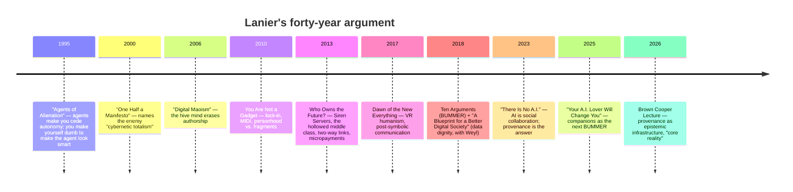
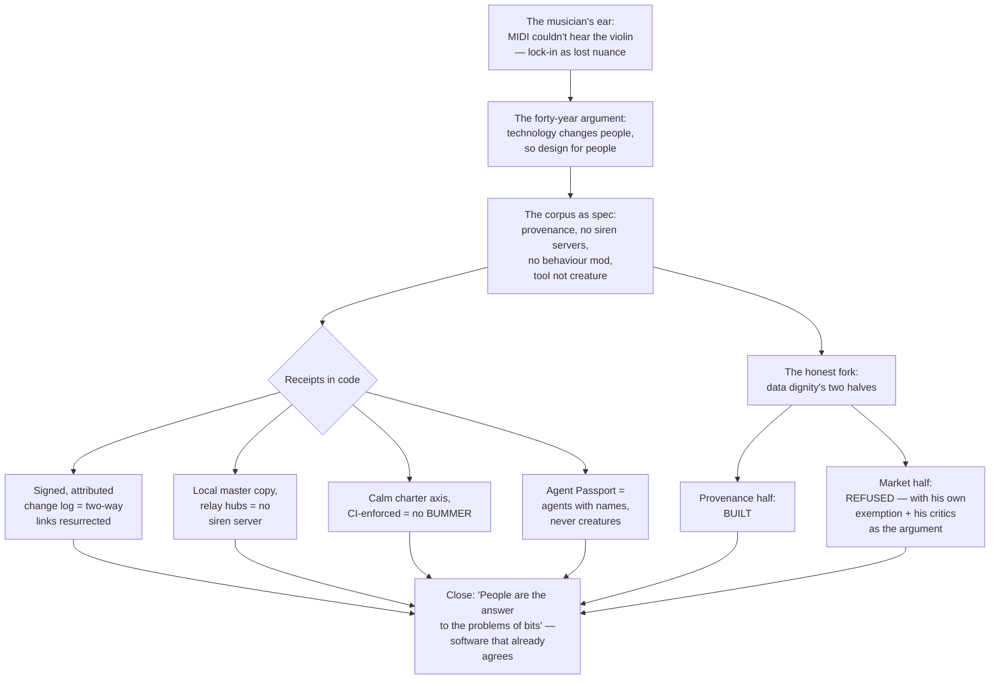

# A Blog Post On Jaron Lanier: Data Dignity, Humanist Technology, And xNet

## Problem Statement

What would a blog post on the synthesis of Jaron Lanier's work and xNet look
like — mostly focused on Lanier himself and his thoughts about technology and
human thriving?

Lanier is the rare critic who has been making **the same argument for forty
years from inside the industry**: VR pioneer (VPL Research, 1984), Microsoft's
"Prime Unifying Scientist" (Office of the CTO — acronym OCTOPUS, deliberately
whimsical), working musician with a collection of rare acoustic instruments,
and the author of a corpus that runs from _"Agents of Alienation"_ (1995)
through _You Are Not a Gadget_ (2010), _Who Owns the Future?_ (2013),
_Ten Arguments for Deleting Your Social Media Accounts Right Now_ (2018), the
data-dignity programme with E. Glen Weyl (HBR, 2018), and _"There Is No A.I."_
(The New Yorker, 2023). The through-line never changes: **the most important
thing about a technology is how it changes people** — and treating software as
a person degrades actual people.

The question for this exploration: is there a post here worth writing as the
next entry in the series (`site/src/pages/blog/`), what is its angle and
spine, where does xNet genuinely embody Lanier's prescriptions, where does it
honestly diverge, and what are the mechanics of shipping it?

## Executive Summary

**Yes — write it as essay #15 in the series**, provisional title **"People in
Disguise"** (from his best line: _"Digital information is really just people
in disguise"_ — Who Owns the Future?). The user asked for a post *mostly about
Lanier*; the recommended shape honours that: roughly two-thirds Lanier — the
musician's ear, the forty-year argument, the corpus as one continuous claim —
and one-third "what taking him seriously looks like in code," written from
shipped work, honest about the one place xNet deliberately refuses his
prescription.

Five findings drive the recommendation:

1. **The corpus is a spec, not just a critique.** Read chronologically, Lanier
   doesn't merely complain: he specifies. Preserve provenance (two-way links,
   after Ted Nelson). Don't build siren servers (asymmetric data accumulation).
   Don't do behaviour modification. Treat AI as a tool made of people, not a
   creature. Give agents no anonymity. Let people be *somebody* before they
   share themselves. Each of those has a concrete xNet receipt (mapping table
   below) — most literally, every change atom in the sync protocol carries an
   `authorDID` and an Ed25519 signature
   (`packages/sync/src/change.ts`): provenance at the wire level, which is
   the exact mechanism _"There Is No A.I."_ says we abandoned when the one-way
   link beat Xanadu.
2. **The agents angle is the freshest material.** _"Agents of Alienation"_
   (1995!) pre-refutes today's agent hype — _"an agent is a way of using a
   program, in which you have ceded your autonomy"_ — and xNet's Agent
   Passport (exploration 0337, shipped) is a direct structural answer: every
   agent gets its own DID, a scoped UCAN, and a signed audit trail. Agents as
   accountable tools, never anonymous creatures. No other essay in the series
   has touched this.
3. **The honest divergence is the intellectual heart of the post.** Lanier's
   data-dignity programme has two halves: *provenance* (inalienable
   attribution) and *markets* (micropayments/royalties via MIDs — mediators of
   individual data). xNet implements the first half thoroughly and
   deliberately does not build the second — and the strongest published
   critiques of Lanier (micropayment impracticality; paying for data
   legitimises surveillance) actually argue *for* xNet's position: dignity
   through **non-extraction plus attribution**, not through pricing the
   extraction. Saying this plainly keeps the post from being hagiography.
4. **The series lane is open.** Ted Nelson/Xanadu got a paragraph in _Clutch
   Power_; the Codd→Solid lineage is _The Vault and the View_; extraction
   economics is _The Right to Say No_. No essay yet centres a single living
   thinker's corpus. The musician frame (MIDI as the protocol that couldn't
   hear a violin) gives the series its customary concrete opening image.
5. **All load-bearing facts checked out** against primary sources (digest in
   External Research): BUMMER's expansion, the Kodak/Instagram numbers *and*
   the Forbes rebuttal to them, the 2018 HBR data-dignity piece, the 1995
   agents essay, the 2023 New Yorker essay, the April 2026 Brown lecture.

## Current State In The Repository

### Blog infrastructure (what a new post touches)

- **Registry**: `site/src/data/blog.ts` — hand-maintained `posts[]` array:
  `slug`, `title`, `description` (the deck), `pubDate` (ISO-8601 UTC),
  `authors: ['crs48', 'claude']` (series norm; AI co-author renders as
  "with …"), `tags` (union `BlogTag`), `readingMinutes`, optional
  `draft: true` while authoring. Index page and RSS
  (`site/src/pages/blog/rss.xml.ts`) derive from the registry — no extra
  wiring. `seriesNeighbors()` threads prev/next automatically by `pubDate`.
- **Page**: `site/src/pages/blog/<slug>.astro` — hand-authored, art-directed
  Astro pages, deliberately **no MDX/content collections**. en-GB spelling.
  No third-party assets (several essays promise "this page loads nothing
  third-party"; author avatars are vendored under `site/public/`).
- **Series state**: 14 published essays, newest _Clutch Power_
  (2026-07-14). A Lanier post is #15.
- **Mechanics gotchas** (from prior blog explorations): site-only PRs need the
  `skip-changelog` label; verify via `pnpm build` not `astro dev` (the dev
  server has hung on some pages before); DCO sign-off on every commit.

### The receipts — where xNet already embodies the corpus

| Lanier claim (source) | xNet's structural answer | Primary code / doc |
| --- | --- | --- |
| Two-way links preserve provenance; _"when you lose context, you lose control"_ (There Is No A.I., 2023; after Nelson 1960) | Every change is signed and attributed at the atom level: `authorDID` + Ed25519 signature on a hash-chained log; LWW tiebreaks *by author* | `packages/sync/src/change.ts` (fields at ~L69–73), protocol spec exploration 0200 |
| Siren Servers: harvest everything, keep the value, radiate risk (WOTF, 2013) | Hubs are relays, not aggregators; the master copy is local (OPFS SQLite); no behavioural surplus exists to harvest — and a CI gate bans analytics/ad SDKs so none can be added by accident | `packages/data/src/store/store.ts`, `scripts/check-humane-patterns.mjs`, `docs/CHARTER.md` §1 Own |
| BUMMER: adaptive feeds + intermittent reinforcement = _"continuous behavior modification on a titanic scale"_ (Ten Arguments, 2018) | Chronological feeds, rule-based (not ML-ranked) notifications, no streaks, no infinite-scroll engagement machinery; Calm is a charter axis with an enforced motion vocabulary | `docs/CHARTER.md` §3 Calm, exploration 0234 |
| _"An agent is a way of using a program, in which you have ceded your autonomy"_ (Agents of Alienation, 1995) | Agent Passport: per-agent DID + scoped UCAN + signed audit trail; high-risk apply tools cannot be chat-approved; the agent is a tool with a name, never an anonymous creature | exploration 0337 (shipped), `docs/CHARTER.md` §5 Agency |
| _"Big-model A.I. is made of people"_ — reveal them (There Is No A.I., 2023) | Provenance tiers on installed/synced/AI content; `ai-generated` badge in the editor; retrieval cites sources; BYO/local models | `packages/trust/src/index.ts` (`deriveTrustTier`), `packages/brain/`, exploration 0234 wave 8 |
| Digital Maoism: the hive erases individual authorship (Edge, 2006) | Collaboration never produces an anonymous blob: every contribution is one signed, attributed change; "log for facts, CRDT for prose" keeps authorship legible | exploration 0330, `packages/sync/src/change.ts` |
| _"You have to be somebody before you can share yourself"_ (YANAG, 2010) | Identity is a self-minted `did:key`, not a rented account; profiles are user-owned nodes; schemas are user-extensible (overlay/sidecar/promote) rather than templated multiple-choice personhood | `packages/identity/src/keys.ts`, exploration 0188 |
| Lock-in: MIDI froze a keyboard's idea of music into infrastructure (YANAG, 2010) | The inversion of the MIDI mistake: freeze the **coupling**, keep the **ontology** fluid — four small frozen interfaces (node shape, namespace, merge rule, permission algebra) under user-defined schemas | _Clutch Power_ essay, `docs/VISION.md` |
| The villain is the ad model; direct payment is exempt (Ten Arguments, 2018) | _"Pay with value, not data"_: metered AI billed at exact `usage.cost`, paid plugin marketplace where creators price their own work | `packages/cloud/src/ai/metered-gateway.ts`, explorations 0201/0244, `@xnetjs/licenses` (0196) |

The charter itself (`docs/CHARTER.md`: **Own, Exit, Calm, Consent, Agency,
Commons**) reads as a six-axis compression of the corpus, arrived at
independently via the neo-Luddite audit (exploration 0234). The post should
say that honestly: xNet did not start from Lanier — it converged with him,
which is the more interesting fact.

### What the repo does NOT have (the divergence)

No micropayments for data. No MIDs. No royalty accounting on the change log.
`money()` exists (integer minor units, exploration 0187) and the marketplace
pays creators for *work they price*, but nobody is paid per datum harvested —
because nothing is harvested. This is a considered position, not a gap (see
Key Findings #3).

## External Research

Full digest gathered from primary sources (New Yorker, HBR, Edge.org,
jaronlanier.com, AEA, Salon, plus the published critiques). Condensed:

### The corpus, chronologically — one argument, five decades



- **You Are Not a Gadget (2010)**: lock-in ossifies contingent design into
  permanent ontology; MIDI — built around key-presses — became music's
  locked-in representation and cannot express a violin's continuous nuance.
  Templated profiles shrink personhood to fit the schema. _"You have to be
  somebody before you can share yourself."_
- **Who Owns the Future? (2013)**: **Siren Servers** — elite computers that
  lure free interaction, harvest the data, keep the value, radiate risk; both
  monopoly and monopsony. Signature stat: Kodak at peak employed 140,000+ and
  was worth $28B; Instagram employed 13 when sold for $1B. Remedy: universal
  micropayments with permanent provenance, after Ted Nelson's two-way links.
  _"Digital information is really just people in disguise."_
- **Ten Arguments (2018)**: **BUMMER** = "Behaviors of Users Modified, and
  Made into an Empire for Rent," components A–F (Attention/Asshole supremacy,
  Butting in, Cramming, Directing behaviour, Earning from the worst actors,
  Fake mobs). Feeds bias _"not to the Left or the Right, but downward"_
  because negative emotion is cheaper to trigger. Crucially: **the villain is
  the business model, not the internet** — direct-payment services are exempt.
- **Data dignity (HBR 2018, with Weyl; AEA paper, 5 co-authors)**: users as
  both customers and sellers; **MIDs** — fiduciary, ASCAP-like mediators of
  individual data — bargain collectively; eight principles including
  **inalienable provenance** (data licensed, never alienated) and a ~70%
  labour-share target. Rejects both mass poverty and UBI (_"putting everyone
  on the dole to preserve black-box A.I."_).
- **There Is No A.I. (New Yorker, 2023)**: _"the most pragmatic position is to
  think of A.I. as a tool, not a creature."_ LLMs are _"an innovative form of
  social collaboration"_ — mash-ups of human work. Mythologising AI guarantees
  mismanaging it. The answer is provenance: _"Big-model A.I. is made of
  people — and the way to open the black box is to reveal them."_ Closing:
  _"People are the answer to the problems of bits."_
- **The StarTalk conversation (video)**: _"Neil deGrasse Tyson And Jaron
  Lanier on the AI Illusion"_ — StarTalk Plus,
  <https://www.youtube.com/watch?v=a_ZKYH8v_do> (transcript published
  2026). The whole corpus delivered conversationally in one sitting: _"there
  is no AI, but instead there's a collection of people"_; data dignity in a
  sentence — _"data only comes from people. Data doesn't come from angels"_;
  privacy redefined as _"not being manipulated or toyed with"_; network
  effects as hyper-centralised power around one node; and an in-between
  economics — affordable, _"not just free or impossibly expensive"_ — that is
  close to xNet's "pay with value, not data" stance. This is the post's best
  **on-ramp source**: readers who won't open a New Yorker essay will watch
  Tyson interview him. (Quotes above are from a third-party transcript —
  verify against the video before shipping.)
- **The humanist frame**: he is a musician first; the MIDI critique came from
  *hearing* what the protocol dropped. "One Half a Manifesto" (2000) names
  the enemy **cybernetic totalism** — the belief that people are just
  cybernetic patterns. His entire corpus is its negation.

### The critiques (the post must carry these honestly)

- **Micropayments impracticality** (Oremus, Slate 2013): conflates creative
  work with passive exhaust; per-item sums are trivial; transaction costs
  swamp them. Morozov (WaPo 2013) rejects the compensation logic wholesale.
- **Kodak/Instagram is economically loaded** (Worstall, Forbes 2013):
  consumer surplus and productivity gains are the point of progress, not
  payroll headcount. Use the stat *as his framing*, attributed, not as fact.
- **Paying for data can entrench surveillance** (Adams, OneZero; Brookings
  symposium): a data market legitimises the harvesting it prices, and worsens
  privacy for those who can least afford to refuse.
- **Digital Maoism pushback** (2006 Edge responses): Wikipedia has strong
  individual authorship and governance; the hive is partly a strawman.
- **The insider tension**: he critiques Big Tech from inside Microsoft (his
  standing disclaimer: he does not speak for the company). Acknowledge it in
  one line; it is also his credibility — he stayed to argue.

## Key Findings

1. **Convergence, not influence — and that's the better story.** xNet's
   charter axes were derived from a neo-Luddite audit (0234), not from reading
   Lanier; yet they map onto his corpus almost one-to-one. Two independent
   walks arriving at the same place is stronger evidence than discipleship,
   and the post should frame it exactly that way.
2. **Provenance is the deepest single synthesis.** His 2023 essay's entire
   constructive programme — reveal the people inside the machine, keep
   context, restore two-way links — is architecturally what a signed,
   hash-chained, author-attributed change log *is*. By 2026 (Brown lecture)
   he frames provenance as *epistemic* infrastructure — _"without that chain
   of thought, we can't have core reality"_ — which elevates the sync
   protocol from plumbing to philosophy.
3. **The divergence is defensible in his own terms.** Ten Arguments exempts
   direct-payment models; the strongest critiques of data markets say pricing
   surveillance legitimises it. xNet's position — collect nothing, attribute
   everything, let people sell *work* (marketplace) rather than *exhaust* —
   implements data dignity's provenance half and refuses its market half.
   The post's most interesting section argues this *is* the dignity
   position, using his own exemption plus his critics.
4. **The 1995 agents essay is the sleeper hit.** Thirty years before agent
   hype, he wrote that agents make people _"redefine themselves into lesser
   beings."_ Agent Passport (per-agent DID, scoped capabilities, signed audit
   trail, apply-tools never chat-approvable) is a shippable answer: the agent
   never becomes a creature you defer to; it stays a tool you supervise.
5. **Don't imply endorsement.** Lanier has never mentioned xNet. The post
   synthesises his public work with our public code; it must not suggest
   affiliation, and quotes stay short (<15 words) and attributed.

### How the essay's argument flows



## Options And Tradeoffs

| Option | Shape | Pros | Cons |
| --- | --- | --- | --- |
| **A. Corpus portrait** (recommended) | Two-thirds Lanier — musician, arc, ideas; final third the receipts + the honest fork | Honours "mostly focused on Lanier"; evergreen; the divergence section gives it a spine beyond summary | Longest to write well; needs discipline to keep xNet third from ballooning |
| B. Concept checklist | Eight claims ↔ eight receipts, table-driven | Easy to write from the mapping table | Reads as marketing; the series has never done listicle-shaped essays |
| C. Narrow deep-dive: "There Is No A.I." + agents only | Provenance and agents, 2023–2026 material | Sharpest, most current; strongest code tie-in | Drops the books and the human-thriving breadth the user asked for |
| D. The MIDI essay | Lock-in as the single image, everything through music | Most in the series' art-directed voice | _Clutch Power_ just covered lock-in/coupling two posts ago — too soon |

**Recommendation: A, opened with D's image.** The MIDI story is the *hook*
(one paragraph — the musician who heard what the protocol dropped), not the
frame; lock-in then hands off to the wider corpus. Option C's material
becomes the strongest interior section rather than the whole post.

## Recommendation

Ship **essay #15**: slug `people-in-disguise`, title **"People in Disguise"**,
tags `['essay', 'philosophy', 'privacy', 'economics']`, authors
`['crs48', 'claude']`, ~14 minutes. Fallback titles if the deck evolves:
_"Made of People"_, _"The Tool and the Creature"_.

Proposed deck (for `blog.ts`):

> For forty years, one man has been making the same argument from inside the
> machine: a VR pioneer, a working musician, Microsoft's in-house heretic —
> insisting that digital information is really just people in disguise. On
> Jaron Lanier's long war against the siren servers, what his ideas look like
> when you build them — and the one prescription we deliberately refuse.

Section sketch (en-GB, series voice):

1. **The instrument the protocol couldn't hear** — Lanier the musician; MIDI
   as lock-in's cautionary tale; _"the most important thing about a
   technology is how it changes people."_
2. **The forty-year argument** — 1995 agents essay → cybernetic totalism →
   Digital Maoism → gadget → siren servers → BUMMER → data dignity → "There
   Is No A.I." One claim, restated per decade, from *inside* the industry
   (name the Microsoft tension in a sentence). Link the StarTalk episode
   (<https://www.youtube.com/watch?v=a_ZKYH8v_do>) here as the "hear him
   make it himself" pointer — series precedent: _Weights You Can Hold_ and
   _The Right to Say No_ both link their source videos. **Link, don't
   embed**: the series promises pages that load nothing third-party, so a
   YouTube iframe is out; a plain link (optionally beside a vendored still
   or styled quote card) keeps the promise.
3. **The spec hidden in the critique** — what he'd have us build: provenance,
   two-way links, no behaviour modification, direct payment, tools not
   creatures.
4. **Receipts** — the signed change log as Xanadu's resurrection; relay hubs
   vs. siren servers; the Calm axis vs. BUMMER; Agent Passport vs. 1995.
   Convergence-not-influence framing. Written from shipped code only.
5. **The fork in data dignity** — his market half, his critics, his own
   direct-payment exemption; why "collect nothing, attribute everything" is
   the dignity position; where money does flow (creators pricing work, AI at
   exact cost). Candidate epigraph from the StarTalk conversation: _"data
   only comes from people. Data doesn't come from angels."_
6. **Close** — _"People are the answer to the problems of bits."_ The point
   of local-first isn't the storage topology; it's that the human stays the
   protagonist.

## Example Code

Registry entry (`site/src/data/blog.ts`, prepended to `posts[]`):

```ts
{
  slug: 'people-in-disguise',
  title: 'People in Disguise',
  description:
    'For forty years, one man has been making the same argument from inside ' +
    'the machine: a VR pioneer, a working musician, Microsoft’s in-house ' +
    'heretic — insisting that digital information is really just people in ' +
    'disguise. On Jaron Lanier’s long war against the siren servers, what ' +
    'his ideas look like when you build them — and the one prescription we ' +
    'deliberately refuse.',
  pubDate: '2026-07-XXT17:00:00Z', // set at publish
  authors: ['crs48', 'claude'],
  tags: ['essay', 'philosophy', 'privacy', 'economics'],
  readingMinutes: 14,
  draft: true // drop when shipping
}
```

## Risks And Open Questions

- **Living-person portrait.** Lanier is alive, employed, and litigable about
  nothing here — but accuracy discipline matters more than in the nature
  essays. Every quote <15 words, attributed, checked against the digest's
  primary sources; the Kodak/Instagram stat presented as *his framing* with
  the Forbes counter acknowledged.
- **No implied endorsement.** He has never mentioned xNet; the post must
  read as synthesis, not association. Avoid "Lanier would love…" phrasing.
- **The Microsoft line** must be respectful — his insider status is
  credibility, not gotcha material; he ships a standing disclaimer and we
  repeat it.
- **Hagiography risk.** Mitigated structurally: section 5 exists to disagree
  with him, and the Digital Maoism pushback gets a sentence in section 2.
- **Series fatigue on "ownership."** Three recent essays (Clutch Power,
  Vault/View, Weights) circle adjacent ground; the person-centred portrait
  and the agents material are what's new. Keep receipts tight.
- **Open**: exact `pubDate`; whether to commission a hero image (series has
  shipped without); whether the 2025 "A.I. Lover" essay earns a paragraph in
  section 2 (BUMMER's next form) or dilutes.

## Implementation Checklist

- [x] Draft `site/src/pages/blog/people-in-disguise.astro` (en-GB,
      art-directed, no third-party assets), following the section sketch.
- [x] Add the registry entry to `site/src/data/blog.ts` with `draft: true`;
      confirm index and RSS pick it up once `draft` drops.
- [x] Fact-check pass against the References below: every quote, date, title,
      and stat; verify BUMMER expansion and the 1995 essay citation.
- [x] Verify the StarTalk quotes ("collection of people", "data doesn't come
      from angels", "not being manipulated or toyed with") against the video
      itself (<https://www.youtube.com/watch?v=a_ZKYH8v_do>), not just the
      third-party transcript; confirm the episode date.
- [x] Verify internal claims about xNet against code: `authorDID`/signature
      fields, `deriveTrustTier`, `check-humane-patterns.mjs`, charter axes,
      Agent Passport scope rules.
- [x] Read-through for the three tone rules: no implied endorsement, no
      hagiography (section 5 carries the disagreement), Microsoft line
      respectful.
- [x] `pnpm build` the site (not `astro dev` — known hang risk) and visually
      check the page, index card, and prev/next series threading.
- [x] Set `pubDate`, drop `draft`, update `readingMinutes` from the final
      word count.
- [x] PR with `skip-changelog` label (site-only), DCO sign-off, merge-commit
      per repo convention; let CI run green before merge.

## Validation Checklist

- [x] Post renders correctly in production build; appears in
      `/blog` index and RSS with correct metadata.
- [x] `seriesNeighbors()` threads it as #15 (prev: Clutch Power).
- [x] No third-party network requests on the page (check devtools network
      panel against the series' "nothing third-party" promise).
- [x] Every Lanier quote in the shipped essay is <15 words, in quotation
      marks, attributed to the specific work and year.
- [x] A sceptical reader can verify each xNet receipt by following a link or
      file path in the essay.
- [x] en-GB spelling throughout (behaviour, honours, legitimise…).

## References

**Primary Lanier sources**

- _"There Is No A.I."_ — The New Yorker, 20 Apr 2023:
  <https://www.newyorker.com/science/annals-of-artificial-intelligence/there-is-no-ai>
- Lanier & Weyl, _"A Blueprint for a Better Digital Society"_ — HBR,
  26 Sep 2018: <https://hbr.org/2018/09/a-blueprint-for-a-better-digital-society>
- _"Agents of Alienation"_ (1995): <https://jaronlanier.com/agentalien.html>
- _"One Half a Manifesto"_ — Edge, 2000:
  <https://www.edge.org/conversation/jaron_lanier-one-half-a-manifesto>
- _"Digital Maoism"_ — Edge, 30 May 2006:
  <https://www.edge.org/conversation/jaron_lanier-digital-maoism-the-hazards-of-the-new-online-collectivism>
- Arrieta-Ibarra, Goff, Jiménez-Hernández, Lanier & Weyl, _"Should We Treat
  Data as Labor?"_ — AEA P&P 108 (2018):
  <https://www.aeaweb.org/articles?id=10.1257%2Fpandp.20181003>
- Salon interview on the middle class, 12 May 2013:
  <https://www.salon.com/2013/05/12/jaron_lanier_the_internet_destroyed_the_middle_class/>
- Brown University Cooper Lecture coverage, 24 Apr 2026:
  <https://www.brown.edu/news/2026-04-24/jaron-lanier-cooper-lecture>
- _"Your A.I. Lover Will Change You"_ — The New Yorker, 22 Mar 2025.
- _"Neil deGrasse Tyson And Jaron Lanier on the AI Illusion"_ — StarTalk
  Plus (video): <https://www.youtube.com/watch?v=a_ZKYH8v_do>; third-party
  transcript:
  <https://singjupost.com/startalk-there-is-no-ai-really-its-just-people-w-jaron-lanier-transcript/>

**Critiques**

- Oremus, Slate, May 2013 (micropayments):
  <https://www.slate.com/articles/technology/books/2013/05/jaron_lanier_s_who_owns_the_future_review_facebookers_of_the_world_unite.html>
- Morozov, Washington Post, May 2013 (compensation logic).
- Worstall, Forbes, May 2013 (Kodak/Instagram):
  <https://www.forbes.com/sites/timworstall/2013/05/15/jaron-laniers-who-owns-the-future-what-on-earth-is-this-guy-talking-about/>
- Adams, OneZero (paying for data entrenches surveillance):
  <https://onezero.medium.com/getting-cash-for-our-data-could-actually-make-things-worse-3793c52ec7e5>
- Brookings symposium on data-as-labour:
  <https://www.brookings.edu/articles/should-we-treat-data-as-labor-lets-open-up-the-discussion/>
- Institute of Network Cultures, response to Digital Maoism:
  <https://networkcultures.org/cpov/resources/resources_in_english/response-to-jaron-laniers-digital-maoism/>

**Repository**

- `docs/CHARTER.md`; `docs/VISION.md`
- `packages/sync/src/change.ts` (authorDID + Ed25519 signature per change)
- `packages/trust/src/index.ts` (provenance → trust tiers)
- `scripts/check-humane-patterns.mjs` (CI gate)
- Explorations: 0234 (neo-Luddite audit / charter), 0337 (Agent Passport),
  0245 (leveragism / The Right to Say No), 0292 (Weights You Can Hold),
  0319 (Clutch Power), 0200 (protocol spec), 0201/0244 (metered AI),
  0188 (extensible schemas), 0330 (log for facts, CRDT for prose)
