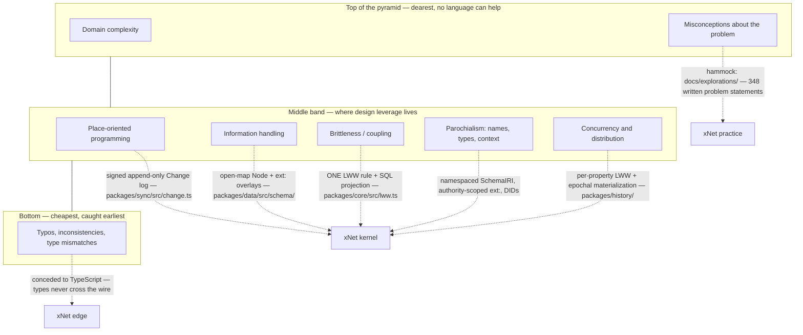
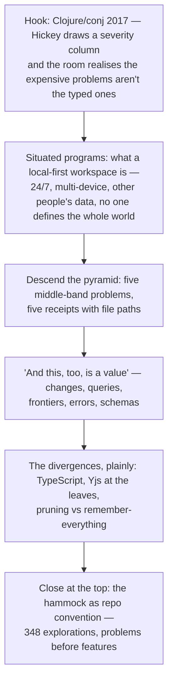

# A Blog Post On Rich Hickey: Effective Programs, Simple Made Easy, And xNet

## Problem Statement

What would a blog post on the intersection of Rich Hickey's design philosophy
and xNet look like — centred on **Effective Programs** (the Clojure
ten-year-anniversary keynote, Clojure/conj 2017) and **Simple Made Easy**, and
in particular on the severity pyramid Hickey draws in Effective Programs to
show where the load-bearing problems of software actually live?

Hickey's corpus is unusually coherent. Across two decades of talks — Simple
Made Easy (2011), The Value of Values (2012), Deconstructing the Database
(2012), Hammock Driven Development (2010), Are We There Yet? (2009), Effective
Programs (2017) — he makes one argument from different angles: **programs
exist to be effective in a messy, running, shared world**, and the biggest
costs in software come not from typos or type errors but from mutable places,
tangled constructs, parochial names, and — above everything — misconceptions
about the problem itself. Clojure and Datomic are that argument executed in a
language and a database.

The question for this exploration: is there a post here worth writing as the
next entry in the series (`site/src/pages/blog/`), what is its angle and
spine, where does xNet genuinely embody Hickey's prescriptions at the *system*
level, where does it honestly diverge, and what are the mechanics of shipping
it?

## Executive Summary

**Yes — write it as the next essay in the series**, provisional title
**"Tree Rings"** (Hickey's own image for Datomic's accretion model: new facts
grow on the outside; the interior never changes; the history is legible in the
cross-section). The recommended shape is roughly one-third the talks — what
Effective Programs actually argues, with the severity pyramid drawn properly —
and two-thirds "what taking the middle of that pyramid seriously looks like
when you design a *system* rather than a language," written from shipped code.

Five findings drive the recommendation:

1. **Effective Programs ends with a challenge xNet is literally attempting.**
   The talk's closing plea is to design at the system level, not just the
   language level — to build for *situated programs*: long-running,
   information-consuming, entangled with other systems and people. A
   local-first, multi-device, sync-everything workspace is the situated
   program par excellence, and xNet's interop kernel
   (`docs/specs/protocol/00-overview.md` §4) is a system-level transcription
   of the talk's middle band: plain-data nodes, a signed immutable log, one
   merge rule, globally qualified names.
2. **The pyramid is the organizing device, and it maps cleanly.** Hickey
   ranks programming problems by cost: at the top, domain complexity and
   *misconceptions* (no language can help); in the middle, the leverage band —
   place-oriented programming, information handling, parochialism, coupling,
   concurrency, distribution — where design actually pays; at the bottom,
   trivia like typos and type mismatches (cheap, caught early, yet where much
   of the industry's tooling energy goes). Every middle-band item has a named
   xNet receipt (mapping table below) — most literally, PLOP's antidote is the
   signed, hash-chained, append-only change log in
   `packages/sync/src/change.ts`.
3. **The "one rule" story is the Simple Made Easy centrepiece.** xNet's LWW
   ordering was once re-implemented in three places (NodeStore, SQLite
   adapter, hub storage) — a textbook complection — and is now ONE function,
   `compareLwwStamps` in `packages/core/src/lww.ts`, projected into SQL via
   `lwwUpdateGuardSql` so the JS and SQL paths cannot drift. That refactor is
   the essay's concrete "un-braiding" anecdote, and it composes with the
   series' existing loom imagery (*The Loom You Can Read*).
4. **The honest divergences keep it from being fan mail.** xNet is written in
   TypeScript with types everywhere (Hickey is famously unpersuaded); it
   embeds Yjs — an opaque CRDT, not semantically transparent values — for
   prose; and it prunes history under mobile storage budgets where Datomic's
   ethos is "remember everything." Each divergence has a principled defence
   (types never cross the wire; the 0330 rule "log for facts, CRDT for
   prose"; horizons fail loudly via `HistoryHorizonError`), and stating them
   plainly is the intellectual heart of the post.
5. **The hammock closes the loop.** The top of the pyramid — misconceptions —
   is not addressable by any kernel. xNet's answer is procedural, not
   technical: 348 numbered explorations in `docs/explorations/`, each a
   written statement of a problem before any code. Hammock Driven Development
   as a repo convention. No other essay in the series has surfaced this
   practice, and it gives the post a personal, non-obvious ending.

## Current State In The Repository

### Blog infrastructure (what a new post touches)

- **Registry**: `site/src/data/blog.ts` — hand-maintained `posts[]` array,
  newest-first by `pubDate`; `publishedPosts()` filters `draft: true`.
- **Pages**: `site/src/pages/blog/<slug>.astro` — each essay is a
  hand-authored, art-directed `.astro` page (not MDX), en-GB prose,
  `authors: ['crs48', 'claude']`, tags from the fixed union, inline Mermaid
  diagrams of real protocol behaviour.
- **RSS**: `site/src/pages/blog/rss.xml.ts` calls
  `buildBlogRss(publishedPosts())` from `site/src/lib/blog-feed.ts` — index
  and feed render from the same registry, so adding the registry entry is the
  only wiring step.
- **House style**: single-metaphor literary titles (*Clutch Power*, *The
  Vault and the View*, *The Loom You Can Read*); a concrete real-world hook
  mapped onto an architectural claim; ~13–15 minute reads.

### The receipts — where xNet already embodies the talks

| Hickey concept | Talk | xNet seam |
|---|---|---|
| Values, not places (PLOP) | The Value of Values | Signed, hash-chained, append-only `Change<T>` log — `packages/sync/src/change.ts` (`createUnsignedChange` → `computeChangeHash` BLAKE3 → `signChange` Ed25519). New information never overwrites old; it accretes. |
| Epochal time model; identity = succession of values | Are We There Yet? / Effective Programs | Pure fold `applyChangeToState` and `HistoryEngine.materializeAt` in `packages/history/src/engine.ts` — immutable state in, new immutable state out; a node id is an identity over a succession of values. |
| Database as a value; as-of queries | Deconstructing the Database | `Frontier` (`packages/history/src/frontier.ts`): positions are change hashes, never indexes. Read-only frontier = scrub position; pinned = `Checkpoint` (`checkpoint.ts`); writable fork = draft (`draft.ts`). `materializeAt` is `db.asOf` for the log. |
| Just use maps; information handling | Effective Programs | `Node` is an open map — `packages/data/src/schema/node.ts` (`[key: string]: unknown`, "All other fields are schema-defined"). Schemas (`defineSchema`, `packages/data/src/schema/define.ts`) are a lens over the map, not a closed class. `ext:` overlays (`schema/extension.ts`) are "just add a key." |
| Parochialism; qualified names | Effective Programs | `SchemaIRI` is namespaced and versioned (`xnet://xnet.fyi/Task@2.0.0`); extension keys carry their authority (`ext:<authority>/<field>`); authors are DIDs. Names travel whole across system boundaries. |
| Un-complecting; one braid per concern | Simple Made Easy | ONE LWW rule — `compareLwwStamps` in `packages/core/src/lww.ts` (lamport → wallTime → grinding-resistant tiebreak → authorDID, code-unit compares), formerly three divergent copies; `lwwUpdateGuardSql` projects the identical rule into SQLite `ON CONFLICT` guards. |
| Simple artifact over easy construct | Simple Made Easy | The interop kernel (`docs/specs/protocol/00-overview.md` §4) is four plain-data commitments — `did:key`, open-map Node, signed/Lamport Change, per-property LWW. Yjs bodies, relay, awareness, grants are explicitly optional layers. Exploration 0200: the kernel is the signed change log, not Yjs. |
| Information vs mechanism in errors | Effective Programs / Simple Made Easy | `TaggedError` (`packages/core/src/errors/tagged.ts`): the information (a `_tag` literal, `code` unions, readonly fields) is separated from the mechanism (throwing); catch sites narrow on data. |
| Declarative data access | Deconstructing the Database | `useQuery` (`packages/react/src/hooks/useQuery.ts`) over a serializable plain-data query AST (`packages/data/src/store/query-ast.ts`) — queries are values too. |
| Misconceptions cost the most; hammock first | Hammock Driven Development | `docs/explorations/` — 348 numbered problem statements, written before code, with checklists that get checked off by later implementation PRs. |

### What the repo does NOT have (the divergences)

- **A dynamic language.** xNet is TypeScript end to end; types are pervasive
  in the constructs. The defensible line: **types never cross the wire** —
  the interop kernel is canonical JSON with sorted keys, hashed and signed;
  schema is a versioned lens applied at read time (`schema/lens.ts`), so
  foreign peers need only the plain data. Hickey's parochialism critique is
  about types *at system boundaries*; xNet keeps them inside the walls.
- **Semantically transparent prose.** Rich text and canvas use Yjs — opaque
  binary updates (`SignedUpdate`, `packages/data/src/updates.ts`), a separate
  history mechanism (`document-history.ts` uses Y.snapshot, not the log
  fold). Exploration 0330's rule — log for facts, CRDT for prose — is a
  deliberate, bounded impurity: the leaves are CRDTs, the tree is values.
- **Infinite memory.** Datomic's ethos is that storage is cheap enough to
  remember everything. xNet ships pruning policies (`history/src/pruning.ts`,
  `DEFAULT_POLICY`, `MOBILE_POLICY`) because phones exist; the mitigation is
  that frontier positions are hashes, so a scrub past the horizon fails
  loudly (`HistoryHorizonError`) instead of silently lying, and checkpoints
  pin what they reference (`checkpoint.ts`).

### Prior Hickey/Datomic threads in the doc corpus

- `docs/explorations/0021_[_]_CLOJURE_PORT.md` — cites Simple Made Easy
  directly; explores porting the kernel to Clojure.
- `0188` (extensible schemas) calls its properties-on-nodes design
  Datomic-style; `0329` (drafts/timeline) cites Datomic/XTDB as-of queries as
  prior art; `0200` fixes the kernel-is-the-log boundary; `0330` sets the
  facts/prose lane rule.

## External Research

All four talks were re-grounded against the community transcripts
(matthiasn/talk-transcripts) rather than memory; the video the user linked
(youtube.com/watch?v=2V1FtfBDsLU) is Effective Programs, Clojure/conj 2017.

### Effective Programs — the argument, compressed

- **Programming is for effectiveness in the world**, not for proofs about
  artifacts. Effectiveness comes mostly from extracting predictive power from
  information and experience — accumulated facts — not from computation.
- **Situated programs** are the target: they run continuously, consume and
  produce information over time, interact with other systems and people,
  absorb real-world irregularity (the "Two for Tuesday" radio-scheduling
  example), and evolve. Compilers and theorem provers, by contrast, get to
  define their whole world; situated programs don't.
- **The severity pyramid.** Hickey ranks the problems of programming by
  cost, with a dollar-sign severity column. At the top: **domain complexity**
  and **misconceptions** — the most expensive, and no language feature
  touches them (there is roughly an order-of-magnitude drop in severity
  before any language-addressable problem appears). In the middle, the
  leverage band a language or system *can* address: place-oriented
  programming, information handling, brittleness and coupling, language-model
  complexity, execution-model opacity, parochialism (types, names, context),
  concurrency, distribution. At the bottom: trivia — typos, inconsistencies,
  type mismatches — the cheapest problems, caught earliest, and the ones the
  most celebrated tooling (elaborate static type systems) chiefly addresses.
- **Clojure's picks from the middle band**: immutable data as the default
  idiom (vs PLOP); maps and associative data as the fundamental information
  abstraction; a deliberately small language model; reified, namespace-
  qualified names against parochialism; runtime tangibility (REPL, eval);
  concurrency via immutability plus the epochal time model.
- **Against positional and nominal semantics**: argument lists and product
  types stop communicating as they grow; classes compile the names away and
  give you data *concretions*, not abstractions; RDF's subject-predicate-
  object model shows information can merge across sources only when the
  representation is neutral and names are self-describing.

### Simple Made Easy — the vocabulary the essay borrows

- **Simple** (one fold, un-braided — objective) vs **easy** (near at hand —
  relative to a person). **Complect**: to braid together concerns that could
  be independent. State complects value and time; objects complect state,
  identity, and value; inheritance complects types.
- **Construct vs artifact**: judge a construct by the long-run qualities of
  the artifact it produces, not by authoring convenience. Complexity borrowed
  for early speed is repaid with interest; the talk's (self-admittedly
  fictional) speed graph shows ease winning the first month and simplicity
  winning the year.
- The one direct quotation the essay should carry, because it names the
  failure mode the divergences section must avoid: "Programmers know the
  benefits of everything and the tradeoffs of nothing" (Hickey, Simple Made
  Easy). Everything else can be paraphrased.
- The replacement toolkit — values for state, data for objects, functions
  plus namespaces for methods, polymorphism à la carte for inheritance,
  queues for direct calls, declarative rules for scattered conditionals — is
  effectively a checklist the xNet kernel can be audited against.

### The Value of Values / Deconstructing the Database — the data model

- **PLOP**: any system where new information replaces old is place-oriented;
  the practice is a fossil of small early hardware, and the rationale is
  gone. Facts are values — something that happened, with time attached; you
  cannot update the past, only accrete to it. Programmers already believe
  this where it matters to them: source control and logs are never edited in
  place.
- **Datomic's shape**: datoms (entity/attribute/value/transaction) accrete;
  retraction is a new fact, not an erasure; the database is an expanding
  value you can hold at a point in time (as-of) and query without
  coordination; process (the transactor) is separated from perception
  (peers). The tree-ring image — growth on the outside, a stable interior,
  history legible in cross-section — is the essay's title metaphor.

### Hammock Driven Development — the practice

- The biggest problems are problems of misconception, and the cheapest place
  to fix a bug is before it exists — in design. The practice: state the
  problem in writing, load the mind with facts and constraints and prior
  art, then let the background mind work; solve problems, not features.

## Key Findings

1. **The pyramid gives the essay its architecture.** Open at the top
   (misconceptions — the hammock, the explorations practice), spend the body
   in the middle band (one receipt per problem, each with a real file path),
   and close at the bottom by conceding the trivia band to TypeScript — which
   simultaneously lands the honest-divergence point about types.
2. **xNet's strongest claim is system-level, not language-level.** The essay
   should not argue "xNet is Clojure-flavoured TypeScript"; it should argue
   that the interop kernel does for a *protocol* what Clojure did for a
   *language*: pick the middle band and refuse to complect it. Four frozen
   plain-data commitments (already narrated as stud-and-tube in *Clutch
   Power*) are the load-bearing wall.
3. **Every abstraction in the story is a value.** Changes are values (hashed,
   signed, immutable). Queries are values (serializable AST). Positions in
   time are values (frontiers are maps of hashes). Errors are values
   (`_tag` + readonly fields). Even schemas are versioned values with lenses
   between versions. That repetition — "and this, too, is a value" — is the
   essay's rhetorical engine.
4. **The LWW un-braiding is the one concrete war story.** Three divergent
   copies of the merge rule → one function plus a SQL projection is Simple
   Made Easy told in a diff, and it explains *why* simplicity is a choice
   with maintenance receipts (the churn-map exploration 0276 documents what
   standing complection costs the repo elsewhere).
5. **The divergences are principled, not embarrassing.** Types stay inside
   the walls (the wire is neutral data — precisely Hickey's requirement for
   information merging); Yjs is quarantined at the leaves by a written lane
   rule (0330); pruning trades the remember-everything ethos for honest
   failure at the horizon. A reader who knows the talks will trust the essay
   *because* these are stated.

### The pyramid, mapped



### The epochal time model in the codebase

```mermaid
flowchart LR
    subgraph LOG["The log — values, forever"]
        c1["Change #1<br/>hash, sig, lamport"] --> c2["Change #2"] --> c3["Change #3"] --> c4["Change #4"]
    end
    subgraph FOLD["Pure fold (packages/history/src/engine.ts)"]
        f["applyChangeToState(state, change) → state'"]
    end
    LOG --> f
    f --> v1["NodeState @ frontier F1<br/>(a value)"]
    f --> v2["NodeState @ frontier F2<br/>(a value)"]
    f --> now["NodeState @ head<br/>(SQLite projection,<br/>LWW upsert guards)"]
    v1 -. "pinned = Checkpoint" .-> cp["Checkpoint node"]
    v2 -. "forked = Draft" .-> dr["Writable draft"]
    now --> uq["useQuery(Schema, {...})<br/>declarative reads"]
```



### How the essay's argument flows



## Options And Tradeoffs

| Option | Shape | Pros | Cons |
|---|---|---|---|
| **A. "Tree Rings" — pyramid-spined essay (recommended)** | One essay, ~14 min, structured as a descent of the pyramid with the accretion metaphor carrying the data-model half | Honours the user's stated focus (Effective Programs + the pyramid); one concrete image; slots into series conventions; divergences give it spine | Must compress Simple Made Easy to a section; risks density — needs the diagrams |
| B. Two-part series (Effective Programs / Simple Made Easy) | Part 1 pyramid + situated programs; part 2 complecting + the LWW story | Room for both talks at full depth | Series has no precedent for multi-part essays; part 2 overlaps *The Loom You Can Read* and *Clutch Power* heavily |
| C. Developer-tour post (like *The Tip of the Hook*) | Code-first walkthrough: "audit the kernel against Hickey's toolkit" | Cheapest to write; very concrete | Reads as documentation, not essay; wastes the pyramid, which is a narrative device; user asked for the philosophy |
| D. Title alternatives for A | "The Middle of the Pyramid"; "One Fold"; "Situated" | "One Fold" is the literal etymology of *simple* | Braid/weave territory is already occupied by *The Loom You Can Read*; "Tree Rings" is Hickey's own image for accretion and fits the series' nature strand (*Data Should Work Like Soil*, *The Gentlest Furnace*) |

## Recommendation

Write **Option A**: a single essay, **"Tree Rings"**, as the next entry in
`site/src/pages/blog/`.

- **Spine** (mirrors the flow diagram): open in the room at Clojure/conj 2017
  as the severity column goes up; define situated programs and place xNet in
  that class; descend the pyramid's middle band with one receipt per problem
  (log for PLOP, open maps for information, one LWW rule for coupling,
  namespaced IRIs and DIDs for parochialism, epochal materialization for
  concurrency/distribution); run the "and this, too, is a value" litany
  (changes, queries, frontiers, errors, schemas); state the three divergences
  without flinching; end in the hammock with the explorations practice.
- **Diagrams in the essay**: the pyramid mapping (simplified from above) and
  the epochal-time fold; the two-device LWW convergence diagram already lives
  in *The Loom You Can Read* and should be referenced, not repeated.
- **Register**: en-GB, `.astro` page, `authors: ['crs48', 'claude']`, tags
  `['essay', 'philosophy', 'protocol']`, ~14 minutes. At most one direct
  quotation (the benefits-and-tradeoffs line, attributed); everything else
  paraphrased — the talks are freely watchable and should be linked, not
  transcribed.
- **Cross-links**: *Clutch Power* (the four frozen interfaces), *The Loom You
  Can Read* (the change log tour), *The Vault and the View* (data outliving
  apps); explorations 0021, 0200, 0329, 0330 for readers who want the
  engineering paper trail.

## Example Code

The essay's code moments, verbatim from the repo (each ~5 lines, real):

```ts
// packages/data/src/schema/node.ts — information is an open map
export interface Node {
  id: string; schemaId: SchemaIRI; createdAt: number; createdBy: DID
  [key: string]: unknown // All other fields are schema-defined
}
```

```ts
// packages/sync/src/change.ts — a fact becomes a value: hash, then sign
export function signChange<T>(unsigned, signingKey): Change<T> {
  const hash = computeChangeHash(unsigned) // BLAKE3 over canonical JSON
  const signature = sign(new TextEncoder().encode(hash), signingKey)
  return { ...unsigned, hash, signature }
}
```

```ts
// packages/core/src/lww.ts — the ONE ordering (protocol §L1.7):
// lamport → wallTime → grinding-resistant tiebreak → authorDID.
// Formerly three divergent copies; lwwUpdateGuardSql() projects this
// same ladder into SQLite ON CONFLICT guards so JS and SQL cannot drift.
```

```ts
// packages/history/src/frontier.ts — a moment in time is a value:
// a map of change hashes, never an index, never a timestamp.
export type Frontier = Record<NodeId, FrontierEntry>
```

## Risks And Open Questions

- **Density.** The pyramid descent covers five problems; each must be a
  paragraph, not an essay, or the piece balloons past 20 minutes. Mitigate by
  pushing depth into cross-links.
- **Overlap with existing essays.** *Clutch Power* already narrates the four
  frozen interfaces and *The Loom You Can Read* the change log. The Hickey
  essay must add the *why* (the talks' argument) rather than re-tour the
  *what*; the receipts should be pointers, not re-explanations.
- **Quotation discipline.** Transcripts are community-made and the talks are
  copyrighted; keep to a single short attributed quote and paraphrase the
  rest, linking the videos.
- **Representing Hickey fairly on types.** He argues elaborate type systems
  address the cheap band and create boundary parochialism — not that types
  are useless. The essay's TypeScript concession must not strawman him into
  "types are bad," nor soften him into "types are fine."
- **Pyramid fidelity.** The talk presents a severity-ranked list with a
  cost column rather than a literal drawn pyramid in every recording; the
  essay should describe it as the severity ranking it is (the user's
  "pyramid" framing is the natural visual) and link the talk for the slide.
- **Is "Tree Rings" too quiet a title?** Alternatives in Options table;
  decide at draft time against the index page rhythm.

## Implementation Checklist

- [x] Draft `site/src/pages/blog/tree-rings.astro` following the spine above
      (en-GB, `.astro` not MDX, single H1, deck paragraph, inline Mermaid for
      the pyramid mapping and the epochal fold).
- [x] Add the registry entry to `site/src/data/blog.ts` (`slug: 'tree-rings'`,
      `authors: ['crs48', 'claude']`, `tags: ['essay', 'philosophy',
      'protocol']`, honest `readingMinutes`, `pubDate` in ISO-8601 UTC).
- [ ] Verify RSS and index pick it up (both render from `publishedPosts()`;
      build the site — memory 0291: don't trust `astro dev` for
      long-page routes, verify via `pnpm build`).
- [x] Cross-link from the essay to *Clutch Power*, *The Loom You Can Read*,
      and *The Vault and the View*; add a "paper trail" footer linking
      explorations 0021, 0200, 0329, 0330.
- [ ] Fact-check the four talk characterizations against the linked videos
      one final time in-draft (especially the severity-ranking description).
- [x] Keep direct quotation to the single attributed line; link all talks.
- [ ] Site-only PR: apply the `skip-changelog` label (no publishable package
      is touched; no changeset needed).
- [ ] Let CI run green; merge-commit per repo convention.

## Validation Checklist

- [ ] `pnpm build` (site) passes and `/blog/tree-rings` renders with both
      Mermaid diagrams and correct dark/light theming.
- [ ] `/blog/rss.xml` includes the new entry with correct pubDate and
      description; index page shows it first.
- [ ] All file-path claims in the essay resolve against `main` at publish
      time (`packages/sync/src/change.ts`, `packages/core/src/lww.ts`,
      `packages/history/src/frontier.ts`, `packages/data/src/schema/node.ts`).
- [ ] A reader who has watched Effective Programs recognises the severity
      ranking as described (no invented layers); a reader who hasn't can
      follow the essay without the talk.
- [ ] The divergences section names TypeScript, Yjs, and pruning explicitly —
      the essay does not read as hagiography.
- [ ] Reading time honest at ~14 minutes.

## References

- Rich Hickey, *Effective Programs: 10 Years of Clojure* (Clojure/conj 2017)
  — https://www.youtube.com/watch?v=2V1FtfBDsLU
- Rich Hickey, *Simple Made Easy* (Strange Loop 2011) —
  https://www.youtube.com/watch?v=SxdOUGdseq4
- Rich Hickey, *The Value of Values* (JaxConf 2012) —
  https://www.youtube.com/watch?v=-6BsiVyC1kM
- Rich Hickey, *Deconstructing the Database* (JaxConf 2012) —
  https://www.youtube.com/watch?v=Cym4TZwTCNU
- Rich Hickey, *Hammock Driven Development* (Clojure/conj 2010) —
  https://www.youtube.com/watch?v=f84n5oFoZBc
- Rich Hickey, *Are We There Yet?* (JVM Languages Summit 2009) —
  https://www.youtube.com/watch?v=ScEPu1cs4l0
- Community transcripts: https://github.com/matthiasn/talk-transcripts
  (Hickey_Rich/EffectivePrograms.md, SimpleMadeEasy.md, ValueOfValues.md,
  DeconstructingTheDatabase.md, HammockDrivenDev.md)
- Repo: `docs/specs/protocol/00-overview.md` (interop kernel);
  `docs/explorations/0021_[_]_CLOJURE_PORT.md`;
  `0200_[x]_PORTABLE_XNET_PROTOCOL_BOUNDARIES_AND_STANDARD.md`;
  `0329_[x]_PATCHWORK_STYLE_DRAFTS_AND_TIMELINE_SCRUBBING.md`;
  `0330_[_]_CRDT_DEPTH_AUTOMERGE_VS_YJS.md`;
  `0276_[x]_CHURN_WEIGHTED_REFACTOR_MAP.md`
- Prior essays: `site/src/pages/blog/clutch-power.astro`,
  `the-loom-you-can-read.astro`, `the-vault-and-the-view.astro`
