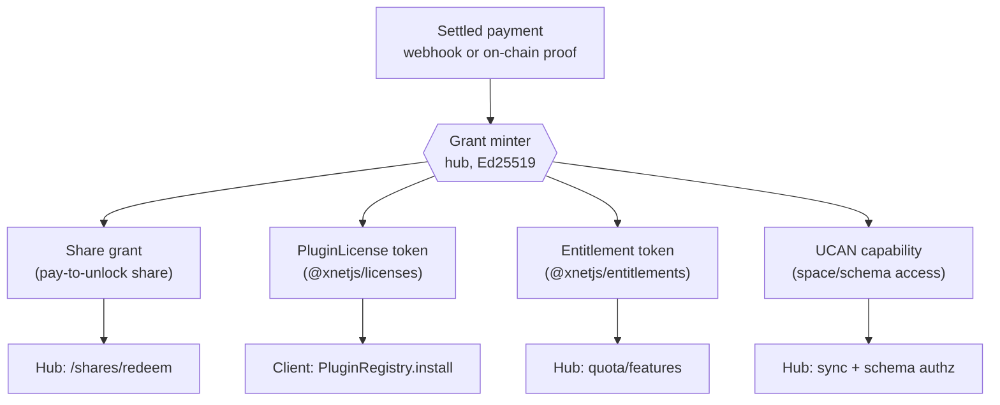
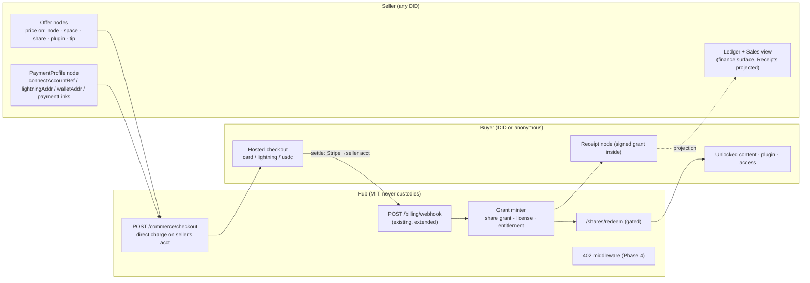
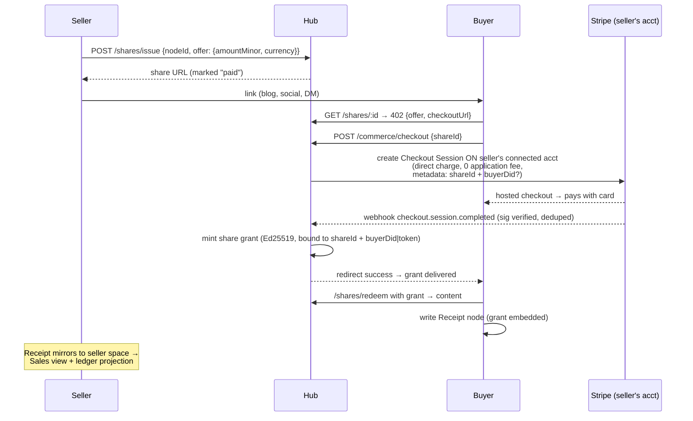
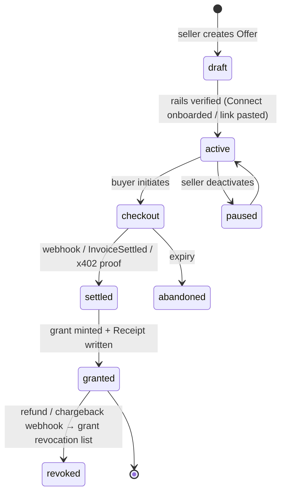
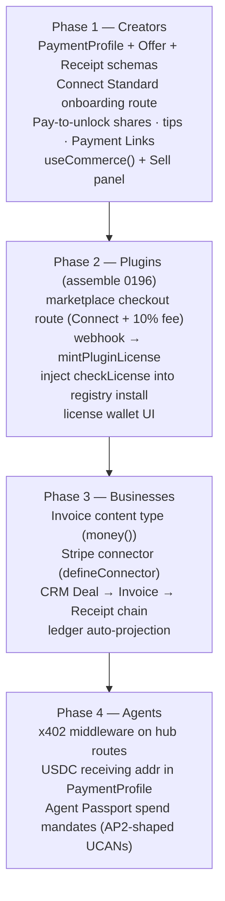

# First-Class Payments: Creator Commerce And Economic Exchange On xNet

> **Status:** Exploration
> **Date:** 2026-07-18
> **Tags:** payments, commerce, creators, stripe, connect, bitcoin, x402, stablecoins, licenses, ucan, marketplace

## Problem Statement

The ask, in the user's words:

> "How do we make payments on xNet feel super seamless and easy? It would be
> nice if people could leverage xNet to share their creative work and to build
> businesses and integrate payments really easily. Maybe through Stripe, maybe
> through blockchain, maybe through other mediums. What does it look like for
> xNet to really gracefully integrate payments as a first class citizen so
> people can exchange economic value on xNet as well."

Today, every payment surface in the repo is **operator-facing**: the hub
operator can charge *their* users for *their* app
([0187](./0187_[x]_PLUG_AND_PLAY_BILLING_STRIPE_AND_BITCOIN.md)), and xNet's
own cloud meters *its* tenants
([0201](./0201_[_]_OPENROUTER_LITELLM_METERED_AI_AND_CREDITS_BILLING.md),
[0244](./0244_[x]_OPENROUTER_DEEP_INTEGRATION_MARGIN_SAFE_BILLING_AND_USER_SPEND_CAPS.md)).
What does **not** exist is *peer-to-peer* commerce: a creator charging a
reader, a consultant invoicing a client, a plugin author selling to a user, a
tip landing on a post. There is no way for **one DID to sell to another DID**.

This exploration answers: **what is the xNet-native shape of user-to-user
economic exchange — the schemas, the rails, the enforcement points, and the
sequencing — such that "add a price to this" becomes as easy as "share
this"?**

## Executive Summary

1. **The spine is already built; the missing layer is peer-to-peer.**
   `@xnetjs/billing` (provider port, Stripe-via-REST, BTCPay, **Connect
   destination-charge fee math already implemented** in
   `packages/billing/src/connect.ts`), `@xnetjs/licenses` (DID-bound Ed25519
   purchase tokens), `@xnetjs/entitlements` (signed plan contract),
   `@xnetjs/ledger` (double-entry, integer minor units), and hub `/billing/*`
   routes all exist and are tested. What's unassembled: seller onboarding, a
   way to attach a price to content, and the purchase→grant loop.

2. **The unifying idea is "payment mints capability."** xNet already gates
   everything — sync, share links, plugin installs, hub routes — on signed
   capabilities (UCANs, share grants, license tokens, entitlement tokens). A
   payment is just **another way to mint one**. A settled charge produces a
   signed, DID-bound grant that the *existing* authorization machinery
   enforces. This one pattern unifies paid content, paid shares, paid plugins,
   paid API access, and subscriptions — and it means the payments layer adds
   **no new enforcement machinery at all**.

3. **Receipts become nodes; money never does.** Following the Nostr-zap
   pattern (NIP-57), the *settlement* happens wallet-to-wallet on external
   rails, but the *receipt* is a signed node in the change log — portable,
   offline-verifiable, queryable, and feedable straight into the seller's
   `@xnetjs/ledger` chart of accounts. Commerce state lives in the data
   fabric; custody never does.

4. **Take rate: 0% on direct creator commerce.** The web research converges
   from three independent directions — business trust (Ghost's 0%-take model
   is winning defectors from Substack/Patreon's 10%), regulation (Stripe
   Connect **Standard + direct charges** keeps xNet entirely out of the flow
   of funds → no money-transmitter exposure), and xNet's own positioning
   ([0336](./0336_[_]_COMPARATIVE_CLOUD_ECONOMICS_AND_XNET_CLOUD_POSITIONING.md):
   "sell operations, not bytes") — on the same answer: **the creator connects
   their own Stripe account, funds settle directly to them, xNet takes
   nothing on direct sales and monetizes hosting/ops.** The 10%
   `application_fee` machinery ([0196](./0196_[_]_PAID_PLUGIN_MARKETPLACE_MONETIZATION_AND_LICENSING.md),
   `DEFAULT_MARKETPLACE_FEE_BPS`) stays reserved for the *managed
   marketplace* listing service, where xNet performs real distribution work.

5. **Three rails, one port, honest tiers.** Humans pay with cards via **Stripe
   Connect Standard** (the default; zero new adoption asked of buyers — the
   Coil post-mortem's central lesson). Sovereignty purists use **BTCPay /
   Lightning** (already an adapter). Agents and micropayments use **x402**
   (HTTP 402 + stablecoins; >100M transactions on Base in year one, now
   Linux-Foundation-governed with Cloudflare and AWS at the edge, and its
   AP2-mandate authorization model is structurally a UCAN). All three slot
   behind the existing `PaymentProvider` port. None involve xNet custody.

6. **Sequencing: creators first, plugins second, businesses third, agents
   fourth.** Phase 1 ships the emotional core of the ask — *"share your
   creative work, get paid"* — as paid share links + tips on profiles,
   because it reuses the share-link and billing seams nearly unchanged.
   Phase 2 assembles the already-designed paid-plugin loop (0196). Phase 3
   adds invoicing + a Stripe connector for businesses. Phase 4 wires x402
   for the agent economy.

## Current State In The Repository

### The payments spine (all shipped, all MIT unless noted)

| Layer | Package / files | State |
| --- | --- | --- |
| Provider port + adapters | `packages/billing/src/provider.ts`, `providers/stripe.ts` (REST via `fetch`, no SDK), `providers/btcpay.ts`, `providers/fake.ts` | ✅ shipped (0187) |
| Marketplace fee math | `packages/billing/src/connect.ts` — `ConnectCharge`, `applicationFeeMinor`, `DEFAULT_MARKETPLACE_FEE_BPS = 1000` | ✅ shipped, **never called** |
| Webhook processing | `packages/billing/src/webhook.ts` (verify→dedupe→normalize→apply), `stripe-signature.ts` | ✅ shipped |
| Durable store | `packages/hub/src/services/billing-store.ts` (`SqliteBillingStore`, own `billing.db`, LWW, out-of-order replay) | ✅ shipped |
| Hub routes | `packages/hub/src/routes/billing.ts` — `POST /billing/webhook`, `POST /billing/checkout`, `GET /billing/me`, `GET /billing/entitlements`, `POST /billing/portal` | ✅ shipped |
| Client hook | `packages/react/src/hooks/useBilling.ts` | ✅ shipped (own-subscription only) |
| Purchase tokens | `packages/licenses/src/token.ts` (`PluginLicenseClaims`, Ed25519, DID-bound), `mint.ts` (`mintPluginLicense`, `checkLicenseFor`) | ✅ shipped, **wired nowhere** |
| Plan entitlements | `packages/entitlements/src/plans.ts`, `entitlements.ts`; bridged in `packages/hub/src/services/billing-entitlements.ts` | ✅ shipped |
| Double-entry ledger | `packages/ledger/src/` (balance, reports, budgets, CSV/OFX/QIF import); schemas `packages/data/src/schema/schemas/account.ts`, `transaction.ts`, `posting.ts`; UI `apps/web/src/components/finance/` | ✅ shipped (0187) |
| Money property | `packages/data/src/schema/properties/money.ts` — `MoneyValue { amount: minor units, currency }` | ✅ shipped |
| Pricing manifest | `packages/plugins/src/manifest.ts` — `PluginPricing` (`free`/`one-time`/`subscription`, `provider: 'managed' \| 'byo'`), `publisherDid` | ✅ shipped |
| Marketplace catalog | `packages/plugins/src/ecosystem/marketplace.ts` — `MarketplaceEntry.pricing`, provenance | ✅ shipped |
| Install gate | `packages/plugins/src/registry.ts` — `checkLicense?` callback, `PluginLicenseRequired` | ✅ shipped, **no app injects the callback** |
| Cloud metering (FSL) | `packages/cloud/src/billing/` (Billing Meters, explicitly *no* Connect — sole-seller), `apps/cloud/src/reconcile/billing.ts` (dunning) | ✅ shipped (0200/0244/0260) |

### The seams peer-to-peer commerce would ride

- **Share links** — `packages/hub` mounts `/shares`, `/shares/issue`
  (authed), `/shares/redeem`. This is the natural attach point for
  *pay-to-unlock*: a share whose redemption requires a settled payment.
- **Profiles** — the `profile-<did>` node pattern (custom avatars ship as
  data-URLs on the profile node; `useEnsureProfiles`) is exactly where a
  creator's *payment profile* (Connect account ref, Lightning address,
  wallet address) belongs.
- **DID + UCAN** — `packages/identity/src/ucan.ts` (delegation, attenuation,
  expiry) and `agent-passport.ts` (0337). Billing already binds every
  customer, checkout, and license to a DID with the DID **server-set from the
  auth session, never client-trusted**.
- **Connectors** — `packages/plugins/src/connectors/define-connector.ts`
  (broker-held secrets, network allowlist, `guardedStore`): the right shape
  for a **Stripe connector** that syncs a business's charges/invoices into
  governed nodes.
- **Feature registry** — `packages/hub/src/features/first-party.ts` already
  mounts `billingFeature()` with a broker-scoped env; commerce routes mount
  the same way.

### Confirmed gaps

1. **No seller onboarding** — nothing stores "DID X receives payments via
   Connect account `acct_…` / Lightning `x@pay.example` / wallet `0x…`".
2. **No Offer primitive** — no way to attach a price to a node, space, share,
   or profile.
3. **The paid-plugin loop is unassembled** — `mintPluginLicense` and
   `checkLicenseFor` have zero call sites outside tests; `pricing.provider:
   'managed'` implies a Connect checkout that no route creates.
4. **No commerce content types** — no `Offer`/`Receipt`/`Invoice` schema in
   `@xnetjs/data`; billing state lives only in the hub's private SQLite
   mirror. (Also: CRM's `Deal.amount` is a raw `number` + `currency` text —
   it predates and should migrate to `money()`.)
5. **No selling UI** — `useBilling()` covers *my* subscription to the
   operator, not *my sales to others*. `navigateToNode` has no finance/crm
   (or future payments) entries.
6. **No crypto-native rail** — BTCPay only (fiat-denominated BTC settle); no
   stablecoin/x402 anything.

## External Research

Full sourcing in References; the load-bearing findings:

### Take rates and trust (creator platforms, mid-2026)

| Platform | Take | Model |
| --- | --- | --- |
| Substack | 10% + Stripe fees (~13–15% effective) | Platform is merchant-adjacent |
| Patreon | 10% flat (post-Aug 2025 joiners) | Platform in flow of funds |
| Gumroad | 10% + $0.50 (30% via Discover) | Platform is merchant |
| **Ghost(Pro)** | **0%** — flat hosting fee; creator's own Stripe | **Platform never touches funds** |

Ghost's model is the one earning defections from the 10% platforms (the
break-even vs Substack is only ~$290/mo of subscription revenue), and it is
the only model coherent with an MIT, self-hostable, local-first product.
Gumroad's 2025 arc (fake-open "Community License" → backlash → MIT within a
day, hosted business winding down) is a cautionary tale about half-hearted
openness from a fee-taking intermediary.

### Stripe Connect: the regulatory floor

- **Standard accounts cost the platform $0** (no per-account, payout, or 1099
  fees); Express/Custom cost $2/account/mo + payout fees and shift dispute
  liability to the platform.
- **Direct charges** settle on the *connected* account — refunds, disputes,
  and negative balances belong to the seller's account, not the platform's.
- A platform using **Standard + direct charges never holds, routes, or
  controls buyer money** → no FinCEN MSB registration, no state
  money-transmitter licenses; KYC/KYB, sanctions screening, and 1099-K
  reporting all live with Stripe, which onboards each seller directly.
- `application_fee_amount` is available on direct charges when a fee *is*
  warranted (the managed marketplace), with no extra Stripe fee on the fee.
- Even lighter: sellers can paste **Payment Links** (no-code checkout URLs)
  and the platform merely stores/embeds them.

### Protocol-native rails

- **x402** (Coinbase, HTTP 402 + stablecoins, launched May 2025): server
  answers `402` with payment requirements; client retries with a signed
  `X-PAYMENT` header (USDC); a facilitator verifies/settles on-chain.
  **~169M payments, 590k buyers, 100k sellers in year one**; x402 Foundation
  moved under the **Linux Foundation (April 2026)** with AWS, Google,
  Mastercard, Microsoft, Shopify, Stripe, Visa, Circle, Cloudflare, and
  Anthropic among members; Cloudflare and AWS both run it at their edges. v2
  adds reusable sessions + service discovery.
- **L402** (Lightning Labs): the same 402 idea over Lightning with macaroons;
  production-proven (Aperture proxy) but Bitcoin-only and niche; 2026
  repositioning targets agents.
- **Nostr zaps (NIP-57)**: settlement is wallet-to-wallet; the **receipt is a
  signed event in the social data layer**. The protocol never holds funds.
  This maps one-to-one onto xNet's signed change log.
- **Web Monetization / Interledger**: still WICG-incubated, extension-based,
  grant-funded, niche. **Coil's post-mortem** (shut down 2022, ~$68M burned,
  ~10k subscribers, creators earning $10–50/mo) is the key negative result:
  *never build a payments network that requires both sides to adopt something
  new simultaneously; passive micro-revenue doesn't motivate creators;
  piggyback on rails people already have.*

### Stablecoins and agentic payments

- The **GENIUS Act** (signed July 18, 2025) legitimized regulated payment
  stablecoins; issuer obligations (reserves, attestation, AML) sit with
  issuers like Circle — but a platform that *custodies* users' stablecoins
  re-enters money-transmission territory. Passkey smart wallets (Coinbase
  Smart Wallet: ~15s onboarding, no seed phrase) fix key management, **not
  wallet funding** — on-ramp KYC + card→USDC fees still kill human
  micropayment economics. Stablecoins are the **agent/micropayment rail**;
  cards are the **human rail**.
- **Agentic checkout is standardizing fast**: Stripe+OpenAI's **Agentic
  Commerce Protocol** (Instant Checkout in ChatGPT; Shared Payment Tokens —
  merchant-scoped, amount-capped, time-limited, revocable), Google's **AP2**
  (Intent/Cart/Payment **mandates as W3C Verifiable Credentials**, donated to
  FIDO April 2026), and **MCP payment servers** from Stripe
  (`mcp.stripe.com`), PayPal, and Square. AP2's signed-mandate design is
  structurally identical to a UCAN delegation — xNet's Agent Passport (0337)
  is already the right primitive.
- **The open-social world has a payments vacuum**: Bluesky/ATProto still has
  no shipped native payments (Bluesky+ premium pending; creators funnel to
  Substack/Patreon/Ghost off-platform); Mastodon monetizes via donations and
  hosting services. A local-first platform with *working* creator payments
  would be genuinely differentiated.

## Key Findings

1. **Payments reduce to capability minting.** Every enforcement surface xNet
   would ever gate with money already exists and already checks a signed
   artifact: share redemption (share grants), plugin activation (license
   tokens), hub quota (entitlement tokens), sync/read access (UCAN + schema
   authz). The *only* genuinely new machinery is: (a) seller rail
   registration, (b) an Offer primitive, (c) the webhook→mint bridge. That
   is a small amount of code sitting on a large amount of shipped substrate.

2. **`connect.ts` and `licenses/` are built-but-unwired on purpose — this is
   the moment to wire them.** 0196 designed the paid-plugin loop end-to-end;
   the fee math and token spine shipped; the checkout route and the two
   callback injections never landed. Phase 2 is assembly, not design.

3. **The 0%-take direct-sales model is the only one that compounds trust.**
   xNet's whole pitch is "your data, your infrastructure, no lock-in." A
   platform fee on direct creator revenue contradicts the pitch, creates
   money-transmitter gravity, and puts xNet in competition with its own
   self-hosters (who would just patch the fee out of an MIT codebase — a fee
   that is trivially removable is not a business model, it's an irritant).
   Monetization stays where 0336 put it: operations, hosting, AI metering,
   and *optional* managed-marketplace distribution.

4. **Receipts-as-nodes is the xNet-differentiated move.** Substack knows your
   subscribers; you rent that knowledge. On xNet, every sale lands as a
   signed `Receipt` node in *the seller's own space* (and a copy in the
   buyer's): your customer list, revenue history, and entitlement records are
   portable data you own, queryable with `useQuery`, feedable into
   `@xnetjs/ledger` for real accounting, and exportable in a `.xnetpack`
   (0344) like everything else. **Own-your-audience becomes
   own-your-revenue-graph.**

5. **Buyers must need nothing new.** Coil died asking both sides to adopt a
   new rail. Phase 1 buyers click a link and pay with a card on a Stripe
   Checkout page — no wallet, no extension, no xNet account required for a
   one-time unlock (an anonymous purchase binds to the share token rather
   than a buyer DID; a signed-in purchase binds to the DID and becomes
   portable). Sellers need exactly one thing: connecting the Stripe account
   they likely already have.

6. **The agent rail is where crypto earns its place — not human checkout.**
   x402's year-one numbers are machine-economy numbers. xNet is agent-native
   (Agent Passports, MCP-facing connectors, `defineConnector` agent tools).
   Hub endpoints answering `402 Payment Required` with an x402 challenge is
   a natural extension of the existing entitlements enforcement — and AP2
   mandates ≈ UCANs means xNet's authorization story already speaks the
   emerging standard's language.

## Options And Tradeoffs

### A. Economic model (who takes what)

| Option | Trust | Regulatory | Revenue to xNet | Verdict |
| --- | --- | --- | --- | --- |
| A1. Platform-as-merchant (Substack/Gumroad: xNet collects, pays out) | Low — contradicts ethos | **Money transmitter risk; payout liability; KYC on xNet** | 10%+ | ❌ reject |
| A2. Connect destination charges + platform fee on everything | Medium | Platform eats disputes/negative balances | ~10% | ❌ reject for direct sales |
| A3. **Connect Standard + direct charges, 0% on direct sales; `application_fee` only on managed-marketplace listings** | High — Ghost model | **Never in flow of funds; $0 Connect cost** | Hosting/ops (0336) + optional marketplace fee | ✅ **recommended** |
| A4. BYO everything (seller pastes Payment Links; xNet only verifies receipts) | Highest | None at all | 0 | ✅ always-available fallback (the 0196 "sovereign path") |

### B. Where the purchase grant is enforced



| Enforcement point | Gate strength | Offline? | Fits |
| --- | --- | --- | --- |
| Hub-gated (share redeem, sync, 402 routes) | Strong — server withholds bytes | No | Paid content, paid API, subscriptions to spaces |
| Client-gated (license check at install/activate) | Honor-system vs determined attacker (client is adversary) — same tier as every commercial plugin system | Yes | Paid plugins, paid templates |
| Protocol-gated (x402 settlement proof) | Strong — cryptographic | Per-request | Agent/micropayments |

All three already exist as enforcement surfaces; the minter is the only new
part. **No new DRM is proposed** — client-side gates stay honor-system-grade,
which is the industry norm and the right trade for an open platform.

### C. Rails

| Rail | Buyer friction | Seller friction | Fees | Custody | Phase |
| --- | --- | --- | --- | --- | --- |
| Stripe Connect Standard (cards, wallets, bank) | None (hosted checkout) | 1-click OAuth of existing account; Stripe KYC | ~2.9% + $0.30 to Stripe | Stripe ↔ seller | 1 |
| Stripe Payment Links (BYO) | None | Paste a URL | Same | Stripe ↔ seller | 1 (trivial) |
| BTCPay / Lightning | Wallet required | Self-host BTCPay | ~0 | Fully self-sovereign | shipped adapter; expose in UI Phase 1 |
| x402 / USDC (Base) | Funded wallet (fine for agents; hard for humans) | Receiving address | ~0 + on-chain | Wallet-to-wallet | 4 |

### D. Where commerce state lives

Same trilemma as 0187, same resolution: **hub tables are the authoritative
mirror (they already exist); nodes are the product surface.** The delta from
0187 is that receipts *must* become nodes to deliver the own-your-revenue-graph
payoff — but they can be **client-authored**: the *buyer's client* (or for
anonymous buyers, the seller's hub acting through the seller-side flow) writes
the `Receipt` node upon grant delivery, carrying the hub's Ed25519-signed
grant *inside* the node as the verifiable artifact. This sidesteps the
still-missing server-authored-node path (0187's open question) — the node is
ordinary user data; the *signature inside it* is what's trustworthy.

## Recommended Architecture



### The three new primitives

**1. `PaymentProfile`** (schema in `packages/data/src/schema/schemas/`):
one per DID, private-by-default fields with public rail descriptors.
Registered rails: `stripeConnect` (account ref obtained via a hub OAuth
route), `paymentLinks` (BYO pasted URLs), `btcpay` (server URL + store),
`lightningAddress`, `wallet` (chain + address). The hub keeps the
authoritative DID→`acct_…` mapping in its billing store (it must not be
client-forgeable); the node is the discoverable/public projection.

**2. `Offer`**: attaches a price to a subject. Fields: `subject`
(node ref / space id / share id / plugin id / `"tip"`), `kind`
(`one-time` / `subscription` / `tip` / `pay-what-you-want` with
`minAmount`), `amount: money()`, `rails` (subset of the seller's
registered rails), `grant` (what a settled payment mints: share-unlock,
license, space membership, none-just-thanks), `active`. Offers are ordinary
nodes: shareable, queryable, versioned.

**3. `Receipt`**: `{ offer ref, buyer (DID or null), seller DID, amount,
rail, externalRef, grantToken (hub-signed, Ed25519 — reuse the
`@xnetjs/licenses` token shape generalized to `subject` instead of
`pluginId`), settledAt }`. Written to the buyer's space (portable
proof-of-purchase) and mirrored to the seller's space (revenue graph).
Verification is offline: check the embedded signature against the hub's
public key, exactly like `verifyPluginLicense`.

### Sequence: pay-to-unlock a shared work (Phase 1 core)



### Offer lifecycle



Refunds ride the same webhook path in reverse: `charge.refunded` /
`charge.dispute.created` → the hub adds the grant to a revocation list
(the licenses package already contemplates hub revocation; share grants are
hub-checked anyway) and annotates the Receipt (`status: refunded`) — the
node history keeps the full story, in keeping with the append-only ethos.

### What each phase ships



Phase 1 is deliberately first: it is the verbatim ask ("share their creative
work"), it reuses the most shipped code (billing provider, webhook processing,
share routes), and its buyer side requires nothing but a card. Each phase
ships standalone value.

## Example Code

### Seller onboarding + checkout on the seller's account (Phase 1)

```ts
// packages/hub/src/routes/commerce.ts (new, mounted like billing.ts)
app.post('/commerce/connect/start', requireAuth, async (c) => {
  // Standard account OAuth — Stripe owns KYC; we store did → acct mapping
  const url = stripeConnectOauthUrl({
    clientId: env.STRIPE_CONNECT_CLIENT_ID,
    state: signState({ did: c.get('auth').did }),   // tamper-proof
    redirectUri: `${hubUrl}/commerce/connect/callback`,
  })
  return c.json({ url })
})

app.post('/commerce/checkout', async (c) => {
  const { offerId } = await c.req.json()
  const offer = await commerceStore.getOffer(offerId)
  const seller = await commerceStore.getSellerRails(offer.sellerDid)
  if (!offer?.active || !seller?.connectAccountRef)
    return c.json({ error: 'offer unavailable' }, 404)
  // DIRECT charge on the seller's account: funds never touch the hub
  const session = await provider.createCheckout(
    { did: c.get('auth')?.did ?? null, priceRef: offer.priceRef, mode: offer.kind },
    { stripeAccount: seller.connectAccountRef, applicationFeeMinor: 0 },
  )
  return c.json({ url: session.url })
})
```

### Payment mints capability — the generalized grant

```ts
// packages/licenses/src/grant.ts (generalize the existing token shape)
export interface PurchaseGrantClaims {
  v: 1
  subject: string          // 'share:<id>' | 'plugin:<id>' | 'space:<id>' | 'tip'
  buyer: string | null     // DID, or null for anonymous share unlocks
  offerId: string
  mode: 'one-time' | 'subscription'
  issuedAt: number
  expiresAt: number        // PERPETUAL_EXPIRY_MS for one-time
  kid: string
}
// sign/verify identical to signPluginLicense / verifyPluginLicense —
// PluginLicense becomes the subject === 'plugin:*' specialization.
```

### The selling hook (mirrors `useBilling`)

```tsx
// packages/react/src/hooks/useCommerce.ts → hooks sub-barrel per 0276 policy
function SellButton({ nodeId }: { nodeId: string }) {
  const { rails, connectStripe, createOffer } = useCommerce()
  if (!rails.stripeConnect && !rails.paymentLinks)
    return <button onClick={connectStripe}>Connect Stripe to sell</button>
  return (
    <button onClick={() => createOffer({
      subject: { kind: 'node', id: nodeId },
      kind: 'one-time',
      amount: { amount: 500, currency: 'USD' },   // MoneyValue, minor units
      grant: 'share-unlock',
    })}>
      Sell this for $5
    </button>
  )
}
```

### Assembling the paid-plugin loop (Phase 2 — pure wiring)

```ts
// hub webhook handler, on checkout.session.completed where
// metadata.subject === 'plugin:<id>':
const license = mintPluginLicense({
  pluginId, buyerDid: metadata.did, mode: pricing.mode,
  privateKey: env.XNET_LICENSE_PRIVKEY,
})
await commerceStore.putLicense(metadata.did, pluginId, license)

// apps/web plugin install path — inject the existing callback:
registry.install(manifest, {
  checkLicense: (pluginId) =>
    checkLicenseFor({ pluginId, buyerDid: identity.did,
      token: licenseWallet.get(pluginId), publicKey: XNET_LICENSE_PUBKEY }),
})
```

### x402 on a hub route (Phase 4 sketch)

```ts
// packages/hub/src/middleware/x402.ts
app.use('/export/changes', async (c, next) => {
  const offer = exportOffer(c)                 // operator- or space-configured
  if (!offer) return next()                    // free hub: no-op
  const proof = c.req.header('X-PAYMENT')
  if (!proof) return c.json(x402Requirements(offer), 402)
  const settled = await facilitator.verify(proof, offer)   // USDC on Base
  if (!settled) return c.json({ error: 'payment invalid' }, 402)
  c.header('X-PAYMENT-RESPONSE', settled.receipt)
  return next()
})
```

## Risks And Open Questions

- **Connect OAuth needs a platform Stripe account.** Standard onboarding
  requires xNet (or the self-hoster) to register a Connect platform. For
  xNet-operated hubs this is one-time setup; **self-hosters who don't want a
  platform account fall back to BYO Payment Links** (still first-class in
  `PaymentProfile`). Document both paths loudly.
- **Anonymous purchases vs DID-bound grants.** Share unlocks must work for
  buyers with no xNet account (bind the grant to an opaque bearer token in
  the success redirect). Bearer grants are phishable/shareable in a way
  DID-bound ones aren't — acceptable for content unlocks, not for licenses.
  Draw the line explicitly in the grant spec.
- **Subscription state for creator subs** rides the existing
  `SqliteBillingStore` subscription machinery, but per-seller (each seller's
  webhook events arrive on the *hub's* webhook endpoint via Connect's
  `Stripe-Account` header). Verify the store's DID-scoping composes with a
  seller dimension; likely needs a `sellerDid` column.
- **Refund/dispute revocation is eventually-consistent** for offline
  verification (a revoked one-time grant verifies fine offline). Same trade
  the licenses package already accepted (7-day grace); document it.
- **Tax.** Direct charges put sales-tax/VAT obligations on the seller (their
  Stripe account, their Stripe Tax settings). xNet must *not* silently
  become a marketplace facilitator (which triggers facilitator tax duties) —
  another reason the managed marketplace (where that analysis changes) stays
  a separate, opt-in, FSL-side service.
- **Currency/FX display** — `MoneyValue` is single-currency; offers priced in
  USD shown to EU buyers need display-side conversion only (Stripe handles
  settlement FX). Keep xNet out of FX math.
- **The CRM `Deal.amount` migration** to `money()` is a breaking schema
  change for existing nodes — needs the applySchema migration path and a
  changeset major per repo policy.
- **x402 facilitator dependence** — verification/settlement via a
  facilitator (Coinbase's or self-run) is a new external dependency; keep it
  strictly Phase 4 and strictly optional (the middleware no-ops when
  unconfigured, matching `billingProviderFromEnv`'s null pattern).
- **Does the hub sign grants or does the seller?** This exploration says hub
  (it already holds `XNET_LICENSE_PRIVKEY` and observes settlement).
  Seller-signed grants would be more sovereign but require seller keys
  online at webhook time. Revisit if/when server-authored nodes (0187 open
  question) land.

## Implementation Checklist

> **Anchor-tenant rule** (exploration
> [0351](./0351_[_]_FRONTIER_ECONOMICS_WITHOUT_ENCLOSURE_RAILROADS_AIRLINES_AND_THE_COMMONS.md)):
> each new open rail this plan adopts (Connect direct charges in Phase 1,
> the paid-plugin loop in Phase 2, x402 in Phase 4) ships with at least one
> **first-party consumer** in the same phase — our own marketplace, docs
> site, or agent flows using the rail for real — so the protocol always has
> a serious tenant before it has many.

### Phase 1 — Creators (paid shares, tips, Payment Links)

- [ ] `PaymentProfile`, `Offer`, `Receipt` schemas in
      `packages/data/src/schema/schemas/commerce.ts` using `money()`;
      export via the schemas barrel; seed coverage per
      `packages/devtools/src/seed/README.md` (Tier-1 seeder or exclusion)
- [ ] Generalize the license token to `PurchaseGrantClaims`
      (`packages/licenses/src/grant.ts`); keep `PluginLicense` as the
      `plugin:*` specialization (changeset: minor, additive)
- [ ] Hub `commerce` feature (`packages/hub/src/features/first-party.ts`):
      routes `POST /commerce/connect/start` + `/callback` (Connect Standard
      OAuth; DID→`acct_` in a new `commerce_sellers` table in the billing
      db), `POST /commerce/checkout` (direct charge on seller account, fee 0),
      `GET /commerce/sales` (seller-scoped)
- [ ] Extend `packages/billing/src/providers/stripe.ts` checkout to accept
      the `Stripe-Account` header option (Connect direct charges) — the
      `ConnectCharge` types in `connect.ts` already model this
- [ ] Webhook: route Connect events (by `Stripe-Account`) through the
      existing verify→dedupe→normalize path; on settle, mint grant + store
- [ ] Gate `/shares/redeem` on an offer's grant when the share has one;
      `GET` on a paid share returns `402` + offer descriptor
- [ ] `useCommerce()` in `packages/react/src/hooks/` (hooks sub-barrel);
      Sell panel + tip button in `apps/web` (profile + share dialog
      surfaces); Sales view beside `finance.tsx`
- [ ] BYO path: `paymentLinks` rail in `PaymentProfile` renders a "Pay"
      button with zero hub involvement; Receipt written manually/BYO
- [ ] Docs: `docs/guides/sell-your-work.md` (Connect + BYO + BTCPay paths)

### Phase 2 — Assemble the paid-plugin loop (0196)

- [ ] Marketplace checkout route: managed listings use Connect +
      `application_fee` (`DEFAULT_MARKETPLACE_FEE_BPS`) on the publisher's
      account
- [ ] Webhook → `mintPluginLicense` → license wallet delivery
- [ ] Inject `checkLicense` into the `PluginRegistry.install` call sites in
      `apps/web` (and desktop); license wallet storage + UI
- [ ] Publisher payout/sales view fed from Receipts

### Phase 3 — Businesses

- [ ] `Invoice` content type (uses `money()`, links Contact/Deal/Receipt);
      `navigateToNode` entries for commerce + finance + crm
- [ ] Stripe connector via `defineConnector` (secrets broker,
      `network: ['api.stripe.com']`): pull charges/invoices/customers into
      governed nodes; agent tools for create-invoice/refund
- [ ] Ledger auto-projection: Receipt/Invoice nodes → `LedgerTransaction`
      postings in the seller's chart of accounts
- [ ] Migrate CRM `Deal.amount` to `money()` (major changeset + applySchema
      migration)

### Phase 4 — Agents

- [ ] x402 middleware (`packages/hub/src/middleware/x402.ts`), no-op unless
      configured; wire to `/export/*` and operator-chosen routes
- [ ] `wallet` rail in `PaymentProfile`; x402 Receipt nodes
- [ ] Spend-mandate UCANs for Agent Passports (AP2 Intent/Cart/Payment
      shape); cap fields (max amount, merchant scope, expiry)

## Validation Checklist

- [ ] Keyless end-to-end test with `FakeProvider`: offer → checkout →
      signed webhook → grant minted → `/shares/redeem` unlocks → Receipt
      verifies offline against the hub public key
- [ ] Negative paths: bad webhook signature (401, nothing minted), replayed
      event id (no-op), inactive offer (404), refund webhook → grant on
      revocation list → redeem rejected
- [ ] DID-scoping: `GET /commerce/sales` returns only the caller's sales;
      buyer Receipts visible only to buyer + seller (schema authz test,
      pattern per 0192 coverage tests)
- [ ] Funds-flow audit: assert no code path where the hub/platform account
      is the charge destination for direct sales (grep-able invariant:
      `applicationFeeMinor: 0` + `stripeAccount` set on all
      `/commerce/checkout` charges)
- [ ] Stripe test-mode end-to-end with a real Connect Standard test account
      (Stripe CLI): onboard, sell a share unlock, refund it
- [ ] BYO path works with zero hub configuration (Payment Link renders,
      manual Receipt flow)
- [ ] Plugin loop: purchase in test mode → license lands in wallet →
      `PluginRegistry.install` passes; uninstalled/unlicensed paid plugin
      throws `PluginLicenseRequired`
- [ ] Seed coverage test green for new schemas; changesets present for
      `billing`/`licenses`/`data`/`react`/`hub` (fixed-core lockstep)
- [ ] `check:cloud-boundary` still green — nothing MIT imports
      `@xnetjs/cloud`; Connect platform secrets live in hub env only

## References

### Codebase

- `packages/billing/src/` — provider port, Stripe REST adapter, BTCPay,
  `connect.ts` (fee math, `ConnectCharge`), `webhook.ts`, `store.ts`
- `packages/hub/src/routes/billing.ts`, `packages/hub/src/services/billing-store.ts`,
  `billing-entitlements.ts`, `packages/hub/src/features/first-party.ts`
- `packages/licenses/src/token.ts`, `mint.ts`, `keys.ts` — DID-bound Ed25519
  purchase tokens (unwired)
- `packages/entitlements/src/plans.ts`, `entitlements.ts`
- `packages/ledger/src/`; `packages/data/src/schema/schemas/account.ts`,
  `transaction.ts`, `posting.ts`; `packages/data/src/schema/properties/money.ts`
- `packages/plugins/src/manifest.ts` (`PluginPricing`), `registry.ts`
  (`checkLicense`), `ecosystem/marketplace.ts`, `ecosystem/license-policy.ts`,
  `connectors/define-connector.ts`
- `packages/identity/src/ucan.ts`, `agent-passport.ts`; `packages/crm/src/`
- `packages/cloud/src/billing/` (FSL metering — intentionally no Connect);
  `apps/cloud/src/reconcile/billing.ts` (dunning), `apps/cloud/src/billing/stripe-gateway.ts`
- Prior explorations: [0187](./0187_[x]_PLUG_AND_PLAY_BILLING_STRIPE_AND_BITCOIN.md),
  [0196](./0196_[_]_PAID_PLUGIN_MARKETPLACE_MONETIZATION_AND_LICENSING.md),
  [0141](./0141_[_]_GLOBAL_BUSINESSES_AND_MARKETS_UNDER_WIDE_XNET_ADOPTION_FEDERATED_COMMERCE_COLLABORATION_INTERNET_SEARCH_SOCIAL_WIKIPEDIA_YOUTUBE_GITHUB.md),
  [0132](./0132_[_]_ECONOMIC_MODELS_FOR_HOSTING_FEDERATED_HUBS.md),
  [0336](./0336_[_]_COMPARATIVE_CLOUD_ECONOMICS_AND_XNET_CLOUD_POSITIONING.md),
  [0337](./0337_[x]_OPENCLAW_HERMES_INTEGRATION_SIGNED_AGENT_AUDIT_TRAILS_AND_TEXT_CONTROL_PLANE.md),
  [0344](./0344_[x]_FIRST_CLASS_DATA_EXPORT_IMPORT_AND_PORTABLE_BUNDLES.md),
  [0351](./0351_[_]_FRONTIER_ECONOMICS_WITHOUT_ENCLOSURE_RAILROADS_AIRLINES_AND_THE_COMMONS.md)
  (the values framework: 0% direct-sales take = "no ground rent"; the
  anchor-tenant rule above)

### External

- Stripe Connect pricing & integration guidance —
  https://stripe.com/connect/pricing ·
  https://docs.stripe.com/connect/direct-charges ·
  https://docs.stripe.com/connect/charges
- Stripe agentic commerce (ACP, Shared Payment Tokens) —
  https://stripe.com/blog/introducing-our-agentic-commerce-solutions ·
  https://docs.stripe.com/agentic-commerce/acp · https://docs.stripe.com/mcp
- Ghost vs Substack economics — https://ghost.org/vs/substack/ ·
  Gumroad pricing/licensing arc — https://gumroad.com/pricing ·
  https://github.com/antiwork/gumroad ·
  https://danb.me/blog/gumroad-is-not-open-source/
- x402 — https://www.x402.org/writing/x402-v2-launch ·
  https://blog.cloudflare.com/x402/ ·
  https://www.linuxfoundation.org/press/linux-foundation-is-launching-the-x402-foundation-and-welcoming-the-contribution-of-the-x402-protocol
- L402 / Aperture — https://github.com/lightninglabs/L402 ·
  https://github.com/lightninglabs/aperture
- Nostr zaps (NIP-57) —
  https://github.com/nostr-protocol/nips/blob/master/57.md
- Interledger Open Payments / Web Monetization —
  https://interledger.org/open-payments ; Coil post-mortem —
  https://chriscoyier.net/2024/01/24/what-happened-with-the-web-monetization-api/
- GENIUS Act (stablecoin regulation, signed 2025-07-18) —
  https://www.congress.gov/bill/119th-congress/senate-bill/394/text
- Google AP2 (mandates as verifiable credentials) —
  https://cloud.google.com/blog/products/ai-machine-learning/announcing-agents-to-payments-ap2-protocol
- Money-transmitter analysis —
  https://www.moderntreasury.com/journal/how-do-money-transmission-laws-work ·
  https://stripe.com/resources/more/what-is-a-money-transmitter
- Bluesky/ATProto monetization status —
  https://buffer.com/resources/bluesky-subscriptions-monetization/ ;
  Mastodon funding pivot —
  https://blog.joinmastodon.org/2025/07/a-nudge-to-fund-our-future/
