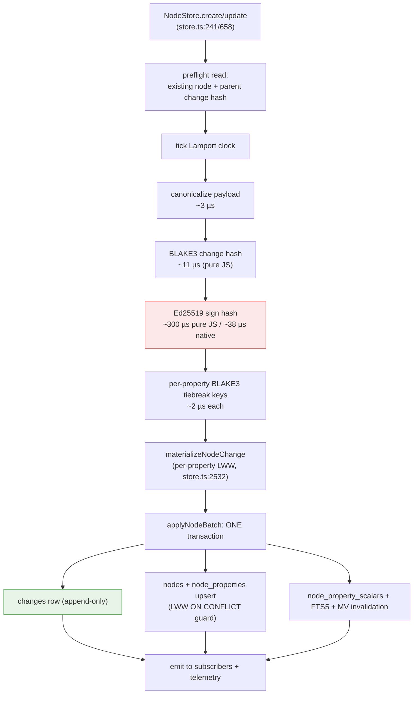
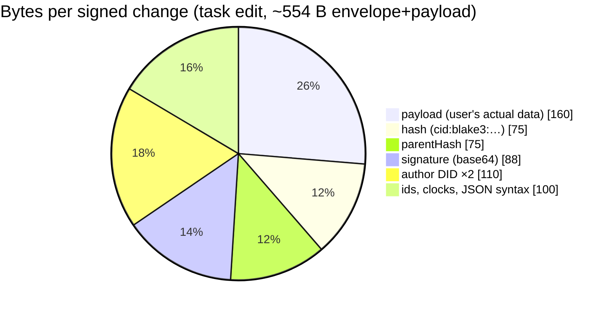
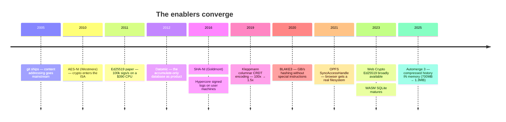

# Overhead Of The Signed Change Log Vs A Mutable Database — And Why It's Affordable Now

## Problem Statement

Every write in xNet is more than a write. Where a traditional system does
`UPDATE nodes SET title = ? WHERE id = ?` — or just `map.set(id, value)` —
xNet canonicalizes the change to sorted-key JSON, BLAKE3-hashes it into a
content address, Ed25519-signs the hash, chains it to its parent hash,
stamps it with a Lamport clock and a grinding-resistant LWW tiebreak key,
appends it to an immutable `changes` log, and *then* materializes the
mutable row the read path actually uses.

Two questions:

1. **What does that actually cost** — in CPU time, latency, bytes on disk,
   bytes on the wire, and memory — versus a plain mutable database or an
   in-memory store that lacks provenance, sync, offline convergence, and
   audit?
2. **Why is this affordable now when it wasn't before?** What changed in
   hardware, algorithms, and platforms such that paying cryptography and
   history *on every user action* is a rounding error rather than an
   engineering absurdity?

This exploration answers both with measured numbers — from this repo's own
benchmarks, from fresh microbenchmarks run for this doc, and from primary
external sources.

## Executive Summary

**The overhead is real, quantifiable, and — at human action rates —
imperceptible.** Measured on an Apple M1 Max (Node 22), the full xNet
change pipeline (canonicalize → BLAKE3 → Ed25519 sign) using the exact
pure-JS `@noble` libraries the repo ships costs **~0.36 ms per change**,
matching the repo's own 0163 benchmark (0.37 ms). End-to-end, one row
create is **~5.6 ms** including the 6-table SQLite fan-out. A bare
`Map.set` is ~0.03 µs and a bare SQLite row insert is tens of µs — so the
multiplier versus "just store it" is **roughly 100–300× per write**. That
sounds damning until you price it: a heavy user producing 5,000 changes a
day spends **under 2 seconds of CPU per day** signing them and about
**3.5 MB/day of storage (~1.3 GB/year, ≈ $0.06/year at 2025 SSD prices)**.
The overhead per action is 2–3 orders of magnitude below human perception
thresholds and 4–5 orders of magnitude below what the hardware can sustain.

**Size overhead is a fixed envelope tax, so it depends entirely on payload
size.** The envelope (hash 75 B + parent hash 75 B + signature 88 B base64
+ author DID carried twice ≈ 110 B + ids/clocks) is **~500–600 bytes
before payload** (0323). For a typical task edit (~160 B of fields) that
is **~3.5×** amplification; for a 40-byte pencil point it is **~15:1** —
which is exactly why the repo's rule is *"the log is for human-rate facts;
high-frequency state goes over presence lanes"* (0323, 0330).

**Where the overhead actually bites is not per-action — it's at O(history)
boundaries.** The repo's real pain points confirm this: the 318k-row
change-log replay behind the 15 s cold-open stall (0249), per-change
signature verification at ~1.4 ms gating `.xnetpack` import (0344 — and my
benchmark reproduces that number exactly: pure-JS `@noble` verify is
1.43 ms/op), and the 500 MB/hour quota burn of freehand drawing pushed
through the log (0323). Hardware progress moved the wall from "can't sign
one change interactively" (2003: RSA-2048 signing ran at ~15–32 ops/s on
commodity CPUs) to "must engineer around verifying 300k changes at once" —
the overhead now lives only in bulk operations, and bulk operations can be
batched, checkpointed, pruned, and deferred.

**Why now:** four curves crossed.

1. **Signing got ~3 orders of magnitude cheaper** — algorithm (RSA→Ed25519,
   2011) times hardware (2003 commodity CPU → today) ≈ 30 ops/s → 26,000+
   ops/s native, with the pure-JS implementation xNet uses today still
   ~100× faster than 2003-era native RSA.
2. **Storage fell ~5 orders of magnitude** — ~$900/GB (1995) → $0.52/GB
   (2005) → ~$0.01–0.05/GB (2025). Keeping *everything that ever happened*
   costs a user cents per year.
3. **Algorithms caught up** — content addressing mainstreamed by git,
   Kleppmann's columnar CRDT encodings cutting per-op overhead from ~100:1
   to ~1.5:1, BLAKE3 (2020) making hashing effectively free relative to
   signing.
4. **The platform arrived** — Web Crypto, OPFS, WASM SQLite, and workers
   mean an end-user browser can afford to *be* a database with a crypto
   spine, which was simply not a deployable artifact before ~2021.

The deeper answer to "why wasn't this done before": **the mutable database
is itself a fossil of scarcity.** Update-in-place was invented when disk
was thousands of dollars per GB and signing was minutes of CPU per
thousand ops — we threw away history and authorship because we couldn't
afford them. xNet's bet (and Datomic's, and git's) is that overwriting is
now a *choice*, and for user-owned data it's the wrong one. The overhead
analysis below says the bet is sound — with three standing disciplines:
keep high-frequency state off the log, never put O(history) work on the
interactive path, and adopt the cheap levers (native/WebCrypto verify,
envelope slimming) as the log grows.

## Current State In The Repository

### What one change actually is

`Change<T>` is defined in `packages/sync/src/change.ts:44-104`
(`CURRENT_PROTOCOL_VERSION = 4` at `change.ts:29`). Per change:

| Field | Content | Serialized size |
|---|---|---|
| `id` | change id (`createChangeId`, `change.ts:387`) | ~21–36 B |
| `type` | e.g. `'node-change'` | ~11 B |
| `protocolVersion` | `4` | ~1 B |
| `payload` | `{ nodeId, schemaId?, properties }` | **variable** |
| `hash` | `cid:blake3:<64 hex>` | **75 B** |
| `parentHash` | same format (hash chain) | **75 B** |
| `authorDID` | `did:key:z6Mk…` | ~48–56 B |
| `signature` | Ed25519, 64 B raw | **88 B** base64 on wire |
| `wallTime`, `lamport` | clocks | ~15–20 B |
| `batchId/Index/Size` | optional atomic grouping | ~0–42 B |

The wire serializer (`serializeChange`,
`packages/runtime/src/sync/node-store-sync-provider.ts:702-724`) carries
the author DID **twice** (`lamportAuthor` + `authorDid`), and the SQLite
`changes` table repeats the duplication (`author` + `lamport_peer`
columns, `packages/data/src/store/sqlite-adapter.ts:556-571`). Exploration
0323 measured the envelope at **~500–600 bytes before payload**.

### Crypto primitives

- **Hash: BLAKE3** via `@noble/hashes` — `packages/core/src/hashing.ts:10-13`,
  change hash at `computeChangeHash` (`change.ts:201-225`) over
  canonical (recursively key-sorted) JSON (`sortObjectKeys`,
  `change.ts:179-191`). Note: the spec doc still says "SHA-256"; the
  implementation is BLAKE3 (flagged in 0305).
- **Signature: Ed25519** via `@noble/curves` —
  `packages/crypto/src/signing.ts:1-47`; xNet signs the UTF-8 bytes of the
  *hash string*, not the full payload (`signChange`, `change.ts:234-247`),
  so signing cost is independent of payload size. An off-thread WebCrypto
  signer exists (`createWebCryptoChangeSigner`, `change.ts:270-307`) and
  produces byte-identical signatures.
- **Per-property LWW tiebreak (protocol v4)**: one extra BLAKE3 per
  property (`computeLwwTiebreakKey`, `packages/core/src/lww.ts:68-72`;
  rationale in 0305 — grinding-resistant replacement for raw DID compare).
- Hybrid/PQ signing (ML-DSA-65, ~3,309 B signatures) exists in
  `packages/crypto` but is **not** on the change path (`change.ts:18-27`)
  — worth remembering because a PQ future multiplies the signature line of
  the size budget by ~50×.

### The write path (fast path)

`applySingleNodeWrite` (`packages/data/src/store/store.ts:2353-2428`):



Measured end-to-end: **5.59 ms** for a single row create
(`docs/explorations/0163_[x]_QUERY_AND_MUTATION_HOT_PATH_PERFORMANCE.md`,
memory adapter, M-series). The crypto slice of that is ~0.37 ms; the rest
is materialization, SQLite fan-out, and subscriber notification — costs a
*mutable* reactive store would largely pay too.

### The read path pays (almost) nothing

Reads never touch the log. `NodeStore.get/query`
(`store.ts:333-353`, `:970-1106`) hit the materialized `nodes` /
`node_properties` / `node_property_scalars` tables with pushed-down SQL.
The 0264 work got hydration to **11 ms per 450-node chunk** with no
O(table-size) regression. The log is read only for parent-hash lookup on
write, history/audit UIs, sync catch-up, and verification. **The
architecture already converts "append-only log" into "mutable database"
at write time — reads are a wash versus a traditional system.**

### Write amplification in SQLite

`estimateSQLiteMutationWriteAmplification`
(`packages/data/src/store/sqlite-benchmarks.ts:90-107`): with 6 scalar
properties, one logical mutation touches **~19 rows/index entries**
(asserted in `sqlite-benchmarks.test.ts:69`). A traditional indexed
database pays most of this too (every index is write amplification) — the
log adds the `changes` row and its 5 indexes
(`packages/sqlite/src/schema.ts:130-143`, `:275-280`) on top.

### Where the repo has already hit the overhead wall

| Incident | Cost observed | Root cause | Fix/discipline |
|---|---|---|---|
| Cold-open stall (0249/0254/0260) | 15 s first query at 318k-row log | O(history) replay on boot | compaction, checkpoints (0329), "hub high-water mark 0 ⇒ old bundle" litmus |
| `.xnetpack` import (0344) | **1.4 ms/change** verify | pure-JS Ed25519 verify | gate skips per-change sigs, verify bundle-level instead |
| Freehand drawing (0323) | ~500 MB/hour quota; 15:1 envelope ratio | high-frequency state pushed through the log | 1000 ms granularity floor (`granularity.ts`), presence lanes (`usePresence`, 0314) |
| Sync throttles | 40 msg/s client cap, hub closes >100 msg/s | envelope cost × frequency | rate caps at `node-store-sync-provider.ts:22`, `packages/hub/src/middleware/rate-limit.ts` |

These are not "the log is too expensive" — they are the boundary
conditions that define what the log is *for*. Every one of them is a
frequency or bulk problem, not a per-action problem.

## Fresh Benchmarks (run for this exploration)

Apple M1 Max, Node 22.16. Two runs: the **actual libraries xNet ships**
(`@noble/hashes` 2.0.1 BLAKE3, `@noble/curves` 2.0.1 Ed25519 — pure JS),
and **native `node:crypto`** (Ed25519 + SHA-256) as the "what native code
buys you" comparison. Representative change: task upsert, 4 properties,
~446 B canonical JSON, ~160 B raw payload fields.

### The pipeline xNet actually runs (pure JS `@noble`)

| Operation | µs/op | ops/s |
|---|---:|---:|
| baseline: mutable `Map.set` | 0.03 | 29,200,000 |
| canonicalize (sorted-key stringify) | 2.9 | 345,000 |
| BLAKE3 of canonical bytes | 11.2 | 89,000 |
| LWW v4 tiebreak key (BLAKE3/property) | 2.3 | 440,000 |
| **Ed25519 sign** | **301** | **3,300** |
| **Ed25519 verify** | **1,427** | **701** |
| **full pipeline: canon + BLAKE3 + sign** | **357** | **2,800** |
| BLAKE3 bulk (1 MiB) | — | ~50 MB/s |

The 1,427 µs verify **exactly reproduces the 1.4 ms/change the 0344
import work measured in production** — independent confirmation that the
import gate's cost model is the crypto library, not I/O. And the 357 µs
full pipeline matches 0163's 0.37 ms.

### Same primitives, native (`node:crypto`)

| Operation | µs/op | ops/s | vs pure JS |
|---|---:|---:|---:|
| SHA-256 of change (≈BLAKE3 slot) | 0.87 | 1,150,000 | ~13× faster |
| Ed25519 sign | 38 | 26,100 | **~8× faster** |
| Ed25519 verify | 88 | 11,300 | **~16× faster** |
| full pipeline canon+hash+sign | 37 | 27,300 | ~10× faster |
| SHA-256 bulk | — | 2.3 GB/s | ~46× faster |

**Headline: today's overhead is dominated by the choice of a portable
pure-JS crypto library, not by the architecture.** The hub (Node,
better-sqlite3 — `packages/hub/src/storage/sqlite.ts:40`) could verify at
11,300 changes/s instead of 700/s by calling `node:crypto`; browsers get
most of the same win from the already-written WebCrypto signer
(`createWebCryptoChangeSigner`). The 318k-row full-log verify that takes
~7.5 minutes in pure JS is **~28 seconds native**, and roughly half that
again with batch verification.

### The size budget of one change



- Typical task edit: **~3.5×** raw payload.
- 40 B pencil point: **~15:1** (0323) — the log is the wrong lane.
- A year of heavy use (5,000 changes/day × ~700 B) ≈ **1.3 GB** — about
  one minute of 4K video, ≈ $0.06/year at 2025 SSD prices.

Cheap structural wins visible in the budget: the DID is carried twice
(~55 B, ~10% of envelope), hex-in-JSON hash strings cost 2× their raw
bytes (75 B vs 32 B raw ×2 hashes), base64 signature costs 88 B vs 64 raw.
A binary envelope (msgpack/CBOR + raw bytes) shrinks the fixed tax
**~30–40%** (0323's estimate; consistent with this byte accounting).

## The Comparison: xNet vs "Just A Database" vs "Just Memory"

Per single-field update, order-of-magnitude view:

| System | Write cost | Bytes durably written | What you get |
|---|---:|---:|---|
| In-memory `Map` | ~0.03 µs | 0 | nothing survives a tab close |
| SQLite `UPDATE` (indexed, tx-batched) | ~10–50 µs | ~100–300 B (row+indexes+WAL) | durability |
| Postgres row update | ~100–500 µs (+network) | similar + WAL | durability, concurrency |
| **xNet change (today, pure JS)** | **~360 µs crypto + fan-out ≈ 5.6 ms e2e** | **~700 B log + ~19 row/index touches** | durability **+ authorship + integrity + causality + offline merge + sync + undo/time-travel + audit** |
| xNet change (native crypto ceiling) | ~40 µs crypto | same | same |

Three honest observations:

1. **Per write, xNet is ~100–300× a bare SQLite write.** That is the
   truthful multiplier and there's no point spinning it.
2. **The multiplier buys a feature set the mutable systems simply do not
   have** — and the fair comparison is against a mutable system *plus* the
   bolt-ons it would need: audit tables (write amplification ~2×),
   `updated_by` columns, WAL shipping for sync, OT/CRDT service for
   offline merge, soft-delete + history tables for undo. Production
   systems that need provenance re-derive most of the log anyway
   (Debezium/CDC, event sourcing, temporal tables) — at similar or worse
   cost, retrofitted.
3. **Absolute, not relative, cost is what the user experiences.** 5.6 ms
   per action is below every perception threshold (~100 ms). A human
   physically cannot generate actions fast enough to make the crypto
   visible: at the repo's own 40 msg/s outbound throttle, signing consumes
   1.4% of one core (pure JS) — 0.15% native.

The asymptotic difference is the real one: **a mutable DB is O(live data);
a log is O(everything that ever happened).** The ratio between them is
edits-per-datum. For human-rate work that ratio is small (the standard
CRDT benchmark trace: 260k edit ops → 104 KB final text — and columnar
encoding stores it in ~1.5× the final size, see below). For machine-rate
state it is unbounded — hence the granularity floor and presence lanes.

## External Research

### Prior art establishes each piece is affordable at scale

- **git (2005)** mainstreamed content-addressed immutable storage; delta
  compression in packfiles shows history need not cost O(revisions × size)
  (github.blog packed-object-store).
- **Kafka** demonstrated the append-only log as the *fastest* known
  shape for durable writes — sequential append + zero-copy reads,
  millions of msgs/s on commodity hardware. Appending is not the expensive
  part; it's the cheapest write pattern disks have.
- **Datomic (2012)** — the accumulate-only database as product; notably
  its designers distinguish *accumulate-only* (semantic) from
  *append-only* (structural). xNet is both: an accumulate-only model
  stored as an append-only log with a materialized mutable projection.
- **Hypercore/DAT** — signed append-only logs (Ed25519 over a Merkle root
  per append) shipping on end-user machines since ~2016.
- **Certificate Transparency (RFC 6962)** — the internet already runs
  planet-scale append-only signed logs with O(log n) proofs.
- **Automerge/Yjs** — the CRDT overhead story (next section).

### The overhead collapse in CRDT encodings

The single best external number for this exploration's thesis: Kleppmann's
columnar encoding work (automerge-perf) took per-character overhead from
**~55 bytes/op naive (~100:1 on a text document) to ~1.1 bytes/op
(~1.5–2×, "less than one extra byte per character")**. Automerge 2 shipped
it (~30% overhead over raw text on the standard 260k-op editing trace);
Automerge 3 (2025) kept the compressed form *in memory* — the Moby Dick
paste case fell from 700 MB to 1.3 MB. Yjs stores the same trace in
~160 KB against ~100 KB of final text. Overhead that was structurally
~100× in 2015 is now ~1.5× — not from hardware, from *encodings*. xNet's
per-change envelope has the same headroom (binary encoding, hash-chain
compression, columnar batch forms) when it needs it.

### The hardware history: what one signature cost

| Year | Hardware | Algorithm | Sign/s | Verify/s |
|---|---|---|---:|---:|
| 2003 | Celeron 2.4 GHz | RSA-2048 (OpenSSL) | **31.8** | 1,121 |
| 2005 | Pentium 4M 1.6 GHz | RSA-2048 | **14.6** | 551 |
| 2011 | Westmere 2.4 GHz (4-core, $390) | **Ed25519** (ref impl) | **109,000** | 71,000 |
| 2019 | Skylake i5, libsodium | Ed25519 | 32,900 | 13,200 |
| 2020 | generic server core | RSA-2048 | 1,009 | 22,220 |
| 2026 | **M1 Max, pure-JS @noble (xNet today)** | Ed25519 | **3,300** | **701** |
| 2026 | M1 Max, native node:crypto | Ed25519 | **26,100** | **11,300** |
| 2026 | Ryzen 9950x ×16 cores, batch SIMD (upper bound) | Ed25519 | — | 3,700,000 |

(Sources: georglutz.de archived `openssl speed` runs; Bernstein et al.
ed25519-20110926.pdf — 87,548 cycles/sign, 273,364 cycles/verify single,
134k cycles/sig batched; monocypher.org/speed; eclipselabs.io batch-verify
engine, labeled as a specialized upper bound.)

Read the table vertically: **signing a change on 2003 commodity hardware
cost ~31–66 ms of CPU** — per-keystroke signing would have consumed the
whole machine. The same operation is now **38 µs native — a ~1,000×
collapse** from algorithm (RSA→Ed25519 ≈ 30–100×) times hardware (≈
10–30×). Even xNet's deliberately-portable pure-JS implementation is
~100× faster than 2003 native RSA. And the spread between TweetNaCl (325
verify/s) and libsodium (13,200/s) on identical hardware shows another
~40× sits in implementation quality alone — which is exactly the
pure-JS → native lever available to xNet today.

Hashing: SHA-1 on a 2003 Celeron did ~117 MB/s; modern cores with SHA/
crypto extensions do **~2 GB/s+** (SHA-NI: Intel Goldmont 2016, AMD Zen
2017; AES-NI Westmere 2010; ARMv8 crypto extensions in every phone).
BLAKE3 (2020) reaches multiple GB/s *without* dedicated instructions.
Hashing was never the bottleneck and is now free to first order — xNet's
11 µs pure-JS BLAKE3 per change confirms it (3% of the sign cost).

### The storage history: what keeping everything cost

| Year | HDD $/GB | 1.3 GB/year of change log costs |
|---|---:|---:|
| 1995 | ~$850 | **~$1,100/year** — untenable |
| 2005 | $0.52 | $0.68/year — fine, actually |
| 2009 | $0.11 (Backblaze fleet) | $0.14/year |
| 2025 | ~$0.01 (HDD) / ~$0.05 (SSD) | **~$0.02–0.07/year** — noise |

(Sources: mkomo.com cost-per-gigabyte series; Backblaze fleet data
$0.114/GB 2009 → $0.014/GB 2022. Caveat for any essay use: DRAM/NAND spot
prices *rose* 2024–2025 on AI demand — the multi-decade trend holds, the
last two years don't.)

Note the interesting wrinkle: **storage stopped being the blocker around
2005.** What 2005 lacked was cheap signatures (Ed25519 is 2011), CRDT
encodings (2019), and above all a deployment platform (below).

### The platform: the last enabler

A signed log on end-user devices needs primitives browsers simply did not
have until recently: **Web Crypto** (Ed25519 broadly usable ~2023+),
**OPFS with SyncAccessHandles** (~2021–2023) making browser SQLite real,
**WASM SQLite** maturity, **Workers/Web Locks** for off-main-thread
persistence. The repo's own architecture (OPFS SAH pool,
`packages/sqlite/src/types.ts:57-74`; worker-owned DB per 0262) is built
from parts that are less than five years old. Before them, "local-first
signed log" meant a native app — git, Dat — not a URL.



## Key Findings

1. **Per-action overhead is ~360 µs crypto / ~5.6 ms end-to-end today —
   100–300× a bare DB write, and 0× perceivable.** A human at the 40 msg/s
   throttle ceiling costs 1.4% of one core in signing (0.15% native).
2. **The measured production number (1.4 ms/change verify, 0344) is
   exactly the pure-JS library cost** — reproduced to the microsecond in
   this doc's benchmark. Native/WebCrypto verify is a ~16× lever the
   codebase has already half-built (`createWebCryptoChangeSigner`).
3. **Size overhead is a ~554 B fixed envelope tax: ~3.5× on typical
   edits, 15:1 on tiny payloads, ~1.05× on large ones.** ~30–40% of the
   envelope is encoding slack (duplicate DID, hex/base64 in JSON).
4. **Reads are free.** Materialize-on-write means the read path is a
   normal indexed database (11 ms/450-node chunk, no O(history) term).
   The log costs nothing on the path users feel most.
5. **The overhead concentrates at O(history) boundaries** — cold open,
   import, full resync, verify-all — and every repo incident (318k-row
   stall, import gate, 500 MB/hour drawing) is a boundary or frequency
   case, not a per-action case. Checkpoints (0329), pruning
   (`pruneSupersededChanges`), compaction, and batch verification are the
   standing answers.
6. **"Why now" is four multiplicative collapses**: signatures ~1,000×
   cheaper (algorithm × hardware), storage ~10⁴–10⁵× cheaper, CRDT/log
   encodings ~50× denser, and a browser platform that can host it at all.
   Multiply them and the same design that cost "the whole machine plus a
   disk budget" in 2003 now costs "milliseconds and megabytes."
7. **A mutable database with the same guarantees bolted on is not
   cheaper.** Audit tables, CDC, temporal tables, and sync services
   re-derive the log at retrofit prices. xNet pays wholesale; the
   traditional stack pays retail, later, with weaker guarantees.
8. **The costs that remain are chosen, not structural**: pure-JS crypto
   (portability over speed — correct default, wrong constant for hub bulk
   paths), JSON envelope (debuggability — fine until wire/storage
   pressure), Ed25519-only signatures (the PQ upgrade would 50× the
   signature bytes and is rightly not on the change path yet).

## Options And Tradeoffs

### A. Do nothing — the overhead is already priced correctly

At human rates every number above is invisible. The disciplines that make
it so (granularity floor, presence lanes, materialized reads) exist.

- ✅ zero work; ✅ no protocol churn
- ❌ leaves the 16× verify lever unpulled while 0344-style import and
  cold-open verification are live pain points; ❌ envelope slack ships on
  every WS frame forever

### B. Pull the implementation-quality levers (no protocol change)

1. **Native crypto on the hub**: `node:crypto` Ed25519 verify (11,300/s
   vs 701/s) behind the existing `signing.ts` interface, for bulk paths —
   import verification, resync, crawl.
2. **WebCrypto verify in browsers/workers**: the signer half exists
   (`change.ts:270-307`); add the verifier and use it for `.xnetpack`
   import and initial sync so the 0344 gate can afford per-change sigs.
3. **Batch verification** where order permits (~2× more on top).

- ✅ ~10–16× on the paths that actually hurt; ✅ zero wire/format change;
  ✅ signature output is byte-identical (Ed25519 is deterministic)
- ❌ two code paths to keep honest (golden vectors already exist);
  ❌ WebCrypto Ed25519 availability needs a feature-detect fallback

### C. Slim the envelope (protocol v5, staged)

Drop the duplicated author DID (wire + `lamport_peer` column), binary
envelope (CBOR/msgpack), raw 32 B hashes instead of 75 B hex strings,
raw 64 B signatures instead of 88 B base64. Estimated **30–40% envelope
reduction** (≈180–220 B/change; at 318k changes ≈ 60 MB less log).

- ✅ compounds forever across storage, wire, and memory; ✅ pairs
  naturally with the next protocol bump
- ❌ protocol-version ripple across 4 kernels (0305 precedent); ❌ major
  bump per changeset policy; ❌ loses greppable-JSON debuggability (keep a
  debug pretty-printer)

### D. Structural compression (columnar/checkpoint) — hold until scale demands

Automerge-3-style columnar batches for cold storage, checkpoint +
truncated-log bootstrap (0329's Frontier/Checkpoint machinery is the
seed), sedimentree-style digests (0325) for sync.

- ✅ the ~50× ceiling lives here; it's how 100:1 became 1.5:1 elsewhere
- ❌ big engineering; the current 318k-row scale doesn't justify it;
  checkpointing already bounds the worst case

### E. Retreat to a mutable store with audit bolt-ons (the counterfactual)

Rejected on the numbers: saves ~360 µs and ~400 B per write that no one
can perceive, then re-buys sync, merge, undo, and audit at retrofit
prices with weaker guarantees (mutable audit tables can be edited;
signatures can't).

## Recommendation

**Accept the overhead as correctly priced for human-rate data — and spend
one focused increment on Option B, with C staged behind the next protocol
bump.**

Concretely:

1. Ship native (`node:crypto`) Ed25519 verify on the hub and WebCrypto
   verify in the browser behind the existing `signing.ts`/`verifyChange`
   seam, validated against the existing golden vectors. This turns the
   1.4 ms/change tax into ~90 µs where bulk verification matters (import,
   resync, cold-open integrity checks) and lets the 0344 import gate
   re-enable per-change verification.
2. Keep pure-JS `@noble` as the universal fallback (portability is why it
   was chosen; the fallback keeps every environment working).
3. Fold envelope slimming (dedupe DID, binary encoding) into the
   protocol-v5 planning file rather than doing it opportunistically —
   0305 showed a protocol bump ripples through 4 kernels, so it should
   ride with the next semantically-forced bump.
4. Document the cost model itself (this doc + a short section in the
   protocol spec, which should also be corrected from "SHA-256" to
   BLAKE3): *per-action costs are imperceptible; O(history) costs are
   engineered around via materialization, checkpoints, pruning, and batch
   verify; high-frequency state never enters the log.* That's the
   three-sentence answer to "what does xNet cost."

And the answer to "why is this possible now": **because four exponential
curves — signature throughput, storage price, encoding density, and
platform capability — each moved 2–5 orders of magnitude, and the log
only needed them to move ~2.** The mutable database economized on things
that stopped being scarce. xNet spends ~0.4 ms and ~½ KB per human action
to keep what 1970s economics forced everyone to throw away: who did what,
when, in what order, provably. At 2026 prices that is one of the cheapest
features in the product.

## Example Code

Native-with-fallback verify seam (Option B), keeping `@noble` as the
universal implementation:

```ts
// packages/crypto/src/signing-native.ts (hub / Node only)
import { verify as nobleVerify } from './signing.js';

let nodeVerify: typeof nobleVerify | undefined;
try {
  const { verify: cryptoVerify, createPublicKey } = await import('node:crypto');
  const SPKI_PREFIX = Buffer.from('302a300506032b6570032100', 'hex'); // Ed25519 SPKI header
  nodeVerify = (sig, msg, pub) =>
    cryptoVerify(null, Buffer.from(msg),
      createPublicKey({ key: Buffer.concat([SPKI_PREFIX, Buffer.from(pub)]), format: 'der', type: 'spki' }),
      Buffer.from(sig));
} catch { /* non-Node runtime — keep noble */ }

/** ~16x faster than pure-JS on bulk paths; byte-identical semantics. */
export const verifyFast = nodeVerify ?? nobleVerify;
```

Cost-model assertion to pin the numbers this doc measured (goes next to
`packages/crypto/src/benchmark.test.ts`, which already asserts sign
< 0.2 ms / verify < 0.5 ms targets):

```ts
it('bulk verify path meets the native budget', () => {
  const N = 500;
  const t0 = performance.now();
  for (let i = 0; i < N; i++) verifyFast(sig, hashBytes, pub);
  const perOp = (performance.now() - t0) / N;
  expect(perOp).toBeLessThan(0.5); // ms — pure-JS ceiling; native lands ~0.09
});
```

## Risks And Open Questions

- **WebCrypto Ed25519 availability** still needs feature detection in
  older Safari/WebViews; the fallback keeps correctness but loses the
  speedup exactly on the weakest devices. Measure on the Capacitor shell
  (0238) before relying on it for mobile import.
- **Two verify implementations must stay byte-equal.** Golden vectors
  exist (0305 work); the native path must be added to them, including the
  malleability/edge-case vectors (`node:crypto` and `@noble` differ in
  strictness on non-canonical signatures — this must be tested, not
  assumed, or a change could verify on one path and not the other and
  split convergence).
- **PQ future**: ML-DSA-65 signatures are ~3.3 KB — 50× today's 64 B. If
  hybrid signing ever lands on the change path (0307), the size analysis
  here changes materially; the envelope-slimming work becomes load-bearing
  rather than nice-to-have.
- **DRAM/NAND price reversal (2024–2025)**: the storage-cost premise holds
  on decade scales but has been wrong for two years running. Client disk
  is not the risk (change logs are MBs); hub fleet economics (0336) should
  not assume monotonically falling $/GB.
- **The 15:1 boundary is policed by convention, not mechanism.** Nothing
  stops a plugin from pushing 240 Hz state through the log (0323's
  22-minute/318k-row arithmetic). Open question: should `publishChange`
  enforce a per-author rate/size budget at the store layer rather than
  only at the sync throttle?
- Unverified external numbers are flagged inline (Apple-Silicon libsodium
  ops/s, exact DRAM year points); nothing in the recommendation depends
  on them.

## Implementation Checklist

- [ ] Add `verifyFast` native-with-fallback seam in `packages/crypto`
      (Node `node:crypto` Ed25519; `@noble` fallback) with golden-vector
      parity tests including non-canonical-signature strictness cases
- [ ] Add WebCrypto Ed25519 *verify* counterpart to
      `createWebCryptoChangeSigner` (`packages/sync/src/change.ts:270`)
      with feature detection + fallback
- [ ] Route bulk paths through `verifyFast`: `.xnetpack` import (0344
      gate), hub crawl/resync verification, any cold-open integrity check
- [ ] Re-enable per-change signature verification in the 0344 import gate
      once the native path lands (recheck the 1.4 ms → ~0.09 ms budget)
- [ ] Add the bulk-verify budget assertion to
      `packages/crypto/src/benchmark.test.ts`
- [ ] Correct the protocol spec doc: change hash is BLAKE3, not SHA-256
      (flagged in 0305, still outstanding)
- [ ] Add a "cost model" section to the protocol spec summarizing this
      doc's numbers (envelope bytes, per-op costs, O(history) boundaries)
- [ ] Open a protocol-v5 planning note listing envelope slimming items:
      dedupe author DID (wire `lamportAuthor`/`authorDid`, columns
      `author`/`lamport_peer`), CBOR/msgpack envelope, raw-byte hashes and
      signatures (~30–40% reduction) — to ride the next forced bump
- [ ] Changesets: patch for `@xnetjs/crypto` (new export = minor if
      surfaced in barrel), empty changeset if kept internal

## Validation Checklist

- [ ] Golden-vector suite passes with native, WebCrypto, and `@noble`
      verify producing identical accept/reject decisions (including
      malleability edge vectors)
- [ ] Hub bulk verify benchmark: ≥ 10,000 verifies/s on M-class hardware
      (vs ~700/s pure-JS baseline measured here)
- [ ] `.xnetpack` import of a 318k-change bundle completes with full
      per-change verification inside the import UX budget (< 60 s)
- [ ] No convergence divergence in cross-runtime sync soak (Node hub ×
      browser client) after the verify seam lands
- [ ] `pnpm vitest --project crypto` green from root; existing sign/verify
      perf assertions still pass on the pure-JS path
- [ ] Spec doc no longer says SHA-256; docs build green

## References

Repository:
- `packages/sync/src/change.ts` — Change type, hashing, signing, protocol v4
- `packages/crypto/src/signing.ts`, `constants.ts`, `benchmark.test.ts`
- `packages/core/src/lww.ts` — LWW ordering + v4 tiebreak
- `packages/data/src/store/store.ts` — write path, materialization
- `packages/data/src/store/sqlite-adapter.ts`, `packages/sqlite/src/schema.ts`
- `packages/data/src/store/sqlite-benchmarks.ts` — write-amplification model
- Explorations: 0163 (hot-path benchmarks), 0249/0254/0260 (cold-open),
  0264/0266 (read speed), 0296 (conflicts), 0305 (hash grinding, protocol
  v4), 0318 (scale limits), 0323 (ECS/high-frequency — the change-cost
  accounting), 0329 (checkpoints), 0330 (log for facts, CRDT for prose),
  0333 (ATProto scale), 0344 (import + 1.4 ms verify gate)

External:
- Bernstein, Duif, Lange, Schwabe, Yang — *High-speed high-security
  signatures* (Ed25519), https://ed25519.cr.yp.to/ed25519-20110926.pdf
  (87,548 cycles/sign; 273,364 cycles/verify; 134k cycles/sig batched)
- Archived `openssl speed` runs 2003–2006 (RSA-2048 on Celeron/P4/P-III),
  https://www.georglutz.de/2006/05/06/openssl-speed-measurements/
- libsodium/Monocypher/TweetNaCl comparative speeds,
  https://monocypher.org/speed
- Backblaze — *Hard Drive Cost Per Gigabyte*,
  https://www.backblaze.com/blog/hard-drive-cost-per-gigabyte/
- mkomo.com — *A History of Storage Cost*, https://mkomo.com/cost-per-gigabyte
- Kleppmann — automerge-perf columnar encoding,
  https://github.com/automerge/automerge-perf/blob/master/columnar/README.md;
  *CRDTs: The Hard Parts*,
  https://martin.kleppmann.com/2020/07/06/crdt-hard-parts-hydra.html
- Automerge 2.0 / 3.0 release notes, https://automerge.org/blog/automerge-2/,
  https://automerge.org/blog/automerge-3/
- Dat/Hypercore signed append-only log spec,
  https://www.datprotocol.com/deps/0002-hypercore/
- RFC 6962 — Certificate Transparency, https://www.rfc-editor.org/rfc/rfc6962.html
- Kafka design docs, https://kafka.apache.org/0100/design/design/
- Datomic accumulate-only vs append-only,
  https://www.thoughtworks.com/radar/techniques/accumulate-only-data
- SHA-NI history: Goldmont 2016 / Zen 2017,
  https://github.com/minio/sha256-simd; AES-NI: Westmere 2010,
  https://en.wikipedia.org/wiki/AES_instruction_set
- Benchmarks in this doc: Apple M1 Max, Node 22.16, `@noble/hashes` 2.0.1,
  `@noble/curves` 2.0.1 vs `node:crypto`; scripts preserved in session
  scratchpad (`bench.mjs`, `bench-noble.mjs`)
