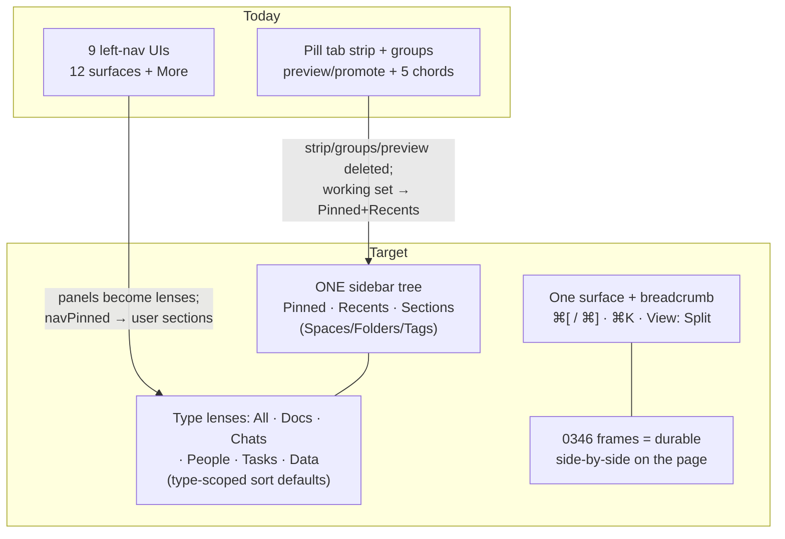

# Tabless: Removing The Tab Strip And Unifying The Left Nav

> Exploration 0350 · 2026-07-18
>
> Lineage: [[0346_COMPOSABLE_UI_FRAMES]] (frames make side-by-side a page
> concern, not a window concern — the prerequisite that makes this
> exploration viable), [[0286_WORKBENCH_FLOATING_ISLANDS_REDESIGN]] (the
> shell being simplified), [[0280_MALLEABLE_WORKBENCH]] (layout-as-data),
> [[0284_COHERENT_SINGLE_SHELL]] (preview tabs being retired),
> [[0273_QUIET_SURFACE_WORKSPACE_SHELL]] (calm defaults), [[0250]] (the
> Claude-desktop grammar this returns toward).

## Problem Statement

Two symptoms of the same disease — the shell still carries more
structure than the content model needs:

1. **Tabs.** The workbench hosts a pill-tab strip, editor groups, split
   panes, preview/promote semantics, pinned tabs, tab persistence, and
   five keyboard chords — a browser-grade windowing system inside an app
   whose navigation is already route-authoritative. The complexity is
   real (≈16 tab-dependent features across 6 load-bearing files); the
   value is unproven. What do tabs buy that back/forward, ⌘K, recents,
   pins, and 0346's frames don't?
2. **Left-nav variety.** There are **nine live left-nav UIs** (the
   surface rows + Explorer, Chats, Tasks, Today, Data, AI panels, the
   Settings nav, and CRM's own *internal tab bar*) plus five dormant
   shells — each with hand-rolled rows, each teaching the user a new
   grammar. Channels, contacts, and saved views live in different
   worlds than documents, though the substrate says they're all nodes.

The brief: explore eliminating tabs entirely, and collapsing the left
navs into one unified sidebar where channels and CRM live with your
documents.

## Executive Summary

**Remove the tab strip; keep a working set.** The research is
unambiguous on both halves of that sentence. No multi-content workspace
app has sustainably shipped *zero* hold-things-open affordance — Notion
resisted tabs for years and capitulated (users escaped to browser tabs
and OS windows), Slack is adding per-channel tabs, Linear explicitly
deferred navigation as unsolved. But the tab *strip* is the wrong shape
for the working set: browser research shows most sessions use **one**
tab (Dubroy, CHI 2010), hoarding is driven by fear of loss (CMU 2021's
"blackhole effect"), and Arc's fix — **decay by default, pin as the
escape hatch** — is the pattern that actually shipped well. xNet holds
a card nobody else does: **0346's frames make "two things at once" a
page concern** — you compose a database next to a doc *on the page*
instead of holding two tabs. Parallelism moves into the content, where
it persists, syncs, and shares.

**The replacement kit** (each piece mostly exists): route-first single
surface + back/forward chords (⌘[ / ⌘]) + ⌘K recency jump + a
**Pinned** sidebar section (`pinnedNodeIds` already ships) + a
**Recents** section fed by a route effect (`recents` already ships) +
`View: Split` as a command-level affordance without tab groups + frames
for durable side-by-side. Preview/promote tabs die with the strip —
single-click just navigates.

**One sidebar = one graph + lenses, never a flat mixed list.** Every
unified-sidebar success story (Anytype Sets, Tana search nodes, Linear
Views, Slack custom sections) projects ONE store through *lenses* —
none interleaves chat and documents item-by-item in an undifferentiated
tree. The failure modes are known: Teams' stacked rails
(per-feature navs — exactly xNet's current trajectory), Obsidian's
single tree degrading at scale without secondary lenses. So: generalize
the Explorer into the **one tree** (its row model is five doc schemas
today; extend it to channels, people, saved views), grow its filter
chips into **type lenses**, replace `navPinned` surfaces with **user
sections**, and adopt **type-scoped sort defaults** (chat rows sort by
recency + unread bump; doc rows keep manual order) with mute
suppressing badge *and* bump together (the Telegram-class bug to design
against). The bespoke panels (Chats, Tasks, Today, Data) retire into
lenses; AI stays a companion dock, not a nav surface; CRM's internal
tabs become lens views.

Sequenced in five phases, each independently landable, with the tab
teardown behind a preference until parity confidence is real.

## Current State In The Repository

### The shell that actually ships

`routes/__root.tsx` → `workbench/Workbench.tsx` → `ShellFrame` →
**`FloatingFrame`** (0286): `SidebarIslands` (left) · `EditorHeader` +
`EditorArea` (`tabVariant="pill"`) · `ContextPanel` · `FloatingDock` ·
`StatusBar`. Notably, `CalmSurface`, `Sidebar.tsx`, and `Rail.tsx` are
**dormant** — `Sidebar.tsx` (0284) was a prior attempt at exactly this
unification, already written, never wired into the floating shell.

### The tab system (what would go)

- **Store** (`workbench/state.ts`, one persisted zustand store, v4):
  `groups: EditorGroup[]`, `WorkbenchTab {id, nodeId, nodeType, title,
  pinned, preview}`, `openTab/activateTab/closeTab/promoteTab/
  setTabPinned/setTabTitle/moveTab/splitWith/closeGroup/focusGroup/
  cycleTab`, `startupTab`, `selectActiveTab`. `groups` is persisted →
  session restore; migration v3 sanitizes tab types.
- **Bridge** (`workbench/tabs.ts`): `TAB_VIEWS` (label/icon/route per
  type), `tabFromPathname`/`routeForTab`, `syncRouteToTabs` (router →
  store + `touchRecent`), the preview-intent latch.
- **Hosts**: `EditorArea.tsx` (387 lines — group panes, router outlet
  for the active group, `ViewHost` direct-mounts for background groups,
  `useTabCommands`: ⌘T/⌘W/Ctrl-Tab/Ctrl-Shift-Tab/⌘1/⌘2/⌘|,
  drag-to-edge split, starter chips), `TabBar.tsx` (371 lines — pill
  strip, drag reorder/cross-group, context menu, `PillControls`).
- **Consumers of tab existence** (~16 features): preview/promote (0284)
  — pervasive via `setPreviewIntent` in `surfaces.ts` +
  `explorer-rows.tsx`; `setTabTitle` (8 view components);
  `EditorHeader`'s `selectActiveTab` chrome (title, share, Open with…);
  split/groups (live, capped at 2 in practice); frame tabs (0346 —
  route survives, wrapper changes); recents feeding; startup tab.
- **The mitigating fact**: navigation is **route-authoritative**.
  `navigateToNode → navigate()` has ~24 call sites (explorer, palette,
  search, chat links, person/space/tag views, desk, status bar…) and
  none of them care whether tabs exist. The blast radius concentrates
  in six files: `state.ts`, `tabs.ts`, `EditorArea.tsx`, `TabBar.tsx`,
  `EditorHeader.tsx`, and the preview/promote seams.

### The left-nav variety (what would consolidate)

**Nine live navigation UIs:**

| # | Nav | File | Rows |
| --- | --- | --- | --- |
| 1 | Surface rows + More rollout | `workbench/SidebarIslands.tsx`, `FloatingMenus.tsx` | 12 `SURFACES` (`surfaces.ts`), `navPinned` default `[explorer, requests, tasks]` |
| 2 | Explorer panel | `workbench/views/Explorer.tsx` + `ExplorerFolderTree/SpacesSection/TagsSection`, `explorer-rows.tsx` | Filter, type chips (All/Page/Database/Canvas/Dashboard/Map), Pinned → Recent → Spaces → Folders → Tags → Unfiled |
| 3 | Chats panel | `comms/ChatsPanel.tsx` | Channels/Voice/DMs, presence, mention badges — bespoke rows |
| 4 | Tasks panel | `workbench/views/TasksPanel.tsx` via `left.tsx` | bespoke |
| 5 | Today panel | `workbench/views/TodayPanel.tsx` | bespoke |
| 6 | Data panel | `workbench/views/left.tsx#DataPanelView` | saved-views list |
| 7 | AI chat panel | `workbench/views/AiChatPanel.tsx` | not nav, but occupies the island |
| 8 | Settings nav | `workbench/SettingsSectionsNav.tsx` | special-cased on `/settings` |
| 9 | CRM internal tab bar | `components/crm/CrmView.tsx` (`CrmTab`: contacts/pipeline/forecast/companies/products/keep) | a second, unrelated tab system |

Plus dormant: `Sidebar.tsx`, `Rail.tsx`, `calm/CalmSurface.tsx` +
`SurfaceDock.tsx`, `MobileShell`'s own nav.

**The row model gap.** `ExplorerNodeType`
(`workbench/views/explorer-items.ts`) is a closed union of five doc
schemas; `ExplorerRow` itself is generic over `{id, title, type,
updatedAt, folder, tags, space}` and takes icons from `TAB_VIEWS` — the
**rendering is reusable; the data-collection layer (`useExplorerItems`,
schema-keyed `collectItems`) is the blocker** for hosting channels
(`@xnetjs/comms`), contacts (`ContactSchema`), and saved views as rows.

**Already-unifying seams**: the slot registry (every panel is a
registered slot view), the command palette + `GlobalSearch`
(type-agnostic reach into everything), `useLinkTargets` (cross-type
link index), and the Explorer's existing type chips (five types under
one row component already).

## External Research

### Tabs: what the record shows

- **Nobody stays tabless at this surface area.** Notion shipped without
  tabs for years; users escaped via ⌘-click OS windows and *browser*
  tabs; Notion added desktop tabs (⌘T/⌘1..9) explicitly to stop the
  leak. Slack redesigned around modes ("a more focused Slack"), lost
  glanceability, re-injected "peeks", and by 2025 added literal
  per-conversation tabs for canvases/lists. Linear ships tabless with
  back/forward + ⌘K — and its own redesign retrospective set navigation
  aside as unsolved. Bear/Things/iA Writer stay tabless because their
  working set is truly one item.
- **Usage is bimodal and mostly tiny** (Dubroy, CHI 2010): ~62% of
  users open ~4 tabs per 100 navigations; most sessions have **one**
  tab; a small power cohort lives at 16+. Optimizing the whole shell
  around the strip serves the minority.
- **Hoarding is fear, not need** (CMU 2021): tabs serve as reminders,
  place-savers, and working memory at once; >50% of users can't close
  anything ("blackhole effect" — closing feels like loss). The fix that
  works: task grouping + guaranteed non-destructive archive.
- **Arc's synthesis**: tabs are temporary by default (12h auto-archive)
  with pinning as the permanence escape hatch — a decay function, not
  an elimination.
- **Safari 15's cautionary tale**: whatever chrome identifies "the
  thing I'm in" must keep active-state legibility and separate identity
  from destruction (the favicon-as-close-button fiasco). Get this wrong
  and users revolt regardless of theory.
- **Theory**: Raskin's ZoomWorld/LEAP (content is its own name; no
  containers to label); Obenauer's **browsing paths** — persisted,
  resumable trails ("pick the path back up", not "reopen six tabs");
  and the known limit that a single back/forward stack cannot represent
  more than one *peer* context — the exact gap Linear deferred.

**What tabs buy → what replaces it:**

| Affordance | Replacement | Gap honesty |
| --- | --- | --- |
| Parallel contexts | 0346 frames (compose both on a page), `View: Split` command, OS/browser windows | frames persist and sync — stronger than tabs; split caps at 2 |
| Cheap "back to what I had" | back/forward chords, ⌘K recency, Recents section | single stack can't hold >1 thread — Recents + Pins cover it |
| Visual working-set memory | Pinned + Recents sidebar sections (always visible) | recents decay silently; pins are the durable tier |
| Drag target ("drop on tab") | drop on sidebar pins / frames (0346 drop-to-relate) | genuinely weaker; flagged |
| Identity of "here" | `EditorHeader` breadcrumb (needs a route-derived title source) | must keep active-state legibility (Safari lesson) |

### One sidebar: what the record shows

- **Every success is one graph + lenses**: Anytype (Sets = saved
  queries as nav), Tana (supertags + search nodes ARE the nav), Linear
  (favorites + starred Views, per-user sidebar customization), Slack
  (per-user custom sections). **None** interleaves chat + docs in one
  flat undifferentiated list.
- **Anti-patterns**: Microsoft Teams' stacked rails (global app rail +
  per-team navs + per-app tabs — three nav layers; xNet's 9 navs are
  this pattern in miniature). Obsidian's one tree degrades at scale —
  its most popular plugins exist to add lenses the core lacks.
- **Basecamp's counterpoint**: a fixed, small canonical toolset per
  container (six tools, zero config) buys legibility at the price of
  extensibility — worth naming since xNet is plugin-extensible.
- **Unread/badge semantics** (the real cost of chat-in-the-tree):
  chat wants recency-sort + unread bump; docs want stable manual order.
  Type-scoped sort defaults within one tree resolve it. Mute must
  suppress badge AND recency-bump as one flag (Telegram shipped the
  decoupled version as a recurring bug; Teams excludes muted from
  badges by design).

## Key Findings

1. **The tab strip is removable; the working set is not.** Every
   permanent affordance the strip provides has a sidebar- or
   content-level replacement already half-built (`pinnedNodeIds`,
   `recents`, ⌘K, frames). What has no replacement — preview/promote,
   tab pinning, groups-of-tabs — is exactly the complexity the brief
   wants gone.
2. **0346 changed the calculus.** Composing a doc + database + map on
   one page (persisted, synced, shareable) is a *better* answer to
   "compare two things" than two ephemeral tabs. Tabs solve
   parallelism at the window layer; frames solve it at the data layer.
3. **Navigation is already route-first**, so removal is concentrated:
   six files own the damage; ~24 call sites don't care.
4. **The Explorer is 70% of the unified sidebar.** Generic row,
   type chips, sections, drag sources, rename/pin/delete verbs — the
   missing 30% is the data-collection layer (closed schema union) and
   chat-grade row semantics (presence, unread, recency bump).
5. **Lenses, not a flat mixed tree.** The unified sidebar should ship
   as one tree with type lenses + user sections — the pattern every
   surviving product converged on independently.
6. **Two more tab systems hide in the app**: CRM's internal `CrmTab`
   bar and the Settings section nav — the unification must claim them
   or the "one sidebar" story is hollow.
7. **The dormant `Sidebar.tsx` is prior art in-repo** — read before
   building; it was 0284's sectioned single sidebar.

## Options And Tradeoffs

### Tabs

| Option | Shape | Pros | Cons |
| --- | --- | --- | --- |
| A. Keep as-is | Strip + groups + preview | No migration | The complexity the brief indicts; serves the power minority |
| B. Arc-ify the strip | Keep strip; add decay + pin | Least surprising | Keeps all 16 features + adds a decay engine; complexity ↑ |
| **C. Remove strip, keep working set (recommended)** | No strip, no groups, no preview/promote; back/forward + ⌘K + Pinned/Recents sections + `View: Split` + frames | Deletes ~700 lines of shell chrome + 5 chords + preview semantics; calm default; working set survives in the sidebar (always visible, non-destructive — answers the blackhole fear) | Power-user parallelism regresses to split/frames/OS windows; drag-onto-tab dies; needs a route-derived title source for the header |
| D. Full Raskin | No history UI at all; search-only | Maximal calm | Research says this fails beyond single-doc apps; ⌘K-only recall degrades past ~7 items |

### Left nav

| Option | Shape | Pros | Cons |
| --- | --- | --- | --- |
| A. Status quo | 9 navs, 12 surfaces | No work | Teams-in-miniature; every feature adds a nav |
| B. Fewer surfaces, same pattern | Merge some panels | Cheap | Doesn't change the grammar; new features still mint navs |
| **C. One tree + lenses + sections (recommended)** | Explorer generalized to all node types; type lenses (chips); user sections replace `navPinned`; type-scoped sort; panels retire into lenses | One grammar; channels/CRM/docs coexist; matches Anytype/Tana/Linear convergence; Explorer already 70% there | Unread/badge semantics must be done right; `useExplorerItems` rework is real; CRM/Settings migrations are their own chunks |
| D. Flat mixed list | Literally one list, recency-sorted | Simplest to describe | No shipping product survived this; scent loss, reshuffling tree |

**Resolution: C + C.** The two halves reinforce: pins/recents sections
(tab replacement) are just two more sections of the one sidebar.

## Recommendation



### Phase 1 — Tabless mode behind a preference

- `tabsEnabled: boolean` (default **on** initially) in the workbench
  store; when off: `EditorArea` renders the router outlet directly (no
  strip, no groups), `EditorHeader` derives title/type from the route
  (`tabFromPathname` + the existing per-view title effects redirected
  to a `routeTitles` map), and `syncRouteToTabs` reduces to
  `touchRecent` only.
- Back/forward: ⌘[ / ⌘] commands over router history; ⌘W closes to
  home; Ctrl-Tab retargets to "recent two" toggle (the Slack/IDE
  muscle-memory bridge).
- Sidebar gains **Pinned** and **Recents** as always-visible sections
  (both stores exist; Explorer already renders them — promote to the
  unified sidebar frame).
- `View: Split` keeps a two-pane affordance as a *layout* command
  (second pane = a frame host over a picked node, not a tab group).

### Phase 2 — The one tree (row model generalization)

- Extend `ExplorerNodeType` + `useExplorerItems` with pluggable
  **row sources**: channels/DMs (`@xnetjs/comms`), people
  (`ContactSchema`/profiles), saved views, meetings. One `SidebarRow`
  contract (icon, title, badge, presence?, sort hints) — the Explorer's
  `ExplorerRow` generalized, icons from `TAB_VIEWS`.
- Type lenses: grow the chips to All · Docs · Chats · People · Tasks ·
  Data (a lens = filter + sort policy + section layout, persistable —
  the Anytype Set, in xNet terms a `SavedViewDescriptor`).
- **Type-scoped sort defaults**: chat rows recency + unread bump; doc
  rows manual `sortKey`; mute = one flag suppressing badge + bump.

### Phase 3 — Panels retire into lenses; sections replace surfaces

- Chats panel → the Chats lens (presence/badges move into `SidebarRow`).
- Tasks/Today/Data panels → lenses or pinned saved views.
- `SURFACES`/`navPinned`/More rollout → **user sections** in the one
  sidebar (per-user, Slack-style); route surfaces (Meetings, Finance,
  Analytics, Discover) become pinned rows, not a second nav grammar.
- AI stays a companion dock (`FloatingDock`), not a nav surface.

### Phase 4 — Claim the stragglers

- CRM's internal `CrmTab` bar → lens views over CRM schemas (pipeline
  etc. as saved views / frame tabs).
- Settings nav stays (modal-ish domain), but rendered as a lens of the
  same row primitives.

### Phase 5 — Teardown

- Default `tabsEnabled` off → remove `groups`/`TabBar`/`EditorArea`
  groups/`useTabCommands`/preview latch; store migration v5 drops tab
  state; delete dormant `Sidebar.tsx`/`Rail.tsx`/calm remnants (git
  remembers); `frame` tabs become plain routes.

### Design rules (review-gated)

- **Never a flat mixed list**: every mixed-type projection goes through
  a lens with type-scoped sort.
- **Identity legibility** (Safari lesson): the breadcrumb/header must
  make "where am I" unambiguous at all times; active-state contrast is
  non-negotiable.
- **Non-destructive by construction** (blackhole lesson): nothing in
  the working set is ever *lost* by navigation — pins are explicit,
  recents are automatic, and both are visible.
- **Three roads** (0273): every affordance reachable by pointer, touch,
  and ⌘K.

## Example Code

```ts
// The generalized sidebar row source (Phase 2) — the one contract every
// nav retires into. Registered like slot views; the tree composes
// sources, lenses filter them.
export interface SidebarRowModel {
  id: string
  nodeType: TabNodeType            // icons/routes via TAB_VIEWS
  title: string
  /** Chat-grade signals; absent for calm types. */
  badge?: number
  presence?: 'online' | 'away' | null
  /** Sort policy: 'recency' rows bump on unread; 'manual' rows hold. */
  sortPolicy: 'recency' | 'manual'
  sortKey: string
  updatedAt: number
  muted?: boolean                  // suppresses badge AND bump together
  space?: string
  folder?: string
}

export interface SidebarRowSource {
  id: string                       // 'docs' | 'channels' | 'people' | …
  /** Live rows (useQuery-backed) — the useExplorerItems successor. */
  useRows(filter: SidebarLens): SidebarRowModel[]
}

export interface SidebarLens {
  id: string                       // 'all' | 'docs' | 'chats' | …
  label: string
  sources: string[]                // which row sources participate
  /** Optional saved-query refinement (the Anytype Set move). */
  descriptor?: SavedViewDescriptor
}
```

```ts
// Phase 1: EditorHeader's title without tabs — route-derived.
const routed = tabFromPathname(location.pathname)     // stays: pure helper
const title = useRouteTitle(routed)                   // views publish here
                                                      // instead of setTabTitle
```

## Risks And Open Questions

1. **Parallelism regression is real for the power cohort.** Mitigations
   are split view, frames, and OS windows — but watch for the Notion
   failure signature (users escaping to browser tabs). Tripwire: if
   dogfooding shows habitual multi-window duplication, revisit a
   Pinned-strip (sidebar-docked, Arc-style) before reinstating tabs.
2. **Unread semantics in the tree** are the hardest correctness
   surface (sort stability vs recency bump vs mute). Ship the Chats
   lens behind its own flag; keep ChatsPanel until badge parity is
   proven.
3. **Session restore** changes meaning: today `groups` restores the tab
   set; tabless restores last route + pins + recents. Decide whether
   "restore my split" matters (proposal: no — splits are ephemeral).
4. **`EditorHeader` re-plumbing** (`selectActiveTab` → route-derived)
   touches share/Open-with/comments toggles — regression-test heavy.
5. **Mobile is already tabless** (`MobileShell`) — the unified tree
   should become its nav too, or divergence grows.
6. **Electron parity** (0280 risk 6 pattern): desktop keeps its own
   shell; don't fork the sidebar contract — share `SidebarRowSource`.
7. **Performance**: one tree over channels + docs + people multiplies
   live queries in the sidebar — per-schema fan-out (0317) applies to
   the nav now too; lenses must mount only their sources.
8. **Discoverability of closed features**: with preview tabs gone,
   double-click loses meaning in the Explorer — audit every
   double-click affordance for retirement or reuse.

## Implementation Checklist

### Phase 1 — Tabless mode (flagged)

- [ ] `tabsEnabled` preference; `EditorArea` renders bare outlet when
      off; strip/groups/`useTabCommands` gated
- [ ] Route-derived header title (`useRouteTitle` map fed by the 8
      `setTabTitle` call sites; `EditorHeader` drops `selectActiveTab`
      when tabless)
- [ ] ⌘[ / ⌘] back/forward commands + "recent two" Ctrl-Tab toggle;
      ⌘W → home
- [ ] Recents fed by a route effect (decouple from `syncRouteToTabs`)
- [ ] Pinned + Recents sections always visible in the sidebar
- [ ] `View: Split` as a frame-host layout command (no tab groups)

### Phase 2 — One tree

- [ ] `SidebarRowModel`/`SidebarRowSource`/`SidebarLens` contracts +
      registry (slot-registry idiom)
- [ ] Migrate `useExplorerItems` to the docs row source; add channels,
      people, saved-views sources
- [ ] Type lenses replace the Explorer chips; lens = persistable
      descriptor
- [ ] Type-scoped sort defaults + unified mute flag (badge+bump)

### Phase 3 — Panels → lenses; surfaces → sections

- [ ] Chats lens behind flag; badge/presence parity with ChatsPanel;
      then retire ChatsPanel
- [ ] Tasks/Today/Data panels → lenses/pinned views; retire
- [ ] `SURFACES`/`navPinned`/More → user sections (per-user, reorder,
      pin any row/lens/route)
- [ ] Route surfaces (Meetings/Finance/Analytics/Discover) become
      pinned rows

### Phase 4 — Stragglers

- [ ] CRM `CrmTab` bar → lens views (pipeline/forecast as saved views)
- [ ] Settings nav rendered with the shared row primitives

### Phase 5 — Teardown

- [ ] Default tabless; store migration v5 drops `groups`/`startupTab`
      tab-state; delete `TabBar.tsx`, group machinery, preview latch
- [ ] Delete dormant `Sidebar.tsx`/`Rail.tsx`/calm nav remnants
- [ ] `frame:` tabs → plain routes; update 0346 Open-with targets
- [ ] Changesets (plugins/views if contracts move) + changelog

## Validation Checklist

- [ ] With tabs off: every one of the ~24 `navigateToNode` call sites
      still opens its target (automated route smoke test)
- [ ] Ctrl-Tab toggles between the last two routes; ⌘[ / ⌘] walk
      history; ⌘K recency ordering matches recents section
- [ ] A pinned node survives reload and sync; recents update on
      navigation without `syncRouteToTabs`
- [ ] Chats lens: unread badge + recency bump parity with ChatsPanel on
      the same fixture; muting a channel suppresses badge AND bump in
      one action
- [ ] Doc rows do NOT reshuffle when edited (manual order holds);
      chat rows do bump on new messages
- [ ] One-tree sidebar mounts only the active lens's sources
      (profiler: no channel queries while in Docs lens)
- [ ] Split command shows two nodes side-by-side without tab groups;
      Esc closes the split (0273 ladder)
- [ ] EditorHeader title/share/Open-with correct on every node type
      with tabs off (route-derived)
- [ ] Mobile shell adopts the same tree (or explicitly deferred with a
      parity note)
- [ ] Dogfood tripwire recorded: count of OS-window duplications per
      week during tabless dogfooding (Notion-failure signature)

## References

- Linear: [How we redesigned the Linear UI](https://linear.app/now/how-we-redesigned-the-linear-ui) ·
  [Desktop navigation](https://linear.app/changelog/2021-09-23-desktop-navigation) ·
  [Personalized sidebar](https://linear.app/changelog/2024-12-18-personalized-sidebar)
- Slack: [A more focused, productive Slack](https://slack.design/articles/a-more-focused-productive-slack/) ·
  [Custom sidebar sections](https://slack.com/help/articles/360043207674-Organize-your-sidebar-with-custom-sections) ·
  [Tabs in channels](https://slack.com/help/articles/32562841868307-Add-and-manage-tabs-in-channels-and-direct-messages)
- Notion's tab concession: [2018 "no tabs yet" reply](https://x.com/notionhq/status/1073411755089350657) ·
  [Notion desktop tabs](https://www.notion.com/help/notion-for-desktop)
- Arc: [Auto Archive](https://resources.arc.net/hc/en-us/articles/19228855311127-Auto-Archive-Clean-as-you-go)
- Tab research: [Dubroy, A Study of Tabbed Browsing (CHI 2010)](https://dubroy.com/research/chi2010-a-study-of-tabbed-browsing.pdf) ·
  [CMU tab overload study](https://www.cmu.edu/news/stories/archives/2021/may/overcoming-tab-overload.html)
- [Daring Fireball — The Tragedy of Safari 15 "Tabs"](https://daringfireball.net/2021/10/the_tragedy_of_safari_15_quote_unquote_tabs)
- Theory: [Raskin, The Humane Interface (overview)](https://en.wikipedia.org/wiki/The_Humane_Interface) ·
  [Obenauer — The Potential Merits of an Itemized OS](https://alexanderobenauer.com/articles/os/1/) ·
  [UXmatters — Back, the Stack, and Authentic Design](https://www.uxmatters.com/mt/archives/2015/07/back-the-stack-and-authentic-design.php)
- Unified nav: [Anytype Sets](https://doc.anytype.io/anytype-docs/getting-started/sets) ·
  [Tana supertags & search nodes](https://tana.inc/docs/supertags) ·
  [Basecamp one-page project](https://updates.37signals.com/post/new-in-basecamp-everything-you-need-to-create-a-project-in-one-place) ·
  [NN/g Information Scent](https://www.nngroup.com/articles/information-scent/)
- Badge semantics: [Teams badge behavior](https://support.microsoft.com/en-us/office/catch-up-with-and-manage-badge-count-activity-in-microsoft-teams-d55a5249-8f72-4f99-9d2a-04fe4b9d68ce) ·
  [Telegram muted-badge bug](https://github.com/telegramdesktop/tdesktop/issues/26251)
- Repo lineage: `0346_[x]_COMPOSABLE_UI_FRAMES…`, `0286_[x]_WORKBENCH_FLOATING_ISLANDS…`,
  `0284_[x]_COHERENT_SINGLE_SHELL…` (preview tabs), `0280_[x]_MALLEABLE_WORKBENCH…`,
  `0273_[x]_QUIET_SURFACE…`, `0250_[_]_EVERYPERSON_SHELL…`
- Key code seams: `apps/web/src/workbench/{state.ts,tabs.ts,EditorArea.tsx,TabBar.tsx,EditorHeader.tsx,SidebarIslands.tsx,surfaces.ts}`,
  `apps/web/src/workbench/views/{Explorer.tsx,explorer-items.ts,explorer-rows.tsx}`,
  `apps/web/src/comms/ChatsPanel.tsx`, `apps/web/src/components/crm/CrmView.tsx`,
  dormant: `apps/web/src/workbench/Sidebar.tsx`
