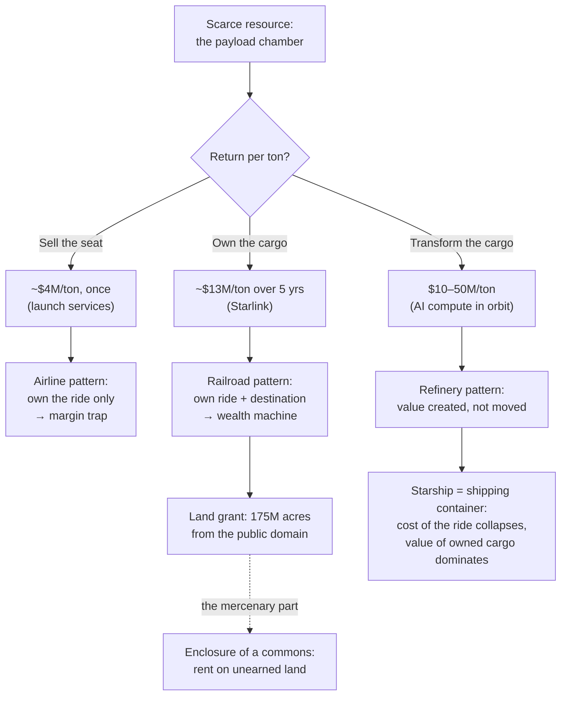
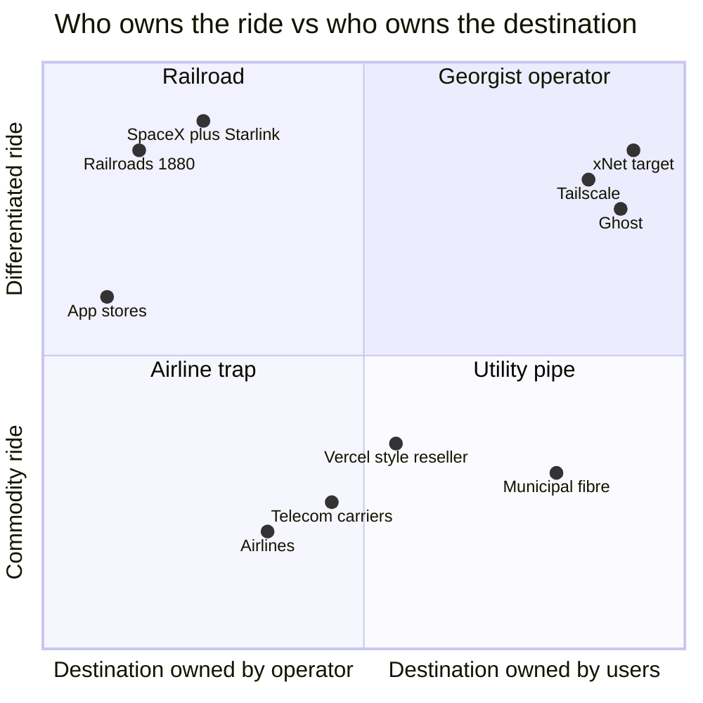
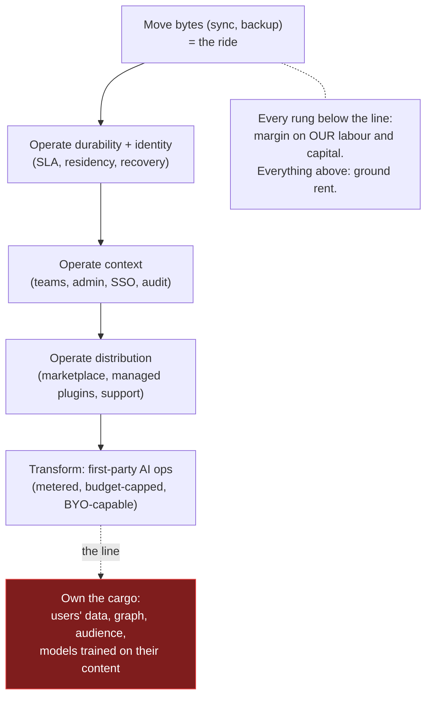

# Frontier Economics Without Enclosure — Railroads, Airlines, and the Commons

> Analysis of the Maxinomics video essay ["Why Elon Musk is Building
> Starship"](https://www.youtube.com/watch?v=DlXb3zSLdFY) (July 2026, also
> surfaced under the A/B title "How Does SpaceX Actually Make Money?") and what
> its railroad/airline/dumb-pipe framework actually implies for xNet. The
> user's question, precisely: xNet must not be the airline (a commodity pipe in
> a margin trap), but it also must not be the railroad in its mercenary mode —
> hoovering up free land from the commons. How does xNet capitalise on a
> frontier that is genuinely opening, while staying aligned with its values:
> noticing early, supporting the commons, and charging a reasonable margin for
> good services around it?

## Problem Statement

The video's economic engine is one number: **return per ton** of the scarce
resource (the payload chamber). A ton of someone else's cargo earns SpaceX
~$4M, once. A ton of its own Starlink satellites earns ~$13M over five years.
A ton of AI chips that *transform* data rather than move it could earn
$10–50M. From that one metric the video derives a 150-year-old pattern:

- **The railroad** owned the ride *and* the destination. US land grants handed
  railroads ~175M acres — more than a tenth of the country, granted in a
  checkerboard along the track — and the railroads sold town lots, grain
  elevators, and hotels to the very settlers they carried. Owning both ends is
  what "turns dumb pipes into a very nice business."
- **The airline** owns only the ride. Government airports, assigned gates. It
  captures a $300 fare on the $5,000 deal its passenger flies to close. Every
  major US airline now spends more per seat-mile than it earns flying it;
  profits come from co-branded credit cards. Owning the ride and neither end
  is a permanent margin trap.
- **SpaceX** is running the railroad play on the orbital frontier: launch is
  the track, Starlink is the land grant, orbital shells and spectrum slots are
  the frontier land — claimed by getting there first. Starship is the
  shipping container of space (McLean, 1956: $5.86 → $0.16 per ton loaded),
  collapsing the cost of the ride so the value of owned cargo dominates.

The video is admiring; the user's read is more careful. The railroad model
worked *because* the government enclosed a commons on the railroads' behalf —
free land, taken from public domain (and, before that, from the people living
on it), converted into private rent. The orbital analogue (LEO shells, ITU
spectrum filings) is first-come occupation of a commons with no rent paid back.
xNet's entire charter (`docs/CHARTER.md`) is an argument *against* that move
in the data domain: the platforms of the 2010s were railroads — they gave you
a free ride (feed, hosting, graph) and quietly took the land grant (your data,
your audience, your switching costs) and sold you back your own town.

So the exploration must answer three questions:

1. **What is xNet's frontier?** Which commons is actually opening right now,
   the way the American West opened in 1862 and LEO opened in 2016?
2. **What is the third position** between airline (commodity margin trap) and
   railroad (enclosure rent) — and is it economically real, not just pious?
3. **What does "reasonable margin" mean operationally** — which specific
   revenue lanes are legitimate, which are refused, and how do we encode the
   difference so it survives commercial pressure?

## Executive Summary

- **The video's true lesson is not "own the destination" — it is "know what
  your scarce resource is, and never sell it as a commodity."** SpaceX's
  scarce resource is the chamber; the railroads' was position on the land;
  the airlines never had one, which is the whole story. xNet's scarce
  resource is **operated trust** — being the party users and agents trust to
  run the boring, durable, verifiable infrastructure around data *they* own.
  That resource is not enclosable land; it is reputation plus operations, and
  it compounds like one of the video's flywheels without taking anything from
  anyone.
- **The third position exists and has a name: the Georgist operator.** Henry
  George wrote *Progress and Poverty* (1879) in direct response to railroad
  land speculation in California. His distinction — rent on *land* (unearned,
  extracted from the commons) versus return on *improvements* (earned by
  labour and capital) — is exactly the line the user is asking for. Margin on
  what we *operate, build, and support* is earned. Rent on what users would
  own anyway — their data, their audience, their exit — is ground rent, and
  we refuse it. Exploration 0336 already derived this independently ("sell
  the operations, not the bytes; charge for context, not capability");
  0349's 0%-take payments decision is the same principle applied to
  creators' revenue. This exploration names the principle and generalises it.
- **The railroad's legitimate move is available to us: anchor tenancy.**
  Three of four SpaceX launches carry SpaceX cargo — it became its own best
  customer, which is vertical integration *without* enclosure (nobody else's
  launch was blocked). xNet's analogue is first-party surfaces (apps, cloud,
  marketplace, the site itself) running on the open protocol — dogfooding as
  anchor tenancy. Running your own trains on tracks anyone may use is
  honest; what the charter forbids is owning the *town* (user data) at the
  end of the line.
- **The airline trap is already explicitly rejected in the repo** — 0336
  Options B and C (usage-metered bytes, DX-premium reseller markup) are the
  airline: commodity units, visible markup, price-only competition, our own
  MIT hub as the customer's BATNA. Nothing new is needed there except not
  backsliding.
- **xNet's frontier is the agentic, post-platform data layer** — open
  identity (ATProto/DID), open payments rails (x402, now Linux Foundation),
  open agent protocols (MCP-era), and the regulatory tailwind (EU Data Act,
  sovereignty wave, 0336). It is opening *now* for the same reason LEO
  opened: the cost of the ride collapsed (local-first sync engines, cheap
  edge compute, capable local models). First-mover advantage on this
  frontier is legitimate when what you claim first is **reputation,
  defaults, and interoperability credibility** — not exclusive rights.
- **Recommendation in one line:** *Be the railway operator on land the
  passengers own — collect fares for service, never rent for the ground —
  and be your own anchor tenant while the frontier is young.* Concretely:
  codify a "No Ground Rent" covenant in the Charter's Commons section,
  adopt a three-test rubric for every new revenue lane, and keep building
  the 0349 payments + 0336 positioning roadmap, which this framework
  validates rather than changes.

## The Video's Argument, Compressed

Key facts the analysis leans on (all from the video, stated there as company
plans and public figures, with its own caveat that Starship has flown zero
operational payloads):

| Concept | Number | Meaning |
|---|---|---|
| Sell the seat | ~$74M / ~17.4 t ≈ $4M/ton, paid once | Launch-as-a-service is a one-shot transaction |
| Own the seat | Starlink sat ≈ $800k build, ~$1.5M/yr, 5-yr life ≈ $13M/ton | Recurring revenue on owned cargo ≈ 3× the seat price |
| Transform the cargo | AI racks $10–50M/ton | Moving data is a pipe; changing it is a refinery |
| The flywheel | Booster ~$30M, refurb ~$1M, fuel 0.3% of cost | Reuse collapses the ride's marginal cost |
| Anchor tenancy | 123 of 165 launches carried Starlink | The pipe's best customer is its owner |
| Railroad grants | ~175M acres, checkerboard, per verified mile | The state enclosed a commons to subsidise the track |
| Airline economics | Negative seat-mile margin; credit cards carry the P&L | Own the ride, own nothing at either end |
| Containerisation | Loading $5.86 → $0.16/ton (36×) | Standardised cheap transport moves *industries*, not just goods |

## Current State In The Repository

xNet has already made most of the relevant choices — scattered across
explorations and code. This section collects them as evidence that the
"Georgist operator" position is descriptive, not aspirational.

### Where we already refuse ground rent

- **Exit is free and loud.** `docs/CHARTER.md` §2 ("Exit — leaving is your
  right, and it loses nothing"): portable `did:key` identity, open signed
  change-log wire format, full offline client. Enforced by
  `scripts/check-humane-patterns.mjs` in CI. The `.xnetpack` portable bundle
  codec (`packages/data/src/portability/`, exploration 0344) makes export a
  first-class verified artifact, not a support ticket.
- **The self-host BATNA is real and maintained.** `packages/hub/` is MIT,
  single-process, runs on a Raspberry Pi (0300) or a $5 VPS;
  `packages/entitlements/` is MIT and dependency-free so a self-hosted hub
  verifies signed entitlements with no vendor tether (0174/0181). Our own
  customer can always leave — which is precisely what keeps the paid lanes
  honest (0336 calls this the anti-Vercel position).
- **0% take on creator commerce.** Exploration 0349 (merged, unimplemented):
  Stripe Connect Standard direct charges — funds settle on the seller's own
  Stripe account, xNet never in the flow of funds, no take rate on direct
  sales. The 10% `application_fee` is reserved *only* for the managed
  marketplace, where we provide real distribution and licensing services
  (0196) — a fee on improvements, not on land.
- **No behavioural surplus.** Charter §1: no ad model, no third-party
  trackers (CI-banned), telemetry off by default and bucketed (§4, 0210,
  0257). The data-railroad's core rent — monetising the town's records — is
  structurally absent.
- **The trademark is the only fence, and it is FRAND.** `TRADEMARK.md`
  commits the mark to a future foundation; the code is free to fork. The
  brand protects users from confusion, never from leaving (0242).

### Where we already collect legitimate fares

- **Operations subscriptions.** `packages/cloud/src/cost/pricing.ts` +
  `packages/entitlements/src/plans.ts` + `site/src/data/pricing.ts`: the
  seven-tier ladder priced on *context* (personal → family → team → org →
  enterprise) and *durability* (isolation, SLA, residency), floor-tested for
  margin (`packages/cloud/src/cost/floor-margin.test.ts`), modelled at
  85–90% gross on the Personal tier because local-first makes our COGS
  cents (0178, 0336).
- **A protected pass-through AI lane.** `packages/cloud/src/billing/` +
  `packages/cloud/src/ai/`: metered, budget-capped, margin-safe markup with
  COGS booked at 1.055× so margin is never overstated (0244). AI is the one
  COGS line that scales with usage; it is deliberately quarantined from the
  subscription margins.
- **Two billing systems on purpose.** `packages/billing/` (MIT,
  provider-agnostic, Stripe + BTCPay) serves the *self-hosted* — we ship the
  toll-booth software to people who will never pay us, because the track is
  theirs (0187). `packages/cloud/src/billing/` (FSL) meters only our own
  operated service.

### Where the frontier work already points

- **0336** (comparative cloud economics) — the positioning decision this
  exploration extends: "sell the operations, not the bytes; charge for
  context, not capability"; Tailscale cost structure; sovereignty wave as
  the government wedge; Charter as commercially load-bearing.
- **0349** (first-class payments) — the x402 agent rail (Linux Foundation,
  ~169M payments in year one), payment-mints-capability, receipts as nodes.
  This is frontier-claiming of the right kind: adopting open rails early
  rather than building a proprietary toll road.
- **0245** (leveragism) — Hirschman's Exit/Voice frame: extraction economies
  work by removing Exit; xNet is an Exit machine. The railroad checkerboard
  was precisely an Exit-removal device (alternating sections made it
  impossible to homestead a contiguous farm without dealing with the
  railroad).
- **0246** (permaculture / digital commons) — Fair Share ("return of
  surplus") as the third permaculture ethic; the essay series' language for
  regenerative rather than extractive systems.
- **0132 / 0173** (federated hub economics, community-owned infrastructure)
  — early sketches of hub economics that this framework now grounds.
- **0333** (ATProto relay economics) — the cautionary tale of accidentally
  building a global common carrier with unbounded COGS; bounded relays at
  $34/mo. Deciding *not* to operate a global tier was itself a
  refuse-the-land-grant decision: we declined to become the indispensable
  middle.
- **0345** (licensing) — MIT core + FSL cloud, GPL/AGPL rejected: the land
  (protocol, client, hub) stays commons; only our *operated* cloud service
  carries a temporary commercial fence that dissolves to Apache-2.0 after
  two years. FSL's two-year sunset is literally a fence that composts.

## External Research

### The railroad grants, seen whole

The video presents the land grants as a brilliant business model, which they
were — briefly, and at public cost. The fuller history sharpens the moral:

- Between 1850 and 1871 the US granted ~131M federal acres plus ~49M state
  acres to railroads (video's 175M is in range). Grants were checkerboarded
  precisely so railroads could capture the appreciation their own track
  created on alternating public sections — an early, deliberate
  value-capture mechanism.
- The backlash was fast and formative. Public outrage ended new grants by
  1871; the General Forfeiture Act (1890) clawed back unearned grants;
  the Granger movement and the Interstate Commerce Act (1887) — the first
  federal regulatory agency — exist because rate discrimination by
  destination-owning railroads radicalised an entire generation of farmers.
  **The enclosure play generated the regulatory state that then capped the
  enclosers' returns for a century.** Railroads spent the 20th century as
  regulated, capital-starved utilities; many of the land-grant fortunes
  outlived the railroads' operating businesses. Mercenary frontier capture
  has a long-run bill.
- Henry George's *Progress and Poverty* (1879) — written in San Francisco
  amid Central Pacific land speculation — made the canonical distinction:
  returns to **labour and capital improvements** are earned; **rent on land**
  (any scarce resource nobody produced) is an unearned tax on everyone
  else's productivity, and should be socialised. Georgism is enjoying a
  small revival in digital-economy writing (spectrum auctions, domain
  namespaces, app-store rents, and data-network effects are all analysed as
  land). Lanier's data-dignity work (exploration 0347) is adjacent: data's
  value comes from the people it describes, so provenance should flow back.
- The Lockean proviso — appropriation from the commons is legitimate only
  where "enough and as good" is left for others — is the philosophical test
  the checkerboard failed and homesteading (labour-based claims, capped
  acreage, residency requirements) at least gestured at.
- Elinor Ostrom (*Governing the Commons*, 1990; Nobel 2009) showed commons
  are not tragedies by default: they fail when boundaries, monitoring, and
  graduated sanctions are absent. Durable commons have **rules made by the
  people who use them** — which is what open protocol governance (IETF,
  ATProto's move toward independent governance, x402 under Linux
  Foundation) attempts, and what a vendor "embracing and extending" a
  protocol destroys.

### The "dumb pipe" discourse

The phrase comes from telecoms: carriers' terror (c. 2005–2015) of becoming
commodity bit-haulers while OTT services (WhatsApp, Netflix, Google) captured
the value on top. The instructive part is what the carriers *did* about it —
zero-rating, paid prioritisation, deep-packet inspection, walled-garden
portals — i.e., attempts to convert a pipe into a railroad by degrading the
commons (net neutrality was the Granger movement of this cycle). Meanwhile
the actually-good outcomes came from carriers that embraced being excellent
pipes with honest economics (utility fibre, municipal broadband) or that
moved up-stack by building *services people chose* rather than tolls they
couldn't avoid. The lesson for xNet: the temptation to "not be a dumb pipe"
is exactly the temptation to enclose; the honest alternatives are (a) be a
superb pipe at fair prices, or (b) earn the up-stack position with genuinely
better services — never (c) rig the pipe.

### Who already runs the third position

0336 catalogued these as business comparables; re-read them as *land policy*:

- **Tailscale** — the data plane is peer-to-peer (users' own devices carry
  the traffic; the "land" is the users'); revenue is coordination,
  identity, and admin — pure improvements. Free personal tier is an
  architectural consequence, not a subsidy.
- **Ghost** — nonprofit foundation, 0% take on creator revenue (the model
  0349 copied), public revenue dashboard; margin from operated hosting and
  support. Explicitly: your audience is your land.
- **Obsidian / Signal / Proton** — variations: free or cheap access to the
  commons-side artifact, paid operations (sync, hosting, premium capacity).
- **Let's Encrypt / Cloudflare's zero-egress posture** — infrastructure
  actors that grew enormous *by* refusing an available rent (certificate
  fees, egress), forcing the whole market's ground rent toward zero and
  taking the reputational surplus instead.
- The **anti-models**: app stores (30% is a destination toll on someone
  else's town), API-pricing whiplash (Twitter/Reddit 2023 — retroactive
  enclosure of an open frontier), and every "sufficiently decentralized
  until traction" protocol that re-centralised at the moat moment. Each is
  a railroad that eventually met its Granger movement (regulators, forks,
  user exodus).

## Key Findings

1. **The video's metric survives translation; the strategy must be
   inverted.** "Return per ton" for xNet is return per unit of *operated
   trust* — revenue per tenant whose durability, availability, identity,
   and compliance we operate. Like SpaceX's chamber it is scarce, priced by
   value, and compounds with reuse (the flywheel: reliability → reputation
   → tenants → revenue → reliability). Unlike land, trust cannot be
   enclosed, granted, or squatted — it can only be earned and kept, which
   makes it the one scarce resource whose pursuit *cannot* be mercenary.

2. **"Own the destination" bifurcates on one question: who owned it
   before?** SpaceX owning its own satellites: legitimate (it built them).
   Railroads owning towns built on granted public land: enclosure. In
   xNet's domain the destination is the user's data, graph, and audience —
   *already owned by the user*. The charter's §1/§6 make "owning the
   destination" permanently unavailable, on purpose. What remains ownable
   is everything we genuinely build: the first-party surfaces, the operated
   cloud, the support relationships, the brand.

3. **Anchor tenancy is the railroad lesson we can take whole.** SpaceX
   filled its own chamber when no customer would (123 of 165 launches). Our
   protocol needs the same: first-party apps, the cloud dashboard, the
   marketplace, the site — all running on xNet's own sync, identity, and
   (per 0349) payment rails. An open protocol whose steward is also its
   heaviest user gets fast feedback loops and proves capacity — without
   excluding anyone else's train. The repo already leans this way
   (dev-tools seed, dogfooded surfaces); the finding is to treat it as
   *strategy*, not hygiene.

4. **The airline trap is re-entered by drift, not decision.** Nobody
   chooses to become a commodity reseller; they add "just one" metered
   unit markup (bandwidth, storage, egress) because it prices easily, then
   competition compresses it and the P&L quietly re-anchors on the worst
   lane (airlines → credit cards; resellers → enterprise lock-in). The
   floor-margin test protects against underpricing; nothing yet protects
   against *mispricing* — a lane whose unit is a commodity byte rather
   than an operated service. That guard should exist in writing.

5. **The frontier is real, datable, and currently un-enclosed.** Local-first
   sync engines, DID/ATProto identity, x402 agent payments, MCP-era agent
   access, EU Data Act portability mandates — the cost of the ride
   (self-owned data infrastructure) collapsed within the last ~3 years,
   exactly like $/kg to orbit after 2016. The platforms have noticed
   (agentic browsers, app-store AI rents); the enclosure attempts are
   already visible. Being early and *loudly non-enclosing* is itself the
   differentiated position: the sovereignty wave (0336) is a set of buyers
   selecting explicitly against railroads.

6. **Refused rents are already our pattern — but they are scattered across
   ten documents and enforced by culture.** 0% take (0349), zero egress,
   free export (0344), MIT entitlements, FRAND trademark, no global relay
   (0333), no behavioural surplus (Charter §1). Nothing names the class.
   A future maintainer under revenue pressure could add a "small" export
   fee without tripping any test. The pattern needs a name and a covenant.

## Options And Tradeoffs

| Option | Shape | Video analogue | Margin reality | Charter fit | Verdict |
|---|---|---|---|---|---|
| **A. Own the destination** | Hold user data/graph/audience hostage; monetise switching costs, take rates, behavioural surplus | Railroad with land grant | Highest short-run; historically triggers regulation, forks, exodus (Granger, Data Act) | Violates §1, §2, §6 outright | **Refused** — permanently, structurally |
| **B. Commodity ride** | Sell metered bytes/compute at visible markup; compete on price | Airline / telecom carrier | 50–65% eroding to negative; P&L migrates to worst lane | Neutral ethics, fatal economics (0336 B/C) | **Refused** — already rejected in 0336 |
| **C. Rig the pipe** | Stay a "pipe" but degrade neutrality: preferred formats, paid priority, extended protocol only we implement | Carrier zero-rating; embrace-and-extend | Medium, poisons the commons that feeds us | Violates §6 in spirit, kills sovereignty wedge | **Refused** |
| **D. Georgist operator** | Users own the land (data, identity, audience); we sell improvements: operated durability, context, support, distribution, AI ops — and anchor-tenant our own protocol | Railway operator on passengers' own land; SpaceX's *vertical integration* without its *land grant* | 85–90% modelled and floor-tested (0336/0178); services margin on sovereign lane; compounding trust flywheel | Is the Charter, economised | **Adopt and codify** |
| **E. Pure commons steward** | No commercial lanes; donations/grants (Actual Budget path) | Homestead with no railway at all | Below sustainability; the software dies or is abandoned to a foundation | Charter-pure but self-defeating (0336's Muse/Actual floor) | Reject as sole model; keep as floor-awareness |

The real decision inside Option D is the same one the video poses as "return
per ton": **how far up the value chain to integrate without crossing into
enclosure.** The ladder, with the line drawn:

Rungs L1–L5 are all improvements — our servers, our code, our on-call, our
curation. The refused rung X is the only one where the asset was created by
users: that is the land. Note that L5 (AI) already has the right guardrails —
BYO-capable (Charter §5), metered pass-through, provenance-marked — the
refinery runs on cargo the customer hands us per-request, and hands back.

## Recommendation

**Position: the Georgist operator on an opening frontier.** In the video's
vocabulary: build the track, run the best trains, be your own anchor tenant,
sell fares and freight service at healthy margins — and leave the land in the
hands of the people who live on it, because in our domain the land *is the
users' lives*. Refuse every ground rent, loudly, as a product feature: the
sovereignty wave, the post-platform developers, and the agent economy are all
buyers screening *for* exactly that refusal.

Concretely, three moves:

1. **Name the covenant.** Add a "No Ground Rent" clause to `docs/CHARTER.md`
   §6 (Commons) enumerating the refused rents with their receipts: no take
   rate on direct creator sales (0349), no egress or export fees (0344,
   `.xnetpack`), no identity ransom (portable `did:key`), no protocol tolls
   (MIT core, open wire format), no behavioural surplus (§1), no global
   chokepoint tier (0333), trademark FRAND (0242). One paragraph, seven
   receipts, CI-linked where enforcement exists. This converts scattered
   culture into a named, checkable commitment — the same move the Charter
   made for calm/consent.

2. **Adopt the three-test rubric for every new revenue lane** (record it in
   the same Charter clause, apply it in exploration docs the way changesets
   are applied to packages):
   - **Improvement test** (George): does the margin pay for labour, capital,
     or operations *we* provide — or for access to something users would own
     anyway?
   - **BATNA test** (0336): if this lane shipped, does `docker compose up`
     self-hosting remain a real, undegraded alternative?
   - **Vanish test**: if xNet-the-company disappeared tomorrow, does the
     value the customer paid for survive (their data, their audience, their
     workflows)? Fees for things that survive us are fares; fees for things
     that die with us are hostage rents.
   A lane failing any test is either redesigned or refused.

3. **Run the anchor-tenant strategy on the frontier rails, per the existing
   roadmaps.** This framework changes no plan of record; it *validates* two:
   0336's positioning (operations subscriptions, hidden-middle Organizations
   lane, sovereign services sub-lane) and 0349's payments phases (0% direct
   sales now, x402 agent rail next). The addition is posture: ship
   first-party usage of every open rail we adopt (our own marketplace
   payments on 0349 Phase 2 rails; our own agent flows on x402; our own
   identity on the ATProto bridge per 0338) so the protocol always has at
   least one serious tenant — us — before it has many.

### Why this is also the *commercially* correct read of the video

The video's wealth machines all rest on one asymmetry: the operator's costs
collapsed (reuse, containerisation) while the price of the *destination*
stayed high. In data, the destination's price is trending to zero too — the
EU Data Act, portability mandates, open-source models, and local-first tooling
are doing to data-hostage rents what the Forfeiture Act did to unearned land.
Every railroad-shaped data business is holding appreciating regulatory risk
and depreciating moats. The durable asset class left is the one that was
never enclosable: operated trust. We are early to a frontier where the
mercenary play is not just wrong but *already being outlawed* — the rare case
where the values-aligned position and the risk-adjusted position coincide.

## Risks And Open Questions

- **The margin-pressure ratchet.** Covenants are tested in down quarters,
  not up ones. The "No Ground Rent" clause needs the same treatment as
  other Charter claims: Enforced where a CI gate exists (export, trackers),
  Architectural where code makes it true (MIT entitlements, direct
  charges), Aspirational-with-tracking where neither yet does (take-rate
  policy is a Stripe configuration, not a test). An honest label per rent.
- **Anchor tenancy can shade into self-preferencing.** SpaceX's 123
  launches crowd no one (capacity grows); a marketplace whose steward's own
  plugins get better placement *does* crowd others. If first-party surfaces
  compete inside our own distribution (0196 marketplace), ranking neutrality
  needs an explicit rule before it needs a scandal.
- **The frontier may be claimed faster than trust compounds.** Platform
  vendors can bundle agentic data layers into existing distribution
  (Google's act-two playbook, 0336 finding 5). Our counter is the
  sovereignty/regulatory wedge and interop credibility — but timing risk is
  real, and "loudly non-enclosing" only differentiates if we also ship at
  competitive quality (0335's release-readiness blockers gate this).
- **Georgist framing has sharp edges we are not adopting.** We are using
  George's *distinction* (rent vs improvement), not his *program* (land
  value tax); no one should read this as a proposal to meter or tax
  anything. Worth a sentence in any public-facing version.
- **Where exactly is "transform" allowed?** L5 says AI ops on user-provided
  cargo is a fare. But a future "we fine-tune on your workspace to serve
  you better" feature sits close to rung X (models trained on user
  content). The Consent spine (§4) and provenance marking (§5) are the
  gates; any such feature needs opt-in, per-tenant isolation, and the
  vanish test (the tuned model must be exportable or valueless to us).
- **Essay potential.** This maps cleanly onto the site's essay series
  (railroads/airlines/containers are vivid, evergreen, non-partisan — the
  0245/0246 register). Held out of scope here; noted as a candidate
  (#17: working title "The Railroad and the Airline", en-GB, `.astro`).

## Implementation Checklist

- [x] Draft the **"No Ground Rent"** addition to `docs/CHARTER.md` §6:
      one clause naming the refused-rent class + the seven receipts
      (0349 0% take, 0344 free export, portable identity, MIT core/open
      wire format, no behavioural surplus, no global chokepoint tier,
      FRAND trademark), each labelled Enforced / Architectural /
      Aspirational per the Charter's honesty convention.
- [x] Add the **three-test rubric** (improvement / BATNA / vanish) to the
      same clause, and note in `CLAUDE.md` or the exploration skill that
      new revenue-lane explorations should apply it explicitly.
- [ ] Add a **"where the margin comes from"** entry to the pricing FAQ in
      `site/src/data/pricing.ts` copy: we charge for operations and
      support, never for access to your own data — with the export/exit
      links as proof (converts the covenant into marketing surface, per
      0336 finding 4 "we under-market the trust artifacts").
- [ ] Record a **marketplace ranking-neutrality rule** (first-party plugins
      compete under the same ranking inputs as third-party) in the 0196
      marketplace docs before Phase 2 of 0349 ships the paid-plugin loop.
- [ ] Add an **anchor-tenant note** to the 0349 implementation plan: each
      new open rail (direct charges, x402) ships with at least one
      first-party consumer in the same phase.
- [ ] Cross-link this exploration from 0336 (positioning) and 0349
      (payments) as the shared values framework.
- [ ] Log the essay candidate ("The Railroad and the Airline") in the
      essay-series backlog; do not write it in this exploration's scope.

## Validation Checklist

- [ ] Charter PR merges with the No Ground Rent clause and every receipt
      link resolving to a real file/exploration (`docs/CHARTER.md` review).
- [ ] Each listed rent carries an honest enforcement label, and at least
      the export-fee and tracker rents point to actually-failing CI gates
      (`scripts/check-humane-patterns.mjs` run demonstrates).
- [ ] The next new revenue-lane exploration (whatever it is) visibly
      applies the three-test rubric — the rubric appears in its
      Options/Recommendation sections.
- [ ] Pricing FAQ copy ships and the claim survives legal/marketing review
      without weasel-wording (no "currently", no "at this time").
- [ ] 0349 Phase 1 lands with zero take rate on direct sales in the actual
      Stripe configuration (code review of the Connect integration:
      no `application_fee` on direct charges).
- [ ] Marketplace ranking inputs documented before any paid first-party
      plugin is listed.

## References

- Maxinomics, ["Why Elon Musk is Building Starship"](https://www.youtube.com/watch?v=DlXb3zSLdFY)
  (July 2026) — the analysed video; figures cited above are its stated
  numbers (transcript captured during research).
- Henry George, *Progress and Poverty* (1879) — rent vs improvements;
  written against California railroad land speculation.
- Elinor Ostrom, *Governing the Commons* (1990) — commons governance
  design principles.
- Albert O. Hirschman, *Exit, Voice, and Loyalty* (1970) — via exploration
  0245.
- Marc Levinson, *The Box* (2006) — containerisation economics (the
  McLean/$0.16 figures the video retells).
- US land-grant history: General Forfeiture Act (1890), Interstate Commerce
  Act (1887), Granger movement — the regulatory aftermath of enclosure.
- Repo: `docs/CHARTER.md`, `docs/explorations/0336_[_]_COMPARATIVE_CLOUD_ECONOMICS_AND_XNET_CLOUD_POSITIONING.md`,
  `0349` (first-class payments, on main), `0345`, `0344`, `0333`, `0246`,
  `0245`, `0196`, `0173`, `0132`; `packages/entitlements/src/plans.ts`,
  `packages/cloud/src/cost/pricing.ts`, `packages/billing/`,
  `packages/data/src/portability/`, `site/src/data/pricing.ts`,
  `scripts/check-humane-patterns.mjs`.
