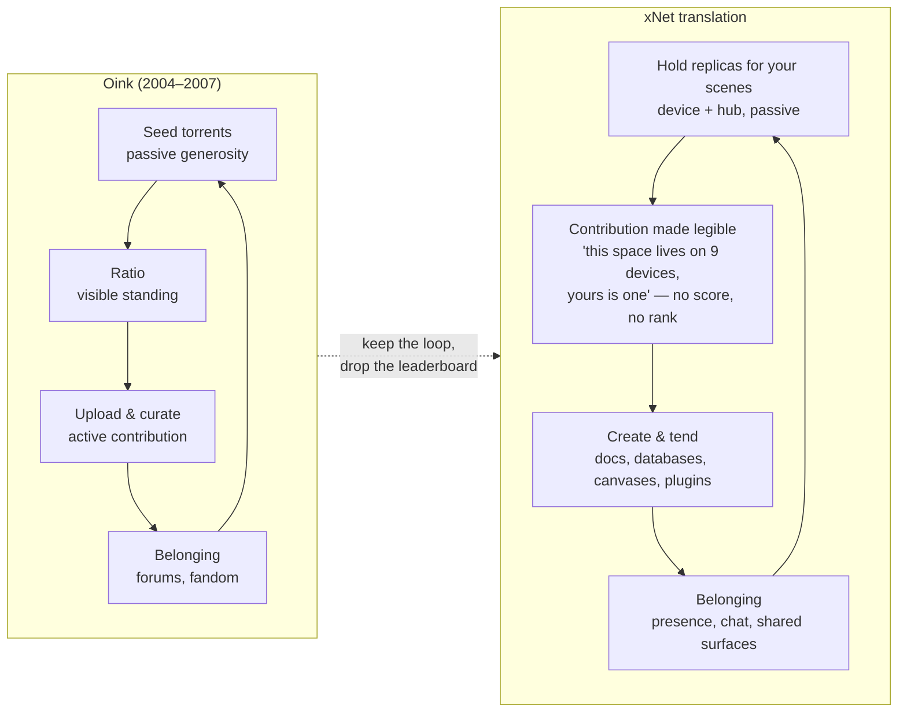
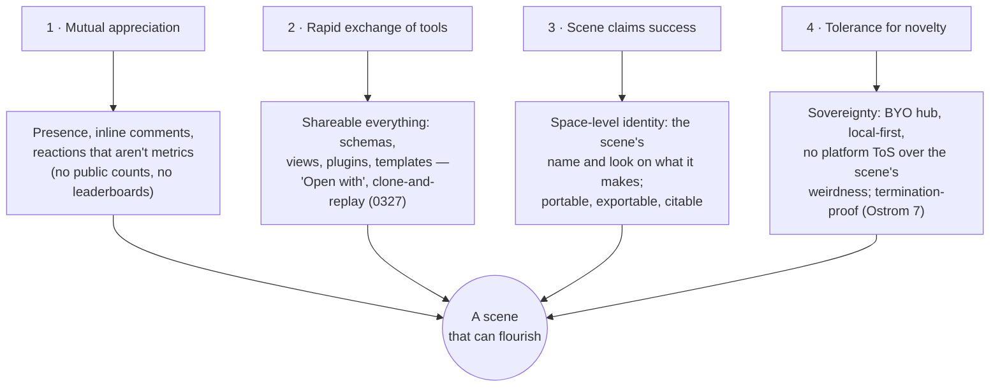
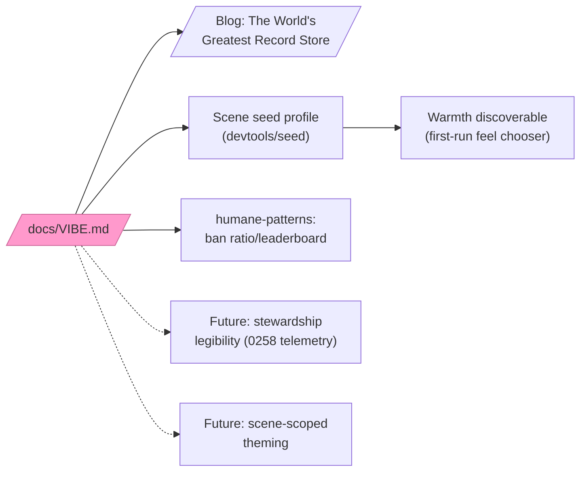

# The Vibe of xNet — Scenes, Commons, and Solarpunk Infrastructure

## Problem Statement

xNet has an **ethics** document — `docs/CHARTER.md`, six commitments, several
CI-enforced. It does not have a **vibe** document. Those are different things.
The charter is a list of refusals: no behavioral surplus, no lock-in, no dark
patterns. Refusals tell you what a place *isn't*. They do not tell you what it
feels like to spend a Saturday there.

The founding intuition behind this exploration is a memory of Oink's Pink
Palace — an invite-only music tracker run by one person in the UK that felt
more alive, more cared-for, and more *loved* than any billion-dollar platform
before or since. Pink and white, a pig mascot, a ratio you had to keep, a
quality bar the community enforced on itself, and forums full of people who
were adamant about music. Everyone was doing something: searching, seeding,
uploading, arguing about transcodes. Nobody was just taking; nobody was just
giving. A virtuous loop, running on kitsch and care.

The questions this exploration answers:

1. What *is* the vibe of the xNet app today, as actually shipped in tokens,
   motion, copy, and demo content — and where does it contradict itself?
2. What is the vibe of the protocol and platform layers, which have their own
   (different) aesthetic?
3. How do the three touchstones — the Pink Palace (reciprocity + quality +
   care), the **scene** (scenius, commons, renaissance-in-a-corner), and
   **solarpunk** (infrastructure for human flourishing) — translate into
   things we can write down, ship, and enforce without cosplay?
4. What should be written, and what should be built?

## Executive Summary

- **Ethics is written; atmosphere is not.** The charter, the humane-patterns
  CI gate, and the motion laws are a complete *immune system* — they keep bad
  vibes out. Nothing in the repo yet describes the vibe we want to let *in*.
  The gap is a positive statement: what xNet cultivates, not what it refuses.
- **The central synthesis: extend the token doctrine one level up.** The
  design system's governing rule is *"chrome may not have hue; hue belongs to
  data."* The vibe doctrine is the same rule at community scale: **the
  platform may not have a vibe monopoly; vibe belongs to the scene.** Oink was
  pink because its people made it pink. xNet's job is not to be the Pink
  Palace — it is to be the stable, calm, dignified infrastructure on which a
  thousand pink palaces get built. Chrome is the venue; scenes bring the
  decoration, the mascot, the in-jokes, the pig.
- **Oink's mechanics were an Ostrom commons, and xNet already has most of the
  primitives** — boundaries (invites/shares), monitoring (signed logs,
  provenance), self-governance (BYO hubs), and the one thing the trackers
  never had: **principle 7, immunity from external termination**. Every
  touchstone community in the research died the same death — a server seizure
  or a shutdown notice. Local-first plus portable exit is the architectural
  answer to the raid on the Pink Palace. That is the deepest vibe claim xNet
  can make, and it is already true in code (`right-to-leave.ts`, the
  `.xnetpack` portability codec, conformance vectors).
- **Three concrete contradictions to fix**: the demo seed workspace is
  "Acme Inc" (a corporate fiction inside a product whose whole point is
  escaping corporate software); warmth (`cozy` variant) exists but is buried
  and undiscoverable; and reciprocity — the seeding loop that made Oink hum —
  exists in the sync architecture but is completely illegible to users.
- **Recommendation**: write `docs/VIBE.md` as the charter's companion
  (charter = what we refuse; vibe = what we cultivate), reseed the demo
  workspace as a *scene* instead of a corporation, make warmth discoverable,
  make contribution legible (gently — no streaks, no ratio anxiety), and ship
  the Pink Palace essay in the blog series. Explicitly reject gamified ratio
  mechanics and a whole-product solarpunk reskin.

## Current State In The Repository

### The ethics layer (complete, enforced)

- `docs/CHARTER.md` — "software that serves instead of extracts." Six
  commitments (Own, Exit, Calm, Consent, Agency, Commons), each tagged
  **Enforced** / **Architectural** / **Aspirational**: *"a commitment with no
  receipt is just marketing."*
- `scripts/check-humane-patterns.mjs` — CI gate banning infinite scroll,
  streak counters, confirmshaming, and every third-party analytics SDK
  (Segment, GA, Mixpanel, Amplitude, Hotjar, FullStory…). Escape hatch
  requires a written reason; a bare `humane-ok` is itself a violation.
- `scripts/check-motion-vocab.mjs` + `packages/ui/src/theme/motion.css` — the
  Two Laws (enter decelerates slower; exit accelerates faster); `ease-bounce`
  was retired because *"its negative anticipation is the opposite of
  minimal."*
- Charter promises have literal tests: `charter-calm-feeds.test.ts`,
  `charter-consent-default.test.ts`, `charter-claims-ledger.test.ts`.

This layer is genuinely unusual — very few products lint their own ethics.
But it is all *negative space*.

### The app's visual vibe (calm monochrome, with warmth locked in a drawer)

- `packages/ui/src/theme/tokens.css` (0166): one APCA-tuned grey ramp per
  mode, hairline borders ("structure felt, not seen"), near-black dark mode.
  Doctrine: **"chrome may not have hue; hue belongs to data."**
- The `cozy` variant (0232): warm paper `#F6F2EA`, terracotta accent,
  editorial serif for headings — *"a room you want to spend the day in"*
  instead of *"an IDE."* It exists, it shipped, and almost nobody will ever
  find it. Same for the `calm` shell layout (0250) and `quiet` chrome (0273).
- The marketing site (`site/src/`) runs a *different* palette — indigo/violet
  gradients, launch-y glow — so the brand currently speaks in two registers
  (site says "movement," app says "instrument").

### The written voice (the strongest existing vibe artifact)

- The blog series (`site/src/data/blog.ts`, 16 essays): calm, literary,
  naturalist — tree rings, soil, mycelium, looms, stellar furnaces. Co-bylined
  with Claude. This voice *is* a vibe, and it's the closest thing the project
  has to an atmosphere statement — but it lives on the marketing site, not in
  the product or the docs.
- Taglines in tension: "Your data. Your devices. Your rules." (sovereignty,
  slightly defensive) vs "It's like Lego for the web" (playful, constructive)
  vs "Built to be left." (the best one — generous and confident).

### The demo content (the biggest vibe contradiction)

- `packages/devtools/src/seed/` seeds **"Acme Inc"** — Engineering ⚙️ /
  Design 🎨 / Sales 💼 teams, tags like `backend`/`urgent`/`finance`. It is
  competent, cross-linked, gate-tested (`seed-coverage.test.ts`,
  `seed-render.test.ts`) — and it tells every new user that xNet is Jira with
  better politics. The first workspace a person ever sees is a fictional
  *corporation*, in a product whose vision doc says the same primitives should
  run *"a personal task list to a planetary search index."* The Pink Palace
  was never Acme Inc.

### Reciprocity mechanics (present in architecture, absent from experience)

- Sync is already structurally reciprocal: multi-home replication (0258),
  P2P transports (0310 Iroh ladder), BYO hubs (`packages/hub/`), durable
  share links (`packages/identity/src/sharing/`), and trust-by-provenance
  (`packages/trust/src/index.ts` — "sync is not consent").
- But none of it is *legible*. An Oink member could see their ratio, their
  seeded torrents, the health of the swarm. An xNet user has no view of "what
  my device is holding for the scene," "what the hub is carrying for me," or
  "who this space is alive because of." The passive-generosity loop — leave
  the tracker open, rack up seeding, feel quietly useful — has no xNet
  equivalent yet.

## External Research

### Oink's Pink Palace and What.CD — what actually made it work

Facts worth getting right (the memory is accurate): founded May 2004 by Alan
Ellis, invite-only, ~180k members at the October 2007 raid. Ratio enforcement
converted free-riders into seeders; transcode rules and rip-checking made
quality a *community* value rather than a moderation chore; the invite tree
made you accountable for who you brought in; and — genuinely — members were
required to have cute avatars. Trent Reznor: it was *"like the world's
greatest record store."* Ellis was acquitted of conspiracy to defraud in 2010;
the community had already rebuilt itself as What.CD **within four days** of
the raid.

What.CD refined every mechanic: an interview gauntlet (a whole third-party
site existed to coach applicants on transcode theory and spectral analysis),
"trumping" of inferior rips, and open-sourced infrastructure (Gazelle,
Ocelot) that the entire private-tracker world still runs on. When French
police seized its servers in 2016, staff destroyed the database themselves to
protect users — the community's last act was data dignity.

The scholarship matters here: Bodó's *"Set the Fox to Watch the Geese"*
documents private trackers evolving bottom-up governance "to ensure the
survival and the quality of the shared P2P resource pool" — pirates
spontaneously inventing IP-like regimes. Measurement studies (Meulpolder et
al., IPTPS 2010) found ratio-enforced communities delivered ~35× the download
speed and 10×+ the seeder ratios of public trackers. And the critique is
real too: on a well-seeded tracker most members mathematically *cannot* keep
ratio — "ratio anxiety" was the community's chronic illness, and economists
class these as **credit economies, not gift economies**. Extrinsic scorekeeping
crowded out intrinsic giving at the margin. Any xNet reciprocity mechanic must
harvest the *legibility* without importing the *anxiety*.

### Ostrom — the trackers were commons, and they were missing one principle

Elinor Ostrom's eight design principles for enduring commons: (1) clear
boundaries, (2) rules fit local conditions, (3) those affected can change the
rules, (4) community-accountable monitoring, (5) graduated sanctions,
(6) cheap conflict resolution, (7) **right to organize recognized by external
authority**, (8) nested enterprises. Oink and What.CD instantiated 1, 4, and 5
beautifully — invite boundaries, peer-visible ratios, warnings before bans.
What killed them both was principle 7: the outside world never recognized
their right to exist, and everything lived on servers the outside world could
seize. **Local-first is principle 7 by architecture instead of by permission.**

### Scenius — Kevin Kelly's four conditions

Brian Eno: *"scenius is like genius, only embedded in a scene rather than in
genes."* Kelly's four conditions that nurture it: (1) **mutual appreciation**
— risky moves applauded, subtlety noticed; (2) **rapid exchange of tools and
techniques** — inventions flaunted and shared immediately; (3) **network
effects of success** — a breakthrough is claimed by the whole scene; (4)
**local tolerance for novelty** — the outside doesn't crush the scene's
weirdness. His examples: Bloomsbury, Building 20, Xerox PARC, Burning Man.
Condition 4 is again the termination problem: scenes need a *protected
corner of space-time*. Discord channels and subreddits are rented corners.

### Solarpunk and permacomputing

Adam Flynn's founding note: solarpunk begins from **"infrastructure as a form
of resistance,"** quoting mayor Chokwe Lumumba — dealing with infrastructure
protects against being robbed of self-determination. The community manifesto:
solarpunk *"can be utopian, just optimistic, or concerned with the struggles
en route to a better world, but never dystopian."* The computing branch,
permacomputing (Heikkilä / permacomputing.net), has ten principles of which
several read like xNet design review comments: *observe first*, *not doing*
(refuse unnecessary computing), **expose the seams**, *build on solid ground*,
*keep it flexible*. Hundred Rabbits build software that runs offline on old
hardware on a sailboat. The aesthetic overlap with local-first is not
coincidental: both are about software that survives the grid flickering.

### Calm technology

Weiser & Brown (PARC, 1995): *"the scarce resource of the 21st century will
not be technology, it will be attention"* — calm technology moves between the
center and the **periphery** of attention. Amber Case's eight principles
(smallest possible attention; inform and create calm; use the periphery;
work even when it fails; the right amount of technology is the minimum needed).
The charter's §Calm and the quiet-shell work (0273) are already Weiser-shaped;
the vibe doc should cite the lineage explicitly.

### The gift, the cozyweb, and the dark forest

Lewis Hyde's *The Gift*: a work exists in two economies at once, and **the
gift must always move** — a gift hoarded or priced stops being one;
circulation, not accumulation, creates the increase. Seeding culture is
Hyde formalized. Strickler's dark-forest theory and Rao's **cozyweb** name
where everyone actually went when the open internet became a predator
clearing: non-indexed, non-optimized, depressurized spaces — group chats,
newsletters, private Slacks — currently running on *"the (human) protocol of
everybody cutting-and-pasting bits of text."* The cozyweb is enormous, loved,
and has **no data layer**. That is xNet's actual market, stated in vibe terms.

### Prior art: how good products write their vibe down

Three forms recur across the best examples:

| Form | Exemplars | What it does well |
| --- | --- | --- |
| **Refusals** | SpaceHey ("no algorithm, no likes, no feed"), Are.na (no ads, no metrics, names the enemy affects: outrage, anxiety, FOMO) | Defines the product by absences; instantly legible |
| **Operational commitments** | Mastodon Server Covenant (daily backups, 3-month shutdown notice), Glitch ("How we won't screw up Glitch") | Auditable promises about future behavior — ethos as SLA |
| **Named scarce resource** | Weiser (attention), Hyde (the gift's motion), Ostrom (the shared pool) | Gives every later decision a test |

Plus two outliers worth stealing from: Wikipedia's five pillars end with *"no
firm rules"* (humility built in); the IndieWeb principles are ordered by
priority and end with **"have fun"** — the corrective to manifesto solemnity.
And Robin Sloan's home-cooked app essay grants the deepest permission of all:
software *"liberated from the requirement to be professional and scalable
becomes a different activity altogether, just as cooking at home is really
nothing like cooking in a commercial kitchen."* xNet's charter already covers
the refusals and the receipts. What's missing is the third form — naming what
we cultivate — and the last note: fun.

## Key Findings

### 1. The charter is an immune system; the vibe is the flora

Every enforced pattern in the repo keeps something *out* — surveillance,
streaks, bounce easing, behavioral surplus. Immune systems are necessary and
insufficient: a sterile room has a great immune system and no life in it. The
Pink Palace's magic was not its rules (though it had them); it was that the
rules protected a culture of *care about the work itself* — bit-perfect rips,
liner notes, arguments about pressings. Vibe is what the rules make room for.

### 2. The vibe doctrine is the token doctrine, one level up

```
"Chrome may not have hue; hue belongs to data."        (tokens.css, 0166)
"The platform may not have a vibe monopoly;
 vibe belongs to the scene."                            (this exploration)
```

This resolves the apparent conflict between xNet's disciplined monochrome and
the Pink Palace's kitsch. They are not in tension — they are *layers*. The
venue is calm so the scene can be loud. Oink's pink was Oink's, not
BitTorrent's; BitTorrent was the calm grey protocol underneath. xNet the
chrome should stay quiet, dignified, warm-on-request. xNet the platform should
hand every scene the keys to its own atmosphere: space-level themes, icons,
mascots, home pages, in-jokes. The measure of success is that two xNet scenes
feel as different from each other as a record store and a farm co-op — while
both feel unmistakably *safe* in the same way.

### 3. Three vibes, three layers

The question "what is the vibe of xNet?" has three answers because xNet is
three things:

| Layer | Vibe | Lineage | Where it lives today |
| --- | --- | --- | --- |
| **Protocol** | The readable loom: seams exposed, spec public, re-implementable, signed and inspectable | Permacomputing ("expose the seams", "build on solid ground"), the Luddite test | `docs/specs/protocol/`, conformance vectors, `change.ts` |
| **Platform** | The commons: hubs you can own, federation, right to organize, right to leave | Ostrom's 8 principles, the tracker communities | `packages/hub/`, 0258 multi-home, `right-to-leave.ts`, `.xnetpack` |
| **App** | The quiet venue: calm chrome, warmth on request, richness at the edges | Weiser/Case calm tech, cozyweb, home-cooked meals | `tokens.css`, `cozy` variant, calm/quiet shells |

And the fourth thing — the **scene** — is not xNet's layer at all. It is what
users build on top, and every design decision should widen their room to do it.

### 4. Oink's loop, translated without the anxiety

The Pink Palace loop was: *contribute passively (seed) → see your standing
(ratio) → contribute actively (upload, curate, argue) → belong.* The failure
mode was scorekeeping becoming the point (ratio anxiety, credit economy). The
xNet translation keeps the loop and drops the score:



The design rule that falls out: **reciprocity should be legible, never
scored.** Show stewardship ("your device has kept this space available for 340
days"), never ranking ("you are #14 in this space"). Graduated visibility, not
graduated sanctions — the humane-patterns gate already bans streak counters,
and that ban must extend to any ratio-like mechanic.

### 5. Scenius conditions map to shippable primitives



Condition 2 is the sleeper: Oink's *tools* (rip guides, transcode checkers,
interview prep) were community-made and community-shared. xNet's schema/plugin
system is exactly this — the moment a farming scene can share its
harvest-tracking schema with another farming scene, condition 2 is running on
xNet rails.

### 6. Solarpunk is the posture, not the palette

The temptation is aesthetic (vines on the UI, green gradients). The substance
is Flynn's line: **infrastructure as resistance** — self-determination
protected by what you run, not what you're promised. xNet's honest solarpunk
claims are: runs on your hardware; survives the platform dying; no behavioral
extraction (enforced, not promised); federated commons hubs; and a protocol
anyone can re-implement — *"never dystopian"* rendered as architecture.
The vibe doc should claim the posture and explicitly decline the cosplay.
(The blog already has the right voice for this: "The Gentlest Furnace" —
technology that burns long instead of burning out — *is* solarpunk writing
without the word.)

### 7. The deaths are the argument

Every beloved community in the research died by centralized termination:
Oink raided, What.CD's servers seized, Geocities deleted, Google Reader
sunset (the blog's "The Vault and the View" already covers this). The
Mastodon covenant's best clause is a *3-month shutdown notice* — the
cozyweb's best offer is a slightly gentler eviction. xNet's offer is
categorically different: **the scene outlives the server.** If the hub
dies, every member still holds the data, the log, and the keys; the scene
re-homes (0258) and continues. This is the single strongest vibe sentence
available to the project, because it is the one no platform can say:

> *You can raid the palace, but everyone walks out with a copy.*

## Options And Tradeoffs

### Option A — Do nothing; the charter is enough

The charter + blog voice already communicate values; vibe emerges from use.
**Pros:** zero cost; avoids manifesto inflation (a real disease — every doc
added dilutes the ones before). **Cons:** the identified contradictions
(Acme Inc seed, buried warmth, illegible reciprocity) persist; "vibe" stays
tribal knowledge in the founder's head, which is exactly what this
exploration was commissioned to fix. Rejected.

### Option B — Write it down: `docs/VIBE.md` + a Pink Palace essay

A companion doc to the charter (charter = what we refuse; vibe = what we
cultivate), in the three-layer structure of Finding 3, ending IndieWeb-style
with *have fun*. Plus blog essay #17: the Oink story → Ostrom → "the scene
outlives the server." **Pros:** cheap; durable; gives every future design
review a shared referent ("does this widen the scene's room?"); the blog
essay is the project's best-performing artifact class. **Cons:** words
without product changes would repeat the 0234 diagnosis ("none of this is
legible") at the vibe layer.

### Option C — Ship the vibe: three product moves

1. **Reseed the demo as a scene, not a corp.** Replace/augment "Acme Inc"
   with a workspace that demonstrates the same schema coverage through a
   community fiction — e.g. *"Night Bloom Records"*, a small music-archiving
   & release collective (crates as databases, liner notes as pages, release
   calendar, pressing-quality checklist — a legal Pink Palace), or a
   solarpunk community-garden co-op. Same Tier-1/Tier-2 seeder machinery,
   same `seed-coverage.test.ts` gates; only the fiction changes.
2. **Make warmth discoverable.** Surface `cozy` / `calm` / `quiet` as a
   first-run or settings-forward choice ("How should this feel?") instead of
   buried toggles. The venue can default to calm monochrome *and* offer the
   warm room in the lobby.
3. **Make stewardship legible.** A small, peripheral (Weiser!) surface:
   which devices/hubs hold this space, how long yours has helped, what the
   scene is running on. No scores, no ranks, no streaks — extend
   `check-humane-patterns.mjs` with a `ratio`/`leaderboard` pattern so the
   anti-anxiety rule is enforced, not remembered.

**Pros:** turns the doc into receipts, consistent with charter culture.
**Cons:** real engineering; #3 touches sync internals for read-only
telemetry; #1 risks cutesiness if overdone (keep Acme as an optional
"business" seed profile — B2B evaluators exist).

### Option D — Full solarpunk rebrand (palette, mascot, site)

**Rejected.** The research is unambiguous that borrowed aesthetics without
the underlying relations read as cosplay, and 0223 (performative UI,
⛔ reverted) is this repo's own scar tissue on exactly this mistake. Also
violates the vibe doctrine itself: a strong platform-level aesthetic
*competes* with scenes' own atmospheres. The cosmic-X, the monochrome venue,
and the naturalist blog voice are already coherent; they need articulation,
not replacement.

## Recommendation

**Option B + Option C, sequenced writing-first.** Concretely:

1. Write `docs/VIBE.md` — short (charter-length, not exploration-length),
   structured as: the doctrine (*vibe belongs to the scene*), the three-layer
   table, the loop (*legible, never scored*), the strongest sentence (*the
   scene outlives the server*), and a closing IndieWeb-style ordering that
   ends in *have fun*. Cross-link from `CHARTER.md` and `VISION.md`.
2. Ship blog essay #18 (working title: **"The World's Greatest Record
   Store"**) — Oink → Ostrom's missing principle 7 → local-first as the
   commons that can't be raided. En-GB, `.astro`, hand-drawn art with the
   cosmic-X as the glowing node in a pink palace. (#17, "Palimpsest",
   shipped separately while this doc was in flight.)
3. Reseed: add a scene-flavored Tier-1 seed profile alongside Acme Inc;
   make it the default for personal/first-run workspaces.
4. Extend `check-humane-patterns.mjs`: ban `ratio`/`leaderboard`/`rank`
   patterns in UI surfaces (the Oink lesson, enforced).
5. Then (separate explorations): stewardship legibility surface; scene-level
   theming (space-scoped token overrides — the mechanism by which a scene
   paints its own palace pink).



## Example Code

The humane-patterns extension (step 4) — same shape as the existing
`dark-pattern` rules in `scripts/check-humane-patterns.mjs`:

```js
// dark-pattern group — the Oink lesson: reciprocity legible, never scored.
// Ratio economies produced "ratio anxiety" (credit economy crowding out the
// gift); stewardship surfaces must show care, not standing.
{
  id: 'ratio-scorekeeping',
  pattern: /\b(shareRatio|uploadRatio|leaderboard|rankBadge|userRank)\b/,
  message:
    'ratio/rank scorekeeping: show stewardship ("held this space 340 days"), ' +
    'never standing ("#14 in this space"). See docs/VIBE.md.',
},
```

And the shape of a scene seed profile (Tier-1 seeder, per
`packages/devtools/src/seed/README.md` conventions):

```ts
// packages/devtools/src/seed/seeders/night-bloom.ts
// A scene, not a corp: a small record-archiving collective. Exercises the
// same schemas as the Acme profile (databases, pages, tasks, calendar,
// canvas, chat) through a community fiction.
export const nightBloomSeeder = defineSeeder({
  id: 'scene-night-bloom',
  spaces: [{ id: sid('night-bloom'), name: 'Night Bloom Records', icon: '🌸' }],
  databases: [
    crateDb(),          // releases: artist, pressing, condition, notes
    listeningLogDb(),   // who's spinning what, one line each
    releaseCalendar(),  // upcoming reissues the scene is tending
  ],
  pages: [linerNotes('midnight-garden-ep'), pressingQualityChecklist()],
});
```

## Risks And Open Questions

- **Manifesto inflation.** The repo now has CHARTER, VISION, GOVERNANCE,
  TRADEMARK, CODE_OF_CONDUCT. `VIBE.md` must earn its place by being short
  and by being *cited from code and reviews* — if nothing links to it within
  a quarter, fold it into the charter as a §Cultivate section instead.
- **Cutesiness risk.** A whimsical seed fiction can curdle (0223's scar).
  Mitigation: the scene seed is warm but *competent* — real schemas, real
  cross-links, the same gate tests; and Acme stays available for business
  evaluation contexts.
- **Stewardship telemetry vs. Consent.** Showing "this space lives on 9
  devices" reveals replica topology. It must be scene-internal, respect the
  charter's §Consent, and follow trust-by-provenance rules ("sync is not
  consent", `packages/trust/src/index.ts`). Needs its own exploration before
  any implementation.
- **Scene-scoped theming vs. calm.** If scenes can theme, a scene can be
  loud. That is the point — but shared chrome (rail, status bar, settings)
  must stay venue-owned so a loud scene can't hijack global calm. The
  boundary needs a crisp rule (proposal: scene theming ends at the surface
  edge; chrome tokens are never scene-overridable).
- **Is "scene" the right user-facing word?** Internally Spaces are the unit
  (0258: "Space = replication unit"). "Scene" may be better vocabulary for
  marketing/vibe writing than for product UI. Open — test in the essay first.
- **Legality framing.** The Pink Palace essay must be unambiguous: what we
  harvest is the community mechanics and the care, not the infringement; the
  Ellis acquittal and the What.CD self-destruction are part of the story,
  told as the cost of building a commons on someone else's terms.

## Implementation Checklist

- [x] Write `docs/VIBE.md` (doctrine, three-layer table, the loop, "the scene
      outlives the server", ends with *have fun*); cross-link from
      `docs/CHARTER.md` and `docs/VISION.md`
- [x] Blog essay #18 "The World's Greatest Record Store" in
      `site/src/pages/blog/` + entry in `site/src/data/blog.ts` + hero art
      component (en-GB, cosmic-X in the hero per series convention)
- [x] Add `ratio-scorekeeping` rule to `scripts/check-humane-patterns.mjs`
      (+ selftest fixture)
- [x] Add scene seed profile (`packages/devtools/src/seed/seeders/`), register
      in `seed-manifest.ts`, keep `seed-coverage.test.ts` green; keep Acme as
      the business profile
- [x] Surface feel/warmth choice (cozy variant + calm/quiet shells) in
      first-run or settings top level (`apps/web`)
- [x] File follow-up explorations: stewardship legibility (consent-gated
      replica visibility); scene-scoped theming with venue-owned chrome
      boundary

## Validation Checklist

- [x] `VIBE.md` is cited from design artifacts at ship time (CHARTER.md,
      the humane-patterns rule's fix message, and follow-up explorations
      0355/0356 all reference it as a constraint); the original quarter-long
      "is it load-bearing?" watch stands — if nothing new cites it by
      2026-10, fold it into the charter (see Risks)
- [x] `check-humane-patterns.mjs --selftest` catches a planted
      `shareRatio`/`leaderboard` violation
- [x] Seed: `pnpm vitest --project devtools` green with the scene profile;
      seeded workspace shows the scene (Night Bloom Records) alongside Acme
      (making the scene the sole first-run default stays with the follow-up
      explorations)
- [x] Essay ships with DCO signoff on every commit; the PR carries a
      changelog fragment instead of `skip-changelog` because the
      implementation also touches the app and devtools (not site-only as
      originally assumed)
- [x] A cold read test: someone who has never heard the word "xNet" reads
      `VIBE.md` and can answer "what does this product refuse?" *and* "what
      does it feel like?" — two different answers. Executed at ship time as
      a context-free reader given an anonymized copy (product renamed, no
      repo access): PASS with distinct answers; its one confusion ("what IS
      the product?") fixed by adding a one-line grounding to VIBE.md's
      opening. Re-run with a human reader when one is available

## References

- In-repo: `docs/CHARTER.md`, `docs/VISION.md`,
  `scripts/check-humane-patterns.mjs`, `packages/ui/src/theme/tokens.css`,
  `packages/ui/src/theme/motion.css`, `packages/trust/src/index.ts`,
  `packages/devtools/src/seed/README.md`, `site/src/data/blog.ts`,
  `site/src/data/commitments.ts`; explorations 0166, 0199, 0232, 0234, 0245,
  0246, 0250, 0258, 0273, 0327, 0336
- Oink's Pink Palace — <https://en.wikipedia.org/wiki/Oink%27s_Pink_Palace>;
  Reznor: <https://torrentfreak.com/nine-inch-nails-frontman-was-a-member-of-oink-071031/>
- What.CD — <https://en.wikipedia.org/wiki/What.CD>; eulogy:
  <https://qz.com/840661/what-cd-is-gone-a-eulogy-for-the-greatest-music-collection-in-the-world>
- Bodó, "Set the Fox to Watch the Geese" —
  <https://papers.ssrn.com/sol3/papers.cfm?abstract_id=2261679>
- Meulpolder et al., private-tracker measurement (IPTPS 2010) —
  <https://www.usenix.org/legacy/events/iptps10/tech/full_papers/Meulpolder.pdf>
- Kevin Kelly, "Scenius, or Communal Genius" —
  <https://kk.org/thetechnium/scenius-or-comm/>
- Adam Flynn, "Solarpunk: Notes toward a manifesto" —
  <https://hieroglyph.asu.edu/2014/09/solarpunk-notes-toward-a-manifesto/>;
  A Solarpunk Manifesto — <https://re-des.org/es/a-solarpunk-manifesto/>
- Permacomputing principles — <https://permacomputing.net/Principles/>;
  Hundred Rabbits — <https://100r.co/site/permacomputing_101.html>
- Weiser & Brown, "The Coming Age of Calm Technology" —
  <https://calmtech.com/papers/coming-age-calm-technology>; Amber Case —
  <https://calmtech.com/>
- Lewis Hyde, *The Gift* — <https://lewishyde.com/the-gift/>
- Ostrom's principles —
  <https://earthbound.report/2018/01/15/elinor-ostroms-8-rules-for-managing-the-commons/>
- Strickler, "The Dark Forest Theory of the Internet" —
  <https://www.ystrickler.com/the-dark-forest-theory-of-the-internet/>;
  Rao, "The Extended Internet Universe" —
  <https://contraptions.venkateshrao.com/p/the-extended-internet-universe>;
  Appleton, "The Dark Forest and the Cozy Web" —
  <https://maggieappleton.com/cozy-web>
- Prior-art ethos statements: Are.na <https://www.are.na/about>; Glitch
  <https://blog.glitch.com/post/how-we-wont-screw-up-glitch/>; Mastodon
  Server Covenant <https://joinmastodon.org/covenant>; Discourse FAQ
  <https://meta.discourse.org/faq>; Wikipedia Five Pillars
  <https://en.wikipedia.org/wiki/Wikipedia:Five_pillars>; IndieWeb
  <https://indieweb.org/principles>; Robin Sloan, "An app can be a
  home-cooked meal" <https://www.robinsloan.com/notes/home-cooked-app/>;
  Maggie Appleton, digital gardens <https://maggieappleton.com/garden-history>
