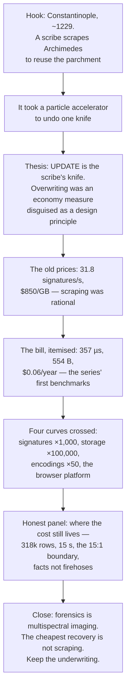

# Blog Post: "Palimpsest" — The Economics Of Keeping Everything

## Problem Statement

Exploration 0350 produced something the essay series has never had: a
fully itemised bill. It measured what xNet's signed, hashed, append-only
change log actually costs versus a mutable database — 357 µs of crypto
per change, a ~554 B envelope, ~100–300× a bare write, ~$0.06/year of
disk for a heavy user — and traced why those numbers are affordable now
when the same design would have consumed the whole machine in 2003.

Is there a blog essay in this? What's the spine — the numbers, the
history, or the argument? Where does it sit in a 16-essay series that
has already made the *philosophical* case for immutability ("Tree
Rings") and the *economic* case for data ownership ("Weights You Can
Hold", "People in Disguise")? And what are the mechanics of shipping it
as essay #17?

## Executive Summary

**Yes — write it, provisional title "Palimpsest."** The hook is the
Archimedes Palimpsest: in the thirteenth century a scribe scraped the
only surviving copy of Archimedes' *Method* off its parchment to reuse
the pages for a prayer book — because parchment was expensive and the
text was not deemed worth its substrate. Eight centuries later it took
multispectral imaging and a particle accelerator to read what the knife
almost erased. **The mutable database is a palimpsest: `UPDATE` is the
scribe's knife, and it was always an economy measure disguised as a
design principle.** The essay's job is to show — with the series' first
real benchmark numbers — that the economy that justified the knife is
gone.

Findings that drive the recommendation:

1. **This would be the first essay in the series with measured
   numbers**, and that is its identity. Tree Rings argued the log is
   *right*; Palimpsest argues the log is *cheap*, and shows the bill.
   The overlap risk with Tree Rings is real but resolvable: that essay
   is philosophy (Hickey's epochal model), this one is economics
   (microseconds and dollars). The two become deliberate companions —
   the why and the what-it-costs.
2. **The material is unusually strong on receipts.** 0350 contains
   fresh benchmarks run on the repo's actual `@noble` libraries (357 µs
   sign pipeline; the 1.4 ms/change verify from the 0344 import gate
   reproduced to the microsecond), archived 2003 `openssl speed` runs
   (RSA-2048: 31.8 signatures/s on a Celeron), and the four-curve
   "why now" argument (signatures ~1,000×, storage ~10⁵, encodings
   ~50×, platform). Every claim has a file path or a primary source.
3. **The honest-divergence section writes itself** — the series' house
   style demands a self-audit, and 0350 supplies it: the overhead is
   real (~100–300× per write), it bites at O(history) boundaries (the
   318k-row cold-open stall), and xNet polices a 15:1 boundary by
   convention, not mechanism ("the log is for human-rate facts").
   Naming the repo's own stall incidents is exactly the "Honest*" panel
   the recent essays ship.
4. **Shipping mechanics are fully mapped** (agent-verified against
   main): hand-authored `.astro` page + `BlogPost` entry in
   `site/src/data/blog.ts` + `heroArt` mapping in `index.astro` +
   bespoke `PalimpsestHero`/`PalimpsestArt` components. RSS and the
   series pager update automatically. Site-only PR → `skip-changelog`.
5. **Register**: en-GB, ~14 min, authors `['crs48', 'claude']`, tags
   `essay, protocol, economics, philosophy`. Figures hand-rolled (the
   two most recent essays deliberately avoid Mermaid to keep the
   "loads nothing third-party" promise literal — follow them, not the
   older essays).

## Current State In The Repository

### Blog infrastructure (what a new post touches)

Verified on main by direct inspection:

| Piece | Path | Action for #17 |
|---|---|---|
| Essay page | `site/src/pages/blog/<slug>.astro` | create `palimpsest.astro` |
| Registry (single source of truth) | `site/src/data/blog.ts` | add `BlogPost` entry (newest-first array) |
| Index card art | `site/src/pages/blog/index.astro` | add `'palimpsest': PalimpsestArt` to `heroArt` map |
| Hero + card art | `site/src/components/blog/` | create `PalimpsestHero.astro`, `PalimpsestArt.astro` |
| Byline / JSON-LD | `site/src/components/blog/Byline.astro` | automatic (`authors: ['crs48','claude']`) |
| RSS | `site/src/pages/blog/rss.xml.ts` via `site/src/lib/blog-feed.ts` | automatic |
| Series pager | `site/src/components/blog/SeriesNav.astro` | automatic |
| Code exhibits | `site/src/components/blog/CodeFigure.astro` | reuse (inline `tok-*` highlight helpers) |

House-style constants (from `tree-rings.astro` / `people-in-disguise.astro`):
single H1 in the hero; ~3-paragraph lead before the thesis; 4–6
sentence-case `<h2>`s; `<hr/>` then `<h3 id="sources">Sources</h3>` with
categorized lists (source material / "the receipts" with repo paths /
"the paper trail" with exploration links / companion essays); closing
small-print disclaimer ("page loads nothing third-party", one brief
attributed quote, all artwork original).

### The receipts — where xNet already embodies the argument

| Essay claim | Number | Source seam |
|---|---|---|
| Signing a change is imperceptible | 357 µs full pipeline (canon + BLAKE3 + Ed25519) | 0350 benchmark; matches 0163's 0.37 ms; `packages/sync/src/change.ts:201-247` |
| The envelope is a fixed tax | ~554 B (hash 75 + parent 75 + sig 88 + DID ×2 ≈ 110 + clocks/ids) | 0323; `serializeChange`, `packages/runtime/src/sync/node-store-sync-provider.ts:702-724` |
| A year of heavy use is pocket change | 5,000 changes/day ≈ 1.3 GB/yr ≈ $0.06/yr SSD | 0350 size budget |
| Reads pay nothing | materialize-on-write; 11 ms/450-node chunk, no O(history) term | 0264; `packages/data/src/store/store.ts:970-1106` |
| The old world couldn't afford this | RSA-2048 = 31.8 sign/s (2003 Celeron) vs Ed25519 26,100/s native today | archived `openssl speed` runs; ed25519 paper; 0350 fresh benchmarks |
| Provenance survives the author | Ed25519 over BLAKE3 content address, hash-chained | `packages/crypto/src/signing.ts:1-47`, `packages/core/src/hashing.ts:10-13` |
| History is queryable, not archaeological | the log materializes into ordinary indexed SQLite | `packages/sqlite/src/schema.ts:130-143` |

### What the repo does NOT have (the divergences to carry honestly)

- **The multiplier is real**: ~100–300× a bare SQLite write per action.
  The essay must state it plainly and then price it, not hide it.
- **O(history) boundaries have hurt in production**: the 318k-row
  change-log replay behind the 15 s cold-open stall (0249); the 1.4 ms
  per-change verify that made the 0344 import gate skip signatures;
  freehand drawing burning ~500 MB/hour through the log (0323).
- **The 15:1 boundary is policed by convention, not mechanism** — the
  granularity floor and presence lanes are rules, and nothing yet stops
  a plugin from shoving 240 Hz state through the log.
- **Today's crypto is the slow portable path** — pure-JS `@noble`, with
  the ~16× native/WebCrypto verify lever deliberately not yet pulled
  (0350's recommendation, not yet implemented).

A principled defence exists for each (boundaries are engineered around
with checkpoints/pruning/materialization; portability was the correct
default), and the essay is stronger for naming them — this is the
series' "Honest*" panel pattern.

### Prior threads in the doc corpus

- 0350 — the source analysis (this essay is its popularization).
- 0348 / "Tree Rings" — the philosophical case for accretion; closest
  sibling and biggest overlap risk.
- 0323 — the 15:1 envelope accounting and the high-frequency boundary.
- 0344 — the 1.4 ms verify gate (the essay's best production anecdote).
- 0305 — hash grinding, protocol v4 (why the tiebreak key exists).
- 0292 / "Weights You Can Hold", 0347 / "People in Disguise" — the
  economics essays this one extends from vibes to invoice.

## External Research

**The Archimedes Palimpsest** (the hook — fact-check before shipping):
a tenth-century Byzantine copy of Archimedes — including the *Method of
Mechanical Theorems* and *Stomachion*, texts surviving nowhere else —
was unbound around 1229, scraped, and overwritten as a Euchologion
(prayer book), most likely by the scribe Johannes Myronas. Parchment was
the expensive part; the mathematics was not judged worth its substrate.
The codex resurfaced at Christie's in 1998 ($2.2 M, anonymous buyer)
and was recovered 1999–2008 by multispectral imaging, with the
stubbornest pages — hidden under forged gold-leaf icons — read by X-ray
fluorescence at the Stanford synchrotron (SLAC). Canonical source:
archimedespalimpsest.org. The essay needs only three sentences of this,
but each must be verified against the project site.

**The economics of writing surfaces** (one paragraph of texture):
palimpsesting was routine scribal economy — parchment reuse was normal
practice, not vandalism. The parallel: update-in-place was normal
database economy. Nobody was a villain; the substrate was scarce.

**The hardware history** (already gathered and primary-sourced in
0350): RSA-2048 at 14.6–31.8 sign/s on 2003–2005 commodity CPUs
(archived `openssl speed`); Ed25519's 2011 paper (109k sign/s on a $390
Westmere); libsodium vs TweetNaCl showing ~40× from implementation
quality alone; storage $850/GB (1995) → $0.52 (2005) → ~$0.01–0.05
(2025, Backblaze/mkomo); Kleppmann's columnar CRDT encodings collapsing
overhead ~100:1 → ~1.5:1; SHA-NI/AES-NI/ARMv8 crypto instructions;
OPFS + WASM SQLite + Web Crypto arriving ~2021–23. Caveat to carry:
DRAM/NAND prices *rose* 2024–25 — the decade trend holds, the last two
years don't.

**Prior art to gesture at** (one sentence each, not a survey): git
mainstreamed content-addressed immutability in 2005; Kafka made the
append-only log the *fastest* durable write pattern; Datomic productised
accumulate-only; Certificate Transparency runs planet-scale signed logs
for the whole web. Keeping everything is not exotic; it's how the
infrastructure layer already works. The only novelty is doing it for
*people's own data, on their own devices*.

## Key Findings

### The organizing device, mapped

| Palimpsest | Database |
|---|---|
| Parchment | Disk / storage |
| The scribe's knife | `UPDATE` / `DELETE` — update-in-place |
| The prayer book over the *Method* | Current state over history |
| "Parchment is expensive" | 1970s–2000s storage and CPU economics |
| Multispectral imaging + synchrotron | Forensics, backups archaeology, CDC retrofits |
| Just… not scraping | The append-only signed log |
| The scribe (not a villain, an economist) | Codd-era engineers (correct for their prices) |

The closing inversion: we now spend enormous effort *recovering*
overwritten data — audit retrofits, CDC pipelines, backup archaeology,
incident forensics — the multispectral imaging of software. The
cheapest recovery technology ever invented is not handing the scribe
the knife.

### The core numbers the essay carries (and only these)

An essay is not an exploration; it can hold perhaps eight numbers
before it becomes a spec sheet. The chosen eight:

1. **31.8** — RSA-2048 signatures/s, 2003 Celeron (the old price).
2. **26,100** — Ed25519 signatures/s, native, on a laptop today.
3. **~357 µs** — xNet's full per-change pipeline as shipped (pure JS).
4. **~554 B** — the envelope; about half a kilobyte to know who, when,
   in what order, provably.
5. **~$850 → ~$0.02/GB** — parchment, 1995 → 2025.
6. **$0.06/year** — the disk bill for a heavy user's entire history.
7. **~100–300×** — the honest multiplier over a bare write (stated,
   then priced: 2–3 orders of magnitude below perception).
8. **15 s / 318k rows** — where the cost *does* live (the cold-open
   stall), introducing the discipline section.

Everything else (write amplification factors, tiebreak keys, batch
verification) stays in 0350 and is linked from Sources.

### How the essay's argument flows



## Options And Tradeoffs

| Option | Shape | For | Against |
|---|---|---|---|
| **A. "Palimpsest"** (recommended) | History-of-scarcity spine: scribe → old prices → the bill → why now → honest boundaries → don't hand over the knife | Concrete, human hook in the series' register (Tree Rings, Clutch Power); the metaphor *is* the argument (economics drove erasure then and now); numbers land inside a story | Hook needs careful fact-checking; palimpsest is a well-worn metaphor in tech writing (mitigate: this essay uniquely pairs it with an actual invoice) |
| B. "The Bill, Itemised" | Numbers-first: open with the invoice conceit, walk each line item | Maximum differentiation (the receipts essay); no historical research risk | Cold open violates the series' concrete-hook pattern; risks spec-sheet register; weaker close |
| C. "Thirty Signatures a Second" | Time-travel spine: build xNet on a 2003 Pentium, watch it die, then return to the present | Vivid; the counterfactual makes "why now" visceral | One-note; front-loads the weakest material (imagined failure) over the strongest (real measurements) |
| D. Title alternatives for A | "Cheap Enough to Remember", "The Scribe's Knife", "The Underwriting" | — | "Cheap Enough…" is a strong subtitle/deck instead; "The Underwriting" collides with insurance reading |

## Recommendation

**Option A — "Palimpsest", deck "Overwriting was always an economy
measure. The economy changed."** Positioned as the economics companion
to Tree Rings: that essay says the log is right; this one shows it's
cheap, with the series' first real benchmarks.

### Spine (mirrors the flow diagram)

1. **Lead (3 paragraphs)**: the scribe in ~1229, unbinding the codex,
   scraping the *Method*; parchment dear, mathematics cheap; eight
   hundred years later, a synchrotron to read the ghost letters. Third
   paragraph lands the thesis: every `UPDATE` is the knife; this essay
   is about what the knife saved, and why it no longer saves anything.
2. **"The scribe was an economist"**: palimpsesting as rational
   response to substrate scarcity; then the same move in computing —
   update-in-place born when storage cost thousands per GB and a
   signature cost a visible fraction of a second. The 2003 numbers.
3. **"The bill, itemised"**: what xNet pays per change, measured —
   357 µs, 554 B, the honest 100–300×, then the pricing: below
   perception, $0.06/year. One `CodeFigure` showing the `Change` shape.
4. **"Four curves crossed"**: signatures ×1,000 (algorithm × hardware),
   storage ×100,000, encodings ×50 (Kleppmann), and the platform that
   made a browser able to be a database. Hand-rolled timeline figure.
5. **"Where the cost still lives"** (the honest panel): 318k rows,
   15 seconds; the import gate that skipped signatures at 1.4 ms each;
   the 15:1 rule — the log is for human-rate facts, not firehoses; the
   boundary is a discipline, not yet a mechanism.
6. **"Keep the underwriting"** (close): modern forensics as
   multispectral imaging; the inversion — the cheapest way to recover
   what the scribe erased is to stop erasing; what half a kilobyte
   buys: who, what, when, in what order, provably, forever.

### Figures (all hand-rolled, no Mermaid — follow tree-rings/people-in-disguise)

- `PalimpsestHero` / `PalimpsestArt`: layered-text motif — faint
  "underwriting" (rotated, ghosted glyphs) beneath bold overwriting;
  reads as both manuscript and diff.
- "Two prices" figure: 1995/2003 column vs 2025 column (sign/s, $/GB).
- Envelope anatomy figure: the 554 bytes as labelled segments.
- Optional `Honest*`-style panel component for section 5.

### Register

en-GB prose; hand-authored `palimpsest.astro`; `authors: ['crs48',
'claude']`; tags `essay, protocol, economics, philosophy`;
`readingMinutes: 14`; quotation discipline: at most one brief attributed
quote (candidate: a single short line from the Archimedes Palimpsest
project, or none — the essay doesn't need one); all artwork original;
page loads nothing third-party.

### Cross-links

Companion essays: `tree-rings` (the philosophy this prices),
`the-loom-you-can-read` (the log made legible), `weights-you-can-hold`
(the economics of holding your own data), `the-vault-and-the-view`
(materialised reads). Paper trail: 0350 (primary), 0323, 0344, 0305,
0264, 0329.

## Example Code

Exhibit 1 — the shape of one remembered fact (`CodeFigure`, from
`packages/sync/src/change.ts`, abridged to essay length):

```ts
interface Change<T> {
  payload: T;                    // the fact itself
  hash: ContentId;               // cid:blake3:… — what was said
  parentHash: ContentId | null;  // the chain — what came before
  authorDID: DID;                // who said it
  signature: Uint8Array;         // Ed25519, 64 bytes — provably
  lamport: number;               // in what order
}
```

Exhibit 2 — the whole per-change cost, as prose-adjacent caption rather
than code: *"canonicalise, hash, sign: 357 microseconds. The knife
saved us nothing we'd miss."*

(Two exhibits maximum — this essay's figures are mostly numeric, and
the house style keeps code exhibits to 3–5 short blocks only when they
carry the argument.)

## Risks And Open Questions

- **Overlap with Tree Rings** is the structural risk: both essays argue
  for accretion. Mitigation is discipline: Palimpsest must never argue
  the log is *right* (link to Tree Rings for that); it argues only that
  the log is *cheap*, and shows the bill. If a draft paragraph could
  live in Tree Rings, cut it.
- **Hook accuracy**: the Archimedes details (Johannes Myronas, ~1229,
  Christie's 1998 $2.2 M, SLAC X-ray fluorescence, forged gold-leaf
  overpaintings) are from secondary memory and MUST be verified against
  archimedespalimpsest.org before publication; soften any detail that
  can't be confirmed.
- **Benchmark honesty**: the 357 µs / 1.4 ms numbers are from one
  machine (M1 Max) and the pure-JS path; the essay should say "on a
  recent laptop" and "as currently shipped", and avoid implying the
  native 16× lever is already pulled (0350's recommendation is still
  unimplemented — PR #555 is the analysis, not the fix).
- **Number density**: eight numbers is the ceiling; the draft will want
  twenty. Hold the line or the register collapses into a spec sheet.
- **Palimpsest as cliché**: the metaphor is common in tech/media
  writing; the essay's defence is that it takes the *economics* of
  palimpsesting seriously (scribe-as-economist) rather than using it as
  decoration — no other treatment pairs it with an invoice.
- **Storage-price caveat**: DRAM/NAND rose 2024–25; one clause of
  honesty required ("the decade curve, not the last two years").

## Implementation Checklist

- [ ] Fact-check the Archimedes Palimpsest hook against
      archimedespalimpsest.org (dates, scribe, sale, imaging methods)
- [ ] Draft `site/src/pages/blog/palimpsest.astro` per the spine above
      (en-GB, ~14 min, one quote max, honest panel in section 5)
- [ ] Create `PalimpsestHero.astro` + `PalimpsestArt.astro` in
      `site/src/components/blog/` (layered underwriting/overwriting
      motif; original artwork; no third-party loads)
- [ ] Build the "two prices" and "envelope anatomy" figures as
      hand-rolled `not-prose` figure blocks (no Mermaid)
- [ ] Add the `BlogPost` entry (newest-first) in `site/src/data/blog.ts`
      — slug `palimpsest`, tags `essay, protocol, economics,
      philosophy`, `authors: ['crs48','claude']`, `readingMinutes: 14`
- [ ] Add `'palimpsest': PalimpsestArt` to the `heroArt` map in
      `site/src/pages/blog/index.astro`
- [ ] Sources section: source material (Archimedes project, ed25519
      paper, archived openssl speed, Backblaze/mkomo, automerge-perf) /
      receipts (repo paths from 0350) / paper trail (0350, 0323, 0344,
      0305, 0264) / companion essays; closing no-third-party disclaimer
- [ ] Verify all cited repo paths resolve on main at publication time
- [ ] `pnpm build` in `site/` — confirm index card, RSS item, and
      SeriesNav neighbours render (do not use `astro dev` for
      /changelog-adjacent verification — known hang)
- [ ] Site-only PR with `skip-changelog` label (via `gh api`, not
      `gh pr edit --add-label`); DCO signoff every commit; let CI run,
      merge-commit only

## Validation Checklist

- [ ] `pnpm build` green; essay renders in light and dark mode
- [ ] Essay appears on `/blog` index with `PalimpsestArt` card and in
      `rss.xml` with correct `dc:creator` entries
- [ ] SeriesNav links Tree Rings ↔ Palimpsest correctly by pubDate
- [ ] Every number in the essay traces to 0350 or a primary source; the
      eight-number ceiling held
- [ ] Hook facts confirmed against archimedespalimpsest.org
- [ ] The honest panel names the 318k-row stall and the 15:1 boundary
      without hedging
- [ ] No paragraph duplicates Tree Rings' argument (spot-check by
      reading both essays back to back)
- [ ] Page loads nothing third-party (network tab clean on the built
      page)
- [ ] Reading time honest at ~14 min (word count ÷ 230 wpm)

## References

- `docs/explorations/0350_[_]_OVERHEAD_OF_THE_SIGNED_CHANGE_LOG_VS_A_MUTABLE_DATABASE_AND_WHY_ITS_AFFORDABLE_NOW.md`
  — the source analysis (PR #555)
- Blog infrastructure: `site/src/data/blog.ts`,
  `site/src/pages/blog/index.astro`, `site/src/lib/blog-feed.ts`,
  `site/src/components/blog/` (`Byline`, `CodeFigure`, `SeriesNav`,
  `Mermaid` — unused here by design)
- Sibling planning docs: 0348 (Tree Rings), 0347 (People in Disguise),
  0292 (Weights You Can Hold), 0245 (The Right to Say No)
- The Archimedes Palimpsest Project — http://archimedespalimpsest.org
- Bernstein et al., *High-speed high-security signatures* —
  https://ed25519.cr.yp.to/ed25519-20110926.pdf
- Archived `openssl speed` measurements 2003–2006 —
  https://www.georglutz.de/2006/05/06/openssl-speed-measurements/
- Backblaze, *Hard Drive Cost Per Gigabyte* —
  https://www.backblaze.com/blog/hard-drive-cost-per-gigabyte/
- mkomo.com, *A History of Storage Cost* —
  https://mkomo.com/cost-per-gigabyte
- Kleppmann, automerge-perf columnar encoding —
  https://github.com/automerge/automerge-perf/blob/master/columnar/README.md
