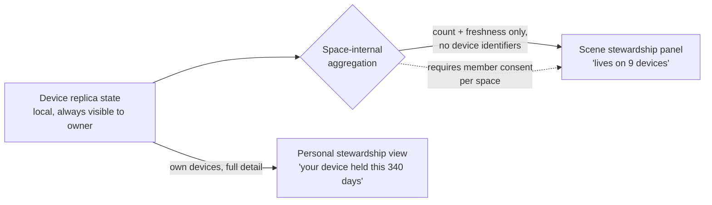

# Stewardship Legibility — Consent-Gated Replica Visibility

> Follow-up filed by exploration 0352 (The Vibe of xNet). This doc frames the
> problem and constraints; the research and design passes are still to come.

## Problem Statement

Exploration 0352 found that xNet's sync architecture is structurally
reciprocal — devices and hubs hold replicas for the spaces they belong to
(multi-home replication, 0258) — but none of that generosity is *legible*. An
Oink member could see their seeded torrents and the health of the swarm; an
xNet user has no view of "what my device is holding for the scene," "what the
hub is carrying for me," or "what this space is running on."

The vibe doctrine (docs/VIBE.md) wants the loop without the leaderboard:

- **Show stewardship** — "your device has kept this space available for 340
  days"; "this space lives on nine devices, yours is one."
- **Never show standing** — no ranks, no ratios, no streaks. Enforced by the
  `ratio scorekeeping` rule in `scripts/check-humane-patterns.mjs`.

## Why this needs its own exploration (the consent problem)

Showing "this space lives on 9 devices" reveals **replica topology** —
information about *other members'* devices and availability patterns. That
collides with three standing rules:

1. **Charter §Consent** — nothing leaves without permission; telemetry is
   off-by-default, bucketed, and scrubbed.
2. **Trust-by-provenance** (`packages/trust/src/index.ts`) — "sync is not
   consent"; receiving data from a peer does not authorize inferences about
   the peer.
3. **Presence precedent** — `PresenceSummarySchema` is already
   seed-excluded infrastructure; presence surfaces were designed ambient and
   peripheral (0232), not enumerable.

A stewardship surface must therefore answer: who may see the topology of a
space's replicas, at what granularity, and with what consent gate?

## Candidate shape (to be validated, not yet decided)

- **Personal view first**: what *my* devices hold, for which spaces, since
  when. Zero consent problem — it is the user's own data about their own
  hardware. Likely shippable alone.
- **Scene view second**: aggregate counts with no device or member
  identifiers ("9 devices, freshest sync 2 minutes ago"), gated on a
  space-level setting that defaults off, consistent with charter §Consent.
- **Never**: per-member holding lists, uptime rankings, contribution
  percentages — that is the ratio economy rebuilt, and the humane-patterns
  gate exists to stop it.

## Key questions for the research pass

- What replica/high-water state already exists client-side (0258 replication
  manifest, offline queue, hub sync state) that a personal view could render
  with **no new wire data at all**?
- Does the hub already know per-space device counts, and is exposing an
  aggregate a new disclosure or a restatement of what members necessarily
  see via presence?
- Where does the surface live — the share dialog (0290), the space settings,
  the status bar, or a quiet corner glyph (0273)?
- Wording: "held/kept available" (care) vs "contributed/served" (work).
  The vibe doc wants thank-you, not debt.

## Implementation Checklist

- [ ] Research pass: inventory existing replica/high-water state on client
      and hub; map what a personal stewardship view can show with zero new
      disclosures
- [ ] Design the consent gate for any cross-member aggregate (space-level,
      default off, charter §Consent language)
- [ ] Ship the personal stewardship view (own devices × spaces × since-when)
- [ ] Decide on and (if approved) ship the scene aggregate view behind the
      consent gate
- [ ] Extend charter §Consent or VIBE.md with the receipt once shipped

## Validation Checklist

- [ ] Personal view renders entirely from local state (verified: no new
      network reads)
- [ ] Scene aggregate is invisible until a space opts in; opting out removes
      it for all members
- [ ] `check-humane-patterns.mjs` still passes — no ratio/rank identifiers
      appear in the new surfaces
- [ ] Copy review against docs/VIBE.md: stewardship phrasing, no standing

## References

- Exploration 0352 (The Vibe of xNet) — the originating finding and the
  "legible, never scored" rule
- Exploration 0258 (multi-home sync) — replication manifest, Space as
  replication unit
- docs/VIBE.md, docs/CHARTER.md §Consent, `packages/trust/src/index.ts`
