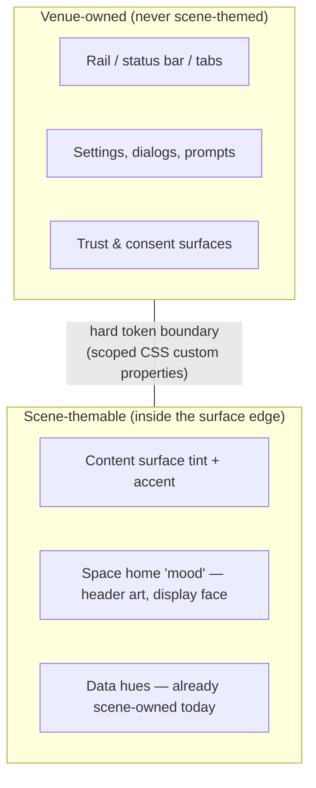

# Scene-Scoped Theming — With Venue-Owned Chrome

> Follow-up filed by exploration 0352 (The Vibe of xNet). This doc frames the
> problem and constraints; the research and design passes are still to come.

## Problem Statement

The vibe doctrine (docs/VIBE.md): *the platform may not have a vibe monopoly;
vibe belongs to the scene.* Oink's Pink Palace was pink because its people
made it pink. Today an xNet Space can set a name, an icon, and a `color`
preset — it cannot make itself *feel* like its own place. Two scenes render
identically except for a dot of hue.

The goal: let a scene paint its own palace — surface tint, accent, perhaps a
display face and a home-page mood — while the venue (app chrome) stays
calm, legible, and un-hijackable.

## The hard rule this exploration must formalize

0352 proposed the boundary: **scene theming ends at the surface edge; chrome
tokens are never scene-overridable.** A loud scene must not be able to make
the rail, status bar, settings, notifications, or any trust/consent surface
loud — those belong to the venue, because calm and legibility there are
charter commitments (§Calm) and security properties (a scene must never be
able to restyle a permission prompt).

## Constraints inherited from prior work

- **Token discipline (0166)**: one APCA-tuned ramp per mode; contrast floors
  are non-negotiable. Scene themes must be *derived* (e.g. from one or two
  scene-chosen seeds, run through the same APCA machinery), not free-form
  CSS — otherwise every scene ships its own accessibility bugs.
- **0299 gotcha**: `:root` var() aliases don't re-resolve in scopes — scoped
  overrides need real values at the scope boundary, not alias chains.
- **Variant precedent (0232)**: `[data-variant='cozy']` shows the mechanism —
  a data attribute scoping a token block. A scene theme is plausibly
  `[data-scene-theme]` on the surface container with a generated token block.
- **Trust model**: theme data syncs with the space; per trust-by-provenance,
  synced presentation must not carry executable style (no arbitrary CSS
  strings across the wire — a theme is *parameters*, validated on receipt).
- **0223 scar**: performative UI was reverted once already. Scene theming is
  user-authored atmosphere, not platform-authored decoration — keep it that
  way.

## Key questions for the research pass

- Theme parameter set: how few knobs give a scene a real identity?
  (Hypothesis: surface tint, accent seed, optional display face from a
  vetted list, optional header art/emoji — and nothing else.)
- Where do derived tokens get computed — build-time impossible (themes are
  data), so runtime derivation + caching; what is the perf cost per space
  switch?
- Cross-fade behavior when moving between differently-themed scenes without
  violating the motion laws (0199)?
- Does a scene theme apply in shared/embedded contexts (a frame from scene A
  transcluded in scene B — 0346 frames)? Proposal: the *host* surface wins.
- Accessibility escape hatch: a user-level "always calm" switch that ignores
  scene themes entirely (respecting it is a §Agency commitment).

## Implementation Checklist

- [ ] Research pass: audit tokens.css scoping + 0299 alias gotcha; prototype
      `[data-scene-theme]` derivation through the APCA ramp machinery
- [ ] Define the theme parameter schema (space-level, validated, no raw CSS)
- [ ] Enforce the venue boundary: chrome token names unreachable from scene
      scope (lint or build-time check, sibling of check-motion-vocab)
- [ ] User-level "always calm" override that disables scene themes
- [ ] Ship behind a flag on one surface (space home) before generalizing

## Validation Checklist

- [ ] A maximally loud scene theme cannot alter rail/status/dialog/consent
      styling (automated check)
- [ ] All derived ramps pass the same APCA floors as the stock themes
- [ ] "Always calm" renders every scene in stock tokens
- [ ] Space-switch theme transition obeys the motion vocabulary (no banned
      easings/durations)

## References

- Exploration 0352 (The Vibe of xNet) — doctrine and the venue/scene boundary
- Explorations 0166 (tokens), 0199 (motion), 0232 (cozy variant mechanism),
  0299 (background-plane var() gotcha), 0346 (frames), 0223 (the scar)
- docs/VIBE.md, docs/CHARTER.md §Calm §Agency
