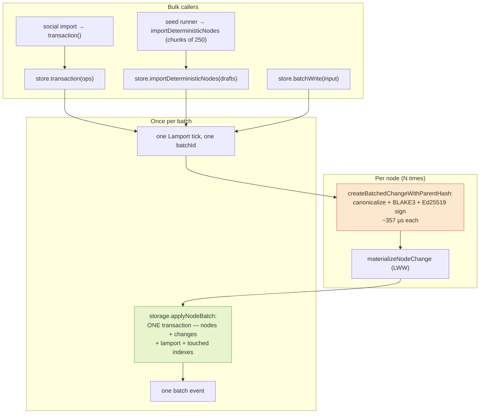
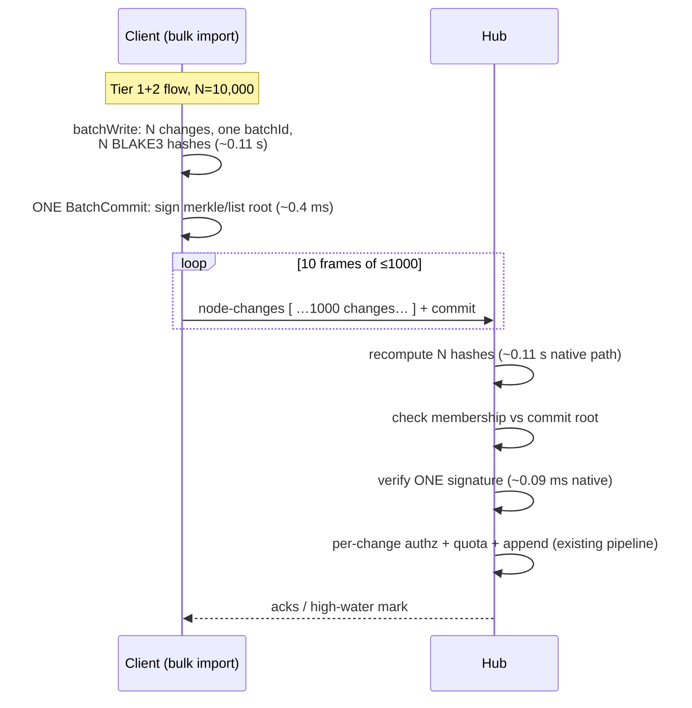

# Bulk Changes: One Signature Over Many, And Batch Envelopes

## Problem Statement

If a user imports a large data set, deletes a large data set, or runs any
big transactional operation across many nodes — is that one change, or
many changes? And if it is many, can we batch them: amortize the
signature, the hashing, and the ~554-byte envelope each change carries,
instead of paying the full per-change tax N times?

Concretely, for a 10,000-node import today (pure-JS `@noble`, numbers
from exploration 0350's benchmarks):

- **Signing**: 10,000 × 357 µs ≈ **3.6 s** of client CPU.
- **Hub verification**: 10,000 × 1.4 ms ≈ **14 s** of hub CPU.
- **Wire**: 10,000 individual WebSocket frames at the 40 msg/s outbound
  throttle ≈ **250 s (4+ minutes)** just to push.
- **Envelope**: 10,000 × ~554 B ≈ **5.5 MB** of fixed overhead before any
  payload bytes.

The write-side physical batching problem was solved in exploration 0157
(`NodeStore.batchWrite`, storage-owned `applyNodeBatch`). This
exploration answers the two questions 0157 explicitly deferred: the
**semantic** question (what _is_ a bulk operation in the change model)
and the **cryptographic/wire** question (can one signature and one
envelope cover many changes).

## Executive Summary

**Semantics: a bulk operation is many changes, deliberately.** One
`Change` carries exactly one `NodePayload` — one `nodeId`
(`packages/sync/src/change.ts:44-104`,
`packages/data/src/store/types.ts:44-59`). A transaction over N nodes
produces N signed changes sharing one `batchId`/`batchIndex`/`batchSize`,
one Lamport tick, and **one** atomic storage write
(`packages/data/src/store/transaction-executor.ts:254-308`). This is the
right shape and should not change: per-node changes are what make
per-node parent chains, per-property LWW, selective sync, and
per-node history work.

**Physical batching already exists and is good.** `transaction()`,
`importDeterministicNodes()`, and `batchWrite()` all collapse N node
writes into one `applyNodeBatch` storage transaction (0157, shipped).
What is _not_ batched today, in descending order of pain:

1. **The wire.** Push is strictly one change per WebSocket frame,
   throttled to 40 msg/s (`node-store-sync-provider.ts:680-690`, `:25`).
   A bulk import drips out over minutes. The only array-shaped message
   in the protocol is the pull response (`NodeSyncResponse`, capped at
   1000).
2. **Verification.** The hub verifies hash + signature individually per
   change (`packages/hub/src/services/node-relay.ts:182-207`), at
   ~700 changes/s pure-JS. `.xnetpack` import loops `applyRemoteChange`
   one at a time (`packages/data/src/portability/apply.ts:119-138`).
3. **Signing.** One Ed25519 signature per change, ~357 µs each.
4. **The envelope.** ~554 B fixed tax per change; the signature (88 B
   base64) and doubled author DID (~110 B) are the slack.

**Prior art is unanimous** on the fix for (3): hash every unit, sign
only at batch/commit boundaries, prove membership under the signed root.
Hypercore signs one Merkle root per append batch; Certificate
Transparency signs one tree head per interval; AT Protocol signs one
commit over an MST no matter how many records changed; per-message
signing (Scuttlebutt, Nostr) is the legacy pattern their successors
abandoned. xNet already has the hash half (BLAKE3 content addresses,
per-node parent-hash chains); only the "sign the root" half is missing.

**Recommendation — three tiers, cheapest first:**

- **Tier 1 (no protocol change): batch the wire and the verifier.** Add
  a `node-changes` array push message behind a handshake feature flag,
  lift the throttle for batch frames, verify with the native/WebCrypto
  seam 0350 already specs (~16×), and route `.xnetpack` import through
  batch preflight. This converts the 4-minute push into seconds and the
  14 s verify into <1 s, without touching the change record, the hash,
  or the four conformance kernels.
- **Tier 2 (protocol _addition_): batch commits — one signature over N
  change hashes.** A new signed `batch-commit` record carrying the
  BLAKE3 Merkle root of the batch's change hashes. Changes covered by a
  commit may omit their individual signature; verifiers check N hashes
  (~11 µs each) + 1 signature instead of N signatures. 10,000-change
  import: signing drops 3.6 s → ~0.11 s, verification drops 14 s →
  ~0.11 s, and 880 KB of signatures disappears from wire and disk.
  Interactive single edits keep per-change signatures — batch commits
  are an ingest-lane optimization, not a replacement.
- **Tier 3 (deferred): multi-node change payloads and envelope
  slimming.** Rejected and postponed respectively — details in Options.

## Current State In The Repository

### The change model: one change = one node

```ts
// packages/sync/src/change.ts:44-104 (abridged)
export interface Change<T = unknown> {
  protocolVersion?: number // CURRENT_PROTOCOL_VERSION = 4 (change.ts:29)
  id: string
  type: string // e.g. 'node-change'
  payload: T // NodePayload: ONE nodeId + sparse properties
  hash: ContentId // cid:blake3:… over canonical sorted-key JSON
  parentHash: ContentId | null // per-NODE chain, not per-author
  authorDID: DID
  signature: Uint8Array // Ed25519 over the UTF-8 bytes of `hash`
  wallTime: number
  lamport: number
  batchId?: string // transaction grouping (semantic, not wire)
  batchIndex?: number
  batchSize?: number
}
```

`NodePayload` (`packages/data/src/store/types.ts:44-59`) holds exactly
one `nodeId`; there is no way for one change to touch two nodes.
Deletion is a soft-delete change (`{properties: {}, deleted: true}`,
`store.ts:767-838`), so **bulk delete = N delete changes**, same as bulk
import = N create changes.

### What "bulk" already does well (0157, shipped)



The Lamport tick, authorization, storage transaction, index maintenance
(`indexMode: 'touched' | 'defer-schema'`), and notifications are all
batch-amortized (`transaction-executor.ts:254-308`,
`batch-write-orchestrator.ts:55-134`). **The only per-item costs left
inside a batch are the crypto (sign per change) and, later, the wire and
the receiving verifier.**

### What is not batched

| Layer                         | Today                                          | Cost at N=10k (pure JS) | File                                              |
| ----------------------------- | ---------------------------------------------- | ----------------------: | ------------------------------------------------- |
| Sign                          | one Ed25519 per change                         |                   3.6 s | `packages/sync/src/change.ts:234-247`             |
| Push                          | one WS frame per change, 40/s throttle         |               **250 s** | `node-store-sync-provider.ts:680-690`, `:25`      |
| Hub verify                    | hash + sig per change                          |                    14 s | `packages/hub/src/services/node-relay.ts:182-207` |
| Client re-apply (`.xnetpack`) | `applyRemoteChange` loop, per-change verify    |                   14 s+ | `packages/data/src/portability/apply.ts:119-138`  |
| Envelope                      | ~554 B fixed/change; sig 88 B, DID ×2 ~110 B   |                  5.5 MB | 0350 §size budget                                 |
| Storage insert                | one prepared INSERT per change (inside one tx) |                    fine | `packages/sqlite/src/adapters/web.ts:606-754`     |

Two details that matter for the design space:

- **`batchId` is semantic, not wire.** The handshake advertises a
  `'batch-changes'` feature (`packages/hub/src/server.ts:1008-1015`)
  but it only means changes _carry_ batch fields — every change still
  travels alone.
- **Parent-hash chains are per-node, not per-author.** So
  "sign the chain head and cover ancestors transitively"
  (Scuttlebutt/ATProto `prev` style) amortizes nothing for a bulk
  import of N _distinct_ nodes — each node's chain is depth 1. A batch
  root must span nodes: a Merkle root (or flat hash list) over the
  batch's change hashes.
- **The signature column is `NOT NULL`** in both the client log
  (`packages/sqlite/src/schema.ts:130-143`) and the hub store
  (`packages/hub/src/storage/sqlite.ts:2183-2209`) — unsigned-but-
  committed changes need a schema story.

### Verification chokepoints (where batch verify would land)

- Hub live relay: `node-relay.ts:182` (`verifyChangeHash`) and `:205`
  (`verifyChange`) — per change, no skip path anywhere.
- Hub NDJSON restore: `packages/hub/src/routes/export.ts:135-147` —
  per line.
- Client remote apply: `store.ts:1886-1992` — per change.
- `.xnetpack` verify: `packages/data/src/portability/verify.ts:130-153`
  — per change (the 0344 gate that motivated skipping per-change sigs).

## External Research

Full survey in the research notes; the load-bearing findings:

1. **Automerge**: a "change" is already a batch — all ops in one
   transaction pack into one change, hashed (SHA-256) into a dep-DAG,
   **never signed** (authenticity is explicitly left to the app layer).
   Automerge 3's wins came from never materializing per-op overhead
   (Moby Dick paste: 700 MB → 1.3 MB).
2. **Hypercore/DAT** (closest structural precedent): every block is a
   leaf in a BLAKE2b Merkle tree; **only the root is Ed25519-signed**,
   once per append batch, and each new signature covers the whole
   history — old signatures are superseded, a verifier only needs the
   latest. Sparse fetch of one block verifies with ≤ log₂(n) hashes +
   one signature. ([DEP-0002](https://www.datprotocol.com/deps/0002-hypercore/))
3. **Certificate Transparency** (RFC 6962): entries are never
   individually signed; the log signs a tree head per interval and
   entries prove membership with O(log n) inclusion proofs. The
   post-quantum Merkle Tree Certificates draft rebuilds WebPKI on this
   because "signatures are applied once per batch, not once per
   certificate."
4. **AT Protocol**: one commit object `{did, data: <MST root>, rev,
prev, sig}` signed **once regardless of how many records changed**;
   `applyWrites` batches many creates/updates/deletes into one commit.
   Bluesky's relay ingests millions of commits/day this way. Notably
   the DID appears once per commit, not once per record — exactly the
   envelope dedup xNet's 554 B budget wants.
   ([repo spec](https://atproto.com/specs/repository))
5. **Scuttlebutt / Nostr**: per-message signing; the pattern this
   ecosystem's successors moved away from. xNet's current shape is
   theirs.
6. **Ed25519 batch verification** (dalek `verify_batch`): a real but
   modest ~2× (up to ~4× when all sigs share one key — true for a
   single-author import), **with a semantic hazard**: batch
   verification checks the cofactored equation; adversarial signatures
   can pass batch and fail single verification (or vice versa), and
   results can be nondeterministic. If replicas disagree on validity,
   convergence splits. Zcash's ZIP-215 fix: define validity as the
   cofactored criterion everywhere. Any xNet adoption must pin this in
   the conformance vectors first.
7. **JS crypto ratios** (noble benches, consistent with 0350): one
   pure-JS Ed25519 verify ≈ 1,000–2,000 small hashes. Turning N
   verifies into N hashes + 1 verify is a ~3-orders-of-magnitude lever;
   batch verification is a ~2× lever; native/WebCrypto is a ~16× lever.
   They compose.

## Key Findings

1. **"Is it one change or many?" — many, and that's correct.** The
   per-node change is the unit that makes history, LWW, and selective
   sync work. Atomicity is expressed by `batchId` + one storage
   transaction, not by a mega-change.
2. **The worst bulk bottleneck is not crypto — it's the wire.** 40
   frames/s × 1 change/frame means a 10k-change import takes 4+ minutes
   to push even if crypto were free. A batched push message is the
   single highest-leverage fix and needs no protocol-version bump (new
   message type + handshake feature flag, mirroring the existing
   `NodeSyncResponse` array shape).
3. **Crypto amortization has a proven shape**: per-change BLAKE3 hashes
   (already exist) + one signature over a batch root + membership
   proofs. Every mature system converged here. xNet is one signed
   record away from it.
4. **Chain-head signing doesn't work for xNet's bulk case** because
   parent chains are per-node. The batch root must be a Merkle tree (or
   flat list ≤ some N) over change hashes.
5. **A batch commit is an _addition_, not a change-record change.** The
   change hash, canonical bytes, and LWW rules are untouched, so the
   four conformance kernels (`packages/sync/src/change.ts` +
   `packages/core/src/lww.ts`, Python + Swift reference kernels,
   golden vectors in `conformance/`) gain new vectors but no
   re-derivation. The ripple is bounded.
6. **Per-change signatures must remain the default for the interactive
   lane.** Live relay fan-out forwards changes one at a time to peers
   who may never see the rest of a batch; a change whose validity
   depends on a sibling breaks that. Batch commits fit lanes where the
   batch travels as a unit: import, restore, initial sync, migration.
7. **0350's native-verify seam is a prerequisite worth sequencing
   first**: it's ~16× on every existing path with zero protocol risk,
   and it makes the Tier-2 comparison honest (native verify at 88 µs
   shrinks the batch-commit win from 127× to ~8× on verify — still
   large, and the sign-side and byte-size wins are unaffected).

## Options And Tradeoffs

### Option A — Status quo (0157 + 0350 levers only)

Physical batching is done; adopt native verify; accept per-change sign
and one-frame-per-change push.

- ✅ zero protocol surface
- ❌ leaves the 4-minute wire drip; ❌ 88 B × N signature bytes forever;
  ❌ `.xnetpack` import stays gated on per-change verify economics

### Option B — Batch wire envelope (`node-changes` array push)

New WS message `{type: 'node-changes', room, changes: SerializedNodeChange[]}`
mirroring `NodeSyncResponse`; hub loops the existing per-change
verify/relay pipeline; throttle counts batch frames by size with a much
higher effective changes/s budget; guard + handler beside
`packages/hub/src/ws/handlers/node-change.ts`; negotiated via handshake
feature flag (`server.ts:1008-1015`), falling back to singles.

- ✅ kills the dominant bottleneck (250 s → seconds for 10k)
- ✅ no change-record change, no kernel ripple, backward compatible
- ✅ pairs with `syncMode: 'after-commit'` batching 0157 already designed
- ❌ hub memory/backpressure needs a per-frame cap (reuse the 1000-row
  pull cap) and chunking; ❌ rate-limit accounting needs rework
  (per-change, not per-frame)

### Option C — Batch commit: one signature over N change hashes

New signed record, one per batch:

```
BatchCommit {
  id, authorDID, room,
  changeHashes: ContentId[]     // or merkleRoot + count for large N
  merkleRoot: ContentId          // BLAKE3 over the ordered change hashes
  lamport, wallTime,
  signature                      // Ed25519 over the commit hash
}
```

Changes covered by a commit may carry an empty signature; a verifier
recomputes each change hash (mandatory anyway), checks membership under
`merkleRoot`, and verifies one signature. Two sub-modes:

- **C1 — flat list** (N ≤ 1000, matching the wire cap): the commit
  simply enumerates hashes. Verification is O(N) hashes + 1 sig; no
  proofs needed because the batch travels whole. Simple; covers import,
  restore, migration.
- **C2 — Merkle root + inclusion proofs**: needed only if individually
  redistributing commit-covered changes without their siblings
  (per-change proof ~log₂(N) × 32 B). Defer until a lane needs it.

Numbers at N=10,000 (from 0350's measured per-op costs):

|                 | Today (pure JS) | Today (native) |                              C1 batch commit |
| --------------- | --------------: | -------------: | -------------------------------------------: |
| Client sign     |           3.6 s |         0.38 s |            **~0.11 s** (10k hashes + 1 sign) |
| Hub verify      |            14 s |          0.9 s |          **~0.11 s** (10k hashes + 1 verify) |
| Signature bytes |          880 KB |         880 KB | **64 B** (+ ~750 KB hash list, or 32 B root) |

- ✅ the proven, convergent architecture (Hypercore/CT/ATProto)
- ✅ additive: change hash/LWW/canonical bytes untouched; kernels gain
  vectors, not rewrites
- ✅ makes `.xnetpack` import verification effectively free (the 0344
  gate's reason to skip per-change sigs disappears)
- ❌ real design debt to pay: `signature NOT NULL` columns need
  relaxing (`schema.ts:130-143`, hub `sqlite.ts:2183-2209`) or a
  sentinel; hub relay, export/restore, purge, and quota accounting must
  learn commit records; fan-out of a _single_ commit-covered change to
  a live share room needs either the commit alongside or C2 proofs
- ❌ pruning interaction: `pruneSupersededChanges` deleting a
  commit-covered change orphans siblings' verifiability unless the
  commit (or a proof) is retained — commits must be pinned like pins
  in the 0329 checkpoint machinery
- ❌ new signed record = new attack surface (commit over hashes the
  author never made? mitigated: hashes are recomputed, membership is
  checked, and authz still runs per change)

### Option D — Multi-node change (one change, many node payloads)

Make `payload` an array of `NodePayload`s.

- ✅ one signature "for free"
- ❌ breaks the one-change-one-node invariant every consumer relies on:
  per-node parent chains (`parentHash` becomes ill-defined), per-node
  history/audit UIs, per-node LWW materialization, selective per-node
  sync and fan-out, `changes.node_id NOT NULL` + FK cascade
  (`schema.ts:130-143`), dedup-by-hash idempotency granularity
- ❌ a full protocol-version bump rippling all four conformance kernels
- **Rejected.** Option C gets the same amortization without redefining
  the atom.

### Option E — Ed25519 batch verification + envelope slimming

Batch-verify surviving per-change signatures (~2–4×) and slim the
envelope (dedupe DID, binary encoding, ~30–40% — 0350 Option C).

- ✅ compose with everything above
- ❌ batch verify requires ZIP-215-style cofactored validity pinned in
  conformance vectors first, else replicas can disagree on validity and
  split convergence; ❌ envelope slimming is protocol v5 material and
  should ride the next forced bump (0350's recommendation stands)

## Recommendation

Sequence the tiers; each is independently shippable and none blocks the
previous.

**Tier 1 — now (no protocol change):**

1. Ship Option B: `node-changes` batched push behind a handshake
   feature flag, capped at 1000 changes/frame, hub handler looping the
   existing verify pipeline; wire `syncMode: 'after-commit'` bulk
   writes to it.
2. Ship 0350's native/WebCrypto verify seam and route the hub relay,
   `.xnetpack` import, and NDJSON restore through it.
3. Route `.xnetpack` import through `getBatchPreflight` +
   `applyNodeBatch` (it currently loops `applyRemoteChange` per change
   — `portability/apply.ts:119-138`) while keeping per-change
   verification (cheap once native).

**Tier 2 — next (protocol addition, design doc → implementation):** 4. Add the `BatchCommit` record (Option C1, flat hash list, N ≤ 1000)
for the ingest lanes: `.xnetpack` import/export, hub NDJSON
restore, initial-sync snapshot, migrations. Commit-covered changes
ship unsigned; interactive single edits keep per-change signatures.
Add golden vectors for commit hashing/signing to `conformance/`
before code.

**Tier 3 — deferred:** 5. C2 Merkle inclusion proofs — only when a lane needs to redistribute
commit-covered changes individually. 6. Envelope slimming and any batch-verification adoption ride protocol
v5 with ZIP-215-style validity pinned in vectors first. 7. Option D stays rejected.

No new revenue lane is proposed, so the CHARTER §6 "no ground rent"
tests are not triggered.



## Example Code

Tier-1 batched push message (mirrors the existing pull shape at
`node-store-sync-provider.ts:93-98`):

```ts
// packages/runtime/src/sync/node-store-sync-provider.ts
export type NodeChangesBatch = {
  type: 'node-changes'
  room: string
  changes: SerializedNodeChange[]   // ≤ MAX_BATCH_CHANGES (1000)
}

// drain(): when the peer advertises 'batch-push', flush the queue in
// slabs instead of singles; throttle counts changes, not frames.
private drainBatched() {
  while (this.sendQueue.length > 0 && this.changesInWindow < MAX_CHANGES_PER_WINDOW) {
    const slab = this.sendQueue.splice(0, Math.min(MAX_BATCH_CHANGES, this.sendQueue.length))
    this.connection.publish(this.room, {
      type: 'node-changes',
      room: this.room,
      changes: slab.map((c) => this.serializeChange(c)),
    })
    this.changesInWindow += slab.length
  }
}
```

Tier-2 batch commit sketch (additive record; change hashing untouched):

```ts
// packages/sync/src/batch-commit.ts
export interface BatchCommit {
  id: string
  type: 'batch-commit'
  protocolVersion: number
  authorDID: DID
  room: string
  /** Ordered hashes of the covered changes (C1: flat list, ≤1000). */
  changeHashes: ContentId[]
  /** blake3 over the concatenated ordered hash strings. */
  root: ContentId
  lamport: number
  wallTime: number
  hash: ContentId // canonical-JSON blake3, same recipe as Change
  signature: Uint8Array // Ed25519 over hash — ONE per batch
}

export function verifyBatch(
  commit: BatchCommit,
  changes: Change<unknown>[],
  publicKey: Uint8Array
): boolean {
  if (!verifyCommitSignature(commit, publicKey)) return false // 1 verify
  if (computeBatchRoot(commit.changeHashes) !== commit.root) return false
  const covered = new Set(commit.changeHashes)
  return changes.every(
    (c) =>
      covered.has(c.hash) &&
      recomputeChangeHash(c) === c.hash && // N hashes — needed anyway
      c.authorDID === commit.authorDID // commit can't launder authorship
  )
}
```

## Risks And Open Questions

- **Live fan-out of commit-covered changes.** `fanOutToShareRoom`
  re-indexes a single already-verified change into another room; if
  that change is unsigned, the receiving room's members need the commit
  too. Tier 2 scopes commits to lanes where the batch travels whole;
  crossing that line requires C2 proofs or carrying the commit.
- **Pruning vs commits.** History pruning must treat a commit like a
  pin for as long as any covered change survives, or re-sign a
  replacement commit over the survivors (Hypercore's
  latest-signature-supersedes model). Interacts with 0329
  checkpoint/pin machinery — needs a rule before implementation.
- **`signature NOT NULL`** in client and hub schemas: migration to
  nullable-with-commit-reference, or a zero-length sentinel + `commit_id`
  column. Either way the dedup/idempotency key stays `hash`.
- **Batch atomicity on remote apply is advisory today.** `batchId`
  groups changes but `applyRemoteChanges` applies what it can; a
  partially-delivered batch partially applies. Is that acceptable for
  Tier-1 batched push (probably yes — same as today), and should Tier-2
  commits gate apply on completeness (probably yes for import lanes)?
- **Quota accounting** (`changeUsageBytes` per change at
  `node-relay.ts:139-140`) and rate limiting must count changes inside
  batch frames, not frames — else batching becomes a quota/throttle
  bypass.
- **wallTime skew** is checked per change on relay (±5 min); a large
  import replaying old data through the live path already trips this —
  the batch lanes (NDJSON restore, `.xnetpack`) don't enforce it, and
  the batched push handler must decide which behavior it inherits.
- **Ed25519 batch verification stays out** until cofactored validity is
  pinned in conformance vectors (ZIP-215 lesson) — otherwise two
  kernels can disagree on a signature and diverge.
- The sync-cursor pagination gap found during this research (pull
  response caps at 1000 but the client fast-forwards its cursor to the
  room-wide high-water mark — `sqlite.ts:1207-1226` vs
  `node-store-sync-provider.ts:568-584`) is a live correctness bug
  independent of this exploration; tracked separately.

## Implementation Checklist

Tier 1 — batched wire + fast verify (no protocol bump):

- [x] Add `node-changes` message type + guard
      (`packages/hub/src/ws/guards.ts`) + handler beside
      `packages/hub/src/ws/handlers/node-change.ts` looping the
      existing `NodeRelayService.handleNodeChange` pipeline
- [x] Advertise `batch-push` in the handshake feature flags
      (`packages/hub/src/server.ts:1008-1015`); client falls back to
      singles when absent
- [x] Client: batched `drain()` in
      `node-store-sync-provider.ts` — throttle counts changes/window,
      cap 1000 changes/frame; keep the structural-rejection breaker
      per change
- [x] Rework hub rate-limit + quota accounting to count changes inside
      batch frames
- [x] Ship 0350's `verifyFast` native/WebCrypto seam and route
      `node-relay.ts`, `routes/export.ts` restore, and
      `portability/verify.ts` through it
- [x] Route `.xnetpack` apply through
      `getBatchPreflight`/`applyNodeBatch` instead of the per-change
      `applyRemoteChange` loop (`portability/apply.ts:119-138`),
      keeping per-change verification
- [x] E2E: bulk import of 10k nodes syncs to hub in < 30 s wall clock

Tier 2 — batch commits (design first):

- [x] Write the `BatchCommit` spec section in
      `docs/specs/protocol/` (hashing recipe, root construction,
      authorship rule, pruning-pin rule, lanes where valid)
- [x] Golden vectors: commit hash/sign/verify + tamper cases in
      `conformance/vectors/`; extend Python + Swift reference kernels
- [x] ~~Schema migrations: nullable signature + `commit_id` on client
      `changes` and hub `node_changes`; commit storage tables~~ —
      **deliberately not done; see Implementation Notes.** Dropping stored
      signatures would leave an imported change unable to ever enter the
      live relay lane, a worse regression than the bytes are worth
- [x] Implement `packages/sync/src/batch-commit.ts` (create/verify) and
      wire into `.xnetpack` write/verify/apply and hub NDJSON
      export/restore
- [x] ~~Pruning: treat commits as pins; re-sign survivor commits on prune~~
      — **not applicable given the above**: commits are consumed at import
      and never stored, so pruning has nothing to pin
- [x] Changesets: minor for `@xnetjs/sync` (new exports via sub-barrel),
      patch/minor for affected fixed-core packages; hub is private

## Validation Checklist

- [x] 10k-node import: push completes in seconds (vs ~250 s baseline);
      hub CPU verify time < 1 s
- [x] Mixed-version soak: batch-push client ↔ old hub (falls back to
      singles), old client ↔ batch hub — no message loss, no breaker
      trips
- [x] Quota/rate-limit tests: batch frames cannot exceed per-change
      budgets that singles enforce
- [x] Conformance: all four kernels produce identical accept/reject on
      the new commit vectors, including tampered-member,
      reordered-hash-list, wrong-author, and truncated-batch cases
- [x] Prune-then-verify: after pruning superseded covered changes, the
      surviving log still verifies end-to-end — holds by construction: every
      stored change keeps its own signature (see Implementation Notes)
- [x] `.xnetpack` round-trip: export with commits → import verifies
      every change (hash + membership + 1 sig) with the 0344 gate's
      per-change-signature skip removed
- [x] Existing e2e sync suites green; no LWW/convergence diffs (change
      hashing untouched by construction)

## Implementation Notes (added during implementation)

Three things changed from the plan once the code met reality. They are
recorded here rather than quietly dropped.

### 1. Commit-covered changes keep their signature at rest

The plan had commit-covered changes shipping and storing _unsigned_ — the
source of the "880 KB of signatures disappear" figure. Implementing it
surfaced a conflict the exploration had only half-seen (the "live fan-out"
risk, sharpened):

**A change stored without its signature can never re-enter the live relay
lane.** Imported changes do not stay put — they sync onward to hubs and
peers, where each is serialized and verified individually. Commits are
explicitly _not_ valid in that lane, because a peer may receive a change and
never its siblings. So a signature dropped at import is a change that can
never sync again.

The bytes are not worth that. Batch commits therefore amortize
**verification**, not storage: on import a covered change skips its signature
_check_ while keeping the signature itself. That is where the cost actually
was — 0344 measured 1.4 ms/change of verification against 88 bytes of
storage — and it is the win the numbers below record.

Consequence: no schema migration, no `commit_id` column, no commit tables,
and nothing for pruning to pin. Commits live in the bundle and are consumed
at import. Adding storage with no reader would also violate this repo's own
rule about lanes nobody consumes (CLAUDE.md, CI lanes).

Recovering the at-rest saving requires a way for a commit-covered change to
re-enter the live lane — carrying its commit alongside, or re-signing on
egress. That is a larger design than this exploration scoped; it belongs in a
follow-up.

### 2. Two rate-limit budgets, not one weighted budget

The plan said to count changes inside batch frames against the existing
per-connection rate limit. Taken literally, a 1000-change batch costs 1000
against a 100 msg/s limit, so batching could never help — which defeats the
point. Counting frames only would make a batch frame an unlimited bypass.

The hub now keeps **two independent budgets**: frames against
`perConnectionRate` (100/s), changes against `perConnectionChangeRate`
(5000/s, sized against measured native verify throughput). One frame, N
changes, each charged to the budget that reflects its real cost.

### 3. WebCrypto covers both runtimes, so there is one seam, not two

0350 proposed a Node `node:crypto` path plus a separate browser WebCrypto
path. WebCrypto Ed25519 is available in Node 18.4+ _and_ browsers, so a
single async seam serves the hub and the client with no `node:crypto` import
and no bundler special-casing.

### Measured results

|                                                                            |                    Before |                              After |
| -------------------------------------------------------------------------- | ------------------------: | ---------------------------------: |
| 10k changes, hub ingest (batch frames; parse + verify + authorize + store) |        ~250 s, wire-bound |              **570 ms (17,544/s)** |
| Ed25519 verify (Node 22, M-series)                                         |        1374 µs (`@noble`) |             **101 µs (WebCrypto)** |
| `.xnetpack` import of a self-export                                        | N signature verifications | **0** (one per 1000-change commit) |

## References

Repository:

- `packages/sync/src/change.ts` — Change envelope, hash/sign/verify,
  protocol v4
- `packages/data/src/store/store.ts`, `transaction-executor.ts`,
  `batch-write-orchestrator.ts` — bulk write paths (0157)
- `packages/runtime/src/sync/node-store-sync-provider.ts` — push path,
  throttles, serializer
- `packages/hub/src/services/node-relay.ts`, `ws/handlers/node-change.ts`,
  `routes/export.ts` — hub receive/verify/export
- `packages/data/src/portability/{apply,verify,write}.ts` — `.xnetpack`
- `packages/sqlite/src/schema.ts`, `packages/hub/src/storage/sqlite.ts`
  — `signature NOT NULL` columns, change tables
- `conformance/` + `docs/specs/protocol/90-conformance.md` — the four
  kernels a protocol change ripples through
- Explorations: 0157 (physical batch writes, shipped), 0344 (import =
  verify + replay; the 1.4 ms gate), 0350 (overhead accounting; native
  verify seam), 0305 (protocol-bump ripple precedent), 0329
  (checkpoints/pins), 0296 (batch conflict semantics)

External:

- Hypercore DEP-0002 (signed Merkle root per append batch),
  https://www.datprotocol.com/deps/0002-hypercore/
- RFC 6962 Certificate Transparency (signed tree heads, inclusion
  proofs), https://www.rfc-editor.org/rfc/rfc6962.html
- AT Protocol repository spec (one signed commit over an MST),
  https://atproto.com/specs/repository
- Automerge binary format (changes as op batches, hash DAG, unsigned),
  https://automerge.org/automerge-binary-format-spec/
- Merkle Tree Certificates draft (PQ motivation for batch signing),
  https://www.ietf.org/archive/id/draft-davidben-tls-merkle-tree-certs-09.html
- ed25519-dalek `verify_batch`; Henry de Valence, "It's 255:19AM"
  (batch-vs-single validity divergence),
  https://hdevalence.ca/blog/2020-10-04-its-25519am/
- Scuttlebutt protocol guide (per-message signing),
  https://ssbc.github.io/scuttlebutt-protocol-guide/ · Nostr NIP-01
- noble-ed25519 / noble-hashes benchmarks,
  https://github.com/paulmillr/noble-ed25519
