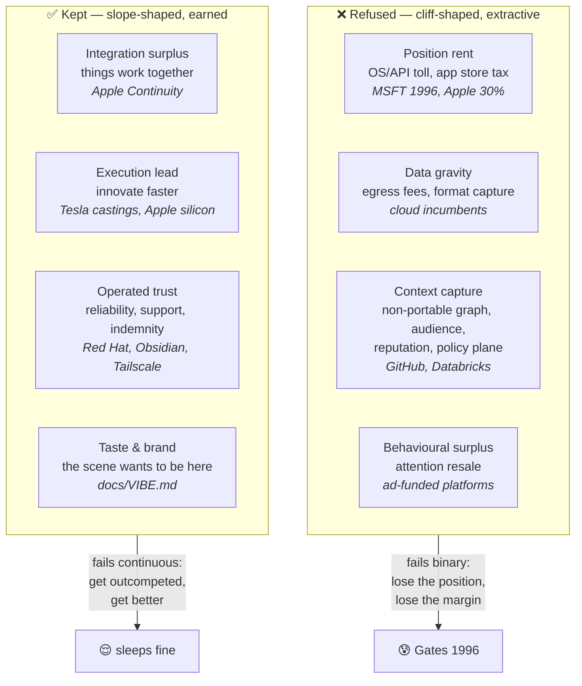
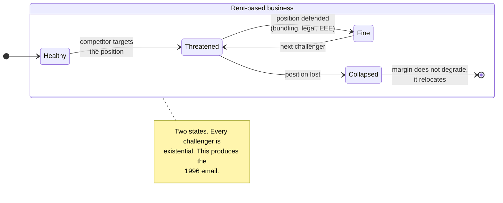
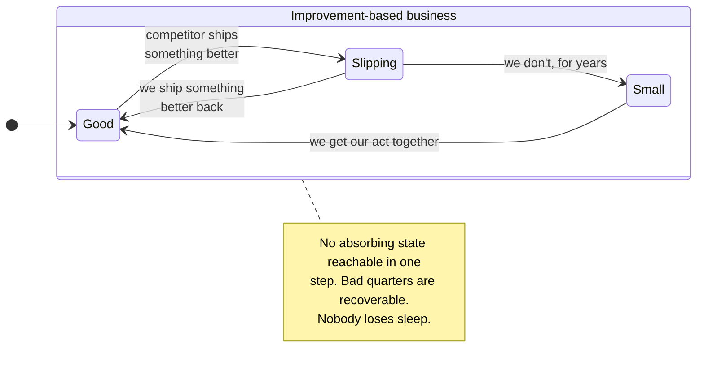
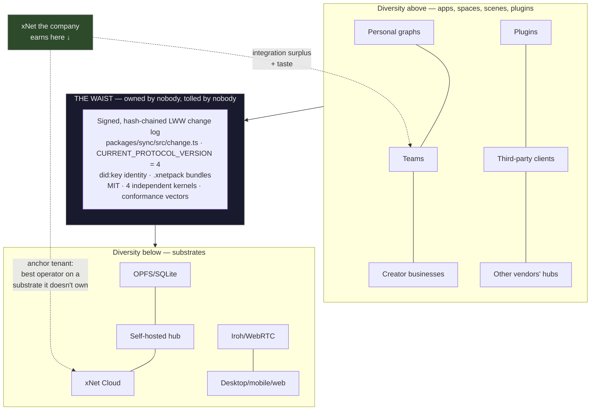
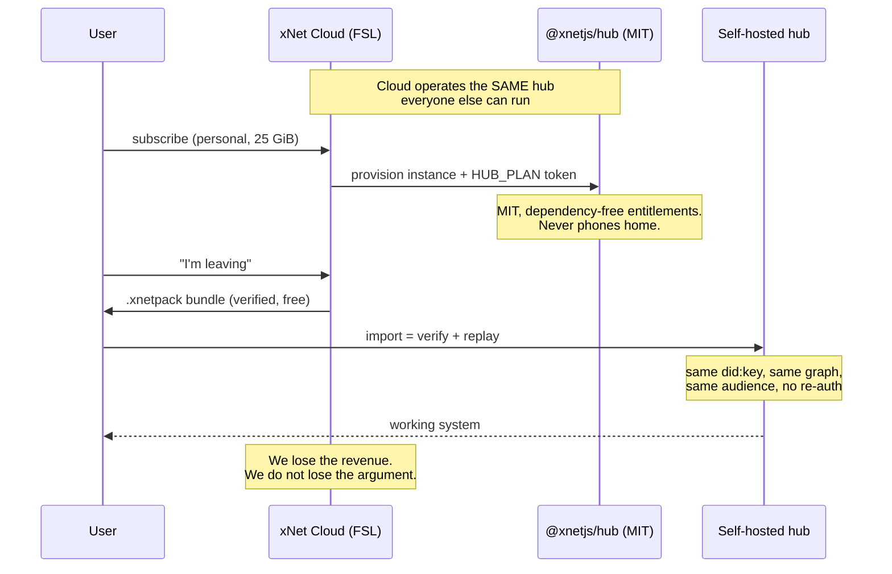

# Value Capture Without Enclosure — Moats, Substrates, And The Sleep Test

> _"I am literally losing sleep over this issue."_
> — Bill Gates to Nathan Myhrvold, cc Aaron Contorer, 30 September 1996, 9:36 PM,
> subject line **"Java runtime becomes the operating system"**
> ([Internal Tech Emails](https://www.techemails.com/p/bill-gates-im-literally-losing-sleep-over-java))

## Problem Statement

xNet is deliberately dismantling the moats that normally make a software
business defensible. The Charter's §6 "No ground rent" clause
([`docs/CHARTER.md:125`](../CHARTER.md)) refuses seven of them by name: take
rate, egress fees, identity ransom, protocol tolls, behavioural surplus, a
global chokepoint tier, and a weaponisable trademark. Exit is not merely
permitted, it is engineered — `.xnetpack` bundles
([`packages/data/src/portability/`](../../packages/data/src/portability/))
make leaving a verified, first-class operation.

That raises two questions, one commercial and one personal, and they turn out
to be the same question wearing different clothes:

1. **Commercial.** If we refuse lock-in, data gravity, and switching costs,
   what is left to capture? Is there a defensible position, or are we choosing
   a commodity margin and calling it ethics?
2. **Personal.** The Gates email is a snapshot of a man in a fortress
   discovering that fortresses have windows. That fear is not incidental to
   monopoly capitalism — it is _produced_ by it. What structural properties
   would let xNet's operators never feel it?

There is also a gap worth naming: the founding local-first manifesto
([Kleppmann et al., Ink & Switch, 2019](https://www.inkandswitch.com/essay/local-first/))
sets out seven ideals for user ownership and **contains essentially no
discussion of business models** — it never addresses how a provider sustains
itself when users can leave costlessly. This exploration is an attempt to fill
that hole for xNet specifically.

## Executive Summary

**The Gates email is a diagnostic of a position, not a personality.**
Microsoft in 1996 held a _rent_ — a toll on the Windows API position — and
rents are **binary**: you hold the position or you don't. A Java runtime that
became the de facto OS would not have shaved Microsoft's margin, it would have
**relocated** it. That is why it cost him sleep. Improvement-based margins
behave differently: they are **continuous**. A better competitor takes some
share; you get better and take some back.

> **Rent is a cliff. Improvement is a slope. You only lose sleep on cliffs.**

Shapiro and Varian give this an equation. _Information Rules_ (1998), ch. 5:
"the profits a supplier can expect to earn from a customer are equal to the
total switching costs… plus the value of other competitive advantages." Read
the inverse and you have xNet's wager in the incumbents' own textbook:

> **Enterprise value ≈ total switching costs + genuine advantage. Refusing
> lock-in means deleting the first term and being valued on the second alone.**

That is falsifiable, and it comes with a test: _how much would our valuation
fall if switching became free tomorrow?_ For xNet the answer must be
"nothing, because it already is."

Four findings from the research were not obvious going in, and three of them
**correct** positions held at the start:

- **The relicensing cascade does not support the openness thesis.** I expected
  Mongo/Elastic/HashiCorp/Redis to show that restricting a licence backfires.
  It mostly didn't. Elastic grew ~2.4× in the four years after SSPL ($608.5M
  FY21 → $1.483B FY25); MongoDB ~7.5× after SSPL ($267M FY19 → $2.01B FY25).
  The one clear loss was **Redis**, and it lost because it was _substitutable_
  — same wire protocol, drop-in replacement, no operational gravity. **The
  variable is substitution cost, not licence text.** A licence cannot
  manufacture switching cost a product doesn't have.
- **Removing switching costs by decree does not durably remove them.** US
  wireless number portability (Nov 2003) moved industry churn from **2.43% to
  2.55% monthly — twelve basis points** — and churn then _declined_. Actual
  switchers: **7.8M against 30M predicted, a 74% shortfall**. Carriers rebuilt
  the lock-in within a product cycle via handset subsidies and contracts. The
  EU's DMA is running the same experiment now: after two years of mandated
  browser choice screens, **Safari's European _mobile_ share is higher than
  before (29.34% → 30.34%)**, and the Commission's own 2026 review cites
  vendor press releases because it has no independent share evidence.
  **Moats regrow. Credible exit is a standing commitment, not a shipped
  feature.**
- **Tesla ran both strategies and the contrast is decisive.** The 2014 patent
  pledge was _conditional_ — its "good faith" clause voids protection if you
  or any affiliate ever assert an EV-related patent against anyone, or
  challenge a Tesla patent. The only empirical study
  ([Wang, Cambridge WP 2532, 2025](https://www.econ.cam.ac.uk/publications/cwpe/2532))
  finds **no significant effect on the extensive margin of follow-on
  innovation**, and attributes the null result specifically to that condition.
  NACS was _unconditional_ — and Ford, GM and Rivian adopted within **27 days
  of each other**, seventeen automakers inside nine months, SAE standardising
  it in six. Same company, same "gift" framing. **Conditions destroy pledges;
  unconditional specs plus owned operations win.**
- **Tailscale has already run xNet's hardest experiment.** Headscale is an
  independent open-source reimplementation of Tailscale's _proprietary_
  control plane — the one thing they kept. Their own words: "Tailscale employs
  the head maintainer of Headscale, but does not direct or steer the project."
  The incumbent funds its own replacement and declines to steer it.

**Recommendation.** Adopt **"open substrate, operated trust, anchor tenancy"**
— already latent across 0336/0349/0351 — and make it explicit and testable:

1. Write **`docs/ECONOMICS.md`** as the third doctrine doc. CHARTER is what we
   refuse; VIBE is what we cultivate; ECONOMICS is **how we get paid, why that
   is stable, and what it costs us**.
2. Add a fourth Charter test — the **Sleep test**: _if a well-funded competitor
   shipped our entire feature set as open source tomorrow, which revenue lines
   survive?_
3. Publish a **Moat Register**, including two refusals the Charter is currently
   silent on: **context capture** and **marketplace ranking self-preferencing**.
4. Pair credible exit with **voice** (Hirschman; Ostrom 3 and 7). Exit alone is
   incomplete and may be corrosive — see Key Finding 8.

## Current State In The Repository

xNet has, unusually, already _built_ most of the anti-moat position. What it
lacks is a statement of what replaces it.

### What is already enforced

| Commitment                                           | Mechanism                                          | Path                                                                                                                   |
| ---------------------------------------------------- | -------------------------------------------------- | ---------------------------------------------------------------------------------------------------------------------- |
| No behavioural surplus                               | CI gate, self-testing, reasoned escape hatch       | [`scripts/check-humane-patterns.mjs`](../../scripts/check-humane-patterns.mjs)                                         |
| MIT core cannot depend on the commercial layer       | CI gate, three assertions                          | [`scripts/check-cloud-boundary.sh`](../../scripts/check-cloud-boundary.sh)                                             |
| Claims cannot outrun shipped defaults                | Ledger test, `assert` \| `enforcedBy` \| `pending` | [`packages/telemetry/test/charter-claims-ledger.test.ts`](../../packages/telemetry/test/charter-claims-ledger.test.ts) |
| Marketplace licences stay source-available-or-better | Allowlist gate                                     | [`scripts/check-plugin-licenses.mjs`](../../scripts/check-plugin-licenses.mjs)                                         |
| Free, verified exit                                  | `.xnetpack` codec + regression suite               | [`packages/data/src/portability/`](../../packages/data/src/portability/)                                               |

The claims ledger is the most important artefact, because it stops the ethics
becoming marketing. A claim declares exactly one backing — `assert`,
`enforcedBy`, or `pending` — "so the honesty-debt cannot be paid down in prose
alone." `commons-no-ground-rent-export` is already an entry.

### The structural anti-moat: the entitlements contract is MIT

[`packages/entitlements/`](../../packages/entitlements/) — the package defining
the _paid plan ladder_ — is **MIT and dependency-free**. Plans travel as an
HMAC-signed `HUB_PLAN` token, so a self-hosted hub **never phones home**.
Exactly one package in 49 is FSL:
[`packages/cloud/`](../../packages/cloud/) (`FSL-1.1-Apache-2.0`, auto-opening
to Apache-2.0 after two years), and `check-cloud-boundary.sh` proves the hub
never imports it.

This is the difference between saying "you can self-host" and being _unable to
degrade self-hosting even if we wanted to_. It is a BATNA guarantee written in
dependency edges rather than prose — and per Red Hat's 2023 reversal below,
prose is exactly what does not hold.

### The pricing ladder as it stands

[`packages/entitlements/src/plans.ts`](../../packages/entitlements/src/plans.ts)
defines seven tiers (`demo` → `enterprise`) pricing **operations**, not bytes:
storage ceiling, hub warmth (`dedicated-sleep` → `region-pinned`), seats, SLA.
AI is separately metered with `includedAiUsd` + `aiMonthlyBudgetUsd` caps —
correctly, since 0336 identifies AI as "the one COGS line local-first does not
collapse."
[`packages/billing/src/connect.ts:11`](../../packages/billing/src/connect.ts)
carries `DEFAULT_MARKETPLACE_FEE_BPS = 1000` (10%), reserved by 0349 for the
_managed marketplace listing service_, while direct creator sales are 0%.

### Three things to be honest about

1. **The flagship refusal is the least shipped.** Of the seven refused rents,
   **one** is `Enforced`, five are `Architectural`, one is policy. "No take
   rate on direct creator sales" is self-labelled **Aspirational** — payments
   have not shipped. 0257 found Commons is "the only [commitment]
   self-labelled `building`."
2. **The framework is post-hoc.** 0351 says so itself: it "changes no plan of
   record; it validates two." Three-path convergence is evidence; it is not
   the same as the framework having generated the decisions.
3. **Small drift.** `CHARTER.md:184` says `CURRENT_PROTOCOL_VERSION = 3`; the
   code says `4`. `docs/LICENSING.md` is recommended by 0345 and does not
   exist. Several published "MIT core" packages — including `@xnetjs/hub`, on
   which the entire BATNA argument rests — carry no `license` field.

## External Research

### A. The fear case, read structurally

The Gates email is famous for the phrase; the interesting part is the
**subject line** — "Java runtime becomes the operating system." He is not
worried about a competitor selling more copies. He is worried the _layer at
which value is captured_ will move up one, and Microsoft's position, not its
products, will evaporate underneath it.

The court found the response unlawful in a specific and instructive way.
Findings of Fact ¶394: Microsoft **"deliberately designed its Java development
tools so that developers choosing portability over performance would
nevertheless unwittingly write Java applications that ran only on Windows."**
Competing hard is legal; **engineering a default that silently defeats the
user's stated intent** is what was sanctioned. That is a useful line for us,
because it is a test we can apply to our own defaults.

> **Provenance caveats — state these rather than asserting.** The techemails
> page gives date, parties and subject but names no case or exhibit number;
> cite it as an internal email of that date from litigation discovery, not a
> numbered exhibit. "Cut off Netscape's air supply" was attributed to Paul
> Maritz by Intel's Steven McGeady and **denied by Maritz under oath** ("I
> never said… or words to that effect"); two Microsoft employees recalled a
> different phrase, "embrace and smother," which Maritz called a parody of the
> company's stated "embrace and extend" policy. No document containing the
> phrase was produced. "Embrace, extend, extinguish" appears to belong to
> DOJ's _Proposed_ Findings — a party brief — not the court's Findings. And
> the widely circulated Gates quote "this scares the hell out of me" about
> Java **could not be verified from any source** and appears to be a
> conflation of the "losing sleep" email. Don't use it.

**The aftermath is the argument.** Microsoft escaped the breakup — core §2
liability affirmed, remedy vacated, the trial judge disqualified for talking
to reporters. It kept the monopoly and lost the decade anyway: **−44% total
shareholder return over Ballmer's tenure** ($1,000 → $767 with dividends
reinvested, against $20,120 in Apple), market cap **$604bn → $269bn**, roughly
**sixteen and a half years** to regain the 1999 share price, and an
**$8.4bn+** write-off in mobile. Revenue roughly tripled across the same
period — which is the point. **The moat kept producing cash while the
franchise it protected became strategically irrelevant.**

The reinvention required repudiating the thing that had been defended:
.NET Core open-sourced under MIT (Nov 2014), first-class Linux on Azure,
the Windows division dissolved (Mar 2018), GitHub acquired, and **60,000
patents pledged royalty-free to the Open Invention Network** (Oct 2018) —
disarming the very patent-licensing campaign that Ballmer's "Linux is a
cancer" framing had underwritten. Nadella's own words at the reversal are the
tell: _"Twenty percent of Azure is already Linux… this is not some new news,
this is, in fact, today true."_ **The market had decided before Microsoft
did.**

Joel Spolsky named the general law in
[Strategy Letter V](https://www.joelonsoftware.com/2002/06/12/strategy-letter-v/)
(2002): "smart companies try to commoditize their products' complements."
Christensen's _conservation of attractive profits_ is the same mechanism from
the other side: when commoditisation kills profit at one stage, it re-emerges
at an adjacent one.

> **Spolsky is not our ally, and we should say so.** Commoditize-your-
> complement presupposes you _hold_ a layer you are protecting; Gwern's gloss
> is "create a desert of profitability around you." A business refusing the
> moat in _every_ layer gets no comfort from it — and worse, **openness is a
> standing invitation to be someone else's complement.** Docker was Google's.
> Redis was AWS's. Sun's Java was IBM's.

### B. The evidence on restricting a licence — which cuts against us

| Company   | Left permissive | Went to       | After                                                             |
| --------- | --------------- | ------------- | ----------------------------------------------------------------- |
| MongoDB   | Oct 2018        | SSPL          | $267M FY19 → **$2.01B FY25** (~7.5×)                              |
| Elastic   | Jan 2021        | SSPL + ELv2   | $608.5M FY21 → **$1.483B FY25** (~2.4×)                           |
| HashiCorp | Aug 2023        | BUSL 1.1      | $476M → $583M; **sold to IBM for $6.4B** vs a >$14B IPO valuation |
| Redis     | Mar 2024        | RSALv2 + SSPL | **Lost decisively to Valkey**                                     |

Elastic returned to AGPLv3 (Aug 2024) and Redis to AGPLv3 (May 2025), but
Elastic's own retrospective does **not** call the relicense a mistake — Shay
Banon writes that "Amazon is fully invested in their fork, the market
confusion has been (mostly) resolved… **The plan worked.**"

**Why Redis lost where MongoDB won.** Redis is a _component_: wire-compatible,
drop-in replaceable, no data gravity, no compliance surface. Valkey — forked
under the Linux Foundation with AWS, Google and Oracle backing — became the
default in-memory cache across Fedora, Ubuntu, Debian and Arch within about
two years. MongoDB Atlas is a managed multi-cloud platform; migrating off it
is a project. Redis had a self-described "1% conversion problem."

**The counterweight, which matters for us.** Grafana went Apache → **AGPLv3**
in 2021 — a large practical restriction — and produced **no fork**, reaching
**$400M+ ARR and a $6B valuation**. Its stated reason is the boundary that
seems to matter: _"it's hard to say you're an open source company when you're
using a license that isn't accepted by OSI."_ **Crossing the OSI line is the
discontinuity; tightening within it is survivable.**

**Where this leaves xNet — the structural point.** The strip-mining failure
mode requires a **centralised service margin** for a hyperscaler to take.
Local-first does not have one: the compute is on the user's device. There is
no "xNet-as-a-service" for AWS to resell at scale — only hub operations, which
are cheap, bounded, and self-hostable by design. **xNet is not exposed to
open-core's characteristic death, because xNet is not open-core.** That is an
asset, and it is currently unargued anywhere in the repo.

### C. Winning with weak or no lock-in

**Bell Labs is the strongest causal evidence in the whole file.** The 1956
consent decree forced royalty-free licensing of **7,820 patents — 1.3% of all
unexpired US patents**. A peer-reviewed causal study
([Watzinger et al., _AEJ: Policy_ 2020](https://economics.yale.edu/sites/default/files/how_antitrust_enforcement.pdf))
finds **follow-on innovation rose 17% in the first five years**, driven mainly
by **young and small companies** — dominant-firm patents were acting as an
entry barrier. But note the honest half: **innovation increased only _outside_
telecoms.** Bell stayed vertically integrated and kept foreclosing its own
market. _Compulsory openness grew the field; it did not discipline the
incumbent where the incumbent actually operated._

**Red Hat — and its reversal.** FY2019: $3.4B revenue, +15%, **88%
subscription**; acquired by IBM for **$34B**. CentOS was bit-identical and
free the whole time. Customers bought accountability: ten-year lifecycles,
[Open Source Assurance](https://www.redhat.com/en/about/open-source-assurance)
IP indemnification, a certification matrix, a throat to choke. None of that is
lock-in — it all stops when you stop paying.

Then it reached for enclosure. CentOS Stream (Dec 2020) cut CentOS Linux 8's
advertised lifetime from 2029 to end-2021, **retroactively**, on people who
had already migrated. In June 2023 RHEL sources moved behind the customer
portal:

> "Simply rebuilding code, without adding value or changing it in any way,
> represents a real threat to open source companies everywhere."
> — [Red Hat, 26 June 2023](https://www.redhat.com/en/blog/red-hats-commitment-open-source-response-gitcentosorg-changes)

That describes as free-riding exactly what Red Hat had sold successfully
alongside those same rebuilders for twenty years. SUSE committed **$10M+** to
fork RHEL, AlmaLinux dropped 1:1 compatibility, and CIQ/Oracle/SUSE founded
**OpenELA**. SUSE's CEO chose the attack word: this "ensures that customers
and community alike are **not subjected to vendor lock-in**." A competitor
using _vendor lock-in_ against **Red Hat** is the reputational cost made
explicit.

**No public number shows revenue damage.** The cost was that Red Hat stopped
being the standing proof that open-source business models don't need
enclosure. **That is the position xNet is applying for, and this is what
losing it looks like.**

**Stripe — the best single artefact.** Stripe documents exporting your
customers' **raw card numbers to a competing processor**:

> "We believe our customers own the sensitive data they entrust to Stripe. We
> make sure that you have access to this data—even if you're moving elsewhere.
> If you decide to leave Stripe for another payment processor, we'll work with
> your new processor's team to securely transfer your credit card data."
> — [docs.stripe.com](https://docs.stripe.com/get-started/data-migrations/pan-export)

Requirements: PCI DSS Level 1, current AoC or Visa Registry listing, PGP key
≥4096 bits on the processor's own domain. **No fee is stated** (the docs are
silent — do not claim "free"). Stored card credentials are the strongest
lock-in a payments company can have. Stripe: $1.9T TPV in 2025 (+34%,
~1.6% of global GDP), $159B valuation Feb 2026.

**Adobe — open the format, keep the layer that won't be free.** PDF went to
ISO 32000-1 in 2008 with a **royalty-free public patent licence** covering all
Essential Claims. The doctrine is usually told as visionary; it wasn't. **Free
Acrobat Reader in 1994 was a commercially forced decision** — the paid reader
"was not flying off the shelves," competitors already gave theirs away, and
Warnock called himself "a little bit of a skeptic." Result: **Document Cloud
grew 18% in FY2024 — faster than Creative Cloud's 10%** — seventeen years
after the format was given to ISO. Adobe's own 10-K describes **"our freemium
Acrobat Reader"** feeding paid Acrobat.

**Ghost — the model 0349 already copies.** MIT since 2013, **0% transaction
fees** vs Substack's 10%, and structurally un-enclosable: a non-profit
foundation where "the company can never be bought or sold." Live dashboard,
18 July 2026: **ARR $10.95M, 30,493 customers, 41+ staff.**

**Wikimedia Enterprise — the pattern most worth stealing.** Content stays
free; **high-volume commercial re-users pay for SLAs, support and structured
access**. FY2024-25 revenue **+148% to $8.3M**, on the explicit principle that
large commercial organisations "pay for their own heavy use of the
infrastructure… so donated money does not subsidize their business
requirements." That is the improvement test, implemented.

**Tailscale — the anchor-tenancy precedent.** BSD-3 client, proprietary
coordination server, and **Headscale** — an independent open-source
reimplementation of that proprietary control plane:

> "Tailscale employs the head maintainer of Headscale, but does not direct or
> steer the project." — [tailscale.com/opensource](https://tailscale.com/opensource)

Their reasoning: ecosystem diversity and resilience are worth more than the
moat. $1.5B valuation, 10,000+ organisations. **The closest existing analogue
to what `packages/cloud` should be to `packages/hub`.**

**Tesla — the same company running both strategies.** The 2014 pledge is a
_standstill_, not a licence: Tesla's own terms say it "is not a waiver of any
patent claims… and is not a license, covenant not to sue, or authorization."
Good faith is void if you or any **related or affiliated company** ever assert
any EV-related patent against anyone, or challenge any Tesla patent — a
licensee-estoppel effect without a licence. The Cambridge study finds it
expanded the _ecosystem's technical similarity_ to Tesla but produced **no
significant increase in new entrants**, attributing that squarely to the
condition.

NACS carried no conditions — and **the spec alone still did nothing.** Tesla
published it on 11 November 2022 and **nothing happened for six months.** The
cascade began only when Supercharger _access_ was bundled with it: Ford
(25 May 2023) → GM (8 Jun) → Rivian (20 Jun), twenty companies by Feb 2024,
nearly all on an identical "adapter 2024, native port 2025" timeline that
twenty firms did not independently derive. **SAE followed the market**,
announcing standardisation on 27 June 2023 — _after_ six automakers and four
charging networks had already signed. Tesla's own Nov 2022 post said the quiet
part out loud: it already had "60% more NACS posts than all the CCS-equipped
networks combined," and NREL measured **60.4% of all US DC fast-charging ports**
at Q1 2024.

The confirming detail is what the adopters did next: the same automakers put
roughly **$1B into Ionna**, a rival network, within a year. **They took the
connector for free and immediately funded an alternative to the network** —
which tells you which asset they thought was the moat. Tesla's FY2025 10-K
reports "Services and other" revenue of **$12.53B, up 19%**, attributing the
increase _primarily to paid Supercharging sessions_, and non-Tesla drivers pay
a **30–35% premium** to use it.

> **The honest mechanism is not "open the standard, capture the market."** It
> is: _give away the interface, which was cheap; keep the installed base,
> which was expensive and slow to replicate._ Neither Tesla outcome turned on
> openness. Both turned on whether Tesla held a complementary asset adopters
> couldn't quickly build. **In 2014 it didn't. In 2022 it did.**

And the moat is already eroding, which is the part we should plan for: Tesla's
share of US DCFC ports has fallen from 60.4% (Q1 2024) to roughly **50%**, and
it is winning only **27% of new ports**. Rivals took the plug in months and are
now pouring the concrete. **An operations moat decays the moment competitors
start operating** — which is the argument for continuously re-earning it, not
for regretting the openness.

**Valve — openness as moat _reinforcement_.** Valve funds Wine (via
CodeWeavers), DXVK, Mesa/RADV and Igalia's compiler work, all upstreamed and
usable by competitors. Newell's stated motive in 2012 was defensive: Windows 8
is "a catastrophe," Linux is "a hedging strategy." The mechanism is exact:
Valve's moat was the library and social graph, not the OS. **Funding the
commons at the layer where you are a tenant protects the layer where you are
the landlord** — and it shipped the Steam Deck without paying an OS tax.

### D. Where the value actually re-accumulates

**GitHub is the sharpest case, and it cuts against us.** Git makes exit nearly
free. GitHub was still worth **$7.5B** in 2018 and went from 28M to **180M
developers** under the acquirer. Why? Because the lock-in relocated — and
GitHub _publishes the inventory_. Its Enterprise Importer, for a friendly
**GitHub-to-GitHub** migration, does **not** carry:

> Actions secrets, variables, environments, runners, artifacts or workflow
> history · repository stars and watchers · teams and team access · user
> profiles, SSH keys, signing keys, tokens · fork relationships · @-mentions
> of users/teams in issue and PR bodies · cross-repository references · code
> scanning results, Dependabot alerts, secret-scanning remediation state ·
> Packages · Apps and installations · activity feed · comment edit history

**Read that list as a specification of the real moat.** `git clone` moves the
artifact. It does not move identity, the social graph, the referential fabric,
or the operational state. **Exit was free for the artifact and expensive for
the context.**

**Databricks is the sophisticated version.** Spark, Delta Lake, MLflow open;
Unity Catalog open-sourced and marketed as eliminating table-format lock-in;
Tabular (the Iceberg creators) acquired. $5.4B run-rate, >65% growth, $134B.
But Unity Catalog "governs the Databricks Runtime rather than the data
itself" — row filters and column masking enforce **at the compute layer**, and
"the moment users, applications, or AI agents access the same data sources
directly bypassing the Databricks Runtime, Unity Catalog's protections
vanish."

> **The data is portable; the governance is not.** Databricks opened the
> _format_ and kept the _enforcement plane_. Your bytes can leave; your access
> policies, lineage, audit trail and compliance posture cannot. **This is the
> most likely place xNet's own lock-in would silently re-accumulate.**

**Nvidia is the honest counter-case: closed, and won far bigger.** CUDA shipped
across the _entire_ consumer GeForce line from G80 — flood the base, same
manoeuvre as free Acrobat Reader, but with a hardware lock. The EULA forbids
reverse-engineering toolchain **output** "for the purpose of translating such
output artifacts to target a non-NVIDIA platform" — and that clause has been
in the online EULA **since 2021**, lawyered years before anyone threatened it.
When ZLUDA made CUDA binaries run on Radeon, **Nvidia never sued: AMD's own
lawyers demanded the takedown.** A licence term that changes your competitor's
counsel's risk calculus is more efficient than litigation. Result: FY2026
revenue **$215.9B**, data centre **$193.7B**, **71.1% gross margin**, $5T
market cap. _A hardware company sustaining 70%+ margins at $200B scale is not
being priced as a commodity supplier._ Any honest version of this document has
to concede that the closed strategy outperformed every open one in it.

**Docker — correctly diagnosed.** Runtime donated (runc → OCI 2015,
containerd → CNCF 2017); Enterprise sold to Mirantis Nov 2019 alongside a
**$35M raise, roughly one third of its previous round**. The usual reading —
"gave away too much" — is wrong; Red Hat gave away an entire operating system.
Docker's error was **giving away the layer it had unambiguously won and trying
to monetise a layer it had not won**, against Google. It survived by shrinking
to the one thing it could charge for: the local developer experience.

**Interop mandates — the inconvenient natural experiments.**

| Mandate                | Plumbing outcome                                    | Share outcome                                                                                                                                                         |
| ---------------------- | --------------------------------------------------- | --------------------------------------------------------------------------------------------------------------------------------------------------------------------- |
| US wireless LNP (2003) | 20.4M ports in two years                            | Churn **2.43% → 2.55%**, then declined; 7.8M switchers vs 30M predicted; small carriers gained **nothing**                                                            |
| UK Open Banking (2018) | 16.5M connections, 24bn API calls, 351M payments/yr | Switching stayed **~1%/yr and fell 11.4% in 2025**; biggest net winner was **Nationwide, a CMA9 incumbent**; switchers cite app quality (47%), never data portability |
| EU DMA (2024)          | Choice screens, €700M in fines                      | **Safari's EU mobile share rose 29.34% → 30.34%**; Firefox +0.52pp; Opera flat; WhatsApp interop's only two partners are unknown startups                             |

Shi, Chiang & Rhee (_Management Science_, 2006) found MNP **"may accelerate
market concentration"** rather than help smaller firms. And the DMA's own 2026
review says the impact "is not yet fully observable" while citing Opera's
press release as evidence.

> **Deleting switching costs by decree does not redistribute markets. It
> disciplines incumbents' _conduct_ while they remain incumbents.** For xNet
> this is the most operationally useful finding here: credible exit is a
> standing commitment against a gradient, which is why a _build-time_ gate
> (the claims ledger) is the right shape of answer.

### E. The nearest neighbours — the most relevant evidence in this file

**Obsidian is the closest living analogue to xNet, and it is profitable.**
Local-first, plain Markdown files, explicitly no lock-in. Revenue comes
entirely from _optional_ paid services that all have free alternatives: Sync
($4–8/mo), Publish ($8–16/mo), commercial licence ($50/person/yr).
Bootstrapped, no VC, roughly seven people. Steph Ango's
["File over app"](https://stephango.com/file-over-app):

> "if you want to create digital artifacts that last, they must be files you
> can control, in formats that are easy to retrieve and read."

Ango has publicly asked what to _call_ this model — "revenue primarily comes
from optional paid services that have free alternatives; 'freemium' isn't
quite right." **That is xNet's monetisation question, unnamed, being answered
profitably.** (ARR estimates range $2M–$25M across third-party trackers;
treat the number as unverified, the model as verified.)

**Matrix/Element is the cautionary tale, and it is very close to home.**
Element wrote the reference implementation of an open protocol, achieved real
public-sector adoption — **BwMessenger >100,000 daily users, Tchap ~360,000
MAU and mandated for French civil servants, 25+ countries** — and concluded
permissive openness was financially unsurvivable. In **November 2023** it
relicensed Synapse and the server projects **Apache 2.0 → AGPLv3**, adding a
CLA so it could sell AGPL exceptions, because Element "is losing its ability
to compete in the very ecosystem it has created."

The Foundation's position as of its FY2024-25 report: **costs £910,821, loss
£310,596**, four full-time employees, Managing Director post vacant, **one
member (Automattic) accounting for 50% of revenue**, no grants, and Trust &
Safety, Security, Spec and Advocacy all "painfully underfunded." Casualties of
the squeeze include Third Room, P2P Matrix, Low Bandwidth Matrix and —
pointedly — **Account Portability**. Element itself cut its way toward
breakeven: FY2025 turnover $12.6M (+19%) with headcount down 19% to 83 and R&D
down 30%, loss narrowed from $12.9M to $2.4M, but with **negative equity and a
$52.0M accumulated deficit**, and new debt plus a SAFE taken in Dec 2025.

> **The lesson is not "don't be open." It is that Matrix's adoption grew and
> its funding didn't, because nobody was selling operations at scale.** Element
> sells to governments; the Foundation sells memberships. Neither is the
> Red Hat motion. xNet's plan ladder is.

**Bluesky is the credible-exit reality check.** ATProto's exit machinery is
genuinely the best-engineered in the field — PLC makes migration work "even if
your previous PDS host isn't cooperating — even if it becomes actively
adversarial." And yet: **~70% of accounts sit on Bluesky's own PDS**, all
genuine independent providers combined hold about **0.1%**, there is **exactly
one independent full-network AppView**, and **Bluesky still operates the PLC
directory** the whole migration story depends on. $123M raised, no disclosed
revenue, DAU reportedly down ~40% YoY, founder-CEO moved sideways in March 2026. Christine Lemmer-Webber's critique is precise and worth internalising:
she recommends they claim **"an open architecture with the possibility of
credible exit"** rather than "decentralization."

> **Architecture is necessary and nowhere near sufficient.** We should assume
> the same distribution — near-total concentration on the reference operator —
> and design the governance accordingly rather than treating `.xnetpack` as
> settling the question.

**Regulatory tailwind.** The EU Data Act (Reg. 2023/2854) applied from
**12 September 2025** (30-day porting to another provider _or on-premise_),
and **all switching charges are prohibited outright from 12 January 2027**.
The Commission opened DMA proceedings into AWS and Azure cloud services in
Nov 2025. **The EU is legislating away exactly the moat xNet is voluntarily
declining to build** — which converts our position from a cost into a
head start.

### F. Substrates — getting the science right

**Water is not a universal solvent.** It dissolves polar and ionic species
superbly — high dielectric constant, small molecule, hydrogen bonding — and
[**refuses** nonpolar ones](https://openstax.org/books/biology-2e/pages/2-2-water).
That refusal is the _generative_ part: hydrophobic exclusion is what drives
phospholipid bilayers to self-assemble. **No refusal, no membranes; no
membranes, no cells.** A substrate that dissolved everything would produce a
uniform soup with no boundaries and no differentiation.

> **A good substrate is defined as much by what it refuses to carry as by what
> it carries, and the refusals are what let differentiated structures form on
> top of it.**

xNet's refusals are not costs paid for virtue. They are the **exclusion
property** that lets independent spaces, businesses and plugins form as real
bounded entities rather than dissolving into one platform's pool.

**The bow tie / narrow waist is the architecture.** Csete & Doyle,
["Bow ties, metabolism and disease"](https://pubmed.ncbi.nlm.nih.gov/15331224/)
(_Trends in Biotechnology_ 22(9), 2004): cells take a huge variety of
nutrients, funnel them through **~12 metabolic precursors** and a few universal
carriers (ATP, NADH), then fan back out to the full diversity of biomass. The
internet has the identical shape, and Akhshabi & Dovrolis' **EvoArch** model
([SIGCOMM 2011](https://dl.acm.org/doi/10.1145/2018436.2018460)) shows this is
an _evolutionary attractor_: layered stacks converge on an hourglass regardless
of initial shape, with waist protocols outliving their peers and becoming
"ossified."

The cross-domain link is **in the literature, not invented here** — Csete &
Doyle name the internet stack directly as "a bow tie on its side," and Doyle &
Csete generalise it in [_PNAS_ 108(Suppl. 3)](https://doi.org/10.1073/pnas.1103557108).
Friedlander et al. supply the "why": bow-ties **spontaneously evolve when the
information in the evolutionary goal can be compressed**.

Four properties of every observed waist matter to us:

- **Nobody owns the waist and nobody captures rent at it.** No organism holds
  a patent on ATP; no company collects rent on IP. Fitness and profit accrue
  above and below. A waist someone tolls stops being a waist.
- **Therefore: if you build the waist, plan to earn somewhere other than the
  waist.** EvoArch says this is not idealism — it is where competitive layered
  systems end up.
- **Position beats merit at the waist — and this is a warning, not a
  consolation.** EvoArch's own finding: _"the most stable protocols at the
  waist of the architecture are often **not** those with the highest
  quality."_ The same result appears independently in biology: the genetic
  code is near-universal, demonstrably error-robust, and **demonstrably not
  optimal** — Freeland & Hurst found only ~1 in 10⁶ random codes beats it,
  and Koonin & Novozhilov note that a very large number of _still better_
  codes exist. **A waist ossifies because everything depends on it, not
  because it is good.** For us that cuts both ways: it is why an open
  protocol can persist without a toll, and why we must not mistake protocol
  durability for evidence that the protocol is right.
- **The waist is where fragility concentrates.** Csete & Doyle: universal
  currencies "can be easily hijacked by parasites," and the core resists
  change precisely because "the whole system is fragile to short-term changes
  in the core." A shared substrate must be _governed_, not merely published —
  which is the same conclusion §G reaches from Hirschman and Ostrom.

**The right cooperation model is biological markets, not networks.** Kiers et
al., ["Reciprocal rewards stabilize cooperation in the mycorrhizal symbiosis"](https://doi.org/10.1126/science.1208473)
(_Science_ 333:880, 2011): **"plants can detect, discriminate, and reward the
best fungal partners with more carbohydrates,"** and fungi reciprocally
allocate more phosphorus to the more generous roots. Cheaters are sanctioned
by **resource withdrawal**, enforcement is mutual and local, and nobody
polices from above.

> **Cooperation is stabilised by conditional, reciprocal, enforceable exchange
> — not by connectivity.** An open network does not produce cooperation.
> Verifiable reciprocity plus the ability to withdraw does. This is the
> biological argument for pairing exit with voice, and it is why the "wood
> wide web" is the wrong anchor.

**Two metaphors to refuse, both instructive:**

- **The "wood wide web."** Karst, Jones & Hoeksema,
  [_Nature Ecology & Evolution_ 7:501 (2023)](https://www.nature.com/articles/s41559-023-01986-1),
  reviewed 1,500+ papers: unsupported claims **doubled over 25 years** on a
  positive-citation bias, and the claim that mature trees preferentially
  provision their own offspring has **no peer-reviewed evidence at all**.
  Simard's 2025 response retreats to calling the mother-tree hypothesis "a
  metaphor, not a scientific claim." **Use it as a meta-lesson about a
  beautiful story a field over-cited into fact** — appropriate for a doctrine
  built on a claims ledger.
- **Endosymbiosis as "merge and both stay free."** It is the opposite. A major
  evolutionary transition is _defined_ by entities that could replicate
  independently before being able to replicate only as part of a larger whole.
  Human mtDNA retains **37 genes (13 protein-coding)** while ~1,100 of the
  mitochondrial proteome is nuclear-encoded. **If the point is "partnership of
  equals," endosymbiosis is evidence against you.** What it genuinely supports
  is that a capability jump can be worth an irreversible loss of independence —
  a much harder thing to ask of whoever hands over the genome.

### G. Exit is necessary and not sufficient — the Hirschman correction

**Hirschman, _Exit, Voice, and Loyalty_ (Harvard, 1970)** is the actual source,
and the popular reading inverts him. Exit, voice, and loyalty — the last being
the moderating variable that _raises_ the cost of exit and thereby makes voice
more likely. His warning:

> **Too-easy exit can degrade quality**, by draining precisely the
> quality-sensitive members who would otherwise have exercised voice.

Balaji Srinivasan's 2013 "Ultimate Exit" reads this as _exit over voice_;
Hirschman's argument is about their interaction. **Ostrom supplies the missing
half** — her design principles (revalidated across 91 studies by
[Cox, Arnold & Villamayor-Tomás 2010](https://www.ecologyandsociety.org/vol15/iss4/art38/))
show durable commons are held together by governance substitutes, not
switching costs. Two are directly actionable:

- **Principle 3, collective choice** — "Most individuals affected by the
  operational rules can participate in modifying the operational rules."
- **Principle 7, rights to organize** — "The rights of appropriators to devise
  their own institutions are not challenged."

> **xNet has built world-class exit and has comparatively little voice
> machinery.** [`GOVERNANCE.md`](../../GOVERNANCE.md) currently justifies BDFL
> by pointing _at_ exit ("you can fork the code or re-implement the
> protocol") — precisely the exit-without-voice posture Hirschman warns
> degrades quality. Automattic is what it looks like when the only check that
> works is a federal court.

## Key Findings

1. **Fear is a function of margin shape, not competitive intensity.** Rent
   fails discontinuously; improvement fails gradually.
2. **Shapiro & Varian give the wager an equation.** Value ≈ switching costs +
   genuine advantage. We delete the first term on purpose. Their Table 5.1
   names the term that grows fastest — "information and databases" — which is
   exactly what `.xnetpack` zeroes out.
3. **Licence choice is second-order; substitution cost is first-order.** And
   crossing the OSI boundary is the discontinuity — Grafana tightened to AGPL
   and grew to $6B with no fork; HashiCorp crossed the line and lost canonical
   status in six weeks.
4. **Local-first structurally immunises against the open-core death spiral**,
   because there is no centralised service margin to strip-mine.
5. **Openness distributes; operations capture — and openness alone does
   nothing.** Tesla's NACS spec sat inert for six months until Supercharger
   access was bundled with it, and SAE standardised only after the market had
   already moved. The variable was never the licence or the spec; it was
   whether Tesla held a complement adopters couldn't quickly build. **For xNet
   the corollary is uncomfortable and worth stating: publishing the protocol
   buys us nothing by itself. The hub operations have to be genuinely good.**
6. **Moats regrow.** Number portability, open banking and the DMA each removed
   a legal switching barrier and each left share essentially intact.
7. **Value re-accumulates in the context layer, not the data layer.** GitHub
   captured the social graph; Databricks captured the enforcement plane. Both
   left the bytes perfectly portable. **Nothing currently watches for this in
   xNet.**
8. **Exit without voice is incomplete and possibly corrosive** (Hirschman),
   and architecturally credible exit coexists with ~99.9% concentration on the
   reference operator (Bluesky). Ostrom 3 and 7 are the missing half — and
   Kiers 2011 is the biological form of the same claim.
9. **A substrate's refusals are generative.** Hydrophobic exclusion makes
   membranes possible.
10. **The Charter's three tests are all user-protection tests.** None asks
    whether a lane is durable for xNet. A lane can pass improvement/BATNA/
    vanish and still be a cliff.
11. **The closed strategy still outperforms on the raw numbers.** Nvidia is at
    $5T on 71% margins. Any honest version of this argument concedes that we
    are choosing a _shape of risk_, not a bigger business.

## Options And Tradeoffs

### The moat taxonomy



The four on the right can all be taken from us — by someone being better. None
can be taken _at a stroke_ by a change in the layer beneath us.

**M3 is stated broadly on purpose.** GitHub took the social graph; Databricks
took the policy plane. The general form is _everything about your work that
isn't the bytes_ — and GitHub's own non-migrating list is the best available
specification of it.

### The rent cliff vs the improvement slope





### Five candidate postures

| #     | Posture                                                                 | Value capture                                           | Cliff risk                                                                                                                                                                                                                                                   | Charter fit                      | Verdict                               |
| ----- | ----------------------------------------------------------------------- | ------------------------------------------------------- | ------------------------------------------------------------------------------------------------------------------------------------------------------------------------------------------------------------------------------------------------------------ | -------------------------------- | ------------------------------------- |
| **A** | **Open core** — MIT client, proprietary server features                 | Feature gating                                          | **High** — invites the fork                                                                                                                                                                                                                                  | Fails BATNA by design            | ❌ Refused                            |
| **B** | **Commodity hosting** — cheapest hub operator                           | Infra margin                                            | Medium — price war, 50–65% GM (0336)                                                                                                                                                                                                                         | Passes                           | ⚠️ Survivable, unattractive           |
| **C** | **Foundation / donation**                                               | Grants, donations                                       | **High** — Signal's 2024 revenue was $29.4M against a stated ~$50M need, with **negative net assets**, and most historic "contributions" were one donor forgiving his own loan; Mozilla's audited notes report **86% of contract revenue from one customer** | Passes                           | ❌ Not a business                     |
| **D** | **Context capture** — open substrate, own the graph or the policy plane | Network effects, enforcement plane                      | Low — genuinely durable                                                                                                                                                                                                                                      | **Fails Vanish**                 | ❌ Refused, and it's the tempting one |
| **E** | **Open substrate + operated trust + anchor tenancy**                    | Operations, context, support, distribution _we perform_ | **Low** — all slopes                                                                                                                                                                                                                                         | Passes all three by construction | ✅ **Recommended**                    |

**Why D deserves an explicit refusal rather than silence.** It is the option
that most resembles a normal, well-liked, non-evil software business. Refusing
it is the most expensive decision in this document, and the Charter should say
so out loud rather than letting `.xnetpack` imply the question is settled.
Portable data without portable context is GitHub: take your repos, leave your
career.

### Applying the three Charter tests to option E

| Lane                                      | Improvement test                      | BATNA test                                                 | Vanish test                               |
| ----------------------------------------- | ------------------------------------- | ---------------------------------------------------------- | ----------------------------------------- |
| Hub hosting/ops (`personal`…`enterprise`) | ✅ real servers, backups, uptime      | ✅ `docker compose up` gets the same hub; entitlements MIT | ✅ `.xnetpack` out, self-host in          |
| AI metering (`includedAiUsd`)             | ✅ pass-through + real inference COGS | ✅ BYO key path preserved                                  | ✅ outputs are nodes in your log          |
| Support / SLA / indemnity                 | ✅ pure labour and risk transfer      | ✅ unaffected                                              | ✅ nothing sealed to us                   |
| Managed marketplace listing (10%)         | ✅ distribution work we perform       | ✅ BYO-billing path is 0% and MIT                          | ✅ licences DID-bound, offline-verifiable |
| Direct creator sales (0%)                 | n/a — refused                         | ✅                                                         | ✅                                        |

All pass — **which is exactly the problem this exploration exists to name.**
They would also all pass if the lane were unsustainably thin. Necessary, not
sufficient.

### The proposed fourth test

> **4. Sleep test** — if a well-funded competitor shipped our entire feature
> set as open source tomorrow, which revenue lines survive? A lane whose
> answer is "none" is a cliff. Cliffs are refused not only because they harm
> the user, but because a company defending one will eventually break the
> other three promises to keep from falling off it.

The first three ask _"is this fair to them?"_; this one asks _"is this
survivable for us?"_ — and the argument here is that **under an anti-enclosure
charter these converge**, because the only lanes that survive commoditisation
are improvement lanes, and improvement lanes are the only ones the first three
tests permit.

Applied: hosting ✅, support/indemnity ✅, AI ✅, marketplace listing ✅,
integration surplus ✅, taste ✅. A hypothetical "sync quota" or "premium
protocol version" ❌ — which is why neither exists.

### The bow-tie xNet is building



The four independent kernels (TypeScript, Rust, Swift, Python) plus the
`conformance/` vector corpus are what make the waist _real_ rather than
declared — the lesson 0200 absorbed from ActivityPub shipping a W3C
Recommendation with no test suite for ~5 years while implementations diverged
silently.

### Anchor tenancy — the one honest railroad move



**xNet Cloud must never run a hub the public cannot run.** No privileged
endpoints, no fork, no cloud-only protocol extension. Today
`check-cloud-boundary.sh` proves the _import direction_; it does not prove
**version parity**. Tailscale/Headscale is the precedent that this is
commercially survivable — and their stronger version (fund the maintainer of
your own replacement, decline to steer it) becomes a live option once a second
serious hub implementation exists.

## Recommendation

**Adopt Option E and make it legible.** Five artefacts:

### 1. `docs/ECONOMICS.md` — the third doctrine doc

CHARTER = what we refuse. VIBE = what we cultivate. **ECONOMICS = how we get
paid, why that is stable, and what it costs us.** Today the story is
distributed across four open explorations (0336, 0349, 0351, 0196) and one
Charter subsection, so it is effectively unstated for anyone not reading
`docs/explorations/` in full. Contents: the rent-vs-improvement frame, the
Shapiro–Varian identity, the Moat Register, the four tests, anchor tenancy,
the no-friction-buffer cost, and the named Red-Hat-shaped temptation.

### 2. The Sleep test, added to `CHARTER.md` §6

As drafted, plus the framing sentence the argument turns on:

> _Rent fails all at once; improvement fails gradually. We take improvement
> margins not only because rent is unfair, but because a company defending a
> cliff will eventually break every other promise in this document to keep
> from falling off it._

### 3. The Moat Register — including a context-portability inventory

Publish the four kept moats with the same honesty labelling, plus the two
silent refusals: **no context capture** (stated generally, covering the
Databricks pattern as well as the GitHub one) and **marketplace ranking
neutrality** (the survey found no written commitment anywhere, while
[`site/src/pages/marketplace-terms.astro:105`](../../site/src/pages/marketplace-terms.astro)
reserves broad delisting discretion).

**Make the first one concrete by copying GitHub's homework.** Enumerate what
`.xnetpack` carries and what it does not — grants, share links, plugin
licences, subscriber lists, presence history, view configuration, workspace
membership — and treat every "does not" as either a bug or a declared
`pending`. That list is the moat we are refusing; it should exist in writing
before it exists by accident.

### 4. The design rule for integration

This is the answer to "I like how Apple captures value." Apple's model is two
separable things: **integration surplus** (Handoff, Continuity, iCloud —
genuinely earned) and the **App Store toll** (position rent, being legislated
apart under the DMA). Keep the first, refuse the second, and here is the test:

> **Integration you can walk out with.** Build the Continuity-grade surplus —
> devices that hand off, a graph that follows you, things that just work
> together — and make every piece function identically against a self-hosted
> hub. The surplus is earned if it survives the user leaving. If it degrades
> on exit, it was a toll wearing integration's clothes.

### 5. Voice, not only exit

Per Hirschman, Ostrom 3 and 7, and Kiers 2011: reciprocity needs to be
_conditional and enforceable_, not merely possible. The smallest honest step is
a published mechanism by which users affected by operational rules can
participate in changing them. Scope this as a follow-on exploration rather
than inventing governance here.

## Example Code

Extending the claims ledger to cover economic posture, so the money promises
are governed by the same mechanism as the humane ones:

```ts
// packages/telemetry/test/charter-claims-ledger.test.ts
{
  id: 'economics-anchor-tenancy-parity',
  source:
    'Charter §6/No ground rent — xNet Cloud operates the same @xnetjs/hub ' +
    'the public can run; no privileged endpoints (exploration 0358)',
  backing: 'architectural',
  enforcedBy: 'scripts/check-cloud-boundary.sh',
},
{
  id: 'economics-no-context-capture',
  source:
    'Charter §6 — portability covers context, not just bytes: grants, share ' +
    'links, plugin licences and the subscriber list survive export and ' +
    're-import against a different hub (exploration 0358)',
  // Honest: 0257 flagged Commons as the only `building` commitment, and
  // "own your audience" publishing has not shipped. Declared, not papered over.
  pending: 'exploration 0234 Wave 3 — DID-based portable subscriber list',
},
```

And the assertion that turns anchor tenancy from a promise into a build
failure:

```bash
# scripts/check-cloud-boundary.sh — proposed fourth assertion
#
# 4. xNet Cloud must provision the SAME hub the public can install.
#    Anchor tenancy means running trains on tracks anyone may use; a
#    Cloud-only hub fork would be the enclosure §6 refuses (exploration 0358).
cloud_hub_version=$(node -p "require('./packages/cloud/package.json').dependencies['@xnetjs/hub']")
published_hub_version=$(node -p "require('./packages/hub/package.json').version")

if ! npx semver -r "$cloud_hub_version" "$published_hub_version" >/dev/null; then
  echo "FAIL: xNet Cloud pins @xnetjs/hub@$cloud_hub_version but the"
  echo "      publishable hub is $published_hub_version. Cloud must not run"
  echo "      a hub the public cannot install (Charter §6, anchor tenancy)."
  exit 1
fi
```

## Risks And Open Questions

- **Context capture is where our lock-in would silently regrow, and nothing
  watches for it.** GitHub and Databricks both kept perfectly portable data.
  The Moat Register, the context inventory, and the
  `economics-no-context-capture` ledger entry are the proposed tripwires — but
  the underlying feature (portable audience) is unbuilt. **Highest-variance
  bet in the Charter.** Open question: is there an honest intermediate
  (portable subscriber list, non-portable discovery), or is that the toll
  again?
- **Architecture is not distribution.** Bluesky built the best exit machinery
  in the field and ~99.9% of real accounts still sit on the reference
  operator, with one independent AppView and the company still running the
  identity directory. **Assume the same distribution for xNet** and design
  governance for it rather than treating `.xnetpack` as settling the question.
- **We have no friction buffer.** Once exit is free, a bad stretch has nothing
  to hide behind. This belongs in `ECONOMICS.md`, stated plainly.
- **Matrix is the failure mode closest to ours.** Open protocol, real adoption,
  reference implementation written by one company, and a funding base that
  never scaled with usage — ending in an AGPL relicense, a CLA, and a
  Foundation running a £310k loss with one member supplying half its revenue.
  **The distinguishing variable is whether someone is selling operations at
  scale.** Our plan ladder is that; it has not shipped revenue yet.
- **The Aspirational-to-Enforced ratio is bad.** One of seven refused rents is
  `Enforced`; payments have not shipped. A more confident economic doctrine on
  a `building` foundation increases honesty-debt unless the ledger entries
  land with it.
- **Red Hat's 2023 reversal is the pattern to fear, and it has a shape.** The
  temptation arrives dressed as fairness ("rebuilding without adding value is
  a real threat"), targets free-riders rather than users, and costs position
  rather than revenue. Our likeliest analogue: quietly degrading self-hosting
  via an operationally painful but technically permitted path (cloud-only
  relay performance). **Name it in `ECONOMICS.md` in advance** — that is the
  only point at which naming it is cheap.
- **37signals' ONCE failed.** Pay-once self-hosted did not find market
  traction and was open-sourced in March 2026; open-sourcing is what produced
  adoption. Anyone treating our self-host lane as a _revenue_ source rather
  than a _BATNA guarantee_ should read that post first.
- **Anchor tenancy has an unresolved edge.** If xNet Cloud is the best operator
  by a wide margin, we approach a _de facto_ chokepoint with no _de jure_ one.
  0333 refused the global relay tier; the same logic may need a stated
  market-share tripwire.
- **Unverified / do not assert.** The Gates email's exhibit provenance; "cut
  off Netscape's air supply" and "embrace, extend, extinguish" as Microsoft
  statements (disputed testimony, denied under oath; the latter appears in
  DOJ's _proposed_ findings, not the court's); "this scares the hell out of
  me" as a Gates quote (**not found — likely apocryphal**); any Collison quote
  on lock-in (**not found** — cite the PAN-export docs); Stripe export being
  free (**the docs are silent — say "no fee is stated"**); the "$1M in weeks"
  ONCE figure (**verified figure is ~$250k in the first week**); Obsidian's
  ARR (estimates span $2M–$25M).

## Implementation Checklist

- [x] Write `docs/ECONOMICS.md` — rent-vs-improvement frame, Shapiro–Varian
      identity, Moat Register, four tests, anchor tenancy, the honest cost,
      and the named Red-Hat-shaped temptation.
- [x] Add the **Sleep test** as test 4 in `docs/CHARTER.md` §6, with the
      "rent fails all at once" framing sentence.
- [x] Add the two silent refusals to §6: **no context capture** (stated
      generally) and **marketplace ranking neutrality**.
- [x] Produce the **context-portability inventory** — what `.xnetpack` carries
      and what it does not — modelled on GitHub's non-migrating list. Every
      "does not" becomes a bug or a declared `pending`.
- [x] Add a neutrality clause to `site/src/pages/marketplace-terms.astro`.
- [x] Add the **"integration you can walk out with"** design rule to
      `docs/VIBE.md`.
- [x] Add `economics-anchor-tenancy-parity` and `economics-no-context-capture`
      to `packages/telemetry/test/charter-claims-ledger.test.ts`.
- [x] Add assertion 4 (hub version parity) to `scripts/check-cloud-boundary.sh`
      and extend its self-test.
- [x] Write `docs/LICENSING.md` — outstanding from 0345; MIT core /
      single-FSL-package / plugin allowlist, plus reopen tripwires. Record the
      OSI-boundary finding: tighten within it if ever necessary, never cross.
- [x] Fix `docs/CHARTER.md:184`: `CURRENT_PROTOCOL_VERSION` is **4**, not 3.
- [x] Add explicit `"license": "MIT"` to every published package missing one —
      starting with `@xnetjs/hub`.
- [x] Cross-link 0336, 0349, 0351, 0196 from `docs/ECONOMICS.md`.
- [x] Open a follow-on exploration on **voice** (Ostrom 3 and 7) as the
      complement to exit.
- [ ] Changeset: docs + telemetry test-only → likely `--empty` for any
      publishable package touched.

## Validation Checklist

- [ ] `node scripts/check-humane-patterns.mjs --selftest` passes unchanged.
- [ ] `scripts/check-cloud-boundary.sh` fails when `packages/cloud` is pinned
      to a hub version outside the publishable hub's range (verify by
      temporarily pinning a bogus version).
- [ ] `charter-claims-ledger.test.ts` fails if either new claim is added
      without exactly one backing.
- [ ] Every revenue lane in `packages/entitlements/src/plans.ts` has a written
      four-test verdict in `docs/ECONOMICS.md`, Sleep test included.
- [ ] The Moat Register enumerates all four kept moats **and** both new
      refusals, each labelled `Enforced` / `Architectural` / `Aspirational`.
- [ ] The context-portability inventory exists and every gap is either fixed
      or has a `pending` ledger entry — no silent omissions.
- [ ] A reader who opens only `docs/ECONOMICS.md` can answer "how does xNet
      make money and why won't that rot?" without reading `docs/explorations/`.
- [ ] `docs/ECONOMICS.md` states the no-friction-buffer cost explicitly — a
      reviewer should find the paragraph where we say what this position costs.
- [ ] `docs/CHARTER.md` protocol version matches
      `packages/sync/src/change.ts:29`.
- [ ] `pnpm -r exec node -p "require('./package.json').license"` reports a
      licence for every publishable package.

## References

**Primary — the fear case**

- [Bill Gates → Nathan Myhrvold, 30 Sep 1996, "Java runtime becomes the operating system"](https://www.techemails.com/p/bill-gates-im-literally-losing-sleep-over-java)
- [Findings of Fact, _US v. Microsoft_, 84 F. Supp. 2d 9 (D.D.C. 1999)](https://cyber.harvard.edu/msdoj/findings.html) — §VI on Java; ¶394 on defaults
- [D.C. Circuit en banc, 253 F.3d 34 (2001)](https://cyber.harvard.edu/msdoj/msft_ruling.html) — liability affirmed, remedy vacated
- [Maritz denies "cut off Netscape's air supply", The Register, 1 Feb 1999](https://www.theregister.com/1999/02/01/maritz_on_netscape/)
- [Nadella, "Microsoft loves Linux", 20 Oct 2014](https://news.microsoft.com/speeches/satya-nadella-and-scott-guthrie-microsoft-cloud-briefing/)
- [Microsoft joins the Open Invention Network, 60,000 patents, Oct 2018](https://azure.microsoft.com/en-us/blog/microsoft-joins-open-invention-network-to-help-protect-linux-and-open-source/)

**Economic theory**

- Shapiro & Varian, _Information Rules_ (HBS Press, 1998), ch. 5–6 · [full text PDF](https://www.kcmit.edu.np/Uploads/information-rulesLarge20210211052224.pdf)
- Joel Spolsky, [Strategy Letter V](https://www.joelonsoftware.com/2002/06/12/strategy-letter-v/) · [Gwern's expansion](https://gwern.net/complement)
- Christensen & Raynor, _The Innovator's Solution_ (2003) · [Thompson's application](https://stratechery.com/2015/netflix-and-the-conservation-of-attractive-profits/) · critique: [Gans](https://joshgans.medium.com/the-disruption-dilemma-56b05cc866d1)
- Hirschman, _Exit, Voice, and Loyalty_ (1970) · [full text PDF](https://pages.ucsd.edu/~bslantchev/courses/ps240/05%20Cooperation%20with%20States%20as%20Unitary%20Actors/Hirschman%20-%20Exit,%20voice,%20and%20loyalty%20[Ch%201-5].pdf)
- Ostrom, _Governing the Commons_ (1990) · [Cox, Arnold & Villamayor-Tomás (2010), _Ecology and Society_ 15(4):38](https://www.ecologyandsociety.org/vol15/iss4/art38/) · [SustainOSS translation](https://sustainoss.pubpub.org/pub/jqngsp5u/release/1)
- Henry George, [_Progress and Poverty_](https://www.gutenberg.org/ebooks/55308) (1879), Bk III ch. II
- Watzinger, Fackler, Nagler & Schnitzer, ["How Antitrust Enforcement Can Spur Innovation: Bell Labs and the 1956 Consent Decree", _AEJ: Policy_ (2020)](https://economics.yale.edu/sites/default/files/how_antitrust_enforcement.pdf)
- Kleppmann, Wiggins, van Hardenberg & McGranaghan, [Local-first software](https://www.inkandswitch.com/essay/local-first/) (Onward! 2019)
- Doctorow, [enshittification](https://pluralistic.net/2023/01/21/potemkin-ai/#hey-guys) · [Adversarial Interoperability, EFF](https://www.eff.org/deeplinks/2019/06/adversarial-interoperability-reviving-elegant-weapon-more-civilized-age-slay)

**Licence changes and their outcomes**

- [HashiCorp adopts BUSL](https://www.hashicorp.com/blog/hashicorp-adopts-business-source-license) · [OpenTofu Manifesto](https://opentofu.org/manifesto/) · [Linux Foundation announces OpenTofu](https://www.linuxfoundation.org/press/announcing-opentofu)
- [Elasticsearch is Open Source, Again](https://www.elastic.co/blog/elasticsearch-is-open-source-again) (Aug 2024)
- [Redis dual source-available licensing](https://redis.io/blog/redis-adopts-dual-source-available-licensing/) · [Redis under AGPLv3](https://redis.io/blog/agplv3/) · [Linux Foundation launches Valkey](https://www.linuxfoundation.org/press/linux-foundation-launches-open-source-valkey-community)
- [Grafana relicensing to AGPLv3](https://grafana.com/blog/grafana-loki-tempo-relicensing-to-agplv3/) + [CEO Q&A](https://grafana.com/blog/2021/04/20/qa-with-our-ceo-on-relicensing/) — the OSI-boundary argument
- [Element adopts AGPLv3](https://element.io/blog/element-to-adopt-agplv3/) (6 Nov 2023)

**Businesses without lock-in**

- [Red Hat FY2019 results](https://www.redhat.com/en/about/press-releases/red-hat-reports-fourth-quarter-and-fiscal-year-2019-results) · [Open Source Assurance](https://www.redhat.com/en/about/open-source-assurance) · [CentOS Stream, Dec 2020](https://blog.centos.org/2020/12/future-is-centos-stream/) · [Red Hat's commitment to open source, 26 Jun 2023](https://www.redhat.com/en/blog/red-hats-commitment-open-source-response-gitcentosorg-changes) · [SUSE forks RHEL](https://www.suse.com/news/SUSE-Preserves-Choice-in-Enterprise-Linux/) · [OpenELA](https://openela.org/news/2023/08/hello_world/)
- [Stripe PAN export to a competing processor](https://docs.stripe.com/get-started/data-migrations/pan-export)
- [Obsidian — "File over app", Steph Ango](https://stephango.com/file-over-app)
- [Ghost — non-profit structure](https://ghost.org/about/) · [Wikimedia Enterprise FY2024-25](https://diff.wikimedia.org/2025/11/24/wikimedia-enterprise-financial-report-fiscal-year-2024-2025/)
- [Tailscale open source — on Headscale](https://tailscale.com/opensource)
- Tesla: [All Our Patent Are Belong To You](https://www.tesla.com/blog/all-our-patent-are-belong-you) · [Wang, "Patent Pledge and Technological Innovation: The 'Good Faith' of Tesla", Cambridge WP 2532 (2025)](https://www.econ.cam.ac.uk/publications/cwpe/2532) · [SAE J3400](https://www.sae.org/standards/j3400-north-american-charging-system-nacs-electric-vehicles)
- Valve: [Proton announcement](https://steamcommunity.com/games/221410/announcements/detail/1696055855739350561) · [Igalia on Valve-funded Mesa work](https://www.igalia.com/2025/11/helpingvalve.html) · [Newell on Windows 8](https://www.theregister.com/2012/07/26/gabe_newell_windows_8/)
- Adobe: [Warnock's Camelot memo](https://pdfa.org/norm-refs/warnock_camelot.pdf) · [ISO 32000-1 Public Patent License](https://www.adobe.com/pdf/pdfs/ISO32000-1PublicPatentLicense.pdf) · [Acrobat at 20, Knowledge@Wharton](https://knowledge.wharton.upenn.edu/article/adobe-acrobat-at-20-successes-second-guesses-and-a-few-miscues/)
- 37signals: [Campfire is ONCE #1](https://world.hey.com/dhh/campfire-is-once-1-d2cebd12) · **[ONCE (Again) — the model failed, Mar 2026](https://world.hey.com/dhh/once-again-3e99f755)**

**Counterexamples and the counterargument**

- [GitHub Enterprise Importer — what does and does not migrate](https://docs.github.com/en/migrations/using-github-enterprise-importer/migrating-between-github-products/about-migrations-between-github-products) — the moat, enumerated
- [Microsoft to acquire GitHub for $7.5B](https://news.microsoft.com/source/2018/06/04/microsoft-to-acquire-github-for-7-5-billion/)
- [Unity Catalog governs the Runtime, not the data](https://www.trustlogix.ai/blog/beyond-databricks-runtime-enterprise-data-access-control-governance-trustlogix-unity-catalog) · [Databricks Series L](https://www.databricks.com/company/newsroom/press-releases/databricks-grows-65-yoy-surpasses-5-4-billion-revenue-run-rate)
- [NVIDIA CUDA EULA §1.2](https://docs.nvidia.com/cuda/eula/index.html) · [AMD's lawyers take down ZLUDA, The Register](https://www.theregister.com/2024/08/09/amd_zluda_take_down/)
- [Mirantis acquires Docker Enterprise](https://techcrunch.com/2019/11/13/mirantis-acquires-docker-enterprise/) · [Hykes on the Docker story](https://www.heavybit.com/library/podcasts/the-kubelist-podcast/ep-36-the-docker-story-with-solomon-hykes)
- Levine, [Why There Will Never Be Another Red Hat](https://a16z.com/2014/02/14/why-there-will-never-be-another-redhat-the-economics-of-open-source/) (2014)
- Interop mandates: [FCC Ninth Report, FCC 04-216](https://docs.fcc.gov/public/attachments/FCC-04-216A1.pdf) (churn 2.43→2.55%) · [FCC Eleventh Report, FCC 06-142](https://docs.fcc.gov/public/attachments/FCC-06-142A1.pdf) · [Shi, Chiang & Rhee, _Management Science_ (2006)](https://pubsonline.informs.org/doi/abs/10.1287/mnsc.1050.0466) · [CASS Dashboard](https://www.currentaccountswitch.co.uk/media/mqcnuwwv/cass-dashboard-q2-2025.pdf) · [DMA Review, COM(2026) 178](https://digital-markets-act.ec.europa.eu/system/files/2026-04/DMA%20Review%20Report_COM_2026_178_1_EN.pdf) · [StatCounter Europe](https://gs.statcounter.com/browser-market-share/all/europe)
- Automattic/WP Engine: [WP Engine is not WordPress](https://ma.tt/2024/09/on-wp-engine/) · [Alignment Offer](https://ma.tt/2024/10/alignment/) · [ACF listing reassigned](https://wordpress.org/news/2024/10/secure-custom-fields/) · [injunction, 10 Dec 2024](https://techcrunch.com/2024/12/10/court-orders-mullenweg-and-automattic-to-restore-wp-engines-access-to-wordpress-org/)
- Foundation fragility: [Signal Foundation 990s, ProPublica](https://projects.propublica.org/nonprofits/organizations/824506840) · ["Privacy is Priceless, but Signal is Expensive"](https://signal.org/blog/signal-is-expensive/) · [Mozilla Fdn 2024 audited financials](https://stateof.mozilla.org/pdf/Mozilla%20Fdn%202024%20-%20AuditedFinancials.pdf) · [Mozilla asks DOJ to preserve Google payments](https://www.theregister.com/2025/03/12/mozilla_doj_google_search_payments/)
- Protocol economics: [Matrix.org 2025 Public Annual Report](https://matrix.org/foundation/reports/2025%20Public%20Annual%20Report.pdf) · [A roadmap and appeal for help](https://matrix.org/blog/2024/01/2024-roadmap-and-fundraiser/) · [Newbold, Progress on atproto Values](https://bnewbold.net/2024/atproto_progress/) · [Lemmer-Webber, How decentralized is Bluesky really?](https://dustycloud.org/blog/how-decentralized-is-bluesky/)
- [EU Data Act switching provisions](https://www.lw.com/en/insights/eu-data-act-significant-new-switching-requirements-due-to-take-effect-for-data-processing-services) — all switching charges banned from 12 Jan 2027

**Substrates — architecture and biology**

- Csete & Doyle, [Bow ties, metabolism and disease](https://pubmed.ncbi.nlm.nih.gov/15331224/), _Trends in Biotechnology_ 22(9), 2004 · [free PDF](https://www.cs.cornell.edu/~ginsparg/physics/Phys446-546/doyle_bowties.pdf) · [Evolution of Bow-Tie Architectures in Biology, _PLOS Comp Bio_](https://journals.plos.org/ploscompbiol/article?id=10.1371%2Fjournal.pcbi.1004055)
- Akhshabi & Dovrolis, [The evolution of layered protocol stacks leads to an hourglass-shaped architecture](https://dl.acm.org/doi/10.1145/2018436.2018460), SIGCOMM 2011 · [free PDF](https://sites.cc.gatech.edu/home/dovrolis/Papers/evoarch.pdf) — EvoArch; "evolutionary kernels"; waist protocols are often _not_ the highest quality
- Doyle & Csete, [Architecture, constraints, and behavior](https://doi.org/10.1073/pnas.1103557108), _PNAS_ 108(Suppl. 3) — the explicit biology↔networking bridge
- Friedlander, Mayo, Tlusty & Alon, [Evolution of Bow-Tie Architectures in Biology](https://doi.org/10.1371/journal.pcbi.1004055), _PLOS Comp Bio_ 11(3) — bow-ties evolve when the goal is compressible
- Freeland & Hurst, [The Genetic Code Is One in a Million](https://doi.org/10.1007/PL00006381), _J. Mol. Evol._ 47 · Koonin & Novozhilov, [the universal enigma](https://doi.org/10.1002/iub.146), _IUBMB Life_ 61 — robust, near-universal, **not** optimal
- Kiers et al., ["Reciprocal rewards stabilize cooperation in the mycorrhizal symbiosis"](https://doi.org/10.1126/science.1208473), _Science_ 333:880 (2011) — the right cooperation model
- [OpenStax Biology 2e §2.2 — Water](https://openstax.org/books/biology-2e/pages/2-2-water) — including the **non**-universality of water as a solvent
- Karst, Jones & Hoeksema, [Positive citation bias and overinterpreted results lead to misinformation on common mycorrhizal networks in forests](https://www.nature.com/articles/s41559-023-01986-1), _Nature Ecology & Evolution_ (2023) — why we do **not** use the "wood wide web" metaphor
- Maynard Smith & Szathmáry, _The Major Transitions in Evolution_ (1995) — a transition is defined by the loss of independent replication

**Internal**

- [`docs/CHARTER.md`](../CHARTER.md) §6 — Commons / No ground rent, the three tests
- [`docs/VIBE.md`](../VIBE.md) — "the scene outlives the server"
- [`GOVERNANCE.md`](../../GOVERNANCE.md) · [`TRADEMARK.md`](../../TRADEMARK.md)
- 0351 — Frontier economics without enclosure (the Georgist operator)
- 0349 — First-class payments (0% direct, Stripe Connect Standard)
- 0336 — Comparative cloud economics ("sell operations, not bytes")
- 0345 — Copyleft licensing (MIT core stays)
- 0344 — Export/import portable bundles (`.xnetpack`)
- 0333 — ATProto scale (no global chokepoint tier)
- 0257 — Closing the last mile (the claims↔code ledger)
- 0241 — Legal and funding structure (LLC → PBC → Foundation)
- 0196 — Paid plugin marketplace (10% managed / 0% BYO-billing)
