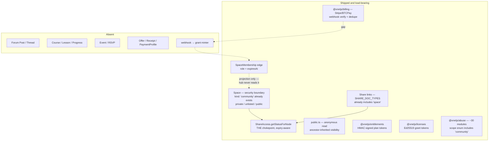
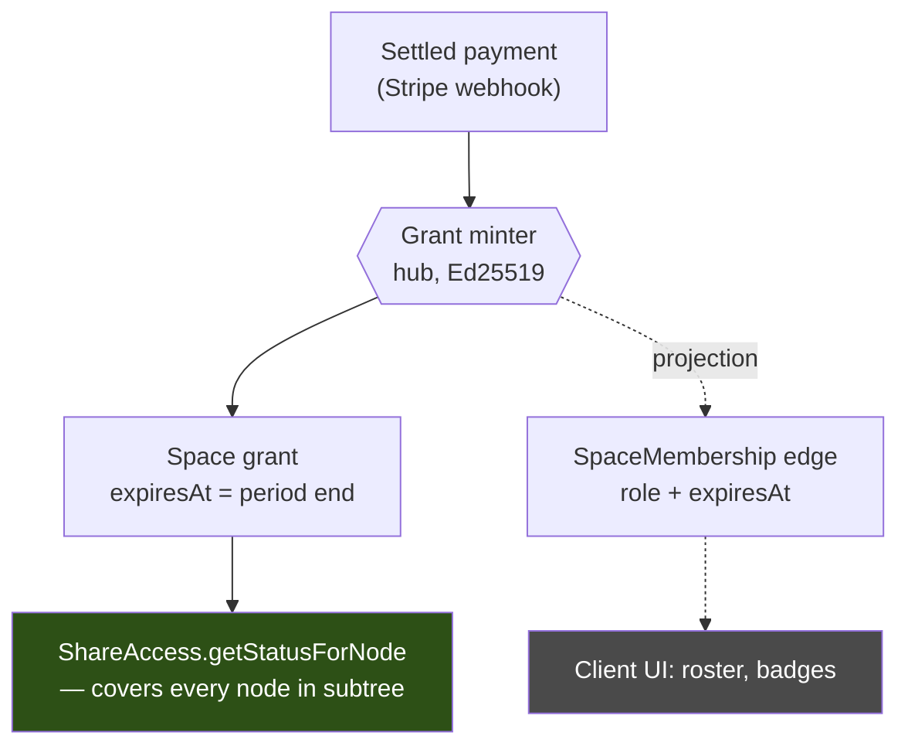
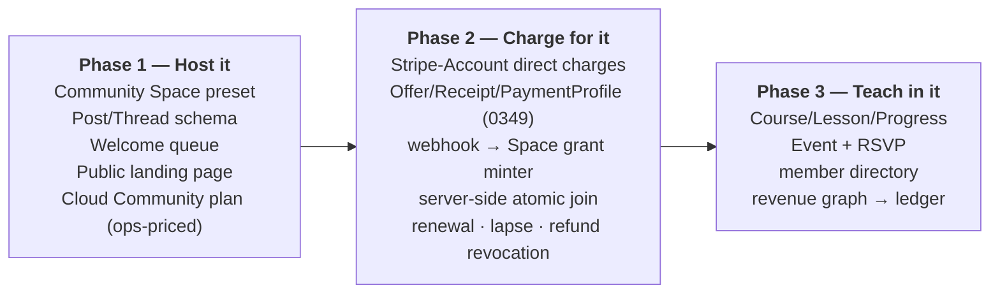
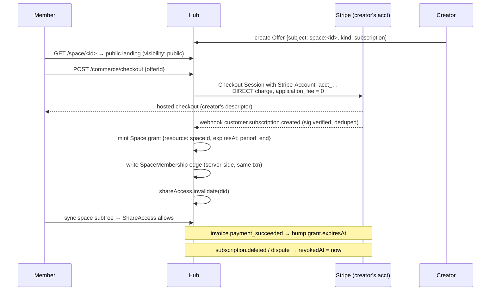
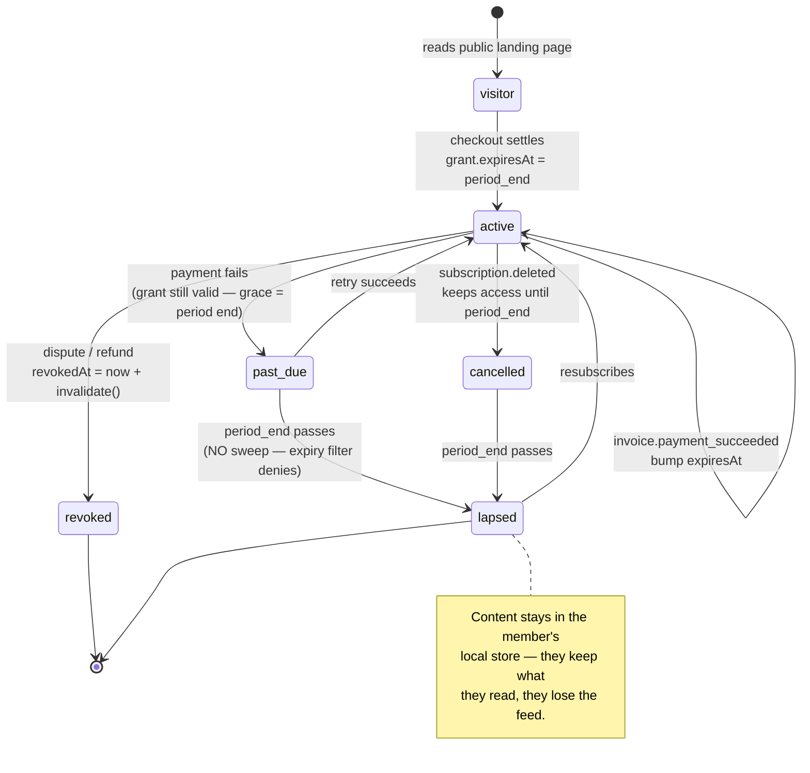

# Community Hosting And Recurring Revenue: The Skool Question

> _Can xNet host paid communities — and should it host them the way Skool does?_

## Problem Statement

Skool, Circle, Mighty Networks and Patreon let one person gather an audience,
charge it monthly, and keep the whole thing in one place. The ask driving this
exploration is direct: **people should be able to use xNet to host their
communities and earn recurring revenue.**

Two questions hide inside that, and they have different answers:

1. **Can xNet host communities?** Mostly yes, and much sooner than expected —
   `Space` is already a security boundary whose `kind` enum already contains
   `community`, and the hub already enforces expiring, revocable grants over
   space subtrees. The missing pieces are content types (forum posts, courses,
   events), not architecture.
2. **Should xNet copy Skool's product?** No — and not primarily for ideological
   reasons. Skool's central retention mechanic (points → levels → leaderboards)
   is banned by a CI gate and asserted against by runtime tests in this repo,
   and the published evidence says that mechanic is weaker than its reputation.
   Meanwhile Skool's real moat is not its feature set at all: it is that Skool
   is **merchant of record on a Stripe Express account the creator does not
   control**, which makes paid subscriptions structurally non-portable.

That second finding reframes the whole project. The interesting product here is
not "Skool with a change log." It is **the first paid-community platform a
creator can leave without losing their subscribers** — which is exactly the
promise Charter §6 already makes and no incumbent keeps.

## Executive Summary

**Recommendation: build it, in three phases, and compete on portability rather
than on take rate or gamification.**

- **Membership is a grant, not a row.** A paid membership is a hub grant on the
  Space with `expiresAt` set to the billing-period end, renewed by the Stripe
  webhook. `SpaceMembership` is the client-visible projection, *not* the gate —
  the hub currently has **zero** references to `SpaceMembership`, so gating on
  its `expiresAt` would be bypassed by a patched client. Both halves of the real
  design already ship; only the webhook→grant bridge is new.
- **Do not compete on take rate.** Skool Pro charges $99/mo + 2.9% + $0.30 —
  and 2.9% *is* the card-processing cost, so Skool's marginal take is already
  ≈0%. A "0% take" headline wins nothing against that. Compete instead on the
  thing Skool cannot offer: the creator owns the Stripe account, so
  subscriptions survive the exit.
- **The seat-priced `community` plan is wrong on Charter grounds.**
  `PLAN_CATALOG.community` bills 10 seats. Charging a creator per member is
  renting them their own audience back — it fails the improvement test in
  Charter §6. Price the Community plan on operations (storage, concurrency, AI),
  never on member count. It is also currently absent from `PLAN_PRICING`, so it
  is unpriced and excluded from the floor-margin test.
- **Refuse the leaderboard, ship the welcome.** Points/levels/leaderboards are
  hard-banned by `scripts/check-humane-patterns.mjs` in exactly the UI
  directories a community surface lives in. This costs less than it appears: the
  gamification meta-analysis finds small effects and real crowding-out risk,
  while the best-evidenced retention mechanic in the literature is a *reply to a
  newcomer's first post* (44% → 56% return rate). Build the reply.
- **The biggest risk is legal, not technical.** EU VAT Art. 9a deems a platform
  the supplier if it authorises the charge **or** authorises delivery **or** sets
  the T&Cs. A community platform that hosts checkout, gates content on payment,
  and sets the ToS does all three — *regardless of its Stripe configuration*.
  0349's "never in the flow of funds" posture may not survive contact with this.
  This needs counsel before Phase 2 ships, not after.

## Current State In The Repository

The substrate is in unusually good shape. Roughly 70% of a community platform's
*plumbing* already exists; roughly 0% of its *content types* do.



### The community container already exists

[`packages/data/src/schema/schemas/space.ts`](../../packages/data/src/schema/schemas/space.ts)
opens by declaring intent: _"A Space is a SECURITY BOUNDARY: a named container of
people + content with roles."_ It ships:

- `SPACE_KINDS = ['personal','workspace','organization','team','community','family']`
  — **`community` is already a declared kind** (`kind` selects presets only,
  never structure).
- `SPACE_VISIBILITY = ['private','unlisted','public']`, plus `NODE_VISIBILITY`
  adding `'inherit'`.
- `SPACE_ROLES = ['viewer','commenter','member','admin','owner']` with
  `compareSpaceRoles`, `effectiveSpaceRole` (most-permissive-wins),
  `canManageSpace`, `spaceRoleGrantActions`, `spaceRoleToShareRole`.
- Nesting via `parent`, with `spaceAncestorIds` / `wouldCreateSpaceCycle`.

[`space-membership.ts`](../../packages/data/src/schema/schemas/space-membership.ts)
carries the roster edge `{ space, member, role, addedBy, addedAt, expiresAt }`
with a deterministic `spaceMembershipId(spaceId, memberDid)` so re-adds upsert.
**`expiresAt` already exists**, added for time-boxed support access (0341).

[`space-authorization.ts`](../../packages/data/src/schema/schemas/space-authorization.ts)
expresses the cascade in the declarative DSL — `spaceOwnAuthorization()`,
`spaceCascadeAuthorization()`, and `spaceContributorAuthorization()`
("anyone here may post; only the author may edit"), which is precisely the
policy a forum needs.

### Enforcement: the grant index is the real gate

[`packages/hub/src/services/share-access.ts`](../../packages/hub/src/services/share-access.ts)
is the single chokepoint. `getStatusForNode(did, docId)` takes the most
permissive of the direct grant and any ancestor-Space grant via
`storage.ancestorContainers(docId)`, and — critically — filters at line 96:

```ts
.filter((grant) => grant.revokedAt === 0 && (grant.expiresAt === 0 || grant.expiresAt > now))
```

**Server-side expiry and revocation are already enforced for grants.** There is
a TTL cache with an `invalidate(did?, docId?)` method that correctly clears every
cached entry for a DID when a container grant moves.

**But the hub has zero knowledge of `SpaceMembership`** — `grep` for
`SpaceMembership` or `spacemember:` across `packages/hub/src` returns nothing.
The edge is written **client-side**, in `AddSharedDialog.tsx`
(`recordSpaceMembership`), *after* the hub grant is written. Two consequences:

1. A paid gate built on `SpaceMembership.expiresAt` would be **trivially
   bypassed** by a patched client. The gate must be the grant.
2. The claim→membership write is **non-atomic**. A client failing between the
   two leaves a DID with hub access but no roster entry — grant index and
   cascade disagree.

### Joining already routes through space-scoped share links

[`packages/hub/src/routes/share-links.ts`](../../packages/hub/src/routes/share-links.ts)
ships `POST /links`, `POST /links/:linkId/claim` (rate-limited, idempotent,
supporting `expiresAt` and `maxUses`), and `SHARE_DOC_TYPES` **already includes
`'space'`**, with the comment that space invites _"bootstrap Space membership:
the grant a claim writes is keyed on the Space id, so it acts as a container
(subtree) grant."_ The paid-join flow is a variant of a path that already works.

One latent issue to fix before building paid gating on top: `canManageShares`
returns `true` when a doc has no recorded owner (line 110, the "legacy trust
model" fallback). If a Space can ever exist without `DocMeta.ownerDid`, anyone
who learns its id can mint invite links to it.

### Public read — the free funnel — already works

[`packages/hub/src/routes/public.ts`](../../packages/hub/src/routes/public.ts)
serves unauthenticated `GET /node/:id` and `GET /space/:id` via
`resolveEffectiveVisibility` (own visibility, else nearest definitive ancestor,
else `private`), BFS-capped at 500 nodes. Only `public` is served. That is a
free public landing page for a paid community — the funnel Skool relies on.

### Money: real primitives, one wrong charge type, nothing wired

| Package | State |
| --- | --- |
| [`packages/billing`](../../packages/billing) | Provider port (`createCheckout`/`parseWebhook`/`normalize`), Stripe + BTCPay + fake adapters, `verifyStripeSignature`, `processWebhook` (verify→dedupe→normalize→apply). Zero runtime deps so the MIT hub can import it. |
| [`packages/billing/src/connect.ts`](../../packages/billing/src/connect.ts) | `DEFAULT_MARKETPLACE_FEE_BPS = 1000`, `applicationFeeMinor`, `sellerNetMinor` — **modelled, never called** outside its own tests. |
| [`packages/entitlements`](../../packages/entitlements) | `PlanId` includes `community`; HMAC-SHA256 signed tokens; hub maps `quotaBytes → defaultQuota` etc. at `config.ts:73-77`. |
| [`packages/licenses`](../../packages/licenses) | Ed25519 `signPluginLicense`/`verifyPluginLicense` + `mintPluginLicense`. The exact token shape 0349 generalises into a purchase grant. Unwired. |
| [`packages/ledger`](../../packages/ledger) | Pure double-entry over integer minor units — the natural sink for a creator's revenue reporting. |
| [`packages/abuse`](../../packages/abuse) | ~30 modules incl. `community-notes.ts`, `appeals.ts`, `public-write-budget.ts`. Moderation scope enum already includes `community`. |

Two corrections that matter for planning:

**The Stripe adapter does destination charges, not direct charges.**
[`providers/stripe.ts:194`](../../packages/billing/src/providers/stripe.ts) says
so in its own doc comment — `transfer_data[destination]`, _"the charge is made on
the platform account and the seller's cut is transferred."_ `Stripe-Account`
appears nowhere in `packages/billing`. Per §6 below this is not a wiring detail:
destination charges put xNet in the flow of funds, make xNet merchant of record,
put disputes on the platform balance, and make subscriptions **non-portable** —
the precise failure mode this whole exploration exists to avoid.

**The `community` plan is seat-priced and unpriced.**
[`plans.ts:169`](../../packages/entitlements/src/plans.ts) gives it
`isolation: 'dedicated-project'`, 500 GiB, 2000 connections, `sla: '99.9'` — and
`seats: 10`. Meanwhile `PLAN_PRICING` in
[`packages/cloud/src/cost/pricing.ts:134`](../../packages/cloud/src/cost/pricing.ts)
contains only `personal` ($50/yr), `family` ($15/mo), `team` ($96/mo = 8 × $12)
and `enterprise` ($2000/mo). **`community` has no pricing scenario at all**, so
it is excluded from the floor-margin test.

### What is genuinely absent

| Surface | Status |
| --- | --- |
| Forum posts / threads | **Missing.** `packages/social` feeds are projections over *imported* social content; there is no native "compose a post here" path. Discussion would otherwise ride `Channel` + `ChatMessage`, which is Slack-shaped, not forum-shaped. |
| Courses / lessons / progress | **Missing.** The only hit repo-wide is a database *template* (`builtin.ts:579`, `course-planner`). |
| Events / RSVP | **Missing.** `CalendarView` renders DB rows with a date column; `packages/meetings` is recording/transcription, and `meeting.ts`'s `attendees` is transcript attribution, not invitations. |
| Offer / Receipt / PaymentProfile | **Missing** — proposed by 0349, `commerce.ts` does not exist. |
| Per-Space quota or plan | **Missing.** Entitlements terminate at the hub *process* — one plan, one quota, one AI budget, one Stripe subscription per hub. |
| Gamification | **Absent by design and blocked by CI.** |

## External Research

### Pricing and take rates (July 2026)

| Platform | Price | Platform take (excl. ~2.9% + $0.30 processing) | MoR |
| --- | --- | --- | --- |
| **Skool** Hobby | $9/mo | **10% + $0.30** | Skool |
| **Skool** Pro | $99/mo | **2.9% + $0.30** ≤$899; **3.9%** >$900 | Skool |
| Circle | $89 / $199 / custom | 2% / 1% / 0.5% | ❓ |
| Mighty Networks | $79 / $179 / custom | 2% / 1% / 0.5% | platform |
| Patreon | free | **10% flat** (since Aug 2025) | Patreon |
| Discord | free | 10% (+ Apple 30% on iOS) | Discord |
| Kajabi | $143–$499 | 0% *via Kajabi Payments*; 2%/1%/0.5% penalty otherwise | platform |
| Substack | free | 10% | Substack |
| **Ghost** | $18 / $29 / $199 | **0% — structural** | **creator** |
| Whop | $0 | 2.7% + 3% platform ≈ 5.7% | Whop |
| Heartbeat | $40–$766 | 5% / 2.5% / 1.25% | platform |
| Podia | $42 / $84 / $150 | 5% on Mover; **0%** above | platform |

The decisive observation: **Skool Pro's 2.9% + $0.30 is the processing cost.**
Skool's marginal take at Pro is ≈0% below $899; it monetises the $99 seat, not
the revenue. A "0% take rate" banner therefore differentiates xNet from Patreon
and Substack but **not from Skool Pro, Ghost, Kajabi or Podia**.

"0% take" also means three incompatible things. Ghost's is *structural* — you
connect your own Stripe account, so Ghost physically cannot take a cut. Kajabi's
and Podia's are *conditional* on using their processor or buying a higher tier.
Only the structural kind survives a change in the vendor's incentives.

### The real lock-in is the Stripe account

Stripe's own documentation is the crux:

- Stripe **will** copy customer records and tokenised cards between accounts.
- Stripe **will not** copy subscriptions — products, prices and subscriptions
  must be **recreated**.
- Partial copy with customer selection is **unavailable for Connect accounts**.

So the question that determines portability is *whose Stripe account is it?*

- **Skool** states plainly: _"You cannot use your existing Stripe account. Skool
  will always create a new (or sub) Stripe Express account"_ and _"All payment
  processing happens on the Skools merchant."_ An Express account the creator
  does not control, with Skool as MoR ⇒ **subscriptions are structurally
  non-portable**. You leave with a CSV of emails and a re-subscribe campaign.
- **Patreon**: Ghost's migration doc says it outright — _"there is no direct
  migration path to move your paid subscriptions from Patreon."_ The workaround
  is importing patrons as complimentary, i.e. running both platforms forever.
- **Substack → Ghost works** precisely because the creator owns the Stripe
  account: import a CSV with `stripe_customer_id` using _"the same Stripe account
  that is connected to your Substack."_ Subscriptions survive intact.

Member CSV export is universal and therefore worthless as a differentiator. The
hostage is the recurring revenue. (Skool notably does *not* export posts,
comments, DMs, courses or gamification history — a third-party scraper economy
exists to extract them.)

### Charge type, not account type, sets merchant of record

Stripe now prefers controller properties over account types, but the axis that
matters is the **charge type**:

| | Direct charges | Destination charges |
| --- | --- | --- |
| Customer + Subscription objects live on | **connected account** | platform |
| Merchant of record | connected account | **platform** |
| Disputes debited from | connected account | **platform balance** |
| After disconnect | **subscriptions keep running** | funds cannot transfer — migrate or cancel |
| Portability | **high** | **low** |

There is also an asymmetric loss vector on destination charges: you must reverse
transfers on `charge.dispute.created`, and Stripe warns that retransferring a
reversal is subject to cross-border restrictions — win the dispute later and you
may be unable to make the creator whole.

### The Art. 9a problem

This is the finding that most threatens the recommended design. EU Council
Implementing Regulation 282/2011 **Art. 9a** presumes an intermediary supplying
electronic services through a portal acts in its own name — **deemed supplier,
liable for the VAT**. The presumption is rebuttable only with contractual and
invoice identification of the actual supplier, and **the rebuttal is unavailable
entirely** if the intermediary:

- authorises the charge to the customer, **or**
- authorises the delivery of the services, **or**
- sets the general terms and conditions of the supply.

Only pure payment processing is carved out (Art. 9a(3)). UK law mirrors this.
A community platform hosting checkout, gating content on payment, and setting
the ToS satisfies **all three limbs**. CJEU **Case C-695/20 (Fenix / OnlyFans)**
upheld Art. 9a's validity against a creator-subscription platform, treating it as
deemed supplier for the *full* subscriber payment rather than its commission.

The implication for 0349's posture is sharp: **choosing creator-as-MoR for the
money flow while behaving like a platform everywhere else may buy the compliance
exposure of an MoR with none of the control.** To genuinely recede you must
recede in *product*, not just in Stripe config — creator's ToS, creator's
checkout branding, creator's statement descriptor, creator's registrations.
That is Ghost's posture, and it is a product decision as much as a payments one.

### What actually retains paid members

The strongest evidence is El Sanyoura & Anderson (2022), a peer-reviewed analysis
of hundreds of millions of Patreon pledges (2013–2020):

- **Tenure dominates everything** — a 33.5 pp swing in expected loyalty between
  a pledge lasting 1 month vs 12. Early survival is the whole game.
- **Breadth of connection predicts retention** — a ~20.7 pp spread between
  uni-patrons and 10-creator patrons.
- **Higher spend correlates *negatively* with loyalty** (~10 pp) once pledge
  count is controlled — the authors flag this as contrasting with platforms
  where engagement predicts retention.
- **"Communities & Websites" has among the lowest multi-patronage rates**, and
  the largest creators' audiences are multi-patrons only 40% of the time vs 90%
  for the smallest. Big communities produce one-and-done members.

The best-evidenced *actionable* mechanism is social response: in Facebook
newcomer research (~140,000 newcomers, Kraut & Resnick tradition), **newcomers
who received a reply to their first post were 12 pp more likely to post again —
44% → 56%.**

On gamification specifically, the evidence is weaker than its market position
implies. A 2024 meta-analysis (35 interventions) finds gamification enhances
relatedness and autonomy, has **minimal impact on competence**, with **small**
overall effect sizes. Deci, Koestner & Ryan's 128-study meta-analysis found
performance-contingent rewards undermine free-choice intrinsic motivation at
**d = −0.28** — and a leaderboard is a performance-contingent reward. Skool's
"1 like = 1 point" rule also rewards volume and social reciprocity rather than
quality, and is openly farmable.

Two cautions I am carrying deliberately: much of the "cohort beats content"
literature is vendor-authored and methodologically broken (the famous "3–6% MOOC
completion" figure is wrong — Jordan 2015 found a **12.6% median** across 221
MOOCs, and MOOC students pay $0 while cohort students pay $500–2,000). And
**lurkers are not a failure state** — peer-reviewed work finds they commonly get
what they need from reading and report satisfaction. That is a paying, retained,
invisible segment a community-first design tends to treat as broken.

### Self-hosting, and a cautionary tale

Only **Ghost** and **Discourse** support paid membership natively among the
open-source options, and only Ghost does it well (0% structural, creator-owned
Stripe). Zulip, Flarum, Matrix and Forem ship no payments at all. Infrastructure
is not the expensive part: a small paid community fits a €4–5/mo Hetzner box or a
$12–24 DigitalOcean droplet — **~2–5% of Skool's or Circle's platform cost**. The
real costs are email deliverability, off-box backups, moderation and upgrades.

Ghost is also the governance model worth studying: foundation-owned, ~$7.5M ARR,
profitable for ~12 years, no investors, constitutionally unsellable.

And the counter-example: the **Open Collective Foundation dissolved on 31 Dec
2024, stranding 600+ collectives**, because its 5% host fee didn't cover
compliance cost. The *platform* survived; the *fiscal-sponsorship entity* died.
**Being open source did not protect 600 communities.** The money layer fails
independently of the code layer — which is exactly what the Vanish test is for.

## Key Findings

1. **Membership must be a grant, not a row.** The hub enforces grant expiry and
   revocation server-side today, and knows nothing about `SpaceMembership`. Mint
   a Space grant with `expiresAt` = period end; project the membership edge for
   the UI. This makes the paid gate real rather than advisory, and reuses
   `ShareAccess` as the single chokepoint for every node in the subtree.

2. **Portability is the differentiator; take rate is not.** Skool Pro's marginal
   take is already ≈0%. But no incumbent except Ghost lets subscriptions survive
   an exit, because they all own the Stripe account. Direct charges on the
   creator's own Standard account make xNet the second platform in the market
   where leaving costs nothing — and the only one where the *member list,
   receipts and content* leave as signed, verifiable nodes too.

3. **Skool's retention loop is un-buildable here, and that is cheaper than it
   looks.** `scripts/check-humane-patterns.mjs` bans `leaderboard`, `userRank`,
   `rankBadge` (case-insensitive, word-bounded) in `packages/ui/src`,
   `packages/react/src`, `apps/web/src`, `site/src` — exactly where a community
   surface lives. `charter-calm-feeds.test.ts` and `charter-calm-rules.test.ts`
   assert feeds order only by time/structural fields and notifications resolve by
   fixed priority, so a ranked feed fails *tests*, not just lint. The evidence
   says the mechanic is worth less than the welcome-reply it would displace.

4. **The `community` plan's seat pricing is a Charter violation in waiting.**
   Billing a creator per member charges them for access to their own audience —
   ground rent by the §6 definition. Price on operations instead. This also
   resolves a live inconsistency: `community` is in `PLAN_CATALOG` but absent
   from `PLAN_PRICING`, so its margin is untested.

5. **The Stripe adapter is on the wrong charge type for this entire strategy.**
   Destination charges make xNet MoR, put disputes on the platform balance, and
   make subscriptions non-portable. Adding `Stripe-Account` support is the single
   most load-bearing piece of unshipped code.

6. **Art. 9a may make xNet the deemed supplier regardless of Stripe config.**
   Hosting checkout + gating delivery + setting ToS is all three disqualifying
   limbs. This is a question for counsel, and the answer changes the product
   (whose ToS the buyer accepts, whose name is on the statement), not just the
   plumbing.

7. **Two correctness bugs sit on the paid path already.** The client-side,
   non-atomic claim→membership write, and `canManageShares` returning `true` for
   ownerless docs. Both are tolerable for free sharing and not for paid access.

## Options And Tradeoffs

### A. Where the paid gate lives



| Option | Gate strength | Code | Verdict |
| --- | --- | --- | --- |
| A1. `SpaceMembership.expiresAt` only | **None** — hub never reads it; patched client bypasses | least | ❌ reject |
| A2. **Hub grant with `expiresAt`, membership as projection** | Strong — server withholds bytes, expiry already enforced | small (webhook→mint bridge) | ✅ **recommended** |
| A3. New role rung / `tier` property | Medium; still client-swept unless paired with A2 | medium | ⚠️ only as UI sugar atop A2 |
| A4. Per-Space entitlement token | Strong, but entitlements terminate at hub process today | large | defer to multi-tenancy work |

### B. Economic model — with the Charter §6 tests applied

Each lane is tested against **improvement** (does the margin pay for labour,
capital or operations *we* provide?), **BATNA** (does undegraded self-hosting
survive?), and **vanish** (does the customer keep what they paid for if xNet
disappears?).

| Lane | Improvement | BATNA | Vanish | Verdict |
| --- | --- | --- | --- | --- |
| **B1. Cloud "Community" hosting plan**, priced on operations (storage, concurrency, AI) | ✅ pays for hosting, uptime, backups, deliverability we run | ✅ MIT hub on a €5 box remains fully capable | ✅ their Space, members, receipts and content are portable nodes | ✅ **adopt** |
| **B2. Take rate on member subscriptions** | ❌ margin is levied on the creator's relationship with their own audience — access to a thing they already own | ❌ a self-hoster simply patches out an MIT fee; a fee that is trivially removable is an irritant, not a business | ✅ | ❌ **refuse** |
| **B3. Per-member / per-seat pricing of a community** | ❌ same failure as B2 in a different unit — the meter is the creator's audience | ⚠️ pushes large communities off-platform by construction | ✅ | ❌ **refuse — and fix `PLAN_CATALOG.community`** |
| **B4. Opt-in managed merchant-of-record + tax service** | ✅ VAT/sales-tax registration, filing and chargeback absorption is real, expensive labour — this is genuinely what Skool sells | ⚠️ **must** remain optional, with the direct-charge path always available and equally good | ⚠️ subscriptions live on *our* account while enrolled — mitigate with a documented, tested exit that reassigns to the creator's account | ⚠️ **adopt only with the exit path built first** |
| **B5. Managed discovery / directory listing** (`application_fee` on marketplace listings only) | ✅ distribution we perform | ✅ opt-in; unlisted communities lose nothing | ✅ | ✅ adopt later (reuses `DEFAULT_MARKETPLACE_FEE_BPS`) |
| **B6. Egress / export / member-count fees** | ❌ | ❌ | ❌ | ❌ already refused by §6 |

B4 deserves comment because it is the honest tension in this document. Skool's
MoR position is not purely predatory — handling EU VAT across 27 member states
is real work a solo creator cannot do, and it is a large part of what the $99
buys. Refusing it entirely means telling small creators to register for VAT
themselves. Offering it means holding their subscriptions on our account, which
is the very lock-in we are attacking. The resolution is sequencing: **build the
exit before the entrance** — an MoR lane may only ship once a tested migration
reassigns subscriptions to the creator's own account on request.

And per Art. 9a, B4 may not be fully optional in the EU. If counsel concludes
xNet is deemed supplier regardless, the choice collapses to "be MoR well" vs
"be MoR badly," and the product must recede far enough (creator's ToS, creator's
descriptor) to rebut the presumption, or price the compliance in.

### C. Retention mechanics — replacing the leaderboard

| Skool mechanic | Charter status | xNet substitute | Evidence |
| --- | --- | --- | --- |
| Points (1 like = 1 point) | ⚠️ `points` not regex-banned but violates §3 intent | none — reciprocity is legible, not scored | farmable; rewards volume |
| Levels gating content | ⚠️ intent violation | **Course progress** — self-referential, visible to the learner only | completion is competence, not standing |
| Leaderboard | ❌ **hard-banned** (`leaderboard`, `userRank`, `rankBadge`) | **Welcome queue** — surface unanswered first posts to admins | 44% → 56% return rate on first-post reply |
| Streaks | ❌ hard-banned (`streakCount`, `dailyStreak`, …) | **Cohort calendar** — shared commitment device, not a punishable chain | events work as scheduling device |
| 7/30/all-time ranking | ❌ ranked feeds fail `charter-calm-feeds.test.ts` | chronological + **stewardship** surfacing (who answered questions) | VIBE.md: "Never show standing — no ranks, no ratios, no streaks, no leaderboards" |

`docs/VIBE.md` already names this exact substitution — _"We keep the loop and
drop the leaderboard"_ — so the reframe below is applying existing doctrine, not
inventing a workaround for a lint rule.

A `/* humane-ok: … */` comment would technically pass CI here. It should not be
used — it would satisfy the linter while defeating the intent §3 exists to
protect. If leaderboards are ever wanted, that is a Charter amendment with a
public argument, not a lint escape.

## Recommendation

**Ship community hosting in three phases, positioned as "the community you can
leave." Refuse the take rate and the per-member meter; price the Cloud Community
plan on operations. Build the welcome, not the leaderboard. Get counsel on
Art. 9a before any money moves.**



The sequencing is deliberate: **Phase 1 ships standalone value with no money in
it at all**, which means it carries no Art. 9a exposure and can go out while
counsel is still reading. Phase 2 is where legal sign-off gates the release.

### The core mechanism



Renewal is a single field bump. Lapse needs no sweep — `share-access.ts:96`
already treats an expired grant as absent. Refund and chargeback set `revokedAt`,
and _"a deny always wins, even over a space membership."_

Every transition below is one write to the grant record — which is why this
design needs so little new code:



That last note is a deliberate product stance, not an accident of local-first
architecture: a lapsed member keeps the copies they already synced. Enforcing
otherwise would mean reaching into someone's device to delete what they paid for
while they were paying, which §1 and §2 forbid.

### Fix the plan first

Before any of this, correct `PLAN_CATALOG.community`: drop the seat meter, add a
`PLAN_PRICING` scenario so the floor-margin test covers it, and price it against
the operations it actually consumes (dedicated-project isolation, 500 GiB, 2000
connections, 99.9 SLA). A defensible starting point is a flat monthly fee in the
$49–99 range with **unlimited members** — which is simultaneously the Charter-
correct meter and the sharpest possible contrast with Circle's per-admin,
per-moderator, per-10k-contacts add-on stack.

## Example Code

### Direct charges — the missing `Stripe-Account` header

```ts
// packages/billing/src/providers/stripe.ts — extend, don't replace applyConnect

export interface StripeChargeOptions {
  /** Connected account id. Present ⇒ DIRECT charge (creator is MoR). */
  stripeAccount?: string
}

const post = async (path: string, form: URLSearchParams, opts?: StripeChargeOptions) => {
  const headers: Record<string, string> = {
    authorization: `Bearer ${config.secretKey}`,
    'content-type': 'application/x-www-form-urlencoded'
  }
  // Direct charge: the charge, customer and subscription all live on the
  // creator's account. They are merchant of record; disputes hit their balance;
  // subscriptions survive disconnection from xNet. This is the portability
  // guarantee in Charter §6, expressed as one header.
  if (opts?.stripeAccount) headers['stripe-account'] = opts.stripeAccount
  return doFetch(`${apiBase}${path}`, { method: 'POST', headers, body: form })
}
```

The grep-able invariant, per 0349: **no code path where the platform account is
the charge destination for a direct sale.** Assert `application_fee` absent and
`stripe-account` present on every `/commerce/checkout` call.

### Webhook → Space grant (the whole bridge)

```ts
// packages/hub/src/services/community-membership.ts (new)

/**
 * Settle a community subscription into authorization state.
 *
 * The GRANT is the gate — `ShareAccess.getStatusForNode` already filters
 * `revokedAt === 0 && (expiresAt === 0 || expiresAt > now)` over ancestor
 * container grants, so a Space grant covers every node in the subtree and
 * lapses without a sweep. The `SpaceMembership` edge is a projection for the
 * client roster; the hub never reads it for access decisions.
 */
export const applyCommunitySubscription = async (
  deps: { storage: HubStorage; shareAccess: ShareAccess },
  event: { spaceId: string; memberDid: string; periodEndMs: number; status: SubscriptionStatus }
): Promise<void> => {
  const { storage, shareAccess } = deps
  const active = isActiveSubscription(event.status)

  await storage.upsertGrant({
    did: event.memberDid,
    resource: event.spaceId,
    actions: spaceRoleGrantActions('member'),
    expiresAt: active ? event.periodEndMs : 0,
    revokedAt: active ? 0 : Date.now()
  })

  // Same call path, so grant and roster can't disagree — closing the
  // non-atomic client-side `recordSpaceMembership` gap.
  await storage.upsertProjectedMembership({
    id: spaceMembershipId(event.spaceId, event.memberDid),
    space: event.spaceId,
    member: event.memberDid,
    role: 'member',
    expiresAt: active ? event.periodEndMs : Date.now()
  })

  // Container grants move the status of every node beneath them.
  shareAccess.invalidate(event.memberDid)
}
```

### The welcome queue — the leaderboard's replacement

```ts
// packages/social/src/community/welcome.ts (new)
//
// Evidence: newcomers who receive a reply to their first post return at 56%
// vs 44% unanswered. This is a STEWARDSHIP surface, not a ranking one — it
// sorts by how long someone has been waiting, never by member standing, so it
// stays inside charter-calm-feeds.test.ts ("orders only by time/structural
// fields") and never names a `leaderboard`.

export interface UnansweredPost {
  postId: string
  authorDid: string
  createdAt: number
  isFirstPost: boolean
  replyCount: number
}

/** Oldest-waiting first posts first. Time-ordered, structural, no scoring. */
export const welcomeQueue = (posts: readonly UnansweredPost[], now: number): UnansweredPost[] =>
  posts
    .filter((p) => p.isFirstPost && p.replyCount === 0)
    .sort((a, b) => a.createdAt - b.createdAt)
```

## Risks And Open Questions

1. **Art. 9a / deemed supplier — the blocking legal question.** Hosting
   checkout, gating delivery and setting ToS is all three disqualifying limbs,
   and C-695/20 upheld the regulation against a close analogue. **Counsel must
   read C-695/20 directly before Phase 2 ships.** If xNet is deemed supplier
   regardless of Stripe configuration, the 0% direct-charge posture needs
   redesign — likely by receding further in product (creator's ToS accepted at
   checkout, creator's statement descriptor) or by pricing compliance in.

2. **`SqliteBillingStore` has no seller dimension.** Connect webhooks for every
   creator arrive on one hub endpoint distinguished by the `Stripe-Account`
   header. The store is DID-scoped and needs a `sellerDid` column.

3. **Hub multi-tenancy is the scaling ceiling.** Entitlements terminate at the
   hub *process* — one plan, one quota, one AI budget per hub. Many independent
   paid communities on one hub share all of them. Data isolation genuinely works
   (Spaces are real security boundaries); *commercial* isolation does not exist.
   Phase 1–3 assume one community per hub; anything else needs per-Space
   entitlements, which is a separate exploration.

4. **`canManageShares` ownerless fallback.** Verify Spaces always get
   `setDocMeta` with an owner before building paid gating above it, or an
   ownerless Space lets anyone who learns its id mint invite links.

5. **Cache TTL vs revocation latency.** `ShareAccess` caches status; a lapse or
   chargeback takes effect only after `invalidate()` or TTL expiry. Acceptable
   for subscriptions (period boundaries), and the minter calls `invalidate`
   explicitly — but worth an explicit test for the dispute path.

6. **Refund revocation is eventually consistent for offline verification** —
   a revoked grant still verifies offline until its expiry, the same trade
   `@xnetjs/licenses` already accepted with its 7-day grace.

7. **The gamification bet could be wrong.** Skool's mechanic is simple and
   demonstrably drives its market position, whatever the meta-analyses say about
   effect sizes. We are choosing the better-evidenced mechanic over the
   better-marketed one. If Phase 1 communities visibly fail to retain, the honest
   response is to measure with a holdout — the published comparison does not
   exist — not to quietly add a leaderboard.

8. **Native posting is a bigger lift than it looks.** `packages/social` is an
   *import/projection* layer; there is no compose path. A forum needs a real
   authoring surface, not a new saved view.

9. **Email deliverability is the unglamorous killer.** It is a named reason top
   writers left Substack, and it is the main hidden cost of self-hosting. A
   Community plan that cannot reliably deliver a digest is not a product.

## Implementation Checklist

### Phase 0 — corrections (do first, independently valuable)

- [x] Remove the seat meter from `PLAN_CATALOG.community` in `packages/entitlements/src/plans.ts`; document members-are-not-seats in the doc comment
- [x] Add a `community` scenario to `PLAN_PRICING` in `packages/cloud/src/cost/pricing.ts` so the floor-margin test covers it
- [x] Audit `canManageShares` in `packages/hub/src/routes/share-links.ts`: assert Spaces always carry `DocMeta.ownerDid`, or remove the ownerless fallback for `docType: 'space'`
- [ ] Add a Charter §6 receipt for "no per-member pricing" alongside the existing refused rents

### Phase 1 — host it (no money, no legal exposure)

- [ ] `Post` / `Thread` schemas with `spaceContributorAuthorization()`
- [ ] Native compose surface (BlockNote via `XNetEditor`), chronological only
- [ ] Community Space preset — `kind: 'community'`, public landing page via existing `public.ts`
- [ ] Welcome queue (`packages/social/src/community/welcome.ts`) + admin surface
- [ ] Member directory over `SpaceMembership` + `useEnsureProfiles`
- [ ] Register the community section in `apps/web/src/workbench/sidebar/sections.ts` (the tabless successor to `SURFACES` — check 0353 Phase 3 before adding a `SurfaceDef`)
- [ ] Wire `packages/abuse` into the public-read path (moderation scope already has `community`)
- [ ] Cloud Community plan live, ops-priced, unlimited members

### Phase 2 — charge for it (gated on legal sign-off)

- [ ] **Counsel review of Art. 9a and C-695/20** — blocking
- [ ] `Stripe-Account` header support in `packages/billing/src/providers/stripe.ts` (direct charges)
- [ ] `sellerDid` dimension on `SqliteBillingStore`
- [ ] `PaymentProfile` / `Offer` / `Receipt` schemas (`commerce.ts`, per 0349)
- [ ] Connect Standard onboarding route (hub OAuth), authoritative DID→`acct_…` map in hub billing store
- [ ] `applyCommunitySubscription` — webhook → Space grant + projected membership, atomic
- [ ] Renewal (`invoice.payment_succeeded` → bump `expiresAt`)
- [ ] Lapse + refund + dispute → `revokedAt` + `shareAccess.invalidate`
- [ ] Server-side atomic join replacing client `recordSpaceMembership`
- [ ] Creator revenue view — `Receipt` nodes projected into `@xnetjs/ledger`
- [ ] **Documented, tested exit**: export members + receipts as `.xnetpack`, with subscriptions already on the creator's account

### Phase 3 — teach in it

- [ ] `Course` / `Lesson` / `Progress` schemas; progress visible to the learner, never ranked
- [ ] `Event` + `RSVP` schemas; `CalendarView` already renders them
- [ ] Cohort calendar
- [ ] Optional managed discovery listing (`DEFAULT_MARKETPLACE_FEE_BPS`, opt-in only)

## Validation Checklist

- [ ] A patched client that forges `SpaceMembership.expiresAt` **cannot** read a lapsed community's nodes (the gate is the grant)
- [ ] Grant expiry at period end denies subtree reads with no sweep job running
- [ ] `charge.dispute.created` revokes access within one `ShareAccess` TTL
- [ ] `pnpm check:humane-patterns` green — no `leaderboard`/`userRank`/`rankBadge`/streak identifiers, **and no `humane-ok` suppressions added**
- [ ] `charter-calm-feeds.test.ts` and `charter-calm-rules.test.ts` still green with the community feed registered
- [ ] Every `/commerce/checkout` call asserts `stripe-account` present and `application_fee` absent (grep-able funds-flow invariant)
- [ ] `check:cloud-boundary` green — nothing MIT imports `@xnetjs/cloud`
- [ ] Floor-margin test covers `community` and passes at the chosen price
- [ ] **Exit rehearsal**: disconnect a test creator from xNet and confirm their Stripe subscriptions keep billing on their own account
- [ ] `.xnetpack` export of a paid community round-trips members, receipts and posts, verified offline
- [ ] Public landing page of a paid community is readable anonymously; member-only content 404s
- [ ] A self-hosted MIT hub runs the same paid community with no xNet Cloud dependency (BATNA test, executable)

## References

### Codebase

- [`packages/data/src/schema/schemas/space.ts`](../../packages/data/src/schema/schemas/space.ts) — `SPACE_KINDS` (incl. `community`), `SPACE_VISIBILITY`, `SPACE_ROLES`
- [`packages/data/src/schema/schemas/space-membership.ts`](../../packages/data/src/schema/schemas/space-membership.ts) — roster edge, `expiresAt`, `spaceMembershipId`
- [`packages/data/src/schema/schemas/space-authorization.ts`](../../packages/data/src/schema/schemas/space-authorization.ts) — `spaceContributorAuthorization()`
- [`packages/hub/src/services/share-access.ts`](../../packages/hub/src/services/share-access.ts) — the chokepoint; line 96 expiry filter; `invalidate()`
- [`packages/hub/src/routes/share-links.ts`](../../packages/hub/src/routes/share-links.ts) — `SHARE_DOC_TYPES` incl. `'space'`; `canManageShares`
- [`packages/hub/src/routes/public.ts`](../../packages/hub/src/routes/public.ts) — `resolveEffectiveVisibility`
- [`packages/billing/src/providers/stripe.ts`](../../packages/billing/src/providers/stripe.ts) — `applyConnect` (destination charges)
- [`packages/billing/src/connect.ts`](../../packages/billing/src/connect.ts) — `DEFAULT_MARKETPLACE_FEE_BPS`
- [`packages/entitlements/src/plans.ts`](../../packages/entitlements/src/plans.ts) — `PLAN_CATALOG.community`
- [`packages/cloud/src/cost/pricing.ts`](../../packages/cloud/src/cost/pricing.ts) — `PLAN_PRICING` (no `community`)
- [`scripts/check-humane-patterns.mjs`](../../scripts/check-humane-patterns.mjs) — dark-pattern rules
- [`apps/web/src/workbench/sidebar/sections.ts`](../../apps/web/src/workbench/sidebar/sections.ts) — tabless section registry

### Explorations

- [0349 — First-class payments, creator commerce](./0349_[_]_FIRST_CLASS_PAYMENTS_CREATOR_COMMERCE_AND_ECONOMIC_EXCHANGE.md) — `Offer`/`Receipt`/`PaymentProfile`, payment-mints-capability
- [0351 — Frontier economics without enclosure](./0351_[x]_FRONTIER_ECONOMICS_WITHOUT_ENCLOSURE_RAILROADS_AIRLINES_AND_THE_COMMONS.md) — the three-test rubric
- [0336 — Comparative cloud economics](./0336_[_]_COMPARATIVE_CLOUD_ECONOMICS_AND_XNET_CLOUD_POSITIONING.md) — never meter the user's own data
- [0353 — Tabless nav](./0353_[x]_TABLESS_REMOVING_THE_TAB_STRIP_AND_UNIFYING_THE_LEFT_NAV.md) — sections supersede surfaces
- [`docs/CHARTER.md`](../CHARTER.md) §3 Calm, §6 Commons / No ground rent
- [`docs/VIBE.md`](../VIBE.md) — "stewardship, never standing"

### External

- [Skool pricing](https://www.skool.com/pricing) · [subscriptions FAQ](https://help.skool.com/article/86-subscriptions-faq) · [Stripe setup — "you cannot use your existing Stripe account"](https://help.skool.com/article/78-how-to-setup-skool-subscriptions)
- [Circle pricing](https://circle.so/pricing) · [Mighty Networks](https://www.mightynetworks.com/pricing) · [Patreon](https://www.patreon.com/pricing) · [Whop fees](https://docs.whop.com/fees) · [Heartbeat](https://www.heartbeat.chat/pricing) · [Podia](https://www.podia.com/pricing)
- [Ghost pricing](https://ghost.org/pricing/) · [Ghost about — foundation-owned, unsellable](https://ghost.org/about/) · [Ghost: migrating from Patreon](https://docs.ghost.org/migration/patreon) · [from Substack](https://docs.ghost.org/migration/substack)
- [Stripe: charge types](https://docs.stripe.com/connect/charges) · [Connect subscriptions](https://docs.stripe.com/connect/subscriptions) · [data migrations](https://docs.stripe.com/get-started/data-migrations/pan-copy-self-serve) · [Tax filing](https://docs.stripe.com/tax/filing) · [Tax for platforms](https://docs.stripe.com/tax/tax-for-platforms)
- [Council Implementing Regulation (EU) 282/2011, Art. 9a](https://www.legislation.gov.uk/eur/2011/282/article/9a) · [HMRC digital services guidance](https://www.gov.uk/guidance/the-vat-rules-if-you-supply-digital-services-to-private-consumers) · CJEU Case C-695/20 (Fenix / OnlyFans)
- [El Sanyoura & Anderson (2022), *Quantifying the Creator Economy: Patreon*](https://www.cs.toronto.edu/~ashton/pubs/patreon-creator-economy-icwsm2022.pdf)
- [Kraut & Resnick, *Building Successful Online Communities* (MIT Press, 2012)](https://direct.mit.edu/books/monograph/2912/Building-Successful-Online-CommunitiesEvidence)
- [Gamification & basic psychological needs meta-analysis (ETR&D 2024)](https://link.springer.com/article/10.1007/s11423-023-10337-7) · [Deci, Koestner & Ryan (1999)](https://home.ubalt.edu/tmitch/642/articles%20syllabus/Deci%20Koestner%20Ryan%20meta%20IM%20psy%20bull%2099.pdf)
- [Jordan (2015), MOOC completion rates, IRRODL](https://files.eric.ed.gov/fulltext/EJ1067937.pdf)
- [Open Collective Foundation dissolution](https://opencollective.com/foundation/updates/announcement-we-are-dissolving-open-collective-foundation-at-the-end-of-this-year)
- [Nieman Lab: top Substack writers depart for Patreon (Oct 2025)](https://www.niemanlab.org/2025/10/top-substack-writers-depart-for-patreon/)
