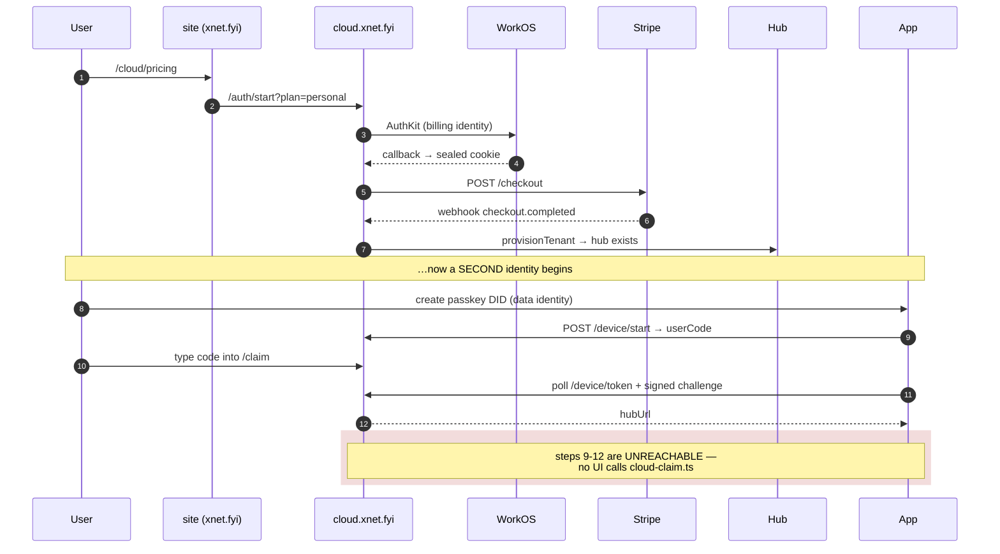
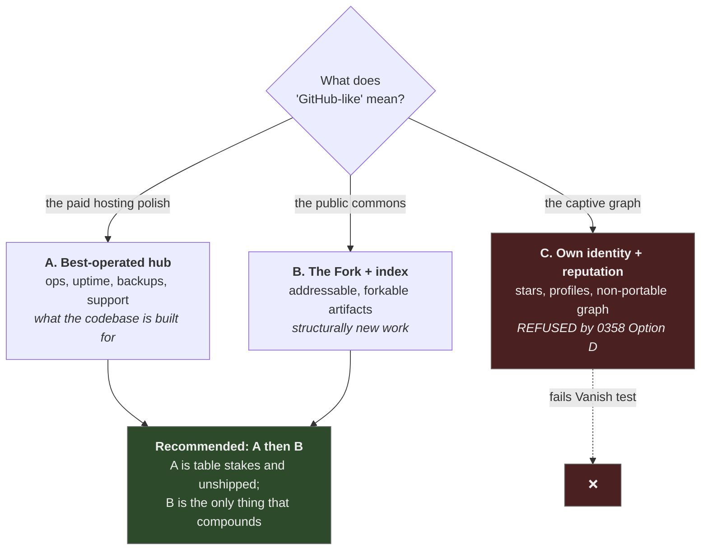
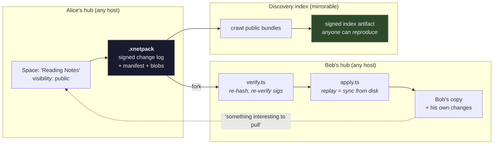

# Making xNet Cloud Delightful — The Fork, The Commons, And Time-To-First-Delight

> _"Contributing went from a problem of who had permission to push into the
> simplicity of who had something interesting to pull."_
> — Scott Chacon, co-founder of GitHub,
> ["Why GitHub Actually Won"](https://blog.gitbutler.com/why-github-actually-won)

## Problem Statement

[0358](./0358_[_]_VALUE_CAPTURE_WITHOUT_ENCLOSURE_MOATS_SUBSTRATES_AND_THE_SLEEP_TEST.md)
concluded that xNet earns through **operated trust and integration surplus**,
not rent — and that the only durable lanes are ones a competitor could not
erase by open-sourcing our feature set. The obvious next question is
operational: *how do we make xNet Cloud the thing people actually choose, stay
on, and feel good paying for?* The reference the request names is **GitHub**.

That reference contains a trap, and naming it is the whole job of this
document. **0358 explicitly refused GitHub's business model** — Option D,
"context capture": portable repos, captive reputation. Git makes exit nearly
free and GitHub was still worth $7.5B, because the contribution graph,
profiles, teams and Actions history do not travel. We wrote that refusal down
as the most expensive decision in the Charter.

So the request and the Charter appear to collide. They don't, and the
resolution is the thesis here:

> **GitHub is two separable things: a public commons, and a captive identity
> layer. The commons is what produced the delight and most of the value. The
> capture is a choice GitHub made on top of it — and we can decline that choice
> while taking the commons entirely, because our unit of sharing is a
> verifiable, self-contained bundle rather than a row in someone's database.**

The second problem is more uncomfortable and comes from the repository survey:
**xNet Cloud has never been turned on**, and the local app still takes ~17
seconds to open a 17-page workspace after seven attempts at fixing it. No
amount of platform strategy survives that.

## Executive Summary

**Finding 1 — the delight problem is not currently a cloud problem, and it is
worse than a slow query.** The worst experience in the product happens before
xNet Cloud is involved, and **we have chased it seven times** — 0204, 0227,
0228, 0229, 0233, 0249, and now
[0253](./0253_[_]_THE_SEVENTH_COLD_OPEN_MIGRATION_THE_STALL_LEFT_EXECMS.md),
still open at **~17s to first paint**.

The pattern is the finding. Each root cause was real, each fix shipped, and
**the stall relocated rather than disappeared.** 0233/0249 localised ~15.8s
inside `execMs` (cold OPFS page-in of a 99k-node DB). The latest capture
*falsifies that* for a small workspace: **every op reports `execMs: 0` and
`queueMs: 0`**, the workspace is **17 pages and 39 tasks**, and the ~17s now
lives only in caller-side wall-clock — outside the SQLite scheduler entirely.
Meanwhile 0254's compaction, intended as the durable fix, shipped in #360 and
made cold-open **~2× worse (31.5s)** by monopolising the single SQLite worker
during the boot read burst; [0260](./0260_[x]_COMPACTION_STARVES_THE_COLD_OPEN_SCHEDULE_IT_OFF_THE_BOOT_PATH.md)
`[x]` hotfixed it back off by default.

Seventeen seconds to open 17 pages is not a performance bug with a known
location; after seven relocations it should be treated as **an architectural
question**. And `personal`/`family` are `dedicated-sleep`, so a cold hub wake
stacks on top of this — while the `team` plan's headline benefit is literally
"no cold start." **We are currently charging $12/seat to fix a defect.** This
is P0 and it is not negotiable by any amount of feature work.

**Finding 2 — onboarding is dead code.** `apps/web/src/lib/cloud-claim.ts`
implements the RFC 8628 device-grant claim correctly. Its only caller in the
entire repository is its own test file. What Settings actually renders
(`apps/web/src/routes/settings.tsx:1135`) is copy instructing the user to
"enter the code shown when you connect from this app" — pointing at a button
that does not exist. The working path is a **raw text box where you paste a
`wss://` URL and then reload** (`settings.tsx:1104`, `:1130`). Meanwhile the
dashboard's own "Open the app" link passes `?hub=` as a query parameter
(`dashboard.ts:782` → `apps/web/src/boot/hub-session.ts:80`), which bypasses
the DID proof the claim flow exists to establish. The best-designed onboarding
component in the repo is both unused and undermined by the link we actually
ship.

**Finding 3 — there is no commons, and no shared namespace.** Everything is
private-by-default (`packages/hub/src/routes/public.ts` resolves to `private`
when unset), per-hub, and undiscoverable. There is no `github.com/user/repo`
equivalent — no public address for a thing you made. The marketplace has
**19 listings, 2 working plugins, and 0 community entries**. This is the real
gap behind the "GitHub-like" request: GitHub's value is overwhelmingly the
public commons *with hosting attached*, and we currently ship private hosting
with no commons and no deploy surface.

**Finding 4 — the primitive we need already exists, unrecognised.**
`packages/data/src/portability/` gives us `write.ts` (export),
`verify.ts` (verify-before-any-write, git-bundle semantics) and `apply.ts`
(replay through the same path the sync layer uses). That is *mechanically a
pull request*. Chacon's description of what made GitHub work — "who has
something interesting to pull" — describes `.xnetpack` precisely.
Exploration 0327 already noticed the adjacent idea ("clone-and-replay
drafts") and filed it under Patchwork harvesting. **We have been sitting on
the fork primitive and shipping it as a backup feature.**

**Recommendation — four moves, strictly ordered, and the order matters more
than the contents:**

| # | Move | Why now |
| --- | --- | --- |
| **0** | **Time-to-first-delight: kill the cold open, make claim real** | Nothing below is perceptible at 17 seconds. Onboarding that doesn't exist can't convert. |
| **1** | **The Fork** — `.xnetpack` becomes an addressable, forkable public artifact | Creates the commons; it is the one mechanic that compounds |
| **2** | **The Living Link** — every share is a running, time-travelable instance | Our Vercel-preview analogue; nearly free given `useDiff`/`useHistory`/`useBlame` |
| **3** | **Operated trust made visible** — real status, real metrics, real backups | Converts delight into something people feel *good* paying for |

And one **hard design rule**, which is the entire difference between this and
the model 0358 refused:

> **The discovery index must be a mirror, not a master.** npm is a network
> effect you can mirror and self-host; GitHub's social graph is not. If
> publishing to xNet's index is ever the *only* way to be found, we have built
> the chokepoint we spent 0358 refusing. Every public artifact must resolve
> from the bundle itself, and the index must be reproducible by anyone.

## Current State In The Repository

The survey behind this section was deliberately adversarial. Labels below are
**SHIPPED** (works in production), **SCAFFOLDED** (code + tests exist, never
run for real), **ABSENT**.

### xNet Cloud — a control plane that has never been switched on

`apps/cloud/src` is ~11,500 LOC, roughly 45% tests, Hono-based, and genuinely
well-built. It is also **inert**: `.github/workflows/deploy-cloud.yml` gates
the deploy job on `vars.CLOUD_DEPLOY_ENABLED` with the comment "INERT BY
DEFAULT … until an operator opts in."

| Component | Path | Status |
| --- | --- | --- |
| Control plane orchestration | [`apps/cloud/src/control-plane.ts`](../../apps/cloud/src/control-plane.ts) (709 ln) | SCAFFOLDED — `provisionTenant`, `changePlan` w/ downgrade guard |
| Dashboard | [`apps/cloud/src/dashboard.ts`](../../apps/cloud/src/dashboard.ts) (971 ln) | SHIPPED as a **server-rendered HTML string** w/ inline `<script>` |
| Device grant (RFC 8628) | [`apps/cloud/src/device-grant.ts`](../../apps/cloud/src/device-grant.ts) | SHIPPED server-side; **client ABSENT** |
| Tenant store | [`apps/cloud/src/registry.ts`](../../apps/cloud/src/registry.ts) | `MemoryTenantStore` only; `stores/firestore.ts` is **untested** |
| Provisioner: Cloud Run | `packages/cloud/src/provisioner/adapters/cloud-run-litestream.ts` | SCAFFOLDED — never run against real GCP |
| Provisioner: Fargate | `.../fargate-litestream.ts` | ABSENT — every method throws `NotImplementedError` |
| AI gateway + budgets | `packages/cloud/src/ai/` | SHIPPED (logic); hard cap enforced server-side |
| Litestream controller | `packages/cloud/src/litestream/controller.ts` | SCAFFOLDED — correct quiesce→drain→close ordering |
| Reconcile driver | `apps/cloud/src/reconcile/reconcile.ts` | SCAFFOLDED — pure decision fn, **nothing calls it** |

There is **no user-facing REST API, no API keys, no `xnet login`, no
`xnet deploy`**. [`packages/cli`](../../packages/cli) ships
`agent, bridge, code, connector, data, doctor, enroll, mcp, migrate, plugin,
schema` — and **cannot touch xNet Cloud at all**.

### The onboarding path, traced end to end



**8+ steps, 3 origins, 2 identities** — and the last four don't exist in the
product. The user must also understand that their *billing* identity (WorkOS)
and their *data* identity (passkey DID) are different things, a distinction the
dashboard currently explains in prose.

### The plan ladder

[`packages/entitlements/src/plans.ts`](../../packages/entitlements/src/plans.ts):

| Plan | Isolation | Quota | Seats | AI incl./cap | SLA |
| --- | --- | --- | --- | --- | --- |
| `demo` | pooled | **10 MiB** | 1 | — | none |
| `personal` | dedicated-**sleep** | 25 GiB | 1 | $2 / $25 | best-effort |
| `family` | dedicated-**sleep** | 250 GiB | 5 | $5 / $60 | best-effort |
| `team` | dedicated-**warm** | 100 GiB | 3 | $8 / $200 | best-effort |
| `community` | dedicated-project | 500 GiB | 10 | $10 / $300 | 99.9 |
| `company` | dedicated-project | 1 TiB | 10 | $15 / $500 | 99.9 |
| `enterprise` | region-pinned | 5 TiB | 25+ | — | custom |

**The free tier cannot sell.** 10 MiB pooled is a rounding error — you cannot
evaluate the product on it — and there is **no trial on any paid tier**. There
is no path where a curious person experiences the good version before a credit
card. Note also that `PLAN_PRICING`
(`packages/cloud/src/cost/pricing.ts:134`) models unit economics with
`volume: 'fly'`, while `provisioner/types.ts` rules Fly out on
resale-of-compute ToS grounds: **we are costed against a substrate we have
decided not to use.**

### What is genuinely strong — the assets to build delight on

- **[`packages/react`](../../packages/react) — ~60 hooks.** `useQuery`,
  `useInfiniteQuery`, `useNode`, `useMutate`, `usePresence`, `useComments`,
  `useGrants`/`useCan*`, and crucially **`useHistory` / `useDiff` / `useBlame`
  / `useGlobalUndo`**. This is the real differentiator and it is SHIPPED.
- **Share links across 8 doc types.** `packages/hub/src/routes/share-links.ts`
  — `SHARE_DOC_TYPES` = `page, database, canvas, dashboard, view, space,
  workspace, channel`, roles `read | comment | write`, secrets stored as
  hashes. Space invites act as subtree grants. This is the best multiplayer
  surface we have and the one artifact that travels.
- **The visibility dial.** `public.ts` resolves `public | unlisted | private |
  inherit` up the Space ancestry, defaulting to `private`.
- **Portability.** `packages/data/src/portability/` — `write` / `verify` /
  `apply`, where "export is the sync protocol written to disk; import is the
  sync protocol replayed from disk."
- **Per-hub crash console.** `apps/cloud/src/diagnostics.ts` + 0341: hubs are
  their own debug console, cloud escalation is opt-in. Philosophically
  coherent and a genuine trust asset.
- **Capability-scoped secrets broker.** `packages/hub/src/features/connectors.ts`
  scopes env to declared secrets so tokens never reach the agent.

### Where it currently feels bad — stated bluntly

1. **~17s cold open over a 17-page workspace**, seven explorations deep,
   unresolved — and the stall has *relocated* each time rather than shrinking
   (0233/0249 pinned it inside `execMs`; 0253's capture shows `execMs: 0` and
   `queueMs: 0`). The `identity` bucket is a mislabel
   (`apps/web/src/lib/boot-timeline.ts:127`); it contains an awaited cold
   `SELECT COUNT(*) FROM nodes` that only feeds a skeleton-vs-spinner hint.
   Compaction (0254 → #360), intended as the durable fix, made it 2× worse
   before being defaulted off (0260 `[x]`).
2. **Claim flow is dead code**; Settings instructs users to click a
   nonexistent button; Electron and mobile have no cloud UI at all.
3. **Nothing is deployed.** Memory stores, unvalidated Firestore adapter,
   `ai-gateway: not-configured`, `backups: not-configured`.
4. **Connectors have no scheduler.** `sync-runner.ts` has no `setInterval`, no
   cron, no queue — sync happens only when someone POSTs.
5. **`/open` publishes fiction.** `site/src/data/metrics.json` carries
   `"sample": true` and `opex.ts` says the figures are illustrative. Inventing
   MRR on a page whose entire premise is honesty is a live reputational
   hazard — and it directly contradicts the claims-ledger doctrine.
6. **19 marketplace listings, 2 implementations, 0 community entries.**

## External Research

### What actually made GitHub delightful — mechanism, not vibes

**The pull request replaced the mailing-list patch.** Before it, contributing
meant `git format-patch`, knowing a mailing list existed, learning its
etiquette, and having working mail tooling — with review happening in threaded
email disconnected from the code. GitHub generated that same `git request-pull`
message as a first-class object with a URL
([Chacon](https://blog.gitbutler.com/why-github-actually-won)). The axis
shifted from **permission** to **interestingness**.

**The most important fact for scoping this work: PR v1 was almost nothing.**
Introduced February 2008, two months before GitHub's public launch, it "looked
a lot like a GUI wrapper over `git request-pull`" — a notification naming the
repo and head commit, a link to view the commits, and an optional message.
**No inline diff. No line comments. No merge button.**
([A Brief History of the Pull Request](https://rdnlsmith.com/posts/2023/004/pull-request-origins/))
Everything people now think of as "the PR" accreted later onto that object.

> The primitive that reorganised how software gets built globally shipped as
> **a notification with a link.** The delight was never sophistication — it
> was collapsing a high-friction social ritual into one addressable object.

A fork compounds because one gesture does four jobs at once: it is
simultaneously a backup, a proposal, a portfolio piece, and an ad for the
original.

**The same move appears three times independently.** Pull request, preview
deployment, Figma share link — each replaces an *artifact-passing ritual* with
an *addressable location*. Patches by email → a URL. "Check out my branch and
run it" → a URL. `final_v3_FINAL.sketch` → a URL. This is the most
generalisable pattern in the research, and none of the three created lock-in.

**Notion proves the fork mechanic works on documents, with disclosed
numbers.** Any Notion page can be published as a template; the shared page
renders a **Duplicate** button that copies the entire structure — databases,
views, relations, formulas — into the viewer's own workspace. In the year to
June 2023: **51 million duplications by ~11 million distinct people**, with the
gallery going from 600 to 5,000+ templates
([Notion](https://www.notion.com/blog/new-notion-template-gallery)). Today:
30,000+ templates from ~21,000 creators, with Notion taking 8% + $0.40 on paid
ones ([templates](https://www.notion.com/templates),
[Marketplace terms](https://www.notion.com/help/selling-on-marketplace)).

> ~4.6 duplications per duplicating user, and 11M duplicators against a
> user base then well under 100M. **A duplicated template is not a file — it
> is a live schema**, so the recipient's first session starts at a working
> system instead of a blank page. This is the closest existing analogue to the
> Fork, it is pure portable network effect, and Notion converted its most
> sophisticated users into an unpaid distribution network.

**Vercel's preview deployments are the best modern delight primitive.** Every
push to a non-production branch and every PR gets an automatic, unique, live
URL, posted back as a comment within about a minute
([Vercel docs](https://vercel.com/docs/deployments/environments),
[Vercel for GitHub](https://vercel.com/docs/git/vercel-for-github)). It gives
every branch its own miniature website. The delight is not the deploy — it is
that **review stops being an act of imagination.** Reviewers click instead of
reasoning about a diff.

**Figma proves the shareable link is the network effect.** From the S-1
(1 July 2025): **13 million monthly active users, of whom roughly two-thirds
are non-designers** — about 8.7M people who would never buy a design tool.
Q1 2025 revenue $228.2M (+46% YoY), NDR 132%, and **70% of Organization and
Enterprise customers first arrived through the self-serve Professional plan**
([Figma S-1](https://www.sec.gov/Archives/edgar/data/1579878/000162828025033742/figma-sx1.htm);
figures cross-checked via [Tanay Jaipuria's breakdown](https://www.tanayj.com/p/figma-s-1-breakdown)
— ⚠️ SEC returned 403 to direct fetch, verify before quoting externally).
Dylan Field's framing: *"The browser is natively multiplayer. It forces a
mindset shift on access."*
([Meet us in the browser](https://www.figma.com/blog/meet-us-in-the-browser/))

> **The link pulled in the people who would never have bought the product.**
> That is the mechanic to copy, and it requires no captured identity at all.

**Tailscale deletes the setup surface rather than improving it.** Split
control/data plane where the coordination server is "a key drop box" that
never sees traffic; mesh WireGuard; DERP relays as unconditional fallback so
the promise holds on hostile networks. The CEO's own claim is *"A mesh network
in two minutes!"* ([How Tailscale works](https://tailscale.com/blog/how-tailscale-works),
20 Mar 2020). ⚠️ The commonly-quoted "under two minutes" homepage line **does
not exist** in any reachable source — current copy says only "Installation
takes minutes." Don't quote the stronger version. 10,000 customers (Apr 2025)
→ 30,000 businesses (Jul 2026), $1.5B Series C.

### Network effects that are portable rather than captive

This is the distinction the whole recommendation turns on.

| Network effect | Mechanism | Portable? |
| --- | --- | --- |
| **npm / crates.io / Homebrew** | Central index over an open package format | ✅ Mirrorable, self-hostable; the index is a convenience |
| **Docker Hub / Hugging Face** | Open artifact format + centralised discovery | ✅ Registries are federatable; artifacts move |
| **Figma link** | Shareable URL to a live doc | ⚠️ Partially — the doc is portable, the address is not |
| **GitHub social graph** | Stars, contribution graph, profile, teams | ❌ **Captive** — none of it travels (0358's non-migrating inventory) |

The pattern in the ✅ rows is identical and it is the one to copy:
**open format, centralised discovery, mirrorable index.** The value comes from
being *the best-run index*, not from being *the only possible index* — which
is precisely 0351's "operated trust" and passes the Charter's BATNA test by
construction.

**But Docker Hub is the warning, and it is severe.** The image format is an
open standard (OCI). Anyone can run a registry — ECR, GCR, GHCR, Harbor and
Quay all exist and all work. And on **2 November 2020** Docker imposed global
pull rate limits (100 pulls/6h anonymous, 200 authenticated) that broke CI
pipelines across the industry, forcing AWS and Red Hat to publish customer
advisories
([Docker docs](https://docs.docker.com/docker-hub/usage/pulls/),
[AWS](https://aws.amazon.com/blogs/containers/advice-for-customers-dealing-with-docker-hub-rate-limits-and-a-coming-soon-announcement/),
[Red Hat](https://www.redhat.com/en/blog/mitigate-impact-of-docker-hub-pull-request-limits)).
Nothing about the architecture changed. The pricing did.

> **An open format does not prevent chokepoint behaviour if you are the
> default.** Portability that requires every user to reconfigure is
> portability most users do not actually have. The npm incidents (left-pad,
> event-stream, node-ipc) are the same lesson: open format + open protocol +
> **a single default namespace** is portable in theory and captive in
> practice.

Two consequences for us, and they are not optional garnish:

1. **Default-position rent is a form of rent.** 0358's Moat Register refuses
   tolls; being the hardcoded default and then changing terms is a toll
   collected on inertia. It belongs on the refused list explicitly.
2. **Governance decides this, not architecture.** Docker Hub was a legitimate
   value-add for seven years and a chokepoint on one Tuesday. The credible way
   to preclude that is structural — a reproducibility gate in CI and a written
   commitment — not a promise. This is exactly the Red-Hat-shaped temptation
   0358 warned about, and it will arrive dressed as spam-fighting or
   cost-control.

### What makes people feel good about paying

**Obsidian is the closest analogue and it works.** The app is free; revenue
comes from optional services that all have free alternatives — Sync ($5/mo,
E2E encrypted), Publish, and a Catalyst licence that is explicitly *"less a
feature and more a tip jar."* Users can self-host sync with CouchDB and the
LiveSync community plugin for $0 and many do — and Obsidian is still
profitable on roughly seven people. **The paid thing must be genuinely
optional for paying to feel good.** (⚠️ Obsidian's ARR is not disclosed;
third-party estimates span $2M–$25M — cite the model, not the number.)

**The pattern across the whole set is legible and reproducible.** Ghost runs
all five elements; Obsidian, Plausible, Kagi and Tailscale each run a subset:

1. **The free path is genuinely viable, not crippled.** Obsidian's local mode
   and Plausible CE are complete products. The paid tier sells *convenience*,
   not *capability*.
2. **Public books or a constitutional constraint make the ask legible.**
   Ghost's non-profit structure plus its live public metrics mean paying reads
   as funding a commons ([ghost.org/about](https://ghost.org/about/); $600k at
   year 3 → ~$10.4M in 2024).
3. **A patronage instrument with no feature attached.** Obsidian's Catalyst is
   **$25 one-time that unlocks nothing but early betas** — people pay for the
   act of supporting. And as of **February 2025 the commercial licence became
   optional**: "Anyone can use Obsidian for work, for free."
4. **The free tier gets *better* over time.** On **12 April 2026** Tailscale
   *widened* its free tier — 3→6 users, 100→**unlimited** devices
   ([pricing-v4](https://tailscale.com/blog/pricing-v4)). A company with
   leverage choosing not to squeeze is the loudest possible trust signal.
5. **The free tier can be economically honest rather than charitable.**
   Cloudflare's argument is spare-capacity arbitrage: free traffic rides
   "off-cycle headroom" already paid for, and the resulting surface area
   produces threat intelligence and feature signal money cannot buy
   ([Reaffirming our commitment to free](https://blog.cloudflare.com/cloudflares-commitment-to-free/)).
   0336 makes structurally the same claim for local-first — that a free tier
   is "an architectural consequence, not a subsidy." ⚠️ Untested for us,
   because the fleet has never run.

The inverse is equally well documented: **egress fees, seat minimums,
sales-call-required pricing, and surprise bills** are what make paying feel
bad. 0358's Charter already refuses the first; the free tier is where we are
currently failing the spirit of the rest.

### The strongest objection: delight wins adoption, something else wins retention

This is the argument that most threatens the recommendation, and it deserves a
direct answer rather than a footnote.

**The evidence for it is real.** Netlify shipped deploy previews on
**20 July 2016**; Zeit/Vercel shipped the GitHub equivalent on
**26 June 2018** — Netlify was ~2 years earlier and *lost the narrative
anyway*. Vercel's preview mechanic was cloned by Netlify, Cloudflare Pages,
Render and Amplify within a cycle; what actually retained users was **Next.js
authorship** — framework gravity, a substrate play, not the delight primitive.
Tellingly, Vercel's 2025 Series F announcement **does not mention preview
deployments at all.** Likewise GitHub's PR was cloned by GitLab and Bitbucket;
what held users was the captive social graph — **the exact layer 0358
refused.**

So the honest formulation is: **delight is a customer-acquisition mechanism,
and historically the retention came from a layer we have declined to build.**
Any version of this document that claims delight simply substitutes for
lock-in is wrong.

**Three reasons the trade is still the right one:**

1. **Lock-in did not save Heroku either.** It had genuine switching costs —
   proprietary buildpacks, addons, the dyno model — and they converted into
   *resentment*, not retention. Users who feel trapped leave at the first
   forced migration, and they leave loudly. Lock-in retains only while the
   product is also good; when it stops being good, lock-in **accelerates** the
   exit. That is the empirical case that the thing we refused was worth less
   than it looks.
2. **Our retention layer is operated trust, and it is a slope not a cliff**
   (0358). Backups that verifiably restore, uptime, support, and someone on
   the hook at 3am are not copyable by open-sourcing our feature set — they
   are re-earned monthly, which is precisely why they don't produce the Gates
   fear.
3. **We should size the bet honestly.** Kagi is the cleanest test of
   values-alignment-plus-quality with no network effect and no self-host
   escape: **20,000 → 50,000 paying members by June 2025**
   ([Kagi](https://blog.kagi.com/50k)). Real, growing, and *small*. That is a
   fair bound on how far "people choose us because we're good and honest"
   scales on its own — which is the argument for pairing it with the Fork,
   the one mechanic here that compounds.

### The honest counter-case: delight is not a moat

**Heroku.** `git push heroku master` was the most beloved deploy experience of
its era. Salesforce acquired it in 2010; a former product leader said Heroku
"hasn't been invested in from a Salesforce perspective for the last eight
years"; the free tier was killed on **28 November 2022**, announced August
2022, officially blamed on "fraud and abuse"
([TechCrunch](https://techcrunch.com/2022/08/25/heroku-announces-plans-to-eliminate-free-plans-blaming-fraud-and-abuse/),
[RedMonk](https://redmonk.com/kholterhoff/2022/12/01/the-end-of-herokus-free-tier/)).

Two lessons, both uncomfortable:

1. **Delight decays without investment.** It is a flow, not a stock. A
   delightful product that stops being invested in becomes a *migration
   source*, and it does so faster than a mediocre product with lock-in.
2. **The free tier was the delight.** Heroku's free dynos were how a
   generation learned to deploy. Removing it didn't just lose hobbyists — it
   severed the funnel that produced the paying professionals. **Our `demo`
   tier at 10 MiB is a free tier that was never alive to begin with.**

## Key Findings

1. **Time-to-first-delight is the only metric that matters right now**, and it
   is currently gated by a 15-second local cold start and an onboarding flow
   that does not exist. Both are pre-cloud.
2. **GitHub's commons and GitHub's capture are separable.** The commons —
   addressable, forkable public artifacts — produced the delight and most of
   the value. The captive identity layer is a separate choice we can decline.
3. **We already own the fork primitive.** `.xnetpack` +
   `verify.ts` + `apply.ts` is mechanically a pull request, and it is
   *portable by construction* in a way GitHub's fork is not.
4. **The Figma lesson is the strategy:** the shareable link recruits people who
   would never buy the product. Two-thirds of Figma's MAUs are non-designers.
   This network effect requires zero captured identity.
5. **The fork mechanic is proven on documents, not just code.** Notion:
   **51M template duplications by ~11M people** in one year. A duplicated
   template is a live schema, not a file — the recipient starts at a working
   system.
6. **Ship the Fork as a notification with a link.** GitHub's PR v1 had no
   diff, no line comments and no merge button. Scope Phase 1 accordingly and
   accrete the rest.
7. **Portable network effects have a signature:** open format + centralised
   discovery + **mirrorable index**. npm, not GitHub — but note Docker Hub
   (2 Nov 2020) proves an open format does **not** prevent chokepoint
   behaviour when you are the hardcoded default. **Default-position rent is
   rent**, and governance rather than architecture is what precludes it.
8. **Delight wins adoption; historically lock-in won retention** — Netlify
   shipped previews first and lost the narrative; Vercel was retained by
   Next.js, GitHub by the captive graph. We must answer this with **operated
   trust** rather than pretending delight substitutes. Heroku is the evidence
   that the refused layer was worth less than it looks: its lock-in produced
   resentment, not retention.
9. **Paying feels good when the paid thing is genuinely optional**, the books
   are public, there is a patronage instrument with no feature attached, and
   the free tier *widens* over time (Obsidian, Ghost, Tailscale Apr 2026).
10. **Delight is a flow, not a stock** (Heroku). It must be continuously
    re-earned — which is exactly 0358's "improvement slope," and the reason
    this is a sustainable position rather than a one-time win.
11. **We are charging to fix a defect.** `team`'s differentiator is
    `dedicated-warm` — i.e. "no cold start" — while `personal`/`family` sleep.
    Selling the absence of a bug is the clearest Charter-adjacent smell in the
    current ladder.
12. **`/open` is publishing sample data as fact.** This is a live honesty
    violation on the page whose entire premise is honesty.

## Options And Tradeoffs

### The strategic fork in the road



### Five candidate delight strategies

| # | Strategy | Delight mechanic | Compounds? | Charter | Verdict |
| --- | --- | --- | --- | --- | --- |
| **A** | **Operated excellence** — fastest, most reliable hub; real backups; visible status | "It never breaks and I never think about it" | ❌ Linear in customers | ✅ Pure improvement | ✅ **Necessary, not sufficient** |
| **B** | **The Fork + public index** — `.xnetpack` as addressable, forkable artifact | "Someone forked my thing" | ✅ **Superlinear** | ✅ if index is mirrorable | ✅ **The compounding bet** |
| **C** | **Deploy platform** — become Vercel for xNet apps | "Push and it's live" | ✅ | ⚠️ New substrate, large scope | ❌ Not now — huge, off-mission |
| **D** | **Captive social graph** — stars, profiles, reputation, teams-as-identity | "My profile is my career" | ✅ Strongest | ❌ **Fails Vanish** | ❌ Refused (0358 D) |
| **E** | **AI-first workspace** — lean on the AI gateway as the wedge | "It thinks with me" | ❌ Undifferentiated | ✅ Metered COGS | ⚠️ Feature, not strategy |

### Applying the Charter tests to the proposed lanes

Per `docs/CHARTER.md:166`, plus the **Sleep test** proposed in 0358 (*if a
competitor open-sourced our whole feature set tomorrow, does this lane
survive?*).

| Lane | Improvement | BATNA | Vanish | **Sleep** |
| --- | --- | --- | --- | --- |
| Hub hosting + ops (existing) | ✅ real servers, backups, uptime | ✅ same MIT hub self-hostable | ✅ `.xnetpack` out | ✅ someone must still run it |
| **Managed discovery index** (new) | ✅ we run crawl, search, ranking, abuse | ✅ **only if mirrorable** — see rule below | ✅ artifacts resolve from the bundle | ✅ operating an index is labour |
| **Fork hosting** (new) | ✅ storage + serving for public artifacts | ✅ self-host publishes too | ✅ bundle is the artifact | ✅ hosting is hosting |
| Support / SLA | ✅ pure labour | ✅ unaffected | ✅ nothing sealed | ✅ labour |
| AI metering | ✅ pass-through + COGS | ✅ BYO key preserved | ✅ outputs are nodes | ✅ COGS |

**The managed discovery index is the one lane that could fail BATNA**, and it
fails precisely if we make ourselves the only possible index. Hence:

> **Design rule — mirror, not master.** The index must be reproducible: the
> crawl input is public bundles, the output is a signed, downloadable index
> artifact, and a self-hoster running the same crawler over the same public
> bundles must be able to produce an equivalent index. We compete on *running
> it well* — freshness, ranking, spam resistance, uptime — never on being the
> only one who can.

That is the npm shape, and it keeps this on the improvement slope.

### The Fork — what it actually is



Three properties fall out for free from the existing codec:

- **Verification is already hostile-input-safe.** `verify.ts`: "report
  everything wrong before any write happens. A foreign bundle is hostile
  input; nothing here trusts a byte it hasn't re-hashed or re-verified."
- **A fork is a real replica, not a reference.** If Alice's hub vanishes,
  Bob's fork is complete. This is git's property, and it is why the commons
  can exist without the platform being load-bearing.
- **Provenance survives the trip.** Every record carries its own hash, parent
  hash, author DID and signature — so attribution works without a central
  identity service.

### The Living Link — our preview-deployment analogue

Vercel's insight is that **review should not require imagination.** Our
version is stronger, because we already have the history primitives:

- Every share link already resolves to a *live* view (`share-links.ts`,
  8 doc types, `read | comment | write`).
- `useHistory` / `useDiff` / `useBlame` already exist in `packages/react`.
- Therefore: **a share link pinned to a point in time**, plus a **diff view
  between two points**, is mostly wiring rather than new capability.

That yields "here's exactly what changed, click to see it live, comment
inline" — the PR review experience, on documents and databases instead of
code, without a build step.

## Recommendation

**Do A (operated excellence) and B (the Fork + mirrorable index), in that
order, gated behind a hard prerequisite.**

### Phase 0 — Time-to-first-delight (blocking; nothing ships before this)

Two targets, both measurable:

- **Cold open to interactive: < 1.5s p95** on a cold profile with a
  representative working set. Land 0253's bracketing instrumentation around
  the open/dispatch window — the one window no timer currently covers — and
  move the `SELECT COUNT(*)` probe off the awaited path (it only feeds a
  skeleton-vs-spinner hint and should never block paint).
  **Set a decision point:** if instrumentation relocates the stall an eighth
  time, stop optimising the query path and change the shape — paint from an
  instant-shell snapshot and hydrate behind it, so first paint stops depending
  on storage at all. Seven relocations is enough evidence that the current
  approach has a floor.
- **Signed-in to data on screen: < 60s, zero pasted URLs, zero reloads.**
  Wire `cloud-claim.ts` into first-run, register the `xnet://` handler, and
  **delete the raw `wss://` text box** from Settings as the primary path.

Also in Phase 0, because they are honesty debts rather than features:

- **Fix `/open`.** Either publish real numbers or take the page down until we
  can. Shipping `"sample": true` as fact on the transparency page is
  indefensible and cheap to fix.
- **Make the free tier able to sell.** 10 MiB cannot demonstrate anything.
  Recommend raising `demo` substantially and adding a **14-day `personal`
  trial with no card** — Heroku's lesson is that the free tier *is* the
  funnel, and ours was never alive.

### Phase 1 — The Fork

1. **Public addressing.** A stable, human-meaningful URL for a published
   Space: `xnet.fyi/@alice/reading-notes`. The handle resolves via DID, so the
   address is portable in principle even if the domain isn't.
2. **`Fork` as a first-class verb**, in UI and CLI (`xnet fork <url>`) —
   download bundle → `verify` → `apply` → land in *your* hub, on any host.
   **Scope it like PR v1**: an addressable artifact plus a fork button. No
   merge UI, no diff-of-forks, no review workflow in v1 — those accrete.
3. **Attribution edge.** A fork records its parent bundle hash, so lineage is
   verifiable without a central registry.
4. **The mirrorable index.** Crawl public bundles; publish a signed index
   artifact; document how to run your own crawler and get an equivalent
   result.

### Phase 2 — The Living Link

5. **Time-pinned share links** (`?at=<lamport>`), reusing `useHistory`.
6. **Diff view between two points**, reusing `useDiff` / `useBlame`.
7. **Comment-on-diff**, reusing `useComments` — this closes the PR loop.

### Phase 3 — Operated trust made visible

8. **Turn xNet Cloud on.** Validate the Firestore adapter against a real
   project, exercise Cloud Run provisioning end to end, flip
   `CLOUD_DEPLOY_ENABLED`.
9. **Real backup and restore drills**, surfaced in the dashboard as
   "last verified restore: 3 hours ago." Restore confidence is the single most
   valuable thing hosting can sell, and `restore-drill.ts` already exists.
10. **Give connectors a scheduler.** A connector that only syncs when poked is
    not something anyone will pay for.

### What we are explicitly NOT doing

- **No stars, no contribution graph, no reputation score.** These are the
  captive layer 0358 refused, and `check-humane-patterns.mjs` already bans
  the ratio/leaderboard family. Show **stewardship** ("forked 14 times,"
  "held for 340 days"), never **standing** ("#14 this week").
- **No becoming a deploy platform** (Option C). Large, off-mission, and it
  would put us in a substrate business we've decided not to enter.
- **No "publish here to be discoverable" chokepoint.** Mirror, not master.
- **No default-position rent.** If we ever become the hardcoded default index,
  changing terms on that inertia is a toll. Add it to the Moat Register as an
  explicit refusal, with Docker Hub's 2 Nov 2020 rate limits as the named
  failure mode.

## Example Code

The fork verb, composed entirely from primitives that already exist:

```ts
// packages/cli/src/commands/fork.ts — proposed
//
// `xnet fork xnet.fyi/@alice/reading-notes`
// Download → verify (hostile input) → replay → land in YOUR hub.
// Nothing here is new capability; it is the portability codec given a verb.
import { verifyBundle, applyBundle } from '@xnetjs/data/portability'

export async function fork(url: string, opts: { into: string }) {
  const bundle = await fetchBundle(url) // resolves via index OR direct hub

  // git-bundle-verify semantics: report everything wrong before any write.
  const report = await verifyBundle(bundle)
  if (!report.ok) {
    throw new ForkError('Bundle failed verification', { cause: report.errors })
  }

  // Replay through the same path the sync layer uses — a bundle behaves like
  // a peer that happens to be a file.
  const result = await applyBundle(bundle, { store: await openStore(opts.into) })

  // Lineage is a verifiable edge, not a registry row: the parent hash travels
  // inside the bundle, so attribution survives even if the index disappears.
  await recordForkLineage({
    parentManifestHash: report.manifestHash,
    parentAuthorDid: report.authorDid,
    forkedAt: result.lamport,
  })

  return result
}
```

And the honesty gate that keeps the index on the improvement slope:

```ts
// packages/telemetry/test/charter-claims-ledger.test.ts — proposed entries
{
  id: 'commons-index-is-mirrorable',
  source:
    'Charter §6/No ground rent — the discovery index is a mirror, not a ' +
    'master: a third party running the same crawler over the same public ' +
    'bundles produces an equivalent index (exploration 0360)',
  backing: 'architectural',
  enforcedBy: 'scripts/check-index-reproducible.mjs',
},
{
  id: 'commons-fork-is-complete-replica',
  source:
    'A fork is a full replica, not a reference: the forked space remains ' +
    'usable after the origin hub is unreachable (exploration 0360)',
  enforcedBy: 'packages/data/src/portability/portability.test.ts',
},
{
  id: 'open-metrics-are-real',
  source:
    'The /open dashboard publishes measured figures, never sample data',
  // Currently FAILING: site/src/data/metrics.json carries "sample": true.
  pending: 'publish real metrics or take the page down (exploration 0360)',
},
```

## Risks And Open Questions

- **Phase 0 may be harder than seven prior explorations suggest.** Each fix
  was correct and each relocated the stall; 0254's compaction actively
  regressed it 2×. The latest capture puts the time outside SQLite entirely on
  a 17-page workspace, which is not the profile of a tuning problem.
  **Open question, and it should be answered before Phase 1: is there a floor
  below which OPFS+SQLite cold start cannot go — and if so, does first paint
  need to stop depending on storage altogether (instant-shell snapshot +
  hydrate)?** The decision point in Phase 0 exists so this doesn't become an
  eighth exploration.
- **A commons needs a critical mass we may not reach.** A fork button with
  nothing to fork is worse than no fork button. Mitigation: seed it — the
  dev-tools seed corpus, first-party templates, and our own explorations
  published as forkable spaces. But be honest that seeding is not adoption.
- **Public content means moderation, abuse, and legal surface** we do not
  currently have. `packages/abuse` exists; nothing is wired. Publishing is
  the point at which a hosting company acquires content liability, and the
  cost is real and recurring.
- **The mirrorable-index commitment is expensive to keep.** It is easy to
  write and easy to erode — one "index-only" ranking signal that can't be
  reproduced and the property is quietly gone. This is exactly the
  Red-Hat-shaped temptation 0358 warned about, arriving dressed as
  spam-fighting. The reproducibility check needs to be a CI gate from day one,
  not a later addition.
- **Two identities remain a UX tax.** Claim-flow polish reduces it; it does
  not remove it. Worth a dedicated exploration on whether billing identity can
  be derived from the DID rather than federated to it.
- **`demo` at 10 MiB vs. real free-tier costs.** Raising it has genuine COGS;
  0336's model says local-first makes the free tier "an architectural
  consequence, not a subsidy," but that claim has never been tested against a
  real fleet because the fleet has never run.
- **Delight decays** (Heroku). Whatever we ship must have a named owner and a
  recurring measurement, or it becomes a migration source in three years.
- **Unverified / do not assert.** Tailscale "under two minutes" (the real
  quote is "a mesh network in two minutes!" from a 2020 engineering post);
  Obsidian's ARR (estimates span $2M–$25M); Figma S-1 figures were read via a
  secondary breakdown after SEC returned 403 — verify before citing publicly.

## Implementation Checklist

**Phase 0 — blocking**

- [ ] Land 0253's open/dispatch bracketing instrumentation; split the
      mislabelled `identity` bucket in `apps/web/src/lib/boot-timeline.ts:127`.
- [ ] **Decision point:** if the stall relocates an eighth time, switch to an
      instant-shell snapshot so first paint does not depend on storage.
- [ ] Move the cold `SELECT COUNT(*)` probe (`store-cold-start.ts:41`) off the
      awaited boot path.
- [ ] Set and enforce a cold-open budget: **< 1.5s p95 to interactive**, as a
      CI perf gate with a committed baseline (per CLAUDE.md's ratchet rule).
- [ ] Wire `apps/web/src/lib/cloud-claim.ts` into first-run; register the
      `xnet://connect` handler; port to Electron.
- [ ] Remove the raw `wss://` paste box (`settings.tsx:1104`) as the primary
      connect path; fix the copy at `:1135` that points at a nonexistent button.
- [ ] Stop the dashboard's `?hub=` link from bypassing DID proof
      (`dashboard.ts:782`).
- [ ] Fix `/open`: publish measured metrics or take the page down. Remove
      `"sample": true`.
- [ ] Raise the `demo` quota to something evaluable; add a no-card
      **14-day `personal` trial**.

**Phase 1 — The Fork**

- [ ] Public addressing: `xnet.fyi/@handle/space-slug`, resolving via DID.
- [ ] `Fork` verb in UI + `xnet fork <url>` in `packages/cli`.
- [ ] Record fork lineage (parent manifest hash + author DID) as a verifiable
      edge.
- [ ] Build the discovery crawler over public bundles; publish a **signed,
      downloadable index artifact**.
- [ ] `scripts/check-index-reproducible.mjs` — CI gate proving an independent
      crawl yields an equivalent index.
- [ ] Document "run your own index" in `site/src/content/docs`.
- [ ] Seed the commons: publish first-party templates and our own explorations
      as forkable spaces.

**Phase 2 — The Living Link**

- [ ] Time-pinned share links (`?at=<lamport>`) over `useHistory`.
- [ ] Diff view between two points over `useDiff` / `useBlame`.
- [ ] Comment-on-diff over `useComments`.

**Phase 3 — Operated trust**

- [ ] Validate `stores/firestore.ts` against a real project/emulator.
- [ ] Exercise Cloud Run provisioning end to end; flip `CLOUD_DEPLOY_ENABLED`.
- [ ] Wire a driver to `reconcile/reconcile.ts`.
- [ ] Surface "last verified restore" in the dashboard from `restore-drill.ts`.
- [ ] Add a scheduler to `packages/plugins/src/connectors/sync-runner.ts`.
- [ ] Reconcile `PLAN_PRICING`'s `volume: 'fly'` with the Cloud Run
      provisioner, or document why the cost model targets a different
      substrate.

**Charter**

- [ ] Add `commons-index-is-mirrorable`, `commons-fork-is-complete-replica`
      and `open-metrics-are-real` to the claims ledger.
- [ ] Record the **mirror-not-master** rule in `docs/ECONOMICS.md` (proposed
      by 0358) as a standing constraint on the discovery lane.

## Validation Checklist

- [ ] Cold open p95 **< 1.5s** on a cold profile, measured in CI, with the
      baseline committed and ratcheted.
- [ ] A new user reaches **data on screen in < 60s** with zero pasted URLs and
      zero reloads — verified by driving the real flow, not by unit tests.
- [ ] `xnet fork <url>` produces a working local copy, and **the forked space
      still opens after the origin hub is taken offline** (the replica test).
- [ ] An independent crawler run by a third party produces an index
      equivalent to ours — asserted by `check-index-reproducible.mjs`.
- [ ] A share link pinned to a past point renders that state, and the diff
      view between two points matches `useBlame` attribution.
- [ ] `/open` contains no field where `sample === true`.
- [ ] `demo` quota is large enough to complete the seeded onboarding scenario
      without hitting a limit.
- [ ] `charter-claims-ledger.test.ts` fails if any new claim lacks exactly one
      backing.
- [ ] No stars, ranks, streaks, or leaderboards appear in any new surface —
      `check-humane-patterns.mjs --selftest` still passes.
- [ ] A restore drill has run against real infrastructure and its result is
      visible in the dashboard.

## References

**GitHub — the mechanism**
- Scott Chacon, [Why GitHub Actually Won](https://blog.gitbutler.com/why-github-actually-won) — the PR replaced `git request-pull`; "who has something interesting to pull"
- [Microsoft to acquire GitHub for $7.5B](https://news.microsoft.com/source/2018/06/04/microsoft-to-acquire-github-for-7-5-billion/)
- [GitHub Enterprise Importer — what does *not* migrate](https://docs.github.com/en/migrations/using-github-enterprise-importer/migrating-between-github-products/about-migrations-between-github-products) — the captive-layer inventory (via 0358)

- [A Brief History of the Pull Request](https://rdnlsmith.com/posts/2023/004/pull-request-origins/) — **PR v1 (Feb 2008) had no diff, no line comments, no merge button**
- [Simon Willison on Chacon](https://simonwillison.net/2024/Sep/9/why-github-actually-won/) · [Michael Sippey, "github had taste"](https://sippey.com/2024/09/09/github-had-taste.html)

**Preview deployments and the link as primitive**
- [Vercel — Environments](https://vercel.com/docs/deployments/environments) · [Vercel for GitHub](https://vercel.com/docs/git/vercel-for-github) · [Series F, $300M @ $9.3B](https://vercel.com/blog/series-f) — note it does **not** mention preview deployments
- [Netlify — Introducing Deploy Previews, 20 Jul 2016](https://www.netlify.com/blog/2016/07/20/introducing-deploy-previews-in-netlify/) — **~2 years before Vercel's GitHub integration (26 Jun 2018), and lost the narrative anyway**
- [Netlify Drop, 14 Aug 2018](https://www.netlify.com/blog/2018/08/14/announcing-netlify-drop-the-simplicity-of-bitballoon-with-the-added-power-of-netlify/) — value first, account second
- [Figma S-1, 1 July 2025](https://www.sec.gov/Archives/edgar/data/1579878/000162828025033742/figma-sx1.htm) · [Tanay Jaipuria's breakdown](https://www.tanayj.com/p/figma-s-1-breakdown) — 13M MAU, ⅔ non-designers, NDR 132%, 70% enterprise arrived self-serve
- Dylan Field, [Meet us in the browser](https://www.figma.com/blog/meet-us-in-the-browser/)
- Evan Wallace, [How Figma's multiplayer technology works](https://www.figma.com/blog/how-figmas-multiplayer-technology-works/) — LWW per property, fractional indexing, atomic parent links

**Onboarding as deletion of setup**
- Avery Pennarun, [How Tailscale works](https://tailscale.com/blog/how-tailscale-works) — control/data split, "a mesh network in two minutes!"
- David Anderson, [How NAT traversal works](https://tailscale.com/blog/how-nat-traversal-works)
- [Tailscale Series C](https://tailscale.com/blog/series-c) — 10,000 customers, Apr 2025

**The fork mechanic on documents**
- [Notion — the new Template Gallery, 21 Jun 2023](https://www.notion.com/blog/new-notion-template-gallery) — **51M duplications by ~11M people in one year**; 600 → 5,000+ templates
- [Notion Marketplace, 24 Oct 2024](https://www.notion.com/blog/conference-product-releases) · [Marketplace terms](https://www.notion.com/help/selling-on-marketplace) — 8% + $0.40 ⚠️ the paid marketplace is **2024, not 2022**; the 2022 template economy ran on Gumroad
- [Obsidian — the future of plugins, 12 May 2026](https://obsidian.md/blog/future-of-plugins/) — 5,822 plugins, >120M downloads, 9 people

**Portable vs captive network effects**
- [Docker Hub pull limits](https://docs.docker.com/docker-hub/usage/pulls/) · [AWS advisory](https://aws.amazon.com/blogs/containers/advice-for-customers-dealing-with-docker-hub-rate-limits-and-a-coming-soon-announcement/) · [Red Hat advisory](https://www.redhat.com/en/blog/mitigate-impact-of-docker-hub-pull-request-limits) — **2 Nov 2020: open format, still a chokepoint, because we were the default**

**Paying when free exists**
- [Obsidian pricing](https://obsidian.md/pricing) — free app; **Catalyst is $25 one-time unlocking no features**; commercial licence became **optional Feb 2025**
- [Ghost — about + live public metrics](https://ghost.org/about/) · [Year 3: $600k](https://ghost.org/changelog/year-3/) — non-profit, constitutionally unsaleable
- [Tailscale — pricing v4, 12 Apr 2026](https://tailscale.com/blog/pricing-v4) — free tier **widened**: 3→6 users, 100→unlimited devices
- [Kagi — 50,000 members, 9 Jun 2025](https://blog.kagi.com/50k) — paid search against a free incumbent; real, growing, and small
- [Plausible — $1M ARR open-source SaaS](https://plausible.io/blog/open-source-saas) — AGPL, self-host free
- [Cloudflare — Reaffirming our commitment to free](https://blog.cloudflare.com/cloudflares-commitment-to-free/) — "off-cycle headroom"; free tier as business-aligned, not charity

**The counter-case**
- [Heroku announces plans to eliminate free plans](https://techcrunch.com/2022/08/25/heroku-announces-plans-to-eliminate-free-plans-blaming-fraud-and-abuse/) · [RedMonk — The End of Heroku's Free Tier](https://redmonk.com/kholterhoff/2022/12/01/the-end-of-herokus-free-tier/) · [Heroku FAQ](https://help.heroku.com/RSBRUH58/removal-of-heroku-free-product-plans-faq)

**Internal**
- [0358 — Value capture without enclosure](./0358_[_]_VALUE_CAPTURE_WITHOUT_ENCLOSURE_MOATS_SUBSTRATES_AND_THE_SLEEP_TEST.md) — the Sleep test, the Moat Register, Option D refused
- [`docs/CHARTER.md`](../CHARTER.md) §6 — No ground rent, the three tests
- [`docs/VIBE.md`](../VIBE.md) — stewardship not standing
- 0249 / **0253** — the cold-open stall (open, **seventh** attempt; ~17s on a 17-page workspace, now outside `execMs`)
- 0254 / **0260 `[x]`** — compaction as the durable fix, and how it regressed cold-open 2×
- 0344 — `.xnetpack` portable bundles
- 0327 — Patchwork: "clone-and-replay drafts"
- 0336 — sell operations, not bytes
- 0351 — operated trust; the Georgist operator
- 0206 — why so few first-party plugins (unresolved)
- 0214 — intuitive cloud dashboard (largely shipped despite `[_]`)
