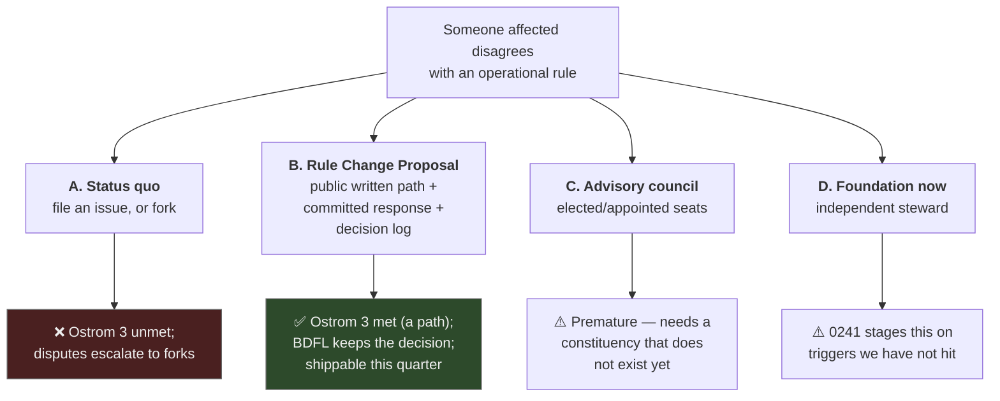

# Voice As The Complement To Exit — Ostrom, Collective Choice, And xNet Governance

> _"Most individuals affected by the operational rules can participate in
> modifying the operational rules."_
> — Elinor Ostrom, design principle 3, _Governing the Commons_ (1990)

## Problem Statement

xNet has built world-class **exit** and comparatively little **voice**.

The exit machinery is real and enforced: `did:key` identity you mint yourself,
verified `.xnetpack` bundles, four independent protocol kernels, a conformance
corpus, and a CI gate proving the MIT hub never takes a dependency on the
commercial layer. [`GOVERNANCE.md`](../../GOVERNANCE.md) justifies BDFL by
pointing _at_ that exit: "If you disagree with a decision, you can fork the
code or re-implement the protocol and interoperate."

Exploration
[0358](./0358_[x]_VALUE_CAPTURE_WITHOUT_ENCLOSURE_MOATS_SUBSTRATES_AND_THE_SLEEP_TEST.md)
found that this is exactly the posture Hirschman warns about. Its Key Finding 8
and Risks section flagged it and deferred it here, because inventing governance
inside an economics document would have been the wrong move.

**The question: what is the smallest honest voice mechanism that makes "fork
it" a genuine backstop rather than the first answer?**

## Executive Summary

**Hirschman's actual argument inverts the popular reading.** _Exit, Voice, and
Loyalty_ (1970) describes three responses to organisational decline, and its
central warning is that **too-easy exit can degrade quality** — it drains
precisely the quality-sensitive members who would otherwise have exercised
voice. Balaji Srinivasan's widely-cited 2013 reading ("exit over voice") is not
Hirschman's; Hirschman is about their _interaction_. A project whose entire
answer to disagreement is "you can leave" has optimised one variable and
ignored the one that produces improvement.

**Ostrom supplies the missing half, empirically.** Her eight design principles
for durable commons — revalidated across 91 studies by Cox, Arnold &
Villamayor-Tomás (2010) — show that long-lived commons are held together by
**governance substitutes**, not switching costs. Two are directly actionable
here: **principle 3** (those affected by the operational rules can participate
in changing them) and **principle 7** (the right to devise your own
institutions is not challenged from outside).

**And the biology says the same thing.** Kiers et al., _Science_ 333:880
(2011), showed that mycorrhizal cooperation is stabilised by **conditional,
reciprocal, enforceable exchange with sanctions** — not by connectivity.
An open network does not produce cooperation. Verifiable reciprocity plus the
ability to withdraw does. Connectivity without governance is exactly what xNet
has today.

**The nearest cautionary tale is close to home.** WordPress is GPL, forkable,
and enormously successful — and in 2024 the only check that actually worked on
a unilateral decision was a federal court injunction. The licence protected the
_code_ and nothing about the _distribution_. xNet's equivalent chokepoints are
the trademark, the plugin registry, and the eventual discovery index.

**Recommendation:** ship a **Rule Change Proposal (RCP)** process — a
lightweight, public, written path by which anyone affected by an operational
rule can propose changing it, with a **committed response time** and a
**public decision log**. Explicitly _not_ a vote, and _not_ a foundation. The
BDFL keeps the decision; what changes is that the reasoning becomes a record
and the proposer gets an answer. Scope it to the rules that actually bind
people — the humane-patterns gate, `ALLOWED_PLUGIN_LICENSES`, marketplace
terms, the Charter's refused rents — and reuse the XPP process
(`docs/specs/protocol/xpp/`) that already exists for protocol changes.

## Current State In The Repository

### What voice machinery exists

| Surface                                  | What it does                                                | Gap                                                                   |
| ---------------------------------------- | ----------------------------------------------------------- | --------------------------------------------------------------------- |
| [`GOVERNANCE.md`](../../GOVERNANCE.md)   | BDFL today; named triggers for growing past it; role ladder | Legitimates BDFL **by pointing at exit** — the posture in question    |
| `docs/specs/protocol/xpp/`               | XNet Protocol Proposals, modelled on Matrix MSCs            | Scoped to the **protocol**; operational rules are out of scope        |
| [`MAINTAINERS.md`](../../MAINTAINERS.md) | Who can merge, 12-month emeritus rule                       | Entry is by invitation; no path for the affected-but-not-contributing |
| `.github/ISSUE_TEMPLATE/`                | Bug/feature intake                                          | No rule-change path, no response commitment                           |
| `CODE_OF_CONDUCT.md`                     | Behavioural norms                                           | Conduct, not rule-making                                              |
| [`TRADEMARK.md`](../../TRADEMARK.md)     | FRAND pre-commitment; future Foundation transfer            | Pre-commitment, not yet a mechanism                                   |

### The rules that bind people, and who can change them today

This is the honest inventory — every one is currently changed by a maintainer
commit with no external path:

- `scripts/check-humane-patterns.mjs` — what counts as a dark pattern
- `ALLOWED_PLUGIN_LICENSES` (`packages/plugins/src/ecosystem/license-policy.ts`)
  — which licences may list
- `site/src/pages/marketplace-terms.astro` — fees, takedown grounds, and now
  ranking neutrality
- [`docs/CHARTER.md`](../CHARTER.md) §6 — the refused rents and the four tests
- [`docs/ECONOMICS.md`](../ECONOMICS.md) — the Moat Register
- `PLAN_CATALOG` (`packages/entitlements/src/plans.ts`) — quotas and limits

**Plugin authors, self-hosters and paying customers are affected by all six and
have a path to change none of them.** That is the Ostrom principle-3 gap stated
concretely.

## External Research

### Hirschman, precisely

_Exit, Voice, and Loyalty_ (Harvard, 1970). Three responses to decline:
**exit** (leave), **voice** (complain and try to change it), and **loyalty** —
which is not a third symmetric option but the _moderating variable_ that raises
the cost of exit and thereby makes voice more likely.

The warning that matters here: when exit is cheap and frictionless, the members
most sensitive to quality leave first and quietly, so the organisation loses
both the customer _and_ the signal. Hirschman's own framing is that exit is the
economists' mechanism and voice the political scientists', and healthy
institutions need both.

### Ostrom's principles 3 and 7

_Governing the Commons_ (1990), revalidated by
[Cox, Arnold & Villamayor-Tomás, _Ecology and Society_ 15(4):38 (2010)](https://www.ecologyandsociety.org/vol15/iss4/art38/)
across 91 studies, which found the principles well supported and split
principles 1, 2 and 4 into A/B pairs (8 → 10).

- **Principle 3 — collective choice.** Most individuals affected by the
  operational rules can participate in modifying them.
- **Principle 7 — minimal recognition of rights to organise.** The right of
  participants to devise their own institutions is not challenged by an
  external authority.

Note what principle 3 does _not_ require: it is not one-member-one-vote, and it
is not consensus. It requires a **path**. That distinction is what makes this
implementable at xNet's current size.

Applied to software commons: [SustainOSS's translation](https://sustainoss.pubpub.org/pub/jqngsp5u/release/1)
and Hess & Ostrom, _Understanding Knowledge as a Commons_ (MIT Press, 2007) —
with the caveat that knowledge commons are non-rivalrous, so the failure mode
is **enclosure**, not congestion.

### The biological form of the same claim

Kiers, Duhamel, Beesetty et al., ["Reciprocal rewards stabilize cooperation in
the mycorrhizal symbiosis"](https://doi.org/10.1126/science.1208473),
_Science_ 333(6044):880–882 (2011): plants "detect, discriminate, and reward
the best fungal partners with more carbohydrates," and fungi reciprocally
allocate more phosphorus to the more generous roots. Cheating is sanctioned by
**resource withdrawal**; enforcement is mutual and local; nobody polices from
above.

**Cooperation is stabilised by conditional, reciprocal, enforceable exchange —
not by connectivity.** This is the anti-"wood wide web" finding, and it is the
biological argument for pairing exit with voice rather than assuming an open
network self-organises.

### Where exit-without-voice actually failed

- **WordPress / WP Engine (2024).** GPL, fully forkable, ~40% of the web. The
  dispute ran through the _trademark_ and the _plugin directory_ — neither
  covered by the licence — and the effective check was a federal preliminary
  injunction in December 2024. 159 employees took a buyout to leave. The
  licence protected the code and nothing about the distribution.
- **Bluesky / atproto.** The best-engineered exit in the field: migration works
  even against a hostile PDS. And yet the overwhelming majority of accounts sit
  on the reference operator's infrastructure, with one independent full-network
  AppView. Architecture is necessary and nowhere near sufficient.
- **npm.** Mirrorable by design, and still the operator reassigned a package
  name over a trademark claim, seized a package outright, and — the sharpest
  detail — the `ua-parser-js` maintainer _could not unpublish his own hijacked
  versions_. Its published dispute-resolution process was later deleted from
  the docs.

The pattern: **when only exit exists, disputes escalate straight to forks,
lawsuits, or unilateral operator action, because there is no cheaper move
available.** Voice is the cheap move.

## Key Findings

1. **Exit without voice is the posture Hirschman warns degrades quality**, and
   `GOVERNANCE.md` currently states it as the justification for BDFL.
2. **Ostrom principle 3 requires a path, not a vote.** This is implementable
   today without a foundation, a board, or an election.
3. **Six operational rules bind non-maintainers and none has an external
   change path.** That inventory is the concrete gap.
4. **The XPP process already exists** and is the right shape — it is simply
   scoped to the protocol rather than to operational rules.
5. **Voice is the cheap conflict move.** Where it is absent, disputes jump to
   the expensive ones: forks, litigation, unilateral seizure.
6. **Cooperation needs enforceable reciprocity, not connectivity** (Kiers 2011) — which for us means a _committed response_, not a suggestion box.

## Options And Tradeoffs

| Option                      | Ostrom 3                         | Cost                                    | Honest at current size?                  | Verdict            |
| --------------------------- | -------------------------------- | --------------------------------------- | ---------------------------------------- | ------------------ |
| **A. Status quo**           | ❌ No path                       | Zero                                    | Yes, but it is the flagged gap           | ❌                 |
| **B. Rule Change Proposal** | ✅ A path exists and is answered | Low — a template, a log, a response SLA | **Yes**                                  | ✅ **Recommended** |
| **C. Advisory council**     | ✅ Strong                        | Medium — requires a real constituency   | Not yet                                  | ⚠️ Later           |
| **D. Foundation**           | ✅ Strongest                     | High — legal entity, trademark transfer | 0241 stages this on triggers not yet hit | ⚠️ Later           |

**Why not C or D yet.** Both require a constituency that does not exist:
`MAINTAINERS.md` is short and the plugin ecosystem has zero community entries.
Standing up an elected body for a community of this size would be exactly the
"theater" `GOVERNANCE.md` says it is trying to avoid. B is the version that is
honest at current scale and grows into C.

**No revenue lane is proposed here**, so the Charter's four tests do not apply.
The relevant Charter obligation runs the other way: §6 commits us to a FRAND
trademark and no chokepoint tier, and a rule-change path is what makes those
promises answerable rather than merely stated.

## Recommendation

**Ship the Rule Change Proposal (RCP) process.** Four pieces:

1. **`docs/RULE_CHANGES.md`** — what an operational rule is, the enumerated
   list of rules in scope, who may propose (anyone affected — explicitly
   including self-hosters and plugin authors, not just contributors), and what
   happens next.
2. **An RCP template** under `.github/ISSUE_TEMPLATE/rule-change.yml`, reusing
   the XPP structure: what rule, what change, who is affected, what breaks if
   we do nothing.
3. **A committed response, in writing.** Every RCP gets a public
   accept/decline/defer **with reasoning** within a stated window. This is the
   Kiers point: reciprocity that is _conditional and answered_, not a
   suggestion box.
4. **A public decision log** — `docs/decisions/` or an append-only section —
   so the record survives the person. Refusals belong in it as much as
   acceptances; a log of only the accepted proposals is marketing.

**Then amend `GOVERNANCE.md`** so BDFL is legitimated by _two_ things rather
than one: the right to leave **and** the right to be heard on the record.

### Scope discipline

- Not a vote. Not a veto. Not a foundation.
- Protocol changes stay in XPP; this covers _operational_ rules only.
- The list of in-scope rules is enumerated, so this cannot become an unbounded
  obligation to litigate every preference.

## Risks And Open Questions

- **A response SLA is a real commitment with no staff behind it.** A missed
  window is worse than no promise. Mitigation: set it generously (e.g. 30
  days), and count "deferred, here's why" as a response.
- **Low volume will look like failure.** At current size the honest expectation
  is a handful of RCPs a year. The value is that the path exists and is
  visible when it matters — not throughput.
- **Capture risk.** A written process can be flooded by a motivated commercial
  party. The enumerated-scope rule and the BDFL's retained decision are the
  guards; revisit if it is ever exercised in volume.
- **This does not solve the WordPress failure mode.** Trademark and registry
  chokepoints need the structural answer 0241 stages (foundation, FRAND
  transfer). RCP makes disputes visible earlier; it does not remove the
  chokepoint.
- **Open question:** should plugin authors and paying customers get a
  _stronger_ form of voice than the general public, given they bear concentrated
  cost? Ostrom's principle is "those affected," which argues yes; a tiered
  process argues against simplicity. Deferred.

## Implementation Checklist

- [x] Write `docs/RULE_CHANGES.md` — definition, enumerated in-scope rule list,
      who may propose, and the response commitment.
- [x] Add `.github/ISSUE_TEMPLATE/rule-change.yml` modelled on the XPP template.
- [x] Create the public decision log (`docs/decisions/rule-changes.md`),
      seeded with the two refusals 0358 added to the Charter so the log starts
      with real entries.
- [x] Amend `GOVERNANCE.md`: legitimate BDFL by exit **and** voice; link the
      RCP process from "How decisions are made".
- [x] Cross-link from [`CHARTER.md`](../CHARTER.md) §6 and
      [`ECONOMICS.md`](../ECONOMICS.md) — the rules those documents set are the
      ones in scope.
- [x] Add a `governance-rule-change-path` claim to the conformance ledger
      (`packages/telemetry/test/charter-claims-ledger.test.ts`), enforced by
      the existence of the decision log.

## Validation Checklist

- [ ] Every rule in the §"rules that bind people" inventory appears in
      `docs/RULE_CHANGES.md`'s in-scope list, or is explicitly excluded with a
      reason.
- [ ] A non-contributor can find the path from the repo root in two clicks
      (README → GOVERNANCE → RULE_CHANGES).
- [ ] The decision log contains at least one **declined** proposal — a log of
      only acceptances is marketing.
- [ ] `GOVERNANCE.md` no longer justifies BDFL by exit alone.
- [ ] The claims ledger fails if the decision log is deleted.

## References

**Theory**

- Hirschman, _Exit, Voice, and Loyalty_ (Harvard, 1970) · [full text ch. 1–5](https://pages.ucsd.edu/~bslantchev/courses/ps240/05%20Cooperation%20with%20States%20as%20Unitary%20Actors/Hirschman%20-%20Exit,%20voice,%20and%20loyalty%20[Ch%201-5].pdf)
- Ostrom, _Governing the Commons_ (Cambridge UP, 1990)
- [Cox, Arnold & Villamayor-Tomás, "A Review of Design Principles for Community-based Natural Resource Management", _Ecology and Society_ 15(4):38 (2010)](https://www.ecologyandsociety.org/vol15/iss4/art38/)
- [SustainOSS — The Principles of Governing Open Source Commons](https://sustainoss.pubpub.org/pub/jqngsp5u/release/1)
- Hess & Ostrom (eds.), _Understanding Knowledge as a Commons_ (MIT Press, 2007)
- Kiers et al., ["Reciprocal rewards stabilize cooperation in the mycorrhizal symbiosis"](https://doi.org/10.1126/science.1208473), _Science_ 333:880 (2011)

**Cases**

- [WP Engine v. Automattic — preliminary injunction, 10 Dec 2024](https://techcrunch.com/2024/12/10/court-orders-mullenweg-and-automattic-to-restore-wp-engines-access-to-wordpress-org/)
- [Lemmer-Webber, "How decentralized is Bluesky really?"](https://dustycloud.org/blog/how-decentralized-is-bluesky/)
- [npm — kik, left-pad, and npm](https://blog.npmjs.org/post/141577284765/kik-left-pad-and-npm.html)

**Internal**

- [0358 — Value capture without enclosure](./0358_[x]_VALUE_CAPTURE_WITHOUT_ENCLOSURE_MOATS_SUBSTRATES_AND_THE_SLEEP_TEST.md) — Key Finding 8; this exploration is its deferred follow-on
- [`GOVERNANCE.md`](../../GOVERNANCE.md) · [`docs/CHARTER.md`](../CHARTER.md) · [`docs/ECONOMICS.md`](../ECONOMICS.md) · [`TRADEMARK.md`](../../TRADEMARK.md)
- 0241 — Legal and funding structure (the foundation path and its triggers)
- `docs/specs/protocol/xpp/` — the XPP process this reuses
