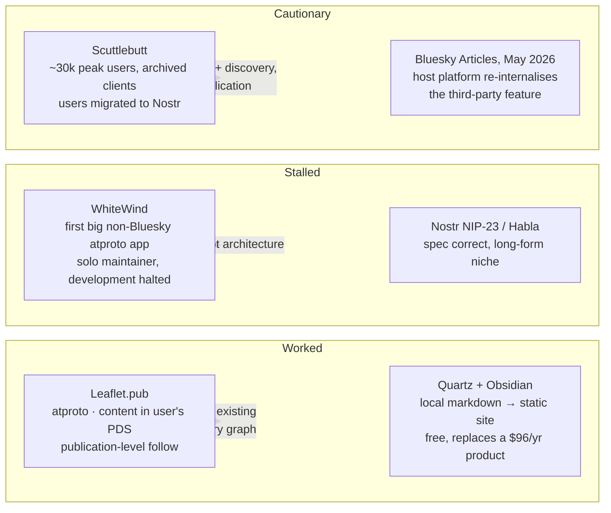
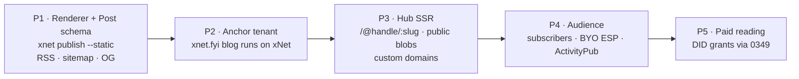

# Publishing On xNet — Ghost, Substack, And The Owned Audience

> Exploration 0362 · 2026-07-18
> Lineage: [[0346_COMPOSABLE_UI_FRAMES]] (the page substrate this publishes from),
> [[0358_VALUE_CAPTURE_WITHOUT_ENCLOSURE]] (the Sleep test, applied below),
> [[0349_FIRST_CLASS_PAYMENTS]] (payment-mints-capability, the paywall mechanism),
> [[0344_EXPORT_IMPORT_PORTABLE_BUNDLES]] (what "portable audience" has to mean),
> [[0334_MASTODON_VS_ATPROTO]] (which distribution rail buys what),
> [[0169_SHARE_VIA_URL]] (the grant model a public reader has to bypass).

## Problem Statement

xNet stores documents, renders them in a good editor, and can mark them
`public`. It cannot **publish** them. There is no URL you can send to a stranger
that renders your writing as a web page, no feed a reader can subscribe to, no
subscriber list you own, and no way to charge for access.

This is not a missing feature so much as an unpaid debt. `docs/CHARTER.md` §6
commits to "you own your audience and your space", and then marks the publishing
half of that commitment **Aspirational**:

> **Aspirational:** "own your audience" publishing — publish from your graph to an
> owned page with a portable, DID‑based subscriber list — tracked in
> exploration 0234 (Wave 3).

Two years of Charter claims-ledger discipline have converted most aspirational
entries into architectural ones. This is the largest remaining one, and it is
also the most externally legible: "own your audience" is precisely the claim
every writer leaving Substack in 2025–26 is testing.

The question this document answers is not "can we build a blog engine" — of
course we can. It is: **what does xNet have that Ghost and Substack structurally
cannot have, and what will it cost to get to a publishing product that is
honestly better rather than merely ideologically purer?**

## Executive Summary

**Verdict: build the publishing spine, ship static export first, and refuse to
become an email service provider.**

**1. The take-rate wedge is already gone.** Ghost takes 0% and has since
inception; Beehiiv takes 0%. Substack's 10% is real, and writers are visibly
leaving over it — Sean Highkin priced his own move at $2,052/yr on Ghost versus
$4,968/yr on Substack — but "we take 0%" is table stakes, not a differentiator.
Any xNet publishing pitch that leads with take rate is competing on a dimension
where the incumbent open-source player already ties us.

**2. The real wedge is that the audience relation is a signed node, not a row in
someone's database.** Every incumbent — including Ghost — models a subscriber as
an email address in the publisher's tenant. Portability means "export a CSV",
which multiple 2025 critiques correctly call portability theater: a raw CSV is
not a functioning publishing operation. On xNet a subscriber can be a **DID with
a capability grant**, living in the author's own space, queryable with
`useQuery`, exportable in a `.xnetpack` (0344), and re-honoured by any hub. That
is a different *kind* of object, and it is the one thing no incumbent can copy
without rebuilding their identity layer.

**3. The critical path is a renderer, and it does not exist.** Grepping the repo
for `blocksToHTMLLossy`, `ServerBlockNoteEditor`, or any block→HTML path returns
**zero hits**. Content lives in a Yjs `content-v4` XmlFragment; the only
extraction path that exists is fragment→markdown in
`packages/plugins/src/ai-surface/page-fragment.ts`. Everything else in this
document is downstream of building a deterministic, server-runnable renderer.

**4. Email deliverability is a moat we should decline to cross.** Google/Yahoo
bulk-sender rules (SPF+DKIM+DMARC, one-click `List-Unsubscribe`, complaint rate
under 0.1%) plus 1–6 month dedicated-IP warmup make "we send your newsletter" an
operations business, not a software one. Mailgun doubling its Flex rate from
$1.00 to $2.00/1K in December 2025 is a reminder that even the specialists have
pricing power over us. **BYO ESP** — the author brings Resend/SES/Postmark
credentials — keeps us out of a business we would be bad at and keeps the BATNA
test passing.

**5. The dogfood case is sitting in the repo.** `site/src/data/blog.ts` states
outright that "the site has no MDX/content-collection blog" — 19 hand-authored
`.astro` pages with bespoke SVG hero art. xNet's own blog does not run on xNet.
That is the anchor tenant (0351's rule), and it is an unusually honest one:
if the publishing product cannot host our own art-directed essays, it is not
finished.

**6. Where xNet loses, and we should say so.** No discovery network (Substack's
Recommendation Network is the actual reason writers tolerate the 10%), no theme
ecosystem, no deliverability reputation, and a hub whose only HTML surface today
is deliberately `noindex, nofollow`. Publishing on xNet will be better at
*ownership* and worse at *reach* for a long time.

## Current State In The Repository

The substrate is roughly half-built, and the missing half is consistently the
**read side for anonymous visitors**.

```mermaid
flowchart TB
  subgraph AUTH ["Authoring — largely built"]
    ED["packages/editor/src/blocknote/<br/>XNetEditor.tsx · BlockNote 0.51.4"]
    FRAG["Yjs fragment 'content-v4'<br/>packages/plugins/src/ai-surface/page-fragment.ts"]
    PAGE["PageSchema<br/>packages/data/src/schema/schemas/page.ts<br/>title · icon · cover · tags · visibility · geometry"]
    FRAME["Frame contract<br/>packages/views/src/frames/types.ts"]
    ED --> FRAG --> PAGE
    FRAME -.embeds.-> PAGE
  end

  subgraph GATE ["Access — built, but not for strangers"]
    VIS["resolveEffectiveVisibility()<br/>packages/hub/src/routes/public.ts"]
    SHARE["Share links + per-DID grants<br/>packages/hub/src/routes/share-links.ts"]
    LIC["DID-bound offline tokens<br/>packages/licenses/src/token.ts"]
  end

  subgraph MISS ["Publishing — missing"]
    HTML["content-v4 → HTML<br/>ZERO implementations in repo"]
    POST["Post / Publication schema<br/>does not exist"]
    SLUG["slug routing · canonical URLs<br/>sitemap · OG tags"]
    SUB["subscriber list · feeds<br/>paid reader tier"]
  end

  PAGE --> VIS
  VIS -->|"JSON + base64 Yjs only"| MISS
  LIC -.->|"pattern to generalise"| SUB

  style MISS fill:#3a2222,stroke:#a55
  style AUTH fill:#223a26,stroke:#5a5
```



### What exists and is genuinely reusable

| Capability | Path | Note |
|---|---|---|
| Anonymous public read (JSON) | `packages/hub/src/routes/public.ts` | `GET /public/node/:id`, `/public/space/:id`. `resolveEffectiveVisibility()` walks `visibility` up the Space ancestor chain (`public`/`unlisted`/`private`/`inherit`, default private). **This is the single best foundation in the repo.** |
| Content → markdown | `packages/plugins/src/ai-surface/page-fragment.ts` | `XNET_PAGE_FRAGMENT_FIELD = 'content-v4'`, bidirectional fragment↔markdown. Legacy TipTap `content` fallback. |
| Plain-text excerpt, no editor instance | `packages/editor/src/blocknote/doc-preview.ts` | Walks the Yjs XML tree directly — usable server-side for excerpts and meta descriptions today. |
| Page schema | `packages/data/src/schema/schemas/page.ts` | Has `title`, `icon`, `cover`, `tags`, `space`, `visibility`, `geometry` (0346). |
| DID-bound offline-verifiable grant | `packages/licenses/src/token.ts` | Ed25519 `PluginLicense` bound to a buyer DID, verified fully offline by an adversarial client. **The paid-reader primitive, one generalisation away.** |
| Share grants + role ladder | `packages/hub/src/routes/share-links.ts`, `services/share-access.ts` | `SHARE_DOC_TYPES` includes `page`; roles `read`/`comment`/`write`. Link is a bootstrap that mints a per-DID grant — disabling the link does not evict claimed members. |
| Comments / reactions | `packages/data/src/schema/schemas/comment.ts`, `reaction.ts` | Universal, schema-agnostic `target` relation. Inline comments already work via `packages/editor/src/blocknote/comments/xnet-thread-store.ts`. |
| Frames | `packages/views/src/frames/types.ts` | `FrameSource`/`FrameTier`/`FrameDef`, `FRAME_MAX_DEPTH = 2`. A post body containing a live table is already a solved problem. |
| Server-side node access | `packages/server/src/server.ts` | `createXNetServer()` — `query()`/`mutate()` with auth hooks. **No HTTP layer, no rendering**; the name oversells it. But it is exactly the seam an Astro/Next SSR adapter needs. |
| RSS builder | `site/src/lib/blog-feed.ts` | `buildBlogRss`, Dublin Core `<dc:creator>` for multi-author bylines. Pure function, directly liftable. |

### What is missing

1. **No block→HTML renderer anywhere.** Zero hits for `blocksToHTMLLossy`,
   `ServerBlockNoteEditor`, `toHTML`. This is the critical path.
2. **No `Post` / `Article` / `Publication` / `Site` schema.** No slug, no
   `publishedAt`, no byline, no excerpt, no canonical URL, no editorial state.
   (`packages/data/src/schema/schemas/posting.ts` is a false friend — it is a
   double-entry accounting ledger leg.) `draft.ts` is a message compose draft,
   not editorial state; 0329's **frontier** primitive is the real draft model.
3. **The hub cannot serve a readable page.** The only HTML it emits is
   `packages/hub/src/routes/share-interstitial.ts`, which deliberately sets
   `noindex, nofollow`, `data-nosnippet`, `no-referrer`. There is no
   `serveStatic`, no template engine, no SSR.
4. **Public blobs are unreachable.** `PUT/GET /files/:cid`
   (`packages/hub/src/routes/files.ts`) is capability-gated, so a public post's
   cover image and inline images would not load for a logged-out reader.
5. **No paid-content path.** `packages/billing` and `packages/entitlements`
   cover *hosting plans* (`PlanId = demo|personal|…|enterprise`) and plugin
   licences. Nothing maps a subscription to content access; the share-role
   ladder has no `member` rung and `public.ts` has no gating hook.
6. **No slug routing, custom domains, sitemaps, or OG tags** for user content.
   All app routes are `$docId`-based (`apps/web/src/routes/doc.$docId.tsx`).
7. **Our own blog is not dogfooded.** `site/src/data/blog.ts` is the single
   source of truth for 19 hand-authored `.astro` posts with per-post SVG art.

## External Research

> Confidence note: vendor pricing pages were fetched directly where possible.
> Several third-party "pricing guide" sites quote conflicting figures and appear
> to be SEO farms; those are excluded. Prices move — re-verify before quoting
> any of these in customer-facing copy.

### Ghost — the honest comparator

Node.js + Express core, Ember admin, **Handlebars** theme layer, Bookshelf ORM
over MySQL in production. The Koenig editor was rebuilt on React + Lexical. Two
APIs: a read-only public **Content API** and an authenticated **Admin API**, and
it runs headless if you swap the theme layer for a static-site framework.

Ghost Pro (annual billing, per ghost.org/pricing): **Starter $18/mo** (1k
members, 1 staff, **no paid subscriptions**), **Publisher $29/mo** (custom
themes, 3 paid tiers), **Business $199/mo** (10k members, 15 staff), Custom
above that. **0% take** on subscription revenue on all paid-eligible tiers —
Stripe's 2.9% + $0.30 only. Memberships run through **Portal**, an embeddable
signup/account widget; Ghost auto-creates a Stripe Product per tier.

Ghost 6.0 (5 Aug 2025) made **ActivityPub a first-class toggle**: a publication
gets a fediverse actor, Mastodon/Threads/Flipboard users can follow, like, reply
and repost, and admins can post short-form Notes. That work shipped
incrementally from the first federated newsletter in July 2024.

**Ghost is the benchmark, not the enemy.** It is open source, self-hostable,
takes 0%, and now federates. The gap it leaves: a subscriber is still an email
address in a MySQL table in *your* tenant, self-hosting means running MySQL and
solving deliverability yourself, and the Handlebars theme layer is dated.

### Substack — the thing writers are leaving

Flat **10% of subscription revenue** on top of Stripe. $1.1B valuation on a
$100M Series C (BOND, July 2025); **5M+ paid subscriptions** by March 2025 (note:
subscriptions, not unique payers); ~100k publications earning money by April
2026; Substack net revenue ≈$45–48M in 2025 on $450M+ gross writer revenue.

The flywheel is the **Recommendation Network** (2022) plus **Notes** (2023) — a
built-in discovery layer none of the 0%-take alternatives have. This is the
honest answer to "why does anyone pay 10% when Ghost is free": **they are buying
distribution, not software.**

The exodus is real and named: Alison Roman moved 343k subscribers to Ghost
(Sept 2025); Anne Helen Petersen left for Patreon; The Ankler moved to a
dedicated platform; Sean Highkin published the arithmetic — $2,052/yr on Ghost
versus $4,968/yr on Substack. Beehiiv self-reports ~3,000 Substack migrations in
the year to March 2025 (unaudited, directional). Set against 5M+ paid subs, this
is friction at the top end, not collapse.

Two further pressures worth recording: the moderation controversy (a
Guardian-led investigation found Substack monetising explicitly Nazi
newsletters; a push notification promoted a self-described National Socialist
publication; leadership's position has been that removal "makes the problem
worse"), and the export critique — you *can* export posts and your subscriber
list, but a CSV is not an operation. Medium is stricter still: it **stopped
letting writers see or export subscriber emails collected after May 2025**.

### The rest of the field

| Platform | Position | Pricing (2025–26) |
|---|---|---|
| **Beehiiv** | Growth/monetisation tooling, ad network, referrals | Free to 2,500 subs; **Scale $43/mo, Max $96/mo** annual — recently moved to **flat fees regardless of list size**. 0% on subscriptions. |
| **Kit (ConvertKit)** | Creator marketing suite | Free to 10k subs; Creator from $39/mo, Pro $79/mo. Raised ~35% Sept 2025. |
| **Buttondown** | Minimal, writer/dev-friendly | Cheaper than Kit at scale; exact tiers unverified. |
| **Medium** | Curation + paywall, engagement-weighted payouts | Strictest lock-in surveyed (no subscriber-email export post-May 2025). |
| **WordPress.com** | Free → Commerce $45–70/mo | Gutenberg + full-site editing is the default paradigm. Automattic bought the ActivityPub plugin (March 2023) and hired its maintainer. |
| **Webflow** | Visual site builder | Restructured May 2026: Basic ~$15, **Premium $25** (CMS+Business merged), Team $2,500/yr-band. |
| **Framer** | Design-led sites | Basic $10 / Pro $30 / Scale $100+, **plus $20/mo per editor seat** from May 2026. |
| **Notion-as-CMS** (super.so, potion.so) | Wrap Notion pages as a site | Super ~$16–28/mo; Potion $10–24/mo; Notion's own Sites $18/mo/seat, weaker on SEO. |
| **Bear Blog** | Radically minimal, no-JS, privacy-first | Free tier usable; **$5/mo or $48/yr**. |
| **Mataroa** | Minimal + native daily digest email | Free, $9/yr custom domain. |
| **Write.as / WriteFreely** | Federated minimal blogging | ~$5–6/mo; WriteFreely speaks ActivityPub natively. |
| **Hashnode** | Developer blogging | Introduced a **$5/mo Pro tier in 2026** after paywalling API access; pricing in flux. |
| **Obsidian Publish** | Hosted digital garden | **$96/yr**. |
| **Quartz** | OSS SSG for Obsidian vaults | **Free** — a full replacement for Publish, graph view and backlinks included. |
| **Astro / Eleventy** | SSGs | Astro ~2M weekly npm downloads vs Eleventy ~200k; Astro 5 added Server Islands + Content Layer. |

### Decentralised publishing prior art — what actually happened



The pattern is consistent and uncomfortable: **protocol-level decentralisation
is the solved part. Maintainership, discovery, and monetisation are the
bottlenecks.** Scuttlebutt's gossip replication worked; it peaked around 30k
users and its recommended clients are archived repos. WhiteWind shipped first
and stalled on a single maintainer. Nostr's NIP-23 (`kind:30023` addressable
events) is spec-correct and long-form usage stayed niche.

Two positive lessons:

- **Leaflet.pub** became the most popular atproto blogging platform within about
  six months of real integration (May 2025), and shipped the one primitive worth
  stealing outright: **you can follow a *publication*, independent of following
  the author's social account.** Subscription as a first-class relation, not a
  social side-effect. It succeeded by layering on an *existing* discovery graph
  rather than bootstrapping its own.
- **Quartz** is the strongest existence proof for our shape: local-first
  authoring in plain files plus static-site publishing, good enough that it
  fully substitutes for the paid hosted product without losing graph or
  backlinks.

And one warning: **Bluesky added native long-form Articles in May 2026**,
explicitly countering X's Articles. Host platforms re-internalise successful
third-party features. Building xNet publishing *purely* as an atproto app view
would put us in that blast radius.

### The economics we cannot argue with

**Email deliverability is a real moat.** Amazon SES is ~**$0.10/1,000** but
gives you an engine, not an ESP — list management, templates, unsubscribe
compliance are yours to build. Postmark: $15/mo + $1.80/1K, falling to
~$1.20/1K at volume. Resend: 3,000/mo free, **$20/mo for 50,000**. Mailgun
**doubled** its pay-as-you-go Flex rate from $1.00 to $2.00/1K in December 2025.
Dedicated IPs run ~$25–99/IP/month and only make sense above ~100k emails/month,
with **1–6 months of warmup** before the reputation is usable.

Since **1 Feb 2024** (graduated rejection from April 2024), Google treats
>5,000 messages/day to Gmail as bulk and requires SPF + DKIM + a published,
aligned **DMARC** record, **one-click `List-Unsubscribe`**, and a complaint rate
under **0.1%** (0.3% is the damage ceiling). Yahoo matches with a vaguer
threshold. This is the compliance floor for *any* email feature, self-hosted or
not.

One self-hosted operator reports **Listmonk + SES at $8/month total**, claiming
savings of ~$700/yr at 5k subscribers, ~$1,000/yr at 10k, and $5,000+/yr at 50k
versus hosted platforms. Self-reported, not audited, but directionally the
reason "BYO ESP" is attractive to exactly the audience xNet appeals to.

**Stripe**: 2.9% + $0.30 domestic, 3.1% + $0.30 international, +1.5%
cross-border, Billing +0.7%, Tax +0.5%, $15 per dispute. Both Ghost's and
Beehiiv's "0% take" claims are accurate and both exclude these — the creator
absorbs them on any platform.

**Distribution rails**: RSS is in genuine resurgence (one widely-repeated figure
claims 34% YoY growth among professionals and ~50M users — industry-blog
sourced, use as colour not statistic). ActivityPub adoption broadened materially
(Automattic 2023, Ghost 6.0 in 2025). Flipboard's **Surf** (April 2026) reads
ActivityPub, RSS, **and** atproto in one client — good evidence that these three
rails are converging into interchangeable "sources" from the reader's side.

## Key Findings

**F1 — The differentiator is the subscriber, not the post.** Posts are a solved
commodity; every platform in the table above renders markdown well. The audience
relation is where the models genuinely diverge. Ghost, Substack, Beehiiv and Kit
all model a subscriber as an email address in the publisher's tenant. xNet can
model a subscriber as a **DID holding a capability grant**, stored as nodes in
the author's own space. That survives the hub, survives us, and is queryable
with the same `useQuery` as everything else.

**F2 — "Portable audience" only means something if the reader has an identity.**
This is the hard constraint. An email address is a portable identifier that
every human already has; a `did:key` is not. A publishing product that *requires*
readers to hold DIDs will have no readers. Therefore the subscriber model must be
**two-tier**: email subscribers (the mass case, delivered via BYO ESP) and DID
subscribers (the sovereign case, delivered by sync/feeds and eligible for
offline-verifiable paid grants). Both live as nodes in the author's space.

**F3 — The renderer is the critical path and it is genuinely absent.** Nothing
else in this document can ship before `content-v4` → HTML exists, is
deterministic, and runs outside a browser. BlockNote ships a lossy HTML
exporter upstream; the work is wiring it to run server-side over a Yjs fragment
without a DOM, and handling xNet's custom specs (`wikilink.tsx`,
`database-embed.tsx`, `task-view-embed.tsx`, `ai-generated.tsx`) — the embeds
being the interesting part, since a Frame in a published post must degrade to a
static table or a link, not a blank div.

**F4 — Static export dominates hub rendering for v1.** A published site is
overwhelmingly read-only, cacheable, and SEO-sensitive. The hub is a
single-process Hono app with no static serving, no templating, and one
deliberately `noindex` HTML route. Generating a directory of HTML and pushing it
to any static host is cheaper to build, faster to serve, trivially CDN-able, and
— critically for the BATNA test — produces an artifact that works with **no
xNet infrastructure at all**.

**F5 — Public blobs are a silent blocker.** `/files/:cid` is capability-gated.
Every published post with a cover image is broken for logged-out readers until
there is an anonymous blob path scoped to publicly-visible content. This is
small work that will otherwise be discovered late and embarrassingly.

**F6 — 0329's frontier already models editorial state correctly.** Draft /
scheduled / published is not a new state machine; a published post is a
**pinned frontier** and the live document continues past it. This gives
"published version" versus "working copy" for free, plus a real "updated on"
diff, and it reuses machinery that already exists in `packages/history`.
Note 0329's rule: **pruning must respect pins** — a published frontier is a pin.

**F7 — We should not compete on discovery, and should say so.** Substack's
Recommendation Network is the reason its 10% is survivable. We will not build a
recommendation network; that is a scored-standing mechanic that
`docs/VIBE.md` rules out ("reciprocity legible, never scored") and
`scripts/check-humane-patterns.mjs` would flag. The honest substitute is
**federation** — RSS on day one, ActivityPub soon after — borrowing reach from
networks that already exist, which is exactly what Leaflet did successfully.

**F8 — The anchor tenant is our own blog, and it is a demanding one.** 0351's
rule requires a first-party consumer in the same phase as any new rail.
`site/src/data/blog.ts` plus 19 art-directed `.astro` pages is a genuinely hard
target: per-post bespoke SVG heroes, multi-author bylines, draft support, an RSS
feed with Dublin Core `<dc:creator>`. If the design cannot express those, it is
a toy. This argues strongly for the **headless** option — xNet as the content
source, Astro as the presentation layer — rather than a themes system.

## Options And Tradeoffs

```mermaid
flowchart TB
  A["A · Status quo<br/>hand-authored Astro"]
  B["B · Headless CMS<br/>xNet source → SSG/SSR"]
  C["C · Hub renders HTML<br/>hub as web server"]
  D["D · Full managed product<br/>Ghost competitor"]
  E["E · Federate only<br/>publish into atproto/AP"]

  A -->|"no publishing"| X1["fails Charter §6"]
  B -->|"ship first"| Y["shared spine:<br/>Post schema + renderer<br/>+ subscriber nodes"]
  C -->|"ship second"| Y
  D -->|"defer"| Z["needs ESP ops<br/>+ themes + discovery"]
  E -->|"adjunct, not core"| W["Bluesky Articles<br/>blast radius"]

  style B fill:#223a26,stroke:#5a5
  style C fill:#2a3340,stroke:#68a
  style D fill:#3a2222,stroke:#a55
```



### A — Status quo: keep hand-authoring Astro

**Verdict: ❌** Leaves Charter §6 aspirational indefinitely. Also quietly
corrosive: every essay we publish about owning your audience is published on a
system that does not.

### B — Headless: xNet is the CMS, a static generator is the presentation layer

Author in xNet; a build step reads nodes through `createXNetServer()`
(`packages/server/src/server.ts`), renders `content-v4` to HTML, and emits a
static site — plus `rss.xml`, `sitemap.xml`, OG tags and canonical URLs. Deploy
anywhere: Netlify, Pages, S3, a Raspberry Pi (0300).

| | |
|---|---|
| Improvement | Nothing rented — the generator is MIT and runs on the author's laptop. |
| BATNA | **Strongest of all options.** Output is plain HTML on a domain you own; xNet infrastructure is not in the read path at all. |
| Vanish | Content in the workspace, site on your host, feed at your URL. Survives us completely. |

**Pros**: fastest to ship; best SEO (static HTML, real URLs); zero read-path
cost; satisfies the anchor tenant directly (our blog keeps its bespoke art
because Astro components stay in our hands); the `blog-feed.ts` RSS builder is
liftable as-is.

**Cons**: requires a build/deploy step, so "publish" is not instant unless we
automate it; no dynamic paywall (a static site cannot gate reads server-side);
comments need a runtime.

**Verdict: ✅ ship first.**

### C — The hub serves HTML directly

Extend the hub with an SSR route: `GET /@:handle/:slug` renders a published post,
`GET /@:handle` renders an index, `/feed.xml` emits RSS. Reuses
`resolveEffectiveVisibility()` and adds the paywall hook `public.ts` lacks.

| | |
|---|---|
| Improvement | Managed hosting margin pays for rendering, egress, CDN, TLS, custom domains — real operations. Passes. |
| BATNA | Passes **only if** the same rendering runs in a self-hosted hub with no feature gating, and option B remains fully supported. Must be enforced, not promised. |
| Vanish | Passes only if published content and the subscriber list live as **nodes in the author's space**, never solely in hub-side tables. This is the load-bearing constraint of the whole design. |

**Pros**: instant publish, no build step; dynamic paid gating is possible;
custom domains and per-hub identity; a real managed-hosting revenue lane.

**Cons**: the hub gains a web-server surface it has deliberately avoided
(caching, TLS, custom domains, abuse, crawler traffic); the moderation stack
(`packages/abuse`, `moderation.ts`) becomes load-bearing — `public.ts`'s own
header note already flags this as a pre-GA gate; anonymous public traffic is a
new DoS surface on a process currently sized for authenticated sync.

**Verdict: ✅ ship second, behind B.**

### D — Full managed publishing product (a Ghost competitor)

Themes, hosted email sending, dedicated IPs, member management, analytics.

**Verdict: ❌ for now.** This is an operations business: IP warmup measured in
months, complaint-rate monitoring, DMARC support burden, a theme ecosystem, and
discovery. It also fails the **improvement test** in its most tempting form — if
we host the subscriber list such that leaving means losing the audience, that is
ground rent by definition. Revisit only after B and C have real users.

### E — Federate-only: publish into atproto / ActivityPub, no reader surface of our own

**Verdict: ❌ as a strategy, ✅ as an adjunct.** 0301 already settled the shape:
identity yes, sync no — atproto repos are entirely public and the write budget
(~5,000 points/hr) is incompatible with our throughput. And Bluesky natively
adding Articles in May 2026 is the precise failure mode: build only inside
someone's app-view surface and you get re-internalised. Federation is a
**distribution rail we emit onto**, not the product.

### Revenue lane, stated plainly

The lane is **managed publishing hosting** (option C as a paid tier of xNet
Cloud): rendering, CDN, custom domains, TLS, and optionally a *relay* to the
author's own ESP credentials.

- **Improvement test** — ✅ the margin pays for egress, cache, certificates and
  compute we actually run. It does not pay for access to the author's content
  or audience, both of which they already hold locally.
- **BATNA test** — ✅ *conditionally*. Enforced by keeping option B first-class:
  `xnet publish --static` must emit a deployable directory forever, and the
  self-hosted hub must render identically. If a publishing feature ever ships to
  Cloud but not to a self-hosted hub, this test has failed and the feature is
  wrong.
- **Vanish test** — ✅ *conditionally*. Content is nodes; subscribers are nodes;
  the published artifact is HTML on a domain the author controls. The failure
  mode to design against is a subscriber list that exists only in hub tables —
  **the hub may cache the audience, never own it.**
- **Sleep test** (0358) — ⚠️ **this lane has no cliff, and also no moat, and the
  competitor already exists.** The test asks what survives if a well-funded
  rival open-sourced our entire feature set tomorrow. For publishing that is not
  hypothetical: **Ghost is already that rival** — MIT-ish, self-hostable, 0%
  take, and federating since 6.0. What survives is not the software but the
  *running of it*: rendering, CDN, TLS, custom domains, certificate renewal, and
  an ESP relay for people who do not want to operate any of it. That is
  precisely Ghost Pro's own business, and it is demonstrably real at $18–199/mo
  **despite** Ghost being free to self-host. So the lane passes — but it passes
  as a thin, crowded operations margin with no defensibility, which is exactly
  the "improvement fails gradually" shape 0358 tells us to prefer over a cliff.
  The honest consequence: **publishing must not be modelled as a profit centre.**
  It is a Charter obligation (§6) that should roughly pay for itself.

Per 0349, take rate on paid subscriptions is **0%**, settled Stripe Connect
Standard direct charges, xNet never in the flow of funds.

## Recommendation

**Build one spine, expose it through two surfaces, and dogfood it on our own
blog.**

```mermaid
flowchart TB
  subgraph SPINE ["The spine — build once"]
    PS["PostSchema + PublicationSchema<br/>slug · publishedAt · excerpt · byline · canonical"]
    R["@xnetjs/publish renderer<br/>content-v4 → HTML (headless, deterministic)"]
    SUBN["Subscriber nodes<br/>email tier + DID tier"]
    FR["Published frontier (0329)<br/>pinned version vs working copy"]
  end

  subgraph S1 ["Surface 1 — static (Phase 1-2)"]
    CLI["xnet publish --static<br/>→ HTML + rss.xml + sitemap.xml"]
    HOST["any static host"]
  end

  subgraph S2 ["Surface 2 — hub SSR (Phase 3-4)"]
    HUB["GET /@handle/:slug<br/>GET /@handle/feed.xml"]
    GATE["paywall hook<br/>DID grant · licences pattern"]
  end

  subgraph DIST ["Distribution — borrowed reach"]
    RSS["RSS"]
    AP["ActivityPub"]
    ESP["BYO ESP<br/>Resend / SES / Postmark"]
  end

  SPINE --> S1 --> HOST
  SPINE --> S2 --> GATE
  S1 --> RSS
  S2 --> RSS --> AP
  SUBN --> ESP

  style SPINE fill:#223a26,stroke:#5a5
  style DIST fill:#2a3340,stroke:#68a
```



### The five decisions

**D1 — A `Post` is a `Page` with editorial fields, not a new document type.**
Add `PublicationSchema` (a site: title, description, base URL, authors, theme
hints) and extend pages with publishing metadata rather than forking the editor.
This keeps 0346's substrate claim intact — every page is a stack of frames, and
publishing is a *lens* over it, not a different kind of object.

**D2 — Publishing is pinning a frontier.** Reuse 0329. `publishedFrontier` on
the post; the live doc moves on; "updated on" is a real diff; unpublish is
unpinning. Respect 0329's pruning rule.

**D3 — Two subscriber tiers, both as nodes in the author's space.**
`Subscriber { kind: 'email' | 'did', address?, did?, tier, confirmedAt,
source }`. Email subscribers get delivery via the author's own ESP credentials.
DID subscribers get sync-native delivery and are eligible for
offline-verifiable paid grants generalised from `packages/licenses/src/token.ts`.
The hub may **cache** this list; it must never be the only copy.

**D4 — BYO ESP. We do not send email.** The author supplies Resend/SES/Postmark
credentials; we generate compliant MIME (one-click `List-Unsubscribe`, correct
DMARC alignment against *their* domain) and hand it over. We publish the
compliance checklist and refuse the reputation business. Revisit only if a
managed relay can be built without becoming the sender of record.

**D5 — RSS in phase 1, ActivityPub in phase 4, atproto as a watch item.**
RSS is free (lift `site/src/lib/blog-feed.ts`), universally consumed, and
resurgent. ActivityPub buys real reach (Ghost 6.0, WordPress, Flipboard Surf all
speak it) at moderate cost. Steal Leaflet's primitive: **following a publication
is distinct from following its author.**

**Economic posture.** The managed-hosting lane passes all four Charter tests
(worked through in Options above), but the Sleep test is the one that shapes the
plan: Ghost already ships this feature set as open source at 0% take, so there
is no defensible margin here and never will be. Publishing is therefore scoped
as a **Charter obligation that pays for itself**, not a profit centre — which is
also why phases 1–2 deliberately produce a static artifact that needs none of
our infrastructure at all.

### Phasing



> **Anchor-tenant rule (0351):** Phase 2 is not optional and not reorderable.
> The static publishing rail ships with xNet's own blog as its first serious
> tenant, in the same phase, before any of it is offered to anyone else.

## Example Code

The shape of the new schema and the renderer seam.

```ts
// packages/data/src/schema/schemas/publication.ts
export const PublicationSchema = defineSchema({
  id: 'xnet://xnet.fyi/Publication@1.0.0',
  name: 'Publication',
  authorization: spaceCascadeAuthorization,
  fields: {
    title:       { type: 'text', required: true },
    description: { type: 'text' },
    baseUrl:     { type: 'text' },      // https://blog.example.com
    space:       { type: 'relation', target: 'Space' },
    authors:     { type: 'relation', target: 'Profile', many: true },
    // A publication is followable independently of its authors (Leaflet's primitive).
    followable:  { type: 'boolean', default: true },
  },
})
```

```ts
// packages/data/src/schema/schemas/post-fields.ts
// Editorial metadata extends Page rather than forking it (D1).
export const postFields = {
  publication:       { type: 'relation', target: 'Publication' },
  slug:              { type: 'text' },              // unique per publication
  excerpt:           { type: 'text' },              // falls back to doc-preview.ts
  publishedAt:       { type: 'date' },
  canonicalUrl:      { type: 'text' },              // set when syndicated
  // 0329: the pinned frontier IS the published version. Pruning must respect it.
  publishedFrontier: { type: 'json' },              // Record<NodeId, ChangeHash>
} as const
```

```ts
// packages/publish/src/render.ts — the missing critical path (F3)
import * as Y from 'yjs'
import { XNET_PAGE_FRAGMENT_FIELD } from '@xnetjs/plugins/ai-surface/page-fragment'

export interface RenderedPost {
  html: string
  excerpt: string
  headings: Array<{ level: number; text: string; id: string }> // for a ToC
  assets: string[]                                             // CIDs to publish alongside
}

/**
 * Deterministic, DOM-free render of a page's Yjs fragment to HTML.
 * Embeds (database-embed, task-view-embed) degrade by tier, never to a blank div:
 *   live  -> not available in static output
 *   shell -> a rendered static table snapshot
 *   link  -> an anchor back to the canonical node URL
 */
export function renderPost(
  doc: Y.Doc,
  opts: { embedTier: 'shell' | 'link'; baseUrl: string },
): RenderedPost
```

```ts
// packages/data/src/schema/schemas/subscriber.ts — D3
export const SubscriberSchema = defineSchema({
  id: 'xnet://xnet.fyi/Subscriber@1.0.0',
  name: 'Subscriber',
  authorization: spaceCascadeAuthorization, // lives in the AUTHOR's space
  fields: {
    publication: { type: 'relation', target: 'Publication', required: true },
    kind:        { type: 'text', required: true },   // 'email' | 'did'
    address:     { type: 'text' },                   // kind === 'email'
    did:         { type: 'text' },                   // kind === 'did'
    tier:        { type: 'text', default: 'free' },  // free | <paid tier id>
    confirmedAt: { type: 'date' },                   // double opt-in
    source:      { type: 'text' },                   // import | web | share-link
  },
})
```

## Risks And Open Questions

**R1 — Reader identity is the load-bearing unknown (F2).** DID-holding readers
are a rounding error today. If paid access depends on DID grants, phase 5 has
almost no addressable audience at launch. Mitigation: email tier is the default
everywhere, and the DID tier is the upgrade path, never the requirement. *Open:*
can a paid email subscriber be issued a claimable grant that upgrades to a DID
later without re-payment? (0349's share-link bootstrap pattern suggests yes.)

**R2 — Anonymous public traffic is a new threat surface.** The hub is sized for
authenticated sync. Public SSR invites crawlers, scrapers and DoS.
`public.ts` already carries a note that moderation gates public read before GA;
phase 3 makes `packages/abuse` and `moderation.ts` load-bearing rather than
advisory. *Open:* rate limits and cache strategy for `/@handle/:slug`.

**R3 — Public blobs (F5) may leak more than intended.** An anonymous
`/files/:cid` path must be scoped to CIDs actually referenced by publicly
visible content — a CID is a capability-free identifier, so "public if
referenced by a public post" needs a real index, not a guess. Getting this wrong
exposes private attachments to anyone who can enumerate hashes.

**R4 — Embed degradation is a design problem, not a rendering one.** A post
whose body contains a live database frame has no honest static representation.
Shipping a stale snapshot silently is a correctness lie. *Open:* does a
published embed carry a visible "snapshot as of <date>" affordance? (0344's
Tier-2 honesty-label precedent says yes.)

**R5 — Custom domains drag in TLS, DNS and abuse.** Phase 3 quietly implies
certificate issuance and renewal per customer domain, plus takedown handling for
content served under our infrastructure. This is the largest hidden cost in the
plan.

**R6 — We will be worse at reach for years (F7).** No recommendation network, no
theme marketplace, no deliverability reputation. This must be said in marketing
copy, not discovered by customers. The honest pitch is ownership and archive
quality, not growth.

**R7 — Pricing and market figures in this document decay fast.** Ghost, Beehiiv,
Framer and Webflow all repriced within the research window; Hashnode's model is
actively in flux. Several figures here (RSS growth, Beehiiv migration counts)
are self-reported or industry-blog sourced. Re-verify before any of it reaches
customer-facing copy.

**R8 — Editorial state versus 0329's frontier may not fit cleanly.** Frontiers
were designed for drafts and scrubbing, not for a published/live split with a
long-lived pin. *Open:* does a permanently pinned frontier interact badly with
0254 log compaction?

## Implementation Checklist

**Phase 1 — Renderer and schema (the critical path)**
- [x] Create `packages/publish` (`@xnetjs/publish`), MIT, no hub dependency.
- [x] Implement `renderPost()`: `content-v4` → HTML, headless and deterministic, no DOM.
- [x] Handle custom specs: `wikilink`, `database-embed`, `task-view-embed`, `ai-generated`.
- [x] Define embed degradation tiers (`shell` / `link`) with a visible snapshot date.
- [x] Add `PublicationSchema`; register in `packages/data/src/schema/schemas/index.ts`.
- [x] Add `postFields` to `PageSchema` (slug, excerpt, publishedAt, canonicalUrl, publishedFrontier).
- [x] Enforce slug uniqueness per publication; generate from title with a collision suffix.
- [x] Wire `publishedFrontier` to 0329's pinning so publication pins its changes.
- [x] Lift `buildBlogRss` from `site/src/lib/blog-feed.ts` into `@xnetjs/publish`.
- [x] Emit `sitemap.xml`, OG/Twitter meta, and canonical URLs.
- [x] Add `xnet publish --static --out <dir>` to `packages/cli`.
- [x] Seed coverage: Tier-1 seeder or `SEED_EXCLUDED_SCHEMA_IDS` entry per `packages/devtools/src/seed/README.md`.
- [x] Changeset for `data`, `cli`, and the new `publish` package.

**Phase 2 — Anchor tenant (not optional)**
- [ ] Model the 19 existing posts as `Publication` + posts in a seeded space.
- [ ] Preserve multi-author bylines (`postAuthors()`, Dublin Core `<dc:creator>`).
- [ ] Preserve `draft: true` semantics via `publishedAt` absence.
- [ ] Keep per-post bespoke SVG hero art — presentation stays in Astro components.
- [ ] Build `site/` from xNet nodes via `createXNetServer()`; retire `site/src/data/blog.ts` as the source of truth.
- [ ] Verify the generated RSS is byte-comparable (modulo ordering) with today's feed.

**Phase 3 — Hub rendering**
- [ ] Add an anonymous, publicly-scoped blob path; build the "referenced by public content" index (R3).
- [ ] Add `GET /@:handle/:slug` and `GET /@:handle` SSR routes to the hub.
- [ ] Add `GET /@:handle/feed.xml`.
- [ ] Serve real SEO headers — remove `noindex` for published content only, leaving the share interstitial untouched.
- [ ] Add response caching and rate limiting for anonymous routes (R2).
- [ ] Wire `packages/abuse` + `moderation.ts` into the public read path.
- [ ] Custom domain support: TLS issuance/renewal, DNS verification (R5).

**Phase 4 — Audience**
- [ ] Add `SubscriberSchema`; store in the author's space.
- [ ] Double opt-in confirmation flow.
- [ ] BYO ESP adapters (Resend, SES, Postmark) behind one interface.
- [ ] Generate compliant MIME: `List-Unsubscribe` + `List-Unsubscribe-Post`, DMARC-aligned From.
- [ ] Import path for Substack/Ghost/Beehiiv subscriber CSVs.
- [ ] Include subscribers in `.xnetpack` export (0344) — the portability receipt.
- [ ] ActivityPub actor per publication; publication-follow distinct from author-follow.

**Phase 5 — Paid reading**
- [ ] Generalise `packages/licenses/src/token.ts` into a content-access grant.
- [ ] Add a `member` rung to `SHARE_ROLE_ACTIONS`.
- [ ] Add the paywall hook to `public.ts` and the hub SSR route.
- [ ] Wire `Offer`/`Receipt` from 0349; Stripe Connect Standard direct charges, 0% take.
- [ ] Free-preview/teaser rendering (render first N blocks, gate the rest).

**Charter and docs**
- [ ] Move Charter §6 "own your audience" from **Aspirational** to **Architectural** with real paths once phase 4 lands.
- [ ] Add a claims-ledger entry (`commons-owned-audience-portable`) to `packages/telemetry/test/charter-claims-ledger.test.ts`.
- [ ] Document the BATNA guarantee: any publishing feature on Cloud must work on a self-hosted hub.

## Validation Checklist

- [x] `renderPost()` is deterministic — same fragment renders byte-identical HTML across runs and platforms.
- [x] Renderer runs in Node with no DOM shim and no browser dependency.
- [ ] A published post's HTML validates and scores clean on Lighthouse SEO.
- [ ] A logged-out reader in a clean browser profile loads a published post **including its cover image and inline images** (R3/F5).
- [ ] A private post is unreachable anonymously by direct URL, by slug guess, and by `/public/node/:id`.
- [ ] A private attachment's CID is **not** retrievable through the anonymous blob path.
- [ ] The generated RSS validates against the W3C feed validator and renders in Feedly, NetNewsWire, and Flipboard Surf.
- [x] `xnet publish --static` output serves correctly from a plain static host with **no xNet infrastructure running** (BATNA proof).
- [ ] The same content renders identically from a self-hosted hub and from Cloud (BATNA proof).
- [ ] xnet.fyi's blog is served from xNet nodes, with all 19 posts, correct bylines, and bespoke art intact (anchor tenant).
- [x] Unpublishing removes the post from the site, the sitemap, and the feed within one build/cache cycle.
- [ ] Editing a published post does not alter the published version until re-published (frontier pin, D2).
- [ ] A `.xnetpack` export contains the subscriber list, and importing it into a fresh workspace on a different hub reconstitutes the publication (vanish-test proof).
- [ ] Newsletter send passes SPF, DKIM and DMARC alignment checks against the author's own domain, with a working one-click unsubscribe (mail-tester or equivalent).
- [ ] A paid post shows its teaser to anonymous readers and full content to a grant holder, with the grant verifying **offline**.
- [ ] Revoking a paid grant blocks access on the next hub read, and the offline-cached case is documented as eventually-consistent (0349's known limit).
- [ ] Public routes survive a crawler-rate load test without degrading authenticated sync.
- [ ] `pnpm check-humane-patterns` passes — no scored-standing mechanics introduced with subscriber counts.

## Implementation Notes (added during implementation)

**Phase 1 landed; phases 2–5 did not.** 13 of 41 implementation items are
done — the whole critical path (F3) and nothing beyond it. What shipped:

- `packages/publish` (`@xnetjs/publish`, MIT, depends only on `yjs`):
  `renderPost()` (`content-v4` → HTML, DOM-free and deterministic), the
  slug/frontier publish transition, RSS + sitemap + robots, head tags
  (canonical/OG/Twitter/JSON-LD), and `buildStaticSite()`.
- `packages/data`: `PublicationSchema` plus publishing fields on `PageSchema`.
- `packages/cli`: `xnet publish static`.
- 74 tests, including an end-to-end test that renders a real Yjs page, writes
  the site, serves it over plain HTTP with no xNet process running, and
  asserts the draft 404s. That is the BATNA guarantee as an executable check.

**Deviations worth recording:**

1. **The frontier pin is stored but not yet enforced at render time.**
   `publishedFrontier` is written on publish and `hasUnpublishedChanges()`
   reports divergence, but `renderPost()` renders the *current* document, not
   the document materialised at the pinned frontier. Rendering-at-a-frontier
   needs `materializeMultipleAt` from `packages/history` and is the first task
   of any follow-on work. The validation item "editing a published post does
   not alter the published version" is therefore **left unchecked** — the
   schema supports it, the renderer does not honour it yet.
2. **The CLI takes a publication JSON file, not a live workspace.** Reading
   posts from a store pulls in a native SQLite build; a plain JSON input keeps
   `xnet publish` runnable anywhere Node runs and lets any producer feed it.
   Wiring it to `createXNetServer()` is Phase 2 work.
3. **`@xnetjs/publish` is `private: true`,** so it needs no changeset. Only
   `data` and `cli` are publishable, and both changes are additive → `minor`.
4. **Slugs are sticky.** Not in the original checklist, but falling out of it:
   an assigned slug is never regenerated from a changed title, because the
   slug is a promise to every inbound link. Renaming stays a deliberate act.
5. **Determinism cost a `localeCompare`.** The feed's slug tie-break uses code
   units, not ICU collation, which varies by platform — the same invariant the
   fractional `sortKey` holds. Without it, "byte-identical across platforms"
   would have been false.

**Not started:** the anchor tenant (Phase 2), hub SSR and public blobs
(Phase 3), subscribers and BYO ESP (Phase 4), paid reading (Phase 5), and the
Charter §6 promotion — which stays **Aspirational** until Phase 4 lands, since
nothing here yet gives an author a portable audience. Phases 3–5 also need
infrastructure decisions (a TLS story, an ESP account, a Stripe platform
account) and external validators (Lighthouse, the W3C feed validator,
mail-tester) that are not available in a sandbox.

## References

### Codebase
- `docs/CHARTER.md` §6 — Commons, "No ground rent", the four tests (improvement / BATNA / vanish / sleep), the aspirational "own your audience" entry
- `docs/VIBE.md` — "reciprocity legible, never scored"; "the scene outlives the server"
- `packages/hub/src/routes/public.ts` — `resolveEffectiveVisibility()`, anonymous JSON read
- `packages/hub/src/routes/share-links.ts` — `SHARE_DOC_TYPES`, bootstrap-grant model
- `packages/hub/src/routes/share-interstitial.ts` — the only HTML the hub emits, deliberately `noindex`
- `packages/hub/src/routes/files.ts` — capability-gated blob access (F5)
- `packages/licenses/src/token.ts` — DID-bound, offline-verifiable grant (the paywall primitive)
- `packages/plugins/src/ai-surface/page-fragment.ts` — `content-v4` ↔ markdown
- `packages/editor/src/blocknote/doc-preview.ts` — DOM-free excerpt extraction
- `packages/editor/src/blocknote/specs/` — `wikilink`, `database-embed`, `task-view-embed`, `ai-generated`
- `packages/data/src/schema/schemas/page.ts` — `PageSchema` (`visibility`, `geometry`)
- `packages/data/src/schema/schemas/{comment,reaction,media-asset}.ts` — universal social primitives
- `packages/views/src/frames/types.ts` — `FrameSource`, `FrameTier`, `FRAME_MAX_DEPTH`
- `packages/server/src/server.ts` — `createXNetServer()`, the SSR data seam
- `packages/billing/src/types.ts`, `packages/entitlements/src/plans.ts` — hosting plans, not reader memberships
- `site/src/data/blog.ts`, `site/src/lib/blog-feed.ts`, `site/src/pages/blog/` — the anchor tenant

### Prior explorations
- 0169 — share via URL and access control
- 0234 (Wave 3) — "own your audience", the original commitment
- 0254 / 0329 — log compaction; frontiers, checkpoints and pinning
- 0301 / 0334 — atproto (identity yes, sync no); ActivityPub vs atproto federation models
- 0344 — portable `.xnetpack` bundles; Tier-2 honesty labels
- 0346 — composable frames and the universal page substrate
- 0349 — first-class payments; payment-mints-capability; 0% direct-sale take
- 0351 — frontier economics; the original three tests; the anchor-tenant rule
- 0358 — value capture without enclosure; the Sleep test; `docs/ECONOMICS.md`
- 0300 — running a hub on a Raspberry Pi

### External
- Ghost — [architecture](https://docs.ghost.org/architecture), [pricing](https://ghost.org/pricing/), [tiers](https://ghost.org/help/tiers/), [Jamstack/headless](https://ghost.org/changelog/jamstack/)
- [TechCrunch — Ghost connects to the fediverse (Mar 2025)](https://techcrunch.com/2025/03/19/substack-rival-ghost-is-now-connected-to-the-fediverse/); [Ghost 6.0 (Aug 2025)](https://techcrunch.com/2025/08/05/substack-rival-ghost-connects-to-the-open-social-web-with-its-latest-public-release/)
- [Sacra — Substack metrics and revenue](https://sacra.com/c/substack/)
- [Blog Herald — publishers leaving Substack for Ghost](https://blogherald.com/content-digital-publishing/n-publishers-are-leaving-substack-for-ghost-and-the-reasons-reveal-something-uncomfortable-about-what-owning-your-audience-actually-means/)
- [TechCrunch — Substack moderation controversy (Jan 2024)](https://techcrunch.com/2024/01/09/substack-nazi-content-policies-controversy/); [Platformer — Substack at a crossroads](https://www.platformer.news/why-substack-is-at-a-crossroads/)
- [Substack export docs](https://support.substack.com/hc/en-us/articles/360037466012-How-do-I-export-my-posts)
- [Beehiiv pricing](https://www.beehiiv.com/pricing)
- [TechCrunch — Bluesky adds long-form Articles (May 2026)](https://techcrunch.com/2026/05/28/bluesky-embraces-long-form-content-to-counter-x-articles/)
- Leaflet.pub, WhiteWind — atproto long-form publishing; Nostr NIP-23 (`kind:30023`), Habla.news
- [Ink & Switch — Local-first software](https://www.inkandswitch.com/essay/local-first/) (Onward! 2019)
- Quartz — open-source SSG for Obsidian vaults; Obsidian Publish ($96/yr)
- Google/Yahoo bulk sender requirements (effective 1 Feb 2024): SPF, DKIM, DMARC, one-click `List-Unsubscribe`, <0.1% complaint rate
- Amazon SES, Postmark, Resend, Mailgun pricing (Mailgun Flex $1.00 → $2.00/1K, Dec 2025)
- [Self-hosted newsletter cost at scale — Listmonk + SES](https://suganthan.com/blog/newsletter-cost-at-scale/)
- Stripe pricing: 2.9% + $0.30 domestic; Billing +0.7%; Tax +0.5%; $15 per dispute
