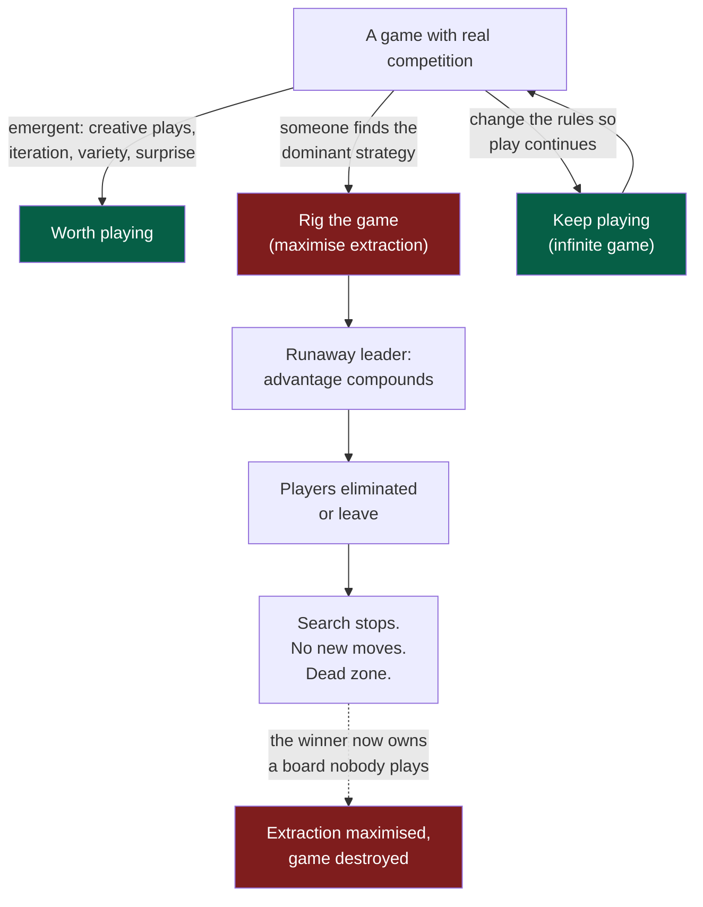
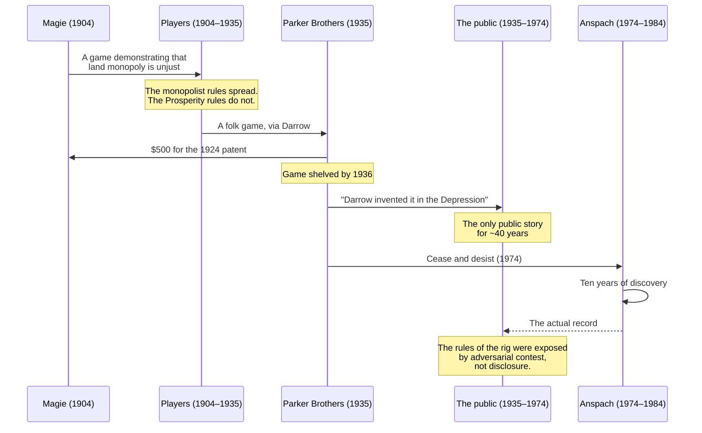

# Blog Post — "Rig the Game or Play": Monopoly as Bad Game Design

> Companion essay to [`docs/ECONOMICS.md`](../ECONOMICS.md). Where ECONOMICS
> argues that rent is a cliff and improvement is a slope, this essay argues
> the same thing in the register a reader can *feel*: a rigged game is not
> merely unfair, it is **boring**, and the boredom is diagnostic.

## Problem Statement

`docs/ECONOMICS.md` shipped in [0358](./0358_[x]_VALUE_CAPTURE_WITHOUT_ENCLOSURE_MOATS_SUBSTRATES_AND_THE_SLEEP_TEST.md)
and does its job: it names what xNet refuses, what it keeps, and what the
refusal costs. But it is an internal-facing document written in the vocabulary
of moats, BATNAs, and switching costs. It persuades someone who already accepts
that the enclosure question matters.

The public argument is missing a piece. Every existing xNet economics essay —
[The Right to Say No](https://xnet.fyi/blog/the-right-to-say-no),
[Weights You Can Hold](https://xnet.fyi/blog/weights-you-can-hold),
[People in Disguise](https://xnet.fyi/blog/people-in-disguise) — makes the case
on **fairness or harm** grounds: extraction is unjust, surveillance is
degrading, the user is the one being farmed. Those are true and they are also
the arguments the reader has heard most often, which means they land on
already-sorted ground.

This essay proposes a different and less-used lever: **monopoly is bad game
design.** Not immoral first — *unfun* first. Rigging the game is an extremely
effective way to maximise extraction and an extremely effective way to destroy
the emergent properties that made the game worth playing: the creative plays,
the iteration, the variety, the reasons anyone showed up. Monopoly is the
optimal strategy and it is also the strategy that ends the game.

The historical hook writes itself, and it is real: the board game *Monopoly*
was derived from Elizabeth Magie's 1904 *The Landlord's Game*, designed
explicitly to demonstrate that land monopoly is unjust — and the version that
survived and sold thirty-odd million copies is the one where you crush
everyone. The pedagogy inverted. The cautionary tale became the aspiration.

The open question this exploration must answer honestly is **how much of the
"two rule sets" story is documented and how much is folklore**, because an
essay on a company's own honesty page cannot be built on a nice story that
does not survive a fact-check. (Spoiler: less is documented than the internet
implies, and the essay is better for saying so.)

## Executive Summary

**Recommendation: write it. Title "Rig the Game or Play". Slug
`rig-the-game-or-play`. Tags `['essay', 'economics', 'philosophy']`, ~14
minutes.**

The essay's spine, in five beats:

1. **The board you already know is the wrong rule set.** Magie's game was
   designed to make land monopoly look absurd; the monopolist rules were the
   demonstration, not the lesson. What spread was the demonstration.
2. **Monopoly is, by every modern design standard, a bad game** — runaway
   leader, player elimination, a long dead zone after the outcome is decided.
   And the house rules everyone plays with (Free Parking jackpot, skipping the
   mandatory auction) make it strictly *worse* by removing its only
   negative-feedback mechanisms. **People instinctively rig their own game
   further and then complain it isn't fun.** That is the whole essay in one
   observation.
3. **The unfun is the diagnostic.** Competition is a discovery procedure
   (Hayek, 1968); a monopolist has *less* incentive to innovate than a
   competitive firm (Arrow, 1962). When a market stops producing surprising
   moves, that is not a mood, it is a measurement. Boredom is the sensation of
   a search process having stopped.
4. **The honest complication, stated early and not buried.** The relationship
   between competition and innovation is an inverted U (Aghion et al., 2005),
   not a straight line. Maximal atomisation is *also* bad. The essay is not
   "competition good"; it is "**entrenched, permanent monopoly is the worst
   point on the curve**", which is a narrower and defensible claim.
5. **The third option the original board already had.** Finite games are
   played to win; infinite games are played to keep the play going (Carse,
   1986). Cooperation isn't the opposite of competition — it's the rule change
   that keeps enough players at the table for competition to keep producing
   anything.

Then land it on xNet: the four Charter tests are literally a **rule set for
not rigging our own game**, and the Sleep test is the one that asks "if a
competitor open-sourced everything tomorrow, do we survive?" — which is the
same question as "are we playing, or have we rigged it?"

**Critical honesty requirement:** the essay must disclose that (a) the
"two rule sets" claim rests on a 1932 edition, not the patents, and Snopes
could not independently verify it; (b) there is **no evidence the cooperative
"Prosperity" rules were ever widely played**; (c) we only know any of this
because of a decade of adversarial litigation. Point (c) is not a caveat — it
is the essay's best paragraph, and §"Key Findings" argues why.



## Current State In The Repository

### The document this essay is a companion to

[`docs/ECONOMICS.md`](../ECONOMICS.md) is the source. The essay draws on four
of its sections and should link each one:

| ECONOMICS section | What the essay borrows |
| --- | --- |
| §1 "Rent is a cliff. Improvement is a slope." | The Gates 1996 "losing sleep" email; the Shapiro–Varian inversion |
| §2 The Moat Register | The refused/kept split — the essay's "which rules we play by" beat |
| §3 Context-portability inventory | The honest gap; share links and grants do **not** travel today |
| §4 The four tests applied to every lane | The essay's closing rule set |
| §6 "What this position costs us" | The essay's own honesty beat (see below) |

The four tests themselves live in [`docs/CHARTER.md`](../CHARTER.md) §6
("No ground rent"): **Improvement**, **BATNA**, **Vanish**, **Sleep**.

### Blog plumbing (unchanged since 0239/0269)

Posts are hand-authored, art-directed `.astro` pages — **not MDX, not a content
collection**:

- Page: `site/src/pages/blog/<slug>.astro`
- Metadata (single source of truth for index + RSS + byline):
  [`site/src/data/blog.ts`](../../site/src/data/blog.ts)
- Feed: [`site/src/pages/blog/rss.xml.ts`](../../site/src/pages/blog/rss.xml.ts)
  → [`site/src/lib/blog-feed.ts`](../../site/src/lib/blog-feed.ts)
- Per-post components live in
  [`site/src/components/blog/`](../../site/src/components/blog/) and follow a
  strict three-part convention:
  - `<Name>Hero.astro` — the art-directed masthead
  - `<Name>Art.astro` — one inline mid-essay illustration
  - `Honest<Name>.astro` — **the honesty beat**, a required series convention

The `Honest*` convention is load-bearing. From
[`HonestRecord.astro`](../../site/src/components/blog/HonestRecord.astro):

> "A metaphor that flatters itself is just more marketing. Here's the honest
> version."

Every essay that borrows a metaphor owes the reader an `isn't` / `is` table.
This essay borrows a *lot* of metaphor and a contested history, so its
`HonestBoard.astro` is unusually important — it is where the folklore
disclosure lands.

Shared components the essay should reuse rather than reinvent:
[`Byline.astro`](../../site/src/components/blog/Byline.astro),
[`SeriesNav.astro`](../../site/src/components/blog/SeriesNav.astro),
[`Mermaid.astro`](../../site/src/components/blog/Mermaid.astro),
[`Peek.astro`](../../site/src/components/blog/Peek.astro).

### Adjacent posts — what is already covered, and the overlap risk

| Post | Overlap | How this essay differs |
| --- | --- | --- |
| [The World's Greatest Record Store](../../site/src/pages/blog/the-worlds-greatest-record-store.astro) | **Ostrom, commons, ratio economies** | Already spent the Ostrom card. This essay must not re-explain the eight design principles — one sentence and a link, at most. |
| [The Right to Say No](../../site/src/pages/blog/the-right-to-say-no.astro) | Refusal, exit, economics | That one is about the *user's* move; this is about the *operator's* move |
| [Weights You Can Hold](../../site/src/pages/blog/weights-you-can-hold.astro) | Extraction economics | Grounded in AI weights; this is grounded in market structure |
| [The Workshop and the Walled Garden](../../site/src/pages/blog/the-workshop-and-the-walled-garden.astro) | Enclosure | Architecture-flavoured; this is incentive-flavoured |
| [The Forest and the Field](../../site/src/pages/blog/the-forest-and-the-field.astro) | Monoculture vs. polyculture, "variety dies" | **Highest overlap.** The forest essay already makes the biological version of the diversity argument. This essay must stay in the *game/strategy* register and explicitly cross-link rather than re-argue. |

> ⚠️ The forest/field overlap is the single biggest editorial risk. See
> Risks §2.

### Backlog note in `blog.ts`

`site/src/data/blog.ts` carries a header comment listing one researched-but-
unwritten essay ("The Railroad and the Airline", exploration 0351). If this
essay is approved, add a matching backlog line **or** write it directly; do not
leave the registry silently out of sync.

### Related explorations

| Exploration | Relevance |
| --- | --- |
| [0358](./0358_[x]_VALUE_CAPTURE_WITHOUT_ENCLOSURE_MOATS_SUBSTRATES_AND_THE_SLEEP_TEST.md) | Produced ECONOMICS.md; the Sleep test |
| [0351](./0351_[x]_FRONTIER_ECONOMICS_WITHOUT_ENCLOSURE_RAILROADS_AIRLINES_AND_THE_COMMONS.md) | The Georgist operator; the first three tests. **Also Henry George** — the direct line to Magie |
| [0361](./0361_[_]_VOICE_AS_THE_COMPLEMENT_TO_EXIT_OSTROM_COLLECTIVE_CHOICE_AND_XNET_GOVERNANCE.md) | Voice/Ostrom; the cooperative-rules beat should link here, not duplicate it |
| [0247](./0247_[x]_BLOG_FACT_CHECK_AND_COPY_EDIT.md) | The fact-check pass this essay will need more than most |

**Numbering note.** Two explorations currently claim `0360` on different
branches (`xnet-blogging-alternative-913863`, committed 16:47, vs.
`tech-monopoly-value-capture-766ccf`, 17:04). Per the earliest-commit-wins
rule, the *Publishing on xNet* doc keeps 0360 and *Making xNet Cloud
Delightful* renumbers to the next free slot — which is **0362**. This
exploration therefore takes **0363**, deliberately leaving 0362 open for that
renumber.

## External Research

All claims below were researched against primary sources where possible.
Confidence is flagged because §"Key Findings" argues the flags belong *in the
published essay*, not just in this document.

### 1. Elizabeth Magie and *The Landlord's Game*

**Solid.** US Patent 748,626, filed 1903, granted **5 January 1904**. The
patent states its own purpose in Magie's words:

> "The object of this game is not only to afford amusement to players, but to
> illustrate to them how, under the present or prevailing system of land
> tenure, the landlord has an advantage over other enterprises, and also how
> the single tax would discourage land speculation."

A second patent (US 1,509,312) followed on 23 September 1924. The 1904 board
art carries the Georgist slogan "LABOR UPON MOTHER EARTH PRODUCES WAGES".

**Solid, primary source.** *Single Tax Review*, Autumn 1902 — Magie describing
her own game:

> "It is a practical demonstration of the present system of land-grabbing with
> all its usual outcomes and consequences."

and, on the pedagogy:

> "Let the children once see clearly the gross injustice of our present land
> system and when they grow up, if they are allowed to develop naturally, the
> evil will soon be remedied."

**Contested — and this is the important one.** The famous "two rule sets"
story (a Georgist *Prosperity* set where wealth creation rewards everyone and
the winner is whoever's poorest player doubles their stake, vs. a *Monopolist*
set where you crush opponents) does **not** appear in either patent. Both
Wikipedia and Snopes state plainly that "Magie's 1904 and 1924 patents do not
include two sets of rules." The dual-rules document that does exist is a **1932
edition titled *The Landlord's Game and Prosperity*** (Adgame Co.), whose rules
PDF is archived at landlordsgame.info — and Snopes notes it could not
independently verify the connection.

**Unsupported.** There is no evidence the cooperative *Prosperity* rules were
ever widely played. Every account of the game's actual spread — Quakers in
Atlantic City, Wharton students, college campuses, eventually Charles Darrow —
describes the **monopolist** rules propagating. The tidy story that "players
tried both and learned the lesson" is asserted by popularisers, not evidenced.

**Also unsupported.** The frequently-quoted line that players would see the
"absurdity" of the monopolist rules is a modern paraphrase. No primary Magie
quote uses that word. If the essay wants the sentiment, it must own it as our
gloss.

**Solid.** Darrow sold his version to Parker Brothers in 1935, marketed as his
own Depression-era invention. Parker Brothers separately bought Magie's 1924
patent for **$500** and effectively shelved her game by 1936. In January 1936
Magie gave interviews to the *Washington Post* and *Washington Evening Star*
displaying her original boards and publicly contesting the Darrow story.

**Solid, and the essay's sleeper.** We know this history because of
*Anti-Monopoly, Inc. v. General Mills Fun Group* (515 F. Supp. 448, N.D. Cal.
1981). Parker Brothers sent economics professor Ralph Anspach a cease-and-
desist in 1974 over his game *Anti-Monopoly*; the litigation ran roughly a
decade. Building his defence — that the trademark should fail because the
underlying game predated Parker's 1935 purchase — Anspach reconstructed the
Magie lineage through adversarial discovery. Mary Pilon's *The Monopolists*
(2015) is the main synthesised account and rests substantially on Anspach's
archive.

### 2. Monopoly as bad game design

**Runaway leader.** Standard design-theory term; a positive feedback loop where
success makes further success easier. Applied to Monopoly directly: the more
money you have, the more properties and houses you buy, which earns more money.
BoardGameGeek maintains a whole compendium of designer countermeasures to the
"rich get richer" problem.

**Player elimination and the dead zone.** Design criticism consistently flags
Monopoly's interminable endgame, kingmaking, and the fact that eliminated
players sit and watch — "zombie players" who cannot leave the table.

**The house-rules finding — the best empirical detail available.** Two facts,
both easily verified against the official rulebook:

- There is **no Free Parking jackpot** in the official rules. The near-universal
  house rule that pools fines and taxes there injects cash into the game,
  lengthening it and *worsening* the snowball.
- The official rules **require an auction** whenever a player declines to buy a
  property they land on. Most tables skip it. Auctions are one of the game's
  only skill-based, negative-feedback mechanisms.

So the game people complain about is not the game as designed. **People
house-rule out the competition and house-rule in the extraction, then blame
the box.** This is the essay's strongest original observation and it is
factually clean.

**Attribution hazards — do not quote these without a primary source.**
Research flagged several widely-circulated design quotes as unverified:
Soren Johnson on Monopoly specifically; Reiner Knizia on player elimination;
Mark Rosewater on "solved games are boring"; Richard Garfield's "orthogonal
unity" (which appears to not be a real Garfield phrase). Even Sid Meier's "a
game is a series of interesting decisions" is loosely sourced — Meier himself
has since qualified it, and the original venue is not pinned down. There is a
pleasing symmetry here: **the design-community folklore about Monopoly has the
same evidentiary shape as the Magie folklore.** The essay should use at most
one of these and flag it, or use none.

Knizia quotes that *are* well-sourced (2015 BGG interview) are about
simplicity and about failed prototypes as experiments, not about elimination.

### 3. Competition as discovery; monopoly as the end of search

**Hayek, "Competition as a Discovery Procedure" (1968).** The cleanest single
line:

> "Competition is a procedure for discovering facts which, if the procedure did
> not exist, would remain unknown or at least would not be used."

Hayek's deeper point is sharper than the quote: "perfect competition," the
neoclassical equilibrium with full information, describes a state where the
*need* for competition has already vanished. Competition is valuable precisely
because it runs under ignorance. A monopolist forecloses the discovery process
because no rival process is generating alternative facts to compare against.

**Arrow (1962), the replacement effect.** From *The Rate and Direction of
Inventive Activity*: a monopolist has **less** incentive to innovate than a
competitive firm, because innovation partly cannibalises its own existing
profit stream, whereas a competitive entrant displaces rivals rather than
itself.

**Schumpeter, Mark II.** The honest counterweight: large firms with market
power can fund R&D, absorb risk, and appropriate returns. Crucially, though,
Schumpeter's defence is of **temporary, competed-for** monopoly as the prize
for innovation — not permanent entrenchment. That distinction is exactly the
essay's thesis and should be drawn explicitly rather than treating Schumpeter
as an opponent.

**Aghion, Bloom, Blundell, Griffith, Howitt (2005), *QJE* 120(2): 701–728.**
The empirical resolution: an **inverted-U** between product-market competition
and innovation. Too little competition and too much both suppress it.
Mechanism: competition discourages laggards (too far behind to bother) and
encourages neck-and-neck firms (innovate to escape a close rival). The
inverted-U is steeper in more neck-and-neck industries.

This is the honesty ballast. The essay's claim survives it — entrenched
monopoly is the *worst* point on that curve — but "competition always produces
more innovation" does not, and we should not publish the version that doesn't.

### 4. Cooperative and infinite games

**Carse, *Finite and Infinite Games* (1986).** Opening lines, verbatim:

> "There are at least two kinds of games. One could be called finite, the
> other infinite. A finite game is played for the purpose of winning, an
> infinite game for the purpose of continuing the play."

Finite games have fixed rules and produce a winner. In infinite games, rules
exist to prevent the game from stopping. This maps cleanly onto the two rule
sets: monopolist logic is finite-game logic (win by ending the game); commons
logic is infinite-game logic (win by keeping people at the table).

**The counterweight, which the essay must include.** Cooperative games have
their own degenerate failure mode: **quarterbacking**. In *Pandemic* all
players see all information, so one strong player can compute everyone's
optimal move and the other players become spectators — structurally the same
dead zone as Monopoly's elimination, just inverted. *Spirit Island* is the
canonical counter-design: enough hidden per-player complexity that solving the
table for everyone is infeasible.

This matters because it kills the naive reading. **Cooperation is not
automatically better; it is a different rule set with a different way of
collapsing into one player and an audience.** Both failure modes are the same
disease: the game stops generating decisions.

**Ostrom** — already spent in the record-store essay and being explored in
0361. One sentence and a link.

**Iain M. Banks** — the phrase "playing to keep the game going" could **not**
be verified as a Banks quote. Do not use it. If a Banks reference is wanted,
*The Player of Games* (1988) is thematically exact (a civilisation whose entire
political hierarchy is a competitive elimination game) and there is a verifiable
line about all reality being a game — but the reference is optional and the
essay does not need it.

### 5. "Rigged game" in live antitrust discourse

**Judge Amit Mehta, *United States v. Google LLC*, 5 August 2024** (D.D.C.,
~277 pages):

> "Google is a monopolist, and it has acted as one to maintain its monopoly.
> It has violated Section 2 of the Sherman Act."

The finding centred on exclusive default-placement deals. **The complicating
fact the essay should include:** remedies were largely procedural, not
structural — Mehta declined to order divestiture. A court naming the rig did
not restore the variety. That is a better ending than a triumphant one.

Other documented anchors:

- Biden's July 2021 competition executive order, covered in mainstream press
  with the literal board-game metaphor ("end the monopoly game"), and the line
  "Capitalism without competition isn't capitalism. It's exploitation."
- FTC Commissioner Christine Wilson, dissenting, mocking vague merger guidance
  by reaching for the actual board: respondents "essentially will be told, 'Go
  to jail. Go directly to jail. Do not pass go.'" — an antitrust official
  citing the Parker Brothers rules, which closes the loop rather neatly.
- December 2023: a San Francisco jury found Google's Play Store practices
  violated the Sherman Act (*Epic v. Google*).
- Apple's own apps ranking first for dozens of high-value App Store queries.
- The EU DMA explicitly prohibits gatekeeper self-preferencing.

## Key Findings

**1. The essay's real thesis is narrower and better than "monopoly bad".**
It is: *rigging is the dominant strategy and the dominant strategy is the one
that ends the game.* Extraction and interestingness are not merely in tension —
maximising the first provably terminates the second. That claim survives
Schumpeter and survives the inverted-U.

**2. The house-rules observation is the original contribution.** Everything
else in this essay is assembled from known sources. But "people voluntarily
remove the auction (the competitive mechanism) and add the Free Parking
jackpot (the extraction mechanism), and then complain the game is four hours
long and no fun" is a small, verifiable, slightly devastating fact that maps
directly onto how markets get rigged. Nobody decides to build a monopoly on
day one; they house-rule, one convenience at a time.

**3. The Anspach paragraph is the essay's best paragraph and it is currently
nobody's thesis.** We know Magie's story only because a professor got sued and
spent ten years in discovery. Parker Brothers had no incentive to surface her;
historians didn't find this, adversarial litigation did. The generalisation is
uncomfortable and true: **the rules of a rigged game are usually exposed by
someone who got hurt and refused to settle, not by the operator's transparency
report.** That reflects on us — which is exactly why ECONOMICS.md's §3 gap
table and the claims ledger exist, and it gives the essay a non-preachy way to
point at our own receipts.

**4. Publishing the folklore disclosure is a feature, not a tax.** An essay
about honest games that repeats an unverified nice story would be
self-refuting in a way readers notice. The `Honest*` component convention
already exists for exactly this. The disclosure is short and it buys the rest
of the essay credibility it cannot otherwise get.

**5. The cooperation beat must include quarterbacking or it is propaganda.**
The user's framing — that the original game rewarded learning to cooperate — is
the strongest emotional beat available and also the least documented. Pairing
it with cooperative gaming's own failure mode converts a claim we cannot fully
source into an observation we can fully defend: *every rule set has a way of
collapsing into one player and an audience; the design question is which
collapse you are guarding against.*

**6. This essay proposes no new revenue lane**, so the Charter §6
improvement/BATNA/vanish/Sleep tests do not gate it. They appear *in* the essay
as its closing device — the rule set we published so we can't quietly
house-rule ourselves later.



## Options And Tradeoffs

### Option A — The game-design essay (recommended)

Lead with the board. Magie's inverted pedagogy → Monopoly as bad design → the
house-rules twist → Hayek/Arrow as the grown-up version of the same complaint →
Carse's third option → the Charter rule set. Metaphor stays inside games
throughout.

- **For:** the reader's own memory of a bad Monopoly night does the persuading;
  it is the least-used lever in the existing catalogue; the house-rules fact is
  fresh; the title is already good.
- **Against:** the "Monopoly is a bad game" observation is not novel among
  people who read about games; the essay's originality lives in the joins, not
  the parts.

### Option B — The Anspach essay

Make the litigation the spine: the history of a rigged game is only recoverable
through adversarial discovery, therefore transparency has to be structural.

- **For:** genuinely under-told; the most original framing; lands hardest on
  our own honesty-debt practice.
- **Against:** it is a legal-history essay wearing a game costume; loses the
  "rigged games aren't fun" thesis the user actually wants; the emergent-
  properties argument becomes a subplot.
- **Verdict:** not the essay — but **one section of it**, and the best one.

### Option C — The Georgist essay

Magie → Henry George → ground rent → xNet's §6 refusals. The tightest logical
line, because ECONOMICS.md already runs on Georgist bones via 0351.

- **For:** rigorous; the direct intellectual lineage from the board to our
  Charter is real, not decorative.
- **Against:** 0351 already did this ("The Railroad and the Airline" backlog
  entry is *also* this). Duplicates a planned essay. Loses the fun/design
  argument entirely.
- **Verdict:** fold two paragraphs into Option A; don't spend the essay here.

### Option D — The cooperative-games essay

Lead with co-op board games and infinite games; monopoly is the foil.

- **For:** warmest register; pairs naturally with 0361's voice/governance work.
- **Against:** the historical claim it needs most (that the Prosperity rules
  taught cooperation and were played) is the least documented thing in the
  research. Building the lead on the weakest evidence is exactly the failure
  mode the essay is about.
- **Verdict:** no. Keep cooperation as beat four, honestly framed.

### Comparison

| | A. Game design | B. Anspach | C. Georgist | D. Cooperative |
| --- | --- | --- | --- | --- |
| Matches user's framing | ✅ exactly | ⚠️ partly | ❌ | ✅ |
| Evidence quality | ✅ strong | ✅ strongest | ✅ strong | ❌ weakest |
| Novel in our catalogue | ✅ | ✅✅ | ❌ dup of 0351 | ⚠️ near 0361 |
| Overlap with forest/field | ⚠️ manageable | ✅ none | ✅ none | ⚠️ high |
| Emotional accessibility | ✅✅ | ⚠️ | ❌ | ✅ |
| Lands on ECONOMICS.md | ✅ | ✅ | ✅✅ | ⚠️ |

### Title options

| Title | Assessment |
| --- | --- |
| **Rig the Game or Play** | **Recommended.** The user's own final choice, and correct. "Play" carries both senses — *to play the game* and *play* as in slack, freedom of movement, the room a system needs to generate variety. Rigging removes play in both senses. That pun is the essay. |
| Rig the Game or Compete | Weaker. "Compete" concedes the frame that the only alternative to monopoly is rivalry, and closes the door on beat four. |
| Rig the Game or Cooperate | Too narrow; commits the whole essay to the least-documented claim. |
| The Landlord's Game | Accurate, invisible to anyone who doesn't already know the story. |
| Do Not Pass Go | Cute, says nothing, and the Wilson quote uses it better inside the text. |

## Recommendation

**Write Option A under the title "Rig the Game or Play", incorporating Option
B as its penultimate section and two paragraphs of Option C.**

### Structure

| § | Beat | Anchor | Words |
| --- | --- | --- | --- |
| 1 | The board you know is the losing rule set | Magie's 1902 quote; the 1904 patent's stated purpose | 500 |
| 2 | Monopoly is bad design, by name | Runaway leader, elimination, dead zone | 450 |
| 3 | **And we make it worse on purpose** | Free Parking jackpot in; mandatory auction out | 400 |
| 4 | Boredom is a measurement | Hayek 1968; Arrow 1962 | 500 |
| 5 | The honest curve | Schumpeter Mark II; Aghion et al. inverted U | 400 |
| 6 | The third rule set | Carse's opening lines; quarterbacking as the co-op failure mode | 500 |
| 7 | How we know any of this | Anspach, 1974–1984 | 450 |
| 8 | A court can name the rig and not fix it | Mehta, 5 Aug 2024; procedural remedies | 350 |
| 9 | Our rule set, published in advance | Charter §6 four tests; ECONOMICS.md §3 gap table | 450 |
| — | `HonestBoard` | The folklore disclosure | (component) |

~4,000 words → 14 minutes, consistent with the series.

### The `HonestBoard` rows

| Isn't | Is |
| --- | --- |
| We won't claim the cooperative rules were ever popular. | They almost certainly weren't. The version that spread was the one where you win by bankrupting your friends, and any essay that tells you people played both and learned better is telling you a story. We're telling you the story too — we're just labelling it. |
| We won't cite the two rule sets as though the patents contain them. | They don't. The dual rules come from a 1932 edition, and Snopes couldn't independently verify the link to Magie. The 1904 patent's *stated purpose* is solid and quoted above; the tidy fable built on top of it is not. |
| We won't pretend competition always produces more of everything. | It doesn't — the relationship is an inverted U, and markets that are too atomised innovate less too. Our claim is narrower: entrenched, permanent monopoly is the worst point on that curve, and it's the point every dominant strategy walks toward. |
| We won't claim we're immune. | Our own portability gap table names four kinds of context that don't travel yet — share links, grants, audience, plugin licences. We publish it because the alternative is someone spending ten years in discovery to find it. |

### Art direction

Following the series convention, three new components:

- `BoardHero.astro` — an isometric board where the near squares are dense with
  varied, hand-drawn detail and the far ones flatten into identical monochrome
  rectangles. The rig, rendered as loss of variety.
- `BoardArt.astro` — the two rule sets as facing cards; the Monopolist card
  crisp and complete, the Prosperity card faded and partly missing, with the
  gap labelled. **The art should show the uncertainty, not paper over it.**
- `HonestBoard.astro` — standard `isn't` / `is` treatment.

Plus one `Mermaid.astro` diagram: the runaway-leader loop and the two exits.

### Registry entry

```ts
{
  slug: 'rig-the-game-or-play',
  title: 'Rig the Game or Play',
  description:
    'The board game that taught a century of children to build monopolies ' +
    'was invented in 1904 to show that monopolies are unjust — and the ' +
    'cautionary rule set is the one that sold. On runaway leaders, why ' +
    'everyone house-rules the auction out and the jackpot in, what Hayek ' +
    'meant by competition as a discovery procedure, and why the rules of a ' +
    'rigged game are usually exposed by someone who got sued rather than ' +
    'by anyone’s transparency report.',
  pubDate: '<set at publish>',
  authors: ['crs48', 'claude'],
  tags: ['essay', 'economics', 'philosophy'],
  readingMinutes: 14
}
```

### Charter §6 tests

**Not applicable as a gate** — this essay proposes no revenue lane. It
*documents* the tests. Recorded explicitly so a later reader doesn't assume the
step was skipped.

## Example Code

New post page, matching the established shape
([`the-forest-and-the-field.astro`](../../site/src/pages/blog/the-forest-and-the-field.astro)
is the reference implementation):

```astro
---
import Base from '../../layouts/Base.astro'
import Nav from '../../components/sections/Nav.astro'
import Footer from '../../components/sections/Footer.astro'
import SeriesNav from '../../components/blog/SeriesNav.astro'
import Byline from '../../components/blog/Byline.astro'
import BoardHero from '../../components/blog/BoardHero.astro'
import BoardArt from '../../components/blog/BoardArt.astro'
import HonestBoard from '../../components/blog/HonestBoard.astro'
import Mermaid from '../../components/blog/Mermaid.astro'
import { postBySlug, formatPostDate } from '../../data/blog'

const post = postBySlug('rig-the-game-or-play')!
---

<Base title={`${post.title} — xNet`} description={post.description}>
  <Nav />
  <main>
    <BoardHero
      title={post.title}
      deck={post.description}
      date={formatPostDate(post.pubDate)}
      readingMinutes={post.readingMinutes}
      tags={post.tags}
    />
    <article
      class="prose prose-lg mx-auto max-w-3xl px-6 py-16 dark:prose-invert prose-headings:tracking-tight prose-a:text-emerald-600 dark:prose-a:text-emerald-400"
    >
      <Byline post={post} />
      <!-- §1–§9 -->
      <HonestBoard />
    </article>
  </main>
  <SeriesNav slug={post.slug} />
  <Footer />
</Base>
```

The mid-essay diagram, rendered through the shared `Mermaid.astro` wrapper:

```astro
<Mermaid
  caption="A dominant strategy that terminates its own game."
  chart={`
flowchart LR
  P["Play"] --> V["Variety:<br/>surprising moves"]
  V --> P
  P --> R["Rig"]
  R --> C["Advantage compounds"]
  C --> E["Players leave"]
  E --> S["Search stops"]
  S -.-> R
  `}
/>
```

## Risks And Open Questions

**1. Fact-check exposure is above baseline.** This essay leans on a history
whose popular version is partly folklore, in a catalogue where
[0247](./0247_[x]_BLOG_FACT_CHECK_AND_COPY_EDIT.md) already had to run a
correction pass. Mitigation: the disclosure rows are drafted above, the
unverified design quotes are named and excluded, and no Banks quote is used.
**Every quotation in the draft must be traceable to a source in §References
before publish.**

**2. Overlap with "The Forest and the Field."** That essay already argues
monoculture kills variety. Mitigation: this one never uses a biological
metaphor, cross-links once in §4, and its distinct mechanism is *strategic*
(the dominant strategy ends the search) rather than *ecological* (the
monoculture has no resilience). If the draft starts reaching for soil, it has
drifted.

**3. Register risk — smugness.** "Monopolists are boring" is one bad sentence
away from smug, and the series' voice is not smug. Mitigation: §5 (the
inverted-U) and §8 (the court that named the rig and didn't fix it) both cost
the essay something, and both stay in.

**4. Are we the monopolist in this story?** A reader is entitled to ask what
happens when xNet is winning. The Sleep test is our answer, but the essay must
not present it as a solved problem. The `HonestBoard` fourth row and the §3
gap-table link carry this; do not soften them.

**5. Open question — how hard to press the "cooperation is more fun" claim?**
The user's framing is that the original game taught cooperation is better, and
it is the emotionally strongest beat. The evidence does not support it as
history. Current plan treats it as **a design argument we make, not a fact we
report**, paired with quarterbacking. Worth a second opinion before drafting
§6.

**6. Open question — does the Anspach section belong at §7 or as the cold
open?** Placed at §7 it pays off the history. Opened with, it reframes the
whole essay as being about disclosure. Recommend §7 for the first draft, and
re-reading the draft to see if it wants to move.

**7. Should the Georgist thread be spent here or saved?** `blog.ts` carries a
backlog entry for "The Railroad and the Airline" (0351), which is the Georgist
essay. Recommend: two paragraphs here, the full argument stays in the backlog.
If drafting §1 pulls hard toward Henry George, that is a signal to write the
railroad essay instead.

**8. Non-question: changesets.** Site-only and docs-only changes need no
changeset (`site/` is not a publishable `packages/*`). If new shared components
land outside `site/`, that changes — they should not.

## Implementation Checklist

- [ ] Confirm 0362 is left free for the *Making xNet Cloud Delightful*
      renumber, and that no other branch has claimed 0363
- [ ] Re-verify the Magie 1902 *Single Tax Review* quote against the
      landlordsgame.info primary scan
- [ ] Re-verify the 1904 patent purpose clause against Google Patents
      US748626A directly
- [ ] Pull the 1932 *Landlord's Game and Prosperity* rules PDF and describe
      the dual rule sets from the document itself, not from summaries
- [ ] Verify the Hayek 1968 line against the Snow translation PDF
- [ ] Verify the Carse opening lines against the published text
- [ ] Verify the Mehta ruling quote and 5 August 2024 date against the opinion
      or first-tier legal press
- [ ] Verify the official Monopoly auction rule and the absence of a Free
      Parking jackpot against the current Hasbro rulebook
- [ ] Confirm Aghion et al. (2005) citation details (*QJE* 120(2): 701–728)
- [ ] Drop every unverified design quote (Johnson/Knizia/Rosewater/Garfield)
      unless a primary source is found; drop the Banks phrase outright
- [ ] Add the `rig-the-game-or-play` entry to
      [`site/src/data/blog.ts`](../../site/src/data/blog.ts) with `draft: true`
- [ ] Build `site/src/components/blog/BoardHero.astro`
- [ ] Build `site/src/components/blog/BoardArt.astro` (uncertainty visible in
      the art)
- [ ] Build `site/src/components/blog/HonestBoard.astro` with the four rows
- [ ] Write `site/src/pages/blog/rig-the-game-or-play.astro`, §1–§9
- [ ] Add the runaway-leader mermaid figure via `Mermaid.astro`
- [ ] Cross-link [`docs/ECONOMICS.md`](../ECONOMICS.md) §1, §3, §4 and
      [`docs/CHARTER.md`](../CHARTER.md) §6 from the closing section
- [ ] Cross-link *The Forest and the Field*, *The Right to Say No*, and
      *The World's Greatest Record Store* exactly once each
- [ ] Copy-edit to **en-GB** (series convention)
- [ ] Verify `xNet` casing in all prose per
      [`CLAUDE.md`](../../CLAUDE.md)
- [ ] Add an `og:image` if the hero warrants one (note: `Base.astro` has no
      default `og:*` — see 0316)
- [ ] Flip `draft: false` and set `pubDate`
- [ ] Add a changelog fragment tagged `skip-changelog` if site-only

## Validation Checklist

- [ ] `pnpm --filter site build` succeeds (do **not** rely on `astro dev` —
      it has hung on blog/changelog routes before; verify via build)
- [ ] `/blog/rig-the-game-or-play` renders in light and dark themes
- [ ] The post appears on `/blog` once `draft: false`, in correct date order
- [ ] `/blog/rss.xml` includes the post with the correct description
- [ ] `SeriesNav` resolves previous/next on both neighbouring posts
- [ ] Mermaid figure renders and is legible at 375px width
- [ ] No horizontal body scroll at 375px; hero art degrades gracefully
- [ ] `Byline` shows both authors with vendored avatars — **no third-party
      requests** (check the network panel; several essays promise this)
- [ ] `node scripts/check-humane-patterns.mjs` passes
- [ ] Brand-casing check passes (`\bXNet\b` word-boundary sweep, fences
      skipped)
- [ ] Every quotation in the published text maps to a §References entry
- [ ] The four `HonestBoard` rows are present and unsoftened
- [ ] Reading time on the card matches the drafted length within ~2 minutes
- [ ] A reader who knows the Monopoly folklore finishes the essay knowing
      which parts are documented — the disclosure is legible, not buried

## References

### Repository

- [`docs/ECONOMICS.md`](../ECONOMICS.md) — the companion document
- [`docs/CHARTER.md`](../CHARTER.md) §6 — "No ground rent", the four tests
- [`site/src/data/blog.ts`](../../site/src/data/blog.ts) — post registry
- [`site/src/components/blog/`](../../site/src/components/blog/) — Hero/Art/Honest convention
- [`site/src/pages/blog/the-forest-and-the-field.astro`](../../site/src/pages/blog/the-forest-and-the-field.astro) — reference implementation
- [0358](./0358_[x]_VALUE_CAPTURE_WITHOUT_ENCLOSURE_MOATS_SUBSTRATES_AND_THE_SLEEP_TEST.md), [0351](./0351_[x]_FRONTIER_ECONOMICS_WITHOUT_ENCLOSURE_RAILROADS_AIRLINES_AND_THE_COMMONS.md), [0361](./0361_[_]_VOICE_AS_THE_COMPLEMENT_TO_EXIT_OSTROM_COLLECTIVE_CHOICE_AND_XNET_GOVERNANCE.md), [0247](./0247_[x]_BLOG_FACT_CHECK_AND_COPY_EDIT.md)

### The Landlord's Game

- US Patent 748,626 (granted 5 Jan 1904) — https://patents.google.com/patent/US748626A/en
- Magie in *Single Tax Review*, Autumn 1902 — https://landlordsgame.info/articles/LLG_SingleTaxReview-1902.html
- *The Landlord's Game and Prosperity* (1932) rules — https://landlordsgame.info/games/lgp-1932/lgp-1932_rules.pdf
- Snopes, "Monopoly's anti-capitalist origins", 27 Dec 2024 — https://www.snopes.com/news/2024/12/27/monopoly-anti-capitalist-origins/
- Wikipedia, *The Landlord's Game* — https://en.wikipedia.org/wiki/The_Landlord%27s_Game
- *Anti-Monopoly, Inc. v. General Mills Fun Group*, 515 F. Supp. 448 (N.D. Cal. 1981) — https://law.justia.com/cases/federal/district-courts/FSupp/515/448/1963162/
- Anspach Collection description — https://landlordsgame.info/articles/Anspach-Collection-Description.pdf
- Mary Pilon, *The Monopolists* (2015); NPR review, 3 Mar 2015 — https://www.npr.org/2015/03/03/382662772/
- National Women's History Museum, "Monopoly's Lost Female Inventor" — https://www.womenshistory.org/articles/monopolys-lost-female-inventor

### Game design

- BoardGameGeek, "A Compendium of Solutions to the Rich Gets Richer" — https://boardgamegeek.com/geeklist/204332/
- University XP, "The Runaway Leader Problem", 28 Nov 2023 — https://www.universityxp.com/news/2023/11/28/the-runaway-leader-problem
- Monopoly official rules incl. the auction requirement — https://en.wikibooks.org/wiki/Monopoly/House_Rules
- Quarterbacking in co-op games — https://gideonsgaming.com/board-game-quarterbacking-player-problem-or-game-problem/
- *Spirit Island* as an anti-quarterbacking design — https://airborneham.substack.com/p/alpha-gamers-cooperative-games-and
- James P. Carse, *Finite and Infinite Games* (Free Press, 1986) — https://jamescarse.com/books/finite-and-infinite-games/

### Economics

- F. A. Hayek, "Competition as a Discovery Procedure" (1968), Snow trans. — https://cdn.mises.org/qjae5_3_3.pdf
- Kenneth Arrow, "Economic Welfare and the Allocation of Resources for Invention" (1962) — https://www.nber.org/books-and-chapters/rate-and-direction-inventive-activity-economic-and-social-factors/economic-welfare-and-allocation-resources-invention
- Aghion, Bloom, Blundell, Griffith & Howitt, "Competition and Innovation: An Inverted-U Relationship", *QJE* 120(2), 2005 — https://www.ucl.ac.uk/~uctp39a/ABBGH_QJE_2005.pdf
- Joseph Schumpeter, *Capitalism, Socialism and Democracy* (1942)
- Elinor Ostrom, *Governing the Commons* (Cambridge UP, 1990)

### Antitrust

- *United States v. Google LLC*, D.D.C., 5 Aug 2024 — https://www.techpolicy.press/google-is-a-monopolist-and-other-key-points-from-judge-mehtas-ruling/
- Remedies analysis ("Although a Monopolist, Google Escapes Divestitures") — https://moginlawllp.com/antitrust-judge-mehmet-imposes-procedural-remedies-in-united-states-vs-google/
- Apple App Store self-preferencing — https://searchengineland.com/apple-accused-of-favoring-its-own-properties-in-app-store-results-321624
- Biden competition executive order, July 2021 — https://www.axios.com/2021/07/09/biden-order-end-monopoly-game-antitrust
