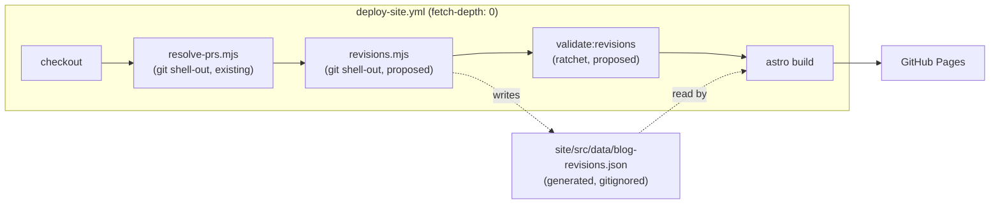
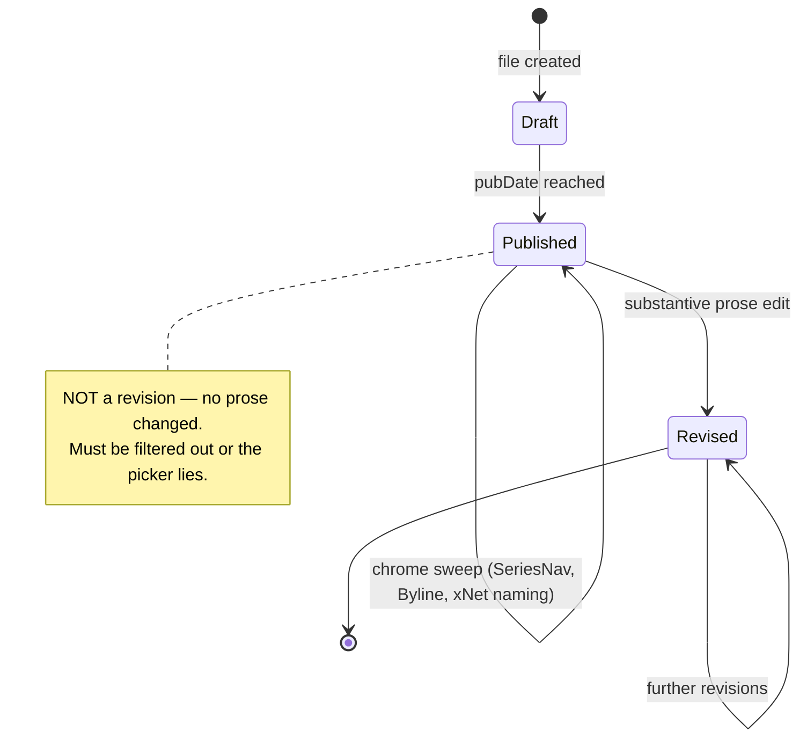
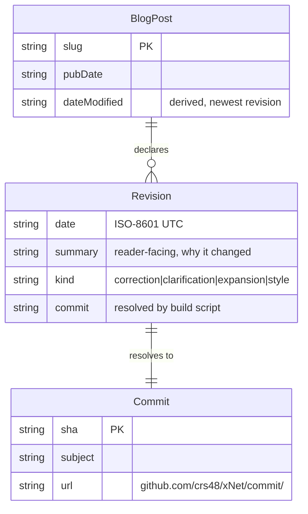

# Blog Post Revision Transparency (A Version Picker That Tells The Truth)

## Problem Statement

Blog posts on the marketing site are edited after publication — tone passes,
fact corrections, en-GB sweeps, the `xNet` naming sweep — and a reader has no
way to know. The page shows one date (`pubDate`) and presents the current text
as if it were the original. The ask:

> If there's more than one version in the git history, let someone pick from a
> drop-down, and link out to the git history. We always show the latest
> version, but it's honest about the fact that things get edited, and you can
> review how they changed.

Two things are tangled in that ask and they cost wildly different amounts:

1. **Disclosure** — "this post has been revised N times; here's when, why, and
   where to see the diff." Cheap, and it is where all the honesty lives.
2. **Time travel** — "select revision 2 and read the post as it stood on
   4 July." Expensive, and for this site's post format, close to impossible
   without a new archival step.

This exploration separates them, prices both, and recommends shipping the first
with a ratchet that keeps it honest — plus an optional phase 2 for the second.

There is a second, sharper reason to do this well: the site publishes
[Palimpsest](../../site/src/pages/blog/palimpsest.astro), an essay whose entire
argument is that overwriting history was an economy measure and the economy has
changed. Publishing that essay from a page that silently overwrites itself is a
credibility problem, not just a missing feature.

## Executive Summary

- **A picker that re-renders old text is not buildable today.** Posts are
  art-directed `.astro` pages that import shared components (`SeriesNav`,
  `Byline`, per-post hero/art components) and a shared data module. Rendering
  `the-right-to-say-no` as it stood on 2026-06-28 means building the *whole
  site* at that commit — the components it imports did not exist yet
  (`Byline.astro` landed 2026-07-05). Old revisions are not files you can
  render; they are snapshots of a build.
- **Raw commit counts are a lie.** Of 18 posts, five have 6 commits touching
  them — but two of those six are chrome-only sweeps that changed no prose
  (adding `SeriesNav`, adding `Byline`), one is a 1-line naming sweep, and one
  or two predate publication. Across the entire blog, there is roughly **one**
  substantive post-publication prose revision (`7f61e8614`, 2026-07-04,
  "warm the tone and smooth awkward sentences across essays"). A naive
  git-derived picker would advertise "6 versions" of a post revised once.
- **The infrastructure risk is half-retired, and the other half is worse than a
  shallow clone.** `deploy-site.yml` checks out with `fetch-depth: 0` and
  already runs a git-shelling prebuild step (`scripts/changelog/resolve-prs.mjs`)
  — so production is safe and there is a house pattern to copy exactly. But the
  preview workflows check out **shallow** (depth 1) *and* never build the Astro
  site at all: `deploy-pr-preview.yml` builds only `xnet-web` and `xnet-demos`,
  publishing `/pr/<n>/app/` and `/pr/<n>/play/`. **Blog changes are not
  previewable on a PR** — verified on PR #573, where `/pr/573/blog/…` 404s.
  Anything git-derived would therefore be unreviewable *and* silently empty
  before it reached production. Verify blog work against a local production
  build (`pnpm --filter site build`), not a preview URL.
- **Recommendation: ship a curated Revision Record, verified against git.**
  Authors declare revisions in `site/src/data/blog.ts`; a build script resolves
  each to a real commit SHA, emits GitHub diff links, and **fails the build when
  a substantive post-publication prose diff exists with no declared revision**.
  The UI is a disclosure under the byline ("Updated 4 July · 2 revisions") that
  expands to the list and links to the full file history — not a dropdown that
  swaps the article text.
- **No new revenue lane**, so the Charter §6 ground-rent tests do not apply.
  This is a trust surface, and it costs a small amount of build time.

## Current State In The Repository

### How a post is built

Each post is a hand-authored page under `site/src/pages/blog/` — 18 of them
today. There is no MDX and no content collection; this is deliberate and
documented at the top of [blog.ts](site/src/data/blog.ts):

> the blog follows the same grain: each post is a hand-authored, art-directed
> `.astro` page … and this module holds the post **metadata** so the index page
> and the RSS feed stay in sync with the page.

A representative post, [palimpsest.astro](site/src/pages/blog/palimpsest.astro),
imports `Base`, `Nav`, `Footer`, `SeriesNav`, `PalimpsestHero`, `Byline`,
`CodeFigure`, and `postBySlug` from the data module, then defines its figures as
TypeScript constants in frontmatter. `site/src/components/blog/` holds ~60
components, most of them single-post art.

Metadata lives in `BlogPost` ([blog.ts:74-93](site/src/data/blog.ts)):
`slug`, `title`, `description`, `pubDate`, `authors`, `tags`,
`readingMinutes`, optional `hero`, optional `draft`. **There is no
`updatedDate` and no revision concept anywhere.**

Three consumers render this metadata: the index page, `rss.xml.ts`, and each
post page. [Byline.astro](site/src/components/blog/Byline.astro) emits an
`Article` JSON-LD block with `datePublished` — and, notably, **no
`dateModified`**, which is a schema.org field search engines specifically look
for on updated articles.

### What the git history actually contains

Measured, not assumed — commit counts per post file (`git log --follow`):

| Commits | Posts |
| --- | --- |
| 6 | `the-right-to-say-no`, `the-gentlest-furnace`, `the-desert-that-feeds-the-forest`, `data-should-work-like-soil`, `a-great-pirate-age` |
| 4 | `weights-you-can-hold`, `the-tip-of-the-hook`, `the-loom-you-can-read`, `the-forest-and-the-field`, `hand-on-the-tiller` |
| 3 | `the-workshop-and-the-walled-garden` |
| 2 | `clutch-power` |
| 1 | `tree-rings`, `timeout`, `the-worlds-greatest-record-store`, `the-vault-and-the-view`, `people-in-disguise`, `palimpsest` |

Now decompose the worst case. `the-right-to-say-no` (published
`2026-06-28T22:10:50Z`) has six commits:

| Date | Commit | Subject | What it really is |
| --- | --- | --- | --- |
| 2026-06-28 | `b21546cd2` | add blog essay #5 — The Right to Say No | creation |
| 2026-06-28 | `ab98e34b0` | correct factual claims and citations across the five essays | same-day, at/around publication |
| 2026-06-28 | `ee743d74e` | standardize spelling to en-GB and thin AI-tell phrasing | same-day, at/around publication |
| 2026-07-04 | `7f61e8614` | warm the tone and smooth awkward sentences across essays | **a real post-publication prose revision** |
| 2026-07-04 | `aeb11f8ca` | add prev/next series navigation to blog posts | chrome — inserts a component, no prose change |
| 2026-07-05 | `e8fba1f60` | render author bylines on blog posts and index cards | chrome — inserts a component, no prose change |

And `weights-you-can-hold`'s four commits, by diff size: `8998650c2` +502/-0
(creation), `d6d037ddb` 3/3, `b63545654` 3/2 (publish), `649cdf74e` **1/1** (the
`xNet` naming sweep).

The signal-to-noise ratio here is the whole design problem. A dropdown fed by
`git log` would show a reader six versions of an essay that has been
meaningfully revised once, and one of those "versions" would differ by a single
capital letter.

### Precedent for git at build time

`scripts/changelog/resolve-prs.mjs` is the exact shape this feature needs, and
it is already wired into production:

- `execFileSync('git', args)` wrapped in a `git()` helper that **returns `''` on
  failure** — degradation, never a crash.
- Two-route resolution (git subject first, GitHub API second) with an
  unauthenticated fallback.
- A `--check` dry-run mode for PR CI that fails only on entries *introduced by
  this PR*, warning about pre-existing ones — a ratchet, exactly the pattern
  `docs/CLAUDE.md` mandates under "CI lanes and tests (0294)".
- Its header states: "Needs full history (checkout `fetch-depth: 0`).
  Idempotent."

And in [deploy-site.yml:29-31](.github/workflows/deploy-site.yml):

```yaml
      - uses: actions/checkout@v4
        with:
          # Full history so resolve-prs can find each fragment's merge commit.
          fetch-depth: 0
```

with `node scripts/changelog/resolve-prs.mjs` running at line 73, before the
Astro build. `ci.yml:104-110` additionally runs the site validator and the
resolver's `--check` dry run standalone via `npx --yes tsx`, without a workspace
install — a cheap PR-time gate worth copying.

**The preview trap, in two layers.** `deploy-pr-preview.yml:27-29` checks out
only `ref: <head.sha>`, and `deploy-branch-preview.yml:24` is a bare
`actions/checkout@v4` — both depth 1, so any git-history-derived build step
returns nothing there while working perfectly in production.

The deeper layer: `deploy-pr-preview.yml` runs `pnpm --filter xnet-web build`
and `pnpm --filter xnet-demos build` and **never builds the Astro site**. The
preview comment offers `/pr/<n>/app/` and `/pr/<n>/play/` only — confirmed on
PR #573, where `/pr/573/blog/palimpsest/` returns 404. So blog changes have no
preview surface at all today, shallow or otherwise. The practical consequence
for any work in this area: verify against a local `pnpm --filter site build`
and the emitted `site/dist`, which is exactly what ships.

Validation scripts follow a fixed convention
([site/scripts/validate-changelog.ts](site/scripts/validate-changelog.ts)) —
six of them exist, and a new one must match:

- a long doc-comment header saying what it guards, when it runs, and *why*
  (`validate-dist.ts:1-23` narrates the incident it exists to prevent);
- a plain `tsx` script with top-level side effects, no exports, no test harness;
- reads data files with `node:fs` directly, paths resolved off
  `import.meta.url`, using a **type-only** import of the data module so `tsx`
  never evaluates Vite's `import.meta.glob`;
- accumulates into `const errors: string[]` via an `err(id, msg)` helper and
  reports them all before `process.exit(1)` — never throws on the first error;
- prints a success line (`changelog OK: N fragment(s) valid`);
- is `&&`-chained into `site/package.json`'s `build` ahead of `astro build`
  (`validate:dist` is the sole post-build gate).



## External Research

**Gwern.net** is the closest philosophical prior art and lands on the same
distinction this exploration draws. Revision history is kept in git (>16,600
patches since 2008), page sources are readable by appending `.md` to any URL,
and essays carry both `created` and `modified` dates — but the site explicitly
defines `modified` as *the last major modification, such as adding a section or
appendix; it does not cover minor modifications like updating broken links,
adding references, or fixing minor errors*. Gwern also records that an early
Darcs-backed wiki enforced "one page edit = one revision" and that the rule
"eventually became stifling." That is a direct warning against a
one-commit-equals-one-version model.

**Astro's own recipe** (`docs.astro.build/en/recipes/modified-time/`) is a
remark plugin running `git log -1 --pretty="format:%cI" <file>` via `execSync`,
injecting `lastModified` into frontmatter. It carries a prominent caveat: *may
not be accurate on some deployment platforms, as hosts may perform shallow
clones which do not retrieve the full git history*. Two notes for us: the
remark-plugin route is irrelevant here (no markdown to transform — these are
`.astro` pages), and the shallow-clone caveat is neutralised by `fetch-depth: 0`
on the production deploy — the only place the site is built at all.

**NewsDiffs** (2012, Jennifer 8. Lee, Eric Price, Greg Price) archives article
revisions from the New York Times, CNN, Politico, the Washington Post and the
BBC. The NYT public editor recorded that in 2011 newsroom management said
tracking article changes in a comprehensive archive "was not a priority" —
NewsDiffs exists as *forced* transparency, imposed from outside. **Stealth
editing** — changing published text without leaving a record — is treated as an
ethics breach in journalism, and the commonly proposed remedy is not a diff
viewer but *descriptive editor's notes on pieces that undergo post-publication
editing, informative enough for readers without being too labour-intensive for
the publisher*. That labour constraint is exactly why a curated record beats an
exhaustive one.

**Documentation and CMS platforms** (zeroheight, Document360, HelpDocs,
WordPress revisions, Google Docs, Microsoft 365) all converge on the same
mechanics: immutable snapshots plus a visible version picker, and where
comparison exists it is a **diff view of two selected versions**, not a
side-by-side re-render of the old page in its original chrome. WordPress's
revision slider shows added/unchanged/removed text. None of them re-render
historical *presentation*; they diff historical *content*.

## Key Findings

1. **"Show me version 2" and "show me what changed in version 2" are different
   features.** Every mature implementation ships the second. Only immutable-
   snapshot systems (zeroheight docs releases) ship the first, and they can
   because their content is data, not code.
2. **The `.astro` post format makes historical re-rendering a whole-site build,
   not a page render.** `the-right-to-say-no` at `ab98e34b0` imports components
   that did not exist until a week later. There is no honest way to render that
   revision inside today's layout, and rendering it in *its* layout means
   checking out and building the site at that SHA.
3. **Commit ≠ revision, and the gap is enormous here.** Chrome sweeps, naming
   sweeps and pre-publication drafts outnumber genuine post-publication
   revisions roughly 5:1 in this repo's actual history.
4. **Most posts have nothing to show.** Six of 18 posts have exactly one
   commit. A revision UI must render as *nothing at all* in the single-version
   case, or it becomes 18 pieces of chrome advertising an empty feature.
5. **The feature's content accrues only if authoring discipline changes.** The
   real deliverable is less the dropdown than the rule "if you change published
   prose, you say so" — enforced by CI, exactly as changelog fragments and
   changesets are enforced today.
6. **`dateModified` is missing from the JSON-LD** and is a free win alongside
   this work.
7. **The site is on GitHub Pages from a public repo** (`crs48/xNet`), so
   `https://github.com/crs48/xNet/commits/main/site/src/pages/blog/<slug>.astro`
   and per-commit diff anchors are already public, permanent, and free. There
   is no need to build a diff viewer.



## Options And Tradeoffs

### Option A — Curated revision list in `blog.ts`, no git at all

Add `revisions?: { date, summary, commit? }[]` to `BlogPost`; the author writes
an entry when they revise. Render a disclosure under the byline.

- **Pros:** trivial; zero build coupling; the summary is human and useful
  ("corrected the 1229 date", not "warm the tone across essays"); works on any
  host; no shallow-clone exposure.
- **Cons:** purely honour-system. The whole point is that silent edits are the
  failure mode, and nothing stops the next tone sweep from shipping unrecorded.
- **Verdict:** correct data model, insufficient on its own.

### Option B — Fully git-derived at build time

A prebuild script runs `git log --follow` per post and emits every commit as a
version.

- **Pros:** automatic; cannot drift; needs no author discipline.
- **Cons:** it publishes the lie documented above — six "versions" of a
  once-revised essay, one of them a single capital letter. Heuristic filtering
  (diff size thresholds, commit-subject patterns, "prose lines only") is
  guesswork that will misclassify in both directions, and commit subjects like
  "warm the tone … across essays" are repo-facing, not reader-facing prose.
- **Verdict:** right source of truth, wrong presentation layer.

### Option C — Curated list, git-verified, CI-ratcheted **(recommended)**

Option A's data model, plus a build script that (1) resolves each declared
revision to a real commit SHA and emits its GitHub links, and (2) fails when git
shows a substantive post-publication prose diff that no revision declares.

- **Pros:** the reader sees only real, human-summarised revisions; the honesty
  guarantee is mechanical, not aspirational; matches the house `resolve-prs` /
  changelog-fragment / changeset pattern the repo already enforces three times
  over; graceful degradation when git is unavailable (local `astro dev`).
- **Cons:** a new gate to keep green, and the "substantive" classifier still
  needs a definition — but here a false positive costs one line of prose in
  `blog.ts`, not a lie to a reader. Needs a baseline so today's history doesn't
  fail the build on day one (0294's ratchet-not-absolute rule).
- **Verdict:** recommended.

### Option D — Snapshot archive (real time travel)

At publish and at each declared revision, capture the built HTML for the post
into `site/public/blog/<slug>/r<N>.html` and serve it from the picker.

- **Pros:** genuinely delivers "read it as it stood"; self-hosted, no third
  party; a natural phase 2 on top of Option C.
- **Cons:** snapshots are a full page each (these posts are heavy with inline
  art and figures) committed to the repo forever; asset paths drift as
  components change; a snapshot's chrome ages into a confusing artefact
  ("why does this page have no nav?"); and it only ever covers revisions made
  *after* the mechanism ships — history before it is unrecoverable. Note the
  Internet Archive already holds much of the pre-mechanism history for free.
- **Verdict:** defer. Design Option C's data model so this can be added without
  a schema break.

### Option E — Migrate posts to a content collection so old revisions render

Convert the essays to MD/MDX so any historical version is data that today's
components can render.

- **Pros:** the only route to a true version picker with current chrome.
- **Cons:** destroys the art-directed grain that is the blog's entire
  differentiator (60 bespoke components; figures defined in page frontmatter);
  a huge, risky migration justified by a feature with ~1 revision to show.
- **Verdict:** rejected.

### Option F — Publish the blog from xNet itself

The posts become xNet nodes; revisions become signed changes in the log;
the picker becomes the timeline scrubber from exploration 0329.

- **Pros:** perfect dogfooding of the Palimpsest argument, and the strongest
  possible answer to "does this actually work?"
- **Cons:** blocked. Exploration 0360 (publishing platform) records that **no
  `content-v4` → HTML renderer exists anywhere** in the repo. Also nothing to do
  with `.astro` pages, which is what the essays are.
- **Verdict:** the long arc, not this exploration. Worth naming in the doc so
  Option C's copy doesn't over-claim.

| Option | Reader value | Effort | Honesty guarantee | Verdict |
| --- | --- | --- | --- | --- |
| A curated only | Medium | XS | None | Half of C |
| B git-derived | Low (noisy) | S | Mechanical but misleading | No |
| **C curated + verified** | **Medium-high** | **S/M** | **Mechanical** | **Ship** |
| D snapshots | High | L | Inherits C | Phase 2 |
| E collection migration | High | XL | Inherits C | No |
| F xNet-native | Highest | XXL | Cryptographic | Blocked (0360) |

## Recommendation

Ship **Option C**, presented as a *revision record* rather than a version
picker, and drop the dropdown metaphor deliberately: a `<select>` implies
switchable content, and we would be switching diffs, not text. A disclosure that
expands to a list is the honest control.

**Reader-facing surface** (post page, directly under the byline):

- Single-revision posts: nothing. No empty chrome.
- Revised posts: `Updated 4 July 2026 · 2 revisions ▸`, expanding to a list of
  `date — summary — [diff]`, ending with `Full history on GitHub →`.
- Every post, revised or not, keeps a `Full history` link in the footer area so
  the invitation to audit is unconditional.

**Copy discipline.** The section header is "Revisions", and the empty case says
nothing rather than "no revisions" — claiming an unrevised post is *verified*
unrevised would overstate what a curated list proves.

**Data model** — extend `BlogPost` in `site/src/data/blog.ts`:



**Reader flow:**

```mermaid
sequenceDiagram
  actor R as Reader
  participant P as /blog/&lt;slug&gt;
  participant GH as github.com/crs48/xNet
  R->>P: opens post
  P-->>R: latest text + "Updated 4 Jul · 2 revisions"
  R->>P: expands revisions
  P-->>R: dated list w/ human summaries
  R->>GH: clicks a revision's diff
  GH-->>R: the actual commit diff for this file
  R->>GH: clicks "Full history"
  GH-->>R: git log --follow for the post file
```

**Ordering note:** the disclosure sits under the byline, not above the article,
so it never delays the first paragraph.

## Example Code

Data model addition (`site/src/data/blog.ts`):

```ts
/**
 * A post-publication revision the author chose to disclose (exploration 0364).
 *
 * Deliberately curated, not derived: `git log` on a post file is dominated by
 * chrome sweeps (SeriesNav, Byline) and repo-wide style passes that change no
 * prose — surfacing those as "versions" would be noise dressed as candour.
 * `scripts/blog/revisions.mjs` resolves each entry to a real commit and fails
 * the build if a substantive prose diff ships undeclared.
 */
export interface BlogRevision {
  /** ISO-8601 UTC instant of the revision. */
  date: string
  /** Reader-facing reason. Written for a reader, not a reviewer. */
  summary: string
  /** Shapes the label; `correction` is called out most prominently. */
  kind: 'correction' | 'clarification' | 'expansion' | 'style'
  /** Resolved at build time; hand-set only to pin an ambiguous commit. */
  commit?: string
}
```

Build-time resolution, following the `resolve-prs.mjs` shape:

```js
// scripts/blog/revisions.mjs — needs full history (fetch-depth: 0). Idempotent.
import { execFileSync } from 'node:child_process'

/** Never throws: a missing/shallow git just yields no links (dev, tarballs). */
function git(...args) {
  try {
    return execFileSync('git', args, { encoding: 'utf8' }).trim()
  } catch {
    return ''
  }
}

/** Commits touching a post's page, newest first, with dates and diff sizes. */
export function postCommits(slug) {
  const file = `site/src/pages/blog/${slug}.astro`
  const raw = git('log', '--follow', '--date=short', '--numstat',
                  '--format=%x00%H|%ad|%s', '--', file)
  return raw.split('\0').filter(Boolean).map((block) => {
    const [head, ...rest] = block.trim().split('\n')
    const [sha, date, subject] = head.split('|')
    const stat = rest.find((l) => l.includes(file))
    const [added = '0', removed = '0'] = stat ? stat.split('\t') : []
    return { sha, date, subject, added: +added, removed: +removed }
  })
}
```

The ratchet (`site/scripts/validate-revisions.ts`, chained into `build` ahead of
`astro build`, mirroring `validate-changelog.ts`):

```ts
// A commit is "substantive" when it lands after pubDate and changes more than
// a threshold of lines in the post file. Chrome sweeps (one import + one tag)
// and the xNet naming sweep (1/1) fall under it; a tone pass does not.
// Commits listed in the committed baseline are exempt — history predates the
// discipline, and gating on an absolute would fail the build forever (0294).
const SUBSTANTIVE_LINES = 6
```

## Risks And Open Questions

- **The classifier's threshold is a guess.** `SUBSTANTIVE_LINES = 6` is
  calibrated against the sweeps observed today (1/1 naming, ~3/3 chrome) and
  will need tuning. Mitigation: a false positive costs one line in `blog.ts`;
  the baseline file absorbs history. Open question: should a commit touching
  *many* post files at once (the sweep signature) be weighted down
  automatically?
- **A moved or renamed post breaks `--follow`** across a rename in a way that
  can silently truncate history. Worth a validation assertion that every
  declared revision resolves.
- **`draft: true` posts** publish nothing, so their pre-publication churn must
  be excluded entirely — the classifier keys off `pubDate`, which drafts have
  but haven't reached.
- **Squash-merge granularity.** The repo squashes, so a PR that both revised
  prose and did something else is one commit; the diff link will show both.
  Acceptable; the summary carries the meaning.
- **This records edits to the *page*, not the *facts*.** A figure defined in a
  shared component (`WeightsArt.astro`) could change without touching the post
  file. Should the classifier watch a post's imported components too? Probably
  not in v1 — it multiplies false positives — but it should be noted so nobody
  over-claims completeness.
- **Does disclosure invite scrutiny we'd rather avoid?** Deliberately, yes.
  That is the point, and the essays already argue for it.
- **Snapshot cost if phase 2 lands.** These pages are large; committing HTML
  snapshots forever is a real repo-weight decision, not a small one.
- **Revenue lanes:** none. This introduces no charge, no gate, and no lane, so
  the Charter §6 improvement / BATNA / vanish tests do not apply. If a future
  hosted publishing product (0360) offers revision transparency, that lane gets
  tested there.

## Implementation Checklist

- [ ] Add `BlogRevision` and `revisions?: BlogRevision[]` to `BlogPost` in
      `site/src/data/blog.ts`, with the doc comment explaining curated-not-derived.
- [ ] Add a `postRevisions(post)` helper returning revisions newest-first, and
      `postDateModified(post)` returning the newest revision date or `pubDate`.
- [ ] Write `scripts/blog/revisions.mjs`: `postCommits(slug)` via
      `execFileSync`, a `git()` helper that returns `''` on failure, SHA
      resolution for each declared revision (match by date, disambiguate by
      `commit` when set), and GitHub commit/history URL construction from
      `GITHUB_REPOSITORY` → remote → `crs48/xNet`.
- [ ] Emit the resolved manifest to a generated JSON the site imports; add it to
      `.gitignore` and make the site render correctly when it is absent.
- [ ] Backfill declared revisions for the posts that genuinely have them —
      starting with `7f61e8614` (2026-07-04 tone pass) across the five essays it
      touched.
- [ ] Commit a baseline file exempting pre-existing commits, so the gate starts
      green (0294 ratchet rule).
- [ ] Write `site/scripts/validate-revisions.ts` following the
      `validate-changelog.ts` conventions (direct file reads, type-only import),
      failing on: undeclared substantive post-publication commits outside the
      baseline; declared revisions that resolve to no commit; revision dates
      before `pubDate`; malformed ISO dates.
- [ ] Chain `pnpm validate:revisions` into `site/package.json`'s `build` ahead
      of `astro build`.
- [ ] Run `scripts/blog/revisions.mjs` in `deploy-site.yml` next to
      `resolve-prs.mjs` (both already covered by `fetch-depth: 0`).
- [ ] Decide the preview story deliberately: the site isn't built in
      `deploy-pr-preview.yml` at all, so a git-derived list has no preview
      surface. Either add a site build (plus `fetch-depth: 0`) there, or accept
      that blog work is verified against a local production build — and write
      the choice into the workflow comment rather than leaving it implicit.
- [ ] Add a standalone PR-time invocation in `ci.yml` alongside the existing
      `npx --yes tsx site/scripts/validate-changelog.ts` line.
- [ ] Follow the validator conventions exactly: doc-comment header, `errors[]`
      accumulation with `err()`/`report()`, success line, no throw-on-first.
- [ ] Build `site/src/components/blog/Revisions.astro`: renders nothing when
      there are no revisions; otherwise a `<details>` disclosure with the dated
      list, per-revision diff links, and a `Full history on GitHub →` link.
- [ ] Add an unconditional `Full history` link for every post (footer area),
      independent of whether revisions exist.
- [ ] Mount `Revisions.astro` under `Byline` on all 18 post pages.
- [ ] Add `dateModified` to the `Article` JSON-LD in
      `site/src/components/blog/Byline.astro`, sourced from `postDateModified`.
- [ ] Surface `<lastBuildDate>`/`dateModified` semantics in
      `site/src/pages/blog/rss.xml.ts` so feed readers see updates honestly.
- [ ] Add a changelog fragment (`scripts/changelog/new.mjs`) — this is a
      user-visible site change.
- [ ] Update the `site/src/data/blog.ts` header comment and the blog authoring
      notes with the rule: **if you change published prose, declare a revision.**

## Validation Checklist

- [ ] `pnpm --filter site build` passes with the baseline in place.
- [ ] Deliberately edit a published post's prose by >6 lines without declaring
      a revision → `validate:revisions` fails with a message naming the post,
      the commit, and the fix.
- [ ] Declare that revision → build passes, and the entry renders with a working
      diff link.
- [ ] Add a bogus revision date with no matching commit → build fails.
- [ ] Six single-commit posts (`palimpsest`, `timeout`, `tree-rings`,
      `people-in-disguise`, `the-vault-and-the-view`,
      `the-worlds-greatest-record-store`) render **no** revisions block and no
      layout shift.
- [ ] `the-right-to-say-no` renders exactly the backfilled revision(s) — not six.
- [ ] `astro dev` in a tree with no git history (or a tarball export) still
      builds and renders posts, with links degraded rather than crashing.
- [ ] Confirm against `site/dist` from a local production build that the
      revisions data is non-empty — there is no PR preview of the blog to check,
      so this is the only pre-merge signal that the git-derived half works.
- [ ] Every emitted GitHub link resolves to a real page (spot-check the diff
      anchor for one revision and one `commits/main/<path>` history link).
- [ ] Article JSON-LD validates and shows `dateModified` on a revised post and
      not on an unrevised one — verify with Google's Rich Results test.
- [ ] Verify visually in the browser preview at desktop and mobile widths, in
      both light and dark themes; confirm the disclosure is keyboard-operable
      and the collapsed state is announced (native `<details>` gives this free).
- [ ] Confirm the deploy workflow run shows the revisions script executing
      before `astro build` and producing a non-empty manifest in CI (where the
      checkout is full).

## References

- `site/src/data/blog.ts` — post metadata, authoring conventions, `BlogPost`.
- `site/src/pages/blog/palimpsest.astro` — representative art-directed post; the
  essay whose argument this feature honours.
- `site/src/components/blog/Byline.astro` — `Article` JSON-LD, currently without
  `dateModified`.
- `scripts/changelog/resolve-prs.mjs` — the house pattern for git at build time.
- `site/scripts/validate-changelog.ts` — the house pattern for build validation.
- `.github/workflows/deploy-site.yml` — `fetch-depth: 0`; prebuild step ordering.
- `docs/CLAUDE.md` — "CI lanes and tests (0294)": named consumer, decidable pass
  condition, ratchet against a baseline.
- Exploration 0354 — palimpsest blog plan.
- Exploration 0329 — drafts and timeline scrubbing (the xNet-native long arc).
- Exploration 0360 — publishing platform; records that no `content-v4` → HTML
  renderer exists, which blocks Option F.
- [About This Website · Gwern.net](https://gwern.net/about) — git-backed
  revision history; `created` vs `modified` (major changes only).
- [Design Graveyard · Gwern.net](https://gwern.net/design-graveyard) — why
  "one page edit = one revision" became stifling.
- [Add last modified time — Astro Docs](https://docs.astro.build/en/recipes/modified-time/)
  — `execSync` git recipe and the shallow-clone caveat.
- [NewsDiffs — Wikipedia](https://en.wikipedia.org/wiki/NewsDiffs) — externally
  forced revision transparency for major news sites.
- [Stealth edit — Wikipedia](https://en.wikipedia.org/wiki/Stealth_edit) — the
  ethics framing and the editor's-note remedy.
- [Revisions — WordPress.org](https://wordpress.org/documentation/article/revisions/)
  — diff-slider UX for stored revisions.
- [Design System Versioning](https://figr.design/blog/design-system-versioning)
  — immutable snapshots plus a visible version picker (zeroheight model).
