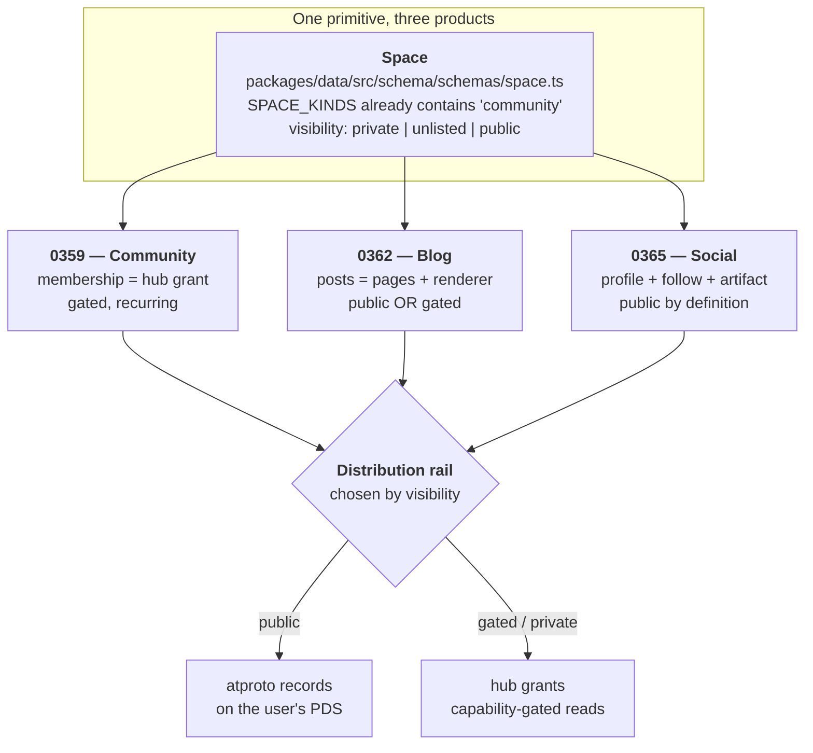
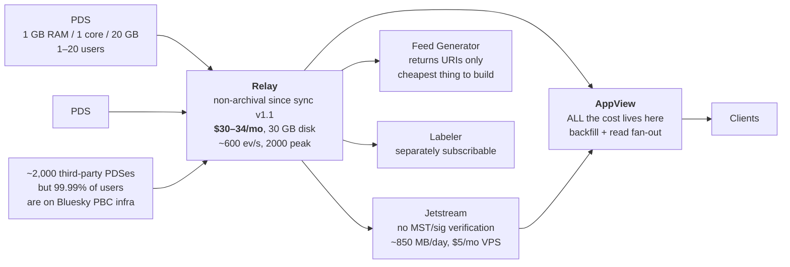
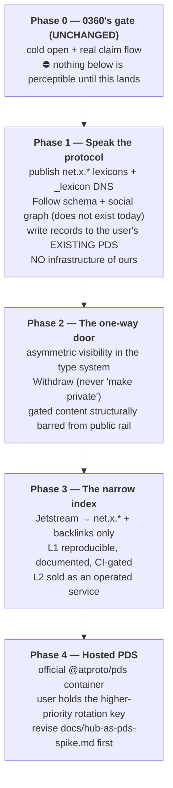

# xNet Cloud As A Social Substrate — The PDS, The AppView, And The One-Way Door

> Exploration 0365 · 2026-07-18
> Follow-up to [[0360_MAKING_XNET_CLOUD_DELIGHTFUL]] (the Fork, the commons,
> "index = mirror not master").
> Converges with [[0359_COMMUNITY_HOSTING_AND_RECURRING_REVENUE]] (Skool) and
> [[0362_PUBLISHING_ON_XNET]] (Ghost), both planned for implementation.
> Sixth in the atproto line: [[0301_ATPROTO_INTEGRATION]], [[0322_SIGN_IN_WITH_ATPROTO]],
> [[0324_ATPROTO_PERMISSIONED_PRIVATE_DATA]], [[0326_HABITAT_ODS]],
> [[0333_HOW_ATPROTO_MANAGES_SCALE]], [[0334_MASTODON_VS_ATPROTO]].

> _"The permissioned data protocol provides access control, not confidentiality.
> It is not end-to-end encrypted."_
> — AT Protocol proposal [`0016-permissioned-data`](https://github.com/bluesky-social/proposals/tree/main/0016-permissioned-data), merged 3 July 2026

## Problem Statement

[0360](./0360_[_]_MAKING_XNET_CLOUD_DELIGHTFUL_THE_FORK_THE_COMMONS_AND_TIME_TO_FIRST_DELIGHT.md)
concluded that GitHub is **two separable things** — a public commons and a
captive identity layer — and that xNet should take the first and decline the
second. It then stopped one step short of the obvious question: *what is the
commons actually made of, and where does it live?*

This document answers that, under a specific proposal:

1. **Run a PDS.** xNet Cloud hosts users' AT Protocol repositories.
2. **Run an index.** xNet Cloud operates an AppView-shaped service that makes
   the network's public records queryable, and **charges for access to it**.
3. **Put the public substrate on open protocols.** Public blog posts, public
   "git-style" repos, public profiles and follows become atproto records, so
   they are legible to an ecosystem we do not control.
4. **Keep the gated substrate somewhere else** — paid community content, paid
   posts, private workspaces.
5. **Understand the exit door.** What are the constraints of publishing
   something publicly and then taking it down?

Three of these are comfortable. **Two are load-bearing and dangerous**, and
naming them precisely is most of this document's value:

> **Danger 1 — "pay to access the index" is the exact shape of the rent the
> Charter refuses.** Charter §6 lists "No global chokepoint tier: we do not
> operate an indispensable middle to rent back later." 0360 restated it as a
> hard design rule: *"The discovery index must be a mirror, not a master."*
> A paid index is not automatically a violation, but it is one bad decision
> away from being one, and the difference is structural rather than a matter
> of intent.
>
> **Danger 2 — publishing to atproto is a one-way door, and the protocol says
> so out loud.** Deletion is specified with `should` and `may`, not `must`.
> This is not a gap awaiting a fix; it is a consequence of the architecture.
> Any xNet UI that offers "make this private again" on a published record is
> making a promise the substrate cannot keep — which is a Charter §4 (Consent)
> problem, not a missing feature.

## Executive Summary

**Verdict: yes to the PDS, yes to a narrowly-scoped index, no to selling access
to the raw index, and the "make it private again" button must never be built.**

**1. The repository is much further along than anyone remembered, and in an
unexpected place.** xNet already writes records into users' PDSes in
production. [`apps/web/src/identity/atproto-ceremony.ts`](../../apps/web/src/identity/atproto-ceremony.ts)
runs a real OAuth ceremony and calls `com.atproto.repo.putRecord` (line 108)
to write a `net.x.identity.binding` record. The hub resolves `did:plc` via
`plc.directory` and `did:web` via `.well-known`, verifies the binding
signature, and caches it
([`packages/hub/src/services/atproto-binding.ts`](../../packages/hub/src/services/atproto-binding.ts)).
`@atproto/oauth-client-browser` is a live dependency. **We are already an
atproto participant; we have just never told anyone.**

**2. The convergent ecosystem pattern is the design, and we already have its
shape.** Tangled (git), Leaflet (publishing) and Frontpage (link aggregation)
independently converged on the same split: **the PDS holds identity, pointers
and the social graph; bulk content and authorization state stay on
app-operated infrastructure.** Tangled's v1.15 explicitly moved collaborator
ACL canonicity *out of* PDS records and *into* the knot. That is precisely
xNet's existing architecture — hub holds nodes and grants, PDS holds a binding
record — which means **the integration is additive, not a rewrite**. We do not
need to move data. We need to publish pointers.

**3. The economics are not the obstacle everyone assumes.** Sync v1.1 (May
2025) made relays non-archival, and the same author benchmarking the same way
measured **$152/mo → $30/mo** with disk falling **722 GB → 30 GB**. A PDS is
1 GB RAM / 1 core / 20 GB SSD for 1–20 users. Jetstream carries filtered
firehose at ~850 MB/day on a $5/mo VPS. **All the cost lives in the AppView**,
and specifically in two places — backfill and read-time social-graph fan-out.
Scope the index narrowly and the economics inverts: Constellation indexes
backlinks across *every* lexicon at <2 GB/day on **a single Raspberry Pi 5**.

**4. The `docs/hub-as-pds-spike.md` go/no-go exists and one of its two triggers
has quietly been met.** That document defers hub-as-PDS until (a) federation
caps lift to ≥50 accounts/PDS and (b) ≥20% of active workspaces have linked an
atproto identity. Trigger (a) recorded "~10 accounts per PDS, early access" —
**that is now stale**: the official PDS README sizes a box for 1–20 users, the
Discord-registration allowlist was dropped in May 2024, and ~2,000 third-party
PDSes exist. Trigger (b) is approximately **0%**, because Cloud has never been
switched on (0360, Finding 1). **The honest move is not to declare the gate
passed but to note that the spike deferred PDS-as-identity-endgame, whereas
this proposes PDS-as-product-substrate for three converging surfaces — a
different justification that has to be argued on its own merits, not smuggled
through an existing gate.**

**5. The index must be split into three layers, and money may only attach to
the third.** This is the whole answer to Danger 1:

| Layer | What it is | Who may own it | May we charge? |
| --- | --- | --- | --- |
| **L0 — Records** | The user's repo on their PDS | **The user, always** | Never |
| **L1 — Raw index** | Firehose consumption, backlinks, the reproducible derived set | **Anyone; we publish how** | **No — this is ground rent** |
| **L2 — Operated index** | Low latency, uptime, search quality, enrichment, abuse-resistance, support | **Us, and any competitor** | **Yes — this is improvement** |

L1 is derivable from L0 by anyone who runs a relay. Charging for L1 means
charging for access to public data that we did not create — the definition of
rent. Charging for L2 means charging for a service we operate and could lose
to someone who operates it better. **The test that keeps this honest is
mechanical: L1 must be reproducible from public inputs by a third party, and
CI must prove it from the first commit.**

**6. Publishing is a one-way door and the product must be built around that
fact rather than against it.** The spec's own words: downstream services
*"should immediately stop serving/distributing content... They may defer
permanent data deletion according to local policy."* Delete events on the
firehose **deliberately carry no record body**, so acting on a deletion
requires having already retained everything. `#tombstone` was removed in sync
v1.1. There is **no enforcement mechanism and there is not going to be one.**

The design consequences are concrete and non-negotiable:

- **Never render a "make private" control on a published record.** The honest
  control is **Withdraw**, and its copy must say what it actually does.
- **Gated content never touches the public repo.** Not "usually" — never. The
  moment paid content is a public record, the paywall is decorative.
- **The visibility dial is asymmetric.** `private → public` is a door; `public
  → private` is a request. Model this in the type system, not in a tooltip.

**7. What survives the Sleep test is neither the PDS nor the index.** If a
well-funded competitor open-sourced our entire feature set tomorrow: PDS
hosting is a $5/mo commodity and dies; index hosting survives only as long as
we operate it best; community and blog hosting survive as ordinary
competition. **The one lane a competitor cannot trivially copy is the
coherence itself** — xNet is the only place where your private collaborative
working data and your public published artifacts are *the same objects under
one visibility dial, with one identity, one history, and one export*. That is
0358's integration surplus, and it is the only thing here worth calling a moat.
Every other lane should be priced as the commodity it is.

## Current State In The Repository

Labels follow 0360: **SHIPPED** (works in production), **SCAFFOLDED** (code and
tests exist, never run for real), **ABSENT**.

### The atproto bridge — shipped, and further along than the docs suggest

| Component | Path | Status |
| --- | --- | --- |
| OAuth ceremony (browser) | [`apps/web/src/identity/atproto-ceremony.ts`](../../apps/web/src/identity/atproto-ceremony.ts) | **SHIPPED** — real `BrowserOAuthClient`; `getRecord` (:80), `putRecord` (:108) |
| Profile linker UI | [`apps/web/src/identity/AtprotoProfileLinker.tsx`](../../apps/web/src/identity/AtprotoProfileLinker.tsx) | **SHIPPED** |
| Verified handle badge | [`apps/web/src/identity/VerifiedHandle.tsx`](../../apps/web/src/identity/VerifiedHandle.tsx) | **SHIPPED** |
| DID parsing / classification | [`packages/identity/src/atproto/did.ts`](../../packages/identity/src/atproto/did.ts) | **SHIPPED** — `AtprotoDid`, `parseAnyDid`, handle validation |
| Binding record + signature | [`packages/identity/src/atproto/binding.ts`](../../packages/identity/src/atproto/binding.ts) | **SHIPPED** — collection `net.x.identity.binding`, rkey `self` |
| `did:plc` rotation key | [`packages/identity/src/atproto/rotation-key.ts`](../../packages/identity/src/atproto/rotation-key.ts) | **SHIPPED (derive only)** — explicitly does **not** submit the PLC operation |
| Server-side DID resolution | [`packages/hub/src/services/atproto-binding.ts`](../../packages/hub/src/services/atproto-binding.ts) | **SHIPPED** — `plc.directory` + `.well-known`, 1h TTL, `revoke()` |
| Binding routes | [`packages/hub/src/routes/atproto.ts`](../../packages/hub/src/routes/atproto.ts) | **SHIPPED** — behind auth (`server.ts:569`) |
| Recovery anchor | [`packages/hub/src/services/atproto-recovery-anchor.ts`](../../packages/hub/src/services/atproto-recovery-anchor.ts) | **SHIPPED** |
| Lexicons (published schemas) | — | **ABSENT** — `net.x.identity.binding` is a hand-written TS interface, no `lexicons/`, no codegen, no `_lexicon` DNS record |
| PDS | `docs/hub-as-pds-spike.md` | **ABSENT** — "Status: **not built** — decision record + ops sketch" |
| Firehose / `subscribeRepos` | — | **ABSENT** — zero hits |
| Feed generator / `getFeedSkeleton` | — | **ABSENT** |

`ProfileSchema` ([`packages/data/src/schema/schemas/profile.ts`](../../packages/data/src/schema/schemas/profile.ts))
already carries `atprotoDid` (:64), `atprotoHandle` (:67) and
`atprotoBindingUri` (:70), one canonical profile per DID at a deterministic
`profileNodeId(did)` (:84). Its own comment concedes the gap this exploration
closes: handles are workspace-scoped, and *"global uniqueness is out of
scope"* (:38).

> **The single most important line in the repo for this document** is
> `rotation-key.ts` deriving a `did:plc` P-256 rotation key from the recovery
> seed while deliberately declining to submit the PLC operation. Everything
> proposed here is downstream of choosing to take that one step.

### Two name collisions that will mislead every future reader

Both of these read as social-graph infrastructure and are not. They cost me
real time; recording them is cheap insurance.

1. **`packages/hub/src/services/relay.ts` is a Yjs CRDT sync relay**, not an
   atproto relay. Unrelated concept, identical word.
2. **`packages/social` is an archive importer**, not a social graph. Its
   importers target x, instagram, reddit, tiktok, youtube, openai, claude,
   grok; the `post` (`constants.ts:107`) and `follow` (`:123`) constants
   describe *imported historical records*, and `feeds/defaults.ts` are saved
   table views over that import, `mode: 'feed'`. Likewise
   `packages/data/src/schema/schemas/feed.ts` is **RSS/Atom** (0213) and
   `posting.ts` is **double-entry accounting**.

**There is no `Follow` schema, no social-graph edge, and no timeline code
anywhere in the repository.** The social graph this exploration proposes to
publish does not yet exist to be published.

### The public read path — shipped, and narrower than it looks

[`packages/hub/src/routes/public.ts`](../../packages/hub/src/routes/public.ts)
is the hub's one unauthenticated surface (`server.ts:691`):

- `GET /public/node/:id` (:73), `GET /public/space/:id` (:82) — BFS over
  containment, capped at `maxSpaceNodes ?? 500` (:53).
- `resolveEffectiveVisibility` (:30) walks Space ancestry and **defaults to
  `private`** (:42).
- Storage: `node_visibility` table
  ([`packages/hub/src/storage/sqlite.ts:142`](../../packages/hub/src/storage/sqlite.ts)),
  values `inherit | public | unlisted | private`, set over WS in
  [`ws/handlers/node-change.ts:71`](../../packages/hub/src/ws/handlers/node-change.ts).

Note the asymmetry that matters later: **`unlisted` is defined but the public
route serves only `public`.** We already have a visibility value with no
distinct behaviour — and it is exactly the value an atproto-published record
would need.

### What exists to build the commerce on

`apps/cloud` and `packages/cloud` carry Stripe (`^17.0.0` in both), a control
plane, metering and a provisioner; `packages/billing` is provider-agnostic
with signature-verified webhooks; `packages/entitlements` holds the plan
ladder; `packages/licenses` mints Ed25519, DID-bound, **offline-verifiable**
grants. Per
[`apps/cloud/src/billing-gateway.ts:3-13`](../../apps/cloud/src/billing-gateway.ts)
there are three deliberately separate billing surfaces — tenant plans,
AI metering, and hub DID-scoped end-user billing — and the cloud Stripe
adapter is **noted as deferred behind a fake**.

### Where the three planned surfaces actually converge

0359 (community) and 0362 (blog) are being read here as one problem with this
document, because architecturally they are:



**All three are a Space with a visibility and a distribution rail.** That is
the finding that makes this tractable: we are not building three platforms, we
are building one visibility dial with two rails behind it and three
presentations in front of it.

## External Research

### The component model and what each piece actually costs



**The relay stopped being expensive, and the citation is unusually clean** —
the same author, Bluesky protocol engineer Bryan Newbold, benchmarked the same
way before and after:

| | Archival (July 2024) | Non-archival (27 Aug 2025) |
| --- | --- | --- |
| Cost | **$152/mo** + $92 setup | **$30/mo** (~$34 w/ tax) |
| Spec | 12 vCPU, 32 GB, 2×1.92 TB NVMe | 8 vCPU, 16 GB, 160 GB |
| Disk used | **722 GB** (`block_refs` alone 409 GB) | **30 GB** |

The cause is [sync v1.1](https://docs.bsky.app/blog/relay-sync-updates)
(2 May 2025): *"the relay no longer mirrors full repository data for all
accounts in the network."* `getRepo` became an HTTP redirect to the PDS.
This is 0333's "stateless verification is the cost lever" finding, confirmed
with numbers.

> ⚠️ **Stale-figure hazard.** Every 2024-era relay number (~$150–200/mo,
> "4.5 TB of disk") describes archival relays that are no longer the default.
> The [Relay Operational Updates](https://docs.bsky.app/blog/relay-ops) post
> (Nov 2024) carries a May 2025 update saying many of its changes were **never
> implemented** — do not cite it as current. And the `bsky.network` cutover of
> **27 Jan 2026** jumped sequence numbers ~17.5bn → ~26.6bn, so **firehose
> cursors are not portable across it**.

**The AppView is the whole problem, and it has two named failure modes:**

1. **Backfill.** Blacksky rewrote their consumer in Rust (`rsky-wintermute`)
   because at ~1,000 events/sec against ~18.5 billion records, a naive
   ~90 records/sec backfill would take **6.5 years**.
2. **Read-time social-graph fan-out.** [bitcrowd](https://bitcrowd.dev/2026/03/30/building-a-performance-evaluation-toolkit-and-a-dataplane-poc-for-atproto/)
   (30 Mar 2026) simulated to 40M users: the OSS Postgres fan-in dataplane hits
   **P95 ~1s / 105 `get_timeline` req/s** and degrades "often with less than
   100,000 users"; their Elixir/ETS fan-out PoC hit **P95 <20ms, >200 req/s**
   on one node.

**But the counter-example reframes the entire decision.**
[Constellation](https://constellation.microcosm.blue/) indexes backlinks
across *every* lexicon in the network at **<2 GB/day on a single Raspberry Pi
5** with a 1 TB NVMe; its predecessor ran on a Pi 4b against a 31M-user
network. **The cost is a function of index scope, not of network size.** A
global Bluesky-shaped timeline is expensive; a narrow index over
`net.x.*` records is a hobbyist expense.

> ⚠️ **Do not cite the circulating AppView cost figures.** The
> "~$500,000 in hardware" number traces to a **Lobsters comment** (~Nov 2024),
> not to Bluesky. The "$1M/month burn" figure appears only in SEO aggregator
> content and is **not traceable to any primary source**. Bluesky has published
> **no** monthly infra spend or cost-per-user. What *is* documented: production
> AppView uses ScyllaDB and is closed; the OSS dataplane reference is Postgres.

### Deletion: the finding that constrains the product

[atproto.com/guides/account-lifecycle](https://atproto.com/guides/account-lifecycle),
verbatim — downstream services:

> *"**should** immediately stop serving/distributing content for the account.
> They **may** defer permanent data deletion according to local policy."*

And:

> *"Records that have been requested to be deleted... may still exist elsewhere
> if they were processed by a Relay and ingested into another application...
> Full records are deliberately not included with delete events on the
> firehose."*

That last clause has an under-appreciated consequence: **a delete event carries
only the rkey, not the record.** So any consumer that wants to honour deletions
must already be retaining every record of that type — deletion propagation is
structurally coupled to universal retention. `#tombstone` was **removed** in
sync v1.1. bnewbold, in [Discussion #2686](https://github.com/bluesky-social/atproto/discussions/2686),
states consumers *"pragmatically have to support the situation of an event
record being 'just gone'."*

Three distinct states exist — **deactivation** (marked unavailable, preserved),
**deletion** (stop distributing, purge at local discretion), **takedown**
(similar to deletion) — and none of them is a guarantee. Blob lifecycle is
weaker still: orphaned-blob GC in PDS v2 remains
[an open issue](https://github.com/bluesky-social/atproto/issues/2051).

```mermaid
stateDiagram-v2
    direction LR
    [*] --> Private
    Private --> Public: publish (a DOOR — instant, irreversible in effect)
    Public --> Withdrawn: withdraw (a REQUEST — we stop serving; others "should")
    Withdrawn --> Public: republish
    Private --> Gated: sell access
    Gated --> Private: revoke grants
    note right of Public
      Once here, the record has been
      broadcast to an unbounded set of
      unknown consumers. No transition
      out of this state can be a promise.
    end note
    note right of Gated
      NEVER a public atproto record.
      Hub rail only.
    end note
```

### Permissioned data — merged fifteen days ago, and explicitly unstable

This is the most current and most consequential external finding, and it
partially supersedes [0324](./0324_[_]_ATPROTO_PERMISSIONED_PRIVATE_DATA_AND_XNET.md).
Proposal [`0016-permissioned-data`](https://github.com/bluesky-social/proposals/tree/main/0016-permissioned-data)
**merged 3 July 2026** and is the protocol team's main focus through summer
2026.

What it provides:

- **Spaces** — *"an authorization and sync boundary for a set of permissioned
  records, identified by an `(authority, type, skey)` triple."* Named target
  modalities include **gated content (paid newsletters)** and groups/chats.
- **Permissioned repos** — one user's records within one space, on that user's
  PDS, with **its own repository format, sync mechanism, addressing scheme and
  resolution path** — not the public repo format.
- **LtHash** set hashing (homomorphic, order-independent); signatures
  deliberately **deniable**.
- Access via a **delegation token** exchanged with the space **authority** for
  a **space credential**; the authority can be a dedicated DID, so a shared
  space can transfer between users independently of any account.
- AppViews become **syncers**, pulling each member's repo and assembling views.

What it explicitly does **not** provide — and each of these is decision-binding
for us:

- *"access control, not confidentiality... **not end-to-end encrypted**...
  Services (both PDSes and authorized applications) can read the data they
  handle."*
- *"there is no relay to provide a collated firehose... permissioned
  repositories are by their nature non-rebroadcastable."*
- Revocation notifications are *"best-effort and are not required for eventual
  consistency."*
- Account deletion of a space owner **orphans** its spaces; there is no
  cross-account ownership transfer in the spec.

> ⚠️ **Naming collision, now merged and permanent.** Atproto "Space" and xNet
> `Space` are both the authorization-and-sync boundary, and they are **not the
> same object**. 0324 flagged this as a draft-stage risk; it is now shipped
> vocabulary. Every doc, type and UI string we write from here needs to
> disambiguate, and I would not use the bare word in any cross-protocol API.

> ⚠️ **Correction to the brief:** "Grain" is *not* a private-data proposal —
> [Grain](https://github.com/grainsocial/grain) is a photo-sharing app. The
> named parallel implementers are **Blacksky, Northsky and Habitat**.

**Also merged-adjacent and worth heeding:** bnewbold's warning that naming
private records under a special NSID prefix **fails dangerous** — an oblivious
PDS encountering them *"would end up publishing your private record on the
firehose."* Whatever we do, privacy must never depend on a naming convention.

### The ecosystem's convergent architecture — three apps, one answer

| App | On the PDS | On app infrastructure |
| --- | --- | --- |
| **Tangled** (git) | identity, repo *announcements* (`sh.tangled.repo`), follows, stars, issues, PRs | **git objects, and since v1.15 collaborator ACLs**, SSH keys — on operator-run "knots" |
| **Leaflet** (publishing) | documents, publications, comments (`pub.leaflet.*`) | rendering, custom domains, email subscribers |
| **Frontpage** (aggregation) | posts, comments, votes (3 lexicons) | ranking, the site |
| **WhiteWind** (blogging) | **everything** — markdown inline in `com.whtwnd.blog.entry` | — (pays with a **100,000-character ceiling**) |

> **The pattern: the PDS holds identity, pointers and the social graph; bulk
> content and authorization state gravitate back to app-controlled
> infrastructure.** Tangled moving ACL canonicity *out of* the PDS is the
> sharpest data point, because it is a reversal made under production
> pressure. WhiteWind is the honourable outlier and its character ceiling is
> exactly the cost of being one.

**Tangled deserves specific attention** as the closest analogue to 0360's Fork.
Git on atproto, structured as: **knots** (headless git hosts), **spindles**
(CI runners subscribing via Jetstream, secrets via atproto service auth),
**Bobbin** (a stateless XRPC appview with no permanent storage). It raised
**€3.8M seed on 2 March 2026** (byFounders, Bain Capital Crypto, Antler;
angels include Thomas Dohmke and Avery Pennarun), monetising on the Tailscale
model — free for individuals and OSS, paid enterprise. Two lessons:

1. **The knot/PDS split is the Fork's blueprint.** A `.xnetpack` bundle is a
   git-bundle analogue; the announcement belongs on the PDS, the bytes belong
   on our infrastructure.
2. **`tangled.sh` now redirects to `tangled.org` but the lexicon prefix is
   permanently `sh.tangled.*`.** NSIDs are DNS-rooted and effectively
   immortal. **Choose the namespace once.**

### Lexicon governance — permissionless, DNS-rooted, and rigid

Per [the spec](https://atproto.com/specs/lexicon): *"The authority for a
Lexicon is determined by the NSID, and rooted in DNS control of the domain
authority."* Third parties absolutely may define their own. Publish the schema
as a record, then a DNS TXT record:

```
_lexicon.x.net       TXT "did=did:plc:..."
_lexicon.pack.x.net  TXT "did=did:plc:..."
```

Authority is at the **group** level and resolution is **non-hierarchical** —
resolvers do not cascade up domain levels, so **each prefix needs its own TXT
record**. Evolution constraints are hard: new fields **must** be optional,
non-optional fields **cannot** be removed, types **cannot** change, fields
**cannot** be renamed. Anything larger requires a new lexicon name.

**The IETF ATP working group was approved in late March 2026** — scoped to repo
structure, sync and identifier resolution, with **non-public data,
application-specific schemas, lexicon publication and labeling explicitly out
of scope**. So the parts we most depend on are the parts that will *not* be
standardised, and remain Bluesky-defined.

**Lexicon fragmentation is the live unsolved problem**: Leaflet, WhiteWind and
Offprint all publish longform and **none can read each other's records**.
Leaflet names this a *social* problem rather than a technical one. Publishing
`net.x.*` longform means joining that fragmentation, not escaping it — a cost
worth stating plainly in any marketing copy.

## Key Findings

1. **We are already an atproto participant in production** — writing records to
   users' PDSes — and have never said so. The marginal step to "PDS" is smaller
   than the marginal step to "social graph," which does not exist at all.
2. **The relay is cheap ($30–34/mo) and the PDS is trivial ($5/mo class). All
   difficulty is the AppView, and AppView cost is a function of index scope,
   not network size** — Constellation on a Raspberry Pi 5 proves the floor.
3. **Deletion on atproto is advisory and permanently so.** The architecture —
   non-archival relays, bodyless delete events, unbounded firehose consumers —
   makes enforcement structurally impossible.
4. **Therefore gated content can never be a public atproto record.** Two rails
   is not a design preference; it is the only correct design.
5. **Permissioned data does not rescue the gated rail either** — it is 15 days
   old, explicitly unstable, has no firehose, and provides *"access control,
   not confidentiality"* with the PDS reading plaintext. xNet's per-node
   XChaCha20 envelopes are a strictly stronger guarantee we would be giving up.
6. **The ecosystem converged on exactly xNet's existing shape** (identity and
   pointers on the PDS; content and authz on app infra), which makes this
   integration additive.
7. **Selling L1 (the raw derived index) is ground rent; selling L2 (the
   operated index) is improvement.** The boundary must be enforced by a
   reproducibility gate in CI, not by a promise.
8. **`unlisted` is defined in the visibility enum but has no distinct
   behaviour** — it is the natural slot for "published to atproto, not
   promoted by our index."
9. **The go/no-go in `docs/hub-as-pds-spike.md` is half-stale** (federation
   caps have effectively lifted) and half-unmet (binding adoption ~0%, because
   Cloud has never launched). It should be revised rather than quietly ignored.
10. **0360's Phase 0 still gates everything.** A ~17-second cold open and a
    dead claim flow mean none of this is perceptible. Nothing here reorders that.

## Options And Tradeoffs

### Option A — Identity bridge only (status quo, do nothing more)

Keep the binding record; never run a PDS or index.

- **For:** zero new ops; zero new risk; nothing to un-ship.
- **Against:** no commons, which is 0360's Finding 3 left unaddressed; the
  social graph stays absent; the three planned surfaces each invent their own
  distribution and diverge.
- **Charter:** passes trivially by not doing anything.

### Option B — Publish public artifacts as atproto records; run no infrastructure

Define `net.x.*` lexicons; write records to whichever PDS the user already has
(Bluesky's or their own). Consume via Jetstream for our own reads.

- **For:** genuinely cheap ($5/mo class); no PDS ops, no SMTP, no wildcard DNS,
  no rotation-key custody; **immediately passes the BATNA and vanish tests**
  because the records live on infrastructure we do not own.
- **Against:** we control neither availability nor latency for our own product;
  users without an atproto identity get nothing; nothing to sell.
- **Charter:** passes all four, because there is no lane.

### Option C — Full stack: PDS + relay + general AppView

Run the whole thing, Bluesky-shaped.

- **For:** complete control; the "GitHub equivalent" in its most literal form.
- **Against:** the AppView is the expensive tier *by design* (0333), backfill
  is a 6.5-year problem naively done, and a general timeline index at 40M users
  is a distributed-systems business we are not staffed for. It also recreates
  precisely the indispensable middle Charter §6 refuses.
- **Charter:** **fails the BATNA and Sleep tests as usually built.** A general
  index that only we can afford to run *is* the chokepoint.

### Option D — Two rails, narrow index, layered pricing **(recommended)**

Public artifacts on atproto; gated content on hub grants; an index scoped to
`net.x.*` plus backlinks rather than a general timeline; PDS hosting offered as
convenience, never as a requirement; money attaches only to L2.

- **For:** matches the ecosystem's convergent pattern and our existing
  architecture; index cost lands in Constellation territory rather than
  Bluesky territory; every lane stays contestable.
- **Against:** we own an ops burden (PDS: SMTP, wildcard TLS, rotation-key
  custody); "narrow index" is a discipline that will be under constant pressure
  to widen; two rails is genuinely more surface to keep coherent.
- **Charter:** passes all four **only if** the reproducibility gate ships with
  the first commit. Without it, D degrades into C over about two years.

### Applying Charter §6 to each proposed lane

Per Charter §6 and 0351, every proposed revenue lane gets the four tests
explicitly. **Ratings are mine and are argued, not asserted.**

| Lane | Improvement | BATNA | Vanish | **Sleep** | Verdict |
| --- | --- | --- | --- | --- | --- |
| **L-PDS** — hosted PDS | ✅ real ops (SMTP, TLS, backups, custody) | ✅ official `@atproto/pds` is one command | ✅ `did:plc` rotation key held by the *user* → migrate away | ❌ **commodity; a competitor at $5/mo erases it** | **Ship, price as convenience, expect no margin** |
| **L-INDEX-L1** — access to raw derived index | ❌ **charges for public data we did not create** | ❌ if we are the only affordable index | ✅ records survive | ❌ | **REFUSE — this is the ground rent** |
| **L-INDEX-L2** — operated index (latency, uptime, search, enrichment, abuse) | ✅ we run it | ✅ **only if** L1 is reproducible and documented | ✅ | ⚠️ survives only while we operate it best | **Ship, gated on the reproducibility gate** |
| **L-COMM** — community hosting (0359) | ✅ | ✅ self-host the hub | ✅ membership is a portable grant | ⚠️ ordinary competition | **Ship (0359's terms: price on ops, never seats)** |
| **L-BLOG** — blog hosting (0362) | ✅ | ✅ static export proves it | ✅ | ⚠️ Ghost is already 0% | **Ship (0362's terms: never an ESP)** |
| **L-COHERE** — one dial across private + public | ✅ integration surplus | ✅ | ✅ | ✅ **hard to copy without both halves** | **The only real moat here** |

Two conclusions from that table that I want to state rather than bury:

> **First: the thing being asked for — paid index access — is the weakest lane
> on the board, and half of it must be refused outright.** L1 fails on
> improvement. L2 is legitimate but is a service business with no structural
> defence; it earns while we are good at it and stops when we are not. That is
> fine. It is just not a moat, and it should not be planned as one.
>
> **Second: the strongest lane is not on the request list.** L-COHERE — the
> single visibility dial over one set of objects with one identity, one
> history and one export — is the only row that passes all four tests, and it
> is a *consequence* of building D correctly rather than a product we price
> separately.

## Recommendation

**Adopt Option D, in four phases, strictly ordered — behind 0360's Phase 0.**



**Phase 1 — speak the protocol before operating any of it.** Publish real
lexicons under a namespace chosen once and forever (Tangled's permanent
`sh.tangled.*`/`tangled.org` mismatch is the cautionary tale). Build the
`Follow` schema and the social graph, which genuinely do not exist. Write
public records to whichever PDS the user already has. **Operate nothing.** This
is Option B, shipped as a stage rather than an endpoint, and it de-risks
everything after it.

**Phase 2 — encode the one-way door before anything is published at scale.**
This must precede Phase 3, because the cost of retrofitting it rises with every
published record.

**Phase 3 — the narrow index, with the reproducibility gate in the same PR.**
Not "later." 0360's rule 4 is explicit that an index which is theoretically
mirrorable but practically singular is Docker Hub. Scope: `net.x.*` records
plus backlinks — Constellation's shape, not Bluesky's. Sell L2; publish L1's
recipe and prove it in CI.

**Phase 4 — hosted PDS, and only after revising the spike doc.**
`docs/hub-as-pds-spike.md` should be updated in the same change: trigger (a) is
stale and should be retired with evidence; trigger (b) should be replaced with
a criterion that is reachable given that Cloud has not launched. Mount the
**official `@atproto/pds` container** (the spike is right that we must not
write a native PDS first). The user's rotation key must remain
**higher-priority than ours** — `derivePlcRotationKey` +
`withUserPriorityRotationKey` already produce exactly this, which is what makes
L-PDS pass the vanish test.

### The three non-negotiables

1. **No "make private" on a published record.** The control is **Withdraw**,
   and its copy states what actually happens.
2. **Gated content never becomes a public record.** Enforced by types and a
   test, not by review discipline.
3. **L1 reproducible from day one, proven in CI, mirrored by someone who is not
   us before we call the property real.**

## Example Code

Illustrative, not final. The point is that the asymmetry lives in the type
system rather than in documentation.

```ts
// packages/data/src/schema/visibility.ts
//
// Publishing to a public rail is a DOOR, not a toggle. atproto's own spec
// says downstream services "should" stop serving and "may" defer deletion —
// so no transition out of `published` can be modelled as a guarantee.

/** Where a node's public representation is distributed. */
export type Rail =
  | { kind: 'none' }                       // hub-private
  | { kind: 'hub'; grants: GrantRef[] }    // gated: capability-checked reads
  | { kind: 'atproto'; uri: AtUri; publishedAt: string }; // PUBLIC, irreversible

/**
 * Withdrawal is a request, never a retraction.
 *
 * We stop serving it, we emit the delete, and we honour it in our own index.
 * We CANNOT make third parties forget. Callers must surface `caveat` to the
 * user before the action, not after.
 */
export interface WithdrawResult {
  readonly stoppedServing: true;
  readonly deleteEmitted: boolean;
  readonly caveat: 'third-parties-may-retain';
}

/**
 * Type-level guarantee that gated content never reaches the public rail.
 * `never` here is the whole safety property: there is no value a caller can
 * construct that puts a gated node on atproto.
 */
export type RailFor<V extends NodeVisibility> =
  V extends 'public'   ? Extract<Rail, { kind: 'atproto' | 'hub' }>
: V extends 'unlisted' ? Extract<Rail, { kind: 'atproto' }>
: V extends 'private'  ? Extract<Rail, { kind: 'none' | 'hub' }>
: never;

/** Paid/gated nodes are structurally barred from the public rail. */
export type GatedRail = Exclude<Rail, { kind: 'atproto' }>;
```

```ts
// packages/social/src/publish/announce.ts
//
// The Tangled lesson: the PDS holds the ANNOUNCEMENT, our infrastructure
// holds the bytes. A .xnetpack is to us what a git object is to a knot.

export async function announcePack(pack: PackRef, agent: AtpAgent) {
  return agent.com.atproto.repo.putRecord({
    repo: agent.did!,
    collection: 'net.x.pack.announcement', // NSID chosen ONCE — see 0365
    rkey: pack.slug,
    record: {
      $type: 'net.x.pack.announcement',
      title: pack.title,
      // The bundle itself is NOT in the record. This is a pointer.
      href: pack.url,
      contentHash: pack.blake3, // verifiable independently of us
      createdAt: new Date().toISOString(),
    },
  });
}
```

## Risks And Open Questions

| # | Risk | Severity | Mitigation |
| --- | --- | --- | --- |
| R1 | **The narrow index widens under pressure** until only we can run it — Option D decays into C | **High** | Reproducibility gate in CI from commit 1; a third-party mirror before we claim the property; scope stated in `ECONOMICS.md` |
| R2 | **A user publishes, then needs it gone** (doxxing, regret, legal) and we cannot deliver | **High** | Phase 2 copy; pre-publish interstitial; never offer retraction as a feature |
| R3 | **Gated content leaks onto the public rail** via a code path nobody reviewed | **High** | `GatedRail` type + a test asserting no paid node can produce an `atproto` rail |
| R4 | **Permissioned-data churn** — merged 15 days ago, *"details, terminology and behaviors are all likely to change"*, and out of IETF scope | **Medium** | Do not build on it; watch Blacksky/Northsky/Habitat; revisit in 0324's line |
| R5 | **Atproto "Space" vs xNet `Space`** collision, now permanent | **Medium** | Never use the bare word across the protocol boundary; disambiguate in every type name |
| R6 | **NSID chosen wrong, forever** — DNS-rooted, immortal, `sh.tangled.*` precedent | **Medium** | One decision, recorded as an ADR before Phase 1 lands |
| R7 | **PDS ops burden underestimated** — SMTP, wildcard TLS, rotation-key custody, silent-failure tax ([#4196](https://github.com/bluesky-social/atproto/discussions/4196), [#4379](https://github.com/bluesky-social/atproto/discussions/4379) both unresolved) | **Medium** | Official container only; Phase 4; treat as a service, not a flag |
| R8 | **Lexicon fragmentation** — Leaflet/WhiteWind/Offprint cannot read each other | **Medium** | Say so honestly in marketing; do not claim interop we do not have |
| R9 | **PLC directory governance** — a Swiss Association is forming; Bluesky says it does **not** expect this to be the final structure | **Medium** | Prefer `did:web` where the user controls DNS; monitor; keep binding path DID-method-agnostic |
| R10 | **Firehose cursor non-portability** across the Jan 2026 cutover | **Low** | Treat cursors as host-scoped; store the host alongside |
| R11 | **EU VAT Art. 9a** (0359's blocker) now spans three surfaces | **Medium** | Counsel before any paid lane, per 0359 |

### Open questions

- **Should the namespace be `net.x.*`, and is `x.net` DNS control durable?** The
  binding already uses `net.x.identity.binding` and `create-share.ts:11`
  hardcodes `did:web:xnet.fyi` — **two different domains are already implied in
  the codebase.** This must be resolved before Phase 1, not during it.
- **Does `unlisted` become "on atproto, not promoted by our index"?** It is
  currently defined with no distinct behaviour, which is either a bug or a
  vacancy.
- **What is the honest replacement for the spike's 20%-adoption trigger**, given
  Cloud has never launched and the metric therefore cannot move?
- **Do we publish a Labeler?** It is the moderation seam and we have
  `@xnetjs/abuse` (~30 modules), but it is also a governance commitment.
- **Does the Fork (0360) publish as `net.x.pack.announcement`, or does it join
  `sh.tangled.*`?** Joining Tangled's namespace buys an existing ecosystem and
  spends our independence; it deserves its own decision.
- **What happens to a published record when a user leaves xNet Cloud?** The
  vanish test demands it keeps working. If the pointer targets our host, it
  does not.

## Implementation Checklist

### Phase 0 — inherited gate (0360)

- [ ] 0360 Phase 0 is complete: cold open resolved and the claim flow reachable.

### Phase 1 — speak the protocol

- [ ] ADR: choose the NSID namespace once; resolve the `x.net` vs `xnet.fyi`
      split already implied by `binding.ts` and `create-share.ts:11`.
- [ ] Create `lexicons/` with real JSON schemas + codegen; convert
      `net.x.identity.binding` from a hand-written interface to a published lexicon.
- [ ] Publish `_lexicon.<domain>` DNS TXT records — **one per NSID group**
      (resolution does not cascade).
- [ ] Add the `Follow` schema and social-graph edges (**absent today**).
- [ ] Add `net.x.actor.profile`, mapping the existing `ProfileSchema`.
- [ ] Write public records to the user's existing PDS via the shipped ceremony.
- [ ] Consume via **Jetstream** (~850 MB/day, $5/mo class) — no relay yet.
- [ ] Document the lexicon-evolution constraints (optional-only additions, no
      renames, no type changes) in `CONTRIBUTING` so nobody learns them the hard way.

### Phase 2 — the one-way door

- [ ] Implement `Rail` / `RailFor` / `GatedRail` in the schema package.
- [ ] Replace any "make private" affordance on published nodes with **Withdraw**.
- [ ] Pre-publish interstitial stating plainly that third parties may retain copies.
- [ ] Give `unlisted` a defined behaviour (or remove it).
- [ ] Wire `withdraw()` to emit the atproto delete **and** purge our own index.
- [ ] Add the invariant test: **no gated/paid node can construct an `atproto` rail.**

### Phase 3 — the narrow index

- [ ] Index scope written down and scoped to `net.x.*` + backlinks
      (Constellation's shape, not Bluesky's).
- [ ] **`scripts/verify-index-reproducible.mjs`** — rebuild L1 from public
      inputs and diff against production; **CI-gated, in the same PR as the index.**
- [ ] Publish the L1 rebuild recipe as documentation.
- [ ] Recruit **one third-party mirror operator** before claiming mirrorability.
- [ ] Define the L1/L2 boundary in `docs/ECONOMICS.md` Moat Register, with
      L-INDEX-L1 added to the **Refused** table.
- [ ] Meter and price L2 on operations (latency class, query volume), never on
      records indexed.
- [ ] Add "no index chokepoint" to `packages/telemetry/test/charter-claims-ledger.test.ts`.

### Phase 4 — hosted PDS

- [ ] Revise `docs/hub-as-pds-spike.md`: retire the stale federation-cap
      trigger with evidence; replace the unreachable adoption trigger.
- [ ] Mount the **official `@atproto/pds`** container (never a native
      reimplementation).
- [ ] Wildcard DNS + TLS + SMTP provisioning in the control plane.
- [ ] Submit the PLC operation, with `withUserPriorityRotationKey` — **the user
      outranks us**.
- [ ] Document and test PDS **migration away** from us as a first-class flow.
- [ ] Add L-PDS to `ECONOMICS.md` as a **commodity convenience lane** with no
      margin expectation.

### Cross-cutting

- [ ] Update `docs/CHARTER.md` §6: the "No global chokepoint tier" bullet must
      address the index explicitly, since we are now building one.
- [ ] Rename or comment `packages/hub/src/services/relay.ts` to disambiguate
      from an atproto relay.
- [ ] Note in `packages/social/README` that it is an **importer**, not a graph.
- [ ] Legal review of EU VAT Art. 9a across all three paid surfaces (0359 R).

## Validation Checklist

- [ ] A `net.x.*` record written by xNet is readable by a **third-party**
      atproto client with no xNet code.
- [ ] `_lexicon` TXT resolution succeeds via `goat` and `@atproto/lexicon-resolver`.
- [ ] A user with a **self-hosted** PDS (not `bsky.social`) completes the full
      publish flow.
- [ ] A user with **no** atproto identity can still use every private and gated
      feature — the public rail is strictly optional.
- [ ] **Withdraw** removes the record from our index and emits the delete within
      one cycle; the UI stated the third-party caveat *before* the action.
- [ ] **The gated-rail invariant test fails the build** when a paid node is
      pointed at atproto.
- [ ] A paid community post and a paid blog post are **absent from the firehose**
      — verified by consuming our own Jetstream feed and grepping.
- [ ] `verify-index-reproducible.mjs` rebuilds L1 from public inputs and matches
      production; **it fails the build when it does not.**
- [ ] A third party independently reproduces L1 and publishes their result.
- [ ] L2 is degradable to L1 without loss of *correctness* — only of latency and
      convenience (BATNA proof).
- [ ] Index cost measured against the Constellation benchmark (<2 GB/day class);
      an order-of-magnitude miss reopens the scope decision.
- [ ] A hosted-PDS user migrates to another PDS and **keeps their DID, handle and
      records** (vanish proof).
- [ ] Published records still resolve after a user cancels xNet Cloud.
- [ ] `pnpm check-humane-patterns` passes — no follower counts rendered as scored
      standing (Charter §3, `VIBE.md` "reciprocity legible, never scored").
- [ ] Charter claims-ledger covers the index-chokepoint claim.

## References

### Codebase
- `apps/web/src/identity/atproto-ceremony.ts` — the shipped OAuth ceremony; `putRecord` at :108
- `apps/web/src/identity/{AtprotoProfileLinker,VerifiedHandle}.tsx`
- `packages/identity/src/atproto/{did,binding,rotation-key}.ts` — `net.x.identity.binding`; PLC rotation key derived, not submitted
- `packages/hub/src/services/atproto-binding.ts` — `plc.directory` + `.well-known` resolution, 1h TTL
- `packages/hub/src/routes/atproto.ts`, `packages/hub/src/server.ts:569`
- `packages/hub/src/routes/public.ts` — `resolveEffectiveVisibility`, defaults `private`, 500-node cap
- `packages/hub/src/storage/sqlite.ts:142` — `node_visibility`
- `packages/hub/src/services/relay.ts` — **Yjs CRDT relay** (name collision)
- `packages/social/` — **archive importer** (name collision); `connect/graph.ts`, `lenses/graph-lenses.ts`
- `packages/data/src/schema/schemas/profile.ts` — `atprotoDid`/`atprotoHandle`/`atprotoBindingUri`; handle not globally unique (:38)
- `packages/data/src/schema/schemas/space.ts` — `SPACE_KINDS` includes `community`
- `packages/identity/src/sharing/create-share.ts:11` — hardcoded `did:web:xnet.fyi`
- `packages/data/src/portability/` — `.xnetpack`; the Fork primitive (0360)
- `packages/licenses/src/token.ts` — offline-verifiable DID-bound grant (the gated rail's key)
- `apps/cloud/src/billing-gateway.ts:3-13` — three separate billing surfaces
- `docs/hub-as-pds-spike.md` — the existing go/no-go
- `docs/CHARTER.md` §6, `docs/ECONOMICS.md` §2 Moat Register

### Prior explorations
- 0301 — atproto integration; identity yes, sync no
- 0322 — sign in with atproto
- 0324 — permissioned private data (**partially superseded**: 0016 merged 3 Jul 2026)
- 0326 — Habitat ODS
- 0333 — relay economics, stateless verification, "no global tier"
- 0334 — AP decentralizes communities, AT decentralizes individuals
- 0344 — portable `.xnetpack` bundles
- 0349 — payments; payment-mints-capability
- 0351 — frontier economics; anchor-tenant rule
- 0358 — value capture without enclosure; the Sleep test
- 0359 — community hosting (**parallel, planned**)
- 0360 — the Fork, the commons, "index = mirror not master" (**parent**)
- 0362 — publishing (**parallel, planned**)

### External — protocol
- [atproto glossary](https://atproto.com/guides/glossary) · [federation architecture](https://docs.bsky.app/docs/advanced-guides/federation-architecture)
- [Account lifecycle](https://atproto.com/guides/account-lifecycle) — the `should`/`may` deletion language
- [Discussion #2686](https://github.com/bluesky-social/atproto/discussions/2686) — "just gone"; [indigo #927](https://github.com/bluesky-social/indigo/issues/927) — bodyless delete events
- [Proposal 0016 — permissioned data](https://github.com/bluesky-social/proposals/tree/main/0016-permissioned-data) (merged 3 Jul 2026); [PR #94](https://github.com/bluesky-social/proposals/pull/94); [Spring 2026 roadmap](https://atproto.com/blog/2026-spring-roadmap)
- [Discussion #3363](https://github.com/bluesky-social/atproto/discussions/3363) — "nothing is encrypted at rest or E2EE"
- [Lexicon spec](https://atproto.com/specs/lexicon) · [publishing lexicons](https://atproto.com/guides/publishing-lexicons) · [DID spec](https://atproto.com/specs/did)
- [ATP IETF working group](https://atproto.com/blog/kicking-off-the-atp-working-group) · [datatracker](https://datatracker.ietf.org/wg/atp/about/)
- [PLC directory governance](https://atproto.com/blog/plc-directory-org)
- [bluesky-social/pds](https://github.com/bluesky-social/pds) · [entryway](https://docs.bsky.app/docs/advanced-guides/entryway)

### External — economics
- Newbold, [archival relay $152/mo (Jul 2024)](https://whtwnd.com/bnewbold.net/3kwzl7tye6u2y) · [non-archival $34/mo (Aug 2025)](https://whtwnd.com/bnewbold.net/3lo7a2a4qxg2l)
- [Relay sync updates / sync v1.1](https://docs.bsky.app/blog/relay-sync-updates) · [indigo relay README](https://github.com/bluesky-social/indigo/blob/main/cmd/relay/README.md) · [relay rollout, Jan 2026 cutover](https://docs.bsky.app/blog/relay-rollout)
- Jaz, [Jetstream](https://jazco.dev/2024/09/24/jetstream/) — ~850 MB/day, $5/mo VPS
- [Constellation](https://constellation.microcosm.blue/) · [Can atproto scale down?](https://bsky.bad-example.com/can-atproto-scale-down/) — Raspberry Pi
- [bitcrowd — dataplane PoC](https://bitcrowd.dev/2026/03/30/building-a-performance-evaluation-toolkit-and-a-dataplane-poc-for-atproto/) — P95 1s vs <20ms
- [zeppelin-social/bluesky-appview](https://github.com/zeppelin-social/bluesky-appview) — turnkey self-hostable AppView
- [Pragmatic Engineer — Bluesky](https://newsletter.pragmaticengineer.com/p/bluesky) — ScyllaDB in production
- ⚠️ **Do not cite:** the "$500k AppView hardware" figure ([a Lobsters comment](https://lobste.rs/s/gsj2e2/how_self_host_all_bluesky_except_appview)) or the "$1M/month burn" figure (untraceable to any primary source)

### External — ecosystem
- Tangled — [docs](https://docs.tangled.org/single-page) · [intro](https://blog.tangled.org/intro/) · [CI/spindles](https://blog.tangled.org/ci/) · [€3.8M seed, Mar 2026](https://tech.eu/2026/03/02/building-europes-native-code-infrastructure-tangled-closes-45m-round/)
- [Leaflet](https://github.com/hyperlink-academy/leaflet) (MIT, `pub.leaflet.*`) · [Lab Notes on rejecting markdown](https://lab.leaflet.pub/3lxy5sg373k2z)
- [WhiteWind lexicons](https://whtwnd.com/lexicons) — `com.whtwnd.blog.entry`, 100k-char ceiling
- [Frontpage](https://github.com/frontpagefyi/frontpage) — MIT, active through May 2026
- [courier.social](https://courier.social/) — 385 catalogued apps
- [Nightflight, Jan 2026](https://plurality.leaflet.pub/3mfergx7i7c2b) — ~2,000 third-party PDSes; 99.99% of users on Bluesky PBC infra
