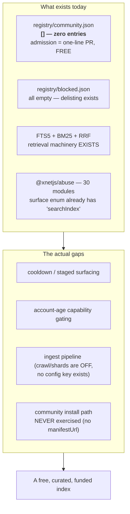
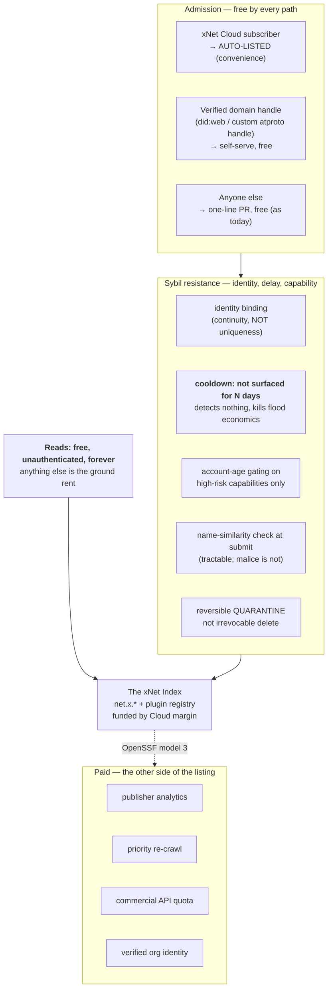
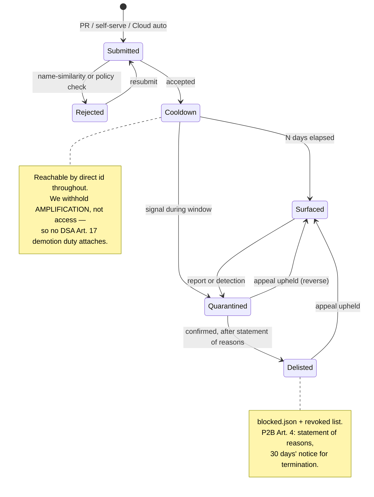

# The xNet Index — Discovery Funded By Hosting, Not By Admission

> Exploration 0366 · 2026-07-18
> Direct follow-up to [[0365_XNET_CLOUD_AS_A_SOCIAL_SUBSTRATE]], which it
> **amends**: 0365's "sell L2 index access" lane is withdrawn and replaced by
> the model below.
> Lineage: [[0360_MAKING_XNET_CLOUD_DELIGHTFUL]] ("index = mirror not master"),
> [[0358_VALUE_CAPTURE_WITHOUT_ENCLOSURE]] (the Sleep test),
> [[0196_PAID_PLUGIN_MARKETPLACE]], [[0201_PLUGINS_MARKETPLACE_DISTRIBUTION]].

> _"Listing a plugin is a **one-line pull request** — your plugin's code stays
> in your own repository."_
> — [`registry/README.md`](../../registry/README.md), the admission policy we
> already publish

## Problem Statement

0365 proposed an index and priced access to it. The revision that produced this
document changes two things, and both are improvements:

1. **Scope.** Indexing all of AT Protocol is unreasonable and was never the
   goal. The index should be **xNet-specific** — plugins, blogs, communities,
   workspaces — a discoverability layer that behaves like an app store you get
   for free with the product.
2. **Where the money attaches.** Rather than charging for *access*, the cost of
   running the index is **absorbed into xNet Cloud hosting fees**. Cloud
   subscribers are simply in it. The open question is what happens to people who
   are *not* Cloud customers: perhaps they pay a fee to link their PDS and be
   listed, and perhaps that expands to a fully free public index later, once
   there is margin to eat the cost.

That second point is the real subject here, and it contains a question the
original framing does not quite ask:

> **Is a listing fee a spam gate, or a revenue instrument wearing a spam gate's
> clothes?**

This matters because the two have different designs. If the fee is really about
cost recovery, it should be argued as cost recovery and sized against actual
costs. If it is about spam, then the evidence about whether listing fees stop
spam becomes decisive — and that evidence turns out to be unusually clear, and
unusually against.

There is also a constraint the proposal has to clear that predates it:
**we already promise free listing, in writing, in the repository.**

## Executive Summary

**Verdict: adopt the scope change in full, keep reads free, and do not charge
for admission. Fund the index from Cloud margin — which is the model you
already reached for at the end of your own reasoning, and which is a
recognised, working pattern rather than a concession.**

**1. The scope change is straightforwardly right and makes the cost objection
disappear.** An index over `net.x.*` records plus the plugin registry is
Constellation-shaped, not Bluesky-shaped — 0365 established that index cost is
a function of *scope*, not network size. Homebrew's entire historical
infrastructure spend is **~$64K across its whole existence**; its ledger shows
maintainer stipends at nearly double infrastructure plus CI. PyPI's origin
usage grew **25% in eight years** against exponential traffic growth, because
CDN offload flattens it. **A directory costs people, not bytes.** You are not
funding a data centre; you are funding a review queue.

**2. The model you landed on has two working precedents doing exactly this, and
an industry consensus statement endorsing it.** Packagist funds
`packagist.org`'s maintenance from **Private Packagist**, its paid SaaS.
Eclipse's **Open VSX** funds a free public registry from the **Open VSX Managed
Registry** commercial tier — and states the principle outright: *"Individual
developers and open source projects never pay."* The September 2025 OpenSSF
**"Open Infrastructure is Not Free" joint statement** — signed by PyPI, Ruby
Central, crates.io, Packagist, Open VSX, Maven Central and others — names
exactly three sanctioned funding models: commercial partnerships proportional
to usage; **tiered access that maintains openness**; and **value-added
capabilities sold to commercial entities**. "Free public index, funded by the
paid hosting product" is model 2 plus model 3. It is not improvisation.

**3. Listing fees do not do the job they are bought for, and the numbers are
brutal.** This is the finding that should settle the sequencing question:

| Store | Fee | Outcome |
| --- | --- | --- |
| **Apple App Store** | **$99/year** | **146,000+ developer accounts terminated for fraud in 2024 alone**; 139,000 enrolments rejected |
| **Chrome Web Store** | **$5 one-time** | **10,426 malware extensions, 280M installs** over three years; **380-day median** dwell time in store |

At $99 each, Apple's terminated accounts represent roughly **$14M in fees paid
by fraudsters**. Both of the industry's canonical "anti-spam fees" are attached
to stores with enormous, well-measured abuse problems. Insofar as Chrome's $5
worked at all, the mechanism reporters identified was not the price — it was
that payment via Google Checkout **bound the account to a credit card**, making
identity traceable. **The deterrent was identity binding, not cost.** And
Google's actual anti-abuse lever arrived thirteen years later and was also
identity: D-U-N-S numbers and government ID (July 2023).

**4. Charging admission would reverse a published promise, which is the one
failure mode with a perfect track record of blowing up.** `registry/README.md`
currently states that listing is a one-line pull request. Across every case
researched, the pattern is consistent: **metering new bulk or commercial
consumption survives; revoking an existing free grant gets reversed.** npm's
2019 threshold hit **0.01% of organisations** and stuck. Docker's 2024 pricing
touched **<3% of accounts** and stuck. Docker's 2023 attempt to sunset the Free
Team plan was **fully reversed in ten days** — *"It's now clear that both the
communications and the policy were wrong."* **The failure variable is never the
amount. It is revocation.** `ECONOMICS.md` already predicted the shape of this
argument: *"Ours will arrive dressed the same way: as fairness, aimed at
free-riders rather than users... If you are reading this while making that
argument, the argument is the symptom."*

**5. The right sybil resistance is identity, delay and capability-gating — and
one of these is free, requires detecting nothing, and we should steal it
immediately.** Douceur's 2002 result is that sybil attacks are unavoidable
*without a logically centralised authority*. **A curated index with a review
process already is that authority**, which is why we can skip essentially all
of the exotic machinery. What actually works, per the evidence:

- **PyPI's consumption-side cooldown** — their current top recommendation is to
  not install anything published in the last **3 days**. Applied to a discovery
  index: **new entries are not surfaced for N days.** It costs legitimate
  publishers nothing, destroys flood economics, and requires no detection at
  all. This is the single best idea in the research set.
- **Identity binding** — a verified domain handle, which atproto gives us free
  via DNS. Worth ~$10/yr to an attacker, so **a continuity primitive, never a
  uniqueness proof.**
- **Capability gating by account age** — Wikipedia's autoconfirmed, Lobsters'
  70-day probation. Gate *high-risk capabilities* (inviting, adding new
  domains), not participation.

**6. Three things the evidence says to refuse outright.** Verified-publisher
badges are theatre — Aqua bought a domain and impersonated Prettier to 1,000+
installs in 48 hours; Koi typosquatted Dracula as "Darcula", **bought a domain
to get the blue check**, and reached Trending. Ratings and install counts carry
**no statistical signal** (Stanford, n=252,776). And any ranking on download
counts or dependency-graph centrality is directly attackable — the tea.xyz
campaign published **150,000+ packages** with **no malware in them**, existing
purely to farm graph-centrality metrics.

**7. What we should sell instead is on the other side of the listing.** Not
admission, not access — **value-added capabilities**: publisher analytics,
priority re-crawl, a commercial-volume API tier, verified-organisation identity
services. That is OpenSSF model 3, it passes all four Charter tests, and it
charges the parties who are extracting commercial value rather than the
hobbyist who makes the index worth reading.

**8. The recommended sequencing is the reverse of the one proposed.** Start
free, small and curated — because the cost at small scale is negligible, the
early population determines the ecosystem's character, and the current
`community.json` contains **zero entries**. A listing fee today would be
charging admission to an empty room, and would spend the trust signal that
0360 identified in Tailscale's decision to *widen* its free tier. **Add paid
lanes on the commercial side as volume arrives; never take back the free one.**

## Current State In The Repository

### The index already exists, and its admission mechanism is a pull request

This was the most clarifying discovery of the research, because it means we are
not designing an admission policy from scratch — **we are deciding whether to
replace one that already works and is already free.**

| Path | Lines | What it is |
| --- | --- | --- |
| [`registry/registry.json`](../../registry/registry.json) | 489 | **Generated.** Exactly **19 entries**. The merged index the site and app read. |
| [`registry/first-party.json`](../../registry/first-party.json) | 287 | Curated `tier: bundled` source. All 19 come from here. |
| [`registry/community.json`](../../registry/community.json) | 1 | **`[]` — zero community submissions, ever.** |
| [`registry/blocked.json`](../../registry/blocked.json) | 6 | `{repos, authors, pluginIds, revoked}` — **all empty.** The delisting mechanism. |
| [`registry/README.md`](../../registry/README.md) | — | The published submission process. |
| [`scripts/build-plugin-index.mjs`](../../scripts/build-plugin-index.mjs) | — | Merges + enriches from the GitHub API; staleness check at :168 |
| `.github/workflows/plugins-registry.yml` | — | Daily rebuild; publishes `site/public/revoked.json` |

**It is a static committed JSON file, not a service.** There is no registry
server, no API, no database. Submission is a PR adding `{repo, category}`.

This is worth stating plainly, because it is a strength that reads like a
limitation: **a git-repo registry is already free, already sybil-resistant via
human review, already reproducible by anyone, and already a commons.** It
satisfies 0360's "mirror not master" rule by construction — anyone can clone
it. The design question is not "how do we build an index" but **"what replaces
human review when PRs stop scaling"** — and a fee is only one candidate answer,
and per §External Research, the worst-evidenced one.

### The parts that are quietly broken today

These are independent of any decision here and should be fixed regardless.

| # | Problem | Location |
| --- | --- | --- |
| **B1** | **Every marketplace install reports "unverified."** `failClosedVerifier` is the only `ProvenanceVerifier` implementation and always returns `verified: false`; no cosign/rekor verifier exists. | [`packages/plugins/src/ecosystem/provenance.ts:63-73`](../../packages/plugins/src/ecosystem/provenance.ts) |
| **B2** | **The plugin-licence CI check is a no-op.** It scans `marketplace/**/registry.json`; the real file is `registry/registry.json`, so it prints "no marketplace registry found" and exits clean. | [`scripts/check-plugin-licenses.mjs:48`](../../scripts/check-plugin-licenses.mjs) |
| **B3** | **`installs` and `stars` sorts are no-ops** — the fields are never populated in `registry.json`. (Per External Research, this is *fortunate*: both are attackable non-signals.) | [`packages/plugins/src/ecosystem/marketplace.ts:60,113-129`](../../packages/plugins/src/ecosystem/marketplace.ts) |
| **B4** | **Schema drift.** `MarketplaceEntry` declares `manifestUrl` required; **no actual entry has it.** Since `isInstallable()` requires either a first-party catalog record or a `manifestUrl`, **the community install path has never been exercised against real data.** | [`marketplace.ts:24-57`](../../packages/plugins/src/ecosystem/marketplace.ts), [`apps/web/src/components/marketplace-listing.ts:66-72`](../../apps/web/src/components/marketplace-listing.ts) |
| **B5** | **Paid plugins cannot install.** `@xnetjs/licenses` is complete and well-tested; its only non-test consumer is a test. Absent a wired provider, a priced plugin is blocked with `no-license-provider`. | [`packages/licenses/`](../../packages/licenses/), [`packages/plugins/src/registry.ts:67-71,165-172`](../../packages/plugins/src/registry.ts) |

**B4 is the one that matters most for this document**: the free community
submission path we already advertise has never actually been walked end to end.
Before debating what to charge for it, it has to work.

### The anti-abuse substrate is much stronger than expected

[`packages/abuse/`](../../packages/abuse/) is **30 modules, ~7,500 lines, with
real consumers** in hub, network, plugins and web. Its surface enum
([`types.ts:8-20`](../../packages/abuse/src/types.ts)) **already includes
`searchIndex` and `crawl`.**

Directly reusable for an index:

- [`content-fingerprint.ts`](../../packages/abuse/src/content-fingerprint.ts) (296 ln) — near-duplicate detection, i.e. flood detection
- [`policy-blocks.ts`](../../packages/abuse/src/policy-blocks.ts) (300 ln) — signed blocklists by did/peer/domain/url/hash, scoped
- [`labeler-trust.ts`](../../packages/abuse/src/labeler-trust.ts) (429 ln) — `blocked/observe/review/trusted` tiers
- [`community-notes.ts`](../../packages/abuse/src/community-notes.ts) (317 ln) — diversity-aware agreement scoring
- [`public-write-budget.ts`](../../packages/abuse/src/public-write-budget.ts) / [`query-cost-budget.ts`](../../packages/abuse/src/query-cost-budget.ts) — per-DID/hub/workspace budgets
- [`staged-writes.ts`](../../packages/abuse/src/staged-writes.ts) (377 ln) — **the natural home for a cooldown**
- [`appeals.ts`](../../packages/abuse/src/appeals.ts) — `reverse | annotate` (needed for P2B Art. 4)
- [`deployment-profile.ts`](../../packages/abuse/src/deployment-profile.ts) — already ships a **`public-search-hub`** preset

**The gap is exactly the social/registry-specific layer:** no account-age
heuristic, no proof-of-work, no CAPTCHA, no device fingerprinting.
`first-contact` is the closest existing reason code to new-account friction.
Given the research, **account-age gating and a cooldown are the two additions
worth making, and neither needs new cryptography.**

### Search and ranking that already exist

| Component | Status |
| --- | --- |
| SQLite **FTS5** + `bm25()` — 3 virtual tables | **EXISTS** ([`packages/hub/src/storage/sqlite.ts:330,405-406,1162-1188`](../../packages/hub/src/storage/sqlite.ts)) |
| Federated search with **reciprocal rank fusion** (k=60) | **EXISTS, enabled** ([`packages/hub/src/services/federation.ts:375-397`](../../packages/hub/src/services/federation.ts)) |
| Marketplace `relevanceScore` (name 100 / substring 40 / keyword 10 / desc 5) | **EXISTS** ([`marketplace.ts:77-90`](../../packages/plugins/src/ecosystem/marketplace.ts)) |
| `search-indexer.ts` (285 ln) | **SCAFFOLDED** — only importer is its own test |
| `crawl.ts` (547 ln), `index-shards.ts` (184 ln) + shard router/ingest/rebalancer | **SCAFFOLDED** — `enabled: false`, and **no `crawl`/`shards` key exists in `config.ts` at all** |
| Feed ranking / content scoring / author reputation | **ABSENT** — and per Charter §3, deliberately so |

We already have the retrieval machinery. What is missing is the *pipeline* that
feeds it and the *policy* that governs it.

### The commitments this design must not break

[`site/src/pages/marketplace-terms.astro:127`](../../site/src/pages/marketplace-terms.astro)
publishes:

> *"Ranking neutrality. Plugins published by xNet or its maintainers receive no
> ranking, placement, or search preference over anyone else's. We rank on the
> same signals for..."*

**Note precisely what that covers and what it does not: it governs *ranking*,
and says nothing about *inclusion*.** A design where Cloud customers are listed
automatically and others must pay is an **inclusion asymmetry** — not literally
a breach, but plainly against the spirit, and exactly the kind of gap that
looks like a loophole in hindsight. Charter §6 likewise refuses "marketplace
self-preferencing" in ranking terms only.

**If any admission asymmetry ships, the terms must be extended to state the
admission criteria publicly and neutrally.** Silence is the wrong answer.



## External Research

### Do listing fees stop spam? No, and it is well measured

| Platform | Fee | Structure | **Stated** rationale |
| --- | --- | --- | --- |
| Apple Developer Program | $99/yr | recurring | IP licence + tooling. **Never framed as anti-spam.** |
| Google Play | $25 | one-time | **No stated purpose anywhere in Google's docs** |
| Chrome Web Store | $5 | one-time | The only one framed as anti-fraud |
| npm, PyPI, crates.io, Homebrew, RubyGems, Packagist, VS Code Marketplace, Open VSX, Obsidian, WordPress.org | **$0** | — | — |

Apple's own framing is instructive: in the Epic litigation it characterised the
$99 as consideration for an **IP licence**, not an abuse deterrent, and its
**fee waiver** applies to nonprofits, educational and government entities *that
do not sell digital goods* — a revenue-side carve-out, which tells you the fee
is priced as a tax on commerce.

And the outcomes, both primary-sourced:

- **Apple, 2024:** [146,000+ developer accounts terminated for fraud, 139,000
  enrolments rejected](https://www.apple.com/newsroom/2025/05/the-app-store-prevented-more-than-9-billion-usd-in-fraudulent-transactions/) —
  *despite* $99/yr.
- **Chrome Web Store, Jul 2020–May 2023:** Stanford/CISPA analysed 252,776
  extensions ([arXiv 2406.12710](https://arxiv.org/html/2406.12710v1)):
  **10,426 malware**, 15,404 policy-violating, **346M users installed one**.
  Malware sat in the store a **median of 380 days**; vulnerable extensions
  averaged **1,213 days**; **42% of vulnerable extensions were still live and
  still vulnerable two years after disclosure.**

> ⚠️ **Provenance note.** The famous Chrome anti-fraud quote is **not** in the
> [primary 2010 announcement](https://groups.google.com/a/chromium.org/g/chromium-extensions/c/CerLuI9m3EE),
> which only states the $5 fact. The anti-fraud wording is consistently
> attributed across contemporaneous reporting but I could not verify it
> directly — treat as reliably attributed, not primary. The author's own
> follow-up is pure benchmarking: *"this one-time cost compares favorably with
> fees charged by other developer platforms."*

**The mechanism that did work was identity, not price.** Chrome's payment ran
through Google Checkout, which bound the account to a credit card and created a
paper trail. Google's real anti-abuse move came in **July 2023**: D-U-N-S
numbers for organisations and government ID for personal accounts, *"to help
prevent the spread of malware, reduce fraud, and help users understand who's
behind the apps"* — plus a 20-testers/2-week cooldown for new personal
accounts.

### What actually worked, across every registry studied

**Theatre, with evidence against it:**

1. **Automated malware scanning as an admission gate.** Peer-reviewed (ICSE
   2023): measured tools show **false-positive rates of 15%–97%** against an
   operator requirement of **<0.01%**; some alerted more on benign packages
   than malicious ones.
2. **Verified-publisher badges.** Aqua Security built a Prettier impersonator
   and got **1,000+ installs in 48 hours**; their finding is that verification
   *"means that whoever the publisher is has proven the ownership of a domain.
   That means any domain"* — with display names **not unique** and repo links
   **entirely unvalidated**. Koi typosquatted Dracula as "Darcula", **bought a
   domain to obtain the blue check**, and hit Trending. **A badge that can be
   bought for $10 launders trust rather than conferring it.**
3. **Ratings and install counts.** Stanford: 58.63% of policy-violating
   extensions have no ratings, and rated ones are **statistically
   indistinguishable from benign**.
4. **Popularity / graph-centrality metrics.** The tea.xyz campaign published
   **150,000+ packages** (~1% of npm) at roughly one every 7–10 seconds across
   ≥11 accounts, using **circular dependency chains** to inflate centrality.
   **The packages contained no malware** — they were economically rational
   sybils farming a reward metric. No malware scanner would ever have seen them.
5. **Listing fees** — §above.

**Worked:**

1. **Closing registration under load.** PyPI suspended new user registration
   and project creation twice (~30h in May 2023; again March 2024 against ~365
   typosquats). The stated 2023 reason was **human triage capacity**, not
   detection capability — crude, effective, honest.
2. **Tiered mandatory 2FA** (npm's top-100 → top-500 → all high-impact ladder).
3. **Eliminating long-lived credentials** — trusted publishing/OIDC; npm
   revoked classic tokens 9 Dec 2025.
4. **Reversible quarantine over irrevocable deletion.** PyPI's quarantine
   (since Aug 2024) has held ~140 projects, of which **exactly one ever
   exited**. Lowering the cost of acting on uncertain signal *is* the
   bottleneck.
5. **Fast human triage with a trusted-reporter corps.** PyPI: 2,000+ malware
   reports/yr, **66% resolved <4h, 92% <24h**. ⚠️ Bus factor: of 76 reporters,
   **3 filed 200+ each**.
6. **Consumption-side cooldowns.** PyPI's current top recommendation is to not
   install anything published in the **last 3 days** — a concession that
   detection latency (hours) will always exceed install latency (minutes).
7. **Name-similarity detection at creation time.** TypoGard flagged up to
   **99.4%** of known typosquats while warning on only **0.5%** of installs.
   Note the boundary: *name similarity* is tractable; *malice* is not.

### The volume curve, and why humans alone will not hold

Two independent signals of the same thing:

- **WordPress.org** (100% volunteer review): submissions hit **~700/week in May
  2026 — 2.7× 2025 and 5× 2024**; the queue peaked at ~1,050; the team did
  ~3,000 initial reviews in May 2026 (vs ~1,100 in May 2025), *"about 5% of the
  entire directory"* in one month. They added **three** volunteers.
- **Obsidian**: *"As coding agents accelerate the creation of plugins, the
  review queue was only getting longer."* Their answer was **automated
  per-version code-quality and vulnerability scanning plus scorecards**,
  clearing **2,300 queued submissions in days**, reserving humans for popular,
  featured or flagged plugins.

> **Both survivors responded with automation for the floor and humans for the
> tail — not with fees.** Any admission design must assume submission volume
> grows several-fold per year from AI-generated entries while human review
> capacity does not.

### Sybil resistance: what the literature actually says

**Start with the framing correction, because it saves us most of the work.**
Douceur (IPTPS 2002) proves sybil attacks are always possible *"without a
logically centralized authority"* — he does **not** say "you need money." He
says you need a central authority **or** resource parity. **A curated index
with a review process already is a logically centralised authority.** Most of
the machinery below exists to avoid the thing we already have.

| Mechanism | Verdict | Why |
| --- | --- | --- |
| **Domain / DNS verification** | **Use — as continuity, not uniqueness** | Attack cost ≈ one domain (~$10/yr) + waiting. **Dangling-DNS risk**: if a verified domain lapses, the re-registrant inherits the identity. Re-verify on a schedule. |
| **Account-age / capability gating** | **Use** | Wikipedia autoconfirmed (4d + 10 edits), Lobsters 70-day probation. Cheap to attack in the abstract, **expensive at scale** — forces attackers to pre-commit time across many accounts before knowing which survive. |
| **Consumption-side cooldown** | **Use — highest value** | Requires detecting nothing. |
| **Invite trees** | Optional | Lobsters is the model: public tree, no vetting, consequences to the **inviter**, transparent mod log, explicit ban on shadow banning. **Documented hole:** a marketer ran ten alts and *"avoided being apparent in the invite tree by showing up to the chat room"* — **an open invite-request channel launders accountability out of the tree.** |
| **Proof-of-personhood** | **Skip** | Credentials are rentable: World ID black market reported at RMB 9.9–499 ⚠️(secondary). Vitalik's own defence concedes PoP gives limited resistance *absent ongoing economic incentive to keep the ID*. A transferable uniqueness proof is not one. |
| **Stake / bonds** | **Skip** | No successful deployment. Token curated registries have a proven incentive hole: verifiers only profit when an applicant is **challenged and rejected**, so absent challenges there is no incentive to curate. **A bond pays people to fight, not to maintain a list.** |
| **PGP web of trust** | **Skip** | Failed structurally: GPG caps chains at 5, but max distance in the strong set is 27 and **only 38.7% of node pairs are within 5**. Also, signing semantics were never defined. **If we build vouching, define exactly what a vouch asserts.** |
| **SybilGuard / SybilLimit** | **Do not cite** | Assume fast-mixing social graphs, empirically false for directed graphs. An invite tree is directed and sparse — the worst case. |

> ⚠️ **On the famous MetaFilter $5:** the claim that it solved spam is
> universally repeated and **nowhere tested**. The founder's own account
> contradicts the strong version — post-fee he still built an *"instant spammer
> list"* (accounts <24h old, posted a comment, contains "http", ~1 in 10 false
> positives). The 2014 Georgia Tech study is **qualitative** (11 interviews) and
> reports intent and perception, not causal effect. Sources also conflict on
> the date (Nov 2004 vs Feb 2004) and framing (growth management vs spam).
> **Honest reading: a small fee filters the automated low-effort tail;
> motivated spammers paid and kept coming, and were stopped by tooling plus
> paid human moderation.** Note also the incentive you may not want — when
> re-registration after a ban costs another fee, banning becomes a revenue line.

### What a directory actually costs

**The single most important framing: nobody pays retail, and almost every
published cost number is a rack rate on a 100%-discounted bill.**

- **PyPI** — Fastly bills *"more than $1.8M per month"* at a **100% discount**,
  preventing **>96%** of traffic reaching backends. Actual cash: Google Cloud
  ~**$10K/month**, AWS ~**$7,000/month in credits**. The killer stat: *"AWS
  Open Source Credits usage has only grown 25% over 8 years"* against 2–3
  **billion** requests/day. **CDN offload makes origin cost nearly flat.**
- **Homebrew** — the only fully public ledger: annual budget **~$107–111K**;
  **infrastructure $36,242 + CI $28,251 = ~$64K across its entire history**;
  maintainer stipends **$122,084** — nearly double infra+CI. Bottle
  distribution externalised to GitHub Packages.
- **crates.io** — 0.5 PB/mo (2021) → 4–5 PB/mo (proj. 2025), ~80% via Fastly.
  **No dollar figures published anywhere.**
- ⚠️ **Do not cite** a dollar cost for npm (none is public despite the
  reputation) or the widely-circulated RubyGems "$500K/month Fastly" figure
  (not in its attributed source; the only traceable number is *"comping us
  something like $35k worth of CDN service per month"* from **December 2016**
  board minutes).

> **Homebrew's ledger is the honest model for us: a directory costs *people*,
> not bytes.** Budget for a CDN relationship and for reviewers.

### Funding a free public registry from a paid product — the precedents

This is exactly the model the revision proposes, and it has working instances:

- **Packagist** — **Private Packagist (paid SaaS) funds the majority of
  `packagist.org`'s maintenance**, at 3B installs/month.
- **Open VSX / Eclipse** — free public registry funded by the **Open VSX
  Managed Registry** commercial tier (300M+ monthly downloads, 99.95% SLA):
  *"Individual developers and open source projects never pay."*
- **OpenSSF "Open Infrastructure is Not Free" joint statement** (23 Sept 2025),
  signed by PyPI, Ruby Central, crates.io, Packagist, Open VSX, Maven Central,
  OpenJS and others — names three sanctioned models: **commercial partnerships
  proportional to usage; tiered access maintaining openness; value-added
  capabilities sold to commercial entities.**

**And the discipline that makes cross-subsidy durable.** Cloudflare's stated
reasons for its free tier are not charity: **spare capacity** (*"our free
service actually helps us keep our costs lower"*), **threat intelligence**
(*"a wide surface area exposes our network to diverse traffic and attacks that
we wouldn't otherwise see"*), **QA at scale**, and advocacy.

> **Cross-subsidy sustained by goodwill decays; cross-subsidy where the free
> tier is a factor of production does not.** The question to answer is not
> "what does the index cost us" but **"what does the index produce for the paid
> product."**

The five-factor pattern separating durable free tiers from collapsed ones:

1. **Is the free resource fungible and resellable?** CI minutes convert to
   money — Travis CI's free OSS tier collapsed under crypto-mining, *"Abusers
   have been tying up our build queues."* **Index listings do not convert.
   A discovery index is structurally far safer than free compute.**
2. **Is marginal cost genuinely near-zero?** Yes, at our scale.
3. **Does the free tier produce something for the paid product?** Must be
   answered deliberately (see Risks R2).
4. **Is the commitment formal?** Fastly's signed multi-year agreements held;
   Vercel's at-will OSS sponsorships evaporated with ~24 hours' notice.
5. **Is metering concentrated on the consumption side?** npm 0.01%, Docker <3%
   — both stuck.

### The regulatory floor — smaller than feared, but not zero

*Not legal advice. Counsel before launch (0359 already flags EU VAT Art. 9a).*

**P2B Regulation (EU) 2019/1150** — the one that actually applies:

- **Art. 5(1)**: set out in T&Cs the **main parameters** determining ranking and
  **the reasons for their relative importance**. Guidelines require going
  *"beyond a simple enumeration"* with a **"second layer"** of explanation.
- **Art. 5(3)**: where ranking can be influenced by **direct or indirect**
  remuneration, describe that **and its effects on ranking**.
- **Art. 5(6)**: algorithms need not be disclosed (trade-secret valve).
- **There is no size threshold for Art. 5.** Small-enterprise exemptions exist
  only for **Art. 11** (internal complaints) and **Art. 12** (mediation).
- **Recital 10**: *"It should also not be relevant whether those transactions...
  involve any monetary payment."* **Free listings do not escape scope.**
- Enforcement is member-state level with **no EU fine schedule**; the realistic
  exposure is **Art. 14 injunctive actions** by representative bodies.

**The counter-intuitive finding: charging a fee makes the regulatory position
worse, not better.** A flat access fee is **not** ranking influence, so Art.
5(3) is not triggered by the fee itself. But it guarantees a **contractual
relationship** with every payer, which makes it hard to argue you are outside
P2B at all, and pulls in **Art. 3** (plain-language T&Cs, 15-day change notice)
and **Art. 4** (statement of reasons for restricting/suspending/delisting, 30
days' notice for termination). **For a curated index that reserves the right to
reject or remove, Art. 4 is a bigger design constraint than Art. 5.**

**Paid placement flips three switches at once**, and one is per-se unlawful:

- **P2B Art. 5(3)** — disclose the mechanism and its ranking effects.
- **UCPD Annex I point 11a** — a **blacklisted, per-se-unfair practice** with
  **no case-by-case assessment and no small-enterprise exemption**: search
  results *"without clearly disclosing any paid advertisement or payment
  specifically for achieving higher ranking."*
- **UCPD Art. 7(4a)** — disclose main ranking parameters in a dedicated,
  directly accessible part of the interface.

> **Design rule that falls out: if sponsored slots ever exist, they live in a
> strictly separated, per-item-labelled band that is never interleaved with the
> organic index.** Then organic ranking contains no remuneration term and Art.
> 5(3) never engages for it. Interleaving is what creates the hard obligation,
> because *"the effects of such remuneration on ranking"* is genuinely
> difficult to write truthfully for a blended relevance score.

**DSA (EU) 2022/2065**: Art. 19 exempts micro/small enterprises from Arts.
20–28 (including recommender-system transparency). But **Arts. 11–18 apply
regardless of size** — notably **Art. 14** (T&Cs must describe moderation
policies *including algorithmic decision-making*), **Art. 16** (notice and
action), **Art. 17** (statement of reasons for removals **and demotions**).
⚠️ Art. 19's exact wording verified via mirrors + recital 57, not EUR-Lex HTML
— check the OJ PDF.

**DMA**: irrelevant. Gatekeeper thresholds are ≥€7.5B EU turnover or ≥€75B
market cap **and** ≥45M monthly EU end users. Off by three to four orders of
magnitude.

> Worth noting the asymmetry: **the DMA *bans* self-preferencing but only for
> gatekeepers; P2B never bans it, only requires disclosure — and applies to
> everyone with no size floor.** Our own published ranking-neutrality promise
> is therefore stricter than the law requires. Good.

## Key Findings

1. **The index already exists as a git repo, and admission is already free** —
   `registry/README.md` promises a one-line PR. Any fee is a **reversal**, and
   revocation is the one move with a perfect record of backfiring.
2. **`community.json` is empty.** A listing fee would charge admission to an
   empty room.
3. **Listing fees do not stop spam.** Apple: $99/yr, 146,000 accounts
   terminated in 2024. Chrome: $5, 10,426 malware extensions, 380-day median
   dwell. Where a fee helped, the mechanism was **identity binding**, not price.
4. **A directory costs people, not bytes.** Homebrew: ~$64K infrastructure
   across its entire history, against ~$122K in maintainer stipends. PyPI's
   origin usage grew 25% in eight years.
5. **The proposed model has working precedents and an industry endorsement** —
   Packagist, Open VSX, and OpenSSF's three sanctioned funding models.
6. **We already have the centralised authority** Douceur says is required, so
   the exotic sybil machinery is unnecessary.
7. **The cooldown is free and requires detecting nothing** — steal it.
8. **Verified badges, ratings and install counts are all measurably worthless
   or actively harmful as trust signals.** Fortunately `installs`/`stars` are
   already unpopulated.
9. **Charging pulls in more regulation than not charging** (P2B Arts. 3 and 4),
   and paid *placement* is per-se unfair under UCPD Annex I 11a without
   in-results disclosure.
10. **Our published ranking-neutrality promise covers ranking but not
    inclusion** — an admission asymmetry would sit in that gap.
11. **The free community install path has never been exercised** (B4): no entry
    carries the `manifestUrl` that `isInstallable()` requires.
12. **Submission volume will grow several-fold per year from AI-generated
    entries.** Plan for automation at the floor, humans at the tail.

## Options And Tradeoffs

### Option A — Pay to be listed unless you are on Cloud (as proposed)

- **For:** covers cost directly; the fee is a real if weak spam filter; simple
  to explain; creates a clean commercial relationship.
- **Against:** reverses a published free-listing promise; charges admission to
  an empty directory; buys spam resistance the evidence says fees do not
  deliver; creates an inclusion asymmetry our terms do not currently address;
  **pulls in P2B Arts. 3 and 4 by creating a contract with every lister**;
  filters out exactly the hobbyist authors who would make the index worth
  reading.
- **Charter:** **fails the improvement test** — the fee is not paying for
  labour we perform on that lister's behalf so much as for admission to a
  commons. Strains BATNA: if ours is the only index anyone reads, the
  alternative is theoretical.

### Option B — Free index funded by Cloud margin **(recommended)**

Reads free and unauthenticated. Listing free for everyone. Cloud subscribers
are auto-listed as a **convenience** (zero friction), not as **access**.
Non-Cloud listers use the existing PR path or a DNS-verified self-serve path.
Costs absorbed by Cloud, per Packagist/Open VSX.

- **For:** keeps the published promise; matches two working precedents and an
  OpenSSF-sanctioned model; costs little at our scale; keeps the index a
  commons, which is the only version that satisfies 0360's rule; the free tier
  is structurally safe because listings are not resellable.
- **Against:** we absorb real cost with no direct revenue line; requires
  building the anti-spam layer properly rather than outsourcing it to a
  paywall; needs Cloud to actually launch to have margin to spend.
- **Charter:** passes all four (see table below).

### Option C — Free, but with a metered commercial lane

Option B plus **value-added capabilities** sold to commercial parties:
publisher analytics, priority re-crawl, commercial-volume API quota, verified
organisation identity. OpenSSF model 3.

- **For:** everything in B, plus a revenue line pointed at parties extracting
  commercial value rather than at hobbyists; concentrates metering on the
  consumption side, which is the pattern that survived everywhere.
- **Against:** more to build; analytics must respect Charter §1 and §4
  (no behavioural surplus, consent-gated).
- **Charter:** passes; this is the durable end state.

### Option D — Paid-only now, open later (the proposed sequencing)

- **For:** bounded exposure; guarantees the index is not free-riding on nothing;
  the user's spam concern is real and this defers it.
- **Against:** **it is the reverse of the direction that works.** Loosening
  later does not earn the trust signal that starting open does — 0360
  identified Tailscale *widening* its free tier as the loudest possible signal,
  and you cannot retroactively collect it. Meanwhile the early population
  determines the ecosystem's character permanently, and starting paid selects
  for commercial entrants over the hobbyists who make a directory worth
  browsing. It also still reverses the current free promise, which is the
  failure mode with a perfect track record.
- **Charter:** same failure as A during the paid phase.

### The four Charter §6 tests

| Lane | Improvement | BATNA | Vanish | **Sleep** | Verdict |
| --- | --- | --- | --- | --- | --- |
| **Paid admission** (A/D) | ❌ charges for entry to a commons, not for labour on the lister's behalf | ⚠️ weak if ours is the only read index | ✅ records live on PDSes | ❌ a free competing index erases it instantly | **REFUSE** |
| **Free index, Cloud-funded** (B) | ✅ Cloud pays for hosting it runs | ✅ registry is a git repo anyone can fork | ✅ | ⚠️ not a moat, and not meant to be | **SHIP** |
| **Cloud auto-listing** (B) | ✅ convenience we operate | ✅ free manual path stays open and equal | ✅ | ⚠️ commodity convenience | **SHIP — as convenience, never as access** |
| **Value-added capabilities** (C) | ✅ analytics/quota/priority are real work | ✅ base index unaffected | ✅ | ⚠️ ordinary competition | **SHIP after B** |
| **Sponsored placement** | ⚠️ legitimate if labelled | ✅ | ✅ | ⚠️ | **DEFER — and only in a separated, labelled band** |

> **The distinction that makes B honest: Cloud customers get *automatic*
> listing, not *exclusive* listing.** We are selling the removal of friction we
> ourselves would otherwise impose — which is only fair if the manual path
> stays genuinely open, genuinely equal in ranking, and genuinely usable. That
> last condition is currently **false** (B4), and fixing it is a precondition,
> not a nice-to-have.

## Recommendation

**Adopt Option B now; grow into Option C. Do not charge for admission.**



**Scope it as you proposed** — `net.x.*` records plus the plugin registry:
plugins, blogs, communities, workspaces. Not all of atproto. This is the part
of the revision that needs no argument; it is right, and 0365's cost analysis
already supports it.

**Phase 1 — make the free path real.** Fix B4 (the community install path has
never worked), B2 (the licence check is a no-op) and B1 (everything reports
unverified). Walk one real third-party plugin end to end. **You cannot
meaningfully price a path that does not function.**

**Phase 2 — ship the cheap, high-value defences.** The cooldown first: new
entries are not surfaced for N days, implemented over the existing
`staged-writes.ts`. Then account-age capability gating, name-similarity
detection at submit time, and reversible quarantine wired to the existing
`blocked.json` + `appeals.ts`.

**Phase 3 — self-serve admission via identity, not payment.** A verified domain
handle becomes a self-serve listing path, with **scheduled re-verification** to
close the dangling-DNS hole. The PR path stays open forever as the zero-identity
fallback.

**Phase 4 — the commercial lane.** Publisher analytics (consent-gated, Charter
§4), priority re-crawl, commercial API quota, verified-organisation identity.
Meter the **consumption** side, never the general tier.

### The entry lifecycle

The states below are the design. Note that **every removal is reversible and
every reversible state is distinct from deletion** — PyPI's quarantine finding
is that lowering the cost of acting on uncertain signal is the actual
bottleneck, and irreversible delete raises that cost to the point where
moderators hesitate.



### Three commitments to write down before any of it ships

1. **Reads are free and unauthenticated, permanently.** Gating reads is the
   ground rent 0365 refused and 0360 pre-committed against.
2. **Listing is free by at least one path that does not route through us
   commercially**, and that path ranks identically.
3. **Extend `marketplace-terms.astro` to cover inclusion, not just ranking** —
   publish the admission criteria, and add the P2B Art. 4 statement-of-reasons
   and notice periods for delisting. We already promise ranking neutrality;
   inclusion neutrality is the missing half.

### On the proposed sequencing — the one place I recommend against the brief

The instinct at the end of the request — *"maybe it just makes sense for us to
run that as a nice offering to the community and eat the cost from our other
hosting margin"* — **is the correct answer, and the evidence says to do it
first rather than last.** Starting paid and opening later forfeits the trust
signal, selects the wrong early population, reverses a published promise, and
buys spam resistance that fees measurably do not provide. The spam concern that
motivates the fee is real; it is simply better answered by a cooldown, an
identity binding and an age gate — all of which are cheaper than billing
infrastructure and all of which actually work.

## Example Code

```ts
// packages/abuse/src/surfacing-cooldown.ts
//
// PyPI's best idea, generalised: detection latency (hours) will always exceed
// consumption latency (minutes), so insert delay on the CONSUMPTION side.
// This detects nothing. That is the point — it cannot be evaded by evading
// detection, and it costs a legitimate publisher only patience.

export interface CooldownPolicy {
  /** New entries are not surfaced in discovery for this long. */
  readonly windowMs: number;
  /** Trusted publishers (prior good listings, verified org) skip the wait. */
  readonly exemptTrustTiers: readonly TrustTier[];
}

export const DEFAULT_COOLDOWN: CooldownPolicy = {
  windowMs: 3 * 24 * 60 * 60 * 1000, // PyPI's own recommendation
  exemptTrustTiers: ['first-party'],
};

/**
 * Note what this does NOT do: it does not hide the entry, block installs by
 * direct id, or imply a judgement. It withholds *amplification* only —
 * which keeps it outside DSA Art. 17's "demotion" statement-of-reasons duty
 * for existing listings, because nothing was ranked and then lowered.
 */
export function isSurfaceable(
  entry: { firstSeenAt: number; trustTier: TrustTier },
  now: number,
  policy: CooldownPolicy = DEFAULT_COOLDOWN,
): boolean {
  if (policy.exemptTrustTiers.includes(entry.trustTier)) return true;
  return now - entry.firstSeenAt >= policy.windowMs;
}
```

```ts
// packages/abuse/src/admission.ts
//
// Admission is by IDENTITY, never by payment. Every path below is free;
// they differ only in how much friction WE remove, never in whether you
// may be listed at all.

export type AdmissionPath =
  | { kind: 'cloud-tenant'; tenantDid: string }      // auto-listed: convenience
  | { kind: 'verified-domain'; handle: string; verifiedAt: number } // self-serve
  | { kind: 'pull-request'; prUrl: string };         // the zero-identity floor

/**
 * Domain verification is a CONTINUITY primitive, not a uniqueness proof —
 * an attacker buys a domain for ~$10/yr. Two consequences, both load-bearing:
 *   1. re-verify on a schedule (dangling-DNS: a lapsed domain hands the
 *      identity to whoever registers it next);
 *   2. NEVER render a verification badge next to a free-text display name —
 *      that is precisely the hole Aqua walked through to impersonate Prettier.
 */
export const REVERIFY_INTERVAL_MS = 30 * 24 * 60 * 60 * 1000;

/** Ranking must not be able to see how someone got in. */
export function rankingSignalsFor(entry: IndexEntry): RankingSignals {
  // AdmissionPath is deliberately absent from the return type.
  // Inclusion neutrality is enforced here, not in review.
  return { textRelevance: entry.textRelevance, freshness: entry.freshness };
}
```

## Risks And Open Questions

| # | Risk | Severity | Mitigation |
| --- | --- | --- | --- |
| **R1** | **Review capacity collapses** as AI-generated submissions grow several-fold per year (WordPress 5× in two years) | **High** | Automate the floor (Obsidian's scorecards), humans for the tail; cooldown buys triage time; PyPI's "close registration" is a legitimate emergency lever |
| **R2** | **Cross-subsidy decays into resentment** because the index produces nothing for the paid product | **High** | Answer Cloudflare's question explicitly: the index should feed Cloud *quality signal* and *distribution*. If we cannot name what it produces, the funding will not survive a bad quarter |
| **R3** | **Cloud auto-listing becomes de-facto preference** through friction asymmetry even with equal ranking | **Medium** | Manual path must be genuinely usable (fix B4 first); publish admission criteria; `rankingSignalsFor` cannot see `AdmissionPath` |
| **R4** | **P2B Art. 4** obligations (statement of reasons, 30-day termination notice) are not met by `blocked.json` | **Medium** | Wire `appeals.ts`; write the terms before the first delisting, not after |
| **R5** | **Dangling DNS** hands a verified identity to a domain's next registrant | **Medium** | `REVERIFY_INTERVAL_MS`; never pair a badge with a free-text display name |
| **R6** | **Ranking gets gamed** if we ever add popularity signals (tea.xyz: 150,000 packages, no malware, pure metric farming) | **Medium** | Keep `installs`/`stars` unpopulated; if added, never as a ranking term |
| **R7** | **We become the only index anyone reads**, making "fork the registry" theoretical | **Medium** | It is a git repo — keep it that way; publish the build recipe; 0365's reproducibility gate covers the derived half |
| **R8** | **Free tier abused** by bulk automated listing | **Low-Medium** | Listings are **not resellable** (unlike CI minutes) — structurally much safer than Travis's failure mode; per-domain submission caps; `content-fingerprint.ts` already detects near-duplicates |
| **R9** | **B1 fixed badly** — shipping a verified badge that means "owns a domain" reproduces the Aqua/Koi hole | **Medium** | Sigstore provenance ≠ publisher identity; label them distinctly, or not at all |
| **R10** | **EU VAT Art. 9a** if a paid lane ships (0359's standing blocker) | **Medium** | Counsel before Phase 4 |

### Open questions

- **What does the index produce for xNet Cloud?** (R2.) Cloudflare gets threat
  intelligence and QA signal; Netlify extracts an attribution badge. If the
  answer is "goodwill," the subsidy is fragile. This should be answered before
  Phase 1, not discovered in year three.
- **What is N in the cooldown?** PyPI says 3 days for installs. A discovery
  index may tolerate longer; too long and legitimate publishers feel punished.
- **Do we index non-xNet atproto content at all** — e.g. a WhiteWind post by
  someone who also publishes on xNet? Scope discipline says no; usefulness says
  maybe. 0365's lexicon-fragmentation finding is relevant.
- **Does the plugin registry stay a git repo forever, or become a service?**
  The git repo *is* the mirror-not-master property. Converting it to a service
  should require a written justification.
- **Should the `revoked` list be signed?** It is a kill switch; today it is
  plain JSON published by CI.
- **Is there a case for a paid *verified organisation* tier** that is honest —
  where the fee buys real identity verification work (D-U-N-S-style) rather
  than admission? This is the one fee shape the evidence supports, because it
  pays for labour and binds identity.

## Implementation Checklist

### Phase 1 — make the free path real (prerequisite to everything)

- [ ] **B4:** reconcile `MarketplaceEntry.manifestUrl` with actual registry
      data; make `isInstallable()` true for a real third-party entry.
- [ ] Walk one real community plugin end to end: PR → `community.json` → CI
      rebuild → visible on site → installs in app.
- [ ] **B2:** fix `check-plugin-licenses.mjs` to scan `registry/registry.json`.
- [ ] **B1:** implement a real `ProvenanceVerifier` (Sigstore/Rekor) **or**
      remove the verified affordance entirely — shipping a badge that means
      "owns a domain" is worse than none (R9).
- [ ] **B3:** leave `installs`/`stars` unpopulated; remove the dead sort options.
- [ ] Document the current free admission policy in `ECONOMICS.md` as a
      commitment, so reversing it requires an explicit decision.

### Phase 2 — cheap defences that work

- [ ] `surfacing-cooldown.ts` over `staged-writes.ts`; choose and document N.
- [ ] Account-age capability gating (`first-contact` is the existing seam).
- [ ] Name-similarity check at submission (TypoGard-style; ~99.4% recall at
      0.5% warn rate is the published benchmark).
- [ ] Per-domain and per-DID submission caps via `public-write-budget.ts`.
- [ ] Reversible **quarantine** state distinct from `blocked.json` deletion.
- [ ] Wire `appeals.ts` to the quarantine/delist flow.
- [ ] Adopt the `public-search-hub` preset in `deployment-profile.ts`.

### Phase 3 — self-serve admission by identity

- [ ] `AdmissionPath` + free self-serve listing for verified domain handles.
- [ ] Scheduled re-verification (`REVERIFY_INTERVAL_MS`); revoke on lapse.
- [ ] Cloud tenants auto-listed — as convenience, with an explicit opt-out.
- [ ] Assert in code and test that `AdmissionPath` is invisible to ranking.

### Phase 4 — the commercial lane (OpenSSF model 3)

- [ ] Publisher analytics — consent-gated, bucketed (Charter §1, §4).
- [ ] Priority re-crawl; commercial API quota metered on consumption.
- [ ] Verified-organisation identity as paid **work**, not paid admission.
- [ ] If sponsored slots ever ship: **separate, per-item-labelled band, never
      interleaved** (UCPD Annex I 11a).

### Governance and terms

- [ ] Extend `site/src/pages/marketplace-terms.astro` to cover **inclusion**
      neutrality and publish the admission criteria.
- [ ] Add P2B Art. 4 statement-of-reasons + 30-day termination notice.
- [ ] Add DSA Art. 14 description of moderation policy incl. algorithmic
      decisions; Art. 16 notice-and-action.
- [ ] Add to `ECONOMICS.md`: "paid admission to the index" on the **Refused**
      table; the free-index-funded-by-Cloud lane on the **Kept** side.
- [ ] Amend 0365: withdraw the "sell L2 access" lane, point at this document.
- [ ] Charter claims-ledger entry for free reads + free listing path.

## Validation Checklist

- [ ] A third party lists a plugin **with no payment and no xNet Cloud account**
      and it appears in the index and installs in the app.
- [ ] The index is readable **unauthenticated** with no account at all.
- [ ] `registry.json` is rebuildable by a third party from a fork, byte-identical.
- [ ] A Cloud-listed and a PR-listed entry with identical content **rank
      identically** — asserted in a test, not by inspection.
- [ ] `rankingSignalsFor` cannot access `AdmissionPath` (type-level, enforced).
- [ ] A new entry is **not surfaced** in discovery until the cooldown elapses,
      and **is** reachable by direct id throughout.
- [ ] A simulated flood of 1,000 near-duplicate submissions is caught by
      `content-fingerprint.ts` + per-domain caps without human intervention.
- [ ] A quarantined entry can be **reversed** and the author receives a
      statement of reasons (P2B Art. 4).
- [ ] A lapsed verified domain loses its verification within one
      re-verification interval (R5).
- [ ] No verification badge renders adjacent to an unvalidated free-text
      display name (R9 / the Aqua hole).
- [ ] Index operating cost is measured and published against the Homebrew
      benchmark (~$64K lifetime infrastructure); an order-of-magnitude miss
      reopens the funding question.
- [ ] `pnpm check-humane-patterns` passes — no install counts or ratings
      rendered as scored standing (Charter §3).
- [ ] The marketplace terms describe admission criteria, and a reviewer
      unfamiliar with the code can determine from them alone why an entry was
      rejected.

## References

### Codebase
- `registry/{registry,first-party,community,blocked}.json`, `registry/README.md` — the index and its published admission policy
- `scripts/build-plugin-index.mjs`, `.github/workflows/plugins-registry.yml`
- `packages/plugins/src/ecosystem/marketplace.ts` — `MarketplaceEntry`, `relevanceScore`
- `packages/plugins/src/ecosystem/provenance.ts:63-73` — `failClosedVerifier` (B1)
- `scripts/check-plugin-licenses.mjs:48` — the no-op (B2)
- `apps/web/src/components/marketplace-listing.ts:66-72` — `isInstallable` (B4)
- `packages/licenses/` — complete, unwired (B5)
- `packages/abuse/` — 30 modules; `content-fingerprint`, `policy-blocks`, `labeler-trust`, `community-notes`, `staged-writes`, `appeals`, `public-write-budget`, `deployment-profile`
- `packages/hub/src/storage/sqlite.ts:1162-1188` — FTS5 + BM25
- `packages/hub/src/services/federation.ts:375-397` — reciprocal rank fusion
- `site/src/pages/marketplace-terms.astro:127` — the ranking-neutrality promise
- `docs/CHARTER.md` §6, `docs/ECONOMICS.md` §2

### Prior explorations
- 0196 — paid plugin marketplace, BYO-billing 0% path
- 0201 — plugins marketplace distribution
- 0358 — the Sleep test; Moat Register
- 0360 — "index = mirror not master"; the Fork
- 0365 — PDS/AppView substrate; **the L1/L2 lane this document amends**

### External — fees and abuse
- [Apple Developer Program](https://developer.apple.com/programs/) · [fee waivers](https://developer.apple.com/help/account/membership/fee-waivers/) · [Apple fraud prevention, May 2025](https://www.apple.com/newsroom/2025/05/the-app-store-prevented-more-than-9-billion-usd-in-fraudulent-transactions/) (146k accounts terminated)
- [Chrome Web Store $5 announcement, 2010](https://groups.google.com/a/chromium.org/g/chromium-extensions/c/CerLuI9m3EE) (⚠️ anti-fraud quote not in primary) · [registration doc](https://developer.chrome.com/docs/webstore/register)
- [Google Play developer verification, Jul 2023](https://android-developers.googleblog.com/2023/07/boosting-trust-and-transparency-in-google-play.html) (D-U-N-S / government ID)
- [Stanford/CISPA Chrome extension study](https://arxiv.org/html/2406.12710v1) — 252,776 extensions, 10,426 malware, 380-day median dwell
- [VS Code extension study](https://arxiv.org/abs/2411.07479) · [Aqua — "any domain"](https://www.aquasec.com/blog/can-you-trust-your-vscode-extensions/) · [Koi — Darcula/blue check](https://www.koi.ai/blog/2-6-exposing-malicious-extensions-shocking-statistics-from-the-vs-code-marketplace)
- [AWS — 150,000+ token-farming packages](https://aws.amazon.com/blogs/security/amazon-inspector-detects-over-150000-malicious-packages-linked-to-token-farming-campaign/) (tea.xyz)
- [PyPI 2025 year in review](https://blog.pypi.org/posts/2025-12-31-pypi-2025-in-review/) · [quarantine](https://blog.pypi.org/posts/2024-12-30-quarantine/) · [3-day cooldown recommendation](https://blog.pypi.org/posts/2026-04-02-incident-report-litellm-telnyx-supply-chain-attack/)
- [WordPress plugin team status, Jun 2026](https://make.wordpress.org/plugins/2026/06/13/update-on-the-status-of-the-team-june-2026/) — 5× submission growth
- [TypoGard](https://arxiv.org/pdf/2003.03471) — 99.4% recall, 0.5% warn rate
- Vu, Newman & Meyers, ICSE 2023 — [malware-scanner FP rates 15–97%](https://dl.acm.org/doi/abs/10.1109/ICSE48619.2023.00052)

### External — sybil resistance
- Douceur, [The Sybil Attack](https://www.microsoft.com/en-us/research/publication/the-sybil-attack/) (IPTPS 2002)
- [lobste.rs/about](https://lobste.rs/about) — invite tree, probation, no shadow banning · [the documented hole](https://lobste.rs/s/utbyws/)
- [Bluesky domain handles](https://bsky.social/about/blog/4-28-2023-domain-handle-tutorial) · [OWASP subdomain takeover](https://owasp.org/www-project-web-security-testing-guide/latest/4-Web_Application_Security_Testing/02-Configuration_and_Deployment_Management_Testing/10-Test_for_Subdomain_Takeover)
- [Token curated registry incentive analysis](https://arxiv.org/abs/1809.01756) · [PoP survey, Frontiers in Blockchain 2020](https://www.frontiersin.org/journals/blockchain/articles/10.3389/fbloc.2020.590171/full) · [Vitalik on biometric PoP](https://vitalik.eth.limo/general/2023/07/24/biometric.html)
- ⚠️ MetaFilter $5: [founder's "instant spammer list"](https://xoxo.zone/@mathowie/113517465310665527); [GT study](https://repository.gatech.edu/handle/1853/50776) is qualitative, n=11

### External — economics and funding
- [OpenSSF "Open Infrastructure is Not Free" joint statement, Sept 2025](https://openssf.org/blog/2025/09/23/open-infrastructure-is-not-free-a-joint-statement-on-sustainable-stewardship/) — the three sanctioned models
- [PyPI infrastructure costs, 2021](https://dustingram.com/articles/2021/04/14/powering-the-python-package-index-in-2021/) · [Durbin, Oct 2025](https://pyfound.blogspot.com/2025/10/open-infrastructure-is-not-free-pypi.html) (25% origin growth in 8 years)
- [Homebrew Open Collective ledger](https://opencollective.com/homebrew) — ~$64K lifetime infra+CI
- [Open VSX about](https://open-vsx.org/about) — *"Individual developers and open source projects never pay"*
- [Packagist sustainability](https://blog.packagist.com/a-call-for-sustainable-open-source-infrastructure/)
- [Cloudflare commitment to free](https://blog.cloudflare.com/cloudflares-commitment-to-free/) — free tier as factor of production
- [Docker reversal, Mar 2023](https://www.docker.com/blog/no-longer-sunsetting-the-free-team-plan/) — ten days · [npm 2019 threshold](https://blog.npmjs.org/post/187698412060/acceptible-use.html) — 0.01%
- [Travis CI crypto-mining postmortem](https://www.travis-ci.com/blog/2021-10-20-mining/)

### External — regulation *(not legal advice)*
- [P2B Regulation (EU) 2019/1150](https://eur-lex.europa.eu/legal-content/EN/TXT/HTML/?uri=CELEX:32019R1150) — Arts. 3, 4, 5; Recital 10; no size threshold for Art. 5
- [P2B ranking guidelines 2020/C 424/01](https://eur-lex.europa.eu/legal-content/EN/TXT/HTML/?uri=CELEX:52020XC1208(01))
- [UCPD consolidated](https://eur-lex.europa.eu/legal-content/EN/TXT/HTML/?uri=CELEX:02005L0029-20220528) — Annex I point 11a (per-se unfair), Art. 7(4a)
- DSA (EU) 2022/2065 — Arts. 11–18 apply regardless of size; ⚠️ Art. 19 wording verified via mirrors, check the OJ PDF
