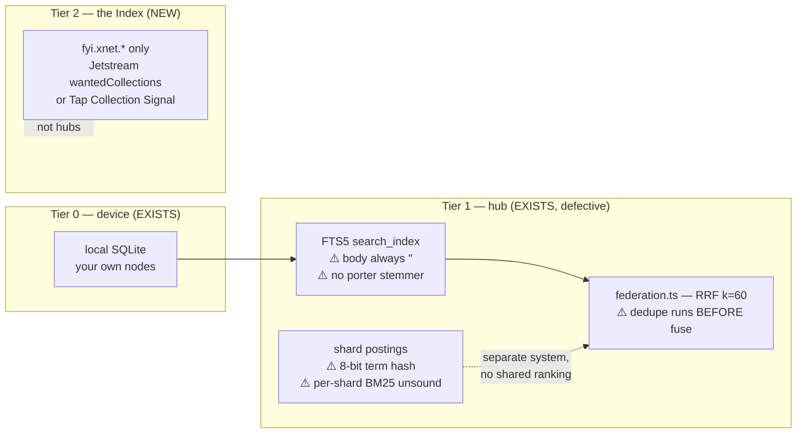
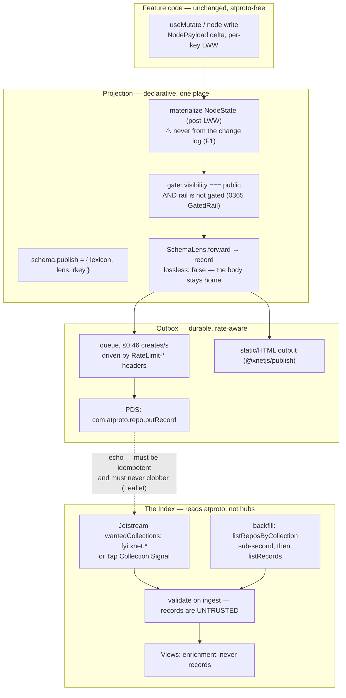
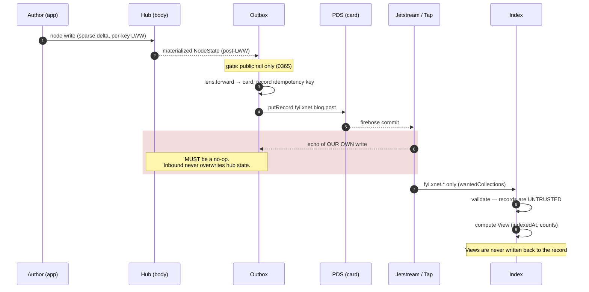

# The xNet Index — The Projection Model, The Card, And The Body

> **Namespace note (0372/0389).** This document was written when the xNet
> lexicon namespace was `net.x.*`. That namespace was **squatting** — `x.net`
> belongs to IANA and can never be claimed — so exploration 0372 moved it to
> **`fyi.xnet.*`**, which is what shipped. The NSIDs below have been rewritten
> accordingly; the reasoning is unchanged.

> Exploration 0367 · 2026-07-19
> Third in the index line: [[0365_XNET_CLOUD_AS_A_SOCIAL_SUBSTRATE]] (the two
> rails and the one-way door), [[0366_THE_XNET_INDEX]] (free admission, funded
> by hosting). This one answers *what the index contains, how it is programmed,
> and how it scales.*
> Depends on shipped work: [[0362_PUBLISHING_ON_XNET]] Phase 1 (`@xnetjs/publish`,
> PR #575) and [[0359_COMMUNITY_HOSTING]] Phase 1 (`Post`/`Course`/`Event`, PR #576).

> _"The permissioned data protocol provides access control, not confidentiality."_
> — atproto proposal `0016-permissioned-data`
>
> _"Client-declared timestamp when this post was originally created."_
> — `app.bsky.feed.post`, on `createdAt` — the record says what the author
> claims; the index says what it observed. Never confuse the two.

## Problem Statement

0366 settled *who pays* for the index (nobody, for admission; Cloud margin
covers it; commercial consumers meter). It deliberately did not answer the
mechanical questions, which are the ones that decide whether this is buildable:

1. **What is actually in the index?** Plugins? Blog posts? Communities?
   Everything? How flexible is it — can a third party put a new *kind* of thing
   in it?
2. **How does it scale** as xNet grows?
3. **What is the design language** — the vocabulary a developer and a reader
   both use?
4. **How much lives on AT Protocol and how much on xNet?**
5. **Can xNet just be taught to speak atproto**, so that writing a feature still
   feels like writing xNet, and publication is something that happens *to* the
   data rather than something every feature hand-codes?
6. **What is the programming model**, across happy paths and edge cases?

Question 5 is the load-bearing one, and the answer is yes — but only because of
a mechanism that already exists in the repository for an unrelated reason. The
rest of this document is mostly the consequences of that.

## Executive Summary

**Verdict: the index is a lens, not a content type. Publication is a declarative
projection built on the existing `SchemaLens`. The record carries the card; the
hub keeps the body. And the cheap, narrow index the last two documents assumed
was possible turns out to be *directly supported by first-party tooling* we did
not know existed.**

**1. Nothing new needs inventing to fill the index.** Seven shipped schemas
already qualify as publishable, and two of them landed in the last week:
`Page` (now carrying `slug`, `excerpt`, `publishedAt`, `canonicalUrl`,
`publishedFrontier`), `Publication` (already `followable`), `Post`, `Course`,
`Event`, `Space` (whose `SPACE_KINDS` already contains `community`) and
`Profile` — plus registry entries and `.xnetpack` bundles. The answer to "is it
plugins or blogs or communities?" is **whatever declares itself publishable**,
and that set is non-trivial on day one.

**2. The projection primitive already ships, for a different reason.**
[`packages/data/src/schema/lens.ts`](../../packages/data/src/schema/lens.ts)
defines `SchemaLens { source, target, forward, backward, lossless }` with a
`LensRegistry` doing BFS shortest-path composition, plus builders for `rename`,
`remove`, `convert`, `merge`, `when`. It exists to migrate between schema
versions. **An xNet-node → lexicon mapping is structurally the same object with
`lossless: false`.** So the programming model is: a schema declares a lexicon
and a lens; the runtime does the rest; **no feature code ever imports an atproto
client.** That is the direct answer to question 5.

**3. `@xnetjs/publish` already proves the lifecycle, and it is unusually well
designed.** `publishPost()` is a *pure* function (`now` is passed in, never read
from the clock) that pins a frontier, assigns a **sticky** slug that survives
title edits, and preserves the original `publishedAt` across republishes —
"the date a reader cites is the date it first appeared, not the last time a typo
was fixed." `unpublishPost()` deliberately **keeps the slug** so re-publishing
restores the same URL rather than orphaning inbound links. **The PDS is simply a
second output of this pipeline, alongside static HTML.**

**4. The split between atproto and xNet is forced, not chosen — call it the
card and the body.** `NodePayload` is a **sparse per-property CRDT delta** with
per-key LWW timestamps; atproto commits **whole CBOR records** into an MST.
These do not reconcile, so you must project from materialized `NodeState`, never
from the change log. Combined with the write budget (below), the only workable
division is:

| | The **card** — on the PDS | The **body** — on the hub |
| --- | --- | --- |
| Content | title, slug, excerpt, author, timestamps, content hash, URL | `content-v4` Yjs doc, blobs, comments, grants, history |
| Size | ~1–4 KB | unbounded |
| Mutability | republished on demand | live, collaborative, per-keystroke |
| Audience | anyone, forever | authorized readers |

This is exactly what Tangled, Leaflet and Frontpage converged on independently
(0365) — and Leaflet has already hit our one-way-door problem and solved it the
same way (§External Research).

**5. The write budget makes the card/body split mandatory rather than tasteful.**
Verified from `packages/pds/src/rate-limits.ts` at `main`: **5,000 points/hour
and 35,000/day, per DID**, where create = 3, put = 2, delete = 1. That is
**1,666 creates/hour ≈ 0.46/s**, and **11,666 creates/day**. Critically,
`applyWrites` **sums** points, so batching does *not* reduce cost — it buys
atomicity and fewer IP-bucket hits, nothing more (hard cap 200 writes/batch).
**Publishing a post is fine. Syncing a document is impossible.** A user
importing 500 posts needs a queue, not a loop.

**6. The narrow index is not merely feasible — Bluesky ships tooling
specifically for it.** Three findings, in ascending order of how much they
change the plan:

- **Jetstream supports `wantedCollections` with NSID prefixes**, max 100
  entries. `fyi.xnet.*` is one subscription. (`subscribeRepos`, by contrast, has
  **no** filtering at all.)
- **`com.atproto.sync.listReposByCollection` enumerates every DID holding a
  given collection.** Measured live: `sh.tangled.repo` → **4,288 DIDs in
  0.9 seconds**. Network-wide discovery for a narrow collection is
  **sub-second**. There is no crawl, and 0366's backfill worry was misplaced.
- **Bluesky shipped `Tap`** (`indigo/cmd/tap`), a Go sidecar whose **Collection
  Signal mode** (`TAP_SIGNAL_COLLECTION=<your.nsid>`) auto-discovers repos using
  *your* lexicon, backfills only those, verifies MST and signatures, and POSTs
  to a webhook. Statusphere was rewritten around it and its entire ingest is a
  ~60-line handler. It is **beta**, but it is precisely our use case.

**7. The index's own scale story is a rewrite, not a reuse — and that is the
uncomfortable finding.** The hub has two unrelated index systems that share no
ranking, tokenization or storage, and both have defects that matter here:
`search_index` is **title-only** in its trigger path (all three `doc_meta`
triggers insert `body` as a literal `''`), and the distributed shard index is
**term-partitioned on 8 bits of hash** with per-shard BM25 statistics, making
multi-term cross-shard scoring unsound. Federated search's RRF is **defeated by
a line-ordering bug**. The Index should be a *new, separate, narrow* service —
not an extension of either.

**8. Two constraints will bite anyone who forgets them, so they belong in the
type system.** `DID` is hardcoded to `` `did:key:${string}` `` with runtime
`startsWith('did:key:')` checks in `isNode` and both `validate()` paths — so
**`did:plc` identities fail validation today**. And xNet IRIs carry semver
(`xnet://xnet.fyi/Page@1.0.0`) while **NSIDs do not version at all**; Bluesky
has *never* versioned a record collection in its history.

**9. Revenue, per 0366 and unchanged:** general users free — reads
unauthenticated, listing free by every path. Commercial consumers meter on the
**consumption** side: bulk/firehose access, priority re-crawl, publisher
analytics. This passes all four Charter tests; the detail is in §Options.

## Current State In The Repository

> ⚠️ This worktree was **stale** when research began. `packages/publish` and the
> 0359 community schemas landed on `main` in PRs #575/#576 *during* this
> exploration. Everything below is verified against `main` as merged.

### What is already publishable

| Schema | Path | Publishing-relevant state |
| --- | --- | --- |
| `Page` | [`schemas/page.ts`](../../packages/data/src/schema/schemas/page.ts) | **`slug`** (:74), `excerpt` (:77), `publishedAt` (:83), `canonicalUrl` (:86), **`publishedFrontier`** (:95), `visibility` (:41) |
| `Publication` | [`schemas/publication.ts`](../../packages/data/src/schema/schemas/publication.ts) | `title`, `description`, `baseUrl`, `basePath`, `authors[]`, `space`, **`followable`** (:44) |
| `Post` | `schemas/post.ts` | community forum post (0359 Phase 1, PR #576) |
| `Course` | `schemas/course.ts` | 0359 Phase 1 |
| `Event` | `schemas/event.ts` | 0359 Phase 1 |
| `Space` | [`schemas/space.ts`](../../packages/data/src/schema/schemas/space.ts) | `SPACE_KINDS` includes `community`; `SPACE_VISIBILITY` (:50) |
| `Profile` | [`schemas/profile.ts`](../../packages/data/src/schema/schemas/profile.ts) | `atprotoDid` (:64), `atprotoHandle` (:67), `atprotoBindingUri` (:70) |
| Plugin listings | [`registry/registry.json`](../../registry/registry.json) | 19 entries, static committed JSON (0366) |

`PublicationSchema.followable` is worth pausing on: **the social hook is already
in the tree**, defaulting to `true`, with nothing consuming it.

### `@xnetjs/publish` — shipped, and the right shape

[`packages/publish/src/index.ts`](../../packages/publish/src/index.ts) exports
`renderPost`, `buildExcerpt`, `slugify`/`uniqueSlug`/`isValidSlug`,
`publishPost`/`unpublishPost`/`frontierEquals`/`hasUnpublishedChanges`/
`takenSlugsFor`, `buildRss`/`buildSitemap`/`publishedPosts`/`postUrl`,
`buildPostHead`/`buildJsonLd`, `buildStaticSite`. Its header states the
constraint that makes it reusable: *"Deliberately depends on nothing but
`yjs`… the static path works with no xNet infrastructure in the read path at
all (the Charter BATNA guarantee)."*

The pipeline types
([`pipeline.ts:18-56`](../../packages/publish/src/pipeline.ts)):

```ts
export type Frontier = Record<string, string>

export type PostRecord = {
  id: string; title: string; slug?: string; excerpt?: string
  publishedAt?: number | string; canonicalUrl?: string
  publishedFrontier?: Frontier
}
```

`PostRecord` **is the card**, already. The projection to a lexicon is mostly a
rename.

> **Known gap, confirmed by grep: `publishedFrontier` is stored and never
> read.** `render.ts`, `site.ts` and `feed.ts` contain zero references to it.
> The frontier pin is currently decorative — editing a published post changes
> what readers see immediately, which contradicts the pipeline's own docstring.
> Any PDS projection inherits this bug unless it is fixed first (E2 below).

### The projection primitive — `SchemaLens`

[`packages/data/src/schema/lens.ts:36-47`](../../packages/data/src/schema/lens.ts):

```ts
export interface SchemaLens {
  source: SchemaIRI
  target: SchemaIRI
  forward:  (data: Record<string, unknown>) => Record<string, unknown>
  backward: (data: Record<string, unknown>) => Record<string, unknown>
  lossless: boolean
}
```

`LensRegistry` auto-registers the reverse on `register()` and does **BFS
shortest-path** across versions with a path cache, so `v1→v3` composes through
`v2` automatically. [`lens-builders.ts`](../../packages/data/src/schema/lens-builders.ts)
supplies `rename` (:36), `convert` (:62), `addDefault` (:117), `remove` (:142),
`transform` (:166), `merge` (:220), `when` (:265), `composeLens` (:292).

**This is the whole programming model.** A lexicon is a `target`; the projection
is `forward`; `lossless: false` is honest, because the body does not travel.

### The schema and node model, and where it resists

`Schema` ([`types.ts:87-123`](../../packages/data/src/schema/types.ts)) carries
`'@id'`, `name`, `namespace`, `version` (semver, embedded in the IRI),
`properties: PropertyDefinition[]`, `extends?`, `document?`, `authorization?`.
`PropertyType` is a **closed union of 21 types** (`types.ts:11-31`) — that is
the mapping surface to lexicon field types.

`Node` ([`node.ts:155-170`](../../packages/data/src/schema/node.ts)) has **only
four universal fields** — `id`, `schemaId`, `createdAt`, `createdBy` — plus an
index signature. **There is no universal `parent`**; containment is per-schema
`relation()` (`Page.folder`, `Page.space`, `Space.parent`), so a projection must
choose containment per schema.

Four frictions, each of which needs a decision rather than a workaround:

| # | Friction | Detail |
| --- | --- | --- |
| **F1** | **Delta log vs whole records** | `NodePayload` (`store/types.ts:44-56`) is `{nodeId, schemaId?, properties, deleted?}` — *sparse*, per-property LWW. atproto records are whole CBOR docs. **Project from `NodeState`, post-LWW — never from the change log.** |
| **F2** | **`did:key` is hardcoded** | `DID = \`did:key:${string}\`` (`node.ts:144`); `isNode` (:184) and both `validate()` paths hard-check the prefix. **`did:plc` fails validation as written.** |
| **F3** | **Versioned IRIs vs unversioned NSIDs** | `xnet://xnet.fyi/Page@1.0.0` vs `fyi.xnet.blog.post`. Needs an explicit version-erasure policy, and a place to put the discarded version. |
| **F4** | **`ext:` overlay keys have no analogue** | `ext:acme.com/leadScore` as a *property name* cannot survive a lexicon round-trip (`schema/extension.ts`). |

Two more that limit third-party flexibility today:

- **`registerSchema` is a stub.** [`packages/plugins/src/context.ts:225-235`](../../packages/plugins/src/context.ts)
  ignores its argument entirely; `dispose()` is an empty body with the comment
  *"schemaRegistry.unregister would go here."* So there is currently **no live
  third-party schema path to project from**.
- **`parseSchemaDefinition` fails closed** (`registry.ts:535`): one unrecognised
  property type discards the whole schema rather than degrading. For inbound
  lexicons this is the wrong default.

### The two existing index systems, and why the Index should be neither



Specifics, all verified:

- **`search_index.body` is always `''`.** All three `doc_meta` triggers
  (`sqlite.ts:441-456`) insert a literal empty string; body text arrives only
  via an explicit upsert at `:1192`. Trigger-driven indexing is **title-only**.
- **`search_index` has no `tokenize=` clause**, so it gets default `unicode61`
  *without* the `porter` stemmer that `database_rows_fts` has — inconsistent
  stemming between the two.
- **Sharding is term-partitioned on 8 bits.** `hashTerm` returns `digest[0]`
  (`index-shards.ts:75-79`), capping meaningful shard counts at 256. Because
  terms are partitioned, each shard has a different corpus, so **IDF is not
  globally comparable** and multi-term cross-shard scoring is unsound
  (`shard-router.ts:119-121`). `indexLocally` writes **one row per term in a
  sequential awaited loop** — the ingest bottleneck.
- **RRF is defeated by ordering.** `deduplicateByCid` runs *before*
  `reciprocalRankFusion` (`federation.ts:180-181`), collapsing each cid to a
  single source, so fusion degenerates to a rank-transform of one hub's
  ordering — discarding cross-hub agreement, which is RRF's entire purpose.
- `shardRingEpochNonce` is a **security** fix from 0305 (grinding-resistant
  128-bit salted ring positions), not a perf knob.

**Conclusion: build Tier 2 as a new narrow service.** It reads PDSes, not hubs;
it indexes cards, not bodies; and it should not inherit either legacy ranking
path. Fixing the Tier-1 defects is worthwhile but independent.

## External Research

### The write budget — verified from source, and it decides the architecture

[`packages/pds/src/rate-limits.ts`](https://github.com/bluesky-social/atproto/blob/main/packages/pds/src/rate-limits.ts):

| Bucket | Limit | Notes |
| --- | --- | --- |
| `repo-write-hour` | **5,000 points/hr** | keyed **per-DID** |
| `repo-write-day` | **35,000 points/day** | |
| create / put / delete | **3 / 2 / 1** points | → **1,666 creates/hr ≈ 0.46/s**; 11,666/day |
| `applyWrites` | **sums** points | **batching does not reduce cost**; hard cap 200 writes/batch |
| `global-ip` | 3,000 / 5 min | batching *does* help here |

Breach returns HTTP **429** with error `RateLimitExceeded`; `RateLimit-Limit`,
`-Remaining`, `-Reset`, `-Policy` headers ride *every* limited response, with
`Retry-After` only on breach. **Drive any publish queue off the headers, not a
hardcoded constant.** ⚠️ Rate limiting is **off by default** in the reference
PDS (`env.rateLimitsEnabled`) — these are Bluesky-operated values, so a
self-hosted PDS may differ.

**Sizes** — spec and enforcement differ, which matters:

- Spec (`indigo/atproto/atdata/const.go`): `MAX_CBOR_RECORD_SIZE` = **1 MiB**,
  JSON 2 MiB, firehose commit block cap 2,000,000 bytes.
- **What the TS PDS actually enforces** is an HTTP **JSON body** cap of
  `jsonLimit: 1_000_000` on create/put/applyWrites. No CBOR-size check was
  found in the TS write path.
- Blob: PDS default **5 MB** (`PDS_BLOB_UPLOAD_LIMIT`). ⚠️ Bluesky's reported
  50 MB is docs-only and likely stale.
- Record key: `A-Za-z0-9.-_:~`, **1–512 chars**, `.`/`..` banned. Repos are
  "intended to store up to single-digit millions" of records (soft guidance).
  ⚠️ Collections-per-repo limit: **not documented anywhere**.

> **The 0.46 creates/second figure is the single most important number in this
> document.** It is comfortable for "publish a post" and fatal for anything
> per-keystroke. It is also why the card/body split is forced rather than
> stylistic.

### Narrow indexing is a supported first-party use case

**Jetstream `wantedCollections`** ([jetstream-legacy](https://github.com/bluesky-social/jetstream-legacy)):
max **100** entries, **supports NSID prefixes** (`app.bsky.graph.*`) though not
partial segments. Also `wantedDids` (max 10,000), `cursor` in **unix
microseconds** with **36 h retention**, and zstd compression using a **custom
dictionary** (off-the-shelf zstd will not decode it). `account`/`identity`
events arrive regardless of filter.

> ⚠️ **A stale cursor is silently clamped, not rejected.** You lose data with no
> error. Any ingest must track its own high-water mark and alarm on gaps.

`com.atproto.sync.subscribeRepos` has **no filtering** — a single `cursor`
param. So Jetstream is the only cheap filtered path, at the cost of dropping
MST/signature verification.

**`com.atproto.sync.listReposByCollection`** — *"Enumerates all the DIDs which
have records with the given collection NSID."* `limit` 1–2000 (default 500),
plus `cursor`. Measured live against `relay1.us-west.bsky.network`:

| Collection | DIDs | Time |
| --- | --- | --- |
| `pub.leaflet.document` | 979 | **0.2 s** |
| `xyz.statusphere.status` | 1,294 | **0.2 s** |
| `sh.tangled.repo` | 4,288 | **0.9 s** |

⚠️ **Centralisation caveat:** implemented on `relay1.us-{east,west}` and
`bsky.network`, **not** on `api.bsky.app` or the independent
`relay.fire.hose.cam`. It is a Bluesky-relay-only primitive today — which is
itself an argument for not depending on it as the *only* discovery path.

**Tap** (`indigo/cmd/tap`) — a Go sidecar that filters, verifies MST and
signatures, backfills, and POSTs to a webhook. **Collection Signal mode**
(`TAP_SIGNAL_COLLECTION=<nsid>`) auto-discovers repos using a given lexicon and
backfills only those. Statusphere was rewritten around it in Feb 2026 and its
whole ingest became a ~60-line webhook handler. **Beta**, but purpose-built for
exactly this shape.

Per-DID fetch afterwards: `com.atproto.repo.listRecords` (limit 100) or
`com.atproto.sync.getRepo` (full CAR, supports `since` for incremental). The
relay **302-redirects `getRepo` to the origin PDS**, so rate limits are
per-host — parallelising across bsky.network hosts multiplies the budget. A
live `getRepo` returned `ratelimit-policy: 6000;w=300`, **double** the
documented 3,000/5 min.

> **Constellation cannot serve this need**, contrary to the assumption in 0366.
> Every read path requires a link *target* as the first key component — it is
> keyed by what-is-pointed-at, with no collection-first or prefix scan — and it
> has **no backfill mechanism at all** (Jetstream-only since 2025-01-28). It
> remains an excellent existence proof for *cost* (16.7B linking records on a
> Raspberry Pi 4b, backlinks only, zero record content), which is the claim 0366
> actually relied on.

### The design language to steal

Reading the real lexicon JSON for `app.bsky.feed.post`, `app.bsky.graph.follow`,
`app.bsky.actor.profile`, `pub.leaflet.*` and `com.whtwnd.blog.entry`, the
idioms are consistent and worth adopting wholesale:

- **Two reference types, chosen deliberately.** `com.atproto.repo.strongRef` =
  `{uri, cid}` — an **immutable, content-pinned** pointer (reply parents, quote
  embeds, `pinnedPost`). A bare `format: at-uri` is a **mutable** pointer that
  follows edits (Leaflet's `document.publication`). Bare `format: did` for actor
  identity, never a strongRef, because the target is not a record.
  ⚠️ Constellation's backlink index **ignores the strongRef `cid` entirely** —
  so the CID buys tamper-evidence, not indexability.
- **Blobs are inline typed values**, `{"type":"blob","accept":[...],"maxSize":N}`,
  always with an explicit accept list and byte cap. **Never a URL.**
- **Rich text is a flat string plus a parallel `facets` array** of
  `{index:{byteStart,byteEnd}, features:[open union]}`. Two things to copy
  exactly: offsets are **UTF-8 byte** offsets (the lexicon carries an explicit
  warning that JS/UTF-16 indexing is wrong), and `features` is an **open
  union** — which is why `app.bsky.richtext.facet` has needed no breaking change
  in its entire history. **Facets absorb change by design.**
- **`createdAt` is client-declared and required**; server time is a *separate*
  `indexedAt` that appears **only in View types, never in records**.
- **The Record/View split.** The record is the wire format; `#view` /
  `#viewRecord` carry AppView enrichment (`likeCount`, `indexedAt`, CDN URLs).
  **Never mix them.** This is the single most transferable idea for us: the
  *card* is a record, and everything the Index computes is a View.
- **Records are aggressively minimal.** `feed.post` requires only
  `["text","createdAt"]`; `actor.profile` requires **nothing**;
  `com.whtwnd.blog.entry` requires only `["content"]` — not even `title`.
  Optionality lives at the **attachment point**, while referenced objects have
  required inner fields (`embed.images#image` requires `["image","alt"]`).
  **This is what makes evolution legal.**
- Dual `maxLength` (bytes) + `maxGraphemes` on user-facing strings.
- `key`: `tid` (timestamp-ordered, the default), `literal:self` (singletons like
  profile), `any`, `nsid`.
- **Deprecated fields are retained and marked, never removed.**

### Evolution in the wild — the rules are enforced by consequence, not tooling

The [Lexicon spec](https://atproto.com/specs/lexicon) rule is **bidirectional**:
*"all old data must still be valid under the updated Lexicon, and new data must
be valid under the old Lexicon."* The second clause forbids *relaxing*
constraints too. Public third-party adoption locks a lexicon "even without
explicit permission."

- **Bluesky has never versioned a record collection.** `V2` suffixes exist only
  on **XRPC methods** (`putPreferencesV2`, `searchPostsV2`) and **def
  fragments** (`#savedFeedsPrefV2`). Methods are cheap to version; records live
  in millions of user repos and are not.
- **Bluesky violated its own rule three months ago** — commit `d8801e2a`
  (2026-04-08) raised `embed.images` `maxSize` from 1,000,000 to 2,000,000. Old
  validators reject new data. The mitigation was a description string.
- **The one real record-level break is Leaflet's** (`pub.leaflet.*` →
  `site.standard.*`, PR #259, 108 files), forced by adding a required field and
  renaming another. **Their handling is the pattern to steal: dual-read,
  sticky-write.** `normalize.ts` accepts both namespaces and canonicalises to
  one internal type; each record stays in the NSID it was born in; only new
  records get the new NSID; backfill cleans up afterwards. **Zero examples of
  anyone dual-*writing* were found.**
- **Tangled broke wire format with no NSID bump** across
  `sh.tangled.repo.pull`/`.issue`/`.collaborator`; unupgraded knots "may
  silently drop" events. Viable only because its consumers are a small known set.
- Tooling: **`goat lex breaking`** machine-checks evolution against the
  published version — wire it into CI. For codegen, `@atproto/api`'s own README
  now directs new projects to **`@atproto/lex`** (v0.3.0, 2026-07-17), which
  generates `$build/$parse/$validate/$matches` per schema, implements Standard
  Schema, and pins resolved lexicons in a CID-locked `lexicons.json`.

> ⚠️ **PDS validation is optimistic by default: if the lexicon is not
> resolvable, the write is allowed. Relays explicitly do not validate.** Never
> assume a record on the wire was validated. **The Index must validate on
> ingest and must expect malformed `fyi.xnet.*` records.**

### Leaflet already hit our one-way door

Directly relevant prior art, and a warning: for members-only posts Leaflet
writes a **deliberately truncated copy** to the PDS, and its firehose handler
carries explicit logic to stop the public record from **clobbering the fuller
local copy** — plus a documented race where the firehose event beats the local
insert.

Two lessons: the card/body split is the industry answer to gated content, **and
the round trip is a real hazard.** Our ingest must never let an inbound record
overwrite hub state, and must be idempotent against its own echo.

## Key Findings

1. **The index is a lens over publishable schemas, not a content type.** Seven
   already qualify; no new schema is needed to launch.
2. **`SchemaLens` is the projection primitive and already ships** — a lexicon
   mapping is one with `lossless: false`.
3. **`@xnetjs/publish` already models the lifecycle correctly** (pure, sticky
   slug, preserved `publishedAt`, frontier pin, slug-preserving unpublish). The
   PDS is a second output.
4. **`publishedFrontier` is stored but never read** — the pin is decorative
   today, and a projection would inherit the bug.
5. **The card/body split is forced** by the delta-log↔whole-record mismatch (F1)
   and by **0.46 creates/second** per DID.
6. **`applyWrites` sums points** — batching buys atomicity, not budget.
7. **Narrow indexing is first-party supported**: Jetstream `wantedCollections`
   with NSID prefixes, `listReposByCollection` (sub-second network-wide
   discovery), and Tap's Collection Signal mode.
8. **Constellation cannot do collection-first enumeration** — 0366 over-credited
   it for discovery. It remains a valid *cost* proof only.
9. **Both existing hub index systems are defective for this purpose** — title-only
   FTS triggers, unsound cross-shard BM25, RRF defeated by dedupe ordering.
   Build Tier 2 fresh.
10. **`did:key` is hardcoded**, so `did:plc` fails validation today (F2).
11. **NSIDs never version**; Bluesky has never versioned a record collection.
    **Dual-read + sticky-write is the proven migration pattern**, not dual-write.
12. **PDS validation is optimistic and relays do not validate** — the Index must
    treat all inbound records as untrusted and malformed-capable.
13. **`registerSchema` is a stub**, so third-party schemas cannot be projected
    until it is implemented — this is the gate on real flexibility.
14. **Facets and open unions are how atproto absorbs change**; minimal required
    fields are how it stays legal. Copy both.

## Options And Tradeoffs

### How publication is expressed in code

**Option A — imperative: features call a publish API.**
`await publishToPds(node)` wherever needed.
*For:* obvious, easy to debug. *Against:* every feature imports an atproto
client; the one-way-door and gated-content invariants become review discipline
rather than types; rate limiting is re-implemented per caller. **Rejected** —
this is how gated content eventually leaks.

**Option B — declarative projection on the schema (recommended).**
A schema optionally declares `publish: { lexicon, lens, rkey }`. A runtime
outbox does the rest.
*For:* one place enforces the invariants; features never see atproto; reuses
`SchemaLens`; testable as a pure function. *Against:* indirection; the lens must
be expressive enough for real lexicons.

**Option C — mirror the whole node generically.**
Auto-derive a lexicon from any schema.
*For:* zero per-schema work. *Against:* would publish the body, blow the size
cap and the write budget, leak private fields by default, and produce lexicons
nobody else can consume. **Rejected on every axis.**

### What the Index ingests

**Option D — index from our own hubs.** Cheap, but the index then reflects *us*,
not the network — and it cannot see `fyi.xnet.*` records written by non-xNet
software. **Fails 0360's mirror-not-master rule.**

**Option E — index from atproto only (recommended).** Subscribe to `fyi.xnet.*`
via Jetstream/Tap; discover via `listReposByCollection`. Anyone writing
`fyi.xnet.*` records with any software appears, including people who never touch
xNet. **This is what keeps it a mirror.**

**Option F — both, reconciled.** Hub-side for latency, atproto for truth.
Adds a drift-reconciliation problem (E21) for a latency win we do not yet need.
**Defer.**

### Revenue lanes — Charter §6 tests

Per 0366, unchanged in substance; restated here for the new consumption surfaces.

| Lane | Improvement | BATNA | Vanish | **Sleep** | Verdict |
| --- | --- | --- | --- | --- | --- |
| **Index reads (general)** | — free | ✅ records on PDSes; anyone can rebuild via `listReposByCollection` | ✅ | — | **FREE, permanently** |
| **Listing / admission** | — free | ✅ PR path stays open | ✅ | — | **FREE (0366)** |
| **Bulk / firehose access** for commercial consumers | ✅ real egress + serving cost | ✅ they can run their own Jetstream consumer for ~$5/mo | ✅ | ⚠️ ordinary competition | **Meter — consumption side** |
| **Priority re-crawl** | ✅ scheduling work we perform | ✅ default crawl unaffected | ✅ | ⚠️ | **Ship after v1** |
| **Publisher analytics** | ✅ computation we run | ✅ | ✅ | ⚠️ | **Ship, consent-gated (Charter §1/§4)** |
| **Hosted PDS + publishing** | ✅ operations | ✅ official `@atproto/pds` | ✅ user holds rotation key | ❌ commodity | **Convenience, no margin expectation** |

**The metering rule that keeps this honest:** meter what is *expensive to
serve* — request volume, bulk egress, freshness guarantees — never what is
*valuable to know*. A rate limit on a hobbyist's 100 queries/day would be rent;
a quota on a company pulling the whole index hourly is cost recovery. This is
the npm-0.01% / Docker-<3% pattern that survived everywhere it was tried (0366).

## Recommendation

**Adopt Option B (declarative projection) and Option E (index from atproto).**

### The programming model



**Phase 1 — the card, one schema, no PDS.** Define `fyi.xnet.blog.post` as a
lexicon, write the `SchemaLens` for `Page`, and render the card to JSON in
tests. Fix `publishedFrontier` (E2) and implement `registerSchema` (F5). No
network yet. This is where the design is proven cheaply.

**Phase 2 — the outbox.** A durable queue that materializes from `NodeState`,
enforces the `GatedRail` invariant from 0365, respects `RateLimit-*` headers,
and is idempotent against its own echo. Publish to the user's existing PDS.

**Phase 3 — the Index.** Tap Collection Signal (falling back to Jetstream
`wantedCollections: ['fyi.xnet.*']`), `listReposByCollection` for backfill,
validate-on-ingest, and a **Record/View split** where everything computed is a
View. New service; do not extend `search_index` or the shard index.

**Phase 4 — breadth and metering.** Additional lexicons (`fyi.xnet.actor.profile`,
`fyi.xnet.community.*`, `fyi.xnet.pack.announcement`), publisher analytics, and the
commercial consumption tier.

### The round trip, and the race that must not happen

Leaflet documented this failure in production: the firehose echo of your own
write arrives **before** your local insert commits, and the truncated public
record clobbers the fuller local copy. The sequence below is the shape to build
against — note that the Index and the hub never write to each other.



### The design language, stated once

| Term | Meaning | Rule |
| --- | --- | --- |
| **Card** | the public record on a PDS | ~1–4 KB; title, slug, author, timestamps, content hash, URL |
| **Body** | the private/large content on the hub | never projected |
| **Lens** | `SchemaLens` from node to lexicon | always `lossless: false` |
| **Outbox** | durable, rate-aware publish queue | the only thing that writes to a PDS |
| **Record** | what is on the wire | client-declared, untrusted, minimal required fields |
| **View** | what the Index computes | `indexedAt`, counts, enrichment — **never** written back |
| **Frontier** | the pinned published version | what readers see until the next publish |

## Example Code

```ts
// packages/data/src/schema/publish.ts
//
// The whole programming model: a schema declares WHERE it publishes and HOW
// it projects. Feature code never sees atproto — that is the point.

export interface PublishDescriptor {
  /** NSID. Chosen once and forever — NSIDs are DNS-rooted and immortal. */
  readonly lexicon: `fyi.xnet.${string}`
  /**
   * Node → record. Structurally a SchemaLens with lossless: false, because
   * the BODY never travels — only the card does.
   */
  readonly lens: SchemaLens
  /** rkey source. `slug` gives stable, human URLs; `tid` gives time order. */
  readonly rkey: 'slug' | 'tid' | 'self'
}

// On the schema, publication is one declaration:
//
//   export const PageSchema = defineSchema({
//     name: 'Page',
//     publish: {
//       lexicon: 'fyi.xnet.blog.post',
//       rkey: 'slug',
//       lens: pageToBlogPost,   // forward: node → card
//     },
//   })
```

```ts
// packages/publish/src/outbox.ts
//
// Everything dangerous is concentrated here, so it can be tested once
// rather than reviewed forever.

/** Verified from packages/pds/src/rate-limits.ts. create=3 of 5000/hr. */
const CREATE_POINTS = 3
const FALLBACK_MIN_INTERVAL_MS = 2_200 // ~0.45/s, just under the cap

export async function drainOutbox(deps: OutboxDeps): Promise<void> {
  for (const job of await deps.claimPending()) {
    // 1. Materialize post-LWW. NEVER project from the change log (F1) —
    //    NodePayload is a sparse per-property delta; a record is whole.
    const state = await deps.materialize(job.nodeId)

    // 2. The invariant from 0365. A gated node cannot reach the public rail,
    //    and this is the single place that is true.
    if (!isPublicRail(state)) {
      await deps.drop(job, 'not-public')
      continue
    }

    // 3. Project. lossless: false is honest — the body stays home.
    const record = job.descriptor.lens.forward(state.properties)

    try {
      await deps.putRecord({ collection: job.descriptor.lexicon, record })
      // Idempotency: record OUR write so the firehose echo of it is a no-op.
      // Leaflet documented the race where the echo beats the local insert
      // and clobbers the fuller local copy. Do not reproduce that bug.
      await deps.markPublished(job, record)
    } catch (err) {
      if (isRateLimited(err)) {
        // Drive backoff off the server's own headers, never a constant.
        // applyWrites SUMS points, so batching would not have helped.
        await deps.reschedule(job, retryAfterMs(err) ?? FALLBACK_MIN_INTERVAL_MS)
        continue
      }
      await deps.reschedule(job, backoff(job.attempts))
    }
  }
}
```

## Risks And Open Questions

### The edge-case matrix

This is the core deliverable of the request. **H** = happy path, **E** = edge.

| # | Case | Behaviour |
| --- | --- | --- |
| **H1** | Publish a public post | Outbox → `putRecord`; card on PDS, body on hub |
| **H2** | Reader finds it via the Index | Index serves a **View**; link resolves to hub or static site |
| **H3** | Someone publishes `fyi.xnet.*` **without xNet** | **Indexed normally.** This is the mirror-not-master property working |
| **E1** | Edit after publish | Body changes; card is republished only on explicit re-publish (`hasUnpublishedChanges`) |
| **E2** | **Reader sees unpublished edits** | **CURRENT BUG** — `publishedFrontier` is stored but no renderer reads it. Fix before Phase 2 |
| **E3** | Withdraw | `unpublishPost()` + `deleteRecord`; slug retained. **A request, not a retraction** (0365) |
| **E4** | Hard-delete the node | Same as E3 plus tombstone locally; third parties may retain — say so before the action |
| **E5** | public → private | **Cannot be honoured.** Offer *Withdraw* only; never render "make private" |
| **E6** | **Gated content projected** | Structurally impossible: `GatedRail` type + outbox gate + invariant test |
| **E7** | Field renamed in an xNet schema | Lens absorbs it; **the lexicon does not change** — that is the lens's job |
| **E8** | Change cannot be expressed in the lens | Mint a **new NSID**; **dual-read, sticky-write** (Leaflet), never dual-write |
| **E9** | Schema removed / plugin uninstalled | Stop projecting; existing records remain (E3 semantics) |
| **E10** | Content exceeds ~1 MB | Never an issue — the card is 1–4 KB. **A body that needs projecting is a design error** |
| **E11** | Images | Card carries a URL + hash; blobs stay on the hub. Blob upload is a later, separate decision (5 MB default) |
| **E12** | **Community post — whose PDS?** | **The author's.** atproto has no org accounts; the Space is a *reference* in the record, not the repo owner |
| **E13** | Multi-author document | Publishing DID is the actor; co-authors are references. Record the publisher explicitly |
| **E14** | User has no atproto identity | Everything still works — static site + hub. Card is skipped; **the PDS is never required** |
| **E15** | User migrates PDS | Card follows the DID; the Index re-resolves. `did:plc` rotation key stays with the user |
| **E16** | **User's DID is `did:plc`** | **Fails validation today (F2).** Must be fixed before Phase 2 |
| **E17** | User deletes their atproto account | Records orphan; Index drops on `#account` event; hub content unaffected |
| **E18** | **Bulk import (500 posts)** | 500 × 3 pts = 1,500 of 5,000/hr → fine; **5,000 posts is a 3-hour job.** Queue with progress, never a loop |
| **E19** | PDS offline / write fails | Outbox retries with backoff; local state is authoritative meanwhile |
| **E20** | Slug collision | `uniqueSlug` against `takenSlugsFor`; slug is **sticky** thereafter |
| **E21** | Index drifts from PDS | Periodic reconcile via `listReposByCollection` + `listRecords` |
| **E22** | **Malformed `fyi.xnet.*` record** | **Expected.** PDS validation is optimistic; relays do not validate. Validate on ingest, quarantine, never crash |
| **E23** | **Firehose echo clobbers local state** | Idempotency key from our own write; **inbound never overwrites hub state** (Leaflet's documented race) |
| **E24** | Stale Jetstream cursor | **Silently clamped — data lost with no error.** Track a high-water mark and alarm on gaps |
| **E25** | Takedown request | Withdraw + `blocked.json`; P2B Art. 4 statement of reasons (0366) |
| **E26** | A `fyi.xnet.*` record we cannot map | Index it as an opaque card; degrade, **do not fail closed** (contra `parseSchemaDefinition`) |

### Open questions

- **Does `Space`-owned content need a shared repo?** E12 says the author's PDS.
  atproto's permissioned-data *spaces* offer an authority DID that can transfer
  between users — but they are 3 weeks old, unstable, and have no firehose
  (0365). Revisit, do not build on it.
- ~~**`net.x.*` or something else?**~~ **RESOLVED by 0372:** `x.net` belongs to
  IANA and is unclaimable, so the namespace is **`fyi.xnet.*`** — matching the
  `did:web:xnet.fyi` that `create-share.ts:11` already hardcodes. The two
  implied domains collapsed into one; the binding shipped as
  `fyi.xnet.identity.binding`.
- **Do we depend on `listReposByCollection`** given it is Bluesky-relay-only?
  Suggest: use it, but keep Jetstream as the primary and treat it as an
  optimisation, so an independent relay ecosystem does not strand us.
- **Do we publish our lexicons for others to implement?** That is what makes
  H3 real, and it locks the schema permanently.
- **Does the Index verify signatures?** Jetstream drops MST/signature
  verification; Tap keeps it. Prefer Tap; state the trust level publicly.
- **What does the Index produce for Cloud?** 0366's R2, still open, still the
  question that decides whether the funding survives a bad quarter.
- **Should the Tier-1 defects be fixed** (title-only FTS, RRF ordering,
  cross-shard BM25), or declared legacy? They are independent of this work but
  they are what "search" means in the product today.

## Implementation Checklist

### Phase 0 — prerequisites

- [x] ADR: fix the NSID namespace, once and forever — **`fyi.xnet.*`** (0372).
- [ ] **E2:** honour `publishedFrontier` at render time in `render.ts`/`site.ts`/`feed.ts`.
- [ ] **F2:** widen `DID` beyond `did:key`; relax `isNode` and both `validate()` paths.
- [ ] **F5:** implement `registerSchema` in `packages/plugins/src/context.ts:225`.
- [ ] **E26:** make `parseSchemaDefinition` degrade on unknown property types instead of failing closed.

### Phase 1 — the card

- [ ] `lexicons/fyi.xnet.blog.post.json`; codegen with **`@atproto/lex`**.
- [ ] `PublishDescriptor` + `publish` field on `defineSchema`.
- [ ] `pageToBlogPost` lens (`lossless: false`); property-type mapping table for the 21 `PropertyType`s.
- [ ] Adopt the idioms: minimal required fields, `createdAt` client-declared, facets for rich text (**UTF-8 byte offsets**), strongRef vs at-uri chosen deliberately.
- [ ] `goat lex breaking` in CI.
- [ ] `_lexicon` DNS TXT per NSID group (resolution does not cascade).

### Phase 2 — the outbox

- [ ] Durable queue; materialize from `NodeState` (**never** the change log).
- [ ] `GatedRail` gate + invariant test (0365).
- [ ] Rate limiting driven by `RateLimit-*` headers; `Retry-After` on 429.
- [ ] Idempotency keys so the firehose echo is a no-op (**E23**).
- [ ] Bulk-import job with progress and ETA (**E18**).
- [ ] Withdraw path wired to `unpublishPost()` + `deleteRecord`.

### Phase 3 — the Index

- [ ] Ingest via **Tap Collection Signal**; fall back to Jetstream `wantedCollections: ['fyi.xnet.*']`.
- [ ] Backfill via `listReposByCollection` → `listRecords`.
- [ ] **Validate on ingest**; quarantine malformed records (**E22**).
- [ ] High-water mark + gap alarm for cursor clamping (**E24**).
- [ ] **Record/View split** — computed enrichment is never written back.
- [ ] Free unauthenticated read API.
- [ ] Reproducibility: publish the rebuild recipe; CI gate (0366).
- [ ] Cooldown before surfacing (0366).

### Phase 4 — breadth and metering

- [ ] `fyi.xnet.actor.profile`, `fyi.xnet.community.*`, `fyi.xnet.pack.announcement`.
- [ ] Consume `PublicationSchema.followable`.
- [ ] Commercial tier metered on consumption; publisher analytics consent-gated.
- [ ] `ECONOMICS.md`: free reads/listing on the Kept side; paid admission stays Refused.

## Validation Checklist

- [ ] A `fyi.xnet.blog.post` written by xNet is readable by a **third-party atproto client** with no xNet code.
- [ ] A record written by **non-xNet software** appears in the Index (**H3** — the mirror property).
- [ ] The card is **under 4 KB** for a 10,000-word post; the body never appears in any record.
- [ ] A gated/paid node **cannot** produce a public rail — asserted by a failing build, not review (**E6**).
- [ ] Publishing 500 posts completes without a 429, and respects `RateLimit-Remaining` (**E18**).
- [ ] Republishing preserves the original `publishedAt` and the slug.
- [ ] **Editing a published post does not change what readers see until re-publish** (**E2**).
- [ ] Withdraw removes it from the Index within one cycle and shows the third-party-retention caveat **before** the action.
- [ ] The firehose echo of our own write is a **no-op** and never overwrites hub state (**E23**).
- [ ] A deliberately malformed `fyi.xnet.*` record is quarantined, not fatal (**E22**).
- [ ] A truncated Jetstream cursor raises a gap alarm rather than silently losing data (**E24**).
- [ ] A `did:plc` user completes the full publish flow (**E16**).
- [ ] A user with **no** atproto identity publishes a static site successfully (**E14** — the BATNA proof).
- [ ] A third party rebuilds the Index from `listReposByCollection` and matches ours.
- [ ] Index cost measured against Constellation's benchmark class; an order-of-magnitude miss reopens scope.
- [ ] `pnpm check-humane-patterns` passes — no follower counts as scored standing (Charter §3).

## References

### Codebase
- `packages/publish/src/{index,pipeline,render,slug,feed,site,meta,html}.ts` — the shipped publishing spine (PR #575)
- `packages/data/src/schema/lens.ts`, `lens-builders.ts` — `SchemaLens`, the projection primitive
- `packages/data/src/schema/{types,define,registry,node,extension}.ts` — schema/node model; 21 `PropertyType`s; `did:key` at `node.ts:144`
- `packages/data/src/store/types.ts:44-56` — `NodePayload`, the sparse delta (F1)
- `packages/data/src/schema/schemas/{page,publication,post,course,event,space,profile}.ts` — the seven publishable types
- `packages/plugins/src/context.ts:225` — `registerSchema` stub; `manifest.ts:113-144` — 18 contribution points
- `packages/hub/src/storage/sqlite.ts:330-456,1162-1197` — FTS5 tables; the empty-`body` triggers
- `packages/hub/src/services/federation.ts:180-181,375-398` — RRF and the dedupe-ordering bug
- `packages/hub/src/services/index-shards.ts:75-79`, `shard-router.ts:119-121` — 8-bit term hash; per-shard BM25
- `packages/entitlements/src/plans.ts` — the plan ladder
- `registry/` — the plugin index (0366)

### Prior explorations
- 0359 — community hosting (**Phase 1 shipped**, PR #576)
- 0360 — the Fork; "index = mirror not master"
- 0362 — publishing (**Phase 1 shipped**, PR #575)
- 0365 — PDS/AppView; the two rails; the one-way door
- 0366 — free admission; funded by hosting
- 0301 / 0324 / 0333 / 0334 — the atproto line
- 0305 — hash grinding (`shardRingEpochNonce`); 0329 — frontiers and pins; 0350 — signed-log overhead

### External — protocol and limits
- [`packages/pds/src/rate-limits.ts`](https://github.com/bluesky-social/atproto/blob/main/packages/pds/src/rate-limits.ts) — 5,000/hr, 35,000/day; create=3
- [`indigo/atproto/atdata/const.go`](https://github.com/bluesky-social/indigo/blob/main/atproto/atdata/const.go) — `MAX_CBOR_RECORD_SIZE` 1 MiB
- [Lexicon spec](https://atproto.com/specs/lexicon) — bidirectional evolution rule
- [`com.atproto.sync.listReposByCollection`](https://raw.githubusercontent.com/bluesky-social/atproto/main/lexicons/com/atproto/sync/listReposByCollection.json)
- [Jetstream](https://github.com/bluesky-social/jetstream-legacy) — `wantedCollections`, prefixes, µs cursors, 36 h retention
- [Tap](https://github.com/bluesky-social/indigo/blob/main/cmd/tap/README.md) — Collection Signal mode (beta)
- [`@atproto/lex`](https://www.npmjs.com/package/@atproto/lex) — the recommended codegen
- [jazco.dev — Jetstream](https://jazco.dev/2024/09/24/jetstream/) — volume figures
- [Constellation](https://constellation.microcosm.blue/) — cost proof; backlinks only, no collection scan

### External — design language and evolution
- `app.bsky.feed.post`, `app.bsky.graph.follow`, `app.bsky.actor.profile`, `app.bsky.richtext.facet` — facets, strongRef, minimal required fields, Record/View split
- [Leaflet](https://github.com/hyperlink-academy/leaflet) — PR #259 `pub.leaflet.*` → `site.standard.*`; **dual-read, sticky-write**; truncated members-only records and the firehose clobber race
- `com.whtwnd.blog.entry` — content-in-record and its 100k-character ceiling
- Tangled `sh.tangled.*` — wire break with no NSID bump ⚠️ raw lexicon JSON unverified
