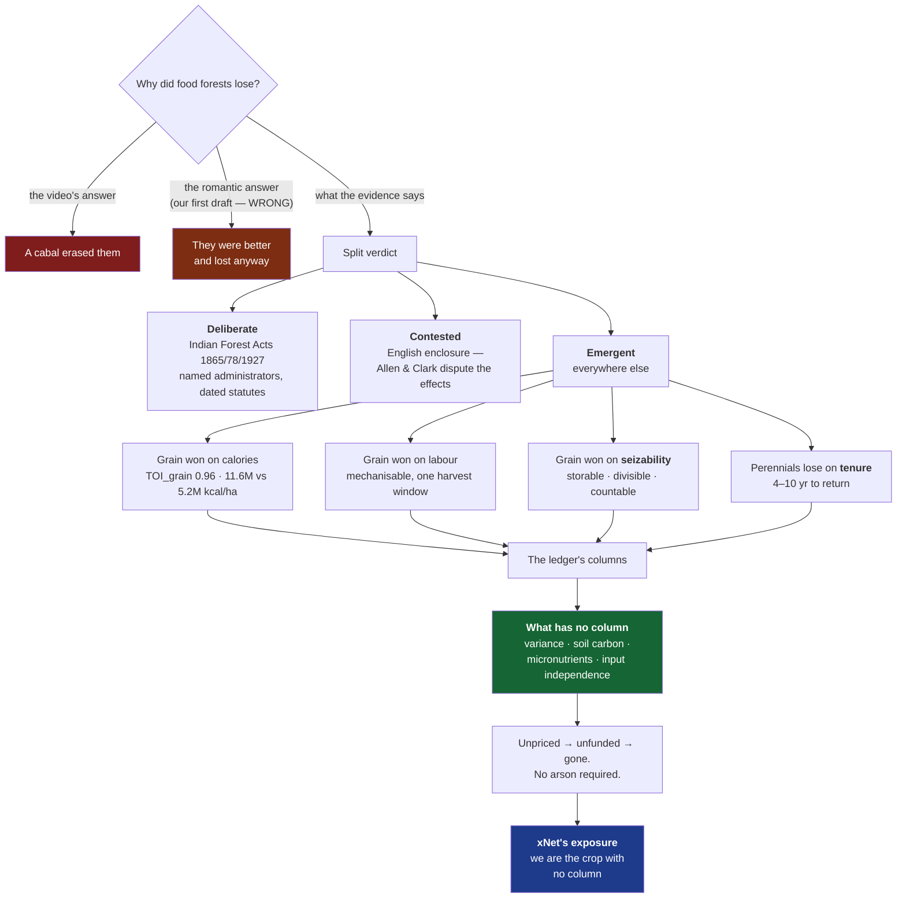
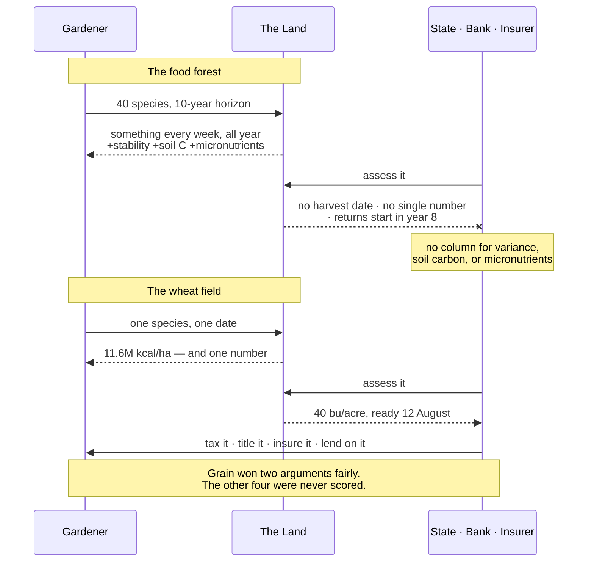

# Blog Post: The Harvest You Can Count — Food Forests, Legibility, And What The Ledger Refuses To Price

> The prompt was a YouTube video titled *"Why They Erased Every Unlimited Food
> Forest On Earth."* The video is content-farm conspiracy material. The thing
> it points at is real, well-evidenced, and one of the better stories we could
> tell. This exploration is mostly about keeping those two facts apart — and
> about one finding, late in the research, that killed the essay's first thesis
> and replaced it with a better one.

## Problem Statement

A video asserts that food forests — layered, perennial, multi-species food
systems — once existed everywhere and were deliberately erased. If true, that
rhymes with the essay we just published on Monopoly
([`rig-the-game-or-play`](../../site/src/pages/blog/rig-the-game-or-play.astro)):
a better arrangement losing to a worse one for reasons unrelated to merit.

Four problems stand between that instinct and a publishable essay.

**One: the source is poisoned.** The video belongs to a cluster of channels
producing Tartaria-adjacent "they erased it" content, much of it AI-generated.
A sibling upload from the same pattern is *"Tartaria Had Trees That Grew
Infinite Food — Then They Burned Them All."* We cannot cite it. We *can* use it
as a specimen, which is a stronger move.

**Two: the video's frame is wrong, and the correction is the essay.** Food
forests were not erased by decision. The verdict is split — genuinely
deliberate in colonial India, genuinely contested for English enclosure, and
emergent everywhere else.

**Three — the biggest editorial risk — we have already published this essay's
imagery.** [`the-forest-and-the-field`](../../site/src/pages/blog/the-forest-and-the-field.astro)
(28 June 2026) opens with a corn monoculture versus a designed food forest
"seven layers deep," walks Mollison and Holmgren's twelve principles, and
closes on leaving the land richer than you found it. An essay arguing
*polycultures are better designed* is not a new essay. It is a worse second
serving of one we ran three weeks ago.

**Four — and this one nearly ended the exploration — the first draft's thesis
was factually wrong.** That draft claimed the wheat field "did not win on
yield," citing land-equivalent ratios of 1.2–1.4 in polyculture's favour. Deep
research refuted it. Li et al. (2023, *PNAS*) show that LER 1.23 and a
**calorie penalty** are the same dataset: when you compare an intercrop against
the *best single crop you could have grown instead*, grain yield is **0.96**,
CI [0.93, 0.98]. Grain really did win on calories. And on labour. And on
storability. The romantic version of this essay is not available.

So the question is not "is the video true," nor even "did the better thing
lose." It is: **what did the ledger actually fail to price, and is that a
strong enough argument to publish?**

## Executive Summary

Yes — and it is a better argument than the one we set out to make.

`the-forest-and-the-field` told readers to design like a forest. It never
mentioned that people *did* design like forests on every inhabited continent
for millennia, and that most of those systems lost. The honest reason is not
that grain was worse and won anyway. **Grain was genuinely better at the two
things anyone was measuring** — calories per hectare (~11.6M kcal/ha/yr for
wheat against ~5.2M for the only rigorously measured temperate food forest) and
calories per labour-hour, which is the metric that actually selected.

The argument survives the correction, relocated. What the food forest is
better at is **variance, soil carbon, micronutrient density, and input
independence** — and every one of those is an axis no ledger has a column for.
Yield stability does not appear on a tax assessment. Soil organic carbon does
not appear on a loan application. A staggered harvest of forty species does not
appear as a number at all, which is precisely why Mayshar, Moav and Pascali
find cereal cultivation — *not* land productivity — causally predicts state
hierarchy across a thousand societies. Grain was **seizable**.

Add the mechanism that finishes it: perennials take 4–10 years to first
meaningful return. **A tenant farmer cannot plant a food forest.** No malice
required — a system that allocates land in short tenures and capital against
measurable annual output will select against perennial polyculture forever,
with nobody deciding anything.



Recommended: write it as a deliberate, self-implicating **sequel** to
`the-forest-and-the-field`, under the working title **"The Harvest You Can
Count."** Open by naming the video's genre and refusing it. Then spend the
essay's credibility budget on conceding what grain genuinely won, because the
concession is what earns the closing turn — that xNet is currently the crop
with no column, and we do not have an answer either.

## Current State In The Repository

### The blog machinery

| File | Role | Change |
|---|---|---|
| [`site/src/data/blog.ts`](../../site/src/data/blog.ts) | Single source of truth. `BlogPost` at :74–92, `posts` array at :94 | **Add entry at top** |
| `site/src/pages/blog/<slug>.astro` | The post | **New** |
| `site/src/components/blog/<Name>Hero.astro` | Masthead; props `title, deck, date, readingMinutes, tags` | **New** |
| `site/src/components/blog/Honest<Name>.astro` | Mandatory `isn't`/`is` honesty table | **New** |
| `site/src/components/blog/<Name>Art.astro` | Mid-essay illustration, reused as index card art | **New** |
| [`site/src/pages/blog/index.astro`](../../site/src/pages/blog/index.astro) | Imports `*Art`, maps by slug in `heroArt` (:30–49) | **Add import + entry** |
| `site/src/pages/blog/rss.xml.ts` | Iterates `publishedPosts()` | None |
| `site/src/components/blog/SeriesNav.astro` | Resolves neighbours by `pubDate` | None |

Conventions worth not re-deriving:

- **Author avatars are vendored** under `site/public/blog/authors/`, never
  hotlinked — several essays promise the page loads nothing third-party
  ([`blog.ts:48–53`](../../site/src/data/blog.ts)).
- **All art is inline original SVG.** No raster assets.
- `Mermaid.astro` takes a **`code`** prop, not `chart` (0363's example code got
  this wrong; the shipped post got it right).
- Per-post **prose accent colour** matches the hero art — `emerald-*` on the
  forest post, `amber-*` on the Monopoly post.
- **No changeset needed** — `site/` is not a publishable `packages/*`, so the
  `Stop` hook does not fire.

### Two defects to fold in

1. **`rig-the-game-or-play` is missing from the `heroArt` map** in
   `index.astro`. PR #569 shipped `BoardArt.astro` without wiring it, so the
   Monopoly card renders with no header image while the other 18 posts have
   one. One line; we are editing that map anyway.
2. **The changelog-fragment convention has drifted.** Every essay from
   `the-gentlest-furnace` through `clutch-power` has a fragment under
   `site/src/data/changelog/`; the four since do not, and presumably shipped
   under the `skip-changelog` label that `.github/workflows/changelog-check.yml`
   accepts. **Recommendation: write the fragment.** An essay is a user-visible
   shipment.

### The metaphor collision — the thing that nearly kills this post

| Post | Metaphor it owns | Collision |
|---|---|---|
| **`the-forest-and-the-field`** (2,831 w, `nature`) | **Permaculture, explicitly.** Corn monoculture vs. designed food forest "seven layers deep." Mollison, Holmgren, twelve principles, `PrincipleWheel`, earth/people/fair share, Hardin→Ostrom→Rose. | **Near-total on imagery.** This post *is* the food-forest post. |
| **`data-should-work-like-soil`** (2,418 w, `nature`) | Mycorrhizal networks. Owns "soil" as a term of art. | High if we reach for soil-building. |
| **`the-desert-that-feeds-the-forest`** (2,474 w, `nature`) | Saharan dust → Amazon phosphorus. Calls Big Tech "the monoculture" and "a plantation." | High on vocabulary. |
| **`tree-rings`** | Growth rings: accretion vs. overwrite (Hickey). | Low. |

0363 already flagged this and wrote the rule: **"If the draft starts reaching
for soil, it has drifted."** That rule stands.

**The escape.** `the-forest-and-the-field` is *prescriptive* — here is how to
build a good system. It has nothing to say about why good systems lose, and
nothing at all to say about what they lose *on*. Our essay is an economic and
historical argument in which the food forest is a **defeated incumbent with real
weaknesses**. Different question, different evidence base, opposite emotional
register. It reads as the hard sequel to an optimistic post — exactly the
self-implicating move this blog already makes.

Concretely:

- The layer stack, twelve principles, Mollison, Holmgren, "regenerative vs.
  sustainable," and soil-building are **spent**. One sentence of callback and a
  link, maximum.
- New nouns: **ledger, cadastre, tithe, tenure, collateral, premium, variance,
  discount rate**. If a paragraph could have appeared in the forest post, cut
  it.

### Related explorations

- [`0363`](0363_[x]_BLOG_POST_RIG_THE_GAME_OR_PLAY_MONOPOLY_AS_BAD_GAME_DESIGN.md)
  — direct antecedent; its confidence-flagging and DO-NOT-QUOTE patterns are
  copied wholesale below.
- [`0351`](0351_[x]_FRONTIER_ECONOMICS_WITHOUT_ENCLOSURE_RAILROADS_AIRLINES_AND_THE_COMMONS.md)
  — enclosure and the Georgist operator position. Shares vocabulary; diff at
  draft time.
- [`0358`](0358_[x]_VALUE_CAPTURE_WITHOUT_ENCLOSURE_MOATS_SUBSTRATES_AND_THE_SLEEP_TEST.md)
  — origin of the Sleep test.
- [`0354`](0354_[x]_BLOG_POST_PALIMPSEST_THE_ECONOMICS_OF_KEEPING_EVERYTHING.md)
  — closest structural sibling: a historical mechanism priced against modern
  numbers.

### Numbering

`0368` is free — verified across all branches and worktrees
(`git log --all --diff-filter=A --name-only -- 'docs/explorations/0368*'`
returns nothing; highest existing is `0367`).

## External Research

Claims are individually confidence-flagged, following 0363. **The flags are not
only for us — the strongest ones belong in the published essay.**

### The video and its family

**Solid.** *"Why They Erased Every Unlimited Food Forest On Earth"*
(`youtube.com/watch?v=ZhQk45Ra_Sw`). Near-identical siblings surface
immediately: *"The Unlimited Food Forests They Erased From Every City On
Earth,"* *"The 2,400-Year-Old 'Infinite Food' System (That Was Banned),"* and
the tell — *"Tartaria Had Trees That Grew Infinite Food — Then They Burned Them
All."*

**Solid.** Tartaria is a documented conspiracy narrative claiming an advanced
global civilisation was erased from history, with an associated "mudflood"
cataclysm; hundreds of millions of views on TikTok alone.

**Reported, not independently verified.** Trackers observed a coordinated surge
of Tartaria-focused YouTube channels in January 2026 — on the order of 66 in a
single day across English, Spanish and Russian, with signs of automated
generation. **Treat as journalism, not fact.** The essay does not need the
number; "a content farm" suffices.

**Editorial ruling: do not link the video.** Naming the genre is enough.

### Food forests that demonstrably existed

**Solid, peer-reviewed, the keystone citation.** Armstrong et al. (2021),
*"Historical Indigenous Land-Use Explains Plant Functional Trait Diversity,"*
*Ecology and Society* 26(2):6. Four sites — Dałk Gyilakyaw and Kitselas Canyon
(Ts'msyen), Shxwpópélem and Say-mah-mit (Coast Salish), British Columbia.
Forest gardens still show markedly greater plant and functional-trait diversity
than periphery forest **more than 150 years after management ceased** — ~12
species per 25 m² plot inside versus 8 outside.

**This is the fact that disproves the conspiracy frame in the most useful way:
nobody burned these. Their gardeners were removed, and the gardens kept
producing without them for a century and a half.**

**Solid, with a published dispute.** Levis et al. (2017), *Science*
355(6328):925–931 — 20 of 85 studied domesticated species are hyperdominant
across Amazonia, more abundant near archaeological sites. **Science published a
formal Comment (McMichael et al., 2017) disputing the sampling and the
proximity inference. If we cite Levis, we cite the Comment.** Cheap
credibility, and correct.

**Solid.** Chagga home gardens, Kilimanjaro: 0.2–1.2 ha multistorey plots, 100+
crop species, a recognised Globally Important Agricultural Heritage System.
Kandyan forest gardens, Sri Lanka: 0.1–0.4 ha, ~46 species per garden, 149 crop
species system-wide. **Both still operating** — which makes "every … on Earth"
false as a matter of record.

### The Morocco claim — corrected, and better for it

**The site is real. The date is not sourced. But there is a rigorous number
underneath, and it is a more interesting one.**

**Unsourced — do not use.** The "2,000-year-old food forest in Morocco" traces
to a single person, Geoff Lawton, who first visited in 1975 and has filmed it
repeatedly. Every downstream retelling descends from that footage. Four
failures: the toponym is unstable across retellings (*Inraren* / *Tamzargot* /
*Aït Mansour*); the descriptive numbers drift (800 *families* in some tellings,
800 *people* in others — a five-fold difference propagating silently); the
dating is attributed to unnamed "experts" with no archaeologist, agronomist or
historian ever named; and **no radiocarbon, dendrochronological or
archaeological study of the site exists.** The claim is invisible to
scholarship — not rebutted, simply never engaged.

**Solid, and the replacement.** Genin et al., *"The agroforestry parks of Azilal
(Morocco): a centuries-old and still living landscape construction,"* *Journal
of Alpine Research* — actual dendrochronology on Central High Atlas
agro-sylvo-pastoral parks. Holm oak, carob and juniper at 10–50 trees/ha,
pruned for fodder reserve. Living holm oaks dated 200–300+ years; by reading
stump regrowth from long-rotation coppicing the authors identify parent trees
over 230 years old at the time of cutting more than 200 years ago, **tracing
the park structure back at least 500 years.** In the study commune Agoudi
N'Lkhir: 1,122 farmers, 3,000 ha of barley and wheat, and **537 isolated trees
by 2008, up from 425 in 1919 — the tree count grew across the 20th century.**

**Solid.** Regional chronology constrains the rest: Kaczmarek et al. (2024,
*The Holocene*) on date palm seed morphometrics, plus Wadi Draa work in the
*Journal of Islamic Archaeology*, give site LAR002 occupation from at least cal
339–534 CE with a medieval boom c.700–1500 AD.

**The defensible restatement:** *oasis agroforestry as a regional practice in
southern Morocco is at least ~1,500 years old, and specific Atlas agroforestry
parks can be traced structurally back ~500 years by dendrochronology.*

**This correction is a gift, not a loss.** An essay about what gets counted, by
whom, on what evidence, that opens by replacing a beloved round number with a
smaller measured one — and notes that the measured version shows the trees
*increasing* — has earned every subsequent claim it makes.

### What actually displaced them — a split verdict

**Deliberate. Solid, and the strongest leg of the video's own thesis.** The
Indian Forest Acts of 1865, 1878 and 1927 partitioned forest into reserved,
protected and village categories and criminalised shifting cultivation, grazing
and gathering. Executed substantially by German foresters imported into the
Indian Forest Service (Dietrich Brandis). Guha (1990), *"An early environmental
debate: the making of the 1878 forest act,"* *IESHR* 27(1); Guha's *The Unquiet
Woods*; Sivaramakrishnan's *Modern Forests*. Partial reversal in the 2006
Forest Rights Act. **The framing to steal: the Acts converted customary rights
into state-granted privileges.** That is a sentence about permissions, not
trees. If the essay wants a villain, this is the only place it honestly has
one.

**Contested — and we must say so.** English parliamentary enclosure ran
1604–1914, bulk 1750–1830, via several thousand acts plus the General Enclosure
Acts of 1801, 1836 and 1845; the deep legal root is the Statute of Merton
(1235). The rights destroyed were specifically the woodland ones — estovers,
pannage, turbary. Neeson's *Commoners* (1993) on what commoners lost; Rackham's
*The History of the Countryside* on wood-pasture and pollard loss. **But there
is a live revisionist debate — Robert Allen and Gregory Clark dispute whether
enclosure raised productivity much at all, and the Hammonds' immiseration
narrative is not the settled view.** Citing enclosure as straightforward
destruction-of-abundance is picking one side of an open argument. Say which
side and why, or don't lean on it.

**Solid, with two flags.** Prussian and Saxon "scientific forestry," late 18th
century — Scott's central case in *Seeing Like a State*. Diverse forest replaced
by rectangular grids of same-age Norway spruce to maximise measurable timber;
the first rotation succeeded spectacularly, the second failed. **Flag one:**
Scott's case studies have drawn serious historians' fire — Tauger's H-Net review
argues the Tanzania and USSR centrepieces are so flawed by errors and omissions
that they discredit rather than support the overall argument (he does not target
the forestry chapter directly). **Flag two:** Scott links *Normalbaum*
monoculture to *Waldsterben*, but Waldsterben as diagnosed in the 1980s was
primarily an **acid rain** phenomenon. Treating it as the delayed verdict on
18th-century forest science is a chronological stretch. **Use the forestry
chapter; do not use the Waldsterben link.**

**Solid, contested, and better than Scott for our purposes.** Mayshar, Moav &
Pascali, *"The Origin of the State: Land Productivity or Appropriability?"*,
*Journal of Political Economy* 130(4), 2022. Using an instrumental-variable
strategy over ~1,000 societies in the Ethnographic Atlas, they find **cereal
cultivation causally predicts hierarchy, while land productivity does not.** The
mechanism is appropriability: cereals ripen simultaneously, must be harvested in
a window, and store transparently — so they can be measured, seized, taxed and
lent against. Roots, tubers and staggered-harvest tree crops cannot. **There is
a published Comment in *JPE* (2024/25) disputing it — cite both.** Scott's
*Against the Grain* is the popular, non-empirical version of the same argument;
this is the empirical one, and it is the better citation.

**Solid on direction, thin on a clean citation.** Modern policy reproduces the
bias without intent. US federal crop insurance and commodity programmes are
built on base acres and single-commodity yield histories; diversified, specialty
and organic operations are documented as under-served, and the same eligibility
logic propagates into agricultural lending. **Do not assert a "polyculture is
uninsurable" rule — none exists.** Assert the shape: instruments price what they
can model, and they model one crop far better than forty. Cite NSAC and GAO
(GAO-23-106228) for the access disparity only.

### The honest counter-case — which is now load-bearing

This section killed the first draft's thesis and should be the most carefully
written part of the essay.

**Well-evidenced, and it is what advocates cite.** Land Equivalent Ratio for
intercropping is genuinely above 1: Martin-Guay et al. (2018, *Sci Total
Environ*, 939 experiments) find **LER 1.30**, CI [1.27, 1.32], with +38% gross
energy and +33% gross income; Yu et al. (2015, *Field Crops Res*, 189
experiments) find median **1.17**; Li et al. (2023, *PNAS*, 226 experiments)
find **LER_grain 1.23**, CI [1.20, 1.27].

**Refuted — and this is the single most important finding in the research.**
LER compares an intercrop to *each component's own* sole crop. It never asks
whether the intercrop beats the **single best crop you could have grown
instead**. Li et al. introduce the Transgressive Overyielding Index for exactly
this, and on the same dataset that yields LER 1.23:

- **TOI_grain = 0.96**, CI [0.93, 0.98] — a statistically significant **4%
  calorie penalty** versus just growing the better crop alone.
- TOI_protein = 1.02, CI [0.99, 1.06] — no significant gain overall, though
  maize/legume reaches 1.10, a real win.
- **Only 36% of experiments achieved transgressive overyielding for grain.**

LER 1.23 and TOI 0.96 are the same experiments. **Intercropping saves land only
if you actually wanted the diversified basket.** If the objective is calories,
it loses. This is from van der Werf's own group — the authors of the LER
meta-analysis — not from a sceptic.

**Refuted.** Temperate food forests do not match grain on calories. The *only*
systematic empirical study is Schafer, Lysák & Henriksen (2019, *Urban Forestry
& Urban Greening*): Graham Bell's 0.08 ha forest garden at Coldstream,
Scotland, 99 species, established 1991, measured 2011–2017. 713 kg/yr →
**415,075 kcal**, scaling to **~5.19M kcal/ha/yr**. Comparators, million
kcal/ha/yr: cassava ~19.4, potato ~15.6, **wheat ~11.6**, rice ~6.0; UK
conventional cropland gross ≈12.9M. So a *mature* food forest delivers roughly
**40% of UK conventional cropland calories** — and its output is overwhelmingly
not bulk carbohydrate (85.6 kg carbs out of 713 kg harvested). Fruit is water.

**Myth — the evidence base is n=1.** That Coldstream study is essentially the
only rigorous measured temperate food-forest yield dataset in existence. The UK
Permaculture Association's 2013 baseline survey of 117 forest gardens found
species lists "differ little from fruit and green vegetables typically grown in
traditional home gardens from the 1950s." **Be extremely careful citing
food-forest productivity numbers at all.**

**Source warning — put this in the essay.** The most-cited "forest gardens win"
document is Pasquier (2021, Pan Terra), hosted on agroforestry.co.uk. It is not
peer-reviewed, the author states "We are not farmers," and it **concedes
outright that the forest garden is not very productive in calories** — then
reverses via two moves that should not be accepted: it subtracts fossil-energy
inputs from conventional yields but not human labour from the forest garden
(explicitly noting labour "was not considered for conventional agriculture
either"), and it switches from calories-produced to "people actually fed" using
a *global food-waste* adjustment, which is a property of the distribution
system, not the field. **This is a perfect miniature of the essay's whole
subject: a measurement chosen to produce a conclusion.** Consider giving it a
paragraph.

**Well-evidenced, and the mechanism the first draft missed entirely.**
Establishment lag. Coffee agroforestry: 7–8 years to recoup initial investment.
Son tra: 4 years; Shan tea: 7 years to a 50% chance of positive cumulative cash
flow. Combined with high smallholder discount rates and insecure tenure, this
is repeatedly identified as *the* binding adoption constraint. **You cannot
plant a ten-year asset on land you may not hold in three.** This is a pure
capital-and-tenure argument, entirely on-thesis, and it requires no villain
whatsoever.

**Well-evidenced.** Shade is a physical ceiling, not a design problem. A 2024
systematic review of subcanopy light finds understory relative yields ranging
6%–188% of sole crops. Crawford himself recommends ~50% wider tree spacing than
conventional orchards to get light down — which cancels much of the claimed
vertical-stacking advantage. And the pointed observation from the sceptic
literature: **Crawford grows his nuts in a separate orchard with mown grass
beneath**, not in the polyculture.

**Direction solid, magnitude unquantified — a genuine literature gap.** A clean
peer-reviewed calories-per-labour-hour comparison of polyculture versus grain
monoculture **appears not to exist.** The best anchor is Pellegrini & Fernández
(*Resources*, 2016): farm-labour requirements differ by a factor of ~200 across
production systems, and mechanised systems need only 2–5 hours of farm labour
per person-year of food. Horticulture is consistently more labour-intensive.
**State the direction; do not invent a ratio.**

**Number to get right.** Cereal share of human calories: **~42%** of food
calories and 37% of protein from wheat + rice + maize (FAOStat 2016–18). The
widely repeated **~51%** usually traces to broader cereal accounting. Use ~42%,
or say "roughly 40–50% depending on accounting."

### Where food forests genuinely win — the essay's actual thesis

Every item here is real, well-evidenced, and **has no column in any ledger**.

- **Yield stability.** Raseduzzaman & Jensen (2017, *Eur J Agron* 91:25–33):
  cereal-legume intercropping significantly improves yield stability versus
  sole crops. Variance reduction is real and undersold. *No tax assessment has
  a variance field.*
- **Soil carbon.** Agroforestry soils ~126 Mg C/ha to 1 m, ~19% above
  cropland/pasture; a 2024 global meta-analysis finds +10.7% SOC, rising to
  +18.7% in arid zones. *No loan application has a soil-carbon field.*
- **Micronutrients.** On-farm tree cover causally mediates zinc, vitamin A and
  folate adequacy (Malawi, *Nature Food* 2024); +1 unit species diversity ≈
  +12.7% micronutrient adequacy (Kenya). **Honest caveat: iron is the weak one**
  — few common on-farm tree fruits are iron-rich. *No commodity price carries
  micronutrient density.*
- **Protein under low nitrogen.** Maize/legume TOI_protein = 1.10 — a genuine
  input-substitution win, strongest exactly where fertiliser is scarce.
- **Marginal and sloped land, and labour absorption** where labour is abundant
  and capital is not. This is where the economics genuinely invert, and it is
  why these systems persist in Kilimanjaro and Kandy and not in Kansas.

**The thesis, stated precisely: the food forest is not better than grain. It is
better on four axes the ledger has no column for, and worse on the two it
does.** That is a sharper claim than "the good thing lost," and it is the one
that survives contact with the sources.

## Key Findings



1. **The video's frame is false; the object is real; the verdict is split.**
   Deliberate in colonial India (named administrators, dated statutes,
   criminalised practice). Contested for English enclosure (Allen and Clark
   dispute even the productivity effects). Emergent everywhere else. And many
   food forests were never erased at all — Chagga and Kandyan gardens are
   producing today, and the Azilal tree count *grew* through the 20th century.

2. **Grain won two arguments fairly, and we must concede them.** Calories per
   hectare (~11.6M vs ~5.2M) and calories per labour-hour. TOI_grain = 0.96 is
   the number that ends the romantic version of this essay. **Concede early;
   the concession buys everything after it.**

3. **The four things polyculture is better at are exactly the four with no
   column.** Variance, soil carbon, micronutrient density, input independence.
   Not one appears on a tax assessment, a loan application, an insurance
   premium, or a commodity price.

4. **Appropriability, not productivity, predicts hierarchy.** Mayshar, Moav &
   Pascali find cereal cultivation causally predicts state hierarchy across
   ~1,000 societies while land productivity does not. **The crop that could be
   seized built the states that then required it.**

5. **Tenure is the quiet killer.** 4–10 years to first meaningful return means
   a tenant cannot plant a food forest, ever, regardless of policy. Short
   tenures plus high discount rates select against perennial polyculture with
   nobody deciding anything.

6. **This is the Monopoly essay's disease at civilisational scale.** There,
   rigging was the dominant strategy and dominance ended the game. Here,
   *being countable* is the dominant strategy — and when the measuring
   apparatus allocates capital, the unmeasured is competed out on grounds that
   have nothing to do with whether it was good. Neither required a villain.
   Both required only a rule set nobody revisited. **The lineage is literal, not
   metaphorical: Monopoly descends from Magie's *Landlord's Game*, an
   indictment of land monopoly, and enclosure *is* land monopoly.**

7. **xNet is on the losing side of this pressure right now, and should say
   so.** A local-first polyculture of small, composable, user-owned tools is
   illegible to a procurement department in exactly the way a food forest is
   illegible to a cadastre. The SaaS monoculture did not win on being better
   software; it won on producing a seat count, a renewal date and a line item.
   Our advantages — durability, exit rights, no lock-in, data you keep — are
   variance-and-soil-carbon advantages. **They have no column.** This is the
   essay's cost-to-self, and without it the post is smug.

8. **The Pasquier document is the thesis in miniature.** A comparison that
   concedes the calorie loss, then changes the metric until the answer inverts.
   Worth a paragraph, because it shows the mechanism operating in favour of the
   side we sympathise with.

## Options And Tradeoffs

### A. Straight history essay ("what happened to food forests")

Recovers the material without touching the video. Safe and dull, and it
collides hardest with `the-forest-and-the-field` — without the mechanism, all
that remains is "polycultures are good," published three weeks ago. **Reject.**

### B. Debunk the video

Timely, clear, and a trap: it makes a content farm the protagonist, dates
instantly, and spends the essay on someone else's bad argument. **Reject as a
structure**, keep the opening beat.

### C. The ledger essay, opening on the video as a specimen ★

Name the genre and refuse it. Concede what grain genuinely won. Then locate the
argument where it actually lives: the four unpriced axes, appropriability, and
tenure. Close on xNet's own exposure.

Only option that (a) makes an argument `the-forest-and-the-field` did not, (b)
links cleanly to the Monopoly essay, (c) implicates us, (d) turns the
compromised source into credibility, and (e) **survives the TOI finding** — in
fact is strengthened by it. **Recommend.**

### D. Fold into a Monopoly follow-up on enclosure and ground rent

Tempting — the *Landlord's Game* lineage runs straight into enclosure, and 0351
has the Georgist material. But it drops the food forests, which are the vivid
part, and makes the third economics essay running. **Reject now, keep as
backlog**: "The Landlord's Game Was About Enclosure."

| | A. History | B. Debunk | **C. Ledger ★** | D. Enclosure |
|---|---|---|---|---|
| New vs. `forest-and-the-field` | ✗ | ~ | **✓✓** | ✓ |
| Handles the poisoned source | ✗ avoids | ✓ engages | **✓✓ uses** | ✗ avoids |
| Survives the TOI finding | ✗ | ~ | **✓✓ strengthened** | ✓ |
| Links to Monopoly post | ~ | ✗ | **✓✓** | ✓✓ |
| Implicates xNet | ✗ | ✗ | **✓✓** | ✓ |
| Ages well | ✓ | ✗✗ | **✓✓** | ✓ |

### Title options

| Title | Slug | Read |
|---|---|---|
| **The Harvest You Can Count** ★ | `the-harvest-you-can-count` | States the thesis, evergreen, no conspiracy echo, sits naturally beside *The Forest and the Field* |
| The Column That Doesn't Exist | `the-column-that-doesnt-exist` | Most precise to the revised thesis; drier, less vivid |
| Nobody Burned the Food Forests | `nobody-burned-the-food-forests` | Punchy, directly answers the video — but leads with a negation and half-quotes the genre |
| The Ledger and the Orchard | `the-ledger-and-the-orchard` | Parallel to *The Forest and the Field* — arguably too parallel; invites "same essay again" |

**Recommend "The Harvest You Can Count."**

### Charter §6 — applicability

Recorded explicitly so a later reader does not assume the step was skipped (the
move 0363 made at its lines 609–613): **this exploration proposes no revenue
lane, so the four "No ground rent" tests — improvement, BATNA, vanish, sleep
([`docs/CHARTER.md`](../CHARTER.md) §6) — do not gate it.** They are
thematically load-bearing though: enclosure is the canonical ground-rent event,
and §7 should link the Charter rather than restate it.

## Recommendation

Write **"The Harvest You Can Count"** — ~3,000–3,400 words, tags
`essay, economics, philosophy` (**deliberately not `nature`**, signalling to
readers and to us that this is not the fifth nature essay), 13–14 minutes.

### Section budget

| § | Heading (working) | Words | Job |
|---|---|---|---|
| 1 | The video I'm not going to link | 300 | Name the genre, refuse it, state the object is real. Sets the honesty contract. |
| 2 | The gardens that are still there | 400 | Armstrong 2021 as keystone; Chagga and Kandyan **still operating**. Kills "every … on Earth" with evidence. Sober register — forced removal is a real harm, not an aesthetic. |
| 3 | The number I had to give up | 400 | The Morocco correction. 2,000 years → ~500 dendrochronological, and the tree count *grew*. **This is where the essay earns its credibility.** |
| 4 | What grain actually won | 500 | The concession. TOI_grain 0.96. 11.6M vs 5.2M kcal/ha. Labour direction (no invented ratio). Concede fully and early. |
| 5 | Grains make states | 400 | Mayshar/Moav/Pascali + the Comment. Appropriability, not productivity, predicts hierarchy. Scott's forestry chapter — **no Waldsterben link**. |
| 6 | The columns that don't exist | 550 | The thesis. Variance, soil carbon, micronutrients, input independence — each real, each unpriceable. Plus tenure: a tenant cannot plant a ten-year asset. Modern echo in base acres and premiums, **hedged**. |
| 7 | A measurement that changed its mind | 250 | The Pasquier document. Our own side doing the same trick. Cheapest, sharpest self-implication available. |
| 8 | We are the crop with no column | 450 | xNet's exposure: seat counts, renewal dates, line items. Our advantages are variance advantages. Link Monopoly, Charter, ECONOMICS. |
| 9 | (closer) | 200 | No triumphalism. Building the better thing is not sufficient; becoming countable without becoming a monoculture is unsolved, including by us. |

### The `HonestHarvest` table

| It isn't | It is |
|---|---|
| A debunk of a YouTube video | An argument its premise accidentally points at |
| Proof food forests were erased | A split verdict: deliberate in colonial India, contested for enclosure, emergent elsewhere — and several are still producing |
| A claim polycultures out-produce monocultures | A concession that they lose on calories (TOI 0.96) and labour, and win on four axes nobody prices |
| Built on a 2,000-year-old Moroccan forest | Built on ~500 years of dendrochronology, after we couldn't source the 2,000 |
| Settled policy analysis | A directional reading of insurance and commodity programmes, not a cited rule |
| Well-evidenced food-forest yield data | One rigorous temperate study, n=1, and we say so |
| Advice we have taken | A description of a trap xNet is currently in, with no answer offered |

### Art direction

The hero must **not** be a layered-forest cross-section — that is `ForestHero`'s
territory. Proposed: a ruled ledger page whose columns are neatly filled for
three headings and simply *absent* for four more, with an unruly canopy
bleeding past the ruled margin where the missing columns would be. Accent:
**amber/ochre** (ledger, parchment, dry grain), explicitly not emerald.

`HarvestArt.astro`, mid-essay at §6: two ledger columns side by side — one
totalling neatly, one whose entries trail off into unpriced items.

### Registry entry

```ts
{
  slug: 'the-harvest-you-can-count',
  title: 'The Harvest You Can Count',
  description:
    'A video claims every food forest on Earth was deliberately erased. It ' +
    'is wrong, and it points at something real. Layered perennial food ' +
    'systems existed on every inhabited continent, and most of them lost — ' +
    'but not the way the romantic version tells it. Grain genuinely won on ' +
    'calories and on labour. What the forest was better at was variance, ' +
    'soil carbon, micronutrients and independence from inputs, and no ' +
    'ledger has ever had a column for any of them. On appropriability, why ' +
    'a tenant cannot plant a ten-year asset, and why a local-first tool is ' +
    'illegible to a procurement department for exactly the same reason.',
  pubDate: '2026-08-03T09:00:00Z',
  authors: ['crs48', 'claude'],
  tags: ['essay', 'economics', 'philosophy'],
  readingMinutes: 14
}
```

### Attribution hazards — do not use without a primary source

Copying 0363's DO-NOT-QUOTE discipline. These circulate; none survived
checking:

- **"2,000-year-old food forest in Morocco."** Unsourced — one practitioner, no
  dating study, unstable toponym. Use ~500 years (Genin et al.) or ~1,500 years
  for the regional practice (Wadi Draa). **The replacement goes in §3 as a
  feature.**
- **"800 families / 65 acres."** Drifts between retellings (800 *people*
  elsewhere); no primary source.
- **"Experts believe it has been harvested since before Christ."** No named
  expert exists behind this sentence.
- **"Unlimited" / zero-input food forest.** **Stoichiometrically false.** Every
  harvest exports minerals — almonds ~400 kg K per 5 t/ha; bananas ~750 kg K
  per 50 t/ha. Nitrogen can be closed biologically; **phosphorus and potassium
  cannot** (Elser & Bennett, *Nature* 478:29–31 — the P cycle is
  unidirectional, mined from rock, ending in marine sediment). The honest claim
  is "low-input and long-lived." The word *unlimited* in the video's title is
  the tell that it isn't a serious source, **and that is worth one sentence in
  §1.**
- **"40:1 energy return"** for forest gardens vs ~5:1 conventional (attributed
  to Crawford) — no published derivation. **Do not use.**
- **The Pasquier calorie comparison** as evidence *for* food forests. Use it
  only as §7's specimen, with its method described.
- **"51% of calories from cereals."** Use ~42% (FAOStat 2016–18) or a hedged
  range.
- **FAO "75% of crop diversity lost."** Very widely repeated, provenance not
  established. **Do not use.**
- **Kayapó apêtê as proven intentional forest islands.** Posey's claims were
  substantially challenged by Parker (1992, *American Anthropologist*). Do not
  present as established.
- **Terra preta extent figures.** Published estimates vary by more than an order
  of magnitude. Cite a range with the uncertainty stated, or omit.
- **Waldsterben as the verdict on 18th-century monoculture forestry.**
  Chronologically strained; Waldsterben was largely acid rain. Use Scott's
  forestry chapter **without** this link.
- **Levis without McMichael.** If one appears, both appear.
- **Any Scott quotation.** Paraphrase and cite chapter-level; note Tauger's
  critique exists if leaning hard on him.
- **"Every food forest on Earth"** in any affirming register, including
  ironically. It is the video's phrase.
- **The 66-channels-in-one-day figure.** Reported, not verified. Attribute or
  omit.
- **The IBAMA aerial-photograph story and 14 recovered springs** at Olhos
  d'Água — widely repeated, no primary data. Attribute as reported or omit.
- **Any calories-per-labour-hour ratio.** The comparison does not exist in the
  literature. State direction only.

## Example Code

Mermaid in a post — the prop is `code`, not `chart`:

```astro
<Mermaid
  code={`flowchart LR
    F["Food forest"] --> A["stability · soil carbon<br/>micronutrients · low input"]
    W["Wheat field"] --> B["11.6M kcal/ha<br/>one number, one date"]
    A --> N["<b>no column</b>"]
    B --> Y["taxable · titleable · bankable"]
    Y --> C["capital flows here"]
    N --> D["unpriced → unfunded"]`}
  caption="Grain won two arguments fairly. The other four were never scored."
/>
```

Wiring the card art in [`index.astro`](../../site/src/pages/blog/index.astro),
folding in the missing Monopoly entry:

```astro
import HarvestArt from '../../components/blog/HarvestArt.astro'
import BoardArt from '../../components/blog/BoardArt.astro' // ← was never imported

const heroArt: Record<string, any> = {
  'the-harvest-you-can-count': HarvestArt,
  'rig-the-game-or-play': BoardArt, // ← defect fix; PR #569 shipped the component unwired
  // …existing entries
}
```

## Risks And Open Questions

1. **Source contamination.** Naming the video's genre invites "you got this
   from a Tartaria channel." *Mitigation:* the essay says so first, and every
   substantive claim is carried by a citation the video does not contain — the
   same inoculation the Monopoly post used.

2. **Repeating `the-forest-and-the-field`.** *Mitigation:* the vocabulary rule
   (ledger/tenure/premium in; layers and soil out), plus a mandatory pre-merge
   side-by-side read of both posts.

3. **The concession could swallow the essay.** §4 concedes so much that a
   careless draft reads as "food forests don't work." *Mitigation:* §4 is
   budgeted at 500 words and §6 at 550 — the unpriced-axes section must be the
   longest in the piece, and §4 must end on a forward-pointing sentence, not a
   verdict.

4. **Over-claiming on modern farm policy.** Easy to slide from "diversified
   operations are under-served" (supported) to "polyculture is uninsurable"
   (not). *Mitigation:* §6 hedges in prose, and the honesty table says it again.

5. **Romanticising indigenous agriculture.** The Armstrong and Levis material is
   about sophisticated management, and the cessation of that management was
   forced removal — a real harm, not a lost aesthetic. *Mitigation:* §2 is the
   most sober section in the piece; name the mechanism plainly and briefly, and
   do not use it as a flourish for a software argument.

6. **The xNet turn could read as opportunistic.** *Mitigation:* §8 is a
   confession, not a pitch — we are the crop with no column and we do not have
   an answer. The closer explicitly declines to resolve it.

7. **Open question: does the essay owe a "so what do we do" section?** Current
   answer: no. Becoming countable without becoming a monoculture is unsolved;
   0362's owned-audience work and 0367's index projection are partial attempts.
   "Unsolved, here's what we're trying" beats a fake resolution — but this is
   the judgement call most likely to move during drafting.

8. **Open question: is §7 (Pasquier) a section or a paragraph?** Budgeted at
   250 words. If the draft runs long, it is the first thing to compress into
   §4 — but it should not be cut entirely, because it is the only place the
   essay catches *our own side* doing the thing.

9. **Publish date.** 3 August 2026 avoids three economics-tagged essays in five
   weeks. Confirm against whatever else is queued.

## Implementation Checklist

- [ ] Re-verify `0368` is free immediately before committing (branches move)
- [ ] Add the `BlogPost` entry to [`site/src/data/blog.ts`](../../site/src/data/blog.ts)
      at the top of `posts`, with `draft: true`
- [ ] Add "The Landlord's Game Was About Enclosure" (option D) to the essay
      backlog comment at `blog.ts:22–25`
- [ ] Build `site/src/components/blog/HarvestHero.astro` — ruled ledger with
      absent columns, canopy past the margin, amber/ochre, inline SVG only
- [ ] Build `site/src/components/blog/HarvestArt.astro` — the two ledger columns
- [ ] Build `site/src/components/blog/HonestHarvest.astro` from the table above
- [ ] Write `site/src/pages/blog/the-harvest-you-can-count.astro` to the section
      budget; `prose-a:text-amber-600 dark:prose-a:text-amber-400`
- [ ] Place `SeriesNav` **outside** `</main>` with `slug={post.slug}` (newer form)
- [ ] Internal links, once each: `/blog/the-forest-and-the-field`,
      `/blog/rig-the-game-or-play`, `docs/CHARTER.md`, `docs/ECONOMICS.md`
- [ ] Wire `HarvestArt` into the `heroArt` map in
      [`site/src/pages/blog/index.astro`](../../site/src/pages/blog/index.astro)
- [ ] **Fold in the defect fix**: add the missing `rig-the-game-or-play` →
      `BoardArt` entry to the same map
- [ ] Add `site/src/data/changelog/2026-08-03-new-essay-the-harvest-you-can-count.json`
      (deliberately reversing the recent `skip-changelog` drift)
- [ ] Flip `draft: false`
- [ ] Commit as `docs(exploration): explore the harvest you can count (0368)`,
      then the post separately

## Validation Checklist

- [ ] **Grep the draft for every DO-NOT-USE item**: `2,000`, `40:1`,
      `unlimited`, `every food forest`, `66`, `IBAMA`, `75%`, `51%`, `apêtê`,
      `Waldsterben`, `terra preta`
- [ ] The video is **not linked**, and not named beyond its genre
- [ ] TOI_grain 0.96 appears in §4 **with its confidence interval**
- [ ] Levis appears only alongside McMichael's Comment
- [ ] Mayshar/Moav/Pascali appears only alongside the *JPE* Comment
- [ ] Enclosure is presented as **contested**, with Allen/Clark named
- [ ] The Coldstream study is described as **n=1** in the prose, not only in the
      honesty table
- [ ] No calories-per-labour-hour *ratio* appears anywhere — direction only
- [ ] §6 is longer than §4 (the unpriced axes must outweigh the concession)
- [ ] **Side-by-side read against `the-forest-and-the-field`** — no paragraph
      could move between them unnoticed
- [ ] Grep for `permaculture`, `layer`, `Mollison`, `Holmgren`, `regenerative`,
      `soil` — each at most once, in callback
- [ ] §8 reads as a confession; no sentence in it would work in a sales deck
- [ ] `HonestHarvest` renders and contains the Morocco row and the n=1 row
- [ ] `pnpm --filter site build` succeeds (`astro dev` is known to hang on
      `/changelog`; verify via build, per exploration 0291)
- [ ] Post appears on `/blog` **with card art**, and `rig-the-game-or-play` now
      has card art too
- [ ] `/blog/rss.xml` includes the post with the full description
- [ ] `SeriesNav` resolves correctly on the new post and the previous newest
- [ ] Light and dark mode checked on hero and inline art
- [ ] `format:check` passes (a CI gate local runs routinely miss)
- [ ] Read aloud once — sober in §2, unsparing in §4 and §8

## References

**Food forests, documented**
- Armstrong, C. G. et al. (2021). "Historical Indigenous Land-Use Explains Plant
  Functional Trait Diversity." *Ecology and Society* 26(2):6.
  https://www.ecologyandsociety.org/vol26/iss2/art6/
- Smithsonian summary (12-vs-8 species figures).
  https://www.smithsonianmag.com/smart-news/indigenous-peoples-british-columbia-tended-forest-gardens-180977617/
- Levis, C. et al. (2017). *Science* 355(6328):925–931.
  https://www.science.org/doi/10.1126/science.aal0157
- McMichael, C. H. et al. (2017). Comment on the above. *Science*.
  https://www.science.org/doi/10.1126/science.aan8347
- Genin et al. "The agroforestry parks of Azilal (Morocco)." *Journal of Alpine
  Research*. https://journals.openedition.org/rga/6612?lang=en
- Kaczmarek et al. (2024). *The Holocene*.
  https://journals.sagepub.com/doi/10.1177/09596836231211879
- Fernandes & Nair, "The Chagga homegardens." *Agroforestry Systems*.
  https://link.springer.com/article/10.1007/BF00131267
- Hemp, A. "The Banana Forests of Kilimanjaro." *Biodiversity and Conservation*.
  https://link.springer.com/article/10.1007/s10531-004-8230-8
- ICRAF, "Kandyan home gardens."
  https://www.worldagroforestry.org/publication/kandyan-home-gardens-time-tested-good-practice-sri-lanka-conserving-tropical-fruit-tree
- Atlas Obscura (origin of the unsourced 2,000-year date; use only with the flag).
  https://www.atlasobscura.com/articles/what-is-permaculture-food-forests

**Displacement, legibility, appropriability**
- Mayshar, Moav & Pascali (2022). "The Origin of the State: Land Productivity or
  Appropriability?" *JPE* 130(4).
  https://www.journals.uchicago.edu/doi/abs/10.1086/718372 ·
  [Comment](https://www.journals.uchicago.edu/doi/10.1086/740225)
- Scott, J. C. (1998). *Seeing Like a State* — ch. 1, scientific forestry.
  https://theanarchistlibrary.org/library/james-c-scott-seeing-like-a-state
- Scott, J. C. (2017). *Against the Grain* — the popular, non-empirical version.
  https://yalebooks.yale.edu/book/9780300240214/against-the-grain/
- Tauger, M., H-Net review of *Seeing Like a State* (the critique).
  https://networks.h-net.org/node/10000/reviews/10148/tauger-james-c-scott-seeing-state-how-certain-schemes-improve-human
- Guha, R. (1990). "An early environmental debate: the making of the 1878 forest
  act." *IESHR* 27(1). https://journals.sagepub.com/doi/abs/10.1177/001946469002700103
- Indian Forest Act, 1927 (text). https://indiankanoon.org/doc/654536/
- UK Parliament, "Enclosing the land."
  https://www.parliament.uk/about/living-heritage/transformingsociety/towncountry/landscape/overview/enclosingland/
- Venkatesh Rao, "A Big Little Idea Called Legibility."
  https://ribbonfarm.com/2010/07/26/a-big-little-idea-called-legibility/

**Productivity — both directions**
- **Li et al. (2023), *PNAS*** — LER 1.23 *and* TOI_grain 0.96. The key paper.
  https://pmc.ncbi.nlm.nih.gov/articles/PMC9926256/
- Martin-Guay et al. (2018). *Sci Total Environ*, 939 experiments, LER 1.30.
  https://www.sciencedirect.com/science/article/abs/pii/S0048969717327110
- Yu et al. (2015). *Field Crops Research*, median LER 1.17.
  https://research.wur.nl/en/publications/temporal-niche-differentiation-increases-the-land-equivalent-rati/
- **Schafer, Lysák & Henriksen (2019)**, *Urban Forestry & Urban Greening* — the
  Coldstream food forest; the only rigorous temperate yield study.
  https://www.sciencedirect.com/science/article/abs/pii/S1618866718304151
- Raseduzzaman & Jensen (2017). *Eur J Agron* 91:25–33 — yield stability.
  https://www.sciencedirect.com/science/article/abs/pii/S1161030117301399
- Subcanopy light & yield systematic review (2024).
  https://link.springer.com/article/10.1007/s10457-024-00957-0
- Pellegrini & Fernández (2016). *Resources* 5(4):47 — farm labour requirements.
  https://www.mdpi.com/2079-9276/5/4/47
- Agroforestry soil carbon: https://onlinelibrary.wiley.com/doi/abs/10.1002/ldr.3136
  · 2024 global meta-analysis:
  https://www.sciencedirect.com/science/article/abs/pii/S0341816224008646
- Tree cover & dietary quality. *Nature Food* (2024).
  https://www.nature.com/articles/s43016-024-01028-4
- Elser & Bennett (2011). "A broken biogeochemical cycle." *Nature* 478:29–31 —
  why "unlimited" is false. https://www.nature.com/articles/478029a
- Pasquier (2021), Pan Terra — **not peer-reviewed; the §7 specimen.**
  https://www.agroforestry.co.uk/wp-content/uploads/2021/03/Jeremy_Pasquier_COMPARISON_CALORIC_YIELDS_FOREST_-GARDEN_VS_CONVENTIONAL_AGRICULTURE.pdf
- Chalker-Scott on permaculture (note: her *HortTechnology* review is on
  biodynamics, not permaculture — cite precisely).
  https://gardenprofessors.com/permaculture-my-final-thoughts/

**Modern policy**
- NSAC, "Don't Harm Crop Insurance, Improve It!"
  https://sustainableagriculture.net/blog/dont-harm-crop-insurance-improve-it/
- GAO-23-106228. https://www.gao.gov/products/gao-23-106228

**The prompt, and its genre**
- The video: `youtube.com/watch?v=ZhQk45Ra_Sw` — *recorded for provenance; not
  to be linked from the published essay.*
- All That's Interesting, on the Tartaria narrative.
  https://allthatsinteresting.com/tartarian-empire
- Futurism, on YouTube's action against AI-slop channels.
  https://futurism.com/artificial-intelligence/youtube-shutting-down-ai-slop-channels

**Internal**
- [`docs/CHARTER.md`](../CHARTER.md) §6 — No ground rent (four tests)
- [`docs/ECONOMICS.md`](../ECONOMICS.md)
- [`0363`](0363_[x]_BLOG_POST_RIG_THE_GAME_OR_PLAY_MONOPOLY_AS_BAD_GAME_DESIGN.md)
- [`0351`](0351_[x]_FRONTIER_ECONOMICS_WITHOUT_ENCLOSURE_RAILROADS_AIRLINES_AND_THE_COMMONS.md)
- [`0354`](0354_[x]_BLOG_POST_PALIMPSEST_THE_ECONOMICS_OF_KEEPING_EVERYTHING.md)
