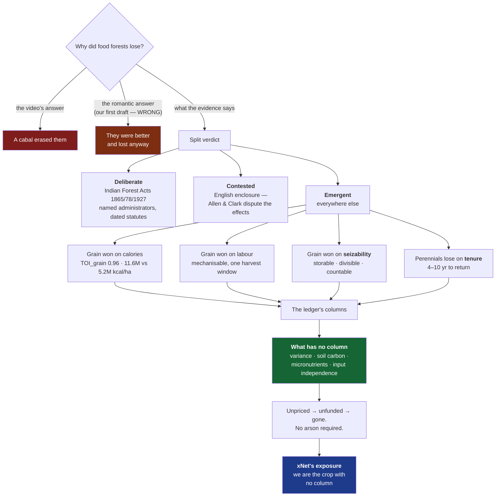
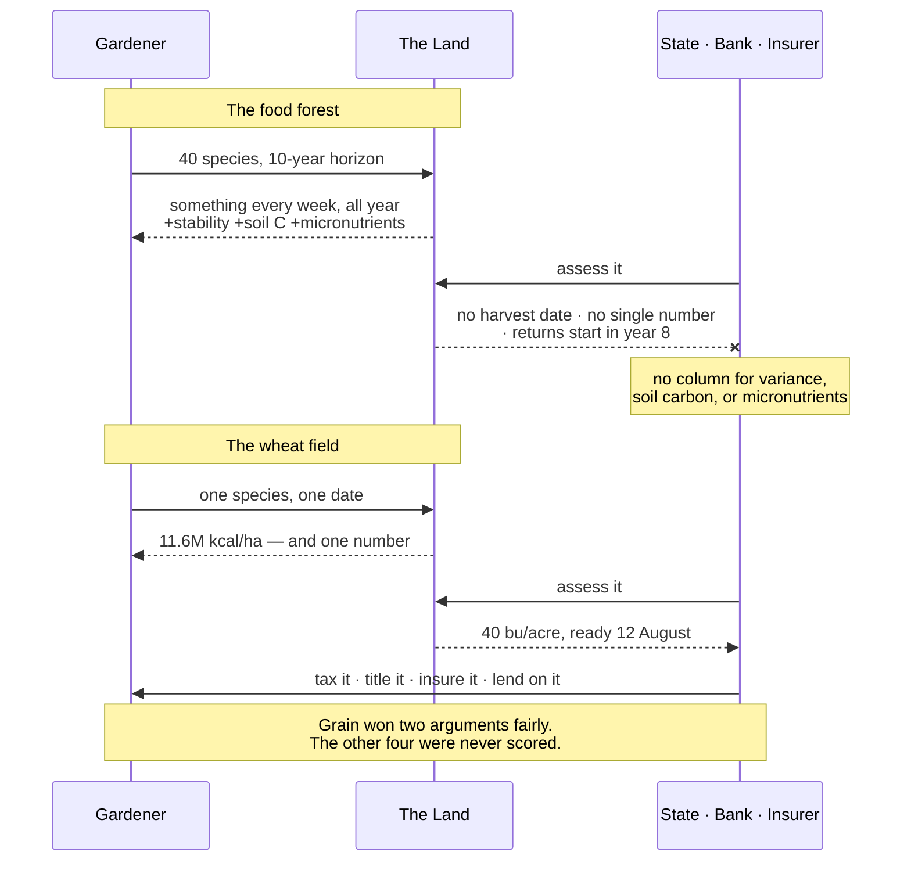

# Blog Post: The Harvest You Can Count — Food Forests, Legibility, And What The Ledger Refuses To Price

> The prompt was a YouTube video titled _"Why They Erased Every Unlimited Food
> Forest On Earth."_ The video is content-farm conspiracy material. The thing
> it points at is real, well-evidenced, and one of the better stories we could
> tell. This exploration is mostly about keeping those two facts apart — and
> about one finding, late in the research, that killed the essay's first thesis
> and replaced it with a better one.

## Problem Statement

A video asserts that food forests — layered, perennial, multi-species food
systems — once existed everywhere and were deliberately erased. If true, that
rhymes with the essay we just published on Monopoly
([`rig-the-game-or-play`](../../site/src/pages/blog/rig-the-game-or-play.astro)):
a better arrangement losing to a worse one for reasons unrelated to merit.

Four problems stand between that instinct and a publishable essay.

**One: the source is poisoned.** The video belongs to a cluster of channels
producing Tartaria-adjacent "they erased it" content, much of it AI-generated.
A sibling upload from the same pattern is _"Tartaria Had Trees That Grew
Infinite Food — Then They Burned Them All."_ We cannot cite it. We _can_ use it
as a specimen, which is a stronger move.

**Two: the video's frame is wrong, and the correction is the essay.** Food
forests were not erased by decision. The verdict is split — genuinely
deliberate in colonial India, genuinely contested for English enclosure, and
emergent everywhere else.

**Three — the biggest editorial risk — we have already published this essay's
imagery.** [`the-forest-and-the-field`](../../site/src/pages/blog/the-forest-and-the-field.astro)
(28 June 2026) opens with a corn monoculture versus a designed food forest
"seven layers deep," walks Mollison and Holmgren's twelve principles, and
closes on leaving the land richer than you found it. An essay arguing
_polycultures are better designed_ is not a new essay. It is a worse second
serving of one we ran three weeks ago.

**Four — and this one nearly ended the exploration — the first draft's thesis
was factually wrong.** That draft claimed the wheat field "did not win on
yield," citing land-equivalent ratios of 1.2–1.4 in polyculture's favour. Deep
research refuted it. Li et al. (2023, _PNAS_) show that LER 1.23 and a
**calorie penalty** are the same dataset: when you compare an intercrop against
the _best single crop you could have grown instead_, grain yield is **0.96**,
CI [0.93, 0.98]. Grain really did win on calories. And on labour. And on
storability. The romantic version of this essay is not available.

So the question is not "is the video true," nor even "did the better thing
lose." It is: **what did the ledger actually fail to price, and is that a
strong enough argument to publish?**

## Executive Summary

Yes — and it is a better argument than the one we set out to make.

`the-forest-and-the-field` told readers to design like a forest. It never
mentioned that people _did_ design like forests on every inhabited continent
for millennia, and that most of those systems lost. The honest reason is not
that grain was worse and won anyway. **Grain was genuinely better at the two
things anyone was measuring** — calories per hectare (~11.6M kcal/ha/yr for
wheat against ~5.2M for the only rigorously measured temperate food forest) and
calories per labour-hour, which is the metric that actually selected.

The argument survives the correction, relocated. What the food forest is
better at is **variance, soil carbon, micronutrient density, and input
independence** — and every one of those is an axis no ledger has a column for.
Yield stability does not appear on a tax assessment. Soil organic carbon does
not appear on a loan application. A staggered harvest of forty species does not
appear as a number at all, which is precisely why Mayshar, Moav and Pascali
find cereal cultivation — _not_ land productivity — causally predicts state
hierarchy across a thousand societies. Grain was **seizable**.

Add the mechanism that finishes it: perennials take 4–10 years to first
meaningful return. **A tenant farmer cannot plant a food forest.** No malice
required — a system that allocates land in short tenures and capital against
measurable annual output will select against perennial polyculture forever,
with nobody deciding anything.



Recommended: write it as a deliberate, self-implicating **sequel** to
`the-forest-and-the-field`, under the working title **"The Harvest You Can
Count."** Open by naming the video's genre and refusing it. Then spend the
essay's credibility budget on conceding what grain genuinely won, because the
concession is what earns the closing turn — that xNet is currently the crop
with no column, and we do not have an answer either.

## Current State In The Repository

### The blog machinery

| File                                                                       | Role                                                               | Change                 |
| -------------------------------------------------------------------------- | ------------------------------------------------------------------ | ---------------------- |
| [`site/src/data/blog.ts`](../../site/src/data/blog.ts)                     | Single source of truth. `BlogPost` at :74–92, `posts` array at :94 | **Add entry at top**   |
| `site/src/pages/blog/<slug>.astro`                                         | The post                                                           | **New**                |
| `site/src/components/blog/<Name>Hero.astro`                                | Masthead; props `title, deck, date, readingMinutes, tags`          | **New**                |
| `site/src/components/blog/Honest<Name>.astro`                              | Mandatory `isn't`/`is` honesty table                               | **New**                |
| `site/src/components/blog/<Name>Art.astro`                                 | Mid-essay illustration, reused as index card art                   | **New**                |
| [`site/src/pages/blog/index.astro`](../../site/src/pages/blog/index.astro) | Imports `*Art`, maps by slug in `heroArt` (:30–49)                 | **Add import + entry** |
| `site/src/pages/blog/rss.xml.ts`                                           | Iterates `publishedPosts()`                                        | None                   |
| `site/src/components/blog/SeriesNav.astro`                                 | Resolves neighbours by `pubDate`                                   | None                   |

Conventions worth not re-deriving:

- **Author avatars are vendored** under `site/public/blog/authors/`, never
  hotlinked — several essays promise the page loads nothing third-party
  ([`blog.ts:48–53`](../../site/src/data/blog.ts)).
- **All art is inline original SVG.** No raster assets.
- `Mermaid.astro` takes a **`code`** prop, not `chart` (0363's example code got
  this wrong; the shipped post got it right).
- Per-post **prose accent colour** matches the hero art — `emerald-*` on the
  forest post, `amber-*` on the Monopoly post.
- **No changeset needed** — `site/` is not a publishable `packages/*`, so the
  `Stop` hook does not fire.

### Two defects to fold in

1. **`rig-the-game-or-play` is missing from the `heroArt` map** in
   `index.astro`. PR #569 shipped `BoardArt.astro` without wiring it, so the
   Monopoly card renders with no header image while the other 18 posts have
   one. One line; we are editing that map anyway.
2. **The changelog-fragment convention has drifted.** Every essay from
   `the-gentlest-furnace` through `clutch-power` has a fragment under
   `site/src/data/changelog/`; the four since do not, and presumably shipped
   under the `skip-changelog` label that `.github/workflows/changelog-check.yml`
   accepts. **Recommendation: write the fragment.** An essay is a user-visible
   shipment.

### The metaphor collision — the thing that nearly kills this post

| Post                                                       | Metaphor it owns                                                                                                                                                                                   | Collision                                                       |
| ---------------------------------------------------------- | -------------------------------------------------------------------------------------------------------------------------------------------------------------------------------------------------- | --------------------------------------------------------------- |
| **`the-forest-and-the-field`** (2,831 w, `nature`)         | **Permaculture, explicitly.** Corn monoculture vs. designed food forest "seven layers deep." Mollison, Holmgren, twelve principles, `PrincipleWheel`, earth/people/fair share, Hardin→Ostrom→Rose. | **Near-total on imagery.** This post _is_ the food-forest post. |
| **`data-should-work-like-soil`** (2,418 w, `nature`)       | Mycorrhizal networks. Owns "soil" as a term of art.                                                                                                                                                | High if we reach for soil-building.                             |
| **`the-desert-that-feeds-the-forest`** (2,474 w, `nature`) | Saharan dust → Amazon phosphorus. Calls Big Tech "the monoculture" and "a plantation."                                                                                                             | High on vocabulary.                                             |
| **`tree-rings`**                                           | Growth rings: accretion vs. overwrite (Hickey).                                                                                                                                                    | Low.                                                            |

0363 already flagged this and wrote the rule: **"If the draft starts reaching
for soil, it has drifted."** That rule stands.

**The escape.** `the-forest-and-the-field` is _prescriptive_ — here is how to
build a good system. It has nothing to say about why good systems lose, and
nothing at all to say about what they lose _on_. Our essay is an economic and
historical argument in which the food forest is a **defeated incumbent with real
weaknesses**. Different question, different evidence base, opposite emotional
register. It reads as the hard sequel to an optimistic post — exactly the
self-implicating move this blog already makes.

Concretely:

- The layer stack, twelve principles, Mollison, Holmgren, "regenerative vs.
  sustainable," and soil-building are **spent**. One sentence of callback and a
  link, maximum.
- New nouns: **ledger, cadastre, tithe, tenure, collateral, premium, variance,
  discount rate**. If a paragraph could have appeared in the forest post, cut
  it.

### Related explorations

- [`0363`](0363_[x]_BLOG_POST_RIG_THE_GAME_OR_PLAY_MONOPOLY_AS_BAD_GAME_DESIGN.md)
  — direct antecedent; its confidence-flagging and DO-NOT-QUOTE patterns are
  copied wholesale below.
- [`0351`](0351_[x]_FRONTIER_ECONOMICS_WITHOUT_ENCLOSURE_RAILROADS_AIRLINES_AND_THE_COMMONS.md)
  — enclosure and the Georgist operator position. Shares vocabulary; diff at
  draft time.
- [`0358`](0358_[x]_VALUE_CAPTURE_WITHOUT_ENCLOSURE_MOATS_SUBSTRATES_AND_THE_SLEEP_TEST.md)
  — origin of the Sleep test.
- [`0354`](0354_[x]_BLOG_POST_PALIMPSEST_THE_ECONOMICS_OF_KEEPING_EVERYTHING.md)
  — closest structural sibling: a historical mechanism priced against modern
  numbers.

### Numbering

`0368` is free — verified across all branches and worktrees
(`git log --all --diff-filter=A --name-only -- 'docs/explorations/0368*'`
returns nothing; highest existing is `0367`).

## External Research

Claims are individually confidence-flagged, following 0363. **The flags are not
only for us — the strongest ones belong in the published essay.**

### The video and its family

**Solid.** _"Why They Erased Every Unlimited Food Forest On Earth"_
(`youtube.com/watch?v=ZhQk45Ra_Sw`). Near-identical siblings surface
immediately: _"The Unlimited Food Forests They Erased From Every City On
Earth,"_ _"The 2,400-Year-Old 'Infinite Food' System (That Was Banned),"_ and
the tell — _"Tartaria Had Trees That Grew Infinite Food — Then They Burned Them
All."_

**Solid.** Tartaria is a documented conspiracy narrative claiming an advanced
global civilisation was erased from history, with an associated "mudflood"
cataclysm; hundreds of millions of views on TikTok alone.

**Reported, not independently verified.** Trackers observed a coordinated surge
of Tartaria-focused YouTube channels in January 2026 — on the order of 66 in a
single day across English, Spanish and Russian, with signs of automated
generation. **Treat as journalism, not fact.** The essay does not need the
number; "a content farm" suffices.

**Editorial ruling: do not link the video.** Naming the genre is enough.

### Food forests that demonstrably existed

**⚠️ Keystone citation downgraded — cite the 2023 and 2024 papers, not the
famous 2021 one.** Armstrong et al. (2021), _Ecology and Society_ 26(2):6, is
the paper every popular account cites, and it is thinner than its press. Four
sites (Dałk Gyilakyaw, Kitselas Canyon, Shxwpópélem, Say-mah-mit), **46 plots of
5×5 m** — pseudo-replicates within only **four** sites, used as a 4-level random
effect. Traits came from the TRY database, **not measured**. **No effect sizes,
no confidence intervals, no R².** Functional divergence was **not significant**
(P=0.07). And the paper **contains no dating evidence of any kind** — the
"150 years" is arithmetic from a documented ~1870 abandonment.

Three confounds it does not address: **midden nutrient enrichment** (one site
_is_ a shell midden, and middens independently shift soil Ca, P and pH);
**canopy gap** (gardens are clearings; canopy cover unmeasured); and **reserve
protection** — all four sites sit on reserves exempt from industrial logging, so
persistence may reflect 20th-century law rather than 19th-century design. The
authors raise the last one themselves; every news outlet dropped it.

**The press overstatement is itemisable, and it is on-thesis:** _Science_ wrote
"deliberately planted" (never demonstrated in the paper); "these plants never
grow together in the wild" (inverts a joint co-occurrence claim — every species
grows wild); "fire, fertilization, pruning" (**none measured**); and "remain
productive" — **the paper contains no productivity data of any kind.** Richness
is not productivity.

**Use instead:** Armstrong et al. **2023** (_Ecosystems and People_, 7 gardens,
155 species, **with soils, tree rings, radiocarbon and paleoethnobotany**) is
the paper that actually argues pre-colonial management; Armstrong et al.
**2024**, _PNAS_ 121(48), on **hazelnut genetic differentiation**, is the
strongest intentionality evidence, because population genetics can carry a claim
that vegetation pattern cannot. A published scalar critique also exists (Oswald
et al. 2023, _Ecosystems and People_ 19(1):2240432, with a reply).

**The underlying point survives and is still the best available answer to the
conspiracy frame: nobody burned these. Their gardeners were removed, and
something recognisable persisted for a century and a half.** State it that way —
carried by the 2023/2024 evidence, not the 2021 headline.

**And the general lesson, which the essay should name.** The Indigenous
land-management claims that settled are the ones **with an artefact in them** —
clam-garden rock walls (a wall cannot form naturally; oldest ≥3,500 years;
butter clams 4× more abundant, with a _tagged-juvenile transplant experiment_
showing 1.7× faster growth), Llanos de Moxos island geometry plus radiocarbon,
hazelnut population genetics, terra mulata micromorphology. **Apêtê remain
contested after thirty years precisely because nobody has put a trowel or a
radiocarbon date into one.** Vegetation pattern and informant testimony did not
settle those questions; measurable objects did. **That is the essay's thesis
turned back on the evidence for the essay's thesis, and it should be in §2.**

**Solid, with a published dispute.** Levis et al. (2017), _Science_
355(6328):925–931 — 20 of 85 studied domesticated species are hyperdominant
across Amazonia, more abundant near archaeological sites. **Science published a
formal Comment (McMichael et al., 2017) disputing the sampling and the
proximity inference. If we cite Levis, we cite the Comment.** Cheap
credibility, and correct.

**Chagga home gardens — corrected on three counts.** The first draft's "0.2–1.2
ha multistorey plots, 100+ crop species, a recognised GIAHS" needs all three
parts fixing.

- **The species count is cumulative, not per-garden.** O'kting'ati et al. (1984),
  _Agroforestry Systems_ 2(3):177–186, found "over 100 plant species spread over
  40 families" — **across 30 farms in 6 villages**, not in one garden. And the
  even more widely quoted **"~500 species" is Hemp (2006), a botanical flora
  survey**: of ~520 vascular plants, **over 400 are non-cultivated** — 194 forest
  species, 128 ruderals including 41 invasive neophytes. Quoting it as crops per
  garden compounds three errors: flora→crop list (~5×), cumulative→per-garden,
  and Hemp's 2006 number attributed to Fernandes' 1984 paper. **The cultivated
  component is ~100–120 species, system-wide.**
- **The GIAHS listing is one village, not the system.** It is the **Shimbwe Juu
  Kihamba site — 615 ha, 2,569 people**. FAO's materials give the year
  inconsistently as 2011 and 2013. **Do not write "the Chagga home gardens are a
  GIAHS."**
- **The plot size understates dependence.** Households typically hold **two**
  plots: the _kihamba_ on the slope plus an annual-crop _kishamba_ **10–16 km
  away in the plains**. Omitting the second makes the garden look far more
  self-sufficient than it is. Modern holding: **0.4 ha** (n=82, 2022).

**And the third instance of "an old practice, a young system."** The canonical
Chagga multistorey is banana–coffee–vegetable. **Arabica coffee was introduced
by missionaries in the 1890s.** So the system in the form everybody describes
cannot be more than ~125 years old, whatever the banana cultivation beneath it
dates to. Meanwhile "2,000 years" traces to an assertion with no identified
evidentiary basis, and "800 years" is **circular** — an undated assertion
co-cited with a 2021 pollen study the authors hedge as "possibly associated
with" homegardens, from a core that **cannot detect bananas at all** (sterile
triploid _Musa_ produces negligible pollen). There is **no excavated,
radiocarbon-dated sequence for the kihamba system**.

**The sharpest irony available:** Engaruka, the one northern Tanzanian
irrigation landscape with genuine excavated archaeology, dates to **c. 1400–1720
CE** — _younger_ than what is claimed for Kilimanjaro on no archaeology at all.
**The site with evidence gets modest dates; the site without evidence gets two
millennia.** That sentence could carry §3 by itself.

**Same area-versus-integrity split as Kandy, and it is now a pattern worth
stating as one.** Chagga agroforestry area **more than doubled 1976–2022, to
849 km²**. What contracted was per-household holding, structural complexity, and
native content: total species per km² fell only ~10%, but **species from natural
habitats fell 46% while neophytes rose ~25%**. **Replacement, not depletion.**
Land use change, not climate, is the identified driver.

### Javanese pekarangan — and the fact that most complicates this blog

A third system, researched late, and it contains the single sharpest correction
in the entire research base — **against the framing of our own earlier essay.**

**Solid, verified against the full primary text** (Soemarwoto & Conway 1991,
_J. Farming Systems Research-Extension_ 2(3):95–118 — open access, which is why
this one could actually be checked). Structure is 3–4 strata, but the
**indigenous organising principle is horizontal and social**, not silvicultural:
_buruan_ (front yard), _pipir_ (side), _kebon_ (back).

**Then, verbatim from the most-cited source in the field:**

> "According to popular belief, the structure of the homegarden deliberately
> mimics the natural forest, **but in Javanese culture forests have a low social
> value. Indeed, Javanese feel offended when their homegarden is compared to a
> forest.**"

The authors attribute the forest-like structure to **convergent evolution, not
imitation**. Forest clearing is culturally a noble deed; the _wayang_ casts
forests as dangerous places of wild animals and evil spirits.

**This directly contradicts the standard permaculture framing of these systems
as conscious "food forests" modelled on the rainforest — the framing
`the-forest-and-the-field` used.** It has been sitting in plain sight in the
field's most-cited paper the whole time. **This belongs in the essay, and it
belongs pointed at us.**

**Two more numbers that fail the same way as all the others.** "600+ species in
a pekarangan" is **602 cumulative across 351 gardens over two seasons, including
ornamentals and weeds** — a typical garden holds **~20** (mean range 19–24;
modern re-measurement gives 27). And the circulating "**>40% of calories**" is a
**produced-versus-consumed conflation**: the only traceable measured figure is
**18% of calories and 14% of protein consumed** (Ochse & Terra 1934). Modern
re-measurement is a very large downward revision — **2.4% of vitamin A RDA,
23.6% vitamin C, 1.9% of carbohydrate or protein**, and ~11% of farm income.

**Dating fails identically.** The "860 AD charter" rests on one line in a 1954
geography review by an agronomist — no inscription named, no text, no
epigraphic corroboration. The "10,000 years" is Hutterer's explicitly hedged
_"probably"_, and it is **a universal hypothesis about how dooryard
horticulture arises anywhere**, not a Javanese finding; downstream it hardens
into "the 7th millennium BC." A claimed reference in the Ramayana Kakawin
**could not be found at all — treat as spurious**, and Rumphius is routinely
miscited (he worked on **Ambon, not Java**). **Firm documentation runs to the
early 19th century; rigorous quantification only from the 1930s.**

**One equity note the advocacy retellings drop:** Soemarwoto and Conway observe
that pekarangan provide **little employment for the landless**. A system of
household plots is not a commons.

### The meta-finding — and it is about us

During this research, a search engine's AI summary returned **Hemp's 2006
520-species flora figure inside a summary of the Fernandes 1984 paper** — a
miscitation manufactured on the spot. **The error is now being generated at
scale, which means secondary sources on this topic will get worse over time,
not better.**

An essay about numbers that survived on repetition rather than evidence, which
opens by refusing an AI content farm, and which was itself researched with AI
assistance that reproduced the exact error it is describing — **that is the
strongest closing material available, and declining to use it would be
cowardice.** Strong candidate for §7 alongside Pasquier.

Kandyan forest gardens, Sri Lanka — **cite Perera & Rajapakse (1991),
_Forest Ecology and Management_ 45(1–4):269–280**, n=50 random units in Central
Province: **0.1–0.4 ha, ~46 plant species and ~23 tree species per unit,
500–1,500 trees, >70% canopy cover, 3–5 strata.** ⚠️ **This package is routinely
misattributed to McConnell** — the McConnell reports (1973 UNDP/FAO Management
Report No. 7; 1992 FAO monograph) are **not digitised**, so any figure sourced
to them in the secondary literature is second-hand and should not be repeated.

Scale, for the "still operating" claim: Sri Lankan home gardens covered
**~977,700 ha across 20 districts in 2005, about 15% of the country's land
area** (FAO 2009), and supply **over 50% of national timber and 80% of
fuelwood**. ⚠️ National area figures range **818,394 ha** (Ariyadasa 2002),
**858,490 ha** (FSMP 1995) and **977,700 ha** (FAO 2009) — **pick one and date
it.**

⚠️ **Downgrade one figure the first draft treated as solid.** The
much-quoted "**30–50% of household income**" appears in Pushpakumara et al.
(2010) **with no citation attached**, and is then re-quoted onward as though
sourced. Use instead the clean measured numbers from Thamilini et al. (2019,
_Front. Sustain. Food Syst._ 3:94), n=40 gardens in Kandy district: mean
monthly household income **LKR 40,958** for organised home gardens against
**34,225** without, and homegarden share of nutrient intake — **vitamin C 25.0%
vs 8.5%, vitamin A 14.8% vs 4.2%, iron 13.5% vs 3.8%**.

**Solid, and the best unpriced-externality number in the whole research base.**
Soil loss in the Mid-Country Wet Zone, measured at Peradeniya and Hanguranketha:
**mixed home gardens 0.05 t/ha/yr** against **seedling tea with no conservation
at 40**, **capsicum 38**, and **tobacco 70** — with natural forest below 0.02.
**The polyculture performs within a rounding error of undisturbed forest, and
that performance has never appeared on anybody's balance sheet.** This belongs
in §6.

**⚠️ Important correction to "still operating" — do not let it read as
"healthy."** The direction of travel splits by unit. **National home-garden
_area_ is growing** (about 17% between 1983 and 1992; state planting drives such
as _Divi Neguma_ targeting millions of plots). **Kandyan gardens are
simultaneously fragmenting and simplifying.** Pushpakumara's own issues list
names "changing species composition and structure from multi-tree species rich
HGs." deHaan et al. (2020, _Sustainability_ 12(17):6866), n=24 Kandyan
gardeners, codes land fragmentation 53 times and abandonment 41; Mohri et al.
(2018) report substantial fragmentation over two decades.

**And the fragmentation mechanism is on-thesis.** deHaan et al. find gardens are
fragmenting **mostly through family inheritance** — subdivision across
generations shrinking plots below the size a multi-strata system needs.
**Nobody cleared these gardens either. They were divided by a rule about who
gets what, applied to a system whose value was never in the parcel.** That is
the essay's argument arriving through the front door, and it is worth two
sentences in §6b.

**Both still operating** — which makes "every … on Earth" false as a matter of
record. **Do not attach an age to either** (see below), and **do not call the
Kandyan gardens a GIAHS site.** Verified against three FAO documents: Sri
Lanka's only designated system is the **Cascaded Tank-Village System, 2017**;
Kandyan home gardens have never been designated and have never appeared even on
the candidate list. Popular sources asserting otherwise are wrong.

### The Kandyan antiquity claim — the Morocco problem, a second time

Dedicated research on the dating evidence found the same failure mode, and
finding it _twice_ changes what the essay is about.

**Asserted, unsourced.** "Kandyan home gardens are over 2,500 years old" traces
to one sentence in FAO's _State of Forest Genetic Resources… in Sri Lanka_:
gardens "go back to over 25 centuries," supported only by "in chronicles there
are references…" — **no chronicle named, no citation, no passage quoted.** That
uncited sentence appears to be the taproot of a figure now repeated across the
agroforestry, NGO and tourism literature. A parallel tourism claim about
"plaques dating back almost 2000 years" names no plaque, inscription or site.
**No scholarly work anywhere dates or interrogates the age of these gardens** —
this is a genuine gap in the literature, not a failure of searching. The
academic literature begins in **1973** (McConnell & Dharmapala) and describes
the 1970s–80s garden; the antiquity entered as background colour and has been
transmitted by citation ever since.

**Refuted by the crop list.** The signature "Kandyan spice garden" assemblage
cannot be pre-colonial. Cashew, pineapple, maize, chilli and cassava are New
World. Coffee's first systematic cultivation in Ceylon is Dutch, **1740**;
Peradeniya's oldest nutmeg trees were planted **1840**; cocoa is mid-19th
century; tea is **1867**; rubber **1876**. **The honest formulation the research
landed on: an old practice, a young system.**

**Solid, primary, and probably the best single anecdote available to this
essay.** Robert Knox, _An Historical Relation of the Island Ceylon_ (1681) —
written by a captive inside the Kandyan Kingdom 1660–1679, i.e. genuinely
inside the target polity and period. Knox documents dispersed settlement where
"each man lives by himself in his own Plantation, having an hedg it may be and a
ditch round about him," and his own purchase of a plot with mixed fruit trees.
So garden compounds with mixed trees are securely ~360 years old at minimum.

**But Knox also demolishes the designed-agroforest reading, and does it with a
motive.** He is explicit that most of the tree component was self-seeded, not
planted — of areca, the most economically important tree, he says people "plant
them not, but the Nuts being ripe fall down in the grass and so grow up." And he
gives the reason: the king requisitioned any good fruit, which is why "the
People regard not to plant more than just to keep them alive."

**That is an appropriability story told from inside the garden, in 1681, in the
gardener's own economic logic** — people deliberately under-planting because
anything visibly good would be taken. It is the Mayshar/Moav/Pascali mechanism
observed three centuries before it was formalised, and it belongs in the essay.

**Documented, and it inverts the thesis in a useful way.** The Crown Lands
(Encroachments) Ordinance No. 12 of 1840 presumed forest, waste and
uncultivated land to be Crown property unless the contrary was proved. A plot
with standing coconut, areca and jak was visibly, permanently "cultivated" and
therefore legally defensible; a chena in fallow was not. **Legibility does not
always destroy the polyculture — here it destroyed the swidden and selected
_for_ the tree garden**, because trees were the proof of occupation.

Two cautions on this one: the exact clause wording is behind a paywall and was
not verified against the original statute, and the land-use _outcome_ is
well-grounded inference rather than a demonstrated finding. **Flag it as
inference in the prose, or leave it out.** Related and equally unverified:
Dewasiri's _The Adaptable Peasant_ documents plots rising from 12,000 to over
30,000 in thirty years to 1761 under Dutch fiscal pressure — but that is the
**western lowlands, not the Kandyan highlands**, and Dewasiri says his model
does not fit the mountains. An analogue, not evidence.

### The Morocco claim — corrected, and better for it

**The site is real. The date is not sourced. But there is a rigorous number
underneath, and it is a more interesting one.**

**Unsourced — do not use.** The "2,000-year-old food forest in Morocco" traces
to a single person, Geoff Lawton, who first visited in 1975 and has filmed it
repeatedly. Every downstream retelling descends from that footage. Four
failures: the toponym is unstable across retellings (_Inraren_ / _Tamzargot_ /
_Aït Mansour_); the descriptive numbers drift (800 _families_ in some tellings,
800 _people_ in others — a five-fold difference propagating silently); the
dating is attributed to unnamed "experts" with no archaeologist, agronomist or
historian ever named; and **no radiocarbon, dendrochronological or
archaeological study of the site exists.** The claim is invisible to
scholarship — not rebutted, simply never engaged.

**Solid, and the replacement.** Genin et al., _"The agroforestry parks of Azilal
(Morocco): a centuries-old and still living landscape construction,"_ _Journal
of Alpine Research_ — actual dendrochronology on Central High Atlas
agro-sylvo-pastoral parks. Holm oak, carob and juniper at 10–50 trees/ha,
pruned for fodder reserve. Living holm oaks dated 200–300+ years; by reading
stump regrowth from long-rotation coppicing the authors identify parent trees
over 230 years old at the time of cutting more than 200 years ago, **tracing
the park structure back at least 500 years.** In the study commune Agoudi
N'Lkhir: 1,122 farmers, 3,000 ha of barley and wheat, and **537 isolated trees
by 2008, up from 425 in 1919 — the tree count grew across the 20th century.**

**Solid.** Regional chronology constrains the rest: Kaczmarek et al. (2024,
_The Holocene_) on date palm seed morphometrics, plus Wadi Draa work in the
_Journal of Islamic Archaeology_, give site LAR002 occupation from at least cal
339–534 CE with a medieval boom c.700–1500 AD.

**The defensible restatement:** _oasis agroforestry as a regional practice in
southern Morocco is at least ~1,500 years old, and specific Atlas agroforestry
parks can be traced structurally back ~500 years by dendrochronology._

**This correction is a gift, not a loss.** An essay about what gets counted, by
whom, on what evidence, that opens by replacing a beloved round number with a
smaller measured one — and notes that the measured version shows the trees
_increasing_ — has earned every subsequent claim it makes.

### What actually displaced them — a split verdict

**Deliberate. Solid, and the strongest leg of the video's own thesis.** The
Indian Forest Acts of 1865, 1878 and 1927 partitioned forest into reserved,
protected and village categories and criminalised shifting cultivation, grazing
and gathering. Executed substantially by German foresters imported into the
Indian Forest Service (Dietrich Brandis). Guha (1990), _"An early environmental
debate: the making of the 1878 forest act,"_ _IESHR_ 27(1); Guha's _The Unquiet
Woods_; Sivaramakrishnan's _Modern Forests_. Partial reversal in the 2006
Forest Rights Act. **The framing to steal: the Acts converted customary rights
into state-granted privileges.** That is a sentence about permissions, not
trees. If the essay wants a villain, this is the only place it honestly has
one.

**Numbers corrected — use Chapman, not Turner.** The 6.8m acres figure (Turner 1980) that the first draft cited is superseded. **Chapman (1987)**, _Agricultural
History Review_ 35(1), built a 10% random sample of all English and Welsh awards
and summed **allotments** rather than trusting act estimates (which he shows err
by up to 23.5%): **7.25–7.35m acres in England, ~8.42m England and Wales.** He
states the widely used 6m figure understates by almost 18%. Roughly 5,000+ acts;
core period 1750–1830; deep legal root the Statute of Merton (1235).

**And Chapman answers our actual question.** His land-type breakdown:
**England and Wales, 33.47% field land against 59.67% pasture and waste.** Nine
English counties show zero arable. His conclusion is that parliamentary
enclosure "was primarily concerned with common pasture and waste." **The popular
"enclosure = open fields" story is wrong by area — the majority target was the
commons, precisely where estovers, pannage and turbary lived.**

**But do not overclaim the tree link.** "Waste" was heterogeneous — fens,
marsh, dune, heath, downland, moor _and_ wood-pasture — and Chapman's categories
do not separate wood-pasture out. **The 59.67% supports "enclosure destroyed
commons," not "enclosure destroyed tree-based subsistence." The tree-specific
share is unquantified.**

**Solid, and the sharpest single item in the enclosure material.** The **Black
Act 1723** (9 Geo. I c. 22), passed in about four weeks with little debate, made
**cutting down young trees and destroying fruit trees capital offences** without
benefit of clergy. E.P. Thompson, _Whigs and Hunters_ (1975). **Tree-based
subsistence was, briefly and literally, a hanging matter.** Alongside it,
Humphries (1990, _JEH_ 50(1)) prices what the commons were worth: a cow c.1800
yielded £7–10 a year — about half a male labourer's wage, and **up to 40% of
total family wage income.**

**Contested — and we must say so.** There is a live revisionist debate on
effects. Allen (_Enclosure and the Yeoman_, 1992) finds enclosure raised yields
only **2.5–8.4%**; Clark broadly concurs the net return was small. **Against
them**, Heldring, Robinson & Vollmer (NBER WP 29772, 2022; >15,000 parishes)
find a **45% yield increase by 1830 — and a 30% rise in the parish Gini.** Both
can be true: large productivity gain, regressively distributed, and that is the
honest line. On social impact, Shaw-Taylor is a serious challenge to the
Hammonds — he found Midland common-right dwellings were overwhelmingly owned by
wealthy individuals and institutions, not poor cottagers. **⚠️ Do not invoke
Hoskins as an anti-enclosure authority: _The Making of the English Landscape_
explicitly dispels the belief that the field pattern results from 18th-century
enclosure.**

**Solid at the core, with the popular version substantially wrong.** Prussian
and Saxon "scientific forestry," c.1765–1800 — Scott's central case in _Seeing
Like a State_. Diverse forest replaced by grids of same-age Norway spruce to
maximise measurable timber; the real tree "replaced by an abstract tree
representing a volume of lumber or firewood"; second-rotation decline of one to
two site classes and 20–30% production loss. All solid. The _Normalbaum_ and
cone-volume material is sourced to Henry Lowood's "The Calculating Forester"
(1990), which holds up. **Use this.**

Four flags, from a check against the primary text rather than summaries:

- **⚠️ Half the popular retelling is not in Scott.** A full-text search returns
  **zero occurrences of Cotta, Hartig, Carlowitz, _Nachhaltigkeit_, Faustmann,
  Dauerwald, _Nutzholz_/_Brennholz_, or "acid rain."** Thünen appears once, as
  a location theorist, **not in the forestry chapter at all**. Placing any of
  these in a _Normalbaum_ narrative is a category error — and not Scott's.
- **⚠️ The _Waldsterben_ link is the chapter's real defect. Do not use it.**
  Scott's endnote sources it to Plochmann (1968) **quoted via Chris Maser
  (1988)** — a quotation of a quotation — and appends a term that entered German
  usage in **1981** (Ulrich and Schütt; the _Spiegel_ cover of 16 Nov 1981) to a
  1968 silviculture claim. Waldsterben's entire scientific framing was **acid
  deposition**. Worse, **the forecast catastrophe did not happen**: Kandler, FAO
  _Unasylva_ 174 (1993), reports 1984–92 grid surveys showing no predicted rise
  in damage, no class shift, no rise in mortality, and tree rings showing
  _improved_ growth. Scott's own text is one subordinate clause; the popular
  version ("scientific forestry killed the German forest") is stronger than
  Scott and false.
- **⚠️ Uniformity is overstated, and Scott's own footnote concedes it.** He
  acknowledges Karl Gayer, exponent of the _Mischwald_ (_Der gemischte Wald_,
  1886), then argues as though he had not. Add Möller's _Der Dauerwaldgedanke_
  (1922) and the long _Bodenreinertragslehre_ dispute: **German forestry was
  internally contested throughout.**
- **Critiques exist but there is no canonical demolition.** Hölzl (_Science as
  Culture_ 19(4), 2010) treats the origin story as a founding narrative and
  notes foresters "were rarely as rigid or prescriptive as their scientific
  models suggested." Jönsson (_Ambio_ 53(6), 2024) objects to scope. Tauger's
  H-Net review targets the Tanzania and USSR cases, not forestry.

**The irony worth using instead of Waldsterben.** German forests _are_ now in
serious trouble — **79% of trees sick, dying or dead; over 300,000 ha dead since
the 2018 drought; spruce down ~17% of its area 2012–2022** — from drought and
bark beetle, **hitting off-site spruce hardest**. Scott's structural intuition is
being vindicated three decades late by a mechanism he never named, having named
the wrong one. **That is a better paragraph than the one he wrote, and it is
honest about him.**

**Solid, contested, and better than Scott for our purposes.** Mayshar, Moav &
Pascali, _"The Origin of the State: Land Productivity or Appropriability?"_,
_Journal of Political Economy_ 130(4), 2022. Using an instrumental-variable
strategy over ~1,000 societies in the Ethnographic Atlas, they find **cereal
cultivation causally predicts hierarchy, while land productivity does not.** The
mechanism is appropriability: cereals ripen simultaneously, must be harvested in
a window, and store transparently — so they can be measured, seized, taxed and
lent against. Roots, tubers and staggered-harvest tree crops cannot. **There is
a published Comment in _JPE_ (2024/25) disputing it — cite both.** Scott's
_Against the Grain_ is the popular, non-empirical version of the same argument;
this is the empirical one, and it is the better citation.

### Modern farm policy — much stronger than the first draft assumed

The first draft hedged this to "directional." Dedicated primary-law research
found it is **documented in statute**, and it is now the essay's best modern
evidence.

**Solid, primary law — and the sentence writes itself.** US **base acres** are
frozen to 1981–85 plantings (FAIR Act 1996 "contract acres," renamed 2002);
**270.90m base acres** in 2021, of which corn 100.74m and wheat 69.72m. The
~20 **covered commodities** (7 U.S.C. 9011) include no fruit, no nut, no
vegetable, no tree crop. And the current statutory language on base-acre updates
names the exclusions explicitly: acres planted to commodities **"other than
covered commodities, trees, bushes, vines, grass, or pasture."** **Trees are
named in the statute, in a list of things that are not the thing being
counted.**

**Solid, and sharper than the headline.** Three mechanisms make base acres
tree-hostile in a way a ban never would:

1. **The escape hatch is closed to perennials.** 7 CFR 1412.46 lets a grower
   avoid the fruit-and-vegetable payment-acre reduction by paying for an FSA
   visit verifying the crop was **destroyed before harvest**. An orchard cannot
   be planted and destroyed within a crop year, so for a perennial the reduction
   is **unavoidable and recurring for the life of the planting**.
2. **The most generous exception is defined so trees cannot use it.** The
   double-cropping exception covers _"non-perennial"_ fruits and vegetables in
   cycle with a covered commodity. An orchard cannot be in cycle with a grain
   crop.
3. **The 2018 Farm Bill preserved the entitlement against permanence.** §1102(b)
   of P.L. 115-334: base acres in grass or pasture continuously from 2009 to
   2017 **lost ARC/PLC payments for 2019–2023 but remained on the books as base
   acres**. **The system holds the door open for a return to annual commodity
   production — an option value only annual commodities can exercise.**

**Correction to the first draft's framing.** The fruit-and-vegetable rule is
**no longer a ban**. The 2014 Farm Bill converted it into a payment-acre haircut
(7 U.S.C. 9014): reductions apply only above **15% of base acres** for ARC-CO/PLC
and **35%** for ARC-IC. **Do not call it a prohibition.** Also worth one line
because it is so on-thesis: the 2014 relaxation was driven by the WTO
_Brazil — Upland Cotton_ panel finding that the restriction disqualified US
direct payments from the green box. **The rule was loosened to protect the
subsidy, not to help the grower.**

**Solid, and the proportion is the story.** Whole-Farm Revenue Protection is the
one instrument designed to insure a diversified farm _as_ a diversified farm —
whole-farm revenue off five years of Schedule F records, cap raised to $17m for
2023, and coverage at 80–85% requires **a minimum of three commodities**. Uptake:
**2,833 policies at its 2017 peak, 1,821 in 2022, 2,256 in 2024** — against
roughly **1.2 million** crop insurance policies annually. **WFRP is about 0.2% of
the book.** Documented barriers include agent unwillingness to sell it; RMA's own
2024 bulletin concedes producers "are unable to find an agent willing to sell
and service these policies," and one of RMA's remedies was **moving a sales
deadline so agents would have time to market it**. Loss ratios above 1.0 every
year 2015–2019, peaking at 1.49.

**Solid on the rule; the citation needed correcting.** The EU's 100-trees-per-
hectare eligibility threshold is **Commission Delegated Regulation (EU) No
640/2014, Article 9(3)** — **not 639/2014**, whose Article 9 is about hemp. **Get
this right; it is an easy hit.** Two further corrections to the intuitive story:
the 2014 rule was a **liberalisation** (from a ~50 trees/ha guideline to a 100
ceiling, with carve-outs for fruit trees yielding repeated harvests and grazed
trees). The stronger example of structural hostility is the **prior** regime —
Reg. 1782/2003 Art. 44(2) excluded "areas under permanent crops, forests"
from the eligible-hectare definition **outright**. And Reg. (EU) 2021/2115,
applying from 1 January 2023, finally requires 'agricultural area' to include
agroforestry systems — then devolves the definition to 27 Member States, of
which explicit agroforestry eco-schemes appeared in **2 of 14** analysed.
**Germany's paid €60/ha and attracted 55 farmers in its first year.** The
barrier moved from prohibition to indifference.

**⚠️ Contested — the claim everyone reaches for, and it is not evidenced.** That
farmers actually _removed_ trees to keep CAP eligibility is asserted constantly
and demonstrated nowhere. AGFORWARD Deliverable 8.23 says the rules "caused the
removal of trees and shrubs from agricultural land across Europe" **with no
citation, no dataset, no country figures.** The Commission's own evaluator
(Alliance Environnement/IEEP for DG AGRI, 2020) concedes at p.78 that whether
such damage occurred "is very difficult to ascertain, and **no recent direct
evidence of this is known of**." The ECA's LPIS audit (SR 25/2016) contains no
such finding and criticises the opposite failure — agencies **overstating**
eligibility on tree-covered parcels. Better-documented outcome: **abandonment,
not felling.**

**The defensible sentence, and the only one to publish:** _the CAP paid by the
eligible hectare and, until 2023, counted trees against that hectare — creating
an incentive the Commission's own evaluators call incoherent with EU
biodiversity objectives._ **Any claim about how many trees came down is
indefensible.** If we cite the evaluation, we quote its caveat too.

**But there is a documented EU number, and it is better than the one we can't
have.** Rural Development **Measure 8.2**, the EU's dedicated agroforestry
establishment measure, 2014–2020: **planned 72,529 ha** (SFC database, January 2017) against **~2,000 ha realised by end-2019** — a **97% shortfall**,
documented in **European Court of Auditors Special Report 16/2021, Figure 23**.
Hungary set a 2,000 ha target and established **26.6 ha (1.3%)**. Italy: 5 of 21
regions allocated budget, **2 activated it**. M8.2 accounted for **0.2%** of
EAFRD forestry spending.

**Two details make this the strongest single policy fact in the essay.** First,
**the second attempt performed worse in absolute terms than the first** — M8.2
realised ~2,000 ha against predecessor M222's 2,905 ha, despite a target 23×
larger. Second, and this is the one to close the paragraph on: **the successor
programming period has no dedicated output indicator for agroforestry at all.**
The EU CAP Network states there is "no data available in the public domain" on
targets or progress. **A programme that failed by 97% stopped being counted.**
For an essay about what gets a column, that is the perfect ending — nobody
cancelled it, they just stopped measuring it.

⚠️ The realised figure is a **2019** cut; no closure figure is published, and
Member State ex-post reports are not due until end-2026 with Commission
synthesis end-2027. **Say "by 2019," not "in total."**

### The Green Revolution — the modern, measurable version of the whole thesis

**Solid, and this may be the best single dataset in the essay.** Punjab crop
area, AERC Study No. 43 (Punjab Agricultural University), Table 2.2:

| Crop         | 1970–71   | 2013–14   |
| ------------ | --------- | --------- |
| Wheat + rice | ~47%      | **~81%**  |
| Rice alone   | 6.87%     | 36.30%    |
| **Pulses**   | **7.29%** | **0.25%** |
| Oilseeds     | 5.20%     | 0.60%     |
| Maize        | 9.77%     | 1.66%     |

**Pulses fell 29-fold.** The mechanism is not seeds: India announces a minimum
support price for about **23 crops** and provides **assured procurement at scale
for two**. The Government of India's own position concedes procurement "skews
the production of crops in favour of wheat and paddy… and does not offer an
incentive for farmers to produce other items such as pulses." And the AERC
report notes the imbalance "has further sharpened **despite all efforts of
diversification**."

**That clause is the essay's thesis in seven words.** The state has been trying
to reverse this for decades and cannot, because the buyer of last resort still
points the other way. This is not history. It is a live, measured, ongoing
monoculture ratchet driven purely by which crops had a guaranteed counterparty.

Supporting mechanism, equally clean: the **IADP "Package Programme" (1960–61)**
delivered seed, fertiliser, irrigation, plant protection and **credit** as a
**single indivisible bundle**. You could not take the seed without the regime.
And the **Seeds Act 1966** created "notified varieties" — 7,326 across 96 crops
notified 1969–2024 — so **a landrace is not a notified variety, and is therefore
invisible to credit and certification.**

### Tree tenure — the Knox mechanism, generalised and then reversed

**Solid.** Fortmann, _"The tree tenure factor in agroforestry,"_ _Agroforestry
Systems_: trees and land are owned and disposed of **separately** across
Tanzania, Nigeria, Ghana, Uganda and Indonesia. The perverse consequence is
documented: because **planting a tree establishes a claim to the land**,
landholders **forbid** tree planting — recorded for Basotho chiefs from the
1940s, the Luguru in Tanzania, the Yoruba in Nigeria. **Knox's 1681 Kandyan
gardener, under-planting because the king would take anything good, is the same
mechanism seen from the other end.**

**The cleanest natural experiment available — and its headline number is
inflated too.** In Niger, the derived forest code made trees **state property**,
and in the 1960s–70s farmers commonly cleared farmland of all trees. The **1993
Forestry Code revision transferred tree ownership from the state to farmers**,
and the trees came back.

⚠️ **Do not use "5 million hectares / 200 million trees," or the rescaled "7
million / 280 million."** Both are extent-of-practice figures with stipulated
densities behind them (see References). **Use the measured number: ~289,000 ha
of canopy gain in Niger** (Lee et al. 2025 — **a preprint; hedge it**), with
corridor cover going ~1% → ~4% and then plateauing.

**Change who owns the tree, and the trees come back.** Nobody planted a forest;
they stopped removing one. Still the most hopeful fact in the research base —
and the fact that its own headline needed deflating, by people plainly on the
trees' side, is the essay's thesis landing one last time. **Write it that way.**

### Three findings that indict the field itself — and one that indicts us

**Solid, and it is the field's own verdict.** Kumar & Nair (2004), "The enigma
of tropical homegardens," _Agroforestry Systems_ 61:135–152 — the leading review
— observes that homegardens are "considered to be an epitome of sustainability"
yet have "received relatively little scientific attention," and that
"**description and inventory of local systems dominated the 'research' efforts
during the past 25 or more years.**" Their conclusion: "more convincing evidence
based on rigorous research is needed."

**Species inventories are abundant; productivity measurements are scarce. That
asymmetry is the engine of nearly every overstatement in this document** — and
it is the essay's thesis appearing inside the literature about the essay's
subject. What was easy to count got counted. What mattered did not.

**⚠️ And here is the one that lands on us.** The **"seven layers" model is a
permaculture construct, not a description of any of these systems.** Kandyan
gardens have 3–5 strata. Chagga have 4. Pekarangan are layered but to no fixed
scheme, and are organised horizontally by social zone rather than vertically at
all. **No traditional system in this research base is organised on seven
layers.**

[`the-forest-and-the-field`](../../site/src/pages/blog/the-forest-and-the-field.astro)
says "**seven layers deep**." **We published the construct as though it were the
observation.** Combined with the pekarangan finding that Javanese gardeners
reject the forest comparison outright, this gives the new essay two independent
corrections to our own prior post — which is the strongest possible answer to
the charge that this is a fifth serving of the same dish. **Say it plainly in
§7 or §8. Do not bury it.**

**Solid, and it removes a poster child.** The dehesa — the standard European
"ancient sustainable agroforestry" exemplar — **does not reproduce its own
trees.** Pulido, Díaz & Hidalgo de Trucios (2001), _Forest Ecology and
Management_ 146(1–3):1–13: size structures are approximately **bell-shaped** in
managed dehesas (a single ageing cohort, no recruitment) and only approach the
self-replacing **inverse-J** of unmanaged holm oak forest after ~16 years of
_abandonment_. Olea & San Miguel-Ayanz (2006) put it in their own capitals:
"**TODAY, THE LACK OF REGENERATION OF THE TREE LAYER IS THE MOST IMPORTANT
PROBLEM FOR SPANISH DEHESAS.**" The artificial workaround costs **~€30 per
seedling** with shelters ≥1.80 m and fencing for ≥20 years, and the AGFORWARD
protocol calls it "an inefficient method that cannot be afforded." **No Member
State reports favourable conservation status for the habitat anywhere.**

**Recruitment failure is inherent to the exploitation system, not a modern
deviation** — and it is universally omitted from "sustainable ancient
agroforestry" framings, including the one we would have written.

⚠️ **Two systems are category errors as "food forests" — do not use them.**
**Kuk Swamp** is wetland drainage horticulture in **open plots**, in a landscape
its people progressively **deforested** (dense montane forest pre-25,000 BP →
only isolated pockets by ~2,500 BP). **The Negev** is runoff-irrigated arable in
terraced wadi plots, with vineyards and orchards in _separate_ plots and
per-tree microcatchments — a hydraulic geometry of **separation**, the opposite
of a polyculture guild. Both are impressive; neither is agroforestry. (The
"Negev agroforestry" idea appears to enter permaculture writing via a **modern**
Ben-Gurion University intercropping experiment at Wadi Mashash, post-2018.)

### The honest counter-case — which is now load-bearing

This section killed the first draft's thesis and should be the most carefully
written part of the essay.

**Well-evidenced, and it is what advocates cite.** Land Equivalent Ratio for
intercropping is genuinely above 1: Martin-Guay et al. (2018, _Sci Total
Environ_, 939 experiments) find **LER 1.30**, CI [1.27, 1.32], with +38% gross
energy and +33% gross income; Yu et al. (2015, _Field Crops Res_, 189
experiments) find median **1.17**; Li et al. (2023, _PNAS_, 226 experiments)
find **LER_grain 1.23**, CI [1.20, 1.27].

**Refuted — and this is the single most important finding in the research.**
LER compares an intercrop to _each component's own_ sole crop. It never asks
whether the intercrop beats the **single best crop you could have grown
instead**. Li et al. introduce the Transgressive Overyielding Index for exactly
this, and on the same dataset that yields LER 1.23:

- **TOI_grain = 0.96**, CI [0.93, 0.98] — a statistically significant **4%
  calorie penalty** versus just growing the better crop alone.
- TOI_protein = 1.02, CI [0.99, 1.06] — no significant gain overall, though
  maize/legume reaches 1.10, a real win.
- **Only 36% of experiments achieved transgressive overyielding for grain.**

LER 1.23 and TOI 0.96 are the same experiments. **Intercropping saves land only
if you actually wanted the diversified basket.** If the objective is calories,
it loses. This is from van der Werf's own group — the authors of the LER
meta-analysis — not from a sceptic.

**Refuted.** Temperate food forests do not match grain on calories. The _only_
systematic empirical study is Schafer, Lysák & Henriksen (2019, _Urban Forestry
& Urban Greening_): Graham Bell's 0.08 ha forest garden at Coldstream,
Scotland, 99 species, established 1991, measured 2011–2017. 713 kg/yr →
**415,075 kcal**, scaling to **~5.19M kcal/ha/yr**. Comparators, million
kcal/ha/yr: cassava ~19.4, potato ~15.6, **wheat ~11.6**, rice ~6.0; UK
conventional cropland gross ≈12.9M. So a _mature_ food forest delivers roughly
**40% of UK conventional cropland calories** — and its output is overwhelmingly
not bulk carbohydrate (85.6 kg carbs out of 713 kg harvested). Fruit is water.

**Myth — the evidence base is n=1.** That Coldstream study is essentially the
only rigorous measured temperate food-forest yield dataset in existence. The UK
Permaculture Association's 2013 baseline survey of 117 forest gardens found
species lists "differ little from fruit and green vegetables typically grown in
traditional home gardens from the 1950s." **Be extremely careful citing
food-forest productivity numbers at all.**

**Source warning — put this in the essay.** The most-cited "forest gardens win"
document is Pasquier (2021, Pan Terra), hosted on agroforestry.co.uk. It is not
peer-reviewed, the author states "We are not farmers," and it **concedes
outright that the forest garden is not very productive in calories** — then
reverses via two moves that should not be accepted: it subtracts fossil-energy
inputs from conventional yields but not human labour from the forest garden
(explicitly noting labour "was not considered for conventional agriculture
either"), and it switches from calories-produced to "people actually fed" using
a _global food-waste_ adjustment, which is a property of the distribution
system, not the field. **This is a perfect miniature of the essay's whole
subject: a measurement chosen to produce a conclusion.** Consider giving it a
paragraph.

**Well-evidenced, and the mechanism the first draft missed entirely.**
Establishment lag. Coffee agroforestry: 7–8 years to recoup initial investment.
Son tra: 4 years; Shan tea: 7 years to a 50% chance of positive cumulative cash
flow. Combined with high smallholder discount rates and insecure tenure, this
is repeatedly identified as _the_ binding adoption constraint. **You cannot
plant a ten-year asset on land you may not hold in three.** This is a pure
capital-and-tenure argument, entirely on-thesis, and it requires no villain
whatsoever.

**Well-evidenced.** Shade is a physical ceiling, not a design problem. A 2024
systematic review of subcanopy light finds understory relative yields ranging
6%–188% of sole crops. Crawford himself recommends ~50% wider tree spacing than
conventional orchards to get light down — which cancels much of the claimed
vertical-stacking advantage. And the pointed observation from the sceptic
literature: **Crawford grows his nuts in a separate orchard with mown grass
beneath**, not in the polyculture.

**Direction solid, magnitude unquantified — a genuine literature gap.** A clean
peer-reviewed calories-per-labour-hour comparison of polyculture versus grain
monoculture **appears not to exist.** The best anchor is Pellegrini & Fernández
(_Resources_, 2016): farm-labour requirements differ by a factor of ~200 across
production systems, and mechanised systems need only 2–5 hours of farm labour
per person-year of food. Horticulture is consistently more labour-intensive.
**State the direction; do not invent a ratio.**

**Number to get right.** Cereal share of human calories: **~42%** of food
calories and 37% of protein from wheat + rice + maize (FAOStat 2016–18). The
widely repeated **~51%** usually traces to broader cereal accounting. Use ~42%,
or say "roughly 40–50% depending on accounting."

### Where food forests genuinely win — the essay's actual thesis

Every item here is real, well-evidenced, and **has no column in any ledger**.

- **Yield stability.** Raseduzzaman & Jensen (2017, _Eur J Agron_ 91:25–33):
  cereal-legume intercropping significantly improves yield stability versus
  sole crops. Variance reduction is real and undersold. _No tax assessment has
  a variance field._
- **Soil carbon.** Agroforestry soils ~126 Mg C/ha to 1 m, ~19% above
  cropland/pasture; a 2024 global meta-analysis finds +10.7% SOC, rising to
  +18.7% in arid zones. _No loan application has a soil-carbon field._
- **Micronutrients.** On-farm tree cover causally mediates zinc, vitamin A and
  folate adequacy (Malawi, _Nature Food_ 2024); +1 unit species diversity ≈
  +12.7% micronutrient adequacy (Kenya). **Honest caveat: iron is the weak one**
  — few common on-farm tree fruits are iron-rich. _No commodity price carries
  micronutrient density._
- **Protein under low nitrogen.** Maize/legume TOI_protein = 1.10 — a genuine
  input-substitution win, strongest exactly where fertiliser is scarce.
- **Marginal and sloped land, and labour absorption** where labour is abundant
  and capital is not. This is where the economics genuinely invert, and it is
  why these systems persist in Kilimanjaro and Kandy and not in Kansas.

**The thesis, stated precisely: the food forest is not better than grain. It is
better on four axes the ledger has no column for, and worse on the two it
does.** That is a sharper claim than "the good thing lost," and it is the one
that survives contact with the sources.

## Key Findings



1. **The video's frame is false; the object is real; the verdict is split.**
   Deliberate in colonial India (named administrators, dated statutes,
   criminalised practice). Contested for English enclosure (Allen and Clark
   dispute even the productivity effects). Emergent everywhere else. And many
   food forests were never erased at all — Chagga and Kandyan gardens are
   producing today, and the Azilal tree count _grew_ through the 20th century.

2. **Grain won two arguments fairly, and we must concede them.** Calories per
   hectare (~11.6M vs ~5.2M) and calories per labour-hour. TOI_grain = 0.96 is
   the number that ends the romantic version of this essay. **Concede early;
   the concession buys everything after it.**

3. **The four things polyculture is better at are exactly the four with no
   column.** Variance, soil carbon, micronutrient density, input independence.
   Not one appears on a tax assessment, a loan application, an insurance
   premium, or a commodity price.

4. **Appropriability, not productivity, predicts hierarchy.** Mayshar, Moav &
   Pascali find cereal cultivation causally predicts state hierarchy across
   ~1,000 societies while land productivity does not. **The crop that could be
   seized built the states that then required it.**

   And there is a primary-source version of this from inside a garden. Knox
   (1681), captive in the Kandyan Kingdom, records that people barely planted
   their fruit trees — because the king requisitioned anything good, so they
   "regard not to plant more than just to keep them alive." **Three centuries
   before the econometrics, a gardener's answer to being visible was to produce
   less.**

4b. **Two beloved antiquity claims failed the same way, which makes it a
pattern rather than an anecdote.** Morocco's "2,000 years" traces to one
practitioner with no dating study. Kandy's "2,500 years" traces to **one
uncited FAO sentence**, and the crop list refutes it outright — coffee
arrived 1740, nutmeg 1840, tea 1867, and half the assemblage is New World.
Both were transmitted by citation, never re-examined. **The formulation to
steal: an old practice, a young system.** An essay about measurement whose
own headline numbers dissolve under checking has a much better opening than
the one it planned.

4c. **Legibility does not always destroy the polyculture.** Sri Lanka's 1840
Crown Lands Ordinance presumed uncultivated land to be Crown property — so
standing coconut, areca and jak became _proof of occupation_, defensible in a
way that fallow swidden was not. The ledger killed the chena and preserved
the tree garden. **Include this. A thesis that only ever cuts one way is a
thesis that hasn't been tested.**

5. **Tenure is the quiet killer.** 4–10 years to first meaningful return means
   a tenant cannot plant a food forest, ever, regardless of policy. Short
   tenures plus high discount rates select against perennial polyculture with
   nobody deciding anything.

6. **This is the Monopoly essay's disease at civilisational scale.** There,
   rigging was the dominant strategy and dominance ended the game. Here,
   _being countable_ is the dominant strategy — and when the measuring
   apparatus allocates capital, the unmeasured is competed out on grounds that
   have nothing to do with whether it was good. Neither required a villain.
   Both required only a rule set nobody revisited. **The lineage is literal, not
   metaphorical: Monopoly descends from Magie's _Landlord's Game_, an
   indictment of land monopoly, and enclosure _is_ land monopoly.**

7. **xNet is on the losing side of this pressure right now, and should say
   so.** A local-first polyculture of small, composable, user-owned tools is
   illegible to a procurement department in exactly the way a food forest is
   illegible to a cadastre. The SaaS monoculture did not win on being better
   software; it won on producing a seat count, a renewal date and a line item.
   Our advantages — durability, exit rights, no lock-in, data you keep — are
   variance-and-soil-carbon advantages. **They have no column.** This is the
   essay's cost-to-self, and without it the post is smug.

8. **The Pasquier document is the thesis in miniature.** A comparison that
   concedes the calorie loss, then changes the metric until the answer inverts.
   Worth a paragraph, because it shows the mechanism operating in favour of the
   side we sympathise with.

## Options And Tradeoffs

### A. Straight history essay ("what happened to food forests")

Recovers the material without touching the video. Safe and dull, and it
collides hardest with `the-forest-and-the-field` — without the mechanism, all
that remains is "polycultures are good," published three weeks ago. **Reject.**

### B. Debunk the video

Timely, clear, and a trap: it makes a content farm the protagonist, dates
instantly, and spends the essay on someone else's bad argument. **Reject as a
structure**, keep the opening beat.

### C. The ledger essay, opening on the video as a specimen ★

Name the genre and refuse it. Concede what grain genuinely won. Then locate the
argument where it actually lives: the four unpriced axes, appropriability, and
tenure. Close on xNet's own exposure.

Only option that (a) makes an argument `the-forest-and-the-field` did not, (b)
links cleanly to the Monopoly essay, (c) implicates us, (d) turns the
compromised source into credibility, and (e) **survives the TOI finding** — in
fact is strengthened by it. **Recommend.**

### D. Fold into a Monopoly follow-up on enclosure and ground rent

Tempting — the _Landlord's Game_ lineage runs straight into enclosure, and 0351
has the Georgist material. But it drops the food forests, which are the vivid
part, and makes the third economics essay running. **Reject now, keep as
backlog**: "The Landlord's Game Was About Enclosure."

|                                | A. History | B. Debunk | **C. Ledger ★**     | D. Enclosure |
| ------------------------------ | ---------- | --------- | ------------------- | ------------ |
| New vs. `forest-and-the-field` | ✗          | ~         | **✓✓**              | ✓            |
| Handles the poisoned source    | ✗ avoids   | ✓ engages | **✓✓ uses**         | ✗ avoids     |
| Survives the TOI finding       | ✗          | ~         | **✓✓ strengthened** | ✓            |
| Links to Monopoly post         | ~          | ✗         | **✓✓**              | ✓✓           |
| Implicates xNet                | ✗          | ✗         | **✓✓**              | ✓            |
| Ages well                      | ✓          | ✗✗        | **✓✓**              | ✓            |

### Title options

| Title                           | Slug                             | Read                                                                                               |
| ------------------------------- | -------------------------------- | -------------------------------------------------------------------------------------------------- |
| **The Harvest You Can Count** ★ | `the-harvest-you-can-count`      | States the thesis, evergreen, no conspiracy echo, sits naturally beside _The Forest and the Field_ |
| The Column That Doesn't Exist   | `the-column-that-doesnt-exist`   | Most precise to the revised thesis; drier, less vivid                                              |
| Nobody Burned the Food Forests  | `nobody-burned-the-food-forests` | Punchy, directly answers the video — but leads with a negation and half-quotes the genre           |
| The Ledger and the Orchard      | `the-ledger-and-the-orchard`     | Parallel to _The Forest and the Field_ — arguably too parallel; invites "same essay again"         |

**Recommend "The Harvest You Can Count."**

### Charter §6 — applicability

Recorded explicitly so a later reader does not assume the step was skipped (the
move 0363 made at its lines 609–613): **this exploration proposes no revenue
lane, so the four "No ground rent" tests — improvement, BATNA, vanish, sleep
([`docs/CHARTER.md`](../CHARTER.md) §6) — do not gate it.** They are
thematically load-bearing though: enclosure is the canonical ground-rent event,
and §7 should link the Charter rather than restate it.

## Recommendation

Write **"The Harvest You Can Count"** — ~3,000–3,400 words, tags
`essay, economics, philosophy` (**deliberately not `nature`**, signalling to
readers and to us that this is not the fifth nature essay), 13–14 minutes.

### Section budget

| §   | Heading (working)                   | Words | Job                                                                                                                                                                                                                                                                                                                                                                                                               |
| --- | ----------------------------------- | ----- | ----------------------------------------------------------------------------------------------------------------------------------------------------------------------------------------------------------------------------------------------------------------------------------------------------------------------------------------------------------------------------------------------------------------- |
| 1   | The video I'm not going to link     | 300   | Name the genre, refuse it, state the object is real. Sets the honesty contract.                                                                                                                                                                                                                                                                                                                                   |
| 2   | The gardens that are still there    | 400   | Armstrong 2021 as keystone; Chagga and Kandyan **still operating**. Kills "every … on Earth" with evidence. Sober register — forced removal is a real harm, not an aesthetic.                                                                                                                                                                                                                                     |
| 3   | Two numbers I had to give up        | 500   | **The credibility section.** Morocco: 2,000 years → ~500 dendrochronological, tree count _grew_ 425→537. Kandy: 2,500 years → one uncited FAO sentence, refuted by a crop list where coffee is 1740 and tea is 1867. "An old practice, a young system."                                                                                                                                                           |
| 4   | What grain actually won             | 500   | The concession. TOI_grain 0.96. 11.6M vs 5.2M kcal/ha. Labour direction (no invented ratio). Concede fully and early.                                                                                                                                                                                                                                                                                             |
| 5   | Grains make states                  | 450   | Mayshar/Moav/Pascali + the Comment. Appropriability, not productivity, predicts hierarchy. **Open on Knox 1681** — the gardener who planted less because the king took anything good. Scott's forestry chapter — **no Waldsterben link**.                                                                                                                                                                         |
| 5b  | The exception                       | 200   | Sri Lanka 1840: the ledger killed the swidden and _saved_ the tree garden, because trees proved occupation. Flag as inference. **The thesis has to survive cutting the other way.**                                                                                                                                                                                                                               |
| 6   | The columns that don't exist        | 550   | The thesis. Variance, soil carbon, micronutrients, input independence — each real, each unpriceable. Plus tenure: a tenant cannot plant a ten-year asset.                                                                                                                                                                                                                                                         |
| 6b  | It is still happening               | 450   | **The strongest modern evidence, and it is not history.** Punjab pulses 7.29% → 0.25%. MSP for 23 crops, assured procurement for 2 — "sharpened despite all efforts of diversification." Then US base acres: **"trees" named in the statute** among the excluded, the destroy-before-harvest escape hatch closed to perennials, WFRP at 0.2% of policies. **Hedge the EU material and never claim tree removal.** |
| 7   | A measurement that changed its mind | 250   | The Pasquier document — our own side changing the metric until the answer inverts. Optionally pair with the FAO 75% figure. Cheapest, sharpest self-implication available.                                                                                                                                                                                                                                        |
| 8   | We are the crop with no column      | 450   | xNet's exposure: seat counts, renewal dates, line items. Our advantages are variance advantages. Link Monopoly, Charter, ECONOMICS.                                                                                                                                                                                                                                                                               |
| 9   | (closer)                            | 250   | **Niger.** The 1993 code moved tree ownership from the state to the farmer, and ~7M ha of parkland came back — nobody planted a forest, they stopped removing one. Then decline to resolve it: becoming countable without becoming a monoculture is unsolved, including by us.                                                                                                                                    |

### The `HonestHarvest` table

| It isn't                                      | It is                                                                                                                        |
| --------------------------------------------- | ---------------------------------------------------------------------------------------------------------------------------- |
| A debunk of a YouTube video                   | An argument its premise accidentally points at                                                                               |
| Proof food forests were erased                | A split verdict: deliberate in colonial India, contested for enclosure, emergent elsewhere — and several are still producing |
| A claim polycultures out-produce monocultures | A concession that they lose on calories (TOI 0.96) and labour, and win on four axes nobody prices                            |
| Built on a 2,000-year-old Moroccan forest     | Built on ~500 years of dendrochronology, after we couldn't source the 2,000                                                  |
| Settled policy analysis                       | A directional reading of insurance and commodity programmes, not a cited rule                                                |
| Well-evidenced food-forest yield data         | One rigorous temperate study, n=1, and we say so                                                                             |
| Advice we have taken                          | A description of a trap xNet is currently in, with no answer offered                                                         |

### Art direction

The hero must **not** be a layered-forest cross-section — that is `ForestHero`'s
territory. Proposed: a ruled ledger page whose columns are neatly filled for
three headings and simply _absent_ for four more, with an unruly canopy
bleeding past the ruled margin where the missing columns would be. Accent:
**amber/ochre** (ledger, parchment, dry grain), explicitly not emerald.

`HarvestArt.astro`, mid-essay at §6: two ledger columns side by side — one
totalling neatly, one whose entries trail off into unpriced items.

### Registry entry

```ts
{
  slug: 'the-harvest-you-can-count',
  title: 'The Harvest You Can Count',
  description:
    'A video claims every food forest on Earth was deliberately erased. It ' +
    'is wrong, and it points at something real. Layered perennial food ' +
    'systems existed on every inhabited continent, and most of them lost — ' +
    'but not the way the romantic version tells it. Grain genuinely won on ' +
    'calories and on labour. What the forest was better at was variance, ' +
    'soil carbon, micronutrients and independence from inputs, and no ' +
    'ledger has ever had a column for any of them. On appropriability, why ' +
    'a tenant cannot plant a ten-year asset, and why a local-first tool is ' +
    'illegible to a procurement department for exactly the same reason.',
  pubDate: '2026-08-03T09:00:00Z',
  authors: ['crs48', 'claude'],
  tags: ['essay', 'economics', 'philosophy'],
  readingMinutes: 14
}
```

### Attribution hazards — do not use without a primary source

Copying 0363's DO-NOT-QUOTE discipline. These circulate; none survived
checking:

- **"2,000-year-old food forest in Morocco."** Unsourced — one practitioner, no
  dating study, unstable toponym. Use ~500 years (Genin et al.) or ~1,500 years
  for the regional practice (Wadi Draa). **The replacement goes in §3 as a
  feature.**
- **"800 families / 65 acres."** Drifts between retellings (800 _people_
  elsewhere); no primary source.
- **"Experts believe it has been harvested since before Christ."** No named
  expert exists behind this sentence.
- **"Unlimited" / zero-input food forest.** **Stoichiometrically false.** Every
  harvest exports minerals — almonds ~400 kg K per 5 t/ha; bananas ~750 kg K
  per 50 t/ha. Nitrogen can be closed biologically; **phosphorus and potassium
  cannot** (Elser & Bennett, _Nature_ 478:29–31 — the P cycle is
  unidirectional, mined from rock, ending in marine sediment). The honest claim
  is "low-input and long-lived." The word _unlimited_ in the video's title is
  the tell that it isn't a serious source, **and that is worth one sentence in
  §1.**
- **"40:1 energy return"** for forest gardens vs ~5:1 conventional (attributed
  to Crawford) — no published derivation. **Do not use.**
- **The Pasquier calorie comparison** as evidence _for_ food forests. Use it
  only as §7's specimen, with its method described.
- **"51% of calories from cereals."** Use ~42% (FAOStat 2016–18) or a hedged
  range.
- **FAO "75% of crop diversity lost since 1900."** **Definitively a myth**, and
  we now have the citation that says so: Khoury et al. (2022), "Crop genetic
  erosion," _New Phytologist_ 233(1):84–118, **Box 1**, traces it to an FAO
  Earth Day 1993 document, thence probably to Fowler & Mooney's _Shattering_
  (1991) quoting Erna Bennett on **Europe's vegetable seed** — Europe only,
  vegetables only, and a **forward-looking prediction**. It became global,
  all-crops and retrospective purely in transmission; the authors asked the
  originators directly and still could not source it. FAO's own _First Report on
  the State of the World's PGRFA_ (1996) says the opposite: **"no one can say
  exactly how much has been lost historically."** This is the conservation
  establishment debunking its own headline number. **Do not use — but it is a
  candidate for §7 alongside Pasquier, as a second specimen of a number that
  survived on repetition.**
- **"93% of US vegetable varieties lost."** ⚠️ **More defensible than expected —
  do not casually debunk it.** Heald & Chapman's correction moved survival from
  3% to 7.4%, so ">90% of historical varieties no longer readily available"
  _survives_ reanalysis. Their real rebuttal is **replacement**: ~7,262
  varieties across 48 crops in 1903 versus ~7,100 in 2004, a ~2% decline in
  varietal richness. Use only with both halves.
- **"Genetic diversity in released cultivars declined monotonically."** False —
  van de Wouw et al. (2010, _TAG_ 120:1241–1252), 44 publications across eight
  crops: no overall decrease, a 1960s bottleneck then recovery.
- **The Highland Clearances as an agroforestry story.** **Wrong frame — do not
  use.** Caledonian deforestation predates the Clearances by millennia (half the
  natural woodland gone by AD 82). Sheep did not clear forest; they **prevented
  its return**. And Devine's corrections matter: rapid population increase was
  the critical factor, many more Gaels emigrated voluntarily than were evicted,
  and the same processes hit the rural Lowlands.
- **"Farmers removed trees across Europe to keep CAP eligibility."** Asserted by
  credible bodies, demonstrated by nobody; the Commission's own evaluator says
  **"no recent direct evidence of this is known of."** Publish the _incentive_,
  never the _removal_.
- **The 100 trees/ha rule as Reg. 639/2014.** It is **640/2014 Art. 9(3)**.
  639/2014 Art. 9 is hemp.
- **The US fruit-and-vegetable rule as a "ban."** Since 2014 it is a 15%/35%
  payment-acre reduction.
- **Guha & Gadgil's "14,000 → 76,000 sq mi" Indian forest area figure.**
  Circular attribution, no primary source located. Use FAO's series instead
  (Reserved forest 1906–07 = 241,200 km²), or the continuity number: India's
  Recorded Forest Area today is **768,436 km², of which 55.1% is Reserved — still
  the 1878 categories.**
- **Rackham's "87,230 ha → 1,450 ha" wood-pasture figure.** Could not be sourced
  to his text. Unverified.
- **Cotta, Hartig, Carlowitz, Thünen, _Nachhaltigkeit_, Faustmann, Dauerwald, or
  "acid rain" attributed to Scott.** **None appear in the book.**
- **India's FRA "85.40% of claims settled."** MoTA's figure **counts rejections
  as settlements**. If used at all, use the honest cut: ~95% of titles went to
  individuals rather than communities, and 47,901 community-forest-resource
  claims were rejected.
- **"Kandyan home gardens provide 30–50% of household income."** Uncited in
  its most-quoted source. Use Thamilini et al. (2019) LKR and micronutrient
  figures instead.
- **"2,000-year-old Kandyan home gardens."** A _third_ origin traced: deHaan et
  al. (2020) source it to **Hochegger, _Farming Like the Forest_ (Margraf, 1998)**
  — a secondary monograph, not a chronicle, land record or excavation. The only
  empirically grounded age statement in the literature is Perera & Rajapakse's
  deliberately minimal "at least one generation old."
- **KHG extent of "8,000 ha" or "280,000 ha", "1,700 species per ha", "30–35 m
  tree height", "45–65 plants per hectare", "35.5% of income from plant
  products".** All unsourced or internally inconsistent. **Do not use.**
- **Any framing that presents growing national home-garden area as evidence
  Kandyan gardens are thriving.** Area is up; structure is fragmenting. Both are
  true and the essay must say both. **The same split holds for Chagga**
  (agroforestry area doubled 1976–2022 while native-habitat species fell 46%).
- **Armstrong et al. 2021 as the keystone.** Cite the **2023** (soils, tree
  rings, radiocarbon) and **2024** _PNAS_ (hazelnut genetics) papers instead.
  Never repeat the press claims "deliberately planted," "never grow together in
  the wild," or "remain productive" — the last is especially bad, since the
  paper reports **no productivity data at all**.
- **Kuk Swamp or the Negev as food forests.** Category errors — open-plot
  drainage horticulture and runoff-irrigated arable respectively.
- **"Seven layers."** A permaculture construct. Kandyan 3–5, Chagga 4, no
  traditional system on seven. **We used it in
  `the-forest-and-the-field`; the new essay should correct it.**
- **Streuobst: "the EC paid a premium for every high-stem tree felled, 78
  million DM, until 1974."** ⚠️ **Overstated — I nearly used this.** The
  documented EU premium (Reg. 2200/97) required a **minimum density of 300
  trees/ha**; Streuobst is defined at a **maximum of 150/ha** and typically runs
  80–100, so these stands were **categorically ineligible**. The 78m DM figure
  appears only in campaign material. **What is documented verbatim is far
  better: the _Emser Beschluss_ of 15 October 1953, taken in the German federal
  food ministry — "there will be no more room for high- and half-stems.
  Streuobst cultivation, roadside cultivation and mixed cultivation are to be
  rejected."** A stated policy of elimination beats an unsourced subsidy.
- **Streuobst "6,000 cultivars" and "5,000 species."** Both uncited — the 5,000
  is described as _geschätzt_ (estimated) in BfN's own 2024 report, which then
  contradicts itself on whether fungi are included. Use the **measured** figure
  instead, which is more impressive: **3,623 species recorded on ten
  Streuobstwiesen in Sachsen-Anhalt, 359 of them Red-Listed.** Also: the German
  "20 million trees 1965 → 5.8 million 2017" comparison is **unsound** —
  incompatible survey bases.
- **Any oasis Land Equivalent Ratio.** **None exists in the literature.** Any
  figure in circulation is transferred from an unrelated system or fabricated.
  The rigorous comparison (southern Tunisia, IDEA framework) finds traditional
  oases **more agro-ecologically sustainable but economically more vulnerable**
  than modern monoculture — _not_ more productive. Popular writing inverts this.
- **The dehesa "will be gone by 2100."** Rhetorical extrapolation; no
  peer-reviewed projection supports a date. The age-structure evidence is strong
  and needs no embellishment. Also: the **97% _Phytophthora_ mortality figure is
  greenhouse inoculation of one-year-old seedlings**, not standing adult trees.
- **Kayapó apêtê as proven intentional forest islands.** Posey's claims were
  substantially challenged by Parker (1992, _American Anthropologist_). Do not
  present as established.
- **Terra preta extent figures.** Published estimates vary by more than an order
  of magnitude. Cite a range with the uncertainty stated, or omit.
- **Waldsterben as the verdict on 18th-century monoculture forestry.**
  Chronologically strained; Waldsterben was largely acid rain. Use Scott's
  forestry chapter **without** this link.
- **Levis without McMichael.** If one appears, both appear.
- **Any Scott quotation.** Paraphrase and cite chapter-level; note Tauger's
  critique exists if leaning hard on him.
- **"Every food forest on Earth"** in any affirming register, including
  ironically. It is the video's phrase.
- **The 66-channels-in-one-day figure.** Reported, not verified. Attribute or
  omit.
- **The IBAMA aerial-photograph story and 14 recovered springs** at Olhos
  d'Água — widely repeated, no primary data. Attribute as reported or omit.
- **Any calories-per-labour-hour ratio.** The comparison does not exist in the
  literature. State direction only.

## Example Code

Mermaid in a post — the prop is `code`, not `chart`:

```astro
<Mermaid
  code={`flowchart LR
    F["Food forest"] --> A["stability · soil carbon<br/>micronutrients · low input"]
    W["Wheat field"] --> B["11.6M kcal/ha<br/>one number, one date"]
    A --> N["<b>no column</b>"]
    B --> Y["taxable · titleable · bankable"]
    Y --> C["capital flows here"]
    N --> D["unpriced → unfunded"]`}
  caption="Grain won two arguments fairly. The other four were never scored."
/>
```

Wiring the card art in [`index.astro`](../../site/src/pages/blog/index.astro),
folding in the missing Monopoly entry:

```astro
import HarvestArt from '../../components/blog/HarvestArt.astro'
import BoardArt from '../../components/blog/BoardArt.astro' // ← was never imported

const heroArt: Record<string, any> = {
  'the-harvest-you-can-count': HarvestArt,
  'rig-the-game-or-play': BoardArt, // ← defect fix; PR #569 shipped the component unwired
  // …existing entries
}
```

## Risks And Open Questions

1. **Source contamination.** Naming the video's genre invites "you got this
   from a Tartaria channel." _Mitigation:_ the essay says so first, and every
   substantive claim is carried by a citation the video does not contain — the
   same inoculation the Monopoly post used.

2. **Repeating `the-forest-and-the-field`.** _Mitigation:_ the vocabulary rule
   (ledger/tenure/premium in; layers and soil out), plus a mandatory pre-merge
   side-by-side read of both posts.

3. **The concession could swallow the essay.** §4 concedes so much that a
   careless draft reads as "food forests don't work." _Mitigation:_ §4 is
   budgeted at 500 words and §6 at 550 — the unpriced-axes section must be the
   longest in the piece, and §4 must end on a forward-pointing sentence, not a
   verdict.

4. **Over-claiming on modern farm policy.** Easy to slide from "diversified
   operations are under-served" (supported) to "polyculture is uninsurable"
   (not). _Mitigation:_ §6 hedges in prose, and the honesty table says it again.

5. **Romanticising indigenous agriculture.** The Armstrong and Levis material is
   about sophisticated management, and the cessation of that management was
   forced removal — a real harm, not a lost aesthetic. _Mitigation:_ §2 is the
   most sober section in the piece; name the mechanism plainly and briefly, and
   do not use it as a flourish for a software argument.

6. **The xNet turn could read as opportunistic.** _Mitigation:_ §8 is a
   confession, not a pitch — we are the crop with no column and we do not have
   an answer. The closer explicitly declines to resolve it.

7. **Open question: does the essay owe a "so what do we do" section?** Current
   answer: no. Becoming countable without becoming a monoculture is unsolved;
   0362's owned-audience work and 0367's index projection are partial attempts.
   "Unsolved, here's what we're trying" beats a fake resolution — but this is
   the judgement call most likely to move during drafting.

8. **Open question: is §7 (Pasquier) a section or a paragraph?** Budgeted at
   250 words. If the draft runs long, it is the first thing to compress into
   §4 — but it should not be cut entirely, because it is the only place the
   essay catches _our own side_ doing the thing.

9. **Publish date.** 3 August 2026 avoids three economics-tagged essays in five
   weeks. Confirm against whatever else is queued.

## Implementation Checklist

- [x] Re-verify `0368` is free immediately before committing (branches move)
- [x] Add the `BlogPost` entry to [`site/src/data/blog.ts`](../../site/src/data/blog.ts)
      at the top of `posts`, with `draft: true`
- [x] Add "The Landlord's Game Was About Enclosure" (option D) to the essay
      backlog comment at `blog.ts:22–25`
- [x] Build `site/src/components/blog/HarvestHero.astro` — ruled ledger with
      absent columns, canopy past the margin, amber/ochre, inline SVG only
- [x] Build `site/src/components/blog/HarvestArt.astro` — the two ledger columns
- [x] Build `site/src/components/blog/HonestHarvest.astro` from the table above
- [x] Write `site/src/pages/blog/the-harvest-you-can-count.astro` to the section
      budget; `prose-a:text-amber-600 dark:prose-a:text-amber-400`
- [x] Place `SeriesNav` **outside** `</main>` with `slug={post.slug}` (newer form)
- [x] Internal links, once each: `/blog/the-forest-and-the-field`,
      `/blog/rig-the-game-or-play`, `docs/CHARTER.md`, `docs/ECONOMICS.md`
- [x] Wire `HarvestArt` into the `heroArt` map in
      [`site/src/pages/blog/index.astro`](../../site/src/pages/blog/index.astro)
- [x] **Fold in the defect fix**: add the missing `rig-the-game-or-play` →
      `BoardArt` entry to the same map
- [x] Add `site/src/data/changelog/2026-08-03-new-essay-the-harvest-you-can-count.json`
      (deliberately reversing the recent `skip-changelog` drift)
- [x] Flip `draft: false`
- [x] Commit as `docs(exploration): explore the harvest you can count (0368)`,
      then the post separately

## Validation Checklist

- [x] **Grep the draft for every DO-NOT-USE item**: `2,000`, `40:1`,
      `unlimited`, `every food forest`, `66`, `IBAMA`, `75%`, `51%`, `apêtê`,
      `Waldsterben`, `terra preta`, `Clearance`, `GIAHS`, `McConnell`,
      `639/2014`, `Cotta`, `Hartig`, `Carlowitz`, `Thünen`, `76,000`
- [x] The EU material claims an **incentive**, never a **removal**; if the
      Alliance Environnement evaluation is cited, its caveat is quoted too
- [x] The US fruit-and-vegetable rule is described as a payment-acre reduction,
      **not a ban**; the EU threshold is cited as **640/2014**, not 639/2014
- [x] Kandyan structural figures are attributed to **Perera & Rajapakse 1991**,
      not McConnell; no GIAHS status is claimed for them
- [x] Enclosure acreage uses **Chapman (7.25–7.35m acres)**, not Turner's 6.8m,
      and the 59.67% pasture/waste figure is not stretched into a tree claim
- [x] The video is **not linked**, and not named beyond its genre
- [x] TOI_grain 0.96 appears in §4 **with its confidence interval**
- [x] Levis appears only alongside McMichael's Comment
- [x] Mayshar/Moav/Pascali appears only alongside the _JPE_ Comment
- [x] Enclosure is presented as **contested**, with Allen/Clark named
- [x] The Coldstream study is described as **n=1** in the prose, not only in the
      honesty table
- [x] No calories-per-labour-hour _ratio_ appears anywhere — direction only
- [x] §6 is longer than §4 (the unpriced axes must outweigh the concession)
- [x] **Side-by-side read against `the-forest-and-the-field`** — no paragraph
      could move between them unnoticed
- [x] Grep for `permaculture`, `layer`, `Mollison`, `Holmgren`, `regenerative`,
      `soil` — each at most once, in callback
- [x] §8 reads as a confession; no sentence in it would work in a sales deck
- [x] `HonestHarvest` renders and contains the Morocco row and the n=1 row
- [x] `pnpm --filter site build` succeeds (`astro dev` is known to hang on
      `/changelog`; verify via build, per exploration 0291)
- [x] Post appears on `/blog` **with card art**, and `rig-the-game-or-play` now
      has card art too
- [x] `/blog/rss.xml` includes the post with the full description
- [x] `SeriesNav` resolves correctly on the new post and the previous newest
- [x] Light and dark mode checked on hero and inline art
- [x] `format:check` passes (a CI gate local runs routinely miss)
- [x] Read aloud once — sober in §2, unsparing in §4 and §8

## References

**Food forests, documented**

- Armstrong, C. G. et al. (2021). "Historical Indigenous Land-Use Explains Plant
  Functional Trait Diversity." _Ecology and Society_ 26(2):6.
  https://www.ecologyandsociety.org/vol26/iss2/art6/
- Smithsonian summary (12-vs-8 species figures).
  https://www.smithsonianmag.com/smart-news/indigenous-peoples-british-columbia-tended-forest-gardens-180977617/
- Levis, C. et al. (2017). _Science_ 355(6328):925–931.
  https://www.science.org/doi/10.1126/science.aal0157
- McMichael, C. H. et al. (2017). Comment on the above. _Science_.
  https://www.science.org/doi/10.1126/science.aan8347
- Genin et al. "The agroforestry parks of Azilal (Morocco)." _Journal of Alpine
  Research_. https://journals.openedition.org/rga/6612?lang=en
- Kaczmarek et al. (2024). _The Holocene_.
  https://journals.sagepub.com/doi/10.1177/09596836231211879
- Fernandes & Nair, "The Chagga homegardens." _Agroforestry Systems_.
  https://link.springer.com/article/10.1007/BF00131267
- Hemp, A. "The Banana Forests of Kilimanjaro." _Biodiversity and Conservation_.
  https://link.springer.com/article/10.1007/s10531-004-8230-8
- ICRAF, "Kandyan home gardens."
  https://www.worldagroforestry.org/publication/kandyan-home-gardens-time-tested-good-practice-sri-lanka-conserving-tropical-fruit-tree
- Atlas Obscura (origin of the unsourced 2,000-year date; use only with the flag).
  https://www.atlasobscura.com/articles/what-is-permaculture-food-forests

**Displacement, legibility, appropriability**

- Mayshar, Moav & Pascali (2022). "The Origin of the State: Land Productivity or
  Appropriability?" _JPE_ 130(4).
  https://www.journals.uchicago.edu/doi/abs/10.1086/718372 ·
  [Comment](https://www.journals.uchicago.edu/doi/10.1086/740225)
- Scott, J. C. (1998). _Seeing Like a State_ — ch. 1, scientific forestry.
  https://theanarchistlibrary.org/library/james-c-scott-seeing-like-a-state
- Scott, J. C. (2017). _Against the Grain_ — the popular, non-empirical version.
  https://yalebooks.yale.edu/book/9780300240214/against-the-grain/
- Tauger, M., H-Net review of _Seeing Like a State_ (the critique).
  https://networks.h-net.org/node/10000/reviews/10148/tauger-james-c-scott-seeing-state-how-certain-schemes-improve-human
- Guha, R. (1990). "An early environmental debate: the making of the 1878 forest
  act." _IESHR_ 27(1). https://journals.sagepub.com/doi/abs/10.1177/001946469002700103
- Indian Forest Act, 1927 (text). https://indiankanoon.org/doc/654536/
- UK Parliament, "Enclosing the land."
  https://www.parliament.uk/about/living-heritage/transformingsociety/towncountry/landscape/overview/enclosingland/
- Venkatesh Rao, "A Big Little Idea Called Legibility."
  https://ribbonfarm.com/2010/07/26/a-big-little-idea-called-legibility/

**Productivity — both directions**

- **Li et al. (2023), _PNAS_** — LER 1.23 _and_ TOI_grain 0.96. The key paper.
  https://pmc.ncbi.nlm.nih.gov/articles/PMC9926256/
- Martin-Guay et al. (2018). _Sci Total Environ_, 939 experiments, LER 1.30.
  https://www.sciencedirect.com/science/article/abs/pii/S0048969717327110
- Yu et al. (2015). _Field Crops Research_, median LER 1.17.
  https://research.wur.nl/en/publications/temporal-niche-differentiation-increases-the-land-equivalent-rati/
- **Schafer, Lysák & Henriksen (2019)**, _Urban Forestry & Urban Greening_ — the
  Coldstream food forest; the only rigorous temperate yield study.
  https://www.sciencedirect.com/science/article/abs/pii/S1618866718304151
- Raseduzzaman & Jensen (2017). _Eur J Agron_ 91:25–33 — yield stability.
  https://www.sciencedirect.com/science/article/abs/pii/S1161030117301399
- Subcanopy light & yield systematic review (2024).
  https://link.springer.com/article/10.1007/s10457-024-00957-0
- Pellegrini & Fernández (2016). _Resources_ 5(4):47 — farm labour requirements.
  https://www.mdpi.com/2079-9276/5/4/47
- Agroforestry soil carbon: https://onlinelibrary.wiley.com/doi/abs/10.1002/ldr.3136
  · 2024 global meta-analysis:
  https://www.sciencedirect.com/science/article/abs/pii/S0341816224008646
- Tree cover & dietary quality. _Nature Food_ (2024).
  https://www.nature.com/articles/s43016-024-01028-4
- Elser & Bennett (2011). "A broken biogeochemical cycle." _Nature_ 478:29–31 —
  why "unlimited" is false. https://www.nature.com/articles/478029a
- Pasquier (2021), Pan Terra — **not peer-reviewed; the §7 specimen.**
  https://www.agroforestry.co.uk/wp-content/uploads/2021/03/Jeremy_Pasquier_COMPARISON_CALORIC_YIELDS_FOREST_-GARDEN_VS_CONVENTIONAL_AGRICULTURE.pdf
- Chalker-Scott on permaculture (note: her _HortTechnology_ review is on
  biodynamics, not permaculture — cite precisely).
  https://gardenprofessors.com/permaculture-my-final-thoughts/

**Modern policy — US**

- CRS IF12418, _Base Acres and Payment Yields_.
  https://www.everycrsreport.com/reports/IF12418.html
- CRS RL34019, _Eliminating the Planting Restrictions on Fruits and Vegetables_.
  https://www.everycrsreport.com/reports/RL34019.html
- 7 U.S.C. 9014, "Payment acres." https://www.law.cornell.edu/uscode/text/7/9014
- **7 CFR 1412.46** — the destroy-before-harvest escape hatch and the
  "non-perennial" double-cropping definition.
  https://www.ecfr.gov/current/title-7/subtitle-B/chapter-XIV/subchapter-B/part-1412/subpart-D/section-1412.46
- P.L. 115-334 §1102(b) — base acres retained without payments.
  https://www.congress.gov/115/plaws/publ334/PLAW-115publ334.pdf
- farmdoc daily on base-acre provisions — **"trees" named among the excluded**.
  https://farmdocdaily.illinois.edu/2025/07/the-new-base-acre-provisions-in-the-2025-farm-bill.html
- RMA, Whole-Farm Revenue Protection.
  https://www.rma.usda.gov/policy-procedure/general-policies/whole-farm-revenue-protection
- RMA MGR-24-001 — "unable to find an agent willing to sell."
  https://www.rma.usda.gov/policy-procedure/bulletins-memos/managers-bulletin/2024/mgr-24-001-whole-farm-revenue-protection
- NSAC WFRP analyses.
  https://sustainableagriculture.net/blog/whole-farm-revenue-protection-analysis-new-enrollments-reveal-path-forward/
- GAO-23-106228. https://www.gao.gov/products/gao-23-106228

**Modern policy — EU (handle with the caveats)**

- **Commission Delegated Reg. (EU) No 640/2014, Art. 9(3)** — the 100 trees/ha
  ceiling. https://www.legislation.gov.uk/eur/2014/640/article/9
- Reg. (EC) No 1782/2003 Art. 44(2) — permanent crops excluded outright; the
  stronger example.
  https://eur-lex.europa.eu/legal-content/EN/TXT/HTML/?uri=CELEX:32003R1782
- Reg. (EU) 2021/2115 — agroforestry inside 'agricultural area' from 2023.
  https://eur-lex.europa.eu/eli/reg/2021/2115/2023-01-01
- **Alliance Environnement / IEEP for DG AGRI (2020)** — p.78, "no recent direct
  evidence of this is known of." **Quote the caveat if citing at all.**
  https://agriculture.ec.europa.eu/system/files/2020-03/ext-eval-biodiversity-final-report_2020_en_0.pdf
- ECA Special Report 25/2016 (LPIS) — finds the _opposite_ problem.
  https://www.eca.europa.eu/lists/ecadocuments/sr16_25/sr_lpis_en.pdf
- EPRS PE 651982, _Agroforestry in the European Union_.
  https://www.europarl.europa.eu/RegData/etudes/BRIE/2020/651982/EPRS_BRI(2020)651982_EN.pdf

**Green Revolution, tenure, and the reversal**

- **AERC Study No. 43, Punjab Agricultural University** — the Punjab crop-area
  table; pulses 7.29% → 0.25%. https://www.aercpau.com/assets/docs/AERC%2043.pdf
- PRS India on MSP and public procurement — the state conceding the skew.
  https://prsindia.org/theprsblog/msp-and-public-procurement
- Stone, G. D. (2019). _Geographical Journal_ 185:243–250 — the "seed-centric
  narrative" critique. https://www.sbc.edu/live/files/2598-stone2019greenrevpdf
- **Khoury et al. (2022), "Crop genetic erosion," _New Phytologist_ 233(1):84–118**
  — Box 1 dismantles the 75% figure.
  https://cgspace.cgiar.org/items/2a7f845b-63ec-47c5-bb7d-2d889872b1c0
- FAO, _First Report on the State of the World's PGRFA_ (1996) — "no one can say
  exactly how much has been lost."
  https://ressources.semencespaysannes.org/docs/etat_biodiv_fao1.pdf
- **Fortmann, L., "The tree tenure factor in agroforestry," _Agroforestry Systems_**
  — planting a tree as a land claim, and the resulting prohibitions.
  https://liberiafti.wordpress.com/wp-content/uploads/2013/08/fortmann_tree-tenure-factor-in-agroforestry-with-particular-reference-to-africa1.pdf
- **Niger's 1993 Forestry Code and FMNR** — the natural experiment.
  https://www.worldagroforestry.org/blog/2021/01/12/niger-formally-adopts-farmer-managed-natural-regeneration
- ⚠️ **The FMNR headline numbers are inflated, and the essay says so.** "5 million
  hectares / 200 million trees" originates in the **World Resources Report 2008**
  (_Roots of Resilience_, p.142), sourced there to unpublished USAID work and
  personal communication. The 5M is the **mapped extent of a land-cover class**,
  not the area where tree density rose; the 200M is **40 trees/ha stipulated, not
  measured, multiplied by the 5M** — its own source paper opens the calculation
  with "no study has systematically quantified the impacts." The later "7M ha /
  280M trees" is the same arithmetic rescaled.
- **The measured replacement — Lee, Brandt, Oehmcke, Reij, Hiernaux et al.
  (2025)**, "Farmer Managed Natural Regeneration Promotes Expansion of Trees on
  Croplands in the Sahel," Research Square, 3 Sept 2025.
  **DOI 10.21203/rs.3.rs-6377081/v1 — ⚠️ PREPRINT, not peer-reviewed; hedge it
  in prose.** 25 years of Landsat, model trained on 9.9bn trees, 15 m resolution:
  **Niger ~289,000 ha of actual canopy gain** (about 6% of the headline), gains
  concentrated where FMNR practice is strongest. Corridor cover ~1% (mid-1970s) →
  ~4% (2005), then plateauing — a 2005–2013 re-survey found **73.3% of sample
  plots unchanged**.
- Chapman, J. (1987), "The Extent and Nature of Parliamentary Enclosure,"
  _Agricultural History Review_ 35(1) — 7.25–7.35m acres; 59.67% pasture/waste.
  https://www.bahs.org.uk/AGHR/ARTICLES/35n1a3.pdf
- Heldring, Robinson & Vollmer, NBER WP 29772 (2022) — 45% yield, 30% Gini.
  https://www.nber.org/system/files/working_papers/w29772/w29772.pdf
- Thompson, E. P., _Whigs and Hunters_ (1975) — the Black Act 1723.
- Kandler, O., FAO _Unasylva_ 174 (1993) — the Waldsterben forecast refuted.
  https://www.fao.org/4/v0290e/v0290e07.htm
- Perera, A. H. & Rajapakse, R. M. N. (1991), _Forest Ecology and Management_
  45(1–4):269–280 — the real source of the "46 species / 3–5 strata" package.
  https://www.sciencedirect.com/science/article/abs/pii/037811279190222H
- Melvani et al. (2020/2023), "Forest gardens increase the financial viability of
  farming enterprises in Sri Lanka," _Agroforestry Systems_ 97:369–388.
  https://doi.org/10.1007/s10457-020-00564-9
- FAO GIAHS designated sites — confirming Sri Lanka's only entry is the CTVS.
  https://www.fao.org/giahs/giahs-around-the-world/sri-lanka-cascaded-tank-village-system/en

**The prompt, and its genre**

- The video: `youtube.com/watch?v=ZhQk45Ra_Sw` — _recorded for provenance; not
  to be linked from the published essay._
- All That's Interesting, on the Tartaria narrative.
  https://allthatsinteresting.com/tartarian-empire
- Futurism, on YouTube's action against AI-slop channels.
  https://futurism.com/artificial-intelligence/youtube-shutting-down-ai-slop-channels

**Internal**

- [`docs/CHARTER.md`](../CHARTER.md) §6 — No ground rent (four tests)
- [`docs/ECONOMICS.md`](../ECONOMICS.md)
- [`0363`](0363_[x]_BLOG_POST_RIG_THE_GAME_OR_PLAY_MONOPOLY_AS_BAD_GAME_DESIGN.md)
- [`0351`](0351_[x]_FRONTIER_ECONOMICS_WITHOUT_ENCLOSURE_RAILROADS_AIRLINES_AND_THE_COMMONS.md)
- [`0354`](0354_[x]_BLOG_POST_PALIMPSEST_THE_ECONOMICS_OF_KEEPING_EVERYTHING.md)
