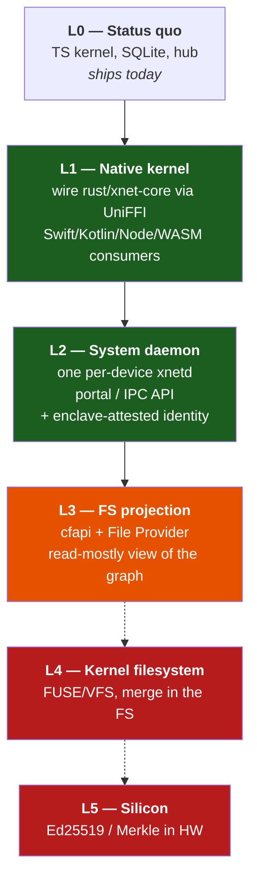
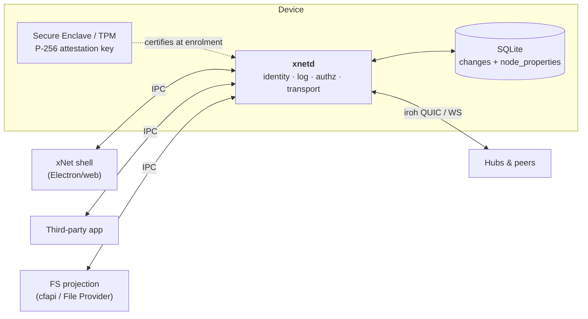
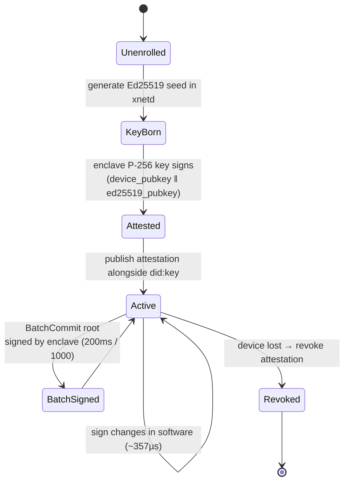

# xNet At The OS Level — Kernel, Filesystem, And Silicon

## Problem Statement

Today xNet is an application-layer facility: a TypeScript kernel
(`packages/sync`, `packages/core`) over SQLite, spoken between browser tabs,
an Electron shell, and a Node hub. Every process that wants to participate
must link the library.

The question this exploration takes seriously: **what if it weren't?** What
does xNet look like when the sync primitives live *below* the application —
in a Rust systems crate, in a system daemon, in the filesystem itself, or
baked into the processor? What does an OS designed to read this structure
natively actually do differently?

The prompt's framing is that this is "not an application layer detail, it's
an OS layer detail." That framing deserves both a serious build-out and a
serious challenge, because thirty years of prior art says the filesystem is
where this idea goes to die — and the reasons are precise, documented, and
mostly *not* the ones people expect.

## Executive Summary

**The seam is already cut, and it is cut in the right place.** `rust/xnet-core/`
is a real 414-line Cargo crate with four dependencies that already implements
identity, canonical JSON, change hashing, Ed25519 sign/verify, LWW, negotiation,
and authorization — and passes the same golden vectors as the TypeScript,
Swift, and Python kernels. `docs/specs/protocol/` pins L0–L3 normatively.
"Rewrite the kernel in Rust" is not a proposal; it is 80% done and unwired.

**The filesystem is the wrong target, and the evidence is overwhelming.**
Every filesystem examined gives you cryptographic identity *or* concurrent
writability, never both, and none gives you a merge function. fs-verity files
are literally unwritable by kernel design. ZFS/Btrfs `send` presupposes a
single writer per dataset. The mismatch is at the **interface**, not the
storage layer: `stat()` returns one mtime, `read()` returns one byte stream,
and POSIX has nowhere to put two concurrent heads. Coda's entire vocabulary
for "a human must decide" was **to make the file look broken** (a dangling
symlink). Ficus dispatched merge logic by **regex on the filename**, because
Unix has no types. Both reached the same split independently: directories
merge, file contents do not.

**"Bake it into the processor" is a clean no, and it doesn't matter.** There
is no Ed25519 instruction on any shipping general-purpose CPU — x86, ARMv9.7,
and ratified RISC-V `Zvk*` all cover symmetric crypto only. Ed25519 verify
throughput has been flat for a decade (Skylake 2015 and Zen 4 2023 within
~10%). QAT has no EdDSA at all. BlueField-3's entire PKA subsystem is beaten
by one x86 core doing Ed25519 in software. Computational storage is
commercially dead — zero shipping products implement NVMe TP4091.

It doesn't matter because **exploration 0357 already won that fight in
software**: 10k-change hub ingest went 250 s → 570 ms via batch framing plus
the WebCrypto verify seam. Silicon was never the bottleneck.

**But there is a real OS-level opportunity, and it is three seams, none of
them the filesystem:**

1. **A system sync daemon** — one per-device process holding the identity, the
   log, and the transport, exposed to every application via a portal/IPC API.
   This is the only public design anyone is working on (GNOME/Modal, and it's
   a sketch). `packages/hub` is already daemon-shaped.
2. **Hardware-attested device identity** — and here the research produced a
   genuinely new finding for this repo. Chrome's whole-fleet Windows telemetry
   shows TPM ECDSA at **P50 200 ms / P95 600 ms** — five signatures per second,
   which kills per-change hardware signing outright. But **0357's `BatchCommit`
   inverts it**: one hardware signature over a 1000-change root amortises to
   **0.2 ms/change, cheaper than the ~350 µs software Ed25519 it replaces**.
   If hardware ever enters the signing path, it signs the batch root, never the
   change. That is an argument this repo can only make *because* 0357 shipped.
3. **The filesystem as a read-mostly projection** — Windows `cfapi` and macOS
   File Provider give you *presentation* (placeholders, hydration-on-demand,
   Finder integration), not sync. Files become an export view of the graph.
   `.xnetpack` is already the honest version of this.

**Recommendation: pursue L1 (wire the Rust kernel) and L2 (system daemon),
prototype L3 (FS projection) behind a flag, and explicitly reject L4 (kernel
filesystem) and L5 (silicon).** The ladder is in Options; the reasoning is
that L1/L2 are mostly-built and unlock real capability, L3 is presentation
polish with a known-bad cost curve, and L4/L5 are the two rungs where every
prior attempt died.

## Current State In The Repository

### The portable kernel already exists

This is the finding that reframes the whole exploration. The repo does not
need a Rust rewrite proposal — it needs a Rust *wiring* proposal.

| Implementation | Path | Status |
|---|---|---|
| TypeScript (canonical) | `packages/sync/src/change.ts` | Live, ships |
| Rust | `rust/xnet-core/src/lib.rs` | 414 LOC, passes vectors, **bindings ungenerated** |
| Swift | `swift/XNetKit/` | SwiftPM package |
| Python (reference) | `conformance/reference/python/xnet_kernel.py` | 140 LOC |
| Golden vectors | `conformance/vectors/{change,lww,batch-commit,identity,replication,authz,authz-actions}/` | Shared corpus, all four pass |
| Normative spec | `docs/specs/protocol/{00..05,90}` | RFC-2119, layers L0–L3 |

`rust/xnet-core/README.md` makes the strongest claim in the repo:

> **Re-sign, byte-for-byte.** Unlike the Swift/CryptoKit kernel (whose Ed25519
> is randomized), `xnet-core` reproduces a TypeScript-produced signature
> **exactly**

So Rust is already the *most* faithful implementation — the only one that can
regenerate golden vectors rather than merely verify them. It hand-implements
Ed25519 on `curve25519-dalek` rather than using `ed25519-dalek`, to get the
deterministic RFC-8032 construction and cofactorless verify that match the
TypeScript byte-for-byte (`rust/xnet-core/src/lib.rs:36-102`).

Dependencies are deliberately four: `curve25519-dalek`, `sha2`, `blake3`,
`serde_json`. Base58 and canonical JSON are inline
(`rust/xnet-core/Cargo.toml:12-14`).

The FFI surface (`rust/xnet-core/src/ffi.rs`) is already all
`String`/`Vec<u8>`/`bool` for UniFFI + C ABI:

```rust
did_from_seed(seed: Vec<u8>) -> String
public_key_for_did(did: String) -> Vec<u8>
canonical(json: String) -> String
change_hash_for(unsigned_json: String) -> String
sign_change_for(unsigned_json: String, seed: Vec<u8>) -> Vec<u8>
verify_change_for(unsigned_json: String, signature: Vec<u8>, public_key: Vec<u8>) -> bool
negotiate(ours: Vec<String>, theirs: Vec<String>) -> String
authorize(expression_json: String, roles: Vec<String>, is_authenticated: bool) -> bool
```

**The blocker is mundane**: `crate-type` is `["lib"]`, and the README records
that the uniffi toolchain was unavailable in an offline build. The steps are
written out and unexecuted.

Three prior explorations circle this and all remain `[_]`:
`0086_[_]_NATIVE_REWRITE_ZIG_RUST.md`,
`0121_[_]_WASM_AND_NATIVE_KERNELS_FOR_CRYPTO_SYNC_AND_CRDT_OPTIMIZATION.md`,
`0210_[_]_NATIVE_SWIFT_SDK_AND_PORTABLE_MULTI_LANGUAGE_CORE.md`. The fourth,
`0200_[x]_PORTABLE_XNET_PROTOCOL_BOUNDARIES_AND_STANDARD.md`, is checked off —
it defined the L0–L3 spec boundary that the Rust crate implements. **The
boundary shipped; the binding didn't.**

### What a change actually is

`packages/sync/src/change.ts:44-104`, `CURRENT_PROTOCOL_VERSION = 4`:

```ts
export interface Change<T = unknown> {
  protocolVersion?: number   // undefined = legacy v0
  id: string
  type: string               // 'yjs-update', 'create-item', …
  payload: T                 // sparse — only changed properties
  hash: ContentId            // cid:blake3:<hex>
  parentHash: ContentId | null
  authorDID: DID
  signature: Uint8Array      // Ed25519, 64 B raw
  wallTime: number           // display only, NOT ordering
  lamport: number
  batchId?: string; batchIndex?: number; batchSize?: number
}
```

Three details are load-bearing for *any* reimplementation, all already pinned
by vectors, all easy to get wrong:

1. **A change is signed over the UTF-8 bytes of its hash *string*** —
   `"cid:blake3:<hex>"` — not over the raw 32-byte digest
   (`docs/specs/protocol/01-primitives.md:45-47`,
   `packages/sync/src/change.ts:238-251`).
2. **LWW string comparison is UTF-16 code-unit, never `localeCompare`**
   (`packages/core/src/lww.ts:14-16,102`). ICU collation is non-deterministic
   across versions and would break convergence. Vector:
   `0004-tie-author-case-codeunit`.
3. **Ed25519 batch verification is deliberately avoided**
   (`packages/crypto/src/signing-fast.ts:20-26`) — it checks the cofactored
   equation and can disagree with single verification on adversarial inputs
   (ZIP-215), which would let two replicas legitimately disagree on validity
   and split convergence.

The v4 LWW ladder (`packages/core/src/lww.ts:91-104`) is
**lamport → wallTime → v4 tiebreak key → author DID**, where the v4 key is
`blake3(author ‖ 0x1F ‖ propertyKey ‖ 0x1F ‖ canonicalJSON(value))`. The
rationale (`lww.ts:18-30`) is that a `did:key` is an attacker-chosen function
of a keypair, so the pre-v4 raw-DID rule let an attacker grind a vanity DID
that wins every concurrent tie against every honest peer, permanently.

### Storage: SQLite, schema v9

`packages/sqlite/src/schema.ts:9`. The `changes` table (`schema.ts:130-143`):

```sql
CREATE TABLE IF NOT EXISTS changes (
    hash TEXT PRIMARY KEY,
    node_id TEXT NOT NULL,
    payload BLOB NOT NULL,
    lamport_time INTEGER NOT NULL,
    lamport_peer TEXT NOT NULL,
    wall_time INTEGER NOT NULL,
    author TEXT NOT NULL,
    parent_hash TEXT,
    batch_id TEXT,
    signature BLOB NOT NULL,
    FOREIGN KEY (node_id) REFERENCES nodes(id) ON DELETE CASCADE
);
```

Materialised state is in `node_properties` (`schema.ts:40-54`) keyed
`(node_id, property_key)` with the LWW stamp inline, guarded by
`lwwUpdateGuardSql` (`packages/core/src/lww.ts:139-163`) so the JS and SQL
comparison paths stay byte-identical. There is no separate OPFS log — OPFS is
the VFS *under* SQLite, with a leader/router-worker plus reader pool
(`packages/sqlite/src/adapters/web-leader.ts`, `reader-pool.ts`).

Blobs chunk at 256 KB above a 1 MB threshold with a Merkle `rootHash`
(`packages/storage/src/chunk-manager.ts:13-16`).

### The daemon and the file already exist in embryo

- `packages/hub` ships `bin: { "xnet-hub": "./dist/cli.js" }` with SQLite,
  memory, and Litestream storage backends. This is the closest thing to a
  system daemon in the repo today.
- `packages/native-bridge-extension` is **not** sync infrastructure — it's a
  Chrome extension plus a native-messaging host (stdio, 4-byte-LE
  length-prefixed JSON frames) to reach a local LLM without a loopback port.
  But it is a *precedent for the transport shape* a system daemon would use.
- `.xnetpack` (`packages/data/src/portability/types.ts:4-9`) already states
  the correct relationship between files and sync:

  > A bundle is the sync protocol written to disk … Export is "sync-to-disk";
  > import is verify-then-replay through the same apply path the sync layer
  > uses, **so a bundle behaves like a peer that happens to be a file.**

  That sentence is the honest FS story. A file is a *peer*, not a *store*.

### The numbers we are designing against

From `0350` and `0357` (single machine, M-series, Node 22 — carry that caveat):

| Operation | Cost |
|---|---|
| Full sign pipeline (canonicalise + BLAKE3 + Ed25519) | **357 µs** |
| Ed25519 verify, pure-JS `@noble` | 1,427 µs |
| Ed25519 verify, WebCrypto native | **101 µs** (~13×) |
| Envelope on the wire | **~554 B** (hash 75 B, parent 75 B, sig 88 B b64, DID carried **twice** ≈ 110 B) |
| 10k-change hub ingest, before 0357 | ~250 s (wire-bound) |
| 10k-change hub ingest, after 0357 | **570 ms** (17,544/s) |
| Projected 10k client sign, Tier 1+2 | ~0.11 s |

And the framing number from `0350`: an xNet change costs ~360 µs of crypto
against ~10–50 µs for an indexed SQLite `UPDATE`. The signed log is roughly a
10–35× tax on write, paid for verifiability.

## External Research

### The one platform that built this on purpose

**Windows Cloud Files API (`cfapi`)**, shipped Windows 10 1709, October 2017.
Kernel minifilter `cldflt.sys` proxies to a user-mode engine. Placeholders
cost 1 KB; three states (placeholder / full / pinned full); hydration policy
is `max(app, provider)` fixed at open time. Genuinely good shell integration.

Limits that matter: **NTFS only**, desktop apps only, and callbacks cover
delete/rename but **not create or content edit** — you run your own watcher.
Placeholders are reparse points hidden from all processes except sync engines,
because apps misidentify them as symlinks. That last one is a load-bearing hack.

### macOS is bifurcated in a way that blocks the obvious design

**FSKit** (WWDC 2024, publicly usable macOS 15.4, March 2025) is `FSUnaryFileSystem`
only — one `FSResource` → one `FSVolume`. Apple DTS, verbatim: *"Network file
systems don't mount on `/dev` nodes and thus aren't supported by FSKit."* No
hydration, no network. Apple ships its own ExFAT/FAT32 on it, but third-party
extensions are currently broken on macOS 26, reproducing against Apple's own
sample code (FB18230524), and an April 2026 report shows FSKit mounts reporting
0 B free.

**File Provider Extensions** is the sanctioned hydration path — the one Dropbox
was forced onto when Apple removed cloud kext support in macOS 12.3 (March
2022), ~4 years after Catalina deprecated them. What it cost, from Dropbox's own
support docs: **LAN Sync removed entirely**, forced relocation to
`~/Library/CloudStorage/`, an **8,096-char path cap**, degradation past
**300,000 files**, and OS-controlled throttling ("sync performance may slow…
when your computer has low battery… or is running hot").

That last item is the strategic point. **On macOS, going through the OS means
the OS decides when you sync.**

### Linux has the most capability, least productisation

- **FUSE passthrough**, kernel 6.9 (May 2024), driven by Android. Random reads
  ~2×, sequential writes ~3× — but only for already-open files.
- **FUSE over io_uring**, kernel 6.14 (March 2025). RFC v1 claimed DIO reads
  3.58×, file creates 2.67× (44,426/s vs 16,628/s). **Be skeptical** — the v8
  cover letter that actually merged warns performance "will be lower, as several
  optimization patches are missing," and libfuse still requires manual
  compilation from the `uring` branch.
- **fanotify pre-content events** (`FAN_PRE_ACCESS`, ~6.14). Meta chose this
  over FUSE deliberately. Josef Bacik, verbatim: *"If the FUSE daemon crashes,
  suddenly applications start crashing in production; the fanotify solution is
  more self-contained."* Privileged-only, and the page-fault hook for lazy mmap
  population **was merged and reverted**.

**Rust in-kernel filesystems do not exist.** The Rust VFS abstractions never
merged. RFC v1 Dec 2023 → RFC v2 May 2024 (with a ~600-line read-only Rust ext2
driver) → Wedson Almeida Filho left in August 2024 citing "nontechnical
nonsense," and the effort lost its driver. Everything proposed was **read-only,
page-cache-backed**; no write path was ever on the table. The *policy* fight is
over (Rust declared non-experimental at the Maintainers Summit, 10 December
2025), but merged Rust is drivers, not filesystems. PuzzleFS currently ships
as FUSE.

### Filesystems that already Merkle — and why none of them help

They fail for two structurally different reasons.

**Group A buys tamper-evidence by giving up writability, permanently and by
design.** fs-verity (ext4/f2fs since 5.4, btrfs since 5.15): SHA-256 over 4K
blocks, 128 hashes per block, lazy per-block verification on read that ascends
only until it hits an already-verified block. Kernel docs, verbatim: *"Verity
files are readonly. They cannot be opened for writing or truncate()d, even if
the file mode bits allow it."* **There is no `verity_update(range)`.** Same for
dm-verity and APFS SSV.

**Group B buys writability by giving up cryptographic identity and any notion of
merge.** ZFS puts checksums in the *parent* block pointer — the most rigorous
Merkle structure here — but the default fletcher4 is not cryptographic, and
`zfs send` presupposes a **single writer per dataset**: strictly one-way, no
merge (incremental receive demands a byte-identical base, and `-F` *destroys*
the receiver's divergent snapshots), whole-dataset granularity. Btrfs is
CRC32C by default with RAID56 still "unstable" in 2026. bcachefs was **removed
from the kernel entirely in 6.18**, commit `f2c61db29f`, 117,000 lines deleted.

The composed gap: a sync engine needs content identity + concurrent writability
+ a merge function. Group A gives you (1) and forbids (2). Group B gives you (2)
and neither (1) nor (3) — its history is a **linear chain of snapshots with a
single writer**, not a DAG with multiple heads.

The closest existing thing is **composefs** — an fs-verity-sealed image whose
manifest names backing files by digest. Genuine content-addressing with
kernel-enforced verification, and definitionally read-only.

### Why FS-level sync lost — and it wasn't the algorithm

The usual explanation is wrong. Optimistic replication *works*;
Satyanarayanan's own retrospective (TOCS 20(2), May 2002) lists "Fear Not
Optimistic Replication" as lesson #1.

**Ficus** (Reiher et al., USENIX 1994, nine months, UCLA): 14,142,241 updates,
489 update/update conflicts = **0.0035%**. Three caveats gut the naive reading:

- Only **162 of 489 (33%) were actually auto-resolved**; 151 (31%) were "not
  clearly resolvable." Of 226 name/remove conflicts, **zero** resolved
  automatically.
- The aggregate hides a **35× spread**: disconnected+shared volumes ran
  **0.0245%** vs office+private at 0.0007%. *The regime local-first targets is
  35× worse than the headline.*
- Users acted as a human write token, scheduling reconciliation around their own
  movement.

**Ficus's resolver architecture is the most damning artifact in the
literature** — merge logic dispatched by **regex on the pathname**
(`\.newsrc → /bin/newsrc_resolver`), because, in their words, *"Since Unix
systems do not provide a typed file system, Ficus infers file types from file
names."* Application semantics smuggled into the kernel via filename guessing.
(The conflict log is itself replicated, so it conflicts, so it needs its own
resolver.)

**Coda** (SOSP '91 / TOCS '92): hoarding/emulation/reintegration, 1–2 day
disconnections. The load-bearing sentence, §4.5.2: ***"In the case of a store of
a file, the entire reintegration is aborted."*** Not the file — the entire
reintegration. Directories merge; files don't. The same split as Ficus, reached
independently.

Coda §5.3 warned in 1992 that "extended voluntary disconnections will lead to
many more conflicts"; Ficus measured 20–40× in 1994. That prediction →
confirmation pair is the strongest result in this area.

**The single best piece of evidence for "the FS has no way to express
intent":** Coda needed to tell a human "repair this." It couldn't pop a dialog
(unattended programs) or raise an exception (legacy apps). The solution, from
the 2002 retrospective: **represent a conflicted object as a dangling symbolic
link**, chosen because "even the most poorly written legacy applications
typically cope with failed attempts to open files." *The filesystem's entire
vocabulary for "a semantic decision is required" is to make the file look
broken.*

The UCLA arc is the deployment-friction tell: kernel-level Ficus → **user-level
Rumor**, explicitly "making distribution, installation, and porting easier,"
accepting that "Rumor has no opportunity to trap each open or write of a file."

What actually killed Coda, per Satyanarayanan: IBM legal encumbrance until late
1995 — *eight years in* — and at 15 years, *"the system is not yet of production
quality."* Status July 2026: coda-8.1.6 (Apr 2025), **142 stars, one maintainer**.

**The Scalar lesson is the most important single datapoint.** VFS for Git died
because Apple deprecated the kernel features Microsoft needed for the macOS
port, *and* because the actual bottleneck turned out to be a **quadratic pattern
matcher in sparse-checkout** — one scenario took 40 minutes. Cone mode fixed it
in the application; a prototype "demonstrated performance matching VFS for Git."
Scalar was rewritten from .NET to C in **under 3,000 lines while deleting 10×
that much**, and landed in core Git v2.38.0. **Microsoft owned the Windows
filesystem virtualization driver and abandoned it for their own flagship use
case, replacing it with an application-level mechanism that matched its
performance in one-tenth the code.** Microsoft's docs now redirect ProjFS users
to cfapi.

Sanity check on "app-layer won because it was better": Pierce QuickCheck-tested
the winners (*Mysteries of DropBox*, ICST 2016) and found **"Dropbox can lose
data completely."** App-layer won *despite* shipping incorrect systems. That
measures how decisive the deployment and semantics advantages were.

And the convergent-evolution finding — Pierce (2004): *"It is not generally
possible (at least, in any portable fashion) for user programs to get access to
a log or trace of updates to the filesystem."* So every app-layer synchroniser
independently reinvents a persisted last-synced snapshot: Unison's *archive*,
Dropbox's *Synced Tree* ("the key innovation"), Syncthing's index, Rumor's scan.
Four teams, three decades, one shape — **and every one refuses to merge**,
punting upward. That refusal is the load-bearing design decision, not a
limitation.

### The POSIX impedance mismatch, itemised

Five properties a signed change log needs, all withheld:

**Intent-free.** `write(fd, buf, len)` says "these bytes now occupy this range."
Insert-at-*k* and overwrite-at-*k* produce identical syscall traces. Nor is it
atomic — Dan Luu, *Files are hard*: "if there's a crash during the write, we
could get `a boo`, `a far`, or any other combination." **Appends aren't safe
either**: "appends don't guarantee ordering or atomicity" — which hits the
natural encoding of an op-log directly.

**Identity-free.** Write-temp→fsync→rename is *the* crash-safe idiom, and it
replaces the inode: every watcher sees delete+create. Syncthing has carried
rename-detection issues (#1677, #5689) for years. And POSIX's rename atomicity
**doesn't cover crashes**.

**The tree-move result is a genuine mathematical mismatch, not an implementation
gap.** Kleppmann, Mulligan, Gomes & Beresford (*IEEE TPDS* 33(7), Oct 2021)
"demonstrate bugs in Google Drive and Dropbox that arise with concurrent moves."
Nair et al. (2021): "concurrent moves can lead to incorrect states and even data
loss… ultimately, **only one of the conflicting moves may be allowed to take
effect.**" CRDTs merge everything *except* where the target structure has a
global invariant (acyclicity) that concurrent ops can violate. A filesystem is
exactly such a structure.

**Transaction-free.** No multi-file commit. Pillai et al. (OSDI 2014):
**11 applications, 60 static / 156 dynamic crash vulnerabilities, failures in
over 4,000 crash states, data loss in 7**, across 16 filesystem configurations.
Only **3** were fixable by the write-before-rename folk heuristic.

**Causality-free.** mtime is the only clock, and it's racy. Syncthing's tiebreak
when mtimes are equal: **the device with the larger first 63 bits of its device
ID.** That is what you design when you have no causality information — and it is
precisely the vanity-grinding vulnerability `packages/core/src/lww.ts:18-30`
fixed in v4.

**xattrs are not a viable metadata channel.** VFS limit is 64 KB, but ext2/3/4
require *all* of a file's xattrs to fit in a single filesystem block — **~4 KB
on default ext4**. And they're routinely stripped in transit, so CRDT metadata
in xattrs silently degrades to *no* metadata the moment it crosses a service
that drops them. This directly threatens the GNOME portal sketch (below), which
proposes attaching sync context to files as xattrs.

**The SQLite-in-a-sync-folder case is the cleanest illustration**, and it is
directly ours, since `packages/sqlite` *is* the store. SQLite's own *How To
Corrupt* doc names three mechanisms, all routine sync-engine behaviour: broken
network-filesystem locking; **sidecar mispairing** ("Copying a database file
without also copying its journal") — a direct hit on the no-multi-file-transaction
problem; and torn mid-transaction backups. Zotero states it outright: storing
the data directory in cloud storage "is **extremely likely to corrupt your
database**." **Files have no invalidation protocol.**

Ink & Switch's 2019 essay names it precisely: file-sync tools work "in any
format," which is "both a strength (compatibility with any application) and a
weakness (**inability to perform format-specific merges**)." *The universality
of the file abstraction is purchased by discarding exactly the information a
merge needs.*

### Silicon: two useful results, everything else a no

**Hash acceleration is real, shipping, and universal.** SHA-NI: Intel Goldmont
2016, AMD Zen 2017, Intel Rocket Lake desktop 2021. Measured **~2.1 cycles/byte
with SHA-NI vs ~8.5–9.1 optimised software** — a consistent **~4.2×**. ~1.4–1.9
GB/s single core. Crucially the speedup holds at **64 bytes** (4.3×) — no
offload cost, no minimum message size. All Apple M-series have the ARMv8 crypto
extensions (M4 Pro **2.92 GB/s P-core, 0.64 GB/s E-core** — a real hazard for
background-QoS work).

**The BLAKE3 finding cuts against this repo's choice.** The BLAKE3 paper's
"12× faster than SHA-256" was measured on Cascade Lake-SP, **which has no
SHA-NI** — comparing BLAKE3-with-AVX-512 against SHA-256 on the software path.
Corrected for modern hardware it is **~3×, not 12×**, at long inputs. And at
small inputs SHA-256 **wins outright**, because BLAKE3 has **no SIMD parallelism
below 4 KiB** and degrades to a trimmed BLAKE2s, while SHA-NI is already at 2.66
cpb at 256 B. **Crossover is ~4 KiB.**

xNet hashes ~500-byte change envelopes with BLAKE3
(`packages/sync/src/change.ts:205-229`). On SHA-NI hardware that is likely a
*regression* versus SHA-256. It is also correct to keep it — see Risks — but the
repo should know this is true rather than believe the folklore.

**There is no Ed25519 instruction on any shipping general-purpose CPU.**
Confirmed across all three ISAs: x86 has only generic bignum helpers (`MULX`,
`ADCX/ADOX`, AVX-512 IFMA at ~1.5×); ARM's Cryptographic Extension is **entirely
symmetric**, and Arm's 2024 (v9.6-A) and 2025 (v9.7-A) announcements add **zero
cryptographic instructions of any kind**; ratified RISC-V `Zk*`/`Zvk*` cover
AES/SHA-2/SM3/SM4/GHASH and nothing else — the spec states it "will not try to
anticipate new useful low-level operations." Carry-less multiply is GF(2ᵐ)
arithmetic, useless for Curve25519's prime field.

Consequence: SUPERCOP shows **Skylake (2015) and Zen 4 (2023) within ~10% on
Ed25519 verify** (~111K vs ~118K cycles). Verification throughput has not
improved in a decade, precisely because nobody added an instruction. And **verify
is ~4× more expensive than sign** — the wrong way round for a hub.

**QAT, DPUs, computational storage, CXL — all no, for the same reason.** QAT has
**no EdDSA at all** and defaults to refusing offload below 2048 bytes.
BlueField-3 inline crypto is AES-GCM only, no DOCA signing API, and its PKA
measured ~12,491 RSA-2048 sign/s — **one ordinary x86 core doing Ed25519 in
software beats the DPU's entire PKA subsystem.** Computational storage is
commercially dead: zero shipping products implement NVMe TP4091, Linux never
received a patch proposal, Samsung SmartSSD discontinued, NGD shut down. CXL
ships at 2.0 with measured *worse* latency than plain NUMA (214–394 ns vs
191–193 ns cross-socket) and no client CPU has ever shipped it.

**Every one is a throughput amplifier with a fixed per-operation entry cost, and
a 554-byte change is smaller than that cost.**

**Enclaves: P-256 or nothing.** No `SecureEnclave.Curve25519` type exists in
CryptoKit — the constraint is structural in the type hierarchy. **No EdDSA in
any shipping TPM**: the Library Spec didn't define the *operation* until v1.85
(July 2025), and PC Client Platform TPM Profile v1.07 (23 March 2026) contains
zero occurrences of "EdDSA", "25519", or "448". TPMScan (CHES 2024) dumped 78
firmwares across 6 vendors — zero hits. Android TEE is the exception (Ed25519
mandatory since KeyMint 2), but **StrongBox normatively excludes curve 25519**.

**And the performance finding kills "hardware signs everything" more decisively
than the algorithm finding.** Chrome's DBSC telemetry across the entire Windows
install base: **P50 200 ms / P95 600 ms** for ECDSA P-256 — **five signatures per
second**. Against ~357 µs/change software Ed25519 that is ~560× slower at P50.
Also only ~60% of Windows machines have a usable TPM.

**But `BatchCommit` inverts the arithmetic.** One hardware signature over a
1000-change root amortises 200 ms to **0.2 ms/change** — *cheaper than the
software Ed25519 it replaces*. This is the single most actionable silicon finding
in the report, and this repo can only exploit it because 0357 already shipped the
batch envelope.

**Post-quantum, for planning:** ML-DSA-44 signatures are 2,420 bytes — **484%
overhead** on a ~500-byte change vs Ed25519's 12.8%. A batch-commit design
amortises this to ~2.4 bytes/change. **Per-change signatures at rest are the line
item that would make PQ migration expensive**, which is a second, independent
argument for the batch envelope. Note the inversion: ML-DSA-44 signing is ~7.6×
slower than Ed25519 but verification is ~1.25× *faster*.
`packages/crypto/src/hybrid-signing.ts` exists (446 LOC) and is not on the
`Change<T>` path (`change.ts:22-24`).

### What is actually shipping in this direction (2025–2026)

**Nothing, and one team is trying.**

- **GNOME/Modal/p2panda** is the only public OS-level design. Reflection is a
  native GTK collaborative editor shipping via **Flathub Beta only**, waiting on
  p2panda 1.0, **without access control or E2EE**. Tobias Bernard describes a
  **"system-level sync service"** exposing p2panda networking (including iroh)
  as a **portal API**, or a file-share portal attaching sync context to files as
  xattrs. His own words: *"There are still a lot of open questions here."*
  At **Local-First Conf 2026** (Berlin, 12–14 July, sold out), of ~29 talks
  **exactly one is OS-level** — theirs. Same at FOSDEM 2026: 23 talks, one.
- **Ink & Switch is not building an OS.** GAIOS, the one candidate, is "a
  malleable, collaborative software platform derived from our Patchwork
  project." The "OS" is not an operating system.
- **iroh 1.0 shipped 15 June 2026** — wire-protocol stability across languages,
  ~95% hole-punch success, 200M endpoints via public relays in 30 days.
  Pre-1.0 public relay support ends **30 Sept 2026**. Relevant to
  `0310_[_]_IROH_INTEGRATION`. Correction to a prior note: **iroh-docs is not
  deprecated** (0.101.0, 15 June 2026) but is a weak bet — 65 stars, 92K
  downloads vs iroh's 1.2M, pre-1.0 while the parent hit 1.0. **Take iroh as
  transport; own your sync layer.**
- **Sedimentree/Subduction** (Ink & Switch, Beelay superseded): interpret the
  commit hash's **leading zero bytes of BLAKE3** as a stratum level, giving
  content-determined compaction boundaries — so two peers independently
  compacting the same history produce *identical* strata, which is what makes
  summary comparison work. Best mental model: **an LSM tree for CRDT graph
  data**. README says **"very unstable API… DO NOT use for production."**
- **ATProto** is the closest shipping thing. Its MST hashes the key with
  SHA-256, counts leading binary zeros, divides by two → layer (fanout 4) while
  the tree stays sorted by plain key, yielding **history independence** (root CID
  is a pure function of the key set) and diffs that are just "which CIDs do I
  lack." Honest scale: ~43.5M registered accounts but **~600,000 daily posters**
  (April 2026, down from ~1.4M peak); self-hosting well under 0.1%. Two
  structural caveats: `prev` is conventionally `null`, so a repo is **not** a
  hash-linked chain — tamper-evidence is per-*state*, not per-*history*; and
  Jetstream, the dominant consumption path, **strips signatures and MST nodes**.
- **The best idea in the stack is Sync v1.1's inductive verification**: relays
  went non-archival, `prevData` was added, and consumers apply the ops list **in
  reverse** against the partial tree — if ops are complete, the result must equal
  `prevData`. Verify initial state, verify each transition, current state is
  verified by induction **without ever storing the full repo**. Relay cost fell
  from ~16 TB NVMe / $150+/mo to a **$34/month VPS with 21 GB**. Steal this.
- **The commercial tier abandoned the distinctive part.** Electric SQL's pivot
  post, verbatim: *"Electric Next is a sync engine, not a local-first software
  platform"* and, under a heading titled "A note on finality of local writes,"
  *"we are committed in the longer term to building support for finality of local
  writes. **However, it is no longer a key tenet of the system design.**"* Two
  years on it hasn't returned. Their adoption inversion tells the story:
  **PGlite does 10.8M downloads/week vs the sync client's 800K — 13:1.**
- **Apple has announced nothing**: CKSyncEngine is still the iOS 17 (2023) API.
  No WWDC 2025/2026 OS-level sync announcement.
- **Triplit is dead** — acquihired by Supabase Oct 2025, `triplit.dev` returns
  **410 Gone** — yet shows ~88,600 downloads/week *rising*, the signature of
  mirror traffic. Neither Triplit, Fireproof, nor Verdant carries a deprecation
  notice. *Method caution: npm downloads and GitHub timestamps lie badly in this
  sector.*

## Key Findings

1. **The Rust kernel exists and is unwired.** `rust/xnet-core` passes the
   conformance corpus and is the only implementation that reproduces TypeScript
   signatures byte-for-byte. The blocker is a `crate-type` line and an
   unavailable uniffi toolchain, not design.

2. **The spec already declares the right boundary.**
   `docs/specs/protocol/README.md:29-33` says a conforming implementation agrees
   on L0 primitives, the L1 data model, the L2 wire format, and L3 authorization,
   and treats storage layout, query, and UI as **private**. The kernel candidate
   is exactly L0–L3. What is *not* in Rust — storage, relay, blob chunking,
   `.xnetpack` — is precisely what the spec calls private. Coherent boundary;
   also means "reimplement in Rust" is far further along for the *protocol* than
   for the *system*.

3. **The filesystem cannot express what xNet needs, and this is an interface
   fact, not a storage fact.** No FS provides content identity + concurrent
   writability + merge. POSIX has nowhere to put two heads. Coda and Ficus
   reached the same directories-merge/files-don't split independently, thirty
   years ago.

4. **Going through the OS means the OS governs you.** macOS File Provider cost
   Dropbox LAN Sync, imposed a path cap, degraded past 300k files, and gave Apple
   throttling control over sync timing. That is a sovereignty cost the Charter
   should weigh, not just an engineering one.

5. **Microsoft ran this experiment and reversed it.** VFS for Git → Scalar:
   application-level matched filesystem-level performance in one-tenth the code,
   once the real (quadratic, application-level) bottleneck was fixed.

6. **There is no Ed25519 silicon, and verify throughput has been flat since
   2015.** "Bake it into the processor" has no available rung.

7. **Hardware enclaves cannot sign changes but can sign batches.** P50 200 ms
   TPM ECDSA = 5 sig/s, ~560× slower than software per-change. One hardware
   signature per 1000-change `BatchCommit` root = 0.2 ms/change, **cheaper than
   software Ed25519**. This is a new capability unlocked by already-shipped work.

8. **SHA-256 with SHA-NI beats BLAKE3 below ~4 KiB.** The famous 12× was measured
   on a CPU without SHA-NI. Per-change hashing of ~554-byte envelopes is on the
   wrong side of the crossover.

9. **Per-change signatures at rest are the PQ migration liability.** ML-DSA-44 is
   484% overhead per change, ~2.4 bytes/change amortised over a batch commit.
   The batch envelope is quietly also the post-quantum plan.

10. **The 0.0035% conflict rate is a lie of aggregation.** Ficus's
    disconnected+shared regime — the one local-first targets — ran 35× higher,
    and only ~33% of conflicts auto-resolved at all.

11. **The plumbing is arriving years before the OS-level thing.** iroh 1.0 and
    sedimentree/Subduction are exactly what a system sync service needs, and the
    only public design for consuming them at that layer is a GNOME blog sketch
    with unsolved xattr problems.

## Options And Tradeoffs

A ladder, from where we are to the prompt's most aggressive reading.



### L1 — Wire the native kernel (Rust via UniFFI)

**What.** Add `uniffi`, flip `crate-type` to `["lib","staticlib","cdylib"]`,
generate Swift/Kotlin/Python bindings and a C ABI, build an XCFramework,
strangler-fig `swift/XNetKit` over to it, and expose a napi/WASM path for Node
and browser.

**For.** Already written and vector-passing. Removes three parallel
implementations' drift risk in one move. Gives the Swift and future Kotlin SDKs
the *deterministic* signature path the CryptoKit kernel can't provide. Native
Ed25519 verify at ~40 µs vs 101 µs WebCrypto vs 1,427 µs pure-JS. Unblocks
`0210` directly.

**Against.** Adds a Rust toolchain to CI and a cross-compile matrix (aarch64/x86
× darwin/linux/windows/ios/android). Binding drift is a new failure mode. The
crate covers L0–L3 only — storage, relay, blobs, `.xnetpack` stay in TypeScript,
so this is not "the engine in Rust," it's "the kernel in Rust."

**Cost.** Small-to-medium, mostly build plumbing. This is the highest
value-per-unit-risk rung on the ladder by a wide margin.

### L2 — A system sync daemon (`xnetd`)

**What.** One long-lived per-device process owning: the device identity, the
local change log, the transport (iroh/QUIC + WebSocket to hubs), and the
authorization evaluation. Applications — xNet's own web/Electron/mobile shells,
*and third parties* — talk to it over a local IPC surface rather than each
linking a full engine.



**For.** This is the *actual* OS-level idea, stripped of the filesystem mistake.
It gives every application on the machine one identity, one log, one battery
budget, one network connection, and one conflict-resolution UI — which is exactly
the set of things that are wasteful and incoherent when each app links its own
engine. `packages/hub` is already 80% of the process shape. It is also the only
place hardware-attested identity can live coherently.

The enrolment flow, which is the part worth designing carefully:



**Honest trade-off**: the Ed25519 key is **not** non-extractable. Hardware
attests it was *born on this device*, not that it never left. That is still a
large improvement over an unattested key, and it is the only design the
performance numbers permit.

**Against.** A daemon is a support surface: install, update, crash recovery,
permissions, code signing, notarisation, and a Windows service story. It is also
a trust concentration — one process holding every app's identity is a juicy
target, and the IPC surface needs its own authorization model (which app may act
as which DID?). And Bacik's warning applies in reverse: if `xnetd` dies, apps
degrade — though unlike FUSE they degrade to *offline*, not to *crashed*, which
is the whole point of local-first.

**Cost.** Medium-to-large. This is the real project.

### L3 — Filesystem as a read-mostly projection

**What.** Use `cfapi` on Windows and File Provider on macOS to *present* the
graph as files — placeholders, hydration-on-demand, Finder/Explorer integration —
with writes either forbidden or funnelled through a narrow, typed path.

**For.** Cheap legibility. "My xNet stuff is in Finder" is a real user win and
costs nothing conceptually if writes don't round-trip. `.xnetpack` already proves
the export direction works.

**Against.** The write path is the whole problem, and it is unfixable:

```mermaid
sequenceDiagram
    participant App as Any app
    participant FS as Filesystem
    participant D as xnetd
    App->>FS: open(tmp); write(bytes); fsync; rename(tmp, doc.md)
    FS-->>D: DELETE doc.md
    FS-->>D: CREATE doc.md
    Note over D: identity lost — is this an edit,<br/>a replace, or a restore?
    D->>D: diff whole file against last-known
    Note over D: intent lost — insert-at-k and<br/>overwrite-at-k are indistinguishable
    D->>D: fabricate a change set
    Note over D: causality lost — mtime is the only clock
```

Plus the macOS costs (path cap, 300k-file degradation, OS throttling, no LAN
sync) and the Windows constraints (NTFS only, no create/edit callbacks).

**Verdict:** worth prototyping *read-only* behind a flag. The moment someone
proposes making it writable, this exploration is the argument against.

### L4 — A kernel filesystem that merges

**What.** The prompt's literal reading: xNet sync primitives in the VFS.

**Against.** This is the rung where Coda, Ficus, Ori, Upspin, and VFS for Git all
died, for four documented reasons — no types for merge dispatch (filename regex),
no channel for "a human must decide" (dangling symlink), deployment friction
(IBM legal cost Coda eight years; Apple's kext revocation cost Dropbox years),
and the fact that once the real bottleneck was fixed in the application, the
kernel bought nothing. Add that **Rust in-kernel filesystems do not exist**
(VFS abstractions never merged, no write path was ever proposed) and that
**bcachefs was removed from the kernel in 6.18** to show how hostile that arena
currently is.

**Verdict: reject.** Not "later" — reject, and record why.

### L5 — Silicon

**Against.** No Ed25519 instruction anywhere; verify flat since 2015; QAT has no
EdDSA; a DPU's whole PKA loses to one x86 core; computational storage is
commercially dead. The only real silicon is SHA-NI/ARMv8 hash acceleration,
which we get for free through whatever library we link, and enclave attestation,
which belongs in L2.

**Verdict: reject as a project; harvest as two library-level facts** (the SHA-NI
crossover, the batch-signing inversion).

### Revenue lanes — the Charter §6 test

This exploration proposes **no new revenue lane**, and that should be explicit,
because L2 has an obvious tempting one: *"xNet Device Attestation Service" —
charge for the enrolment/revocation registry that binds enclave keys to DIDs.*

Applying `docs/CHARTER.md` §6:

1. **Improvement test — FAILS.** Attestation binding is a protocol fact
   computable by anyone holding the two public keys. Charging for it is charging
   for access to something users already own. The registry is not labour we
   uniquely provide; it is a lookup.
2. **BATNA test — FAILS.** If the attestation registry is ours, a self-hosted
   hub's devices are second-class, and self-hosting stops being a real
   alternative. That is a chokepoint tier by another name, which §6 already
   refuses.
3. **Vanish test — FAILS.** If xNet disappeared, every attested device would
   become unverifiable. That is the definition of a lane that must not exist.

**Conclusion: attestation stays a protocol feature, MIT, self-hostable, with the
attestation published alongside the `did:key` and verifiable offline.** The
revenue-legitimate version of L2 is a *managed daemon fleet* — operations we run
for people who don't want to — which passes all three tests for the same reason
managed hubs do. Recorded here so the tempting version is refused in writing
before anyone builds it.

## Recommendation

**Do L1 now, design L2 next, prototype L3 read-only, reject L4 and L5 in
writing.**

Concretely, in order:

1. **Wire `rust/xnet-core` (L1).** It is written, vector-passing, and blocked on
   build plumbing. This is the single highest-leverage move and it retires
   `0210` and most of `0086`/`0121`.

2. **Adopt the batch-signing inversion as the hardware story.** Do not put an
   enclave on the per-change path. Put it on the `BatchCommit` root
   (`packages/sync/src/batch-commit.ts`), where 200 ms amortises to 0.2 ms/change
   and beats software. This also happens to be the post-quantum migration path,
   since ML-DSA's 2,420-byte signature amortises the same way.

3. **Write the `xnetd` design (L2)** as its own exploration, with the IPC
   authorization model — *which local process may act as which DID* — as the
   first section, not the last. Take iroh 1.0 as transport; own the sync layer.

4. **Steal ATProto's inductive verification.** `prevData`-style transition
   verification would let a hub verify current state without storing full
   history — the same lever that took their relay from 16 TB to a $34 VPS. This
   is independent of everything else here and probably the best
   cost-per-line item in the whole report.

5. **Record the FS rejection.** Add the Coda dangling-symlink and Ficus
   filename-regex findings to `docs/decisions.mdx` so "why don't we just put it
   in the filesystem?" has a citable answer.

The one-sentence version: **xNet at the OS level is a daemon and an attested
identity, not a filesystem and not a chip** — and the daemon is the only rung on
this ladder that nobody has already failed at.

## Example Code

### Wiring the Rust kernel (L1)

```toml
# rust/xnet-core/Cargo.toml
[lib]
crate-type = ["lib", "staticlib", "cdylib"]   # currently ["lib"]

[dependencies]
uniffi = { version = "0.28", features = ["build"] }
```

```rust
// rust/xnet-core/src/ffi.rs — annotate the existing surface
#[uniffi::export]
pub fn change_hash_for(unsigned_json: String) -> String { /* unchanged */ }

#[uniffi::export]
pub fn verify_change_for(
    unsigned_json: String,
    signature: Vec<u8>,
    public_key: Vec<u8>,
) -> bool { /* unchanged */ }
```

### The batch-signing inversion (recommendation 2)

The seam already exists — `computeBatchRoot` is a pure function of the change
hashes, so an enclave can sign its output without ever seeing a change:

```ts
// packages/sync/src/batch-commit.ts — today
export function computeBatchRoot(changeHashes: ContentId[]): ContentId {
  return `cid:blake3:${hashHex(encode(changeHashes.join('\n')))}` as ContentId
}
```

```ts
// Proposed: an attested signer that only ever touches the root.
export interface AttestedRootSigner {
  /** ~200ms P50 on TPM; amortised over MAX_COMMIT_CHANGES = 1000. */
  signRoot(root: ContentId): Promise<Uint8Array>
  /** P-256 attestation proving the Ed25519 identity was born on this device. */
  attestation(): DeviceAttestation
}

// Cost model, per change, at batch size 1000:
//   software Ed25519 per change ......... 357 µs
//   enclave P-256 over batch root ....... 200 ms / 1000 = 200 µs   ← cheaper
//   ML-DSA-44 per change ................ 2,420 B envelope overhead
//   ML-DSA-44 over batch root ........... ~2.4 B/change
```

### The write path we are declining to build (L3/L4)

Stated as a test, so the impossibility is executable rather than argued:

```ts
// This test should PASS — and its passing is the reason L4 is rejected.
it('cannot recover intent from a POSIX atomic save', () => {
  const before = 'the quick brown fox'
  const after  = 'the quick red fox'

  // Both of these produce the same syscall trace and the same bytes on disk.
  const asInsert  = { op: 'replace', at: 10, remove: 'brown', insert: 'red' }
  const asRewrite = { op: 'truncate-and-write', bytes: after }

  expect(posixTrace(before, asInsert)).toEqual(posixTrace(before, asRewrite))
  // → write(tmp); fsync(tmp); rename(tmp, doc) — identical in both cases.
  // The filesystem has discarded exactly the information a merge needs.
})
```

## Risks And Open Questions

- **The BLAKE3-vs-SHA-256 finding is real but probably not actionable.**
  SHA-256+SHA-NI likely beats BLAKE3 on our ~554-byte envelopes. But the hash is
  baked into `cid:blake3:` prefixes, every golden vector, four kernels, and the
  v4 LWW tiebreak key. Changing it is a **protocol major** rippling through all
  four implementations for a sub-millisecond win on an operation that costs
  357 µs end-to-end. **Recommendation: document the fact, do not act on it** —
  and revisit only if a binary envelope (protocol v5, `0350`) is opened anyway.

- **Does a daemon violate the Charter's spirit even if it passes §6?** A
  system-level process is a form of centralisation on the device. The mitigation
  is that it must be MIT, self-hostable, and *optional* — apps that link the
  library directly must keep working. Open question: should the daemon be
  discoverable-and-optional, or is a bifurcated path a maintenance trap?

- **IPC authorization is unsolved and is the hard part of L2.** "Which local
  process may act as which DID" is a whole security model. macOS has code-signing
  identity to key off; Linux has essentially nothing portable. This deserves its
  own exploration before any code.

- **Enclave attestation coverage is patchy.** ~60% of Windows machines have a
  usable TPM; StrongBox excludes curve 25519; no shipping TPM does EdDSA. The
  P-256-certifies-Ed25519 design works around all three, but the fallback for
  unattested devices needs to be a first-class state, not an error.

- **WebAuthn PRF is an intriguing alternative worth a spike.** CTAP 2.1
  `hmac-secret` yields a stable 32 bytes, deterministic across assertions and
  empirically stable across devices for a synced passkey — HKDF it into an
  Ed25519 seed and the wire format is unchanged, one gesture per session, nothing
  at rest. **Two warnings**: cross-device PRF sync is *not normatively
  documented* by Apple or Google, and CTAP 2.1 generates two seeds selected by
  whether UV happened, so **`userVerification: "preferred"` — the default in most
  libraries — silently derives an unrecoverable key when UV state changes.** Pin
  to `"required"` or `"discouraged"` from line one.

- **All performance numbers in this doc are single-machine.** The 357 µs / 1.4 ms
  / 570 ms figures are M-series + Node 22, and `0354:331` already flags this.
  The Chrome TPM telemetry is the only whole-fleet number here and it is for
  P-256 on Windows, not for our workload.

- **iroh's pre-1.0 relay deprecation (30 Sept 2026) is a live clock** for
  `0310_[_]_IROH_INTEGRATION`, independent of this exploration.

- **The Ficus 35× spread should change how we test.** If the disconnected+shared
  regime is 35× more conflict-prone than the aggregate, our conflict tests should
  be *weighted toward that regime*, not toward the average. Open question for the
  test strategy.

## Implementation Checklist

**L1 — wire the native kernel**

- [ ] Flip `rust/xnet-core/Cargo.toml` `crate-type` to `["lib","staticlib","cdylib"]`
- [ ] Add `uniffi = "0.28"` and annotate `rust/xnet-core/src/ffi.rs` with `#[uniffi::export]`
- [ ] Generate Swift + Kotlin bindings; build an XCFramework
- [ ] Add a Rust toolchain + cross-compile matrix to CI (aarch64/x86 × darwin/linux/windows)
- [ ] Run `conformance/vectors/` against the *bound* artefact, not just `cargo test`
- [ ] Strangler-fig `swift/XNetKit` onto `xnet-core`; keep the Swift kernel until vectors pass through the FFI
- [ ] Add a napi (Node) and WASM target; benchmark against the WebCrypto seam in `packages/crypto/src/signing-fast.ts`
- [ ] Changeset: no publishable package changes yet (`--empty`) unless the napi build lands in `packages/crypto`

**Batch-signing inversion**

- [ ] Define `AttestedRootSigner` alongside `packages/sync/src/batch-commit.ts`
- [ ] Implement the macOS path (`SecureEnclave.P256.Signing`) and measure real P50/P95 on M-series
- [ ] Implement the Windows path (TPM via CNG) and confirm the Chrome-telemetry ballpark holds
- [ ] Define `DeviceAttestation` as a node type; publish alongside `did:key`, verifiable offline
- [ ] Add golden vectors under `conformance/vectors/attestation/`
- [ ] Add an unattested-device state to the identity model as a first-class value

**L2 — daemon design**

- [ ] Write the IPC authorization model as a standalone exploration (which process → which DID)
- [ ] Prototype `xnetd` from `packages/hub`'s process shape; measure idle RSS and battery
- [ ] Evaluate iroh 1.0 as the daemon transport against the 30 Sept 2026 relay deadline
- [ ] Decide the discoverable-and-optional vs bifurcated question

**L3 — read-only FS projection (flagged spike only)**

- [ ] Windows `cfapi` placeholder spike over an existing workspace, read-only
- [ ] macOS File Provider spike; measure against the 300k-file degradation claim
- [ ] Explicitly do **not** implement a write path

**Record the rejections**

- [ ] Add the L4/L5 rejections to `docs/decisions.mdx` with the Coda symlink, Ficus filename-regex, and Scalar citations
- [ ] Note the SHA-NI/BLAKE3 crossover in `packages/sync/src/change.ts` near `computeChangeHash`, as a documented non-action
- [ ] Record the refused attestation-service revenue lane in this doc's §Recommendation as the §6 receipt

## Validation Checklist

- [ ] `cargo test` in `rust/xnet-core` passes all seven vector suites — **and** the generated Swift/Kotlin bindings pass the same corpus
- [ ] A signature produced by the Rust FFI is byte-identical to one produced by `packages/sync/src/change.ts` for the same seed and unsigned change (the `re-sign byte-for-byte` claim, proven through the binding, not just the crate)
- [ ] Native Ed25519 verify through the FFI measured against the 101 µs WebCrypto and 1,427 µs `@noble` baselines on the same machine
- [ ] Enclave-signed `BatchCommit` at N=1000 measured at **< 357 µs/change amortised** — the claim that makes hardware worth it at all
- [ ] A `BatchCommit` signed by an enclave verifies with the *existing* `verifyBatch` path unmodified (proving the seam is genuinely at the root)
- [ ] Attestation verifies offline, with no network call to any xNet-operated service (the §6 BATNA receipt, testable)
- [ ] Conflict-resolution tests re-weighted toward the disconnected+shared regime; convergence still holds
- [ ] `xnetd` prototype: two applications on one device share one identity, one log, and one hub connection, and a third-party process is *denied* acting as a DID it was not granted
- [ ] The POSIX-intent test in Example Code passes (i.e. the impossibility is executable)
- [ ] `docs/decisions.mdx` answers "why not put it in the filesystem?" with citations, and a fresh reader can follow it without this document

## References

**Repository**

- `rust/xnet-core/{Cargo.toml,README.md,src/lib.rs,src/ffi.rs,tests/conformance.rs}`
- `docs/specs/protocol/{00-overview,01-primitives,02-data-model,03-replication,04-authorization,90-conformance}.md`
- `conformance/vectors/`, `conformance/reference/python/xnet_kernel.py`, `swift/XNetKit/`
- `packages/sync/src/change.ts`, `packages/sync/src/batch-commit.ts`, `packages/sync/src/clock.ts`
- `packages/core/src/lww.ts`, `packages/core/src/hashing.ts`
- `packages/crypto/src/signing-fast.ts`, `packages/crypto/src/hybrid-signing.ts`
- `packages/sqlite/src/schema.ts`, `packages/storage/src/chunk-manager.ts`
- `packages/data/src/portability/types.ts`, `packages/hub/src/ws/guards.ts`
- `docs/CHARTER.md` §6, `docs/explorations/0350`, `0357`, `0344`, `0310`, `0210`, `0200`, `0121`, `0086`

**Prior art — filesystem sync**

- Kistler & Satyanarayanan, "Disconnected Operation in the Coda File System," SOSP '91 / *ACM TOCS* 10(1), Feb 1992 — §4.5.2 reintegration abort
- Satyanarayanan, "The Evolution of Coda," *ACM TOCS* 20(2), May 2002 — "Fear Not Optimistic Replication"; the dangling-symlink repair representation
- Reiher et al., "Resolving File Conflicts in the Ficus File System," USENIX 1994 — 14.1M updates, 0.0035% aggregate, 35× regime spread, filename-regex resolvers
- Kleppmann, Mulligan, Gomes & Beresford, "A Highly-Available Move Operation for Replicated Trees," *IEEE TPDS* 33(7), Oct 2021
- Pillai et al., "All File Systems Are Not Created Equal," OSDI 2014
- Pierce & Vouillon, "What's in Unison?" (2004); Pierce et al., "Mysteries of DropBox," ICST 2016
- Quinlan & Dorward, "Venti: A New Approach to Archival Storage," FAST '02
- Microsoft, VFS for Git → Scalar → core Git v2.38.0 (Oct 2022); ProjFS docs redirect to cfapi
- Dan Luu, "Files are hard"; SQLite, "How To Corrupt An SQLite Database File"

**Platform APIs**

- Windows Cloud Files API (`cfapi`), Windows 10 1709, Oct 2017
- Apple FSKit (WWDC 2024; macOS 15.4, Mar 2025); File Provider Extensions; kext removal in macOS 12.3, Mar 2022
- Linux FUSE passthrough (6.9, May 2024); FUSE over io_uring (6.14, Mar 2025); fanotify `FAN_PRE_ACCESS`
- fs-verity kernel documentation ("Verity files are readonly"); dm-verity; composefs; APFS SSV
- bcachefs removal, Linux 6.18, commit `f2c61db29f`

**Silicon**

- Intel SHA-NI; ARMv8 Cryptographic Extension; RISC-V `Zk*`/`Zvk*` ratified scalar/vector crypto
- BLAKE3 specification (performance measured on Cascade Lake-SP, no SHA-NI)
- SUPERCOP Ed25519 benchmarks, Skylake → Zen 4
- Chrome DBSC TPM signing telemetry (P50 200 ms / P95 600 ms, ECDSA P-256, Windows fleet)
- NIST FIPS 204 (ML-DSA); NIST IR 8547 IPD (EdDSA disallowed after 2035)
- TPM Library Specification v1.85 (Jul 2025); PC Client Platform TPM Profile v1.07 (Mar 2026); TPMScan, CHES 2024
- WebAuthn PRF extension / CTAP 2.1 `hmac-secret`

**Contemporary**

- Ink & Switch, "Local-first software" (2019); Patchwork; sedimentree / Subduction (Beelay superseded)
- iroh 1.0, 15 June 2026; relay deprecation 30 Sept 2026
- ATProto MST and Sync v1.1 inductive verification (`prevData`)
- Electric SQL, "Electric Next" pivot post — "no longer a key tenet of the system design"
- GNOME/Modal Reflection + p2panda; Tobias Bernard on a system-level sync service and portal API
- Local-First Conf 2026 (Berlin, 12–14 July); FOSDEM 2026 local-first devroom
