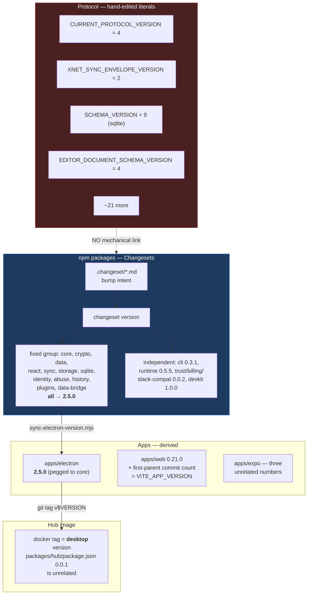
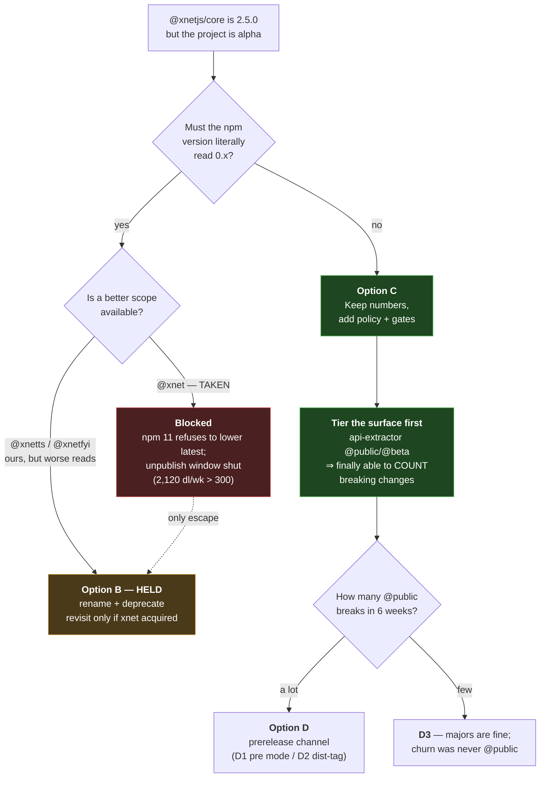
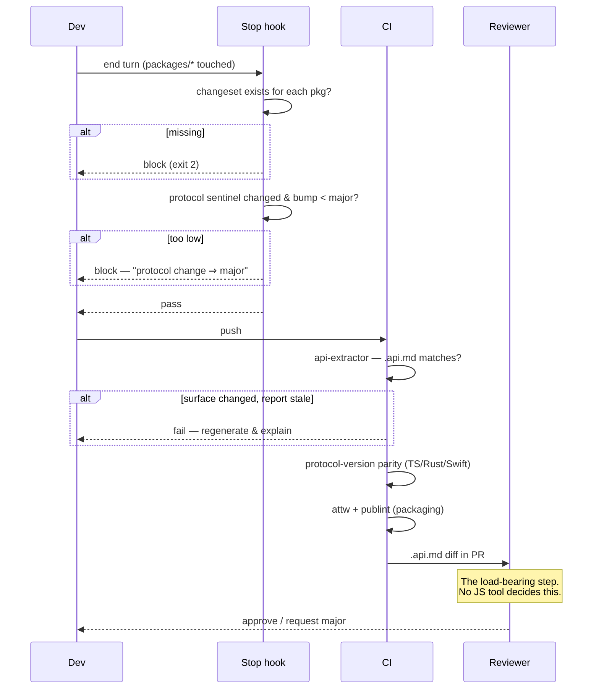
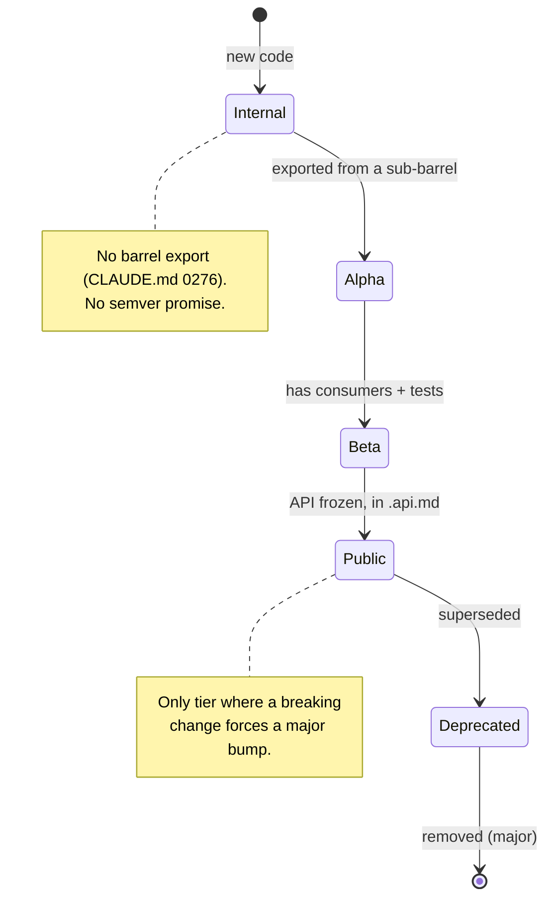

# Version Number Discipline And Renumbering

> **Status:** `[_]` — exploration, not yet implemented.
> **Prompted by:** [#571](https://github.com/crs48/xNet/pull/571) / [#583](https://github.com/crs48/xNet/pull/583),
> which made the site say "alpha" everywhere. The READMEs now say alpha while
> `@xnetjs/core` says `2.5.0`. One of those is lying.

## Problem Statement

We just spent two PRs making every human-readable surface say **alpha**. The
machine-readable surface still says **2.5.0**, published to npm under the
`latest` dist-tag, with no prerelease suffix and no stability policy anywhere in
the repo.

The obvious fix — "renumber everything to `0.x.x-alpha`" — turns out to be
mostly unavailable, and the part that *is* available doesn't buy what we want.
The real question underneath is the one worth exploring:

> **We don't have a version-number problem. We have an unenforced-claim problem.**
> The number is downstream of a discipline we don't currently have any mechanism
> to enforce, and renumbering without that mechanism just moves the lie.

This document covers three things, in increasing order of importance:

1. what renumbering would actually look like (and why the appealing version of it is impossible);
2. what our enforcement machinery does and does not catch today — with receipts;
3. what discipline is achievable, mechanically, this quarter.

## Executive Summary

**Recommendation: do not renumber down. Ship a written stability policy, scope
semver to a surface we can actually hold, and close the four enforcement gaps
that already exist.**

The short version of why:

- **`@xnetjs/core@0.5.0` cannot coherently exist.** npm never lets a version
  string be reused, and since npm 11 it refuses to move `latest` backwards.
  We could publish the string; `npm install @xnetjs/core` would still resolve
  `2.5.0` forever unless we hand-pointed `latest` at a version npm's own
  tooling considers superseded.
- **The unpublish escape hatch is closed.** npm allows post-72-hour unpublish
  only under 300 downloads/week. `@xnetjs/core` currently pulls **2,120/week**
  (§Current State). Whatever that traffic is, it's above the threshold.
- **A true 0.x requires a scope rename, and the good scope is unavailable.**
  `@xnet` is **taken as an npm org** (confirmed by attempting to claim it).
  The remaining options are `@xnetts/*` and `@xnetfyi/*` — both now secured by
  us — neither of which reads as well as `@xnetjs/*`. The rename option is
  therefore *held, not exercised*: see §The Namespace Landscape.
- **0.x buys safety through total friction, not through signalling.** Under
  node-semver, `^0.2.3` and `~0.2.3` are *identical* ranges. 0.x doesn't
  communicate instability to a resolver; it just stops every minor from
  flowing. That's a blunt instrument, and it's worth knowing that's what we'd
  be buying.
- **1.0 is a support claim, not a compatibility claim.** Rocicorp shipped Zero
  1.0 as explicitly "symbolic — there are no actual breaking changes." Eight of
  the ten comparable projects surveyed publish *no* versioning policy at all.
  A written policy would put us ahead of nearly the whole cohort, and costs a
  file.
- **The enforcement gap is real and measurable.** The Stop hook guarantees a
  changeset *exists*; nothing anywhere guarantees the *bump matches the diff*.
  Meanwhile ~25 hand-maintained protocol constants have zero mechanical link
  to semver — and one of them has **already drifted**: TypeScript says
  protocol version `4`, the Swift kernel says `3`.

The number is the weakest signal we have available. The policy and the gates
are the strong ones, and unlike the number, both are fixable today.

## Current State In The Repository

### Where version numbers come from

Four independent schemes, none of which agree with each other:



The dotted red edge is the finding. **Nothing connects a protocol/wire-format
change to a semver bump** except prose in [`CLAUDE.md`](../../CLAUDE.md) and a
line in an LLM prompt.

### What the registry says

`@xnetjs/core` has **24 published versions, `0.0.2` → `2.5.0`**, single dist-tag
`latest: 2.5.0`. We have already climbed two majors in 24 releases. The
inflation is a matter of public record.

| Package | Version | Weekly downloads |
| --- | --- | --- |
| `@xnetjs/core` | 2.5.0 | 2,120 |
| `@xnetjs/react` | 2.5.0 | 1,238 |
| `@xnetjs/cli` | 0.3.1 | 1,208 |

> ⚠️ **The "nobody is using it" premise needs a caveat.** These numbers are
> almost certainly automated traffic — CI installs, registry mirrors, security
> scanners — and not humans building on xNet. But npm's unpublish rule keys off
> *this* number, not off real users, and 2,120 > 300. **The unpublish door is
> shut regardless of who's on the other side.**
>
> Registry `depends:` search returned a nonsense total and could not be used to
> confirm zero dependents; treat "no real consumers" as probable but unproven.

## The Namespace Landscape

Renaming keeps coming up as the escape hatch, so it's worth mapping the actual
territory rather than assuming. **Two npm namespaces get conflated constantly,
and the distinction decides the whole question:**

- **Unscoped package names** (`xnet`) — one flat global namespace.
- **Scopes** (`@xnet/core`) — derived from an **org or user** name, a *separate*
  namespace from unscoped packages.

`@xnetjs/*` is a scope. We have never needed the unscoped name `xnet` for
publishing, and taking it would not by itself give us `@xnet/*`.

### What's actually where

| Name | Kind | Status | Evidence |
| --- | --- | --- | --- |
| `@xnetjs/*` | scope | **ours, in use** | 18 packages, `@xnetjs/core` 24 versions |
| `@xnet` | **org** | ❌ **taken** — cannot be claimed | attempted directly |
| `@xnet/core` | package | 404 | registry |
| `xnet` | unscoped pkg | ❌ taken — `camilotd` | 6 versions, 1.0.6 |
| `@xnetts` | org | ✅ **ours** (secured) | claimed |
| `@xnetfyi` | org | ✅ **ours** (secured) | claimed |

The `xnet` package itself:

| Field | Value |
| --- | --- |
| Latest | `1.0.6` |
| Created | 2019-10-24 |
| Last published | **2022-05-25** (~4 years ago, not 7) |
| Maintainer | `camilotd` &lt;camilotd1999@gmail.com&gt; |
| Repository | **none declared** |
| Description | "## Building bridges between languages and architectures" |
| **Downloads** | **1 / week** |

> 💡 **Hypothesis worth testing: the `xnet` package may be what blocks the
> `@xnet` org.** `@xnet/core` returns 404 (nothing published) yet the org name
> can't be claimed. npm is known to reserve org names that collide with
> existing unscoped package names, to prevent typosquatting confusion. If
> that's the mechanism here, then **acquiring the `xnet` package would also
> unlock the `@xnet` scope** — which would make acquisition worth
> substantially more than the name alone.
>
> ⚠️ Unverified. Could be a squatter, a reserved word, or an unrelated
> account. Confirm with npm support before valuing the acquisition.

### Acquiring `xnet`

A dormant package with 1 download/week and a reachable maintainer email is
close to the best case for a name request, but expectations should be set
honestly:

- **The clean path is voluntary transfer**, not dispute: the owner runs
  `npm owner add <our-user> xnet` and then removes themselves. Fast, no npm
  involvement, entirely at the owner's discretion. A polite email to
  `camilotd1999@gmail.com` costs nothing and is the whole first step.
- **The dispute path is slow and biased toward incumbents.** npm's package
  name dispute policy requires contacting the owner first and waiting a
  documented period before npm will intervene, and npm's general posture is
  that they rarely transfer names away from a publisher who did nothing wrong.
  "Abandoned" and "low download count" are not, on their own, grounds.
- **Non-response is the likely outcome** for a four-year-dormant account, and
  there is no reliable recourse from there.

⚠️ I did not re-verify npm's current dispute policy text for this revision —
treat the process description above as directionally right but confirm the
specifics (current policy URL, waiting period) before acting.

**Recommended posture: send the email, expect nothing, and don't let the
outcome gate anything else.** It is a cheap lottery ticket with a genuinely
valuable prize if the org-blocking hypothesis holds.

### What securing `@xnetts` / `@xnetfyi` bought

Not a rename — **optionality**. The failure mode we've now foreclosed is
wanting to move in twelve months and finding every reasonable scope gone. Both
can sit unused indefinitely at zero cost. Neither should be published to
speculatively: an unused scope is free, but a half-published parallel scope
splits our identity and our docs.

### What's actually here

**We do not have a good rename available.** `@xnet` is gone, and `@xnetts` /
`@xnetfyi` are, by the maintainer's own assessment, worse reads than
`@xnetjs`. A rename is only worth its very large cost if the destination is
clearly better than the origin, and right now none is.

That collapses the decision usefully: **stay on `@xnetjs/*`, and solve the
honesty problem with a release channel rather than a namespace.**

### What our gates actually enforce

The one genuinely strong check in the repo:

- [`packages/runtime/src/protocol.test.ts:16`](../../packages/runtime/src/protocol.test.ts) —
  asserts `XNET_PROTOCOL_VERSION.change === CURRENT_PROTOCOL_VERSION`, so "the
  umbrella version cannot silently drift from the wire format." Backed by a
  frozen conformance vector, `conformance/vectors/replication/0004-protocol-version-bundle.json`.

And the gaps, each verified:

**Gap 1 — the Stop hook checks presence, not correctness.**
[`scripts/changeset/assert-coverage.mjs:95-105`](../../scripts/changeset/assert-coverage.mjs)
scans `.changeset/*.md` for any line matching `name: patch|minor|major`. A
`patch` on a diff that deletes an exported function passes cleanly. It cannot
read the diff semantically — and no JS tool can (§External Research).

**Gap 2 — `schema-check.yml` is a stub that can never fail.** Verified:

```yaml
# .github/workflows/schema-check.yml:33,41
echo "{\"timestamp\":\"...\",\"schemas\":[]}" > schemas-main.json
echo "{\"timestamp\":\"...\",\"schemas\":[]}" > schemas-pr.json
# :49 — and if the diff command fails, substitute a zeroed result
... || echo '{"summary":{"breakingChanges":0, ...}}' > diff.json
```

Both sides are empty placeholders and the failure path substitutes zero. This
lane reports `breakingChanges: 0` unconditionally and always has. Per
[`CLAUDE.md`](../../CLAUDE.md) §"CI lanes and tests (0294)" — a check with no
decidable pass condition and no named consumer is worse than no check, because
it reads as coverage we don't have.

**Gap 3 — the protocol constants have already drifted across languages.**

| Source | Claim |
| --- | --- |
| [`packages/sync/src/change.ts:29`](../../packages/sync/src/change.ts) | `CURRENT_PROTOCOL_VERSION = 4` |
| [`packages/core/src/lww.ts:35`](../../packages/core/src/lww.ts) | `LWW_TIEBREAK_KEY_VERSION = 4` (duplicate literal) |
| `rust/xnet-core/src/lib.rs:259` | `LWW_TIEBREAK_KEY_VERSION: i64 = 4` (third copy) |
| `swift/XNetKit/Sources/XNetKit/Change.swift:40` | **`protocolVersion: Int64 = 3`** ← drifted |
| `conformance/reference/swift/.../XNetKernel.swift:70` | doc comment: "`xnet/1.0` uses `protocolVersion = 3`" ← drifted |

The same number is written by hand in five places across three languages, and
two of them are already wrong. This is what "unenforced" looks like in
practice, and it is a *correctness* bug, not just a hygiene one.

**Gap 4 — ignored packages ship wire-visible behaviour with no release intent.**
`.changeset/config.json` `ignore` includes `@xnetjs/hub` (a published Docker
image) and `@xnetjs/editor` (owner of `EDITOR_DOCUMENT_SCHEMA_VERSION` and the
`content-v4` fragment name baked into every stored document). Neither requires
a changeset. The hub image is additionally tagged from the *desktop* release
tag, so its own `package.json` version (`0.0.1`) is decorative.

## External Research

Full source list in §References. The load-bearing findings:

### 0.x does less than it appears to

semver.org item 4 is the familiar "anything MAY change at any time." But
node-semver's caret behaviour is the operative fact:

| Range | Desugars to |
| --- | --- |
| `^1.2.3` | `>=1.2.3 <2.0.0-0` |
| `^0.2.3` | `>=0.2.3 <0.3.0-0` |
| `^0.0.3` | `>=0.0.3 <0.0.4-0` |

**Under 0.x, `^` collapses into `~`.** 0.x protects consumers by making every
minor a hard range boundary — protection through friction, not through
signalling. Worth wanting for the right reason, not the vibe.

Also relevant: semver.org's own 1.0 test is *"if your software is being used in
production… you should probably already be 1.0.0"* — a test about dependents,
not about feeling finished.

### Renumbering downward: exactly what's possible

npm's [unpublish policy](https://docs.npmjs.com/policies/unpublish):

> "Once `package@version` has been used, you can never use it again."

Unpublish is free within 72 hours; after that it requires **all** of: no
registry dependents, **<300 downloads/week**, single maintainer. We fail the
download test (§Current State).

Since **npm 11** ([PR #7939](https://github.com/npm/cli/pull/7939)), publish
refuses to implicitly move `latest` backwards:

> "Cannot implicitly apply the 'latest' tag because previously published
> version [X] is higher than the new version [Y]."

Note the check compares against the **highest published version**, not the
current `latest` pointer — so this never ages out. We pin `npm@11` in
[`.github/workflows/npm-release.yml:40`](../../.github/workflows/npm-release.yml)
(originally to dodge a broken npm 12 provenance build), which means the guard
is live for us. Same pin also closes the older footgun where a prerelease
published without `--tag` silently became `latest`.

**Prior art for a downward reset:** exactly one clean case found.
`@instantdb/core` published `3.3.34–3.3.36`, then ~30 minutes later published
**`0.3.36`** and stayed 0.x for two and a half years. Those three 3.3.x versions
are absent from `versions[]` — unpublished, inside the 72-hour window, which is
the only reason it worked. No public explanation exists; the reading is
inference from registry metadata.

The instructive precedent is **ElectricSQL**: `electric-sql` reached `0.12.1`,
was deprecated, and `@electric-sql/client` restarted at `0.2.2` — a downward
renumber accomplished *via rename*, with the rationale published as a blog post.

### How the cohort actually versions

Verified via `npm view`, 2026-07-19:

| Project | `latest` | Prerelease channels | Policy? |
| --- | --- | --- | --- |
| `@automerge/automerge` | 3.3.2 | `preview`, `alpha`, `next` | none |
| `yjs` | 13.6.31 | `beta` 14.0.0-16 | none; v14 ships under a **new `@y/*` scope** |
| `@electric-sql/client` | 1.5.24 | `beta` | ✅ the only real semver commitment found |
| `jazz-tools` | 0.20.19 | `alpha` 2.0.0-alpha.53 | "still alpha-quality software" |
| `@triplit/client` | 1.0.50 | `canary` (stale) | 1.0 = perf rewrite |
| `@powersync/web` | 1.39.0 | `dev` | even/odd **storage-format** editions |
| `@rocicorp/zero` | 1.8.0 | `canary`, `head` | "we are declaring Zero stable" |
| `@liveblocks/client` | 3.22.0 | 7 channels | lockstep + upgrade-guide-as-signal |

Three cross-cutting observations:

1. **Almost nobody publishes a versioning policy** — 2 of 10, both narrow and
   mechanical, which is probably *why* they survive.
2. **Major numbers track milestones, not semver.** Zero's 1.0 release notes say
   the bump was "symbolic – there are no actual breaking changes," breaking
   changes section: "None." Meanwhile Jazz ships breaking changes in 0.x
   *minors* and Evolu bumps *major* for raising minimum Node.
3. **Prerelease-alongside-stable is solved four ways**: new scope (Yjs), new
   package (Electric), Changesets pre-channel (Jazz), or plain `-alpha.N`
   (Automerge).

### The enforcement tooling is weak, and it's important to be honest about that

**JS has no tool that tells you a change is breaking.** It has tools that tell
you a change *happened*, and tools that tell you your package is *installable*.

| Tool | What it does | Classifies major/minor/patch? |
| --- | --- | --- |
| `@microsoft/api-extractor` | commits an `.api.md` report; CI fails if it differs | **No** — no severity analysis |
| `attw` | ESM/CJS resolution, masquerading types | **No** — packaging only |
| `publint` | `exports`/`main`/`module` validity | **No** — packaging only |
| `knip` | unused files/exports/deps | **No** — but shrinks the surface |
| `semantic-release` | bump from Conventional Commit strings | **from commit text only** |

Rust's `cargo-semver-checks` is the gold standard — it runs queries over
rustdoc JSON and, for some lints, *compiles witness programs* to confirm
breakage. It is Rust-only, is **not** integrated into `cargo publish` (an
accepted Project Goal, estimated 12–24 months), and its author is candid about
false negatives (type changes are "the final boss").

The JS equivalent does not exist. `ts-semver-detector` is the only real attempt
(3 stars, 0 downloads). `ts-api-guardian` and `dtslint` are deprecated. The
most telling data point: **semver-ts.org**, the canonical TypeScript semver
spec out of Ember RFC 0730, has a whole tooling appendix whose recommendations
are `expect-type`, `tsd`, and `dtslint` — hand-written assertions. The most
rigorous thinkers on TS semver landed on "write assertions and hope."

**Consequence for us:** `CLAUDE.md`'s "bump from the diff, not the commit
prefix" is a *human* instruction because no tool can enforce it. The strongest
available mechanism is api-extractor's committed `.api.md` — which forces
**acknowledgement**, not correctness. The gate is satisfied by regenerating the
file. rushstack itself layers `CODEOWNERS` on the report folder, an admission
that the tool decides nothing.

## Key Findings

1. **The renumber as imagined is unavailable.** Not "hard" — structurally
   blocked by version-string permanence + the npm 11 `latest` guard + a closed
   unpublish window.
2. **A true 0.x is available only via scope rename**, and `@xnet/*` appears
   free. Given our stage this is a genuine option, not a strawman.
3. **0.x's real effect is `^` → `~`.** Friction, not signalling.
4. **1.0/2.x/0.x are milestone theatre across the whole cohort.** The number
   carries far less information than we're attributing to it.
5. **A written policy is rarer than a correct number** — 2 of 10 projects have
   one. This is the cheapest available differentiator and the one that actually
   answers a consumer's question.
6. **Our enforcement gap is real, measurable, and already causing a bug** —
   the TS/Swift protocol-version drift (4 vs 3) is the enforcement gap made
   visible.
7. **`schema-check.yml` is decorative** and violates our own CI-lane rule.
8. **The strongest achievable discipline isn't a bigger promise — it's a
   smaller surface.** api-extractor release tags (`@public`/`@beta`/`@alpha`/
   `@internal`) let us scope semver to what we can actually hold. That is a
   better answer to "the number is lying" than any renumber.

## Options And Tradeoffs



### Option A — Publish `0.x` under the current scope

**Verdict: not viable.** Mechanically the string `@xnetjs/core@0.5.0` is
publishable (unused), but npm 11 refuses to move `latest` implicitly; we'd have
to hand-point `latest` at a version its own tooling treats as superseded.
Consumers on `^2.5.0` would never see it (different left-most non-zero element),
`2.x` stays permanently installable, and the registry shows a backwards series
with no explanation. Rejected.

### Option B — Rename the scope, restart at `0.1.0`

**Verdict: held, not exercised.** The scope that would justify the cost
(`@xnet`) is unavailable; the ones available (`@xnetts`, `@xnetfyi`) read
worse than what we have.

- ✅ Genuinely honest numbers from day one; `^0.1.0` friction is real protection.
- ✅ Precedent: Electric did exactly this; Yjs is doing it for v14.
- ❌ **No destination worth the move.** A rename is worth its cost only when the
  new name is clearly better. `@xnetjs` → `@xnetts` is lateral at best.
- ❌ 18 packages, every internal import, every doc/example/README, the
  marketplace registry, `docs/specs/protocol/`, `swift/`, `rust/`, conformance
  fixtures.
- ❌ Splits our published history and orphans 24 releases.
- ❌ Costs the rename *and* still requires everything in Option C — a rename
  with no policy or gates lands us back here at `@xnetts/2.5.0` in a year.

**The crux: B is not an alternative to C. B is C plus a rename.** Revisit only
if `xnet` is acquired and the org unlocks with it.

If we ever do exercise it, the deprecation path matters and is cheap:

```bash
# after publishing the new scope, point the old one at it
npm deprecate "@xnetjs/core@*" "moved to @xnet/core — see https://xnet.fyi/stability"
```

`npm deprecate` accepts a semver range, removes nothing, and prints on every
install. It's what Electric and Evolu used. Existing installs keep working;
new ones get told. That's the whole migration story, and it's why a rename is
survivable *when the destination is worth it*.

### Option C — Keep the numbers; fix the policy and the gates

Accept `2.5.0` as a historical accident, and make the *claim* precise instead of
the number.

- ✅ Zero migration cost; nothing orphaned.
- ✅ Attacks the actual problem (enforcement) rather than its symptom.
- ✅ A published `STABILITY.md` puts us ahead of 8 of 10 surveyed projects.
- ✅ Composable with a prerelease channel (C1) or one honest major (C2).
- ❌ `2.5.0` still *looks* mature to a semver-literate reader. Mitigated by
  README/site banners (already shipped in #571) and by `STABILITY.md`, but not
  eliminated.

### Option D — Ship under a prerelease flag

The most promising idea raised, and it deserves a real answer rather than the
deferral it got in the first draft. The reasoning behind it is sound:

> If we're shipping this many breaking changes, we're too far from release —
> so put it behind a prerelease flag and stop pretending each one is a major.

**The instinct is right. The mechanism needs choosing carefully, and there's a
prerequisite that comes first.**

#### The prerequisite: we cannot currently count our breaking changes

`2.5.0` was not produced by two deliberate breaking changes. It came from
ordinary Changesets bumps, chosen per-PR, with **no mechanism able to tell a
breaking change from a safe one** (§Key Findings 1, §External Research). So the
premise "we ship a lot of breaking changes" is *probably* true but currently
**unmeasured**.

That matters, because a prerelease channel is a container for churn. Pointing
one at unmeasured churn relabels the problem rather than solving it: we'd move
from "majors that may not mean anything" to "alphas that definitely don't."
**Ship the surface tiering (Recommendation 2) first**, so that six weeks later
"how many `@public` breaking changes did we actually ship?" has a number. That
number picks the scheme for us:

- **A lot** → a prerelease channel is correct, and now provably so.
- **Fewer than expected** → the churn was in `@beta`/`@internal` all along,
  which the tiering already handles, and no version-scheme change is needed.

#### The three mechanisms, compared

**D1 — Changesets pre mode** (`changeset pre enter alpha`). Writes
`.changeset/pre.json`; `changeset version` then produces `2.6.0-alpha.0`, `.1`,
…, and the tag doubles as the npm dist-tag.

- ✅ Purpose-built; the "Version Packages" PR keeps working.
- ✅ Jazz runs exactly this today (`jazz-tools` `2.0.0-alpha.53` alongside
  `0.20.19` on `latest`).
- ❌ The maintainers' own docs say **"Prereleases are very complicated!"** and
  "Mistakes can lead to repository and publish states that are very hard to fix."
- ❌ They **explicitly warn against running pre mode from your default branch**
  without a separate stable release branch, because it blocks all other releases
  until you exit. We have a single `main` and an 11-file `.changeset/` backlog —
  precisely the configuration warned about.
- ❌ Prerelease versions don't satisfy normal ranges, so **dependents bump even
  when they otherwise wouldn't**. With a 12-package fixed group, every package
  moves on every release — noisier changelogs, not clearer ones.

**D2 — a manual `alpha` dist-tag, no pre mode.** Keep `latest` where it is;
publish an additional channel with `--tag alpha`.

- ✅ Avoids every pre-mode failure mode above; no repo state to get stuck in.
- ✅ Reversible in one command.
- ❌ More bespoke release scripting; Changesets isn't managing it for us.
- ❌ Doesn't change the version *number*, which is the stated irritant.

**D3 — stop treating majors as expensive.** If the changes genuinely are
breaking, frequent majors are **semver working correctly**, not a failure.
`3.0.0`, `4.0.0`, `7.0.0` inside a year is an honest signal; it feels wrong
because of convention, not information.

- ✅ Zero mechanism, zero risk, strictly more informative than a prerelease
  suffix — a consumer sees exactly which upgrades break them.
- ✅ Directly answers "the version should map to something real."
- ❌ Reads as instability to casual observers — but we *are* unstable, and
  §Recommendation 1 says so in prose anyway.
- ❌ Poor fit if most breakage is in surfaces nobody should depend on — which
  is exactly what the tiering will reveal.

#### C2 — one honest major

Ship `3.0.0` whose entire content is "this is alpha; here is the policy."
Preserves monotonicity, costs one major, direct precedent in Zero's explicitly
symbolic 1.0. Cheap, legible, and composes with any of D1–D3.

### Revenue lanes

This exploration proposes no new revenue lane, so the `CHARTER.md` §6 "No
ground rent" tests (improvement / BATNA / vanish) don't apply. Noted so a
future reader knows it was considered rather than skipped.

## Recommendation

**Stay on `@xnetjs/*`. Take Option C now, let it produce the measurement that
picks between D1/D2/D3, and treat the rename as held rather than pending.**

The sequencing is the recommendation. Getting versioning "in order before
adoption" is the right goal, and the trap is picking a *scheme* before we can
measure what the scheme has to absorb. Tier the surface, count the breakage,
then choose — that's weeks, not quarters, and every step is useful on its own.

Concretely, in priority order:

1. **Write `STABILITY.md`** (~1 page). What alpha means for xNet; that
   `2.5.0` is a historical artifact and not a maturity claim; which surfaces
   carry a compatibility promise and which explicitly don't; how protocol
   versions relate to package versions. Link it from the root README banner
   shipped in #571.
2. **Scope semver to a surface we can hold.** Adopt `@microsoft/api-extractor`
   on the fixed-group packages with release tags — `@public` for the root
   contract (`XNetProvider`, `useXNet`, `useQuery`, `useMutate`, `useNode`,
   `useIdentity`), `@beta`/`@alpha` for everything else. `packages/react/README.md`
   *already documents this split informally*; api-extractor makes it
   machine-checked and puts surface changes in the PR diff. **This is the
   single highest-value item** — a smaller honest promise beats a bigger
   dishonest one.
3. **Close the protocol-constant gap.** Derive the duplicated literals from one
   source and assert cross-language equality in CI. Fix the Swift `3` → `4`
   drift, which is a live correctness bug regardless of anything else here.
4. **Delete or implement `schema-check.yml`.** It currently teaches everyone
   that a green check means nothing. Per `CLAUDE.md` §0294, prefer deleting —
   git remembers.
5. **Extend the Stop hook where it's cheaply extendable**: flag a `patch` bump
   whose diff touches a known protocol constant, and stop treating
   `@xnetjs/hub`/`@xnetjs/editor` as ignorable when wire-visible constants move.
6. **Measure for ~6 weeks, then pick the release channel.** With tiering in
   place, count `@public` breaking changes. A lot ⇒ D1/D2 (prerelease channel);
   few ⇒ D3 (majors are fine, and the churn was never in the promised surface).
   **Do not enter Changesets pre mode before this** — its own maintainers warn
   against our exact configuration, and we'd be buying that risk blind.
7. **Send one email about `xnet`.** Ask `camilotd1999@gmail.com` about a
   voluntary transfer. Cheap, non-blocking, and worth more than it looks if the
   org-blocking hypothesis holds. Expect no reply.
8. **Optionally ship `3.0.0` (C2)** — worth it only if we want the "we
   re-declared our stability posture" moment legible in the registry.

**What not to do:** rename to `@xnetts`/`@xnetfyi` (no better than what we
have), or renumber under `@xnetjs` (npm won't allow it coherently). Keep both
scopes parked — they cost nothing and they close off the worst future.

What this deliberately does *not* do: chase a number that npm will not let us
have, or adopt a prerelease workflow whose own maintainers warn against our
exact configuration.

## Example Code

### A cross-language protocol-version guard (Gap 3)

The drift exists because the same integer is hand-written in five places. A
single generated source plus a test that reads the other languages' literals:

```ts
// packages/sync/src/__tests__/protocol-version-parity.test.ts
import { readFileSync } from 'node:fs'
import { CURRENT_PROTOCOL_VERSION } from '../change'

/**
 * The wire protocol version is written by hand in TS, Rust and Swift.
 * They disagreed once (Swift said 3 while TS said 4, shipped); this test
 * exists so that can only ever be a red build, never a silent wire bug.
 */
const SOURCES = [
  { lang: 'rust', path: 'rust/xnet-core/src/lib.rs',
    re: /const LWW_TIEBREAK_KEY_VERSION:\s*i64\s*=\s*(\d+)/ },
  { lang: 'swift', path: 'swift/XNetKit/Sources/XNetKit/Change.swift',
    re: /public var protocolVersion:\s*Int64\s*=\s*(\d+)/ },
  { lang: 'swift-kernel', path: 'conformance/reference/swift/Sources/XNetKernel/XNetKernel.swift',
    re: /protocolVersion\s*[:=]\s*(\d+)/ },
]

it.each(SOURCES)('$lang agrees with CURRENT_PROTOCOL_VERSION', ({ path, re }) => {
  const found = readFileSync(path, 'utf8').match(re)
  expect(found, `no protocol version literal found in ${path}`).toBeTruthy()
  expect(Number(found![1])).toBe(CURRENT_PROTOCOL_VERSION)
})
```

### Teaching the Stop hook about protocol constants (Gap 5)

`assert-coverage.mjs` already computes the changed-file set. The addition is a
severity check, not a new mechanism:

```js
// scripts/changeset/assert-coverage.mjs — sketch
const PROTOCOL_SENTINELS = [
  ['packages/sync/src/change.ts',        /CURRENT_PROTOCOL_VERSION\s*=/],
  ['packages/core/src/lww.ts',           /LWW_TIEBREAK_KEY_VERSION\s*=/],
  ['packages/runtime/src/protocol.ts',   /XNET_(SYNC_ENVELOPE|DATA_MODEL|AWARENESS)_VERSION\s*=/],
  ['packages/sqlite/src/schema.ts',      /SCHEMA_VERSION\s*=/],
  ['packages/data/src/portability/types.ts', /XNETPACK_FORMAT_VERSION\s*=/],
]

// If a sentinel line changed, the changeset must be `major` for that package.
// We cannot verify a bump is *correct*; we can verify it is not *obviously*
// too low — which is the only class of error a script can actually catch.
function protocolBumpTooLow(changedFiles, diffText, changesetBumps) {
  return PROTOCOL_SENTINELS
    .filter(([file, re]) => changedFiles.includes(file) && re.test(diffText))
    .map(([file]) => file)
    .filter((file) => changesetBumps[packageOf(file)] !== 'major')
}
```

### What `STABILITY.md` should actually commit to

Keep it mechanical — the two policies in the wild that survived are the narrow
ones:

```markdown
## What the version number means

xNet packages are **alpha**. `@xnetjs/*` reached 2.x through ordinary
Changesets bumps during early development; **the major version is not a
maturity claim**, and npm does not permit renumbering downward.

## What carries a compatibility promise

| Surface | Promise |
| --- | --- |
| `@public` exports (see `.api.md`) | semver-honest; breaking change ⇒ major |
| `@beta` / `@alpha` exports | may change in any release; changelog only |
| `xnet://` URIs, `.xnetpack` format | versioned independently; see protocol spec |
| Everything under `/internal` | no promise; do not import |

## What we do not promise

Storage-format stability across minors before 1.0. Export your data
(`.xnetpack`) before upgrading.
```

### Proposed PR-time gate flow



### Stability tiers as a lifecycle



## Risks And Open Questions

- **Why is `@xnet` unavailable when nothing is published under it?** Confirmed
  taken by direct attempt, yet `@xnet/core` is 404. The leading hypothesis is
  that the unscoped `xnet` package reserves the matching org name — if true,
  acquiring the package unlocks the scope, and the acquisition is worth far
  more than the name. **Unverified; ask npm support.**
- **Is `xnet` acquirable at all?** One dormant maintainer, no repository, 1
  download/week. Voluntary transfer is the only realistic path; npm's dispute
  process is slow and favours incumbents, and "abandoned" is not itself
  grounds. ⚠️ npm's current dispute-policy text was not re-verified for this
  revision — confirm before relying on the process description.
- **What is the 2,120/week download traffic?** If any of it is a real consumer,
  several assumptions here (and the "nobody is using it" premise) change. Worth
  a `npm view --json` on dependents plus a look at whether our own CI is a
  meaningful share of it.
- **api-extractor on 12 lockstep packages is not free.** Each needs config, an
  initial `.api.md`, and a rollup entry point. Risk: we adopt it, the reports go
  stale, and reviewers rubber-stamp regenerations — reproducing Gap 1 one level
  up. Mitigation: `CODEOWNERS` on the report directory, as rushstack does.
- **Does forcing `major` on protocol changes make majors meaningless?** The
  fixed group means one protocol change bumps twelve packages to `3.0.0`,
  `4.0.0`… quickly. That may be *correct* (the wire format really did break) but
  it will feel absurd. Possible answer: this is the strongest argument for
  Option B — restarting at `0.x` makes frequent majors legible rather than
  alarming.
- **Do we hold the line on `@xnetjs/hub`?** It's `ignore`d for changesets but
  ships a Docker image tagged from the desktop release. Either it's a published
  artifact with a version policy or it isn't; right now it's both.
- **Unknown:** whether any published `@xnetjs/*` tarball is currently
  uninstallable due to the version skew between the fixed group (2.5.0) and
  independents (`runtime` 0.5.5, `cli` 0.3.1). `check-publish-closure.mjs`
  guards the dependency closure but not version-range satisfiability.

## Implementation Checklist

**Phase 1 — say what we mean (cheap, no code)**

- [x] Write `STABILITY.md` at the repo root, using the §Example Code sketch
- [x] Link it from the README alpha callout (added in #571) and from
      `site/src/content/docs/docs/introduction.mdx`
- [x] Add a `## Versioning` section to `CONTRIBUTING.md` pointing at it
- [x] State explicitly that `2.x` is not a maturity claim and why it can't be lowered

**Phase 2 — fix what is already broken**

- [x] Fix the Swift protocol-version drift (`3` → `4`) in
      `swift/XNetKit/Sources/XNetKit/Change.swift:40` and the two doc comments
- [x] Add `protocol-version-parity.test.ts` (§Example Code) to CI
- [x] Reconcile `swift/.../HubConnection.swift:114`, which sends
      `"protocolVersion": 1` in the handshake
- [x] Delete `.github/workflows/schema-check.yml` (or implement
      `xnet schema extract` and make it decidable) — do not leave it stubbed
- [x] Collapse the three `LWW_TIEBREAK_KEY_VERSION` literals to one generated
      source of truth where the language boundary allows

**Phase 3 — scope the promise**

- [ ] Add `@microsoft/api-extractor` to `@xnetjs/react` first (its README
      already describes the stable/experimental/internal split)
- [ ] Tag the root contract `@public`; tag `/database`, `/experimental` `@beta`;
      tag `/internal` `@internal`
- [ ] Commit `packages/react/etc/react.api.md`; fail CI on mismatch
- [ ] Add `CODEOWNERS` on `packages/*/etc/` so report changes need a named reviewer
- [ ] Roll out to `@xnetjs/core`, `@xnetjs/data`, `@xnetjs/sync` (the
      protocol-bearing three) before the rest of the fixed group
- [ ] Add `attw` + `publint` to the release lane

**Phase 4 — tighten the bump gate**

- [ ] Add `PROTOCOL_SENTINELS` to `assert-coverage.mjs` (§Example Code)
- [ ] Remove `@xnetjs/hub` and `@xnetjs/editor` from `.changeset/config.json`
      `ignore`, or document why a wire-visible package needs no release intent
- [ ] Extend the `ai-generate.mjs` bump prompt to cite the sentinel list
- [ ] Decide C2: ship `3.0.0` as an explicit stability re-declaration, or not

**Phase 5 — measure, then choose the channel**

- [ ] After ~6 weeks of tiering, count `@public` breaking changes shipped
- [ ] Record the number in this file — it is the input to the D1/D2/D3 decision
- [ ] If high: trial **D2** (manual `alpha` dist-tag) before **D1** (pre mode);
      D2 is reversible in one command, D1 is a repo state that's hard to exit
- [ ] If D1: create a stable release branch first — do **not** run pre mode from
      `main` (Changesets' own warning, and we match the warned configuration)
- [ ] Drain the `.changeset/` backlog before entering any pre mode

**Phase 6 — namespace (held, non-blocking)**

- [x] Secure `@xnetts` and `@xnetfyi` as fallbacks — **done**
- [ ] Email `camilotd1999@gmail.com` re: voluntary transfer of `xnet`
      (`npm owner add` / `npm owner rm`); expect no reply
- [ ] Ask npm support whether the unscoped `xnet` package is what blocks the
      `@xnet` org — this decides what an acquisition is actually worth
- [ ] Do **not** publish to `@xnetts`/`@xnetfyi` speculatively; an unused scope
      is free, a half-published parallel scope splits our identity
- [ ] If `xnet` is ever acquired **and** the org unlocks: re-open Option B and
      cost the codemod (imports, docs, examples, registry, specs, `swift/`,
      `rust/`, conformance fixtures) with `npm deprecate` as the migration path

## Validation Checklist

- [ ] `STABILITY.md` exists and answers "can I build on this?" in under a minute
- [ ] A reader landing on npm sees the alpha notice (README banner, shipped #571)
      and can reach `STABILITY.md` in one click
- [ ] `pnpm test` fails if any language's protocol-version literal is edited alone
- [ ] Deliberately editing `CURRENT_PROTOCOL_VERSION` with a `patch` changeset
      is **blocked** by the Stop hook
- [ ] Deliberately deleting a `@public` export produces a failing CI check
      (stale `.api.md`) rather than a silent green
- [ ] Deliberately deleting an `@internal` export does **not** trip the gate
      (the tiering is doing real work, not just adding friction)
- [ ] `schema-check.yml` either reports a real number on a seeded breaking
      change, or no longer exists
- [ ] No workflow reports a hardcoded `breakingChanges: 0`
- [ ] `.changeset/` backlog is under 5 files and the release PR is <7 days old
      (the 0265 stall litmus)
- [ ] Someone who is not the author can read a `.api.md` diff and say what tier
      changed and what bump it requires

## References

**Internal**

- [`CLAUDE.md`](../../CLAUDE.md) — Changesets policy, CI-lane rule (0294), barrel policy (0276)
- [`scripts/changeset/assert-coverage.mjs`](../../scripts/changeset/assert-coverage.mjs) — the Stop hook
- [`scripts/changeset/ai-generate.mjs`](../../scripts/changeset/ai-generate.mjs) — bump enrichment, `max(floor, ai)` at `:146`
- [`packages/runtime/src/protocol.ts`](../../packages/runtime/src/protocol.ts) — the umbrella version bundle
- [`packages/runtime/src/protocol.test.ts`](../../packages/runtime/src/protocol.test.ts) — the one strong version check
- [`packages/sync/src/change.ts`](../../packages/sync/src/change.ts) — `CURRENT_PROTOCOL_VERSION`
- [`.changeset/config.json`](../../.changeset/config.json) — fixed group + ignore list
- [`.github/workflows/npm-release.yml`](../../.github/workflows/npm-release.yml) — `npm@11` pin at `:40`
- [`.github/workflows/schema-check.yml`](../../.github/workflows/schema-check.yml) — the stub
- Exploration 0220 — automated npm publishing and conventional versioning
- Exploration 0265 — npm release pipeline stall (the 10-day staged-work incident)
- Exploration 0294 — CI necessity and test-value audit (the "named consumer" rule)
- Exploration 0305 — hash grinding mitigation (why `CURRENT_PROTOCOL_VERSION` is 4)

**External**

- [semver.org](https://semver.org/) — items 4, 5, 11.4.4; the 1.0 FAQ
- [node-semver](https://github.com/npm/node-semver) — caret/tilde desugaring, prerelease exclusion
- [npm unpublish policy](https://docs.npmjs.com/policies/unpublish) — 72 hours / 300 downloads / sole maintainer
- [npm/cli#7939](https://github.com/npm/cli/pull/7939) — refusing to implicitly lower `latest`
- [Changesets prereleases](https://github.com/changesets/changesets/blob/main/docs/prereleases.md) — "Prereleases are very complicated!"
- [cargo-semver-checks](https://github.com/obi1kenobi/cargo-semver-checks) — the gold standard, Rust-only
- [Four challenges cargo-semver-checks has yet to tackle](https://predr.ag/blog/four-challenges-cargo-semver-checks-has-yet-to-tackle/)
- [semver-ts.org tooling appendix](https://www.semver-ts.org/appendices/b-tooling.html) — TS has no detector
- [api-extractor](https://api-extractor.com) — `.api.md` reports and release tags
- [Zero 1.0 release notes](https://zero.rocicorp.dev/docs/release-notes/1.0) — "symbolic – there are no actual breaking changes"
- [electric-next](https://electric.ax/blog/2024/07/17/electric-next) — the rename-and-restart precedent
- [Liveblocks upgrading](https://liveblocks.io/docs/platform/upgrading) — one of only two real policies found
