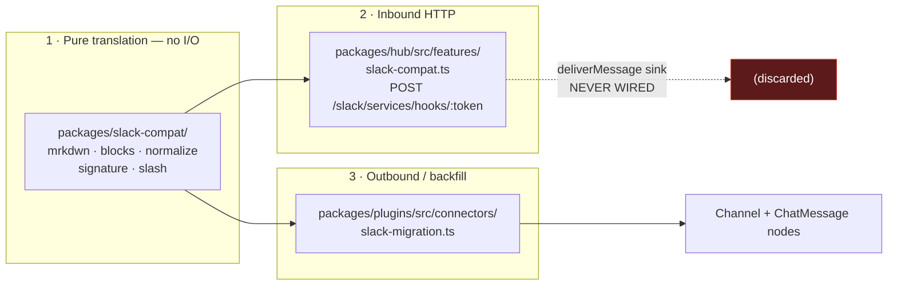
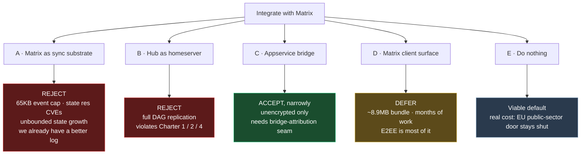
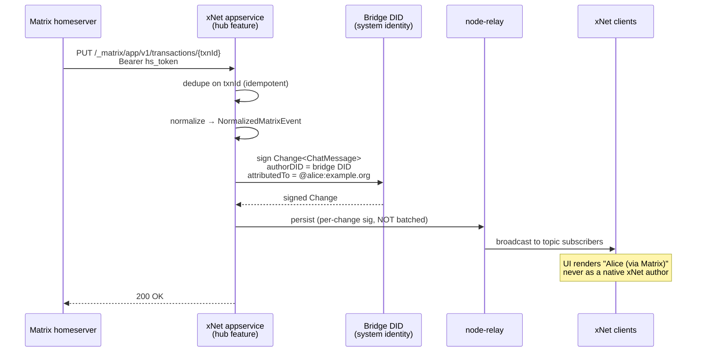
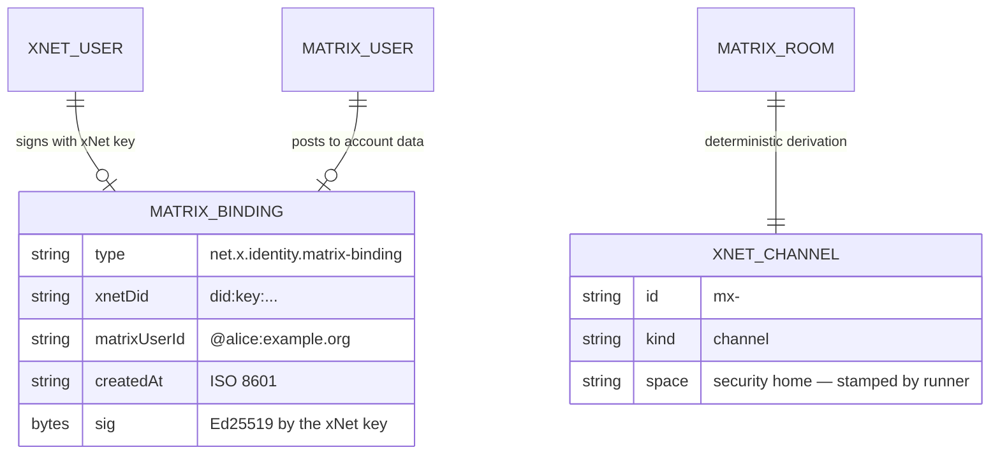

# Integrating With The Matrix Protocol

> Status: exploration `[_]` — not implemented.
> Related: 0198 (Slack-compatible integrations, still open), 0167 (realtime chat),
> 0301/0322/0324 (ATProto), 0213 (webhooks and connectors), 0307 (change security),
> 0344 (portable bundles), 0351 (frontier economics).

## Problem Statement

Matrix is the most credible open federated messaging protocol in existence. xNet
has chat (`packages/comms/`), a federated hub, DID identity, and a signed change
log that is — on paper — a close cousin of Matrix's event graph. The obvious
question is whether xNet should speak Matrix.

But "integrate with Matrix" is four different projects wearing one name, and they
have wildly different costs and wildly different answers:

1. **Matrix as sync substrate** — replace or complement the change log with the
   Matrix event DAG.
2. **Hub as homeserver** — `packages/hub/` implements `/_matrix/federation/`, so
   xNet Spaces *are* Matrix rooms.
3. **Bridge** — an Application Service that mirrors messages between Matrix rooms
   and xNet Channels.
4. **Client** — xNet ships a Matrix client surface, so a user reads their Matrix
   rooms inside xNet.

This exploration separates the four, prices each against the code as it exists
today, and checks each against the Charter — because Matrix's defining
property (every participating server holds the full room history forever, and
deletion is explicitly a "gentlemen's agreement") points the opposite direction
from Charter §1 Own, §2 Exit, and §4 Consent.

## Executive Summary

**Recommend option 3 only, scoped narrowly, and not yet.**

Five findings drive that:

1. **The "Matrix is the coming interop standard" argument does not survive
   contact with 2026.** Matrix bid for the IETF MIMI slot with
   `draft-ralston-mimi-linearized-matrix` and *lost* — the draft is expired,
   archived, and was never adopted. The design the working group did adopt
   (`draft-ietf-mimi-protocol-06`, 2026-04-25) is **hub-based MLS**, not a
   federated DAG. MIMI has shipped **zero RFCs in four years**. Meanwhile actual
   EU DMA interop in the field runs over Meta's bilateral Signal-protocol offer
   with two near-unknown partners. If we integrate, it must be for a market
   reason, not a standards-convergence reason.

2. **Matrix *is* the European public-sector procurement standard, and the
   Foundation says so.** Its March 2026 annual report calls Matrix "the de facto
   standard for public sector organisations in Europe." BwMessenger >100k DAU;
   Tchap >300k MAU and mandatory for French civil servants since August 2025;
   Schleswig-Holstein 40k+ accounts. That is a real, funded, sovereignty-motivated
   market that overlaps precisely with xNet's EU-sovereignty tailwind (0336). It
   is the only good reason to do this work.

3. **Full DAG replication is a Charter conflict, not a tradeoff.** Joining a
   federated Matrix room copies our users' messages onto every participating
   homeserver, permanently, with no technical recall. Options 1 and 2 would make
   xNet's own storage model inherit that. **This rules out hub-as-homeserver.**

4. **The blocker is not Matrix — it's the hub's missing system identity.** Every
   inbound integration in this repo verifies, normalizes, and then **discards**,
   because writing a node requires signing a `Change` with a DID and the hub has
   no identity to sign with. `slackCompatFeature` is fully built, fully tested,
   and **not mounted in production** for exactly this reason. A Matrix bridge hits
   the same wall on line one.

5. **Therefore the valuable deliverable is the seam, not the bridge.**
   Bridge-attributed authorship — a change signed by a bridge DID carrying an
   explicit `attributedTo` for the foreign speaker — unblocks Slack, GitHub,
   Stripe, Sentry, PagerDuty, and the form inbox at the same time. Matrix is the
   best *forcing function* for that work because its ghost-user model is the most
   demanding version of the problem.

**One line:** *Don't speak Matrix's wire. Build the bridge-attribution seam that
six stalled integrations already need, prove it on an unencrypted Matrix
appservice, and treat Matrix as a distribution channel into EU public sector —
not as our federation layer.*

## Current State In The Repository

### There is no Matrix prior art

Every case-insensitive hit for `matrix` is either unrelated (`PermissionMatrix`,
test matrices) or a **design citation**. Matrix influenced three decisions and
implements none:

| Location | What it borrowed |
| --- | --- |
| [`packages/runtime/src/protocol.ts:6`](packages/runtime/src/protocol.ts:6) | Umbrella protocol versioning modelled on Matrix "room versions" |
| [`packages/data/src/schema/schemas/mentions.ts:6`](packages/data/src/schema/schemas/mentions.ts:6) | MSC3952 intentional mentions |
| [`packages/data/src/schema/schemas/inbox-state.ts:8`](packages/data/src/schema/schemas/inbox-state.ts:8) | "The MSC2285 lesson" on read receipts |

Plus [`docs/explorations/0129_[_]_HOW_WILL_XNET_HANDLE_SPAM.md:162`](docs/explorations/0129_[_]_HOW_WILL_XNET_HANDLE_SPAM.md:162) on
Matrix-style policy/ban lists. Greenfield.

### The chat model — messages are nodes, not a CRDT log

`packages/comms/` is a thin, dependency-injected service layer that owns **no
storage**; it delegates entirely to `@xnetjs/data`.

- [`packages/comms/src/chat/chat-service.ts`](packages/comms/src/chat/chat-service.ts) — `createChannel`, `sendMessage`, `editMessage`, `redactMessage`, `channelHistoryQuery`
- [`packages/comms/src/chat/dm.ts:15`](packages/comms/src/chat/dm.ts:15) — deterministic DM identity
- [`packages/comms/src/presence/room-manager.ts`](packages/comms/src/presence/room-manager.ts) — Yjs Awareness rooms
- [`packages/comms/src/calls/signaling.ts`](packages/comms/src/calls/signaling.ts) — WebRTC mesh over hub pub/sub

The load-bearing decision is at
[`packages/data/src/schema/schemas/chat-message.ts:2`](packages/data/src/schema/schemas/chat-message.ts:2):
messages are **individual signed nodes synced via `Change<T>`**, deliberately not
a CRDT log — "avoids unbounded tombstone growth and gets offline delivery,
signing, and windowed pagination for free."

That comment is worth pausing on, because unbounded tombstone growth is precisely
what Matrix has (see External Research: `state_groups_state` at 274M rows).

Key schemas, all in `packages/data`:

| Schema | Path | Notes for a bridge |
| --- | --- | --- |
| `ChatMessage` | [`chat-message.ts:22`](packages/data/src/schema/schemas/chat-message.ts:22) | GFM markdown ≤10000 chars, `inReplyTo` is **flat threading — always the thread root** (`:32`), `redacted` is a soft tombstone (`:48`) |
| `Channel` | [`channel.ts:21`](packages/data/src/schema/schemas/channel.ts:21) | One schema, three kinds: `channel \| dm \| voice`. `members` = DIDs. `space` relation is the security home |
| `Reaction` | [`reaction.ts:17`](packages/data/src/schema/schemas/reaction.ts:17) | Universal, not chat-specific |
| `InboxState` | [`inbox-state.ts:53`](packages/data/src/schema/schemas/inbox-state.ts:53) | Read receipts as **one private node per user** — never written into shared rooms |

Two mismatches to note early: **flat threading** (Matrix has `m.thread` with real
nesting via MSC3440) and the **10,000-character content cap** versus Matrix's
65,536-byte whole-event ceiling.

DM identity at [`packages/comms/src/chat/dm.ts:15`](packages/comms/src/chat/dm.ts:15)
is `dm-` + first 40 hex of `sha256(sorted DIDs joined by \n)` — both sides
materialize the same node with zero coordination and concurrent creates converge
via LWW. **A bridge needs the analogous deterministic derivation from a Matrix
room ID**, and it should be designed the same way.

### `packages/slack-compat/` — the pattern to copy, and the wall to avoid

The closest prior art, and it is well-factored. Deliberately **pure: zero runtime
deps, zero I/O** ([`README`](packages/slack-compat/README.md)). The seams split
three ways:



`NormalizedSlackMessage` at
[`packages/slack-compat/src/types.ts:63`](packages/slack-compat/src/types.ts:63)
is the transport-agnostic intermediate — `{ content, channelHint?, username?, iconEmoji? }`.
A `NormalizedMatrixEvent` should sit at the same altitude.

**But `slackCompatFeature` is never mounted.** It appears only in its own test
([`packages/hub/src/features/slack-compat.test.ts:21`](packages/hub/src/features/slack-compat.test.ts:21)).
The `mountFeatures` list at
[`packages/hub/src/server.ts:604`](packages/hub/src/server.ts:604) contains
`billingFeature`, `tasksFeature`, `unfurlFeature`, `aiForwarderFeature`,
`diagnosticsSharingFeature`, `diagnosticsInboxFeature`, `stripeFeature`,
`sentryFeature`, `pagerdutyFeature`, `formInboxFeature` — and not Slack.

The reason is stated in the code, three times, and it is architectural rather
than an oversight.
[`packages/hub/src/features/slack-compat.ts:15`](packages/hub/src/features/slack-compat.ts:15):

> the hub has no server-authoritative node writes yet, so an app wires
> `deliverMessage` to materialize a `ChatMessage`

And in the `mountFeatures` preamble itself
([`packages/hub/src/server.ts:597`](packages/hub/src/server.ts:597)):

> applying them to a workspace's Task nodes needs server-authoritative node
> writes (a hub system identity), which the hub does not yet have. Until then
> the actions are reported (`{ ok, actions }`) but not applied

**This is the finding the whole exploration turns on.** Six integrations —
GitHub→Tasks, Stripe, Sentry, PagerDuty, the form inbox, and Slack — all verify
and normalize correctly and all stop at the same line.

### The hub — where a Matrix feature would plug in

Hono 4 + `@hono/node-server` + `ws`. The feature contract at
[`packages/hub/src/features/types.ts:35`](packages/hub/src/features/types.ts:35):

```ts
export interface HubFeature {
  id: string                        // reverse-domain
  secrets?: string[]                // broker scopes deps.env to exactly these
  webhooks?: DeclarativeWebhook[]
  mount?(deps: HubFeatureDeps): void
}
```

[`packages/hub/src/features/registry.ts:19`](packages/hub/src/features/registry.ts:19)
calls `scopedEnv(deps.env, feature.secrets ?? [])` per feature — capability
scoping enforced at mount time. Adding `matrixFeature(ports)` to the array at
`server.ts:604` is the entire HTTP integration surface.

**Naming collision to avoid:**
[`packages/hub/src/routes/federation.ts`](packages/hub/src/routes/federation.ts)
already exists and is **not** protocol federation — it is hub-to-hub *query*
federation (`POST /federation/query`, `FederationPeer` with
`trustLevel: 'metadata' | 'full'`). A Matrix appservice must mount under a
distinct path.

Auth is UCAN ([`packages/hub/src/auth/ucan.ts`](packages/hub/src/auth/ucan.ts)),
with audience enforcement at `:91` so a token is valid only at this hub. Space
authorization presets live in
[`packages/data/src/schema/schemas/space-authorization.ts`](packages/data/src/schema/schemas/space-authorization.ts) —
`ChatMessage` uses `spaceContributorAuthorization` (`:133`): members post, only
author or admin edits.

### Identity — the ATProto binding is the template

[`packages/identity/src/atproto/binding.ts:26`](packages/identity/src/atproto/binding.ts:26)
is exactly the external-identity pattern a Matrix binding wants:

```ts
AtprotoBindingRecord = { $type, xnetDid, atprotoDid, createdAt, sig }
```

The elegance is the **bidirectional social proof** (`:5`): the record lives in
the user's ATProto repo (proving ATProto control) and its `sig` is an Ed25519
signature by the *xNet* key (proving xNet control). Neither side alone can claim
the other. The canonical message is version-prefixed and newline-delimited
(`bindingMessage`, `:42`) so it cannot collide with another domain's signatures.

There is **no lookup table** — bindings are fetched from the foreign system and
verified on demand. Hub-side verifier:
[`packages/hub/src/services/atproto-binding.ts`](packages/hub/src/services/atproto-binding.ts).

Related but different:
[`packages/data/src/schema/schemas/external-item.ts:26`](packages/data/src/schema/schemas/external-item.ts:26)
has an `EXTERNAL_ITEM_SOURCES` enum that would need a `matrix` entry if we route
through it.

### The change log — and the constraint that shapes the whole bridge

`Change<T>` at [`packages/sync/src/change.ts:44`](packages/sync/src/change.ts:44)
carries `authorDID`, an Ed25519 `signature` over the content hash, a per-**node**
`parentHash` chain, and `lamport` ordering with `authorDID` as the LWW tiebreak.
Protocol version is currently 4. Signing is Ed25519-only today; the ML-DSA
apparatus in [`packages/crypto/src/hybrid-signing.ts`](packages/crypto/src/hybrid-signing.ts)
is defined but not wired to `Change` (0307).

`BatchCommit` ([`packages/sync/src/batch-commit.ts:60`](packages/sync/src/batch-commit.ts:60))
signs a BLAKE3 root over up to 1000 change hashes. Two constraints bite:

1. **Batches are only valid in unit-transport lanes** (`:33`) — `.xnetpack`,
   NDJSON restore, initial-sync snapshots, migrations. "Interactive single edits
   keep their per-change signature, because live relay fans a change out to peers
   who may never receive its siblings." → **Matrix backfill can batch; live
   bridged events cannot.**

2. **`verifyBatch` requires `change.authorDID === commit.authorDID`**
   ([`:238`](packages/sync/src/batch-commit.ts:238)) — verified directly. The
   comment is blunt: "a commit cannot launder someone else's authorship."
   → **A bridge cannot batch-sign changes attributed to many different Matrix
   users under one bridge DID.** This constrains the puppeting design more than
   anything in the Matrix spec does.

Ingest path: [`packages/hub/src/ws/handlers/node-change.ts`](packages/hub/src/ws/handlers/node-change.ts)
→ [`packages/hub/src/services/node-relay.ts:188`](packages/hub/src/services/node-relay.ts:188)
(`verifyChangeHash`) → `:211` (`verifyChangeFast`). Ownership prefers the change's
signed `authorDid` over the relaying session (`node-change.ts:61`).

### Crypto — no ratchet, and that decides the E2EE question

`packages/crypto/` has Ed25519 signing, BLAKE3+HKDF, XChaCha20-Poly1305,
X25519, and envelope encryption
([`packages/crypto/src/envelope.ts:1`](packages/crypto/src/envelope.ts:1)):
per-node content key wrapped per recipient via X25519 ECDH, with public metadata
preserved so the hub can filter without decrypting.

Grepping `double.ratchet|megolm|olm|MLS|forward secre` returns **one** hit, and
it is a test string. There is no Olm, no Megolm, no double ratchet, no forward
secrecy, no device keys, no one-time keys, no cross-signing, no session
management.

This is not a gap to close for Matrix's sake — it is the reason the bridge must
be scoped to unencrypted rooms and say so out loud.

### Transport and the connector registry

WebSocket, not SSE ([`packages/hub/src/server.ts:963`](packages/hub/src/server.ts:963)).
The router at [`packages/hub/src/ws/message-router.ts:38`](packages/hub/src/ws/message-router.ts:38)
is an **ordered** registry where handlers return `'handled'` or `'continue'` —
registration order is the contract.

Connector shape at
[`packages/plugins/src/connectors/define-connector.ts:145`](packages/plugins/src/connectors/define-connector.ts:145):

```ts
defineConnector({
  id: 'dev.xnet.connector.matrix',
  capabilities: {
    secrets: [...],
    schemaWrite: ['xnet://xnet.fyi/Channel@1.0.0', ...],
    network: ['matrix.org']          // REQUIRED, closed by default (:119)
  },
  sync: { schemas, spaceProperty?, cadence?, pull(ctx) }
})
```

`validate()` (`:114`) enforces that every synced schema is covered by
`schemaWrite`, and the runner *stamps* the target space on every node "so an
author cannot forget — that stamp is what makes the space cascade hold" (`:65`).

## External Research

### What Matrix actually is

A room is a DAG of events replicated to **every** participating server. Each PDU
carries `prev_events` (causal parents) and `auth_events` (the state authorizing
it). Servers sign and content-hash events; anyone can verify independently.
State is keyed by `(event_type, state_key)` and resolved on branch merge by the
room-version-specific algorithm.

Current spec is **v1.19 (2026-07-08)**. Default room version is **12**.
Hard ceiling: **65,536 bytes per event** as canonical JSON including signatures.

**The formal result is genuinely in Matrix's favour.** Jacob, Beer, Henze &
Hartenstein prove the Matrix Event Graph is a CRDT for causal histories providing
Strong Eventual Consistency, Byzantine fault tolerant for n > f without consensus
([arXiv 2011.06488](https://arxiv.org/abs/2011.06488)). This is the closest
published cousin to xNet's signed log, and it is a serious piece of work.

### Project Hydra — state resolution was a security bug

Disclosed 2025-08-14 after embargo:

- **CVE-2025-49090** — state resolution v2.0 edge conditions let a malicious
  participating homeserver deliberately corrupt room state, producing state
  resets and power-level hijack.
- **CVE-2025-54315** — no cryptographic enforcement of room ID uniqueness.
- Observed in the wild: `#rust`, the Matrix Foundation office room, TWIM,
  Techlore, Furrytech — users re-added to rooms they had left, access controls
  reverting.
- Fixed by MSC4289 / MSC4291 / MSC4297 (**state resolution v2.1**, which replays
  the whole conflicted state *subgraph*), bundled as MSC4304 = room version 12,
  shipped in Matrix 1.16 (2025-09-17).
- **Rooms must be manually upgraded. Old rooms stay vulnerable.**

v2.1 fixes correctness, not cost — `matrix-spec#1922` "make state resolution
faster" remains open.
[matrix.org/blog/2025/08/project-hydra](https://matrix.org/blog/2025/08/project-hydra-improving-state-res/)

### "Matrix 2.0" is still not in the spec, 21 months on

Announced October 2024 with the promise that the spec would bump to 2.0 on FCP
merge. The spec is v1.19.

| Pillar | Status July 2026 |
| --- | --- |
| OIDC-native auth (MSC3861) | ✅ **Done** — spec v1.15 (2025-06-26). Element migrated 110M matrix.org users in 30 minutes |
| Simplified Sliding Sync (MSC4186) | ⚠️ Accepted ~2026-06-29 but carries `spec-pr-missing`; all extension MSCs still in review. **Not in v1.19** |
| MatrixRTC (MSC3401/4143/4195) | ❌ None merged. MSC4143 explicitly `blocked`; MSC4195 has no qualifying implementation and cannot enter FCP |
| Faster remote room joins | ✅ In practice — default-on since Synapse 1.76.0. Matrix HQ join went ~12 min → ~30 s |

### The Foundation has a real, unresolved funding problem

- **2025-02-20, "We're at a crossroads":** 2024 revenue **$561K** against **$1.2M**
  costs — a **$356K deficit**, covered by liquidating $283K of crypto donations.
  Ultimatum: raise $100K by 2025-03-31 or shut down the Slack/XMPP/OFTC/Snoonet
  bridges. [matrix.org/blog/2025/02/crossroads](https://matrix.org/blog/2025/02/crossroads/)
- **2026-03-27, first Public Annual Report:** revenue +38%, loss narrowed from
  50% to 34% of costs. But **Automattic's Gold membership alone is ≈50% of
  revenue**, and reliance on Element's in-kind donations is described as
  "unsustainable."
- **2026-04 Governing Board report:** "still struggling from a resources
  perspective & still can't afford the bare minimum requirements."

Licensing settled in 2023 and has not moved: Synapse and Dendrite are **AGPLv3
under `element-hq/` with a CLA**; `matrix-js-sdk` and `matrix-rust-sdk` remain
**Apache 2.0**. Element added a paid "Build" licence (2025-03-13) for proprietary
products on the AGPL code. The spec itself stays Foundation-owned.

### Homeservers

Federation share (TWIM 2026-07-17, 19,723 discoverable servers): **Synapse 78.6%**,
Continuwuity 8.3%, Conduit 2.9%, Dendrite 1.6%.

- **Synapse** (Python/Twisted, v1.156.0) — the only safe default. Docs say ≥1 GB
  RAM just to sit in `#matrix:matrix.org`; Element's production guidance is
  ≥6 vCPU / 16 GB. The GIL is the structural ceiling — scales only by spawning
  single-core workers.
- **Dendrite** — README says maintenance mode, security fixes only. Last release
  2025-08-15. **Do not start here.**
- **Continuwuity** (v26.6.2) — the healthy community fork, #2 at 8.3%.
  64–256 MB for 10–100 users, but ~2 GB for a *single* user in several
  1000+-member rooms.
- **Tuwunel** (v1.8.2) — the other fork, funded by a full-time developer
  "primarily sponsored by the government of Switzerland where it is currently
  deployed for citizens."
- **conduwuit** — dead. Last release 2024-09-02.

**Database bloat is the real operational story.** Synapse never deletes from
`state_groups_state`: a documented case of **274 million rows / 51 GB in one
table** (`synapse#7472`); another where it was >98% of disk. `send_join`
responses exceed Synapse's 100 MB limit for rooms like OFTC, making them
**unjoinable** (`synapse#10087`); rooms as small as 1.4k members have OOM'd
Synapse on join (`synapse#7339`).

### The Application Service API — the right seam, and it is stable

[spec.matrix.org/latest/application-service-api](https://spec.matrix.org/latest/application-service-api/)

Registration is a **YAML file installed on the homeserver, not an HTTP API** —
so bridging requires homeserver admin cooperation. It declares `as_token`,
`hs_token`, `sender_localpart`, and `namespaces` (`users`, `aliases`, `rooms`),
each `{exclusive, regex}` matching full IDs. `exclusive: true` locks the range;
violations return `M_EXCLUSIVE`. Convention is an underscore after the sigil:
`@_xnet_.*:example.com`.

Transactions push **homeserver → AS** via
`PUT /_matrix/app/v1/transactions/{txnId}` with `Authorization: Bearer <hs_token>`.
Body has exactly two properties in v1.19: `events` and optional `ephemeral`
(spec v1.13, MSC2409, gated on `receive_ephemeral`). Crucially:

> Homeservers MUST NOT alter (e.g. add more) events they were going to send
> within that transaction ID on retries.

So `txnId` is a stable dedupe key — record processed IDs and no-op. The
homeserver maintains the queue and backs off exponentially.

Ghost users work by appending **`?user_id=`** to any client-server call with the
`as_token`; the asserted user must fall inside the AS's `users` namespace.
`?device_id=` was added in spec v1.17 (MSC4326).

| MSC | Subject | Status |
| --- | --- | --- |
| MSC2409 | EDUs to appservices | ✅ spec v1.13 |
| MSC2659 | AS ping | ✅ stable |
| MSC4190 / MSC4326 | Device mgmt, masquerading | ✅ spec v1.17 |
| **MSC3202** | **E2EE for appservices** | ❌ **open since 2021-05-18 — five years** |
| MSC4203 | to-device to appservices | ❌ not in spec |

**Unencrypted bridging is fully stable spec. Encrypted bridging is not.**

### Bridges: healthy where someone pays, dead elsewhere

- **matrix-appservice-bridge** (Node/TS, v11.2.0) — maintained on life support;
  dependency work, not features.
- **mautrix** (Go, Tulir Asokan) — where all the energy is. Clockwork monthly
  releases; `mautrix-go` v0.29.0 (2026-07-16). `bridgev2` is the current
  architecture.

**Beeper was acquired by Automattic in April 2024** (~$125M, Bloomberg-sourced),
and is alive and still Matrix-based — its October 2025 "Build a Beeper Bridge"
post offered **bounties up to $50k** for bridges "using our Matrix bridgev2
interface in Golang." Bridges moved from cloud to on-device around July 2025, a
hosting change often misread as leaving Matrix.

Health by network: Telegram ✅ (official API), WhatsApp ✅, Signal ✅,
Slack ⚠️ (mautrix-slack alive but `matrix-org/matrix-appservice-slack` was
**archived 2026-01-22**, nine days after matrix.org removed the bridge),
Discord ⚠️ (user-token login is a self-bot violating ToS), iMessage ⚠️ (needs a
Mac you control).

matrix.org's own bridges tell the story: Gitter killed 2021, Libera IRC disabled
2023 at Libera's request, Slack removed 2026-01-13. The Foundation's stated line
is to prioritise **bridges to open protocols** over proprietary ones. **The
economics only work when someone pays** — the healthy pole is Automattic funding
one person, which is also the ecosystem's single largest risk.

### E2EE, and why a bridge cannot have it

**Olm** is a Double Ratchet whose real job is distributing **Megolm** session
keys over to-device messages. Megolm is deliberately *not* a double ratchet — a
128-byte state in four parts advancing at different rates so a receiver can
fast-forward O(log n) but never rewind. Forward secrecy is therefore weak within
a session: compromise the state at index *i* and everything from *i* forward is
readable. Mitigated only by rotation policy (default: 1 week or 100 messages).
Effectively no post-compromise security within a session.

libolm was deprecated 2024-08-02 for **vodozemac** (Rust, v0.10.0). Note that
vodozemac has had **exactly one audit** — Least Authority, final report
2022-03-30 — for what is now the sole implementation.

**Invisible Crypto is the operational landmine.** MSC4153 (exclude
non-cross-signed devices) landed in spec **v1.18 (2026-03-26)**, and Element
changed client defaults in **April 2026**. Consequence: **any bot, bridge, or
integration device that is not cross-signed is silently excluded from encrypted
rooms.**

The bridge problem is architectural, not a bug awaiting a fix. Matrix encrypts
**to devices**; a bridge must produce plaintext for the other network, so it must
be a device in the room and must decrypt. E2EE in a bridged room means "encrypted
from client to bridge" — **the trust boundary moves from the homeserver operator
to the bridge operator.** MSC3202, which would let a bridge operate per-puppet
rather than as one shared device, has been open five years.

Prior breaks: Albrecht, Celi, Dowling & Jones, *"Practically-exploitable
Cryptographic Vulnerabilities in Matrix"* (**IEEE S&P 2023**, ePrint 2023/485) —
protocol confusion between Olm and Megolm plus missing domain separation, enabling
impersonation via forwarded Megolm sessions. Mostly fixed in 2023. A live dispute
remains over Soatok's February 2026 vodozemac critique (all-zero X25519 output not
rejected in Olm 3DH); Matrix conceded issue 1 as real code behaviour and agreed to
add the check as defence in depth, disputing practical exploitability. No CVEs
allocated.

**MLS in Matrix has stalled.** MSC4244 is still titled `[WIP]`, last updated
2025-02-03 — seventeen months untouched. `arewemlsyet.com` still says "Not Yet."
The obstacle is structural: MLS needs a logically centralised coordinator to
linearly order epoch changes; Matrix has no such point. Neither explored approach
(DMLS, which *reduces* forward secrecy; or hub-server MLS) shipped.

### MIMI — the section that kills the standards argument

Matrix bid for the IETF MIMI slot and lost.

- **`draft-ralston-mimi-linearized-matrix`** — Matrix's room model with a
  linearised DAG. **v04, expired, "Expired & archived," never adopted.** The
  datatracker page states it is "not endorsed by the IETF" with "no formal
  standing."
  [datatracker.ietf.org/doc/draft-ralston-mimi-linearized-matrix](https://datatracker.ietf.org/doc/draft-ralston-mimi-linearized-matrix/)
- **What the WG adopted instead** — `draft-ietf-mimi-protocol-06` (2026-04-25) —
  is not Matrix-derived. Each room is hosted at a **single "hub" provider**,
  transport is HTTPS with mutually-authenticated TLS, and **every room is an MLS
  group per RFC 9420**. Matthew Hodgson and Travis Ralston are co-authors, so
  Matrix people are in the room — but the design that won is hub-based MLS, not
  a federated DAG.

| Document | Version | Status | Updated |
| --- | --- | --- | --- |
| `draft-ietf-mimi-arch` | 03 | WG Document | 2026-07-06 |
| `draft-ietf-mimi-content` | 09 | WG Document | 2026-07-04 |
| `draft-ietf-mimi-protocol` | 06 | WG Document, "I-D Exists" | 2026-04-25 |
| `draft-ietf-mimi-room-policy` | 04 | WG Document | 2026-07-06 |

**Zero published RFCs. `Intended RFC status: (None)`. No IESG submission
timeline.** Four years in.

And the DMA bypassed MIMI entirely: WhatsApp shipped third-party interop in
Europe (announced 2025-11-14), but **Meta's reference offer conveys user content
using the Signal Protocol in an XML format** — not MIMI, not MLS. First partners
are BirdyChat and Haiket. Element has built working 1:1 Matrix↔WhatsApp chats
over the DMA APIs with E2EE preserved but **has not put it live**, citing
unresolved UX questions.

### Adoption: public sector deep, consumer thin

**Germany** — BwMessenger (Bundeswehr) **>100,000 DAU**, BSI-certified for
VS-NfD. gematik TI-Messenger is mandated for healthcare with a target of
>150,000 organisations, but is **mid-rollout** (rebasing from Matrix v1.11 onto
v1.15; test readiness Q4 2026) — do not cite it as live. Schleswig-Holstein
chose Matrix over Teams and had **40,000+ accounts** migrated by 2025-10-02,
claiming ~€15M/yr savings.

**France** — Tchap **>300,000 MAU**, the default for all civil servants since
August 2025 after a PM directive banning foreign apps. DINUM is the first
government Foundation member. ⚠️ **Breached June 2026** — detected 2026-06-07 by
ANSSI, 73,000+ accounts affected. The vector was a compromised account via social
engineering, **not a protocol break**. Encrypted DMs held; all public-room content
was exfiltrated (actor claims 13.5 GB).

That last detail is worth internalising: **the encrypted content survived and the
public-room content did not**, which is exactly the failure mode full DAG
replication produces.

**Consumer** — weak, and the numbers are stale. The widely-recycled "115 million
users" is a **September 2023** figure and counts accounts including bridges and
bots; there is no published 2026 total. The best current metric is 19,723
federatable servers. The one genuine spike was February 2026, when Discord
announced mandatory global age verification and Element added ~2 million users
(Discord then postponed to H2 2026).

The Foundation's own Discord-welcome post is candid: "the team at Element who
originally created Matrix have had to focus on providing deployments for the
public sector," and "no other organisation stepped up to focus on the
'communication tool for communities' use case."

### Critiques that matter to us

**Metadata.** anarcat's [2022 teardown](https://anarc.at/blog/2022-06-17-matrix-notes/)
remains canonical: homeservers keep join/leave events for all rooms **in
cleartext**, so the full social graph is visible to admins and exposed in
plaintext between federating servers. No sealed sender, no private contact
discovery. URL previews de-anonymise — you can obtain any user's IP by sharing a
link. Room name, topic, avatar, membership, reactions and timing are typically
not E2EE.

**Deletion.** Matrix's own words: *"There is no way to technically enforce a
redaction over federation, but there is a 'gentlemen's agreement' that this
request will be honoured."* Redaction strips human-facing content and leaves the
event skeleton in the DAG. Some state (join/part/bans) **must** be kept forever
by protocol. GDPR Art. 17 compliance would require enumerating every user,
discovering every homeserver, and pursuing each separately; Matrix's defence is
that erasure is a relative right subject to "available technology." No litigation
has tested this.

**Moderation.** A real CSAM problem in early 2024 (rooms created to distribute
content; servers used as a CDN) led matrix.org to freeze the room directory in
May 2024 and move to a curated directory in February 2025. **MSC4284 Policy
Servers** (spec v1.18) is the structural response — moderation checks events
*before* acceptance into the room, with one filter backend being OpenAI's
omni-moderation model. Note the unresolved tension: policy servers reintroduce a
centralised chokepoint into a federated protocol, and that objection is
under-argued in the literature.

## Key Findings

1. **Matrix's event graph is a proven CRDT and a genuine architectural cousin** —
   and its decade of scaling pain (state resets escalating to CVE-2025-49090,
   `state_groups_state` at 274M rows, unjoinable rooms) is a preview of where an
   unpruned signed log goes. The most valuable thing here may be the failure
   modes, not the integration. `chat-message.ts:2`'s "avoids unbounded tombstone
   growth" comment reads as prescient.

2. **Full replication is incompatible with the Charter, not merely awkward.**
   Joining a federated room copies our users' data onto servers we do not control,
   permanently, with deletion as a gentlemen's agreement. That is a direct
   conflict with §1 Own, §2 Exit, and §4 Consent.

3. **The interop-standard argument fails.** Linearized Matrix expired unadopted;
   MIMI chose hub-based MLS and has shipped zero RFCs in four years; DMA
   compliance in the field runs on Meta's bilateral Signal-protocol offer. Matrix
   is a **European public-sector procurement standard** — a real market, but a
   different reason.

4. **The appservice API is the right seam and it is mature** — namespaced ghosts,
   `?user_id=` assertion, idempotent transaction push, all stable spec. Three
   caveats: homeserver admin cooperation is required (YAML, not an API); E2EE is
   off the table (MSC3202 open five years); and since April 2026 the appservice
   device must be cross-signed or it is silently excluded from encrypted rooms.

5. **The blocking work is ours, not Matrix's.** `verifyBatch`'s
   `authorDID === commit.authorDID` check and the hub's missing system identity
   are the real constraints. Six integrations are already stalled on the same
   line. **Matrix is the most demanding version of a problem we must solve
   anyway.**

6. **Two schema mismatches need explicit decisions**: flat threading
   (`inReplyTo` always points at the thread root) versus Matrix `m.thread`, and
   the 10,000-character content cap versus Matrix's 65,536-byte event ceiling.

## Options And Tradeoffs



### Option A — Matrix as sync substrate

Replace or complement `Change<T>` with the Matrix event DAG.

**For:** a formally-proven CRDT with SEC and BFT; instant interop with every
homeserver; a decade of adversarial hardening.

**Against:** the 65,536-byte event ceiling makes it useless for xNet's actual
payloads (documents, canvas, database rows). State resolution has produced
exploitable state resets requiring embargoed coordination and manual room
upgrades. `state_groups_state` grows without bound by design. And we would be
trading a per-node parent-hash chain that supports windowed pagination and
offline delivery for a whole-room DAG that requires merge-and-reconcile per
message.

**Verdict: reject.** We would be adopting the failure modes our chat model was
explicitly designed to avoid.

### Option B — Hub as homeserver

`packages/hub/` implements `/_matrix/federation/`; xNet Spaces are Matrix rooms.

**For:** maximum interop; xNet appears natively in EU public-sector procurement;
no bridge to maintain.

**Against:** this is the Charter conflict in its purest form. Federating a Space
means every participating homeserver — Synapse instances we do not run, in
jurisdictions we do not choose — holds a permanent copy of our users' messages,
with no technical recall and no enforceable redaction. It would also require
implementing state resolution v2.1, the auth rules, and the full server-server
API, and then maintaining them against a spec that ships breaking room versions.
It collides with the existing `/federation` namespace. And it inherits Synapse's
operational profile (≥6 vCPU / 16 GB in Element's own guidance) against a hub
designed to run on a Raspberry Pi (0300).

**Verdict: reject.** No amount of engineering makes "your data is now permanently
on servers you don't control" compatible with §1 and §2.

### Option C — Appservice bridge

An xNet-operated Application Service registered on a homeserver, mirroring
messages between Matrix rooms and xNet Channels.

**For:** the seam is stable spec and well-understood. `slack-compat`'s
three-way split (pure library / hub feature / connector) transfers directly.
It opens the EU public-sector door without adopting the storage model —
the DAG stays on their side of the boundary. And it forces the
bridge-attribution work that six other integrations already need.

**Against:** it requires homeserver admin cooperation (YAML registration, not an
API). Encrypted rooms are out. Since April 2026 our appservice device must be
cross-signed or it is silently excluded. Bridges are stateful services, not
libraries — real operational cost. And the bridge ecosystem's health is
concentrated in roughly one funded developer.

**Verdict: accept, narrowly.** Unencrypted rooms, explicit about it in the UI.

### Option D — Matrix client surface

xNet renders the user's Matrix rooms directly.

**For:** no bridge to operate; the user's homeserver stays theirs; arguably the
most Charter-aligned option, since we never hold their Matrix data.

**Against:** `matrix-js-sdk` is ~8.89 MB for an empty project with just
`createClient()` — the WASM crypto alone is ~6.6 MB — against a PWA where a
>6 MB chunk already broke us once (0297). A read/write integration is days; a
*correct* client is months, and E2EE (cross-signing bootstrap, SSSS/4S recovery,
key backup, SAS/QR verification) is the majority of it. `matrix-js-sdk` ships
breaking majors at a real clip and npm `latest` currently resolves to an RC.

**Verdict: defer.** Revisit if Option C finds demand. If we do it, gate crypto
behind a dynamic import.

### Option E — Do nothing

**For:** zero cost; nothing in the codebase is worse for it; the funding and
governance picture at the Foundation is genuinely uncertain.

**Against:** the EU public-sector door stays shut, and it is the door with the
strongest tailwind for xNet's sovereignty positioning (0336). Note this option
does *not* forgo the bridge-attribution work — that should happen regardless.

**Verdict: the honest default if Option C finds no design partner.**

### Revenue lane: hosted Matrix bridge

If Option C were offered as a managed service, the Charter §6 tests apply:

- **Improvement test** — ✅ **passes.** We would charge for running a stateful
  bridge process: uptime, backfill, protocol churn absorption, homeserver
  liaison. That is operations we build and run, not access to something the user
  would own anyway. The user's Matrix account, their homeserver, and their xNet
  data all remain theirs.
- **BATNA test** — ✅ **passes, if we keep it passing.** The bridge must ship in
  the MIT tree and be self-hostable alongside `packages/hub/`, like every other
  connector. If the hosted version gets protocol capabilities the self-hosted one
  lacks, the lane has become rent. **Design constraint, not an afterthought.**
- **Vanish test** — ✅ **passes.** If xNet disappeared, the user's Matrix rooms
  survive on their homeserver and their xNet messages survive in their
  `.xnetpack` export (0344). Only the mirroring stops. Nothing is hostage.

⚠️ **The failure mode to watch**: per-bridged-user pricing. That would be
per-member pricing under another name — charging for the size of an audience we
did not build — and §6 already refuses it (`community` plan, `seats: 0`,
`withSeats()` refusing to attach a count,
[`packages/entitlements/src/plans.ts`](packages/entitlements/src/plans.ts)).
Price the bridge process, not its members.

## Recommendation

**Do not speak Matrix's wire protocol. Build the attribution seam, prove it on an
unencrypted Matrix appservice, and treat Matrix as EU public-sector distribution.**

Concretely, in order:

### Phase 0 — Bridge-attributed authorship (the real work)

This is not Matrix-specific and should ship whether or not the bridge does.

The design problem: a bridge cannot forge Alice's signature, because it does not
have Alice's key. `verifyBatch` refuses to launder authorship
([`batch-commit.ts:238`](packages/sync/src/batch-commit.ts:238)) and the ingest
path prefers the change's signed `authorDid`
([`node-change.ts:61`](packages/hub/src/ws/handlers/node-change.ts:61)). Matrix
solves this with homeserver-controlled ghost users — but those are *real accounts
the homeserver can sign for*, which is exactly the capability we do not want a
bridge to have.

**xNet's answer should be cleaner than Matrix's: the signature says who
vouched, the content says who spoke.**

A bridge signs changes with **its own DID** and carries the foreign speaker in an
explicit, non-forgeable-looking field:



Three invariants that must hold:

- **`authorDID` is always the bridge.** Never a user DID the bridge does not
  control. The signature means "this bridge asserts it received this," which is
  exactly true.
- **`attributedTo` is display metadata with a visible trust boundary.** The UI
  must distinguish bridged authorship from native authorship. Never render a
  bridged message as if the xNet user wrote it.
- **If the Matrix user has proven they are also an xNet user**, promote the link
  via a binding record — see Phase 2 — but keep the `authorDID` honest.

This unblocks Slack, GitHub→Tasks, Stripe, Sentry, PagerDuty, and the form inbox
simultaneously. Mounting `slackCompatFeature` becomes a one-line change to
[`server.ts:604`](packages/hub/src/server.ts:604) — and that is the fastest way
to validate the design, because the Slack code is already written and tested.

### Phase 1 — `@xnetjs/matrix` pure translation library

Copy `slack-compat`'s discipline exactly: zero runtime deps, zero I/O, pure
functions.

```
packages/matrix/src/
  events.ts      m.room.message → NormalizedMatrixEvent
  formatting.ts  org.matrix.custom.html ↔ GFM
  ids.ts         room ID / user ID parse + validate
  threads.ts     m.thread → flat inReplyTo (lossy — document it)
  txn.ts         transaction dedupe bookkeeping
```

### Phase 2 — Hub appservice feature

`matrixFeature()` added to `mountFeatures`, mounted **not** under `/federation`
(collision with hub-to-hub query federation). Verifies `hs_token`, dedupes on
`txnId`, normalizes, and hands to the Phase-0 signer.

Identity binding follows the ATProto template exactly
([`binding.ts:26`](packages/identity/src/atproto/binding.ts:26)) — bidirectional
social proof, version-prefixed canonical message, verified on demand rather than
stored in a join table:



Channel IDs derive deterministically from the room ID, mirroring the DM
derivation at [`dm.ts:15`](packages/comms/src/chat/dm.ts:15) so concurrent
creates converge via LWW.

### Phase 3 — Backfill connector

`defineConnector({ id: 'dev.xnet.connector.matrix', ... })` for history import,
mirroring [`slack-migration.ts`](packages/plugins/src/connectors/slack-migration.ts).
Backfill **may** use `BatchCommit` — it travels as a unit — but only within the
`authorDID === commit.authorDID` constraint, which holds naturally here because
every backfilled change is signed by the same bridge DID.

### What we explicitly do not build

- No homeserver. No `/_matrix/federation/`.
- No E2EE room support. The UI must say so plainly rather than degrade silently.
- No Olm/Megolm implementation. `packages/crypto/` stays envelope-based.
- No `matrix-js-sdk` dependency in the web app.

## Example Code

Phase 0's signer — the piece everything else waits on:

```ts
// packages/hub/src/services/bridge-identity.ts
//
// The hub's first system identity. A bridge signs with its OWN DID and names
// the foreign speaker explicitly: the signature says who vouched, the content
// says who spoke. We never forge a user DID we do not hold a key for —
// `verifyBatch` refuses to launder authorship (batch-commit.ts:238) and this
// keeps the same promise on the single-change path.

import type { Change } from '@xnetjs/sync'
import type { ChatMessage } from '@xnetjs/data'

export interface BridgeAttribution {
  /** Reverse-domain bridge id, e.g. 'dev.xnet.bridge.matrix'. */
  readonly bridge: string
  /** Foreign identifier as the source system spells it: '@alice:example.org'. */
  readonly speaker: string
  /** Display name at ingest time. Snapshot — do not treat as current. */
  readonly speakerName?: string
  /**
   * Set only when the speaker has proven control of this DID via a signed
   * binding record. Display-only: it never becomes `authorDID`.
   */
  readonly verifiedXnetDid?: string
}

export interface BridgeSigner {
  readonly did: string
  signMessage(
    input: Omit<ChatMessage, 'attributedTo'>,
    attribution: BridgeAttribution
  ): Promise<Change<ChatMessage>>
}
```

And the appservice transaction handler, with the idempotency the spec requires:

```ts
// packages/hub/src/features/matrix.ts
//
// Mounted at /matrix/app — NOT /federation, which is already hub-to-hub query
// federation (routes/federation.ts) and would collide.

import type { HubFeature } from './types'
import { normalizeEvent } from '@xnetjs/matrix'

export function matrixFeature(ports: MatrixPorts): HubFeature {
  return {
    id: 'fyi.xnet.matrix',
    secrets: ['XNET_MATRIX_HS_TOKEN', 'XNET_MATRIX_AS_TOKEN'],
    mount({ app, env }) {
      const hsToken = env.XNET_MATRIX_HS_TOKEN
      if (!hsToken) return // secret-gated, like stripeFeature

      app.put('/matrix/app/_matrix/app/v1/transactions/:txnId', async (c) => {
        if (c.req.header('Authorization') !== `Bearer ${hsToken}`) {
          return c.json({ errcode: 'M_FORBIDDEN' }, 403)
        }

        // The spec guarantees a homeserver never alters the events in a given
        // txnId on retry, so the id alone is a safe dedupe key. Ack and no-op.
        const txnId = c.req.param('txnId')
        if (await ports.seenTransaction(txnId)) return c.json({})

        const { events = [] } = await c.req.json()
        for (const event of events) {
          const normalized = normalizeEvent(event)
          if (normalized) await ports.deliver(normalized)
        }

        await ports.recordTransaction(txnId)
        return c.json({})
      })
    }
  }
}
```

## Risks And Open Questions

| Risk | Assessment |
| --- | --- |
| **Foundation funding** | Real. 2024 deficit $356K covered by liquidating crypto; ~50% of revenue is one Automattic membership; the April 2026 board report says they "can't afford the bare minimum requirements." A bridge is cheap to abandon, which is an argument *for* Option C over B. |
| **Bridge ecosystem concentration** | Effectively one funded developer (Tulir at Automattic) carries mautrix. `matrix-org/matrix-appservice-slack` was archived 2026-01-22. Do not depend on third-party bridge code. |
| **Invisible Crypto exclusion** | Since April 2026, non-cross-signed devices are silently dropped from encrypted rooms. Our appservice must be cross-signed or bridging fails *quietly* — the worst failure mode. Must be a validation gate, not a runbook note. |
| **Room version churn** | Rooms must be manually upgraded to v12; old rooms stay vulnerable to CVE-2025-49090. We do not control our partners' upgrade cadence. |
| **`matrix-js-sdk` volatility** | Breaking majors at pace; npm `latest` resolved to an RC during this research. Pin exact versions. Avoided entirely if we skip Option D. |
| **Homeserver admin cooperation** | Registration is a YAML file on their server. This is a *sales* dependency, not just an engineering one. No design partner → no Phase 2. |
| **Threading fidelity loss** | `inReplyTo` is flat (`chat-message.ts:32`); Matrix `m.thread` is not. Round-tripping loses structure. Decide: accept lossiness, or extend the schema (a schema change ripples through kernels — see 0305). |
| **Content size mismatch** | 10,000-char cap vs 65,536-byte events. Long Matrix messages need truncation-with-link or rejection. Pick one and make it visible. |

Open questions:

1. **Is there a design partner?** Phase 2 is speculative without one. The
   qualifying signal is a named EU public-sector or Matrix-native organisation
   that wants xNet and already runs a homeserver. Phases 0 and 1 are worth doing
   regardless; Phase 2 should not start without this.
2. **Does `attributedTo` belong on `ChatMessage` or on a wrapper?** Putting it on
   the schema touches the LWW kernel and ripples (0305). A `BridgedContent`
   relation may be cheaper. Needs a spike.
3. **Should the bridge DID be per-hub or per-bridge-instance?** Per-instance
   gives finer revocation; per-hub is simpler and matches how the hub's other
   system operations would want to sign.
4. **Does mounting `slackCompatFeature` need its own exploration?** 0198 is still
   open and predates this design. Phase 0 arguably closes its main blocker, which
   would be a good outcome to check off there.
5. **Is there an original contribution in the policy-server critique?** MSC4284
   reintroduces a centralised chokepoint into a federated protocol and the
   objection appears under-argued in public. That is a blog post (cf. 0348/0347),
   not an engineering task — but it is a real gap.

## Implementation Checklist

### Phase 0 — Bridge-attributed authorship (do this regardless)

- [ ] Spike: `attributedTo` as a `ChatMessage` field vs a `BridgedContent` relation; decide with the LWW-kernel ripple cost in hand (0305)
- [ ] Add `BridgeAttribution` + `BridgeSigner` to `packages/hub/src/services/bridge-identity.ts`
- [ ] Mint and persist a hub bridge DID; document the key's lifecycle and revocation
- [ ] Wire `node-relay` to accept bridge-signed changes with attribution, rejecting any change whose `authorDID` is not the signing bridge
- [ ] Assert in tests that a bridge cannot produce a change with a user's `authorDID`
- [ ] Assert that `BatchCommit` still refuses mixed-author batches (regression lock on `batch-commit.ts:238`)
- [ ] UI: render bridged authorship with a visible trust boundary; never as a native author
- [ ] **Mount `slackCompatFeature` in `server.ts:604`** with `deliverMessage` wired to the new signer — the cheapest end-to-end proof
- [ ] Update the three "no server-authoritative node writes" comments (`server.ts:597`, `slack-compat.ts:15`, `first-party.ts:66`) to reflect reality

### Phase 1 — `@xnetjs/matrix`

- [ ] Scaffold `packages/matrix/` — zero runtime deps, zero I/O, mirroring `slack-compat`'s `README` discipline
- [ ] `events.ts`: `m.room.message` → `NormalizedMatrixEvent`
- [ ] `formatting.ts`: `org.matrix.custom.html` ↔ GFM, both directions
- [ ] `ids.ts`: room/user/alias parse and validate
- [ ] `threads.ts`: `m.thread` → flat `inReplyTo`, with the lossiness documented in the module header
- [ ] Content-size policy: truncate-with-link or reject, applied at the 10,000-char boundary
- [ ] Changeset (`packages/matrix` is publishable → `minor` for a new package)

### Phase 2 — Hub appservice (gated on a design partner)

- [ ] `matrixFeature()` in `packages/hub/src/features/matrix.ts`, secret-gated on `XNET_MATRIX_HS_TOKEN`
- [ ] Mount at `/matrix/app`, **not** `/federation`
- [ ] Transaction dedupe store keyed on `txnId`, with retention policy
- [ ] Deterministic Channel derivation `mx-<sha256(roomId)[0:40]>`, mirroring `dm.ts:15`
- [ ] `net.x.identity.matrix-binding` record + verifier, following `binding.ts`
- [ ] Add `matrix` to `EXTERNAL_ITEM_SOURCES` if routing through `external-item.ts:26`
- [ ] Outbound path: xNet `ChatMessage` → `?user_id=` ghost send
- [ ] Cross-sign the appservice device; **fail loudly at startup if not cross-signed**
- [ ] Refuse encrypted rooms explicitly, with a user-visible reason
- [ ] Add `matrixFeature(ports)` to `mountFeatures` at `server.ts:604`

### Phase 3 — Backfill connector

- [ ] `defineConnector({ id: 'dev.xnet.connector.matrix' })` with `network` allowlist and `schemaWrite` covering `Channel` + `ChatMessage`
- [ ] Paginated `/messages` history pull with resumable cursor
- [ ] Use `BatchCommit` for backfill only; assert single-author batches
- [ ] Register in the connector catalogue (0213)

## Validation Checklist

- [ ] A bridge-signed `ChatMessage` verifies, renders with visible bridged attribution, and its `authorDID` is the bridge — asserted in test, not just observed
- [ ] Forging a user's `authorDID` from the bridge path is rejected at ingest
- [ ] A mixed-author `BatchCommit` still fails `verifyBatch` (regression lock)
- [ ] Replaying the same `txnId` produces exactly one `ChatMessage` (idempotency)
- [ ] A homeserver retry storm (same `txnId`, 100×) produces no duplicates and no unbounded dedupe-store growth
- [ ] Round-trip: Matrix → xNet → Matrix preserves content, sender identity and ordering; threading loss is the *only* documented divergence
- [ ] Two clients deriving the Channel from the same room ID converge on one node via LWW
- [ ] A Matrix message >10,000 chars hits the documented policy, not a silent truncation
- [ ] Startup **fails** when the appservice device is not cross-signed
- [ ] Inviting the bridge to an encrypted room produces a clear refusal, not a silent no-op
- [ ] `mountFeatures` includes both `slackCompatFeature` and `matrixFeature`, and an integration test proves an inbound Slack webhook materializes a `ChatMessage`
- [ ] Self-hosted bridge has feature parity with any hosted offering (**BATNA test, enforced in CI, not documented in prose**)
- [ ] `.xnetpack` export of a bridged Channel round-trips through import with attribution intact (0344)
- [ ] Charter claims ledger updated if any §6 receipt changes (`packages/telemetry/test/charter-claims-ledger.test.ts`)

## References

### Spec and protocol

- [Matrix spec v1.19](https://spec.matrix.org/latest/) · [room versions](https://spec.matrix.org/latest/rooms/) · [server-server API](https://spec.matrix.org/latest/server-server-api/) · [application service API](https://spec.matrix.org/latest/application-service-api/)
- [Size limits](https://spec.matrix.org/latest/client-server-api/#size-limits) — 65,536 bytes per event
- MSC4186 (simplified sliding sync) — [matrix-spec-proposals#4186](https://github.com/matrix-org/matrix-spec-proposals/pull/4186)
- MSC3202 (E2EE for appservices) — open since 2021-05-18
- MSC4153 (invisible crypto) — spec v1.18; MSC4284 (policy servers) — spec v1.18

### Research and security

- Jacob, Beer, Henze & Hartenstein, *Analysis of the Matrix Event Graph Replicated Data Type* — [arXiv 2011.06488](https://arxiv.org/abs/2011.06488)
- Albrecht, Celi, Dowling & Jones, *Practically-exploitable Cryptographic Vulnerabilities in Matrix*, IEEE S&P 2023 — [ePrint 2023/485](https://eprint.iacr.org/2023/485)
- [Project Hydra: improving state res](https://matrix.org/blog/2025/08/project-hydra-improving-state-res/) — CVE-2025-49090, CVE-2025-54315
- [anarcat, Matrix notes](https://anarc.at/blog/2022-06-17-matrix-notes/) — metadata and deletion critique
- [Dispelling myths and misinformation](https://matrix.org/blog/2025/06/dispelling-myths/) — Foundation response to competitor critique

### Foundation and adoption

- [We're at a crossroads](https://matrix.org/blog/2025/02/crossroads/) — 2025-02-20
- [First public annual report](https://matrix.org/blog/2026/03/annual-report/) — 2026-03-27
- [Governing Board report 2026 H1](https://matrix.org/blog/2026/04/governing-board-report-2026h1/)
- [areweoidcyet.com](https://areweoidcyet.com/) · [arewemlsyet.com](https://arewemlsyet.com/)

### MIMI / IETF

- [MIMI working group documents](https://datatracker.ietf.org/wg/mimi/documents/) — zero RFCs
- [draft-ralston-mimi-linearized-matrix](https://datatracker.ietf.org/doc/draft-ralston-mimi-linearized-matrix/) — expired, never adopted
- [draft-ietf-mimi-protocol-06](https://datatracker.ietf.org/doc/draft-ietf-mimi-protocol/) — hub-based MLS
- RFC 9420 (MLS)

### Repo

- [`packages/comms/src/chat/chat-service.ts`](packages/comms/src/chat/chat-service.ts) · [`dm.ts:15`](packages/comms/src/chat/dm.ts:15)
- [`packages/data/src/schema/schemas/chat-message.ts:22`](packages/data/src/schema/schemas/chat-message.ts:22) · [`channel.ts:21`](packages/data/src/schema/schemas/channel.ts:21)
- [`packages/slack-compat/src/types.ts:63`](packages/slack-compat/src/types.ts:63)
- [`packages/hub/src/features/slack-compat.ts:15`](packages/hub/src/features/slack-compat.ts:15) · [`types.ts:35`](packages/hub/src/features/types.ts:35) · [`server.ts:597`](packages/hub/src/server.ts:597)
- [`packages/sync/src/change.ts:44`](packages/sync/src/change.ts:44) · [`batch-commit.ts:33`](packages/sync/src/batch-commit.ts:33)
- [`packages/identity/src/atproto/binding.ts:26`](packages/identity/src/atproto/binding.ts:26)
- [`packages/plugins/src/connectors/define-connector.ts:145`](packages/plugins/src/connectors/define-connector.ts:145)
- [`docs/CHARTER.md:125`](docs/CHARTER.md:125) — No ground rent
