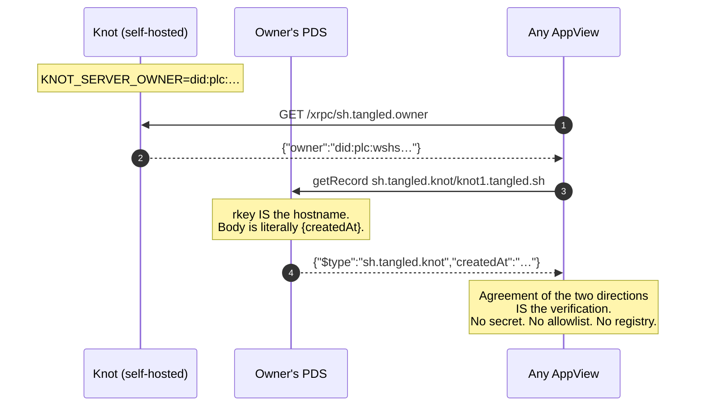
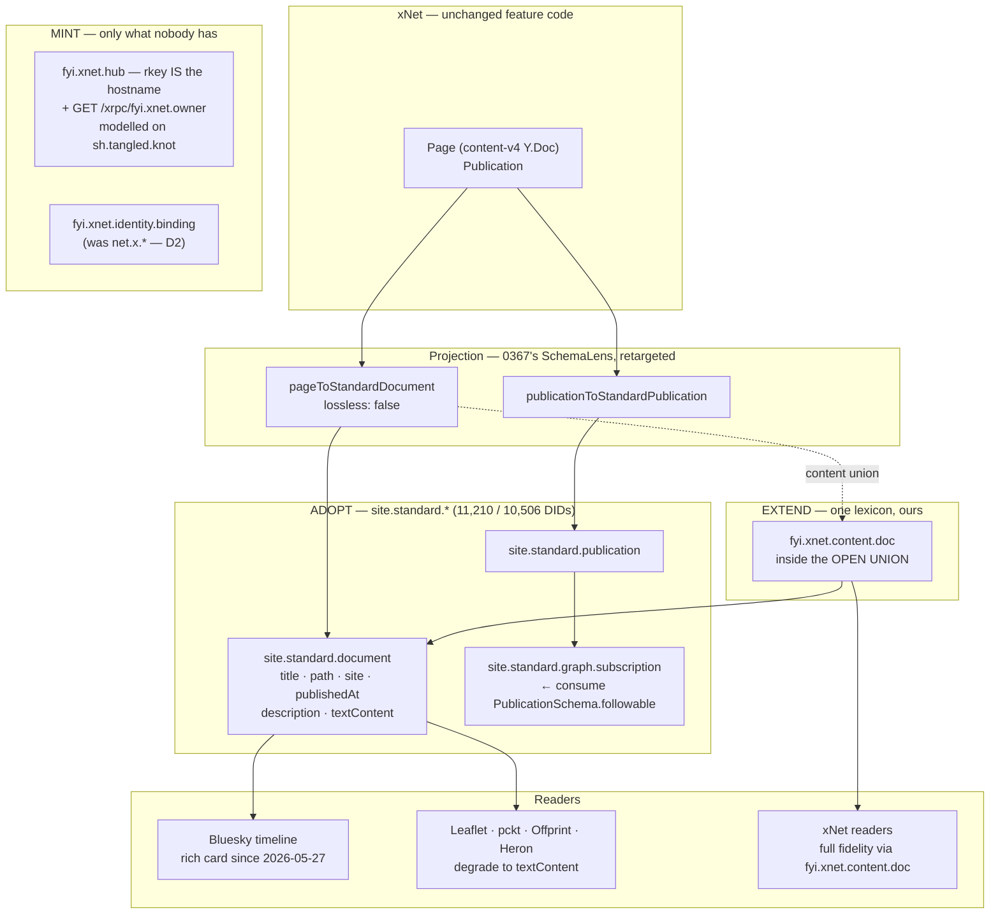
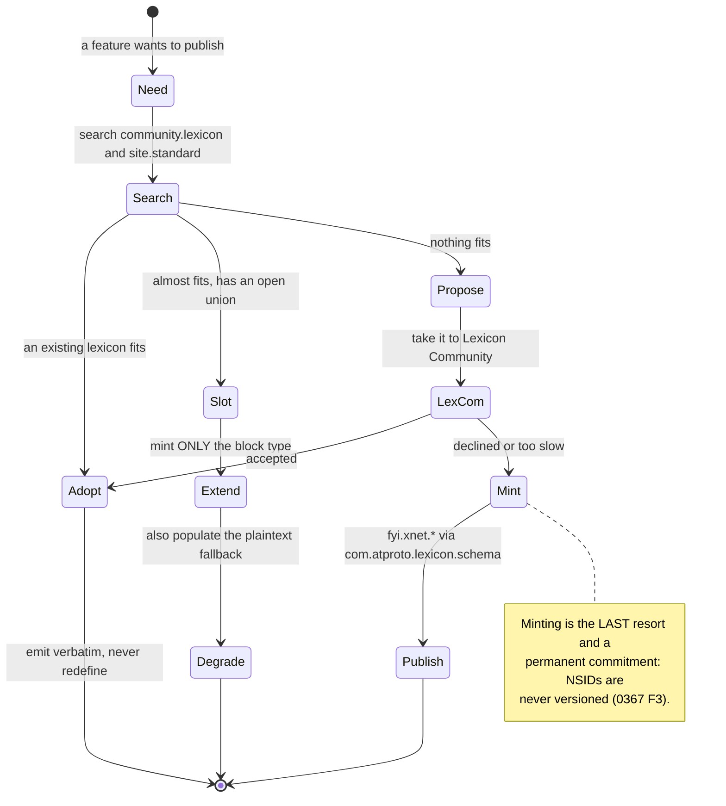
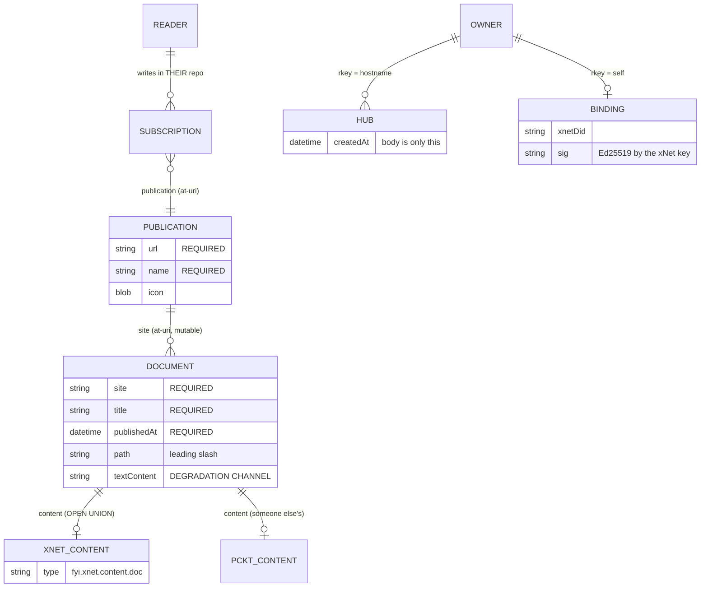
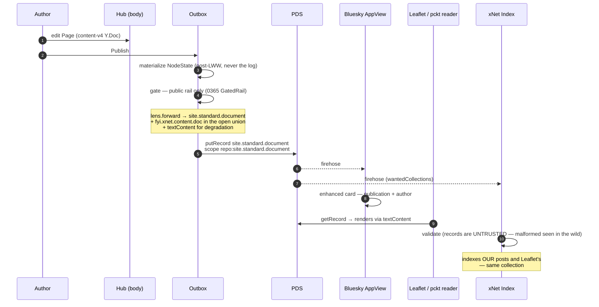

# Joining The ATmosphere — Adopt, Extend, Mint, And The Hub As A Knot

> Exploration 0372 · 2026-07-19
> Fourth in the index line: [[0365_XNET_CLOUD_AS_A_SOCIAL_SUBSTRATE]] (two rails,
> one-way door), [[0366_THE_XNET_INDEX]] (free admission), [[0367_THE_PROJECTION_MODEL]]
> (the card, the body, `SchemaLens` as the projection primitive).
> **This one amends 0367 in two places.** It keeps the projection model intact
> and changes what we project *into*, and who we build *alongside*.
>
> Sibling: [[0371_INTEGRATING_WITH_THE_MATRIX_PROTOCOL]] independently reached the
> same namespace conclusion and cites this document as 0372 for the evidence.

> _"this is not a standard for site content"_
> — Leaflet, on `site.standard.*`. The sentence that makes the whole thing
> adoptable: they standardised the **envelope** and deliberately left the
> **content** open. That is precisely the seam xNet needs.

## Problem Statement

0367 answered *how xNet speaks atproto*: a schema declares a lexicon and a lens,
an outbox projects the card, the body stays on the hub. That model survives this
document intact — it is the right shape.

But 0367 answered the mechanical question while leaving the **social** one
implicit, and its two working assumptions were:

1. that we would **mint our own lexicons** (`net.x.blog.post`, `net.x.actor.profile`,
   `net.x.community.*`); and
2. that we would **build our own index** as the primary discovery surface.

Both assumptions were reasonable in isolation. Neither survives contact with the
ATmosphere as it actually exists in July 2026. This document asks the questions
0367 deferred:

1. **Who else is out here, and what have they already agreed on?** Is there
   prior art we should adopt rather than reinvent?
2. **Is `net.x.*` even ours to mint?** (No. This turns out to be decisive.)
3. **What is the xNet hub, in ATmosphere terms?** Tangled's "knot" looks
   suspiciously like it.
4. **What does good citizenship cost, and what does it buy?** Specifically:
   does adopting someone else's lexicon get us distribution we cannot buy?
5. **Where does xNet contribute something the ecosystem does not have?**
   Integration that is purely extractive is not integration.
6. **What is shipped in our repo today, and does it actually work?**
   (Partly not — §Current State documents a live defect.)

## Executive Summary

**Verdict: xNet should join the ATmosphere as a *publisher and a server operator*,
not as a namespace. Adopt `site.standard.*` instead of minting `net.x.blog.*`;
model the hub on Tangled's knot; and contribute the one thing the ecosystem
demonstrably lacks — a collaborative, offline-capable content format behind an
open union that already has a slot for it.**

Nine findings, in descending order of how much they change the plan.

**1. `net.x.*` is unclaimable, permanently — this is a hard blocker on shipped
code.** NSIDs are DNS-rooted: authority over `net.x.*` requires control of
`x.net`. `whois x.net` returns `organisation: Internet Assigned Numbers
Authority`. **We will never control it.** Lexicon resolution for `net.x.*` can
therefore never succeed, and `_lexicon.x.net` has no TXT record (verified). Our
shipped `net.x.identity.binding` (`packages/identity/src/atproto/binding.ts:23`)
sits in a namespace belonging to IANA. 0367 listed the namespace ADR as a Phase-0
open question; **it is now answered by evidence, and the answer is `fyi.xnet.*`.**

**2. The lexicons 0367 planned to mint already exist, are vendor-neutral, and
out-adopt everything nearby.** `site.standard.*` — created jointly by Leaflet,
pckt.blog and Offprint — covers `publication`, `document`, `graph.subscription`
and `graph.recommend`. Measured live against `relay1.us-west.bsky.network`:

| Collection | DIDs holding it |
| --- | --- |
| **`site.standard.publication`** | **11,210** |
| **`site.standard.document`** | **10,506** |
| `pub.leaflet.document` (Leaflet's own, pre-migration) | 979 |
| `com.whtwnd.blog.entry` (WhiteWind's own) | 647 |
| `fyi.unravel.frontpage.post` | 86 |

**The shared lexicon out-adopts every vendor blogging lexicon on the network by
more than 10×.** It maps onto `PageSchema`/`PublicationSchema` nearly field for
field (§External Research has the table).

**3. Adopting it buys distribution we cannot otherwise buy.** Since **27 May
2026**, Bluesky's own app renders links to `site.standard.document` records as
**enhanced timeline cards** carrying publication and author metadata. WordPress
ships a plugin emitting these records. **Adoption is the cheapest distribution
channel available to xNet publishing, and it costs one lexicon decision.**

**4. The content slot is explicitly open, and it is where xNet belongs.**
`site.standard.document.content` is an **open union** (`"type": "union"`,
`"closed": false`) whose description reads: *"Each entry must specify a `$type`
and may be extended with other lexicons to support additional content formats."*
A live record fetched from a Blacksky-hosted PDS carries `blog.pckt.content`
blocks — **one app's document containing another app's content format, in
production.** So xNet mints exactly one small thing: a content block type under
`fyi.xnet.*`. Readers that understand it get xNet fidelity; everyone else falls
back to the record's `textContent` and `title`. **This is adopt-and-extend, and
it is the entire integration strategy in one sentence.**

**5. The hub is a knot — and Tangled's binding handshake is the cheapest good
idea in the ATmosphere.** Tangled attaches user-run **knot** servers (git
storage) to atproto identity with a **two-sided assertion and no registry, no
allowlist, and no shared secret**:

- the knot serves an unauthenticated `GET /xrpc/sh.tangled.owner` →
  `{"owner":"did:plc:…"}`, declaring who owns it;
- the owner's repo holds `sh.tangled.knot` **whose rkey *is* the hostname** —
  `at://did:plc:…/sh.tangled.knot/knot1.tangled.sh` — with a body of literally
  `{createdAt}`.

**Agreement between those two directions is the entire verification, and any
appview can perform it.** Registration secrets were *removed* in v1.7.0 in favour
of this. 898 DIDs hold a knot record; the same pattern registers `spindle`
(CI runners, 284). A repo record then *points* at the knot
(`{knot, repoDid, source, labels[]}`) while git objects stay on the knot. **That
is the card/body split of 0367 applied to a server rather than a document**, and
it gives the xNet hub a proven representation that makes self-hosted hubs
discoverable *without a registry we operate*.

**6. Everyone forks the social graph, and that is the ecosystem's real failure.**
Tangled minted `sh.tangled.graph.follow` (3,536 DIDs) rather than reusing
`app.bsky.graph.follow`. `site.standard.graph.subscription` is a third follow
edge. There is no shared identity or graph layer above `app.bsky.*`. **We should
not add a fourth.** Where a follow already exists, reference it; our
`PublicationSchema.followable` (shipped, defaulting to `true`, consumed by
nothing) should resolve to `site.standard.graph.subscription`, not to a new
`fyi.xnet.graph.*`.

**7. Two neutral namespaces exist, with different governance, and the choice
matters.** `community.lexicon.*` is stewarded by **Lexicon Community**, a
7-member Technical Steering Committee, MIT-licensed, decisions in public.
`site.standard.*` runs on *"minimal governance… coordination through adoption,
not committee."* Adoption tracks utility, not governance quality: Smoke Signal's
own `events.smokesignal.calendar.event` holds **41** DIDs while
`community.lexicon.calendar.event` holds **353** and
`community.lexicon.calendar.rsvp` holds **1,426**. **Shared beats vendor even
when the vendor built it first.**

**8. Lexicon resolution is live and we can use it today.** **452 DIDs** publish
`com.atproto.lexicon.schema` records. `_lexicon.standard.site` resolves to
`did=did:plc:re3ebnp5v7ffagz6rb6xfei4`, whose repo holds all eight
`site.standard.*` schemas — fetched and read directly for this document. So the
"is lexicon resolution real?" question from 0367 is settled: **yes, and it is how
we should publish `fyi.xnet.*`.**

**9. Our shipped ATProto ceremony cannot write its own binding record.**
[`site/public/oauth/atproto-client.json`](../../site/public/oauth/atproto-client.json)
declares `"scope": "atproto"`. Per atproto's own scopes guide that is
**identity-only, no data access** — yet
[`atproto-ceremony.ts:108`](../../apps/web/src/identity/atproto-ceremony.ts)
performs `com.atproto.repo.putRecord`. Corroborating evidence, measured live:
**`net.x.identity.binding` is held by 0 DIDs network-wide.** The binding half of
0338 has, as far as the network can see, never succeeded in production. The fix
is a scope string, and granular scopes (`repo:<nsid>`) have shipped.

## Current State In The Repository

> Verified against this worktree at `bd313b232`. Live network measurements taken
> 2026-07-19 against `relay1.us-west.bsky.network` and `plc.directory`.

### What is shipped, and what it does

| Surface | Path | State |
| --- | --- | --- |
| Foreign DID types | [`identity/src/atproto/did.ts`](../../packages/identity/src/atproto/did.ts) | `AtprotoDid = did:plc:… \| did:web:…`; **represent-only, never signed with** |
| Identity binding | [`identity/src/atproto/binding.ts`](../../packages/identity/src/atproto/binding.ts) | `net.x.identity.binding`, rkey `self`, dual-signature design |
| PLC rotation key | [`identity/src/atproto/rotation-key.ts`](../../packages/identity/src/atproto/rotation-key.ts) | P-256 derived from the recovery seed, HKDF-domain-separated |
| Binding verifier | [`hub/src/services/atproto-binding.ts`](../../packages/hub/src/services/atproto-binding.ts) | resolves DID doc → fetches record → checks Ed25519 sig; TTL cache + `revoke()` |
| Hub routes | [`hub/src/routes/atproto.ts`](../../packages/hub/src/routes/atproto.ts) | `GET /binding/:did`, `POST /binding/:did/recheck` |
| OAuth ceremony | [`apps/web/src/identity/atproto-ceremony.ts`](../../apps/web/src/identity/atproto-ceremony.ts) | `@atproto/oauth-client-browser` popup → passkey → `putRecord` |
| Client metadata | [`site/public/oauth/atproto-client.json`](../../site/public/oauth/atproto-client.json) | ⚠️ **`"scope": "atproto"`** — see D1 |
| Profile fields | [`schemas/profile.ts`](../../packages/data/src/schema/schemas/profile.ts) | `atprotoDid`, `atprotoHandle`, `atprotoBindingUri` |

The design quality here is high — the rotation-key work in particular is ahead
of most of the ecosystem, since it fixes the "your PDS operator can post as you"
problem that almost nobody enrols against. The defects below are integration
defects, not design defects.

### Three defects, all newly identified

**D1 — the OAuth scope cannot authorise the write it performs.**
`atproto-client.json` requests `"scope": "atproto"`. The
[scopes guide](https://atproto.com/guides/permission-sets) describes bare
`atproto` as *"the absolute minimum for an app using atproto OAuth (identity-only,
no data access)"*. The ceremony then calls `putRecord`. **Corroborated by
measurement: 0 DIDs hold `net.x.identity.binding`.** Required scope, once D2 is
resolved:

```
atproto repo:fyi.xnet.identity.binding
```

**D2 — `net.x.*` is a namespace we can never hold.** NSID authority is the
reversed DNS name. `x.net` belongs to IANA (`whois x.net`). `_lexicon.x.net` has
no TXT record and never will have one we control. Every `net.x.*` string in the
tree — `ATPROTO_BINDING_COLLECTION`, and every `net.x.*` in 0365/0366/0367 — is
squatting. `xnet.fyi` **is** ours (it serves the site today), so the namespace is
**`fyi.xnet.*`**.

> This is cheap to fix *now* and expensive later. Zero records exist in
> `net.x.identity.binding` (D1 saw to that, accidentally), so the migration cost
> is currently **zero**. It will not stay zero.

**Correction to 0367 E2 — the frontier seam landed, but nothing calls it.**
0367 reported that `publishedFrontier` was *"stored and never read."* That is now
half-wrong: [`packages/publish/src/published-doc.ts`](../../packages/publish/src/published-doc.ts)
exists, is well documented (*"recording a pin is not the same as honouring it"*),
injects its `SnapshotResolver` to avoid dragging `@xnetjs/data` into a
static-build package, and returns a tagged `'pinned' | 'live' | 'fallback'`
source. It is properly tested.

⚠️ **But `grep` finds no caller outside `published-doc.test.ts`.** `render.ts`
and `site.ts` still do not use it. **The mechanism is built and unwired** — so
the reader-visible bug from 0367 E2 persists, while the hard part of the fix is
already done. Phase 0 is now a wiring task, not a design task.

**D3 — `did:key` hardcoding still blocks `did:plc`** — carried forward from
0367's F2, unchanged. `packages/data/src/schema/node.ts:144` pins
`` DID = `did:key:${string}` `` with runtime prefix checks. Note the asymmetry
worth preserving: `packages/identity` already models foreign DIDs correctly
(`did.ts` is exemplary); it is `packages/data` that is narrow.

### The mapping is already nearly exact

`PublicationSchema` ([`publication.ts`](../../packages/data/src/schema/schemas/publication.ts))
versus `site.standard.publication` (fetched live from the authority repo):

| xNet `Publication` | `site.standard.publication` | Note |
| --- | --- | --- |
| `title` | `name` (required) | rename |
| `description` | `description` | ≤30,000 / 3,000 graphemes |
| `baseUrl` | `url` (required) | *"Avoid trailing slashes"* |
| `basePath` | — | folds into `document.path` |
| `authors[]` | — | belongs on the document (`contributors`) |
| `followable` | → `graph.subscription` exists | **consume it** |
| — | `icon` (blob), `basicTheme`, `preferences.showInDiscover` | gaps to fill |

`PageSchema` ([`page.ts`](../../packages/data/src/schema/schemas/page.ts))
versus `site.standard.document`:

| xNet `Page` | `site.standard.document` | Note |
| --- | --- | --- |
| `slug` | `path` | *"Prepend with a leading slash"* |
| `publication` | `site` (required, at-uri **or** https) | mutable ref, follows edits |
| `title` | `title` (required) | |
| `excerpt` | `description` | |
| `publishedAt` | `publishedAt` (required) | |
| — | `updatedAt` | we have it in the log |
| `tags` (relation) | `tags` (string[]) | lens flattens |
| `canonicalUrl` | via `site` + `path` | |
| `content-v4` Y.Doc | `content` **open union** + `textContent` | **the extension point** |
| `publishedFrontier` | — | stays local (still unread — 0367 E2) |
| `visibility` | — | never projected; the one-way door (0365) |

**Two required fields we do not have** — `site` and `publishedAt` are mandatory
on `site.standard.document`. `publishedAt` we have; `site` means **a Page cannot
be projected unless it belongs to a Publication.** That is a modelling
consequence, not a blocker: loose documents can point `site` at an `https://` URL
per the lexicon's own description.

### The hub, read as ATmosphere infrastructure

`packages/hub` already exposes exactly the surfaces a knot exposes — storage,
auth, access grants, federation, discovery, crawl — and nothing about it is
atproto-shaped today:

```
packages/hub/src/routes/     audit backup billing byo-oidc crawl dids export
                             federation files keys public recovery-anchor
                             schemas shards share-links tasks telemetry unfurl
                             atproto.ts  ← the only atproto-aware route
```

There is **no `lexicons/` directory** in the repo, and `@atproto/api` is not a
dependency anywhere — only `@atproto/oauth-client-browser`, in `apps/web`. So the
publishing path 0367 designed has no scaffolding yet, which is convenient: there
is nothing to migrate.

## External Research

### The ATmosphere, measured

Every number below was obtained by paging
`com.atproto.sync.listReposByCollection` against
`relay1.us-west.bsky.network` on 2026-07-19. It counts **DIDs holding at least
one record**, not records — a much better adoption proxy than record volume,
which a handful of bots can dominate.

| Collection | DIDs | Reading |
| --- | --- | --- |
| `sh.tangled.actor.profile` | **11,543** | Tangled's real user base |
| `site.standard.publication` | **11,210** | the shared publishing envelope |
| `site.standard.document` | **10,506** | |
| `sh.tangled.repo` | 4,310 | repos, not users |
| `sh.tangled.publicKey` | 3,935 | **SSH keys as atproto records** |
| `sh.tangled.graph.follow` | 3,536 | ⚠️ a *fourth* follow lexicon |
| `sh.tangled.feed.star` | 3,430 | stars as records |
| `place.stream.chat.message` | 2,539 | Streamplace |
| `community.lexicon.calendar.rsvp` | 1,426 | shared > vendor |
| `sh.tangled.repo.issue` | 930 | issues **are** records |
| `sh.tangled.knot` | 898 | **server announcements** |
| `pub.leaflet.document` | 979 | Leaflet, pre-migration |
| `sh.tangled.repo.pull` | 805 | PRs are records |
| `site.standard.graph.recommend` | 768 | |
| `com.whtwnd.blog.entry` | 647 | WhiteWind |
| `social.grain.photo` / `.gallery` | 517 / 508 | Grain |
| `com.atproto.lexicon.schema` | **452** | **lexicon publishing is real** |
| `community.lexicon.calendar.event` | 353 | |
| `community.lexicon.bookmarks.bookmark` | 288 | |
| `sh.tangled.spindle` | 284 | CI runners, announced as records |
| `fyi.unravel.frontpage.post` | 86 | Frontpage — effectively dormant |
| `my.skylights.rel` | 68 | |
| `blue.zio.atfile.upload` | 44 | |
| `events.smokesignal.calendar.event` | 41 | ⚠️ vendor lexicon, **8.6× smaller than the shared one** |
| **`net.x.identity.binding`** | **0** | **ours. zero. (D1)** |

Three conclusions fall straight out:

- **Shared namespaces win.** Smoke Signal's own event lexicon lost to
  `community.lexicon.calendar.event` by 8.6×; Leaflet's own document lexicon lost
  to `site.standard.document` by 10.7× — **including Leaflet's own migration.**
- **Tangled proves that heavy collaboration artefacts can be atproto records.**
  Issues (930), PRs (805), stars (3,430), SSH keys (3,935) and *server
  registrations* (898) are all records. The git objects are not.
- **A collection with 0 holders is a collection nobody implemented** — including
  us.

### `site.standard.*` — what it is and why it exists

Origin: announced **23 January 2026**. *"a conversation between developers
building long-form platforms… Each had working implementations. Each had defined
similar schemas. Coordination was the missing piece."* Leaflet, **pckt.blog** and
**Offprint** agreed on one schema instead of three.

Governance: *"minimal governance… coordination through adoption, not committee,"*
*"maintained by the developers building on it."* Concretely that is a **three-person
core** — one from each founding app — with the lexicon repo hosted on **Tangled,
not GitHub**, under MIT. Consensus among active implementers; no committee.

**The namespace is genuinely neutral, and DNS proves it:**
`_lexicon.standard.site` → `did:plc:re3ebnp5v7ffagz6rb6xfei4`, while
`_lexicon.leaflet.pub` → `did:plc:btxrwcaeyodrap5mnjw2fvmz`. **Different DIDs,
different PDS hosts.** `site.standard.*` is not a rename of Leaflet's namespace
under Leaflet's identity — it is a separate authority. That distinction is the
whole reason adopting it is not vendor lock-in wearing a neutral hat.

The four records: `publication`, `document`, `graph.subscription`,
`graph.recommend` — plus `theme.basic`, `theme.color`, `authSocial`, `authFull`
(eight `com.atproto.lexicon.schema` records in the authority repo at
`did:plc:re3ebnp5v7ffagz6rb6xfei4`, reachable via `_lexicon.standard.site`).

**The deliberate omission is the important part.** Leaflet: *"this is not a
standard for site content"* — platforms stay free to *"explore different
things… from block-based editors to unique theming."* The `content` field is:

```json
"content": {
  "type": "union",
  "refs": [],
  "closed": false,
  "description": "Open union used to define the record's content. Each entry
     must specify a $type and may be extended with other lexicons to support
     additional content formats."
}
```

`refs: []` with `closed: false` — **an empty open union.** It imposes nothing and
accepts anything typed. A production record fetched for this document (from a
PDS at `blacksky.app`) carries `blog.pckt.content` → `blog.pckt.block.text` with
`blog.pckt.richtext.facet#didMention` facets, inside a `site.standard.document`.
**Cross-app content embedding is not theoretical; it is deployed.**

Alongside it sits `textContent`: *"Plaintext representation of the documents
contents. Should not contain markdown or other formatting."* That is the
graceful-degradation channel — **the reason a reader that has never heard of
xNet can still render an xNet post.**

Migration mechanics, from Leaflet's own writeup: they migrated publication,
document and subscription records while *"keeping all existing Leaflet records
around, so that other tools querying them won't break."* Active users migrated
automatically; others on next login.

> This nuances 0367's claim that *"zero examples of anyone dual-writing were
> found."* Leaflet did not dual-*write* new content to both namespaces — but they
> **retained** the old records indefinitely rather than deleting them. The rule
> to carry forward is: **new writes go to the new NSID; old records are never
> deleted.**

### The distribution payoff

On **27 May 2026** Bluesky shipped enhanced rendering for `site.standard`
links: a link to a document record gets *"an enhanced render in the Bluesky app,
with extra, actionable metadata about the post, including the publication and
author,"* across web and mobile. WordPress — *"the CMS that powers over 40% of
the internet"* — ships a plugin emitting a Standard.site record per post.

**This is the asymmetry that decides the namespace question.** A `fyi.xnet.blog.post`
record is a link Bluesky renders as a generic URL card. A `site.standard.document`
record is a link Bluesky renders as a publication-attributed article card. Same
engineering effort; one of them is invisible.

### Tangled — the closest structural analogue to xNet

Tangled is a git collaboration platform on atproto (>7,000 users, >5,000 repos
as of March 2026; €3.8M seed, Tangled Labs Oy, Finland). Its architecture is the
one xNet is already half-way to, and it is the single richest source of
transferable design in this document.

**The knot binding handshake — registry-free, secret-free, symmetric.**



Registration secrets existed and were **deliberately removed in v1.7.0**, replaced
by standard atproto inter-service auth JWTs — *"decoupling knots from appview by
removing the registration secret."* `knot guard` does role-based access control
for git-over-SSH via an `AuthorizedKeysCommand`, with public keys published as
`sh.tangled.publicKey` records.

> **Lexicon evolution, caught in the act.** The `sh.tangled.knot` record I sampled
> live is from May 2025 and has rkey `3lq35uwofw522` (a TID) with a `host` field
> in the body. Current records use the **hostname as the rkey** and carry only
> `createdAt`. Both are live in the same collection under the same NSID. This is
> exactly the retain-don't-delete pattern, and it is what schema evolution
> actually looks like in production.

**Four more transferable specifics:**

- **Repos are themselves DIDs.** Since v1.13.0 knots mint a `did:plc` per
  repository *"so repositories [are] stable across renames and transfers."* The
  DID document's `#atproto_pds` endpoint points at the knot — a **pointer
  convention, not a real PDS** (`com.atproto.repo.describeRepo` 404s against it).
- **PR patches are PDS blobs.** `sh.tangled.repo.pull.rounds[]` is an append-only
  array of `{createdAt, patchBlob}` where the blob is *"gzipped text-based git
  format-patches."* Review state is portable independent of the knot. The lexicon
  carries its own warning that *"appviews may reject records [that] do not treat
  this field as append-only"* — **the LWW-vs-append hazard, stated in a lexicon.**
- **Bobbin, their appview, is diskless and in-memory.** The entire Tangled
  dataset is **100–200 MB in RAM** (100 MB compressed) and the index is
  **rebuilt from upstream on every restart** — 15 min originally, targeting
  <90 s. `sh.tangled.bobbin.getCoverage` returns live readiness
  (`{"ready":true,"eventsProcessed":124356}`). **This is the strongest available
  validation of 0366/0367's claim that a narrow index is cheap** — an entire
  social code-forge network fits in a laptop's RAM.
- **Their anti-spam answer is a web of trust, not a score.** `sh.tangled.graph.vouch`
  (`kind: vouch|denounce`, `reason`, `evidences[]` of at-URIs) exists because
  LLMs made *"code that looks correct but is subtly wrong"* cheap. Crucially:
  **you see verdicts only from your direct circle and people you vouched for —
  there is no global reputation number**, and denouncement is informational
  rather than blocking. That is Charter §3-compatible moderation designed by
  someone else, and worth studying before we invent our own.

**Two cautions, both important.**

⚠️ **Tangled is migrating data *off* the PDS, not onto it.** v1.15.0 moved knot
members and repo collaborators to knot-owned XRPC; v1.16.0 moved CI pipeline data
to spindle-owned storage — *"The appview no longer stores pipeline runs."*
`sh.tangled.ci.pipeline` is explicitly *"Record-like, but owned by the spindle
rather than a PDS."* **This is a real-world counterexample to "put everything in
the user's repo,"** and it points the same direction as 0367's card/body split:
records for the things that must be portable, service storage for the rest.

**And Tangled is not alone — this is the ecosystem-wide pattern.** Streamplace
declares `place.stream.segment` as a `record` type but **never writes one to a
repo**; segment metadata lives in SQLite and is converted to the lexicon shape at
response time, making it a lexicon-typed *wire format* rather than repo state.
Roomy keeps messages in Leaf, not atproto. Smoke Signal's index was always
derived. **Across four independently-built apps, only small, low-frequency,
public artefacts live in repos, and the heavy payload lives elsewhere.** The repo
is being used as a pointer-and-identity layer.

> That is 0367's card/body split, arrived at independently by four teams who had
> no reason to coordinate. It is the strongest available evidence that the split
> is forced by the medium rather than chosen by us — and it should raise our
> confidence in 0367's Phase 2 considerably.

⚠️ **They break wire format without bumping NSIDs.** v1.14.0 changed
`sh.tangled.repo.pull`, `.collaborator`, `.issue` and `sh.tangled.git.refUpdate`
simultaneously. Viable only because their consumer set is small and known — it is
not a pattern to copy, and 0367 already recorded it.

Finally, they minted `sh.tangled.graph.follow` rather than reusing
`app.bsky.graph.follow`, so a Tangled follow and a Bluesky follow are different
edges between the same two people.

> **One incidental finding with direct bearing on our namespace decision:**
> `tangled.sh` now 301-redirects to `tangled.org`, **but the NSID namespace is
> still `sh.tangled.*`.** An NSID outlives the domain it was named after. Picking
> `fyi.xnet.*` therefore does not marry us to `xnet.fyi` forever — it only
> requires that we control it *at minting time*, which we do.

### Neutral namespaces: two models

| | **Lexicon Community** (`community.lexicon.*`) | **Standard.site** (`site.standard.*`) |
| --- | --- | --- |
| Governance | 7-member Technical Steering Committee, public decisions | *"minimal governance… adoption, not committee"* |
| Licence | MIT | free to use/fork/remix |
| Process | chartered working groups, Discourse, governance repo | agreement between implementers |
| Strength | legitimacy, durability, neutrality | speed, and actual adoption |
| Domains | calendar/events, bookmarks, location | long-form publishing |

**Both are better homes than a vendor namespace.** For publishing, `site.standard.*`
is the live one. For anything xNet needs that neither covers, the escalation path
should be: propose to Lexicon Community first, mint under `fyi.xnet.*` only if
that fails or is too slow.

### Cross-app reuse is real — and it fails for a reason worth internalising

Three verified cases of one app reading or writing another's lexicon:

- **`community.lexicon.calendar.*` across four apps with "zero coordination
  between the projects."** Live records in one user's repo carry
  `"createdWith": "https://atmo.rsvp"` while being indexed by Smoke Signal —
  a different app, a different developer, the same schema, the same repo.
- **Bookhive vendors Popfeed's lexicons into its own repo**, declaring the
  *foreign* NSIDs (`social.popfeed.feed.list`, `.listItem`), subscribing to those
  collections on Jetstream, and resolving foreign records into its own catalogue.
- **WhiteWind reads `app.bsky.feed.post` for comments** rather than defining a
  comment type — the cheapest possible reuse.

**The negative result is the more useful one.** Bookhive and Skylights both
*wanted* book interop and said so publicly. Neither ever read the other. The
stated reason: *"there isn't a canonical identifier for a book."* That single
disagreement drove opposite storage decisions — Bookhive put ISBN/Goodreads
metadata on the PDS, Skylights kept a bare `{ref, value}` tuple keyed to
OpenLibrary — and non-overlapping identifier spaces made cross-reads mechanically
impossible. Events, by contrast, need no canonical external identifier, which is
exactly why the calendar lexicon succeeded across four apps.

> **The rule: shared lexicons fail on identifier schemes, not on schemas.**
>
> For us this lands directly on `site` + `path`. A `site.standard.document`'s
> identity is *(publication at-URI, path)* — a scheme we do not control and
> cannot extend. If our `slug` semantics ever drift from their `path` semantics,
> interop breaks quietly and no schema check catches it. **Pin the identity
> mapping in a golden test, not in a comment.**

### The pattern most worth stealing — Flashes

Flashes needed multi-photo carousels past Bluesky's four-image cap. Rather than
mint a rival post type, `blue.flashes.feed.post` is a **thin wrapper** whose
payload is a `childrenPostURIs` array pointing at *genuine* `app.bsky.feed.post`
records in the same repo.

**A custom NSID used purely as a grouping layer, whose leaves are canonical
records.** It gets app-specific structure without forfeiting network reach: every
Flashes post is also, really, a Bluesky post. This is a third option beyond
"adopt theirs" and "mint ours", and it is worth holding in reserve for any xNet
construct that groups things others already understand.

### The ecosystem's pivot point: permissioned data

This is the most strategically relevant late finding, because it sits directly on
0365's gated rail.

**Blacksky has shipped `rsky-space`** — *"Rust primitives for atproto
permissioned data (spaces) — a parallel protocol to public atproto broadcast."*
Its own description:

> *"stores a user's records for a shared context ('space') in a per-user
> permissioned repo on that user's own PDS, summarized by a deniable LtHash
> commit, gated by short-lived credentials issued by a space authority. Apps sync
> directly from each member's PDS (there is no relay)."*

Modules include `lthash` (homomorphic, order-independent set hashing over
BLAKE3-XOF), `commit` (deniable signature + HKDF/HMAC MAC), `credential` and
`space_id`. **Blacksky, Northsky and Habitat are implementing proposal 0016 in
parallel, and Roomy is explicitly blocked waiting for it.**

Two things follow. First, 0367's advice — *revisit, do not build on it* — still
holds: it remains a proposal on a WIP branch, and *"access control, not
confidentiality"* is not our trusted tier. Second, and more importantly:
**several independent teams are converging on "per-member repo on the member's
own PDS, gated by credentials from an authority, no relay" — which is
structurally very close to xNet's hub grants** (0359's *membership is a grant,
not a row*; 0343's trusted tier). This is the one place where the ecosystem may
arrive at our model rather than us adopting theirs, and it deserves its own
exploration rather than a paragraph here.

### Other ecosystem members, briefly

- **Blacksky** — a full independent stack (`rsky`, ~20 crates: PDS on Postgres +
  S3, relay tracking 36M+ accounts, Ozone labeler, AppView), community-governed,
  dedicated to Black social media. **It is the existence proof that an independent
  operator can run the whole stack**, and it showed up unprompted here as the PDS
  hosting a `site.standard.document` we sampled. Two details worth carrying:
  its labeler declares label values like **`misogynoir`** and
  `antiblack-harassment`, localised — *that vocabulary is the entire argument for
  independent moderation in one record*; and its PDS advertises
  `availableUserDomains: ['.myatproto.social', '.blacksky.app',
  '.cryptoanarchy.network', '.latinsky.app', '.afrolatinsky.app']`, i.e. **one
  operator hosting several distinct communities** — directly relevant to 0359.
  ⚠️ Its AppView is a **TypeScript fork** of Bluesky's with a Rust firehose
  consumer, so "full Rust stack" is shorthand.
- **Hubble** (microcosm.blue, announced March 2026) — a real-time **public mirror
  of every public repo on the network**, for *"when a PDS disappears."* Funded by
  a **$20,000 Bluesky grant** covering development *and* a year of operation, with
  Bluesky adopting the instance if it proves unsustainable. Relevant to 0366 in
  two ways: it is another datapoint that whole-network infrastructure is
  cheap, and it is a funding model for public goods that does not involve rent.
- **Leaflet / pckt.blog / Offprint** — the `site.standard.*` founding trio;
  Leaflet is the one whose gated-content handling 0367 already studied.
- **Streamplace** (`place.stream.*`) — livestreaming; `place.stream.chat.message`
  at 2,539 DIDs is a reminder that high-frequency chat *does* get put on atproto,
  though it says nothing about whether it should.
- **Smoke Signal** — events; the instructive case of a vendor lexicon losing to
  the community one. ⚠️ **And it is sunsetting as of July 2026** — verified live:
  `GET /` returns **200** while `GET /event` and `GET /oauth/login` return
  **410 Gone**. It is now a read-only archive of ~20,000 events. **But the records
  survive on users' PDSes and are still readable by atmo.rsvp and
  dandelion.events, because they are in the shared namespace.** That is the
  clearest demonstration in the ATmosphere of why adopting a community lexicon is
  a user-facing durability guarantee and not merely good manners: *the app died
  and the data did not.*
- **Frontpage** (`fyi.unravel.frontpage.post`, 86 DIDs) — ⚠️ **correction: alive**,
  in maintenance mode (site returns 200; repo pushed July 2026). Low adoption is
  not death. It has **not** published a `_lexicon` TXT record, so its namespace
  authority is unproven — a reminder that most projects skip that step.
- **Grain** (photos, 517/508) — note it minted **its own `graph.follow`**, a
  fifth follow edge.
- **Skylights** (68 DIDs) — ⚠️ **dead**; migrated to Popfeed. The clearest case
  for depending on shared lexicons rather than on any single app.
- **WhiteWind** (647) — running, but no code push since October 2025.
- **Streamplace** — see the caution below; its `place.stream.segment` is declared
  a record and **never actually written to a repo**.

### Protocol surfaces that changed since 0367

**Granular OAuth scopes have shipped, and there is now a real spec** at
[`atproto.com/specs/permission`](https://atproto.com/specs/permission) — five
resource types (`repo`, `rpc`, `blob`, `identity`, `account`), syntax
`resource[:positional][?params]`:

```
repo:site.standard.document                              # full CRUD, one collection
repo:fyi.xnet.identity.binding?action=create&action=update
blob?maxSize=1000000
rpc:app.bsky.feed.getFeedSkeleton?aud=*
```

Live on bsky.social since **August 2025**; **permission sets** (lexicon-defined
bundles with user-facing titles, cached by the auth server) came later.

> ⚠️ **Two hazards for D1's fix.** First, **there is no prefix matching** —
> `repo:site.standard.*` is invalid; every NSID must be enumerated. (Note the
> asymmetry with Jetstream's `wantedCollections`, which *does* take prefixes —
> easy to conflate.) Second, **older PDSes reject the new scope syntax in
> `client-metadata.json` outright**, which can break an already-deployed client
> against a self-hosted PDS. Roll the scope change out behind a check, not
> blind.
>
> ⚠️ Proposal `0011-auth-scopes` and the shipped spec have **diverged**. Trust
> `/specs/permission`.

- **Lexicon resolution is live — but the rails are built and the traffic is
  not.** `_lexicon.<reversed-nsid-authority>` TXT → `did=…` →
  `com.atproto.lexicon.schema` records in that DID's repo. 452 DIDs publish
  schemas this way; `@atproto/lexicon-resolver` is at v0.4.10 (17 Jul 2026).
  Verified end-to-end for `site.standard.*` while writing this. Three caveats,
  each measured:
  - **Resolution is non-hierarchical, and here is the proof.**
    `_lexicon.lexicon.community` has **no TXT record**, while
    `_lexicon.calendar.lexicon.community` resolves to
    `did:plc:2uwoih2htodskvgocarwv5eq`. **Each NSID group needs its own record;
    nothing cascades.** Plan one TXT per group, not one per domain.
  - **The spec'd XRPC method is not deployed.**
    `com.atproto.lexicon.resolveLexicon` returns
    `{"error":"MethodNotImplemented"}` on `public.api.bsky.app` (verified).
    Resolution today is **client-side DNS + `getRecord`**, not a service call.
  - Publication is *"not currently required"* but *"strongly advised"*, and
    Bluesky's own index (`lexidex.bsky.dev`) lists roughly **11 authorities**.
    Adoption is in the low tens. **Publishing ours would put us in early
    company, not late.**
- **Lexicon etiquette, from the spec:** reuse freely; you may **not** redefine
  another org's lexicon; changes must be backward-compatible or you mint a new
  name. *"The primary mechanism for resolving protocol disputes is to fork
  Lexicons into a new namespace."* Injecting extra fields into records you do not
  own is *"not the recommended way… but it is not specifically disallowed"* —
  **note that our content-union extension is not this**; it is the sanctioned
  path, because the union was left open on purpose.
- ⚠️ **NSID authority is DNS-based but unenforced**: the spec states there is *"no
  automated mechanism for verifying domain control."* Minting `net.x.*` would
  therefore *work* — nothing stops us. It would simply be squatting on IANA's
  domain, unresolvable forever, and indefensible if challenged. **The absence of
  enforcement is not permission.**
- **Records in the wild are malformed, exactly as 0367's E22 predicted.** A
  sampled `community.lexicon.calendar.event` record contains
  `"createdAt": {}` (an object where a datetime belongs) and `"endsAt": null`.
  It is live on a production PDS, served by the relay. **Validate on ingest.**

### Governance — the layers we depend on are the least governed

- **An IETF working group now exists**: "Authenticated Transfer (ATP)", charter
  approved **19 March 2026**. Two Internet-Drafts, **zero RFCs**. Its scope is
  repository structure, record encoding, sync and `at:` URIs — and **Lexicon and
  application semantics are explicitly out of scope.** So the layer this document
  is entirely about remains Bluesky-controlled and unstandardised. That is the
  strongest argument for preferring community namespaces over `app.bsky.*`.
- **PLC**: self-hostable **read replicas** shipped 18 Feb 2026 (~150 GB, with
  continuous audit of the primary). That buys independent witnesses, not
  decentralisation — writes still go to one operator. The announced Swiss
  association to run the directory remains ⚠️ **unconfirmed** ten months on.
- **Bluesky PBC**: $100M Series B (Bain Capital Crypto, closed April 2025,
  disclosed March 2026); Jay Graber stepped down as CEO in March 2026; Toni
  Schneider confirmed permanent CEO **10 July 2026**. ⚠️ Reports of layoffs are
  **unverified** — treat as rumour. The relevant read for us is not gossip: it is
  that protocol neutrality and commercial pressure are both increasing at once,
  which is exactly when *"depend on shared lexicons, not on one company's
  app"* stops being a principle and starts being risk management.
- **Permissioned data (proposal 0016) remains unbuildable** — *"a proposal, not
  the final specification"*, on a WIP branch, and *"provides access control, not
  confidentiality. It is not end-to-end encrypted."* 0367's advice to revisit but
  not build on it stands unchanged.
- **Moderation**: consuming labels is optional for an independent AppView, but
  honouring **`#account`** (`active: false` → `takendown`/`suspended`/`deleted`)
  is not. ⚠️ Note a correction to 0367's E17: **`#tombstone` has been fully
  removed** from `subscribeRepos`, not deprecated — do not write a handler for
  it. ⚠️ There is **no official atproto guidance on DSA/P2B obligations for
  third-party AppView operators**; 0366 assumed more clarity here than exists.

> ⚠️ **Correction for our own references:** `atproto.com/community` does **not**
> exist — it redirects to `docs.bsky.app/showcase`. There is no "AT Protocol
> Foundation." Community scaffolding lives at `atprotocol.dev`.

## Key Findings

1. **`net.x.*` belongs to IANA and can never be ours.** The namespace is
   `fyi.xnet.*`. Cost to fix today: zero records.
2. **Our OAuth client requests identity-only scope but performs a repo write** —
   and the network shows 0 binding records, consistent with silent failure.
3. **`site.standard.*` already is the lexicon 0367 planned to mint**, with
   11,210/10,506 DIDs and a near-exact field mapping to our shipped schemas.
4. **Bluesky renders `site.standard.document` links as rich timeline cards since
   27 May 2026** — adoption buys distribution that minting cannot.
5. **`site.standard.document.content` is an empty open union**, explicitly
   documented as an extension point, with cross-app content embedding already in
   production. This is where xNet's format goes.
6. **`textContent` is the degradation channel** that lets non-xNet readers render
   xNet posts — the BATNA guarantee, expressed in someone else's lexicon.
7. **Shared lexicons beat vendor lexicons empirically**, 8.6× for events, 10.7×
   for documents — including against the vendor that created them.
8. **The hub is structurally a knot**, and knot binding is a **registry-free,
   secret-free two-sided assertion** — service declares its owner DID over XRPC,
   the owner's repo declares the hostname *as the rkey*. Copy it exactly.
9. **Heavy collaboration artefacts can be records** — Tangled puts issues, PRs,
   stars, SSH keys and even **gzipped git patches (as blobs)** on atproto, and
   keeps only git objects on the knot.
10. **…but Tangled is now moving data *back off* the PDS** (members v1.15, CI
    v1.16). Records for what must be portable; service storage for the rest.
    This is independent confirmation of 0367's card/body split.
11. **An entire ATmosphere app's dataset fits in 100–200 MB of RAM** (Bobbin,
    rebuilt from scratch on every restart). 0366/0367's cheap-index thesis is
    validated by someone else's production system.
12. **Tangled's anti-spam design is circle-scoped vouching with no global score**
    — Charter §3-compatible moderation, already built and worth studying.
13. **Nobody has solved the shared social graph**; there are at least four follow
    edges. **Do not add a fifth.**
14. **Two neutral namespaces exist with different governance models**; escalate
    to Lexicon Community before minting.
15. **Lexicon resolution works today** and is how `fyi.xnet.*` should be published;
    it is **non-hierarchical**, so each NSID group needs its own TXT record.
16. **Granular scopes have no prefix matching**, and **old PDSes reject the new
    scope syntax** — both bite D1's fix.
17. **IETF chartered an ATP working group in March 2026 — with Lexicon explicitly
    out of scope.** The layer we integrate at is the least governed one, which
    argues for community namespaces over vendor ones.
18. **An NSID outlives its domain**: `tangled.sh` → `tangled.org`, namespace still
    `sh.tangled.*`. `fyi.xnet.*` does not marry us to `xnet.fyi` forever.
19. **Malformed records are confirmed in production**, validating 0367's E22.
    Separately, **`#tombstone` has been removed** — a correction to 0367's E17.
20. **Shared lexicons fail on identifier schemes, not on schemas** (Bookhive ↔
    Skylights, who both wanted interop and never achieved it). For us the risk
    surface is `site` + `path` versus our `slug`. Pin it in a golden test.
21. **Apps die and shared-lexicon data survives them.** Smoke Signal sunset in
    July 2026 — write paths return 410 — yet its users' events remain readable by
    atmo.rsvp and dandelion.events because they are in `community.lexicon.*`.
    **This is the BATNA argument made concrete, by someone else's failure.**
22. **Four independent teams keep the heavy payload off the PDS** (Tangled,
    Streamplace, Roomy, Smoke Signal). 0367's card/body split is convergent
    design, not our invention.
23. **Permissioned data is the ecosystem's pivot point**, and Blacksky's
    `rsky-space` — per-member repo on the member's own PDS, credentials from a
    space authority, **no relay** — is structurally close to xNet hub grants.
    Worth its own exploration.
24. **Flashes' wrapper pattern** — a custom NSID whose leaves are canonical
    foreign records — is a third option beyond adopt-or-mint. Keep it in reserve.
25. **Lexicon resolution's XRPC method returns 501**; adoption is ~11 authorities.
    The rails exist, the traffic does not. Publishing ours puts us early.

## Options And Tradeoffs

### The namespace question (settled by evidence, but stated for the record)

**Option A — keep `net.x.*`.** *Rejected.* IANA holds `x.net`. Lexicon
resolution can never succeed; we would be permanently squatting, and any
third-party implementer would have no way to fetch our schemas.

**Option B — `fyi.xnet.*` (recommended).** We control `xnet.fyi`. Publishable via
`_lexicon.xnet.fyi` + `com.atproto.lexicon.schema`. Cost: a string change in
`binding.ts`, and a correction pass over 0365/0366/0367.

**Option C — `did:web:xnet.fyi`-rooted or a purchased short domain.** Deferred
vanity. NSIDs are read by developers, not users.

### What we publish into

**Option D — mint `fyi.xnet.blog.post` (0367's Phase 1 as written).**
*For:* total control of the shape; no dependency on another group's decisions.
*Against:* invisible to Bluesky's enhanced cards; invisible to every
`site.standard` reader; we would be the 4th blogging lexicon on a network that
already consolidated onto one. **Rejected.**

**Option E — adopt `site.standard.*` wholesale, publish no content (recommended
core).** Emit `publication` + `document` with `title`, `path`, `site`,
`description`, `publishedAt`, `textContent`. *For:* immediate rich rendering in
Bluesky; readable by Leaflet/pckt/Offprint/Heron; zero lexicon governance
overhead. *Against:* we inherit their evolution decisions; `site` is required, so
loose Pages need a fallback.

**Option F — adopt `site.standard.*` **and** mint one content block type
(recommended full).** E, plus `fyi.xnet.content.*` inside the open union.
*For:* full xNet fidelity for xNet readers, graceful degradation for everyone
else, and we contribute rather than only consume. *Against:* one lexicon we must
version honestly, forever.

**Option G — dual-publish `site.standard.*` and `fyi.xnet.*` documents.**
*Against:* doubles the write budget against 0367's measured **0.46 creates/s**
ceiling, and creates two records that can disagree. **Rejected** — and Leaflet's
retain-don't-dual-write pattern is the better precedent.

### How the hub appears on atproto

**Option H — invisible hub.** Status quo. Hubs are discovered out of band.
*Against:* self-hosted hubs are undiscoverable, which undercuts 0360's
mirror-not-master posture and 0300's Raspberry Pi story.

**Option I — `fyi.xnet.hub` + `fyi.xnet.owner` handshake (recommended).** Copy
Tangled exactly: hub serves `GET /xrpc/fyi.xnet.owner` → `{owner: did}`; the
owner's repo holds `fyi.xnet.hub` with **the hostname as the rkey** and
`{createdAt}` as the body. *For:* self-hosted hubs become enumerable network-wide
via `listReposByCollection` — **for free, by anyone, including people who do not
use our index** — and verification needs no secret, no allowlist and no service
we operate. That is the strongest possible form of 0366's reproducibility claim,
and it is the one place where mirror-not-master (0360) becomes mechanical rather
than aspirational. *Against:* the two-sided assertion proves *ownership*, not
*behaviour* — a hub can serve whatever it likes under its owner's DID. Tangled
has the same gap; we should say so plainly rather than imply more.

> The hub already has a signing key, so we can cheaply do one better than Tangled:
> sign the hostname with it and include the signature. Optional, backward-compatible,
> and it closes the gap between "asserted" and "proven". See Phase 2.

**Option J — full knot-equivalence: put grants, spaces and membership on atproto.**
*Against:* collides head-on with 0365's gated rail and 0359's *membership is a
hub grant, not a row*. **Rejected on charter grounds**, not technical ones.

### Revenue lanes — Charter §6 tests

0367's lanes are unchanged. This document adds one *reduction* in scope and one
new lane.

| Lane | Improvement | BATNA | Vanish | **Sleep** | Verdict |
| --- | --- | --- | --- | --- | --- |
| **Publishing to `site.standard.*`** | ✅ we do the projection work | ✅ **strongest yet** — WordPress does this free; Leaflet/pckt/Offprint all publish it | ✅ records outlive us in the user's repo | — | **FREE — and adopting a shared lexicon is itself a BATNA improvement for the user** |
| **`fyi.xnet.hub` discovery** | ✅ | ✅ anyone can enumerate it themselves | ✅ | — | **FREE, and deliberately reproducible** |
| **The Index (reads, listing)** | — | ✅ | ✅ | — | **FREE (0366/0367, unchanged)** |
| **Bulk / firehose consumption** | ✅ egress + serving | ✅ ~$5/mo Jetstream consumer | ✅ | ⚠️ ordinary competition | **Meter (0367, unchanged)** |
| **Hosted hub + publishing pipeline** | ✅ operations | ✅ self-host; `@atproto/pds` official | ✅ | ❌ commodity | **Convenience margin only** |

**The notable result: adopting `site.standard.*` *strengthens* our Charter
position rather than costing us.** A user publishing into a shared, multi-vendor
lexicon has a genuinely better BATNA than one publishing into `fyi.xnet.blog.post`
— they can leave for Leaflet or pckt without their records becoming meaningless.
Per 0358's sleep test: **we would lose nothing overnight if a user switched
editors, because we never held them by the schema.** Minting our own lexicon
would have been a small, quiet enclosure, and we would have built it while
believing we were being open.

## Recommendation

**Adopt Option B (`fyi.xnet.*`), Option F (adopt `site.standard.*`, extend the
content union), and Option I (`fyi.xnet.hub`).**

This *replaces* 0367's Phase 1 and *amends* its Phase 4. Phases 2 (the outbox)
and 3 (the Index) survive unchanged — they were always about mechanism, not
vocabulary.



### The rule, stated once

> **Adopt what exists. Extend where the ecosystem left a slot. Mint only what
> nobody has. Never mint a follow.**

Applied:

| Need | Verdict | What |
| --- | --- | --- |
| Blog post / article | **ADOPT** | `site.standard.document` |
| Blog / site | **ADOPT** | `site.standard.publication` |
| Subscribe to a publication | **ADOPT** | `site.standard.graph.subscription` |
| Recommend another publication | **ADOPT** | `site.standard.graph.recommend` |
| Self-labels / content warnings | **ADOPT** | `com.atproto.label.defs#selfLabels` |
| Actor identity | **ADOPT** | `app.bsky.actor.profile` + our binding |
| Events (0359 `Event`) | **ADOPT** | `community.lexicon.calendar.event` + `.rsvp` |
| Bookmarks | **ADOPT** | `community.lexicon.bookmarks.bookmark` |
| Rich collaborative content | **EXTEND** | `fyi.xnet.content.doc` in the open union |
| Hub announcement | **MINT** | `fyi.xnet.hub` |
| xNet↔atproto identity binding | **MINT** | `fyi.xnet.identity.binding` |
| Course (0359) | **PROPOSE** | Lexicon Community first; mint only if declined |
| Community / Space | **DEFER** | no org accounts on atproto (0367 E12) |
| Follow / social graph | **NEVER** | reference existing edges |

The decision procedure, so it survives contact with a feature team in a hurry:



And the record graph we end up writing and reading:



### Revised phasing

**Phase 0 — corrections (small, and blocking everything).** Namespace `fyi.xnet.*`;
OAuth scope; `did:plc` validation; the `publishedFrontier` bug carried from 0367.

**Phase 1 — adopt (replaces 0367 Phase 1).** Vendor the `site.standard.*`
lexicons, write the two lenses, render to JSON in tests. No network.

**Phase 2 — the outbox (0367 Phase 2, unchanged).** Plus: `fyi.xnet.hub`
announcement on hub first-boot, opt-in.

**Phase 3 — the Index (0367 Phase 3, one change).** Ingest `site.standard.*`
**and** `fyi.xnet.*` — because indexing the shared namespace means indexing
Leaflet, pckt and Offprint documents too. **The Index becomes an ATmosphere
publishing index rather than an xNet index**, which is a considerably better
product and costs one extra `wantedCollections` entry.

**Phase 4 — extend and contribute.** Publish `fyi.xnet.*` via
`com.atproto.lexicon.schema`; propose the content block to the `site.standard`
group; open a Lexicon Community conversation for `Course`.

### Sequence — publishing one post, end to end



## Example Code

```ts
// packages/publish/src/lexicons/standard-site.ts
//
// ADOPT. These field names are not ours and must not drift: they are
// site.standard.*, resolvable at _lexicon.standard.site →
// did:plc:re3ebnp5v7ffagz6rb6xfei4. Verified 2026-07-19.

/** Required: site, title, publishedAt. Everything else is optional by design. */
export interface StandardDocument {
  $type: 'site.standard.document'
  /** at:// publication record, OR an https:// base URL for loose documents. */
  site: string
  title: string
  publishedAt: string
  /** Leading slash. Joins with the publication's `url` to form the canonical URL. */
  path?: string
  description?: string
  /**
   * Plaintext, no markdown. THE degradation channel: this is what a reader
   * that has never heard of xNet displays. Never leave it empty.
   */
  textContent?: string
  updatedAt?: string
  tags?: string[]
  /**
   * The open union (`refs: []`, `closed: false`). Anything typed is legal —
   * pckt ships `blog.pckt.content` inside Leaflet-era documents in production.
   * This is the one place xNet adds a lexicon of its own.
   */
  content?: { $type: string; [k: string]: unknown }
  contributors?: { did: string }[]
  labels?: { $type: 'com.atproto.label.defs#selfLabels'; values: { val: string }[] }
}
```

```ts
// packages/data/src/schema/schemas/page-publish.ts
//
// The 0367 programming model, retargeted. Feature code still never sees
// atproto; only the target NSID changed — which is exactly the payoff of
// having made publication declarative in the first place.

export const pagePublish: PublishDescriptor = {
  // ADOPTED, not minted. Changing this string is a network-visible break.
  lexicon: 'site.standard.document',
  // `path` is the rkey-adjacent human identity; the rkey itself stays a tid so
  // a slug change never orphans the record (0367's sticky-slug rule still holds).
  rkey: 'tid',
  lens: {
    source: 'xnet://xnet.fyi/Page@1.0.0',
    target: 'lex://site.standard.document',
    lossless: false, // the Y.Doc body does not travel — only its projection
    forward: (page) => ({
      $type: 'site.standard.document',
      site: requirePublicationUri(page),   // REQUIRED — a loose Page needs a URL fallback
      title: page.title,
      publishedAt: isoOf(page.publishedAt), // REQUIRED — absence still means draft
      path: page.slug ? `/${page.slug}` : undefined,
      description: page.excerpt,
      textContent: plaintextOf(page),       // degradation channel — never omit
      content: xnetContentBlock(page),      // EXTEND — our one minted lexicon
      tags: tagNames(page.tags),
    }),
    // Inbound: read others' documents without ever writing back to the hub
    // (0367 E23 — the Leaflet clobber race).
    backward: (doc) => ({
      title: doc.title,
      slug: String(doc.path ?? '').replace(/^\//, ''),
      excerpt: doc.description,
      publishedAt: doc.publishedAt,
    }),
  },
}
```

```jsonc
// site/public/oauth/atproto-client.json — D1 + D2, the whole fix
{
  "client_id": "https://xnet.fyi/oauth/atproto-client.json",
  // was "atproto" — identity-only, which silently blocked every putRecord.
  // Granular scopes name exactly the collections we write, and the consent
  // dialog shows the user that list rather than "access to nearly everything".
  "scope": "atproto repo:site.standard.document repo:site.standard.publication repo:fyi.xnet.identity.binding blob:image/*",
  "dpop_bound_access_tokens": true
  // …remaining fields unchanged
}
```

## Risks And Open Questions

### Risks

| # | Risk | Likelihood | Mitigation |
| --- | --- | --- | --- |
| **R1** | **`site.standard.*` changes under us** — minimal governance means no formal compatibility promise | Medium | Vendor the lexicons + pin CIDs; `goat lex breaking` in CI (0367); we hold `textContent`+`title`, the fields least likely to move |
| **R2** | **The `site.standard` group stalls or fragments** | Medium | Our records stay valid regardless; worst case we continue emitting a frozen shape. Migration cost is bounded because we kept `@xnetjs/publish` lexicon-agnostic |
| **R3** | **Bluesky removes enhanced rendering** | Low | It is a bonus, not the basis — the shared lexicon is worth adopting on BATNA grounds alone |
| **R4** | **Our content block is ignored by everyone** | **High — and acceptable** | That is what `textContent` is for. The block is fidelity for xNet readers, not a bid for adoption |
| **R5** | **`fyi.xnet.hub` becomes a scraping surface** for self-hosted hubs | Medium | Opt-in, off by default; announcing is not authorising; document the exposure plainly (0355 stewardship legibility) |
| **R6** | **We adopt `site.standard.*` and it does not fit `Course`/`Event`/`Post`** | High | It is not meant to — those escalate to Lexicon Community, and `Event` already has `community.lexicon.calendar.*` |
| **R7** | **Namespace correction is deferred and records accumulate** in `net.x.*` | Medium | Cost is **zero today** and rises monotonically. Do it in Phase 0 or not at all |
| **R8** | **Required `site` field blocks projecting loose Pages** | High | Lexicon permits an `https://` URL; otherwise publishing implies a Publication, which is arguably correct modelling |
| **R9** | **Granular scope syntax breaks against older self-hosted PDSes** | Medium | Detect and fall back to `transition:generic`; do not ship the scope change blind (§Protocol surfaces) |
| **R10** | **`site.standard.*` has no prefix scope**, so every collection we write must be enumerated in client metadata | Low | Mechanical; but adding a lexicon later means re-consent — enumerate the full intended set at Phase 1 |
| **R11** | **We copy Tangled's "everything is a record" instinct** just as they retreat from it | Medium | Their v1.15/v1.16 reversal is the evidence: project only what must be portable. The outbox gate (0367) already encodes this |

### Open questions

- **Do we join the `site.standard` group formally, or just implement it?**
  Governance is *"coordination through adoption"*, so implementing may be the
  only membership there is. Worth asking directly — and worth doing before we
  propose a content block.
- **Does `fyi.xnet.content.doc` carry a Y.Doc update, a CRDT snapshot, or a block
  tree?** Almost certainly a block tree: a Y.Doc binary in a public record is
  opaque to every other reader and inflates the card past its 1–4 KB budget
  (0367). **But this is the one genuinely open design question in the document.**
- **Should the Index brand as an ATmosphere publishing index?** If it ingests
  `site.standard.*`, it indexes Leaflet and pckt too. That is a better product
  and a much stronger neutrality claim — and it makes 0366's *"free admission"*
  posture legible to people who owe us nothing.
- **What happens to `PublicationSchema.followable` semantically?** A
  `site.standard.graph.subscription` is a record in the *reader's* repo. Our
  `followable: false` cannot prevent one being written. Is it a UI affordance, or
  a claim we cannot enforce? (Compare 0365's one-way door — this is the same
  shape.)
- **Do we ever run a PDS?** Blacksky proves an independent operator can, and does
  it for *several communities at once* under one deployment. 0367 put hosted PDS
  at "convenience, no margin." Unchanged, but the option is more credible than it
  looked — and it is the same shape as 0359's community hosting.
- **Does permissioned data deserve its own exploration?** Almost certainly yes.
  Blacksky, Northsky, Habitat and Roomy are all converging on a design that
  resembles xNet hub grants, and 0367's "revisit, do not build on it" was written
  before `rsky-space` existed. The question is not whether to adopt it but
  whether our trusted tier (0343) and their space authority are the same idea
  under two names.
- **Do we ever need the Flashes wrapper pattern?** It is the right answer for any
  xNet construct that *groups* records others already understand. Nothing in the
  current plan needs it — but it belongs in the decision procedure if something
  does.
- **Does the hub announcement need proof of host control?** Tangled's does not.
  We could do better cheaply (sign the host string with the hub key), and
  probably should.

## Implementation Checklist

### Phase 0 — corrections

- [ ] **D2:** rename `net.x.identity.binding` → `fyi.xnet.identity.binding` in
      [`identity/src/atproto/binding.ts:23`](../../packages/identity/src/atproto/binding.ts).
- [ ] **D2:** sweep `net.x.*` out of 0365/0366/0367 with a correction note in each.
- [ ] **D1:** update [`atproto-client.json`](../../site/public/oauth/atproto-client.json)
      to granular `repo:` scopes; verify a real `putRecord` succeeds end to end.
- [ ] **D1:** add a regression test asserting the ceremony's write path is
      covered by a declared scope.
- [ ] **R9:** detect older PDSes that reject the new scope syntax and fall back
      to `transition:generic` rather than failing the sign-in.
- [ ] **D3 / 0367 F2:** widen `DID` beyond `did:key` in `packages/data`
      (`node.ts:144`, `isNode`, both `validate()` paths).
- [ ] **0367 E2 (revised):** wire the *existing* `resolvePublishedDoc` into
      `render.ts` / `site.ts` and the hub SSR route — the seam is built and
      tested, it simply has no caller.
- [ ] Publish `_lexicon.xnet.fyi` TXT → our lexicon-authority DID.

### Phase 1 — adopt

- [ ] Vendor `site.standard.{publication,document,graph.subscription,graph.recommend}`
      into `lexicons/` with source DID + CID recorded.
- [ ] `pageToStandardDocument` and `publicationToStandardPublication` lenses.
- [ ] `plaintextOf(page)` — the `textContent` degradation channel, with a test
      asserting it is never empty for a published post.
- [ ] Fallback for loose Pages (`site` as `https://` base URL) — **R8**.
- [ ] Golden-file tests: a real Page → a byte-exact `site.standard.document`.
- [ ] **Pin the identity mapping** — `slug` ↔ `path`, `publication` ↔ `site` —
      in a golden test with a comment explaining why (Finding 20: shared lexicons
      break on identifier drift, silently, with no schema error).
- [ ] Validate our output against the fetched lexicon, not a hand-written type.
- [ ] `goat lex breaking` in CI against the pinned upstream.

### Phase 2 — outbox and hub identity

- [ ] 0367 Phase 2 in full (durable queue, `GatedRail` gate, `RateLimit-*` headers,
      idempotency, bulk import).
- [ ] Mint `fyi.xnet.hub`, **rkey = hostname**, body `{createdAt}` (Tangled's shape).
- [ ] Serve `GET /xrpc/fyi.xnet.owner` → `{owner}` from the hub; announce on first
      boot, **opt-in**.
- [ ] Sign the announced hostname with the hub key — optional field, closes
      Tangled's asserted-vs-proven gap.
- [ ] Consume `site.standard.graph.subscription` for `PublicationSchema.followable`.

### Phase 3 — the Index, widened

- [ ] `wantedCollections`: `site.standard.*` **and** `fyi.xnet.*`.
- [ ] Validate on ingest; quarantine malformed records (**confirmed in the wild**).
- [ ] Render foreign documents from `textContent` — prove the degradation path
      works in the direction that does not flatter us.
- [ ] Enumerate hubs via `listReposByCollection?collection=fyi.xnet.hub`.

### Phase 4 — contribute

- [ ] Publish every `fyi.xnet.*` lexicon as `com.atproto.lexicon.schema` records
      (`goat lex publish`); one `_lexicon.` TXT **per NSID group** — resolution
      does not cascade.
- [ ] Propose `fyi.xnet.content.doc` to the `site.standard` group.
- [ ] Open a Lexicon Community conversation for `Course` (0359).
- [ ] Study `sh.tangled.graph.vouch` before designing any xNet trust signal —
      circle-scoped, no global score (Charter §3).
- [ ] List xNet on `atprotocol.dev` / `docs.bsky.app/showcase`
      (⚠️ **not** `atproto.com/community`, which does not exist).
- [ ] `ECONOMICS.md`: shared-lexicon adoption on the Kept side, as a BATNA
      *improvement* rather than a cost.

## Validation Checklist

- [ ] An xNet post appears as an **enhanced card in the Bluesky timeline** —
      publication and author attributed. *(The single most legible proof.)*
- [ ] An xNet post renders **in Leaflet or pckt** with title, description and
      readable body text, with zero xNet code involved.
- [ ] A Leaflet document renders **inside xNet** via `textContent`.
- [ ] `grep -rn "net\.x\." packages apps docs` returns **nothing** outside
      correction notes.
- [ ] The OAuth consent screen lists **exactly** the collections we write.
- [ ] `listReposByCollection?collection=fyi.xnet.identity.binding` returns
      **> 0 DIDs** — i.e. the 0338 binding actually works in production.
- [ ] Our emitted record **validates against the upstream lexicon fetched at test
      time**, not against a vendored copy.
- [ ] `textContent` is non-empty for every published post (BATNA guarantee).
- [ ] The card stays **under 4 KB** for a 10,000-word post, `content` block
      included (0367's budget, now with an extra field).
- [ ] A gated/paid node **cannot** produce a `site.standard.document` — failing
      build, not review (0365 `GatedRail`, 0367 E6).
- [ ] A self-hosted hub is discoverable via `fyi.xnet.hub`, and **not announced**
      unless the operator opted in.
- [ ] The hub handshake verifies **both directions** (`fyi.xnet.owner` XRPC and
      the hostname-rkey record) and **fails when either side disagrees**.
- [ ] Sign-in still works against a self-hosted PDS that rejects granular scope
      syntax (**R9**).
- [ ] A deliberately malformed inbound `site.standard.document` is quarantined.
- [ ] A user with no atproto identity still publishes a static site (0367 E14).
- [ ] `pnpm check-humane-patterns` passes — no subscriber counts as scored
      standing (Charter §3).

## References

### Codebase
- [`packages/identity/src/atproto/{binding,did,rotation-key}.ts`](../../packages/identity/src/atproto/) — shipped identity seam; `net.x.identity.binding` at `binding.ts:23` (**D2**)
- [`packages/hub/src/services/atproto-binding.ts`](../../packages/hub/src/services/atproto-binding.ts), [`routes/atproto.ts`](../../packages/hub/src/routes/atproto.ts) — verification
- [`apps/web/src/identity/atproto-ceremony.ts`](../../apps/web/src/identity/atproto-ceremony.ts) — `putRecord` at :108 (**D1**)
- [`site/public/oauth/atproto-client.json`](../../site/public/oauth/atproto-client.json) — `"scope": "atproto"` (**D1**)
- [`packages/data/src/schema/schemas/{page,publication,profile}.ts`](../../packages/data/src/schema/schemas/) — the mapping surface
- [`packages/data/src/schema/lens.ts`](../../packages/data/src/schema/lens.ts) — the projection primitive (0367)
- [`packages/publish/`](../../packages/publish/) — the shipped pipeline (PR #575)

### Prior explorations
- 0367 — the projection model; **amended here on namespace and lexicon choice**
- 0366 — free admission; 0365 — two rails and the one-way door
- 0362 — publishing (Phase 1 shipped); 0359 — community hosting
- 0360 — index = mirror not master; 0358 — the sleep test; 0351 — Charter §6
- 0338 / 0337 / 0334 / 0333 / 0324 / 0322 / 0301 — the atproto line
- 0355 — stewardship legibility (relevant to `fyi.xnet.hub` exposure)

### External — measured for this document (2026-07-19)
- `com.atproto.sync.listReposByCollection` against `relay1.us-west.bsky.network` — all DID counts in §External Research
- `_lexicon.standard.site` TXT → `did:plc:re3ebnp5v7ffagz6rb6xfei4` — the eight `site.standard.*` schemas, fetched via `com.atproto.repo.getRecord`
- `whois x.net` → `organisation: Internet Assigned Numbers Authority` (**D2**)
- Live `sh.tangled.knot`, `sh.tangled.repo`, `site.standard.document`, `community.lexicon.calendar.event` records — shapes quoted in-line

### External — ecosystem
- [Standard.site](https://standard.site/) — *"One schema. Every platform."*; governance · [FAQ](https://standard.site/docs/faq/) · [lexicon repo (on Tangled)](https://tangled.org/standard.site/lexicons)
- [Leaflet Lab Notes — standard.site](https://lab.leaflet.pub/3md4qsktbms24) — *"this is not a standard for site content"*; migration
- [The Lexicon Interop Problem](https://augment.leaflet.pub/3lxxnzrh6pc24) — the intellectual precursor: organic standardisation over committee
- [atmo.rsvp](https://atmo.rsvp/) — shared calendar lexicon across apps with *"zero coordination between the projects"*
- [Blacksky `rsky-space`](https://github.com/blacksky-algorithms/rsky) — permissioned-data spaces; LtHash commits, no relay
- [Proposal PR #94 — spaces](https://github.com/bluesky-social/proposals/pull/94) · [atproto#5187](https://github.com/bluesky-social/atproto/pull/5187)
- [Hubble — a public mirror for the whole ATmosphere](https://atproto.com/blog/introducing-hubble-a-public-mirror-for-the-whole-atmosphere) — $20k grant model
- [Introducing Tap](https://docs.bsky.app/blog/introducing-tap) — verified backfill; webhook mode; *"Jetstream isn't going anywhere"*
- [atproto.com — Standard.site in the Bluesky timeline](https://atproto.com/blog/standard-site-bluesky-timeline) — enhanced cards, 27 May 2026
- [Tangled docs](https://docs.tangled.org/single-page) · [knot self-hosting](https://docs.tangled.org/knot-self-hosting-guide) — knot config, the `verify` step, the announcement record
- [Tangled blog — Bobbin](https://blog.tangled.org/bobbin) — diskless in-memory appview; 100–200 MB whole-network index
- [Tangled blog — vouching](https://blog.tangled.org/vouching) — circle-scoped web of trust, no global score
- [Tangled blog — 6 months](https://blog.tangled.org/6-months) · [CI](https://blog.tangled.org/ci) — secret removal, inter-service auth, spindles
- [Lexicon Community](https://lexicon.community/) · [lexicon-community/lexicon](https://github.com/lexicon-community/lexicon) — TSC governance, MIT
- [Blacksky `rsky`](https://github.com/blacksky-algorithms/rsky) · [services](https://docs.blacksky.community/list-of-our-services) — independent full stack

### External — protocol, scopes, governance
- [atproto — Permission spec](https://atproto.com/specs/permission) — **authoritative** `repo:`/`blob:`/`rpc:` syntax (**D1**)
- [atproto — Scopes guide](https://atproto.com/guides/permission-sets) — bare `atproto` is identity-only
- [Progress on Auth Scopes](https://github.com/bluesky-social/atproto/discussions/4118) — Aug 2025 rollout; old-PDS rejection hazard (**R9**)
- ⚠️ [Proposal 0011 — Auth Scopes](https://github.com/bluesky-social/proposals/blob/main/0011-auth-scopes/README.md) — **diverged from the shipped spec**; prefer `/specs/permission`
- [atproto — Lexicon spec](https://atproto.com/specs/lexicon) · [NSID spec](https://atproto.com/specs/nsid) — reuse etiquette; DNS authority is unenforced
- [RFC — Lexicon Resolution](https://github.com/bluesky-social/atproto/discussions/3074) — `_lexicon.` TXT, non-hierarchical
- [IETF ATP working group charter](https://datatracker.ietf.org/doc/charter-ietf-atp/) — approved 19 Mar 2026; **Lexicon out of scope**
- [atproto — PLC replicas](https://atproto.com/blog/plc-replicas) — 18 Feb 2026
- [Proposal 0016 — permissioned data](https://github.com/bluesky-social/proposals/blob/main/0016-permissioned-data/README.md) — *"not the final specification"*
- [Ozone hosting](https://github.com/bluesky-social/ozone/blob/main/HOSTING.md) — labeler operation
- ⚠️ `atproto.com/community` **does not exist** (redirects to `docs.bsky.app/showcase`); community scaffolding is at [atprotocol.dev](https://atprotocol.dev/)
