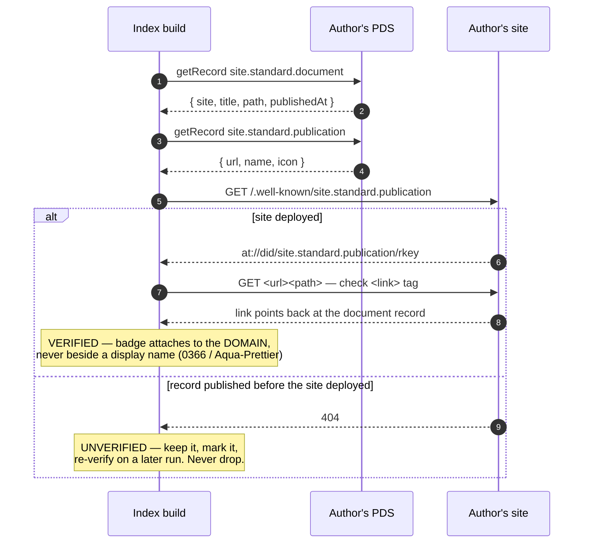
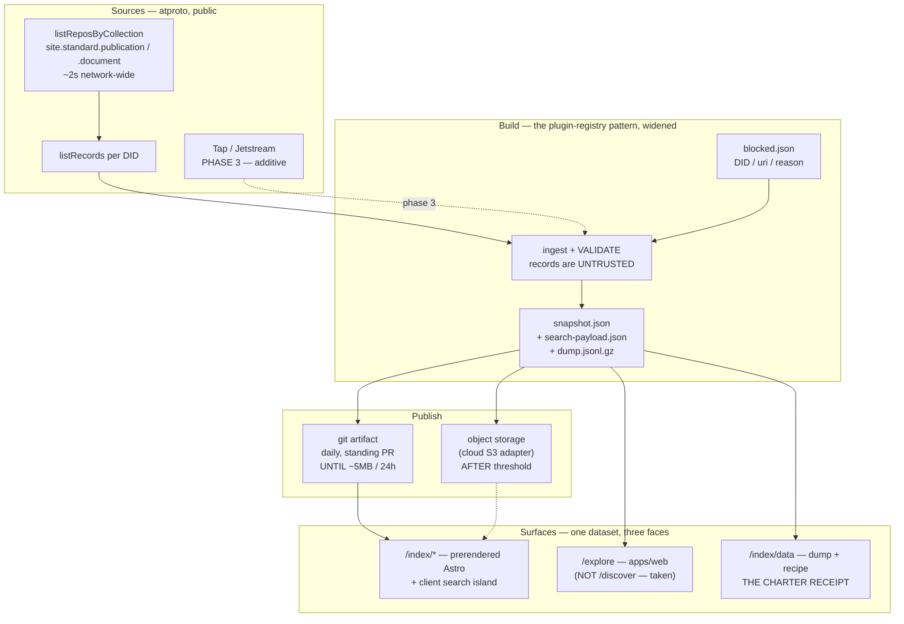
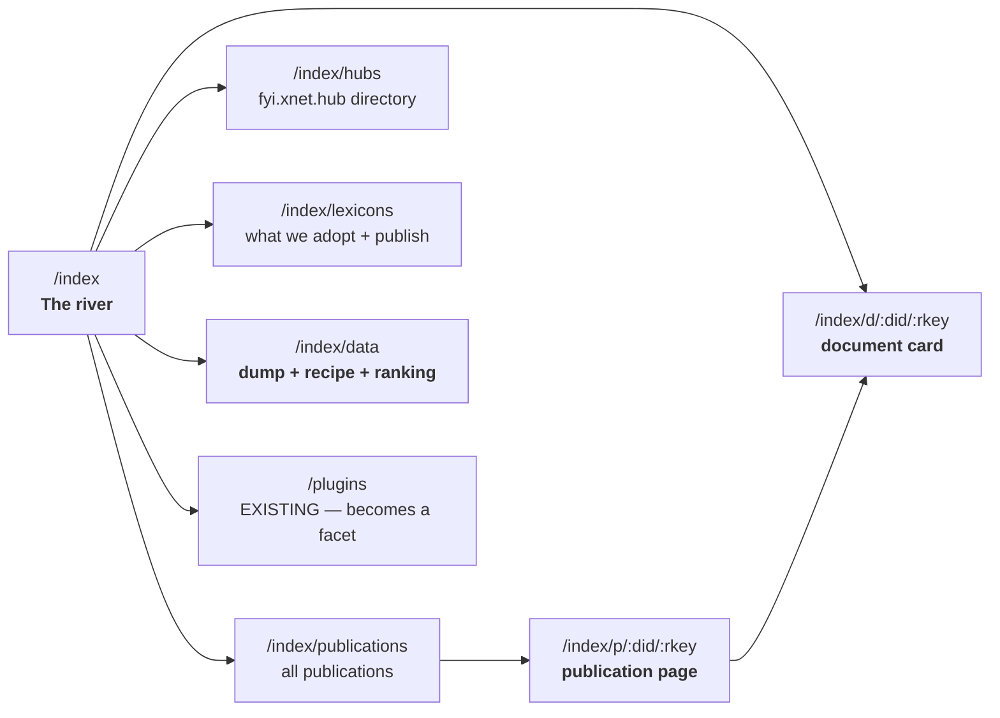
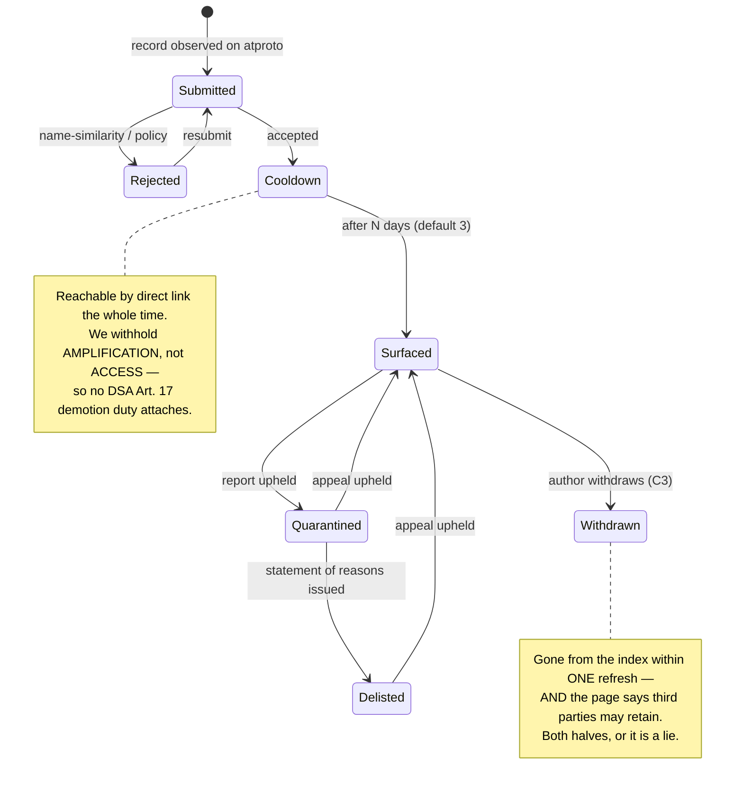
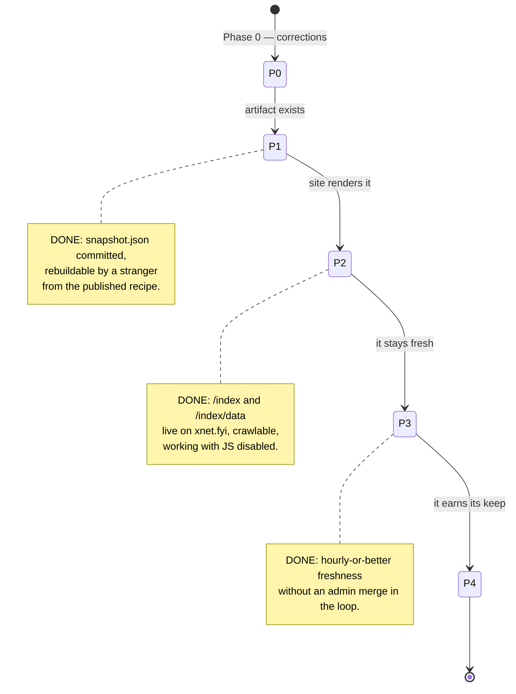

# The xNet Index — One Executable Plan: The Pipeline, The Site, And The Shipping Order

> Exploration 0374 · 2026-07-19
> **Synthesis.** Collapses the index line — [[0359_COMMUNITY_HOSTING]],
> [[0360_XNET_CLOUD_DELIGHT]], [[0362_PUBLISHING_ON_XNET]],
> [[0365_SOCIAL_SUBSTRATE]], [[0366_THE_XNET_INDEX]],
> [[0367_THE_PROJECTION_MODEL]], [[0372_JOINING_THE_ATMOSPHERE]] — into one plan
> with a shipping order, a site map, and a definition of done per phase.
> Supersedes nothing; **decides** where those documents disagreed.

> _"main only takes changes through PRs (repo ruleset), so the old direct
> `git push` was rejected on every cron that had changes."_
> — `.github/workflows/plugins-registry.yml`, in a comment
>
> That comment is the most useful sentence in this document's research. We have
> already built and operated an index pipeline. It is 19 entries wide. The plan
> below is mostly *"do that again, larger, and know where it breaks."*

## Problem Statement

Seven explorations describe some part of an index. Between them they settle the
economics (0366: free admission, funded by hosting), the projection mechanics
(0367: card and body, `SchemaLens`), the vocabulary (0372: adopt
`site.standard.*`), and the posture (0360: mirror, not master). What none of them
answers:

1. **What do we build first, and what is "done"?** Every document ends in a
   4-phase checklist and they are not the same four phases.
2. **Where does the Index actually run?** Every document says "a new narrow
   service" and none says on what, next to what, deployed how.
3. **What does the site look like?** This is the question the user asked and the
   one the corpus is quietest on. There are no page names, no routes, no
   description of what a visitor sees.
4. **How is it ranked?** Charter §3 bans engagement ranking outright. Nobody has
   said what replaces it.
5. **Where do the documents contradict each other**, and which side wins?
6. **What is the smallest version that is genuinely useful**, as opposed to the
   complete version that never ships?

## Executive Summary

**Verdict: the Index is not a new system. It is the plugin-registry pipeline
scaled up, publishing a static artifact that the marketing site renders and
anyone can rebuild. Build it in that order — artifact first, site second,
live ingest third — because that order produces something useful at the end of
every phase.**

**1. We have already built this once.**
[`scripts/build-plugin-index.mjs`](../../scripts/build-plugin-index.mjs) +
[`.github/workflows/plugins-registry.yml`](../../.github/workflows/plugins-registry.yml)
is an index pipeline in miniature: committed sources under `registry/`, network
enrichment, a daily cron, a `--check` staleness gate for CI, `blocked.json` for
takedowns, and two consumers (the static site and the in-app marketplace). At 19
entries it works. **The plan is to widen its inputs, not to invent a new shape.**

**2. The site is static, and that single fact decides the architecture.**
`site/` is Astro with **no SSR adapter** (`site/package.json` has `astro`,
`@astrojs/starlight`, `@astrojs/tailwind` and nothing else), built by
`astro build` and rsynced to **gh-pages** by
[`deploy-site.yml`](../../.github/workflows/deploy-site.yml). `xnet.fyi` resolves
to GitHub Pages IPs. **There is no server on which to render an index page.**
So the Index site is: pages **prerendered at build time** from a committed
snapshot, plus a **client-side search island** over a prebuilt payload, plus
optional live freshness from a separate API origin. This is not a preference;
it is the deployment we have.

**3. The Index indexes the ATmosphere, not xNet — and this reverses 0366.**
0366 wrote *"Indexing all of AT Protocol is unreasonable and was never the goal,"*
and scoped the index to `net.x.*` plus the plugin registry. **That scoping was
correct given its premise and the premise has since changed.** 0366 assumed we
would publish into a namespace we owned; 0372 established that we publish
`site.standard.document` instead. Once our posts live in the shared namespace,
"index only our own content" is no longer a *narrower* scope — it is an
incoherent one, because there is no query that returns our documents and not
Leaflet's. The choice is now between indexing the shared collection and
maintaining a publisher allowlist, and an allowlist is precisely the chokepoint
0360 forbade. **We are not widening scope for ambition; the namespace decision
dissolved the boundary 0366 was drawing.** Scope discipline survives in a
different form: two collections, not all of atproto (§Options).

**4. Charter §3 forbids the ranking every other index uses — and the alternative
is already forced on us anyway.** The text is unambiguous: *"No infinite scroll.
No engagement ranking… Feeds are chronological."* But this is not merely a
constraint to honour: **`docs.surf`, a live aggregator over the same
`site.standard.document` records, is visibly buried under machine-generated
spam** (§External Research). A raw chronological river over this data does not
work, and the usual fix is banned. So the Index ranks on **relevance + recency +
declared curation**, defends the front page with **0366's cooldown** (new entries
reachable by link, not surfaced for N days — no detection required), **publishes
its ranking function**, and **shows why each result is where it is**. `pkg.go.dev`
proves a major index can refuse popularity entirely; `crates.io`'s RFC 1824 and
Lobsters prove publishing the formula earns trust rather than gaming.

**5. Three surfaces, one dataset.** `/index/*` on the static site (public,
crawlable, no-JS-tolerant); an in-app `/explore` route in `apps/web`
(⚠️ `/discover` is **already taken** by the people-matching surface from 0174);
and `/index/data` — the downloadable dump plus the rebuild recipe. **That third
surface is not a nice-to-have: it is the Charter receipt** that makes 0366's
"reproducible L1" checkable rather than claimed.

**6. Git is the right home for the artifact until it isn't, and we can name the
threshold.** The registry cron cannot `git push` to main (repo ruleset), so it
**opens a standing PR** — which, per the same comment, `GITHUB_TOKEN` events do
not trigger CI on, so it needs an admin merge. That is tolerable daily at 12 KB.
It is not tolerable hourly at ATmosphere scale (**11,210 publications / 10,506
documents**, measured in 0372). **Threshold: when the artifact exceeds ~5 MB or
the refresh needs to beat 24 h, it moves to object storage** — for which
[`packages/cloud/src/storage/s3-adapter.ts`](../../packages/cloud/src/storage/s3-adapter.ts)
already exists.

**7. The shipping order inverts the instinct.** Do **not** start with the
firehose. Start with a batch build over `listReposByCollection` +
`listRecords` — which 0372 measured at **sub-second for network-wide discovery**
— because a daily batch index is ~90% of the user value at ~10% of the operational
cost, and it is *debuggable*. Live ingest (Tap) is Phase 3, once the artifact
format and the site are settled.

**8. Revenue is unchanged and the free surface got bigger.** Reads, listing and
the bulk dump stay free forever; commercial *consumption* meters. Adopting a
shared lexicon and publishing the dump both **improve** the user's BATNA, so this
plan strengthens the Charter position rather than spending it (§Options).

## Current State In The Repository

> Verified against `main` at `3bc909044`. Note one thing shipped *during* this
> exploration: **0372's D1 (the OAuth scope defect) was fixed and merged as
> PR #589** — scope is now
> `atproto repo:fyi.xnet.identity.binding?action=create&action=update`, and the
> binding collection moved to `fyi.xnet.identity.binding`.

### The pipeline we already run

[`scripts/build-plugin-index.mjs`](../../scripts/build-plugin-index.mjs) — its
own header describes the Index's architecture almost exactly:

| Piece | Plugin registry today | Index tomorrow |
| --- | --- | --- |
| Committed source | `registry/first-party.json`, `community.json` | curation + seed list |
| Network enrichment | GitHub API (stars, releases) | `listReposByCollection` → `listRecords` |
| Output artifact | `registry/registry.json` (12 KB, 19 entries) | `index/snapshot.json` (→ object storage) |
| Takedown list | `registry/blocked.json` (`repos`/`authors`/`pluginIds`/`revoked`) | same shape, DID-keyed |
| Delist signal to clients | `site/public/revoked.json` | same |
| Staleness gate | `build-plugin-index.mjs --check` in CI | same |
| Refresh | daily cron, `plugins-registry.yml` | hourly, then live |
| Consumers | `site/src/pages/plugins.astro` + in-app marketplace | `/index/*` + `/explore` |

**Two operational lessons already paid for**, both recorded in the workflow:

- **The cron cannot push to main.** A repo ruleset forces PRs, so it opens a
  standing `plugins-registry/data` branch PR via `peter-evans/create-pull-request`,
  labelled `skip-changelog`.
- **That PR gets no CI**, because `GITHUB_TOKEN`-authored events do not trigger
  workflows — so it needs an admin merge (the same gotcha as the changesets
  release PR, from 0265).

> **This is the single most important constraint on refresh cadence, and no prior
> exploration accounted for it.** An index that refreshes through a
> human-admin-merged PR is a *daily* index, permanently. Anything faster must not
> live in git.

### The site is static — measured, not assumed

- `site/package.json` dependencies: `astro`, `@astrojs/starlight`,
  `@astrojs/tailwind`. **No adapter** — no `@astrojs/node`, `-vercel`,
  `-cloudflare`. `astro.config.mjs` sets `site: 'https://xnet.fyi'` and no
  `output: 'server'`.
- [`deploy-site.yml`](../../.github/workflows/deploy-site.yml) assembles
  `site/dist` → `/`, `apps/web/dist` → `/app`, `apps/demos/dist` → `/play`, adds
  `CNAME` and `.nojekyll`, and publishes to **gh-pages**.
- `xnet.fyi` resolves to `185.199.{108,110,111}.153` — GitHub Pages.

**Consequence:** every `/index/*` page must be a file that exists at build time.
Freshness beyond the last deploy must come from client-side fetch to another
origin. Good news on that front: `apps/web/index.html`'s CSP `connect-src`
already includes `https://*.xnet.fyi` (in fact it includes a blanket
`https://*`), and the static site ships **no CSP at all**, so an
`index.xnet.fyi` API origin needs no policy change.

### `plugins.astro` is a working prototype of the index UI

[`site/src/pages/plugins.astro`](../../site/src/pages/plugins.astro) — 155 lines
— already implements the exact interaction model the Index needs:

- a header with **counts** (`{plugins.length} plugins · {firstParty.length}
  built-in · {community.length} from the community`);
- a **search input** (`#plugin-search`) and **category filter pills**
  (`#plugin-filters`, `data-category`, `aria-pressed`);
- **sectioned card grids** (`Built in`, then community), rendered from static
  data at build time via `src/data/plugins`.

**We should not design a new interaction model. We should generalise this one**
— it is already accessible, already no-JS-tolerant for the list (filtering
degrades, content does not), and already familiar in the product.

Also note `registry/registry.json` ids are **already `fyi.xnet.*`**
(`fyi.xnet.mermaid`, `fyi.xnet.github`, …) — the namespace 0372 landed on is the
one the registry has been using all along.

### Everything else the plan touches

| Surface | Path | Relevance |
| --- | --- | --- |
| Publishing spine | [`packages/publish/`](../../packages/publish/) | `buildStaticSite` returns `Map<path, html>` — the same shape an index build wants |
| Frontier seam | `packages/publish/src/published-doc.ts` | ⚠️ **still no production caller** (0372's correction to 0367 E2) |
| Cloud storage | [`packages/cloud/src/storage/s3-adapter.ts`](../../packages/cloud/src/storage/s3-adapter.ts) | the artifact's home past the git threshold |
| Cloud provisioner | `packages/cloud/src/provisioner/` | where an ingest worker would be scheduled |
| Hub search | `packages/hub/src/services/{search-indexer,federation,index-shards}.ts` | ⚠️ **do not extend** — 0367 documented title-only FTS, unsound cross-shard BM25, RRF defeated by dedupe ordering |
| Peer discovery | `packages/hub/src/services/discovery.ts` | existing `PeerRecord`/`register` shape; adjacent to `fyi.xnet.hub` |
| App routes | `apps/web/src/routes/` | ⚠️ **`discover.tsx` is taken** — people matching (0174). Use `/explore` |
| Charter ledger | `packages/telemetry/test/charter-claims-ledger.test.ts` | where an index claim gets its receipt (`calm-feeds-chronological` is the model) |
| Humane gate | `scripts/check-humane-patterns.mjs` | bans infinite scroll / engagement primitives — the Index must pass it |
| Cloud site | `site/src/pages/cloud/{index,pricing}.astro` | where the funding story is told |

### What the Charter actually requires

**§3 Calm** — quoted, because it is the binding constraint on ranking:

> *"We do not build the machinery of compulsion. No infinite scroll. No engagement
> ranking. No streaks engineered around loss aversion… Feeds are chronological."*

**§6 Commons / No ground rent** — charges for *improvements*, never for
*"access to things you would own anyway"*, with named refused rents (no take
rate, **no egress or export fees**, no identity ransom, no protocol tolls).

> **"No egress or export fees" is why `/index/data` is mandatory rather than
> generous.** A public index whose dataset you cannot download is an export fee
> charged in inconvenience.

## External Research

### What the ATmosphere gives us for free

From 0372's measurements (2026-07-19, `relay1.us-west.bsky.network`), restated
here because they are the Index's input volume:

| Collection | DIDs | Index relevance |
| --- | --- | --- |
| `site.standard.publication` | **11,210** | the publication table |
| `site.standard.document` | **10,506** | the document table |
| `sh.tangled.repo` | 4,310 | out of scope v1 |
| `com.whtwnd.blog.entry` | 647 | ⚠️ a *second* blogging lexicon worth adopting later |
| `fyi.xnet.hub` | — | does not exist yet; the hub directory |

**Discovery is sub-second.** `listReposByCollection` returned 4,288 DIDs for
`sh.tangled.repo` in 0.9 s. A full enumeration of both `site.standard.*`
collections is a **~2-second** operation. That is what makes the batch-first
shipping order defensible: the "crawl" is not a crawl.

**Validation is mandatory.** Malformed records are confirmed in production
(0372 sampled `"createdAt": {}` and `"endsAt": null` on a live PDS), PDS
validation is optimistic, and relays do not validate.

### Someone already built this, and it is already being flooded

**`docs.surf`** is a live aggregator over `site.standard.document` records. It is a
single reverse-chronological river — title, one-line excerpt, publication name,
relative timestamp, capped at ~100 items. Genuinely long-tail and multilingual.

**And when inspected, the top of that river was dozens of near-identical
auto-generated "Crownnote chart" records, all stamped "just now."**

> **This is the most important external finding in this document.** The `/index`
> front page as first drafted — a pure reverse-chronological river — is a design
> that has already been tried on exactly our data and is already broken by one
> prolific machine writer. Charter §3 rules out the usual fix (rank by
> engagement). So the front page needs a **non-engagement flood defence**, and
> 0366 already specified one: **the cooldown.**

There is also an **official implementation guide**,
[`atproto.com/blog/indexing-standard-site`](https://atproto.com/blog/indexing-standard-site),
with a reference architecture (Jetstream in a Durable Object → queue → resolver
workers → D1, plus a cron that re-verifies records that failed the first time)
and a cost figure: **~$5/month without backfill.** Its guidance matches our
phasing — Jetstream for a partial index, Tap only when you need real backfill.

**⚠️ Verification is two-sided and costs network requests we had not budgeted.**
`site.standard` publishers assert ownership in *both* directions:

- the publication serves `/.well-known/site.standard.publication` returning the
  AT-URI of its publication record; and
- the published page carries an HTML `<link>` tag pointing back at the document
  record.

So fully verifying one document is **up to four requests** (document record →
publication record → well-known → page link tag). At 10,506 documents that is a
real batch cost, and there is an inherent **race** — the record is often
published before the site deploys — which is why the reference implementation
re-verifies on a cron rather than trusting first contact. **Our build must do the
same, and must render unverified entries differently rather than dropping them.**



### Comparable indexes, and the signal question

The relevant design question is *which signals to display*, since Charter §3
removes the usual ones. The prior art is unusually decisive here.

**`pkg.go.dev` shows no download counts at all** — verified against their own
About page. Instead it shows four **binary** checks (has a `go.mod`;
redistributable licence under a published policy; tagged version; stable v1+),
an **"Imported by"** list, and vulnerabilities in OSV format. **It is a major
package index that deliberately refuses popularity, and it is the closest
existing model to a Charter §3-legal index.** Its second good idea: search
displays **the first sentence of the package comment**, so documentation becomes
the snippet — a signal that rewards care rather than reach.

**`crates.io` argued its ranking in public** ([RFC 1824](https://rust-lang.github.io/rfcs/1824-crates.io-default-ranking.html))
and the rejections are as instructive as the choice:

- rejected **composite scores** (nothing is simultaneously useful, understandable,
  gaming-resistant and maintainable);
- rejected **user ratings/reviews** (spam, paid reviews, grudges);
- rejected **GitHub stars as a ranking input** — they may be *displayed*, never
  *ranked on*, because not every author uses GitHub;
- chose downloads over a **90-day window**, not all-time, so incumbency decays;
- **"Badges will not influence crate ordering"** — signals for *filtering* are
  explicitly separated from signals for *ranking*.
- Its own issue #1481 documents the bias it accepted: downloads systematically
  undercount applications versus libraries. **Every popularity metric silently
  demotes a whole class of thing.**

**`Lobsters` publishes its entire ranking formula in readable source**, including
the editorial thumbs on the scale — per-tag hotness modifiers, a +0.25 bonus for
authors submitting their own work, comment points weighted 0.5× and capped at the
story's score so a flamewar cannot rocket. **It is more trusted for publishing the
thumbs, not less.** Hacker News, by contrast, keeps its penalty layer deliberately
opaque because that is the anti-abuse surface.

> **The split to decide up front: publish the ranking, keep the anti-abuse
> heuristics private.** Lobsters shows the first half is safe and valuable; HN
> shows the second half is where you will be tempted to hide things. Say which is
> which, on the page, rather than blurring them.

**`Common Crawl` and `crates.io`'s db-dump are the model for `/index/data`**:
dated immutable snapshots at stable URLs (`static.crates.io/db-dump.tar.gz`,
refreshed every 24 h; `CC-MAIN-YYYY-WW`), plain self-documenting formats, an open
build tool, and a manifest that is just a text file of paths.

Two cheap credibility patterns worth copying outright:

- **`lexidex.bsky.dev` publishes a "Recent Crawl Attempts" page** — pipeline
  health as a public artifact.
- **`lexicon.store` gives every record an "Indexing history" tab** — the
  per-item version of the same promise.

> **The transferable rule: describe the artifact, not the audience.** "Updated 3
> days ago", "domain verified", "publishes an RSS feed", "has a `textContent`
> fallback", "canonical URL resolves" are all legal under §3 and genuinely
> useful. "1.2k readers" is neither — and per crates.io, displaying it and then
> not ranking on it is an unstable equilibrium.

### One idea we should take, carefully

**UFOs** (`ufos.microcosm.blue`) shows **two ranked lists side by side** — "What's
hot" (momentum, with an honest `+Infinity%` for brand-new collections) and "Top
collections" (absolute). This lets a small new thing reach the front page without
faking scale, which is exactly the problem a chronological river has.

⚠️ **But momentum is one refactor away from engagement ranking.** It is legal here
only because it measures **publishing** activity — how much is being *written* —
never **consumption**. If the same widget ever counts reads, clicks or
subscribers, it becomes the thing §3 forbids. **If we ship it, the distinction
belongs in a comment, a test name, and the page copy.**

Also worth noting what *not* to inherit: **Bluesky Directory** — which has now
absorbed the official showcase (`docs.bsky.app/showcase` 301-redirects to it) — is
a curated, ad-supported list whose app-shaped taxonomy (Client / Feed / Labeler /
**Other**) is visibly collapsing, with general-purpose apps piling into "Other".
**Facet on something intrinsic — collection, authority domain — not on
hand-maintained app categories.**

### The reproducibility bar

0366 claimed the index should be reproducible; 0372 found the ecosystem already
holds itself to that bar. Tangled's **Bobbin** appview keeps the entire Tangled
network in **100–200 MB of RAM** and *rebuilds its whole index from upstream on
every restart* (~90 s target). Constellation runs a 16.7B-link backlink index on
a **Raspberry Pi 4b**.

**So "anyone can rebuild our index" is not an aspiration in this ecosystem — it
is the norm, and falling short of it would be conspicuous.**

## Where The Documents Disagree — And What This Plan Decides

A synthesis that smooths over the disagreements is worth less than the documents
it summarises. These are the live conflicts; each row is a decision, not a
summary.

| # | Conflict | This plan decides |
| --- | --- | --- |
| **C1** | **Index scope.** 0360 wants a GitHub-scale public commons index. 0366 narrows to *"`net.x.*` records plus the plugin registry"* and says indexing all of atproto *"was never the goal."* 0372 then moved us into a shared namespace. | **Two collections — `site.standard.publication` + `.document` — plus the plugin registry.** Not all of atproto (0366's discipline survives); not xNet-only (0372 made that incoherent). The boundary is *"the collections we ourselves publish into."* |
| **C2** | **Discovery posture.** 0360: a discovery index is *"the compounding bet."* 0362: *"We should not compete on discovery, and should say so"* and *"we will not build a recommendation network."* | **Both, because they are different objects.** An index is retrieval — you ask, it answers. A recommendation network pushes unasked. We build the first and keep refusing the second; §3 already forbids the machinery the second needs. |
| **C3** | **Unpublish semantics.** 0362 treats unpublish as retraction (*"removes the post from the site, the sitemap, and the feed within one build/cache cycle"*). 0365 says publication is a one-way door and withdrawal is *"a request, never a retraction"* with a `third-parties-may-retain` caveat. **Neither document notes the conflict.** | **0365 wins on the record, 0362 wins on our surfaces.** The Index must drop a withdrawn item **within one refresh** *and* state that third parties may retain copies. Both halves are true; only saying the first is the lie. |
| **C4** | **`unlisted` is undefined.** 0360 treats it as a working visibility level; 0365 finds it has no distinct behaviour — *"either a bug or a vacancy"* — and proposes *"published to atproto, not promoted by our index."* | **Adopt 0365's meaning; the Index is what makes it real.** `unlisted` = present in the index and reachable by direct link, never surfaced in a list. This plan is the first thing that gives the value semantics. |
| **C5** | **Paid index access.** 0365 priced an operated "L2" index; 0366 withdrew that lane on evidence. 0359's B5 (managed discovery listing carrying `DEFAULT_MARKETPLACE_FEE_BPS`) is still an open checklist item and 0366 never cites it. | **0366 wins; reads and listing are free.** 0359's B5 is a fee on a *marketplace listing*, not on *index admission* — adjacent but distinct. **Flagged as an undefined boundary that needs an explicit line before any money touches discovery.** |
| **C6** | **Sequencing.** 0365 says *"0360's Phase 0 still gates everything"* (~17 s cold open, dead claim flow). 0359 and 0362 shipped their Phase 1s anyway without acknowledging the gate. | **The gate is real for *promotion*, not for *construction*.** Building the Index does not require a fast cold open; **publicly launching it does**, because the first click from `/index` into the app is where a 17-second boot is fatal. Build now, promote after 0360 Phase 0. |
| **C7** | **`packages/abuse` wiring** is named a precondition by 0359, 0360, 0362 and 0366 — and done by none. | **This plan does not become the fifth document to claim it.** Phase 1 ships `blocked.json` (which already exists and works) and nothing more. Full abuse wiring is named as a **launch** blocker, not a build one, and is not re-promised here. |
| **C8** | **Charter edits owed.** 0365 requires §6's *"No global chokepoint tier"* bullet to address the index explicitly. 0360 requires adding *"No default-position rent."* Neither has happened. | **Both land in Phase 4**, with the index claim in the ledger. An unwritten covenant is a preference (§Who can change this section). |

> **The one that should worry us most is C7.** Four documents in a row have
> written "wire up abuse handling" into a checklist and none has done it. That is
> not a scheduling accident; it is what happens when a dependency is nobody's
> phase. Naming it a launch gate with a named owner is the only thing that
> changes the pattern.

## Key Findings

1. **The plugin registry is the Index pipeline at 1/500 scale**, including
   takedowns, staleness gating and two consumers. Widen it; do not replace it.
2. **The site has no server.** Static Astro → gh-pages. Prerender + client island
   is forced, not chosen.
3. **The cron cannot push to main**; it opens an admin-merged PR with no CI. This
   caps a git-hosted artifact at **daily** refresh, permanently.
4. **The Index must index `site.standard.*`, not `fyi.xnet.*`** — otherwise it is
   a catalogue of our own users (consequence of 0372).
5. **Charter §3 bans engagement ranking**, so the ranking is recency + relevance
   + declared curation — and publishing that function is a differentiator.
6. **`/discover` is already taken** in `apps/web` (people matching, 0174). The
   in-app route is `/explore`.
7. **`plugins.astro` already implements the UI pattern** — counts, search,
   filter pills, sectioned card grid, static data.
8. **Batch beats firehose for v1**: network-wide enumeration is a ~2-second
   operation, so a daily batch index is most of the value with a fraction of the
   operations.
9. **Do not extend the hub's existing search** — 0367 documented three
   independent defects in it.
10. **`/index/data` is a Charter obligation**, not a courtesy — §6 refuses egress
    fees, and an undownloadable index charges one in friction.
11. **`registry/blocked.json` already has the takedown shape** we need
    (0367 E25, P2B statement-of-reasons).
12. **The artifact format is the real interface.** Site, app and third-party
    rebuilds are all consumers of one JSON snapshot; settle it in Phase 1.
13. **0372's D1 shipped mid-flight (PR #589)**, so the identity binding now works
    and `fyi.xnet.*` is live in code — Phase 0 of 0372 is partly done.
14. **`published-doc.ts` still has no caller** — the frontier bug survives, and
    it is now the oldest outstanding item in this line.

## Options And Tradeoffs

### Where the Index runs

**Option A — fully static, built in CI, committed to git.**
Cron enumerates atproto, writes `index/snapshot.json`, opens the standing PR;
Astro prerenders every page at deploy.
*For:* zero new infrastructure; reproducibility is trivially true because the
input *is* a committed file; survives us entirely (0358's sleep test). *Against:*
daily at best; git bloat; an admin merge in the loop.

**Option B — fully dynamic service.** `index.xnet.fyi` with SQLite + live Tap
ingest; the site becomes a thin client.
*For:* fresh, scalable, real search. *Against:* new always-on service to operate
and pay for before we know anyone wants it; the site's pages become empty
shells without JS; reproducibility becomes a claim rather than a file.

**Option C — hybrid: static artifact + prerendered pages + optional live API
(recommended).** The snapshot is the source of truth and is always downloadable.
Pages are prerendered from it. A client-side island adds search over a prebuilt
payload, and *later* a live API adds freshness without which the page still works.
*For:* every phase ships something usable; no-JS and crawlers get real content;
reproducibility is a file, not a promise; the live service is additive and can be
turned off without breaking the site. *Against:* two code paths for freshness;
the snapshot can lag.

### What it indexes

**Option D — `fyi.xnet.*` only.** Rejected: returns only our own users, fails
0360's mirror rule.
**Option E — `site.standard.*` + `fyi.xnet.*` (recommended).** One extra
`wantedCollections` entry; indexes Leaflet, pckt and Offprint alongside us.
**Option F — everything (all of atproto).** Rejected for v1: that is Hubble's job
and it is funded by someone else.

### How it ranks — the Charter-shaped question

| Option | §3 verdict | Note |
| --- | --- | --- |
| Engagement / popularity | ❌ **Banned outright** | *"No engagement ranking"* |
| Pure reverse-chronological | ✅ Legal | Honest but useless at 10k documents |
| Relevance (BM25) + recency tiebreak | ✅ Legal | The workhorse for queries |
| Declared curation (editor picks, explicit lists) | ✅ Legal | Honest **iff** labelled as such |
| **Relevance + recency + labelled curation, with the function published (recommended)** | ✅ | Each result can say *why* it is here |

**The design commitment that follows: every ranked surface shows its reason.**
"Matched *food forest* in title · published 3 days ago" or "Curated: Publishing".
A reason string per result is cheap, and it makes the ban on engagement ranking
legible instead of invisible.

### Where the artifact lives

**Option G — git forever.** Simple, reproducible, capped at daily / small.
**Option H — object storage from day one.** Scales, costs money and ops before
we have users.
**Option I — git until a named threshold, then S3 (recommended).** Ship on git;
move when **artifact > ~5 MB** *or* **required freshness < 24 h**. Publish the
threshold so the move is a planned event, not a fire.

### Revenue lanes — Charter §6 tests

Restated for this plan's surfaces; substance unchanged from 0366/0367/0372.

| Lane | Improvement | BATNA | Vanish | **Sleep** | Verdict |
| --- | --- | --- | --- | --- | --- |
| **Index reads + listing** | — | ✅ dump is downloadable; rebuild recipe published; `listReposByCollection` is public | ✅ records live on users' PDSes | — | **FREE, permanently** |
| **`/index/data` bulk dump** | — | ✅ *it is the BATNA* | ✅ | — | **FREE — §6 refuses egress fees** |
| **Hub directory (`fyi.xnet.hub`)** | — | ✅ anyone can enumerate the collection | ✅ | — | **FREE** |
| **High-volume / high-frequency API consumption** | ✅ real serving + egress cost | ✅ ~$5/mo Jetstream consumer, or just read the dump | ✅ | ⚠️ ordinary competition | **Meter — consumption side only** |
| **Priority re-crawl** | ✅ scheduling work we perform | ✅ default cadence unaffected | ✅ | ⚠️ | **After v1** |
| **Publisher analytics** | ✅ computation we run | ✅ | ✅ | ⚠️ | **Consent-gated (§1/§4)** |
| **Hosted hub + publishing (Cloud)** | ✅ operations, support | ✅ self-host | ✅ | ❌ commodity | **This is what funds the Index (0366)** |

**The line that keeps it honest, unchanged from 0366/0367:** meter what is
*expensive to serve*, never what is *valuable to know*. A hobbyist's 100
queries/day is free forever; a company pulling the whole index hourly is
recovering our cost.

> **Note the direction of travel.** Publishing the dump and adopting a shared
> lexicon both *raise* the user's BATNA — they make leaving easier. Per 0358's
> sleep test, that is precisely why neither keeps us awake: **we are not holding
> anyone by the index, so we cannot lose them all at once when they notice.**

## Recommendation

**Adopt Option C (hybrid), Option E (`site.standard.*` + `fyi.xnet.*`), the
published relevance+recency+curation ranking, and Option I (git → S3 at a named
threshold).**

### The architecture



### The site, page by page

This is the concrete answer to *"what will the site actually look like."* Every
page below is a **prerendered file** under `site/src/pages/index/`, styled with
the existing `Base` + `Nav` + `Footer` + `SectionHeader` components, and modelled
on `plugins.astro`.



**`/index` — the front page.** Not a raw river: `docs.surf` proves that a pure
reverse-chronological list of this exact data gets buried by one machine writer
within weeks. Instead, **two columns over one dataset**, borrowed from UFOs and
made §3-safe:

- **New** — reverse-chronological, but **only entries past cooldown** (below).
- **Active** — publications that published most in the last 7/30 days. **A
  publishing-rate signal, never a readership signal** (§External Research).

Plus a search box, facet pills (`All · Writing · Communities · Plugins · Hubs`)
reusing the `plugins.astro` markup, and header counts that state exactly what is
in it and when: *"10,506 documents · 11,210 publications · snapshot 2026-07-19
06:00 UTC."* **No "trending". No "popular". No infinite scroll** — a `Load more`
button, because §3 bans the alternative and the humane-patterns gate enforces it.

**The cooldown is the flood defence, and it is already specified.** 0366 called it
*"the single best idea in the research set"*: new entries are **not surfaced** for
N days (default 3, PyPI's own recommendation), while remaining **reachable by
direct link throughout**. It needs no spam detection, costs a legitimate publisher
nothing, and destroys flood economics. Critically, 0366 also established the legal
framing: **we withhold amplification, not access**, so no DSA Art. 17 demotion
duty attaches.

**`/index/@:handle/:slug` — the document card.** Addressing follows 0360's
`xnet.fyi/@alice/reading-notes` and 0362's `GET /@:handle/:slug` rather than
inventing a third scheme — handles resolve via DID, so the address is portable.
The page is deliberately **not** a reader: title, author, publication, published +
updated dates, tags, excerpt, and a large primary link to the **canonical URL on
the publisher's own site**.

Below that, a **resolution breadcrumb** stolen wholesale from `pdsls.dev` — the
clearest UI idea in the ATmosphere — showing every hop, each independently
clickable:

```
PDS  puffball.us-east.host.bsky.network
  → handle  alice.example.com   ✓ verified both directions
  → DID     did:plc:z72i7…
  → collection  site.standard.document
  → rkey    3lq35uwofw522        CID bafyrei…
  → observed in snapshot 2026-07-19 06:00 UTC
```

**That block is the whole trust argument rendered as a list**: it says *this is
verifiable, not asserted*, and it gives a sceptic somewhere to click. **The card
sends people away, on purpose** — 0360's mirror-not-master rule as a layout
decision.

**`/index/@:handle` — the publication page.** Name, description, icon, base URL,
and its documents reverse-chronologically. Domain-verification state shown
explicitly (below). A **Subscribe** affordance resolving to
`site.standard.graph.subscription` — a record in *the reader's* repo, so the page
must say plainly that subscribing writes to your repo, not ours — plus the
publication's own RSS. **This page is 0362's "owned audience" promise made
visible**: everything on it points at the author's infrastructure.

### Verification, and the badge rule

`site.standard` gives us a real two-sided domain proof (§External Research), so
entries carry one of three states — and this is a **filter signal, never a
ranking signal**, per crates.io's *"badges will not influence ordering"*:

| State | Meaning |
| --- | --- |
| **Verified** | `/.well-known/site.standard.publication` and the page `<link>` both agree |
| **Unverified** | assertion present, proof failed or pending re-check (the publish/deploy race) |
| **Unreachable** | canonical URL does not resolve |

> ⚠️ **0366's hard rule applies directly here: never render a verification badge
> next to a free-text display name.** That is precisely the gap Aqua used to
> impersonate Prettier. The badge attaches to **the domain**, adjacent to the
> domain, or it does not render.

### The entry lifecycle



**`/index/hubs` — the hub directory.** Enumerated from `fyi.xnet.hub` (0372).
Host, owner DID, first-seen date, and whether the two-sided handshake currently
verifies. Opt-in only; a hub that never announced does not appear.

**`/index/lexicons` — what we speak.** The adopted `site.standard.*` schemas, the
`fyi.xnet.*` ones we publish, and their resolution status. This is a small page
that does a lot of trust work: it is where a developer checks whether we are good
citizens, and it makes 0372's adopt/extend/mint rule legible.

**`/index/data` — the receipt.** Modelled on `crates.io/data-access` and Common
Crawl. It carries:

- the **dated, immutable dump** at a stable URL, with size, row count and
  snapshot time, refreshed on a fixed published cadence;
- the **rebuild recipe** as a runnable command block, and a link to the build
  script — which is in the same MIT repo;
- the **published ranking function** (§below), including the editorial thumbs;
- **crawl health** — a "recent build attempts" table, stolen from `lexidex`:
  when we last ran, what failed, how many records were quarantined;
- the **takedown log** from `blocked.json`, with P2B Art. 4 statements of reasons;
- a plain statement that reads are free, unauthenticated and permanent.

**If one page in this plan justifies the whole line of work, it is this one.**
0366 refused paid admission and 0365 refused paid index access; this page is
where those refusals stop being prose and become a file you can download without
an account.

> **The written justification 0366 demanded.** 0366 says *"the git repo IS the
> mirror-not-master property — converting it to a service should require a
> written justification."* Here it is: **the property being protected is
> "reproducible from public inputs by a third party," not "stored in git."** Git
> is currently the cheapest way to hold that property, and it stops being so at
> ~5 MB / sub-daily refresh (the standing-PR admin merge — C6/§Current State).
> The move to object storage keeps every part that matters — dated immutable
> artifact, stable URL, open build script, published recipe, no account to
> download — and drops only the part that was incidental. **The test that keeps
> us honest is unchanged and stays in CI: a third party rebuilds and diffs to
> zero.** If that test is ever weakened to accommodate the move, the move was
> the wrong call.

**`/plugins` — unchanged, absorbed.** The existing page keeps its URL and becomes
the `Plugins` facet of `/index`. Its data pipeline is the one we generalise, so
this is a rename of a concept, not a migration.

> ⚠️ **But four marketplace defects from 0366 are preconditions, not
> follow-ups**, because folding a broken surface into a new one inherits the
> breakage:
> - **B4** — `MarketplaceEntry.manifestUrl` is required and **no entry has it**,
>   so *"the community install path has never been exercised against real
>   data."* This gates everything else.
> - **B1** — `failClosedVerifier` always returns `verified: false`, so **every
>   marketplace install reports "unverified."** Implement a real verifier or
>   remove the affordance; a badge nobody can earn is worse than no badge.
> - **B3** — the `installs` / `stars` sorts are dead no-ops. **Delete them**
>   rather than implementing them: §3 would forbid ranking on them anyway, so
>   0366 is right that their brokenness is *fortunate*.
> - **B2** — the plugin-licence CI check scans a path that does not exist
>   (`marketplace/**/registry.json` vs the real `registry/registry.json`).
>
> Sobering context for the whole plan: `registry/community.json` is `[]` —
> **zero community submissions, ever.** The free listing path we are about to
> generalise has never been walked by anyone outside the project.

**In-app `/explore`** mirrors `/index` inside `apps/web`, reading the same
artifact, so a signed-in user can subscribe or fork without leaving the app.

### What a result row shows — and what it never shows

| Shown | Why it is legal and useful |
| --- | --- |
| Title, excerpt, author, publication | The artifact |
| **Published** and **updated** dates | Freshness, not popularity |
| Tags | Author-declared |
| "Matched *X* in title" / "Curated: Writing" | **The reason it ranked** |
| Canonical URL host | Where you are going |
| Snapshot time + record CID | Provenance, verifiability |
| **Never:** readers, likes, subscribers, "trending", rank number | §3 — and the humane gate |

### Shipping order — each phase ends in something usable



**Phase 0 — corrections (days).** Finish 0372's Phase 0: wire the existing
`resolvePublishedDoc` into `render.ts`/`site.ts` (the oldest open bug in this
line), and widen `DID` beyond `did:key` in `packages/data`. The OAuth/namespace
half already shipped in #589.

**Phase 1 — the artifact (1–2 weeks).** `scripts/build-index.mjs`, modelled
line-for-line on `build-plugin-index.mjs`: enumerate both `site.standard.*`
collections, fetch records, **validate and quarantine**, apply `blocked.json`,
emit `snapshot.json` + `search-payload.json` + `dump.jsonl.gz`. Daily cron,
standing PR, `--check` in CI. **Done when a stranger can rebuild it from the
recipe and diff to zero.**

**Phase 2 — the site (1–2 weeks).** `/index`, `/index/d/*`, `/index/p/*`,
`/index/data`, `/index/lexicons` prerendered from the snapshot; the search island;
the reason strings. **Done when it works with JavaScript off and Google can crawl
it.**

**Phase 3 — freshness (2–3 weeks).** Move the artifact to object storage past the
threshold; add Tap ingest with validate-on-ingest, high-water mark and gap alarm;
the site fetches deltas client-side. **Done when the admin merge leaves the
critical path.**

**Phase 4 — breadth and metering.** `/index/hubs`, `com.whtwnd.blog.entry` as a
second adopted lexicon, the metered consumption tier, consent-gated publisher
analytics, and an `index-no-engagement-ranking` entry in the Charter claims
ledger.

## Example Code

```ts
// scripts/build-index.mjs — the shape, deliberately mirroring
// scripts/build-plugin-index.mjs so the two stay legible as one pattern.
//
//   node scripts/build-index.mjs           # write outputs
//   node scripts/build-index.mjs --check   # fail if stale (CI)

/** ADOPTED collections. Adding one is a one-line change — that is the point. */
const COLLECTIONS = ['site.standard.publication', 'site.standard.document']

/** One indexed document. This type IS the public interface — site, app and
 *  third-party rebuilds all consume it, so changing it is a breaking change. */
export type IndexedDoc = {
  uri: string          // at://did/collection/rkey — the identity
  cid: string          // content pin, for provenance display
  did: string          // author
  handle?: string      // ONLY if bidirectionally verified; else omit
  publication?: string // at-uri of the publication record
  title: string
  description?: string
  textContent?: string // the degradation channel (0372)
  canonicalUrl?: string
  publishedAt: string
  updatedAt?: string
  tags: string[]
  /** When WE observed it. Never conflate with the author's claim (0367). */
  indexedAt: string
}
```

```ts
// packages/index/src/rank.ts
//
// The ranking function. It is PUBLISHED at /index/data, and every result
// carries the reason it ranked. Charter §3 forbids engagement ranking, so
// there is deliberately no popularity term here — and no way to add one
// without this file, this test, and the claims ledger all disagreeing.

export type Reason =
  | { kind: 'match'; field: 'title' | 'description' | 'body'; term: string }
  | { kind: 'recent'; days: number }
  | { kind: 'curated'; list: string }
  | { kind: 'cooldown' }   // reachable by link, not yet surfaced

/**
 * 0366 already fixed the signature of the sibling function: `rankingSignalsFor`
 * returns ONLY `{ textRelevance, freshness }`, and it noted why — "AdmissionPath
 * is deliberately absent from the return type. Inclusion neutrality is enforced
 * here, not in review." Same discipline applies: whether an entry came from
 * Cloud, a PR, or a stranger's PDS is not an argument this function can see.
 */
export function rank(doc: IndexedDoc, q: Query, now: number): {
  score: number
  reasons: Reason[]
} {
  const reasons: Reason[] = []

  // 0. Cooldown. New entries are reachable by direct link but never surfaced
  //    in a list for N days. This is the flood defence — docs.surf shows a raw
  //    reverse-chron river over this exact data gets buried by one machine
  //    writer. It needs no detection, and it withholds amplification rather
  //    than access, so no DSA Art. 17 demotion duty attaches (0366).
  if (now - Date.parse(doc.indexedAt) < COOLDOWN_MS) {
    return { score: NEVER_SURFACED, reasons: [{ kind: 'cooldown' }] }
  }

  // 1. Relevance. Title beats description beats body — an artifact property.
  const m = matchTerms(doc, q)
  reasons.push(...m.reasons)

  // 2. Recency, as a gentle decay rather than a cliff. This is the ONLY
  //    time-based term, and it is monotonic: newer never ranks lower for it.
  const days = (now - Date.parse(doc.publishedAt)) / 86_400_000
  const recency = 1 / (1 + days / 30)
  if (days < 30) reasons.push({ kind: 'recent', days: Math.floor(days) })

  // 3. Declared curation — honest ONLY because the UI labels it as curated.
  const curated = curationBoost(doc, reasons)

  // NOTE: there is no engagement term, and adding one breaks
  // charter-claims-ledger's `index-no-engagement-ranking`. That test is the
  // enforcement; this comment is only the explanation.
  return { score: m.score * 0.6 + recency * 0.25 + curated * 0.15, reasons }
}
```

```astro
---
// site/src/pages/index/index.astro — prerendered, generalising plugins.astro.
// No SSR adapter exists, so everything here must resolve at build time.
import snapshot from '../../../../index/snapshot.json'
const { documents, publications, snapshotAt } = snapshot
const recent = documents
  .slice()
  .sort((a, b) => Date.parse(b.publishedAt) - Date.parse(a.publishedAt))
  .slice(0, 100)   // the rest arrives via `Load more` — never infinite scroll (§3)
---
<SectionHeader title="The Index" subtitle="Everything published to the open web on AT Protocol — ours and everyone else's." />
<p class="text-sm text-gray-500">
  {documents.length} documents · {publications.length} publications ·
  snapshot <time datetime={snapshotAt}>{snapshotAt}</time> ·
  <a href="/index/data">download the data</a>
</p>
```

## Risks And Open Questions

| # | Risk | Likelihood | Mitigation |
| --- | --- | --- | --- |
| **R1** | **Snapshot staleness reads as brokenness** — a daily index looks dead next to a live one | High | Show snapshot time on every page; ship Phase 3 before promoting the Index publicly |
| **R2** | **The artifact outgrows git sooner than expected** | High | Named threshold (~5 MB / 24 h) and the S3 adapter already exists; treat the move as planned work in Phase 3 |
| **R3** | **The admin-merge PR loop stalls** the daily refresh (it already happened to the release PR — 0265) | Medium | Alarm on snapshot age; Phase 3 removes the loop entirely |
| **R4** | **Indexing other people's documents draws moderation load we have not staffed** | Medium | `blocked.json` from day one; `/index/data` publishes statements of reasons; ⚠️ **no official atproto guidance on DSA/P2B for AppView operators exists** (0372) — get counsel before promoting |
| **R5** | **Someone asks for a popularity sort** and it is one PR away | **High** | The ban lives in three places: the ranking file, a claims-ledger entry, and the humane-patterns gate. Make the test the argument |
| **R6** | **We index a publication that does not want to be indexed** | Medium | Honour `site.standard.publication.preferences.showInDiscover` (it exists in the lexicon) and `#account` deactivation events |
| **R7** | **Handle spoofing** — displaying an unverified handle attributes work to the wrong person | Medium | Only display bidirectionally-verified handles; otherwise show the DID |
| **R8** | **Prerendering 10k document pages** slows the site build unacceptably | Medium | Prerender publications + the top slice; render long-tail documents client-side from the payload, or paginate the build |
| **R9** | **The Index becomes a second search system to maintain** alongside the hub's three | Medium | Explicitly do not integrate with hub search (0367); if hub search is ever fixed, it consumes the same artifact |
| **R10** | **Machine-written flood buries the front page** — observed live on `docs.surf` over this exact data | **High — already happening** | Cooldown at surface time; per-DID caps on the New column; the flood test in §Validation |
| **R11** | **Two-sided verification cost** (~4 requests × 10.5k docs) makes the batch slow or gets us rate-limited | Medium | Cache by `(publication, etag)`; verify publications not documents where possible; re-verify on a cron, never inline |
| **R12** | **We ship "Active" and it quietly becomes engagement ranking** — one refactor from publishing-rate to read-rate | **High** | The distinction lives in the column's copy, the function name, and a claims-ledger test. If it ever counts reads, it is a §3 breach |
| **R13** | **Nobody submits anything** — `community.json` has been `[]` since it was created | **High** | The Index's inputs are atproto records, not submissions, so it is populated on day one *without* anyone opting in. This is the strongest argument for the ATmosphere scope (C1) |

### Open questions

- **Does `/index` belong on `xnet.fyi` at all, or on its own domain?** Hosting a
  network-wide index on our marketing domain conflates "the commons" with "the
  vendor" — exactly the conflation 0360 warns about. A separate host would make
  mirror-not-master legible, at the cost of a domain and some SEO. **Unresolved,
  and it should be decided before Phase 2 fixes the URLs.**
- **How much of the body do we store?** `textContent` can be large. Storing it
  makes search good and the dump heavy; storing only an excerpt makes the index
  cheap and the search shallow. Suggest: excerpt in `snapshot.json`, full
  `textContent` in the dump only.
- **What is the curation process?** "Declared curation" is only honest if someone
  is accountable for it. Who curates, how is it recorded, and is the curation list
  itself a public file? (Suggest: yes, a committed file, reviewed by PR.)
- **Do we index `com.whtwnd.blog.entry` in v1?** 647 DIDs, a second adopted
  lexicon for one extra array entry. Deferred to Phase 4, but the argument for
  Phase 1 is decent.
- **Does the in-app `/explore` need to exist before Phase 4?** It duplicates the
  site inside the product. Possibly the honest answer is that the Index is a *web*
  surface and the app should merely link to it.
- **What happens to the hub's three broken search systems?** Still unanswered
  since 0367. The Index sidesteps them; it does not fix them.

## Implementation Checklist

### Phase 0 — corrections

- [ ] Wire `resolvePublishedDoc` into `render.ts` / `site.ts` / the hub SSR route
      (0367 E2 → 0372 correction — the seam is built and untested in production).
- [ ] Widen `DID` beyond `did:key` in `packages/data` (`node.ts:144`, `isNode`,
      both `validate()` paths) so `did:plc` authors are representable.
- [ ] Confirm #589's `fyi.xnet.identity.binding` writes succeed against a real PDS
      (`listReposByCollection` should return **> 0 DIDs**).

### Phase 1 — the artifact

- [ ] **Marketplace preconditions first (0366 B1–B4):** populate `manifestUrl`
      and walk one real community plugin end to end (**B4**); implement or remove
      the verified affordance (**B1**); **delete** the dead `installs`/`stars`
      sorts (**B3**); fix the licence-check path (**B2**).
- [ ] `scripts/build-index.mjs` with `--check`, mirroring `build-plugin-index.mjs`.
- [ ] Enumerate `site.standard.publication` + `.document` via `listReposByCollection`.
- [ ] Fetch via `listRecords`; **validate against the fetched lexicon**; quarantine
      malformed records with a counter, never crash.
- [ ] **Two-sided domain verification** — `/.well-known/site.standard.publication`
      plus the page `<link>` tag; budget ~4 requests/document, cache aggressively.
- [ ] **Re-verify failures on a later run** (the publish-then-deploy race) rather
      than dropping them; render `unverified` distinctly.
- [ ] Cooldown (`COOLDOWN_MS`, default 3 days) applied at surface time, not at
      ingest — the entry must stay reachable by direct link throughout.
- [ ] Honour `preferences.showInDiscover` and `blocked.json`.
- [ ] Emit `index/snapshot.json`, `site/public/index/search-payload.json`,
      `index/dump.jsonl.gz`.
- [ ] Daily cron workflow modelled on `plugins-registry.yml` (standing PR,
      `skip-changelog`, signoff).
- [ ] Publish the rebuild recipe as a runnable command block.

### Phase 2 — the site

- [ ] `site/src/pages/index/{index,data,lexicons}.astro` + dynamic
      `d/[did]/[rkey].astro` and `p/[did]/[rkey].astro`.
- [ ] Generalise `plugins.astro`'s search + filter markup into a shared component.
- [ ] Reason strings on every result; snapshot time on every page.
- [ ] `Load more`, never infinite scroll; verify `pnpm check:humane-patterns`.
- [ ] `/index/data`: dated dump, row counts, recipe, **published ranking
      function**, **crawl-health table**, takedown log with statements of reasons.
- [ ] `pdsls`-style **resolution breadcrumb** on every document card.
- [ ] Verification badge attaches to **the domain**, never beside a free-text
      display name (**R7** — the Aqua/Prettier hole).
- [ ] Extend [`marketplace-terms.astro`](../../site/src/pages/marketplace-terms.astro)
      to cover **inclusion**, not just ranking: admission criteria, P2B Art. 4
      statements of reasons, 30-day termination notice, DSA Art. 14/16
      (0366's third written commitment).
- [ ] Give `unlisted` its defined behaviour — indexed, reachable, never surfaced
      (**C4**).
- [ ] Fold `/plugins` in as a facet without changing its URL.

### Phase 3 — freshness

- [ ] Move the artifact to object storage via `packages/cloud/src/storage/s3-adapter.ts`
      at the named threshold.
- [ ] Tap ingest (fall back to Jetstream `wantedCollections`), validate-on-ingest.
- [ ] High-water mark + **gap alarm** for silent cursor clamping.
- [ ] Snapshot-age alarm (**R1/R3**).
- [ ] Client-side delta fetch, degrading to the prerendered snapshot.

### Phase 4 — breadth and metering

- [ ] `/index/hubs` from `fyi.xnet.hub`; show handshake verification state.
- [ ] Adopt `com.whtwnd.blog.entry`.
- [ ] Metered consumption tier; consent-gated publisher analytics.
- [ ] `index-no-engagement-ranking` claim in `charter-claims-ledger.test.ts`.
- [ ] **Charter §6 edits owed (C8):** extend *"No global chokepoint tier"* to
      address the index explicitly (0365); add *"No default-position rent"* with
      Docker Hub's 2 Nov 2020 rate limits as the named failure mode (0360).
- [ ] Draw the line between 0359's B5 marketplace-listing fee and index admission
      (**C5**) before any money touches discovery.
- [ ] `ECONOMICS.md`: free reads/listing/dump on the Kept side, as a commitment
      whose reversal requires an explicit decision.

## Validation Checklist

- [ ] **A stranger rebuilds `snapshot.json` from the published recipe and diffs to
      zero.** (The whole reproducibility claim, reduced to one command.)
- [ ] `/index` renders and is navigable **with JavaScript disabled**.
- [ ] A document page is **crawlable** — real `<title>`, description and canonical
      link in the served HTML, not injected at runtime.
- [ ] **Every ranked result displays a reason string.**
- [ ] `pnpm check:humane-patterns` passes; no infinite scroll, no popularity sort.
- [ ] Adding an engagement term to `rank()` **fails the claims-ledger test**.
- [ ] A publication with `showInDiscover: false` **does not appear** (**R6**).
- [ ] A DID in `blocked.json` disappears within one refresh, with a statement of
      reasons on `/index/data`.
- [ ] **A withdrawn document leaves the index within one refresh AND the UI
      states that third parties may retain copies** (**C3** — both halves).
- [ ] **An entry inside its cooldown is reachable by direct link and absent from
      every list** — asserted in a test.
- [ ] **A flood of 200 records from one DID does not displace the front page** —
      the `docs.surf` failure mode, as an executable check.
- [ ] An `unlisted` document resolves by link and appears in no list (**C4**).
- [ ] An unverified handle renders as a **DID**, never as a handle; **no badge
      renders adjacent to a display name** (**R7**).
- [ ] A Cloud-listed and a PR-listed entry with identical content **rank
      identically** — asserted in a test, not by inspection (0366).
- [ ] A deliberately malformed record is quarantined and counted, not fatal.
- [ ] **A Leaflet/pckt/Offprint document appears in the Index** — the mirror
      property, and the proof this is not a catalogue of ourselves.
- [ ] The dump downloads without an account, a key, or a rate limit (**§6**).
- [ ] Snapshot age is visible on every page and alarms past threshold.
- [ ] Site build time stays within budget with the full document set (**R8**).

## References

### Codebase
- [`scripts/build-plugin-index.mjs`](../../scripts/build-plugin-index.mjs) · [`.github/workflows/plugins-registry.yml`](../../.github/workflows/plugins-registry.yml) — **the pattern to widen**; the standing-PR / admin-merge lesson
- [`site/src/pages/plugins.astro`](../../site/src/pages/plugins.astro) — the working prototype of the index UI
- [`registry/`](../../registry/) — `registry.json` (ids already `fyi.xnet.*`), `blocked.json` (the takedown shape)
- [`.github/workflows/deploy-site.yml`](../../.github/workflows/deploy-site.yml) · `site/astro.config.mjs` · `site/package.json` — **static, gh-pages, no SSR adapter**
- [`packages/cloud/src/storage/s3-adapter.ts`](../../packages/cloud/src/storage/s3-adapter.ts) — the artifact's home past the threshold
- [`packages/publish/src/published-doc.ts`](../../packages/publish/src/published-doc.ts) — ⚠️ built, tested, **no production caller**
- `apps/web/src/routes/discover.tsx` — ⚠️ **`/discover` is taken** (people matching, 0174)
- `packages/hub/src/services/{search-indexer,federation,index-shards}.ts` — ⚠️ do not extend (0367)
- [`packages/telemetry/test/charter-claims-ledger.test.ts`](../../packages/telemetry/test/charter-claims-ledger.test.ts) — where the ranking ban gets its receipt
- [`scripts/check-humane-patterns.mjs`](../../scripts/check-humane-patterns.mjs) — the §3 gate
- [`docs/CHARTER.md`](../CHARTER.md) — §3 Calm (no engagement ranking), §6 Commons (no egress fees)

### Prior explorations synthesised
- **0372** — adopt `site.standard.*`; the hub as a knot; D1 fixed in PR #589
- **0367** — card/body; `SchemaLens`; Record/View; the write budget; E22/E23/E25
- **0366** — free admission, funded by hosting; reproducible L1
- **0365** — the two rails; the one-way door; `GatedRail`
- **0362** — publishing; the owned audience (Phase 1 shipped, PR #575)
- **0360** — the Fork; **index = mirror, not master**
- **0359** — community hosting; membership is a grant, not a row
- 0358 (sleep test) · 0351 (Charter §6) · 0257 (the claims ledger) · 0265/0283 (the standing-PR and CI gotchas)

### External — the ATmosphere
- 0372's live measurements — `site.standard.publication` 11,210 / `.document` 10,506 DIDs; sub-second `listReposByCollection`
- [Indexing Standard.site](https://atproto.com/blog/indexing-standard-site) — **the official reference architecture**; Jetstream → queue → resolvers → D1, cron re-verify, **~$5/month**
- [docs.surf](https://docs.surf/) — a live `site.standard.document` aggregator, **and the spam-flood failure mode we must design against**
- [standard.site](https://standard.site/) — the two-sided domain verification (`/.well-known/site.standard.publication` + page `<link>`)
- [pdsls.dev](https://pdsls.dev/) — the resolution breadcrumb; at:// URI as the URL path
- [lexidex.bsky.dev](https://lexidex.bsky.dev) — "Recent Crawl Attempts" as a public page · [lexicon.store](https://lexicon.store/) — per-record "Indexing history"
- [UFOs](https://ufos.microcosm.blue/) — momentum vs absolute, side by side (⚠️ §3-legal only for *publishing* activity)
- [Tangled — Bobbin](https://blog.tangled.org/bobbin) — a whole network index in 100–200 MB, rebuilt on every restart
- [Constellation](https://constellation.microcosm.blue/) — 16.7B links on a Raspberry Pi 4b; `(collection, json-path) → target`
- [Bluesky Directory](https://blueskydirectory.com) — now the official showcase (`docs.bsky.app/showcase` 301s here); ⚠️ its app-shaped taxonomy is collapsing into "Other"

### External — index design
- [crates.io RFC 1824](https://rust-lang.github.io/rfcs/1824-crates.io-default-ranking.html) — ranking argued in public; **"badges will not influence crate ordering"**; composite scores, ratings and GitHub stars all rejected as ranking inputs
- [crates.io data access](https://crates.io/data-access) — 24-hourly full db-dump; the model for `/index/data`
- [pkg.go.dev about](https://pkg.go.dev/about) — **no download counts anywhere**; four binary checks + "Imported by"
- [Lobsters `story.rb`](https://github.com/lobsters/lobsters/blob/master/app/models/story.rb) — the whole formula published, editorial thumbs included
- [Common Crawl columnar index](https://commoncrawl.org/columnar-index) — dated immutable snapshots, manifest-as-text-file, open build tooling
- [HuggingFace dataset cards](https://huggingface.co/docs/hub/datasets-cards) — the card *is* the repo's README; machine-readable metadata emitted per page
